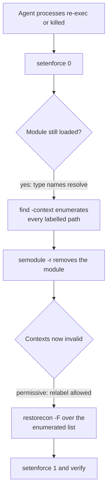

# Remove the custom SELinux policy - Plan

## Goal Capsule

- **Objective:** Agent configuration files on a managed Fedora host are ordinary user-owned files again — no custom SELinux type governs who may write them, and no label from the retired policy survives anywhere in the operator's home.
- **Means:** Delete the policy module and every repository surface that serves it, and hand the operator one manual teardown command instead of shipping teardown automation (KTD1, KTD2).
- **Authority hierarchy:** The R-IDs own what must be true after removal. The KTDs own the removal mechanism and the teardown ordering. `AGENTS.md` owns the standing repository rules the change must obey, including its no-teardown-scripts rule.
- **Stop conditions:** Stop and report if removing the label steps from the agent reconcilers cannot leave their remaining behavior intact, or if `.ci/test-ci-wiring.sh` cannot accept a CI gate being retired rather than added.
- **Execution profile:** Deletion and documentation change across repository surfaces. The proof is a green CI suite plus a rendered-script inspection, not a live SELinux reproduction — GitHub runners are not SELinux hosts.
- **Tail ownership:** The pipeline owns commit, push, PR, and CI. The operator owns the one-time host teardown, which no repository code performs.

---

## Product Contract

**Product Contract preservation:** unchanged. Planning added the Planning Contract and downstream sections only.

### Summary

Remove the custom SELinux Type Enforcement policy that protects agent configuration on Fedora hosts, along with its installer, its CI job and test, its documentation, and the label-repair steps other apply scripts carry only because the policy exists. The repository ships no teardown code; the operator runs one command once to clear the host.

### Problem Frame

The policy exists to make agent configuration write-locked: five object types, one writer domain each, so a harness cannot rewrite another harness's configuration and no unconfined process can rewrite any of it. Sustaining that boundary has turned out to cost more than the boundary returns.

The cost is spread rather than concentrated. The CIL module runs 392 lines and the CI test that guards it runs 784. Three unrelated apply scripts carry `restorecon` steps and diagnostic messages that exist only because a temp-file rename or a versioned upgrade strips a label the policy assigned. Two more CI tests stub `restorecon` and `stat` so those steps stay deterministic. Every policy change strands running agent sessions in the wrong domain and requires the operator to re-exec them, which is why `README.md` tells the operator to run applies from a plain shell. The label lives on the inode and only `chezmoi_t` holds `relabelfrom`, so ordinary repair tools cannot fix a mistake — an earlier revision leaked protected labels into the shared Bun cache and needed a dedicated reclaim sweep to recover.

The current host state shows the drift the mechanism accumulates on its own: `~/.claude/settings.json` and `~/.codex/config.toml` both carry `user_home_t` rather than the types their `filecon` declares, so parts of the boundary are already not in force.

### Key Decisions

- **The protection boundary is abandoned, not replaced.** (session-settled: user-directed — chosen over a lighter substitute such as file permissions or `chattr +i`: building a second mechanism would re-spend the effort the removal is meant to recover.) Governs R1, R9.
- **Host cleanup is a manual one-time command, not repository automation.** (session-settled: user-directed — chosen over letting the existing apply script converge the host before deleting itself: a self-converging script is a two-step commit sequence with temporary teardown code in the tree, which is the migration the request rules out.) Governs R5, R6, R7.
- **The teardown runs inside a temporary permissive window.** The protected types carry no base attribute, so no unconfined domain holds `relabelfrom` on them and `sudo` does not help; while the module is loaded `restorecon` re-applies the protected label instead of clearing it. Permissive mode is the only ordering that lets one command clear the labels without shipping code that runs as `chezmoi_t`. Governs R6, R7.

### Requirements

**Repository removal**

- R1. The repository contains no SELinux policy source for agent configuration protection, and no script that installs, relabels for, or reports on it.
- R2. The apply scripts that reconcile Claude Code settings, Codex settings, and Codex plugins carry no label-repair step, no label verification, and no operator message about SELinux labels or the policy module.
- R3. No CI job or test asserts anything about the policy, its types, its writer matrix, or the label steps removed by R2. Test fixtures that exist only to stub label tooling are removed with the assertions they serve.
- R4. `AGENTS.md` and `README.md` describe the repository as it is after removal: no protected types, no writer-domain split, no apply-from-a-plain-shell instruction motivated by the policy, and no post-apply audit-log check.

**Host teardown**

- R5. The removal change adds no executable teardown path to the repository — no script, no chezmoi target, no CI step, and no permanent documentation section whose purpose is one-time cleanup.
- R6. The teardown instruction is delivered to the operator with the removal change itself, as a command sequence they run once by hand.
- R7. The teardown instruction clears every label the retired policy applied anywhere under the operator's home, and its steps are ordered so that no step depends on a permission the retired policy granted only to `chezmoi_t`.
- R8. The teardown instruction tells the operator to re-exec any agent process that was running when the module was removed.

**Scope of the change**

- R9. `selinux_relabel` in the agent-of-empires profile is left as it is; it is that tool's own option and does not belong to the retired policy.
- R10. Historical plan documents under `docs/plans/` are left in place. The solutions document that describes the retired mechanism is resolved so that a future reader is not led to a boundary that no longer exists.

### Acceptance Examples

- AE1. Covers R1, R3. Given a clean checkout after the change, when the full CI suite runs, then it passes and no job, test file, or fixture named for or asserting SELinux policy behavior remains.
- AE2. Covers R2. Given a Fedora host where the module has already been removed, when `chezmoi apply` runs, then the Claude, Codex, and Codex-plugin reconcilers complete without emitting any label-related message and without invoking label tooling.
- AE3. Covers R6, R7. Given a host in enforcing mode carrying the retired labels, when the operator runs the delivered command sequence once, then `ls -Z` on `~/.agents/skills`, `~/.agents/plugins`, and `~/.gemini/config` reports `user_home_t`, `semodule -l` lists no `dotfiles_protected_agent_configs`, and SELinux is back in enforcing mode.
- AE4. Covers R7. Given the retired labels are still present, when the teardown is attempted with the module already removed and SELinux still enforcing, then the relabel is expected to fail — the instruction must not be ordered that way.

### Scope Boundaries

- No replacement protection mechanism of any kind, including file permissions, immutable bits, or a narrower policy module.
- No repository-side migration, teardown script, or one-shot converging apply.
- No change to how agent configuration is reconciled; only the label steps attached to that reconciliation are removed.
- No rewriting of historical plan documents.

#### Deferred to Follow-Up Work

- `.ci/lib/apt-install.sh` keeps two other callers in `.github/workflows/ci.yml`, so it stays. No cleanup follows from this change.
- `.chezmoitemplates/sudo-elevation-guard.sh.tmpl` and `.chezmoitemplates/fingerprint.tmpl` keep many other consumers. Neither becomes dead.

### Dependencies / Assumptions

- The managed Fedora host is the operator's own workstation and the operator can run `sudo` there. The teardown is not required to work unattended.
- Removing the policy restores the behavior every non-Fedora managed host already has, so no host loses a guarantee it currently relies on.
- Agent sessions started before the teardown continue running in a domain the policy defined; only a re-exec moves them.
- GitHub runners are not SELinux hosts, so CI proves the repository shape and the rendered scripts, never the runtime label behavior.

### Sources / Research

- `system/linux/selinux/dotfiles_protected_agent_configs.cil` — the module, its five types, and the reasoning comments for the writer split.
- `.chezmoiscripts/00-tools/run_onchange_before_00-selinux-policies.sh.tmpl` — installer, relabel set, stale-label reclaim sweep, and the stranded-process report.
- `.ci/test-selinux-protected-configs.sh` and the `selinux-policy` job in `.github/workflows/ci.yml` — the compiled-policy writer matrix and its expect-fail mutants.
- `.chezmoiscripts/70-agents/run_after_config-claude-settings.sh.tmpl`, `run_after_config-codex-settings.sh.tmpl`, `run_onchange_after_update-codex-plugins.sh.tmpl` — the label-repair steps that exist only for this policy.
- `.ci/test-codex-settings-reconcile.sh`, `.ci/test-claude-agy-plugin-reconcile.sh` — the `restorecon`/`stat` stubs and label assertions.
- `.ci/skip-declaration-site-matrix.yaml` — the declaration site registered for the policy script's elevation guard; `.ci/check-skip-declarations.sh` audits the matrix against the rendered sites, so entry and script retire together.
- `.ci/test-ci-wiring.sh` in the `repo meta` job — the gate that keeps a CI test from being written and wired nowhere.
- `AGENTS.md` and `README.md` — the standing narrative describing the boundary, and the no-teardown-scripts rule at `AGENTS.md` line 24.
- `docs/solutions/security-issues/selinux-user-scope-agent-config-protection.md` — the residual-risk record for the mechanism being retired.

---

## Planning Contract

### Key Technical Decisions

- KTD1. **Delete the policy source and installer outright; add nothing in their place.** Instantiates the abandon-the-boundary Key Decision (Governs R1, R9). `system/linux/selinux/` holds only this module, so the directory goes with it. (session-settled: user-directed — chosen over a lighter substitute such as file permissions or `chattr +i`: building a second mechanism would re-spend the effort the removal is meant to recover.)

- KTD2. **The teardown sequence lives in the removal commit's message body, and nowhere else in the tree.** Instantiates the manual-cleanup Key Decision (Governs R5, R6). The commit body travels with the change, is reachable from `git log` forever, and adds no file the repository must maintain. (session-settled: user-directed — chosen over keeping the apply script for one more cycle to converge the host: a self-converging script is temporary teardown code in the tree and a two-commit sequence, which is the migration the request rules out.)
  - **Conflict call-out:** `AGENTS.md` line 24 sanctions "document a one-time manual reversal", and `README.md` already carries a `Host steps for the Codex harness (one-time)` section that is exactly that shape. The settled decision rules out a permanent documentation section (R5), so the commit body is used instead. This is workable, not the repo's usual placement; a reviewer may prefer the README section.

- KTD3. **Order the teardown as enumerate, remove, relabel — inside a temporary permissive window.** Instantiates the permissive-window Key Decision (Governs R7). Two facts force this ordering. While the module is loaded, `restorecon` re-applies the protected `filecon` instead of clearing it, so relabelling cannot come first. After `semodule -r`, the protected types no longer resolve, so `find -context` can no longer enumerate by type name and the now-invalid contexts are not reachable by an unconfined domain's `relabelfrom` — so enumeration must come first and the relabel needs `setenforce 0`. Step 4 restores enforcing.

- KTD4. **Strip the label steps from the reconcilers without touching the write mechanics they sit beside.** Governs R2. `run_after_config-claude-settings.sh.tmpl` stages its replacement inside the target directory for a same-filesystem rename; that reason survives the policy, so the staging stays and only its label justification and the two `restorecon` calls go. The same applies to the Codex reconciler's temp-file cleanup and to the plugin updater's preflight.

- KTD5. **Retire the CI gate rather than neutering it.** Governs R3. `.ci/check-skip-declarations.sh` audits `.ci/skip-declaration-site-matrix.yaml` against the rendered declaration sites, so the matrix entry and the script it names must retire in the same change or the audit fails. `.ci/test-ci-wiring.sh` guards the inverse direction — a test wired nowhere — so the job block and its `needs:` entry go together with the test file.

- KTD6. **Mark the solutions document superseded; do not delete it.** Governs R10. It records real SELinux CIL mechanics and four separate incident post-mortems that outlive the policy. Retiring a learning outright is `ce-compound-refresh`'s call, not this change's.

### High-Level Technical Design

The teardown ordering is the only part of this change whose shape prose alone does not carry. The gate at each step is what the previous step made possible.

Reversing steps D and E loses the enumeration; running G under enforcing loses the relabel. AE4 pins the failing order.

### Sequencing

U1 through U3 are independent deletions and may land in any order. U4 and U5 describe what U1–U3 removed, so they follow. U6 composes the operator hand-off and depends on KTD3 only, not on the file changes.

---

## Implementation Units

### U1. Delete the policy module and its installer

- **Goal:** No SELinux policy source or installer remains in the repository.
- **Requirements:** R1. Covers AE1.
- **Dependencies:** none
- **Files:**
  - `system/linux/selinux/dotfiles_protected_agent_configs.cil` — delete
  - `system/linux/selinux/` — remove the directory, which holds nothing else
  - `.chezmoiscripts/00-tools/run_onchange_before_00-selinux-policies.sh.tmpl` — delete
- **Approach:** Straight deletion (KTD1). `system/README.md` documents `system/linux/etc/` only and needs no change. The `fingerprint.tmpl` glob `system/linux/selinux/**` lives inside the deleted script, so no other consumer loses an input.
- **Test scenarios:**
  - Covers AE1. A repository-wide search for `dotfiles_protected_agent_configs`, `protected_agent_config_t`, and `semodule` returns hits only under `docs/`.
- **Verification:** `system/linux/` contains only `etc/`, and `.chezmoiscripts/00-tools/` no longer holds a SELinux script.

### U2. Remove the label-repair steps from the agent reconcilers

- **Goal:** The three agent reconcilers run their normal work with no SELinux step and no SELinux message.
- **Requirements:** R2. Covers AE2.
- **Dependencies:** none
- **Files:**
  - `.chezmoiscripts/70-agents/run_after_config-claude-settings.sh.tmpl`
  - `.chezmoiscripts/70-agents/run_after_config-codex-settings.sh.tmpl`
  - `.chezmoiscripts/70-agents/run_onchange_after_update-codex-plugins.sh.tmpl`
- **Approach:** Per KTD4, remove only the label steps and the prose that motivates them.
  1. In the Claude settings reconciler, drop the `restorecon -F "$SETTINGS_DIR"` block that follows the `mkdir -p`, the `restorecon -F "$SETTINGS"` call after the write, and the comment clause explaining that `TMPDIR` staging would strip the label. Keep the in-directory staging and the same-filesystem rename.
  2. In the Codex settings reconciler, drop the `codex_labelled` array, the whole `restorecon` / `stat` loop, the `elif` branch that reports missing `restorecon`, and the `Label lifecycle:` comment paragraph. Keep the stale-temp-file sweep and the reconciler contract check.
  3. In the Codex plugin updater, drop the `restorecon -RF "$HOME/.agents/plugins"` preflight block with its comment, and the trailing `restorecon -F` on `config.toml` with its comment.
- **Test scenarios:**
  - Covers AE2. `.ci/test-claude-agy-plugin-reconcile.sh` passes against the rendered Codex updater with no `restorecon` needle and no relabel-ordering assertion.
  - Covers AE2. `.ci/test-codex-settings-reconcile.sh` passes with the label stubs gone and every other assertion — declared-leaf assertion, incompatible-contract report, stale-temp cleanup, dangling-symlink handling — unchanged.
  - A rendered Codex settings script emits nothing on stderr for a converged run, matching the existing silence assertion.
- **Verification:** The three rendered scripts contain no occurrence of `restorecon`, `setenforce`, `_config_t`, or `semodule`, and their remaining assertions in CI still pass.

### U3. Retire the SELinux CI job, test, and label assertions

- **Goal:** CI carries no SELinux gate and no label stubbing.
- **Requirements:** R3. Covers AE1, AE2.
- **Dependencies:** U1, U2
- **Files:**
  - `.ci/test-selinux-protected-configs.sh` — delete
  - `.github/workflows/ci.yml` — remove the `selinux-policy` job block and its entry in the aggregate job's `needs:` list
  - `.ci/skip-declaration-site-matrix.yaml` — remove the `run_onchange_before_00-selinux-policies.sh.tmpl#sudo-elevation-guard/no-elevation-path` entry
  - `.ci/test-claude-agy-plugin-reconcile.sh`
  - `.ci/test-codex-settings-reconcile.sh`
- **Approach:** Per KTD5, retire the gate and its matrix entry in one change so `.ci/check-skip-declarations.sh` and `.ci/test-ci-wiring.sh` stay satisfied from both directions.
  1. Delete the SELinux test file and its CI job, and drop `selinux-policy` from the aggregate `needs:` list.
  2. Remove the matrix entry naming the deleted script.
  3. In `.ci/test-claude-agy-plugin-reconcile.sh`, drop the `restorecon -RF "$HOME/.agents/plugins"` needle from the Codex updater needle list, the `restorecon` stub, and the three assertions that check relabel presence and ordering against `plugin add` and `plugin remove`. Rewrite the needle-list comment so it no longer explains a relabel line.
  4. In `.ci/test-codex-settings-reconcile.sh`, drop `make_label_bin`, the three `label_*` fixture directories, the `label_bin` parameter of `run()` and every call site that passes one, the label-reporting assertion block, and the `restorecon`-log assertions in the skills-symlink and dangling-symlink cases. Keep those two cases' non-label coverage — that a `CODEX_HOME` carrying a skills symlink neither fails the apply nor invents a notice.
- **Test scenarios:**
  - Covers AE1. The full CI suite passes with no `selinux-policy` job present.
  - Covers AE1. `.ci/test-ci-wiring.sh` passes, confirming no test file is wired nowhere and no job references a missing script.
  - `.ci/check-skip-declarations.sh` passes, confirming the matrix and the rendered declaration sites still agree.
  - Covers AE2. Both reconciler tests pass with their label fixtures removed and their remaining assertions intact.
- **Verification:** `rg -l 'selinux|restorecon|semodule|_config_t' .ci .github` returns nothing.

### U4. Update AGENTS.md and README.md

- **Goal:** The repository's standing narrative describes no protection boundary.
- **Requirements:** R4
- **Dependencies:** U1, U2, U3
- **Files:**
  - `AGENTS.md`
  - `README.md`
- **Approach:** Remove the paragraphs that exist only to explain the policy, and trim the clauses inside surviving paragraphs that lean on it.
  1. `AGENTS.md`: delete the five SELinux paragraphs — the five-types writer split, the tokscale-runs-unconfined note, the upgrade-breaks-a-filecon-entrypoint note, the `file_type`-attribute note with its stranded-session warning, and the domain-transitions note.
  2. `AGENTS.md`: rewrite the `00-tools` responsibility cell so it no longer opens with SELinux policy compilation and entrypoint relabelling.
  3. `AGENTS.md`: trim the SELinux clauses inside the paragraphs that survive — the `~/.claude/settings.json` writer-domain clause, the `~/.claude.json` "the SELinux label is what protects it now" clause, and the Codex settings reconciler's label-restoration clause.
  4. `README.md`: delete the `SELinux Type Enforcement` bullet, delete the Fedora run-from-a-plain-shell bullet in `Host steps for the Codex harness (one-time)` and correct that section's "Three steps" count, and trim the audit-log check for `protected_agent_config_t` / `protected_agent_plugins_t` from the remaining Codex bullet while keeping its `codex mcp list` secret-handling warning.
- **Test scenarios:** Test expectation: none — documentation prose with no executable assertion. The repository-wide search in U6's verification covers residual mentions.
- **Verification:** Neither file mentions a protected type, a writer domain, or the policy module, and every surviving sentence reads correctly without the removed ones.

### U5. Mark the solutions document superseded

- **Goal:** A future reader of the learnings store is not led to a boundary that no longer exists.
- **Requirements:** R10
- **Dependencies:** U1
- **Files:**
  - `docs/solutions/security-issues/selinux-user-scope-agent-config-protection.md`
- **Approach:** Per KTD6, add a short superseded note directly under the H1, before `## Problem`: the policy was removed on 2026-09-07, the document is kept for its SELinux CIL mechanics and incident record, and nothing in it describes current repository behavior. Set `last_updated` to the change date. Leave the body untouched — resolving in place means marking the document's status, not rewriting four post-mortems.
- **Test scenarios:** Test expectation: none — a documentation status note with no executable assertion.
- **Verification:** The note is the first thing after the H1, and the frontmatter `last_updated` matches the change date.

### U6. Compose the one-time host teardown instruction

- **Goal:** The operator receives, with the change itself, an ordered command sequence that clears the host.
- **Requirements:** R5, R6, R7, R8. Covers AE3, AE4.
- **Dependencies:** none
- **Files:** none — the deliverable is text in the removal commit's message body, which the shipping step also renders into the PR description (KTD2).
- **Approach:** Compose the sequence in the order KTD3 fixes, with each step's reason stated so the operator does not reorder it.
  1. Land this change and run `chezmoi apply` first, so the source no longer carries the installer. Tearing down before the apply leaves the old `run_onchange_before_00-selinux-policies` script able to reinstall the module on the next apply, undoing the whole sequence.
  2. Re-exec or exit every running `claude`, `agy`, `aoe`, and `codex` process, and kill the systemd-parented `claude daemon run` process explicitly — closing its terminal does not stop it.
  3. `sudo setenforce 0`, then enumerate with `find "$HOME" -xdev` matching `-context` against all five protected types and all five `*_exec_t` types, writing a NUL-separated list to a scratch file. The module must still be loaded here or the type names no longer resolve.
  4. `sudo semodule -X 400 -r dotfiles_protected_agent_configs`.
  5. `sudo restorecon -F` over the enumerated list via `xargs -0`, plus an explicit pass over `/usr/bin/chezmoi` and `/usr/local/bin/chezmoi`, which sit outside the `-xdev` walk of `$HOME`.
  6. `sudo setenforce 1`, then verify: `ls -Zd` on `~/.agents/skills`, `~/.agents/plugins`, and `~/.gemini/config` reports `user_home_t`, and `sudo semodule -l` no longer lists the module. Delete the scratch file.

  Note two conditions with the sequence: `find -context` needs findutils built with SELinux support, and the permissive window leaves the whole host unconfined for its duration, so it should be kept to the seconds the commands take.
- **Test scenarios:**
  - Covers AE3. The written sequence, read end to end, produces `user_home_t` on the three verification paths, no module in `semodule -l`, and enforcing mode restored.
  - Covers AE4. The written sequence never places `semodule -r` before the enumeration, and never places the relabel under enforcing mode.
- **Verification:** The removal commit's body carries the numbered sequence with its ordering reasons, and the repository contains no file that performs any of it.

---

## Verification Contract

| Gate | Command | Proves |
|---|---|---|
| Codex plugin reconciler | `.ci/test-claude-agy-plugin-reconcile.sh` against the rendered updaters | U2, U3 — the updater works with no relabel step and no relabel assertion |
| Codex settings reconciler | `.ci/test-codex-settings-reconcile.sh <rendered codex-settings.sh>` (needs `bun install` in `packages/`) | U2, U3 — the settings reconciler works with the label stubs removed |
| CI wiring | `.ci/test-ci-wiring.sh` | U3 — no test is wired nowhere and no job names a missing script |
| Skip declarations | `.ci/check-skip-declarations.sh` | U3 — the site matrix and the rendered declaration sites still agree |
| Full suite | the GitHub Actions `CI` workflow on the PR | AE1 — every job green with no `selinux-policy` job present |
| Residual mentions | `rg -ni --hidden 'selinux\|restorecon\|semodule\|_config_t\|protected_agent' --glob '!docs/**' --glob '!.git/**'` (`--hidden` is required: `.ci/`, `.github/` and `.chezmoiscripts/` are dot-directories `rg` skips by default) | R1–R4 — the only surviving hits are the unrelated `restorecon` calls in the swap/hibernate installer, the `SELinux` prose in `dot_config/environment.d/65-containers.conf`, `selinux_relabel` in the aoe profile (R9), and the frozen-totals derivation comment in `.ci/skip-declaration-site-matrix.yaml` that records this removal's instance-count delta |

Runtime label behavior is not verifiable in CI — GitHub runners are not SELinux hosts. AE2 and AE3 are proven on the operator's host, after the teardown.

---

## Definition of Done

**Global**

- Every requirement R1 through R10 holds against the working tree.
- The full CI workflow is green on the PR.
- The residual-mention search returns only the four sanctioned survivors named in the Verification Contract.
- The removal commit's body carries the U6 teardown sequence.
- No abandoned or experimental code from this run remains in the diff.

**Per unit**

| Unit | Done when |
|---|---|
| U1 | `system/linux/` holds only `etc/`, and no SELinux script remains in `.chezmoiscripts/00-tools/` |
| U2 | The three rendered reconcilers contain no `restorecon`, `setenforce`, `semodule`, or `_config_t` |
| U3 | `.ci/` and `.github/` contain no SELinux reference, and both reconciler tests plus the wiring and skip-declaration gates pass |
| U4 | `AGENTS.md` and `README.md` describe no protected type or writer domain, and every surviving sentence reads correctly |
| U5 | The solutions document opens with its superseded note and carries a matching `last_updated` |
| U6 | The commit body carries the ordered sequence with its ordering reasons, and no repository file performs any of it |
