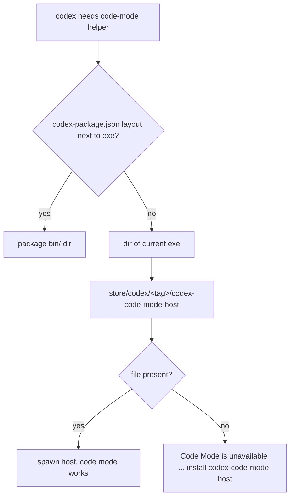
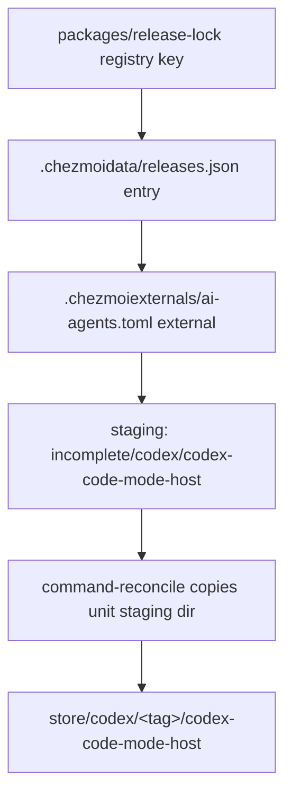

# Codex Code Mode Host Delivery - Plan

## Goal Capsule

- **Objective:** Codex edits code on this host without failing. A Codex session that uses code mode completes its file edits instead of stopping with "Code Mode is unavailable".
- **Means:** Deliver the upstream `codex-code-mode-host` binary as a sibling of the managed `codex` binary in the same command-store unit (KTD1).
- **Authority:** This plan's Requirements govern behavior. The repository supplement `AGENTS.md` governs source-state rules, single-source-of-truth data files, and verification. Where they disagree on repository mechanics, `AGENTS.md` wins.
- **Execution profile:** Source-state edits in this checkout only. Do not run `chezmoi apply` against the live `$HOME` unless the user asks for deployment.
- **Stop conditions:** Stop and report if the release lock cannot be refreshed for the new tool key, or if `codex` and `codex-code-mode-host` cannot be locked to the same upstream tag.
- **Tail ownership:** The caller owns commit, push, PR, and CI watch.

---

## Product Contract

### Summary

Add `codex-code-mode-host` to the managed Codex command unit. The release lock gains a second `openai/codex` tool key, a new chezmoi external stages the helper binary next to `codex` in the same unit staging directory, and the command manifest and reconciler are widened so a unit may carry more than one native binary without losing its prune proof or its SELinux labelling.

### Problem Frame

Codex resolves its code-mode helper by looking for `codex-code-mode-host` next to its own executable. Upstream publishes that helper as its own release asset in every `rust-v*` release, alongside the `codex` asset this repository already consumes. The `codex` external in `.chezmoiexternals/ai-agents.toml` extracts only `codex-<rust arch>-<rust target>.tar.gz`, so the helper never lands on disk. The host has `features.code_mode_host` enabled, so Codex reaches the code-mode path and then fails there.

### Requirements

**Delivery**

- R1. The managed Codex command unit contains `codex-code-mode-host` in the same directory as the `codex` binary it is paired with.
- R2. `codex-code-mode-host` resolves from the same repository and tag train as `codex`, so both lock keys carry the same upstream tag under normal refresh. No render-time comparison enforces this.
- R3. The helper binary is not published as a public command on `PATH`.

**Command-manifest contract**

- R4. The command manifest expresses a unit that carries more than one native binary, and such a unit stays prune-eligible.
- R5. The prune in-use proof covers every file in a store generation, not only the files declared as public commands.

**Convergence**

- R6. An apply on a host whose `codex` store generation already exists adds the missing helper to that generation without a version bump.
- R7. Repairing an existing generation never rewrites a file that is already present in it.

**Labelling**

- R8. On a Fedora host with SELinux enforcing, the helper binary carries the same `codex_exec_t` type as its sibling `codex` binary.

### Scope Boundaries

- The `codex-package-*.tar.gz` bundle, and the bundled `rg`, `bwrap`, and `zsh` it carries, stay out of scope (KTD1).
- Codex configuration (`~/.codex/config.toml`, feature flags) is unchanged. `features.code_mode_host` is already enabled on this host.
- The `codex-wrapper` unit and the `tokscale` headless path are unchanged.

#### Deferred to Follow-Up Work

- Teaching `packages/release-lock` to resolve several assets under one tool key, which would make the shared tag structural rather than assumed.

---

## Planning Contract

### Key Technical Decisions

- KTD1. **Deliver the helper as a sibling binary, not by switching to the `codex-package` archive.** Codex's `code_mode_host_program_from_exe` falls back to `<dir of current exe>/codex-code-mode-host` when no `codex-package.json` layout is found, so a plain sibling is a supported resolution path. The `codex-package-*.tar.gz` bundle would instead impose a `bin/`, `codex-resources/`, `codex-path/` tree, move the entrypoint to `bin/codex`, add bundled `rg`, `bwrap`, and `zsh` that change sandbox behavior, and force a new SELinux filecon shape. Chosen over the package archive: far smaller blast radius for the same outcome.
- KTD2. **A second release-lock tool key, `codex-code-mode-host`, with no render-time version guard.** `packages/release-lock` resolves one asset per tool per platform, so the helper needs its own registry entry against `openai/codex` with `tagPrefix: rust-v`. The two keys resolve independently, but both read the same repository and tag train, so a skew would need one source to fail mid-refresh and would be corrected by the next hourly run. (session-settled: user-directed — chosen over a render-time comparison that fails the whole render on a version skew: a template abort cannot be scoped to one external, so a transient lock skew would block every host's apply.) Extending the registry to multi-asset entries is deferred: one consumer does not justify a new resolver shape.
- KTD3. **New safety profile `native-multi-file`, proof-eligible.** The Codex unit now holds two native ELF binaries, so `native-single-file` is false for it. `multi-file` is not proof-eligible, and a non-prunable Codex unit would retain roughly 330 MB per superseded generation. `native-multi-file` states what is true — every file in the unit is a native executable, so a `/proc` exe-inode proof is meaningful — and keeps prune eligibility. (session-settled: user-directed — chosen over leaving the Codex unit on `native-single-file`: the recursive prune proof in KTD4 already restores safety, so the profile buys accuracy rather than function, and the accurate name was preferred.)
- KTD4. **Widen the prune in-use proof to a recursive walk of the version directory.** `pruneEligibleUnits` currently checks only declared command paths, so an undeclared sibling binary would be invisible to the proof. `cleanupQuarantine` in the same file already walks recursively; aligning the two makes the proof cover R5 and removes the safety reason to declare the helper as a public command (R3).
- KTD5. **Repair an already-complete store generation by copying only its missing entries.** `ensureCompletedUnit` returns early on the `.complete` marker, so the existing `store/codex/<tag>/` would never gain the helper until the next Codex release. The repair compares the staging directory's top-level entries against the generation's and copies only what is absent, which also satisfies R7 — re-copying `codex` over a running process would fail with `ETXTBSY`. (session-settled: user-directed — chosen over folding the staged file set into the generation key so a changed unit shape yields a new generation: the repair converges without waiting for the next Codex release and self-heals future unit-shape changes, at the cost of relaxing the finality of a completion-marked generation.)

### Assumptions

- The hourly `refresh-release-lock.yml` job keeps both `openai/codex` keys on the same tag. Nothing in this repository enforces it, so a skew installs a mismatched pair until the next refresh corrects it (KTD2).
- `codex-code-mode-host` ships an asset for every platform the `codex` key targets (`linux-amd64`, `linux-arm64`, `darwin-amd64`, `darwin-arm64`). A missing asset is a hard resolution error by the lock's existing strictness rule.

### High-Level Technical Design

Resolution path Codex takes when it needs the helper, and where this plan places the file:

Delivery chain for the new file:

### Sources / Research

- `codex-rs/install-context/src/lib.rs` in `openai/codex` at `rust-v0.153.4` — `code_mode_host_program_from_exe` and `CodexPackageLayout::from_exe` define the sibling fallback KTD1 relies on.
- `scripts/codex_package/layout.py` in the same tree — the `codex-package` layout KTD1 rejects.
- `packages/command-reconcile/src/producer.ts` — `ensureCompletedUnit`; the directory staging path already copies recursively, and the `.complete` early return is what KTD5 addresses.
- `packages/command-reconcile/src/prune.ts` — `pruneEligibleUnits` (declared-commands proof) versus `cleanupQuarantine` (recursive walk); KTD4 aligns them.
- `.chezmoitemplates/command-manifest.tmpl` — external units already stage into the unit **directory** `.local/share/chezmoi-commands/incomplete/<unitId>`, which is why a second external needs no producer change.
- `system/linux/selinux/dotfiles_protected_agent_configs.cil` — the `HOME_DIR/\.local/lib/commands/store/codex/[^/]+/codex` filecon and the `chezmoi_t gconf_home_t file "codex"` name transition that R8 extends.

---

## Implementation Units

### U1. Lock the code-mode helper release asset

- **Goal:** `.chezmoidata/releases.json` carries a `codex-code-mode-host` tool entry with per-platform URLs and sha256 digests at the same tag as `codex`.
- **Requirements:** R2
- **Dependencies:** none
- **Files:** `packages/release-lock/src/registry.ts`, `packages/release-lock/test/registry.test.ts`, `.chezmoidata/releases.json`
- **Approach:**
  1. Add a `"codex-code-mode-host"` registry entry next to `codex`: `kind: "githubRelease"`, `source: "openai/codex"`, `tagPrefix: "rust-v"`, and an `asset` selector composing `codex-code-mode-host-<rustArch>-<muslTarget>.tar.gz` with the same helpers the `codex` selector uses.
  2. Add the matching `EXPECTED` row to `registry.test.ts` covering exactly the four non-musl platforms.
  3. Refresh the lock through the package CLI rather than hand-editing it, per `AGENTS.md`. The CLI resolves every registered tool in one run and reads a GitHub token from the environment (`CHEZMOI_GITHUB_ACCESS_TOKEN`, `GITHUB_ACCESS_TOKEN`, or `GITHUB_TOKEN`); without one the run is rate-limited and fails on unrelated tools, so export a token from the local `gh` login before running it.
  4. Write the refreshed result to a scratch path with `--out`, then take only the new `codex-code-mode-host` entry into the committed lock. If that entry's version differs from the committed `codex` entry, take the refreshed `codex` entry too so the pair moves together.
- **Patterns to follow:** the `codex`, `aoe`, and `codegraph` entries in `packages/release-lock/src/registry.ts`; the `EXPECTED` table shape in `packages/release-lock/test/registry.test.ts`.
- **Test scenarios:**
  - The selector returns `codex-code-mode-host-x86_64-unknown-linux-musl.tar.gz` for `linux-amd64`.
  - The selector returns `codex-code-mode-host-aarch64-apple-darwin.tar.gz` for `darwin-arm64`.
  - The `EXPECTED` row covers exactly the platforms the spec targets, so the existing "covers exactly the spec's target platforms" assertion passes.
- **Verification:** `vp run -r test` passes in `packages/`, and `.ci/check-release-lock-digests.sh` accepts the new lock entry (every artifact carries a digest and no URL contains a `latest` path segment).

### U2. Add the `native-multi-file` safety profile

- **Goal:** The command manifest can declare a prune-eligible unit that holds more than one native binary, and the Codex unit uses it.
- **Requirements:** R4
- **Dependencies:** none
- **Files:** `.chezmoidata/commands.yaml`, `.chezmoitemplates/command-manifest-validate.tmpl`, `packages/command-reconcile/src/manifest.ts`, `.ci/test-command-manifest.sh`
- **Approach:**
  1. Add `native-multi-file` to `commands.authority.safetyProfiles`.
  2. In the validator, treat `native-multi-file` like `native-single-file` for the proof rules: it must carry `proofEligible: true`, and the "cannot have proofEligible" rule applies only to the remaining profiles.
  3. Extend the `SafetyProfile` union and its runtime check in `manifest.ts`.
  4. Change the `codex` unit's `safetyProfile` to `native-multi-file`, keeping `proofEligible: true` and its single `codex-bin` command entry (R3 — do not add a public command for the helper).
- **Patterns to follow:** the existing profile branches in `.chezmoitemplates/command-manifest-validate.tmpl` and the union in `packages/command-reconcile/src/manifest.ts`.
- **Test scenarios:**
  - A unit with `safetyProfile: native-multi-file` and `proofEligible: true` renders without error.
  - A unit with `safetyProfile: native-multi-file` and `proofEligible: false` fails the render with the profile named.
  - `manifest.ts` still rejects an unknown profile string.
- **Verification:** `.ci/test-command-manifest.sh` passes, including a new rejection case for the profile/proof mismatch, and `vp run -r test` passes in `packages/`.

### U3. Repair incomplete store generations and widen the prune proof

- **Goal:** An existing store generation gains files added to its unit, and prune's in-use proof sees every file in a generation.
- **Requirements:** R5, R6, R7
- **Dependencies:** none
- **Files:** `packages/command-reconcile/src/producer.ts`, `packages/command-reconcile/src/prune.ts`, `packages/command-reconcile/test/reconcile.test.ts`, `packages/command-reconcile/test/prune.test.ts`
- **Approach:**
  1. In `ensureCompletedUnit`, when the target generation is already completion-marked, look for the staging path. A missing or unreadable staging path keeps today's behavior — accept the generation as complete and return — so a reconcile run whose externals were not refreshed that pass does not start failing.
  2. When the staging path is present and is a directory, compare its top-level entries against the generation's. Copy only the entries the generation lacks, preserving each entry's mode, then rewrite the completion marker. Never overwrite an entry that is already present (R7).
  3. Leave the file-staging branch (`producer: source`) and the secret and mutable-tree branches untouched.
  4. In `pruneEligibleUnits`, replace the declared-command loop in both the pre-quarantine and post-quarantine in-use checks with a recursive walk of the version directory, matching the walk `cleanupQuarantine` already performs.
- **Execution note:** Cover the repair path with a failing test first — an existing marked generation missing one staged file — because the current early return makes the bug invisible otherwise.
- **Patterns to follow:** the recursive `readdir(qPath, { recursive: true })` walk in `cleanupQuarantine` within `packages/command-reconcile/src/prune.ts`.
- **Test scenarios:**
  - A completion-marked generation missing one staged entry gains that entry on the next call, and the marker is rewritten.
  - A repaired entry keeps its executable mode, so the copied helper is still spawnable.
  - A completion-marked generation whose staging path is absent is accepted as complete and returns without error.
  - A completion-marked generation that already holds every staged entry is left byte-identical and reports `changed: false`.
  - A repair does not rewrite an entry already present in the generation.
  - A unit whose staging path is a file (`producer: source`) keeps its existing per-command copy behavior.
  - Prune retains a superseded generation when a running process holds an undeclared file inside it.
  - Prune still removes a superseded generation that no running process holds.
- **Verification:** `vp run -r test` passes in `packages/`, `.ci/test-command-reconcile-apply.sh` and `.ci/test-command-reconcile-process.sh` pass, and the new retention test fails against the pre-change prune.

### U4. Stage the code-mode helper next to the Codex binary

- **Goal:** `chezmoi` fetches `codex-code-mode-host` into the Codex unit's staging directory, next to the `codex` binary.
- **Requirements:** R1, R2
- **Dependencies:** U1, U2, U3
- **Files:** `.chezmoiexternals/ai-agents.toml`
- **Approach:**
  1. Add a `[codex-code-mode-host]` external mirroring the `[codex]` block: `type = "archive-file"`, `executable = true`, `targetPath = '.local/share/chezmoi-commands/incomplete/codex/codex-code-mode-host'`, and `path` composed as `codex-code-mode-host-<rustArch>-<rustTarget>` from the same two template variables the `codex` block already computes.
  2. Add the matching `[codex-code-mode-host.checksum]` block reading `sha256` for platform `auto`.
- **Patterns to follow:** the `[codex]` and `[codex.checksum]` blocks immediately above; reuse `$codexRustArch` and `$codexRustTarget` rather than recomputing them.
- **Test scenarios:**
  - Rendering the externals file for `linux/amd64` emits a `codex-code-mode-host` target under `.local/share/chezmoi-commands/incomplete/codex/`.
  - Rendering for `darwin/arm64` emits the `apple-darwin` archive path.
  - The rendered `url`, `path`, and `sha256` for each platform match the values the lock records for that platform.
- **Verification:** `.ci/test-command-external-render.sh` passes, and rendering `.chezmoiexternals/ai-agents.toml` with `chezmoi execute-template --source "$PWD"` for each target platform produces the expected `url`, `path`, and `sha256` triple.

### U5. Label the code-mode helper binary

- **Goal:** The helper binary carries `codex_exec_t`, like its sibling `codex` binary.
- **Requirements:** R8
- **Dependencies:** U4
- **Files:** `system/linux/selinux/dotfiles_protected_agent_configs.cil`, `.ci/test-selinux-protected-configs.sh`
- **Approach:**
  1. Add a `filecon` for `HOME_DIR/\.local/lib/commands/store/codex/[^/]+/codex-code-mode-host` resolving to `codex_exec_t`, next to the existing `codex` filecon.
  2. Add the matching `typetransition chezmoi_t gconf_home_t file "codex-code-mode-host" codex_exec_t` next to the existing `codex` name transition, so a reconciler-created file is labelled without waiting for `restorecon`.
  3. Add both literals to the assertion list in `.ci/test-selinux-protected-configs.sh`.
- **Patterns to follow:** the `codex` filecon and name transition already in the module, and the comment above them explaining why the wrapper store stays unlabelled.
- **Test scenarios:**
  - The compiled module contains the new filecon and the new name transition.
  - The existing `codex` filecon and the unlabelled `codex-wrapper` store are unchanged.
- **Verification:** `.ci/test-selinux-protected-configs.sh` passes, including the two new assertions, and the module still compiles under `secilc`.

---

## Verification Contract

| Gate | Command | Applies to |
|---|---|---|
| Package tests | `vp run -r build`, `vp run -r typecheck`, `vp run -r test` in `packages/` | U1, U2, U3 |
| Command manifest | `.ci/test-command-manifest.sh` | U2 |
| External render | `.ci/test-command-external-render.sh` | U4 |
| Reconciler behavior | `.ci/test-command-reconcile-apply.sh`, `.ci/test-command-reconcile-process.sh` | U2, U3 |
| Release lock | `.ci/check-release-lock-digests.sh`, `.ci/test-release-lock-digest-gate.sh` | U1 |
| SELinux module | `.ci/test-selinux-protected-configs.sh` | U5 |
| Source-state render | `chezmoi execute-template --source "$PWD"` over each changed template, per the `AGENTS.md` scratch-directory recipe | U4 |
| Repository hygiene | `git diff --check`, `git status`, diff limited to the units above | all |

Runtime proof is deployment-gated: it needs an apply against the live `$HOME`, which `AGENTS.md` reserves for an explicit user request. When the user asks for it, the proof is that `~/.local/lib/commands/store/codex/<tag>/` holds both `codex` and `codex-code-mode-host`, that `~/.local/bin/` gains no `codex-code-mode-host` entry, and that a Codex code-mode edit completes instead of reporting "Code Mode is unavailable".

---

## Definition of Done

**Global**

- Every requirement R1 through R8 is implemented and covered by a gate in the Verification Contract.
- The release lock was regenerated through `packages/release-lock`, never hand-edited, and its diff is limited to the `openai/codex` keys.
- No public command named `codex-code-mode-host` appears in `.chezmoidata/commands.yaml`.
- No abandoned or experimental code remains in the diff.
- The change stays inside the files named by U1 through U5.

**Per unit**

| Unit | Done signal |
|---|---|
| U1 | `.chezmoidata/releases.json` holds a `codex-code-mode-host` entry with four platform artifacts, each carrying a sha256, at the same version as the `codex` entry. |
| U2 | `.chezmoidata/commands.yaml` declares the Codex unit as `native-multi-file` with `proofEligible: true`, and the validator rejects that profile without proof eligibility. |
| U3 | An existing completion-marked generation gains a newly staged file without rewriting the files it already holds, and prune retains a generation held only through an undeclared file. |
| U4 | Rendering the externals for each target platform emits a `codex-code-mode-host` staging target in the Codex unit directory with the archive path and digest the lock records. |
| U5 | The SELinux module labels the helper `codex_exec_t` and the CI assertion list covers it. |
