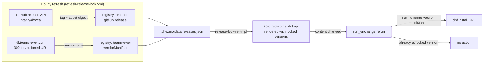

# Chezmoi-Managed Orca Desktop RPM - Plan

## Goal Capsule

**Objective.** On a Fedora host, `chezmoi apply` leaves the Orca IDE desktop application installed at the version the repository has locked, and every lock refresh re-pins it to the newly locked version. The same guarantee holds for every application the repository installs from a vendor RPM that has no signed repository, so no such application can sit silently stale.

**Means.** Install those RPMs from URLs the release lock records or that the script composes from a locked version, through one new `30-components` reconciler, and move TeamViewer onto it (KTD1, KTD4).

**Authority.** Product behavior is owned by the R-IDs below. Implementation mechanism is owned by the KTDs. `AGENTS.md` and `STRATEGY.md` are the repository authorities this plan binds to; where a KTD departs from a stated convention it says so and names the reason.

**Stop conditions.** Stop and report rather than working around: the Orca release stops publishing an x86_64 RPM asset; `.ci/check-release-lock-digests.sh` rejects either new lock entry; the Orca RPM proves to be unsigned in a way that would require a blanket `--nogpgcheck` (KTD6 forbids it).

**Execution profile.** Packaging and provisioning work. Unit coverage belongs to the release-lock TypeScript units; the chezmoi units are proved by rendered-template comparison and a real apply, per the Verification Contract.

**Tail ownership.** This plan ends at a merged change. Cleaning the AppImage leftovers on the current host is a manual step recorded under Dependencies and Assumptions, not a unit.

**Product Contract preservation.** Restructured, no scope change: R9 now states the intent it always carried (the recorded value changes only when the vendor publishes a new version) instead of naming an artifact shape that KTD2 resolves differently. Every other R-ID and AE-ID is unchanged.

---

## Product Contract

### Summary

Promote the Orca IDE desktop application to a chezmoi-managed target. A new script entry installs vendor RPMs from URLs the release lock records or that the script composes from a locked version, and reinstalls when a locked version changes. TeamViewer moves onto the same entry, replacing an install-once guard that never upgrades.

### Problem Frame

Orca IDE is installed by hand today: an AppImage downloaded to the user's Downloads folder, which the application then unpacks into `~/.cache/orca/appimage/` and wires into `~/.local/bin` itself. Nothing about that survives a rebuild, and nothing records which version a host is on. Meanwhile the repository already locks eight Orca agent skills from the same `stablyai/orca` release train, so the skills are reproducible while the application they drive is not.

The repository has one existing direct-RPM install, and it demonstrates the failure this plan prevents. In `.chezmoiscripts/30-components/run_onchange_before_70-apps.sh.tmpl:98-109`, TeamViewer installs from a rolling unversioned URL behind an `rpm -q` guard, with `|| true` on the install. The guard means the package is installed once and never upgraded; the `|| true` means a failed install leaves no trace. The repository's own prior audit named this as an unpinned surface (`docs/ideation/2026-08-13-open-ideation.html:817`).

Upstream is aware of the packaging gap and plans a signed apt/yum repository (`stablyai/orca#18086`), but it does not exist yet.

### Key Decisions

- **Install the vendor RPM from a release-lock-recorded URL rather than adding a yum repository** (session-settled: user-directed — chosen over AppImage placement under `~/.local/share` with a templated desktop entry: upstream publishes no signed repository, and lock-driven reproducibility outranks repository-driven auto-update). Governs R1, R2.
- **chezmoi is the single owner of the installed version** (session-settled: user-directed — chosen over letting the application self-update after a chezmoi bootstrap: a reproducible version is worth the lag between an upstream release and a lock refresh). Governs R6, R7, R14.
- **A locked-version change is the only update trigger** (session-settled: user-directed — chosen over verifying the installed version on every apply: the rendered script already changes when the lock changes, and drift takes a deliberate sudo action to create). Governs R3, R9, R14.
- **Failures abort the apply** (session-settled: user-directed — chosen over warn-and-continue: swallowing failures via `|| true` is the specific defect being removed from the TeamViewer path). Governs R4.
- **Desktop integration stays with the package** (session-settled: user-directed — chosen over a user-level override in `dot_local/share/applications/`: the RPM ships the entry, icon, and MIME registration). Governs R12.
- **The `orca` command name is left to upstream** (session-settled: user-directed — chosen over shadowing `/usr/bin/orca` from `~/.local/bin`: upstream resolved the GNOME screen-reader collision deliberately, and shadowing would reintroduce `stablyai/orca#7904`). Governs R13.

### Requirements

**Packaging and install**

- R1. On Fedora hosts, Orca IDE is installed from the upstream release RPM at the URL the release lock records. No package repository is configured for it.
- R2. A dedicated script entry owns direct-RPM installs, separate from the repository-backed package install in `.chezmoiscripts/30-components/run_onchange_before_70-apps.sh.tmpl`.
- R3. The entry reinstalls a package whenever that package's locked version changes, so a refreshed lock produces an updated install on the next `chezmoi apply`.
- R4. A failed install or upgrade aborts `chezmoi apply` and names the package and URL that failed. No failure path is swallowed.
- R5. The entry runs under the repository's existing shared-host and sudo-elevation guards, and is skipped wherever those guards already skip package installation.

**Update ownership**

- R6. Orca IDE never replaces the locked build on its own. Installing from the RPM is what supplies this: the bundle's `resources/package-type` marker reads `rpm`, which makes the application's updater non-automatic by construction. The repository adds no separate disable switch and does not suppress the application's update prompt.
- R7. After an apply that installs Orca IDE, the installed version matches the version of the `stablyai/orca` agent skills the repository locks in `.chezmoidata/agents.yaml`. A version installed out of band above the lock is the exception R14 governs.
- R14. A version installed out of band — through the application's update prompt, which requires the user to run a sudo package-manager command — is not reverted. The next lock refresh re-pins the host (per R3).

**Lock resolution**

- R8. The release lock records an Orca IDE RPM artifact, resolved from the same `stablyai/orca` release train the skills resolve from.
- R9. The release lock records TeamViewer's version, resolved from the vendor's rolling download URL, so the locked value changes only when the vendor publishes a new version.

**TeamViewer migration**

- R10. TeamViewer moves out of the `install_direct_rpms` block in the 70-apps entry into the new direct-RPM entry, and its install-once `rpm -q` guard is removed.
- R11. TeamViewer upgrades on the same locked-version-change rule as Orca IDE (per R3).

**Boundaries with the application's own provisioning**

- R12. The repository installs no user-level desktop entry, icon, or MIME registration for Orca IDE. The RPM's system-wide files are authoritative.
- R13. The repository places no `orca` command on PATH and manages neither the application's CLI shim directory nor the `~/.local/bin/orca-ide` symlink it creates. Whatever shell command Orca registers for itself is left alone.

### Acceptance Examples

- AE1. **Covers R3, R4.** **Given** a host with the locked Orca IDE version installed, **when** the lock is refreshed to a newer version and `chezmoi apply` runs, **then** the newer RPM is installed. **And when** that URL is unreachable, **then** the apply fails and names the package and URL.
- AE2. **Covers R6.** **Given** a host where apply has installed the locked build, **when** Orca IDE is launched and left running, **then** it installs no different build without an explicit user-run package-manager command, and the installed version still matches the lock afterwards.
- AE3. **Covers R10, R11.** **Given** a host carrying the old install-once TeamViewer at a version below the lock, **when** `chezmoi apply` runs, **then** TeamViewer is upgraded to the locked version.
- AE4. **Covers R12, R13.** **Given** a completed apply, **when** the desktop menu is inspected, **then** exactly one Orca entry is present and it comes from the RPM. **And when** `orca` is run in a plain login shell outside Orca, **then** it resolves to the GNOME screen reader, unchanged by this work.
- AE5. **Covers R3, R14.** **Given** a host where the user accepted the application's update prompt and installed a version above the lock, **when** `chezmoi apply` runs against an unchanged lock, **then** nothing is reinstalled. **And when** the lock is later refreshed, **then** the host is re-pinned to the newly locked version.

### Scope Boundaries

- Desktop integration is left to the package, per R12. The original request to register the application under `dot_local/share/applications/` is dropped, since the RPM supplies those files.
- The `orca` command name is left to upstream, per R13. The GNOME screen-reader package is untouched.
- No cleanup logic for the existing AppImage installation. That is a one-time manual step on this host, recorded under Dependencies and Assumptions.
- No migration of aoe-managed workspaces to Orca.
- No change to the repository-backed package installs in the 70-apps entry beyond removing TeamViewer from it.

#### Deferred to Follow-Up Work

- Extracting the direct-RPM set into a `.chezmoidata` file. `STRATEGY.md` asks for decisions as data with a dumb reconciler, but `30-components` package lists live inline in their scripts today (`app_packages` in the 70-apps entry). KTD1 follows the local convention; moving both surfaces to data is its own change.
- Migrating this entry to the repository-backed yum pattern once upstream ships the signed repository tracked in `stablyai/orca#18086`.

### Open Questions

**Deferred to planning**

- Should a lock-parity gate assert that `orca-ide.version` equals the eight `stablyai/orca` skill versions? Each registry key resolves independently and a failing one keeps its last committed value, so a release that ships skills but no RPM asset can commit a pair that violates R7 while `.ci/check-release-lock-digests.sh` — which checks digests, not cross-key parity — stays green. Adding the gate is a new CI commitment beyond this plan's stated scope, so it is recorded rather than assumed.

### Dependencies and Assumptions

- The RPM build is assumed to ship `resources/package-type` containing `rpm`, matching the AppImage build's marker mechanism. R6 depends on it; U6 verifies it on the installed tree.
- The Orca IDE RPM is assumed to ship the same executable layout and desktop files the deb ships (`/opt/Orca/resources/bin/orca-ide` per `stablyai/orca#7904`, and an `orca-ide.desktop` plus icon matching the AppImage bundle). U6 verifies it.
- Orca's own CLI registration — the shim directory at `~/.config/orca/linux-orca-cli-shim/` and the `~/.local/bin/orca-ide` symlink — is assumed to keep working under an RPM install. R13 leaves it untouched either way.
- **Manual migration on the current host, before or alongside the first apply:** remove the `~/.local/bin/orca-ide` symlink, the extracted `~/.cache/orca/appimage/` tree, and the downloaded `orca-linux.AppImage`. `~/.local/bin` precedes `/usr/bin` on PATH, so the stale symlink otherwise shadows the RPM's binary.

### Sources and Research

- `.chezmoidata/agents.yaml:64-79` — the eight `stablyai/orca` skills the repository already tracks.
- `packages/release-lock/src/registry.ts:200-210` — the per-skill lock keys and the `v` tag-prefix train that keeps R7 true.
- `packages/release-lock/src/registry.ts:80-84` — `shellcheck`, the tag-embedding asset selector U1 mirrors.
- `packages/release-lock/src/vendor-manifest.ts` — `resolveWinbox` and the `resolveVendorManifest` dispatch U2 extends.
- `.chezmoiexternals/system.toml:69-104` — winbox composing its artifact URLs from a version-only lock entry, the precedent for KTD2.
- `.chezmoiscripts/30-components/run_onchange_before_70-apps.sh.tmpl:1-9,98-109` — the guard preamble U4 mirrors and the `install_direct_rpms` block it replaces.
- `.chezmoiscripts/00-tools/run_onchange_after_flutter.sh.tmpl` — the download-to-scratch, verify-locked-digest, abort-on-mismatch sequence KTD9 adopts.
- `.ci/test-capability-cache.sh` — the third surface carrying the frozen skip-declaration totals U5 must re-freeze.
- `AGENTS.md:119` — the lock is authoritative, never hand-edited, and `.ci/check-release-lock-digests.sh` rejects an artifact with neither digest.
- `AGENTS.md:121` — the Claude Code `DISABLE_AUTOUPDATER` paragraph, the repository's owner for a vendored tool that would otherwise fetch its own builds.
- `AGENTS.md:40` — package installation scripts must inspect what is already installed and install only what is missing.
- `stablyai/orca#7904`, `#5188` (closed) and `#18086` (open) — the screen-reader collision and its resolution, the `orca-ide` binary name, and upstream's planned signed repository.
- The extracted v1.4.197 AppImage bundle — `resources/package-type` gates the updater: a `deb` or `rpm` marker yields `automatic: false, reason: manual-service-update-required`, and `autoInstallOnAppQuit` is set only for the `non-root` (AppImage) case.

---

## Planning Contract

### Key Technical Decisions

- KTD1. **Declare the direct-RPM set as a render-time list inside the new script, not a new `.chezmoidata` file.** The 30-components convention is an inline array (`app_packages` in the 70-apps entry), and two entries do not justify a new data file plus its `AGENTS.md` single-source row. The `STRATEGY.md` tension is recorded under Deferred to Follow-Up Work. Governs R2.
- KTD2. **TeamViewer takes a version-only `vendorManifest` lock entry; the script composes its artifact URL from the locked version.** The vendor publishes no digest, so an artifact entry would force the hourly refresh to download 115 MB just to hash it. Version-only entries are sanctioned — `.ci/check-release-lock-digests.sh` treats a tool with no `artifacts` key as contributing none — and winbox already composes URLs this way. The composition needs two derived segments, which winbox's single substitution does not model: the script builds `https://download.teamviewer.com/download/linux/version_<major>x/teamviewer_<locked version>.<rpm arch>.rpm`, taking `<major>` from the locked version's first component and `<rpm arch>` from the host, preserving the x86_64 and aarch64 branch the 70-apps block carries. Governs R9, R11.
- KTD3. **Orca IDE takes its own `githubRelease` lock key with `tagPrefix: "v"` and an RPM asset selector.** The GitHub release API supplies a per-asset digest, so the lock records a real `sha256` with no download. A separate key matches the one-key-per-consumer convention the eight skill keys already follow, and resolving from the same tag train is what makes R7 hold. KTD9 is what turns the recorded digest into an install-time control. Governs R1, R7, R8.
- KTD4. **The new entry is `.chezmoiscripts/30-components/run_onchange_before_75-direct-rpms.sh.tmpl`, gated on Fedora at render time.** It sits after 70-apps so repository setup runs first, and mirrors that script's guard preamble exactly. Render-time gating means non-Fedora hosts render an empty script and declare no runtime skip, so no new classified skip owner is created. Governs R2, R5.
- KTD5. **The locked version rendered into the script is the update trigger; a version comparison is the idempotence guard.** `run_onchange_before_` reruns when rendered content changes, which happens exactly when a locked version moves. Inside, the script skips an entry whose installed version is greater than or equal to the locked version, and installs only on a genuine miss — satisfying `AGENTS.md:40` and keeping a host carrying a newer out-of-band build untouched rather than reaching `dnf` at all. An exact-equality guard would send that host into an install of an older RPM whose outcome R4 would turn into an aborted apply. The locked value carries its upstream tag verbatim, so the script strips the leading `v` before composing any package-version string. Governs R3, R11, R14.
- KTD6. **Each entry declares its own signature policy, enforced rather than merely imported; there is no blanket `--nogpgcheck`.** `rpm --import` only adds a key to the keyring, so TeamViewer's entry imports its two keys and then installs with local-package signature checking explicitly enabled; a failing check aborts the apply rather than falling back. Orca's policy is resolved in U4, before the script is written, by checking the published RPM's signature — not in U6, which runs after the install. An unsigned or unknown-key Orca RPM is installed only with KTD9's digest verification as the substituting control, never with `--nogpgcheck` alone. Governs R1, R4.
- KTD7. **No separate updater kill switch for Orca.** `resources/package-type` reading `rpm` already makes the updater non-automatic, so the repository adds nothing. This is recorded next to the Claude Code `DISABLE_AUTOUPDATER` paragraph in `AGENTS.md` because that paragraph owns the "vendored tool that would otherwise fetch its own builds" rule and a reader needs to see why Orca is the exception. Governs R6.
- KTD8. **Adding two shared-guard consumers is a CI-visible change.** `.ci/check-skip-declarations.sh` freezes production totals and `.ci/skip-declaration-site-matrix.yaml` freezes each guard's consumer fan-out, so the new script must be registered in both or CI fails on counts alone. It also grows the sudo guard's settled exception by one consumer; see Risks and Dependencies. Governs R5.
- KTD9. **The locked digest is verified at install time, not merely recorded.** `dnf install <url>` consults no digest, so a recorded `sha256` is decorative unless the script checks it. The entry downloads the RPM to a scratch path, compares it against the locked digest, aborts on mismatch, and installs the verified local file. `.chezmoiscripts/00-tools/run_onchange_after_flutter.sh.tmpl` already does exactly this for a locked archive, so this is the repository's existing pattern rather than a new one. It applies to entries whose lock carries artifacts; TeamViewer's version-only entry relies on KTD6's signature enforcement instead. Governs R1, R4.

### Risks and Dependencies

- **The new script grows a documented exception.** `AGENTS.md:21` records `sudo-elevation-guard` as the one settled `transient-tolerable` site whose consumers do block later phases, and says not to copy that exception to a new site. R5 directs the new entry to reuse that guard, which reuses the exception rather than creating a second one — but it does add a consumer. Reuse is the smaller move than hand-rolling a new elevation path, and it keeps the new entry behaving exactly like 70-apps, which is what the migration needs. Flag it in review rather than deciding otherwise.
- **The guard's prose has already drifted from the audit.** `AGENTS.md:21` says 21 consumers; `.ci/skip-declaration-site-matrix.yaml` records 23. U5 raises the audited number; correcting that prose count is optional and should not be smuggled in as an unrelated edit.
- **The Orca release train is shared with eight skill keys.** A release that publishes skills but no RPM asset fails the refresh as a hard error rather than skipping silently (`AGENTS.md:119`). That is the desired behavior, but it means an upstream packaging change breaks the hourly refresh until the selector is fixed.
- **Both downloads are large.** The Orca RPM is roughly 140 MB and TeamViewer roughly 115 MB. A version bump makes the next apply fetch one or both. KTD2 keeps the hourly refresh itself free of downloads.

### High-Level Technical Design

The two lock entries differ in what they carry. Orca IDE records artifacts with URL and `sha256`, so the script installs the recorded URL directly. TeamViewer records only a version, so the script composes its versioned download URL from that value — the same shape `.chezmoiexternals/system.toml` uses for winbox.

### Assumptions

- The TeamViewer rolling URL keeps redirecting to a versioned path. Observed on 2026-09-07: `https://download.teamviewer.com/download/linux/teamviewer.x86_64.rpm` returns 302 to a `version_15x/teamviewer_15.81.5.x86_64.rpm` target. U2's resolver must fail closed when the redirect target no longer parses as a version.
- The Orca release publishes `orca-ide-<version>.x86_64.rpm` and `orca-ide-<version>.aarch64.rpm` on every tag in the `v` train. Confirmed on `v1.4.197`.
- Both packages are x86_64 and aarch64 only. macOS platforms take explicit `null` selector rows.

### Implementation Constraints

- `.chezmoidata/releases.json` is machine-generated and must not be hand-edited (`AGENTS.md:119`). U3 regenerates it through the package CLI.
- No template or script may resolve a release at render time — no `gitHub*` builtins, no `curl`, no `git ls-remote` (`AGENTS.md:119`). Every version and URL reaches the script through `.chezmoitemplates/release-lock-ref.tmpl`.
- Bare `exit 0` or `return 0` on a conditional script path is prohibited; early exits use `.chezmoitemplates/skip.sh.tmpl` (`AGENTS.md:21`). KTD4 avoids the question by gating at render time.
- Never add teardown or revert logic (`AGENTS.md:24`). Removing TeamViewer from 70-apps stops managing it there; it uninstalls nothing.
- Edit source files in this checkout, never deployed `$HOME`; apply only when the user asks (`AGENTS.md:3`, `AGENTS.md:9`).

### Sequencing

U1 and U2 are independent and can land together. U3 depends on both. U4 depends on U3 for the lock keys it reads. U5 depends on U4 for the script path it registers. U6 is verification of the installed package and can run once U4 is applied on a real host.

---

## Implementation Units

### U1. Lock the Orca IDE RPM

**Goal.** Add an `orca-ide` release-lock key so the RPM URL and digest reach templates through the existing lock.

**Requirements.** R1, R7, R8. Implements KTD3.

**Dependencies.** None.

**Files.**
- `packages/release-lock/src/registry.ts`
- `packages/release-lock/test/registry.test.ts`

**Approach.**
1. Add an `"orca-ide"` entry beside the eight existing `stablyai/orca` keys, with `kind: "githubRelease"`, `source: "stablyai/orca"`, and `tagPrefix: "v"`.
2. Give it an `asset` selector that derives the version from the tag with `versionFromTag(tag)`, as `chezmoi`, `gh`, and `garden` do. The published name is `orca-ide-<version>.<rpm arch>.rpm` with no leading `v`, while the lock records the tag verbatim (`v1.4.197`), so a `shellcheck`-style raw-tag selector would name an asset the release does not publish and fail the refresh. The arch spelling maps `amd64` to `x86_64` and `arm64` to `aarch64`.
3. Return `null` for both darwin platforms — upstream ships `.dmg` and `.zip` there, not RPMs.
4. Extend the existing comment above the skill keys to say why a ninth key on the same train exists.

**Patterns to follow.** `chezmoi` and `gh` in `registry.ts` for a `versionFromTag(tag)` selector. `bufArch` and `bunArch` in the same file for a per-tool arch spelling helper.

**Test scenarios.**
- The `EXPECTED` baseline in `registry.test.ts` gains an `orca-ide` row asserting the x86_64 RPM name for `linux-amd64` and the aarch64 RPM name for `linux-arm64` against the sentinel tag, with no leading `v` in the rendered version segment.
- That same row records explicit `null` for `darwin-amd64` and `darwin-arm64`, so an untargeted platform is distinguishable from a wrongly-null selector.

**Verification.** The release-lock test suite passes and the new row is present in the baseline.

### U2. Resolve TeamViewer's version into the lock

**Goal.** Add a `teamviewer` vendor resolver that follows the rolling download URL to its versioned target and records the version only.

**Requirements.** R9, R11. Implements KTD2.

**Dependencies.** None.

**Files.**
- `packages/release-lock/src/types.ts`
- `packages/release-lock/src/vendor-manifest.ts`
- `packages/release-lock/src/registry.ts`
- `packages/release-lock/test/vendor-manifest.test.ts`

**Approach.**
1. Add `"teamviewer"` to the `VendorName` union in `types.ts`.
2. Add a `resolveTeamViewer` function in `vendor-manifest.ts` that requests the rolling URL without following redirects, reads the `location` header, and extracts the version from the versioned filename.
3. Return a version-only `LockedTool` — no `artifacts` block — matching `resolveWinbox`.
4. Fail closed with a `ResolutionError` naming the source when the response is not a redirect, carries no `location`, when the redirect target is not an https URL on the vendor host, or when the version segment does not match a fully anchored numeric pattern. `resolveWinbox`'s check is unanchored at the end and accepts trailing junk; the `android` resolver's anchored segment pattern is the shape this entry needs, because the extracted value reaches a root command through the composed URL.
5. Register the vendor in the `resolveVendorManifest` switch and add a `teamviewer` registry entry with `kind: "vendorManifest"` and the rolling URL as `source`.
6. Extend the file-header comment that lists the version-only vendors.

**Patterns to follow.** `resolveWinbox` for the version-only shape; its version pattern is the one not to copy. The `android` resolver for an anchored, fail-closed check on a value the upstream could serve wrongly. The existing `fetchOrThrow` helper cannot be reused here — it checks `response.ok`, which is false for the 302 this resolver must read — so the resolver needs its own `redirect: "manual"` fetch.

**Test scenarios.**
- A stubbed 302 whose `location` names a versioned TeamViewer RPM yields a lock entry with that version and no `artifacts` key.
- A 200 response with no `location` header raises `ResolutionError` naming the source.
- A 302 whose `location` has no parseable version raises `ResolutionError` rather than locking an empty version.
- A 302 whose version segment carries trailing characters raises `ResolutionError`, proving the pattern is anchored at both ends.
- A 302 to a non-https URL, or to a host other than the vendor's, raises `ResolutionError`.
- The resolver does not read the response body, so a stub that throws on its body accessor still resolves.

**Verification.** The vendor-manifest suite passes with a `resolveVendorManifest teamviewer` describe block alongside the existing six.

### U3. Refresh the release lock

**Goal.** Regenerate `.chezmoidata/releases.json` so the two new entries are committed.

**Requirements.** R8, R9.

**Dependencies.** U1, U2.

**Files.**
- `.chezmoidata/releases.json`

**Approach.**
1. Run the `packages/release-lock` CLI. A partial resolution overlays the committed lock automatically so a failing entry keeps its last good value; a clean run is authoritative.
2. Confirm the `orca-ide` entry carries a `sha256` for both linux platforms and a version matching the eight skill entries.
3. Confirm the `teamviewer` entry carries a version and no `artifacts` key.

**Execution note.** This is generated output. Do not hand-edit the lock; if the CLI cannot resolve an entry, fix the resolver rather than the JSON.

**Test scenarios.** Test expectation: none — generated data. `.ci/check-release-lock-digests.sh` is the gate, and it runs in the Verification Contract.

**Verification.** `.ci/check-release-lock-digests.sh` passes: the Orca artifacts carry a digest and no `latest` path segment, and the version-only TeamViewer entry contributes no artifact rows.

### U4. Add the direct-RPM reconciler and migrate TeamViewer

**Goal.** Install locked vendor RPMs from one new component script, and remove the install-once TeamViewer block from the 70-apps entry.

**Requirements.** R1, R2, R3, R4, R5, R10, R11, R14. Implements KTD1, KTD4, KTD5, KTD6, KTD9.

**Dependencies.** U3.

**Files.**
- `.chezmoiscripts/30-components/run_onchange_before_75-direct-rpms.sh.tmpl` (new)
- `.chezmoiscripts/30-components/run_onchange_before_70-apps.sh.tmpl`

**Approach.**
1. Determine the Orca RPM's signature policy first, before writing the entry: check whether the published RPM carries a GPG signature and whose key signs it. KTD6 needs this as an input, and U6 runs too late to supply it.
2. Gate the whole new template on Fedora at render time, as 70-apps does at its line 1.
3. Reproduce the 70-apps preamble: strict shell options, `facts-sh.tmpl`, `shared-host-guard.sh.tmpl`, `sudo-elevation-guard.sh.tmpl`, and the `DNF` array.
4. Declare the entry set as a render-time list. Each entry carries its RPM package name, its lock key, whether its URL comes from the lock's artifacts or is composed from the locked version, its signature policy, and whether a locked digest is available to verify.
5. Render each entry's locked version, resolved URL, and locked `sha256` where the lock carries one into the script through `release-lock-ref.tmpl`, so a locked-version change alters the rendered content and reruns the script. Strip the leading `v` from the locked value before composing any package-version string (per KTD5).
6. For each entry, compare the installed version to the locked one and skip when the installed version is at or above the lock, logging a notice; only a genuine miss proceeds.
7. On a miss, download the RPM to a `mktemp -d` scratch path, compare its digest to the locked value, and abort naming the package, URL, expected and actual digest on mismatch. Install the verified local file with the entry's signature policy enforced (per KTD6, KTD9).
8. Let every failure propagate. Emit a message naming the package and URL before exiting non-zero, and add no `|| true`.
9. Delete `install_direct_rpms` and its call from the 70-apps entry, leaving `install_app_packages` intact.

**Patterns to follow.** `.chezmoiscripts/30-components/run_onchange_before_70-apps.sh.tmpl:1-9` for the guard preamble. `.chezmoiscripts/00-tools/run_onchange_after_winbox-macos.sh.tmpl:8-9` for rendering a locked version into a comment as the onchange trigger. `.chezmoiscripts/00-tools/run_onchange_after_flutter.sh.tmpl` for the download-to-scratch, compare-digest, abort-on-mismatch sequence.

**Test scenarios.**
- Rendering the template against a Fedora context emits both entries with their locked versions visible in the rendered text.
- Rendering against a non-Fedora context emits an empty script, and no `skip.sh.tmpl` declaration appears.
- Bumping a locked version in a scratch lock changes the rendered bytes, which is what makes the rerun fire.
- The rendered package-version string carries no leading `v`, so it can match what `rpm -q` reports.
- Covers AE5. A scratch run where the installed version is above the locked one skips the entry and never reaches the package manager.
- A downloaded file whose digest does not match the locked value aborts non-zero and names the package, URL, expected and actual digest.
- The rendered 70-apps script no longer contains `install_direct_rpms`, `teamviewer`, or any `|| true` on a direct-RPM install.
- Covers AE4. The rendered script writes nothing under `.local/share/applications` and creates no `orca` command.

**Verification.** Both scripts render cleanly through `chezmoi execute-template` against the scratch destination, and a diff of the rendered 70-apps output shows only the removed block.

### U5. Register the new script in the skip-declaration audit

**Goal.** Keep `.ci/check-skip-declarations.sh` green after the new script joins two shared guards.

**Requirements.** R5. Implements KTD8.

**Dependencies.** U4.

**Files.**
- `.ci/skip-declaration-site-matrix.yaml`
- `.ci/check-skip-declarations.sh`
- `.ci/test-capability-cache.sh`

**Approach.**
1. Add the new script to the `instances` list of the `shared-host-guard/shared-host` owner and of the `sudo-elevation-guard/no-elevation-path` owner.
2. Raise `shared_guard_fanout.shared-host-guard` from 22 to 23 and `shared_guard_fanout.sudo-elevation-guard` from 23 to 24.
3. Raise `totals.rendered_instances` and `totals.shared_guard_instances` in the matrix by two.
4. Raise the matching `FROZEN` constants in `.ci/check-skip-declarations.sh`, and the same numbers again in `.ci/test-capability-cache.sh`, by two. The matrix header requires all three surfaces to be re-frozen together, and the check compares the recomputed rows against both the matrix `totals:` block and its own constants.
5. Leave `audited_scopes` unchanged. It counts classified owner rows by their `scope:` field, and both guards the new script joins are owned by rows scoped `guard-partials`, so a new consumer moves none of those counts.
6. Add no new classified owner — KTD4's render-time gate means the script declares no skip of its own.

**Patterns to follow.** The existing 70-apps rows in both owners' `instances` lists.

**Test scenarios.**
- `.ci/check-skip-declarations.sh` passes against the real tree with the updated counts.
- Reverting only the fan-out bump makes it fail, confirming the counts are load-bearing rather than decorative.

**Verification.** The check reports no defects and the reconciled totals match the two new instances exactly.

### U6. Verify the installed package and record the updater exception

**Goal.** Confirm on a real host that the RPM supplies what R6 and R12 assume, and write the finding into `AGENTS.md`.

**Requirements.** R6, R12, R13.

**Dependencies.** U4.

**Files.**
- `AGENTS.md`

**Approach.**
1. After installing, confirm `resources/package-type` in the installed tree reads `rpm`, and that a system-wide `orca-ide.desktop` and icon are present.
2. Confirm that no `orca` command reached PATH and that the application's own `~/.local/bin/orca-ide` symlink and CLI shim directory are as the application left them (R13).
3. Extend the `AGENTS.md` paragraph that owns the Claude Code `DISABLE_AUTOUPDATER` rule with one sentence: Orca IDE is the second vendored tool that would fetch its own builds, and its RPM `package-type` marker is what holds instead of an environment variable.
4. Add the new script to the `30-components` responsibilities row only if the existing wording does not already cover it.

**Execution note.** This is packaging verification, not unit-testable behavior. Prefer install and runtime checks on a real Fedora host.

**Test scenarios.** Test expectation: none — documentation plus host verification. The observable checks are listed in the Verification Contract.

**Verification.** `AGENTS.md` names the exception, and the host checks in the Verification Contract pass.

---

## Verification Contract

- **Release lock.** The `packages/release-lock` test suite passes, including the new `orca-ide` baseline row and the `teamviewer` resolver block. `.ci/check-release-lock-digests.sh` passes on the regenerated lock.
- **Skip audit.** `.ci/check-skip-declarations.sh` passes with the updated fan-out and frozen totals.
- **Rendered templates.** Every changed script is rendered through `chezmoi execute-template` using the scratch recipe in `AGENTS.md:86-93` — per-user scratch directory, stub `op`, empty config, throwaway destination, `--source "$PWD"` — and compared as rendered text on both sides. Scripts are not targets, so an archive comparison does not cover them; state that blind spot when reporting.
- **Integrity.** A corrupted scratch download fails the apply and names the expected and actual digest. Removing an imported TeamViewer key makes its install fail rather than proceed unverified.
- **Host checks after an apply.** `rpm -q orca-ide` reports the locked version with no leading `v`. `rpm -q teamviewer` reports the locked version. A second apply on unchanged source reruns neither script. `orca` in a plain login shell still resolves to the GNOME screen reader.
- **Repository gates.** `git diff --check`, `git status`, and a diff limited to the requested scope. After any push, watch `render-dotfiles.yml` and `ci.yml` to terminal success.

---

## Definition of Done

- Every requirement R1 through R14 is implemented or explicitly satisfied by an existing behavior the plan names.
- The lock carries both new entries and was regenerated by the package CLI, not hand-edited.
- The 70-apps entry contains no direct-RPM block and no `|| true` on a direct-RPM install.
- The skip-declaration audit and the release-lock digest gate both pass, with counts reconciled rather than suppressed.
- `AGENTS.md` records the Orca updater exception next to the existing `DISABLE_AUTOUPDATER` rule.
- No teardown or revert logic was added, and no deployed `$HOME` file was edited.
- Any exploratory or dead-end code from abandoned approaches is removed from the diff.
