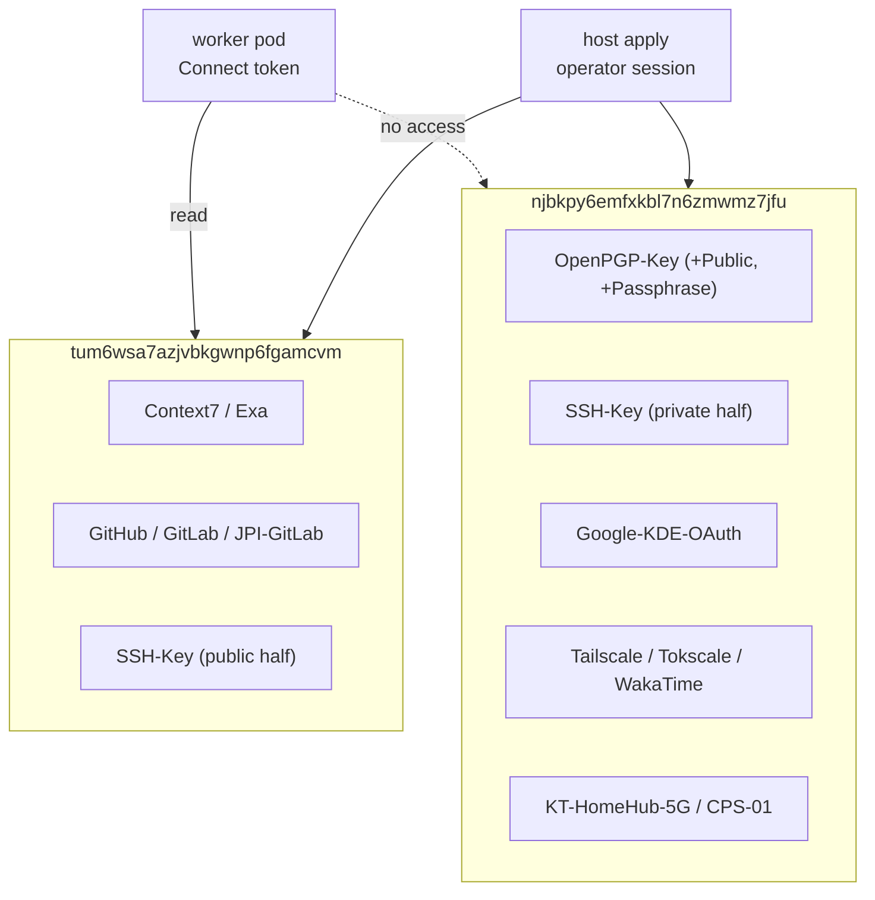
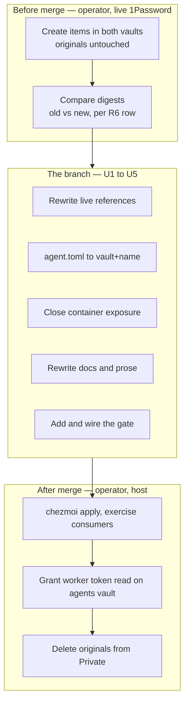

# Move this repository's secrets out of the Private vault - Plan

## Goal Capsule

- **Objective:** A 1Password Connect token can be issued that reads every secret this repository's worker path needs and nothing else, so a disposable agent-controlled container never holds a credential that grants access to unrelated personal items.
- **Means:** Re-create the repository's secrets in two purpose-scoped vaults, rewrite every `op://` reference to address vaults by UUID, and gate the form in CI (KD1, KD2, KTD1).
- **Authority hierarchy:** The R-IDs own what must be true after the change. The reference contract in R6 is the single source of truth for every target reference; issue #416's contract table is superseded by it wherever the two disagree. `AGENTS.md` owns the standing repository rules, including the prohibition on committing secrets.
- **Open blockers:** None. The 1Password side is operator work that this plan specifies but a planning agent cannot execute; see Dependencies.
- **Stop conditions:** Stop and report if any digest comparison in R13 fails, if the 1Password SSH agent rejects a vault-UUID entry (R9), or if a target item cannot reproduce a field segment named in R6.
- **Execution profile:** A reference rewrite across the repository plus one new CI gate. No secret value is read, written, or moved by the branch; the vault work is the operator's and happens outside it. CI proves form, never correctness — see the Verification Contract.
- **Tail ownership:** The pipeline owns commit, push, PR, and CI. The operator owns item creation, digest verification, token scoping, and deletion of the originals.

---

## Product Contract

### Summary

Re-create this repository's thirteen consumed secrets as fresh items in two vaults addressed only by UUID, rewrite every `op://` reference in the repository to the new form, and add CI gates that reject a reference naming a vault or reaching a vault the worker token cannot read. The originals stay in `Private` until every consumer is verified.

### Problem Frame

Every secret this repository consumes lives in the shared `Private` vault, alongside unrelated personal items. On a host that is harmless — the operator already has the vault open. It stops being harmless once worker pods resolve secrets through 1Password Connect, because at that point the token's vault scope is the only boundary left. A token scoped to `Private` hands a disposable, agent-controlled container read access to everything personal in it.

The cost shape is asymmetric. The migration is a bounded, reversible piece of work done once. The exposure it prevents is unbounded and cannot be undone after the fact — a leaked Connect token is a leaked vault, and the vault currently contains items that have nothing to do with this repository.

Two properties of 1Password's identifiers determine how the migration must be shaped, and they point in opposite directions. A vault UUID survives a rename, and the vaults are not being re-created — so it is stable in both axes. An item UUID survives a rename but not re-creation, and re-creation is exactly what this plan does. An item name survives re-creation if retyped identically, but not a rename. Addressing vaults by UUID and items by name is therefore the only combination where nothing in the reference is fragile against the operation being performed.

### Key Decisions

- KD1. **Rewrite every `op://` occurrence in the repository, with no exclusion list.** One rule and no exclusion set to maintain, at the cost of editing historical plan documents into referencing vaults that did not exist when they were written. (session-settled: user-directed — chosen over rewriting only live consumers, and over live consumers plus teaching prose: a single rule is cheaper to keep true than a curated exclusion list.) Governs R10, R14.
- KD2. **Rename every in-scope item to a hyphenated, space-free name.** Re-creation is the only free moment to change a name that is about to become the contract, and it makes every reference quote-free in shell and template contexts. (session-settled: user-directed — chosen over renaming only `JPI Git (New)`, and over renaming nothing: space-free names remove quoting as a class of failure rather than case by case.) Governs R5, R6.
- KD3. **The field segment is the stable English field id for a category-supplied field, and the label for a custom field.** Issue #416 states that field labels are the contract. That is true only for custom fields. Category-supplied fields carry a locale-rendered label — the Wi-Fi items in this account render as `기지국 이름`, `네트워크 이름` — while their id stays English and stable across re-creation. Referencing category fields by id is therefore both correct today and locale-proof; custom fields have a random id that a new item will not reproduce, so only their label is usable. (session-settled: user-approved — surfaced against the issue's blanket label rule and accepted.) Governs R6, R7.
- KD4. **The Wi-Fi items store SSID and passphrase in the fields the Wireless Router category intends for them.** The current items hold both in the base-station fields (`name`, `password`), which the category means for the router's own admin credentials. Re-creation moves them to `network_name` and `wireless_password`. (session-settled: user-directed — the operator asked that the items match the 1Password Wi-Fi template.) Governs R8.
- KD5. **`Home Wi-Fi` and `V6` are dropped from scope.** Neither item exists in `Private`. Both appear only in comment examples in `.chezmoidata/networking.yaml`, so there is nothing to migrate and no consumer to break. Governs R11.
- KD7. **The SSH key is split: the private half goes to the host vault, and only the public half reaches the worker-readable one.** #413 consumes the public half for `authorized_keys`, and a worker that is dialed into does not need the private half to be reachable. Placing the whole key in the worker vault would have handed a disposable container an SSH private key it never uses — the same over-scoping this plan exists to remove. (session-settled: user-directed — chosen over the single-item placement carried from issue #416, which review flagged and the operator then split.) Governs R2, R6, R9.
- KD6. **Items are created fresh and the originals are deleted last.** Rollback is reverting the reference commit and nothing else. A move would remove the source and make any failure expensive to recover from. Governs R12, R15.

### Requirements

**Vault placement and the token boundary**

- R1. Every secret this repository consumes resolves from one of exactly two vaults: `tum6wsa7azjvbkgwnp6fgamcvm` or `njbkpy6emfxkbl7n6zmwmz7jfu`.
- R2. `tum6wsa7azjvbkgwnp6fgamcvm` holds only what a worker needs: the agent API keys, the forge credentials, and the **public half** of the SSH key. No private key material lives in it.
- R3. `njbkpy6emfxkbl7n6zmwmz7jfu` holds the host-only secrets, and the worker Connect token has no access to it.
- R4. The worker Connect token is granted read on `tum6wsa7azjvbkgwnp6fgamcvm` and on no other vault.



**The reference contract**

- R5. Every reference takes the form `op://<vault-uuid>/<Item-Name>/<field segment>`. No reference names a vault.
- R6. The repository's references resolve exactly this set after the migration:

  | Item | Field segment | Segment kind | Vault | Was |
  | --- | --- | --- | --- | --- |
  | `Context7` | `API Key` | custom label | `tum6ws…` | `Context7` |
  | `Exa` | `API Key` | custom label | `tum6ws…` | `Exa` |
  | `GitHub` | `PAT`, `username` | custom label, category id | `tum6ws…` | `GitHub` |
  | `GitLab` | `PAT`, `username` | custom label, category id | `tum6ws…` | `GitLab` |
  | `JPI-GitLab` | `PAT`, `username` | custom label, category id | `tum6ws…` | `JPI Git (New)` |
  | `SSH-Key` | `public key` | category id | `tum6ws…` | `SSH Key` (public half) |
  | `SSH-Key` | agent config only, no `op://` | — | `njbkpy…` | `SSH Key` (private half) |
  | `OpenPGP-Key-Public` | `gpg_public.asc` | file name | `njbkpy…` | `OpenPGP Key` |
  | `OpenPGP-Key-Passphrase` | `password` | category id | `njbkpy…` | `OpenPGP Key` |
  | `OpenPGP-Key` | `gpg_private.asc` | file name | `njbkpy…` | `OpenPGP Key` |
  | `Google-KDE-OAuth` | `client_id`, `client_secret` | custom label | `njbkpy…` | `Google-KDE-OAuth` |
  | `Tailscale` | `Auth Key` | custom label | `njbkpy…` | `Tailscale` |
  | `Tokscale` | `API Token` | custom label | `njbkpy…` | `Tokscale` |
  | `WakaTime` | `API Key` | custom label | `njbkpy…` | `WakaTime` |
  | `KT-HomeHub-5G` | `network_name`, `wireless_password` | category id | `njbkpy…` | `KT HomeHub 5G` |
  | `CPS-01` | `network_name`, `wireless_password` | category id | `njbkpy…` | `CPS-01` |

- R7. A new item reproduces the field segments R6 names for it. A category-supplied field is satisfied by choosing a category that carries it; a custom field is satisfied by a custom field whose label matches byte for byte.
- R8. The Wi-Fi items carry the SSID in `network_name` and the passphrase in `wireless_password`, and `KT-HomeHub-5G` retains its `priority` custom field and value.

**Repository rewrite**

- R9. `dot_config/1Password/ssh/agent.toml` selects both keys by vault and item name rather than by item UUID, so re-creation does not silently stop the agent offering a key. The out-of-scope `Linux Servers` entry is rewritten in the same form against `ycd2lq7mikqcsb3yinnfdt7soa`.
- R10. Every `op://` occurrence in the repository is rewritten to the R6 form, including historical documents under `docs/`, README prose, and comment examples in `.chezmoidata/networking.yaml`.
- R11. The comment examples in `.chezmoidata/networking.yaml` reference an item that exists, and no longer mention `Home Wi-Fi` or `V6`.
- R18. No target that renders under the `container` fact resolves a reference into `njbkpy6emfxkbl7n6zmwmz7jfu`. Today two do — the KAccounts Google provider and the Wi-Fi import tool — and both are desktop and host concepts that a container has no use for, so each is excluded under the `container` guard rather than moved to the worker-readable vault.

**Verification and cutover**

- R12. Items are created in the target vaults without removing the originals from `Private`.
- R13. Each migrated field is proved byte-identical to its original by comparing digests, never by printing or comparing values.
- R14. A CI gate fails when any `op://` reference in the repository carries a vault segment that is not 26 lowercase alphanumeric characters.
- R15. The originals are deleted from `Private` only after every consumer in R6 has been exercised against the new reference.

**Handling of secret material**

- R16. No step of the migration procedure places a secret value in a command argument, an intermediate file, or shell history. This governs how the operator moves values between vaults; it does not restrict the rendered targets, which have always contained resolved secrets and are protected by their existing `private_` ownership.
- R17. The migration script is not committed to this repository.

### Acceptance Examples

- AE1. Reference form gate
  - **Covers R5, R14.**
  - **Given:** a branch reintroduces a reference whose vault segment is a name rather than a UUID.
  - **When:** CI runs the reference gate.
  - **Then:** the gate fails and names the offending file and line.
- AE2. Worker vault boundary gate
  - **Covers R3, R4, R18.**
  - **Given:** a target the container path renders references `njbkpy6emfxkbl7n6zmwmz7jfu`.
  - **When:** CI runs the vault-scope gate.
  - **Then:** the gate fails, because the worker token could not read that vault at runtime.
- AE3. SSH agent survives re-creation
  - **Covers R9.**
  - **Given:** `SSH-Key` has been re-created and carries a new item UUID.
  - **When:** the operator opens an SSH session that the key authorises.
  - **Then:** the agent offers the key and the session succeeds, because the entry selects by name.
- AE4. Custom field label mismatch is caught before cutover
  - **Covers R7, R13.**
  - **Given:** a re-created item's custom field reads `API key` where the contract says `API Key`.
  - **When:** the digest comparison runs for that reference.
  - **Then:** the comparison fails, and the originals are still in place.
- AE5. Wi-Fi field relocation is proved against the right source
  - **Covers R8, R13.**
  - **Given:** `CPS-01` is re-created with the SSID in `network_name`.
  - **When:** the digest comparison runs.
  - **Then:** the new `network_name` is compared against the original `name`, not against the original `network_name`, which is empty.

### Scope Boundaries

- `Linux Servers` stays in `ycd2lq7mikqcsb3yinnfdt7soa`. It is already outside `Private` and is not migrated, though R9 rewrites how `agent.toml` selects it.
- Cluster auth keys are not in either vault and are not touched. They arrive as CLI-seeded Secrets and never through `op`.
- `Home Wi-Fi` and `V6` are not created. Per KD5 neither item exists.
- Secrets in `Private` that this repository does not consume are not migrated, and are the reason the boundary is needed.
- Issuing or rotating the worker Connect token itself belongs to the Connect work; this plan fixes only the scope it is granted (R4).

### Dependencies and Assumptions

- The two target vaults exist with the UUIDs in R1. Confirmed live.
- The 1Password SSH agent accepts a vault UUID in a `vault` key. The agent config documentation states values are "the item, vault, or account name or ID", which covers it generically without confirming the vault key specifically — so U2's verification is an apply-time check, not a code-time one. If it accepts only a vault name, `agent.toml` becomes the one documented exception to R5 and the U5 gate gains its only exclusion.
- Item creation, digest verification, and deletion are operator work against a live 1Password account. A planning or implementation agent can produce the repository changes and the gates, but cannot perform R12, R13, or R15.
- The GPG item is a `PASSWORD` item carrying `gpg_public.asc` and `gpg_private.asc` as file attachments, not a field. A template copy does not carry files, so it needs `op document`. The name-based form resolves without naming the `Files` section — confirmed against the live item.
- Blocks #413. Related: #412.

### Outstanding Questions

**Resolve before planning**

- None.

**Deferred to implementation**

- Whether `op item create --template -` honors a `private_key` value on an `SSH_KEY` item. The value is present in the source JSON (KTD4), so the pipeline is the first thing to try; the fingerprint comparison decides whether it worked. Only if it does not does the operator need a category-specific import path.

### Sources

- Issue #416 — the originating contract table, superseded by R6 where they differ.
- Live inspection of the `Private` vault confirmed: the Wi-Fi items are `WIRELESS_ROUTER` with Korean labels and English ids; `Home Wi-Fi` and `V6` do not exist; `ayf4zcy2khkrvdoexfdvbqgzka` is titled `JPI Git (New)`; the GPG reference `4v5dbrerpkyiueq2st26sswzna` is the file id of `gpg_private.asc`; the `SSH_KEY` item's `private_key` field carries a value in `op item get --format json` output.
- Reference forms in R6 were resolved against the live account before being written here, including the vault-UUID form and the file-name form for the GPG key.
- `.github/workflows/ci.yml`, `.ci/test-ci-wiring.sh`, and the `repo-meta` job establish where a new gate lives and how it is proved to be wired.
- `.chezmoiignore` and `.chezmoitemplates/resolve-op-refs-json.tmpl` establish which targets render under the `container` fact and that data-file `op://` values are resolved at render time — the evidence behind R18.
- 1Password SSH agent config reference (`developer.1password.com/docs/ssh/agent/config`, now `1password.dev/ssh/agent/config`) for the `[[ssh-keys]]` key set.
- `STRATEGY.md` — the "Duplicate-knowledge defects" metric counts a secret ref existing in more than one place, which is what the single R6 contract table and the U5 gate together prevent.

---

## Planning Contract

### Product Contract preservation

Changed: added R18. R3 and R4 cannot hold without it — planning found two targets that render under the `container` fact and resolve `njbkpy6emfxkbl7n6zmwmz7jfu` references at render time, which would make a worker apply demand a vault its token cannot read. R18 is the necessary consequence of the existing boundary, not a new product goal. Every other requirement and every R/AE ID is unchanged.

### Key Technical Decisions

- KTD1. **One gate script, `.ci/test-op-reference-form.sh`, carrying both checks, invoked from the `repo-meta` job.** The repo's own `test-ci-wiring.sh` is the precedent for a single gate script holding numbered checks over one concern, and `repo-meta` is where source-text gates already run. Splitting into two scripts would double the wiring surface `test-ci-wiring.sh` has to police for no gain, since both checks read the same reference set. Governs R14, R18.
- KTD2. **The vault-segment rule is the whole of check 1; there is no exclusion list.** A reference is `op://` followed by a segment then `/`; every such match must have a 26-character lowercase-alphanumeric vault. Elided prose forms (`op://...`, `op://**`, a bare `op://`) have no segment-then-slash shape and never match, so prose needs no exemption — which is what makes KD1's no-exclusion-list choice implementable rather than aspirational. Inherits KD1. Governs R14.
- KTD3. **Container exposure is closed by excluding the two targets under the existing `container` guard, not by moving their items to the worker-readable vault.** The KAccounts Google provider is a desktop online-accounts concept and the Wi-Fi import tool is host network provisioning; neither has meaning in a worker pod, and both sit beside targets the guard already skips for the same reason. Moving `Google-KDE-OAuth` or the Wi-Fi items into `tum6wsa7azjvbkgwnp6fgamcvm` would widen the worker token to secrets a worker never uses — the exact outcome this plan exists to prevent. Governs R18.
- KTD4. **The SSH key is copied by the same template pipeline as every other item, and the fingerprint comparison is what decides whether it worked.** Issue #416 assumes a plain template copy cannot carry the private key; the live item shows `private_key` carrying a value in `op item get --format json`, so the ordinary pipeline is the first thing to try and it keeps the key inside a pipe, satisfying R16. Generating a key remains forbidden under any outcome. Governs R7, R13.
- KTD5. **The operator's vault work completes before the branch merges.** Creating and verifying items is additive and leaves `Private` intact, so doing it first makes the repository change safe to land: at merge time every new reference already resolves. Deleting the originals is the only destructive step and stays last. Sequencing the other way would land a branch whose next `chezmoi apply` fails on the host. Governs R12, R13, R15.

### High-Level Technical Design

The migration has three actors whose ordering is the whole risk, and only the middle one is repository work.



The gate's two checks read the same reference set from different angles:

```
check 1  every `op://<seg>/` in the repo      -> <seg> matches ^[a-z0-9]{26}$
check 2  targets rendered under container=true -> none resolves njbkpy6emfxkbl7n6zmwmz7jfu
```

Check 2 needs the container-rendered target set, which `.chezmoiignore` already computes from the `container` fact — the gate renders that ignore list with the fact forced true and tests the surviving targets, rather than maintaining a second hand-written list of what a worker deploys. Directional: the exact rendering mechanism is the implementer's call, and `render-dotfiles.yml` already demonstrates rendering with a stubbed `op`.

### Assumptions

- The worker Connect token does not yet exist, so R4 is a constraint recorded for the Connect work rather than an action this branch takes.
- Rewriting `op://` references inside historical `docs/plans/` documents is acceptable distortion of those records, per KD1. The git history preserves what they originally said.
- The `priority` custom field on `KT-HomeHub-5G` is consumed by the Wi-Fi importer through `resolve-op-refs-json.tmpl`'s value-based resolution, so it must survive re-creation with the same label even though no `op://` reference names it.
- Committing vault and item identifiers to this public repository discloses nothing exploitable: they are opaque without an authenticated 1Password session, and the repository already carries them. The migration does not change that exposure, it only changes which identifiers appear.

### Risks and Mitigation

| Risk | Why it bites | Mitigation |
| --- | --- | --- |
| The `container` fact cannot be forced true in CI, so U5's check 2 has no target set to test | `.chezmoiignore` resolves facts through `.chezmoitemplates/facts.tmpl`, which probes the host; a CI run is not a container | Try the fact override first. If it cannot be forced, fall back to a declared list of container-deployed targets inside the gate, with a check that the list still matches what the ignore rules produce on a host render. A gate that cannot compute the set must fail loudly, never pass vacuously |
| A wrong item name or field label ships green | CI stubs `op`, so every reference resolves identically regardless of correctness | The operator's digest pass (R13) runs before merge and is the only thing that proves correctness. The Verification Contract states this so a green pipeline is not mistaken for proof |
| `agent.toml` breaks silently and every SSH login fails | The file carries no `op://` string, so U5's gate cannot see it, and the agent simply stops offering the key with no error | U2 carries an explicit apply-time operator check, and a missing key is a stop condition rather than a warning |
| The branch merges before the operator's vault work, so the next `chezmoi apply` fails | Every rewritten reference points at items that do not exist yet | KTD5 sequences the operator's work before merge. The Definition of Done lists R12 and R13 as merge prerequisites |
| Rewriting historical documents obscures what past work actually referenced | KD1 edits records of decisions made against `Private` | Accepted under KD1 and recorded in Assumptions; git history preserves the original text |

### Sequencing

U1 through U4 are independent of each other and may land in any order. U5 must land after them, because its check 1 fails against any un-rewritten reference. The operator prerequisite (KTD5) gates the merge, not the individual units.

---

## Implementation Units

### U1. Rewrite the live `op://` references

- **Goal:** Every reference chezmoi renders or a shell executes resolves through a vault UUID.
- **Requirements:** R5, R6, R10; KD2, KD3.
- **Dependencies:** none.
- **Files:**
  - `.chezmoidata/agents.yaml`, `.chezmoidata/kde.yaml`, `.chezmoidata/networking.yaml`
  - `.chezmoiscripts/10-auth/run_onchange_before_auth-github.sh.tmpl`
  - `.chezmoiscripts/10-auth/run_onchange_after_auth-gitlab.sh.tmpl`
  - `.chezmoiscripts/10-auth/run_once_after_auth-tailscale.sh.tmpl`
  - `.chezmoiscripts/10-auth/run_onchange_after_auth-tokscale.sh.tmpl`
  - `.chezmoiscripts/30-linux/run_onchange_after_config-wakatime-keyring.sh.tmpl`
  - `.chezmoiscripts/80-keys/run_once_before_import-gpg-key.sh.tmpl`
  - `dot_config/containers/private_auth.json.tmpl`
  - `dot_local/share/accounts/providers/google.provider.tmpl`
  - `dot_config/zsh/dot_zshrc`, `.install-prerequisites.sh`
- **Approach:**
  1. Replace each reference with its R6 row. Substitution is per-row, not a blanket `Private` swap — the two inverted references (the GPG one, which names its vault by UUID and its item and field by UUID, and the JPI GitLab one, which names its item by UUID) have no `Private` literal or no item name to preserve and are replaced outright.
  2. `dot_local/share/accounts/providers/google.provider.tmpl` carries the reference twice per credential — once as the `default` fallback and once through `.kde.googleOAuth`. Both change, and the fallback must match `.chezmoidata/kde.yaml` exactly or the two disagree silently when the data key is absent.
  3. `.chezmoidata/networking.yaml` changes in three places: the two live `networks:` entries, the comment examples (R11), and the `SECRETS` header comment that documents the reference form.
  4. The GPG reference becomes an item-name-plus-file-name form; it does not need the `Files` section segment.
- **Patterns to follow:** `.chezmoitemplates/resolve-op-refs-json.tmpl` documents that a data-file string beginning exactly with `op://` is resolved by value — the data-file references in `agents.yaml`, `kde.yaml`, and `networking.yaml` are consumed that way and need no template change beyond the string itself.
- **Test scenarios:**
  - Covers AE1. The repository-wide vault-segment scan returns nothing for these files.
  - Rendering `dot_config/containers/private_auth.json.tmpl` with a stubbed `op` produces the same six-credential JSON shape as before, with no template error from a changed reference.
  - Rendering `dot_local/share/accounts/providers/google.provider.tmpl` with `.kde.googleOAuth` absent falls back to the same vault UUID the data file names, not to `Private`.
- **Verification:** Every file above renders under the existing render gates, and no `op://` in them names a vault.

### U2. Rewrite the SSH agent config to vault-plus-name form

- **Goal:** The 1Password SSH agent still offers both keys after the in-scope item is re-created with a new UUID.
- **Requirements:** R9; AE3.
- **Dependencies:** none.
- **Files:** `dot_config/1Password/ssh/agent.toml`
- **Approach:** Replace both item-UUID entries with `vault` plus `item` name pairs — `SSH-Key` against `njbkpy6emfxkbl7n6zmwmz7jfu`, and the out-of-scope `Linux Servers` against `ycd2lq7mikqcsb3yinnfdt7soa`. The agent runs on the host and needs the private half, so it points at the host vault, not the worker-readable one. The second entry is rewritten even though its item is not migrating, so neither entry is UUID-fragile again.
- **Execution note:** This file carries no `op://` string, so the U5 gate cannot see it and CI cannot prove it. The proof is an apply-time check by the operator: the agent lists both keys and an SSH session that the key authorises still succeeds. Treat a missing key as the stop condition, not as a warning.
- **Test scenarios:**
  - Covers AE3. After apply, the agent offers both keys and an authorised SSH session succeeds.
  - Test expectation: no automated coverage — the agent is a running daemon reading a deployed file, and CI provisions neither.
- **Verification:** Both keys are listed by the agent and the fingerprint of the offered `SSH-Key` matches the one recorded during the operator's digest pass.

### U3. Close the container exposure for the two host-only targets

- **Goal:** A container apply never asks for a vault the worker token cannot read.
- **Requirements:** R3, R4, R18; AE2. Instantiates KTD3.
- **Dependencies:** none.
- **Files:** `.chezmoiignore`
- **Approach:** Add the KAccounts Google provider target and the Wi-Fi import tool to the existing `{{- if $f.container }}` block, alongside the desktop and host-provisioning targets it already skips. Extend that block's comment to say why: both resolve host-only vault references at render time, so a worker apply would demand a vault outside its token's scope.
- **Patterns to follow:** the same block already skips `.chezmoiscripts/10-auth/*.sh`, `80-keys/*.sh`, and `.config/garden/garden.yaml` for the equivalent reason — a container cannot and should not reach that material.
- **Test scenarios:**
  - Covers AE2. Rendering the ignore list with the `container` fact true excludes both targets.
  - Rendering it with the `container` fact false still includes both, so a host apply is unchanged.
  - The desktop guard and the container guard remain independent: a Linux host with no KDE or GNOME desktop is unaffected by this change.
- **Verification:** The U5 check 2 passes, and a host apply still deploys both targets.

### U4. Rewrite the remaining `op://` occurrences

- **Goal:** The vault-segment rule holds across the whole repository, so the gate needs no exclusion list.
- **Requirements:** R10, R11; KD1.
- **Dependencies:** none.
- **Files:** `README.md`, `docs/plans/**`, `docs/solutions/**`, `docs/decommission/**`, `docs/ideation/**`
- **Approach:**
  1. Rewrite each occurrence to its R6 row. Where a historical document names an item this plan does not migrate — `Z.ai`, `Opencode`, `OpenRouter`, `CLI`, `CPA` — the item was decommissioned and exists in neither vault, so no R6 row applies. Rewrite those to the agents vault by convention, because every one of them was an agent API key and that is where such an item would live today. State the convention in the commit message: the goal is a repository where the vault-segment rule holds uniformly, not a claim that these items exist.
  2. Leave elided forms (`op://...`, `op://**`, a bare `op://`) alone. They have no vault segment, the gate does not match them, and substituting one would invent a reference that never existed.
  3. Two historical references are already malformed — one names `Tailscale` where the vault segment belongs. Rewrite them to well-formed references rather than preserving the error.
- **Test scenarios:**
  - Covers AE1. The repository-wide scan returns nothing.
  - The elided forms survive untouched, so the gate's no-exclusion-list property is demonstrated rather than asserted.
- **Verification:** The scan is clean and no document gained a reference it did not have.

### U5. Add and wire the reference-form and vault-scope gate

- **Goal:** A future branch cannot reintroduce a vault-naming reference or a worker-unreachable one without CI going red.
- **Requirements:** R14, R18; AE1, AE2. Instantiates KTD1, KTD2.
- **Dependencies:** U1, U2, U3, U4.
- **Files:** `.ci/test-op-reference-form.sh` (new), `.github/workflows/ci.yml`
- **Approach:**
  1. Write the gate with two named checks and the failure-explaining header comment the neighbouring `.ci` gates use, naming the file and line for each violation.
  2. Check 1 scans the repository excluding `.git` for `op://<segment>/` and fails any segment that is not 26 lowercase alphanumeric characters.
  3. Check 2 resolves the container-rendered target set from `.chezmoiignore` with the `container` fact forced true, then fails if any surviving target's source resolves a reference into the host vault. If the fact cannot be forced in CI, take the fallback in Risks rather than weakening the check.
  4. Invoke it from the `repo-meta` job's gate list. `repo-meta` is already in `delivery`'s `needs`, so no `needs` change is required — but confirm that rather than assuming it.
- **Patterns to follow:** `.ci/test-ci-wiring.sh` for the multi-check single-concern shape, the `fail`/`pass` helpers, and the header comment that records why the gate exists. `.github/workflows/render-dotfiles.yml` for rendering with a stubbed `op` so no check reaches a real vault.
- **Test scenarios:**
  - Covers AE1. A fixture reference naming a vault fails check 1 with its file and line named.
  - Covers AE2. A fixture target rendered under the container fact referencing the host vault fails check 2.
  - A well-formed reference passes both checks.
  - An elided `op://...` in prose passes check 1 rather than being reported as a violation.
  - The gate exits non-zero on failure and zero on success, so the job result reflects it.
  - `.ci/test-ci-wiring.sh` passes, proving the new gate is invoked by a workflow and that `repo-meta` still reaches `delivery`.
- **Verification:** The gate is green on this branch, red against each fixture violation, and `test-ci-wiring.sh` reports it wired.

---

## Verification Contract

| Gate | What it proves | Applies to |
| --- | --- | --- |
| `.ci/test-op-reference-form.sh` | No reference names a vault; no container-rendered target reaches the host vault | U1, U3, U4, U5 |
| `.ci/test-ci-wiring.sh` | The new gate is invoked by a workflow and its job reaches `delivery` | U5 |
| `ci.yml` `render-gates` job | Every touched template still renders with a stubbed `op` | U1, U3 |
| `render-dotfiles.yml` | A full render of the dotfiles tree still succeeds | U1, U3, U4 |
| Operator digest pass (R13) | Each new field is byte-identical to its original | Prerequisite to merge |
| Operator apply and consumer exercise (R15) | `gh`, `glab`, registry auth, GPG import, Wi-Fi import, WakaTime, Tokscale, and the MCP servers all authenticate against the new references | After merge |

CI cannot prove an item name or field label is correct — the stubbed `op` answers every reference identically. Only the operator's digest pass and the post-merge consumer exercise can. Do not read a green pipeline as evidence the migration works.

---

## Definition of Done

**Global**

- Every `op://` reference in the repository carries a 26-character lowercase-alphanumeric vault segment.
- `.ci/test-op-reference-form.sh` is green and `test-ci-wiring.sh` reports it wired.
- The full CI pipeline is green, `delivery` included.
- No secret value appears in any committed file, command argument, or shell history (R16), and no migration script is committed (R17).
- No dead-end or experimental code from abandoned approaches remains in the diff.

**Per unit**

- U1 — every live reference matches its R6 row; both `google.provider.tmpl` credential sites agree with `.chezmoidata/kde.yaml`.
- U2 — both `agent.toml` entries select by vault and item name; the operator has confirmed the agent still offers both keys.
- U3 — the container-rendered target set excludes both host-only targets, and the host set is unchanged.
- U4 — the repository-wide scan is clean and every elided form is untouched.
- U5 — both checks fail against their fixtures and pass on this branch.

**Operator, outside the branch**

- R12 and R13 complete before merge: items created in both vaults, every R6 field digest-matched against its original, originals intact.
- R15 completes after merge: consumers exercised against the new references, the worker token granted read on `tum6wsa7azjvbkgwnp6fgamcvm` only, then the originals deleted from `Private`.
