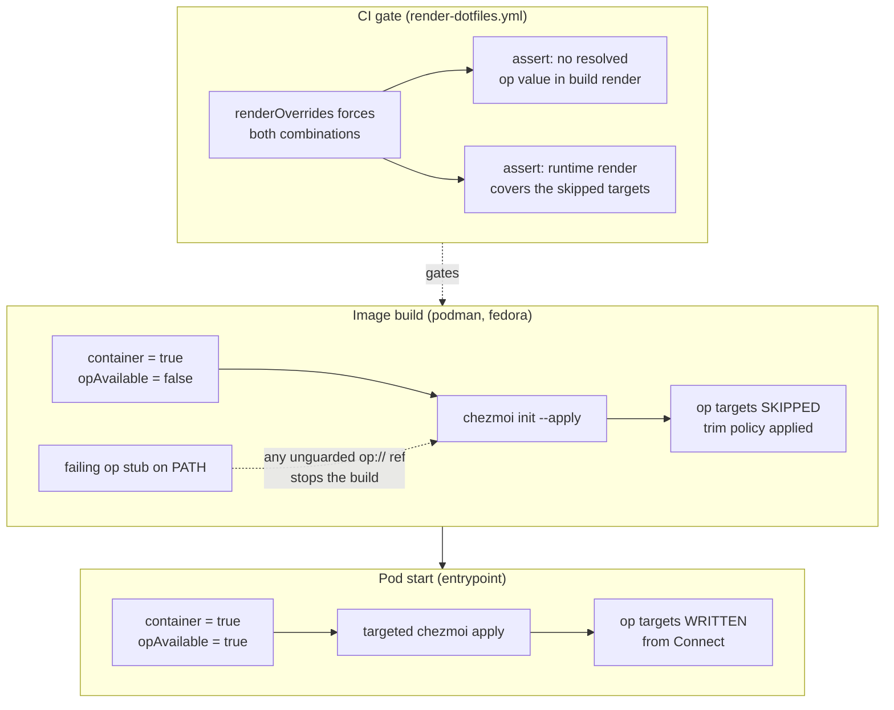
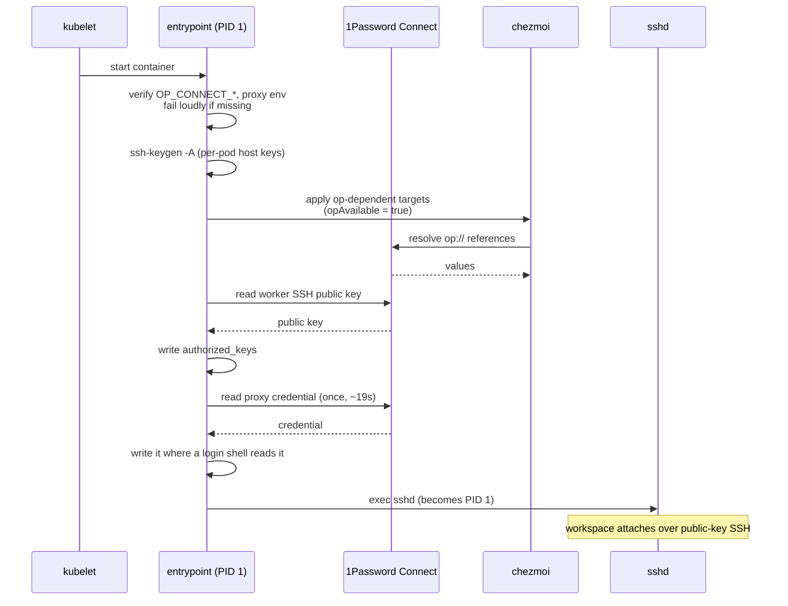
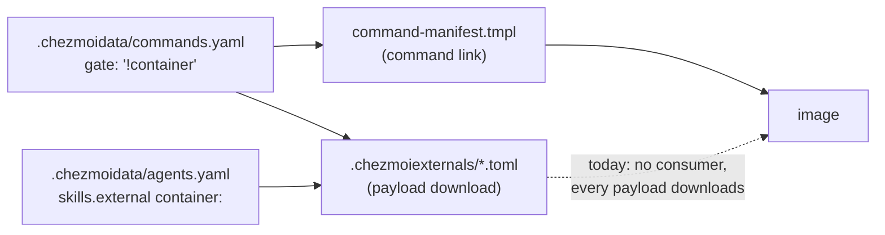

# Orca Worker Image - Plan

## Goal Capsule

**Objective.** An Orca workspace can attach to a running worker and develop in it immediately, with the same agent behaviour the host has, and no credential ever reaching a published image layer.

**Product authority.** This plan owns the worker image: what renders into it, what it excludes, how it is built, how it is published, and what it does at pod start. The k3s platform that runs the image is #412 and is not active scope here.

**Open blockers.** None. #416 was declared a blocker by the issue, but all 29 `op://` references in the repository already address the two target vault UUIDs, so the narrow-token precondition this image depends on already holds.

**Means.** Separate build from runtime with an `opAvailable` fact, declare each trim decision as data on the entry it governs, and gate publication on a CI render that proves no secret resolved (KTD1, KTD3, KTD6).

**Authority hierarchy.** The Product Contract's R-IDs outrank the Planning Contract; the Planning Contract outranks a unit's Approach. Where this plan and issue #413 disagree, this plan wins — several of its claims were checked against the repository and did not hold.

**Stop conditions.** Stop and report rather than proceeding when: a render that should skip an `op` target resolves one anyway; a container policy declaration cannot express an entry's decision without a new mechanism; or the image build needs any secret.

**Execution profile.** Configuration and packaging work. Proof is a render or a build, not unit coverage — this repository has no unit test suite, and its gates are shell scripts under `.ci/` plus the rendered-output workflows.

**Tail ownership.** This plan ends at a published image addressed by digest. Pinning that digest into a `PodTemplate` and operating the cluster belong to #412.

## Product Contract

### Summary

Make the container render path secret-free, trim it to what development actually needs, and produce a published image an Orca workspace can attach to. An `opAvailable` fact separates build from runtime so secrets resolve in the pod and never in a layer; trim decisions move into per-entry `container:` policy; the global mise tool set splits into a base plus baremetal and container fragments merged as TOML.

### Problem Frame

The container path exists and is declared — `.chezmoiignore:132-134` says it "deploys the CLI dotfiles only and skip all host provisioning" — but it does not hold to that declaration in either direction.

It leaks. Two targets still resolve `op://` into file content on the container path and would bake credentials into an image layer: `dot_config/containers/private_auth.json.tmpl` (GitHub/GitLab registry PAT, plus a base64 `user:PAT`) and the MCP/Codex API keys at `private_readonly_dot_mcp.json.tmpl:17` and `.chezmoiscripts/70-agents/run_after_config-codex-settings.sh.tmpl:36`. A third leak, the Google OAuth provider, has already been closed at `.chezmoiignore:171`.

It also over-ships. The container branch skips host provisioning scripts, but the payloads land anyway: font archives download into an image with no display while `.config/fontconfig` is already ignored, desktop application config ships, systemd units and `environment.d` ship into a pod that has no systemd, and the global mise tool set carries a rust toolchain and two ruby versions.

Underneath both is one structural problem. The `container` fact is true at image build and again inside the running pod, so the ignore branch cannot tell them apart: excluding a target to keep a secret out of the image also hides it from the runtime apply that is supposed to write it.

<!-- ce-section: work-relationships -->
### How This Work Fits Together

This plan owns the worker image and its publication. The breakdown below is the current understanding of the surrounding work, not a committed roadmap.

- The k3s platform (#412) — **Depends on** this plan for a published image digest to pin in its `PodTemplate`, and **Enables** this plan's runtime half by supplying 1Password Connect, CLIProxyAPI, and the pod environment. It **Can proceed independently of** this plan up to the point where it needs a real image to run.
- The vault split (#416) — the issue names it a blocker. Every `op://` reference in the repository already uses a target vault UUID, so this plan **Shares** its outcome rather than waiting on it. **Still to decide:** whether #416 has residual work that is not visible from the repository, such as deleting the original `Private` items.

### Key Decisions

- **One plan covers the secret-free render path, the trim, and the image.** (session-settled: user-directed — chosen over three separately planned areas: the title's "ready-to-use" promise is only met when all three land, and a published image is the acceptance signal for the first two.)
- **`opAvailable` splits build from runtime.** A fact beside `container` and `headless` probes whether `op` is usable, cached like the others. Build renders with it false and skips every `op`-touching target; the pod entrypoint re-applies those targets with it true. Governs R1, R2, R8, R9.
- **Trim decisions are declared as per-entry `container:` policy, not as ignore paths.** (session-settled: user-directed — chosen over `.chezmoiignore` path exclusion and a hybrid: the repository already carries this convention at `agent-plugin-rows.tmpl:115`, `agent-mcp-servers-json.tmpl:105`, and `command-manifest.tmpl:14`, and a policy field keeps each decision beside the data it governs.) Governs R10, R11, R12.
- **`agent-browser` is excluded entirely; a project that needs it provisions it itself.** Today it arrives as a release-lock external, not through mise, so the per-project path is a mechanism planning has to choose. (session-settled: user-directed — chosen over including it in a single image and over publishing a browser-less base plus a browser variant: a variant matrix doubles build, tags, CI gating, and #412's pod shape, and introduces variant selection as a new concept at workspace creation.) Governs R13.
- **`codegraph` is excluded.** (session-settled: user-directed — chosen over keeping it: useful to an agent, but not required to develop, so the same rule that cut `agent-browser` cuts it.) Governs R13.
- **The image is published to ghcr.io with public visibility.** (session-settled: user-directed — chosen over private: the repository is already public, and R1-R5 guarantee the image carries no secret, so a public image removes `imagePullSecrets` from #412 entirely.) Governs R19, R20.
- **The global mise config splits into base plus baremetal and container fragments, merged as parsed TOML.** (session-settled: user-directed — chosen over a single host-shaped file excluded in containers, and over the textual include-fragment pattern that `dot_config/git/config.tmpl:39` and `dot_ssh/config.tmpl:1` use: merging parsed maps removes the duplicate-table-header failure that textual inclusion has in TOML and that the git precedent never encounters.) Governs R14, R15.
- **In a container, chezmoi uses its default source directory.** (session-settled: user-directed — chosen over cloning to the host-shaped `~/src/github.com/hyperlapse122/dotfiles` path so `sourceDir` matches: `~/src` is a host concept the container branch already abandons at `.chezmoiignore:159-161`, and the default removes a path the image would otherwise have to imitate.) Governs R16.
- **Worker SSH host keys are generated per pod.** Each worker has a unique MagicDNS name, so the `known_hosts` collision that shared host keys avoid does not arise, and no host key enters a public image. Governs R23.

### Requirements

**Secret containment**

- R1. No image layer contains a value resolved from an `op://` reference.
- R2. A target that resolves an `op://` reference renders during the pod's runtime apply and not during the image build.
- R3. Container registry authentication (`dot_config/containers`) is absent from the image. A worker does not pull images; kubelet does, using the platform's own mechanism.
- R4. The image build fails, naming the offending file, when a target on the container path resolves an `op://` reference. The failure is a build stop, never a placeholder value written into a file.
- R5. A newly added `op://` reference on the container path is caught before publication, not after.

**Build and runtime separation**

- R6. A fact records whether `op` is usable in the current environment, resolved and cached alongside the existing facts.
- R7. An apply on a host where `op` is absent or locked skips the `op`-dependent targets rather than failing the whole apply.
- R8. At pod start, the `op`-dependent targets are rendered with real 1Password Connect credentials, by chezmoi, with no second templating layer over what chezmoi already wrote.
- R9. Agent credentials for the model proxy are resolved once at pod start, not per agent invocation. `op read` takes about 19 s on this hardware and the Codex `auth.timeout_ms` default is 5000 ms, so a per-invocation credential helper cannot work.

**Trim and gating**

- R10. Each externals entry, skill, MCP server, and command declares whether it ships in a container.
- R11. `.chezmoidata/agents.yaml` supports a `container:` policy on `skills.external` entries, matching the policy the plugin, MCP server, and command surfaces already carry.
- R12. The `.chezmoiignore` container branch holds only what a per-entry policy cannot express — whole-file targets with no owning entry.
- R13. The image excludes: `agent-browser` (binary, skill, and MCP server entry together), `codegraph`, `agy` and `dot_gemini`, `aoe`, `garden`, `wakatime-cli`, the docker credential helpers, `winbox`, `minikube`, `android`, every font family, `buf` completions and man pages, the desktop application config directories, `dot_config/systemd` and `dot_config/environment.d`, `tmux` and its config, `dot_config/containers`, the desktop entries and accounts providers, `dot_config/tokscale`, zsh in full (`prezto`, `dot_zshenv`, `dot_config/zsh`), and the standalone CLIs that are useful somewhere and universal nowhere: `shellcheck`, `ast-grep` and `sg`, `uv` and `uvx`, `rust-analyzer`, `wasm-pack`, `buf` and its protoc plugins, `kubectl` and `kubectl-convert`, `helm`, and `marksman`. `bun` and `bunx` are not in this list; see R15.
- R14. The global mise configuration renders from a shared base merged with exactly one of a baremetal fragment or a container fragment, selected by the `container` fact.
- R15. The container fragment's global tool set is node and python. Every other language runtime and toolchain arrives from a project's own mise configuration. `bun` is unaffected: it ships from `.chezmoiexternals/dev-tools.toml` under the release lock, not from mise.

**Image and runtime environment**

- R16. Inside a container, chezmoi's source directory is its own default.
- R17. The image contains the target user account with a home directory and an `~/.ssh` at the modes sshd requires.
- R18. The image provides `LANG`, `$HOME/.local/bin` on `PATH`, and mise shims without a login shell framework.
- R19. The image is published to ghcr.io with public visibility.
- R20. Every published image is addressable by an immutable digest that #412 can pin.
- R21. The base image is Fedora, at a pinned digest.
- R22. The image is built by rootless podman, with no build secret. If a build ever needs a token it arrives through `podman build --secret`, never `ARG` or `ENV`.
- R23. Each pod generates its own SSH host keys at start.
- R24. The pod writes `authorized_keys` at start from the public key held in 1Password, so rotating the key does not require an image rebuild.
- R25. An interactive SSH login session has the same working agent credentials as the entrypoint. A pod is not systemd-managed, so an environment set only in the entrypoint process does not reach an sshd login session.
- R26. `sshd` runs as PID 1.
- R27. The image does not contain a host agent home (`~/.claude`, `~/.codex`, `~/.config/op`).
- R28. The image build does not depend on a package whose clean installation currently fails. `aube` is the known instance: mise resolves `aube` to `aqua:jdx/aube`, whose GitHub artifact attestation now presents `aubepkg/aube` as its certificate identity, so a clean `mise install` fails on it while an already-provisioned host does not notice.

**Verification**

- R29. A CI gate renders every target with the container fact forced and asserts that no `op` reference resolves, before any publication step runs.
- R30. The CI gate covers both fact combinations: the build combination (container, `op` unavailable) and the runtime combination (container, `op` available). The build combination proves no secret is baked; the runtime combination proves the pod's apply covers the targets the build skipped.
- R31. A CI check asserts that the `container:` policy declarations are complete and well-formed. Trim decisions no longer live in `.chezmoiignore`, so `.ci/test-chezmoiignore-script-paths.sh` no longer covers them.
- R32. A CI check renders the merged mise configuration for both the baremetal and the container fragment and asserts each parses as the tool set it is meant to declare.
- R33. Image size is recorded before and after the trim.

### Key Flows

F1. **Image build.** The build clones the public repository, runs `chezmoi init --apply` with the container fact true and `op` unavailable, and installs only what the `container:` policy admits. Any attempt to resolve an `op://` reference stops the build and names the file. The result is pushed to ghcr.io and addressed by digest.

**Covers R1, R4, R16, R19, R20, R21, R22, R28.**

F2. **Pod start.** The platform supplies the proxy and Connect environment. The entrypoint verifies the environment it requires is present, generates host keys, runs a targeted `chezmoi apply` for the `op`-dependent targets with `op` now available, writes `authorized_keys` from the public key in 1Password, resolves the proxy credential once and places it where an SSH login session will find it, and execs `sshd` as PID 1.

**Covers R2, R8, R9, R23, R24, R25, R26.**

F3. **Workspace attach.** An Orca workspace attaches over public-key SSH to the worker's MagicDNS name. The agent set, skills, git and MR/PR tooling, and package-manager policy files are present. A project's own mise configuration provisions its toolchain.

**Covers R13, R15, R17, R18.**

### Acceptance Examples

- AE1. **Given** a target that resolves an `op://` reference, **when** the image builds, **then** the build fails and names that file. It does not write a placeholder. **Covers R4.**
- AE2. **Given** the same target, **when** the pod's entrypoint applies at start with Connect credentials present, **then** the target is written with the real value. **Covers R2, R8.**
- AE3. **Given** a host where `op` is installed but locked, **when** chezmoi applies, **then** the `op`-dependent targets are skipped and the rest of the apply succeeds. **Covers R7.**
- AE4. **Given** the container fragment, **when** the merged mise configuration is parsed, **then** the global tool set is node and python plus mise's own internals, and no rust, ruby, go, or yarn appears. **Covers R14, R15, R32.**
- AE5. **Given** the baremetal fragment, **when** the merged configuration is parsed, **then** both declared ruby versions survive the merge. The merge rewrites the source's inline array into TOML array-of-tables form, so this is the case that proves the rewrite is semantics-preserving. **Covers R14, R32.**
- AE6. **Given** a new `op://` reference added to a target on the container path, **when** CI runs, **then** the gate fails before any publication step. **Covers R5, R29.**
- AE7. **Given** an entry with no `container:` policy declared, **when** CI runs, **then** the completeness check fails. **Covers R31.**
- AE8. **Given** an attached workspace, **when** a user opens an interactive SSH session and invokes an agent, **then** the agent reaches the model proxy without a per-invocation credential lookup. **Covers R9, R25.**

### Success Criteria

- An Orca workspace attaches to a worker with `--provision` and an agent completes a real task in it.
- The published image carries no value resolvable from `op://`, demonstrated by the CI gate rather than by inspection.
- Image size after the trim is recorded against the size before it. "Development essentials" is only meaningful against a number.
- A contributor adding a new tool to the repository is required by CI to state whether it ships in a container.

### Scope Boundaries

- The k3s platform is #412: the `PodTemplate`, namespace, RBAC, quota, Flux wiring, the Connect server, CLIProxyAPI, and the Tailscale operator. This plan produces and publishes the image those manifests reference.
- No image variants. One image, one tag stream.
- No rework of the host's provisioning behaviour. Every gating change is conditioned on the container fact so host behaviour is unchanged.
- Tailscale SSH stays off. Authentication is public-key over `sshd`. Workers still join the tailnet for reachability.
- The `aube` attestation failure is recorded and worked around here, not fixed upstream.

### Dependencies / Assumptions

- The platform (#412) supplies `ANTHROPIC_BASE_URL`, `ANTHROPIC_AUTH_TOKEN`, the Codex provider `base_url` and `env_key`, and `OP_CONNECT_HOST` / `OP_CONNECT_TOKEN` scoped to the worker vaults. This plan consumes them and does not bake them.
- The vault split is assumed complete for this plan's purposes: all 29 `op://` references in the repository address the two target vault UUIDs. If original `Private` items still exist, that is #416's remaining work and does not block this plan.
- `.ci/lib/render-scratch.sh:34` already installs a dummy `op` for offline renders. The build-time tripwire needs the opposite behaviour — a stub that fails — so the two stubs are distinct and the CI gate must be explicit about which it uses.
- The `70-agents` plugin update scripts are assumed to run at build time, so pod start does not depend on the network. This fixes plugin versions to the image.
- Assumed that `dot_config/tokscale` is inert in a container because its auth script is already container-skipped. Confirm during planning; the cost of being wrong is a config file with no consumer.

### Outstanding Questions

**Resolve before planning**

- None.

**Deferred to planning**

- How the proxy credential reaches an sshd login session. Candidates include a file the login shell sources, sshd's own environment configuration, or PAM. The requirement (R25) is fixed; the mechanism is not.
- Where the split line falls between the mise base fragment and the two variant fragments — specifically which `npm:` backend tools an agent needs globally in a worker versus per project.
- How `aube` is obtained given the attestation mismatch (R28): pin a working version, install it outside mise, or change the npm package manager setting for the container fragment.
- Whether the `container:` policy for externals is expressed as a data manifest consumed by a shared partial or as a field on each entry, and how the six externals files consume it.
- How a project provisions `agent-browser` once it leaves the image. It is a release-lock external today, so the per-project path has to be chosen rather than inherited.
- Registry tag policy beyond the digest requirement.
- Whether `.chezmoiignore` retains any container branch at all once per-entry policy covers the entries.

### Sources / Research

- The issue: hyperlapse122/dotfiles#413. Note that its comment describes items 7 (entrypoint), 8 (build and publish), and 9 (definition of done) as added to the description, but the description ends at item 6. Those three areas are carried into this plan from the comment.
- Existing `container:` policy convention: `.chezmoitemplates/agent-plugin-rows.tmpl:115` (plugins, `skip`/`keep`, used at `.chezmoidata/agents.yaml:99`), `.chezmoitemplates/agent-mcp-servers-json.tmpl:105-108` (MCP servers), `.chezmoitemplates/command-manifest.tmpl:14` (commands).
- The issue states that no external carries a container guard. `.chezmoiexternals/system.toml:83` is a counter-example: the winbox external is already conditional on the container fact.
- Textual include-fragment precedent, considered and not used for mise: `dot_config/git/config.tmpl:39`, `dot_ssh/config.tmpl:1`.
- `dot_config/mise/config.toml` — the current global tool set, and the comment block at lines 1-13 recording why bun is not in mise and why rust-analyzer appears twice on purpose. That comment does not survive a `toToml` merge and belongs in the template source.
- `.chezmoi.toml.tmpl:10` — the `sourceDir` pin that R16 overrides for containers.
- `.chezmoiignore:132-172` — the container branch, its declared intent, and the two exclusions already made for render-time vault references.
- `.ci/test-chezmoiignore-script-paths.sh` — the style the secret gate follows. `.ci/lib/render-scratch.sh:34` — the existing dummy `op` stub.
- `.chezmoitemplates/facts.tmpl:370-381` — how the `container` fact is resolved, and the note at the end recording that sorted map emission is what makes the output diffable. The same property applies to the merged mise output.
- **External research was limited to one question, and it changed a decision.** 1Password documents `op read`, `op inject`, `op run`, and `op item get` as the commands that support a Connect server through `OP_CONNECT_HOST` / `OP_CONNECT_TOKEN`; `op vault list` is not among them, and running it Connect-only fails with "No accounts configured for use with 1Password CLI". That is what forced KTD1's probe to be a disjunction rather than a reuse of `op_ready()` alone. See the [CLI connect reference](https://developer.1password.com/docs/cli/reference/management-commands/connect/) and [1Password/shell-plugins#587](https://github.com/1Password/shell-plugins/issues/587).
- **Grounding is uneven across the plan.** Local patterns are strong for every mechanism U1 through U7 reuses — the fact registry, the container policy convention, the CI gate shape, the render workflow. They are absent for U8 through U10: this repository has no Containerfile, no image build, and no publishing workflow today, so those three units follow no local precedent and their approaches are reasoned from the requirements rather than from an example in this tree. Treat them as the least-grounded part of this plan.
- Verified locally on 2026-09-07 with chezmoi v2.72.1 and mise 2026.9.1: `fromToml` / `mergeOverwrite` / `toToml` merge a base and a variant fragment into valid TOML; `mise config ls` reports the correct per-variant tool set; `mise install --dry-run` resolves every tool in both variants and exits 0; a real `mise install` of the container variant into a scratch data directory installs node, python, usage, and pipx, and fails only on `aube` for the attestation reason recorded in R28.
- Tailscale finding carried from the issue: `tailscaled --tun=userspace-networking` accepts `tailscale set --ssh` with no `NET_ADMIN` and no `/dev/net/tun`, and wants a writable state directory. With public-key `sshd` chosen instead, this constrains only tailnet membership.

---

## Planning Contract

**Product Contract preservation:** Product Contract unchanged. Research refined how three requirements are met but changed no requirement, scope boundary, or acceptance example.

### Key Technical Decisions

KTD1. **`opAvailable` is a hook-probed fact whose probe is a disjunction: the Connect environment is present, or the existing `op_ready()` host probe succeeds.** `op_ready()` (`.install-prerequisites.sh:49-52`) uses `op vault list`, and 1Password documents only `op read`, `op inject`, `op run`, and `op item get` as Connect-supported — a Connect-only pod fails `op vault list` with "No accounts configured for use with 1Password CLI". A probe that used `op_ready()` alone would therefore resolve false inside every worker and silently skip the entire runtime apply, which is the exact failure this fact exists to prevent. The two-armed probe keeps the host path on the helper that already works there and adds the Connect arm the worker needs. `probe: hook` because it needs a subprocess, and `absentDefault: false` so an unreadable cache line skips the `op` targets rather than attempting them. Governs R6, R7.

KTD2. **The MCP and Codex key leak is gated once, at the shared partial.** Both call sites — `private_readonly_dot_mcp.json.tmpl` and `.chezmoiscripts/70-agents/run_after_config-codex-settings.sh.tmpl` — resolve their headers through `.chezmoitemplates/resolve-op-refs-json.tmpl`. One gate there covers both, and a third consumer added later inherits it. Gating the two call sites separately would leave the partial itself unguarded. Governs R1, R2.

KTD3. **Container trim policy extends `.chezmoidata/commands.yaml`'s existing `gate:` vocabulary rather than adding a parallel field.** That file already declares 47 command units, 30 of them `producer: external`, and already supports `gate: "!container"` on three of them. The gap is reach, not vocabulary: `command-manifest.tmpl:13-14` currently makes the gate suppress the command link while the externals files still download the payload. Making the externals files consult the same declaration keeps one source of truth. Skills are the surface with no command unit, so `skills.external` gains a `container:` field matching the string policy `agent-mcp-servers-json.tmpl:105-108` already validates. This instantiates the settled decision governing R10, R11, R12.

KTD4. **The merged mise config is produced with `fromToml` / `mergeOverwrite` / `toToml`.** Verified locally against chezmoi v2.72.1 and mise 2026.9.1: the merge yields valid TOML, `mise config ls` reports the correct per-variant tool set, and `mise install --dry-run` resolves every tool in both variants at exit 0. `mergeOverwrite` is already used in `.chezmoiexternals/ai-agents.toml:17`. Two consequences are accepted: comments do not survive into the rendered file and live in the template source instead, and inline tables are rewritten as sub-tables and arrays as array-of-tables. The rewrite is semantics-preserving — both declared ruby versions survive it. Key ordering becomes sorted, which `.chezmoitemplates/facts.tmpl` already treats as a virtue for diffability. This instantiates the settled decision governing R14, R15.

KTD5. **CI forces `opAvailable` through `renderOverrides`, following the musl precedent.** `.chezmoitemplates/musl-probe.tmpl:39-41` reads `renderOverrides.muslLinux` so a render can pin a probe that would otherwise depend on the machine. The same shape lets one CI job render the build combination and the runtime combination without a real or absent `op`. Governs R30.

KTD6. **The secret gate extends `render-dotfiles.yml` rather than adding a workflow.** That workflow's `apply` job already runs `chezmoi apply --init` inside `fedora:44` with a dummy `op` on PATH — the closest existing analogue to the worker build, and the container fact is naturally true there because it runs in a container. Adding the assertion to the artifact it already produces is cheaper than standing up a parallel render. Governs R29, R30.

KTD7. **The container mise fragment omits `aube` and the `[settings.npm] package_manager` setting.** `aube` is the failing clean install of R28: mise resolves it to `aqua:jdx/aube`, whose GitHub artifact attestation now presents `aubepkg/aube` as its certificate identity. Dropping it from the container fragment removes the failure without pinning a version this repository would then own. The worker's npm installs fall back to npm's own package manager, which is a host/worker behavioural difference and the reason this is a decision rather than a detail. Governs R28.

KTD8. **The Containerfile lives in a new repository-only tree, `./container`.** `.chezmoiignore` already excludes `./system`, `./crates`, `./packages`, `./docs`, and `./plans` as trees that are never linked into `$HOME`. The image build inputs are the same kind of thing. #412 proposes `./infra` on the same precedent, so the two issues share the convention rather than inventing one each. Governs R21, R22.

KTD9. **The proxy credential reaches an SSH login session through a file the entrypoint writes into the login-shell path.** A pod has no systemd, so `dot_config/environment.d` never loads and is container-excluded; and sshd starts each session from PID 1's children without inheriting the entrypoint's own exported environment. Writing the resolved value once to a root-owned, user-readable file that a login shell sources is the mechanism that survives both facts. It resolves once at start, honouring R9's 19-second `op read` constraint. Governs R25.

KTD10. **Published images carry an immutable digest and one moving tag.** #412 pins the digest; the moving tag exists for humans reading the registry. No semantic version — this image has no release cadence independent of the repository. Governs R19, R20.

### Assumptions

- `.chezmoidata/commands.yaml`'s `tool:` field maps 1:1 onto an externals section name for the 25 units that have one. Companion externals (`bunx` from `bun`, `uvx` from `uv`, `sg` from `ast-grep`, `buf-man` and `buf-zsh-completion` and the two protoc plugins from `buf`) follow their primary tool's policy rather than declaring their own.
- Fonts, agent skills, and marketplace archives have no command unit and need their own declaration surface. Fonts are already partly handled — `.config/fontconfig` is container-ignored while the payload still downloads.
- The `70-agents` plugin update scripts do not reach the network at render time; their network use is at script execution. Baking them at build time is therefore a build-order choice, not a render-time constraint.
- `sshd` can run as PID 1 in the pod without a supervisor. If the entrypoint later needs a second long-running process, that is a #412 pod-shape question, not an image change.

### Alternative Approaches Considered

**Render in CI and `COPY` the result, instead of applying inside the build.** The build would consume the exact tree the secret gate inspected, so "no secret in this image" would be a claim about the published artifact rather than about a sibling render of the same source. Rejected: it splits the build into two pipelines that must stay in step, and it does not remove chezmoi or the source tree from the image, since R8's runtime apply needs both. The residual risk is real and named here rather than dismissed — U6 proves a render produced the same way as U8's, not the identical bytes. If the gate is ever distrusted, this is the alternative to reach for.

### High-Level Technical Design

The build/runtime split turns on one fact resolving differently in two environments that share the `container` fact.



Pod start is a fixed sequence, and the order is what makes it work: the credential has to be resolved and placed before `sshd` replaces the entrypoint process.



The trim policy has one declaration and two consumers, which is the change:



### Output Structure

```text
container/
  Containerfile
  entrypoint.sh
  op-stub-failing.sh
.github/workflows/
  publish-worker-image.yml
```

---

## Implementation Units

| U-ID | Title | Key files | Depends on |
|---|---|---|---|
| U1 | Add the `opAvailable` fact | `.chezmoidata/facts.yaml`, `.install-prerequisites.sh`, `.chezmoitemplates/facts.tmpl` | — |
| U2 | Gate the `op`-resolving targets | `.chezmoitemplates/resolve-op-refs-json.tmpl`, `.chezmoiignore` | U1 |
| U3 | Make the container gate suppress downloads | `.chezmoitemplates/command-manifest.tmpl`, `.chezmoiexternals/*.toml` | — |
| U4 | Declare the per-entry container policy | `.chezmoidata/commands.yaml`, `.chezmoidata/agents.yaml`, `.chezmoiignore` | U3 |
| U5 | Split the global mise config | `dot_config/mise/`, `.chezmoiexternals/dev-tools.toml` | — |
| U6 | CI gate: no secret in the build render | `.github/workflows/render-dotfiles.yml`, `.ci/test-container-secret-gate.sh` | U1, U2 |
| U7 | CI gate: policy completeness and mise parse | `.ci/test-container-policy-coverage.sh`, `.ci/test-mise-config-merge.sh` | U4, U5 |
| U8 | Containerfile and the `./container` tree | `container/`, `.chezmoiignore`, `.chezmoi.toml.tmpl` | U2, U4, U5 |
| U9 | Pod entrypoint | `container/entrypoint.sh` | U8 |
| U10 | Build and publish workflow | `.github/workflows/publish-worker-image.yml` | U6, U7, U9 |

### U1. Add the `opAvailable` fact

**Goal:** the fact registry carries whether `op` is usable, so a render can tell an image build from a running pod.

**Requirements:** R6, R7. Governed by the Key Decision on the build/runtime split (R1, R2, R8, R9) and KTD1.

**Dependencies:** none.

**Files:**
- `.chezmoidata/facts.yaml` — declare `opAvailable`
- `.install-prerequisites.sh` — emit it from `write_facts_cache`
- `.chezmoitemplates/facts.tmpl` — merge it and honour a `renderOverrides` pin
- `.ci/test-host-fact-probes.sh`, `.ci/test-fact-cache-parsing.sh` — extend

**Approach:**
1. Declare the fact in the registry with `type: bool`, `probe: hook`, `absentDefault: false`, and the `source`, `gates`, and `whenFalse` prose the neighbouring entries carry. The fail-safe direction is the point: absent means skip, which is what an image build needs and what an unprovisioned host wants anyway.
2. In `write_facts_cache`, emit true when `OP_CONNECT_HOST` and `OP_CONNECT_TOKEN` are both set, or when the existing `op_ready()` succeeds; false otherwise. `op_ready()` is defined above the hook body and already used for the fast path. Do not use `op_ready()` alone — it runs `op vault list`, which Connect does not serve (KTD1).
3. In `facts.tmpl`, merge the cached value and add a `renderOverrides.opAvailable` branch shaped like `musl-probe.tmpl:39-41`, so CI and the build can pin it.
4. Leave `container` untouched. The two facts are independent and the existing predicate is documented as byte-identical to `.chezmoiignore`'s.

**Patterns to follow:** the `virt` entry in `.chezmoidata/facts.yaml:379-391` is the closest hook-probed bool, including how it words an inverted gate. `musl-probe.tmpl` is the override precedent.

**Test scenarios:**
- With a cache line `opAvailable: true`, `facts.tmpl` reports true.
- With a cache line `opAvailable: false`, it reports false.
- With the line absent or malformed, it reports false and the rest of the fact map is unaffected — the per-line tolerance `.chezmoidata/facts.yaml` documents.
- With `--override-data '{"renderOverrides":{"opAvailable":true}}'`, the override wins over a cached false.
- `write_facts_cache` emits true on a host where `op vault list` succeeds, and false where `op` is absent from PATH.
- With `OP_CONNECT_HOST` and `OP_CONNECT_TOKEN` set and `op vault list` failing — the worker's exact shape — it emits true. This is the case a single-armed probe gets wrong.
- With only one of the two Connect variables set, it emits false rather than half-configuring.

**Verification:** a render on this host reports true (this host's `op` works), a render with `op` removed from PATH and no Connect variables reports false, and the existing fact-cache gates still pass.

### U2. Gate the `op`-resolving targets on the new fact

**Goal:** no target resolves an `op://` reference when `opAvailable` is false, and the container registry auth file is absent from the image entirely.

**Requirements:** R1, R2, R3, R7.

**Dependencies:** U1.

**Files:**
- `.chezmoitemplates/resolve-op-refs-json.tmpl` — the shared MCP/Codex gate
- `.chezmoiignore` — exclude `.config/containers` in the container branch
- `private_readonly_dot_mcp.json.tmpl`, `.chezmoiscripts/70-agents/run_after_config-codex-settings.sh.tmpl` — verify they inherit the gate
- `dot_wakatime.cfg.tmpl`, `.chezmoitemplates/fingerprint.tmpl` — confirm unaffected

**Approach:**
1. In `resolve-op-refs-json.tmpl`, return the reference unresolved (or omit the header entry) when `opAvailable` is false, instead of calling `onepasswordRead`. Both consumers inherit this; do not add a second gate at either call site (KTD2).
2. Add `.config/containers` to the `.chezmoiignore` container branch, beside the existing render-time-vault exclusions at lines 165-172, with a comment naming the same reason: a worker does not pull images, kubelet does.
3. Audit the remaining `op://` sites for container reachability. `dot_wakatime.cfg.tmpl` carries a `secret-tool` vault command rather than a resolved value; `fingerprint.tmpl:13` carries references, not resolutions; the GPG import is in `80-keys`, already container-skipped.
4. Do not exclude the MCP or Codex targets. They must render at runtime, which is the whole reason U1 exists.

**Patterns to follow:** the two-target exclusion block at `.chezmoiignore:165-172` — its comment explains *why* the exclusion is right in a container, not just that it is needed.

**Test scenarios:**
- Rendering `private_readonly_dot_mcp.json.tmpl` with `opAvailable` false produces a file with no resolved key value.
- Rendering the same target with `opAvailable` true and a stub `op` produces the stub's value.
- Rendering the Codex settings script under both values matches the MCP result, proving the shared gate reaches both.
- `chezmoi apply` with the container fact true does not create `.config/containers/auth.json`.
- A host render (container false, `opAvailable` true) is unchanged from today's output.
- Covers AE3. On a host where `op` is on PATH but locked, the apply skips the `op`-dependent targets and the rest of the apply succeeds.

**Verification:** the container-fact render contains no value that came from `op`, and the host render is byte-identical to before the change.

### U3. Make the container gate suppress the payload download

**Goal:** a `gate: "!container"` declaration stops the external from downloading, not just the command link from being created.

**Requirements:** R10, R12. Instantiates KTD3.

**Dependencies:** none — this is the mechanism; U4 supplies the data.

**Files:**
- `.chezmoitemplates/command-manifest.tmpl` — extract the gate resolution so externals can reuse it
- a new shared partial for externals to ask "does this entry ship in a container?"
- `.chezmoiexternals/ai-agents.toml`, `dev-tools.toml`, `vcs.toml`, `k8s.toml`, `system.toml`, `fonts.toml` — consult it
- `.chezmoidata/agents.yaml` — add `container:` to `skills.external` entries
- the skills loop in `.chezmoiexternals/ai-agents.toml` — honour it

**Approach:**
1. Factor the `gate:` resolution currently inlined at `command-manifest.tmpl:11-22` into a partial that answers eligibility for a named unit, so the manifest and the externals files share one implementation rather than two spellings of the same rule.
2. Each externals file wraps its entries in the eligibility check, keyed on the entry's owning command unit. Companion externals key on their primary tool (see Assumptions).
3. Add a `container` string field to `skills.external` entries, validated exactly as `agent-mcp-servers-json.tmpl:105-108` validates the MCP one: must be a string, must be `keep` or `skip`, unknown values `fail` with the entry name in the message. Default `keep`.
4. Extend the skills loop to skip an entry whose policy is `skip` when the container fact is true.
5. Fonts have no command unit and no per-entry data. Give `.chezmoiexternals/fonts.toml` a single container guard rather than inventing a per-family declaration — every family is excluded, so a per-entry surface would carry no information.

**Patterns to follow:** `agent-mcp-servers-json.tmpl:104-127` for the validate-then-apply shape and the `fail` message wording. `.chezmoiexternals/system.toml:83` for an externals entry that is already conditional.

**Test scenarios:**
- An entry whose unit declares `gate: "!container"` renders no externals section when the container fact is true, and renders normally when false.
- The same entry still produces no command link when gated, so U3 does not regress `command-manifest.tmpl`.
- A skills entry with `container: skip` is absent from the rendered externals under the container fact.
- A skills entry with `container: keep`, and one with the field absent, both render.
- A skills entry with `container: "maybe"` fails the render with a message naming the skill.
- A skills entry whose `container` value is a bool rather than a string fails with a type message.
- The host render (container false) is unchanged for every externals file.

**Verification:** rendering all six externals files under both fact values differs only in the entries the data marks, and the host render is unchanged.

### U4. Declare the per-entry container policy

**Goal:** every entry states whether it ships in a worker, and the declared set matches R13.

**Requirements:** R10, R11, R12, R13.

**Dependencies:** U3.

**Files:**
- `.chezmoidata/commands.yaml` — `gate: "!container"` on the excluded units
- `.chezmoidata/agents.yaml` — `container: skip` on the excluded skills and the `agent-browser` MCP server
- `.chezmoiignore` — reduce the container branch to whole-file targets with no owning entry

**Approach:**
1. Mark the excluded command units. From R13: `agent-browser`, `codegraph`, `agy`, `aoe`, `garden`, `wakatime-cli`, the two docker credential helpers, `winbox`, `minikube`, `android`, `buf` and its companions, and the standalone CLIs R13 lists as project-provisioned. Keep `claude`, `codex`, `codex-code-mode-host`, `mise`, `bun`, `git`, `gh`, `glab`, `chezmoi`, and `op`.
2. Mark `agent-browser` in three places, since it has three surfaces: the command unit, the `skills.external` entry, and the MCP server entry in `agents.yaml`. Missing the MCP entry leaves Claude Code declaring a server whose command is not installed.
3. Mark the excluded skills with `container: skip`.
4. Trim `.chezmoiignore`'s container branch to what a per-entry policy cannot express: `dot_config` application directories, `dot_config/systemd`, `dot_config/environment.d`, `dot_config/tmux`, `dot_config/zsh` and `dot_zshenv`, `dot_config/tokscale`, `dot_gemini`, `dot_local/share/applications`, `dot_local/share/accounts`, `.config/containers` from U2, and the script trees already listed. Keep every existing comment that explains a non-obvious exclusion; those are the reasons, and the code cannot express them.
5. `prezto` has no command unit and is a source-tree external; exclude it as a path.

**Patterns to follow:** the three existing `gate: "!container"` units in `.chezmoidata/commands.yaml` (lines 498, 561, 598) for placement and quoting.

**Test scenarios:**
- Covers AE7. An entry with no policy declared is reported by U7's coverage gate.
- The container render installs `claude`, `codex`, `mise`, `bun`, `git`, `gh`, `glab`, `chezmoi`, and `op`, and none of R13's excluded items.
- `agent-browser` is absent from all three surfaces in the container render: no binary external, no skill directory, no MCP server entry.
- The rendered MCP server list under the container fact contains no server whose command is not also installed.
- No font family downloads under the container fact.
- The host render installs exactly what it installs today.

**Verification:** a diff of the container render against the host render lists only R13's excluded items, and the host render is unchanged.

### U5. Split the global mise config

**Goal:** the worker's global tool set is node and python; the host's is what it is today.

**Requirements:** R14, R15. Instantiates KTD4 and KTD7.

**Dependencies:** none.

**Files:**
- `dot_config/mise/config.toml` → `dot_config/mise/config.toml.tmpl` (the merging template)
- `dot_config/mise/.config_base`, `.config_baremetal`, `.config_container` (fragment sources, dot-prefixed so chezmoi does not deploy them as targets)
- `.ci/test-mise-config-merge.sh` — added in U7

**Approach:**
1. Move the shared content into the base fragment: `[settings]` and its sub-tables, plus the tools every environment needs — `node`, `python`, `usage`, `pipx`.
2. Put the host-only tools in the baremetal fragment: `go`, `ruby` (both versions), `rust`, `yarn`, `gcloud`, the `cargo:` and `npm:` and `pipx:` backends, `viteplus`, and `aube`.
3. Leave the container fragment minimal. It carries the container-specific `[settings.npm]` override that drops `aube` as the package manager (KTD7); if that is the only difference, it may carry nothing else.
4. The template reads each fragment with `include (joinPath .chezmoi.sourceFile ".." "<fragment>")` — the same sibling-read form `dot_config/git/config.tmpl:39` uses — selects the variant by the `container` fact, parses both with `fromToml`, merges with `mergeOverwrite`, and emits with `toToml`. The sibling-read form is the mechanical detail worth getting right: a bare `include "<fragment>"` resolves against the source root, not the template's directory.
5. Move the current file's comment block into the template source. It documents why bun is not in mise and why rust-analyzer appears twice on purpose; it will not survive into the rendered file, and its readers read the repository.
6. `bun` is untouched — it comes from `.chezmoiexternals/dev-tools.toml:228` under the release lock, and its policy is U4's job.

**Execution note:** this is configuration with a parseable output, so prove it by rendering and parsing, not by unit coverage. The merge behaviour was already validated by hand; the gate in U7 is what keeps it true.

**Test scenarios:**
- Covers AE4. The container merge parses, and `mise config ls` reports exactly node, python, usage, and pipx.
- Covers AE5. The baremetal merge parses, and both ruby versions are present after `toToml` rewrites the array as array-of-tables.
- `mise install --dry-run` exits 0 against both merged outputs.
- Every `[settings]` key present in today's file is present in both merged outputs.
- The container merge declares no npm package manager of `aube`.
- The baremetal merge's tool set equals today's file's tool set.

**Verification:** both merged outputs parse, and the baremetal output is semantically equal to the current `dot_config/mise/config.toml`.

### U6. CI gate: no secret in the build render

**Goal:** a resolved `op` value on the container path fails CI before anything is published.

**Requirements:** R5, R29, R30. Instantiates KTD5 and KTD6.

**Dependencies:** U1, U2.

**Files:**
- `.ci/test-container-secret-gate.sh` — new
- `.github/workflows/render-dotfiles.yml` — render both combinations and run the gate
- `.github/workflows/ci.yml` — wire the gate if it belongs to a `ci.yml` job instead

**Approach:**
1. Render the full target set twice with the container fact true: once with `renderOverrides.opAvailable` false (build) and once true (runtime).
2. In the build render, assert that no output contains the dummy `op` value. `.ci/lib/render-scratch.sh:34` already installs a stub returning `dummy-secret`, so a `dummy-secret` in the build output marks the exact spot a real secret would land.
3. In the runtime render, assert the inverse for the targets U2 gated — they must resolve. This is what proves the pod's apply covers what the build skipped, rather than the targets being excluded outright.
4. Wire the gate into a workflow and, if it is a `ci.yml` job, into `delivery`'s `needs`. `.ci/test-ci-wiring.sh` fails otherwise, and that gate exists because a script was once written and wired nowhere.

**Patterns to follow:** `.ci/test-chezmoiignore-script-paths.sh` for the scratch-render shape and the pass/fail helpers. The `apply` job in `.github/workflows/render-dotfiles.yml` for rendering inside `fedora:44` with a dummy `op`.

**Test scenarios:**
- Covers AE6. A fixture target added with an ungated `op://` reference makes the gate fail and name that file.
- The gate passes against the current tree once U2 has landed.
- A target U2 gated is absent from the build render and present in the runtime render.
- The gate fails when the runtime render is missing a target the build skipped, catching an exclusion that was supposed to be a deferral.
- The gate's own failure output names the file and the reference, not just a nonzero exit.

**Verification:** the gate is red before U2 and green after, and `.ci/test-ci-wiring.sh` passes.

### U7. CI gate: policy completeness and mise parse

**Goal:** an entry with no container policy, or a mise fragment that stops parsing, fails CI.

**Requirements:** R31, R32.

**Dependencies:** U4, U5.

**Files:**
- `.ci/test-container-policy-coverage.sh` — new
- `.ci/test-mise-config-merge.sh` — new
- `.github/workflows/ci.yml` — wire both into the `render-gates` job

**Approach:**
1. The coverage gate enumerates every command unit, skills entry, MCP server, and externals section, and fails on any that declares no container policy and has no owning entry that does. This is the check that replaces what `.ci/test-chezmoiignore-script-paths.sh` used to cover implicitly, now that trim decisions have left `.chezmoiignore`.
2. It asserts coverage only — that every entry declares a policy — and does not freeze an expected exclusion set. "Every entry declares a policy" is a rule the gate can evaluate; an expected-set assertion would need a second inventory beside `commands.yaml` and would outlive this plan document, which is the condition `.ci/skip-declaration-site-matrix.yaml` exists for and this case does not meet.
3. The mise gate renders both merged variants and asserts each parses and reports its expected tool set. Use `mise config ls` rather than a TOML parser, so the gate checks what mise actually reads.
4. Both go in `render-gates`, which already installs locked chezmoi and runs the declaration gates.

**Patterns to follow:** `.ci/check-external-checksum-coverage.sh` for a coverage-shaped gate over externals. `.ci/skip-declaration-site-matrix.yaml` for how this repository freezes an inventory when the audit needs an oracle rather than a rule — use one only if the rule alone cannot express R13.

**Test scenarios:**
- Covers AE7. A new command unit with no policy fails the coverage gate, naming the unit.
- A new skills entry with no `container` field passes, since `keep` is the documented default, but appears in the gate's reported inventory.
- Removing a `gate: "!container"` from a unit does not fail the coverage gate, since the unit still declares a policy; the R13 exclusion set is enforced by review and by U8's image-contents check, not by this gate.
- The mise gate fails when the container fragment declares a tool outside the R15 baseline.
- The mise gate fails when a fragment stops being valid TOML.
- Both gates pass against the tree after U4 and U5.

**Verification:** both gates pass, `.ci/test-ci-wiring.sh` passes, and each gate fails on a deliberately broken fixture.

### U8. Containerfile and the `./container` tree

**Goal:** a reproducible image build that carries no secret.

**Requirements:** R4, R16, R17, R18, R21, R22, R27, R28. Instantiates KTD8.

**Dependencies:** U2, U4, U5.

**Files:**
- `container/Containerfile` — new
- `container/op-stub-failing.sh` — new
- `.chezmoiignore` — exclude `./container` as a repo-only tree
- `.chezmoi.toml.tmpl` — make `sourceDir` container-conditional

**Approach:**
1. Add `./container` to the repo-only tree list in `.chezmoiignore`, beside `./system` and `./crates`.
2. Make `.chezmoi.toml.tmpl:10` conditional: keep the `~/src/...` path on a host, use chezmoi's default source directory when the container fact is true (R16). This is what lets the image clone anywhere.
3. Base on a digest-pinned `fedora` image and create the target user with a home directory and `~/.ssh` at the modes sshd requires.
4. Install the failing `op` stub on PATH for the build. It must exit non-zero with a message naming the caller — never return a placeholder, which would bake credential-shaped content and turn a later auth failure into what looks like a service error (R4). The stub does double duty: with no Connect variables set and `op` failing, the KTD1 probe resolves `opAvailable` false, so the tripwire and the build-time fact value are one mechanism rather than two that could disagree.
4b. Install chezmoi from the locked artifact in `.chezmoidata/releases.json`, verifying its sha256, as `.github/workflows/ci.yml` does. Do not use `get.chezmoi.io`: `render-dotfiles.yml` uses it deliberately to exercise current chezmoi behaviour, and a published image wants the opposite. `STRATEGY.md` names hermetic supply chain as a track — every artifact version-and-digest addressed.
5. Clone the public repository and run `chezmoi init --apply`. No build secret, no `ARG`, no `ENV` carrying a token (R22).
6. Write the image's own global mise config for node and python and run `mise install`, then set `LANG` and put `$HOME/.local/bin` and the mise shims on `PATH` as `ENV` lines (R18). Do not install a login shell framework.
7. Install `openssh-server`.
8. Do not copy `~/.claude`, `~/.codex`, or `~/.config/op` from anywhere (R27). The repository clone itself does stay in the image — R8's runtime apply needs it — so the image carries the full public source tree, including `private_dot_gnupg/` and the GPG-encrypted garden registry. That is public-repo content, not a leak, but it is in the image.
9. Bake the `70-agents` plugin updates here rather than at pod start, per the Assumptions.

**Execution note:** packaging work — the first proof is that the image builds and that `podman history` shows no layer carrying a credential-shaped value, not a unit test.

**Test scenarios:**
- The build succeeds with no secret available.
- Covers AE1. Adding an ungated `op://` reference to a container-path target makes the build fail with the stub's message naming the file.
- `podman history` and a layer scan find no `dummy-secret`, no base64 `user:PAT`, and no API key.
- The image contains `claude`, `codex`, `codex-code-mode-host`, `mise`, `bun`, `git`, `gh`, `glab`, `chezmoi`, `op`, and `sshd`.
- The image contains none of R13's excluded items, and no font files.
- `chezmoi source-path` inside the image resolves to chezmoi's default, not `~/src/...`.
- The target user's `~/.ssh` mode satisfies sshd's strict-mode check.
- Image size is recorded (R33). There is no prior image to compare against, so the baseline is a build of this same Containerfile with the container policy disabled; take it in the same run and record both numbers.

**Verification:** the image builds from a clean context, contains the R13 keep set and none of the cut set, and no layer carries a secret.

### U9. Pod entrypoint

**Goal:** a started pod is a worker an Orca workspace can attach to.

**Requirements:** R8, R9, R23, R24, R25, R26. Instantiates KTD9.

**Dependencies:** U8.

**Files:**
- `container/entrypoint.sh` — new
- `container/Containerfile` — set it as the entrypoint

**Approach:**
1. Verify the required environment is present and fail loudly, naming what is missing, rather than starting a worker that will fail later: `OP_CONNECT_HOST`, `OP_CONNECT_TOKEN`, and the proxy variables #412 supplies.
2. Generate SSH host keys for this pod (R23).
3. Run the targeted `chezmoi apply` for the `op`-dependent targets, with `opAvailable` now true (R8).
4. Write `authorized_keys` from the public key in 1Password (R24).
5. Resolve the proxy credential once and write it where an SSH login session will read it (R25, KTD9). Do not use `apiKeyHelper` or the Codex `auth.command`: `op read` takes about 19 s on this hardware and the Codex `auth.timeout_ms` default is 5000 ms (R9).
6. `exec sshd` so it becomes PID 1 (R26).

**Test scenarios:**
- Covers AE2. With Connect credentials present, the targets U2 gated are written with real values.
- With `OP_CONNECT_TOKEN` absent, the entrypoint exits non-zero naming that variable, and does not start sshd.
- Host keys differ between two pods started from the same image.
- `authorized_keys` matches the public key in 1Password, and a key rotation is picked up by restarting the pod without rebuilding the image.
- Covers AE8. An interactive SSH session can invoke an agent that reaches the proxy, with no per-invocation credential lookup.
- A non-interactive `ssh <host> <command>` session also has the credential, or the plan records that it does not and why.
- `sshd` is PID 1 in the running pod.

**Verification:** a pod started with the platform's environment accepts a public-key SSH session in which an agent completes a task.

### U10. Build and publish workflow

**Goal:** every merge to the default branch can produce a published, digest-addressed image, and cannot publish a leaking one.

**Requirements:** R19, R20, R29, R33. Instantiates KTD10.

**Dependencies:** U6, U7, U9.

**Files:**
- `.github/workflows/publish-worker-image.yml` — new
- `.ci/test-ci-wiring.sh` — extend its workflow scan if needed

**Approach:**
1. Build with rootless podman (R22).
2. Depend on the U6 secret gate, so publication cannot happen while the gate is red (R29).
3. Push to ghcr.io with public visibility, emitting the digest and one moving tag (R19, R20, KTD10).
4. Record image size in the job output so the trim has a number (R33).
5. Wire it so `.ci/test-ci-wiring.sh`'s workflow scan still passes — it scans every workflow, not just `ci.yml`.

**Test scenarios:**
- A run with the secret gate red does not reach the push step.
- A successful run emits a digest that `podman pull` resolves.
- The published image is pullable without credentials, proving public visibility.
- The size is present in the job output.
- `.ci/test-ci-wiring.sh` passes with the new workflow present.

**Verification:** a green run publishes an image #412 can pin by digest, and a deliberately leaking tree produces no published image.

---

## Verification Contract

This repository has no unit test suite. Its gates are shell scripts under `.ci/`, invoked by workflows and guarded by `.ci/test-ci-wiring.sh`, plus the rendered-output artifacts of `.github/workflows/render-dotfiles.yml`.

**Gates that must pass:**

- `.ci/test-ci-wiring.sh` — every new `.ci` gate is invoked by a workflow, and every `ci.yml` job is in `delivery`'s `needs`.
- `.ci/test-container-secret-gate.sh` (U6) — the build render carries no resolved `op` value; the runtime render covers the targets the build skipped.
- `.ci/test-container-policy-coverage.sh` (U7) — every entry declares a container policy, and the declared exclusions match R13.
- `.ci/test-mise-config-merge.sh` (U7) — both merged mise variants parse and report their expected tool sets.
- `.ci/test-chezmoiignore-script-paths.sh`, `.ci/test-fact-cache-parsing.sh`, `.ci/test-host-fact-probes.sh`, `.ci/check-external-checksum-coverage.sh` — existing gates that must stay green.
- The `render-dotfiles.yml` host render must be unchanged by U1 through U5. A diff there is a host regression, and it is the single most important signal in this plan: every gating change is supposed to be invisible on a host.

**Manual verification, once:**

- `podman build` produces an image whose layers carry no `dummy-secret`, no base64 `user:PAT`, and no API key.
- A pod started with #412's environment accepts a public-key SSH session in which an agent completes a real task.
- Image size before and after the trim, recorded (R33). "Before" is a build with the container policy disabled, not a historical image — none exists.

**Measurable exit criterion:** the container render's installed-item set equals R13's keep set exactly — no extra, no missing.

---

## Definition of Done

**Global:**

- Every requirement R1 through R33 is either implemented and verified, or explicitly recorded as deferred with its reason.
- The host render is byte-identical to its pre-change output. Host behaviour was never in scope.
- All gates listed in the Verification Contract pass, including `.ci/test-ci-wiring.sh`.
- A published image exists, addressed by digest, and #412 has what it needs to pin it.
- An Orca workspace attaches to a worker started from that image and an agent completes a task in it.
- Image size before and after is recorded.
- No abandoned-attempt code remains: no half-written gate, no unused partial, no commented-out policy field, no scratch Containerfile variant.
- Issue #413's description is reconciled with what shipped, including the three claims this plan found to be wrong: that no external carries a container guard, that the MCP and Codex leaks are two separate sites, and that `op whoami` is the probe to use.

**Per unit:** each unit's Verification line holds, and its test scenarios have been exercised rather than assumed.
