# Orca Owns Projects and Emulator Readiness - Plan

## Goal Capsule

**Objective.** After `chezmoi apply`, the operator opens Orca and finds every project the garden registry declares, grouped the way the `~/src` layout groups it, with worktrees in their established location and the mobile emulator ready to drive — with no manual setup step in between.

**Means.** Replace the garden reconciler's `aoe-session` bootstrap with an always-run Orca registration script driven by the same url-derived records (KTD1, KTD2, KTD9), and extend the Android SDK provisioning to the component set and AVD Orca's emulator backend requires (KTD7).

**Authority.** Product behavior is owned by the R-IDs. Implementation mechanism is owned by the KTDs. `AGENTS.md` and `STRATEGY.md` are the repository authorities this plan binds to. The `~/src` path-mirroring rule in the agent-instruction core owns the derivation this plan consumes; the plan does not restate or amend it.

**Stop conditions.** Stop and report rather than working around: `orca-ide repo add --path` mints a project identity that does not carry the remote's host and namespace path — never compose an identity string by hand instead; the Orca CLI proves to require a desktop session rather than a runtime; `orca-ide serve` cannot start with no desktop app running, or cannot be confined to loopback; the selected system image cannot be installed headlessly.

**Execution profile.** Provisioning and agent-instruction work. Rendered-template comparison plus a real apply prove the chezmoi units; `.ci` needle tests prove the instruction rewrite. Prefer install and runtime smoke verification over unit coverage.

**Tail ownership.** This plan ends at a merged change. Stopping the 24 live aoe tmux sessions and removing `~/.config/agent-of-empires` are operator choices, not units.

**Product Contract preservation.** Changed: R17 and R18, plus AE9–AE11. R17 claimed a shared-host gate that does not exist on the Android script — corrected to name only the container gate that does. R18 is new: apply now starts a runtime itself, so the loopback posture of a runtime apply created is a product requirement rather than an implementation detail. AE9–AE11 close acceptance coverage for R12, R13, R17, and R18, which had none. Every other R-ID and AE-ID carries the meaning `ce-brainstorm` settled unchanged.

---

## Product Contract

### Summary

Make Orca the single owner of project registration, worktrees, and agent terminals on managed hosts. The garden reconciler registers every declared tree into Orca instead of aoe, the agent instructions move to Orca vocabulary across all harnesses, and the Android SDK provisioning grows the components and AVD that Orca's mobile emulator requires.

### Problem Frame

The repository already treats Orca as a managed application: the RPM and eight `stablyai/orca` agent skills are version-locked, and `docs/plans/2026-09-07-1222-feat-chezmoi-managed-orca-desktop-rpm-plan.md` deliberately deferred workspace migration. What it still does not own is the layer where work actually starts.

That layer belongs to aoe today, in five places at once. `.chezmoiscripts/90-src/run_onchange_after_reconcile-garden.sh.tmpl` hard-requires the `aoe` binary and runs `garden cmd '*' setup-upstream aoe-session` for every declared tree. `.chezmoidata/agents.yaml` declares `agents.aoe.config.toml`, reconciled by `.chezmoiscripts/70-agents/run_after_config-aoe.sh.tmpl`. `.chezmoiexternals/ai-agents.toml` and `packages/release-lock/src/registry.ts:183` lock the binary, and `.chezmoidata/commands.yaml:69` declares its command unit. And `.chezmoitemplates/agents-instructions.tmpl` — rendered into every harness's user-scoped instruction file — assigns branch, worktree, and session lifecycle to aoe by name. The operator now needs Orca capabilities aoe does not have, so every one of those surfaces points at the wrong owner.

Orca's own registry is empty: `orca-ide project list` and `orca-ide repo list` both return nothing, against 24 live aoe sessions across 23 projects. Nothing has been migrated, so nothing has to be reconciled — and nothing works in Orca either.

The mobile emulator is a second instance of the same gap. `dot_config/environment.d/60-development.conf:29` declares `ANDROID_HOME` correctly, and `.chezmoiscripts/00-tools/run_onchange_after_android-sdk.sh.tmpl:30` installs an SDK — but only `platform-tools`, `build-tools/35.0.0`, and `platforms/android-36`. Orca's Android backend shells out to `adb`, `emulator`, and `avdmanager` and needs at least one AVD, so it reports the SDK as absent. That script also wraps both install steps in `|| true`, the failure-swallowing pattern the Orca RPM plan removed from the TeamViewer path.

### Key Decisions

- **Full cutover to Orca** (session-settled: user-directed — chosen over partial migration or running both: the motivation is Orca capabilities aoe lacks, and two owners of one worktree tree is the defect being removed). Governs R10, R12.
- **The garden registry is the single derivation source** (session-settled: user-directed — chosen over a separate `.chezmoidata` declaration or a `~/src` disk scan: the reconciler already derives host and namespace path from each tree's url under a hard gate). Governs R1, R2, R3.
- **`chezmoi apply` guarantees registration** (session-settled: user-directed — chosen over converging when Orca next launches, or a manual command: this preserves the guarantee level the `aoe-session` bootstrap gave). Governs R6, R7, R8.
- **Reuse a reachable runtime; never start a second one** (session-settled: user-approved — chosen over always starting a headless runtime: `orca-ide serve` exits 3 under the userData single-instance lock while the desktop app runs, and raises the existing window as a side effect). Governs R6, R7, R9.
- **Project identity carries the full path; the display name carries the short form** (session-settled: user-directed — chosen over using only one of them: Orca has no first-class group entity, and both values come from the same derivation). Governs R2, R3.
- **Registration is additive-only** (session-settled: user-directed — chosen over declared-field authority or full mirroring: it matches the contract the garden reconciler already states, and respects operator edits in the Orca UI). Governs R5.
- **Worktrees keep their location and are not migrated** (session-settled: user-directed — chosen over adopting Orca's default location or writing migration logic: the existing worktree is disposable). Governs R4, R13.
- **aoe is unmanaged, not uninstalled** (session-settled: user-directed — chosen over removing its files on apply: leaving the binary and its config in place keeps a rollback available). Governs R11.
- **The Android SDK is provisioned through to a bootable AVD** (session-settled: user-directed — chosen over stopping at SDK components or supporting physical devices only: the strategy metric is manual steps to a working host, and a component-only install still leaves Orca's device list empty). Governs R14, R15.

### Requirements

**Orca project registration**

- R1. After apply, every tree the garden registry declares is registered in Orca as a local host setup pointing at that tree's checkout path.
- R2. A project's Orca identity carries the host and namespace path derived from that tree's remote url, the same derivation the `~/src` path-mirroring gate already performs.
- R3. A project's Orca display name is the human-readable short form of that same derived value.
- R4. Registered setups place new worktrees under `~/.local/share/worktrees`.
- R5. Registration is additive-only. It creates what is missing and changes nothing an operator has edited in Orca, and it removes nothing when a tree leaves the registry.

**Runtime access during apply**

- R6. Registration checks runtime reachability first and uses an already-reachable runtime as-is.
- R7. Only when no runtime is reachable does apply start a headless runtime, and it stops only the runtime it started.
- R8. A registration failure aborts the apply and names the project and the failing operation. No failure path is swallowed.
- R9. Registration never raises, focuses, or otherwise disturbs a desktop Orca session the operator has open.
- R18. A runtime that apply starts itself listens on loopback only, and apply fails rather than registering through a runtime it started that it cannot confirm is loopback-bound. A runtime the operator already started is left exactly as it is.

**Ending aoe management**

- R10. The repository declares no aoe external, no aoe settings, no aoe reconciler script, and no aoe bootstrap command.
- R11. Apply neither removes nor rewrites the installed aoe binary or `~/.config/agent-of-empires`.
- R12. The agent instructions assign branch, worktree, session, and project-registration lifecycle to Orca. Every managed harness receives the change from the one shared template.
- R13. No worktree is migrated into Orca. Worktrees that predate this change are left as they are.

**Android emulator readiness**

- R14. The provisioned Android SDK carries the command-line tools, the emulator, and a system image, alongside the components it installs today.
- R15. After apply, at least one AVD exists, so Orca reports the mobile emulator as available rather than reporting the SDK as missing.
- R16. A failed SDK component or AVD operation aborts the apply and names what failed.
- R17. Android provisioning is skipped wherever the repository's existing container gate already skips provisioning. No shared-host gate covers that script today, and this work adds none.

### Acceptance Examples

- AE1. **Covers R1, R2, R3, R4.** **Given** a garden registry declaring `git.jpi.app/products/365flow/pacs-scp`, **when** apply runs, **then** Orca lists a project whose identity carries `git.jpi.app` and `products/365flow/pacs-scp`, whose display name is the short readable form, and whose worktree base path is `~/.local/share/worktrees`.
- AE2. **Covers R5.** **Given** an operator who renamed a project's display name in the Orca UI and deleted another project entirely, **when** apply runs again, **then** the renamed project keeps the operator's name and the deleted project is re-created.
- AE3. **Covers R6, R9.** **Given** the Orca desktop app is running, **when** apply runs, **then** registration goes through the reachable runtime, no second runtime is started, and the desktop window is not raised.
- AE4. **Covers R7.** **Given** no Orca runtime is reachable, **when** apply runs, **then** a headless runtime is started, registration completes, and that runtime is stopped before apply finishes.
- AE5. **Covers R8.** **Given** a declared tree whose registration call fails, **when** apply runs, **then** apply exits non-zero and names that project and the failing operation.
- AE6. **Covers R10, R11.** **Given** a host that ran the previous configuration, **when** apply runs, **then** no aoe target, script, or bootstrap command executes, **and** `~/.local/bin/aoe` and `~/.config/agent-of-empires` are still present.
- AE7. **Covers R14, R15.** **Given** a host where apply has completed, **when** Orca's mobile emulator settings are opened, **then** availability reads as configured rather than "Android SDK not found", **and** at least one AVD is listed.
- AE8. **Covers R16.** **Given** an unreachable system image download, **when** apply runs, **then** apply fails and names the component, instead of continuing with an incomplete SDK.
- AE9. **Covers R12, R13.** **Given** a completed apply, **when** any managed harness's instruction file is read, **then** it names Orca as the owner of branch, worktree, session, and project-registration lifecycle, **and** it states that worktrees predating the change are not migrated.
- AE10. **Covers R17.** **Given** a container host, **when** apply runs, **then** the Android SDK script installs nothing, matching its existing container-gated behavior.
- AE11. **Covers R18.** **Given** no reachable runtime, **when** apply starts one and cannot confirm it is bound to loopback, **then** apply fails and registers nothing.

### Scope Boundaries

- Stopping the live aoe tmux sessions and deleting `~/.config/agent-of-empires`. The repository stops declaring aoe; clearing the host is the operator's call, per R11.
- Migrating the existing `~/.local/share/worktrees/dravidians` worktree into Orca. It is disposable, per R13.
- Orca remote and paired runtimes (`--host runtime:<id>`), SSH targets, per-workspace environment recipes, and automations. This work targets `--host local` only.
- The Orca runtime binding its WebSocket transport to all interfaces and writing its bearer token to a file in the home directory. Recorded under Risks and Dependencies, not addressed here.
- Physical Android device support beyond what `platform-tools` already provides.

#### Deferred to Follow-Up Work

- Teaching `dot_local/share/chezmoi-command-sources/executable_src-audit` to report Orca registration drift. It reports garden drift today and stays read-only; adding an Orca dimension is its own change.
- Moving the Android SDK component list out of its script into `.chezmoidata`. The repository keeps package lists inline in `30-components` and `00-tools` scripts today; relocating both surfaces is its own change.
- Re-attributing the `settings.json` `hooks` namespace from aoe to Orca in `.chezmoitemplates/claude-settings-validate.tmpl` and its test. The rejection stays correct either way; only the writer named in the prose goes stale once the operator stops running aoe.
- Adding a shared-host gate to the Android SDK script, so its multi-gigabyte download does not land on a declared shared host.

### Sources and Research

- `docs/plans/2026-09-07-1222-feat-chezmoi-managed-orca-desktop-rpm-plan.md` — the RPM plan that locks Orca and explicitly defers this migration.
- `.chezmoiscripts/90-src/run_onchange_after_reconcile-garden.sh.tmpl` — the reconciler this work retargets: its additive-only contract, its hard-fail behavior, the `garden ls -v` capture, the parsed `name<TAB>abspath<TAB>relpath<TAB>url` records, and the step-5 `garden cmd '*' setup-upstream aoe-session` line.
- `.chezmoitemplates/garden-path-mirror-check.sh` and `.ci/test-garden-path-mirror-check.sh` — the derivation and its fixture coverage that R2 consumes.
- `.chezmoiscripts/00-tools/run_onchange_after_android-sdk.sh.tmpl:30` — the three-component install and the `|| true` calls that R14 and R16 replace.
- `dot_config/environment.d/60-development.conf:29` and `dot_config/zsh/dot_zprofile:20` — the `ANDROID_HOME` declaration, verified present and correct.
- `orca-ide skills get orca-emulator-android` — states the Android backend shells out to `adb`, `emulator`, and `avdmanager` and requires at least one AVD.
- `orca-ide agent-context --json` — the 234-command CLI schema; the source for the registration and worktree command surface, `serve`'s foreground-only note, and the evidence that Orca's CLI exposes no group command. Corrected after implementation: Orca does model project groups (`projectGroups`, with a `projectGroupId` on every repo), and `projectGroup.list`/`create`/`moveProject` exist as runtime RPC methods — only the CLI surface is missing. Grouping is now reconciled from the registry's `groups:` block through that RPC, as a best-effort step beside registration.
- `.ci/test-ci-wiring.sh` — every new `.ci/test-*.sh` must be invoked by a workflow and its job listed in `delivery`'s `needs`.
- `.ci/check-external-checksum-coverage.sh:139` and `.ci/test-command-external-render.sh:19` — the two gates that hardcode `aoe` and fail the moment its declaration is deleted; `packages/release-lock/test/registry.test.ts:148` is the third.
- `packages/command-reconcile/src/prune.ts:83` — prune iterates `manifest.units`, so a deleted unit is never visited and its wrapper survives. This is what makes R11 hold with no `.chezmoiremove` entry.
- `.chezmoiscripts/00-tools/run_after_90-activate-command-links.sh.tmpl` — the repository's existing every-apply script shape that KTD9 follows.
- `.chezmoiignore:161` — the gated block whose glob `.chezmoiscripts/90-src/*.sh` also covers the new registration script, and whose comment names aoe.

---

## Planning Contract

### Key Technical Decisions

- KTD1. **Let Orca mint the project identity from the checkout's own remote, then assert the display name and worktree base path.** `orca-ide repo add --path <checkout>` derives identity from the git remote, which is the same url R2's derivation reads, so the reconciler never composes an identity string against an undocumented grammar. `orca-ide project setup-update` then sets `--display-name` and `--worktree-base-path`. Governs R2, R3, R4. Cites the Key Decision "Project identity carries the full path; the display name carries the short form".
- KTD2. **Derive registration from the same `garden ls -v` records the path-mirror gate reads, not from a new garden custom command.** The reconciler already parses `name<TAB>abspath<TAB>relpath<TAB>url` for every declared tree, and the registration script reuses that shared record parser, so the encrypted registry needs no new command body — only the removal of the dead `aoe-session` reference. Governs R1, R2.
- KTD3. **Branch on `appRunning` and `runtimeReachable` together, and start `orca-ide serve` only when both are false.** `serve` exits 3 with `[single-instance] Another Orca instance is already running for this userData profile` and raises the desktop window when the app is up, so an app that is running with an unreachable runtime — during startup, after a runtime crash — must fail with a named error rather than reach `serve`. Governs R6, R7, R9. Cites the Key Decision "Reuse a reachable runtime; never start a second one".
- KTD4. **Background a self-started `serve` on loopback, record its PID, and stop only that PID through a trap on `EXIT INT TERM`.** `serve` is documented foreground-only ("Stop it with Ctrl+C"), so the step starts it detached, confirms the listener is loopback-bound before registering, polls `status` until reachable or a bounded timeout, and stops the PID it started and nothing else. An `EXIT`-only trap would leak a listener when apply is interrupted. Governs R7, R18.
- KTD5. **Extract the registration step into `.chezmoitemplates/orca-register.sh` and include it, mirroring `garden-path-mirror-check.sh`.** The reconciler already includes a shared shell template so `.ci` can drive the same file against fixtures without a garden or a GPG key. Governs R1, R8.
- KTD6. **Unmanage aoe by deleting its declarations, and add no removal directive.** The external, the `commands.yaml` unit, the release-lock registry entry, the `agents.aoe` block, and the `70-agents` config script are deleted; `.chezmoiremove` gains nothing. Deleting the declarations stops chezmoi asserting the wrapper and its store copy but removes neither: `packages/command-reconcile/src/prune.ts:83` iterates `manifest.units`, so a deleted unit is never visited, and chezmoi does not delete an external target dropped from `.chezmoiexternals`. Both `~/.local/bin/aoe` and `~/.config/agent-of-empires` stay on disk. Governs R10, R11.
- KTD7. **Install `cmdline-tools`, `emulator`, and the `google_apis` API-36 system image for the host ABI, then create the AVD with `android emulator create medium_phone`.** The image tracks the already-installed `platforms/android-36`; `google_apis` carries the Play services surface without the Play Store's licensing restrictions; `medium_phone` is one of six profiles `android emulator create --list-profiles` reports. The ABI is selected from `.chezmoi.arch` at render time — `x86_64` on amd64, `arm64-v8a` on arm64 — because the script also runs on the repository's arm64 and macOS legs, mirroring the platform-token composition in `.chezmoiexternals/ai-agents.toml:80`. Governs R14, R15.
- KTD8. **Guard AVD creation on `android emulator list` reporting no device, drop every `|| true`, and replace the `if [ -x "$ANDROID_BIN" ]` soft skip with a hard prerequisite check.** The script is an `run_onchange` reconciler, so creation must be idempotent across re-renders. Removing the swallowing is not enough on its own: every install and AVD step sits inside that `if` with no `else`, so a host missing the `android` CLI would finish green with no SDK and no AVD. The reconciler's own `command -v` guards are the posture to copy. Governs R15, R16.
- KTD9. **Register from an always-run `run_after_` script, not from inside the `run_onchange` reconciler.** chezmoi re-runs an `run_onchange` script only when its rendered content changes, so registration placed there would converge only when the registry ciphertext or the script text changes — which cannot deliver AE2 and would weaken the settled guarantee that apply owns registration. `.chezmoiscripts/00-tools/run_after_90-activate-command-links.sh.tmpl` is the repository's existing every-apply precedent. Governs R1, R5.

### High-Level Technical Design

The reconciler gains one step after its existing completeness check. The registration step is the only new decision surface; everything above it is unchanged.

The reconciler keeps its shape and loses its aoe bootstrap. Registration moves to a sibling script that runs on every apply.

```mermaid
flowchart TD
    subgraph onchange["run_onchange_after_reconcile-garden (unchanged shape)"]
      A[garden ls -v] --> B[parse tree_records]
      B --> C{path-mirror gate}
      C -->|violation| X[exit 1]
      C -->|ok| D[garden grow '*']
      D --> E{completeness check}
      E -->|broken tree| X
      E -->|ok| F[garden cmd '*' setup-upstream]
    end
    subgraph always["run_after_register-orca (every apply)"]
      G[garden ls -v, same record parser] --> H{orca-ide status --json}
      H -->|reachable| J[register each tree]
      H -->|appRunning, not reachable| X2[exit 1: desktop runtime unreachable]
      H -->|neither| I[start orca-ide serve on loopback<br/>confirm bind, poll status<br/>trap EXIT INT TERM stops this PID only]
      I --> J
      J --> K{local setup already present<br/>for this checkout path?}
      K -->|yes| L[leave as-is]
      K -->|no| M[repo add --path<br/>then setup-update<br/>display-name + worktree-base-path]
      M --> N{ok?}
      L --> O[next tree]
      N -->|no| X2
      N -->|yes| O
    end
```

The Android script keeps its shape and grows its component list; its structural changes are the removed `|| true`, the hard prerequisite check, and the AVD guard.

### Assumptions

- `orca-ide serve` starts a usable runtime when no desktop app is running, and can be confined to a loopback listener. Only its refusal under the single-instance lock was observed. KTD4 and R18 depend on this, and the Goal Capsule names both failures as stop conditions.
- `orca-ide repo add --path` derives a project identity that carries the remote's host and namespace path. KTD1 depends on this; U1's verification checks it against a real tree before the reconciler is wired.
- `~/.local/bin/orca-ide` is created by the application on first launch and the RPM plan leaves it unmanaged, so a host that has never opened Orca does not have it. U1 resolves the CLI through that symlink first and falls back to the RPM-installed `/opt/Orca/resources/bin/orca-ide`, so a fresh host registers without a manual launch.
- The `google_apis` x86_64 image for API 36 installs headlessly and its license is accepted by the same flow that accepted `android-sdk-license`. KTD7 depends on this.
- The garden registry's `aoe-session` command body is referenced only by the reconciler's step-5 line. U2 verifies this against the decrypted registry before removing it.

### Sequencing

U1 and U2 land together — U2 removes the aoe path U1 replaces, and applying either alone leaves the host with two owners or none. U3 depends on U2, because the reconciler's `command -v aoe` guard must be gone before the external is. U4 depends on U3 for the accuracy of what it describes, and U5 depends on U4 so `src-audit` never names Orca as owner before the instruction core does. U6 and U7 are independent of the Orca work and can land in any order relative to it.

### System-Wide Impact

`.chezmoitemplates/agents-instructions.tmpl` renders into `~/.claude/CLAUDE.md`, `~/.gemini/AGENTS.md`, and `~/.codex/AGENTS.md`. U4 changes the branch, worktree, and session rules every harness receives at once, which is the widest blast radius in this plan — wider than any script change. `.ci/test-agent-instructions.sh` pins load-bearing clauses by needle against the rendered target, so its positive and negative needles move with the text.

### Risks and Dependencies

- **`serve` behavior with no desktop app is unverified.** If it cannot start headlessly, R7 has no mechanism and the registration-time decision must be revisited. U1 verifies it before the reconciler depends on it.
- **The system image adds gigabytes to a first apply.** Only the container gate covers the Android script — `sharedHost` gates exist solely in `.chezmoiscripts/20-linux-ubuntu/run_onchange_before_jetson.sh.tmpl` and `.chezmoiscripts/30-linux/run_onchange_after_chsh-zsh.sh.tmpl` — so the download lands on every non-container managed host, shared ones included. A network drop mid-download aborts the apply, which is R16's intended behavior but produces a long retry on a flaky link.
- **Orca's registry lives in Electron app state, not a chezmoi target.** Additive-only registration (R5) is what makes that acceptable; nothing verifies the registry after the fact.
- **A runtime apply starts itself is a new network surface on hosts where the operator never opens Orca.** The observed desktop runtime binds `ws://0.0.0.0:6768` and writes a bearer token to `~/.config/orca/orca-runtime.json`. That binding is out of scope for a runtime the operator started, but R18 and KTD4 bind the one apply starts to loopback, because apply creates it with nobody watching. Registration errors must not echo runtime credentials into apply or CI logs.
- **The garden registry is GPG-encrypted and is its own only copy.** U2's edit follows the round-trip verification the agent-instruction core requires: decrypt the re-encrypted file again, confirm it parses, and confirm the tree count and recipient key-id set are unchanged before overwriting the source.

---

## Implementation Units

### U1. Always-run Orca registration script

**Goal.** Register every declared tree into Orca on every apply, reusing a reachable runtime and starting a loopback-bound headless one only when none is reachable.

**Requirements.** R1, R2, R3, R4, R5, R6, R7, R8, R9, R18. KTD1, KTD2, KTD3, KTD4, KTD5, KTD9.

**Dependencies.** None.

**Files.**
- `.chezmoitemplates/orca-register.sh` (new)
- `.chezmoiscripts/90-src/run_after_register-orca.sh.tmpl` (new)
- `.ci/test-orca-register.sh` (new)
- `.github/workflows/ci.yml`

**Approach.**
1. Write `.chezmoitemplates/orca-register.sh` as a sourceable shell template guarded by an `ORCA_REGISTER_SOURCED` sentinel, mirroring `.chezmoitemplates/garden-path-mirror-check.sh`, so `.ci` can drive it against fixtures with a stubbed CLI.
2. Give it a CLI-resolution function that prefers `~/.local/bin/orca-ide`, falls back to `/opt/Orca/resources/bin/orca-ide`, and fails naming both paths when neither is executable.
3. Give it a runtime-acquisition function that reads `orca-ide status --json` and branches three ways (KTD3): reachable, use as-is; `appRunning` true but unreachable, fail naming the unreachable desktop runtime and never invoke `serve`; neither, start `serve` detached on loopback, confirm the listener is loopback-bound, poll `status` to a bounded timeout, and register a trap on `EXIT INT TERM` that stops only the PID it started (KTD4, R18).
4. Give it a per-tree function that reads a `name<TAB>abspath<TAB>relpath<TAB>url` record and skips the tree only when `orca-ide project setups --host local --json` already carries a setup for that checkout path — the surface R1 and R4 actually name. Otherwise run `repo add --path <abspath>`, tolerating an already-added repo, then `project setup-update` with the display name and `--worktree-base-path` (KTD1). Additive-only means an existing setup is left untouched, never updated (R5).
5. Write `.chezmoiscripts/90-src/run_after_register-orca.sh.tmpl` as an every-apply script that includes both `garden-path-mirror-check.sh` and `orca-register.sh`, obtains the tree records from that checker's shared `garden_path_mirror_enumerate` helper, and runs the registration (KTD9). The name is load-bearing: chezmoi strips the `run_`/`after_`/`onchange_` attributes before sorting same-phase scripts, so `register-orca` sorts after `reconcile-garden` while `orca-register` would sort before it and register a newly declared tree only on the second apply. The existing `.chezmoiignore` glob `.chezmoiscripts/90-src/*.sh` gates it on containers with no new declaration.
6. Fail the apply on any registration error, naming the tree and the operation (R8).
7. Wire `.ci/test-orca-register.sh` into `ci.yml` and add its job to `delivery`'s `needs`.

**Execution note.** Settle both assumptions by hand before the script depends on them, with the Orca desktop app quit for the second: run `orca-ide repo add --path ~/src/github.com/hyperlapse122/dotfiles` once and read back `orca-ide repo list --json` to confirm the minted identity carries the host and namespace path; then confirm `orca-ide serve` starts with no desktop app running, record which socket it listens on, and confirm the runtime is stopped afterward. The second check is also how AE4 and AE11 are demonstrated — the CI stub alone does not prove them.

**Patterns to follow.** `.chezmoitemplates/garden-path-mirror-check.sh` for the sourceable-template shape and its sentinel — including its rule that the file carries no Go-template brace pair, since chezmoi renders it on inclusion and `.ci` runs it directly with no template data. `.ci/test-garden-path-mirror-check.sh` for driving that file with fixtures and no real garden. `.chezmoiscripts/00-tools/run_after_90-activate-command-links.sh.tmpl` for the every-apply script shape.

**Test scenarios.**
- Covers AE3. With a stubbed `orca-ide` whose `status` reports reachable, the step registers and never invokes `serve`.
- Covers AE3, AE9. With a stub reporting `appRunning: true` and `runtimeReachable: false`, the step exits non-zero naming the unreachable desktop runtime and never invokes `serve`.
- Covers AE4. With a stub reporting neither, the step starts `serve`, registers, and stops that PID.
- Covers AE11. With a stub whose started `serve` reports a non-loopback listener, the step fails and registers nothing.
- With a stub whose `serve` never becomes reachable, the step fails at the bounded timeout and names the timeout.
- Covers AE2. With a stub whose `project setups` already carries a setup for a checkout path, the step issues no `repo add` and no `setup-update` for it.
- With a stub whose `repo list` shows the repo but whose `project setups` has no setup for it, the step completes the registration rather than skipping it.
- Covers AE5. With a stub whose `repo add` exits non-zero for one tree, the step exits non-zero and names that tree and `repo add`.
- Covers AE1. With a two-tree fixture, the `setup-update` invocations carry the expected display name and `--worktree-base-path`.
- With neither CLI path executable, the step fails naming both paths.
- With an empty record set, the step exits 0 and invokes no CLI command.

**Verification.** `.ci/test-orca-register.sh` passes, `.ci/test-ci-wiring.sh` passes, and a real `chezmoi apply` on this host leaves `orca-ide project setups --host local --json` listing every declared tree.

### U2. Retire the aoe bootstrap from the reconciler and the registry

**Goal.** Remove the `aoe-session` bootstrap and the aoe PATH requirement, so no apply path touches aoe.

**Requirements.** R10. KTD2, KTD6.

**Dependencies.** U1.

**Files.**
- `.chezmoiscripts/90-src/run_onchange_after_reconcile-garden.sh.tmpl`
- `.chezmoiignore`
- `dot_config/garden/encrypted_readonly_garden.yaml.asc`
- `AGENTS.md`

**Approach.**
1. Change the step-5 line to `garden cmd '*' setup-upstream` and update the surrounding comment, which currently describes sessioning each tree in aoe and enforcing its group policy.
2. Remove the `command -v aoe` prerequisite guard and its aoe mention from the header comment.
3. Update the `.chezmoiignore` comment above the `.chezmoiscripts/90-src/*.sh` block, which names aoe as part of what the skipped reconcile provisions.
4. Remove the now-dead `aoe-session` command from the encrypted registry, following the round-trip verification in Risks and Dependencies. Confirm first that no other declaration references it. Decrypt to a mode-0600 file outside the repository working tree and remove it through a trap, so no plaintext registry can be committed.
5. Update the `90-src` row of the script-phase table in `AGENTS.md`, which names the aoe group self-heal, and add the new registration script to that row.

**Patterns to follow.** The agent-instruction core's garden-registry editing rule: decrypt, edit, re-encrypt, then verify the round trip before overwriting the source.

**Test scenarios.**
- Covers AE6. The rendered `90-src` reconcile script contains no `aoe` string.
- The rendered script's `garden cmd` line names `setup-upstream` alone.
- The decrypted registry parses, its tree count is unchanged, and its recipient key-id set is unchanged after the edit.
- No plaintext registry file remains anywhere in the working tree after the edit.

**Verification.** `chezmoi apply` succeeds on a host with no `aoe` on PATH, and `chezmoi diff` on a second apply is empty.

### U3. Unmanage the aoe binary and its settings

**Goal.** Stop declaring aoe anywhere in the repository, without removing what is installed.

**Requirements.** R10, R11. KTD6.

**Dependencies.** U2.

**Files.**
- `.chezmoiexternals/ai-agents.toml`
- `.chezmoidata/commands.yaml`
- `.chezmoidata/releases.json`
- `packages/release-lock/src/registry.ts`
- `packages/release-lock/test/registry.test.ts`
- `.chezmoidata/agents.yaml`
- `.chezmoiscripts/70-agents/run_after_config-aoe.sh.tmpl` (delete)
- `.ci/check-external-checksum-coverage.sh`
- `.ci/test-command-external-render.sh`
- `AGENTS.md`
- `STRATEGY.md`

**Approach.**
1. Delete the `[aoe]` external block and its header comment from `.chezmoiexternals/ai-agents.toml`, and drop `aoe` from that file's leading inventory comment.
2. Delete the `aoe` unit from `.chezmoidata/commands.yaml`.
3. Delete the `aoe` entry from `packages/release-lock/src/registry.ts`, its row from the `EXPECTED` table in `packages/release-lock/test/registry.test.ts`, and the `releases.tools.aoe` entry from `.chezmoidata/releases.json`.
4. Remove `aoe` from `EXPECTED_LOCK_BACKED` in `.ci/check-external-checksum-coverage.sh:139` and from `platform_composed_units` in `.ci/test-command-external-render.sh:19`. Both hardcode the name and fail the moment the declaration is gone.
5. Delete the `agents.aoe` block from `.chezmoidata/agents.yaml` and delete `.chezmoiscripts/70-agents/run_after_config-aoe.sh.tmpl`.
6. Update the `70-agents` row of the script-phase table in `AGENTS.md`, and the `STRATEGY.md` track sentence that names aoe session and worktree ownership.
7. Leave every `settings.json` co-writer reference to aoe alone — `.chezmoitemplates/claude-settings-validate.tmpl`, `.chezmoiscripts/70-agents/run_after_config-claude-settings.sh.tmpl`, and `.ci/test-claude-settings-reconcile.sh` reject the `hooks` namespace as another writer's, which stays correct while aoe remains installed under R11.
8. Add no `.chezmoiremove` entry. R11 depends on this omission.

**Execution note.** This is packaging and declaration work. Prefer render comparison and an apply over unit coverage.

**Test scenarios.**
- Covers AE6. No rendered target or script declares aoe after the change.
- `.ci/check-external-checksum-coverage.sh` passes with the external and its `EXPECTED_LOCK_BACKED` entry gone.
- `.ci/test-command-external-render.sh` passes with the unit and its `platform_composed_units` entry gone.
- `.ci/check-release-lock-digests.sh` and the release-lock unit tests pass with the registry entry and its `EXPECTED` row gone.
- `.ci/test-command-manifest.sh` passes with the command unit gone.
- `.ci/test-claude-settings-reconcile.sh` still passes, proving the `hooks` co-writer guard was not collaterally removed.
- Covers AE6. After apply, `~/.local/bin/aoe` and `~/.config/agent-of-empires/config.toml` are unchanged on disk.

**Verification.** A full `chezmoi apply` succeeds, the `.ci` suite passes, and `~/.local/bin/aoe` plus `~/.config/agent-of-empires` are byte-identical before and after.

### U4. Move the agent-instruction core to Orca vocabulary

**Goal.** Make the shared instruction core assign branch, worktree, session, and project-registration lifecycle to Orca, so every harness receives the same owner.

**Requirements.** R12, R13. KTD6.

**Dependencies.** U3.

**Files.**
- `.chezmoitemplates/agents-instructions.tmpl`
- `.ci/test-agent-instructions.sh`

**Approach.**
1. Rewrite the "Repository layout and garden ownership" section so worktree lifecycle, session creation, and the never-hand-remove rule name Orca. Keep the `~/src` path-mirroring rule and the garden registry rules unchanged — U1's derivation depends on them.
2. Replace the `aoe add`/`aoe-session` bootstrap examples with their Orca equivalents, and replace the session title and group prose with what Orca actually models: a project identity and a display name, per R2 and R3.
3. Rewrite the "Branches, commits, issues, blockers" opening so branch, worktree, and session creation is Orca-owned.
4. State that worktrees predating the change are not migrated (R13).
5. Update `.ci/test-agent-instructions.sh`: add negative needles for the retired aoe mandates — the file carries no aoe needle today, so these are new entries rather than moved ones — and add positive needles for the Orca rules that replace them.

**Patterns to follow.** The existing needle structure in `.ci/test-agent-instructions.sh` — positive needles for rules an agent must still receive, negative needles for retired mandates.

**Test scenarios.**
- Covers AE9. `.ci/test-agent-instructions.sh` passes with the new needles.
- A negative needle fails the gate when an `aoe` mandate is reintroduced into the template.
- Covers AE9. The rendered `~/.claude/CLAUDE.md`, `~/.gemini/AGENTS.md`, and `~/.codex/AGENTS.md` all carry the Orca worktree rule and the no-migration statement.
- The `~/src` path-mirroring rule text is unchanged, so `.ci/test-garden-path-mirror-check.sh` still describes the same rule.

**Verification.** `.ci/test-agent-instructions.sh` passes and the three rendered instruction files carry the Orca rules with no aoe mandate.

### U5. Retire the aoe references in `src-audit`

**Goal.** Stop `src-audit` from naming aoe as an owner anywhere in the file.

**Requirements.** R12.

**Dependencies.** U4.

**Files.** `dot_local/share/chezmoi-command-sources/executable_src-audit`

**Approach.** Update every line that names aoe as an owner — the header comment's worktree-removal ownership line and any other occurrence — to name Orca. Leave the report's three drift kinds and its read-only behavior unchanged; Orca registration drift is deferred follow-up work.

**Test scenarios.**
- The file contains no `aoe` string after the change, matching the same assertion U2 and U3 make for their targets.
- `src-audit` still exits 0 on a clean tree.

**Verification.** `src-audit` runs unchanged and no line in it names aoe.

### U6. Extend the Android SDK to the emulator component set

**Goal.** Install the command-line tools, the emulator, and the host-ABI system image, and stop swallowing failures.

**Requirements.** R14, R16, R17. KTD7, KTD8.

**Dependencies.** None.

**Files.** `.chezmoiscripts/00-tools/run_onchange_after_android-sdk.sh.tmpl`

**Approach.**
1. Add `cmdline-tools`, `emulator`, and the `google_apis` API-36 system image for the host ABI to the `android sdk install` argument list, keeping the three components it already installs. Select the ABI from `.chezmoi.arch` at render time (KTD7).
2. Remove both `|| true` suffixes so `set -euo pipefail` fails the apply on any install error (R16). `android init` loses its `|| true` too, which newly makes a transient init failure abort the apply — intended, since a half-initialized agent environment is the silent state this work removes.
3. Replace the `if [ -x "$ANDROID_BIN" ]` soft skip with a hard prerequisite check that exits non-zero naming the missing `android` CLI, matching the `command -v` guards in `.chezmoiscripts/90-src/run_onchange_after_reconcile-garden.sh.tmpl` (KTD8).
4. Leave the existing container gate in the template guard untouched (R17).

**Execution note.** Packaging work. Prefer install verification over unit coverage. Expect a multi-gigabyte download on the first apply after this change.

**Patterns to follow.** The `.chezmoiscripts/30-components/run_onchange_before_75-direct-rpms.sh.tmpl` failure posture the Orca RPM plan established: a failed install aborts the apply and names what failed. `.chezmoiexternals/ai-agents.toml:80` for composing a platform token from `.chezmoi.arch`.

**Test scenarios.**
- Covers AE8. With a stubbed `android` binary that exits non-zero on `sdk install`, the rendered script exits non-zero.
- With no `android` binary present, the rendered script exits non-zero naming the missing CLI, instead of finishing green.
- The rendered script contains no `|| true`.
- The rendered script names the `x86_64` image on an amd64 render and the `arm64-v8a` image on an arm64 render.
- Covers AE10. The container render produces no install script, where the existing gate suppresses it.
- After a real apply, `android --sdk="$ANDROID_HOME" sdk list` reports `emulator`, `cmdline-tools`, and the API 36 `google_apis` image for this host's ABI as installed.

**Verification.** `$ANDROID_HOME/emulator`, `$ANDROID_HOME/cmdline-tools`, and `$ANDROID_HOME/system-images` all exist after apply.

### U7. Create the default AVD idempotently

**Goal.** Leave at least one AVD on the host, so Orca reports the mobile emulator as available.

**Requirements.** R15, R16, R17. KTD7, KTD8.

**Dependencies.** U6.

**Files.** `.chezmoiscripts/00-tools/run_onchange_after_android-sdk.sh.tmpl`

**Approach.**
1. After the component install, read `android --sdk="$ANDROID_HOME" emulator list`.
2. Create `medium_phone` through `android emulator create` only when that list is empty, so a re-render creates nothing and an operator's own AVD is never displaced (KTD8).
3. Let a creation failure abort the apply and name the profile (R16).

**Test scenarios.**
- Covers AE7. With a stub whose `emulator list` is empty, the script creates the AVD.
- With a stub whose `emulator list` reports one device, the script creates nothing.
- Covers AE8. With a stub whose `emulator create` exits non-zero, the script exits non-zero and names the profile.
- After a real apply, `android emulator list` reports one AVD and Orca's mobile emulator settings no longer report a missing SDK.

**Verification.** `android --sdk="$ANDROID_HOME" emulator list` reports at least one AVD, and a second `chezmoi apply` creates none.

---

## Verification Contract

- **Rendered-template comparison.** `chezmoi execute-template` against the changed scripts, with the container fact both set and unset, proves the gates and the removed `|| true`.
- **New gate.** `.ci/test-orca-register.sh` drives `.chezmoitemplates/orca-register.sh` against fixtures and a stubbed `orca-ide`. It must be invoked by `.github/workflows/ci.yml` and its job listed in `delivery`'s `needs`, per `.ci/test-ci-wiring.sh`.
- **Existing gates that must stay green.** `.ci/test-agent-instructions.sh`, `.ci/test-garden-path-mirror-check.sh`, `.ci/test-command-manifest.sh`, `.ci/test-command-external-render.sh`, `.ci/check-external-checksum-coverage.sh`, `.ci/check-release-lock-digests.sh`, `.ci/test-claude-settings-reconcile.sh`, `.ci/test-ci-wiring.sh`, `.ci/test-chezmoiignore-script-paths.sh`, and the `packages/release-lock` unit tests.
- **Real apply on this host.** `chezmoi apply` succeeds; a second apply changes zero targets, reruns zero onchange scripts, and performs no Orca write. The every-apply registration script from U1 runs both times by design (KTD9); its second run must be a no-op against an already-registered host.
- **Manual smoke.** `orca-ide project setups --host local --json` lists every declared tree; Orca's mobile emulator settings report availability rather than a missing SDK.

## Definition of Done

- Every R-ID is satisfied and every AE-ID is demonstrable on this host.
- The `.ci` suite passes, including the new `orca-register` gate and its wiring.
- A second `chezmoi apply` on unchanged source produces an empty `chezmoi diff`, reruns no onchange script, and makes no Orca write — the every-apply registration script runs and finds nothing to do.
- No repository surface declares aoe or names it as a lifecycle owner: not the reconciler, not `.chezmoiignore`, not the externals, not `commands.yaml`, not `releases.json`, not the release-lock registry or its test, not the two `.ci` gates that hardcode the name, not `agents.yaml`, not `AGENTS.md`, not `STRATEGY.md`, not the instruction core, not `src-audit`. The `settings.json` co-writer references are exempt: they name aoe as a writer of the `hooks` namespace, which stays accurate while R11 keeps aoe installed.
- `~/.local/bin/aoe` and `~/.config/agent-of-empires` are still present and unmodified on the host.
- The stop conditions in the Goal Capsule were either not met or were reported rather than worked around.
- Abandoned experimental code from the registration-mechanism verification is removed; only the shipped mechanism remains in the diff.
