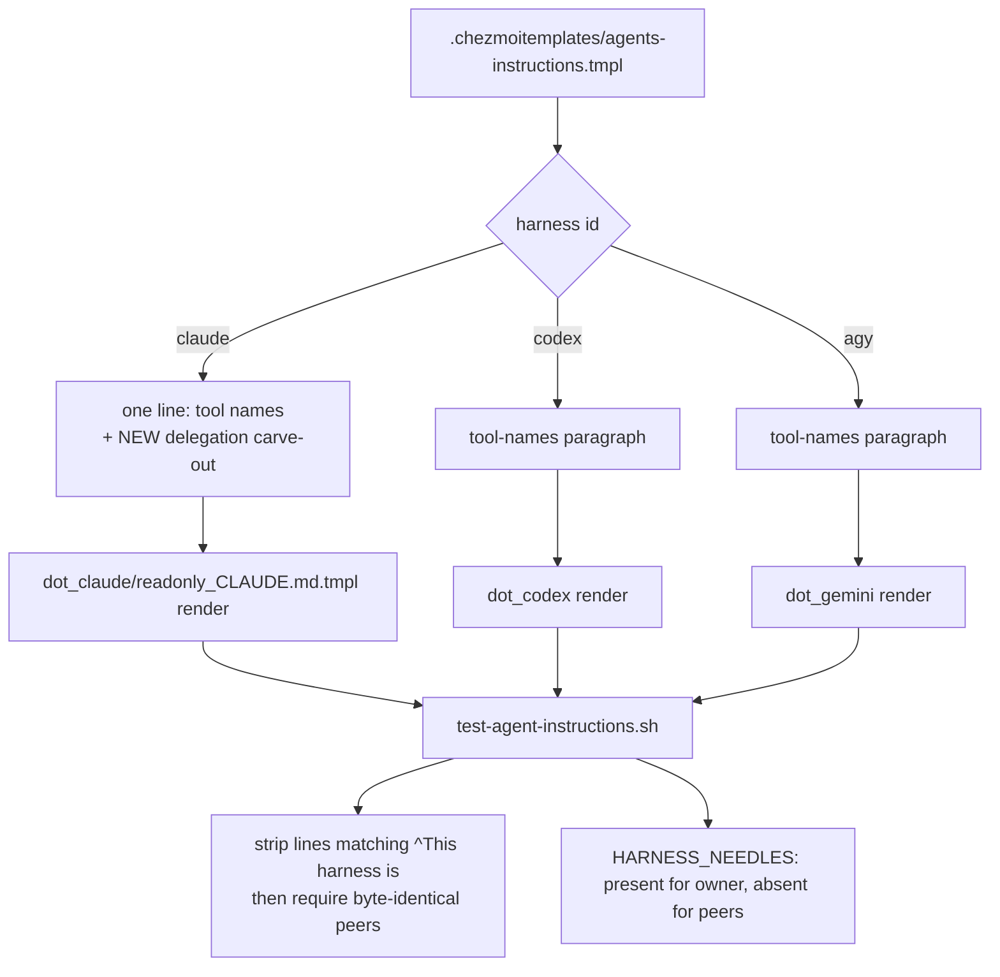

# Claude-Only Delegation Exception in the Agent Instruction Core - Plan

## Goal Capsule

**Objective.** When the operator invokes a Claude Code skill whose design depends on subagent dispatch — `lfg`, `ce-doc-review`, `ce-code-review` — the run carries the dispatch out instead of stopping to ask whether delegation is permitted.

**Means.** Extend the instruction core's Claude harness line with the carve-out sentences (KTD1), and pin their harness ownership through the existing needle matrix (KTD3).

**Authority.** Product behavior is owned by the R-IDs. Mechanism is owned by the KTDs. `AGENTS.md` and the instruction core's own header rule ("Edit this source template, never deployed instruction targets") are the repository authorities this plan binds to. The upstream harness instruction this plan reacts to is vendor-owned and is not modified.

**Stop conditions.** Stop and report rather than working around: the byte-identical peer-render gate in `.ci/test-agent-instructions.sh` cannot pass without editing `strip_harness_paragraph` or the peer-diff assertion — weakening that gate is not a fallback. `chezmoi` is on PATH in this checkout and the gate exits 0 on the unmodified worktree, so running it is a required done signal for U1 and U2, never an optional one.

**Execution profile.** Instruction-text work. Verification is the rendered-output needle gate plus a scratch render comparison, not a unit-test framework. No behavior in any script changes.

**Tail ownership.** This plan ends at a merged change. Running `chezmoi apply` to deploy the new `~/.claude/CLAUDE.md` is an operator choice, not a unit.

---

## Product Contract

### Summary

The Claude Code binary injects a system-prompt section that forbids calling the Agent (Task) tool, workflows, or deep research "unless the user requested it", with no exception clause. Skills in this operator's toolchain are built on subagent dispatch, so the injected sentence makes the agent stop and ask mid-run. Add a Claude-only paragraph to `.chezmoitemplates/agents-instructions.tmpl` that states the carve-out the vendor's own parallel wording already grants to a CLAUDE.md file or a skill.

### Problem Frame

Claude Code 2.1.263 renders a system-prompt section named `heron_brook` from a server-delivered string cached in `~/.claude.json` at `clientDataCacheSlots[...].data.tengu_heron_brook`. Its first two lines are `Do not call the AgentTool unless the user requested it` and `Do not use workflows or deep-research unless the user requested it`. The value is delivered per model, entrypoint, and organization; it is not a local setting and cannot be edited or disabled from this repository.

The same binary carries a second, semantically parallel section (`opus5_reduced_delegation`) whose text is `Do not use the Task tool, workflows, or deep-research unless the user, a CLAUDE.md file, or a skill asks for it`. That wording names a CLAUDE.md file and a skill as recognized exception sources, but it suppresses itself whenever the `heron_brook` value already covers the topic — which is this configuration. The sentence granting the carve-out is therefore absent exactly when the blocking sentence is present, and the instruction actually delivered carries no exception clause of its own.

So whether instruction-file text overrides the delivered sentence is **unconfirmed**. The vendor's parallel wording is evidence that an instruction file is a recognized exception source; it is not proof that this one will be honored. The plan proceeds anyway because this repository owns the file that renders to `~/.claude/CLAUDE.md`, which is the only lever available here, and the change costs one paragraph — a paragraph that does nothing is the whole downside. If a run still halts after the change is deployed, the operator answers the prompt manually and reports the behavior; the fallback is never to weaken another instruction or widen the carve-out until it takes effect.

The observed failure is concrete: a run of `lfg` reached `ce-doc-review` and halted to ask the operator whether the remaining stages could use subagent dispatch, even though the invoked skill defines that dispatch and the instruction core already requires `lfg` to run without pausing for confirmations.

### Key Decisions

- **Claude Code only.** The exception is rendered into the Claude harness branch alone; the Codex and Antigravity renders do not receive it. (session-settled: user-directed — chosen over placing it in the harness-agnostic body: the injected instruction exists only in the Claude Code binary, so the sentence is meaningless noise in the other two renders.) Governs R3.
- **Source template only.** The change lands in the chezmoi source template, never in a deployed instruction target. (session-settled: user-approved — chosen over editing the deployed `~/.claude/CLAUDE.md` directly: the next `chezmoi apply` overwrites a deployed edit, so the change would silently disappear.) Governs R7.

### Requirements

**Instruction content**

- R1. The rendered Claude instruction file states that when a skill, command, or workflow the user invoked directs a subagent dispatch, that dispatch counts as user-requested and is carried out without a separate confirmation.
- R2. The same text keeps the exception narrow: it does not authorize unrequested subagents, workflows, or deep research for ordinary work.
- R3. The exception text appears only in the Claude render. The Codex and Antigravity renders do not contain it.

**Structural invariants**

- R4. The three harness renders stay byte-identical outside lines beginning `This harness is `, so the existing peer-divergence assertion in `.ci/test-agent-instructions.sh` keeps passing unmodified.
- R5. `.ci/test-agent-instructions.sh` pins R1 and R3 by needle, asserting both presence in the Claude render and absence from the two peer renders.
- R6. `AGENTS.md`'s description of what the instruction core branches on stays accurate after the change.
- R7. Only checkout source state is edited. No deployed file under `$HOME` is modified, and no `chezmoi apply` is run.

### Success Criteria

- The acceptance signal for R1 is empirical and operator-owned. After the change is deployed with `chezmoi apply`, a session that invokes a subagent-dispatching skill performs the dispatch without stopping to ask, and the operator records that observed outcome. R1 through R7 are text, structure, and documentation checks: every one of them can pass while the halting behavior persists, so the observed run is the only signal that separates a working change from a merged no-op.
- The negative half holds at the same time: ordinary work that no skill or user asked to delegate still does not trigger an unrequested subagent, workflow, or deep-research call.
- Deployment and the observation sit outside this plan's units — this repository is edited here and applied by the operator — so a red observation reopens the approach rather than failing CI.

### Scope Boundaries

- The vendor-delivered `tengu_heron_brook` value is read-only server state. This plan does not edit, clear, or intercept it.
- `~/.claude/settings.json`, the Orca launcher, and every other injection surface were checked and carry none of this text. They are untouched.
- No repository skill, plugin, or `.agents/` asset is changed. The exception is instruction text alone. The vendor's wording names a skill as an exception source too, and that half is deliberately not taken: the skills in question are vendor-owned assets outside this checkout, so this repository cannot carry their wording.
- The exception targets this operator's own Claude Code sessions. The delivered value is keyed by model, entrypoint, and organization, so a single observed run confirms the seat it ran on and nothing more. This plan defines no supported-configuration matrix and promises no behavior on a seat that delivers a different value; a still-halting seat is a new observation to report, not a defect in this change.

### Assumptions

- The exception is worded for the Agent (Task) tool plus workflows and deep research, matching the three surfaces the injected sentence names, rather than for subagents alone. A narrower sentence would leave a skill that legitimately calls a workflow still blocked.
- Whether the instruction file overrides the delivered sentence is unconfirmed, as the Problem Frame records. The plan is written so this stays a cheap bet: if the observed run in Success Criteria comes back red, the change is one paragraph to remove, and nothing else in the repository depends on it.
- The needle is added to the `HARNESS_NEEDLES` ownership matrix rather than the plain `NEEDLES` list, because only the ownership matrix asserts absence from the peer renders, which is what R3 requires.

### Sources

- `.chezmoitemplates/agents-instructions.tmpl:27-33` — the existing harness branch, one unwrapped paragraph per harness.
- `.ci/test-agent-instructions.sh:53-62` — `strip_harness_paragraph` and the peer byte-identity assertion that constrains where Claude-only text may live.
- `.ci/test-agent-instructions.sh:64-81` — the `HARNESS_NEEDLES` presence-and-absence matrix.
- `AGENTS.md:68` — the sentence describing what the core branches on.
- `~/.claude.json`, key `clientDataCacheSlots[...].data.tengu_heron_brook` — the injected text, read during investigation. Live tool state, deliberately unmanaged per `AGENTS.md:62`.

---

## Planning Contract

### Key Technical Decisions

- KTD1. **Extend the existing Claude harness line; do not add a second paragraph.** `.ci/test-agent-instructions.sh` strips only lines matching `^This harness is ` and then requires the three renders to be byte-identical. A separate paragraph needs a blank line before it, and that blank line is not stripped — it survives in the Claude render with no counterpart in the peers, so the diff fails with `diverges from claude.md outside its harness paragraph`. Appending the carve-out sentences to the line that already opens `This harness is Claude Code.` keeps the whole Claude-owned block inside the one stripped line. Serves R4.
- KTD2. **Reject relaxing `strip_harness_paragraph`.** The alternative — teaching the stripper about a second Claude-only marker, or narrowing the peer diff — would weaken the one assertion that catches unintended harness divergence, to buy a paragraph break. Serves R4.
- KTD3. **Pin the exception through `HARNESS_NEEDLES`, not `NEEDLES`.** `NEEDLES` greps the Claude render only, so it would satisfy R1 but leave R3 unproven. `HARNESS_NEEDLES` asserts the needle is present for its owner and absent from every other harness, which is exactly the Claude-only claim. Serves R5.
- KTD4. **Keep the Claude block one physical line.** Every harness paragraph in the core is a single unwrapped line, and the stripper is line-granular. A wrapped paragraph would leave its continuation lines in the peer diff. The cost is that the carve-out reads as part of the harness paragraph rather than as its own; that is the only shape the gate admits without being edited, and KTD2 settles that trade. Serves R4.

### High-Level Technical Design

The Claude arm still emits exactly one line, so the strip removes one line from each of the three renders and the diff compares identical remaining bodies. Adding a second line — with the blank line a separate paragraph requires — is what breaks it.

### Proposed text

Directional, not a byte specification — the implementer may tighten the wording as long as R1, R2, and KTD1/KTD4 hold, and the needles in U2 quote whatever text actually lands. It is appended to the existing Claude harness line, continuing the same sentence run:

> … `Bash` runs commands only and MUST NOT apply the change itself. One delegation carve-out also applies here: a standing harness instruction may tell the agent not to call the Agent (Task) tool, workflows, or deep research unless the user requested it, and this file is a recognized exception source for it. When a skill, command, or workflow the user invoked by name directs a subagent dispatch, that dispatch IS user-requested — carry it out and do not stop to ask for a separate confirmation; a skill the agent selected on its own does not qualify, and a subagent does not re-claim this carve-out for dispatches of its own. The carve-out covers only the delegation the invoked skill defines; it does not authorize unrequested subagents, workflows, or deep research for ordinary work.

The trigger clause names the invocation source and the depth on purpose. Without "by name", a skill the harness selects by description match satisfies the predicate on its own; without the depth clause, a dispatched subagent that reaches a dispatching skill re-claims the same carve-out, and a run fans out without the operator ever asking for delegation.

### Sequencing

U1 lands the text. U2 pins it and therefore quotes U1's final wording. U3 corrects the repository description. U2 and U3 both depend on U1; they do not depend on each other.

---

## Implementation Units

### U1. Claude-only delegation exception in the instruction core

- **Goal:** The Claude render carries the exception; the peer renders do not.
- **Requirements:** R1, R2, R3, R4, R7.
- **Files:** `.chezmoitemplates/agents-instructions.tmpl`
- **Approach:** Inside the existing `{{ if eq .harness "claude" }}` arm, append the Proposed text to the end of the current file-tool line — same physical line, no blank line, no second paragraph (KTD1, KTD4). Do not touch the `codex` or `agy` arms, and do not add anything outside the conditional. Keep the surrounding `{{- ... -}}` whitespace trimming as it is, so all three renders keep their current blank-line structure.
- **Test scenarios:**
  - Happy path: rendering `dot_claude/readonly_CLAUDE.md.tmpl` into the scratch destination produces a file containing the carve-out sentence.
  - Isolation: rendering `dot_codex/readonly_AGENTS.md.tmpl` and `dot_gemini/readonly_AGENTS.md.tmpl` produces files containing neither the carve-out sentence nor the phrase `delegation carve-out`.
  - Structural: after removing every line matching `^This harness is ` from all three renders, the three results are byte-identical.
  - Edge case: the Claude arm still emits one harness line — `grep -c '^This harness is '` returns `1` on all three renders, and the Claude render's line is the longest.
  - Regression: the existing Claude tool-names needle in `.ci/test-agent-instructions.sh` still matches, because appending to a line preserves every substring already in it.
- **Verification:** `.ci/test-agent-instructions.sh` passes.

### U2. Pin the exception in the harness ownership matrix

- **Goal:** A future edit that drops the exception, or that leaks it into a peer harness, fails CI.
- **Requirements:** R5, R3.
- **Files:** `.ci/test-agent-instructions.sh`
- **Approach:** Add `claude|<needle>` rows to the `HARNESS_NEEDLES` heredoc (KTD3), quoting the wording U1 actually shipped. Use three rows, one per sentence of the carve-out — the opening clause, the operative grant, and the limiter. Every load-bearing sentence needs its own row: the peer diff strips this line entirely, so a needle is the only assertion over it, and a row that quotes less than a whole sentence lets the uncovered half be reworded with the gate still green. The row format is `owner|needle`: the loop reads with `IFS='|'` into two variables, so the owner id must precede the first `|` and the needle is the entire remainder, any further pipes included. Update the comment above the heredoc, which today says the block asserts native file-tool names only, to say it asserts each harness's own paragraph content.
- **Test scenarios:**
  - Happy path: the script exits 0 against the U1 template.
  - Failure path: temporarily reverting U1's template edit makes the script fail with `claude lost its harness rule: ...` naming the new needle.
  - Failure path: temporarily moving the carve-out text outside the `claude` conditional makes the script fail with `agy leaked claude's harness rule: ...` — `harness_ids` is ordered `(claude agy codex)` and `fail` exits on the first non-owner render checked, so `agy` is the harness that will be named, never `codex`.
  - Failure path: deleting the limiter sentence alone, and separately loosening the trigger clause alone, each fail — the per-sentence rows are what make a partial edit visible.
  - Failure path: appending a retired mandate from the `BANNED` list to the **codex** harness line fails with `retired instruction reintroduced in codex: ...`. That scan reads every render, not only the Claude one, because the harness lines are stripped before the peer diff and would otherwise carry a retired mandate through unseen.
  - Edge case: `bash -n .ci/test-agent-instructions.sh` reports no syntax error, and the heredoc still terminates at `HARNESS_NEEDLES`.
- **Verification:** `.ci/test-agent-instructions.sh` passes; the two failure paths are reproduced and then reverted.

### U3. Correct the repository description of harness branching

- **Goal:** `AGENTS.md` still describes what the core actually branches on.
- **Requirements:** R6.
- **Files:** `AGENTS.md`
- **Approach:** In the managed-instruction-targets paragraph, the clause `which today is the native file-tool names` is now incomplete. Replace it with wording that names both harness-owned paragraphs: the native file-tool names for all three, plus the Claude-only delegation exception. Keep the rest of the paragraph, including the `.ci/test-agent-instructions.sh` reference, unchanged.
- **Test scenarios:**
  - Happy path: the paragraph names both branch contents and still names the gate that asserts them.
  - Edge case: no other `AGENTS.md` sentence claims the renders differ only in tool names.
- **Verification:** `Test expectation: none -- documentation prose with no rendered target; correctness is read, not asserted.`

---

## Verification Contract

| Command | Applies to | Done signal |
|---|---|---|
| `.ci/test-agent-instructions.sh` | U1, U2 | Exit 0, prints `agent instruction gates passed` |
| `bash -n .ci/test-agent-instructions.sh` | U2 | Exit 0 |
| Scratch render of all three wrappers per `AGENTS.md` "Verification" (stub `op`, empty config, throwaway destination, `--source "$PWD"`) | U1 | Claude render contains the exception; peer renders do not |
| `git diff --check` | all | No whitespace errors |
| `git status` and a diff limited to the three files | all | Only `.chezmoitemplates/agents-instructions.tmpl`, `.ci/test-agent-instructions.sh`, `AGENTS.md`, and this plan are changed |

The repository's mandatory render contract applies to every run: stub `op` on a `PATH` of `"$scratch/bin:/usr/bin:/bin"` only, an empty config, a throwaway destination under the scratch directory, and `--source "$PWD"`. `.ci/test-agent-instructions.sh` already implements it through `.ci/lib/render-gate-helpers.sh`; do not hand-roll a render.

## Definition of Done

- R1 through R7 hold.
- `.ci/test-agent-instructions.sh` passes, and both U2 failure paths were reproduced and reverted before commit.
- The Success Criteria observation is either recorded or explicitly named as pending operator deployment. This plan's units do not run `chezmoi apply`, so an unrecorded observation is a stated open item at hand-off, never an implied pass.
- No deployed file under `$HOME` was written, and `chezmoi apply` was not run.
- No experimental or dead-end edit survives in the diff — no commented-out wording variants, no scratch render files, and no temporary needle rows.
- The commit stays on the current branch with a lowercase Conventional Commit subject.
