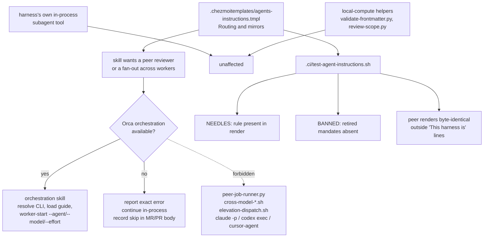

# Orchestration-First Agent Dispatch in the Instruction Core - Plan

## Goal Capsule

**Objective.** When a skill running on this host puts an agent outside the current session — a peer reviewer, a cross-model opinion, or work fanned out across several workers — that agent runs under Orca, where the operator can see it, wait on it, and kill it with the session. Today a compound-engineering skill launches a detached process that Orca knows nothing about and that survives the session that started it.

**Means.** Add one orchestration-first dispatch rule to the "Routing and mirrors" section of `.chezmoitemplates/agents-instructions.tmpl` (KTD1), and pin its load-bearing sentences by needle in `.ci/test-agent-instructions.sh` (KTD4).

**Authority.** Product behavior is owned by the R-IDs; mechanism by the KTDs. `AGENTS.md` and the instruction core's own header rule ("Edit this source template, never deployed instruction targets") bind this plan. The `orchestration` skill at `~/.agents/skills/orchestration/SKILL.md` is an external, version-drifting authority: it is cited, never copied. The `compound-engineering` plugin is vendor-owned and is not modified.

**Stop conditions.** Stop and report rather than working around: the `BANNED` list in `.ci/test-agent-instructions.sh` names retired delegation mandates this repository deliberately removed — if the new wording matches one of those needles, reword the rule, never edit or shorten the `BANNED` list. The byte-identical peer-render assertion is likewise not a thing to relax; this rule is harness-agnostic and must render identically into all three targets.

**Execution profile.** Instruction-text work. Verification is the rendered-output needle gate plus a scratch render, not a unit-test framework. No script behavior changes and no runtime code is touched.

**Tail ownership.** This plan ends at a merged change to checkout source state. Running `chezmoi apply` to deploy the new instruction files is an operator choice, not a unit.

---

## Product Contract

### Summary

The `compound-engineering` skills carry their own agent-dispatch machinery: a detached job runner (`peer-job-runner.py`), cross-model review launchers (`cross-model-adversarial-review.sh`, `cross-model-doc-review.sh`, `cross-model-pov.sh`), and a fan-out dispatcher (`elevation-dispatch.sh`). These launch peer agents as ordinary detached processes and shell out to `claude -p`, `codex exec`, and `cursor-agent` directly. This host runs Orca, which owns agent lifecycle, and the `orchestration` skill is the sanctioned coordination surface. Add a rule to the shared instruction core that makes Orca orchestration the required dispatch path, names the prohibited fallbacks, and states what happens when Orca is unavailable.

### Problem Frame

`~/.agents/skills/orchestration/SKILL.md` states the constraint plainly: "Coordination requires real Orca runtime state; never substitute a non-Orca subagent tool." The bundled dispatchers break it, and the plugin's own reference documents say so on purpose — `ce-doc-review/references/cross-model-review.md:86` reads "Each call is a CLI shell-out, not a subagent. ... Launch each call as a detached job through `scripts/peer-job-runner.py`".

Four consequences follow, and they are operator-visible rather than theoretical:

- A detached worker has no Orca task state, so there is no `worker_done` signal, no escalation path, and nothing in the Orca UI to look at while a review runs.
- Job state lives in ad-hoc on-disk run directories with their own reaping and 24-hour sweeps, duplicating bookkeeping Orca already does.
- Provider selection and permission handling are re-implemented per skill through `CROSS_MODEL_*` environment variables and sandbox-escalation notes, diverging from Orca's own model and permission handling.
- Killing the session leaves the workers running, because nothing in Orca owns them.

Orca can carry the work these scripts do. `orca orchestration worker-start --task <id> --agent codex|claude|grok|… --model <opaque-provider-model-id> --effort <level>` starts a worker on a named agent family with a pinned model and reasoning effort, reported back as `launch.requested` and `launch.effective` in the receipt. So the cross-model pass — a peer on a *different* model family — is a capability Orca has, not one this rule deletes. Two caveats belong in the implementer's view: `--effort` requires `--model`, neither combines with `--terminal`, and the connected worker server must advertise launch-preference support before Orca forwards them.

The instruction core is the right lever. The plugin is installed from an upstream marketplace at a pinned version, so editing its scripts is not durable across upgrades; the shared instruction core is repository-owned and reaches every harness and every session.

The core already carries the adjacent half of this rule — "A subagent inherits no conversation history, so a dispatch prompt MUST be self-contained" — in the same "Routing and mirrors" section. That sentence governs *what a dispatch prompt says*. This change adds *which surface carries the dispatch*.

### Key Decisions

- **Dispatch only, not every bundled script.** The rule governs agent dispatch and coordination. A plugin script that only computes locally — a frontmatter validator, a review-scope calculator — is untouched. (Chosen over covering every plugin-bundled script: a local computation has no agent to place under Orca, so covering it would forbid useful work for no lifecycle gain and invite the agent to route arithmetic through a coordinator.) Governs R6.
- **Describe the class, name examples non-exhaustively.** The prohibition is written against the *shape* — a plugin-bundled job runner, peer-review launcher, or fan-out script — with today's four filenames given as illustration and an explicit statement that successors are covered. (Chosen over an exhaustive filename list, which goes stale on the next plugin release and reads as permission for any file not listed, and over a pure class description, which gives the agent nothing concrete to match.) Governs R2.
- **Unavailable orchestration degrades; it does not stop the run.** When Orca is down or the resolved executable errors, the agent reports the blocker with its exact error, continues in-process, and records that the peer pass did not happen. It never falls through to the bundled script. (Chosen over halting an `lfg` run: the autopilot paragraph in the same section requires `lfg` to drive every stage to completion itself, so a hard stop here would contradict the neighbouring rule and strand a branch mid-pipeline. Also chosen over silent in-process substitution, which hides a missing peer review from the operator.) Governs R4, R5.

### Requirements

**Instruction content**

- R1. The rendered instruction files state, in RFC 2119 terms, that a dispatch which places a worker outside the current session — a peer or cross-model reviewer, or a fan-out across several workers — MUST go through the `orchestration` skill and the Orca CLI that skill resolves. The same text says the harness's own in-process subagent tool is not the dispatch this rule routes.
- R2. The same text prohibits the bundled fallbacks: a plugin-bundled job runner, peer-review launcher, or fan-out script, described as a class with today's filenames as non-exhaustive examples.
- R3. The same text prohibits reaching a peer model by running an agent CLI (`claude -p`, `codex exec`, `cursor-agent`) directly for that opinion.
- R4. The same text delegates CLI resolution and guide loading to the `orchestration` skill by reference, and says explicitly that command details are not duplicated because they drift between Orca releases.
- R5. The same text states the unavailable-orchestration behavior: report the blocker with its exact error, continue in-process, record that the peer pass did not happen, and never fall through to the bundled script — including during an `lfg` run. It names the MR/PR description as the record's destination for an unattended run, matching the committed-record fallback the core already uses for unapplied review findings.
- R5a. The same text states that the rule fixes the path a dispatch takes, never whether to dispatch.
- R6. The same text exempts plugin-bundled scripts that only compute locally.
- R7. The rule sits in the existing "Routing and mirrors" section of the instruction core, adjacent to the self-contained-dispatch-prompt sentence it complements.

**Structural invariants**

- R8. The rule is harness-agnostic: it renders identically into the Claude, Codex, and Antigravity targets, so the byte-identical peer-render assertion in `.ci/test-agent-instructions.sh` keeps passing unmodified.
- R9. No sentence of the new rule matches any needle in the `BANNED` heredoc of `.ci/test-agent-instructions.sh`. The retired delegation mandates stay retired.
- R10. `.ci/test-agent-instructions.sh` pins R1 through R6 by needle against the rendered target.
- R11. Only checkout source state is edited. No deployed file under `$HOME` is modified, and `chezmoi apply` is not run.

### Success Criteria

- The rendered instruction files carry the rule and the gate asserts it, so a later edit that drops a clause fails CI rather than silently shipping.
- The acceptance signal for the behavior itself is operator-owned and empirical: after the operator deploys with `chezmoi apply`, a run that reaches a cross-model or peer review either creates Orca tasks for that review, or reports that Orca orchestration is unavailable and says the peer pass was skipped. What must not appear is a silent `peer-job-runner.py` launch.
- That signal has an owner and a shape, because the competing instruction is stronger than this one: the plugin's own reference hands the agent a literal `peer-job-runner.py start …` command line at dispatch time, and a general rule losing to a specific in-context command is the realistic failure. The trial is one `ce-doc-review` run after deployment, inspected two ways — its Coverage line, and `pgrep -af peer-job-runner` during the run. The Definition of Done carries it as an item, so the issue does not close on a green gate alone.
- The negative half holds at the same time: ordinary local work does not start routing itself through a coordinator, and `validate-frontmatter.py`-shaped helpers still run normally.
- Deployment and that observation sit outside this plan's units. A red observation reopens the wording rather than failing CI.

### Scope Boundaries

- The `compound-engineering` plugin is not modified. Its scripts stay on disk; the instruction core tells the agent not to run the dispatching ones.
- No repository skill, `.agents/` asset, `agents.toml`, or `agents.lock` entry changes. This is instruction text alone.
- Orca itself is not changed, and no Orca command is documented here. Every command detail stays behind the `orchestration` skill reference (KTD2).
- `ce-work`'s implementation engine and other write-side delegation are not carved out by name. The rule is written around coordination-shaped dispatch, and an implementation engine that the operator's own invoked skill runs in-process is not a peer-review fan-out; if a future run finds the boundary genuinely ambiguous, that is a wording follow-up, not a reason to widen the rule now.
- `AGENTS.md` needs no edit: it describes the template's harness branching and its manifest row, and this change adds neither a branch nor a file.

### Assumptions

- The rule constrains the *path* a dispatch takes, never whether to dispatch. This distinction is what keeps it clear of the delegation *mandates* in the `BANNED` list, which required delegation. The wording must not acquire an obligation to delegate.
- That distinction does not cover R3, and the plan says so rather than routing around it. `BANNED` retired the literal `MUST NOT invoke an agent CLI`, which is itself a path prohibition. R3 reinstates it in narrowed form — scoped to obtaining a peer opinion, where the retired one was unqualified. The narrowing is deliberate and issue-mandated: acceptance criterion 2 of issue #433 asks the rule to name direct provider-CLI shell-outs for peer opinions as a prohibited fallback. A reviewer should read R3 as a scoped reopening of that removal, not as an accident of wording.
- The rule is not a blanket prohibition on the harness's own subagent tool: R1's trigger is a dispatch that places a worker outside the current session, and "in-process" is the named degraded path. This keeps it consistent with the Claude-only delegation carve-out the gate already pins, which says a dispatch directed by a user-invoked skill is carried out without a separate confirmation. The prohibition stays specific: the bundled dispatcher and the direct provider-CLI shell-out.
- Issue AC5 asks that `chezmoi apply` render the template into all three targets with no template errors. This plan satisfies it through the repository's scratch render — stub `op`, empty config, throwaway destination, `--source "$PWD"` — which is the same render path with no deployment. `AGENTS.md` forbids applying to `$HOME` unless the operator asks, so a literal `chezmoi apply` is not a unit here.
- The change adds prose to a harness-agnostic section, so no `HARNESS_NEEDLES` row is needed; the plain `NEEDLES` list, which greps the Claude render, is the correct home given R8 guarantees the peer renders are byte-identical there.

### Sources

- `https://github.com/hyperlapse122/dotfiles/issues/433` — origin issue, including its three open questions, resolved above as Key Decisions.
- `.chezmoitemplates/agents-instructions.tmpl:15-21` — the "Routing and mirrors" section: the `ce-work`/`ce-debug` line, the self-contained-dispatch-prompt sentence, and the `lfg` autopilot paragraph.
- `~/.agents/skills/orchestration/SKILL.md` — the coordination rule, the CLI resolution ladder, and the `ORCA skills get orchestration` guide-loading step. Deliberately a discovery stub that refuses to list subcommands.
- `orca-ide skills get orchestration` — the version-matched guide the stub points at, read during planning. It carries `worker-start --agent … --model … --effort …`, the `--effort` requires `--model` constraint, the no-`--terminal` combination, the worker-server launch-preference precondition, and the `launch.requested` / `launch.effective` receipt fields. This is the evidence that Orca can host a different-model peer.
- `.ci/test-agent-instructions.sh:61-69` — `strip_harness_paragraph` and the peer byte-identity assertion.
- `.ci/test-agent-instructions.sh` `NEEDLES` heredoc — the harness-agnostic presence gate.
- `.ci/test-agent-instructions.sh` `BANNED` heredoc — the retired delegation mandates, scanned against every render.
- `AGENTS.md:68` — what the instruction core branches on and which gate asserts it.
- `docs/plans/2026-09-08-1730-docs-claude-only-delegation-exception-plan.md` — the immediately preceding change to the same file and the same gate.

---

## Planning Contract

### Key Technical Decisions

- KTD1. **Extend "Routing and mirrors" with new body paragraphs, not a new H2 section.** The issue proposes this placement and the section already owns dispatch-prompt content, so the two rules read as one contract: this one says which surface carries the dispatch, the existing one says what the prompt must contain. A new H2 would separate them and invite the reader to treat prompt shape and dispatch path as unrelated. Serves R7.
- KTD2. **Cite the `orchestration` skill for CLI resolution and guide loading; duplicate no command.** The orchestration stub exists precisely so command details cannot drift from the binary, and it says so. Naming `ORCA_CLI_COMMAND`, `orca-dev`, `orca-ide`, and the bare-`orca` screen-reader hazard inside the instruction core would copy a ladder that the stub already owns and that changes between Orca releases. The rule therefore points at the skill and states the reason for not copying, which is itself load-bearing text a future editor needs. Serves R4.
- KTD3. **Word the prohibition against the dispatcher's shape, with examples that do not claim to be complete.** `peer-job-runner.py`, `cross-model-adversarial-review.sh`, `cross-model-doc-review.sh`, `cross-model-pov.sh`, and `elevation-dispatch.sh` are named as today's instances, introduced by "they include" rather than "those are", and followed by an explicit sentence that any successor of the same shape is covered. The wording matters because U2 freezes this sentence into CI: an enumeration that reads as exhaustive tells an agent that a contemporary the list missed — `cross-model-pov.sh` was one — is permitted, and "successor" does not reach a script that already exists. Filenames alone rot on the next plugin bump; a bare class description gives the agent nothing to match against a concrete path. `cross-model-work.sh` is deliberately left out, matching the Scope Boundaries decision not to carve out write-side delegation by name. Serves R2.
- KTD4. **Pin the rule through `NEEDLES`, not `HARNESS_NEEDLES`.** `HARNESS_NEEDLES` asserts presence for one harness and absence from the others, which is the wrong claim for a rule every harness receives. `NEEDLES` greps the Claude render, and the peer byte-identity assertion carries the claim to the other two. Serves R10, R8.
- KTD5. **Check the new wording against `BANNED` before the gate does.** The `BANNED` heredoc holds retired delegation mandates including "MUST NOT invoke an agent CLI" and "never by spawning another agent as a subprocess" — phrases a plausible draft of this very rule could reproduce verbatim. The check is a `grep -F` of each `BANNED` needle against the draft text, run while writing, so the failure is caught at the keyboard rather than as a red gate. Serves R9.
- KTD6. **One sentence per needle.** The three issue-filing paragraphs of this file are single unwrapped multi-thousand-character lines, and the gate's own header comment records why: a line-granular diff cannot tell a correct edit from one that silently drops a neighbouring MUST. Every load-bearing sentence of the new rule therefore gets its own needle row, and each row quotes a whole clause rather than a fragment. Serves R10.

### High-Level Technical Design

The forbidden arm is drawn as a dashed edge on purpose: it is the path that exists today and that the rule closes. The degraded arm is a real, supported outcome, not an error state.

### Proposed text

Directional, not a byte specification — the implementer may tighten the wording as long as R1 through R9 hold, and U2's needles quote whatever text actually lands. It follows the self-contained-dispatch-prompt sentence and precedes the `lfg` autopilot paragraph.

> When work needs an agent outside the current session — a peer or cross-model reviewer, or a fan-out across several workers — that dispatch MUST go through the `orchestration` skill and the Orca CLI it resolves. Orca owns agent lifecycle on this host, so a dispatch it does not own carries no task state, no `worker_done` signal, no escalation path, and no visibility, and its workers outlive the session that started them. The harness's own in-process subagent tool is not the dispatch this rule routes. Resolve the executable and load the version-matched guide exactly as the `orchestration` skill directs; never copy command details here, because they change between Orca releases.
>
> A skill that ships its own dispatcher does not change this. MUST NOT run a plugin-bundled job runner, peer-review launcher, or fan-out script to obtain a peer opinion — in `compound-engineering` today they include `peer-job-runner.py`, `cross-model-adversarial-review.sh`, `cross-model-doc-review.sh`, `cross-model-pov.sh`, and `elevation-dispatch.sh`, and the prohibition covers every script of that shape, named here or not, in this plugin version or a later one. MUST NOT reach a peer model by running an agent CLI such as `claude -p`, `codex exec`, or `cursor-agent` for that opinion. A bundled script that only computes locally, such as a frontmatter validator or a review-scope calculator, is not dispatch and stays allowed.
>
> This rule fixes the path a dispatch takes, never whether to dispatch. When Orca orchestration is unavailable — the app is not running, or the resolved executable reports an error — report the blocker with its exact error, continue with the harness's own in-process reasoning, and record that the peer or cross-model pass did not happen; in an unattended run that record goes in the MR/PR description, beside the unapplied-findings checklist. A `lfg` run degrades this way and keeps going. It does not stop, and it does not fall back to the bundled script.

The "never whether to dispatch" sentence is load-bearing rather than decorative. Without it the paragraph reads as an endorsement of the retired delegation regime that `.ci/test-agent-instructions.sh` bans, and a future editor could reasonably extend it in that direction.

The degraded path names the MR/PR description for the same reason. `lfg` is the one mode the rule names by name, and it drives to a merged PR with nobody watching the terminal — so "the run's output" alone has no durable home there, and the skipped peer pass becomes invisible to exactly the operator the Problem Frame is trying to serve. The instruction core already uses the MR/PR description as its committed-record fallback for unapplied review findings, so this reuses a convention in the same file rather than inventing one.

### Sequencing

U1 lands the text. U2 pins it and therefore quotes U1's final wording. U2 depends on U1 and there is no third unit — `AGENTS.md` needs no edit (Scope Boundaries).

---

## Implementation Units

### U1. Orchestration-first dispatch rule in the instruction core

- **Goal:** All three rendered instruction files carry the rule, in the "Routing and mirrors" section, worded so no `BANNED` needle matches.
- **Requirements:** R1, R2, R3, R4, R5, R5a, R6, R7, R8, R9, R11.
- **Files:** `.chezmoitemplates/agents-instructions.tmpl`
- **Approach:** Insert the Proposed text as new paragraphs between the existing self-contained-dispatch-prompt sentence (line 19) and the `lfg` autopilot paragraph (line 21), per KTD1. Write it outside every `{{ if eq .harness ... }}` conditional so all three renders receive identical bytes (R8, KTD4). Follow the file's own convention: one paragraph per unwrapped line, blank line between paragraphs, no fixed-width wrapping. Cite the `orchestration` skill for CLI resolution and the guide-loading step rather than restating any command (KTD2). Before saving, run the `BANNED` check described in the test scenarios (KTD5).
- **Execution note:** Check the draft against `BANNED` before the gate runs, not after. The overlap risk is concrete — a natural phrasing of this rule can land on "MUST NOT invoke an agent CLI" verbatim.
- **Test scenarios:**
  - Happy path: rendering `dot_claude/readonly_CLAUDE.md.tmpl` into the scratch destination produces a file containing all three new paragraphs, each in the "Routing and mirrors" section between the dispatch-prompt sentence and the `lfg` paragraph.
  - Structural: after removing every line matching `^This harness is ` from all three renders, the three results are byte-identical — the new text is harness-agnostic and adds no conditional.
  - Structural: `grep -c '^This harness is '` still returns `1` on each of the three renders.
  - Regression: every needle already in the `NEEDLES` and `HARNESS_NEEDLES` heredocs still matches; inserting a paragraph changes no existing line.
  - Error path: extracting each `BANNED` needle and running `grep -F` for it against the rendered Claude file finds no match. Reproduce the guard by temporarily **appending** the literal `MUST NOT invoke an agent CLI` as an extra sentence — never by rewording an existing one — and confirming `.ci/test-agent-instructions.sh` fails with `retired instruction reintroduced in claude: ...`, then revert. Appending is what makes the `BANNED` loop the assertion that fires: the `NEEDLES` presence loop runs first, so once U2 has pinned the agent-CLI sentence, rewording it deletes its needle and trips `lost rule: ...` instead.
  - Edge case: the rendered text names no Orca subcommand, environment variable, or executable-selection order — the only Orca-specific tokens are the skill name `orchestration`, the word Orca itself, and the lifecycle vocabulary `worker_done` (KTD2).
  - Edge case: the exemption sentence renders, so an agent reading the rule can still run `validate-frontmatter.py`-shaped local helpers (R6).
- **Verification:** `.ci/test-agent-instructions.sh` passes.

### U2. Pin the dispatch rule in the instruction gate

- **Goal:** A later edit that drops any load-bearing clause of the rule fails CI instead of shipping quietly.
- **Requirements:** R10, R9.
- **Files:** `.ci/test-agent-instructions.sh`
- **Approach:** Add rows to the `NEEDLES` heredoc (KTD4), one per load-bearing sentence of the wording U1 actually shipped (KTD6). Cover at minimum: the orchestration-and-Orca-CLI mandate and its in-process-subagent exclusion (R1), the bundled-dispatcher prohibition including its not-only-these-names clause (R2), the agent-CLI prohibition (R3), the never-copy-command-details clause (R4), the local-compute exemption (R6), the path-not-whether sentence (R5a), and the degraded-path sentence including both the MR/PR destination and the no-fallback half (R5). Quote whole clauses, never fragments: a needle that covers half a sentence lets the other half be reworded with the gate green. Do not add anything to `HARNESS_NEEDLES` and do not modify `BANNED`, `strip_harness_paragraph`, or the peer-diff assertion.
- **Test scenarios:**
  - Happy path: the script exits 0 against the U1 template and prints `agent instruction gates passed`.
  - Failure path: moving the new paragraphs inside the `claude` conditional makes the run fail on the peer byte-identity assertion with `diverges from claude.md outside its harness paragraph`, not on a needle. This is the one U2 failure path worth reproducing — it proves the rule is harness-agnostic, which no needle asserts. Reproducing a needle's own deletion is tautological: the gate is a literal `grep -F` loop, so removing quoted text cannot fail to fail.
  - Edge case: `bash -n .ci/test-agent-instructions.sh` reports no syntax error, and the `NEEDLES` heredoc still terminates at `NEEDLES`.
  - Edge case: no needle text contains a `|` character, which would be harmless in `NEEDLES` but would corrupt a row if the needle were later moved to the `IFS='|'` matrix.
- **Verification:** `.ci/test-agent-instructions.sh` passes; the failure paths are reproduced and then reverted.

---

## Verification Contract

| Command | Applies to | Done signal |
|---|---|---|
| `.ci/test-agent-instructions.sh` | U1, U2 | Exit 0, prints `agent instruction gates passed` |
| `bash -n .ci/test-agent-instructions.sh` | U2 | Exit 0 |
| `.ci/test-agent-instructions.sh` (already renders all three wrappers and diffs them) | U1 | All three renders contain the rule and are byte-identical outside `This harness is ` lines |
| `.ci/test-agent-instructions.sh` (already scans every `BANNED` needle against every render) | U1 | No match |
| `git diff --check` | all | No whitespace errors |
| `git status` and a diff limited to the changed files | all | Only `.chezmoitemplates/agents-instructions.tmpl`, `.ci/test-agent-instructions.sh`, and this plan are changed |

The repository's mandatory render contract applies to every run: stub `op` on a `PATH` of `"$scratch/bin:/usr/bin:/bin"` only, an empty config, a throwaway destination under the scratch directory, and `--source "$PWD"`. `.ci/test-agent-instructions.sh` already implements it through `.ci/lib/render-gate-helpers.sh`; do not hand-roll a render.

## Definition of Done

- R1 through R11, R5a included, hold.
- `.ci/test-agent-instructions.sh` passes, and the U1 `BANNED` guard and U2's harness-conditional placement path were each reproduced and reverted before commit.
- The five acceptance criteria of issue #433 are met, with AC5 read as the scratch render per Assumptions: deployment stays operator-owned and `chezmoi apply` is not run by this plan.
- The post-deploy trial in Success Criteria is scheduled and owned: the operator runs one `ce-doc-review` after `chezmoi apply`, inspects its Coverage line and `pgrep -af peer-job-runner` during the run, and records the outcome on issue #433 before it is closed. A green gate does not close the issue on its own.
- The Success Criteria observation is either recorded or explicitly named as pending operator deployment. An unrecorded observation is a stated open item at hand-off, never an implied pass.
- No deployed file under `$HOME` was written.
- No experimental or dead-end edit survives in the diff — no commented-out wording variants, no scratch render files, no temporary needle rows, and no edit to `BANNED`.
- The commit stays on the current branch with a lowercase Conventional Commit subject, and the PR description carries `Closes #433`.
