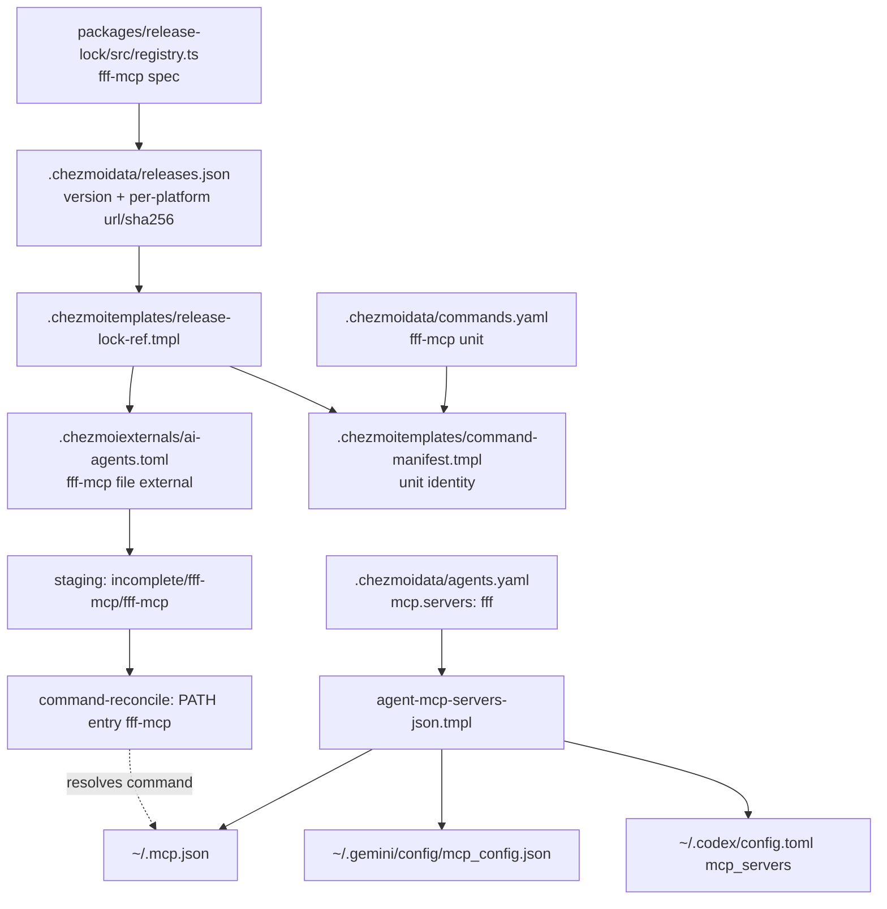

# fff-mcp as a Locked External Binary - Plan

## Goal Capsule

- **Objective:** Every managed agent session on a managed host can search files and file contents through the `fff` MCP tools without the operator installing anything by hand.
- **Means:** Deliver the upstream `fff-mcp` binary as a lock-pinned chezmoi external and declare it as a stdio MCP server (KTD1, KTD5).
- **Authority:** GitHub issue 434 defines the outcome and the scope. `AGENTS.md` and the repository's existing release-lock, command-manifest, and MCP-inventory contracts define the mechanism; where the issue names a mechanism that conflicts with them, the repository contract wins (KTD2).
- **Execution profile:** Mechanical extension of five established declaration surfaces, plus one new CI gate that runs the delivered binary.
- **Stop conditions:** Stop if upstream stops publishing an `fff-mcp-*` asset for any declared platform, or if the release-lock refresh cannot resolve `fff-mcp` for every declared platform.
- **Tail ownership:** The calling pipeline owns commit, push, and PR.

---

## Product Contract

### Summary

Add `fff-mcp` (`dmtrKovalenko/fff`) to the managed tool inventory as a locked GitHub-release external, then wire it into the neutral MCP server inventory as the `fff` stdio server. The binary lands on `PATH` through the ordinary command-unit staging path, and the existing per-harness `.mcp.json` / `mcp_config.json` / `config.toml` renders pick the server up with no per-harness work.

### Problem Frame

Agents on this host search repositories through `ripgrep`, `fzf`, and each harness's built-in file tools. Every one of those is a cold, one-shot process: it re-walks the tree and re-reads the files on each query, and the agent pays that cost in latency and in context for every search of the same repository. `fff` keeps a warm in-memory content index with a background watcher and frecency ranking, so repeat searches over one repository stay cheap. Nothing in the managed inventory delivers it today.

### Requirements

**Release lock**

- R1. `packages/release-lock/src/registry.ts` declares an `fff-mcp` tool of kind `githubRelease` on source `dmtrKovalenko/fff`.
- R2. The `fff-mcp` asset selector resolves the published asset name for all six platform keys, including the two `linux-*-musl` keys.
- R3. `.chezmoidata/releases.json` carries an `fff-mcp` entry with a `version` and, for every declared platform key, an `https://` artifact URL and a 64-hex `sha256`.
- R4. `packages/release-lock/test/registry.test.ts` carries the `fff-mcp` row set in its expected-asset-name table, covering exactly the platforms the spec targets.

**Delivery**

- R5. A chezmoi `type = "file"` external stages the binary at `.local/share/chezmoi-commands/incomplete/fff-mcp/fff-mcp` with `executable = true`.
- R6. The external reads its URL and its `sha256` through `.chezmoitemplates/release-lock-ref.tmpl`, passing the caller's musl-linux probe result, and performs no network I/O at render time.
- R7. `.chezmoidata/commands.yaml` declares an `fff-mcp` unit with `producer: external`, `safetyProfile: native-single-file`, `platforms: [linux, macos]`, `tool: fff-mcp`, and one public command named `fff-mcp`.
- R8. `.ci/check-external-checksum-coverage.sh` lists `fff-mcp` in its `EXPECTED_LOCK_BACKED` coverage floor.

**MCP wiring**

- R9. `.chezmoidata/agents.yaml` declares an `agents.mcp.servers` entry named `fff` with `transport: stdio`, `command: fff-mcp`, and `args: ["--no-update-check"]`.
- R10. The rendered `~/.mcp.json`, `~/.gemini/config/mcp_config.json`, and the Codex `mcp_servers` table each carry the `fff` server for both Linux and macOS.

**Runtime proof**

- R11. The staged binary starts on the host platform and answers an MCP `initialize` plus `tools/list` handshake over stdio with the three tools `find_files`, `grep`, and `multi_grep`.

### Key Decisions

- **Ship the MCP server binary only, not a `fff` CLI.** Upstream publishes no standalone CLI and states the tool is a library, because a one-shot process cannot hold the warm index. `ripgrep` and `fzf` stay the shell search path. Governs R1, R7.
- **The `fff` server is declared with `--no-update-check`.** Started bare, the server contacts the GitHub API at launch and injects a `curl … | bash` installer suggestion into its own MCP instructions, which would route the operator around the release lock. Governs R9.
- **The acceptance tool names in issue 434 are wrong and are corrected here.** The v0.10.6 server declares `find_files`, `grep`, and `multi_grep`; the issue's `ffgrep` / `fffind` / `fff-multi-grep` match no tool in that release. Governs R11.

### Scope Boundaries

**In scope:** the five declaration surfaces above (registry, lock, external, command manifest, MCP inventory), their CI-gate list entries, and the stale inline comments those additions invalidate.

**Deferred for later:** a repository or agent-instruction rule telling agents to prefer `fff` over `grep`. Upstream recommends one, but a routing rule is an instruction-source change with its own review surface, not part of provisioning the tool.

**Outside this product's identity:** the Neovim/Node native libraries, the C library, and the Python wheels the same release publishes. This repository consumes the MCP surface only. Upstream ships no standalone CLI for this release, so there is none to exclude.

### Sources

- Issue 434 — scope, asset shape, and acceptance criteria.
- `gh api repos/dmtrKovalenko/fff/releases/latest` — release `v0.10.6` publishes `fff-mcp-{x86_64,aarch64}-{unknown-linux-gnu,unknown-linux-musl,apple-darwin}` as bare unarchived binaries, each with a GitHub-computed `sha256`.
- `crates/fff-mcp/src/server.rs` at tag `v0.10.6`, lines 435, 555, 597 — the server declares the tools `find_files`, `grep`, and `multi_grep`. The `ffgrep` / `fffind` / `fff-multi-grep` names in issue 434 and in the upstream README prose match nothing in the shipped release.
- `crates/fff-mcp/src/main.rs` at `v0.10.6`, lines 130-132 and 358-359, with `crates/fff-mcp/src/update_check.rs:34` and `server.rs:255,675-685` — startup spawns an update check unless `--no-update-check` is passed, and the resulting notice carries a `curl -fsSL … install-mcp.sh | bash` line that is appended to the server's own instructions.
- `docs/plans/2026-07-21-002-feat-agent-browser-external-plan.md` and `docs/plans/2026-07-27-001-refactor-static-release-artifact-lock-plan.md` — the bare-binary external precedent and the lock contract (KTD10, KTD11).
- `AGENTS.md:112,114` — externals are grouped by domain across `.chezmoiexternals/*.toml`; the lock is machine-generated and must never be hand-edited.

---

## Planning Contract

### Key Technical Decisions

- KTD1. **Reuse the `agent-browser` bare-binary shape rather than inventing one.** Upstream ships one unarchived, per-target executable with a GitHub-computed digest — exactly the `agent-browser` case. The external is `type = "file"` with `executable = true` and a `[fff-mcp.checksum] sha256` read from the lock, and the registry entry sets `linuxMusl: true` so the distinct musl builds get their own lock keys per KTD11 of the lock migration plan.
- KTD2. **Declare the external in `.chezmoiexternals/ai-agents.toml`, not `dev-tools.toml`.** Issue 434 names `dev-tools.toml`. `AGENTS.md:112` groups externals by domain, `dev-tools.toml`'s own header scopes it to "Developer CLIs & language servers", and the other two MCP-server binaries in this repository (`agent-browser`, `codegraph`) already live in `ai-agents.toml` beside the harnesses that consume them. Rendering is identical either way, so this changes placement only; the deviation from the issue text is recorded in the PR description.
- KTD3. **The asset selector composes `rustTarget` for glibc and darwin, and `muslTarget` for the musl keys.** Upstream names its assets by full Rust target triple, and the glibc and musl linux builds differ only in that component. `codex` already uses `muslTarget` and `rust-analyzer` already uses `rustTarget`; this selector is the first that must switch between them on `libc`, because it is the first `linuxMusl` tool whose upstream uses triples rather than an infix.
- KTD4. **Pin the stable train with `tagPrefix: "v"`.** `dmtrKovalenko/fff` carries a rolling `nightly` tag beside `v0.10.6`, so `releases/latest` is correct only while upstream keeps flagging every nightly a prerelease. The `bun` entry already refuses that bet in this repository — its comment pins `bun-v` "instead of trusting upstream to keep flagging canary a prerelease" — and `fff` has the same shape. `fetchLatestReleaseByPrefix` filters prereleases and drafts too, and no nightly tag starts with `v`, so the prefix costs nothing and removes the failure mode.
- KTD5. **Declare `args: ["--no-update-check"]` on the MCP entry.** Two reasons, and the flag settles both. Started bare, the server spawns an update check that calls the GitHub API on every launch and appends a `curl -fsSL … install-mcp.sh | bash` notice to its own MCP instructions — an unpinned install path advertised to the agent, defeating the lock this plan exists to apply. This is the `DISABLE_AUTOUPDATER` case `AGENTS.md:116` already documents for Claude Code, and the answer is the same: turn the vendored updater off. The list must also be present and non-null, because all three renderers write `args` unconditionally from the server map and a missing key renders `"args": null`.
- KTD6. **Omit the `legacy:` block on the command unit.** `legacy.path` exists so the reconciler can adopt a pre-existing unmanaged file at a known `~/.local/bin` path. `fff-mcp` was never installed on this host outside chezmoi, so it has nothing to adopt — the same reason the `codex` unit carries none.

### High-Level Technical Design

### Assumptions

- The operator wants `fff` enabled on every managed harness and in containers. The entry therefore declares no `os`, `container`, or `harnessSkip` filter, matching `codegraph` and `agent-browser`.
- The command unit is `proofEligible: true` and `mode: "0755"`, as every other `native-single-file` external unit is.

### Risks & Dependencies

- **A full lock refresh re-resolves every tool.** `cli.ts` has no per-tool mode, so the refresh may carry unrelated version bumps into the diff. That is the same operation `.github/workflows/refresh-release-lock.yml` runs hourly, so the bumps are legitimate; report them in the PR description rather than trying to isolate the `fff-mcp` entry, and never hand-edit the lock to remove them.
- **The refresh must not borrow the operator's `gh` credential.** Extracting a token from the credential store and handing it to the Bun resolver is prohibited; the sanctioned path is `refresh-release-lock.yml`, which injects `secrets.GITHUB_TOKEN` inside CI. U1 uses `workflow_dispatch` on the feature branch for that reason.
- **The server reaches the network at startup unless told not to.** `--no-update-check` (KTD5) is load-bearing, not tidiness: without it every managed session makes an unpinned GitHub API call and the agent is shown a `curl … | bash` installer suggestion.
- **The indexed root is the launch directory.** `crates/fff-mcp/src/main.rs:287-310` defaults to the current directory and then discovers a Git root, so a harness started outside a repository indexes whatever directory it launched in. U5's fixture check is what makes this observable; no filter is declared for it.

### Sequencing

The units form one chain, not a fan-out. U1 before U2 and U3, because both read the lock through `release-lock-ref.tmpl` and a missing entry fails the render outright. U2 before U3, because the manifest's external unit resolves the staging path `.local/share/chezmoi-commands/incomplete/fff-mcp` and `command-reconcile` throws `Staging path missing for unit fff-mcp` when no external staged it (`packages/command-reconcile/src/producer.ts:182`). U3 before U4, because the `fff` server's `command: fff-mcp` resolves only once the unit is on `PATH`. U5 verifies the result and runs last.

---

## Implementation Units

### U1. Register and lock `fff-mcp`

- **Goal:** The release lock carries a resolvable `fff-mcp` entry for all six platforms.
- **Requirements:** R1, R2, R3, R4. Implements KTD1, KTD3, KTD4.
- **Files:**
  - `packages/release-lock/src/registry.ts` (modify) — add the `fff-mcp` spec in the `ai-agents.toml tools` block, beside `codegraph` and `codex`.
  - `packages/release-lock/test/registry.test.ts` (modify) — add the `fff-mcp` rows to `EXPECTED`.
  - `.chezmoidata/releases.json` (regenerate) — never hand-edit.
- **Approach:** Declare `kind: "githubRelease"`, `source: "dmtrKovalenko/fff"`, `tagPrefix: "v"`, `linuxMusl: true`, and an asset selector that returns `fff-mcp-<rustArch(arch)>-<target>`, where `target` is `muslTarget(os)` when `libc === "musl"` and `rustTarget(os)` otherwise. Add a short comment recording that upstream names assets by full Rust target triple, publishes distinct glibc and musl linux builds, and carries a rolling `nightly` tag the prefix excludes. Then generate the lock entry by dispatching the sanctioned refresh on this branch — `gh workflow run refresh-release-lock.yml --ref <branch>` — and pulling the commit it pushes. Do not extract a token from `gh` and pass it to the resolver.
- **Test scenarios:**
  - Happy path: the selector returns `fff-mcp-x86_64-unknown-linux-gnu` for `linux-amd64`, `fff-mcp-aarch64-unknown-linux-gnu` for `linux-arm64`, `fff-mcp-x86_64-apple-darwin` for `darwin-amd64`, and `fff-mcp-aarch64-apple-darwin` for `darwin-arm64`.
  - Edge case: the musl keys return `fff-mcp-x86_64-unknown-linux-musl` and `fff-mcp-aarch64-unknown-linux-musl`, and no glibc name leaks into a musl key.
  - Integration: the existing "covers exactly the spec's target platforms" assertion passes, proving the `EXPECTED` table and the `linuxMusl` flag agree.
  - Error path: the existing "every registry tool absent from the table carries no asset selector" assertion still passes, so a selector added without its table rows fails rather than passing silently.
  - Integration: the `tagPrefix` holds — `"v0.10.6".startsWith("v")` is true while `"nightly"` and `"0.10.7-nightly.d84c0a1"` are not, mirroring the existing shellcheck prefix assertions.
- **Verification:** `vp run -r test` in `packages/`, then `.ci/check-release-lock-digests.sh` against the regenerated lock, then `jq '.releases.tools["fff-mcp"]' .chezmoidata/releases.json` showing six artifact keys each with a `sha256`, and `.version` equal to `v0.10.6` rather than a nightly tag.

### U2. Declare the chezmoi external

- **Goal:** `chezmoi apply` stages an executable, digest-verified `fff-mcp` binary from the lock.
- **Requirements:** R5, R6, R8. Implements KTD1, KTD2.
- **Dependencies:** U1.
- **Files:**
  - `.chezmoiexternals/ai-agents.toml` (modify) — add the `[fff-mcp]` block and its `[fff-mcp.checksum]` sub-table after `codex-code-mode-host`; extend the line-1 header comment to name `fff-mcp`.
  - `.ci/check-external-checksum-coverage.sh` (modify) — add `"fff-mcp"` to `EXPECTED_LOCK_BACKED`.
  - `.chezmoitemplates/command-manifest.tmpl` (modify) — the inline comment enumerating which externals carry `-musl` keys becomes wrong; add `fff-mcp` to it.
  - `.chezmoitemplates/musl-probe.tmpl` (modify) — its header comment names the same consumers (`bun, claude, mise, agent-browser`); add `fff-mcp`.
  - `.ci/test-command-manifest.sh` (modify) — extend the `for unit_id in ("bun", "claude", "mise", "agent-browser")` musl-identity loop with `"fff-mcp"` so the new unit's libc-keyed identity is asserted, not merely described in prose.
- **Approach:** Follow the `agent-browser` block exactly: `type = "file"`, `targetPath = '.local/share/chezmoi-commands/incomplete/fff-mcp/fff-mcp'`, `executable = true`, and `url` / `sha256` from `release-lock-ref.tmpl` with `"platform" "auto"` and `"musl" $isMuslLinux`. The file already probes `$isMuslLinux` once at the top; reuse it. Add a short comment recording that upstream publishes bare per-target binaries and that the digest comes from the release API through the lock. Do not claim upstream publishes no checksums sidecar — it publishes a `.sha256` beside every asset; this repository simply consumes the API digest instead.
- **Test scenarios:**
  - Happy path: rendering `.chezmoiexternals/ai-agents.toml` under the stub-`op` render gate for `linux/amd64` emits a `[fff-mcp]` block whose `url` matches the lock's `linux-amd64` artifact and whose `sha256` is that artifact's digest.
  - Edge case: the same render with `renderOverrides.muslLinux` forced true emits the `-unknown-linux-musl` URL and the musl digest.
  - Integration: `darwin/arm64` renders the `aarch64-apple-darwin` URL.
  - Error path: `.ci/check-external-checksum-coverage.sh` fails when the `[fff-mcp.checksum]` sub-table is removed, proving the coverage floor binds the new stanza.
- **Verification:** `.ci/check-external-checksum-coverage.sh`, `.ci/test-check-external-checksum-coverage.sh`, and `.ci/test-command-external-render.sh` — the last is the gate that renders the two musl legs, which the coverage gate does not. Render checks must use the mandatory stub-`op` contract in `AGENTS.md` (`.ci/lib/render-gate-helpers.sh`'s `render()`), never the real `op`.

### U3. Declare the command unit

- **Goal:** The reconciler installs `fff-mcp` as a public command on `PATH`.
- **Requirements:** R7. Implements KTD6.
- **Dependencies:** U1, U2 — `command-reconcile` fails with `Staging path missing for unit fff-mcp` when the manifest declares the unit before the external stages it.
- **Files:** `.chezmoidata/commands.yaml` (modify) — add the `fff-mcp` unit next to `agent-browser` and `codegraph`.
- **Approach:** `producer: external`, `safetyProfile: native-single-file`, `proofEligible: true`, `mode: "0755"`, `platforms: [linux, macos]`, `tool: fff-mcp`, `commands: [- name: fff-mcp]`. No `legacy` block.
- **Test scenarios:**
  - Happy path: the rendered command manifest lists an `fff-mcp` unit for both `linux` and `macos`, with `stagingPath` `.local/share/chezmoi-commands/incomplete/fff-mcp`.
  - Edge case: the unit's `identity` is `<version>-<12 hex>` rather than a bare version, proving the digest lookup found the lock artifact for the host platform.
  - Error path: the manifest validator rejects the unit when `tool:` names a key the lock does not carry — the `rejects missing-release-tool` case in `.ci/test-command-manifest.sh` already covers this shape; no new fixture is needed.
- **Verification:** `.ci/test-command-manifest.sh`, then the command-reconcile gates the CI `command reconcile` job runs.

### U4. Declare the `fff` MCP server

- **Goal:** Every managed harness's rendered MCP configuration carries the `fff` stdio server.
- **Requirements:** R9, R10. Implements KTD5.
- **Dependencies:** U1, U2, U3 — `command: fff-mcp` resolves only once the command unit is reconciled onto `PATH`.
- **Files:** `.chezmoidata/agents.yaml` (modify) — add the `fff` entry to `agents.mcp.servers`.
- **Approach:** Append after `agent-browser`, keeping the stdio entries grouped: `name: fff`, `transport: stdio`, `command: fff-mcp`, `args: ["--no-update-check"]`. Declare no `os`, `container`, or `harnessSkip` filter.
- **Test scenarios:**
  - Happy path: rendering `private_readonly_dot_mcp.json.tmpl` produces an `mcpServers.fff` object with `command: "fff-mcp"` and `args: ["--no-update-check"]`.
  - Edge case: the rendered `args` is a JSON array carrying the flag, never `null` — both failures KTD5 exists to prevent.
  - Integration: `dot_gemini/config/private_readonly_mcp_config.json.tmpl` and the Codex settings reconciler script both render the `fff` server, and the Codex render passes `.chezmoitemplates/codex-settings-validate.tmpl`.
  - Error path: rendering with `harness` set to an unknown value still fails, proving the new entry did not weaken the inventory validator.
- **Verification:** render all three consumers under the stub-`op` gate and diff the `fff` entry; then `.ci/test-codex-settings-reconcile.sh`.

### U5. Prove the server actually runs

- **Goal:** The three MCP tools are reachable from the staged binary on this host.
- **Requirements:** R11. Implements the Key Decision correcting issue 434's tool names.
- **Dependencies:** U1, U2, U3, U4.
- **Files:** `.ci/test-fff-mcp-runtime.sh` (create) — a host-platform smoke gate, wired into the `render gates` job list in `.github/workflows/ci.yml` (modify).
- **Approach:** Every other gate in this plan is a render or a manifest check; all of them pass while the binary is unusable. This unit closes that hole. Stage the locked binary into a scratch directory, verify its recorded `sha256`, then drive one stdio session: send `initialize`, then `tools/list`, and assert the response names `find_files`, `grep`, and `multi_grep`. Run it from a fixture directory holding a small git repository so the indexed root is observable rather than assumed. Skip with a clear message — never fail — on a platform the lock carries no artifact for, and keep the whole gate offline apart from the artifact fetch the lock already pins.
- **Test scenarios:**
  - Happy path: `initialize` succeeds and `tools/list` returns exactly the three tool names.
  - Edge case: launched inside the fixture repository, the server reports that repository as its root rather than the process working directory of the gate runner.
  - Error path: the gate fails loudly when `tools/list` returns a name set that does not match, which is what would have caught issue 434's `ffgrep` / `fffind` / `fff-multi-grep` claim.
  - Integration: the gate passes with `--no-update-check` present and makes no GitHub API call during the session.
- **Verification:** `.ci/test-fff-mcp-runtime.sh` locally, then the same script green in CI.

---

## Verification Contract

| Gate | Command | Covers |
|---|---|---|
| Release-lock unit tests | `vp run -r test` (in `packages/`) | U1 |
| Type and lint | `vp run -r typecheck` and `vp check` | U1 |
| Lock digest gate | `.ci/check-release-lock-digests.sh` | U1, R3 |
| Checksum coverage | `.ci/check-external-checksum-coverage.sh` and `.ci/test-check-external-checksum-coverage.sh` | U2 |
| Command manifest | `.ci/test-command-manifest.sh` | U3 |
| Codex settings render | `.ci/test-codex-settings-reconcile.sh` | U4 |
| External render (musl legs) | `.ci/test-command-external-render.sh` | U2 |
| Runtime handshake | `.ci/test-fff-mcp-runtime.sh` | U5, R11 |
| Offline render | `chezmoi diff` (stub `op`, empty config, throwaway destination, `--source "$PWD"`) completes with no network I/O | R6 |
| CI | `ci.yml` and `render-dotfiles.yml` both reach terminal success | all |

Every local render or validation run must use the mandatory contract in `AGENTS.md`: per-user scratch directory, stub `op`, empty config, throwaway destination, `--source "$PWD"`, and a `PATH` naming only the stub directory and the system directories.

---

## Definition of Done

**Global**

- All five units are implemented and their verification gates pass.
- `.chezmoidata/releases.json` is machine-generated, not hand-edited, and carries `fff-mcp` with six digested artifacts.
- `git diff` shows no change outside the files the units name, apart from the lock's own refresh output.
- No abandoned or experimental code remains in the diff.
- The `ai-agents.toml` header comment, the `command-manifest.tmpl` musl enumeration, the `musl-probe.tmpl` consumer list, and any other comment the change invalidated are corrected in the same commit.
- `ci.yml` and `render-dotfiles.yml` are watched to terminal success after the push.
- The PR description records the KTD2 deviation from issue 434's stated file, the corrected tool names, and any unrelated lock bumps that rode along with the refresh.
- Issue 434 is corrected in a comment: its acceptance criterion names `ffgrep` / `fffind` / `fff-multi-grep`, which no shipped release provides.

**Per unit**

- U1: `registry.test.ts` covers all six `fff-mcp` platform rows and the whole `packages/` test suite is green.
- U2: the external renders the correct per-platform URL and digest on glibc linux, musl linux, and darwin, and the coverage floor names `fff-mcp`.
- U3: the rendered manifest carries the `fff-mcp` unit on both platforms with a digest-bearing identity.
- U4: all three harness MCP renders carry `fff` with `args: ["--no-update-check"]`.
- U5: the staged binary answers `initialize` and `tools/list` with `find_files`, `grep`, and `multi_grep`.
