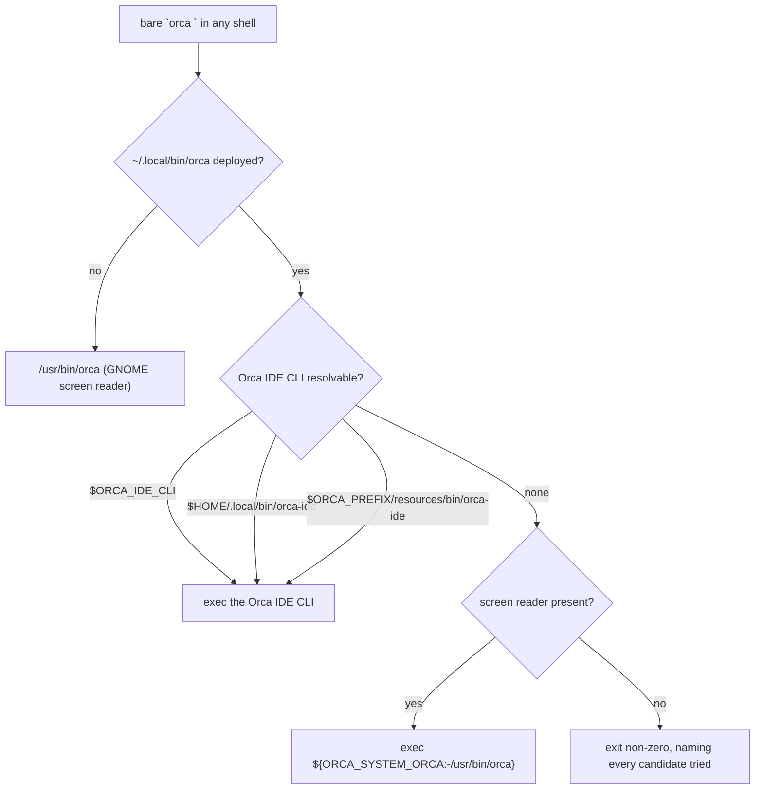

# Orca-backed CE review contract and bare-orca safety - Plan

## Goal Capsule

- **Objective:** An unattended review run finishes on its own and gives the workstation back. It produces a verdict within a known time, and the operator finds no agent process from that run still holding memory afterwards.
- **Means:** State the missing dispatch bounds as an Orca dispatch contract in the shared instruction core, and make bare `orca` resolve to the Orca IDE CLI on this host (KTD1, KTD3).
- **Authority:** The Product Contract requirements below win on behavior. The KTDs win on mechanism. `AGENTS.md` verification rules and the shared instruction core bind every unit.
- **Execution profile:** Instruction text plus one small wrapper script. Proof is CI gates, not runtime behavior.
- **Stop conditions:** Stop and report if a contract clause cannot be stated without copying a version-specific Orca command spelling. Stop if the command manifest rejects a `producer: source` unit for a Linux-only wrapper.
- **Tail ownership:** The caller owns commit, push, and PR.

---

## Product Contract

### Summary

Add an Orca dispatch contract to `.chezmoitemplates/agents-instructions.tmpl`. The contract states six obligations any run takes on when it dispatches Orca workers for a review or peer pass: brief-file specs, event-based waiting with a timeout, an explicit deadline on every worker, a stop-and-release action at that deadline, a release after every `worker_done`, and no worker of its own left resident at turn end. It also states that these bounds outrank the orchestration guide's keep-waiting guidance. Pin each clause with a needle in `.ci/test-agent-instructions.sh`. Separately, add an `orca-wrapper` unit to the command manifest so bare `orca` reaches the Orca IDE CLI instead of the GNOME screen reader, and cover it with a CI gate. Record the two upstream Orca defects as a committed report draft, because this run may not file in a repository that is not the user's.

### Problem Frame

The instruction core bans the `compound-engineering` bundled runners for peer dispatch and routes every dispatch through Orca. The ban is correct, but the banned runner also carried the bounds — an idle timeout and a hard backstop — and nothing replaced them. The orchestration guide points the other way: it treats a wait timeout as a checkpoint and tells coordinators to keep waiting, and it says not to release a worker on a timeout. A run reading only the guide therefore has no instruction that ever ends a wait.

The result is observed, not theoretical. Issue #438 records four defects in this repository's control and two upstream. In two runs (`run_22a937aed490`, `run_cc6f47cb527d`) a coordinator hand-built an unbounded `until [ "$(ls "$RUN_DIR"/*.json | wc -l)" -ge 7 ]; do sleep 20; done` loop, waited past 50 minutes for a cross-model Codex peer that never wrote its artifact, and never returned to its worker-release step. Eight `claude` and three `codex` processes stayed resident, holding 5.4 GB, alongside 4.7 GB of `orca-ide`. Underneath that sits a dispatch defect: `task-create --spec "$(cat …)"` fails with `E2BIG` for a 146–153 KB CE prompt, because the CLI takes the spec only as an argv string and offers no file, stdin, or `@file` form.

Bare `orca` is a separate hazard on the same path. Orca hardcodes `orca` in the queued-message pointer and in the injected worker preamble, so a dispatched worker is told to run bare `orca` before it can read the `orca-ide` rule. On this host `/usr/bin/orca` is the GNOME screen reader; a worker session launched it by accident. Orca ships a shim at `~/.config/orca/linux-orca-cli-shim/orca`, but that directory sits after `/usr/bin` in PATH, so the shim never wins. `~/.local/bin` does sit ahead of `/usr/bin`, and nothing occupies `orca` there.

### Key Decisions

- The contract lives in the shared instruction template, not in the CE overlay tree. Governs R1, R9.
- The contract binds every Orca dispatch for a review or peer pass, not only a substitution for a banned runner. Governs R1.
- Bare `orca` is shadowed on managed Linux hosts through the command manifest; the GNOME screen reader stays reachable. Governs R11, R12, R13, R14.
- Upstream reporting of the two Orca defects is recorded, not filed, in this run. Governs R16.

### Requirements

**Contract content**

- R1. `.chezmoitemplates/agents-instructions.tmpl` carries an Orca dispatch contract that binds any run dispatching Orca workers for a code review, document review, or peer pass. Substituting Orca for a banned `compound-engineering` runner is one case it covers, not its boundary.
- R2. The contract requires a dispatch spec to name a path to a brief file, and forbids inlining the brief's content into the spec. The spec is delivered as an argv string, so an inlined CE-sized brief exceeds the kernel argument limit and fails.
- R3. The contract requires waiting on `worker_done`, `escalation`, and `question` events with an explicit timeout, and forbids `sleep` loops, file-count polls, and hand-built wait wrappers.
- R4. The contract requires an explicit deadline on every dispatched worker, set before dispatch, and requires the run itself to hold a wall-clock bound across its rolling waits.
- R5. The contract requires the run, at a worker's deadline, to stop that worker, release it, and proceed on the artifacts it already holds. A missing artifact is a recorded gap, never a reason to keep waiting.
- R6. The contract requires a worker release after every `worker_done`, success and failure alike, and requires every settled worker to be accounted for before the turn ends.
- R7. The contract forbids ending a run with a worker that run dispatched still resident, and names a verification that can distinguish this run's workers from another session's.
- R8. The contract states that its timeout, deadline, and release obligations outrank the orchestration guide's keep-waiting guidance for review and peer dispatch. It states obligations only, and names no version-specific Orca command spelling; the version-matched guide stays the source for exact commands.

**Rendering and gates**

- R9. The contract change lands in the template alone. The three rendered targets (`~/.claude/CLAUDE.md`, `~/.gemini/AGENTS.md`, `~/.codex/AGENTS.md`) stay identical outside their harness paragraphs.
- R10. `.ci/test-agent-instructions.sh` asserts every new contract clause by needle against the rendered targets.

**Bare `orca` safety**

- R11. On Linux, bare `orca` resolves to the Orca IDE CLI in any shell whose PATH puts `~/.local/bin` ahead of `/usr/bin`.
- R12. The `orca` command is declared in the repository's command manifest, the existing owner of `~/.local/bin` entries, rather than through a second unmanaged path.
- R13. On a Linux host with no Orca IDE CLI present, the wrapper delegates to the system `orca` binary instead of failing, so the screen reader stays usable there.
- R14. The wrapper deploys on Linux only.
- R15. A CI gate covers the wrapper's dispatch path, its fallback path, and its no-candidate error path, and is wired into a `ci.yml` job aggregated by `delivery`.

**Upstream defects**

- R16. The `task-create --spec` argv limit and the hardcoded bare-`orca` pointer are recorded as a committed upstream-report draft naming the defect, its evidence, and the local mitigation.

### Success Criteria

- The next unattended review run in this checkout ends with no worker it dispatched still resident, and says so in its own output. This is the signal that the contract changed behavior rather than only adding text.
- An agent reading the contract cold can bound a dispatch without opening the orchestration guide first; it opens the guide only for command spellings.

### Scope Boundaries

- In scope: the instruction template, its CI gate, the `orca` command-manifest unit and its wrapper source, the wrapper's gate, and the upstream-report record.
- Not in scope: changing the `orchestration` skill stub or the Orca bundle. Both are outside this repository.
- Not in scope: moving the contract into `dot_local/share/compound-engineering-overlays/` (KTD1).
- Not in scope: filing the upstream Orca issues. The Orca repository is not the user's, and this run is unattended (KTD5).
- Not in scope: reaping the workers left resident by the runs issue #438 records. Those predate this branch and killing another session's processes needs the operator's say-so.

#### Deferred to Follow-Up Work

- Filing the two upstream Orca reports once the user approves the target repository, title, and body.
- The unexplained cause of Codex peers running past 20 minutes with no error. The deadline in R4 and R5 makes the symptom survivable; the cause stays open.

### Outstanding Questions

- Deferred: why a dispatched Codex peer runs past 20 minutes with no error and no artifact. Not blocking — R4 and R5 bound the effect.

### Sources

- Issue: `https://github.com/hyperlapse122/dotfiles/issues/438` (evidence tables, process residency, `orchestration.db` states).
- `.chezmoitemplates/agents-instructions.tmpl` — the "Routing and mirrors" section that carries the runner ban.
- `.ci/test-agent-instructions.sh` — needle-based gate over the rendered instruction targets; its header explains why needles, not diffs.
- `.chezmoidata/commands.yaml` — the command manifest; its `codex-wrapper` unit is the `producer: source` precedent this plan follows.
- `.chezmoitemplates/command-manifest-validate.tmpl` — render-time validation every new manifest unit must satisfy.
- `.ci/lib/render-gate-helpers.sh` — `render()` for templates and `render_ignore()` for `.chezmoiignore`; a CI gate must use these rather than hand-rolling the invocation.
- `.ci/test-ci-wiring.sh` — every executable `.ci/test-*.sh` must be invoked by a workflow, and every `ci.yml` job must appear in `delivery.needs`.
- `AGENTS.md` "Verification (never deploy live `$HOME`)" — scratch directory, stub `op`, empty config, throwaway destination, `--source "$PWD"`.

---

## Planning Contract

### Key Technical Decisions

- KTD1. **The contract lives in `.chezmoitemplates/agents-instructions.tmpl`, not in the CE overlay tree.** The obligations bind every harness and every run that dispatches, not only `ce-code-review`; the overlay tree patches one CE version's skill files and would have to be re-verified at each CE upgrade. Governs R1, R9.
- KTD2. **The contract states obligations and their precedence, never command spellings.** The instruction core already forbids copying version-specific command details, and a copied spelling would rot at the next Orca release. Precedence is stated explicitly because the guide's own text points the other way, and an obligation that does not say it outranks the guide loses to it. Governs R7, R8.
- KTD3. **Declare `orca` as a `producer: source` unit in the command manifest, wrapping the Orca IDE CLI.** `~/.local/bin` already precedes `/usr/bin` in the affected PATHs, so one entry fixes every shell, including the worker PTYs Orca writes its hardcoded pointer into. The manifest is the existing owner of that directory and already carries the exact pattern in its `codex-wrapper` unit, so a second unmanaged deployment path would duplicate ownership. Rejected: a bare `dot_local/bin/executable_orca` file gated by `.chezmoiignore`, which reaches the same target while bypassing the manifest's platform gating, mode contract, and reconciler. Rejected: prepending `~/.config/orca/linux-orca-cli-shim` through `~/.config/environment.d`, which shadows just the same but is invisible to a CI gate and depends on a directory the app owns. Rejected: doing nothing and relying on the instruction rule, which the observed accident already disproves for injected preamble text a worker runs before it reads any rule. Governs R11, R12, R13, R14.
- KTD4. **The wrapper resolves its target through overridable candidates, not fixed absolute paths.** A wrapper that only ever names `/opt/Orca/...` cannot be exercised by a CI gate on a runner that has no Orca install, so the gate would assert nothing about the path that matters. Candidates in order: `$ORCA_IDE_CLI`, `$HOME/.local/bin/orca-ide`, `${ORCA_PREFIX:-/opt/Orca}/resources/bin/orca-ide`; the screen-reader fallback is `${ORCA_SYSTEM_ORCA:-/usr/bin/orca}`. Governs R13, R15.
- KTD5. **Record the upstream Orca defects; do not file them.** The instruction core forbids filing in a repository that is not the user's without asking, and forbids an unattended run from asking. The committed-record fallback is the sanctioned path, and `docs/residual-review-findings/` is where this repository already keeps that record. Governs R16.

### Assumptions

- A1. The operator accepts that bare `orca` no longer starts the GNOME screen reader on a managed Linux host with Orca IDE installed. The screen reader stays available at `/usr/bin/orca`, and the wrapper still delegates to it on a host with no Orca IDE. Derived from the issue's own framing of the trade-off as "worth deciding explicitly".
- A2. Agent PTYs inherit a PATH with `~/.local/bin` ahead of `/usr/bin`. Confirmed by the `type -a orca` output in issue #438, which lists no `~/.local/bin` entry only because none exists yet.

### High-Level Technical Design

The wrapper must never recurse into itself. Resolution is by explicit candidates, never by a PATH search for `orca`.

### Sequencing

U1 and U2 land together — a needle asserting text the template does not carry fails CI, and text with no needle is unguarded. U3 and U4 land together for the same reason. U5 is independent.

---

## Implementation Units

### U1. Orca dispatch contract in the instruction core

- **Goal:** The shared instruction core states the dispatch obligations any run takes on when it dispatches Orca workers for a review or peer pass, and states that they outrank the guide's keep-waiting guidance.
- **Requirements:** R1, R2, R3, R4, R5, R6, R7, R8, R9.
- **Dependencies:** none.
- **Files:**
  - `.chezmoitemplates/agents-instructions.tmpl` (modify).
- **Approach:**
  1. Add the contract to the "Routing and mirrors" section, after the paragraph that bans the bundled dispatchers and before the `lfg` autonomy paragraph. That order matches the reading path: the ban creates the substitution, the contract bounds every dispatch including it.
  2. Open with the scope sentence (R1): the contract binds any run dispatching Orca workers for a code review, document review, or peer pass, and a banned-runner substitution is one case of that, not its boundary.
  3. Follow with one clause per obligation, RFC 2119 terms used literally, matching the file's existing paragraph style: brief-file specs with the argv-limit reason (R2); event wait with an explicit timeout, naming `sleep` loops, file-count polls, and hand-built wait wrappers as forbidden (R3); an explicit deadline on every worker plus a wall-clock bound on the run (R4); stop, release, and proceed at that deadline, with a missing artifact recorded as a gap (R5); release after every `worker_done`, success and failure, with every settled worker accounted for before the turn ends (R6); no worker this run dispatched left resident at the end, plus the verification (R7).
  4. Express the R7 verification so it cannot be satisfied by a process-name match: the run confirms that every dispatch it started reports a settled, released state in Orca's own per-run worker records. A host-level `pgrep` sweep is named as a secondary signal only, because process names cannot separate this run's workers from another session's — the host may hold resident agents from unrelated runs.
  5. Close with the precedence sentence (R8): these bounds outrank the orchestration guide's keep-waiting and do-not-release-on-timeout guidance for review and peer dispatch, and the guide stays the source for command spellings.
  6. Keep the text outside the `{{ if eq .ctx.chezmoi.os "linux" }}` branch so all three rendered targets receive it identically.
- **Patterns to follow:** the existing MUST/MUST NOT paragraph style in the same section. One unwrapped line per paragraph, matching the file's existing shape.
- **Test scenarios:** covered by U2. This unit carries no behavior of its own.
- **Verification:** the rendered Claude, Antigravity, and Codex targets each carry the contract, and differ from one another only in their harness paragraph.

### U2. Pin every contract clause in the instruction gate

- **Goal:** CI fails when any contract clause is dropped or silently reworded.
- **Requirements:** R10, R9.
- **Dependencies:** U1.
- **Files:**
  - `.ci/test-agent-instructions.sh` (modify).
- **Approach:**
  1. Add one needle per clause to the `NEEDLES` heredoc, quoting the exact substring written in U1 — including the scope sentence and the precedence sentence, which are clauses in their own right.
  2. Choose substrings that fail on a meaning change, not only on deletion — include the forbidding half of each clause (`MUST NOT`, "forbidden", "never") rather than only its subject.
  3. Add no `BANNED` entry. Nothing is being retired here.
  4. Leave the harness-needle block and the cross-OS diff untouched; the contract is OS-independent.
- **Patterns to follow:** the existing `NEEDLES` entries added for the orchestration routing rule — one line per load-bearing sentence.
- **Test scenarios:**
  - The gate passes against the tree produced by U1.
  - Deleting the deadline clause from the template fails the gate with `lost rule:` naming that needle.
  - Rewording a clause so its `MUST NOT` becomes `SHOULD NOT` fails the gate.
  - Deleting the precedence sentence fails the gate, so the guide cannot silently win again.
  - The gate still passes its existing cross-OS identity check, so the contract did not leak into the Linux-only branch.
- **Verification:** `.ci/test-agent-instructions.sh` passes, and each new needle fails the gate when its sentence is removed from the template.

### U3. Declare `orca` in the command manifest

- **Goal:** Bare `orca` reaches the Orca IDE CLI in every shell on a managed Linux host, through the manifest that already owns `~/.local/bin`, and still reaches the screen reader where no Orca IDE CLI exists.
- **Requirements:** R11, R12, R13, R14.
- **Dependencies:** none.
- **Files:**
  - `.chezmoidata/commands.yaml` (modify; add an `orca-wrapper` unit).
  - `dot_local/share/chezmoi-command-sources/executable_orca` (create).
- **Approach:**
  1. Add the manifest unit next to `codex-wrapper`, copying its shape: `producer: source`, `safetyProfile: interpreted`, `proofEligible: false`, `mode: "0755"`, `sourcePath` pointing at the new wrapper, and one command named `orca`. Set `platforms: [linux]` — the shadowing hazard is Linux-only and the manifest's platform gating replaces any `.chezmoiignore` edit. Add no `legacy:` block; no pre-manifest `~/.local/bin/orca` exists to reclaim.
  2. Confirm the unit passes `.chezmoitemplates/command-manifest-validate.tmpl` at render time before moving on; a rejected unit fails the whole apply.
  3. Write the wrapper as a `bash` script with `set -euo pipefail` and no template syntax — the manifest copies it verbatim.
  4. Resolve the Orca IDE CLI from the KTD4 candidate list in order, and `exec` the first that is executable.
  5. When none is executable, `exec` the screen-reader fallback if it is executable; otherwise exit non-zero with a message naming every candidate tried.
  6. Never resolve through a PATH lookup of `orca` — the wrapper is itself first on PATH and would recurse.
  7. Add a one-line comment recording the external fact the code cannot express: Orca hardcodes bare `orca` in its worker preamble, and `/usr/bin/orca` is the GNOME screen reader.
- **Patterns to follow:** the `codex-wrapper` unit in `.chezmoidata/commands.yaml` and its source at `dot_local/share/chezmoi-command-sources/executable_codex`.
- **Test scenarios:** covered by U4.
- **Verification:** the rendered command manifest lists an `orca` command on Linux and omits it on macOS, and the deployed wrapper is mode 0755.

### U4. CI gate for the wrapper

- **Goal:** The wrapper's dispatch path, fallback path, and error path are proven in CI, and its manifest gating is proven with it.
- **Requirements:** R15, R14.
- **Dependencies:** U3.
- **Files:**
  - `.ci/test-orca-cli-shadow.sh` (create, executable).
  - `.github/workflows/ci.yml` (modify; add the gate to the `render-gates` job's step list).
- **Approach:**
  1. Follow the `AGENTS.md` verification contract: a scratch directory under `${XDG_RUNTIME_DIR:-$HOME/.cache}`, an empty chezmoi config, a stub `op`, a throwaway destination, and `--source "$PWD"`. Use `render()` from `.ci/lib/render-gate-helpers.sh` for the manifest assertions rather than hand-rolling the invocation.
  2. Assert the wrapper source is executable in the repository tree.
  3. Drive every behavior test through the KTD4 environment knobs and a stubbed `HOME`, so no test depends on a real Orca install on the runner.
  4. Wire the script into the `render-gates` job, which installs the locked chezmoi the manifest render needs. `.ci/test-ci-wiring.sh` fails on an unwired gate, and `render-gates` is already in `delivery.needs`.
- **Patterns to follow:** `.ci/test-orca-register.sh` for stub-binary construction and scratch handling; `.ci/test-agent-instructions.sh` for the `fail()` helper shape; `.ci/test-command-manifest.sh` for asserting against a rendered manifest.
- **Test scenarios:**
  - With a stub at `$HOME/.local/bin/orca-ide`, the wrapper execs it and forwards `orchestration check --run run_x` unchanged.
  - With only `$ORCA_PREFIX/resources/bin/orca-ide` present, the wrapper execs that path.
  - With `$ORCA_IDE_CLI` set, that path wins over both others.
  - An argument containing a space survives the exec as one argument.
  - With no Orca IDE candidate and an executable `$ORCA_SYSTEM_ORCA`, the wrapper delegates there.
  - With no candidate at all, the wrapper exits non-zero and its message names every candidate it tried.
  - The wrapper never re-enters itself when its own directory is first on `PATH`.
  - The manifest rendered for `linux` declares the `orca` command; rendered for `darwin` it does not.
  - `.ci/test-ci-wiring.sh` passes, proving the new gate is invoked and `render-gates` is still aggregated.
- **Verification:** `.ci/test-orca-cli-shadow.sh`, `.ci/test-command-manifest.sh`, and `.ci/test-ci-wiring.sh` all pass locally.

### U5. Committed upstream-report record

- **Goal:** The two Orca defects this repository cannot fix are recorded with enough detail for the operator to file them unchanged.
- **Requirements:** R16.
- **Dependencies:** none.
- **Files:**
  - `docs/residual-review-findings/2026-09-08-orca-dispatch-upstream-reports.md` (create).
- **Approach:**
  1. One section per defect: the `task-create --spec` argv limit, and the hardcoded bare `orca` in the queued-message pointer and worker preamble.
  2. Each section carries the observed evidence verbatim (the `E2BIG` message, the generator source line, the `type -a orca` output), the affected Orca version (1.4.198), the local mitigation this branch ships, and a proposed report title and body.
  3. State plainly why the reports were not filed: the Orca repository is not the user's, and an unattended run neither files nor comments there.
  4. Keep the file to the upstream reports. The shadowing decision and its trade-off belong to KTD3 and A1 in this plan, not to a residual-findings record.
- **Patterns to follow:** existing files under `docs/residual-review-findings/`.
- **Test scenarios:** `Test expectation: none -- documentation with no executable behavior.`
- **Verification:** the file exists, names both defects, and states the non-filing reason.

---

## Verification Contract

| Gate | Command | Covers |
|---|---|---|
| Instruction needles | `.ci/test-agent-instructions.sh` | U1, U2 |
| Wrapper behavior and manifest gating | `.ci/test-orca-cli-shadow.sh` | U3, U4 |
| Manifest contract | `.ci/test-command-manifest.sh` | U3 |
| CI wiring | `.ci/test-ci-wiring.sh` | U4 |
| Diff hygiene | `git diff --check` and a scope-limited `git status` | all |
| Shell lint | `shellcheck` on the new and changed shell files | U3, U4 |

Every render in these gates uses the scratch directory, stub `op`, empty config, throwaway destination, and `--source "$PWD"` required by `AGENTS.md`. No gate may reach the real `op` or write to `$HOME`.

After push, watch both `render-dotfiles.yml` and `ci.yml` to terminal success.

---

## Definition of Done

**Global**

- Every contract clause — scope, the six obligations, and precedence — is present in the template and pinned by a needle.
- The three rendered instruction targets differ only in their harness paragraphs.
- Bare `orca` resolves to the Orca IDE CLI on Linux through the command manifest, and the command is absent on macOS.
- Every new `.ci` gate is invoked by a workflow job that `delivery` aggregates.
- The upstream-report record exists and states why the reports were not filed.
- This run itself ends with no Orca worker it dispatched still resident, verified through the run's own dispatch records, and says so.
- No dead-end or experimental code remains in the diff.

**Per unit**

| Unit | Done when |
|---|---|
| U1 | The contract paragraph renders identically into all three targets, states its precedence over the guide, and copies no Orca command spelling. |
| U2 | Every new needle fails the gate when its sentence is removed from the template. |
| U3 | The manifest declares `orca` on Linux only, and the wrapper resolves, falls back, and errors as KTD4 specifies. |
| U4 | `.ci/test-orca-cli-shadow.sh` passes and `.ci/test-ci-wiring.sh` reports the gate as wired. |
| U5 | The record names both defects, their evidence, the local mitigation, and the non-filing reason. |
