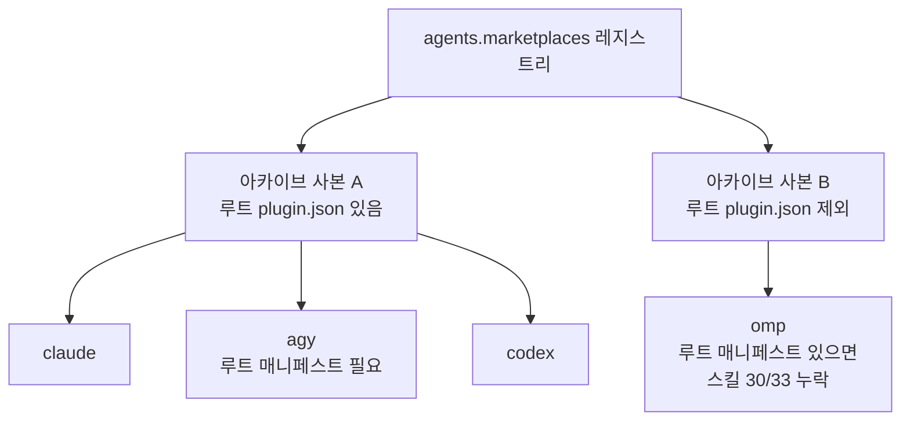

# omp Harness Restore - Plan

## Goal Capsule

- **Objective:** Orca 오케스트레이션이 필요한 작업을 돌릴 수 있는 Gemini 계열 실행 하네스가 이 워크스테이션에 다시 존재하고, 그 하네스가 다른 관리 하네스와 같은 MCP·인스트럭션·스킬·플러그인을 본다.
- **Means:** `omp`(oh-my-pi)를 네 번째 관리 하네스로 재도입하되, 관리 표면을 바이너리 설치, MCP, 인스트럭션 파일, 스킬 해석, compound-engineering 플러그인, 모델 정책으로 한정한다 (KD2).
- **Product authority:** `omp` 하나만 이 플랜의 범위다. `agy`는 그대로 유지되며 그 정리 여부는 이 플랜이 결정하지 않는다. 제품 행위는 R-ID가, 구현 메커니즘은 KTD-ID가 소유한다.
- **Execution profile:** chezmoi 소스 상태만 편집한다. 배포된 `$HOME`은 건드리지 않고, 사용자가 요청하지 않는 한 `chezmoi apply`를 실행하지 않는다. 검증은 렌더와 `.ci/` 하네스 테스트로 한다.
- **Stop conditions:** omp 업스트림 릴리스가 사라졌거나 자산 이름 규칙이 바뀌어 U1이 성립하지 않을 때. `agy`의 플러그인 설치 경로나 그 CI 게이트를 바꿔야만 진행되는 상황에 도달했을 때 (KTD4의 전제가 깨진 경우).
- **Tail ownership:** 첫 실제 `chezmoi apply`에서만 확인 가능한 두 가지 — omp의 스킬 해석 경로(A3)와 provider 인증 상태(A2) — 는 이 플랜이 아니라 운영자가 소유한다. U10이 그 확인 절차를 남긴다.

**Product Contract preservation:** changed: R5, R6, R8 — R5는 업스트림이 omp 전용 전역 skills 디렉터리를 문서화하지 않아 메커니즘(심링크) 대신 결과(같은 스킬 트리를 본다)로 다시 썼다. R6은 루트 `plugin.json` 오분류로 스킬 30/33이 누락될 수 있어 "누락 없이"라는 한정을 붙였다. R8은 omp 카탈로그가 미인증 provider에서 부분 응답을 exit 0으로 돌려주므로 절대 실패 규칙이 apply를 깨뜨려, 카탈로그가 provider를 대변할 때로 한정했다. added: R13, R14 — R13은 프룬 검증 CI 레그가 `.chezmoiremove`와 별개 파일에 있어 별도 소유가 필요해서다. R14는 KTD6이 확정한 첫 실행 마법사 통제를 소유하는 R-ID가 없어, 관리 대상 키 집합이 R7보다 넓다는 사실이 어느 요구사항에도 걸리지 않았기 때문이다.

---

## Product Contract

### Summary

`omp`을 `claude` / `agy` / `codex`와 나란한 네 번째 관리 하네스로 되살린다. 공유 설정은 기존 경로를 그대로 타고, 모든 역할이 `google-antigravity/gemini-3.8-flash:high`를 쓰되 `tiny` 역할만 `google-antigravity/gemini-3.1-flash-lite:minimal`을 쓴다. 2026-09-03에 폐기된 omp 선언 블록의 나머지는 따라오지 않는다.

### Problem Frame

`agy`는 Orca의 오케스트레이션과 맞물리지 않는다. 그 결과 Orca가 관리하는 워커·태스크 흐름 위에서 실제로 돌릴 수 있는 Gemini 계열 실행 하네스가 없다. `claude`와 `codex`는 남아 있지만 둘 다 다른 모델 계열이고, `agy`는 하네스로 설치되어 있어도 그 용도로는 쓸 수 없다.

`omp`은 그 자리를 채우던 하네스였고 2026-09-03에 소스·데이터·release-lock에서 완전히 제거됐다(`a4c8a60`, `ca443b9`, `106dcdb`). 제거 당시의 omp은 UI 설정 30여 개, 역할 13개짜리 모델 맵, 로컬 마켓플레이스, haptic 확장, Figma 인증 도우미, zsh completion, Exa 키를 평문으로 쓰던 인증 리콘사일러까지 딸린 큰 표면이었다. 그 표면 전체가 다시 돌아오면 폐기가 없앤 유지 비용도 함께 돌아온다.

### Key Decisions

- KD1. **`agy`를 유지한 채 `omp`을 추가한다** — 관리 하네스는 넷이 된다. omp 도입과 agy 정리를 별개 결정으로 분리해, 이번 작업이 살아 있는 하네스를 건드리지 않게 한다. (session-settled: user-directed — chosen over agy 완전 폐기: agy 정리는 되돌리기 어렵고 이번 목적에 필요하지 않다.) Governs R11
- KD2. **관리 표면은 여섯 가지로 한정한다** — 바이너리, MCP, 인스트럭션, skills, compound-engineering 플러그인, 모델 정책. 나머지 예전 선언은 복원하지 않는다. (session-settled: user-approved — chosen over 예전 omp 블록 전체 복원: 폐기가 없앤 유지 비용을 되살릴 이유가 없다.) Governs R1, R2, R3, R4, R5, R6
- KD3. **모델 정책 리콘사일러는 최소 신규 작성한다** — 예전 리콘사일러를 복원하지 않고, 모델 관련 키만 다루는 짧은 스크립트를 새로 쓴다. 관리 표면이 모델 키뿐이라 232줄 스크립트와 223줄 검증 파티얼을 되살린 뒤 다시 깎는 것은 과하다. 단 예전 스크립트가 실제로 겪고 고친 방어는 이식한다. (session-settled: user-directed — chosen over 예전 리콘사일러 복원 및 공용 `settings-reconcile` YAML 확장: 읽을 코드가 적은 쪽이 낫고, 공용 도구에 codex 회귀 위험을 들이지 않는다.) Governs R7, R8, R9
- KD4. **모델은 단일 모델로 수렴시킨다** — 모든 역할이 `gemini-3.8-flash:high`를 쓰고 `tiny`만 `gemini-3.1-flash-lite:minimal`을 쓴다. 예전의 역할별 모델 분화(pro 리뷰어, effort 티어별 분기)는 되살리지 않는다. (session-settled: user-directed — chosen over effort 티어 분화: 선언이 짧고 어느 좌석이 어떤 모델을 쓰는지 예측 가능하다.) Governs R7
- KD5. **모델 정책은 omp 자신의 설정 파일에 assert한다** — chezmoi readonly 타깃으로 두지 않는다. omp은 `/model`, `/settings`, 첫 실행 마법사를 통해 자기 설정 파일을 직접 덮어쓰므로, 관리 타깃으로 두면 영구 드리프트가 난다. 이는 폐기 이전 구조가 이미 도달했던 결론이다. Governs R7

### Requirements

**하네스 등록과 설치**

- R1. `omp` 실행 파일이 `.chezmoidata/releases.json` 락에 고정된 아티팩트에서 설치되고, command manifest 유닛을 통해 PATH에 게시된다.
- R2. `omp`이 MCP 렌더러(`.chezmoitemplates/agent-mcp-servers-json.tmpl`)의 유효 하네스 집합에 포함되고, `harnessSkip`에서도 인식되는 하네스 id가 된다.

**공유 설정 연결**

- R3. `agents.mcp.servers`의 모든 서버가 omp의 네이티브 MCP 설정 파일로 렌더되며, `op://` 헤더 값은 렌더 시점에 해석된다.
- R4. `.chezmoitemplates/agents-instructions.tmpl`이 harness id `omp`으로 렌더되어 omp의 인스트럭션 파일을 만든다. 같은 OS에서 네 하네스의 렌더는 `This harness is `와 `This harness runs `로 시작하는 문단 밖에서 서로 일치하며, `.ci/test-agent-instructions.sh`가 이를 확인한다.
- R5. omp이 다른 하네스와 같은 외부·개인 스킬 트리를 본다. 이 트리는 `~/.agents/skills`이며, 세 하네스가 각자의 심링크를 통해 이미 그것을 본다.
- R6. `agents.omp.plugins`에 compound-engineering 한 줄이 선언되고, omp용 플러그인 리콘사일러가 그것을 설치·활성화하며, 그 결과 omp이 보는 스킬 집합에 아카이브의 스킬이 하나도 누락되지 않는다.

**모델 정책**

- R7. 모델 정책은 omp의 설정 파일에 키 단위로 assert되며, 선언하지 않은 키는 omp이 쓴 값 그대로 살아남는다. 모든 역할은 `google-antigravity/gemini-3.8-flash:high`를 쓰고, `tiny` 역할만 `google-antigravity/gemini-3.1-flash-lite:minimal`을 쓴다. 그 두 모델 밖의 provider와 모델은 선택 가능한 집합에서 제외된다.
- R8. omp 카탈로그가 어떤 provider를 대변하는데 선언된 그 provider의 모델 id를 서비스하지 않으면, apply가 그 자리에서 실패하고 문제된 id를 이름으로 지목한다. 카탈로그가 그 provider를 전혀 대변하지 않을 때는 검증을 건너뛰고 이유를 stderr로 남긴다.
- R9. 리콘사일러는 omp이나 그 의존 도구가 없는 호스트에서 이유를 stderr로 남기고 건너뛰며, apply는 성공으로 끝난다. 리콘사일러가 omp을 읽는 호출은 시간 제한 안에서 끝난다.
- R14. omp의 첫 실행 마법사가 꺼진 상태로 선언되어, 비대화식 실행이 마법사에서 막히지 않는다.

**정리와 문서**

- R10. `.chezmoiremove`의 omp 항목 중 다시 관리 대상이 되는 경로는 제거된다. 관리 대상으로 돌아오지 않는 경로의 프룬 항목은 그대로 남는다.
- R11. `AGENTS.md`의 하네스 서술이 네 하네스 구성을 반영하고, 모델 배치 문단이 R7의 값으로 다시 쓰인다. `agy`의 동작과 그것이 읽거나 쓰는 파일은 바뀌지 않으며, `agy` 문단의 서술은 KTD4가 만든 사본 분리를 설명하는 만큼만 넓어진다.
- R12. `docs/decommission/omp.md`가 되살아난 관리 표면과 모순되지 않는다.
- R13. 다시 관리 대상이 되는 경로의 부재를 단언하는 CI 프룬 검증이 제거된다. 관리 대상으로 돌아오지 않는 경로의 검증과 그 음성 대조군은 그대로 남는다.

### Acceptance Examples

- AE1. 잘못된 모델 id, provider는 인증됨
  - **Covers R8.**
  - **Given:** omp 카탈로그가 `google-antigravity` 모델을 담고 있고, 선언된 selector는 그중에 없다.
  - **When:** apply가 모델 정책 리콘사일러에 도달한다.
  - **Then:** apply가 실패하고, 실패 메시지가 문제된 id를 이름으로 지목한다.
- AE1b. 같은 선언, provider 미인증
  - **Covers R8.**
  - **Given:** omp 카탈로그가 `google-antigravity` 모델을 하나도 담고 있지 않다.
  - **When:** apply가 모델 정책 리콘사일러에 도달한다.
  - **Then:** 검증을 건너뛴 이유를 stderr로 남기고 선언 값을 그대로 assert하며, apply는 성공한다.
- AE5. 플러그인 스킬 누락
  - **Covers R6.**
  - **Given:** omp이 compound-engineering 플러그인을 설치한 상태다.
  - **When:** omp이 그 플러그인의 스킬을 나열한다.
  - **Then:** 아카이브가 담은 스킬이 전부 보인다. 일부만 보이면 실패다.
- AE2. omp이 없는 호스트
  - **Covers R9.**
  - **Given:** 호스트에 omp이 설치되어 있지 않다.
  - **When:** apply가 모델 정책 리콘사일러에 도달한다.
  - **Then:** 리콘사일러가 건너뛴 이유를 stderr로 남기고, apply는 성공한다.
- AE3. omp이 자기 설정을 바꾼 뒤의 apply
  - **Covers R7.**
  - **Given:** 사용자가 omp 안에서 `/model`로 다른 모델을 고르고, 선언되지 않은 UI 설정도 바꿨다.
  - **When:** 다음 apply가 실행된다.
  - **Then:** 모델은 선언된 값으로 되돌아가고, 선언되지 않은 UI 설정은 사용자가 바꾼 그대로 남는다.
- AE4. 프룬 항목과 관리 타깃의 충돌
  - **Covers R10.**
  - **Given:** omp의 MCP 파일과 인스트럭션 파일이 다시 관리 타깃이다.
  - **When:** apply가 실행된다.
  - **Then:** 방금 쓴 파일이 같은 apply 안에서 프룬되지 않는다.

### Scope Boundaries

- 예전 omp 선언의 UI 설정 — 테마, 심볼 프리셋, statusLine, TUI 동작, shimmer, ttsr, stt, 전원 정책, steering·followUp 모드.
- `h82-dotfiles` 로컬 마켓플레이스와 그 위에 올라가던 플러그인 — `mxm4-haptic`, `i-have-adhd`, `unmanaged-repo-guard`.
- `figma-auth` 도우미와 omp의 Figma OAuth 자격 증명 관리.
- omp zsh completion.
- `APPEND_SYSTEM.md`, `TITLE_SYSTEM.md`, `rules/` 주석 규칙 트리, 하위 에이전트 정의(`agents/`).
- Exa 키를 평문 `.env`로 쓰던 인증 리콘사일러. MCP의 Exa 키는 R3의 `op://` 해석 경로를 그대로 쓴다.
- `agy`의 정리, 축소, 설정 변경.

### Dependencies / Assumptions

- omp 업스트림(`can1357/oh-my-pi`)은 활성 상태이고, 최신 릴리스는 `v18.1.15`다. 자산 이름이 폐기 당시 레지스트리의 조합 규칙과 일치하고 자산별 sha256이 게시되므로, R1은 삭제된 레지스트리 엔트리와 external 엔트리를 그대로 되살리는 형태를 취한다. 확인 시점은 2026-09-09이며 락 값은 refresh가 다시 해석한다.
- omp이 `google-antigravity` provider를 통해 `gemini-3.8-flash`와 `gemini-3.1-flash-lite`를 서비스한다고 가정한다. R8이 이 가정의 검증 지점이다.
- Orca 오케스트레이션이 omp을 워커로 띄울 수 있다는 것은 이 작업의 전제이지 산출물이 아니다. 이 플랜은 하네스를 설치하고 설정할 뿐, Orca 쪽 등록은 다루지 않는다.

### Outstanding Questions

계획 단계에서 전부 해소되었다. 각 답은 KTD3, KTD4, KTD6, U10이 소유한다. 구현을 막는 미해결 항목은 없다.

### Sources / Research

- `a4c8a60` — omp 스크립트·검증 파티얼·관리 트리 삭제. 되살릴 방어 코드의 출처.
- `ca443b9` — omp 데이터 선언, command manifest 유닛, release-lock 레지스트리 엔트리 삭제. 재등록해야 할 선언의 출처.
- `106dcdb` — 두 하네스 서술로의 문서 전환과 폐기 체크리스트 추가. R11, R12가 되돌려야 할 지점.
- `.chezmoitemplates/agent-mcp-servers-json.tmpl` — 유효 하네스 집합이 `claude`, `agy`, `codex`로 하드코딩되어 있고, 모르는 하네스 id는 조용히 무시하지 않고 실패한다.
- `AGENTS.md` 모델 배치 문단 — omp 시절 값(`gemini-3.7-flash`, 역할 13개)이 그대로 남아 있으나 현재 어느 하네스도 그 선언을 갖고 있지 않다.
- `.chezmoiremove` — omp 관리 타깃의 프룬 항목이 경로 단위로 남아 있다.
- `packages/settings-reconcile/src/reconcile.ts` — 공용 리콘사일러는 TOML 전용이므로 omp의 YAML 설정에 그대로 쓸 수 없다.
- `can1357/oh-my-pi` 릴리스 `v18.1.15` — 플랫폼별 단일 실행 파일(`omp-linux-x64`, `omp-linux-musl-x64`, `omp-darwin-arm64` 등)과 자산별 sha256을 배포한다. R1이 되살릴 external은 아카이브가 아닌 `type = "file"` 형태다.
- `cb30ed4` — 업스트림 compound-engineering v3.22.0부터 아카이브 루트에 `plugin.json`이 들어왔고, 그 파일이 있으면 omp이 트리를 agent-plugins 패키지로 오분류해 Claude Code/Codex 프런트매터 키를 가진 SKILL.md를 전부 거부하며 33개 중 30개를 버린다.
- `.ci/test-compound-engineering-overlays.sh:16,105` — 현재 CI는 그 루트 `plugin.json`이 오버레이 실행 후에도 살아남을 것을 단언한다. `agy`가 그것을 번들 매니페스트로 요구하기 때문이다. omp의 요구와 정면으로 충돌한다.
- `.github/workflows/render-dotfiles.yml:230-231` — 프룬 검증이 `~/.omp/agent/AGENTS.md`와 `~/.omp/agent/mcp.json`의 부재를 단언한다. R4와 R3이 복원할 바로 그 경로다. 같은 블록의 `agent.db` 음성 대조군(`:254`)은 그대로 두어야 한다.
- `a4c8a60~1:.chezmoiscripts/70-agents/run_after_config-omp-settings.sh.tmpl:77-79` — 카탈로그 검증은 의도적으로 fail-open이다. 미인증 provider가 부분 카탈로그를 exit 0으로 돌려주므로 종료 상태만으로는 "없는 selector"와 "없는 자격 증명"을 구분할 수 없다. 같은 파일의 `bounded_read`는 GNU `timeout` 없이 데드라인을 거는 이식 대상이다.
- oh-my-pi README "Discovery" 절 — omp은 첫 실행에서 `.claude`, `.gemini`, `.codex` 등 다른 하네스 디렉터리의 규칙·스킬·MCP를 물려받는다. 전용 전역 skills 디렉터리는 문서화되어 있지 않다.
- `.chezmoitemplates/release-lock-ref.tmpl` — 락에 tool 엔트리가 없으면 라이브 폴백 없이 렌더를 중단한다. `.github/workflows/refresh-release-lock.yml`은 기본 브랜치에만 커밋하므로 피처 브랜치의 락은 그 브랜치가 채워야 한다.
- `.chezmoiscripts/00-tools/run_after_compound-engineering-overlays.sh.tmpl` — 오버레이 대상 마켓플레이스 키가 렌더 시점 상수 하나로 고정되어 있어, 두 번째 사본은 오버레이를 받지 못한다.
- `.github/workflows/render-dotfiles.yml`의 `apply-macos` 잡 — `apply` 잡의 프룬 검증 블록을 픽스처까지 그대로 복제한다. 한쪽만 고치면 다른 잡이 실패한다.
- `ca443b9~1:.chezmoidata/agents.yaml`의 `agents.omp.settings` — 허용 목록, 차단 목록, 마법사 키, 스킬 스코프 키의 정확한 이름을 담고 있다.
- `4e9e7c8`, `9f52894` — 삭제된 모델 정책 리콘사일러가 실제로 겪고 고친 두 회귀. 각각 수렴 판정과 선언 경로 가드를 넣었다.

---

## Planning Contract

### Key Technical Decisions

- KTD3. **KD3이 정한 최소 리콘사일러의 이식 대상을 다섯으로 확정한다.** 이식 대상은 다섯이다 — `$HOME/.local/bin` PATH 선행 추가, GNU `timeout`에 의존하지 않는 자체 데드라인, R8이 요구하는 fail-open 판별, 라이브 설정을 한 번 읽어 다른 경로만 assert하는 수렴 판정(`4e9e7c8`), 그리고 선언 경로가 라이브 스키마에 없을 때 실패하는 `unknown` 가드와 선언 스트림 조기 종료를 잡는 `examined` 카운트 대조(`9f52894`). 값은 렌더 시점에 스크립트 소스로 스플라이스하지 않고 quoted heredoc과 `jq`로만 셸에 전달한다. Governs R7, R8, R9
- KTD4. **omp에게 루트 `plugin.json`을 제외한 별도의 compound-engineering 아카이브 사본을 준다.** 마켓플레이스 레지스트리의 기존 `exclude` 문법으로 두 번째 엔트리를 선언한다. 한 사본을 두 하네스가 나눠 쓰면 요구가 정면 충돌한다 — omp은 그 파일이 없어야 하고(`cb30ed4`), `agy`는 있어야 한다(`.ci/test-compound-engineering-overlays.sh:16`). KD1이 `agy` 쪽 변경을 금지하므로 분리가 유일한 해다. 대가는 아카이브가 디스크에 두 번 존재하는 것이다. Governs R6
- KTD6. **첫 실행 마법사를 끄는 두 키를 모델 정책과 같은 리콘사일러에 함께 선언한다.** 마법사가 뜨면 비대화식 실행이 첫 사용에서 막히고, 그 상태에서 omp이 쓰는 설정이 모델 선언과 경쟁한다. KD2의 여섯 가지 표면을 늘리지 않는 최소 예외다. Governs R14
- KTD8. **선택 가능한 모델 집합을 허용 목록과 차단 목록으로 닫는다.** 역할 값을 고정하는 것만으로는 사용자가 `/model`로 다른 provider를 고르는 경로가 열려 있고, KD5가 미선언 키를 보존하므로 다음 apply도 그것을 되돌리지 못한다. 저장소 내용과 프롬프트가 승인되지 않은 제3자로 나가는 경로이므로 역할 선언과 함께 닫는다. 폐기 이전 선언이 같은 두 키로 이 통제를 구현하고 있었다. Governs R7

### High-Level Technical Design

충돌의 핵심은 하나의 아카이브를 두 하네스가 상반된 조건으로 요구한다는 것이다. KTD4가 그것을 어떻게 가르는지가 이 플랜에서 프로즈만으로 가장 안 잡히는 부분이다.

하네스 id가 렌더 시점에 열거되는 곳은 `.chezmoitemplates/agent-mcp-servers-json.tmpl:57` 한 군데뿐이며, 모르는 id를 조용히 무시하지 않고 실패한다. `.chezmoitemplates/agents-instructions.tmpl`은 반대로 else-arm이 없어 모르는 id에 조용히 통과한다. U3이 두 곳을 함께 다룬다.

### Assumptions

- A1. 폐기 당시의 release-lock 레지스트리 엔트리와 external 엔트리를 형태 그대로 되살릴 수 있다. 업스트림 자산 이름이 그 조합 규칙과 일치함을 2026-09-09에 확인했다.
- A2. 이 워크스테이션에서 `google-antigravity` provider가 omp에 인증되어 있는지는 확인되지 않았다. 인증되어 있지 않으면 R8의 검증은 건너뛰기로 동작하며 이는 정상이다. 모델 id의 실제 존재는 첫 apply에서만 확정된다.
- A3. omp이 `~/.agents/skills` 트리를 보는 경로는 자신의 Discovery 동작이다 — 다른 하네스 디렉터리에서 스킬을 물려받으며, 이 저장소에서 그 셋은 모두 같은 트리를 가리키는 심링크다. 따라서 omp 전용 심링크 타깃을 새로 선언하지 않는다. 업스트림은 이 동작을 "첫 실행에서" 물려받는다고만 기술하므로, 그것이 일회성 흡수라면 이후 트리에 더해지는 스킬은 omp에 나타나지 않는다. 확인은 두 시점이 필요하다 — 첫 apply 직후, 그리고 그 뒤 트리에 스킬을 하나 더한 상태. 어느 한쪽이라도 보이지 않으면 U10이 omp 전용 스킬 타깃을 선언하는 후속 유닛을 남긴다.
- A4. compound-engineering 아카이브를 두 벌 두는 디스크 비용은 수용 가능하다. 아카이브는 이미 버전 세그먼트별로 보관된다.
- A5. 이 저장소는 omp의 스킬 탐색 범위를 좁히는 키를 선언하지 않으므로, omp이 프로젝트 스코프 스킬을 읽는지 여부는 업스트림 기본값이 정한다. omp이 Orca 워커로 임의 저장소 안에서 돌 때 그 저장소의 `SKILL.md`가 지시문으로 실행되는 경로가 되므로, U10의 확인 항목에 어느 스코프가 켜져 있는지를 포함한다. 켜져 있으면 범위를 좁히는 키를 선언하는 후속 작업이 필요하다. 폐기 이전 선언은 세 개의 스코프 키를 모두 `false`로 명시하고 있었다.
- A6. 폐기 이전 omp 상태가 남아 있는 호스트에서는 예전에 설치된 omp 플러그인과 Figma OAuth 자격 증명이 살아 있을 수 있다. `pluginsRemoved`가 비어 있고 이 플랜이 자격 증명 관리를 범위 밖에 두므로, 새 리콘사일러는 그것들을 걷어내지 않는다. `docs/decommission/omp.md`의 회수 절차를 복원 전 선행 조건으로 삼는다.

### Sequencing

U1과 U2가 바이너리를 세우고, U3이 하네스 id를 공유 템플릿에 등록한다. U4는 U3 없이는 렌더되지 않는다. U5와 U13은 U4가 만든 타깃과 충돌하는 프룬을 걷어내므로 U4 다음이다. U7은 U8의 전제다. U6은 U3과 U4 다음에 온다. U9는 U2가 바이너리를 세운 뒤에 온다. U10은 나머지 전부가 끝난 뒤 문서를 맞춘다.

---

## Implementation Units

| U-ID | 요약 | 주요 파일 | 의존 |
|---|---|---|---|
| U1 | release-lock 등록과 락 생성 | `packages/release-lock/src/registry.ts`, `.chezmoidata/releases.json` | — |
| U2 | 바이너리 external과 command 유닛 | `.chezmoiexternals/ai-agents.toml`, `.chezmoidata/commands.yaml` | U1 |
| U3 | 공유 템플릿에 하네스 id 등록 | `.chezmoitemplates/agent-mcp-servers-json.tmpl`, `.chezmoitemplates/agents-instructions.tmpl` | — |
| U4 | omp 관리 타깃 트리 | `dot_omp/` | U3 |
| U5 | 프룬 항목 조정 | `.chezmoiremove` | U4 |
| U6 | 인스트럭션 CI 커버리지 | `.ci/test-agent-instructions.sh`, `.ci/fixtures/agent-instructions/` | U3, U4 |
| U7 | omp 전용 아카이브 사본과 오버레이 | `.chezmoidata/agents.yaml`, `.chezmoiscripts/00-tools/run_after_compound-engineering-overlays.sh.tmpl` | — |
| U8 | omp 플러그인 리콘사일러 | `.chezmoiscripts/70-agents/run_onchange_after_update-omp-plugins.sh.tmpl` | U7 |
| U9 | 모델 정책 리콘사일러 | `.chezmoiscripts/70-agents/run_after_config-omp-settings.sh.tmpl`, `.ci/test-omp-settings-reconcile.sh` | U2 |
| U10 | 문서와 정리 | `AGENTS.md`, `README.md`, `docs/decommission/omp.md` | 전부 |
| U13 | 프룬 검증 CI 레그 조정 | `.github/workflows/render-dotfiles.yml` | U4 |

### U1. release-lock에 omp를 다시 등록한다

- **Goal:** omp 바이너리의 태그, 플랫폼별 URL, sha256이 락에서 해석된다.
- **Requirements:** R1
- **Dependencies:** 없음
- **Files:** `packages/release-lock/src/registry.ts`, `packages/release-lock/test/registry.test.ts`
- **Approach:**
  1. `git show ca443b9~1:packages/release-lock/src/registry.ts`에서 삭제된 `omp` 엔트리를 회수한다. `kind: githubRelease`, `source: can1357/oh-my-pi`, `linuxMusl: true`, 그리고 자산 이름을 `omp-<os>[-musl]-<x64arch>`로 조합하는 람다다.
  2. 같은 커밋의 부모에서 삭제된 테스트 케이스를 회수해 되살린다.
  3. 레지스트리 엔트리를 넣은 뒤 락 생성기를 돌려 `.chezmoidata/releases.json`의 omp 엔트리를 만들고, 생성기 출력을 그대로 같은 브랜치에 커밋한다. 손편집은 금지다. 이 단계 없이는 U2 이후의 어떤 렌더 검증도 성립하지 않는다 — `release-lock-ref.tmpl`은 락에 tool 엔트리가 없으면 라이브 폴백 없이 렌더를 중단시키고, `refresh-release-lock.yml`은 기본 브랜치에만 커밋하므로 피처 브랜치를 채워주지 않는다.
- **Patterns to follow:** 같은 파일의 `agent-browser` 엔트리가 `linuxMusl` 조합의 살아 있는 예다.
- **Test scenarios:**
  - 레지스트리 테스트가 linux glibc/musl, darwin arm64/x64 각각에 대해 조합된 자산 이름이 업스트림이 실제로 배포하는 이름과 일치함을 단언한다.
  - 알 수 없는 플랫폼 조합이 조용한 기본값이 아니라 오류가 된다.
  - 커밋된 락이 omp 엔트리를 담고 있고, 모든 관리 플랫폼의 URL과 다이제스트가 채워져 있다.
- **Verification:** `vp run -r test`가 `packages/` 워크스페이스에서 통과하고, 커밋된 락으로 omp external이 렌더된다.

### U2. 바이너리 external과 command manifest 유닛을 되살린다

- **Goal:** `omp`이 PATH에 게시된다.
- **Requirements:** R1
- **Dependencies:** U1
- **Files:** `.chezmoiexternals/ai-agents.toml`, `.chezmoidata/commands.yaml`, `.chezmoidata/.capability-registry.tsv`, `.ci/check-external-checksum-coverage.sh`
- **Approach:**
  1. `git show ca443b9~1:.chezmoiexternals/ai-agents.toml`에서 `[omp]` 블록을 회수한다. `type = "file"`이며 아카이브 추출이 아니다. `$isMuslLinux` 변수를 그대로 쓴다.
  2. 같은 커밋에서 `.chezmoidata/commands.yaml`의 omp 유닛을 회수한다. `claude` 유닛이 같은 단일 바이너리 형태이므로 형태 비교 기준이 된다.
  3. capability 레지스트리에 omp 행이 필요한지 확인하고, 필요하면 되살린다.
  4. `.ci/check-external-checksum-coverage.sh`의 `EXPECTED_LOCK_BACKED` 집합에 `omp`을 더한다. 다른 하네스 바이너리가 모두 등재된 바닥선이며, 등재해야 omp external이 나중에 락 기반 URL을 벗어날 때 게이트가 소리를 낸다.
- **Patterns to follow:** `.chezmoiexternals/ai-agents.toml`의 `[claude]` 블록 — 단일 파일, `executable = true`, 스테이징 경로 `.local/share/chezmoi-commands/incomplete/<unit>/<bin>`.
- **Test scenarios:**
  - `.ci/test-command-manifest.sh`가 새 유닛을 받아들인다.
  - `.ci/check-external-checksum-coverage.sh`가 omp external의 체크섬 선언을 확인한다. 이 external은 sha256을 선언하므로 `agy`의 sha512 예외에 해당하지 않는다.
  - `.ci/test-command-external-render.sh`가 통과한다.
- **Verification:** 위 세 스크립트가 통과하고, `chezmoi execute-template`으로 externals가 네트워크 없이 렌더된다.

### U3. 공유 템플릿에 `omp` 하네스 id를 등록한다

- **Goal:** MCP 렌더러가 `omp`을 유효한 하네스로 받아들이고, 인스트럭션 템플릿이 모르는 id에 조용히 통과하지 않는다.
- **Requirements:** R2, R4
- **Dependencies:** 없음
- **Files:** `.chezmoitemplates/agent-mcp-servers-json.tmpl`, `.chezmoitemplates/agents-instructions.tmpl`
- **Approach:**
  1. `agent-mcp-servers-json.tmpl:57`의 `$validHarness` 목록에 `omp`을 넣는다. 같은 파일의 `harnessSkip` 문서 주석도 네 하네스를 반영하게 고친다.
  2. `agents-instructions.tmpl`의 하네스 분기에 `omp` arm을 추가한다. 이 파일은 사용자 범위 지시문의 원본이므로, `This harness is `와 `This harness runs ` 두 문단만 하네스별로 갈린다.
  2b. 같은 파일 첫 문단의 배포 경로 열거에 omp의 인스트럭션 경로를 더한다. 그 문장은 하네스 분기 밖의 공유 텍스트라 네 렌더가 여전히 바이트 일치하므로, 고치지 않으면 U6의 CI가 통과하는 채로 "관리 하네스는 셋"이라는 서술이 네 하네스 모두에게 배포된다.
  3. 같은 작업에서 else-arm 부재를 고친다. 모르는 하네스 id는 조용히 빈 문단을 내는 대신 렌더를 실패시킨다.
- **Patterns to follow:** `agent-mcp-servers-json.tmpl`의 기존 실패 메시지 형태 — 유효 값을 나열해 알려준다.
- **Test scenarios:**
  - `omp`으로 MCP 렌더가 성공하고, 선언된 서버 전부가 omp의 네이티브 스키마로 나온다.
  - 존재하지 않는 하네스 id가 두 템플릿 모두에서 렌더 실패를 낸다.
  - `harnessSkip`에 `omp`을 넣은 서버가 omp 렌더에서만 빠진다.
- **Verification:** `chezmoi execute-template`으로 네 하네스 각각의 렌더가 성공하고, 잘못된 id는 실패한다.

### U4. omp 관리 타깃 트리를 만든다

- **Goal:** omp이 인스트럭션 파일과 MCP 설정을 받는다.
- **Requirements:** R3, R4
- **Dependencies:** U3
- **Files:** `dot_omp/private_agent/private_readonly_AGENTS.md.tmpl`, `dot_omp/private_agent/private_readonly_mcp.json.tmpl`
- **Approach:**
  1. `git show a4c8a60~1:`로 두 파일을 회수한다. AGENTS.md 래퍼는 한 줄이며, 현재 세 하네스 래퍼와 같은 형태로 `ctx`와 harness id를 함께 넘긴다 — 회수한 원본은 `ctx`를 넘기지 않는 옛 형태이므로 그대로 쓰면 안 된다. mcp.json 템플릿은 omp의 네이티브 스키마로 변환한다 — stdio는 `type` 생략, HTTP는 `type: "http"`, OAuth는 `auth: {type: "oauth"}`.
  2. `op://` 헤더 값은 `resolve-op-refs-json.tmpl`을 통해 렌더 시점에 해석된다. 이 경로는 회수한 템플릿에 이미 있다.
  3. 회수하지 않는다: `models.yml`, `APPEND_SYSTEM.md`, `TITLE_SYSTEM.md`, `agents/`, `rules/`, `.env`. Scope Boundaries가 소유한다.
- **Patterns to follow:** `dot_gemini/config/mcp_config.json` — 같은 관리-readonly 자세.
- **Test scenarios:**
  - 렌더된 mcp.json이 유효한 JSON이고 선언된 서버 전부를 담는다.
  - stdio 서버가 `type` 키를 갖지 않고, HTTP 서버가 `type: "http"`를 갖는다.
  - stdio 서버에 `auth`를 선언하면 렌더가 실패한다.
  - `op://` 참조가 렌더 결과에 평문 참조 문자열로 남지 않는다.
- **Execution note:** 렌더 검증은 이 저장소의 렌더 게이트 하니스로 돌린다 — 스텁 `op`, 빈 설정, 버릴 목적지, 스텁과 시스템 디렉터리로 제한한 PATH. 네트워크를 끄는 것만으로는 1Password 조회가 막히지 않으므로, 그냥 렌더하면 살아 있는 Context7·Exa 키가 스크래치 파일과 CI 아티팩트에 남는다. 단언 대상은 더미 값만 나오는 것이다.
- **Verification:** `chezmoi execute-template`이 스텁 `op` 아래에서 두 타깃을 렌더하고, 결과 JSON이 파싱되며, 실제 자격 증명 값이 어떤 출력에도 나타나지 않는다.

### U5. `.chezmoiremove`에서 다시 관리되는 경로를 뺀다

- **Goal:** 방금 쓴 타깃이 같은 apply 안에서 프룬되지 않는다.
- **Requirements:** R10
- **Dependencies:** U4
- **Files:** `.chezmoiremove`
- **Approach:**
  1. 두 항목만 제거한다 — `.omp/agent/AGENTS.md`(:59)와 `.omp/agent/mcp.json`(:61).
  2. 나머지는 전부 남긴다. `models.yml`, `CLAUDE.md`, `.env`, `APPEND_SYSTEM.md`, `TITLE_SYSTEM.md`, `agents/`, `rules/`, `.i-have-adhd-always`는 이번 표면에 없으므로 계속 un-written 되어야 한다.
  3. 블록 주석을 고쳐 omp이 부분적으로 돌아왔음을 기록한다. 남은 항목이 왜 남는지가 주석의 요점이다.
- **Patterns to follow:** 같은 파일의 다른 블록들이 이미 "왜 이 경로가 프룬되는가"를 문단으로 설명한다.
- **Test scenarios:** `Test expectation: none` — 데이터 선언 변경이며, 행위는 U13의 렌더 워크플로가 증명한다.
- **Verification:** `.chezmoiremove`가 렌더되고, omp 관련 남은 항목이 정확히 위 목록과 일치한다.

### U6. 인스트럭션 CI를 네 하네스로 넓힌다

- **Goal:** omp 인스트럭션 렌더가 다른 셋과 같은 불변식 아래 놓인다.
- **Requirements:** R4
- **Dependencies:** U3, U4
- **Files:** `.ci/test-agent-instructions.sh`, `.ci/fixtures/agent-instructions/harness-runs-omp.txt`
- **Approach:**
  1. `harness-runs-omp.txt` 픽스처를 만든다. 내용은 omp이 돌리는 모델 계열의 튜닝 문단이며, 모델 계열만 이름하고 모델 id나 포인트 릴리스는 담지 않는다.
  2. 테스트의 하네스 목록에 `omp`을 넣어, 같은 OS에서 네 렌더가 두 하네스별 문단 밖에서 일치함을 확인하게 한다.
- **Patterns to follow:** 같은 디렉터리의 `harness-runs-agy.txt` — 길이와 추상 수준의 기준.
- **Test scenarios:**
  - 네 하네스 렌더가 하네스별 두 문단 밖에서 바이트 일치한다.
  - omp 렌더가 `This harness is `와 `This harness runs ` 문단을 모두 갖는다.
  - 픽스처와 렌더가 어긋나면 테스트가 실패한다.
  - Linux와 비-Linux 분기 모두에서 위가 성립한다.
- **Verification:** `.ci/test-agent-instructions.sh`가 통과한다.

### U7. omp 전용 compound-engineering 아카이브 사본을 선언한다

- **Goal:** omp이 루트 `plugin.json` 없는 아카이브를 보고, `agy`의 사본은 그대로 남는다.
- **Requirements:** R6
- **Dependencies:** 없음
- **Files:** `.chezmoidata/agents.yaml`, `.chezmoiexternals/ai-agents.toml`, `.chezmoiscripts/00-tools/run_after_compound-engineering-overlays.sh.tmpl`, `.ci/test-compound-engineering-overlays.sh`
- **Approach:**
  1. `agents.marketplaces`에 `compound-engineering-omp` 키로 두 번째 엔트리를 더한다. 기존 엔트리와 같은 `versionSource`를 쓰고, `externalPath`만 다르며, `exclude`에 루트 `plugin.json` 패턴을 더한다. 이 키 이름이 U8의 플러그인 행이 가리킬 대상이다.
  2. 기존 엔트리는 한 글자도 바꾸지 않는다. KD1이 이를 요구한다.
  3. 두 사본이 같은 버전 세그먼트를 공유하도록 `versionSource`를 통해 락의 같은 값을 읽게 한다.
  4. 오버레이 프로비저너가 레지스트리 키 하나를 하드코딩하고 있으므로, `localArchive` 마켓플레이스 전체를 순회하도록 고친다. 고치지 않으면 ce-sweep 오버레이 두 파일이 기존 사본에만 설치되고, omp 사본은 아카이브에서 제외된 `interview.md`를 오버레이로도 받지 못해 참조 없는 ce-sweep을 보게 된다 — R6의 "누락 없이"는 스킬 디렉터리 수만으로 성립하지 않는다.
- **Patterns to follow:** 기존 `compound-engineering-plugin` 엔트리의 `exclude` 항목이 이미 경로 패턴 문법의 예다.
- **Test scenarios:**
  - omp 사본의 루트에 `plugin.json`이 없다.
  - omp 사본에 스킬 디렉터리가 전부 들어 있다.
  - 기존 사본의 루트 `plugin.json`이 그대로 있다.
  - 두 사본의 버전 세그먼트가 같다.
  - 두 사본 모두에 오버레이 두 파일이 설치된다.
- **Verification:** `.ci/test-compound-engineering-overlays.sh`가 통과한다. 이 스크립트의 기존 단언은 하나도 약해지지 않는다.

### U8. omp 플러그인 리콘사일러를 만든다

- **Goal:** compound-engineering이 omp에 설치되고 활성화된다.
- **Requirements:** R6
- **Dependencies:** U7
- **Files:** `.chezmoidata/agents.yaml`, `.chezmoiscripts/70-agents/run_onchange_after_update-omp-plugins.sh.tmpl`, `.ci/test-claude-agy-plugin-reconcile.sh`, `.github/workflows/ci.yml`
- **Approach:**
  1. `agents.omp.plugins`에 `{ name: compound-engineering, marketplace: compound-engineering-omp }` 한 줄을 선언한다. U7이 만든 omp 전용 키를 쓴다 — 기존 공용 키를 쓰면 루트 `plugin.json`이 있는 사본이 설치되어 스킬 30/33이 사라지고 KTD4가 무력해진다. 삭제 시점 선언은 공용 키를 가리키므로 그대로 회수하면 안 된다. `pluginsRemoved`는 빈 목록으로 둔다.
  2. 리콘사일러를 쓴다. `agent-plugin-rows.tmpl`이 행 검증과 소스 경로 해석을 이미 하므로 그것을 통과시킨다.
  3. 설치 전에 추출된 마켓플레이스 매니페스트의 정체를 확인한다 — 매니페스트가 없거나 다른 플러그인을 이름하면 설치하지 않고 실패한다. `agy` 업데이터가 같은 자세를 이미 취하고 있다.
  4. 플러그인 verb가 멱등이 아니면 제거 후 재설치 순서를 쓴다. 삭제된 omp 리콘사일러(`git show ca443b9~1`)가 그 순서를 기록하고 있다.
  5. omp이 없는 호스트에서는 이유를 남기고 건너뛴다.
  6. 기존 플러그인 리콘사일 테스트와 그 CI 호출을 omp 스크립트까지 받도록 넓힌다. 넓히지 않으면 이 유닛의 시나리오가 CI에서 한 번도 돌지 않는다.
- **Patterns to follow:** `.chezmoiscripts/70-agents/run_onchange_after_update-claude-plugins.sh.tmpl` — 렌더 시점 상수 집합, 빈 집합이면 알림만 내고 루프 없음. `run_onchange_after_update-agy-plugins.sh.tmpl` — 매니페스트 정체 확인의 fail-closed 형태.
- **Test scenarios:**
  - 설치 후 omp이 나열하는 스킬 수가 아카이브의 스킬 수와 같다. Covers AE5.
  - 설치 소스가 루트 매니페스트를 제외한 omp 전용 사본이다.
  - 매니페스트가 없으면 설치하지 않고 실패한다.
  - 매니페스트가 다른 플러그인을 이름하면 설치하지 않고 실패한다.
  - 이미 설치된 상태에서 재실행이 수렴하고 실패하지 않는다.
  - omp이 없는 호스트에서 스크립트가 이유를 stderr로 남기고 0으로 끝난다.
  - 빈 플러그인 집합이 알림만 내고 루프를 돌지 않는다.
- **Verification:** 스텁 omp CLI로 렌더된 스크립트를 돌려 위 시나리오가 성립하고, 그 테스트가 CI에서 실제로 호출된다.

### U9. 모델 정책 리콘사일러를 만든다

- **Goal:** omp의 모델 선택이 선언된 값으로 수렴하고, 선언하지 않은 키는 살아남는다.
- **Requirements:** R7, R8, R9, R14
- **Dependencies:** U2
- **Files:** `.chezmoidata/agents.yaml`, `.chezmoiscripts/70-agents/run_after_config-omp-settings.sh.tmpl`, `.chezmoitemplates/omp-settings-validate.tmpl`, `.ci/test-omp-settings-reconcile.sh`, `.github/workflows/ci.yml`
- **Approach:**
  1. `agents.omp.settings`에 네 가지만 선언한다 — 완전한 역할 맵(모든 역할 `google-antigravity/gemini-3.8-flash:high`, `tiny`만 `google-antigravity/gemini-3.1-flash-lite:minimal`), 선언된 두 selector만 담는 허용 목록, 그 밖의 provider를 끄는 차단 목록(KTD8), 그리고 첫 실행 마법사를 끄는 두 키(KTD6). 역할 값만 고정하면 `/model`로 다른 provider를 고르는 경로가 열린 채 남고 KD5가 그것을 보존한다. 정확한 키 이름은 폐기 이전 선언(`git show ca443b9~1:.chezmoidata/agents.yaml`)이 네 가지 모두를 담고 있으므로 거기서 회수한다.
  2. `run_after_`로 만든다. omp의 라이브 편집은 chezmoi 소스 지문을 바꾸지 않으므로 onchange는 덮어써진 값을 다시 세우지 못한다.
  3. 방어 셋을 이식한다 — PATH 선행 추가, GNU `timeout`에 의존하지 않는 자체 데드라인, 그리고 R8의 fail-open 판별. 판별의 요지는 카탈로그가 그 provider를 대변할 때만 selector 부재를 증명할 수 있다는 것이다.
  4. 검증 파티얼은 모델 키만 다룬다. 예전 파티얼의 나머지 표면은 되살리지 않는다.
- **Patterns to follow:** `a4c8a60~1:.chezmoiscripts/70-agents/run_after_config-omp-settings.sh.tmpl:36-79` — `bounded_read`와 fail-open 주석이 그대로 이식 대상이다. `.chezmoiscripts/70-agents/run_after_config-claude-settings.sh.tmpl`은 leaf 소유 자세의 살아 있는 예다.
- **Execution note:** 이식한 방어부터 먼저 세우고 선언 assert를 얹는다. 데드라인 없는 카탈로그 읽기는 apply를 무기한 멈출 수 있다.
- **Test scenarios:**
  - 카탈로그가 provider를 대변하고 selector가 없으면 apply가 실패하며 id를 이름한다. Covers AE1.
  - 카탈로그가 provider를 전혀 담지 않으면 건너뛰고 성공한다. Covers AE1b.
  - 사용자가 omp 안에서 바꾼 모델이 되돌아가고, 선언되지 않은 키는 그대로 남는다. Covers AE3.
  - omp이나 `jq`가 없으면 이유를 남기고 성공한다. Covers AE2.
  - 카탈로그 읽기가 응답하지 않으면 데드라인 안에 끝난다.
  - 역할 별칭(`@`로 시작)과 `provider/*` 라우팅 항목은 selector로 검증되지 않는다.
  - 선언되지 않은 provider와 모델이 선택 가능한 집합에 나타나지 않는다.
  - 마법사 키가 꺼진 값으로 수렴한다.
  - 라이브 값이 이미 선언과 같으면 아무것도 쓰지 않는다.
  - 라이브 스키마에 없는 선언 경로가 조용히 수렴하지 않고 실패한다.
- **Verification:** 스텁 `omp` CLI로 위 시나리오를 돌리는 `.ci/test-omp-settings-reconcile.sh`가 CI에서 호출되어 통과한다.

### U10. 문서를 맞추고 고아를 정리한다

- **Goal:** 저장소 서술이 네 하네스 세계를 반영하고, 남은 확인 항목이 기록된다.
- **Requirements:** R5, R11, R12
- **Dependencies:** U1–U9, U13
- **Files:** `AGENTS.md`, `README.md`, `docs/decommission/omp.md`, `.chezmoitemplates/omp-plugin-reconcile-helper.ts.tmpl`
- **Approach:**
  1. `AGENTS.md`의 하네스 서술을 네 하네스로 고친다. 모델 배치 문단은 U9가 선언한 값으로 다시 쓴다 — 현재 그 문단은 omp 시절 값을 서술하고 있으나 어느 하네스도 그 선언을 갖고 있지 않다.
  2. `agy` 문단의 루트 매니페스트 서술에 KTD4의 분리를 더한다. `agy`의 동작은 바뀌지 않으므로 서술만 넓힌다.
  3. `docs/decommission/omp.md`를 되살아난 표면에 맞춘다. Figma 권한 회수 절과 `~/.omp` 통째 삭제는 이제 유효하지 않다. 여전히 유효한 수동 항목만 남긴다.
  4. `.chezmoitemplates/omp-plugin-reconcile-helper.ts.tmpl`을 삭제한다. U8은 이를 쓰지 않으며, 이 파일은 로컬 마켓플레이스 검증을 위해 만들어졌고 그 마켓플레이스는 Scope Boundaries 밖이다.
  5. `README.md`에서 세 하네스 서술과 omp이 은퇴했다는 서술을 네 하네스 구성으로 고친다.
  6. A2, A3, A5, A6의 확인 절차를 `docs/decommission/omp.md`에 한 절로 남긴다 — 무엇을 언제 보고, 어떤 답이면 후속 작업이 필요한지. A3은 두 시점(첫 apply 직후, 그리고 트리에 스킬을 하나 더한 뒤)을 모두 담는다. A6은 복원 전 선행 조건이므로 절의 첫머리에 둔다.
  7. R5는 이 유닛에서 코드 변경 없이 충족된다. omp의 Discovery 경로(A3)가 이미 공유 트리를 보므로 새 심링크를 선언하지 않으며, 6번이 남기는 확인 절차가 그 증거다.
- **Test scenarios:** `Test expectation: none` — 문서 변경이다. `.ci/test-agent-instructions.sh`가 인스트럭션 원본의 불변식을 이미 지킨다.
- **Verification:** `AGENTS.md`와 `README.md`가 서술하는 하네스 집합이 `.chezmoidata/agents.yaml`의 키 집합과 일치한다.

### U13. 프룬 검증 CI 레그를 조정한다

- **Goal:** 렌더 워크플로가 다시 관리되는 경로의 부재를 단언하지 않는다.
- **Requirements:** R13
- **Dependencies:** U4
- **Files:** `.github/workflows/render-dotfiles.yml`
- **Approach:**
  1. 두 경로의 부재 단언을 **두 잡 모두에서** 걷어낸다. `apply` 잡과 `apply-macos` 잡이 같은 블록을 복제하고 있어, 한쪽만 고치면 다른 잡이 그 자리에서 실패하고 PR이 녹색이 되지 않는다. 대상은 U5가 `.chezmoiremove`에서 뺀 두 경로와 정확히 같은 집합이다.
  2. 픽스처 셋업은 두 잡 모두에서 남기고, 부재 단언 자리에 그 두 경로가 관리 타깃 내용으로 덮어써짐을 단언하는 검사를 넣는다. AE4가 "방금 쓴 파일이 같은 apply 안에서 프룬되지 않는다"의 증거를 요구하므로, 부재를 지우기만 하면 그 증거가 사라진다.
  3. 나머지 프룬 단언과 `agent.db` 음성 대조군은 두 잡 모두에서 손대지 않는다.
- **Patterns to follow:** 같은 블록의 "Sibling files must survive" 절 — 프룬이 범위를 넘지 않음을 증명하는 방식.
- **Test scenarios:**
  - `apply` 잡과 `apply-macos` 잡의 프룬 검증이 둘 다 통과한다.
  - 두 관리 타깃이 렌더된 내용을 담고 있음이 두 잡 모두에서 단언된다. Covers AE4.
  - omp이 쓴 `agent.db`가 여전히 살아남는다.
  - 관리 대상으로 돌아오지 않는 omp 경로가 여전히 프룬된다.
- **Verification:** `render-dotfiles.yml`의 두 잡이 모두 통과한다.

---

## Verification Contract

- `vp run -r test`, `vp run -r typecheck`, `vp run -r build` — `packages/` 워크스페이스. U1이 여기에 걸린다.
- `.ci/test-agent-instructions.sh` — 네 하네스 인스트럭션 불변식. U3, U4, U6.
- `.ci/test-command-manifest.sh`, `.ci/test-command-external-render.sh`, `.ci/check-external-checksum-coverage.sh` — U2.
- `.ci/test-compound-engineering-overlays.sh` — U7. 기존 단언이 하나도 약해지지 않아야 한다.
- `.ci/check-release-lock-digests.sh`, `.ci/test-release-lock-digest-gate.sh` — U1의 락 결과.
- 스텁 `omp` CLI로 도는 `.ci` 플러그인 리콘사일러 테스트 — U8.
- 스텁 `omp` CLI로 도는 `.ci` 모델 정책 리콘사일러 테스트 — U9.
- `.github/workflows/render-dotfiles.yml` — U5와 U13의 프룬 동작.
- 렌더 검증: `chezmoi execute-template`이 네 하네스 각각에 대해 MCP와 인스트럭션을 네트워크 없이 렌더한다.
- `chezmoi apply`는 이 작업의 검증 수단이 아니다. 실행하지 않는다.

---

## Definition of Done

- R1–R14가 각각 그것을 다루는 유닛으로 충족되었다.
- Verification Contract의 명령이 전부 통과한다.
- `agy`의 동작과 그것이 읽거나 쓰는 설정·스크립트가 하나도 바뀌지 않았다. `git diff`로 확인한다. 기계 생성물인 `.chezmoidata/releases.json`은 예외다 — 생성기가 모든 tool을 함께 재해석하므로 무관한 버전 갱신이 딸려 올 수 있고, 그것은 상시 refresh가 어차피 하는 일이다.
- `.chezmoiremove`와 `render-dotfiles.yml`에서 제거된 경로가 정확히 같은 두 경로다.
- A2와 A3의 확인 절차가 문서에 남았다.
- 시도했다가 버린 접근의 잔재가 diff에 남아 있지 않다. 특히 KTD4에 도달하기 전의 단일 아카이브 실험 흔적이 없어야 한다.
