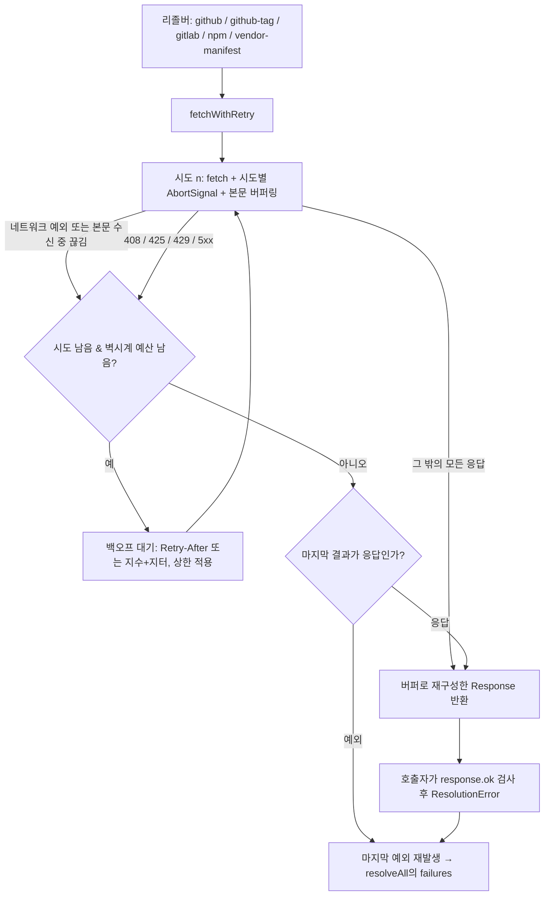

# Release Lock Transient Retry - Plan

## Goal Capsule

- **Objective:** 업스트림이 잠깐 5xx를 돌려줘도 시간별 릴리스 락 갱신이 초록으로 끝난다. 운영자가 실패 알림을 받는 경우는 실제로 소스가 오래 죽어 있을 때뿐이다.
- **Means:** 모든 리졸버가 공유하는 재시도 래퍼를 두고, 일시적 실패(네트워크 오류, 408/425/429/5xx)만 지수 백오프로 재시도한다 (KTD1, KTD2).
- **Authority:** 이 계획 > 저장소 `AGENTS.md` > 공통 에이전트 지침. 충돌 시 더 좁은 규칙이 우선한다.
- **Execution profile:** `packages/release-lock` 안의 소스 변경과 그 단위 테스트가 증거다. 마지막에 락을 실제로 한 번 갱신해 커밋한다.
- **Stop conditions:** `vp run -r test`/`typecheck`가 실패하거나, 락 갱신 CLI가 종료 코드 0을 내지 못하거나, 갱신된 락이 `.ci/check-release-lock-digests.sh`를 통과하지 못하면 멈추고 보고한다.
- **Tail ownership:** 호출한 파이프라인이 커밋, 푸시, PR, CI 감시를 소유한다.

---

## Product Contract

### Summary

`refresh-release-lock.yml`의 2026-09-09 13:25 UTC 실행이 `release-lock: openai/codex: releases returned HTTP 504` 한 줄 때문에 실패했다. 리졸버의 모든 HTTP 호출은 단 한 번의 `fetch`이므로, GitHub API의 순간적인 504가 그대로 소스 해석 실패가 되고 워크플로의 마지막 단계가 exit 1을 낸다. 공유 재시도 래퍼를 도입해 일시적 실패만 제한된 횟수로 다시 시도하고, 그 뒤 락을 실제로 한 번 갱신해 커밋한다.

### Problem Frame

`packages/release-lock`의 리졸버 다섯 종(`github.ts`, `github-tag.ts`, `gitlab.ts`, `npm.ts`, `vendor-manifest.ts`)은 각자 `fetch`를 한 번 호출하고 `response.ok`가 아니면 즉시 `ResolutionError`를 던진다. 재시도가 없으므로 업스트림의 순간적 장애 — GitHub API 504, 레이트리밋 429, 일시적 연결 끊김 — 가 곧바로 그 소스의 해석 실패가 된다. `resolveAll`이 실패한 소스를 빼고 나머지를 돌려주고 `mergeLocks`가 직전 항목을 유지하므로 락 자체는 안전하지만, 워크플로는 의도적으로 exit 1을 내므로 매시간 도는 갱신이 업스트림의 몇 초짜리 딸꾹질마다 빨간 실행을 남긴다. 실패 알림이 흔해지면 진짜 실패(자산 이름 변경, 소스 소멸)의 신호가 묻힌다.

### Key Decisions

- 워크플로의 "미해결 소스가 있으면 실패한다" 의미는 그대로 둔다. 재시도는 일시적 잡음을 걸러낼 뿐이고, 재시도 후에도 남는 실패는 여전히 빨간 실행이어야 한다. Governs R1, R7.
- 락 갱신은 이 브랜치에서 실제로 리졸버를 돌려 커밋한다. 손으로 편집하지 않는다 — 락은 기계 생성물이라는 `AGENTS.md`의 규칙을 지킨다. Governs R8.

### Requirements

**재시도 동작**

- R1. 일시적 실패에만 재시도한다: 네트워크/타임아웃 예외, 그리고 HTTP 408, 425, 429, 5xx 응답.
- R2. 그 밖의 응답(2xx, 3xx, 404 같은 4xx)은 재시도 없이 호출자에게 그대로 돌아간다.
- R3. 재시도는 지수 백오프로 최대 횟수까지만 하고, 소진되면 마지막 응답이나 마지막 예외를 호출자에게 전달한다. 실패 메시지는 지금과 같은 `<source>: <detail>` 모양을 유지한다.
- R4. 응답이 `Retry-After`(초 단위 정수 또는 HTTP-date)를 주면 그 값을 다음 대기 시간으로 쓰되, 대기 상한을 적용한다. 파싱할 수 없거나 이미 지난 값은 무시하고 지수 백오프로 되돌린다.
- R5. 정책 값 — 최대 시도 횟수, 기본 대기, 대기 상한, 시도별 타임아웃, 호출 전체의 벽시계 예산 — 은 `fetchWithRetry`의 `options` 인자로 주입할 수 있고, 생략하면 모듈의 기본 상수를 쓴다. 환경 변수 설정 표면은 두지 않는다.
- R11. 한 소스의 한 호출이 쓰는 총 시간은 벽시계 예산으로 제한된다. 예산을 넘기면 남은 시도를 포기하고 마지막 결과를 호출자에게 전달한다.
- R12. 응답 본문을 받는 도중의 끊김도 일시적 실패로 다루어 재시도한다. 래퍼가 재시도 루프 안에서 본문을 끝까지 읽고, 그 바이트로 재구성한 응답을 호출자에게 돌려준다. 본문이 없는 응답(예: 수동 리다이렉트 302)은 그대로 통과한다.

**적용 범위**

- R6. `github.ts`, `github-tag.ts`, `gitlab.ts`, `npm.ts`, `vendor-manifest.ts`의 모든 업스트림 HTTP 호출이 이 래퍼를 통과한다. `vendor-manifest.ts`의 TeamViewer 수동 리다이렉트 호출도 포함하며, 302 응답은 재시도 대상이 아니라 정상 경로다.
- R7. 재시도가 소진된 뒤의 동작은 지금과 동일하다 — 그 소스만 결과에서 빠지고 `failures`에 남으며, CLI는 종료 코드 1을 낸다.

**락 갱신**

- R8. `.chezmoidata/releases.json`이 리졸버 실행 결과로 갱신되어 커밋된다.
- R9. 갱신된 락이 `.ci/check-release-lock-digests.sh`를 통과한다.

**문서**

- R10. `packages/release-lock/README.md`가 재시도 정책 — 재시도 대상, 기본값, 벽시계 예산, 소진 후 동작 — 을 기록한다. 저장소 루트 `AGENTS.md`는 건드리지 않는다.

### Scope Boundaries

- 워크플로의 실패 의미(미해결 소스가 있으면 job 실패)는 바꾸지 않는다.
- `.ci/check-release-lock-digests.sh`의 검사 규칙은 바꾸지 않는다.
- 레지스트리 항목(어떤 도구를 어디서 해석하는지)은 바꾸지 않는다.
- `git-ref.ts`는 HTTP가 아니라 `git ls-remote`를 쓰므로 이번 범위 밖이다.
- 캐싱, 조건부 요청(ETag), 동시성 제한은 이번 범위 밖이다.

### Deferred to Follow-Up Work

- 소스별 실패 이력을 남겨 "며칠째 실패 중"을 구분하는 관측 기능.
- 오리진 단위 재시도 조정. `resolveAll`은 레지스트리 전체를 `Promise.all`로 동시에 해석하므로, GitHub이 광역으로 429를 내면 각 요청이 독립적으로 재시도해 증폭될 수 있다. 시도 상한과 대기 상한이 폭을 제한하고, 현재 그 증폭이 실제로 문제였다는 기준선 데이터가 없으므로 공유 `Retry-After` 데드라인과 오리진별 동시 재시도 제한은 후속 작업으로 둔다.

---

## Planning Contract

### Key Technical Decisions

- KTD1. **공유 래퍼를 새 모듈 `packages/release-lock/src/http.ts`에 둔다.** 리졸버 다섯 개가 각자 재시도를 구현하면 정책이 갈라진다. `github.ts`에 얹지 않는 이유는 `npm.ts`, `gitlab.ts`, `vendor-manifest.ts`가 이미 `github.ts`에서 `ResolutionError`만 재수출하는 얕은 의존만 갖고 있어서, 재시도까지 거기에 두면 GitHub 전용 모듈이 공용 HTTP 계층 역할을 겸하게 되기 때문이다. Governs R1, R2, R3, R6.
- KTD2. **재시도 판정은 응답을 던지지 않고 상태 코드로 한다.** 래퍼는 `Response`를 그대로 돌려주고, 재시도할지 여부만 상태 코드(408, 425, 429, 5xx)와 예외 발생 여부로 판정한다. 그래야 `vendor-manifest.ts`의 TeamViewer 호출처럼 `response.ok`가 false인 302를 정상 경로로 읽는 호출자가 래퍼를 그대로 쓸 수 있다 (R6). 각 리졸버의 기존 `response.ok` 검사와 오류 메시지는 그대로 남는다.
- KTD3. **정책 값은 `options` 인자로 주입하고 기본값을 모듈 상수에 둔다. 환경 변수는 두지 않는다.** 기본은 시도 4회(초기 시도 + 재시도 3회), 기본 대기 250ms에서 시작하는 지수 백오프에 지터, 대기 상한 4초다. 환경 변수를 쓰면 테스트가 `process.env`라는 공유 상태를 흔들어야 하고, 이 저장소에 새 설정 표면이 하나 늘어난다. 인자 주입이면 래퍼를 직접 부르는 테스트는 대기를 0으로 낮출 수 있고, 리졸버를 통과하는 통합 테스트는 기본값(최악 1.75초)으로도 충분히 빠르다. Governs R3, R4, R5.
- KTD4. **타임아웃은 시도별 `AbortSignal`과 호출 전체의 벽시계 예산 두 층으로 건다.** `vendor-manifest.ts`는 지금 30초 타임아웃 시그널을 `fetch` 인자로 넘긴다. 하나의 시그널을 재시도 전체에 재사용하면 첫 시도에서 만료된 시그널이 이후 시도를 즉시 중단시키므로, 시그널은 시도마다 새로 만든다. 그러나 시도별 타임아웃만 두면 응답을 끊지 않고 매달리는 업스트림 하나가 4회 × 30초를 그대로 쓴다. 그래서 래퍼가 첫 시도 시작 시각부터 재는 벽시계 예산(기본 45초)을 함께 소유하고, 예산을 넘기면 남은 시도를 포기한다. Governs R1, R6, R11.
- KTD5. **기존 테스트의 일시적 상태 코드 픽스처를 실제 위치에서 정리한다.** 저장소를 확인하면 일시적 코드를 쓰는 픽스처는 `gitlab.test.ts`(500)와 `vendor-manifest.test.ts`(503, 500) 세 곳이고, `npm.test.ts`는 이미 404를 쓴다. 의도가 "비정상 응답이면 오류"인 그 세 픽스처를 404 같은 비재시도 코드로 바꾸고, 재시도 자체는 새 `http.test.ts`와 리졸버 한 곳의 통합 시나리오로 증명한다. Governs R1, R2.
- KTD6. **본문은 재시도 루프 안에서 버퍼링한다.** Problem Frame이 목표로 삼은 "일시적 연결 끊김"은 대개 본문을 받는 중에 터지는데, 상태 코드만 보고 `Response`를 그대로 돌려주면 그 끊김은 래퍼 밖에서 발생해 재시도되지 않는다. 래퍼가 본문을 끝까지 읽고 그 바이트로 재구성한 응답을 돌려주면 R1의 약속이 실제로 성립한다. 모든 호출자가 이미 본문 전체를 메모리에 올리므로 메모리 특성은 그대로다. Governs R1, R12.

### High-Level Technical Design

방향성 스케치다. 산문이 권위를 가진다.

### Assumptions

- 시간별 워크플로 한 번의 예산 안에서 소스당 최대 45초의 추가 대기는 문제가 되지 않는다. 리졸버는 `Promise.all`로 모든 소스를 병렬 해석하므로 총 실행 시간은 가장 느린 소스 하나에 좌우된다.

### System-Wide Impact

`packages/release-lock`은 이 저장소 안에서만 쓰이고 소비자는 `.chezmoidata/releases.json` 하나다. 재시도는 락의 내용 형식을 바꾸지 않으므로 `.chezmoitemplates/release-lock-ref.tmpl`을 읽는 어떤 외부/스크립트도 영향을 받지 않는다.

실행 시간의 상한은 벽시계 예산이 정한다. 호출 하나는 예산(기본 45초)을 넘지 않고, `vendor-manifest.ts`의 `resolveClaude`(2회 순차)와 `resolveAndroidCli`(1회 뒤 병렬 다운로드)처럼 여러 호출을 순차로 하는 리졸버는 그 단계 수만큼 곱해진다 — 최악의 소스가 약 2분이다. 지금 정상 실행이 약 11초이므로, 업스트림이 모두 건강한 평상시에는 추가 대기가 사실상 0이다.

### Risks & Dependencies

- **락 갱신이 만드는 큰 diff.** 마지막 갱신 이후 여러 업스트림이 올라갔다면 락 변경이 넓어진다. 이는 기대되는 결과이고, `.ci/check-release-lock-digests.sh`가 URL과 다이제스트의 유효성을 지킨다.
- **main의 시간별 갱신과의 충돌.** 워크플로가 매시간 main에 락을 커밋하므로 이 브랜치의 락 커밋이 병합 시점에 충돌할 수 있다. 충돌 시 기본 브랜치를 이 브랜치로 머지하고 락을 다시 한 번 해석해 얻는다. 락 갱신을 이 PR에서 빼고 검증용 실행만 하는 대안은 검토했으나 채택하지 않았다 — 락 갱신은 사용자가 이 작업에 명시적으로 포함시킨 범위다.
- **`GITHUB_TOKEN` 없는 로컬 실행.** 인증 없이 GitHub API를 두드리면 레이트리밋(403/429)에 걸린다. 락 갱신 실행은 `gh auth token`이 주는 토큰을 `GITHUB_TOKEN`으로 넘겨 수행한다.

---

## Implementation Units

### U1. 공유 재시도 래퍼

- **Goal:** 일시적 실패만 지수 백오프로 재시도하는 `fetchWithRetry`를 새 모듈에 만든다.
- **Requirements:** R1, R2, R3, R4, R5, R11, R12 (KTD1, KTD2, KTD3, KTD4, KTD6)
- **Dependencies:** 없음
- **Files:**
  - `packages/release-lock/src/http.ts` — 신규
  - `packages/release-lock/test/http.test.ts` — 신규
- **Approach:**
  1. `fetchWithRetry(url, init, options)`를 내보낸다. `options`는 최대 시도 횟수, 기본 대기, 대기 상한, 시도별 타임아웃, 호출 전체의 벽시계 예산을 모두 선택 항목으로 받고, 생략된 값은 모듈의 기본 상수(시도 4, 기본 대기 250ms, 대기 상한 4초, 시도 타임아웃 30초, 벽시계 예산 45초)를 쓴다.
  2. 시도마다 `AbortSignal.timeout`을 새로 만들어 `init`에 합친다. 호출자가 넘긴 다른 `init` 필드(헤더, `redirect: "manual"`)는 보존한다.
  3. 응답을 받으면 본문을 그 시도 안에서 끝까지 버퍼링하고, 그 바이트로 상태·헤더가 같은 응답을 재구성해 돌려준다 (KTD6). 본문 수신 중 끊김은 시도 실패로 다룬다.
  4. 재시도 판정: `fetch`나 본문 읽기가 예외를 던졌거나(중단·네트워크 오류), 응답 상태가 408, 425, 429, 5xx일 때만 재시도한다. 그 밖의 응답은 즉시 반환한다.
  5. 대기 시간은 `Retry-After`가 있으면 그 값(초 정수 또는 HTTP-date에서 계산한 잔여 시간)을, 없거나 파싱 불가하거나 이미 지난 값이면 기본 대기의 지수 증가에 지터를 더한 값을 쓴다. 어느 쪽이든 대기 상한을 적용한다.
  6. 시도 횟수를 소진했거나 벽시계 예산이 남지 않으면 마지막 응답을 반환하고, 응답을 한 번도 받지 못했으면 마지막 예외를 다시 던진다.
- **Execution note:** 재시도 경로부터 테스트로 고정한 다음 구현한다. 테스트는 `options`로 대기를 0으로 낮춰 실행 시간을 늘리지 않는다.
- **Patterns to follow:** `packages/release-lock/test/npm.test.ts`의 `globalThis.fetch` 스텁과 `afterEach` 복원 방식.
- **Test scenarios:**
  - 504를 두 번 돌려준 뒤 200을 주는 스텁에서 `fetch`가 3번 호출되고 최종 200 응답이 반환된다.
  - 404를 주는 스텁에서 `fetch`가 정확히 1번 호출되고 404 응답이 그대로 반환된다.
  - 302를 주는 스텁에서 `fetch`가 정확히 1번 호출되고 302 응답이 그대로 반환된다(TeamViewer 경로).
  - 429와 `Retry-After: 0` 헤더를 주는 스텁에서 재시도가 일어나고, 다음 대기가 헤더 값을 따른다.
  - `Retry-After`가 파싱 불가한 문자열이거나 이미 지난 HTTP-date이면 지수 백오프 값이 쓰인다.
  - `Retry-After`가 대기 상한보다 큰 값을 주면 상한이 적용된다.
  - 계속 503을 주는 스텁에서 호출 횟수가 설정된 최대 시도 횟수와 정확히 같고, 마지막 503 응답이 반환된다.
  - `fetch`가 계속 예외를 던지는 스텁에서 최대 시도 후 그 예외가 호출자에게 전파된다.
  - 매 시도가 서로 다른 `AbortSignal`을 받는다 — 첫 시도의 시그널이 이미 중단된 상태여도 다음 시도가 실행된다.
  - 벽시계 예산을 아주 작게 준 스텁에서 시도 횟수가 남아 있어도 예산 소진 시점에 멈추고 마지막 결과를 반환한다.
  - 본문을 읽는 중 예외를 던지는 스트림 응답을 한 번 준 뒤 정상 응답을 주는 스텁에서 재시도가 일어나고, 최종 응답의 본문을 정상적으로 읽을 수 있다.
  - 반환된 응답의 본문을 호출자가 읽을 수 있고 상태 코드와 헤더가 원본과 같다.
  - `options`로 최대 시도를 1로 주면 재시도가 일어나지 않는다.
- **Verification:** `packages/release-lock`에서 타입 체크와 테스트가 통과하고, 새 테스트가 위 시나리오를 모두 덮는다.

### U2. 리졸버 전면 적용

- **Goal:** 다섯 리졸버의 모든 업스트림 HTTP 호출이 래퍼를 지나가게 하고, 기존 테스트의 픽스처를 새 재시도 의미에 맞춘다.
- **Requirements:** R6, R7, R10 (KTD2, KTD4, KTD5, KTD6)
- **Dependencies:** U1
- **Files:**
  - `packages/release-lock/src/github.ts`
  - `packages/release-lock/src/github-tag.ts`
  - `packages/release-lock/src/gitlab.ts`
  - `packages/release-lock/src/npm.ts`
  - `packages/release-lock/src/vendor-manifest.ts`
  - `packages/release-lock/test/github.test.ts`
  - `packages/release-lock/test/gitlab.test.ts`
  - `packages/release-lock/test/vendor-manifest.test.ts`
  - `packages/release-lock/test/cli.test.ts`
  - `packages/release-lock/README.md`
- **Approach:**
  1. 각 리졸버의 `fetch(...)` 호출을 `fetchWithRetry(...)`로 바꾼다. 헤더와 `redirect: "manual"` 같은 인자는 그대로 넘긴다.
  2. `vendor-manifest.ts`의 `AbortSignal.timeout(30_000)` 인자를 제거하고 래퍼의 시도별 타임아웃 옵션으로 옮긴다 (KTD4).
  3. `response.ok` 검사와 `ResolutionError` 메시지는 그대로 둔다. 재시도 소진 후의 실패 문구가 지금과 같아야 `resolveAll`의 `failures` 문자열과 CLI 출력이 변하지 않는다 (R7).
  4. 기존 테스트에서 "non-ok면 오류"를 증명하던 픽스처를 404로 바꾼다. 대상은 `gitlab.test.ts`의 500과 `vendor-manifest.test.ts`의 503·500 두 곳이다 — `npm.test.ts`는 이미 404를 쓰므로 손대지 않는다 (KTD5). 재시도가 실제로 리졸버를 통해 동작하는 것은 GitHub 리졸버 한 곳에 통합 시나리오 하나를 더해 증명한다.
  5. `packages/release-lock/README.md`에 재시도 정책 문단을 더한다: 무엇이 재시도 대상인지, 기본 시도 횟수와 대기, 벽시계 예산, 소진 후에도 실패가 남으면 그 소스가 직전 락 항목을 유지한 채 실행이 실패한다는 것.
- **Patterns to follow:** `github.ts`의 `fetchReleaseJson`처럼 리졸버 내부에 이미 있는 얇은 fetch 헬퍼 — 호출 지점을 한 곳으로 모으는 기존 구조를 유지한다.
- **Test scenarios:**
  - GitHub 리졸버: 504를 한 번 돌려준 뒤 정상 릴리스 JSON을 주는 스텁에서 락 항목이 정상 해석된다.
  - GitHub 리졸버: 404를 주는 스텁에서 지금과 같은 `ResolutionError` 메시지가 나오고 `fetch`는 1번만 호출된다.
  - npm 리졸버: 404를 주는 스텁에서 `registry /latest returned HTTP 404` 메시지가 그대로 나온다.
  - GitLab 리졸버: 404를 주는 스텁에서 `releases/permalink/latest returned HTTP 404` 메시지가 나오고 `fetch`는 1번만 호출된다.
  - vendor-manifest TeamViewer: 302와 `location` 헤더를 주는 스텁에서 재시도 없이 버전이 해석된다.
  - vendor-manifest: 비정상 상태 코드에서 기존 오류 메시지가 유지된다.
  - `resolveAll`: 한 소스가 계속 5xx일 때 그 소스만 `failures`에 남고 나머지는 해석되며, CLI 종료 코드가 1이다.
- **Verification:** `packages/release-lock`의 타입 체크와 전체 테스트가 통과하고, 기존 오류 메시지 단정이 그대로 살아 있다.

### U3. 릴리스 락 갱신

- **Goal:** 리졸버를 실제로 돌려 `.chezmoidata/releases.json`을 최신 업스트림 상태로 갱신하고, 게이트를 통과시킨다.
- **Requirements:** R8, R9
- **Dependencies:** U1, U2
- **Files:**
  - `.chezmoidata/releases.json`
- **Approach:**
  1. `gh auth token`으로 얻은 토큰을 `GITHUB_TOKEN`으로 넘겨 `packages/release-lock`의 CLI를 저장소 락 대상으로 실행한다.
  2. 종료 코드가 0일 때만 락 커밋으로 진행한다. 재시도 후에도 실패한 소스가 있으면 그 소스 이름과 사유를 보고하고 멈춘다 — 부분 갱신된 락을 커밋하지 않는다.
  3. `.ci/check-release-lock-digests.sh`를 갱신된 락에 대해 돌린다.
  4. 이 실행으로 새로 바뀐 파일이 `.chezmoidata/releases.json` 하나뿐인지 확인한다 (U1·U2의 소스 변경은 이미 커밋되어 있다).
- **Execution note:** 락은 기계 생성물이다. 손으로 편집하지 않는다.
- **Test scenarios:** `Test expectation: none -- 생성물 갱신이며, 검증은 아래 게이트가 소유한다.`
- **Verification:** `.ci/check-release-lock-digests.sh`가 ok를 출력하고, 락이 유효한 JSON이며 `releases.tools`가 비어 있지 않다.

---

## Verification Contract

| 게이트 | 명령 | 적용 |
|---|---|---|
| 타입 체크 | `packages/`에서 `vp run -r typecheck` | U1, U2 |
| 단위 테스트 | `packages/`에서 `vp run -r test` | U1, U2 |
| 포맷/린트 | `packages/`에서 `vp check` | U1, U2 |
| 락 게이트 | `.ci/check-release-lock-digests.sh` | U3 |
| 범위 확인 | `git diff --check`, `git status` | 전체 |
| CI | 푸시 후 `ci.yml`을 terminal success까지 감시 | 전체 |

---

## Definition of Done

- R1부터 R12까지 모두 참이다.
- 락 갱신 CLI가 종료 코드 0으로 끝났다.
- U1과 U2의 모든 테스트 시나리오가 통과한다.
- `.chezmoidata/releases.json`이 리졸버 실행 결과로 갱신되어 커밋되었고, 락 게이트가 통과한다.
- 시도했다가 버린 코드나 임시 픽스처가 diff에 남아 있지 않다.
- `ci.yml`이 terminal success에 도달한다.

---

## Sources / Research

- 실패한 실행: `refresh-release-lock.yml` job "Resolve upstream releases" — `release-lock: openai/codex: releases returned HTTP 504`, 이어서 "Fail when any source could not be resolved"가 exit 1.
- `.github/workflows/refresh-release-lock.yml` — 해석, 게이트, 커밋, 실패 단계의 순서와 의미.
- `packages/release-lock/src/{github,github-tag,gitlab,npm,vendor-manifest}.ts` — 각 리졸버의 단일 `fetch` 호출 지점과 오류 문구.
- `packages/release-lock/src/resolve-all.ts`, `cli.ts` — 실패한 소스의 생략, `mergeLocks` 오버레이, 종료 코드 1.
- `.ci/check-release-lock-digests.sh` — 락에 대한 두 가지 검사와 예외 규칙.
- `AGENTS.md` — 락이 기계 생성물이며 손으로 편집하지 않는다는 규칙, 시간별 갱신의 동작 설명.
