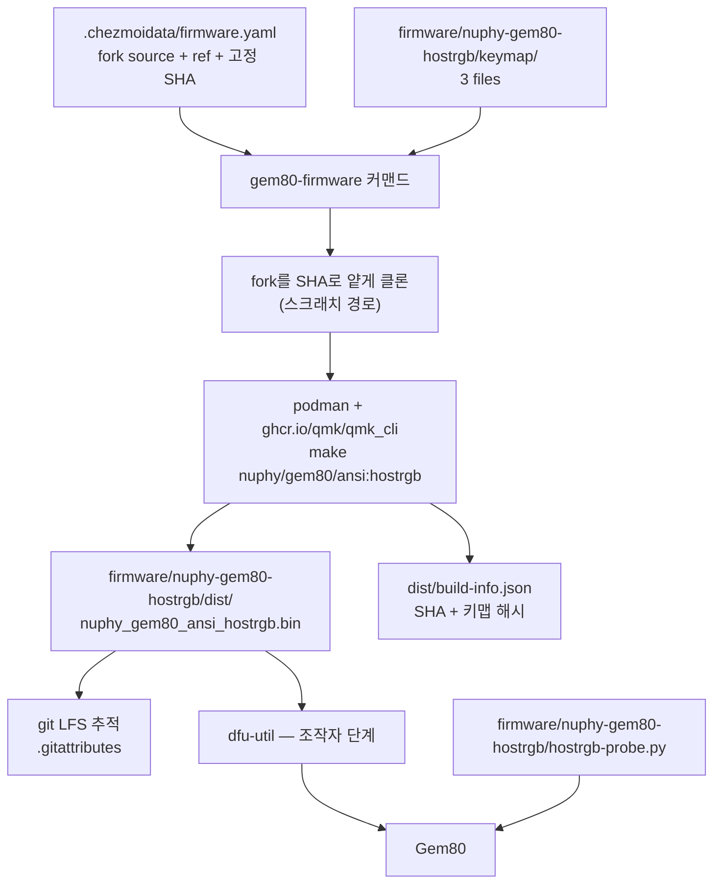
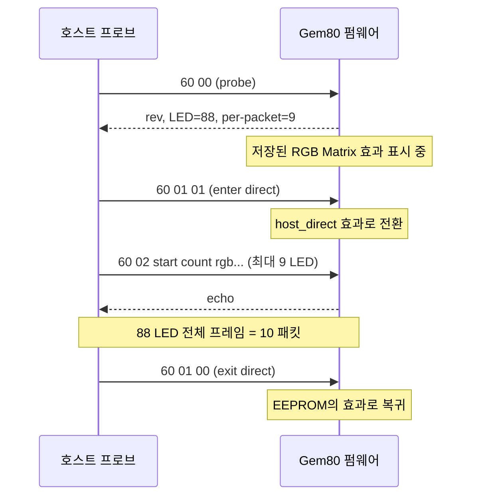

# Gem80 Host-Driven Per-Key RGB Firmware Verification - Plan

## Goal Capsule

- **Objective:** NuPhy Gem80이 호스트가 지정한 색으로 88개 키 LED를 개별 점등하고, 호스트가 물러나면 저장된 효과로 되돌아온다. 이 동작이 실제 장치에서 관찰로 증명된 상태가 목표다.
- **Means:** `ryodeushii/qmk-firmware` fork 기반 `hostrgb` 키맵으로 커스텀 펌웨어를 빌드해 플래시하고, `0x60` raw HID 벤더 명령을 하드웨어에서 확인한다 (KTD1, KTD5).
- **Product authority:** GitHub 이슈 [hyperlapse122/dotfiles#459](https://github.com/hyperlapse122/dotfiles/issues/459)의 본문과 코멘트 스레드. 호스트 데몬 크레이트, fcitx5 인디케이터, SIDE 12 LED 영역은 활성 범위가 아니다.
- **Execution profile:** U1–U5와 U7은 에이전트가 완결한다. U6은 조작자 개입 단위다 — 실행자가 물리 단계를 안내하고 관찰 결과를 받아 기록하며, 대신 수행하지 않는다.
- **Stop conditions:** 플래시 중 장치가 DFU로 열거되지 않거나 `dfu-util`이 오류로 종료하면 멈추고 복구 절차(R5)를 먼저 실행한다. `60 00` 프로브가 88이 아닌 LED 개수를 응답하면 멈추고 보고한다 — 키맵이 잘못된 보드로 빌드된 신호다.
- **Tail ownership:** 이 계획은 커밋까지 소유한다. 이슈 #459의 검증 항목 갱신은 U6에 포함된다.

---

## Product Contract

**Product Contract preservation:** 변경됨 — R11, R12, R13 신규. 사용자가 계획 도중 빌드 산출물을 git LFS로 커밋하도록 지시했고, 이는 브레인스토밍이 한 번 기각했던 선택지다. 첫 Key Decision을 그 지시대로 고쳐 썼다(기각 목록에서 "바이너리 커밋"을 빼고, 드리프트 방어를 R12에 붙였다). R1–R10은 의미와 ID 모두 그대로다.

문서 리뷰 이후 R12와 R13이 다시 쓰였다. R12는 기록만 하던 것에서 플래시 전 게이트로 강해졌다 — 기록이 드리프트를 검출만 하고 막지 못한다는 지적이 두 계열에서 나왔다. R13은 `git-lfs` 패키지 선언을 요구하던 것에서 최초 클론 순서를 문서화하는 것으로 바뀌었다 — `git-lfs`와 `filter.lfs`가 이미 리포에 선언되어 있어 원래 요구가 성립하지 않았다.

브레인스토밍이 `Deferred to Planning`으로 남긴 세 개의 Outstanding Question은 계획 단계에서 해소되어 KTD1–KTD5가 소유하며, 중복을 남기지 않도록 해당 목록에서 삭제했다.

### Summary

Gem80의 순정 펌웨어를 `hostrgb` 커스텀 빌드로 교체하고, `0x60` 벤더 명령이 88개 키 LED를 실제로 칠하는지 장치에서 증명한다. 리포에는 직접 저작한 키맵 3파일과 커밋 SHA로 고정된 빌드 경로만 남는다.

### Problem Frame

Gem80 하드웨어와 펌웨어 내부는 이미 퍼키 단위로 동작한다. `keyboards/nuphy/gem80/ansi/keyboard.json`이 88개 WS2812 LED를 각각 `[row, col]`에 매핑하고, fork는 `rgb_matrix_set_color()`를 인덱스별로 호출하는 커스텀 효과를 이미 싣고 있다. 빠진 것은 호스트가 그 88개 색을 공급할 전송 경로 하나뿐이다.

순정 펌웨어는 호스트에 전역 RGB 4종만 노출한다. 커스텀 채널 0–15 × value id 0–23을 훑은 결과 살아 있는 채널은 QMK RGB Matrix 하나였고, 퍼키 데이터를 위한 벤더 채널은 없었다.

이슈 스레드에 쌓인 설계 결정 — 전송 방식, 레이어 모델, 크레이트 구조, 첫 클라이언트 — 은 전부 이 프로토콜이 실제로 동작한다는 전제 위에 서 있다. 그런데 아직 아무것도 플래시되지 않았고 (`bcdDevice=0118`, 순정 v1.1.8), 최초 빌드 트리는 세션 스크래치패드와 함께 사라졌다. 증명 비용이 가장 싼 것도, 틀렸을 때 가장 많은 것을 무너뜨리는 것도 이 단계다.

### Key Decisions

- **fork 소스는 커밋하지 않고 고정 커밋 SHA로 클론하되, 직접 저작한 키맵과 빌드된 펌웨어 바이너리는 리포가 보관한다.** (session-settled: user-directed — chezmoi external과 전체 vendoring 대신 선택: dotfiles가 남의 코드 수 GB를 보관하지 않으면서 재현성은 SHA가 보장한다. 바이너리는 git LFS로 추적한다 — 재빌드 없이 바로 플래시할 수 있는 값이 드리프트 위험보다 크다고 판단했고, R12가 그 위험을 막는다.) Governs R1, R2, R11, R12.
- **수용 기준은 `0x60` end-to-end 성공과 무선 도달 여부 확인 두 가지다.** (session-settled: user-directed — 오버레이 충돌 확인과 워치독 포함 대신 선택: 첫 플래시가 증명해야 할 범위를 최소로 유지한다.) Governs R6, R7, R8, R9.
- **무선에서 raw HID가 닿지 않는다는 결과도 통과로 취급한다.** 확인되지 않은 상태가 남지 않는 것이 목적이다. Governs R9.
- **펌웨어 워치독은 이번 빌드에서 제외한다.** 나중에 필요해지면 플래시 사이클을 한 번 더 쓴다는 비용을 받아들인 결정이다.
- **오버레이 충돌은 정식 검증 항목이 아니지만, 관찰되면 이슈에 기록만 남긴다.** (session-settled: user-approved — 검증 도중 caps-lock과 배터리 표시가 눈앞에 있으므로 관찰 비용이 0에 가깝다.) Governs R10.

### Requirements

**리포 산출물**

- R1. `hostrgb` 키맵을 구성하는 세 파일 `rules.mk`, `rgb_matrix_user.inc`, `keymap.c`가 리포에 커밋된다.
- R2. 빌드 경로는 `ryodeushii/qmk-firmware`를 고정된 커밋 SHA로 클론한다. fork의 소스 자체는 리포에 커밋되지 않는다.
- R3. 빌드는 rootless Podman과 `ghcr.io/qmk/qmk_cli` 이미지만으로 재현된다. 호스트 툴체인 설치나 `sudo`를 요구하지 않는다.

**빌드 산출물 보관**

- R11. 빌드된 `.bin`이 git LFS로 추적되어 리포에 커밋된다. 클론한 호스트는 재빌드 없이 플래시할 수 있다.
- R12. 커밋된 `.bin` 옆에 그것을 만든 fork 커밋 SHA, make 타깃, 키맵 리비전이 기록되고, 그 기록이 현재 소스와 어긋나면 플래시 전에 막힌다.
- R13. 최초 클론 시점에는 LFS 필터가 아직 배포되지 않아 `.bin`이 포인터로 내려온다는 사실이 문서화되고, 포인터 상태에서 실제 바이너리를 받는 절차가 함께 기록된다.

**플래시 안전성**

- R4. 플래시를 시작하기 전에 NuPhy 순정 펌웨어 파일과 현재 VIA 키맵이 로컬에 백업되어 있다.
- R5. 플래시 실패 시의 하드웨어 복구 경로가 문서에 기록된다 — Caps Lock 키캡을 제거하고 그 옆 검은 버튼을 누른 채 연결하는 절차.

**하드웨어 검증**

- R6. `60 00` 프로브가 프로토콜 리비전, LED 개수 88, 패킷당 LED 9를 응답한다.
- R7. `60 01 01`로 direct 모드에 진입한 뒤 `60 02`가 지정한 키가 지정한 색으로 점등하며, 88 LED 전체 프레임(10패킷)이 반영된다.
- R8. `60 01 00`으로 direct 모드를 나가면 EEPROM에 저장된 기존 효과로 복귀한다.
- R9. 2.4G와 블루투스 모드에서 raw HID 도달 여부가 확인되고 그 결과가 이슈에 기록된다.
- R10. 검증 중 caps-lock 표시, 배터리 표시, 키 누름 하이라이트가 `KEYS` 영역을 놓고 호스트와 충돌하는 것이 관찰되면 이슈에 기록된다.

### Acceptance Examples

- AE1. direct 모드 진입과 단일 키 점등
  - **Covers R7.**
  - **Given:** `hostrgb` 펌웨어가 플래시되어 있고 키보드가 유선으로 연결되어 있다.
  - **When:** `60 01 01`을 보낸 뒤 `60 02 00 01 FF 00 00`을 보낸다.
  - **Then:** LED 인덱스 0에 해당하는 키가 빨강으로 점등하고, 나머지 키는 direct 버퍼의 초기값을 따른다.

- AE2. direct 모드 이탈 후 효과 복귀
  - **Covers R8.**
  - **Given:** direct 모드에서 임의의 프레임이 표시되고 있다.
  - **When:** `60 01 00`을 보낸다.
  - **Then:** 플래시 이전에 EEPROM에 저장되어 있던 RGB Matrix 효과가 다시 표시된다.

- AE3. 무선 모드에서 프로토콜이 닿지 않는 경우
  - **Covers R9.**
  - **Given:** 키보드가 2.4G 또는 블루투스 모드로 전환되어 있다.
  - **When:** `60 00` 프로브를 보낸다.
  - **Then:** 응답이 없거나 hidraw 엔드포인트가 나타나지 않는다. 이 결과는 실패가 아니며, "퍼키 direct 모드는 USB 전용"이라는 사실을 이슈에 기록하는 것으로 R9가 충족된다.

<!-- ce-section: work-relationships -->
### How This Work Fits Together

이 계획은 이슈 #459가 담은 네 영역 중 **펌웨어 검증** 하나만 소유한다. 아래 분해는 현재의 이해이지 확정된 로드맵이 아니며, 이후 계획이 수정하거나 나눌 수 있다.

- 호스트 데몬 크레이트 (`crates/gem80-rgb` — AF_UNIX 전송, 레이어 합성, 렌더 루프)
  - **Depends on** 이 계획의 `0x60` 검증. 프로토콜이 동작하지 않으면 데몬이 대상으로 삼을 것이 없다.
  - **Can proceed independently of** 이 계획의 플래시 단계에서 설계와 단위 테스트까지는 진행 가능하다.
- fcitx5 입력기 인디케이터 (첫 선언형 클라이언트)
  - **Depends on** 데몬 크레이트. 붙일 소켓이 먼저 있어야 한다.
  - **Shares** 이슈 스레드가 이미 확정한 스파스 `SetLayerPixels` 스키마.
- SIDE 영역 지원 (로고 7 + 사이드바 5, 총 12 LED)
  - **Still to decide** `0x60`에 영역(`KEYS`/`SIDE`)을 어떻게 실을지. 이 계획이 검증하는 명령에는 영역 바이트가 없다 — R6–R8은 `KEYS` 88개만 다룬다. SIDE를 붙이려면 명령을 확장해야 하고, 그 확장은 이미 플래시된 펌웨어를 다시 굽는 일이다.
  - **Still to decide** 배터리·충전 표시가 호스트 쓰기를 이긴다는 원칙은 정해졌으나, `bat_percent_led()`와 RF 링크 점멸의 우선순위는 미정이다.
- 펌웨어 워치독 (호스트 침묵 N초 후 저장된 효과로 자동 복귀)
  - **Enables** 데몬이 죽어도 키보드가 얼지 않는 성질. 이 계획에서 제외되었으므로 별도 플래시 사이클을 요구한다.

### Scope Boundaries

**나중으로 미룸**

- 호스트 데몬 크레이트, fcitx5 인디케이터, SIDE 12 LED 영역 — 각각 독립된 작업 단위다.
- 펌웨어 워치독.
- 오버레이 충돌의 정식 검증과 그에 따른 우선순위 정책 결정. R10은 관찰 기록까지만 요구한다.

**이 작업의 정체성 밖**

- 순정 펌웨어를 유지한 채 전역 RGB만 스크립팅하는 경로. 이미 가능한 일이고, 퍼키 제어라는 목적을 달성하지 못한다.
- upstream QMK로의 이식. 이 보드의 커스텀 매트릭스, RF, 슬립, 디바운스 로직 때문에 upstream에서는 빌드되지 않는다.

**후속 작업으로 미룸**

- `firmware/` 아래 다른 키보드로의 일반화. 두 번째 보드가 생기기 전까지는 추상화할 대상이 없다.

### Dependencies / Assumptions

이 계획을 세운 시점에 호스트에서 확인된 선결 조건:

| 항목 | 상태 |
| --- | --- |
| Gem80 연결 | `19f5:3275` 검출, 유선 |
| 현재 펌웨어 | `bcdDevice=0118` — 순정 v1.1.8, 미플래시 |
| hidraw 접근 | `hidraw0/1/2`에 `uaccess` ACL 부여됨 |
| udev 규칙 | `system/linux/etc/udev/rules.d/59-nuphy-gem80-via.rules`가 `19f5:3275`에 `uaccess` 태그 부여 |
| `dfu-util` | 0.11 설치됨 |
| 빌드 환경 | podman 5.8.4, `ghcr.io/qmk/qmk_cli` 이미지 로컬 존재 |
| `python3` | 3.14.7 |
| `git-lfs` | 3.7.1 설치됨. `.install-prerequisites.sh:1112-1113`(Fedora)와 `:1193`(Ubuntu)이 이미 설치를 소유 — 새 선언 불필요 |
| `filter.lfs` git config | `dot_config/git/config.tmpl:15-19`가 `required = true`로 이미 배포 — `git lfs install` 불필요 |
| 리포의 LFS 사용 | 없음 — 추적 패턴 0개, LFS 오브젝트 0개, 커밋된 바이너리 0개. U7이 `.gitattributes` 한 줄로 켬 |
| release lock 갱신 | `.github/workflows/refresh-release-lock.yml`이 `cron: "0 * * * *"`로 매시간 재해결 후 자동 커밋·푸시 |
| DFU udev 규칙 | `0483:df11` 규칙 없음 — U4가 추가 |
| 빌드 트리 | 소실 — U2가 키맵 재작성 |

가정:

- 88개 키 LED와 12개 SIDE LED는 별도의 WS2812 체인이며, `0x60`의 `KEYS` 영역은 전자만 다룬다.
- 부트로더는 MCU 내장 `stm32-dfu`이므로 `dfu-util`로 재플래시가 가능하고, 벽돌 위험은 낮다.
- 이슈 본문이 기록한 플래시 여유(73,654 / 131,072 바이트)는 여전히 유효하다.

### Sources / Research

- 이슈 [hyperlapse122/dotfiles#459](https://github.com/hyperlapse122/dotfiles/issues/459) — 프로토콜 설계, 빌드 결과, 플래시 절차, 채널 스캔 결과.
- fork: `ryodeushii/qmk-firmware`, 브랜치 `nuphy-keyboards`. 조사 시점 헤드는 `9847cb81729fa6540ffed1a583b9acdaaa20607b` (2026-07-24). 플래시 절차의 원본은 그 안의 `keyboards/nuphy/instructions.md`.
- 순정 펌웨어 배포처: https://nuphy.com/pages/qmk-firmwares
- `.github/workflows/refresh-release-lock.yml` — `cron: "0 * * * *"`로 락 전체를 재해결하고 `chore(release-lock): refresh release lock`으로 자동 커밋·푸시한다. KTD1이 락을 쓰지 않는 이유의 근거.
- `packages/release-lock/src/git-ref.ts`, `src/types.ts` (`ToolSpec`) — `gitRef`는 항상 `git ls-remote`로 ref를 재해결하며, 고정이나 제외 필드가 없다.
- `.install-prerequisites.sh:1112-1113`, `:1193` — `git-lfs` 설치를 이미 소유. `dot_config/git/config.tmpl:15-19` — `filter.lfs`를 `required = true`로 이미 배포. 둘 다 U7이 건드리지 않는 이유.
- `.chezmoiscripts/30-linux/run_onchange_after_install-system-16-udev.sh.tmpl` — `system/linux/etc/udev/rules.d/**`를 글롭으로 배포하므로 U4는 매니페스트 항목이 필요 없다.
- `.chezmoidata/commands.yaml` (`codex-wrapper`, `orca-wrapper`) — `producer: source` 커맨드 유닛의 선언 모양.
- `.chezmoiignore:117-120` — `crates/`, `packages/`를 제자리 빌드 소스로 제외하는 규칙.
- `.gitattributes` — 현재 `*.age binary` 한 줄뿐이고 LFS 필터가 없다. `git lfs track`과 `git lfs ls-files` 모두 빈 출력이며, 리포에 커밋된 바이너리도 없다.
- `.chezmoiscripts/20-base/fedora/run_onchange_before_base.sh.tmpl`의 `core_packages` 배열 — `git`이 선언된 자리이자 `git-lfs`가 들어갈 자리.
- `system/linux/etc/udev/rules.d/59-nuphy-gem80-via.rules`, `system/README.md` — 기존 hidraw 접근 규칙과 그 목록.
- `STRATEGY.md` — "결정은 데이터로 선언하고 스크립트는 멍청한 reconciler", 지표 "동작하는 호스트까지 남은 수동 단계 수".

---

## Planning Contract

### Key Technical Decisions

- KTD1. **fork SHA를 release lock 밖의 `.chezmoidata` 항목으로 선언한다.** (session-settled: user-directed — release lock의 `gitRef` 리졸버 대신 선택.) `gitRef`는 `git ls-remote`로 브랜치 헤드를 재해결하는데, `.github/workflows/refresh-release-lock.yml`이 `cron: "0 * * * *"`로 매시간 락 전체를 갱신하고 자동 커밋·푸시한다. 락에 넣으면 SHA가 스스로 움직여 커밋된 `.bin`(R11)이 조용히 어긋나고, `ToolSpec`에는 이를 막을 pin이나 exclude가 없으며 이 fork에는 움직이지 않는 태그도 없다. 별도 데이터로 선언하면 갱신 잡이 닿지 않아 고정이 실제로 고정이 되고, upstream 반영은 사람이 그 값을 고칠 때만 일어난다. `STRATEGY.md`의 "결정은 데이터로 선언한다"는 그대로 지켜진다. Governs R1, R2.
- KTD2. **빌드는 `chezmoi apply`가 아니라 온디맨드 커맨드로 실행한다.** 빌드는 수 GB 트리를 클론하고 2.83 GB 컨테이너 이미지를 돌리는데, 관리 대상 타깃 파일을 만들지 않으므로 reconciler가 아니다. 키보드가 없는 호스트는 그 비용을 전부 헛되이 치른다. R11이 커밋된 바이너리를 보장하므로 대부분의 호스트는 빌드를 아예 돌릴 일이 없다. Governs R3.
- KTD7. **git LFS 추적을 `.gitattributes` 한 줄로 켜고, 범위를 펌웨어 산출물 경로에만 건다.** (session-settled: user-directed — 평범한 git 객체로 커밋하는 대신 선택.) 이 리포는 LFS를 쓴 적이 없지만 **의존은 이미 갖춰져 있다**: `.install-prerequisites.sh`가 Fedora와 Ubuntu 양쪽에 `git-lfs`를 설치하고, `dot_config/git/config.tmpl:15-19`가 `filter.lfs`를 `required = true`로 배포한다. 그래서 이 단위는 패키지도 git config도 건드리지 않는다 — `git lfs install`을 실행하면 chezmoi가 소유한 `~/.config/git/config`에 써서 다음 apply에 되돌려진다. 남는 실제 구멍은 최초 클론이 `chezmoi apply`보다 먼저라는 순서이며, R13이 그것을 문서로 닫는다. 패턴을 `firmware/*/dist/*.bin`으로 좁히는 것은 나중에 추가되는 다른 바이너리가 의도 없이 LFS로 빨려 들어가지 않게 하기 위해서다.

이 도입은 비대칭이다. **이탈 비용이 도입 비용보다 크다** — 한 번 커밋된 LFS 오브젝트는 히스토리 재작성 없이는 제거되지 않고, 이 리포는 히스토리 재작성을 승인 없이 하지 않는다. 그리고 **수혜자와 부담자가 다르다** — 재빌드 없이 플래시하는 이득은 Gem80을 물리적으로 가진 호스트만 받고, `git-lfs` 표면과 포인터-플래시 위험은 리포의 모든 클론이 진다. 추적 범위를 넓히자는 제안이 나오면 이 비교를 그 대상에 대해 다시 한다. Governs R11, R13.
- KTD3. **DFU 장치(`0483:df11`)에 자체 `uaccess` udev 규칙을 준다.** 플래시 단계에서 `sudo`를 없앤다. `59-nuphy-gem80-via.rules`와 같은 모양이고, STRATEGY.md의 "동작하는 호스트까지 남은 수동 단계 수" 지표를 따른다. DFU 열거는 조작자가 부트로더에 의도적으로 진입할 때만 나타나므로 상시 노출면이 아니다.
- KTD4. **펌웨어 자산을 새 최상위 `firmware/` 디렉터리에 둔다.** `crates/`는 Rust, `packages/`는 TypeScript, `system/`은 root 소유 `/etc`다. C 키맵 소스와 일회성 프로브 스크립트는 셋 중 어디에도 속하지 않는다. `.chezmoiignore`에 `./firmware`를 추가해 `crates/`, `packages/`와 같은 제자리 빌드 소스로 다룬다. Governs R1.
- KTD5. **`0x60` 검증은 `/dev/hidraw`에 직접 쓰는 일회성 Python 스크립트로 한다.** 데몬 크레이트는 범위 밖이고, 지금 크레이트를 만들면 프로토콜이 증명되기도 전에 그 모양을 선점하게 된다. `python3` 3.14.7이 이미 있고 `uaccess` ACL이 hidraw 접근을 이미 허용한다. Governs R6, R7, R8, R9.
- KTD6. **플래시와 하드웨어 검증을 `ce-work` 안의 조작자 개입 단위로 실행한다.** (session-settled: user-directed — R6–R10을 이 계획 밖으로 미루는 대신 선택: 물리 단계는 자동화할 수 없지만, 실행이 런북만 넘기고 끝나서는 안 된다.) Governs R6, R7, R8, R9, R10.

### High-Level Technical Design

빌드에서 검증까지의 데이터 흐름. `.chezmoidata` 항목이 SHA의 유일한 소유자다. 스크래치 클론 트리는 버리고, `dist/`의 산출물은 리포에 커밋된다.

`dist/`의 바이너리는 커밋되므로, 키보드를 가진 다른 호스트는 클론만으로 플래시할 수 있고 빌드 경로를 전혀 타지 않는다.

`0x60` 프로토콜의 상태 전이. `60 01`이 direct 모드의 유일한 게이트이고, `60 02`는 그 안에서만 의미를 가진다.

### Assumptions

- `.chezmoidata/firmware.yaml`의 `sha`는 사람이 고칠 때만 움직인다. 이 계획은 upstream을 언제 따라갈지 정하지 않으며, 따라갈 때는 재빌드와 재검증이 함께 일어난다.
- QMK raw HID는 32바이트 리포트를 쓰며, `/dev/hidraw`에 쓸 때 선행 리포트 ID 바이트 `0x00`이 필요하다. 프로브 스크립트가 실제 응답으로 이 가정을 즉시 검증한다.
- 세 개의 `hidraw` 노드 중 usage page `0xFF60` / usage `0x61`인 것이 raw HID 엔드포인트다. 프로브는 노드를 하드코딩하지 않고 이 속성으로 고른다.

### Sequencing

U1, U2, U7은 서로 독립이다. U3은 셋 다 필요하다 — U7이 먼저여야 `.bin`이 처음부터 LFS 필터를 거쳐 커밋된다. U5는 U2에 의존한다: 두 단위가 `0x60`의 같은 프로토콜 정의를 공유하므로 키맵이 그 정의를 확정한 뒤 프로브를 쓴다. U4는 아무것에도 의존하지 않는다. U4와 U5는 U6 이전에만 끝나면 된다. U6은 나머지 전부에 의존하고 조작자가 있어야 진행된다.

U7의 왕복 검증(새 클론에서 `.bin`이 포인터가 아닌지 확인)은 U3이 `.bin`을 만들기 전에는 대상이 없다. 그 게이트는 Verification Contract가 `U7, U3` 공동으로 배정한 대로 U3 이후에 한 번 실행하며, U7 단독 landing 시점의 통과 조건이 아니다.

### Risks & Dependencies

- **커밋된 바이너리와 소스의 드리프트.** 키맵이나 lock의 SHA가 바뀌었는데 `.bin`을 다시 만들지 않으면, 리포는 소스와 맞지 않는 펌웨어를 배포한다. `build-info.json`(R12)이 검출 수단이지만 자동 게이트는 아니다 — 불일치를 CI에서 막을지는 후속 판단으로 남긴다.
- **LFS 도입이 리포 전체에 미치는 영향.** 이 변경 이후 모든 클론이 `git-lfs`를 요구한다. 없으면 `.bin`이 포인터 텍스트로 내려오고, 그 상태로 플래시하면 장치를 망가뜨린다. R13이 의존을 선언으로 만들고 U7의 시나리오가 조용한 통과를 막는다.
- **원격 LFS 할당량.** GitHub 무료 티어는 저장·대역폭 각 1 GB/월이다. 73 KB 바이너리 한 개는 무시할 수준이지만, 펌웨어 리비전이 쌓이면 히스토리의 모든 버전이 저장량에 계산된다.
- **fork 브랜치 헤드 이동.** 고정 SHA는 시간이 지날수록 `nuphy-keyboards` 헤드보다 뒤처진다. upstream 수정이 필요해지면 사람이 `sha`를 올리고 재빌드·재검증한다. 그때 얕은 클론이 임의 SHA에 도달할 수 있어야 하므로 U3 2단계의 fetch 방식이 이 위험의 완화책이다.

---

## Implementation Units

### U1. fork SHA를 `.chezmoidata` 항목으로 선언

- **Goal:** fork의 커밋 SHA가 리포 안에서 데이터로 선언되고, 어떤 자동 갱신도 그 값을 움직이지 못한다.
- **Requirements:** R2. KTD1을 구현한다.
- **Dependencies:** 없음.
- **Files:**
  - `.chezmoidata/firmware.yaml` (신규)
- **Approach:**
  1. `firmware.gem80.qmkFork`에 `source`(`ryodeushii/qmk-firmware`), `ref`(`refs/heads/nuphy-keyboards`), `sha`(40자 소문자 hex)를 선언한다. `ref`는 사람이 SHA를 갱신할 때 어디를 보는지 남기는 기록이고, 빌드가 실제로 쓰는 값은 `sha` 하나다.
  2. 파일 상단 주석에 이 값이 release lock에 있지 않은 이유를 남긴다 — KTD1이 소유하는 결정이므로 근거를 다시 쓰지 말고 KTD1을 가리킨다.
  3. 조사 시점의 브랜치 헤드는 `9847cb81729fa6540ffed1a583b9acdaaa20607b`(2026-07-24)였다. 실제 값은 구현 시점에 `git ls-remote`로 확인해 넣는다.
- **Patterns to follow:** `.chezmoidata/`의 기존 데이터 파일들(`system.yaml`, `commands.yaml`)이 선언 형식과 주석 밀도의 기준.
- **Test scenarios:** `Test expectation: none -- 데이터 선언뿐이고 동작이 없다. 값의 유효성은 U3의 빌드가 증명한다.`
- **Verification:** `.chezmoidata/firmware.yaml`이 40자 소문자 hex `sha`를 담는다. `.github/workflows/refresh-release-lock.yml`을 수동 실행해도 이 파일이 변경되지 않는다.

### U2. `hostrgb` 키맵 소스 추가

- **Goal:** 펌웨어를 만드는 데 필요한, 직접 저작한 코드 전부가 리포에 있다.
- **Requirements:** R1. KTD4를 구현한다.
- **Dependencies:** 없음.
- **Files:**
  - `firmware/nuphy-gem80-hostrgb/keymap/rules.mk` (신규)
  - `firmware/nuphy-gem80-hostrgb/keymap/rgb_matrix_user.inc` (신규)
  - `firmware/nuphy-gem80-hostrgb/keymap/keymap.c` (신규)
  - `.chezmoiignore` (수정 — `./firmware` 추가)
- **Approach:**
  1. 이슈 #459 본문의 스니펫에서 세 파일을 복원한다. 본문이 유일한 소스이며, 원 빌드 트리는 없다.
  2. `rgb_matrix_user.inc`는 fork의 기존 두 효과(`game_mode`, `position_mode`)를 그대로 먼저 두어 효과 인덱스를 보존한 뒤 `host_direct`를 덧붙인다.
  3. `keymap.c`는 `../default/keymap.c`를 include하고, `hostrgb_buf`를 선언하며, `via_command_kb()`에서 `0x60`의 세 하위 명령을 처리한다. 프로토콜의 규범 정의는 R6–R8이 소유하므로 여기서 다시 쓰지 않는다.
  4. `rules.mk`에서 `EXTRAFLAGS += -I$(KEYMAP_PATH)/../default`를 **넣지 않는다.** `via` 키맵이 가진 이 플래그가 `rgb_matrix_user.inc`를 default 키맵에서 해석하게 만들며, 빼야 이 키맵 자신의 것을 쓴다.
  5. `.chezmoiignore`의 `./crates`, `./packages` 옆에 `./firmware`를 추가하고 같은 주석 블록에 포함시킨다.
- **Patterns to follow:** fork의 `keyboards/nuphy/gem80/ansi/keymaps/via/`가 키맵 디렉터리 구조의 기준. `.chezmoiignore:117-120`이 제자리 빌드 소스 제외의 기준.
- **Test scenarios:** `Test expectation: none -- 컴파일 가능성이 유일한 성질이고, U3의 빌드가 그것을 증명한다.` `.chezmoiignore` 변경은 U3의 검증에서 함께 확인한다.
- **Verification:** 세 파일이 존재하고, `chezmoi diff`가 `firmware/` 아래 어떤 타깃도 제안하지 않는다.

### U7. git LFS 도입 및 추적 범위 선언

- **Goal:** 펌웨어 산출물 경로가 LFS로 추적되고, 최초 클론이 포인터를 내려준다는 사실과 그 회복 절차가 기록된다.
- **Requirements:** R11, R13. KTD7을 구현한다.
- **Dependencies:** 없음.
- **Files:**
  - `.gitattributes` (수정)
  - `firmware/nuphy-gem80-hostrgb/README.md` (수정 — 클론 순서 주의)
- **Approach:**
  1. `.gitattributes`에 `firmware/*/dist/*.bin filter=lfs diff=lfs merge=lfs -text`를 추가한다. 경로를 좁게 잡는 이유는 KTD7이 소유한다.
  2. 기존 `*.age binary` 항목 옆에 같은 형식의 주석으로 이유를 남긴다.
  3. `README.md`에 클론 순서 주의를 적는다: 최초 클론은 `chezmoi apply`보다 먼저 일어나므로 그 시점에 `filter.lfs`가 아직 배포되지 않았고, `.bin`은 포인터 텍스트로 내려온다. apply 이후 `git lfs pull`로 실제 바이너리를 받는다. 이 순서는 U6 4단계의 플래시 전 확인과 짝을 이룬다.
- **Execution note:** 패키지 목록과 git config는 건드리지 않는다. `git-lfs` 설치는 `.install-prerequisites.sh`가, `filter.lfs`는 `dot_config/git/config.tmpl`이 이미 소유한다 — 중복 선언은 두 곳이 어긋날 여지만 만들고, `git lfs install`은 chezmoi 관리 타깃을 덮어써 다음 apply에서 되돌려진다.
- **Patterns to follow:** `.gitattributes`의 `*.age binary` 항목이 주석 형식의 기준.
- **Test scenarios:**
  - `git check-attr filter -- firmware/nuphy-gem80-hostrgb/dist/x.bin`이 `lfs`를 보고한다.
  - `git check-attr filter -- firmware/nuphy-gem80-hostrgb/keymap/keymap.c`가 `lfs`를 보고하지 **않는다** — 추적 범위가 새지 않았음을 확인한다.
  - `git check-attr filter -- crates/mxm4-haptic/Cargo.toml`이 변화 없다.
  - `chezmoi diff`가 `~/.config/git/config`에 대해 아무 변경도 제안하지 않는다 — 이 단위가 git config를 건드리지 않았음을 확인한다.
- **Verification:** `.gitattributes`가 해당 패턴을 담고, `README.md`가 클론 순서 주의를 담는다. 포인터-대-바이너리 왕복 확인은 U3이 `.bin`을 만든 뒤 Verification Contract의 `U7, U3` 공동 게이트에서 한 번 수행한다.

### U3. 펌웨어 빌드 커맨드 추가

- **Goal:** 조작자가 커맨드 하나로 고정된 SHA에서 `.bin`을 재현 가능하게 만들고, 그 산출물이 출처 기록과 함께 리포에 들어간다.
- **Requirements:** R2, R3, R11, R12. KTD1, KTD2를 구현한다.
- **Dependencies:** U1, U2, U7.
- **Files:**
  - `dot_local/share/chezmoi-command-sources/executable_gem80-firmware.tmpl` (신규)
  - `.chezmoidata/commands.yaml` (수정)
  - `firmware/nuphy-gem80-hostrgb/README.md` (신규)
  - `firmware/nuphy-gem80-hostrgb/dist/nuphy_gem80_ansi_hostrgb.bin` (신규, LFS 추적)
  - `firmware/nuphy-gem80-hostrgb/dist/build-info.json` (신규)
- **Approach:**
  1. 커맨드 스크립트를 chezmoi 템플릿으로 작성한다. 렌더 시점에 `.chezmoidata/firmware.yaml`의 `sha`와 `source`, 그리고 `.chezmoi.sourceDir`를 절대 경로 상수로 박아 넣는다. 커맨드는 `~/.local/bin`에서 실행되어 실행 시점에 리포 위치를 알 수 없으므로, 소스 루트와 출력 경로는 렌더 시점에 고정되어야 한다.
  2. 스크래치 경로에 fork를 클론하되, **얕은 클론으로 헤드만 받지 않는다.** 고정 SHA는 헤드보다 뒤처지는 것이 정상 상태이므로 `git clone --depth 1` 뒤의 `checkout <sha>`는 pathspec 오류로 죽는다. 그 SHA를 직접 가져오는 방식으로 받고(`git fetch --depth 1 origin <sha>` 계열), 실패하면 전체 히스토리로 물러난다. 그다음 `lib/chibios`, `lib/chibios-contrib`, `lib/printf` 서브모듈만 `--depth 1`로 받는다.
  3. `<sourceDir>/firmware/nuphy-gem80-hostrgb/keymap/`을 스크래치 트리의 `keyboards/nuphy/gem80/ansi/keymaps/hostrgb/`로 복사한다.
  4. 스크래치 트리를 작업 디렉터리로 삼아 `podman run --rm -v "<scratch>:/qmk_firmware:z" -w /qmk_firmware ghcr.io/qmk/qmk_cli make nuphy/gem80/ansi:hostrgb`를 실행한다. 마운트 대상은 `$PWD`가 아니라 스크래치 트리의 절대 경로다 — 커맨드가 어느 디렉터리에서 호출되든 같아야 한다.
  5. QMK는 산출물을 스크래치 트리 안에 떨어뜨리므로, 거기서 `<sourceDir>/firmware/nuphy-gem80-hostrgb/dist/`로 복사한다. 스크래치 트리는 그 뒤 버린다.
  6. 같은 디렉터리에 `build-info.json`을 쓴다 — fork 커밋 SHA, 빌드에 쓴 make 타깃, 키맵 세 파일 각각의 내용 해시, 빌드 시각, `.bin`의 sha256. make 타깃을 넣는 이유는 잘못된 보드로 빌드된 경우를 플래시 전에 구분하기 위해서다.
  7. `.chezmoidata/commands.yaml`의 `commands.units`에 `producer: source` 유닛을 선언한다. `platforms: [linux]` — DFU 플래시 절차가 Linux 기준이다.
  8. `README.md`에 빌드 방법, SHA가 `.chezmoidata/firmware.yaml`에 있다는 사실, `dist/`의 바이너리가 LFS로 추적된다는 사실을 적는다. 절차 본문은 U6의 런북이 소유하므로 여기서는 빌드까지만 다룬다.
- **Execution note:** 대부분 패키징과 배선이다. 단위 테스트보다 실제 실행 스모크 — 커맨드를 한 번 돌려 `.bin`이 나오는지 — 가 옳은 증거다.
- **Patterns to follow:** `.chezmoidata/commands.yaml`의 `codex-wrapper`, `orca-wrapper` (`producer: source` + `sourcePath`). `.chezmoiscripts/60-build/run_onchange_after_build-settings-reconcile.sh.tmpl`이 템플릿 스크립트에서 `.chezmoi.sourceDir`를 절대 경로 상수로 박고 산출물을 스테이징하는 방식의 기준.
- **Test scenarios:**
  - 커맨드를 실행하면 `dist/`에 `.bin`이 생성되고, 이슈가 기록한 크기(73,654 바이트)와 같은 자릿수다.
  - 리포 루트가 아닌 임의의 디렉터리(예: `$HOME`)에서 실행해도 같은 결과가 나온다 — 절대 경로 고정을 확인한다.
  - 고정 SHA가 브랜치 헤드보다 뒤처진 상태에서 실행해도 성공한다 — 얕은 클론 회귀 방지.
  - `chezmoi apply` 후 `~/.local/bin`에 커맨드가 링크되고 실행 가능하다.
  - `build-info.json`의 fork SHA가 `.chezmoidata/firmware.yaml`의 `sha`와 일치한다.
  - `build-info.json`의 `.bin` sha256이 실제 산출물의 해시와 일치한다.
  - `build-info.json`의 키맵 세 해시가 현재 `keymap/` 파일들의 해시와 일치한다.
  - `git check-attr filter -- firmware/nuphy-gem80-hostrgb/dist/nuphy_gem80_ansi_hostrgb.bin`이 `lfs`를 보고한다.
- **Verification:** 커맨드가 `dist/`의 `.bin` 경로를 출력하고 0으로 종료한다. `git status`가 그 `.bin`을 LFS 대상 신규 파일로 보인다. 스크래치 트리가 남아 있지 않다. `chezmoi diff`가 두 번째 apply에서 비어 있다.

### U4. DFU udev 규칙 추가

- **Goal:** 조작자가 `sudo` 없이 플래시할 수 있다.
- **Requirements:** 충족하는 요구사항은 없다. KTD3만 구현한다 — `sudo` 없는 플래시는 조작자 편의이자 `STRATEGY.md`의 "수동 단계 수" 지표에 속하는 문제이며, 이 계획의 어떤 R도 그것을 요구하지 않는다. U6은 이 단위 없이도 `sudo`로 진행할 수 있다.
- **Dependencies:** 없음.
- **Files:**
  - `system/linux/etc/udev/rules.d/60-stm32-dfu.rules` (신규)
  - `system/README.md` (수정 — udev 규칙 목록에 한 줄)
- **Approach:**
  1. `59-nuphy-gem80-via.rules`와 같은 모양으로 `ATTRS{idVendor}=="0483"`, `ATTRS{idProduct}=="df11"`에 `TAG+="uaccess"`를 부여하는 규칙을 쓴다. DFU는 hidraw가 아니라 USB 장치로 나타나므로 `SUBSYSTEM=="usb"`로 매칭한다.
  2. 파일 상단 주석에 이 규칙이 존재하는 이유를 남긴다 — 부트로더 진입은 조작자의 의도적 행위이며, 규칙은 그 순간에만 의미를 갖는다.
  3. `system/README.md`의 표에 한 줄을 추가한다.
  4. `.chezmoidata/system.yaml`에는 아무것도 추가하지 않는다. `run_onchange_after_install-system-16-udev.sh.tmpl`이 `system/linux/etc/udev/rules.d/**`를 글롭으로 훑어 모든 규칙 파일을 무조건 배포하고, `system.yaml`의 `udev` 블록은 게이트가 붙은 `overrides`와 은퇴한 `removed`만 담는다.
- **Patterns to follow:** `system/linux/etc/udev/rules.d/59-nuphy-gem80-via.rules`. 배포 스크립트는 `.chezmoiscripts/30-linux/run_onchange_after_install-system-*.sh.tmpl`.
- **Test scenarios:**
  - `udevadm test`가 `0483:df11`을 흉내낸 장치 경로에 대해 `uaccess` 태그를 붙인다.
  - 규칙 적용 후 부트로더 상태의 장치에서 `dfu-util -l`이 `sudo` 없이 `Found DFU`를 출력한다.
  - 일반 동작 모드(`19f5:3275`)의 Gem80에는 이 규칙이 아무 영향을 주지 않는다.
- **Verification:** `sudo` 없는 `dfu-util -l`이 부트로더 상태의 장치를 본다. `system/README.md`의 목록이 실제 파일 집합과 일치한다.

### U5. `0x60` 프로브·검증 도구 추가

- **Goal:** R6–R9의 증거를 만들어 내는 재실행 가능한 도구가 있다.
- **Requirements:** R6, R7, R8, R9. KTD5를 구현한다.
- **Dependencies:** U2 (프로토콜 정의를 공유).
- **Files:**
  - `firmware/nuphy-gem80-hostrgb/hostrgb-probe.py` (신규)
- **Approach:**
  1. usage page `0xFF60` / usage `0x61`로 raw HID `hidraw` 노드를 고른다. 노드 번호를 하드코딩하지 않는다 — 열거 순서는 재부팅마다 바뀔 수 있다.
  2. 하위 명령별 서브커맨드를 둔다: `probe`, `enter`, `exit`, `set <index> <r> <g> <b>`, `frame <r> <g> <b>` (88 LED 전체를 한 색으로).
  3. 각 쓰기는 선행 리포트 ID `0x00` + 32바이트 페이로드다. 응답은 같은 노드에서 타임아웃과 함께 읽는다.
  4. `probe`는 응답을 사람이 읽을 수 있게 풀어 출력한다 — 프로토콜 rev, LED 개수, 패킷당 LED. LED 개수가 88이 아니면 0이 아닌 코드로 종료한다 (Goal Capsule의 stop condition).
  5. 무선 확인을 위해 세 가지 결과를 서로 구분해 보고한다: 노드 없음, 노드는 있으나 열 수 없음(권한 거부), 열렸으나 응답 없음. 기존 `uaccess` 규칙은 `ATTRS{idVendor}=="19f5"`로 USB 부모 체인을 요구하므로, 블루투스 HID로 붙은 노드에는 USB 조상이 없고 2.4G 동글은 다른 VID/PID로 열거된다. 셋을 뭉뚱그리면 "무선에서 프로토콜이 안 닿는다"와 "권한이 없어 확인을 못 했다"가 같은 결론으로 기록되어 R9가 틀리게 닫힌다.
- **Execution note:** 하드웨어 없이 쓰는 코드다. 노드 선택과 패킷 조립은 가짜 sysfs/파일 객체로 테스트할 수 있고, 실제 응답 해석만 U6에서 증명된다.
- **Test scenarios:**
  - Covers AE1. `set 0 255 0 0`이 `60 02 00 01 FF 00 00`으로 시작하는 32바이트 페이로드를 만든다.
  - Covers AE2. `exit`가 `60 01 00`을 보낸다.
  - Covers AE3. raw HID 노드가 없으면 예외가 아니라 "엔드포인트 없음" 결과와 구분 가능한 종료 코드를 낸다.
  - Covers AE3. 노드는 있으나 열 수 없으면 "권한 거부"로, 열렸으나 응답이 없으면 "무응답"으로 보고하며, 셋의 종료 코드가 서로 다르다.
  - `frame`이 88 LED를 패킷당 최대 9개로 쪼개 정확히 10개 패킷을 만들고, 마지막 패킷의 `count`가 7이다 (9×9=81, 88−81=7).
  - 모든 쓰기 페이로드가 정확히 33바이트다 (리포트 ID 1 + 32).
  - 프로브 응답의 LED 개수가 88이 아니면 0이 아닌 코드로 종료한다.
  - usage page가 맞는 노드가 여럿이면 첫 번째를 고르고 나머지를 보고한다.
- **Verification:** 하드웨어 없이 테스트가 전부 통과한다. `probe`를 미플래시 장치에 실행하면 응답 없음으로 깔끔하게 실패한다.

### U6. 하드웨어 플래시 및 검증 (조작자 개입)

- **Goal:** R6–R10이 실제 장치의 관찰로 닫히고, 결과가 이슈 #459에 기록된다.
- **Requirements:** R4, R5, R6, R7, R8, R9, R10. KTD6을 구현한다.
- **Dependencies:** U1, U2, U3, U4, U5, U7.
- **Files:**
  - `firmware/nuphy-gem80-hostrgb/README.md` (수정 — 런북 절 추가)
  - `firmware/nuphy-gem80-hostrgb/dist/verification-log.md` (신규 — 단계별 관찰 기록)
- **Approach:**

  실행자는 각 물리 단계를 안내하고 조작자의 관찰을 받아 기록한다. 대신 수행하지 않는다.

  1. **선행 백업 (R4).** NuPhy 순정 펌웨어를 배포처에서 받아 로컬에 둔다. VIA 키맵을 내보낸다. 둘 다 끝나기 전에는 다음으로 가지 않는다.
  2. **런북 작성 (R5).** 부트로더 진입(유선 전환 → 케이블 분리 → `Esc` 누른 채 연결), `dfu-util` 호출, 복구 경로(Caps Lock 키캡 제거 후 옆 검은 버튼)를 `README.md`에 적는다. `Fn + [` 3초는 부트로더가 아니라 공장 초기화라는 점을 함께 적는다 — 혼동하기 쉽다.
  3. **부트로더 확인.** 조작자가 진입한 뒤 `dfu-util -l`이 `Found DFU`를 보이는지 확인한다. 보이지 않으면 멈춘다.
  4. **출처 게이트 (R12).** 플래시 직전에 `build-info.json`을 현재 소스와 대조한다: 기록된 fork SHA가 `.chezmoidata/firmware.yaml`의 `sha`와 같고, 기록된 키맵 세 해시가 현재 `keymap/` 파일들과 같고, 기록된 sha256이 `dist/`의 `.bin`과 같고, make 타깃이 `nuphy/gem80/ansi:hostrgb`인지 본다. 하나라도 어긋나면 멈추고 재빌드한다. 같은 대조로 파일이 LFS 포인터 텍스트가 아닌 실제 바이너리임도 확인된다 — 포인터를 플래시하면 장치를 망가뜨린다.
  5. **플래시.** `firmware/nuphy-gem80-hostrgb/dist/`의 `.bin`을 `dfu-util`로 쓴다. 진행 중 분리하지 않는다.
  6. **재열거 확인.** `lsusb`가 `19f5:3275`를 다시 보이고 `bcdDevice`가 `0118`에서 바뀌었는지 확인한다.
  7. **프로토콜 검증 (R6–R8).** `hostrgb-probe.py`로 `probe` → `enter` → `set` → `frame` → `exit`를 차례로 실행한다. 각 단계마다 프로브의 **표준 출력 원문**과 조작자가 본 것을 함께 `dist/verification-log.md`에 적는다 — 출력은 그대로, 관찰은 시각과 함께. 이 로그가 R6·R7·R8 각각의 증거이며, 중간에 멈춘 실행과 완주한 실행을 구분하는 유일한 수단이다. AE1과 AE2가 판정 기준이다.
  8. **무선 확인 (R9).** 각 무선 모드에서 **USB 케이블을 분리한 상태로** `probe`를 실행한다. 케이블이 꽂혀 있으면 관찰된 hidraw 엔드포인트가 무선이 아니라 USB를 증명하므로 결론이 뒤집힌다. 분리 후 키보드가 해당 모드로 실제 연결되었음을 먼저 확인하고(입력이 전달되는지), 그다음 프로브를 돌린다. 도달하지 않으면 "USB 전용"으로 기록하며, 그것으로 R9는 충족된다. 두 모드의 결과를 각각 로그에 남긴다.
  9. **오버레이 관찰 (R10).** 7단계 동안 caps-lock, 배터리 표시, 키 누름 하이라이트가 호스트 프레임과 충돌했는지 조작자에게 묻는다. 충돌이 없어도 "관찰됨, 충돌 없음"으로 로그에 남긴다.
  10. **이슈 갱신.** `verification-log.md`의 내용을 이슈 #459에 코멘트로 남기고, 본문의 "Remaining work" 중 닫힌 항목을 표시한다. 코멘트에는 `probe`·`enter`·`set`·`frame`·`exit` 각각의 `hostrgb-probe.py` 표준 출력을 **원문 그대로** 붙인다 — 요약하지 않는다. 나중에 이 판정을 되짚는 사람에게 조작자의 진술이 아니라 장치의 응답이 남아야 한다.
- **Execution note:** 플래시는 되돌리기 비용이 있는 단계다. 1단계 백업이 끝났다는 조작자의 확인 없이는 5단계로 가지 않으며, 4단계의 출처 게이트가 통과하지 않으면 플래시하지 않는다.
- **Test scenarios:** `Test expectation: none -- 이 단위의 증거는 자동화된 테스트가 아니라 장치 관찰이다. 판정 기준은 AE1, AE2, AE3이며 증거는 verification-log.md다.`
- **Verification:** `verification-log.md`가 7·8·9단계의 결과를 각각 담는다. `probe`가 LED 개수 88을 응답한다. AE1과 AE2가 관찰로 충족된다. 무선 결과가 양성이든 음성이든 두 모드 각각에 대해 기록되어 있다.

---

## Verification Contract

| 게이트 | 대상 | 통과 신호 |
| --- | --- | --- |
| SHA 선언 | U1 | `.chezmoidata/firmware.yaml`의 `sha`가 40자 소문자 hex이고, 락 갱신 잡을 수동 실행해도 이 파일이 바뀌지 않는다 |
| LFS 추적 범위 | U7 | `dist/*.bin`이 `filter=lfs`이고 키맵·기존 소스는 아니다 |
| LFS 왕복 | U7, U3 | 새 클론에서 `.bin`이 포인터가 아닌 실제 바이너리로 내려온다 |
| 산출물 출처 | U3, U6 | `build-info.json`의 SHA가 `.chezmoidata/firmware.yaml`과, 키맵 세 해시가 현재 `keymap/`과, sha256이 실제 `.bin`과 일치한다. U6 4단계가 플래시 전에 이 대조를 실행한다 |
| chezmoi 멱등성 | U2, U3, U4 | 변경 적용 후 두 번째 `chezmoi apply`가 타깃 0개를 바꾼다 |
| `chezmoi diff` 범위 | U2 | `firmware/` 아래 어떤 타깃도 제안되지 않는다 |
| 빌드 스모크 | U3 | `gem80-firmware` 커맨드가 `.bin`을 만들고 0으로 종료한다 |
| udev | U4 | `sudo` 없는 `dfu-util -l`이 부트로더 장치를 본다 |
| 프로브 단위 테스트 | U5 | 패킷 조립·노드 선택·종료 코드 시나리오가 하드웨어 없이 전부 통과한다 |
| 하드웨어 관찰 | U6 | AE1, AE2가 충족되고 AE3의 결과가 어느 쪽이든 기록된다 |

`release:validate`에 해당하는 리포 전역 게이트는 이 변경에 적용되지 않는다 — 새 크레이트도 새 패키지도 만들지 않는다.

---

## Definition of Done

**전역**

- R1, R2, R3, R5, R11, R12, R13이 커밋된 파일로 충족된다. R4는 조작자의 로컬 백업이므로 커밋되지 않으며, U6 1단계에서 백업 완료를 확인한 사실로 충족된다.
- R6–R10이 U6의 장치 관찰로 충족되고, 결과가 이슈 #459에 기록되어 있다. 무선 결과가 음성인 것은 미충족이 아니다.
- Verification Contract의 게이트 중 `chezmoi 멱등성`, `LFS 추적 범위`, `산출물 출처`, `빌드 스모크`, `프로브 단위 테스트`, `하드웨어 관찰`은 **통과해야 한다** — 실패를 보고하는 것으로 대신할 수 없다. 나머지 게이트만 실패 사유 보고로 대신할 수 있으며, 그 경우 어떤 게이트가 왜 실패했는지 명시된다.
- 커밋된 `.bin`은 `firmware/nuphy-gem80-hostrgb/dist/` 한 곳에만 있고 LFS로 추적된다. 빌드 스크래치 트리와 그 밖의 중간 산출물은 리포에 남기지 않으며, 시도했다가 버린 접근의 코드도 남기지 않는다.
- `chezmoi diff`가 두 번째 apply에서 비어 있다.

**단위별**

- U1: `.chezmoidata/firmware.yaml`이 40자 SHA를 담고, 락 갱신 잡이 그 파일을 건드리지 않는다.
- U2: 세 키맵 파일이 존재하고 `.chezmoiignore`가 `./firmware`를 담는다.
- U3: 커맨드가 `~/.local/bin`에 링크되고 `dist/`에 `.bin`과 `build-info.json`을 만든다. SHA를 lock 외의 경로에서 읽지 않는다.
- U7: `.gitattributes`의 필터가 `dist/*.bin`에만 걸리고, 패키지 목록과 git config는 건드리지 않았다.
- U4: 규칙 파일과 `system/README.md`의 목록이 일치한다.
- U5: 하드웨어 없는 테스트가 전부 통과한다.
- U6: 런북이 `README.md`에 있고, 백업·플래시·검증·무선·오버레이 다섯 결과가 모두 기록되었다.
