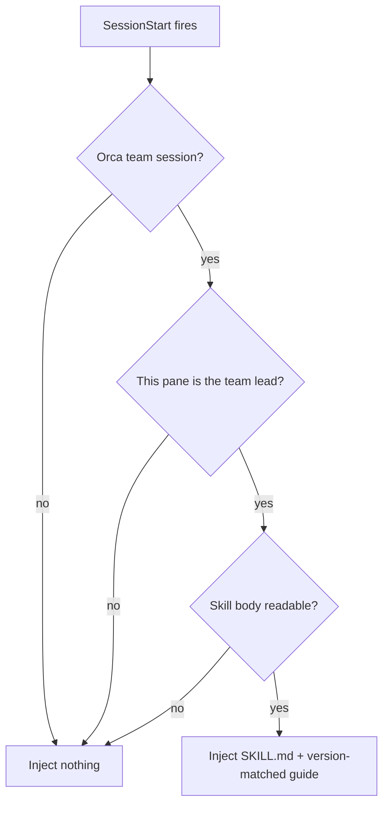
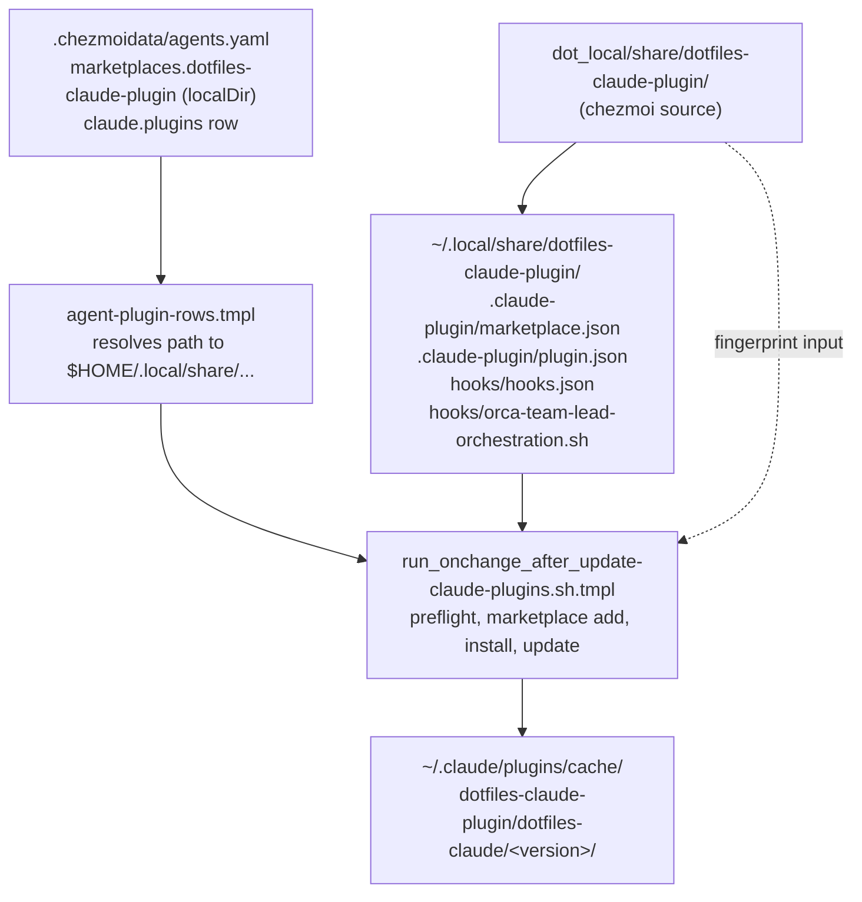
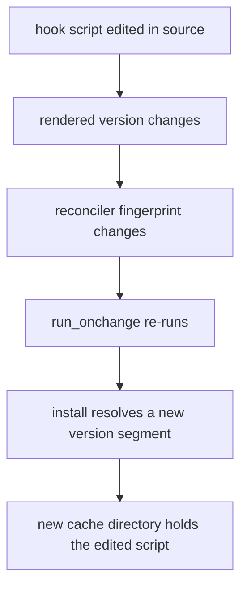
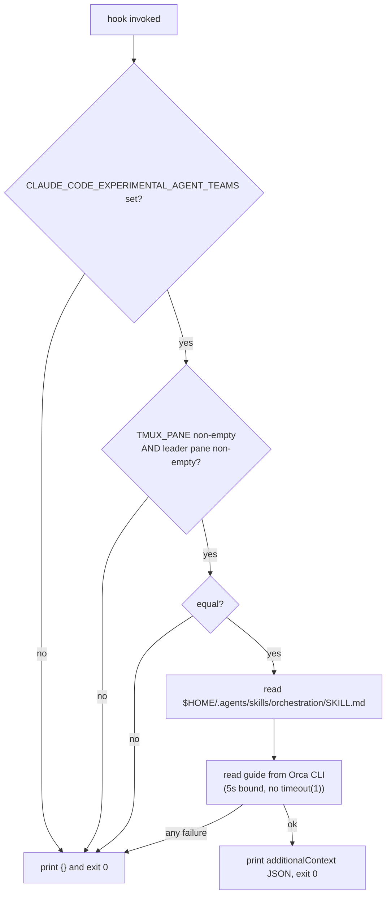

# Load the Orchestration Skill Into Every Orca Team Lead Session - Plan

## Goal Capsule

- **Objective:** An agent leading an Orca-launched Claude Code team session already holds the orchestration skill's contents when it starts work, so its first dispatch follows the Orca workflow instead of improvising or reaching for a native subagent tool.
- **Means:** A `SessionStart` hook shipped by a chezmoi-managed Claude Code plugin, registered through a `localDir` marketplace (KTD1).
- **Authority:** This plan. No issue is linked.
- **Stop conditions:** Stop and report if `agent-plugin-rows.tmpl` rejects a `localDir` row on real data, if the reconciler's manifest preflight fails against the deployed tree, or if an edited hook script does not reach the plugin cache after the propagation mechanism in KTD6 is in place.
- **Execution profile:** Packaging and configuration. Prefer render and apply evidence over unit coverage, except for the hook script, which carries the behavioral rules worth a test.
- **Open blockers:** None.

---

## Product Contract

**Product Contract preservation:** changed — R7. Its settings-scope clause asserted that the work adds no entry to `~/.claude/settings.json`, which no implementation can satisfy: `claude plugin install` records `enabledPlugins` and `extraKnownMarketplaces` there, and the live file already carries both for `compound-engineering`. R7 now prohibits what the decision actually protects — a chezmoi-declared leaf under `agents.claude.settings` and any entry under the contested `hooks` key. No other R-ID meaning or scope boundary was altered.

### Summary

Ship a dotfiles-owned Claude Code plugin whose `SessionStart` hook detects an Orca team session, confirms it is running in the team lead's pane, and injects the orchestration skill's full text into that session's context. The hook re-fires after compaction so the text never silently lapses. Teammate panes get nothing.

### Problem Frame

`~/.claude/CLAUDE.md` already carries a MUST rule: before launching any subagent, worker, or peer reviewer, open and read the `orchestration` skill and use its Orca dispatch workflow. The rule is stated but not guaranteed — whether the skill actually gets opened depends on the agent noticing the rule applies before it acts.

Team mode is where that gap costs most. `orca-ide claude-teams --dangerously-skip-permissions` starts Claude Code with `--teammate-mode auto`, which puts a native teammate-spawning path directly in front of the lead — the exact path the MUST rule redirects to Orca. The lead is also the only agent in the session that dispatches at all; observed teams have reached 15 panes, and every pane past the lead is a leaf worker.

Placement is constrained. `hooks` in `~/.claude/settings.json` belongs to aoe, which injects session-tracking entries at session start, and `.chezmoitemplates/claude-settings-validate.tmpl` rejects any declared path under `hooks` at render time so the two writers cannot fight. Declaring the hook through `agents.claude.settings` therefore fails the apply outright.

### Key Decisions

- KD1. **Inject the skill body, not a directive** (session-settled: user-directed — chosen over a one-line SessionStart instruction and over a PreToolUse dispatch gate: a MUST rule already exists in `CLAUDE.md` and did not produce the load). Governs R4.
- KD2. **Lead pane only** (session-settled: user-directed — chosen over injecting into every pane and over a short teammate boundary note: only the lead dispatches, and per-pane cost multiplies by team size). Governs R2.
- KD3. **A dotfiles-owned plugin owns the hook** (session-settled: user-directed — chosen over a marker-based `settings.json` reconciler and over an unmanaged hand edit: the plugin path avoids the contested `hooks` key entirely and keeps the definition reproducible through chezmoi). Governs R6, R7.
- KD4. **The plugin is a standing home for dotfiles-owned Claude Code extensions, not a single-purpose wrapper** (session-settled: user-directed — chosen over a plugin dedicated to this one hook: a second hook should not cost a second plugin, and the per-extension removal that a dedicated plugin buys is not worth that). Governs R6.
- KD5. **Re-inject after compaction** (session-settled: user-directed — chosen over injecting at startup only: compaction drops the injected text, and the guarantee would lapse without any signal). Governs R3.



### Requirements

**Trigger conditions**

- R1. The hook injects only in a Claude Code session that Orca started in team mode.
- R2. The hook injects only in the team lead's pane, treating a missing lead-pane signal as not-the-lead rather than as a match.
- R3. The hook fires on every `SessionStart` source that can leave the session without the previously injected text, including `compact`.

**Injected payload**

- R4. The injection carries the orchestration skill's full text — its `SKILL.md` and the version-matched Orca guide — rather than a pointer, a summary, or an instruction to open the skill.
- R5. The guide is read at fire time from the installed Orca CLI, so an Orca upgrade changes what the hook injects without any repository edit.

**Placement and delivery**

- R6. The hook definition ships inside a dotfiles-owned Claude Code plugin, installed into the user scope by `chezmoi apply`, whose identity is general enough to hold later dotfiles-owned hooks, agents, and commands without a rename.
- R7. The declaration reuses the existing plugin reconciliation path — an `agents.marketplaces` entry plus an `agents.claude.plugins` row — and adds no chezmoi-declared leaf under `agents.claude.settings` and no entry under the `hooks` key. Claude Code's own `enabledPlugins` and `extraKnownMarketplaces` writes are the expected result of `plugin install`, not a violation.
- R10. An edit to the hook script reaches the running plugin on the next `chezmoi apply`, without a manual reinstall.

**Failure behavior**

- R8. A hook failure never blocks, delays, or aborts session start; the session proceeds with no injection.
- R9. The hook writes nothing to stderr and shows the user nothing on any path.

### Acceptance Examples

- AE1. Lead pane injection
  - **Covers R1, R2, R4.**
  - **Given:** Orca starts a team session and the lead pane's session begins.
  - **When:** `SessionStart` fires with source `startup`.
  - **Then:** The session's context holds the orchestration `SKILL.md` text and the version-matched guide text.
- AE2. Teammate pane silence
  - **Covers R2.**
  - **Given:** The lead has spawned a teammate into another pane of the same team session, where the lead-pane signal is absent and the team-mode signal is still present.
  - **When:** `SessionStart` fires in a teammate's pane.
  - **Then:** Nothing is injected into that teammate's context.
- AE3. Re-injection after compaction
  - **Covers R3, R4.**
  - **Given:** A lead session that was injected at startup and has since compacted, dropping the injected text.
  - **When:** `SessionStart` fires with source `compact`.
  - **Then:** The skill text is present in the post-compaction context again.
- AE4. Orca CLI unavailable
  - **Covers R8, R9.**
  - **Given:** A lead pane where the Orca CLI cannot be reached or returns an error.
  - **When:** `SessionStart` fires.
  - **Then:** The session starts normally, nothing is injected, and the user sees no message.
- AE5. Non-team session
  - **Covers R1.**
  - **Given:** A Claude Code session started outside Orca team mode.
  - **When:** `SessionStart` fires.
  - **Then:** Nothing is injected, on any source.
- AE6. Guide text tracks the installed CLI
  - **Covers R5.**
  - **Given:** A lead pane, and an Orca CLI whose guide output has changed since the previous session.
  - **When:** `SessionStart` fires, with no repository edit in between.
  - **Then:** The injected guide text is the current output, not the previous one.
- AE7. Hook edit reaches the running plugin
  - **Covers R10.**
  - **Given:** A host where the plugin is already installed.
  - **When:** The hook script changes in the repository and `chezmoi apply` runs.
  - **Then:** The plugin Claude Code loads carries the edited script.

### Scope Boundaries

- No dispatch-time enforcement. This work guarantees the skill's residency in context; it does not gate the tools that dispatch.
- No teammate-side guidance of any kind, not even a one-line boundary note.
- No `hooks` entry in `~/.claude/settings.json` and no new leaf under `agents.claude.settings`; `.chezmoitemplates/claude-settings-validate.tmpl` is unmodified. The `enabledPlugins` and `extraKnownMarketplaces` keys stay owned by the plugin reconciler, which writes them as it already does for `compound-engineering`.
- No change to how Orca launches the team session.
- Codex, omp, and agy are untouched; this is a Claude Code plugin.

#### Deferred to Follow-Up Work

- Trimming the injected payload to cut its per-session cost.
- Moving other dotfiles-owned Claude Code extensions into the new plugin.

### Dependencies / Assumptions

- The team lead is identifiable from the pane's own environment, and the two roles were observed directly. In the lead pane, `TMUX_PANE` and `ORCA_AGENT_TEAMS_LEADER_PANE` are both set and equal. In a `backendType: tmux` teammate pane, `TMUX`, `TMUX_PANE`, and `ORCA_AGENT_TEAMS_LEADER_PANE` are all unset while `CLAUDE_CODE_EXPERIMENTAL_AGENT_TEAMS` is still `1`. A bare equality test therefore matches two absent values and injects into every teammate, which is what R2 forbids: the lead test requires the signal to be present as well as equal.
- Claude Code installs a plugin by copying the source tree into `~/.claude/plugins/cache/<marketplace>/<plugin>/<version>/`. The live cache entry for `compound-engineering` is a real directory whose `plugin.json` has a different inode from the source, so the copy is not a link and the source tree is not read at session time.
- The orchestration skill stays installed at `$HOME/.agents/skills/orchestration/SKILL.md` and the Orca CLI keeps serving its version-matched guide.
- Claude Code accepts `compact` as a `SessionStart` matcher and reads `hookSpecificOutput.additionalContext` from a `SessionStart` hook; plugin `hooks/hooks.json` supports `SessionStart` and `${CLAUDE_PLUGIN_ROOT}`.
- Current payload size is roughly 4.4k tokens: `SKILL.md` at 3,862 bytes and the guide at 13,246 bytes.

### Outstanding Questions

**Deferred to Planning**

- None remain. The `fork` source and the plugin identity are resolved in the Planning Contract's Assumptions.

### Sources / Research

- `.chezmoitemplates/claude-settings-validate.tmpl` — check 5 rejects any declared path under `hooks`, `enabledPlugins`, or `extraKnownMarketplaces` as another writer's namespace.
- `.chezmoiscripts/70-agents/run_after_config-claude-settings.sh.tmpl` — why `settings.json` is not a chezmoi target and how declared leaves are asserted into it.
- `.chezmoitemplates/agent-plugin-rows.tmpl:51,99-106` — `localDir` is a valid marketplace kind and its `path` is validated as a safe `$HOME`-relative path.
- `.chezmoiscripts/70-agents/run_onchange_after_update-claude-plugins.sh.tmpl:13-14,86-101` — the reconciler preflights `<source>/.claude-plugin/marketplace.json`, then runs `marketplace add`, `plugin install`, and `plugin update` without branching on `kind`; its own header records that `plugin install` is a no-op once the plugin is present at any version.
- `.chezmoitemplates/fingerprint.tmpl` — the repo's dependency-fingerprint partial, and the `globs` interface the reconciler passes.
- `dot_agents/plugins/readonly_marketplace.json.tmpl` — the Codex personal marketplace, the existing precedent for a chezmoi-rendered marketplace manifest.
- `.ci/test-claude-agy-plugin-reconcile.sh` — the direct test for the Claude reconciler and for `agent-plugin-rows.tmpl`, wired at `.github/workflows/ci.yml:46-49,64-70`.
- `STRATEGY.md` — "Declare it as data, never as a script", and idempotent-apply cleanliness as a key metric.
- `~/.claude/CLAUDE.md`, "Routing and mirrors" — the MUST rule this hook is meant to make reliable.
- Direct observation, 2026-09-10: a `general-purpose` teammate spawned into pane `%2` of a live team session reported `TMUX_PANE`, `TMUX`, and `ORCA_AGENT_TEAMS_LEADER_PANE` unset, with `CLAUDE_CODE_EXPERIMENTAL_AGENT_TEAMS=1`. Its `backendType: tmux` membership is recorded in the session's team config.
- Direct observation, 2026-09-10: the deployed `compound-engineering` tree carries `.claude-plugin/plugin.json` alongside `.claude-plugin/marketplace.json`, and its cache copy under `~/.claude/plugins/cache/` has a different inode from the source.

---

## Planning Contract

### Key Technical Decisions

- KTD1. **Register the plugin through a `localDir` marketplace and change no reconciler logic.** `agent-plugin-rows.tmpl:99-106` already resolves a `localDir` `path` against `$HOME`, and `run_onchange_after_update-claude-plugins.sh.tmpl:86-101` treats every row uniformly, so the existing install path carries this plugin as data alone. The one reconciler edit this plan makes is a fingerprint input, not a logic change (KTD6). Governs R6, R7.
- KTD2. **The marketplace directory doubles as the plugin root, with both manifests under `.claude-plugin/`.** Claude Code reads a plugin's manifest from `.claude-plugin/plugin.json`, and the deployed `compound-engineering` tree ships it there beside `.claude-plugin/marketplace.json`. The marketplace entry keeps `"source": "./"` so one deployed tree serves as both. Governs R6.
- KTD3. **Lead detection requires a present signal, not just an equal one** (session-settled: user-directed — chosen over a bare equality test: a teammate pane has neither variable, so empty-equals-empty would inject into every teammate). The hook treats an unset `TMUX_PANE` or an unset `ORCA_AGENT_TEAMS_LEADER_PANE` as not-the-lead before it compares them. Governs R2.
- KTD4. **Assemble the payload at fire time from the Orca CLI, under a 5-second bound enforced without `timeout(1)`, and fail open.** The guide is version-matched to the installed binary, so a committed snapshot would drift silently on the next Orca upgrade. macOS ships no `timeout(1)`, and the marketplace is declared eligible for `darwin`, so the bound runs the CLI read in the background and kills it after 5 seconds rather than shelling out to a binary half the declared hosts lack. Every failure path — missing CLI, non-zero exit, timeout — prints `{}` on stdout and exits zero. Governs R5, R8, R9.
- KTD5. **The hook is a script file in the plugin, not an inline command string.** `hooks.json` carries one `command` entry resolved through `${CLAUDE_PLUGIN_ROOT}`, which keeps the detection logic testable in CI as an ordinary shell script. Governs R2, R8.
- KTD6. **Derive the plugin version from the hook tree's content, and add that tree to the reconciler's fingerprint inputs.** Propagation needs both halves: without the fingerprint input the reconciler never re-runs after a hook edit, and without a changed version `plugin install` stays a no-op against the existing cache entry. A content-derived version makes propagation independent of whatever `plugin update` does with a directory source. Governs R10.

### High-Level Technical Design

The deployed tree and the declaration that installs it:



The propagation path a hook edit takes, which is what R10 requires (KTD6):



The hook's own decision order (KTD3, KTD4):



### Output Structure

```text
dot_local/share/dotfiles-claude-plugin/
├── dot_claude-plugin/
│   ├── marketplace.json
│   └── plugin.json.tmpl
└── hooks/
    ├── hooks.json
    └── executable_orca-team-lead-orchestration.sh
```

### Assumptions

These were resolved during planning rather than asked, because no synchronous user was present.

- The `SessionStart` matcher set is `startup|resume|clear|compact` and excludes `fork`. A fork copies the parent session's conversation, so the injected text is already present and a fork re-injection would duplicate it. If a fork is later observed to start with no parent context, add `fork` to the matcher.
- The payload is injected whole, with no trimming. Trimming would add a parsing step and risk dropping guide content, and the per-session cost was accepted when KD1 was settled.
- Names are `dotfiles-claude-plugin` for the marketplace and `dotfiles-claude` for the plugin, mirroring the `compound-engineering-plugin` / `compound-engineering` pair. Both satisfy the name grammar in `agent-plugin-rows.tmpl:50`.
- The marketplace entry declares `os: [linux, darwin]` and `container: keep`, matching the existing entries.
- The derived version is a short hex digest of the hook tree's content, rendered into `plugin.json`. Any scheme works that changes the string when the hook changes and holds it stable otherwise.

### Risks & Dependencies

- **`localDir` has no current consumer.** Both existing marketplaces are `localArchive`, so this change is the first exercise of the `localDir` branch in `agent-plugin-rows.tmpl:99-106` against real data. U5 covers it with a render test rather than trusting first apply.
- **Propagation is the failure mode most likely to ship silently.** A wrong KTD6 leaves the feature working on a fresh host and permanently stale on an existing one, with no error on either. AE7 and the propagation gate exist because no other check in this plan would catch it.
- **Version churn in the plugin cache.** A content-derived version creates a new cache directory per hook edit, and nothing in this plan prunes the old ones. `.chezmoiscripts/70-agents/run_onchange_after_zz-prune-agent-marketplace-archives.sh.tmpl` prunes archive marketplaces, not this one. Accepted for now; revisit if the directory count becomes a problem.
- **Hook-contract drift.** `hookSpecificOutput.additionalContext` and the `compact` matcher are Claude Code contract surface pinned in `.chezmoidata/releases.json`. A Claude Code bump can change them, and the failure is silent — the hook keeps exiting zero and injects nothing.

---

## Implementation Units

### U1. Add the plugin tree and its manifests

- **Goal:** A chezmoi-managed directory that the Claude reconciler accepts as a marketplace and as the plugin inside it, carrying a version that tracks the hook's content.
- **Requirements:** R6, R7, R10.
- **Dependencies:** none.
- **Files:**
  - `dot_local/share/dotfiles-claude-plugin/dot_claude-plugin/marketplace.json` (create)
  - `dot_local/share/dotfiles-claude-plugin/dot_claude-plugin/plugin.json.tmpl` (create)
  - `dot_local/share/dotfiles-claude-plugin/hooks/hooks.json` (create)
- **Approach:**
  1. Name the marketplace `dotfiles-claude-plugin` in `marketplace.json` so it matches the `agents.marketplaces` key U3 adds.
  2. Declare one plugin entry named `dotfiles-claude` with `"source": "./"`, per KTD2.
  3. Put `plugin.json` under `.claude-plugin/`, not at the tree root, and give it the same `dotfiles-claude` name plus a description that reads as a general home for this repo's Claude Code extensions, per KD4 and KTD2.
  4. Render `plugin.json`'s `version` from a digest of the hook tree's content, per KTD6.
  5. Point `hooks.json` at `"${CLAUDE_PLUGIN_ROOT}"/hooks/orca-team-lead-orchestration.sh` for `SessionStart`, with the matcher set from Assumptions.
- **Patterns to follow:** the deployed `compound-engineering` tree — `.claude-plugin/marketplace.json` and `.claude-plugin/plugin.json` together at the marketplace root; `.chezmoitemplates/fingerprint.tmpl` for how this repo digests source content.
- **Test scenarios:**
  - Rendering `plugin.json.tmpl` twice with no source change produces the same version string.
  - Editing the hook script changes the rendered version string.
- **Verification:** `chezmoi apply` deploys all four files, and the manifest sits at the path the reconciler's preflight checks.

### U2. Add the SessionStart lead-detection hook script

- **Goal:** The hook injects the orchestration skill's text in the lead pane only, and never disturbs session start when anything fails.
- **Requirements:** R1, R2, R3, R4, R5, R8, R9. Covers AE1, AE2, AE3, AE4, AE5, AE6.
- **Dependencies:** U1.
- **Files:**
  - `dot_local/share/dotfiles-claude-plugin/hooks/executable_orca-team-lead-orchestration.sh` (create)
- **Approach:**
  1. Print `{}` and exit zero unless `CLAUDE_CODE_EXPERIMENTAL_AGENT_TEAMS` is set (R1).
  2. Do the same unless both `TMUX_PANE` and `ORCA_AGENT_TEAMS_LEADER_PANE` are non-empty and equal, per KTD3 (R2).
  3. Read `$HOME/.agents/skills/orchestration/SKILL.md`, then read the version-matched guide from the Orca CLI under the 5-second bound in KTD4 (R4, R5).
  4. Emit the combined text as `hookSpecificOutput.additionalContext` and exit zero.
  5. Route every failure to the same path: `{}` on stdout, nothing on stderr, exit zero (R8, R9).
- **Execution note:** Write the detection branch first and prove the teammate case fails closed before adding the payload read — that inversion is the defect this unit exists to prevent.
- **Patterns to follow:** the `# aoe-hooks` entries in `~/.claude/settings.json` for the exit-zero-on-every-path shape a session-start hook must hold.
- **Test scenarios:** enumerated in U4, which owns the harness.
- **Verification:** Run the script directly with a lead-shaped environment and confirm it emits JSON carrying both texts; run it with a teammate-shaped environment and confirm it emits `{}`.

### U3. Declare the marketplace and the Claude plugin row

- **Goal:** `chezmoi apply` installs the plugin into Claude Code's user scope from data alone.
- **Requirements:** R6, R7.
- **Dependencies:** U1.
- **Files:**
  - `.chezmoidata/agents.yaml` (modify)
- **Approach:**
  1. Add a `dotfiles-claude-plugin` entry to `agents.marketplaces` with `kind: localDir`, `path: .local/share/dotfiles-claude-plugin`, `os`, and `container`, per the key rules in `agent-plugin-rows.tmpl:79-106`.
  2. Add `{ name: dotfiles-claude, marketplace: dotfiles-claude-plugin }` to `agents.claude.plugins`.
  3. Add a comment recording why this marketplace is `localDir` and that the hook cannot live under `agents.claude.settings`, matching the density of the surrounding entries.
- **Patterns to follow:** the two existing `agents.marketplaces` entries and their explanatory comments at `.chezmoidata/agents.yaml:109-137`.
- **Test scenarios:**
  - Rendering `agent-plugin-rows.tmpl` for the `claude` harness emits a row whose source path is `$HOME/.local/share/dotfiles-claude-plugin`.
  - Rendering the same partial for `codex`, `agy`, and `omp` is unchanged by the new entry.
- **Verification:** `chezmoi apply` on a host with no prior install registers the marketplace and installs the plugin, and the new row's `plugin update` exits zero. A second apply on unchanged source changes zero bytes.

### U4. Add and wire a CI test for the hook script

- **Goal:** The lead-versus-teammate branch, the compaction matcher, the fire-time guide read, and the fail-open contract are proven in CI, not by hand.
- **Requirements:** R1, R2, R3, R5, R8, R9. Covers AE1, AE2, AE3, AE4, AE5, AE6.
- **Dependencies:** U2.
- **Files:**
  - `.ci/test-claude-team-hook.sh` (create)
  - `.github/workflows/ci.yml` (modify)
- **Approach:**
  1. Drive the deployed script with a controlled environment and a stub Orca CLI on `PATH`.
  2. Add the script to the agent job that already runs the other agent tests.
  3. Account for the new script wherever `.ci/test-ci-wiring.sh` requires every executable `test-*.sh` to be reconciled.
- **Patterns to follow:** `.ci/test-claude-settings-reconcile.sh` for stub-driven runtime cases; `.ci/lib/render-scratch.sh` for scratch trees.
- **Test scenarios:**
  - Covers AE1. Lead-shaped environment with a stub CLI returning guide text: stdout parses as JSON and `additionalContext` contains both the `SKILL.md` text and the guide text.
  - Covers AE2. Teammate-shaped environment — team flag set, `TMUX_PANE` and `ORCA_AGENT_TEAMS_LEADER_PANE` unset: stdout is `{}`.
  - Both variables set but unequal: stdout is `{}`.
  - `TMUX_PANE` set and `ORCA_AGENT_TEAMS_LEADER_PANE` unset: stdout is `{}`, proving the emptiness guard rather than the equality test.
  - Covers AE5. Team flag unset with both pane variables set and equal: stdout is `{}`.
  - Covers AE3. `hooks.json` registers `startup`, `resume`, `clear`, and `compact`; invoking the hook with a lead-shaped environment and a `compact` SessionStart payload yields `additionalContext` carrying both texts.
  - Covers AE6. Two invocations with different stub guide output: each result's `additionalContext` carries that invocation's output, with no repository edit between them.
  - Covers AE4. Lead-shaped environment with no Orca CLI on `PATH`: exit code is zero, stdout is `{}`, stderr is empty.
  - Lead-shaped environment with a stub CLI that exits non-zero: same as the previous scenario.
  - Lead-shaped environment with a stub CLI that hangs past 5 seconds: exit code is zero within the bound and stdout is `{}`.
  - Lead-shaped environment with no `timeout` binary on `PATH` and a working stub CLI: the injection still happens, proving the bound does not depend on `timeout(1)`.
  - `SKILL.md` missing: exit code is zero and stdout is `{}`.
- **Verification:** The new test passes locally and in the agent CI job, and the CI wiring check reports no unaccounted script.

### U5. Extend the plugin reconciler test with `localDir` coverage

- **Goal:** The first `localDir` consumer is proven at render time instead of on first apply.
- **Requirements:** R6, R7.
- **Dependencies:** U3.
- **Files:**
  - `.ci/test-claude-agy-plugin-reconcile.sh` (modify)
- **Approach:**
  1. Add a render case asserting the rendered Claude reconciler carries a `localDir` row whose source is the `$HOME`-relative path resolved from `path`.
  2. Add preflight cases for a missing directory and a missing `.claude-plugin/marketplace.json`.
  3. Assert the deployed tree carries `.claude-plugin/plugin.json`, since that is the manifest Claude Code reads.
  4. Reuse the existing fixture helpers rather than adding a second harness.
- **Patterns to follow:** the existing missing-Claude-manifest case in the same file, and its `agent-plugin-rows.tmpl` render assertions.
- **Test scenarios:**
  - A `localDir` marketplace with both manifests renders a row and the reconciler's first pass registers and installs it.
  - A `localDir` marketplace whose directory is absent fails the preflight with the marketplace named in the message.
  - A `localDir` marketplace whose `marketplace.json` is absent fails the preflight with the manifest path named in the message.
  - A `localDir` marketplace whose `.claude-plugin/plugin.json` is absent is reported rather than silently installed.
  - The converged second pass changes nothing.
- **Verification:** `.ci/test-claude-agy-plugin-reconcile.sh` passes with the new cases, and the pre-existing cases still pass unchanged.

### U6. Make a hook edit re-trigger the reconciler

- **Goal:** Editing the hook script in the repository changes what Claude Code actually loads.
- **Requirements:** R10. Covers AE7.
- **Dependencies:** U1, U3.
- **Files:**
  - `.chezmoiscripts/70-agents/run_onchange_after_update-claude-plugins.sh.tmpl` (modify)
- **Approach:**
  1. Add the plugin tree to the script's `$fingerprintInputs` so a hook edit changes the rendered script and re-triggers the `run_onchange`.
  2. Change no other logic in the reconciler, per KTD1.
- **Patterns to follow:** the existing `$fingerprintInputs` list at the top of the same file, and `.chezmoitemplates/fingerprint.tmpl`'s `globs` interface.
- **Test scenarios:**
  - Covers AE7. Editing the hook script changes the rendered reconciler's fingerprint block; editing an unrelated file does not.
  - After an apply on a host where the plugin is already installed, the plugin Claude Code loads carries the edited script.
- **Verification:** On a host with the plugin already installed, edit the hook script, run `chezmoi apply`, and confirm the loaded plugin carries the edit without a manual reinstall.

---

## Verification Contract

| Gate | What it must prove | Applies to |
|---|---|---|
| `.ci/test-claude-team-hook.sh` | Every scenario in U4, including the emptiness guard, the `compact` matcher and invocation, the two-invocation guide-freshness case, and all four fail-open paths. | U2, U4 |
| `.ci/test-claude-agy-plugin-reconcile.sh` | The rendered Claude reconciler carries the `localDir` row, its preflight rejects a missing directory or manifest, `.claude-plugin/plugin.json` is required, and the converged pass is inert. | U3, U5 |
| `.ci/test-ci-wiring.sh` | The new test script is accounted for in the wiring matrix and in the agent job. | U4 |
| `chezmoi execute-template` over `.chezmoitemplates/agent-plugin-rows.tmpl` | The new data entry renders for `claude` and leaves the other harnesses' rows unchanged. | U3 |
| Propagation check | On a host where the plugin is already installed, a hook edit plus `chezmoi apply` changes the script the loaded plugin carries. | U1, U6 |
| `chezmoi apply`, run twice | First run deploys the tree, registers the marketplace, and installs the plugin; the second run changes zero bytes. | U1, U3, U6 |
| Live team session | A lead pane's context holds the skill text; a spawned teammate's does not. | U2 |

The apply-idempotence gate is the repo's stated key metric, not a generic smoke check: a second apply on unchanged source must change zero bytes.

---

## Definition of Done

- Every requirement R1 through R10 is implemented and traced to at least one unit.
- Every gate in the Verification Contract passes.
- `chezmoi apply` run twice on unchanged source changes zero bytes on the second run.
- A hook edit followed by `chezmoi apply` reaches the plugin Claude Code loads, on a host where the plugin was already installed.
- A live Orca team session shows the injected skill text in the lead pane and nothing in a spawned teammate pane.
- `~/.claude/settings.json` gains no `hooks` entry from this change, `agents.claude.settings` gains no leaf, and `.chezmoitemplates/claude-settings-validate.tmpl` is unmodified.
- No abandoned-attempt code remains: any scratch fixture, stub, or exploratory script written on the way is removed or promoted into `.ci/`.
