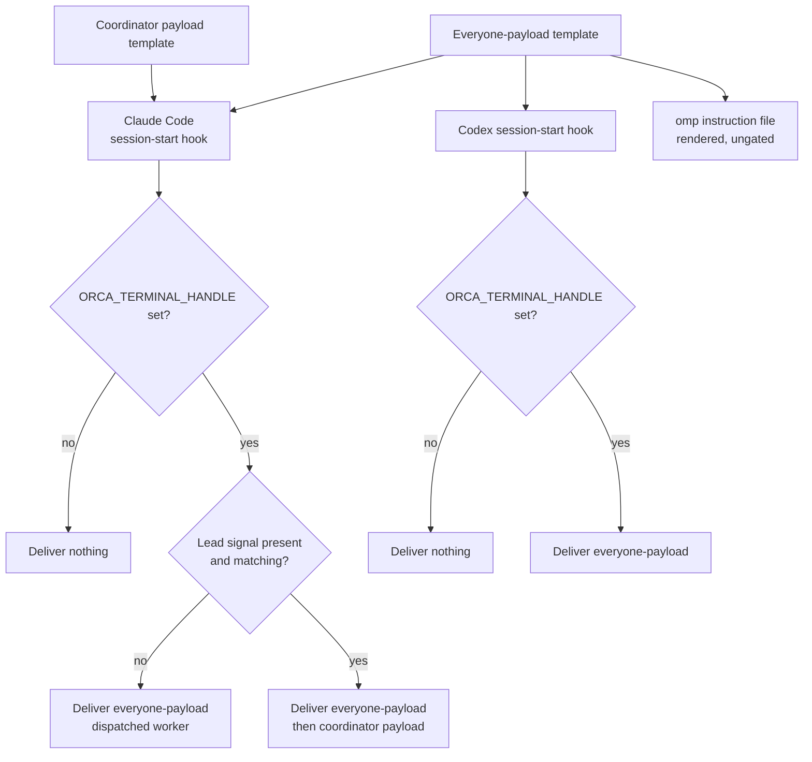
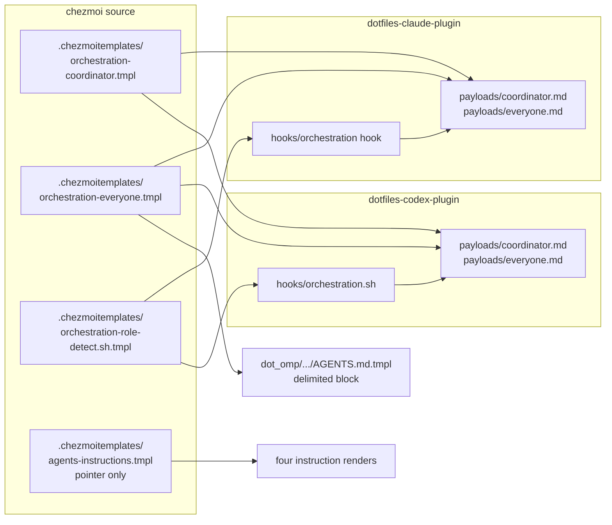

# Role-Aware Orchestration Instruction Injection - Plan

## Goal Capsule

- **Objective:** An agent session carries the orchestration rules its own role can act on, and a session that will never dispatch does not pay for rules it cannot use.
- **Means:** Delete from the shared instruction template every orchestration rule the installed Orca guide already states at equal or greater strictness, put the rules that remain into two role payload templates, and render those templates into each harness's delivery path (KTD1).
- **Authority:** This plan. No issue is linked. On product behavior an R-ID wins; on implementation mechanism the KTD that cites it wins.
- **Stop conditions:** Stop and report if a payload template cannot render identically into every path that consumes it, if the reworked instruction test cannot both preserve cross-harness equality and still fail on a deleted rule, or if a moved rule would end with no assertion anywhere.
- **Execution profile:** Packaging, configuration, and instruction text. Verification is render evidence and hook-script behavior, both produced in an isolated scratch tree. Never run `chezmoi apply` against the live `$HOME`.
- **Open blockers:** None.

---

## Product Contract

**Product Contract preservation:** changed — added R21, R23, and R24, rewrote R9 and R22. R21 closes a gap research found: the shared template keeps the `lfg` autopilot and mandatory-step rules (KD5) while the dispatch contract leaves it (KD1), so an Antigravity session would be told to drive work with no contract for safe dispatch. R22 previously stated a Codex trust prerequisite as unavoidable; investigation showed the trust record is reproducible and pre-seedable, so R22 now requires that pre-seeding instead. R23 states what apply-time ordering can actually guarantee. R24 records that a pre-seeded trust record attests the hook declaration only. R9 was rewritten because a lead received the coordinator payload alone and would have lost the rules that bind every agent. No other R-ID meaning, scope boundary, or Key Decision was altered.

### Summary

Split the orchestration instructions into two role payload templates — one for a coordinator, one for every agent regardless of role — and let each harness render the payload it can deliver. Claude Code is the only harness that leads, so its session-start hook gives a team lead both payloads and a dispatched worker the everyone-payload alone. Codex carries no lead branch: its hook delivers the everyone-payload to any Orca session and nothing outside one. omp has no role-gated injection point, so its rendered instruction file carries the everyone-payload unconditionally. The shared instruction template keeps a short pointer plus the rules that outrank the Orca guide.

### Problem Frame

`.chezmoitemplates/agents-instructions.tmpl` renders into four harness instruction files. Its orchestration material spans lines 21-52 and measures 16,740 bytes of a 46,659-byte file — roughly 37% of what every session of every harness loads before it reads a single line of the task.

Almost none of that text is actionable for most sessions. Measured directly: a Claude Code worker dispatched by Orca loads all 43,679 bytes of the rendered `~/.claude/CLAUDE.md`, and so do the Codex and omp workers of their own rendered `AGENTS.md`. A worker does not dispatch, so the coordinator contract — blocking waits, release and residency accounting, Implementation Unit sizing — is cost with no corresponding decision. An observed team has reached 15 panes; the lead is the only pane that dispatches at all.

The cost is also paid twice where it matters least. A Claude Code team lead already receives a 17.1 KB `SessionStart` injection of the orchestration skill and the version-matched Orca guide, on top of the template's own 16.7 KB. Those two texts overlap: seven distinct subjects — self-contained task specs, the native-subagent ban, the supervised worker path, blocking event waits, post-settlement release, the no-resident-worker rule, and process-state checks before cleanup — are stated in both.

Nine subjects are not duplicated, and they are the reason the template cannot simply be emptied. The executable-selection rule that keeps a Linux host from launching the GNOME screen reader, the ban on bundled peer dispatchers, the degradation path when Orca is unreachable, the `claude`/`codex`/`omp` placement rule, the Implementation Unit sizing ladder, the argv-limit rule forcing brief files, and the clause declaring that this repository's timeout and release obligations outrank the Orca guide all exist only here.

### Key Decisions

- KD1. **Inject the orchestration contract only where the role can act on it** (session-settled: user-directed - chosen over injecting into every Claude session and over leaving the shared file untouched: the saving comes from the sessions that receive nothing). Governs R9, R10, R11.
- KD2. **Remove duplication before moving anything** (session-settled: user-directed - chosen over relocating the whole section as-is: a hook that fails silently then loses less, and the removed text needs no new home). Governs R1.
- KD3. **Strictness, not subject overlap, decides what gets deleted** (session-settled: user-approved - a subject stated in both places still stays when this repository states it more strictly than the Orca guide does). Governs R1, R2.
- KD4. **Role is read from the environment Orca already sets** (session-settled: user-directed - chosen over a state file or an Orca query: the signals are present in every launched process and cost nothing to read). Governs R6, R7, R8.
- KD5. **Autonomy rules stay in the shared file** - the `lfg` autopilot override and the mandatory-step rule sit inside lines 21-52 but govern when to ask the user, not how to dispatch. Governs R4.
- KD6. **One payload source, rendered into every delivery path** (session-settled: user-directed - chosen over each harness carrying its own copy: three copies of a normative rule drift independently, and a template renders the same text wherever it is needed). Governs R13.
- KD7. **omp takes the everyone-payload through its instruction file, not a hook** (session-settled: user-directed - chosen over dropping omp: omp exposes no role-gated injection point, and the everyone-payload binds every role anyway, so an ungated delivery is correct even though it saves nothing on an interactive omp session). Governs R15.
- KD8. **Antigravity is not a delivery target** (session-settled: user-directed - chosen over covering all four harnesses: its injection path is unexamined, and the work is scoped to paths this session proved). Governs R21. Conflict call-out: excluding Antigravity while KD5 keeps its `lfg` text would tell it to dispatch with no contract; R21 is the remedy, and it holds only while R21 does.
- KD9. **Verification stops at the rendered artifact** (session-settled: user-directed - chosen over a failure log and over a self-diagnosing command: silence at runtime is worth keeping, and CI over the renders catches the loss that actually recurs, a rule deleted in a source edit). Governs R19, R20.
- KD10. **Codex hook trust is pre-seeded, not left to the operator** (session-settled: user-directed - chosen over accepting a first-run trust prompt and over a managed config layer: the trust record is a reproducible function of the hook declaration, so the repository can assert it in the user config and the hook runs on its first session). Governs R22, R24. Conflict call-out: pre-seeding removes the human confirmation Codex's trust gate exists to obtain, and the record attests the declaration rather than the delivered text; R24 states that residual honestly rather than hiding it.
- KD11. **Only Claude Code leads** (session-settled: user-directed - chosen over supporting a lead on any harness: the coordinator role stays on one harness, so Codex delivery never needs a lead branch and its unverified lead tuple stops mattering). Governs R10, R14.

### Actors

- A1. Team lead session - an Orca-managed session that dispatches workers and owns their lifecycle.
- A2. Dispatched worker session - an Orca-launched session that performs one Task attempt and never dispatches.
- A3. Non-Orca session - any session of a managed harness started outside Orca.

### Requirements

**Shared template boundary**

- R1. The shared instruction template drops every orchestration rule that the installed Orca guide states at equal or greater strictness.
- R2. A rule this repository states more strictly than the Orca guide is kept, even when both cover the same subject.
- R3. The template keeps a pointer naming three things: that Orca owns dispatch, that native in-process subagent tools are forbidden as a substitute, and that the detailed contract arrives by injection in an Orca-managed session. The pointer says plainly that a session outside Orca receives no injection, so it never promises a payload that will not arrive.
- R4. The `lfg` autopilot override and the mandatory-step rule remain in the shared template unchanged.
- R5. The pointer states that an injected orchestration rule carries the same precedence as the template's own text, and that the stricter statement wins when the injected payload and the Orca guide cover one subject at different strictness.
- R21. The pointer states that Antigravity does not lead, dispatch, or serve as a worker in an Orca workflow, and that no orchestration guarantee applies there. Neither the retained pointer nor the retained autonomy paragraphs are a dispatch licence for it.

**Role detection**

- R6. Role is determined from environment variables the launching runtime already sets, with no additional state file, lock, or query to Orca.
- R7. Detection distinguishes exactly three roles: team lead (A1), dispatched worker (A2), and non-Orca session (A3). A non-empty `ORCA_TERMINAL_HANDLE` together with a non-empty `ORCA_AGENT_TEAMS_LEADER_PANE` equal to a non-empty `TMUX_PANE` is A1; a non-empty handle without that exact tuple is A2; an unset or empty handle is A3 whatever the pane variables hold.
- R8. A missing, empty, or ambiguous signal resolves to the lower-privilege role, never to team lead. A worker never self-promotes.

**Role payloads**

- R9. A team lead receives the everyone-payload and the coordinator payload, in that order. The everyone-payload binds every role, so a lead needs it as much as a worker does — it carries the executable-selection rule and the native-subagent ban.
- R10. A dispatched worker receives only the rules that bind every agent regardless of role, and none of the coordinator-only contract.
- R11. On a harness whose delivery gates on role, a non-Orca session receives no payload.
- R12. The payload is delivered again on every session-start source that can leave the session without previously injected text. On Claude Code that is `startup`, `resume`, `clear`, `compact`, and `fork`; on Codex it is `startup`, `resume`, `clear`, and `compact`, which has no `fork`.

**Payload source and harness delivery**

- R13. Each of the two role payloads - the coordinator payload and the everyone-payload - has exactly one source template in the repository, and every delivery path renders that template rather than holding its own copy of the text.
- R14. Claude Code and Codex receive their payload through a session-start hook that resolves the role and selects the matching payload. Only Claude Code carries a lead branch; a Codex hook delivers the everyone-payload to any Orca session and nothing otherwise. The delivered text is never truncated by a harness output cap.
- R15. omp receives the everyone-payload through its rendered user-scoped instruction file, without a role gate, because omp exposes no injection point that can vary by role.
- R16. Delivery adds no entry to, and never rewrites, a harness configuration file another writer owns. The one exception is R22's trust record: a single leaf the repository owns inside `hooks.state`, a table Codex also writes. Records Codex wrote survive untouched.
- R17. Every hook, extension, and rendered payload reaches the harness that serves it through `chezmoi apply`, with no manual reinstall step. An edit to a payload source template changes the served copy on the next apply.
- R22. Codex hook trust is asserted by the repository in the user config, so the hook executes on its first session with no operator action, and keeps executing across payload edits and plugin version bumps.

**Failure behavior and verification**

- R18. An injection failure never blocks, delays, or aborts session start, and shows the user nothing on any path. Delivery is atomic: a payload that cannot be produced whole is not delivered in part.
- R19. Every rule that leaves the shared template keeps an assertion in CI: a needle that currently checks the shared body is moved to check the payload template and its renders rather than deleted.
- R20. Verification stops at the rendered artifact and the reconciled state. Whether a payload reached a live session is not checked, and a runtime injection failure stays undetectable by design.
- R23. Every declaration a reconciler preflights lands in the same commit as the row that requires it, and CI proves that before the change is applied anywhere. This is a source-tree invariant, not a runtime one: chezmoi writes targets before it runs reconcilers, so no requirement can promise that a reconciler failure leaves the instruction files unreduced.
- R24. A pre-seeded trust record attests the hook declaration only. The hook's script contents and the payload files it reads change without re-trust, so trust records that the repository authored the declaration, not that the delivered text is unchanged.

### Key Flows

- F1. Session start with role resolution
  - **Trigger:** Claude Code or Codex starts a session on one of the sources R12 names.
  - **Actors:** A1, A2, A3
  - **Steps:** The harness fires its session-start hook. The hook reads its event input to end, reads the launch environment, resolves the role by R7's precedence, and returns the rendered payload for that role. A session with no Orca handle returns empty.
  - **Outcome:** The session holds exactly the orchestration rules its role can act on.
  - **Covered by:** R6, R7, R8, R9, R10, R11, R12, R14
- F2. omp session start
  - **Trigger:** An omp session starts, whether Orca launched it or not.
  - **Actors:** A2, A3
  - **Steps:** omp assembles its system prompt from its user-scoped instruction file, which already carries the rendered everyone-payload. No hook runs and no role is resolved.
  - **Outcome:** Every omp session holds the everyone-payload and never the coordinator payload.
  - **Covered by:** R10, R15
- F3. Apply-time delivery and trust
  - **Trigger:** `chezmoi apply` runs with this change in the source tree.
  - **Actors:** A1, A2
  - **Steps:** chezmoi writes the instruction targets and the plugin trees, then the phase-70 reconcilers run. The Claude reconciler installs and updates its plugin. The Codex reconciler registers the personal-marketplace entry and adds the plugin. A settings reconciler asserts the trust leaf for the Codex hook. Sessions already running are untouched and keep the text they started with.
  - **Outcome:** A session started after apply gets its role payload on both harnesses, with no operator step.
  - **Covered by:** R17, R22, R23

### Acceptance Examples

- AE1. Team lead receives the coordinator contract
  - **Covers R7, R9, R14.**
  - **Given:** An Orca-managed session whose environment carries a non-empty handle and a lead pane equal to `TMUX_PANE`.
  - **When:** The session starts.
  - **Then:** The hook emits one envelope holding the full coordinator contract, and both its first and last sentinel lines are present.
- AE2. Dispatched worker receives only the shared rules
  - **Covers R7, R10.**
  - **Given:** A session Orca launched as a worker, whose environment carries the Orca terminal handle but no team-lead pane.
  - **When:** The session starts.
  - **Then:** The emitted payload holds the rules that bind every agent, and holds none of the wait, release, residency, or Unit-sizing contract.
- AE3. Non-Orca hook-based session receives nothing
  - **Covers R11.**
  - **Given:** Claude Code or Codex started outside Orca.
  - **When:** The session starts.
  - **Then:** Nothing is injected, and the shared instruction file's pointer is the session's only orchestration text.
- AE4. Ambiguous signal is not treated as lead
  - **Covers R8.**
  - **Given:** A session where the team-lead signal is absent, empty, or does not match the session's own pane.
  - **When:** The session starts.
  - **Then:** The session is treated as a dispatched worker or a non-Orca session, never as a team lead.
- AE5. Re-injection after context loss
  - **Covers R12.**
  - **Given:** A team lead session that was injected at startup and has since compacted.
  - **When:** The harness signals a session start for that compaction.
  - **Then:** The coordinator contract is present in the post-compaction context again.
- AE6. Another writer's hook configuration survives
  - **Covers R16.**
  - **Given:** A scratch state holding an Orca-written Codex hooks file and an aoe-written Claude settings hooks key.
  - **When:** The reconcilers run against that state.
  - **Then:** Both are byte-identical afterwards, and the only added leaf is the trust record R22 names.
- AE7. Injection failure is invisible
  - **Covers R18.**
  - **Given:** A session where the payload cannot be produced.
  - **When:** The session starts.
  - **Then:** The session starts normally, nothing is injected, and the user sees no message.
- AE8. A removed rule keeps an assertion
  - **Covers R19.**
  - **Given:** A rule that moved from the shared template into a role payload.
  - **When:** That rule is deleted from the payload and CI runs.
  - **Then:** CI fails.
- AE9. omp carries the everyone-payload with no role gate
  - **Covers R15.**
  - **Given:** Two omp sessions, one Orca launched as a worker and one the user started directly.
  - **When:** Each session starts.
  - **Then:** Both hold the everyone-payload, and neither holds the coordinator payload.
- AE10. One edit reaches every served copy
  - **Covers R13, R17.**
  - **Given:** A sentence in the everyone-payload source template.
  - **When:** That sentence is edited and the reconcilers run in a scratch state.
  - **Then:** The Claude plugin's derived version changes, its updater re-resolves, the Codex updater re-runs, and the served copy for each harness plus omp's rendered instruction file all carry the edited sentence.
- AE11. Every legal session-start source delivers
  - **Covers R12, R14.**
  - **Given:** A lead session on Claude Code and a worker session on Codex.
  - **When:** The hook runs once for each source its harness supports.
  - **Then:** Claude Code delivers on `startup`, `resume`, `clear`, `compact`, and `fork`; Codex delivers on `startup`, `resume`, `clear`, and `compact`; and no Codex configuration names a `fork` source.
- AE12. An empty handle is a non-Orca session
  - **Covers R7, R8, R11.**
  - **Given:** A session whose `ORCA_TERMINAL_HANDLE` is set to the empty string while `ORCA_AGENT_TEAMS_LEADER_PANE` and `TMUX_PANE` are both set and equal.
  - **When:** The session starts.
  - **Then:** Nothing is injected. Matching pane variables do not make a session Orca-managed.
- AE13. The Codex payload is not truncated
  - **Covers R14.**
  - **Given:** A Codex worker session and an everyone-payload larger than the harness's default output cap.
  - **When:** The hook runs.
  - **Then:** The emitted envelope carries the payload's last sentinel line, and no spill preview or spill-file path appears in the output.
- AE14. Codex delivers on its first session
  - **Covers R22.**
  - **Given:** A scratch Codex state with no prior trust record, after the reconcilers ran.
  - **When:** The trust key and hash are computed from the rendered hook declaration.
  - **Then:** The asserted trust record matches, so the hook's trust status is trusted rather than untrusted.
- AE15. A half-available envelope is not delivered
  - **Covers R9, R18.**
  - **Given:** A Claude Code lead session where the coordinator payload is readable but the Orca skill or guide text is not, and separately where the reverse holds.
  - **When:** The session starts.
  - **Then:** In both cases the hook emits the empty result and delivers no partial envelope.
- AE16. Antigravity is declared out of the dispatch path
  - **Covers R21.**
  - **Given:** The rendered Antigravity instruction file.
  - **When:** It is inspected.
  - **Then:** It states that Antigravity does not lead, dispatch, or serve as a worker in an Orca workflow, and it carries no coordinator payload.
- AE17. A Codex hook consumes its input without stalling
  - **Covers R18.**
  - **Given:** A Codex hook invocation whose stdin producer never closes the pipe.
  - **When:** The hook runs.
  - **Then:** The hook stops reading at its own bound, exits zero, and does not wait on the producer.
- AE18. Trust survives a version bump
  - **Covers R22, R17.**
  - **Given:** A rendered Codex hook declaration and a plugin whose derived version then changes.
  - **When:** The trust key and hash are recomputed.
  - **Then:** Both are unchanged, because neither the key nor the hash carries the plugin's version-scoped path.
- AE19. A missing declaration fails before anything is reduced
  - **Covers R23.**
  - **Given:** A source tree where the Codex plugin row is declared but its personal-marketplace symlink source is absent.
  - **When:** The render and declaration gates run.
  - **Then:** They fail, and the failure names the missing declaration.

### Scope Boundaries

- Antigravity is not a delivery target. It loses the orchestration rules this work removes and gains no injected replacement; R21 is what it retains instead of a contract.
- Rewriting a harness configuration file another writer owns is out of scope; R16 forbids it. The trust leaf R22 asserts is the single exception and belongs to no other writer.
- Role-gated delivery on omp is out of scope, because no such injection point exists there. R15 states what omp gets instead.
- A managed config layer under `/etc/codex/` is out of scope as a trust mechanism. Trust is asserted in the user config.
- Copying, caching, or vendoring the Orca guide's own text into this repository is out of scope. R1 removes duplication; it does not create a second copy under this repository's control.
- Moving the rest of the shared instruction core - writing, secrets, destructive actions, repository layout, branches and commits - into injection is out of scope.
- A session already running when apply lands keeps the text it started with. That is expected behavior, not a delivery failure.

#### Deferred to Follow-Up Work

- An Antigravity delivery path, if its injection surface is ever examined.
- Retiring the `lfg` autopilot and mandatory-step paragraphs from the shared core in favour of a payload, which would remove the R21 workaround but costs the two whole-paragraph CI fixtures.

### Dependencies and Assumptions

- The environment variables that distinguish a team lead, a dispatched worker, and a non-Orca session are set by Orca at launch and are not part of a published contract. An Orca change can break role detection silently, and R8's lower-privilege default is what bounds that failure.
- The lead tuple was measured on Claude Code. Whether Orca launches a Codex session as a team lead with the same tuple is unverified; under R8 an unrecognized shape resolves to worker, which is the safe outcome.
- Environment signals cannot distinguish a live lead from a stale lead tuple left by a restarted Orca. The plan claims no restart detection; an exact stale tuple resolves to A1.
- Codex merges hooks from multiple sources rather than replacing them, and a plugin hook's trust key is `{plugin}@{marketplace}:{relative path}:{event}:{group}:{handler}` with no version segment. Both were read from the pinned `rust-v0.154.0` source; the trust hash recipe was verified against all 14 live trust records on this host.
- `additionalContextLimit: 0` disables the Codex output cap. Read from `codex-rs/hooks/src/output_spill.rs` in the pinned source; U6 re-confirms it before relying on it.
- `${CLAUDE_PLUGIN_ROOT}` is a Codex compatibility shim, not a guaranteed contract. The hook resolves payload paths from its own location and treats that variable as a fallback.
- Claude Code 2.1.267 applies no cap to hook `additionalContext` that this research found. AE13's tail assertion is applied on the Claude path too, so a future cap surfaces as a test failure rather than a silent truncation.
- omp offers no role-gated injection point. Its extensions receive `session_start`, but that fires after the system prompt is committed, and an extension's `additionalContext` return value is consumed only for `session_stop`. The two paths that append to an omp system prompt are the `--append-system-prompt` launch flag, which Orca owns, and a static `APPEND_SYSTEM.md`. Neither can vary by role, which is why R15 uses the rendered instruction file.
- The Orca guide is read from the installed CLI at injection time, so an Orca upgrade changes what a lead receives with no repository edit. R1's deletions were judged against the guide served by Orca 1.4.198; that version is the anchor for any later re-judgement.
- Codex plugin signing is planned but unshipped. The current unsigned-plugin path is explicitly temporary in the pinned source, so this delivery surface may tighten.
- This change creates no `.chezmoiremove` obligation, because it deletes no deployed path. Renaming or removing a hook, wrapper, payload, or symlink source later does create one.

### Open Questions

**Deferred to Planning** — resolved to the default in this plan and recorded here as the assumption each carries.

- Which of the current shared-body needles move to which payload, and which retire to the `BANNED` list. Resolved by U7's rule: a needle whose sentence survives moves to that sentence's new owner; a needle whose sentence retires as guide-duplication moves to `BANNED`.
- Whether the two payloads are two template files or one template selected by a role parameter. Resolved as two files, because the CI test asserts each independently and a role parameter would put the split inside the body it is meant to bound.

---

## Planning Contract

### Key Technical Decisions

- KTD1. **Two payload bodies live in `.chezmoitemplates/`; every delivery path is a thin wrapper that includes one** (session-settled: user-directed — chosen over each harness holding its own copy: a partial is the repository's proven way to single-source a body across four targets). Governs R13. Cites KD6.
- KTD2. **Role resolution is one shell partial rendered into both hook scripts.** The precedence rule R7 states has one source, so the Claude and Codex hooks cannot drift. Governs R6, R7, R8.
- KTD3. **The Claude lead receives one envelope, composed and atomic.** The existing plugin hook already injects the Orca skill and version-matched guide; the two payloads join that same `additionalContext` rather than arriving from a second hook. Fixed order: authority preamble, Orca skill, version-matched guide, everyone-payload, coordinator payload. If any part cannot be produced, the hook emits `{}` and delivers nothing. Governs R9, R18.
- KTD4. **The Codex hook entry sets `additionalContextLimit` to `0`.** Codex truncates `additionalContext` above a default 2,500-token cap and spills the remainder to a file, and the everyone-payload can exceed that. Governs R14.
- KTD5. **Every Codex hook path reads its event input to a bound, then exits.** Codex pipes the event JSON to the hook and exiting before reading it produces a broken pipe, but an unbounded read would let a stalled producer delay session start. The read is bounded so R18's no-delay guarantee survives. Governs R18.
- KTD6. **omp's wrapper appends the everyone-payload after `includeTemplate`, inside unique delimiters.** The shared partial stays byte-identical across all four renders; only the omp wrapper adds the block, and the block sits after the shared core so the core's precedence paragraph governs it. Governs R15.
- KTD7. **The instruction test extracts the delimited omp block before comparing renders.** It fails when the delimiters are missing or repeated, compares the four cores after removing only that bounded block and the two existing harness paragraphs, and separately compares the extracted block against the canonical everyone-payload render. Governs R19.
- KTD8. **The Claude matcher gains `fork`.** Its current matcher is `startup|resume|clear|compact`, so a forked session gets no injection today. Codex has no `fork` source and keeps its four. Governs R12.
- KTD9. **The dotfiles Codex plugin is named `dotfiles-codex` and ships through the existing personal-marketplace path.** Codex has no local-directory plugin install; the local path enters as a `localDir` marketplace whose registry key gets its own symlink source beside `dot_agents/plugins/symlink_compound-engineering-plugin.tmpl`, which is hard-coded for `localArchive` and cannot serve this one. The install id is `dotfiles-codex@<personal marketplace>`, not `dotfiles-codex@<registry key>`. The name is pinned here because KTD11's trust key embeds it. Governs R17, R23.
- KTD10. **Both plugin updaters take the payload source templates as fingerprint inputs, and both plugin versions derive from the rendered payload text.** A wrapper that only calls `includeTemplate` never changes, so hashing the plugin tree's unrendered source would leave the served copy stale forever. Governs R17.
- KTD11. **The trust record is computed, not copied.** A reconciler builds the normalized hook identity, serializes it as compact JSON with recursively sorted keys, takes its SHA-256, and asserts `hooks.state."<key>".trusted_hash` in `~/.codex/config.toml`. The key is `dotfiles-codex@<personal marketplace>:hooks/hooks.json:session_start:0:0`. Governs R22.
- KTD12. **The dotfiles Codex hook is the only handler in its own group.** The trust key carries group and handler indices, so any entry added before it re-keys it. Governs R22.

### High-Level Technical Design

The coordinator payload is the subjects only a coordinator acts on: the recipient-placement rule, the Implementation Unit sizing ladder, the brief-file argv rule, and the timeout, deadline, and release override. The everyone-payload is the rest: the `orca-ide` executable rule, the ban on native subagent tools, bundled dispatchers, and direct peer CLIs, and the degradation and no-substitute clauses. The dispatcher-ban and degradation paragraphs split by clause rather than whole, because their coordinator-shaped wording carries prohibitions a worker also needs.

Only the Claude plugin renders the coordinator payload. The Codex plugin and omp render the everyone-payload alone (KD11).

**Source names are not target names.** chezmoi strips the `readonly_`, `private_`, and `executable_` attribute prefixes when it writes a target. A hook command and a payload path must name the deployed file, not the source file: `hooks/orchestration.sh`, `payloads/coordinator.md`, `payloads/everyone.md`.

### Assumptions

- Every session-start source a harness supports is delivered on, rather than a subset. Claude Code gets five, Codex four.
- Role precedence is exactly R7's tuple test. An unclassified Orca session falls to A2 by R8.
- The Codex output cap is disabled with `additionalContextLimit: 0`, and both harnesses assert a payload tail marker.
- A partially composed Claude envelope is never delivered; the hook fails closed to `{}`.
- CI preserves cross-harness equality by bounded extraction of the omp block, plus independent needles over each payload artifact.
- Antigravity does not participate in Orca dispatch at all.

### Sequencing

U1 and U4 are independent and come first. U5 and U6 depend on U1 and U4. U3 depends on U1. U2 depends on U1. U10 depends on U6, because the trust hash is computed from U6's rendered hook declaration. U9 — the deletion — depends on U5 and U6 landing and being proven. U7 depends on U2, U3, and U9. U8 depends on U4, U5, U6, and U10.

**Landing plan.** chezmoi applies targets before it runs `run_onchange_after_` scripts, so a reduced instruction file always lands before the reconciler that installs its replacement. Unit order cannot change that; only splitting the apply can. Put U9's deletion in the last commit of the branch, so the operator can land delivery first, confirm it, and then land the deletion. Landing both at once is also correct and only reopens the short window for sessions that start during that single apply.

### System-Wide Impact

The change is not uniform across harnesses:

- **Claude Code and Codex** gain role-gated delivery and lose the removed text from their instruction file.
- **omp** loses the removed text from the shared core and gains the everyone-payload unconditionally, in every session including interactive ones outside Orca.
- **Antigravity** loses the removed text and gains nothing but R21's exclusion sentence.

Beyond the instruction files it touches four shared surfaces. `.chezmoidata/agents.yaml` gains a marketplace and a plugin row, which changes the fingerprint every phase-70 reconciler shares, so the Claude, Antigravity, and omp reconcilers all re-run and each preflights the full row set — a malformed Codex row therefore blocks the existing plugin set from converging. `~/.agents/plugins/marketplace.json` is regenerated from the row set. Both plugin caches hold a served copy that only their updater displaces. `.ci/test-agent-instructions.sh` holds 69 shared-body needles, more than 40 of which come from the moved text, and `.ci/test-ci-wiring.sh` fails when a new `.ci/test-*.sh` is not invoked by a workflow.

Failure propagation splits cleanly. A render or phase-script failure reaches every downstream target in that apply. A hook-time failure is local to one session and silent by R18.

### Risks and Dependencies

- **A reconciler preflight aborts the apply after the instruction files are already reduced.** The Codex reconciler dies when a declared row's source directory, plugin manifest, or personal-marketplace symlink is missing. R23 and U6 require every preflighted declaration in the same commit; U6's scenario asserts a passing preflight, and U9's landing position keeps the reduction out of that apply when the operator splits it.
- **A payload edit never reaches the served copy.** The failure is silent and permanent, not a window. KTD10 is the mitigation on both harnesses, and AE10 is the gate.
- **A moved rule silently disappears.** U7's rule is that every moved sentence gains a needle over its new owner before its old needle is deleted, plus U7's deletion regression.
- **The peer-diff rework hides a real divergence.** A stripper broad enough to tolerate the omp block could mask an unrelated difference. KTD7 bounds it with unique delimiters and fails on a missing or repeated marker.
- **A stale lead tuple promotes a worker.** Environment signals cannot distinguish a live lead from a tuple a restarted Orca left behind, and nothing authenticates them, so a session that carries the tuple receives the coordinator payload. Four reviewers raised this independently. The plan accepts it: the signals are set by the launcher on a single-operator workstation, the payload is instructions rather than capability, and R8's lower-privilege default bounds every other ambiguous case. No mitigation is planned; the exposure is recorded rather than closed.
- **Pre-seeded trust attests less than trust normally does.** R24 states it: the hash covers the hook declaration, so the script the command runs and the payload files it reads change with no re-trust. Pre-seeding also removes the human confirmation Codex's gate exists to obtain. Both are accepted consequences of KD10, not oversights.
- **An Orca upgrade can invalidate a deletion.** R1's deletions were judged against the guide served by Orca 1.4.198. A later Orca that weakens a rule leaves this repository having deleted a stricter statement, and nothing detects it. Three reviewers raised this. The recorded version is the anchor; a re-judgement is a manual pass whenever Orca's guide changes materially.
- **A shifted hook index invalidates trust silently.** A stale `trusted_hash` disables the hook exactly like no record at all. KTD12 keeps the handler alone in its group, and U8 asserts the computed key and hash against the rendered declaration.
- **Back-out is asymmetric.** Reverting the source restores all four instruction files, because they are managed targets, and restores the Claude plugin through its derived version. Codex needs more: an `agents.codex.pluginsRemoved` row to run `codex plugin remove`, plus `.chezmoiremove` entries for the deployed plugin tree and its personal-marketplace symlink. The trust record left in `~/.codex/config.toml` needs no cleanup, because it names a hook that no longer exists.

---

## Implementation Units

| U-ID | Title | Key files | Depends on |
|---|---|---|---|
| U1 | Extract the two role payload templates | `.chezmoitemplates/orchestration-coordinator.tmpl`, `.chezmoitemplates/orchestration-everyone.tmpl` | — |
| U2 | Anchor payload authority and the Antigravity boundary | `.chezmoitemplates/agents-instructions.tmpl` | U1 |
| U3 | Render the everyone-payload into omp's wrapper | `dot_omp/private_agent/private_readonly_AGENTS.md.tmpl` | U1 |
| U4 | Add the shared role-resolution shell partial | `.chezmoitemplates/orchestration-role-detect.sh.tmpl` | — |
| U5 | Compose the Claude envelope and fix propagation | `dot_local/share/dotfiles-claude-plugin/**`, `.chezmoiscripts/70-agents/run_onchange_after_update-claude-plugins.sh.tmpl` | U1, U4 |
| U6 | Ship the dotfiles Codex plugin and its hook | `dot_local/share/dotfiles-codex-plugin/**`, `dot_agents/plugins/symlink_dotfiles-codex-plugin.tmpl`, `.chezmoidata/agents.yaml` | U1, U4 |
| U7 | Rework the instruction test for the split artifact | `.ci/test-agent-instructions.sh`, `.ci/fixtures/agent-instructions/` | U2, U3, U9 |
| U8 | Add hook behavior and trust tests, wire them into CI | `.ci/test-codex-orchestration-hook.sh`, `.ci/test-claude-team-hook.sh`, `.github/workflows/ci.yml` | U4, U5, U6, U10 || U9 | Delete the duplicated shared text | `.chezmoitemplates/agents-instructions.tmpl` | U5, U6 |
| U10 | Pre-seed the Codex hook trust record | `.chezmoitemplates/codex-hook-trust.tmpl`, `.chezmoiscripts/70-agents/run_after_config-codex-settings.sh.tmpl`, `.ci/test-codex-settings-reconcile.sh`, `AGENTS.md` | U6 |

### U1. Extract the two role payload templates

- **Goal:** The orchestration rules that survive live in two payload templates, split by the role that can act on them.
- **Requirements:** R2, R13. Covers KD3, KD6, KTD1.
- **Dependencies:** none.
- **Files:**
  - `.chezmoitemplates/orchestration-coordinator.tmpl` (create)
  - `.chezmoitemplates/orchestration-everyone.tmpl` (create)
- **Approach:**
  1. Split lines 21-52 of `.chezmoitemplates/agents-instructions.tmpl` clause by clause against the guide served by Orca 1.4.198. Mark a clause for deletion only when the guide states it at equal or greater strictness.
  2. Put the coordinator-only clauses in `orchestration-coordinator.tmpl` and the role-independent clauses in `orchestration-everyone.tmpl`, per the split named in High-Level Technical Design.
  3. Split the bundled-dispatcher ban and the degradation paragraph by clause; their worker-relevant prohibitions belong in the everyone-payload.
  4. Give each payload a first line and a last line that work as sentinels, and an authority preamble stating the precedence R5 owns.
  5. Keep the OS gate on the `orca-ide` rule; it moves into the everyone-payload with its `.ctx.chezmoi.os` conditional intact.
  6. Leave `agents-instructions.tmpl` unchanged in this unit. U9 removes the moved text.
- **Patterns to follow:** the parameter-dict include style at `.chezmoitemplates/agents-instructions.tmpl:29` and its four wrappers.
- **Test scenarios:**
  - Rendering each payload template standalone produces text containing its first and last sentinel.
  - The Linux render of the everyone-payload contains `/usr/bin/orca`; the Darwin render does not.
  - The coordinator payload contains the Unit sizing ladder; the everyone-payload does not.
  - The everyone-payload contains the native-subagent ban; the coordinator payload does not restate it.
- **Verification:** both payload templates render non-empty on Linux and Darwin, and no sentence appears in both.

### U2. Anchor payload authority and the Antigravity boundary in the shared template

- **Goal:** The shared template's pointer gives an injected payload the same authority as its own text and declares Antigravity outside the dispatch path.
- **Requirements:** R3, R4, R5, R21. Covers KD8.
- **Dependencies:** U1.
- **Files:** `.chezmoitemplates/agents-instructions.tmpl` (modify)
- **Approach:**
  1. Write the pointer: Orca owns dispatch, native in-process subagent tools are never a substitute, and the detailed contract arrives by injection.
  2. State that an injected orchestration rule carries the same precedence as this file's own text, and that the stricter statement wins where the payload and the Orca guide overlap.
  3. State that absence of the payload does not waive the contract, and name the fail-closed action: perform only non-dispatch work, and never reach for a native subagent tool, a bundled runner, a direct peer CLI, or a hand-recreated guide.
  4. State that Antigravity does not lead, dispatch, or serve as an Orca worker, and that neither the pointer nor the autonomy paragraphs licence it to.
  5. Keep the pointer byte-identical across all four renders; it carries no harness conditional.
  6. Leave the `lfg` autopilot and mandatory-step paragraphs untouched, with exactly one blank line between them.
- **Patterns to follow:** the existing precedence paragraph at `.chezmoitemplates/agents-instructions.tmpl:9`.
- **Test scenarios:**
  - Covers AE16. The rendered Antigravity instruction file contains the Antigravity exclusion sentence and contains no coordinator-payload sentinel.
  - All four renders contain the pointer's precedence sentence.
  - The pointer contains the fail-closed action wording.
  - The `lfg` and workflow-required fixtures still match, and the second still renders exactly two lines below the first.
- **Verification:** all four renders carry the pointer verbatim and the peer diff over the shared core still passes.

### U3. Render the everyone-payload into omp's instruction wrapper

- **Goal:** An omp session carries the everyone-payload from the same source the hooks use.
- **Requirements:** R10, R15, R13. Covers KD7, KTD6.
- **Dependencies:** U1.
- **Files:** `dot_omp/private_agent/private_readonly_AGENTS.md.tmpl` (modify)
- **Approach:**
  1. After the existing `includeTemplate` of the shared core, emit a unique opening delimiter, then `includeTemplate "orchestration-everyone.tmpl"` with the same dict shape, then a unique closing delimiter.
  2. Choose delimiters that appear exactly once in the render and nowhere in the payload body.
  3. Keep the block after the shared core, so the core's precedence paragraph governs it.
  4. Change nothing inside the shared partial, so the other three renders are untouched.
- **Patterns to follow:** the one-line wrapper form used by all four instruction wrappers.
- **Test scenarios:**
  - Covers AE9. The rendered omp file contains the everyone-payload's first and last sentinel exactly once each.
  - The rendered omp file contains no coordinator-payload sentinel.
  - The opening and closing delimiters each appear exactly once in the omp render and zero times in the other three.
  - The block appears after the shared core's precedence paragraph, not before it.
- **Verification:** the omp render is the only one of four carrying the block, and the block's content equals a standalone render of `orchestration-everyone.tmpl`.

### U4. Add the shared role-resolution shell partial

- **Goal:** One source states the role precedence, and both hook scripts render it.
- **Requirements:** R6, R7, R8. Covers KTD2.
- **Dependencies:** none.
- **Files:** `.chezmoitemplates/orchestration-role-detect.sh.tmpl` (create)
- **Approach:**
  1. Emit a POSIX shell function that prints exactly one of `lead`, `worker`, or `none`.
  2. Implement R7's precedence: empty or unset `ORCA_TERMINAL_HANDLE` is `none`; a non-empty handle with non-empty `ORCA_AGENT_TEAMS_LEADER_PANE` equal to a non-empty `TMUX_PANE` is `lead`; any other non-empty handle is `worker`.
  3. Treat an empty string exactly as unset everywhere, and never let pane variables alone produce `lead` or `worker`.
  4. Write nothing to stdout except the role word, and nothing to stderr on any path.
- **Patterns to follow:** the presence-before-comparison guard at `dot_local/share/dotfiles-claude-plugin/hooks/executable_orca-team-lead-orchestration.sh:18-22`, which exists because comparing two unset variables matches empty against empty.
- **Test scenarios:**
  - Covers AE1. Handle set, lead pane set and equal to `TMUX_PANE` gives `lead`.
  - Covers AE2. Handle set, lead pane unset gives `worker`.
  - Covers AE4. Handle set, lead pane set but unequal to `TMUX_PANE` gives `worker`.
  - Covers AE12. Handle set to the empty string with lead pane and `TMUX_PANE` set and equal gives `none`.
  - Handle unset with every other variable set gives `none`.
  - Lead pane set to the empty string with `TMUX_PANE` also empty and a handle present gives `worker`, not `lead`.
  - No invocation writes to stderr.
- **Verification:** the function's output is one of three words for every combination in the scenario table, and `lead` never appears without the full tuple.

### U5. Compose the Claude coordinator envelope and fix payload propagation

- **Goal:** A Claude lead receives one atomic envelope holding the Orca skill, the version-matched guide, and the coordinator payload; a Claude worker receives the everyone-payload; every session-start source is covered; and a payload edit reaches the served copy.
- **Requirements:** R9, R10, R11, R12, R14, R17, R18. Covers KTD3, KTD8, KTD10.
- **Dependencies:** U1, U4.
- **Files:**
  - `dot_local/share/dotfiles-claude-plugin/hooks/executable_orca-team-lead-orchestration.sh` (rename to `…orchestration.sh.tmpl`, then modify)
  - `dot_local/share/dotfiles-claude-plugin/hooks/hooks.json` (modify)
  - `dot_local/share/dotfiles-claude-plugin/payloads/readonly_coordinator.md.tmpl` (create)
  - `dot_local/share/dotfiles-claude-plugin/payloads/readonly_everyone.md.tmpl` (create)
  - `dot_local/share/dotfiles-claude-plugin/dot_claude-plugin/plugin.json.tmpl` (modify)
  - `.chezmoiscripts/70-agents/run_onchange_after_update-claude-plugins.sh.tmpl` (modify)
- **Approach:**
  1. Add the two payload wrappers, each a one-line `includeTemplate` of its `.chezmoitemplates/` body. They deploy as `payloads/coordinator.md` and `payloads/everyone.md`; the `readonly_` prefix is a source attribute and never appears in the target name.
  2. Extend the derived version so it hashes the rendered payload text, not only the plugin tree's unrendered source. A wrapper that only calls `includeTemplate` never changes on its own, so without this the served copy stays stale forever.
  3. Add `.chezmoitemplates/orchestration-coordinator.tmpl`, `.chezmoitemplates/orchestration-everyone.tmpl`, and `.chezmoitemplates/orchestration-role-detect.sh.tmpl` to the updater's fingerprint inputs, so an edit to a payload body re-runs the reconciler at all.
  4. Rename the hook source to carry a `.tmpl` extension, then render the role-detect partial into it and replace the current four-guard lead test with a call to that function. Without the extension chezmoi never runs the file through the template engine and `includeTemplate` would deploy as literal text. The deployed name loses both the `executable_` prefix and the `.tmpl` suffix, so `hooks.json` must keep naming the deployed command.
  5. On `lead`, read the Orca skill and guide as today, read both payloads, and emit one `additionalContext` in fixed order: authority preamble, skill, guide, everyone-payload, coordinator payload.
  6. On `worker`, emit the everyone-payload alone; do not invoke the Orca CLI.
  7. On `none`, emit `{}`. Keep every failure path emitting `{}`, and emit `{}` rather than a partial envelope when either half of a lead envelope is missing.
  8. Extend the `hooks.json` matcher to `startup|resume|clear|compact|fork`.
- **Patterns to follow:** the existing watchdog, `emit_nothing`, and `jq --rawfile` composition already in that hook script; the digest and `$fingerprintInputs` shapes already in `plugin.json.tmpl` and the updater.
- **Test scenarios:**
  - Covers AE1. A lead environment produces one envelope whose text contains the authority preamble, a guide marker, the everyone-payload's first sentinel, and the coordinator payload's last sentinel, in that order.
  - Covers AE5. A `compact` source on a lead environment produces the same envelope as `startup`.
  - The deployed hook script contains the rendered role-detect function, not a literal `includeTemplate` call.
  - Covers AE2. A worker environment produces the everyone-payload and contains no coordinator sentinel and no guide marker.
  - Covers AE3, AE7. A non-Orca environment, and a lead environment with an unreadable payload file, each produce exactly `{}`.
  - Covers AE15. A lead environment where the Orca CLI fails but the payload is readable produces `{}`; the reverse also produces `{}`.
  - Covers AE11. The `hooks.json` matcher string contains all five sources.
  - Covers AE13. The lead envelope's final line is the coordinator payload's last sentinel.
  - Covers AE10. Editing one sentence in `.chezmoitemplates/orchestration-everyone.tmpl` changes the rendered `plugin.json` version and re-runs the updater in a scratch state.
  - The hook reads its payloads from the deployed names `payloads/coordinator.md` and `payloads/everyone.md`.
  - A worker environment never invokes the Orca CLI.
- **Verification:** the hook emits valid JSON on every path, writes nothing to stderr, and the served copy under the scratch plugin cache carries an edited payload sentence after the updater runs.

### U6. Ship the dotfiles Codex plugin and its role-gated hook

- **Goal:** Codex delivers the same role payloads through a plugin-bundled hook that composes beside the Orca-owned hook file.
- **Requirements:** R11, R12, R14, R16, R17, R18, R23. Covers KTD4, KTD5, KTD9, KTD10, KTD12.
- **Dependencies:** U1, U4.
- **Files:**
  - `dot_local/share/dotfiles-codex-plugin/dot_codex-plugin/plugin.json.tmpl` (create)
  - `dot_local/share/dotfiles-codex-plugin/hooks/hooks.json` (create)
  - `dot_local/share/dotfiles-codex-plugin/hooks/executable_orchestration.sh.tmpl` (create)
  - `dot_local/share/dotfiles-codex-plugin/payloads/readonly_everyone.md.tmpl` (create)
  - `dot_agents/plugins/symlink_dotfiles-codex-plugin.tmpl` (create)
  - `.chezmoiscripts/70-agents/run_onchange_after_update-codex-plugins.sh.tmpl` (modify)
  - `.chezmoidata/agents.yaml` (modify)
- **Approach:**
  1. Declare a `localDir` marketplace and a `{ name, marketplace }` row under `agents.codex.plugins`, following the shapes `.chezmoitemplates/agent-plugin-rows.tmpl` validates. Match the marketplace's `os`, `container`, and `jetson` gates to the existing `dotfiles-claude-plugin` entry unless there is a reason to differ, so a host without `codex` does not declare a row the reconciler then dies on.
  2. Add the personal-marketplace symlink source for the new registry key. The existing `symlink_compound-engineering-plugin.tmpl` fails on any marketplace whose `kind` is not `localArchive`, so this one resolves a `localDir` path instead. The reconciler preflights that `~/.agents/plugins/<key>` is a symlink to the source directory, and dies otherwise.
  3. Derive the plugin version from the rendered payload text, as U5 does for Claude, and add the plugin tree and the three `.chezmoitemplates/orchestration-*` sources to the Codex updater's fingerprint inputs, which currently cover only `.chezmoidata/agents.yaml` and `.chezmoidata/releases.json`.
  4. Write `hooks/hooks.json` with the event key `SessionStart`, the matcher `startup|resume|clear|compact`, and `additionalContextLimit` set to `0`. Re-confirm that `0` disables the cap in the pinned Codex source before relying on it, and record the confirmation as KTD4's evidence.
  5. Keep the hook the only handler in its event group, so the trust key's group and handler indices stay `0:0`.
  6. Write the hook script as a `.tmpl` source, so the role-detect partial renders into it. Codex carries no lead branch (KD11): the hook reads the event input to a bound, resolves the role, and emits the everyone-payload for any Orca session — `lead` and `worker` alike — and nothing for `none`. Treating a `lead` result as a worker is the lower-privilege outcome R8 already requires. Resolve the payload path from the script's own location, using `${CLAUDE_PLUGIN_ROOT}` only as a fallback, and name the deployed file `payloads/everyone.md`.
  7. Emit nothing at all on no-op paths, and never emit non-JSON text, which Codex would take as context verbatim.
  8. Do not deploy to, read, or rewrite `~/.codex/hooks.json`.
- **Execution note:** this is packaging and configuration; prefer render and hook-invocation smoke evidence over unit coverage, except for the hook's own branch table.
- **Patterns to follow:** `dot_local/share/dotfiles-claude-plugin/` end to end, `dot_agents/plugins/symlink_compound-engineering-plugin.tmpl` for the symlink source shape, and the reconciler at `.chezmoiscripts/70-agents/run_onchange_after_update-codex-plugins.sh.tmpl`.
- **Test scenarios:**
  - Covers AE17. The hook is invoked with a stdin producer that never closes; it exits zero without waiting on the producer.
  - Covers AE11. The rendered `hooks.json` uses the key `SessionStart`, lists the four Codex sources, and contains no `fork`.
  - Covers AE13. `additionalContextLimit` is present and set to `0`, and the hook's output ends with the everyone-payload's last sentinel.
  - Covers AE2, AE3. A worker environment and a lead-shaped environment both produce the everyone-payload; a non-Orca environment produces no output.
  - Covers AE5. A `compact` source produces the same output as `startup`.
  - No Codex artifact contains the coordinator payload or its sentinels.
  - Covers AE19. With the row declared and the symlink source absent, the reconciler preflight fails and names the missing symlink.
  - Covers AE10. Editing one sentence in the everyone-payload body re-runs the Codex updater in a scratch state.
  - The rendered `~/.agents/plugins/marketplace.json` contains the new entry and still contains `compound-engineering`.
  - A failure path emits nothing rather than a stray line of text.
- **Verification:** the plugin manifest, marketplace entry, and symlink all render; the plugin-row template accepts the new declaration; and the reconciler preflight passes against a scratch state.

### U7. Rework the instruction test for the split artifact

- **Goal:** CI still proves cross-harness equality and still fails when a moved rule is deleted.
- **Requirements:** R19, R20. Covers KTD7, KD9.
- **Dependencies:** U2, U3, U9.
- **Files:**
  - `.ci/test-agent-instructions.sh` (modify)
  - `.ci/fixtures/agent-instructions/` (modify)
- **Approach:**
  1. Extract the delimited omp block before the peer diff. Fail when its delimiters are absent or appear more than once.
  2. Compare the four cores after removing only that bounded block and the two existing `This harness` paragraph families.
  3. Compare the extracted omp block against a standalone render of `orchestration-everyone.tmpl`.
  4. Move each shared-body needle whose sentence survives to an assertion over that sentence's new owner: the payload template render, the Claude plugin payload, or the Codex plugin payload.
  5. Move each needle whose sentence retired as guide-duplication to the `BANNED` list, so the sentence cannot return to the shared body.
  6. Keep the `lfg` and workflow-required whole-paragraph fixtures and their two-line anchor untouched.
  7. Keep the Claude-owned needles that stay in the shared body, and move the sizing-ladder needles to the coordinator payload assertion. Update `.ci/fixtures/agent-instructions/harness-is-claude.txt` in the same commit, because the sizing-ladder line leaves the paragraph that fixture compares whole.
  8. Re-point the Linux and Darwin executable-rule assertions. They currently assert the `/usr/bin/orca` sentinel against each harness's core render; the rule now lives in the everyone-payload, so they must target the payload render and omp's extracted block instead. Leaving them on the core renders makes the OS-branch check pass against text that no longer carries the rule.
  9. When the branch lands in two commits, add the payload assertions in the delivery commit and move the needles in the deletion commit, so neither commit leaves the suite asserting a state the tree is not in.
- **Patterns to follow:** the existing `strip_harness_paragraph` helper and the `NEEDLES` / `HARNESS_NEEDLES` / `BANNED` table style.
- **Test scenarios:**
  - Covers AE8. Deleting one sentence from either payload template makes the suite fail.
  - Deleting the omp block's closing delimiter makes the suite fail.
  - Duplicating the omp block makes the suite fail.
  - Re-adding a retired guide-duplicate sentence to the shared body makes the suite fail.
  - An unrelated divergence introduced into one harness render still fails the peer diff.
- **Verification:** the suite passes on the reworked tree, and each of the five negative scenarios fails it.

### U8. Add hook behavior and trust tests, and wire them into CI

- **Goal:** The role table, the source matrix, the fail-closed behavior, the trust computation, and multi-writer coexistence are all asserted in CI.
- **Requirements:** R7, R8, R12, R14, R16, R18, R22. Covers KTD2, KTD3, KTD5, KTD11, KTD12.
- **Dependencies:** U4, U5, U6, U10.
- **Files:**
  - `.ci/test-claude-team-hook.sh` (modify)
  - `.ci/test-codex-orchestration-hook.sh` (create)
  - `.github/workflows/ci.yml` (modify)
- **Approach:**
  1. Extend the Claude hook test with the role table from U4, the five-source matcher assertion, and the two half-available envelope cases.
  2. Write the Codex hook test covering the same role table, the four-source matcher, the `SessionStart` key, `additionalContextLimit`, the bounded input read, and the no-stray-output rule.
  3. Assert the trust computation: recompute the key and hash from the rendered hook declaration and compare them to what the reconciler asserts.
  4. Assert coexistence: seed a scratch state with an Orca-written Codex hooks file and an aoe-written Claude settings hooks key, run the reconcilers, and confirm both are unchanged.
  5. Stub the Orca CLI and the harness CLIs in both tests so no test reaches a live app or a live `$HOME`.
  6. Add the new script to the `Test agent reconciliation` step in `.github/workflows/ci.yml`, beside `.ci/test-claude-team-hook.sh`.
- **Patterns to follow:** the existing `.ci/test-claude-team-hook.sh` harness and the scratch-tree conventions in `.ci/lib/`.
- **Test scenarios:**
  - Covers AE12. An empty `ORCA_TERMINAL_HANDLE` with matching pane variables produces no payload on both harnesses.
  - Covers AE17. The Codex hook is invoked with an stdin producer that never closes; it exits zero promptly.
  - Covers AE15. Both half-available lead cases produce `{}` on Claude Code.
  - Covers AE14. The computed trust hash equals the asserted one for the rendered declaration.
  - Covers AE18. Changing the plugin's derived version leaves the trust key and hash unchanged.
  - Covers AE6. The Orca-written Codex hooks file and the aoe-written Claude settings hooks key survive a reconciler run byte-identical.
  - `.ci/test-ci-wiring.sh` passes with the new script present.
- **Verification:** both hook tests pass, the trust assertions match, and the wiring gate reports no unwired script.

### U9. Delete the duplicated shared text

- **Goal:** The shared instruction template no longer carries the moved rules or the Orca-guide duplicates.
- **Requirements:** R1, R23. Covers KD2, KD3.
- **Dependencies:** U5, U6.
- **Files:** `.chezmoitemplates/agents-instructions.tmpl` (modify)
- **Approach:**
  1. Delete the clauses U1 marked, leaving U2's pointer and the two autonomy paragraphs.
  2. Keep exactly one blank line between the `lfg` autopilot and mandatory-step paragraphs.
  3. Land this as the branch's last commit, so the reduction can be applied after delivery is proven.
- **Patterns to follow:** the section boundaries already in that file.
- **Test scenarios:**
  - The rendered `agents-instructions.tmpl` no longer contains any sentence present in either payload template.
  - The four renders each shrink by roughly the removed byte count and still differ only where U2 and U3 allow.
  - The two autonomy fixtures still match, and the second still renders exactly two lines below the first.
- **Verification:** no sentence lives in both the shared template and a payload template, and the peer diff over the shared core passes.

### U10. Pre-seed the Codex hook trust record

- **Goal:** The Codex hook is trusted before its first session, with no operator action, and stays trusted across payload edits and version bumps.
- **Requirements:** R22, R16. Covers KTD11, KTD12.
- **Dependencies:** U6. The asserted value is computed from U6's rendered hook declaration, so it cannot be written before that declaration exists.
- **Files:**
  - `.chezmoitemplates/codex-hook-trust.tmpl` (create)
  - `.chezmoiscripts/70-agents/run_after_config-codex-settings.sh.tmpl` (modify)
  - `.ci/test-codex-settings-reconcile.sh` (modify)
  - `AGENTS.md` (modify)
- **Approach:**
  1. Build the normalized hook identity from the rendered hook declaration: `event_name` as the snake_case label, the matcher when the event keeps one, and a single-element `hooks` array holding the normalized handler.
  2. Normalize the handler exactly as Codex does: keep `type` and `command`, always emit `timeout` after applying its default-and-floor rule, always emit `async` as a bool, emit `statusMessage` only when set, and emit `additionalContextLimit` only when it differs from the default.
  3. Serialize as compact JSON with recursively sorted object keys, take the SHA-256, and prefix `sha256:`.
  4. Assert the leaf `hooks.state."dotfiles-codex@<personal marketplace>:hooks/hooks.json:session_start:0:0".trusted_hash` in `~/.codex/config.toml` through the existing settings reconciler. Derive the personal-marketplace name from `codex-personal-marketplace.tmpl` rather than hard-coding it. The existing reconciler test excludes `hooks` from what settings may declare; narrow that exclusion to everything under `hooks` except this one leaf, rather than removing it.
  5. Assert only that one leaf. Do not write `enabled`, and do not touch any other key under `hooks`.
  6. Amend the `AGENTS.md` sentence that forbids declaring anything under the Codex `hooks` key. Record why this single leaf is the exception: it is the trust record for this repository's own hook, and without it the hook this repository ships never runs. State plainly that Codex itself writes other records under `hooks.state` — 14 exist on the current host — so the exception is one key the repository owns inside a table it shares, not an unowned table.
- **Execution note:** the hash recipe was verified against all 14 live trust records on this host; re-verify against at least one live record before relying on the implementation.
- **Patterns to follow:** the leaf-assertion style already used by `run_after_config-codex-settings.sh.tmpl`, and the fingerprint helper in `.chezmoitemplates/fingerprint.tmpl`.
- **Test scenarios:**
  - Covers AE14. The computed hash for the rendered declaration equals what the reconciler asserts.
  - The computed hash for an existing live-shaped declaration equals its recorded `trusted_hash`.
  - Changing the hook's `command` changes the hash; changing a file the command reads does not.
  - Covers AE18. Changing the plugin's derived version changes neither the key nor the hash.
  - Covers AE6. No key under `hooks` other than the one trust leaf is written, and records Codex wrote itself survive.
  - A second reconciler run against the asserted state changes nothing.
- **Verification:** the asserted leaf matches the recomputed value, `~/.codex/config.toml` gains exactly one key, and a second run is a no-op.

---

## Verification Contract

| Gate | Command | Proves |
|---|---|---|
| Instruction renders and needles | `.ci/test-agent-instructions.sh` | R1-R5, R13, R15, R19, R21; U1, U2, U3, U7, U9 |
| Claude hook behavior | `.ci/test-claude-team-hook.sh` | R6-R12, R14, R18; U4, U5 |
| Codex hook behavior and trust | `.ci/test-codex-orchestration-hook.sh` | R6-R12, R14, R16, R18, R22; U4, U6, U10 |
| Plugin declaration and reconcile | `.ci/test-claude-agy-plugin-reconcile.sh` with the rendered reconcilers | R17, R23; U5, U6 |
| Codex settings reconcile | `.ci/test-codex-settings-reconcile.sh` | R16, R22; U10 |
| CI wiring | `.ci/test-ci-wiring.sh` | every new gate is invoked |
| Skip declarations | `.ci/check-skip-declarations.sh` | any new conditional script exit declares its direction |

Every render and reconcile check runs in an isolated scratch tree with a stubbed `op` binary, stubbed harness CLIs, an empty chezmoi config, `--source "$PWD"`, and a throwaway destination. Never run `chezmoi apply` against the live `$HOME`.

R20 bounds this contract: no gate asserts that a payload reached a live session.

---

## Rollout and Operator Verification

These are observations the operator makes after the first apply. They are outside the CI contract by R20 and are the only evidence that delivery actually reached a session.

1. The apply runs to completion. A phase-70 preflight failure stops it after the instruction files are already written, which is the failure mode R23 exists to prevent.
2. A second apply changes nothing — zero target changes and zero re-run onchange scripts.
3. The four instruction files each shrank by roughly the removed byte count, and differ only in the two `This harness` paragraph families and omp's delimited block.
4. `~/.codex/hooks.json` and the `hooks` key in `~/.claude/settings.json` are unchanged, and Orca's own Codex hook still fires.
5. A new Orca lead pane holds the coordinator payload's last sentinel; a newly dispatched worker holds the everyone sentinel and no coordinator sentinel.
6. A Claude or Codex session started outside Orca receives nothing and starts at its usual speed.
7. A Codex session started after apply receives its payload with no trust prompt, and its last sentinel is present.
8. After editing one payload sentence and re-applying, a new session on each harness carries the edited sentence.
9. Sessions that were already open are unchanged. That is expected, not a failure.

**Back-out.** Reverting the source restores all four instruction files and the Claude plugin. Codex additionally needs an `agents.codex.pluginsRemoved` row and `.chezmoiremove` entries for `.local/share/dotfiles-codex-plugin` and `.agents/plugins/dotfiles-codex-plugin`. Add no `.chezmoiremove` entry under `~/.codex/`, `~/.claude/`, or any other writer's tree. The trust record left behind names a hook that no longer exists and needs no cleanup.

---

## Definition of Done

- Every requirement R1-R24 is implemented and traced to at least one passing test scenario, except R20, R23, and R24, which are stated bounds rather than behaviors.
- `.ci/test-agent-instructions.sh`, `.ci/test-claude-team-hook.sh`, `.ci/test-codex-orchestration-hook.sh`, `.ci/test-codex-settings-reconcile.sh`, and `.ci/test-ci-wiring.sh` all pass.
- The five negative scenarios in U7 each fail the suite when introduced, proving a deleted rule cannot pass unnoticed.
- In the branch's final state, no sentence lives in both the shared template and a payload template.
- The four harness renders differ only by the two `This harness` paragraph families and the delimited omp block.
- The Antigravity render carries R21's exclusion sentence and no coordinator payload.
- Editing one payload sentence moves both plugin versions and re-runs both updaters in a scratch state.
- No chezmoi target writes to `~/.codex/hooks.json`, the `hooks` key in `~/.claude/settings.json`, or any other file another writer owns. The single asserted leaf is the Codex hook trust record, and `AGENTS.md` records that exception.
- The rollout observations and the back-out path above are in the plan, and no back-out step targets a path under `~/.codex/` or `~/.claude/`.
- Abandoned experimental code from approaches that did not work is removed from the diff.
