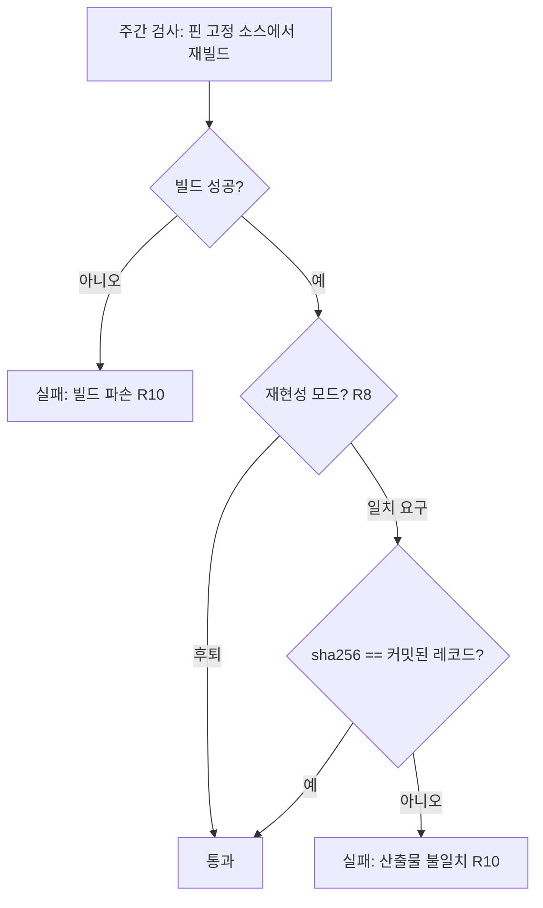
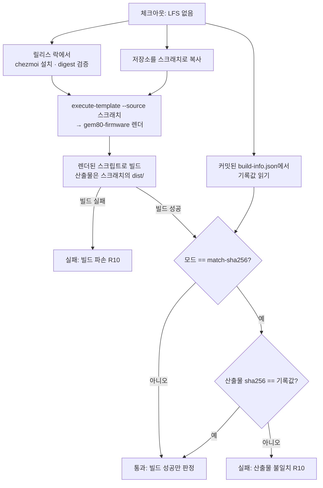

# Firmware Pin Liveness Watch - Plan

## Goal Capsule

- **Objective:** gem80 펌웨어를 다시 빌드할 수 있는 상태인지를, 재플래시가 필요한 작업에 착수하기 전에 스스로 알 수 있다.
- **Means:** 두 가지 주기의 예약 CI 검사가 핀 고정된 외부 의존물을 스스로 확인한다 (KTD5, KTD1).
- **Product authority:** 이 플랜은 핀 고정된 외부 의존물의 생존 여부를 감지하고 알리는 일만 소유한다. 호스트 데몬(`crates/gem80-rgb`), 펌웨어 v2(워치독과 `SIDE` 영역), 그리고 소스 사본 보관은 활성 범위가 아니다.
- **Authority hierarchy:** 제품 행동은 R-ID가, 구현 기법은 그 R을 인용하는 KTD가 정한다. Unit은 어느 쪽도 뒤집지 않는다.
- **Execution profile:** 셸 게이트와 GitHub Actions 워크플로. 새 런타임 의존성 없음. 프로덕션 코드 경로를 건드리지 않는다.
- **Stop conditions:** 러너에서 컨테이너 빌드가 성립하지 않는 것으로 드러나면(A2) 멈추고 보고한다. `gem80-firmware`의 배포 명령 표면을 바꿔야 할 필요가 생기면 멈추고 보고한다.
- **Tail ownership:** 커밋, 푸시, PR, CI 감시는 호출한 파이프라인이 소유한다.
- **Open blockers:** 없음.

---

## Product Contract

### Summary

핀 고정된 QMK 포크 커밋과 툴체인 이미지가 아직 도달 가능한지를 예약 작업이 매일 확인하고, 주간으로는 실제 재빌드까지 수행한다. 어느 하나라도 끊기면 워크플로가 실패해 알린다. 사본은 보관하지 않는다.

### Problem Frame

`hostrgb` 펌웨어의 재빌드 경로는 전부 통제 밖의 외부 대상에 걸려 있다. `.chezmoidata/firmware.yaml`이 고정한 커밋 `9847cb81`은 서드파티 포크 `ryodeushii/qmk-firmware`의 이동하는 브랜치 위에 있고, 서브모듈 세 개와 digest 고정된 `ghcr.io/qmk/qmk_cli` 이미지가 뒤따른다.

가장 흔한 손실은 저장소 삭제가 아니라 force-push다. 브랜치가 핀 고정된 커밋을 지나쳐 옮겨가면 그 커밋은 unreachable이 되고, GitHub가 회수하는 순간 저장소는 멀쩡한 채로 `fetch <sha>`만 죽는다. 예고는 없다.

지금 이 사건은 아무 신호도 남기지 않는다. `.github/workflows/ci.yml`에는 펌웨어를 언급하는 단계가 하나도 없고, 시간당 도는 릴리스 락 갱신은 이 핀을 의도적으로 제외한다. 그래서 손실은 다음번 재빌드를 시도하는 순간에야 드러난다 — 즉 워치독이나 `SIDE` 영역 작업을 이미 시작한 뒤다.

빌드된 바이너리는 `firmware/nuphy-gem80-hostrgb/dist/`에 Git LFS로 커밋되어 있으므로 플래시 자체는 계속 가능하다. 위험에 놓인 것은 재빌드 능력뿐이고, 그 능력은 keymap을 다시 손댈 때만 필요하다.

### Key Decisions

- **감지만 하고 보관은 하지 않는다.** 미러·번들·벤더링의 유지 비용을 지불하지 않는 대신, 알림은 손실을 막지 못하고 사후에 도착한다. *(session-settled: user-directed — 소스 보관 대신 선택: 보관 비용이 이 위험의 실제 크기에 비해 크다.)*
- **감지 주기를 둘로 나눈다.** 값싼 도달성 검사는 매일, 비싼 재빌드는 주간. 포크 소실은 하루 안에, 빌드 파손은 일주일 안에 드러난다. Governs R1, R2, R3. *(session-settled: user-directed — 단일 주기 대신 선택.)*
- **재현성이 성립하지 않으면 빌드 성공 여부로 후퇴한다.** 재현 불가 요인을 파헤치는 대신 보장 수준을 낮춘다. Governs R7, R8. *(session-settled: user-directed — 재현성 확보 작업 대신 선택.)*
- **알림은 워크플로 실패로만 한다.** `.github/workflows/refresh-release-lock.yml`이 업스트림 도달 실패를 다루는 방식을 그대로 따른다. Governs R9. *(session-settled: user-approved — 저장소의 기존 관례를 제안했고 사용자가 수용.)*

### Requirements

**감지 범위와 주기**

- R1. 매일 실행되는 검사가 `.chezmoidata/firmware.yaml`의 `firmware.gem80.qmkFork.sha`가 가리키는 커밋이 원격에서 아직 가져올 수 있는 상태인지 확인한다.
- R2. 같은 매일 검사가 `firmware/nuphy-gem80-hostrgb/dist/build-info.json`이 기록한 `toolchainImage` digest를 레지스트리에서 아직 받을 수 있는지 확인한다.
- R3. 주간 검사가 핀 고정된 소스에서 `hostrgb` 펌웨어를 실제로 다시 빌드한다. 서브모듈 도달 가능성은 이 빌드가 증명하므로 별도의 서브모듈 검사를 두지 않는다.
- R4. 주간 검사는 매일 검사가 확인하는 것을 이미 포함하므로, 같은 실행 안에서 매일 검사를 중복해 돌리지 않는다.

**커밋된 빌드 레코드 보호**

- R5. 재빌드 검사는 `firmware/nuphy-gem80-hostrgb/dist/`의 바이너리와 `build-info.json`을 수정하지 않는다.
- R6. 재빌드 검사는 갓 빌드한 바이너리를 커밋된 레코드가 이미 기록하고 있던 값과 대조한다. 그 빌드가 새로 작성한 레코드와 대조하는 경로는 검사로 인정하지 않는다.

**재현성 분기**

- R7. 재빌드 산출물이 커밋된 `binary.sha256`과 일치하면, 검사는 그 일치를 성공 조건으로 삼는다.
- R8. 핀이 그대로인데도 산출물이 커밋된 `binary.sha256`과 어긋나는 것이 재현성 부재로 판명되면, 검사는 빌드 성공 여부만을 성공 조건으로 삼도록 후퇴한다. 현재 어느 모드로 동작하는지는 저장소 안에 명시적으로 기록한다.

**경고**

- R9. 어떤 검사든 실패하면 해당 워크플로가 실패 상태로 끝난다. 이슈 자동 생성, 외부 알림 채널, 자동 커밋은 두지 않는다.
- R10. 실패 출력은 무엇이 끊겼는지 구분한다 — 포크 커밋 도달 불가, 툴체인 이미지 도달 불가, 빌드 실패, 산출물 불일치.
- R11. 이 검사들은 pull request의 성공 여부를 좌우하지 않는다. 외부 상태 변화가 무관한 변경의 CI를 막아서는 안 된다.
- R12. 두 검사 모두 예약 시각을 기다리지 않고 사람이 즉시 실행할 수 있다.

### Key Flows

- F1. 매일 도달성 검사
  - **Trigger:** 매일 예약된 시각, 또는 사람이 직접 실행.
  - **Steps:** 핀 고정된 포크 커밋의 존재를 원격에 묻는다. 이어서 툴체인 이미지 digest를 레지스트리에 묻는다. 둘 다 응답하면 통과한다.
  - **Outcome:** 통과, 또는 어느 쪽이 끊겼는지 밝힌 실패.
  - **Covered by:** R1, R2, R9, R10, R12

- F2. 주간 재빌드 검사
  - **Trigger:** 주간 예약된 시각, 또는 사람이 직접 실행.
  - **Steps:** 핀 고정된 커밋과 서브모듈을 받아 `hostrgb`를 빌드한다. 산출물을 커밋된 레코드의 기록값과 대조한다. 현재 재현성 모드가 후퇴 상태면 대조를 건너뛰고 빌드 성공만으로 판정한다.
  - **Outcome:** 통과, 또는 빌드 파손과 산출물 불일치를 구분한 실패. 저장소 작업 트리는 어느 경우에도 변경되지 않는다.
  - **Covered by:** R3, R4, R5, R6, R7, R8, R9, R10, R12

### Acceptance Examples

- AE1. **Covers R1, R10.** 포크 브랜치가 핀 고정된 커밋을 지나쳐 force-push되고 그 커밋이 회수된 상태에서, 매일 검사는 실패하고 그 실패가 툴체인 이미지가 아니라 포크 커밋 때문임을 밝힌다.
- AE2. **Covers R5, R6.** 주간 검사가 한 번 완주한 뒤, `firmware/nuphy-gem80-hostrgb/dist/`는 검사 이전과 바이트 단위로 동일하다.
- AE3. **Covers R7, R8.** 재현성 모드가 일치 요구 상태이고 빌드는 성공했으나 산출물 해시가 커밋된 레코드와 다르면 검사는 실패한다. 같은 상황에서 모드가 후퇴 상태면 통과한다.
- AE4. **Covers R11.** 핀 고정된 포크가 도달 불가인 동안에도, 펌웨어와 무관한 변경의 pull request CI는 그 사유로 실패하지 않는다.

### Success Criteria

- 재플래시가 필요한 작업을 계획할 때, 빌드 경로가 살아있는지 확인하려고 사람이 어떤 명령도 직접 실행하지 않는다.
- 실패 알림 하나만 읽고, 다음 행동이 포크 대응인지 빌드 수정인지 판단할 수 있다.

### Scope Boundaries

- 포크, 서브모듈, 툴체인 이미지의 사본 보관 — 미러 저장소, `git bundle`, 벤더링 모두 제외한다.
- 포크가 실제로 사라진 뒤의 복구 절차. 이 플랜은 그 사실을 알릴 뿐이고, 그때 무엇을 할지는 별도 결정이다.
- 펌웨어 변경 일체 — 워치독과 `SIDE` 영역 확장.
- 호스트 데몬과 그 클라이언트.
- 업스트림 QMK 또는 NuPhy가 새로 낸 수정을 추적하는 일. 이 플랜은 핀이 아직 유효한지만 보고, 핀을 옮겨야 하는지는 보지 않는다.

### Dependencies / Assumptions

- `.chezmoidata/firmware.yaml`이 포크 핀의 단일 출처이며, 릴리스 락 갱신은 이 파일을 건드리지 않는다.
- `dot_local/share/chezmoi-command-sources/executable_gem80-firmware.tmpl`은 chezmoi 템플릿이고 `.chezmoi.sourceDir`과 포크 핀을 렌더 시점에 구워 넣는다. 저장소에 커밋된 형태 그대로는 CI에서 실행되지 않는다.
- 산출물 대조는 커밋된 `build-info.json`의 기록값과 비교하므로 Git LFS로 저장된 바이너리를 페치하지 않는다 (KTD6).
- QMK 빌드가 bit 단위로 재현 가능한지는 확인된 바 없다. keymap을 클론한 트리에 복사해 넣는 현재 빌드 방식이 재현성을 깨뜨릴 수 있다.

<!-- ce-section: work-relationships -->
### How This Work Fits Together

이 플랜은 핀 고정된 빌드 경로의 생존 감지만 소유한다. 아래 구분은 이슈 [#459](https://github.com/hyperlapse122/dotfiles/issues/459)를 읽고 현재 이해한 바이며, 확정된 로드맵이 아니다.

- 호스트 데몬 `crates/gem80-rgb` — lib, `gem80-rgbd`, `gem80-rgbctl`, 그리고 첫 클라이언트인 fcitx5 입력기 인디케이터.
  - Can proceed independently of: 이 플랜. 검증된 `0x60` 프로토콜과 커밋된 바이너리만으로 완결된다.
- 펌웨어 v2 — 워치독과 `SIDE` 영역 주소 바이트. 둘 다 재플래시가 필요하므로 한 사이클로 묶는 것이 자연스럽다.
  - Depends on: 이 플랜. 재빌드 능력이 살아있는지가 착수 전제다.
  - Enables: 호스트 데몬의 `SIDE` 영역 기능.
- 소스 사본 보관 — 미러, 번들, 벤더링 중 하나.
  - Still to decide: 이 플랜의 알림이 실제로 울린 뒤에 판단한다.

### Sources / Research

- `.chezmoidata/firmware.yaml` — 포크 핀. 릴리스 락 제외 사유가 주석으로 붙어 있다.
- `dot_local/share/chezmoi-command-sources/executable_gem80-firmware.tmpl` — `build`와 `verify` 구현. `build`가 `build-info.json`을 새로 쓴 뒤 `verify`를 호출하므로, 현재 경로로는 재현성 대조가 성립하지 않는다.
- `firmware/nuphy-gem80-hostrgb/dist/build-info.json` — 포크 SHA, 툴체인 이미지 digest, 산출물 해시.
- `.github/workflows/refresh-release-lock.yml` — 업스트림 도달 실패를 워크플로 실패로만 알리는 기존 관례.
- `.github/workflows/ci.yml` — 현재 펌웨어를 다루는 단계가 없다.
- `.gitattributes` — `firmware/*/dist/*.bin`의 LFS 추적 규칙.
- `docs/plans/2026-09-10-0915-feat-gem80-hostrgb-firmware-verification-plan.md` — 핀을 릴리스 락 밖에 둔 결정(KTD1)과 LFS 패턴 결정(KTD7).

---

## Planning Contract

**Product Contract preservation:** Product Contract unchanged. 계획 이전의 `Outstanding Questions` 세 항목은 모두 `Deferred to Planning`이었고 이 단계에서 KTD1, KTD3, A2로 해소되어 제자리에서 정리했다.

### Key Technical Decisions

- KTD1. **CI는 실제 `gem80-firmware`를 렌더해 실행하고, 그 chezmoi는 워크플로가 설치한다.** 빌드 로직을 `.ci` 쪽에 다시 구현하면 두 구현이 갈라져 sha256 비교 자체가 무의미해진다. `ci.yml`의 `command-reconcile` 잡이 릴리스 락에서 chezmoi를 digest 검증으로 설치하고 `chezmoi execute-template`으로 템플릿을 렌더하는 경로를 이미 쓴다. 이 저장소에서 도구 설치는 워크플로 스텝이 소유하고 `.ci` 스크립트는 `command -v`로 찾을 뿐이므로, 게이트가 직접 내려받으면 로컬 실행에서 예기치 않은 네트워크 접근과 아키텍처 불일치를 부른다. Governs R3, R6.
- KTD2. **재빌드 검사는 저장소의 스크래치 복사본을 대상으로 렌더·빌드한다.** 렌더된 스크립트는 `.chezmoi.sourceDir`을 구워 넣고 그 아래 `dist/`에 산출물을 쓰므로, 체크아웃 자체를 `--source`로 주면 커밋된 산출물을 덮어쓴다. Governs R5.
- KTD3. **재현성 모드를 `.chezmoidata/firmware.yaml`의 데이터로 선언한다.** 스크립트가 아니라 데이터가 결정을 소유한다는 `STRATEGY.md`의 접근을 따른다. 초기값은 `build-only`로 두고, U3에서 실측이 재현을 확인하면 `match-sha256`으로 올린다. Governs R7, R8. *(session-settled: user-directed — chosen over 재현 불가 요인을 제거해 bit-재현성을 확보하는 작업: 재현성 확보 비용을 지불하는 대신 보장 수준을 낮추는 쪽을 택했다.)*
- KTD4. **도달성·재빌드 게이트는 예약 워크플로에서만 돌리고, 픽스처 기반 테스트는 `ci.yml`에서 돌린다.** 외부 상태에 의존하는 검사가 pull request를 빨갛게 만들면 안 되지만, 게이트의 판정 로직 자체는 매 PR에서 검증되어야 한다. Governs R11.
- KTD5. **도달성 검사는 조회로만 하고 클론하지 않는다.** 핀이 선언된 ref의 조상인지를 GitHub 비교 API로, 이미지 digest는 레지스트리 조회로 확인한다. 커밋 객체 존재만으로는 fetch 경로가 살아 있음을 증명하지 못하고, 얕은 fetch조차 QMK 트리 전체를 끌어오므로 매일 돌리기에 맞지 않는다. Governs R1, R2.
- KTD6. **비교 대상은 커밋된 `build-info.json`의 기록값이다.** 커밋된 바이너리 자체가 아니므로 CI는 Git LFS를 페치하지 않는다. Governs R6.
- KTD7. **`test-ci-wiring.sh`의 배선 규칙은 새 잡을 `delivery`에 넣지 않아도 만족된다.** 그 게이트의 배선 검사는 모든 워크플로를 훑고, `needs` 검사는 `ci.yml` 잡만 대상으로 한다. 새 예약 워크플로에서만 호출되는 `.ci` 게이트는 배선된 것으로 인정된다.
- KTD8. **매일 검사와 주간 검사는 별도 워크플로 파일에 둔다.** GitHub Actions는 `schedule`과 `workflow_dispatch`를 워크플로 단위로 적용하므로, 한 파일 안의 두 잡은 어느 트리거에서든 함께 기동한다. 잡마다 `if`로 이벤트를 가르는 대안은 수동 실행을 다시 조건 입력으로 가려야 해서 더 복잡하다. Governs R4, R12.

### High-Level Technical Design

주간 재빌드 검사의 데이터 흐름. 실제 트리와 스크래치 복사본의 경계가 R5를 지키는 지점이다.

### Assumptions

- A1. `.chezmoidata/firmware.yaml`에 키를 추가해도 `executable_gem80-firmware.tmpl`의 렌더는 깨지지 않는다. 템플릿은 `.firmware.gem80.qmkFork`만 읽는다.
- A2. GitHub 호스티드 러너에서 컨테이너 빌드가 성립한다. Podman이 선설치되어 있지 않으면 `.ci/lib/apt-install.sh`가 저장소가 인정하는 설치 경로다. 성립하지 않는 것으로 드러나면 Goal Capsule의 stop condition이다.
- A3. 러너의 디스크와 시간이 QMK 트리(스크립트 주석 기준 수 GB)와 한 번의 펌웨어 빌드를 감당한다. 주간 잡의 타임아웃은 저장소의 통상 10분보다 넉넉해야 한다.
- A4. `ryodeushii/qmk-firmware`는 공개 저장소이므로 도달성 조회에 별도 자격 증명이 필요 없다.

### Sequencing

U1 → U3. U2와 U3 → U4, U5. U6은 마지막.

---

## Implementation Units

### U1. 재현성 모드를 데이터로 선언

- **Goal:** 주간 재빌드 검사가 어느 판정 기준으로 도는지를 저장소가 데이터로 선언한다.
- **Requirements:** R8. KTD3.
- **Dependencies:** 없음.
- **Files:** `.chezmoidata/firmware.yaml`
- **Approach:**
  1. `firmware.gem80` 아래에 재빌드 검사 모드를 담을 키 `rebuildMode`를 추가한다. 값은 `build-only`와 `match-sha256` 두 가지다.
  2. 초기값은 `build-only`로 둔다. 재현성은 아직 실측되지 않았고, 근거 없이 `match-sha256`으로 시작하면 첫 주간 실행이 상시 빨간불이 된다.
  3. 파일 상단의 기존 주석 옆에, 이 키가 왜 데이터로 사는지와 값이 무엇을 뜻하는지를 짧게 남긴다.
- **Patterns to follow:** 같은 파일의 `qmkFork` 블록과 그 주석. 결정을 데이터로 선언하는 `STRATEGY.md`의 접근.
- **Test scenarios:** Test expectation: none -- 데이터 선언만이며 동작 변화가 없다. 소비자 쪽 검증은 U3와 U5가 담당한다.
- **Verification:** `chezmoi execute-template --source <repo> < dot_local/share/chezmoi-command-sources/executable_gem80-firmware.tmpl`이 여전히 렌더된다 (A1).

### U2. 도달성 게이트

- **Goal:** 핀 고정된 포크 커밋과 툴체인 이미지 digest가 아직 도달 가능한지를 클론 없이 확인하는 게이트.
- **Requirements:** R1, R2, R10, R12. KTD5.
- **Dependencies:** 없음.
- **Files:** `.ci/check-gem80-firmware-pins.sh`
- **Approach:**
  1. `.chezmoidata/firmware.yaml`에서 포크 source와 sha를, `firmware/nuphy-gem80-hostrgb/dist/build-info.json`에서 `toolchainImage`를 읽는다.
  2. 커밋 도달성은 핀 고정된 sha가 `firmware.yaml`이 선언한 ref와 같거나 그 조상인지를 GitHub 비교 API로 확인한다. 커밋 객체가 조회되는 것만으로는 통과시키지 않는다 — force-push 직후 객체는 아직 살아 있으면서 fetch 경로는 이미 끊긴 구간이 존재한다.
  3. 이미지 digest 도달성은 레지스트리 조회로 확인한다.
  4. 두 검사의 실패를 서로 구분된 메시지로 보고하고, 하나가 실패해도 나머지를 계속 검사한 뒤 종료 코드를 1로 만든다 (R10).
- **Patterns to follow:** `.ci/check-release-lock-digests.sh` — 헤더 주석이 게이트의 존재 이유를 설명하는 형식, 그리고 종료 코드 관례.
- **Test scenarios:**
  - Covers R1, R10. 포크 커밋이 도달 불가일 때 게이트가 실패하고, 메시지가 이미지가 아니라 포크 커밋을 지목한다.
  - Covers R1. 커밋 객체는 조회되지만 선언된 ref의 조상이 아닌 상태에서 게이트가 실패한다.
  - Covers R2, R10. 이미지 digest가 도달 불가일 때 게이트가 실패하고, 메시지가 포크가 아니라 이미지를 지목한다.
  - Covers R10. 둘 다 도달 불가일 때 두 실패가 모두 보고된다.
  - 둘 다 도달 가능할 때 게이트가 0으로 끝난다.
  - `build-info.json`이나 `firmware.yaml`이 없거나 필드가 비었을 때, 조용히 통과하지 않고 실패한다.
- **Verification:** 현재 저장소 상태에서 실행하면 통과한다. 핀 sha를 존재하지 않는 값으로 바꾸면 포크 쪽 실패로 끝난다.

### U3. 재빌드 게이트

- **Goal:** 핀 고정된 소스에서 실제로 다시 빌드하고, 커밋된 레코드의 기록값과 대조하는 게이트.
- **Requirements:** R3, R4, R5, R6, R7, R8, R10, R12. KTD1, KTD2, KTD3, KTD6.
- **Dependencies:** U1.
- **Files:** `.ci/check-gem80-firmware-rebuild.sh`
- **Approach:**
  1. 빌드 전에 커밋된 `build-info.json`에서 `binary.sha256`과 `binary.name`을 읽어 보관한다 (KTD6).
  2. 저장소를 스크래치 디렉터리로 복사한다 (KTD2).
  3. chezmoi를 `command -v`로 PATH에서 찾는다. 설치는 호출하는 워크플로가 소유하므로 이 스크립트는 내려받지 않는다 (KTD1).
  4. 스크래치 복사본을 `--source`로 지정해 `gem80-firmware`를 렌더한다 (KTD1).
  5. 렌더된 스크립트의 build 경로를 실행한다. 산출물과 재작성된 레코드는 모두 스크래치 안에 머문다.
  6. 모드와 무관하게 새 산출물의 sha256을 1단계에서 보관한 값과 대조하고 그 결과를 항상 출력한다. `.chezmoidata/firmware.yaml`의 `rebuildMode`가 `match-sha256`일 때만 불일치를 실패로 만들고, `build-only`면 불일치를 보고만 하고 통과시킨다 (R7, R8).
  7. 빌드 실패와 산출물 불일치를 서로 다른 메시지로 보고한다 (R10).
  8. 종료 시 스크래치를 지운다.
- **Execution note:** 게이트를 먼저 완성한 뒤 로컬에서 한 번 끝까지 돌려라. 그 실행이 재현성 실측이다.
- **Patterns to follow:** `execute-template` 호출 형태는 `.github/workflows/ci.yml`의 `command-reconcile` 잡. 도구를 `command -v`로 찾는 방식은 기존 `.ci` 게이트들. 스크래치 디렉터리 취급은 `.ci/test-ci-wiring.sh`.
- **Test scenarios:**
  - Covers AE2, R5. 게이트가 완주한 뒤 `firmware/nuphy-gem80-hostrgb/dist/`가 실행 전과 동일하다.
  - Covers AE3, R7. 모드가 `match-sha256`이고 산출물 해시가 기록값과 다를 때 실패한다.
  - Covers AE3, R8. 같은 상황에서 모드가 `build-only`면 통과하되, 불일치 사실은 여전히 출력된다.
  - Covers R10. 빌드가 실패했을 때의 메시지가 산출물 불일치의 메시지와 구분된다.
  - Covers R6. 빌드가 재작성한 레코드가 아니라 실행 전에 읽은 기록값이 비교에 쓰인다.
  - 컨테이너 런타임이 없을 때 조용히 통과하지 않고 실패한다.
  - chezmoi가 PATH에 없을 때 조용히 통과하지 않고 실패한다.
- **Verification:** 로컬에서 한 번 완주한다. `build-only`로 도는 그 실행이 대조 결과를 출력하므로 그것이 재현성 실측이다. 일치하면 `rebuildMode`를 `match-sha256`으로 올리고, 일치하지 않으면 `build-only`로 남긴 채 관찰된 차이를 커밋 메시지에 남긴다.

### U4. 예약 워크플로

- **Goal:** 두 게이트를 각자의 주기로 돌리고, 실패를 워크플로 실패로 알린다.
- **Requirements:** R1, R2, R3, R4, R9, R11, R12. KTD4, KTD7, KTD8.
- **Dependencies:** U2, U3.
- **Files:** `.github/workflows/gem80-firmware-pins-daily.yml`, `.github/workflows/gem80-firmware-rebuild-weekly.yml`
- **Approach:**
  1. 워크플로 파일을 둘로 나눈다. 하나는 매일 도달성 게이트만, 다른 하나는 주간 재빌드 게이트만 돌린다. GitHub Actions는 `schedule`과 `workflow_dispatch`를 워크플로 단위로 적용하므로, 한 파일에 두 주기를 담으면 매일 트리거가 주간 재빌드까지 깨우고 수동 실행으로 한쪽만 돌릴 수 없다 (KTD8).
  2. 주간 워크플로는 도달성 게이트를 따로 호출하지 않는다. 재빌드가 이미 그것을 증명한다 (R4).
  3. 두 워크플로 모두 `workflow_dispatch`를 가져 각각 독립적으로 즉시 실행된다 (R12).
  4. 어느 워크플로도 `push`나 `pull_request`에서 돌지 않는다 (R11).
  5. 커밋도 푸시도 하지 않는다. 실패는 잡의 실패로만 표면화한다 (R9).
  6. 주간 워크플로가 잠금된 chezmoi 설치 스텝을 소유한다. 릴리스 락에서 URL과 sha256을 읽어 digest를 검증한 뒤 PATH에 올린다 (KTD1).
  7. 주간 워크플로의 타임아웃은 컨테이너 빌드를 감당할 만큼 넉넉히 준다 (A3).
- **Patterns to follow:** `.github/workflows/refresh-release-lock.yml` — 예약 트리거, `concurrency` 그룹, 그리고 업스트림 도달 실패를 잡 실패로만 알리는 관례. 잠금된 chezmoi 설치 스텝은 `.github/workflows/ci.yml`의 `command-reconcile` 잡.
- **Test scenarios:**
  - Covers R11, AE4. `.ci/test-ci-wiring.sh`가 통과한다. 두 워크플로 모두 `ci.yml` 잡이 아니므로 `delivery`의 `needs`를 요구받지 않고, 여기서만 호출되는 두 게이트는 배선된 것으로 인정된다.
  - Covers R12. 두 워크플로 각각이 독립된 수동 실행 트리거를 가진다.
  - Covers R4. 매일 트리거가 재빌드 워크플로를 깨우지 않는다.
  - Covers R9. 두 워크플로 어디에도 커밋, 푸시, 이슈 생성 단계가 없다.
- **Verification:** 병합 후 두 워크플로를 각각 수동 실행하면 초록으로 끝나고, 한쪽 실행이 다른 쪽을 기동하지 않는다.

### U5. 게이트 판정 로직의 픽스처 테스트

- **Goal:** 두 게이트의 판정 로직이 네트워크나 빌드 없이 매 PR에서 검증된다.
- **Requirements:** R7, R8, R10, R11. KTD4.
- **Dependencies:** U2, U3.
- **Files:** `.ci/test-gem80-firmware-pin-gates.sh`, `.ci/fixtures/`, `.github/workflows/ci.yml`
- **Approach:**
  1. 각 게이트의 판정 단계를 인자로 받은 값에 대해 단독 실행할 수 있게 노출한다. 네트워크 조회와 컨테이너 빌드는 그 단계 밖에 남는다.
  2. 조작된 `build-info.json`과 `firmware.yaml` 픽스처를 두고 그 판정 단계만 돌린다. 도달성 조회나 컨테이너 실행을 흉내 내는 스텁은 만들지 않는다 — 이 테스트는 판정과 보고만 검증한다.
  3. `ci.yml`의 `repo-meta` 잡 스텝 목록에 이 테스트를 추가한다. 기존 잡이 이미 `delivery`의 `needs`에 있으므로 배선 변경은 없다.
- **Patterns to follow:** `.ci/test-release-lock-digest-gate.sh`가 `.ci/check-release-lock-digests.sh`를 시험하는 방식. `.ci/fixtures/`의 기존 배치.
- **Test scenarios:**
  - Covers R7. 모드가 `match-sha256`이고 해시가 어긋난 픽스처에서 게이트가 실패로 판정한다.
  - Covers R8. 같은 픽스처에서 모드가 `build-only`면 통과로 판정한다.
  - Covers R10. 각 실패 유형이 자기 원인을 지목하는 메시지를 낸다.
  - 필드가 빠지거나 형식이 깨진 픽스처에서 게이트가 통과하지 않는다.
- **Verification:** `.ci/test-gem80-firmware-pin-gates.sh`가 통과하고, `.ci/test-ci-wiring.sh`가 새 스크립트를 배선된 것으로 인정한다.

### U6. 감시 체계 문서화

- **Goal:** 펌웨어를 다시 만지려는 사람이 빌드 경로의 생존 여부를 어디서 확인하는지 안다.
- **Requirements:** 개별 R을 진전시키지 않는다. Goal Capsule의 Objective를 사람이 실제로 쓸 수 있게 만드는 문서 단위다.
- **Dependencies:** U4.
- **Files:** `firmware/nuphy-gem80-hostrgb/README.md`
- **Approach:**
  1. 무엇이 언제 검사되는지, 실패가 어떻게 알려지는지를 짧은 절로 적는다.
  2. 재현성 모드가 무엇을 뜻하고 어디에 선언되어 있는지 적는다.
  3. 이 감시가 사본을 보관하지 않으므로 포크 소실을 막지는 못한다는 점을 분명히 적는다.
- **Patterns to follow:** 같은 파일의 기존 절 구성과 문체.
- **Test scenarios:** Test expectation: none -- 문서 변경이며 동작이 없다.
- **Verification:** README를 처음 읽는 사람이 감시 주기와 실패 통보 경로를 문서만으로 말할 수 있다.

---

## Verification Contract

| 확인 | 대상 | 적용 Unit |
| --- | --- | --- |
| `.ci/test-gem80-firmware-pin-gates.sh` | 게이트 판정 로직 | U2, U3, U5 |
| `.ci/test-ci-wiring.sh` | 새 게이트와 워크플로의 배선 | U2, U3, U4, U5 |
| `.ci/check-gem80-firmware-pins.sh` 로컬 실행 | 현재 핀의 실제 도달성 | U2 |
| `.ci/check-gem80-firmware-rebuild.sh` 로컬 1회 완주 | 재빌드 성립과 재현성 실측 | U3 |
| `chezmoi execute-template` 렌더 | 데이터 키 추가 후 템플릿 무결성 | U1 |
| 병합 후 두 워크플로 각각 `workflow_dispatch` | 러너에서의 실제 성립과 주기 격리 | U4 |
| README 내용 검토 | 감시 주기·실패 통보·재현성 모드 설명 | U6 |

로컬 재빌드 완주는 컨테이너 이미지와 수 GB의 QMK 트리를 받는다. 한 번만 돌리면 되고, 그 실행이 U3의 재현성 판정 근거다.

---

## Definition of Done

- R1부터 R12까지가 구현되었거나, 구현되지 않은 항목이 명시적으로 이월되었다.
- 두 게이트가 로컬에서 각각 의도한 판정을 낸다.
- `.ci/test-ci-wiring.sh`가 통과한다. 새 게이트 중 어느 것도 배선 없이 남지 않았다.
- 재현성 모드의 값이 U3의 실측 결과를 반영한다. 근거 없는 값이 커밋되지 않았다.
- `firmware/nuphy-gem80-hostrgb/dist/`가 이 작업의 어느 단계에서도 변경되지 않았다.
- 실험하다 버린 스크립트나 픽스처가 diff에 남아 있지 않다.
- README가 감시 체계를 설명한다.
