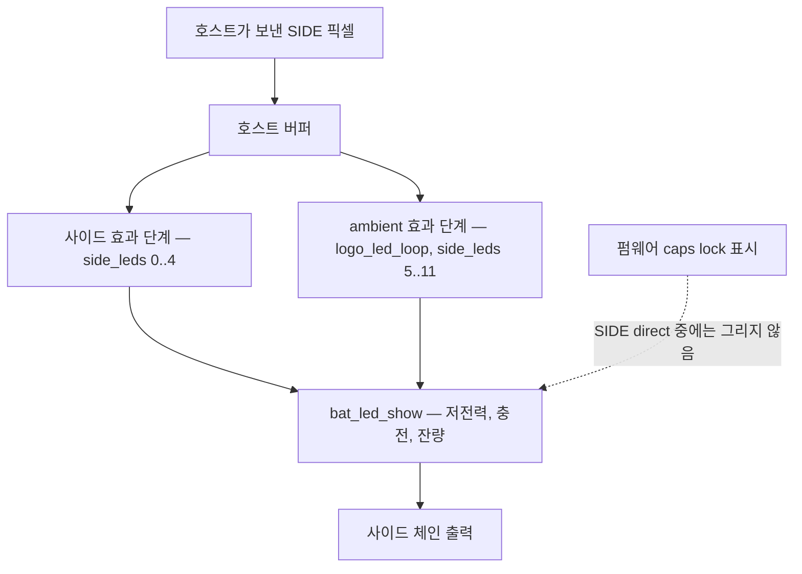
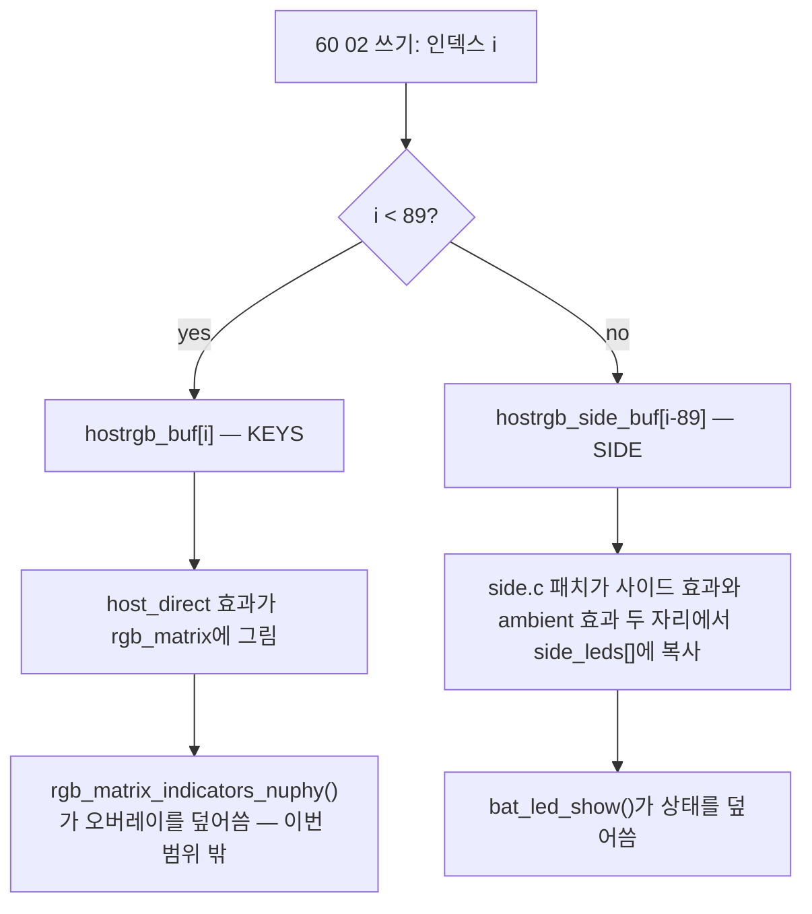
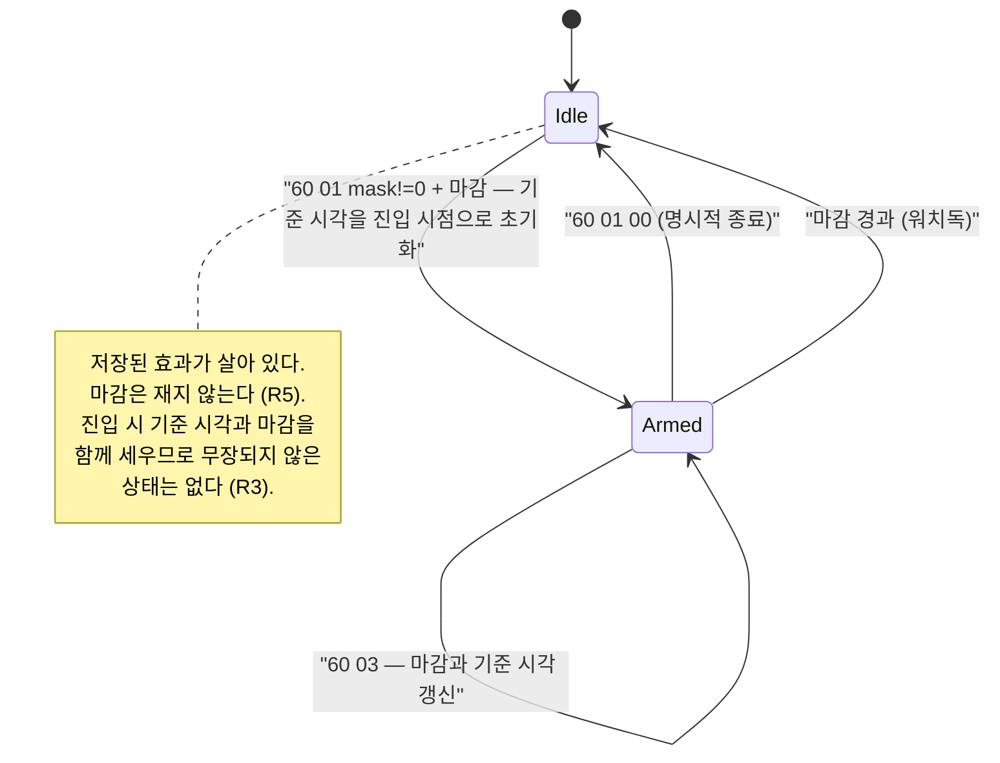

# Gem80 Firmware Watchdog and SIDE Region - Plan

## Goal Capsule

- **Objective:** 호스트 프로세스가 죽어도 Gem80이 마지막 프레임에 갇히지 않고 사용자가 저장해둔 조명으로 돌아온다. 그리고 로고·사이드의 12개 LED가 키 LED와 같은 방법으로 호스트에게 열리되, 배터리 경고는 계속 사람에게 보인다.
- **Means:** 검증된 `0x60` raw HID 명령을 개정 2로 올려 하트비트 워치독과 평탄한 101 LED 주소 공간을 얹고, 두 변경을 한 번의 플래시 사이클에 함께 싣는다 (KTD1, KTD4, KTD6).
- **Product authority:** GitHub 이슈 [hyperlapse122/dotfiles#459](https://github.com/hyperlapse122/dotfiles/issues/459), `firmware/nuphy-gem80-hostrgb/dist/verification-log.md`의 하드웨어 관찰 기록, 그리고 `.chezmoidata/firmware.yaml`이 핀한 fork 커밋의 소스. 호스트 데몬 `crates/gem80-rgb`, fcitx5 인디케이터, 푸시 플레인은 활성 범위가 아니다.
- **Execution profile:** U1–U7과 U9는 에이전트가 완결한다. U8은 조작자 개입 단위다 — 실행자가 물리 단계를 안내하고 관찰 결과를 받아 기록하며, 대신 수행하지 않는다.
- **Stop conditions:** 플래시 전 `gem80-firmware verify`가 실패하면 멈춘다. U8에서 이 Gem80 장치의 프로브가 총 101, 경계 89를 보고하지 않으면 멈추고 보고한다 — 이것은 실물 장치의 수용 기준이지 호스트 도구의 상수가 아니다 (R7, KTD7). 워치독이 어떤 리전도 direct 모드가 아닐 때 발화하면 멈춘다. fork 패치가 핀된 커밋에 깨끗하게 적용되지 않으면 멈춘다 — 조용히 재작성하지 않는다.
- **Tail ownership:** 이 계획은 커밋과 PR까지 소유한다. 이슈 #459에 검증 결과를 보고하는 것을 포함한다.

---

## Product Contract

**Product Contract preservation:** 변경됨 — R16 신규, R3과 R10 의미 변경, AE 재구성, Scope Boundaries의 사실 주장 하나 정정, Assumptions 재작성, Outstanding Questions 해소분 삭제. R1, R2, R4–R9, R11–R15는 의미와 ID 모두 그대로다.

R3은 문서 리뷰가 여는 구멍을 닫으려 넓혔다. 원문은 하트비트만 마감을 나르게 했는데, 그러면 진입부터 첫 하트비트까지 마감도 기준 시각도 없는 창이 생기고, 그 창에서 호스트가 죽으면 이 계획이 없애려는 "마지막 프레임에 갇힘"이 그대로 남는다. 진입 명령이 첫 마감을 함께 나르도록 했다 — 마감을 여전히 호스트가 고르므로 KD2와 충돌하지 않는다.

R10에서 RF 링크 표시를 뺐다. 그것은 `side_led_show()` 밖 `common/core/keyboard.c`의 `set_indicator_on_side()`로 그려져 KTD5가 세운 합성 순서의 적용을 받지 않고, USB 링크에서는 전원 투입 직후 짧은 창에만 떠서 이번 검증으로 관찰할 수 없다. 한 요구로 묶어두면 절반만 본 관찰로 충족 처리된다. Deferred to Follow-Up Work로 옮겼다.

R16은 fork 공유 코드 패치가 이번 범위에 들어오면서 생겼다. 브레인스토밍은 변경이 키맵 안에서 끝난다고 보았고, 그 전제에서는 기존 출처 게이트가 이미 모든 리포 소유 소스를 덮었다. 패치가 생기면 덮지 않는다.

Scope Boundaries에서 "디바운스 표시만 KEYS를 침범하며 상시 경합이 아니다"라는 서술을 정정했다. fork 소스 확인 결과 caps lock(설정에 따라), Win-lock, numlock이 모두 KEYS에 상시로 그려질 수 있다. 이 정정은 요구를 바꾸지 않고 Deferred to Follow-Up Work 항목 하나를 낳는다.

AE는 리뷰 결과로 재구성했다. AE7을 충전 표시와 저전력 표시 둘로 나눴다(R9가 두 표시를 모두 요구한다), caps lock 항목을 AE11로 옮겼고, AE10은 플래시 **전에** 실행하도록 순서를 고쳤다 — 개정 불일치 거절은 개정 1 펌웨어가 올라가 있을 때만 관찰할 수 있고 플래시 후에는 전제가 사라진다.

브레인스토밍이 `Deferred to Planning`으로 남긴 여섯 개 질문은 KTD1–KTD7이 소유하며, 중복을 남기지 않도록 해당 목록에서 삭제했다.

### Summary

Gem80 펌웨어에 두 가지를 더한다. 하나는 호스트가 주기적으로 보내는 하트비트가 끊기면 저장된 효과로 되돌아가는 워치독이다. 다른 하나는 로고 7 + 사이드 5, 총 12개의 사이드 LED를 89개 키 LED 뒤에 이어 붙여 하나의 평탄한 주소 공간으로 만드는 확장이다. 조작자 개입이 필요한 플래시를 한 번으로 끝내기 위해 둘을 함께 싣는다.

### Problem Frame

현재 플래시된 펌웨어에서 호스트가 direct 모드로 들어가면, 그 뒤로 아무 일도 일어나지 않는다. 데몬이 크래시하거나 kill되면 키보드는 마지막으로 받은 프레임을 영원히 표시한다. 그 프레임이 검정이면 키보드는 꺼진 것처럼 보이고, 사용자는 조명이 고장난 줄 안다. 되돌리려면 키보드를 뽑았다 꽂거나 호스트에서 명령을 하나 더 보내야 하는데, 후자는 애초에 죽은 프로세스가 할 수 없는 일이다.

두 번째 결핍은 범위의 문제다. 하드웨어 검증에서 89개 키 LED는 호스트 프레임으로 완전히 덮이는 것이 확인됐지만, 로고와 상단 스트립은 그대로였다. 그 12개는 별도 WS2812 체인에 있고 `0x60`은 그쪽을 모른다. 그런데 검증 과정에서 caps lock 표시가 바로 그 체인에 그려진다는 것이 함께 드러났다 — 즉 사이드 체인은 장식용 여분이 아니라 키보드가 사람에게 상태를 말하는 통로다. 배터리 잔량, 충전, RF 링크가 모두 거기 산다. 호스트에게 그 공간을 여는 일은 표시 면적을 늘리는 것이 아니라 소유권을 나누는 일이다.

세 번째는 비용의 문제다. 이 프로젝트에서 재플래시는 값싸지 않다. 조작자가 키캡을 뽑을 준비를 하고, 케이블을 뽑았다 꽂고, 육안으로 확인하고, 검증 로그를 다시 쓰고, `dist/`의 바이너리와 빌드 기록을 재생성해야 한다. 그래서 "나중에 값 하나만 바꾸면 된다"는 종류의 선택은 여기서 특히 비싸다.

### Key Decisions

- KD1. **생존 신호는 전용 하트비트 서브커맨드로 보낸다** — 픽셀 쓰기를 생존 신호로 재사용하면, 입력기가 바뀔 때만 픽셀을 보내는 정적 인디케이터가 정상 동작 중에 죽은 것으로 오인된다. (session-settled: user-directed — chosen over "모든 `0x60` 쓰기가 타이머를 리셋": 정적 클라이언트가 의미 없는 프레임을 재전송해야 하는 안티패턴이 생긴다.) Governs R1, R2.
- KD2. **마감은 하트비트가 직접 싣는다** — 침묵하는 인디케이터와 60fps 푸시를 하나의 고정 상수로 동시에 만족시킬 값은 없고, 상수를 바꾸려면 재플래시다. (session-settled: user-directed — chosen over "펌웨어 고정 상수, 프로브가 값을 보고": 재플래시 비용이 클램프 없는 호스트 신뢰보다 크다.) Governs R3.
- KD3. **주소는 평탄하게, 모드는 리전별로** — 하드웨어에서 검증된 `60 02`의 패킷 모양을 그대로 두려면 리전 바이트를 넣지 않는 편이 낫고, 소유권은 주소가 아니라 모드에서 나눠야 KEYS만 쓰는 클라이언트가 SIDE의 배터리 표시를 빼앗지 않는다. (session-settled: user-directed — chosen over "`60 02`에 리전 바이트 추가": 검증된 패킷 모양이 깨지고 패킷당 LED 수가 9에서 8로 줄어든다.) Governs R6, R8.
- KD4. **SIDE에서 펌웨어 상태 표시가 호스트 쓰기를 이긴다** — 예쁜 색이 배터리 경고를 덮는 것은 잘못된 기본값이다. (session-settled: user-directed — chosen over "호스트가 SIDE를 잡으면 전부 호스트 것": 안전 신호를 장식에 양보할 수 없다. 이슈 #459에서 결정.) Governs R9, R10.
- KD5. **caps lock만 호스트에 양도한다** — caps lock은 안전 신호가 아니라 단순 상태이고, 데몬은 키 레이아웃과 색을 맞춰 펌웨어보다 나은 표시를 만들 수 있다. (session-settled: user-directed — chosen over "caps lock도 펌웨어 우선": 사이드에 고정된 표시보다 레이어와 함께 그리는 편이 낫다.) Governs R11.
- KD6. **워치독 복귀는 명시적 종료와 같은 상태에 도달한다** — 이미 검증된 `60 01` 종료 경로가 사용자의 저장된 선호를 정확히 복원하고, 복귀 경로를 하나로 유지하면 사용자가 두 가지 결과를 구분할 필요가 없다. Governs R4.

SIDE 합성의 순서가 KD4와 KD5를 함께 결정한다:

사이드 5개와 로고 7개는 서로 다른 효과 루프에서 나오므로 둘 다 대체해야 한다. 상태가 나중에 적용되므로 호스트가 상태를 억누르는 것이 아니라 상태가 호스트를 덮는다. caps lock만 이 그림에서 빠져 호스트 몫으로 남는다.

### Actors

- A1. 호스트 프로세스 — `0x60`을 말하는 쪽. 지금은 리포의 검증 도구, 나중에는 데몬. direct 모드 진입, 픽셀 쓰기, 하트비트를 담당한다.
- A2. 펌웨어 — LED의 소유자. 워치독을 돌리고, 상태 오버레이를 그리고, 리전별 모드를 관리한다.
- A3. 조작자 — 사람. 부트로더 진입, 케이블 연결, 조명 결과의 육안 확인을 담당한다. 에이전트가 대신할 수 없다.

### Requirements

**워치독**

- R1. direct 모드가 하나 이상의 리전에서 켜져 있는 동안, 펌웨어는 호스트 하트비트를 기다린다. 선언된 마감까지 하트비트가 도착하지 않으면 모든 리전의 direct 모드를 해제한다.
- R2. 하트비트는 픽셀 쓰기와 구분되는 별도의 서브커맨드다. 픽셀을 전혀 보내지 않는 클라이언트도 같은 방법으로 생존을 알린다.
- R3. direct 모드 진입 명령과 각 하트비트가 다음 신호까지의 마감을 함께 싣는다. 마감 값은 호스트가 고르고, 펌웨어는 마지막으로 받은 값을 현재 마감으로 삼는다. 진입이 마감을 싣기 때문에 무장되지 않은 창은 존재하지 않는다.
- R4. 워치독 복귀는 호스트가 명시적으로 direct 모드를 나갔을 때와 같은 상태에 도달한다. 사용자가 저장해둔 효과가 그대로 돌아오며, 그 효과가 "꺼짐"이면 꺼진 상태로 돌아온다.
- R5. 어떤 리전도 direct 모드가 아닐 때 워치독은 발화하지 않는다.

**SIDE 리전**

- R6. 호스트 쓰기 주소는 하나의 평탄한 인덱스 공간이다. 낮은 구간이 키 LED, 그 위 구간이 사이드 체인이며, 한 번의 쓰기가 경계를 가로질러도 된다.
- R7. 프로브 응답이 총 LED 수와 리전 경계를 보고한다. 호스트는 경계를 하드코딩하지 않는다.
- R8. direct 모드는 리전별로 따로 켜고 끈다. 한 리전을 호스트가 잡아도 다른 리전은 펌웨어 효과를 유지한다.
- R9. 사이드 합성에서 펌웨어의 저전력 표시와 충전 표시가 호스트 쓰기보다 나중에 적용된다.
- R10. 배터리 잔량 readout도 활성인 동안 같은 방식으로 호스트 쓰기를 덮는다.
- R11. SIDE direct 모드가 켜져 있는 동안 펌웨어는 caps lock 표시를 그리지 않는다. 그 표시는 호스트 몫이다.

**호스트 도구와 빌드 기록**

- R12. 리포의 검증 도구가 새 프로토콜 개정을 말한다: 하트비트 전송, 프로브가 보고한 리전 경계 사용, 사이드 인덱스 쓰기, 리전별 모드 전환.
- R13. 도구는 프로브가 보고한 개정이 자신이 아는 것과 다르면 direct 모드를 시도하지 않고 그 사실을 알린다.
- R14. `dist/`의 바이너리와 빌드 기록이 이 변경으로 재생성되고, 플래시 전에 기존 출처 게이트가 통과한다.
- R16. 펌웨어 빌드에 들어가는 모든 리포 소유 소스가 출처 게이트에 포함된다. 게이트가 보지 않는 소스가 바이너리에 들어가서는 안 된다.

**검증**

- R15. 각 요구는 실물 장치에서의 관찰로 확인되고 `firmware/nuphy-gem80-hostrgb/dist/verification-log.md`에 기록된다. 관찰 없이 충족으로 표시하지 않는다.

### Key Flows

- F1. 호스트 사망 후 자동 복귀
  - **Trigger:** A1이 direct 모드에서 프레임을 표시하던 중 프로세스가 죽는다.
  - **Actors:** A1, A2
  - **Steps:** 하트비트가 끊긴다. A2가 선언된 마감을 넘긴 것을 감지한다. 모든 리전의 direct 모드를 해제하고 저장된 효과를 복원한다.
  - **Outcome:** 키보드가 사용자가 마지막으로 고른 조명으로 돌아온다. 사람의 개입이 필요 없다.
  - **Covered by:** R1, R4, R5

- F2. 침묵하는 정적 클라이언트
  - **Trigger:** A1이 KEYS에 몇 개 키만 칠하는 인디케이터 레이어를 올리고, 이후 상태가 바뀌지 않아 픽셀을 보내지 않는다.
  - **Actors:** A1, A2
  - **Steps:** A1이 긴 마감을 실은 하트비트만 주기적으로 보낸다. A2가 마감을 갱신한다. 픽셀 쓰기는 일어나지 않는다.
  - **Outcome:** 인디케이터가 몇 시간이고 유지된다.
  - **Covered by:** R2, R3

- F3. SIDE 소유권 분리와 배터리 경고
  - **Trigger:** A1이 SIDE 리전의 direct 모드를 켜고 장식 색을 보낸 뒤, 배터리가 저전력 임계 아래로 떨어진다.
  - **Actors:** A1, A2, A3
  - **Steps:** A2가 호스트 픽셀을 호스트 버퍼에 받는다. 사이드 합성 단계에서 저전력 표시를 나중에 적용한다. A3이 저전력 경고를 본다.
  - **Outcome:** 호스트 장식은 경고가 끝난 뒤 다시 보인다. 호스트는 자신이 덮였다는 사실을 알지 못한다.
  - **Covered by:** R9, R10

### Acceptance Examples

- AE1. **Covers R1, R4.** direct 모드에서 전체를 한 색으로 고정한 뒤 호스트 프로세스를 kill한다. 선언된 마감이 지나면 키보드가 저장된 효과로 돌아온다.
- AE2. **Covers R4.** 저장된 효과가 "꺼짐"인 상태에서 AE1을 반복한다. 워치독 발화 후 키보드는 깜깜해진다 — direct 모드의 마지막 프레임이 아니라 사용자의 저장된 선호가 복원된다.
- AE3. **Covers R2, R3.** 하트비트만 보내고 픽셀은 한 번도 보내지 않는 클라이언트가 마감을 넘겨 살아 있다. 처음 칠한 색이 유지된다.
- AE4. **Covers R5.** direct 모드에 들어가지 않은 채 마감보다 오래 기다린다. 펌웨어 효과에 아무 변화가 없다.
- AE5. **Covers R6, R7.** KEYS와 SIDE를 함께 켠 뒤 프로브가 보고한 총 LED 수만큼 한 프레임을 보낸다. 89개 키 LED, 상단 스트립 5개, **로고 7개가 모두** 호스트 색으로 칠해진다. 로고는 별도 효과 루프에서 나오므로 개별로 확인한다.
- AE6. **Covers R8.** KEYS만 direct 모드로 켜고 프레임을 보낸다. 키는 호스트 색이 되고, 로고와 상단 스트립은 펌웨어 효과를 계속 보여준다. 이어서 SIDE만 켜고 프레임을 보낸다. 사이드 12개가 호스트 색이 되고 **89개 키는 저장된 펌웨어 효과를 그대로 유지한다**.
- AE7. **Covers R9.** SIDE direct 모드에서 장식 색을 고정한 상태로 충전기를 연결한다. 조작자가 충전 표시를 본다.
- AE8. **Covers R9.** 같은 상태에서 배터리를 저전력 구간까지 쓴다. 조작자가 저전력 표시를 본다. AE7과 별개의 필수 관측이다 — R9는 두 표시를 모두 요구한다.
- AE9. **Covers R10.** 같은 상태에서 배터리 잔량 readout을 조작자가 직접 띄운다. readout이 호스트 색을 덮고, 끝나면 호스트 색이 돌아온다.
- AE11. **Covers R11.** SIDE direct 모드에서 caps lock을 여러 번 토글한다. 사이드 체인은 호스트 색을 유지하고 펌웨어 caps lock 표시가 나타나지 않는다.
- AE10. **Covers R13.** **플래시 전에** 실행한다 — 현재 장치에는 개정 1 펌웨어가 올라가 있다. 개정 2를 아는 새 도구로 direct 모드를 시도하면 도구가 개정 불일치를 알리고 모드 전환을 보내지 않는다. 플래시 후에는 이 전제가 사라지므로 다시 만들 수 없다.

### Scope Boundaries

**나중으로 미룸**

- 호스트 데몬 `crates/gem80-rgb`와 그 레이어 합성, 소켓 프로토콜, 클라이언트 API. 이 계획은 데몬이 쓸 펌웨어 표면만 만든다.
- fcitx5 입력기 인디케이터. 첫 실질 클라이언트지만 데몬 없이는 배달할 수 없다.
- 푸시 플레인. 60fps 프레임 스트림을 요구하는 클라이언트가 아직 없다.
- 무선 경로 지원. 하드웨어 검증에서 블루투스와 2.4G 모두 QMK raw HID 엔드포인트가 없는 것이 확인됐다 — 이것은 이 계획이 고칠 수 있는 종류의 결핍이 아니다.

**이번 프로토콜에 넣지 않음**

- SIDE 표시 상태의 보고. 호스트는 자기가 보낸 사이드 프레임이 실제로 표시되는지 알 수 없고, 이번 범위는 그것을 알려주는 경로를 만들지 않는다. 사이드 리전의 읽기 되돌림 위에 아무것도 세우지 않는다.
- KEYS 리전에서 펌웨어 오버레이의 억제. `rgb_matrix_indicators_nuphy()`가 caps lock(`CAPS_INDICATOR_UNDER_KEY`/`CAPS_INDICATOR_BOTH`일 때), Win-lock, numlock, 디바운스 readout, 슬립 타임아웃 readout을 KEYS에 그린다. 앞의 셋은 사용자 설정이 켜져 있는 동안 상시로 그려지며 호스트를 덮는다. 억제 여부는 새 제품 결정이고 이 플래시의 범위 밖이다 — 아래 Deferred to Follow-Up Work를 볼 것.

### Deferred to Follow-Up Work

- KEYS direct 모드에서 펌웨어 오버레이를 어떻게 다룰지 결정한다. `gem80-common.c`가 `rgb_matrix_indicators_user()`를 노출하므로 키맵이 호스트 픽셀을 오버레이 뒤에 다시 칠할 수 있고, 공유 코드 수정 없이 구현 가능하다. 결정이 필요한 것은 무엇을 덮을지다 — 상시 표시(caps lock 언더키 모드, Win-lock, numlock)만 덮고 조작자가 의도적으로 띄운 일시 readout(디바운스, 슬립 타임아웃)은 살릴 것인지, 아니면 전부 덮을 것인지. SIDE에서 이미 정한 원칙(안전·의도적 상태가 장식을 이긴다)이 전자를 가리키지만, 일시 readout 플래그가 `common/core/keyboard.c`에 파일 스코프로 갇혀 있어 키맵에서 구분할 수 없다. 구분하려면 SIDE와 같은 fork 패치가 필요하다.
- 저전력 구간에서 펌웨어가 `rgb_matrix_config.hsv.v`와 사이드 밝기를 강제로 낮춘다. direct 모드의 호스트도 이 강등을 받고, 호스트는 알 수 없다. 데몬 작업에서 이 상호작용을 어떻게 노출할지 정한다.
- RF 링크 표시는 SIDE 합성 경로 밖에 있다. `common/core/keyboard.c`가 `set_indicator_on_side()`로 사이드 체인에 직접 그리므로 호스트 버퍼 복사와의 선후가 KTD5의 순서로 결정되지 않는다. 게다가 raw HID는 USB 링크에만 있고 USB에서 이 표시는 전원 투입 직후 짧은 창에서만 뜨므로 이번 검증으로 관찰할 수 없다. 무선 전환 중 사이드 소유권과 함께 다룬다.
- SIDE direct 모드가 켜진 채 조작자가 무선으로 전환하면 어떤 상태가 되는지 정하지 않았다. raw HID가 사라지므로 하트비트도 끊기지만, 워치독이 무선 모드에서 도는지 확인하지 않았다.
- 마감 상한 655.35 s보다 긴 침묵을 원하는 정적 클라이언트가 생기면 어떻게 다룰지 정한다. 지금은 데몬이 상한 안에서 주기적으로 하트비트를 보내면 되므로 문제가 아니다.

<!-- ce-section: work-relationships -->
### How This Work Fits Together

이 계획은 펌웨어 표면 하나를 소유한다: 워치독과 SIDE 리전. 아래 나머지는 이슈 #459가 현재 이해하고 있는 구조이며, 확정된 로드맵이 아니다. 이후 계획이 이를 고치거나 나누거나 버릴 수 있다.

- 호스트 데몬 `crates/gem80-rgb` (lib + 데몬 + CLI)
  - Depends on: 이 계획이 만드는 하트비트와 리전별 모드. 데몬은 하트비트를 보내는 쪽이고, 리전 소유권은 레이어 모델이 기대는 전제다.
  - Can proceed independently of: SIDE 리전 지원. KEYS만 쓰는 데몬은 이 계획 없이도 기존 개정 위에서 만들 수 있다.
  - Still to decide: 데몬이 caps lock 레이어를 기본으로 제공하는지, 아니면 별도 클라이언트가 그리는지.
- fcitx5 입력기 인디케이터
  - Depends on: 데몬.
  - Shares: 하트비트 마감 정책 — 정적 클라이언트가 긴 마감을 고르는 것이 KTD2가 상정한 사용례다.
- 푸시 플레인
  - Depends on: 데몬.
  - Shares: 하트비트 마감 정책. 짧은 마감을 고르는 반대편 사용례다.

앞선 펌웨어 작업은 `docs/plans/2026-09-10-0915-feat-gem80-hostrgb-firmware-verification-plan.md`에 있다.

---

## Planning Contract

### Key Technical Decisions

- KTD1. **프로토콜 개정을 2로 올리고 프로브 응답을 확장한다.** 기존 세 바이트(개정, LED 수, 패킷당 LED)는 자리를 유지하고 리전 경계를 뒤에 덧붙인다. 자리를 유지하면 rev 1 호스트가 LED 수 불일치로 깨끗하게 실패하고, 뒤에 붙이면 rev 3에서 다시 늘릴 자리가 남는다. Governs R7, R13.
- KTD2. **마감은 부호 없는 16비트, 단위 10 ms로 싣고, direct 모드 진입 명령이 첫 마감을 함께 나른다.** 범위는 10 ms부터 655.35 s까지다. 8비트로는 60fps 푸시가 원하는 200 ms와 정적 인디케이터가 원하는 수십 초를 한 단위로 담을 수 없다. 값 0은 거절한다 — 워치독을 끄는 값을 두면 이 기능이 없애려는 "영원히 갇힘"이 그대로 돌아온다. 진입이 마감을 나르는 이유도 같다: 진입과 첫 하트비트 사이에 무장되지 않은 창을 두면 그 창에서 호스트가 죽었을 때 정확히 그 상태가 된다. 펌웨어 기본 마감을 발명하는 대안은 KD2가 기각한 상수를 뒷문으로 들이는 것이므로 택하지 않는다. (session-settled: user-directed — chosen over "펌웨어 고정 상수": 재플래시 비용이 클램프 없는 호스트 신뢰보다 크다.) Governs R3.
- KTD3. **워치독 경과는 `timer_read32()` / `timer_elapsed32()`로 재고, 틱은 `housekeeping_task_user()`에 둔다.** `gem80-common.c:54`의 `housekeeping_task_kb()`가 nuphy 훅 뒤에 user 훅을 부르므로 키맵이 공유 코드 수정 없이 매 루프 틱을 얻는다. `side.c`가 이미 같은 타이머 API를 쓴다. Governs R1, R5.
- KTD4. **리전별 모드는 기존 모드 서브커맨드의 비트마스크로 싣고, 마스크 비트가 리전마다 독립적으로 작용한다.** 비트 0이 KEYS, 비트 1이 SIDE다. QMK의 RGB 매트릭스 모드는 전역이므로 `host_direct`로의 전환은 **비트 0에만** 반응해야 한다 — 마스크가 0이 아니라는 이유로 전환하면 SIDE만 요청한 클라이언트가 89개 키의 저장된 효과를 빼앗는다. 마스크가 0인 진입은 전체 종료이며 마감을 요구하지 않는다. rev 2의 진입은 마감 바이트를 요구하므로 rev 1 페이로드와 호환되지 않는다 — R13의 개정 게이트가 그 불일치를 읽을 수 있게 만든다. Governs R8.
- KTD5. **SIDE 호스트 버퍼는 fork 공유 코드 안에서 두 개의 효과 단계를 모두 대체한다.** `side_led_show()`는 사이드 효과 → `bat_led_show()` → `logo_led_loop()` 순으로 돈다. 마지막 항목은 오버레이가 아니라 **로고 7개를 그리는 두 번째 독립 효과 루프**다 — `side_logo.c`의 `logo_led_loop()`가 `keyboard_config.lights.ambient_mode`를 돌며 `side_rgb_set_color()`로 로고 인덱스에 직접 쓴다. 따라서 SIDE direct 모드에서는 사이드 효과 switch와 `ambient_mode` switch를 **둘 다** 호스트 버퍼 복사로 대체하고, `bat_led_show()` 호출만 그대로 둔다. 그래야 KD4가 요구하는 "상태가 나중에" 순서가 성립하면서 12개 전부가 열린다. 사이드 효과만 대체하면 로고 7개는 매 프레임 펌웨어 효과로 되돌아간다. 키맵 훅에서 쓰는 대안은 `bat_led_show()` 뒤에 착지해 배터리 경고를 덮으므로 불가능하다. 패치 대상은 네 파일이다: `keyboards/nuphy/gem80/side.c`(사이드 효과 단계), `keyboards/nuphy/gem80/side_logo.c`(로고 효과 루프), 그리고 R11의 caps lock 억제를 위한 `keyboards/nuphy/common/core/keyboard.c`와 그 헤더. Governs R9, R10, R11.
- KTD6. **fork 공유 코드 변경은 리포가 소유한 패치 파일로 나른다.** `firmware/nuphy-gem80-hostrgb/patches/` 아래 두고 빌드가 핀된 커밋에 적용한다. 수정본 `side.c`를 통째로 벤더링하면 fork가 움직여도 조용히 어긋나지만, 패치는 적용 실패로 큰 소리를 낸다. 매일 도는 핀 감시가 이미 fork 이동을 잡으므로 두 신호가 맞물린다. Governs R16.
- KTD7. **호스트 도구는 리전 경계를 프로브 응답에서 읽고 상수로 갖지 않는다.** `hostrgb-probe.py`의 `EXIT_UNEXPECTED_LED_COUNT`는 지금 89를 상수로 비교한다. 이것을 프로브가 보고한 값 기준으로 바꾼다. Governs R7, R12.

### High-Level Technical Design

개정 2의 명령 표면. 굵은 항목이 이번에 새로 생기거나 모양이 바뀌는 것이다.

| 패킷 | 의미 | 상태 |
| --- | --- | --- |
| `60 00` | 프로브 → 개정, 총 LED 수, 패킷당 LED, **리전 경계** | 확장 |
| `60 01 <mask> <deadline_lo> <deadline_hi>` | **리전 비트마스크로 direct 모드 설정** (bit0 KEYS, bit1 SIDE) + 첫 마감. `mask` 0은 전체 종료이며 마감을 요구하지 않는다 | 모양 변경, rev 1 비호환 |
| `60 02 <start> <count> <rgb>×count` | 평탄한 인덱스 공간에 픽셀 쓰기 | 모양 그대로, **범위가 0..100** |
| **`60 03 <deadline_lo> <deadline_hi>`** | **하트비트. 다음 하트비트까지의 마감을 10 ms 단위로 선언** | 신규 |

`RGB_MATRIX_LED_COUNT`는 89로 유지된다. 호스트 인덱스 89..100은 매트릭스가 아니라 사이드 체인으로 라우팅된다.

워치독 상태 기계. 리전 마스크가 0이 아닌 동안에만 마감이 의미를 갖는다.

명시적 종료와 워치독 만료가 같은 전이를 쓴다 — KD6이 요구하는 성질이다. `Idle`로 돌아갈 때 기준 시각과 마감을 모두 지워, 재진입이 이전 세션의 값을 물려받지 않게 한다.

### Assumptions

- fork의 사이드 체인 관련 사실은 이제 가정이 아니라 확인된 사실이다: `keyboards/nuphy/gem80/side.h`가 `LOGO_LINE 7` / `SIDE_LINE 5`로 12개를 정의하고, `side.c`가 `side_rgb_set_color(index, r, g, b)`와 `RGB side_leds[SIDE_LED_NUM]`을 가지며, `side_led_show()`가 사이드 효과 → `bat_led_show()` → `logo_led_loop()` 순으로 돈다. `config.h`가 `RGB_MATRIX_LED_COUNT`를 89로 재정의한다. 핀된 커밋 `9847cb8`의 소스에서 직접 읽었다.
- 패치 대상은 네 파일이다: `keyboards/nuphy/gem80/side.c`, `keyboards/nuphy/gem80/side_logo.c`, `keyboards/nuphy/common/core/keyboard.c`와 그 헤더. 마지막 둘이 `common/` 아래에 있으므로 fork가 gem80 외 보드를 건드리는 커밋으로 움직일 때 충돌 빈도가 KTD6이 상정한 것보다 높을 수 있다.
- 사이드 인덱스 순서는 상단 스트립 5개(0–4)가 먼저, 로고 7개(5–11)가 뒤다. `side.c`의 `set_side_rgb()`가 0부터 `SIDE_LINE`까지 쓰고 `side_logo.c`의 `logo_led_index_tab`이 5–11을 담는 것으로 확인했다. 따라서 호스트 인덱스 89–93이 상단 스트립, 94–100이 로고다.
- USB 링크에서 `bat_led_show()`가 `dev_info.rf_charge` / `dev_info.rf_battery`를 계속 갱신받는지는 확인하지 못했다. 유선에서 이 값이 정체하면 AE7과 AE8이 재현되지 않아 R9가 관찰 불가로 남는다. U8이 가장 먼저 확인할 항목이다.
- 인덱스 88은 WS2812 체인에는 있으나 레이아웃 항목이 없다. 앞선 검증에서 89개 전체가 칠해지는 것을 확인했으므로 호스트 인덱스 공간에 그대로 포함한다.
- 추가 코드가 플래시 여유 안에 들어간다. 직전 빌드 기준 약 57 KB가 남아 있고 이번 변경은 버퍼 36바이트와 핸들러 한 갈래 수준이다. U7에서 실측한다.
- 조작자가 물리적으로 함께 있다. 플래시와 모든 육안 확인은 사람 없이 진행할 수 없다.

### Risks and Dependencies

- **fork 패치가 이 작업의 새 취약점이다.** 지금까지 리포는 fork의 어떤 파일도 고치지 않았고, `gem80-firmware build`는 `keymap/`의 평탄한 파일만 복사했다. 패치가 생기면 핀된 커밋이 움직일 때 빌드가 깨지는 새 경로가 열린다. 완화: 패치 적용을 빌드의 실패 지점으로 두고(KTD6), 매일 도는 핀 감시가 fork 이동을 먼저 알리게 한다.
- **주간 재빌드 게이트가 `match-sha256`이다.** `.chezmoidata/firmware.yaml`이 그렇게 선언하므로 재빌드 결과가 커밋된 바이너리와 바이트 단위로 같아야 한다. 패치 적용이 결정적이지 않으면(적용 순서, 타임스탬프) 이 게이트가 깨진다. 완화: 패치는 하나로 유지하고 적용을 순서 고정한다.
- **프로토콜 개정이 올라가면 현재 플래시된 장치와 도구가 어긋난다.** 플래시 전까지 리포의 도구는 장치와 대화할 수 없다. 이것은 의도된 것이고 R13이 그 실패를 읽을 수 있게 만든다.
- **플래시는 사실상 되돌릴 수 없다.** 순정 펌웨어를 다시 굽는 것이 유일한 복귀 경로다. U8이 사전 조건으로 순정 바이너리 확보와 VIA 키맵 내보내기를 요구한다.
- **LFS 포인터 플래시 위험.** `dist/*.bin`은 LFS로 추적되며 최초 클론에서는 포인터 텍스트다. `gem80-firmware verify`가 이미 포인터를 거절한다. U8이 그 게이트를 사전 조건으로 삼는다.

---

## Implementation Units

### U1. 개정 2 명령 표면을 키맵에 세운다

- **Goal:** `0x60`이 개정 2를 말한다 — 확장된 프로브 응답, 리전 비트마스크 모드, 하트비트 서브커맨드, 101 인덱스 공간.
- **Requirements:** R2, R3, R6, R7, R8. KTD1, KTD2, KTD4가 지배한다.
- **Dependencies:** 없음.
- **Files:** `firmware/nuphy-gem80-hostrgb/keymap/keymap.c`
- **Approach:**
  1. `HOSTRGB_PROTOCOL`을 2로 올리고, 총 LED 수와 리전 경계 상수를 도입한다. `RGB_MATRIX_LED_COUNT`는 그대로 89로 두고 사이드 길이를 더해 총계를 만든다.
  2. 프로브 분기에 리전 경계 바이트를 KTD1이 정한 자리에 덧붙인다.
  3. 모드 분기를 KTD4의 비트마스크로 바꾼다. **비트 0(KEYS)만** RGB 매트릭스 전환을 결정한다 — 비트 0이 서면 매트릭스를 켜고 `host_direct`로 전환하고, 비트 0이 지워지면 EEPROM에서 복원한다. 비트 1(SIDE)은 매트릭스를 건드리지 않는다.
  4. 진입 명령이 16비트 마감을 함께 읽어 저장하고, 기준 시각을 진입 시점으로 초기화한다 (R3, KTD2). 마감 0은 거절한다. 마스크 0(전체 종료)은 마감을 요구하지 않으며 기준 시각과 마감을 모두 지운다.
  5. `HOSTRGB_SUB_HEARTBEAT`(`0x03`)를 더한다. 16비트 마감을 읽어 저장하고 기준 시각을 갱신하며, 0은 거절한다.
  6. 쓰기 분기의 인덱스 상한을 총 LED 수로 바꾸고, 경계 위 인덱스를 사이드 버퍼로 라우팅한다.
  7. 사이드 호스트 버퍼와 현재 모드 마스크를 선언한다. U3의 패치가 이것을 읽는다.
- **Patterns to follow:** 모든 분기는 `true`를 반환하기 전에 `raw_hid_send(data, length)`를 부른다 — 기존 `keymap.c`의 주석이 그 이유를 담고 있고, 앞선 플래시가 이것을 빠뜨려 재플래시를 불렀다. 버퍼는 fork의 packed `rgb_t`를 쓴다.
- **Test scenarios:** 없음 — 이 단위는 펌웨어 C 코드이고 리포에 C 단위 테스트 프레임워크가 없다. 프로토콜 상수의 회귀는 U6의 `ConstantSyncTests`가, 동작은 U8이 잡는다.
- **Verification:** U7의 빌드가 경고 없이 통과한다.

### U2. 워치독 틱과 만료를 붙인다

- **Goal:** 마감이 지나면 펌웨어가 스스로 direct 모드를 놓는다.
- **Requirements:** R1, R4, R5. KTD3, KD6이 지배한다.
- **Dependencies:** U1.
- **Files:** `firmware/nuphy-gem80-hostrgb/keymap/keymap.c`
- **Approach:**
  1. `housekeeping_task_user()`를 구현한다. 리전 마스크가 0이면 즉시 반환한다 (R5).
  2. 기준 시각에서 경과를 재고 현재 마감을 넘겼는지 본다. 기준 시각과 마감은 U1 4번이 진입에서, 5번이 하트비트에서 세운다 — 이 단위는 둘 다 이미 설정되어 있다고 전제한다.
  3. 넘겼으면 모드 0과 같은 복원 경로를 부른다 — 별도 경로를 만들지 않는다 (KD6). 이 경로는 호스트 요청에 대한 응답이 아니므로 `raw_hid_send()`를 부르지 않는다. U1의 "모든 분기가 응답한다" 패턴은 요청을 처리하는 분기에만 적용된다.
- **Patterns to follow:** `timer_read32()` / `timer_elapsed32()`. `side.c`가 같은 API를 쓴다.
- **Test scenarios:** 없음 — 위와 같은 이유. 동작은 U8의 AE1, AE2, AE3, AE4가 잡는다.
- **Verification:** U7의 빌드가 통과한다.

### U3. SIDE 리전을 fork 패치로 연다

- **Goal:** 호스트가 사이드 체인을 칠하되 배터리·충전 표시가 그 위에 남는다.
- **Requirements:** R9, R10, R11. KTD5, KTD6이 지배한다.
- **Dependencies:** U1.
- **Files:** `firmware/nuphy-gem80-hostrgb/patches/` (신규 디렉터리와 패치 파일), `firmware/nuphy-gem80-hostrgb/keymap/keymap.c`
- **Approach:**
  1. 핀된 커밋의 `keyboards/nuphy/gem80/side.c`를 대상으로 패치를 만든다. `side_led_show()`의 사이드 효과 switch 자리에서, SIDE direct 모드가 켜져 있으면 효과 대신 호스트 사이드 버퍼의 앞 구간을 `side_leds[]`로 복사한다.
  2. 같은 패치에서 `logo_led_loop()`의 `ambient_mode` switch도 대체한다 — 이것은 오버레이가 아니라 로고 7개를 그리는 두 번째 효과 루프이므로, 두지 않으면 로고가 매 프레임 되돌아간다 (KTD5).
  3. `bat_led_show()` 호출은 건드리지 않는다 — 이 순서가 R9와 R10을 만든다.
  4. `keyboards/nuphy/common/core/keyboard.c`의 caps lock 분기에서 `CAPS_INDICATOR_SIDE`와 `CAPS_INDICATOR_BOTH`의 사이드 쪽 그리기를 SIDE direct 모드일 때 건너뛴다 (R11). 언더키 쪽 그리기는 건드리지 않는다 — KEYS는 이번 범위 밖이다.
  5. 키맵이 모드 마스크와 사이드 버퍼를 패치에 노출한다. 노출은 **weak 링키지나 인라인 접근자**로 한다 — 공유 코드가 키맵 심볼을 무조건 참조하면 `nuphy/gem80/ansi:default`나 `:via` 같은 다른 키맵 빌드가 링크 실패한다. 키맵이 제공하지 않을 때는 "direct 모드 아님"으로 읽혀야 한다.
- **Patterns to follow:** 패치는 하나의 파일로 유지하고 `git apply`가 핀된 커밋에서 깨끗하게 적용되는 것을 확인한다.
- **Test scenarios:** 없음 — 동작은 U8의 AE5–AE9와 AE11이 잡는다.
- **Verification:** 핀된 커밋 체크아웃에 패치가 거부 없이 적용되고, U7의 빌드가 통과한다. 같은 fork 체크아웃에서 `nuphy/gem80/ansi:via` 타깃도 링크 오류 없이 빌드되어 weak 링키지가 성립함을 보인다.

### U4. 빌드와 출처 게이트가 패치를 본다

- **Goal:** 패치가 바이너리에 들어가고, 출처 게이트가 그 사실을 검사한다.
- **Requirements:** R14, R16. KTD6이 지배한다.
- **Dependencies:** U3.
- **Files:** `dot_local/share/chezmoi-command-sources/executable_gem80-firmware.tmpl`
- **Approach:**
  1. `build`가 키맵 복사 뒤, 컨테이너 실행 전에 `patches/`의 패치를 정렬된 순서로 적용한다. 적용 실패는 빌드 실패다.
  2. `build`가 `build-info.json`에 패치 파일별 SHA256을 `keymap` 해시와 같은 모양으로 기록한다.
  3. `verify`가 그 해시와 파일 집합을 현재 소스에서 재계산해 대조한다. 키맵 해시 검사와 같은 실패 문구 형태를 쓴다.
  4. `patches/`는 존재하고 비어 있지 않아야 한다. 기존 `KEYMAP_FILES` 수집이 빈 키맵을 거절하는 것과 같은 규칙이다 — 패치가 사라진 상태를 통과시키면 출처 게이트가 약해진다.
- **Patterns to follow:** `executable_gem80-firmware.tmpl`의 기존 `KEYMAP_FILES` 수집과 해시 대조 코드를 그대로 따른다. 렌더 시점에 경로를 굽는 기존 방식을 유지한다.
- **Execution note:** 이 단위는 `dist/`를 만들지 않는다. U1–U3이 이미 소스를 고쳤으므로 워킹 트리에서 `gem80-firmware verify`는 아직 통과할 수 없다 — 리포 전체 게이트가 실제로 통과하는 시점은 U7이 재빌드한 뒤다. 여기서는 합성 입력으로 판정 로직만 검사한다.
- **Test scenarios:**
  - 합성 소스 트리에서 패치 해시가 기록과 일치할 때 `verify`의 패치 검사가 통과한다.
  - 패치를 한 바이트 고친 합성 트리에서 `verify`가 실패하고, 실패 문구가 어느 패치인지 이름을 댄다.
  - `patches/`가 없거나 비어 있는 합성 트리에서 `verify`가 실패한다.
  - 패치가 핀된 커밋에 적용되지 않는 상태를 만들면 `build`가 0이 아닌 코드로 끝난다.
- **Verification:** 위 네 시나리오가 합성 입력에서 기대대로 판정된다. 리포 전체 `gem80-firmware verify`의 0 종료는 U7이 소유한다.

### U5. CI 게이트를 패치까지 넓힌다

- **Goal:** 주간 재빌드와 일일 핀 감시가 패치를 포함한 빌드 경로를 검사한다.
- **Requirements:** R16.
- **Dependencies:** U4.
- **Files:** `.ci/check-gem80-firmware-rebuild.sh`, `.ci/test-gem80-firmware-pin-gates.sh`, `.ci/fixtures/gem80-firmware/`
- **Approach:**
  1. 주간 재빌드가 스크래치 복사에 `patches/`를 포함하는지 확인하고, 누락되면 포함시킨다. 이것이 이 단위의 실질적 변경이다.
  2. 소스-기록 무결성은 계속 `gem80-firmware verify`(U4)가 소유한다. 재빌드 스크립트는 컴파일된 바이너리 sha256 대조라는 자기 책임을 유지하고 패치 해시를 다시 보지 않는다 — 두 곳에서 같은 규칙을 검사하면 서로 어긋난다.
  3. `--eval` 픽스처에 `patches/`가 있는 트리를 더해 스크래치 복사가 그것을 나르는지 판정한다.
  4. 일일 핀 감시는 원격 도달성만 보고 리포 소스를 해싱하지 않으므로 변경이 필요 없다. 이 판단은 여기 남기고 스크립트에 주석으로 남기지 않는다.
- **Patterns to follow:** 두 스크립트의 기존 `--eval` 오프라인 판정 구조를 그대로 쓴다.
- **Test scenarios:**
  - `patches/`를 가진 픽스처에서 스크래치 복사에 패치가 포함된다.
  - `patches/`가 스크래치 복사에서 빠진 상태를 만들면 주간 게이트가 실패한다.
  - 패치 없는 기존 픽스처가 계속 통과한다.
- **Verification:** `.ci/test-gem80-firmware-pin-gates.sh`가 0으로 끝나고, `shellcheck`가 두 스크립트에서 깨끗하다.

### U6. 호스트 도구를 개정 2로 올린다

- **Goal:** 리포의 검증 도구가 개정 2를 말하고, 개정이 어긋나면 거절한다.
- **Requirements:** R12, R13. KTD7이 지배한다.
- **Dependencies:** U1.
- **Files:** `firmware/nuphy-gem80-hostrgb/hostrgb-probe.py`, `firmware/nuphy-gem80-hostrgb/test_hostrgb_probe.py`
- **Approach:**
  1. 프로토콜 상수와 서브커맨드 집합을 개정 2에 맞춘다.
  2. `probe`가 리전 경계를 파싱해 출력한다.
  3. LED 수 검사를 상수 89 대조에서 프로브 보고값 기준으로 바꾼다 (KTD7). 같은 이유로 `set`의 인덱스 상한 89도 없앤다 — 지금은 파서가 장치를 열기도 전에 89 이상을 거절하고 `cmd_set`이 프로브를 하지 않으므로, 이것을 고치지 않으면 사이드 주소로 단일 LED를 쓸 수 없다.
  4. `enter`가 리전 인자를 받아 비트마스크와 마감을 함께 보낸다. 인자가 없으면 KEYS만 켠다. `exit`은 인자 없이 `60 01 00`을 보낸다 — 마스크는 절대 상태 치환이고 프로토콜에 읽기 되돌림이 없으므로, 리전별 부분 해제는 표현할 수 없다.
  5. `heartbeat <ms>` 서브커맨드를 더한다. 밀리초를 10 ms 단위로 변환하고 0과 상한 초과를 거절한다.
  6. `hold <regions> <ms>` 유지 모드를 더한다. 마스크로 진입한 뒤 마감의 절반 주기로 하트비트를 계속 보내고, 종료 신호를 받으면 `60 01 00`으로 빠져나온다. U8의 조작자 절차가 물리 조작을 하는 동안 direct 모드를 유지할 유일한 수단이다 — 이것이 없으면 AE5–AE9와 AE11을 절차대로 실행할 수 없다.
  7. `frame`이 프로브가 보고한 총 LED 수만큼 채운다.
  8. 개정 불일치를 `EXIT_UNEXPECTED_PROTOCOL`로 끝낸다.
- **Patterns to follow:** 기존 `_write_confirmed()` 에코 확인, sysfs `report_descriptor` 파싱, 종료 코드 상수 체계를 그대로 쓴다. 새 종료 코드가 필요하면 기존 번호를 재사용하지 않는다.
- **Test scenarios:**
  - `ConstantSyncTests`가 `HOSTRGB_PROTOCOL` 2, 새 서브커맨드 `0x03`, 리전 경계 상수를 `keymap.c`에서 읽어 대조한다.
  - `heartbeat 500`이 10 ms 단위 값 50을 리틀엔디언 두 바이트로 싣는다.
  - `heartbeat 0`이 패킷을 보내지 않고 0이 아닌 코드로 끝난다.
  - 마감 상한을 넘는 값이 거절된다.
  - `enter side 5000`이 비트 1만 세운 마스크와 마감을 함께 보낸다. `enter keys side 5000`이 두 비트를 세운다.
  - `enter`가 마감 없이 호출되면 거절된다 — 진입은 마감을 요구한다 (R3).
  - `exit`이 인자를 받지 않고 `60 01 00`을 보낸다.
  - `set 89 ...`가 거절되지 않고 사이드 주소로 전달된다.
  - `set`이 프로브가 보고한 총 LED 수를 넘는 인덱스를 거절한다.
  - 프로브가 개정 1을 보고하는 가짜 장치에서 `enter`가 `EXIT_UNEXPECTED_PROTOCOL`로 끝나고 모드 패킷을 보내지 않는다. Covers AE10.
  - 프로브가 총 101, 경계 89를 보고할 때 `frame`이 정확히 12개 패킷을 만든다 (9×11 + 2).
  - 경계를 가로지르는 `set` 범위가 한 패킷에 담긴다.
  - `hold`가 마감보다 짧은 간격으로 하트비트를 재전송한다 — 가짜 장치에서 두 번째 하트비트가 첫 마감 안에 도착하는 것으로 확인한다.
- **Verification:** `python3 -m unittest firmware/nuphy-gem80-hostrgb/test_hostrgb_probe.py`가 통과한다.

### U7. 바이너리와 빌드 기록을 재생성한다

- **Goal:** `dist/`가 새 소스와 잠금 상태로 맞는다.
- **Requirements:** R14.
- **Dependencies:** U1, U2, U3, U4.
- **Files:** `firmware/nuphy-gem80-hostrgb/dist/nuphy_gem80_ansi_hostrgb.bin`, `firmware/nuphy-gem80-hostrgb/dist/build-info.json`
- **Approach:**
  1. `gem80-firmware build`를 돌린다. 이 명령은 chezmoi가 렌더한 것이므로, 워크트리의 템플릿 변경을 반영하려면 그 템플릿만 렌더해 실행한다 — 전체 `chezmoi apply --source=<worktree>`는 금지된다.
  2. 플래시 여유를 빌드 출력에서 읽어 기록한다.
  3. `gem80-firmware verify`가 0으로 끝나는 것을 확인한다.
- **Patterns to follow:** `keymap/`, `patches/`, `dist/*.bin`, `dist/build-info.json`은 항상 같은 커밋에 함께 간다.
- **Test scenarios:** 없음 — 빌드 산출물 단위다. 검사는 `verify`가 한다.
- **Verification:** `gem80-firmware verify`가 `ok`만 출력하고 0으로 끝난다. 빌드 로그의 여유 바이트가 0보다 크다.

### U8. 조작자가 플래시하고 하드웨어에서 검증한다

- **Goal:** 모든 요구가 실물 장치 관찰로 확인되고 기록된다.
- **Requirements:** R15, 그리고 R1–R13 전부의 관찰 확인. AE1–AE11을 덮는다.
- **Dependencies:** U6, U7.
- **Files:** `firmware/nuphy-gem80-hostrgb/dist/verification-log.md`
- **Approach:**
  1. 사전 조건을 확인한다: 순정 펌웨어 바이너리가 로컬에 있고, VIA 키맵을 내보냈고, `gem80-firmware verify`가 통과한다.
  2. **플래시 전에 AE10을 실행한다.** 장치에는 아직 개정 1이 올라가 있고, 개정 불일치 거절은 그 상태에서만 관찰할 수 있다. 플래시 후에는 전제가 사라진다.
  3. 조작자에게 부트로더 진입을 안내한다 — 유선 모드, 케이블 분리, `Esc` 홀드 후 연결. `Fn`+`[` 3초는 공장 초기화이지 부트로더가 아니다.
  4. `dfu-util`로 굽는다. 최초 상태 조회의 `dfuERROR`는 알려진 정상 동작이다. 다운로드 후 `dfuMANIFEST`에서 멈추므로 조작자가 물리적으로 재연결해야 한다.
  5. `probe`로 개정 2, 총 101, 경계 89를 확인한다.
  6. AE1–AE4를 실행한다. 워치독 관측은 하트비트를 의도적으로 끊는 것이 목적이므로 유지 모드를 쓰지 않는다.
  7. AE5–AE9와 AE11은 U6의 `hold` 유지 모드 위에서 실행한다. 조작자가 물리 조작을 하는 동안 direct 모드가 워치독으로 풀리면 관찰 대상이 사라진다.
  8. AE7은 충전기 연결로, AE8은 배터리를 저전력 구간까지 써서 만든다. 둘은 별개의 필수 관측이다 — R9는 두 표시를 모두 요구하므로 한쪽만 보고 충족 처리하지 않는다. 저전력 구간을 만들 수 없으면 AE8은 **미확인**이며, 그 상태로 이 단위를 완료 처리하지 않는다.
  9. 조작자의 육안 관찰을 그대로 인용해 기록한다.
- **Execution note:** 이 단위는 조작자 없이 진행할 수 없다. 관찰을 대신 추정하지 않는다. 판정은 **충족 / 실패 / 미확인** 셋이다 — 관찰이 없으면 미확인, 관찰했으나 기대와 다르면 실패다. 실패는 어느 단위로 돌아가는지 지목하고, 수정 후 재플래시를 같은 조작자 세션 안에서 묶는다. 실패를 미확인으로 기록하지 않는다.
- **Test scenarios:** AE1–AE11 전부. 각 항목은 조작자 관찰 인용과 도구 종료 코드를 함께 남긴다.
- **Verification:** `verification-log.md`가 AE1–AE11 각각에 대해 충족·실패·미확인 중 하나와 그 근거를 담는다. 실패가 남아 있으면 이 단위는 완료가 아니다.

### U9. 문서와 이슈를 맞춘다

- **Goal:** 리포의 설명과 이슈 스레드가 개정 2를 반영한다.
- **Requirements:** R15의 기록 의무를 잇는다.
- **Dependencies:** U8.
- **Files:** `firmware/nuphy-gem80-hostrgb/README.md`, `CONCEPTS.md`
- **Approach:**
  1. `README.md`에 `patches/`의 존재와 그것이 출처 게이트에 포함된다는 사실을 더한다.
  2. `CONCEPTS.md`의 어휘가 개정 2와 맞는지 확인한다.
  3. 이슈 #459에 결과를 보고한다 — 무엇이 검증됐고, KEYS 오버레이 발견이 무엇을 남겼는지.
- **Test scenarios:** 없음 — 문서 단위다.
- **Verification:** README가 패치 디렉터리를 설명하고, 이슈에 결과 코멘트가 달린다.

---

## Verification Contract

| 대상 | 명령 | 적용 단위 |
| --- | --- | --- |
| 호스트 도구 단위 테스트 | `python3 -m unittest firmware/nuphy-gem80-hostrgb/test_hostrgb_probe.py` | U6 |
| 파이썬 구문 | `python3 -m py_compile firmware/nuphy-gem80-hostrgb/hostrgb-probe.py firmware/nuphy-gem80-hostrgb/test_hostrgb_probe.py` | U6 |
| 쉘 린트 | `shellcheck --format=tty --external-sources .ci/check-gem80-firmware-rebuild.sh .ci/test-gem80-firmware-pin-gates.sh` | U5 |
| CI 게이트 오프라인 판정 | `.ci/test-gem80-firmware-pin-gates.sh` | U5 |
| 펌웨어 빌드 | `gem80-firmware build` | U7 |
| 출처 게이트 | `gem80-firmware verify` | U4, U7, U8 |
| 공백과 충돌 표시 | `git diff --check` | 전체 |
| 하드웨어 | 조작자 관찰, `verification-log.md`에 기록 | U8 |

리포에 C 단위 테스트 프레임워크가 없다. 펌웨어 C 코드의 회귀는 U6의 `ConstantSyncTests`가 상수 수준에서, U8이 동작 수준에서 잡는다. 이 비대칭은 의도된 것이며 U1–U3의 테스트 시나리오가 비어 있는 이유다.

---

## Definition of Done

**전체**

- R1–R16이 모두 구현되고, R15가 요구하는 관찰이 `verification-log.md`에 있다. 실패로 판정된 AE가 남아 있지 않다.
- `gem80-firmware verify`가 0으로 끝나고, `dist/`의 바이너리·빌드 기록·`keymap/`·`patches/`가 한 커밋에 함께 있다.
- Verification Contract의 모든 명령이 통과한다.
- CI가 터미널 그린이다.
- 시도했다가 버린 접근의 잔여 코드가 diff에 남아 있지 않다. 특히 패치 실험의 부산물과 `patches/` 안의 사용하지 않는 파일을 지운다.
- 이슈 #459에 결과가 보고된다.

**단위별**

- U1, U2, U3 — U7의 빌드가 통과한다.
- U4 — 합성 입력에서 패치 해시 검사가 기대대로 판정한다.
- U5 — `.ci/test-gem80-firmware-pin-gates.sh`가 통과하고 `shellcheck`가 깨끗하다.
- U6 — 단위 테스트가 통과하고 `ConstantSyncTests`가 `keymap.c`와 실제로 대조한다.
- U7 — `verify`가 통과하고 빌드 여유가 0보다 크다.
- U8 — AE1–AE11 각각에 충족·실패·미확인 중 하나와 근거가 있다. **실패가 하나라도 남아 있으면 완료가 아니다.** 미확인은 이름을 대고 남긴다.
- U9 — README가 `patches/`를 설명한다.

---

## Sources

- `firmware/nuphy-gem80-hostrgb/keymap/keymap.c` — 현재 `0x60` 핸들러. `via_command_kb()`가 `true`를 반환하면 각 분기가 직접 `raw_hid_send()`를 불러야 한다는 제약이 주석으로 남아 있다.
- `firmware/nuphy-gem80-hostrgb/keymap/rgb_matrix_user.inc` — `host_direct` 효과.
- `firmware/nuphy-gem80-hostrgb/hostrgb-probe.py`, `firmware/nuphy-gem80-hostrgb/test_hostrgb_probe.py` — 호스트 도구와 그 오프라인 테스트. 종료 코드 체계와 `ConstantSyncTests`의 C/파이썬 상수 대조가 U6의 골격이다.
- `firmware/nuphy-gem80-hostrgb/dist/verification-log.md` — 하드웨어 관찰 기록. DFU 동작 특성, 무선에 raw HID 엔드포인트가 없다는 것, 오버레이 관찰이 모두 여기서 나왔다.
- `dot_local/share/chezmoi-command-sources/executable_gem80-firmware.tmpl` — `build`와 `verify`. 키맵 파일 수집과 해시 대조가 U4가 확장할 지점이다.
- `.ci/check-gem80-firmware-rebuild.sh`, `.ci/check-gem80-firmware-pins.sh`, `.ci/test-gem80-firmware-pin-gates.sh` — 주간 재빌드와 일일 핀 감시. `--eval` 오프라인 판정 구조가 U5가 따를 형태다.
- `.chezmoidata/firmware.yaml` — fork 핀과 `rebuildMode: match-sha256`.
- fork `ryodeushii/qmk-firmware` @ `9847cb8`:
  - `keyboards/nuphy/gem80/side.h:3-5` — 사이드 체인 12개의 정의.
  - `keyboards/nuphy/gem80/side.c:54,64,74,450,607` — 사이드 버퍼, per-LED setter, 리프레시, 상태 집계, 합성 진입점.
  - `keyboards/nuphy/gem80/config.h:55-58` — `RGB_MATRIX_LED_COUNT` 89 재정의.
  - `keyboards/nuphy/gem80/gem80-common.c:54,59,64` — `housekeeping_task_user()`와 두 인디케이터 훅. 키맵이 잡을 수 있는 seam이 여기 있다.
  - `keyboards/nuphy/gem80/side_logo.c` — `logo_led_loop()`. 로고 7개를 그리는 두 번째 효과 루프이며, U3의 패치가 여기도 닿아야 한다.
  - `keyboards/nuphy/common/core/keyboard.c:539-610` — `rgb_matrix_indicators_nuphy()`. KEYS 오버레이가 전부 여기 살고, caps lock의 사이드 쪽 그리기(`set_indicator_on_side()`)와 RF 링크 표시도 여기서 사이드 체인에 쓴다.
  - `keyboards/nuphy/common/config/config.h:61-62,261-264` — caps lock 표시 모드와 그 기본값.
- `docs/plans/2026-09-10-0915-feat-gem80-hostrgb-firmware-verification-plan.md` — 앞선 펌웨어 계획. 조작자 개입 단위와 검증 기록의 형태를 여기서 물려받는다.
- `docs/solutions/integration-issues/chezmoi-worktree-root-etc-file-deployment.md` — 워크트리에서 `chezmoi apply --source=`를 돌리면 안 되는 이유. U7이 이것을 따른다.
- GitHub 이슈 [hyperlapse122/dotfiles#459](https://github.com/hyperlapse122/dotfiles/issues/459) — 프로토콜의 유래와 SIDE 상태 우선순위 결정.
