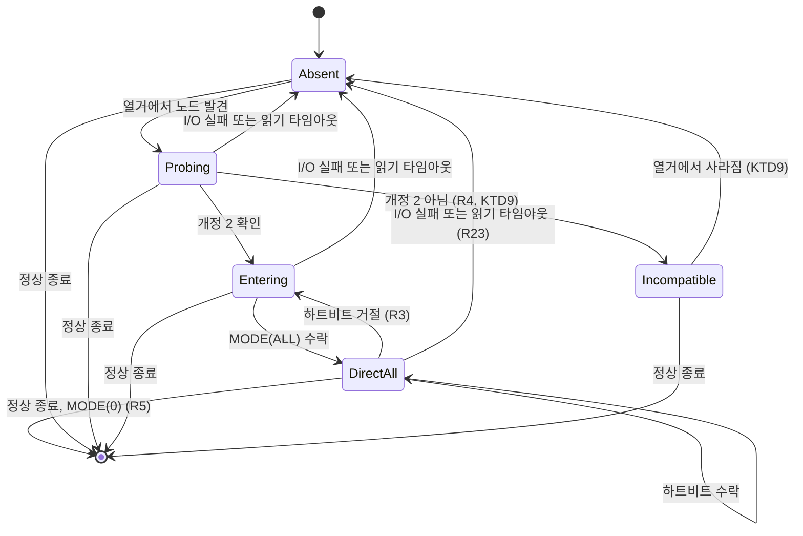
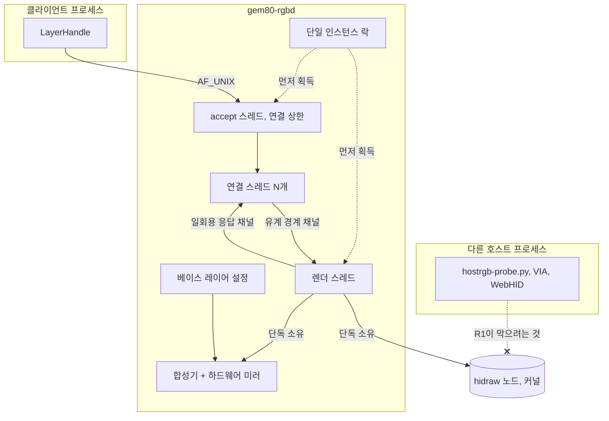

# Gem80 RGB Host Daemon - Plan

## Goal Capsule

- **Objective:** 이 기계에서 실행되는 프로그램이 Gem80의 조명을 상태 표시 수단으로 쓸 수 있다. 서로를 모르는 여러 프로그램이 동시에 그렇게 해도 조명은 하나의 일관된 그림으로 보이고, 그중 하나가 죽어도 나머지와 키보드는 멀쩡하다.
- **Means:** 키보드의 HID 장치를 단독으로 소유하는 로컬 데몬을 두고, 클라이언트가 올린 레이어를 데몬이 합성해 101개 LED에 그린다 (KTD7).
- **Product authority:** GitHub 이슈 [hyperlapse122/dotfiles#459](https://github.com/hyperlapse122/dotfiles/issues/459)와 그 코멘트 스레드의 확정 사항, `firmware/nuphy-gem80-hostrgb/dist/verification-log.md`의 하드웨어 관찰 기록. 활성 범위는 데몬 코어 하나다 — fcitx5 인디케이터 구현, 펌웨어 개정 3, 서비스 배포는 활성 범위가 아니다.
- **Execution profile:** U1–U10 전부 에이전트가 완결한다. 실물 키보드가 없어도 전 단위가 검증 가능해야 한다 — 장치 계층은 전송을 추상화해 테스트가 하드웨어 없이 프로토콜을 증명한다 (U3, KTD6).
- **Stop conditions:** 프로토콜 상수가 `firmware/nuphy-gem80-hostrgb/keymap/keymap.c`와 어긋나면 멈춘다. 가짜 전송이 상수만 흉내내고 펌웨어의 **동작** — 보유 리전, 무장된 마감, 거절과 동시에 일어나는 리전 회수 — 을 재현하지 않으면 멈춘다. 상수는 맞는데 동작이 틀린 가짜 전송은 워치독 로직의 오류를 숨긴 채 전 테스트를 통과시킨다. `cargo fmt --check`나 `cargo test`가 실패하면 멈춘다. 확정 결정 중 하나가 동작할 수 없다는 증거가 나오면 멈추고 보고한다.
- **Tail ownership:** 이 계획은 커밋과 PR까지 소유한다.

---

## Product Contract

**Product Contract preservation:** 재구조화 및 명료화, 범위 축소 없음.

- 조인 문장: R3, R4, R9, R17, R18, R21은 리서치가 연 구멍을 닫으려고, R1, R7, R8, R13은 문서 리뷰가 연 구멍을 닫으려고 조였다. R1의 변경이 가장 크다 — 리눅스에 hidraw 배타 잠금이 없으므로 데몬이 집행하는 불변식에서 운영 환경의 전제로 재분류했고, 데몬 자신이 지키는 범위(R22, R23)를 명시했다.
- 새 항목: R22(단일 인스턴스), R23(쓰기 실패 시 미러 무효화), R24(픽셀 거두기). 앞의 둘은 R1과 R9를 달성 가능하게 만드는 조건이고, R24는 희소 갱신만으로는 LED를 아래 레이어에 돌려줄 수 없다는 계약의 구멍을 메운다.
- 새 수용 예시: AE15–AE18.
- 그대로인 것: R2, R5, R6, R10–R12, R14–R16, R19, R20과 모든 A/F ID, AE1–AE14의 의미와 번호.

### Summary

Gem80의 101개 LED 전체를 호스트가 그리는 로컬 데몬을 만든다. 데몬이 HID 장치를 단독으로 소유하고 클라이언트들이 올린 레이어를 z 순서로 합성하며, 클라이언트는 로컬 소켓에 연결해 희소한 픽셀 집합으로 자기 레이어를 갱신한다.

### Problem Frame

펌웨어는 이미 준비되어 있다. 개정 2의 `0x60` raw HID 명령이 실물 장치에서 검증되었고, 호스트는 101개 LED를 개별적으로 칠할 수 있으며 호스트가 침묵하면 워치독이 조명을 사용자가 저장한 이펙트로 되돌린다.

없는 것은 그 능력을 쓸 방법이다. 지금 그 명령을 낼 수 있는 것은 `firmware/nuphy-gem80-hostrgb/hostrgb-probe.py` 하나뿐인데, 그것은 펌웨어를 검증하려고 만든 도구다. hidraw 노드에 직접 쓰고, 한 번에 한 가지 일만 하고, 프로세스가 끝나면 조명도 끝난다.

그리고 그 노드는 한 프로세스만 쓸 수 있다. 개정 2 검증 중에 두 호스트 프로세스가 같은 노드에 붙자 서로의 응답을 받아갔다 — 하트비트를 보낸 쪽이 프로브 응답을 받았다. 그러므로 "입력기가 조명을 쓰고 알림도 조명을 쓴다"는 구도는 두 프로그램이 각자 장치를 여는 방식으로는 성립하지 않는다. 누군가 장치를 대신 소유해야 한다.

### Key Decisions

- **활성 범위를 데몬 코어 하나로 좁힌다** (session-settled: user-directed — fcitx5 인디케이터·펌웨어 개정 3·배포를 함께 묶는 대신: 각각 독립적으로 배달 가능하고, 묶으면 계약 결정과 소비자 결정이 한 문서에서 섞인다). Governs R6, R19.
- **와이어 계약은 넓게, 데몬 구현은 첫 사용처까지** (session-settled: user-directed — 설계된 전부를 v1에 구현하는 대신: blend·opacity·푸시 경로는 그것이 맞게 도는지 보여줄 클라이언트가 없는 동안 검증 부담만 만든다). Governs R17.
- **데몬이 HID 장치의 유일한 호스트 소유자다** (session-settled: user-directed — CLI에 직접 모드를 주는 대신: 같은 hidraw 노드의 두 번째 쓰는 프로세스가 응답을 가로채는 것이 실물에서 관찰되었다). Governs R1, R19, R22.
- **데몬이 장치 부재를 흡수한다** (session-settled: user-directed — 장치가 없을 때 종료하거나 클라이언트에 통지하는 대신: 무선 전환이 흔하고 클라이언트가 그것을 알 이유가 없다). Governs R2, R4.
- **데몬이 정적 베이스 레이어를 렌더하고 온보드 키 이펙트를 대체한다** (session-settled: user-directed — 필요할 때만 KEYS에 진입하는 대신: direct mode가 리전 단위 전부-아니면-전무라 세 키짜리 인디케이터가 나머지를 끄고, 진입·이탈을 반복하면 이펙트가 매번 프레임 0부터 다시 시작한다). Governs R8.
- **데몬이 KEYS와 SIDE 두 리전을 모두 소유한다** (session-settled: user-directed — KEYS만 소유하는 대신: 키가 정적 베이스면 측면만 이펙트로 도는 것이 어긋나 보인다). Governs R6.
- **연결이 레이어의 수명을 정한다** (session-settled: user-directed — 데몬이 연결을 넘어 레이어를 보존하는 대신: 커널이 연결 종료를 알려주므로 죽은 클라이언트가 조명을 붙잡고 있을 수 없다). Governs R13, R16, R21.

<!-- ce-section: work-relationships -->
### How This Work Fits Together

이 계획이 소유하는 것은 데몬 코어 하나다. 아래 구획 나눔은 이슈 #459가 남긴 잔여 작업을 현재 이해대로 정리한 것이고, 확정된 로드맵이 아니다.

- fcitx5 입력 언어 인디케이터 — 이 데몬의 첫 소비자. `Depends on` 이 계획. 어떤 키를 어떤 색으로 칠하는지, 어떤 LED에 앉는지는 그 계획의 결정이다.
- 펌웨어 개정 3: 사용자가 언더키 인디케이터 모드를 켰을 때 KEYS 리전에 그려지는 캡스락·윈락·넘락 표시 억제 — `Can proceed independently of` 이 계획. 플래시 사이클이 필요하고, "호스트 장식이 상태 표시를 덮어도 되는가"라는 제품 결정을 먼저 세워야 한다.
- 사용자 서비스로의 배포 — `Depends on` 이 계획. `mise.toml`의 `cargo fetch` 후크 확장도 여기 속한다. `crates/mxm4-haptic`도 현재 아무것도 설치하지 않으므로(빌드 스크립트와 systemd 유닛이 폐기됨) 이 저장소에는 따를 선례가 없다.
- 푸시 평면(초당 수십 프레임의 애니메이션 클라이언트) — `Still to decide`. 이 계획은 그것을 위한 스키마 자리만 남기고 동작은 남기지 않는다.

### Actors

- A1. 데몬 — HID 장치를 소유하고, 레이어를 합성하고, 소켓을 듣는다.
- A2. 레이어 클라이언트 — 조명으로 무언가를 표시하려는 프로그램. 데몬에 연결해 자기 레이어만 다룬다.
- A3. 운영자 — CLI로 현재 상태를 보고 정적 레이어를 손으로 올린다.
- A4. 펌웨어 — 리전 소유권과 워치독을 집행하고, 자기 상태 표시를 호스트 픽셀 위에 그린다.

### Requirements

**장치 소유권과 생존**

- R1. 데몬은 Gem80의 raw HID 노드에 쓰는 유일한 호스트 프로세스라는 전제 위에서 동작한다. 리눅스는 hidraw에 배타 잠금을 제공하지 않으므로 이것은 데몬이 집행하는 불변식이 아니라 운영 환경의 전제다. 데몬은 자기 쪽을 지킨다 — 다른 인스턴스를 막고(R22), 요청한 것과 다른 서브커맨드의 응답을 받으면 입력 큐를 비우고 하드웨어 미러를 무효화해 복구한다(R23). 이 전제를 따르지 않는 외부 쓰기는 보장 범위 밖이다.
- R2. 데몬은 장치가 연결되어 있지 않아도 정상적으로 기동하고 소켓을 연다.
- R3. 데몬은 direct mode를 보유하는 동안 펌웨어 마감 전에 하트비트를 보내고, 펌웨어가 하트비트를 거절하면 리전을 잃은 것으로 보고 즉시 재진입한다. 진입과 재진입 뒤의 첫 쓰기는 101개 LED 전부를 보낸다.
- R4. 데몬은 연결된 펌웨어가 개정 2 hostrgb 빌드인지 판별하고, 아니면 direct mode를 시도하지 않은 채 그 사실을 관찰 가능하게 남긴다. 프로브를 영구히 멈추는 것은 명시적인 비호환 응답을 받았을 때뿐이다. 응답이 없거나 I/O가 실패하는 경우는 장치가 아직 부팅 중일 수 있으므로 프로브 간격을 상한까지 늘려가며 재시도한다.
- R5. 데몬이 정상 종료하면 direct mode에서 빠져나와 키보드를 저장된 이펙트로 되돌린다.
- R22. 데몬은 한 번에 한 인스턴스만 실행된다. 두 번째 인스턴스는 소켓을 건드리거나 HID 노드를 열기 전에 실패로 종료한다.

**합성**

- R6. 데몬은 KEYS와 SIDE 두 리전을 모두 소유하고 101개 LED 전체의 최종 그림을 결정한다.
- R7. 레이어는 z 순서로 합성되고, 같은 z를 가진 레이어는 등록이 이른 쪽이 아래에 놓인다. 등록 순번은 재연결을 넘어 안정적이지 않으므로, 겹침이 중요한 클라이언트는 서로 다른 z를 골라야 한다.
- R8. 데몬은 설정이 선언한 정적 베이스 레이어를 가장 아래에 렌더한다. 등록된 클라이언트 레이어가 하나도 없어도 키보드는 그 베이스를 보여준다. 설정 파일이 없거나 읽을 수 없으면 데몬은 기동을 멈추지 않고 내장 기본 베이스 색을 쓴다. 그 기본값은 꺼진 색이 아니다.
- R9. 정상 운전에서는 합성 결과에서 직전 프레임과 달라진 LED만 장치로 나간다. 하드웨어 미러가 무효인 동안에는 R3과 R23이 우선한다.
- R10. 수명이 지정된 레이어는 그 시간이 지나면 클라이언트의 추가 동작 없이 사라진다.
- R11. 같은 LED를 두 레이어가 칠하면 위에 있는 레이어의 색이 보인다. v1에서 아래 레이어의 색은 결과에 섞이지 않는다.
- R23. 한 프레임을 이루는 쓰기가 도중에 실패하면 데몬은 하드웨어 미러 전체를 무효로 표시한다. 다음으로 성공하는 쓰기 주기가 101개 LED 전부를 다시 보낸다.

**클라이언트 계약**

- R12. 클라이언트는 로컬 소켓 하나로 연결하고, 그 한 연결 위에서 여러 레이어를 동시에 가질 수 있다.
- R13. 연결이 끊기면 그 연결이 등록한 레이어가 모두 사라진다. 데몬은 이것을 오류가 아니라 정상적인 레이어 제거로 처리한다. 이 제거는 데몬이 일반 요청을 거절할 만큼 바쁜 순간에도 반드시 도달한다.
- R14. 클라이언트는 바꾸려는 LED만 지정해 레이어를 갱신한다. 세 개를 바꾸려고 101개를 보내지 않는다.
- R24. 클라이언트는 자기 레이어에서 특정 LED를 거둘 수 있다. 거둔 LED는 아래 레이어의 색으로 돌아간다 — 검정을 칠하는 것과 구별된다.
- R15. 클라이언트 라이브러리가 주는 레이어 표현은 사용이 끝나면 스스로 레이어 해제를 보낸다. 클라이언트가 정리를 잊을 수 없다.
- R16. 다시 연결한 클라이언트는 자기 레이어를 다시 등록한다. 데몬은 연결을 넘어 레이어 상태를 기억하지 않는다.
- R17. 와이어 계약은 v1이 구현하지 않는 기능도 표현할 수 있다. 데몬은 구현하지 않은 기능을 요청받거나 존재하지 않는 레이어·범위 밖 LED를 가리키는 요청을 받으면 거절로 답하고 연결은 유지한다.
- R18. 프레이밍이나 역직렬화가 깨진 메시지를 보낸 클라이언트는 그 연결만 끊긴다. 다른 클라이언트와 조명은 영향을 받지 않는다.

**운영자 도구**

- R19. CLI는 데몬을 통해서만 동작하고 하드웨어에 직접 접근하지 않는다.
- R20. CLI로 현재 등록된 레이어, 합성 결과 프레임, 장치 연결 상태를 볼 수 있다. 장치가 호환되지 않는 펌웨어를 싣고 있으면 그 사실이 상태에 나타난다.
- R21. CLI로 정적 레이어를 올릴 수 있다. 그 명령은 전면에서 연결을 붙잡고 있고, 중단하면 레이어가 사라진다.

### Key Flows

- F1. 상태 표시 레이어의 일생
  - **Trigger:** 클라이언트가 조명으로 표시할 상태를 갖게 된다.
  - **Actors:** A2, A1
  - **Steps:** 클라이언트가 연결하고 레이어를 등록한다 → 초기 상태에 해당하는 픽셀을 보낸다 → 상태가 바뀔 때마다 바뀐 픽셀만 다시 보낸다 → 종료하며 레이어를 해제하거나 그냥 연결을 끊는다.
  - **Outcome:** 레이어가 있는 동안 그 픽셀이 베이스 위에 보이고, 없어지면 아래 레이어가 드러난다.
  - **Covers R12, R13, R14, R15.**

- F2. 장치가 사라졌다 돌아온다
  - **Trigger:** 사용자가 키보드를 무선으로 전환하거나 케이블을 뽑는다.
  - **Actors:** A1, A4
  - **Steps:** 데몬이 장치를 잃는다 → 소켓과 합성은 그대로 돌아간다 → 장치가 다시 나타나면 데몬이 펌웨어를 판별하고 두 리전에 재진입한다 → 현재 합성 결과를 101개 LED 전부로 그린다.
  - **Outcome:** 클라이언트는 아무것도 하지 않았고 조명은 끊긴 지점의 그림으로 돌아온다.
  - **Covers R2, R3, R4.**

- F3. 데몬이 예기치 않게 죽는다
  - **Trigger:** 데몬 프로세스가 비정상 종료한다.
  - **Actors:** A4
  - **Steps:** 하트비트가 멈춘다 → 펌웨어 마감이 지난다 → 펌웨어가 두 리전을 회수한다.
  - **Outcome:** 키보드가 사용자가 저장해둔 이펙트로 돌아간다. 조명이 마지막 프레임에 갇히지 않는다.
  - **Covers R3, R5.**

### Acceptance Examples

- AE1. **Covers R8.** 데몬만 실행하고 클라이언트를 하나도 붙이지 않았을 때, 키보드는 설정이 선언한 베이스 색을 보여준다. 꺼져 있지 않다.
- AE2. **Covers R13.** 레이어를 올린 클라이언트를 `SIGKILL`로 죽이면, 그 레이어가 칠하던 LED가 아래 레이어의 색으로 돌아간다.
- AE3. **Covers R3.** direct mode 보유 중에 펌웨어가 하트비트를 거절하면, 데몬이 리전에 재진입하고 101개 LED 전부를 다시 보낸다. 차등 갱신으로 0개를 보내고 끝내지 않는다.
- AE4. **Covers R2.** 키보드를 연결하지 않은 채 데몬을 기동해도 클라이언트가 연결하고 레이어를 등록할 수 있다.
- AE5. **Covers R2, R3, R4.** 키보드를 무선으로 전환했다가 유선으로 되돌리면, 클라이언트가 아무 동작도 하지 않은 채 조명이 현재 합성 결과로 복귀한다.
- AE6. **Covers R17.** v1이 구현하지 않은 기능을 요청하면 클라이언트가 거절을 받고 연결은 살아 있다. 요청이 조용히 무시되어 성공으로 보이지 않는다.
- AE7. **Covers R18.** 한 클라이언트가 프레이밍이 깨진 메시지를 보내면 그 연결만 끊기고, 다른 클라이언트의 레이어는 화면에 그대로 남는다.
- AE8. **Covers R9.** 미러가 유효한 상태에서 한 LED만 바꾸는 갱신이 101개 LED 전체를 다시 쓰지 않는다.
- AE9. **Covers R5.** 데몬을 정상 종료시키면 키보드가 저장된 이펙트로 돌아간다. 워치독 마감을 기다리지 않는다.
- AE10. **Covers R10.** 수명을 지정한 레이어는 클라이언트가 연결을 유지한 채 아무것도 하지 않아도 그 시간이 지나면 사라진다.
- AE11. **Covers R10, R17.** 만료된 레이어에 갱신이 도착하면 클라이언트는 거절을 받는다. 연결이 끊기지 않고, 그 클라이언트의 다른 레이어도 살아남는다.
- AE12. **Covers R22.** 데몬이 이미 실행 중일 때 두 번째 인스턴스를 띄우면, 그것은 실패로 종료하고 기존 소켓과 조명은 그대로다.
- AE13. **Covers R23.** 프레임을 이루는 패킷 중 하나가 실패하면, 다음 성공하는 쓰기 주기가 101개 LED 전부를 보낸다.
- AE14. **Covers R4, R20.** 개정 2가 아닌 펌웨어를 문 장치가 붙으면 데몬은 direct mode를 시도하지 않고, CLI 상태가 호환되지 않는 펌웨어임을 보여준다.
- AE15. **Covers R3, R9.** 장치가 붙자마자 프로브에 답하지 않으면 데몬은 그것을 호환되지 않는 펌웨어로 단정하지 않는다. 간격을 늘려가며 다시 묻고, 장치가 답하기 시작하면 정상 경로로 들어간다.
- AE16. **Covers R13.** 경계 채널이 일반 요청으로 가득 찬 순간에 클라이언트가 연결을 끊어도 그 레이어가 사라진다.
- AE17. **Covers R24.** 레이어가 칠하던 LED를 거두면 아래 레이어의 색이 드러난다. 같은 LED에 검정을 칠했을 때는 검정이 보인다.
- AE18. **Covers R8.** 설정 파일이 없는 상태로 데몬을 처음 띄워도 기동에 성공하고 키보드가 내장 기본 베이스 색을 보여준다.

### Success Criteria

- 실물 키보드 없이 `cargo test`만으로 프로토콜 동작 전부가 증명된다. 장치 계층은 테스트가 가짜 전송을 끼울 수 있는 형태여야 한다.
- fcitx5 인디케이터를 만드는 사람이 이 크레이트의 클라이언트 API만 읽고 시작할 수 있다. 와이어 형식이나 `0x60` 프로토콜을 알 필요가 없다.

### Scope Boundaries

`hostrgb-probe.py`의 존치만 진짜 비목표다. 나머지는 계획된 후속 작업이다.

#### Deferred to Follow-Up Work

- fcitx5 입력 언어 인디케이터의 구현. 이 계획은 그 클라이언트가 필요로 하는 계약만 만든다.
- 푸시 평면 — 초당 수십 프레임을 밀어 넣는 애니메이션 클라이언트와 그에 딸린 프레임 폐기 정책. 계약에는 자리가 있고 데몬에는 동작이 없다.
- 합성 방식 선택(blend mode)과 레이어 투명도. 같은 이유로 계약에만 존재한다. 이것이 구현될 때 색은 선형 광량 공간에서 섞여야 한다 — sRGB 값을 그대로 더하면 겹친 레이어가 탁해진다. v1은 겹침을 덮어쓰기로 처리하므로(R11) 이 제약이 아직 적용되지 않는다.
- 펌웨어 개정 3 — KEYS 리전의 캡스락·윈락·넘락 표시 억제.
- 서비스 유닛, chezmoi 배치, `mise.toml` 후크 확장. CI 등록(U1)은 이 범위에 들어간다 — 크레이트가 검증되지 않은 채 머무는 것을 막기 때문이다.

#### 비목표

- `firmware/nuphy-gem80-hostrgb/hostrgb-probe.py`의 은퇴. 그 도구는 펌웨어 검증과 부트스트랩 용도로 남는다. 데몬이 실행 중일 때 그것을 쓰면 R1을 깨뜨린다는 사실은 U10이 문서로 남긴다.

### Dependencies / Assumptions

- 데몬은 `firmware/nuphy-gem80-hostrgb`의 개정 2 펌웨어가 플래시된 장치를 전제한다. 그 프로토콜의 모든 동작은 실물에서 관찰되었다.
- 기본 설정의 캡스락 표시는 KEYS를 건드리지 않고 SIDE 체인에만 그려지며, 호스트가 SIDE를 잡고 있으면 양보한다 (`firmware/nuphy-gem80-hostrgb/dist/verification-log.md:165, 282`). KEYS 침범은 사용자가 언더키 인디케이터 모드를 켰을 때만 생긴다 — 그 설정은 키보드가 기억하고 윈락·넘락도 같은 경로를 쓴다. 켜져 있으면 펌웨어가 호스트 픽셀 위에 덧칠하고 호스트는 그 일이 일어났는지 알 수 없다. v1은 이것을 고치지 않고 안고 간다.
- 무선(블루투스·2.4G) 연결에는 QMK raw HID 엔드포인트가 없다. 저하가 아니라 부재이고, 그래서 데몬의 대응은 재시도가 아니라 대기다. 케이블이 꽂힌 채 무선으로 전환했을 때 USB 노드가 사라지는지는 관찰되지 않았다.
- SIDE 리전에서 배터리·충전 표시가 호스트 픽셀을 덮어쓰는 경로는 코드로 확인되었을 뿐 하드웨어에서 관찰된 적이 없다 — 그 상태를 만들 기회가 없었기 때문이지, 일어나지 않기 때문이 아니다. 사용자가 무선으로 쓴 뒤 유선으로 충전하면 그 경로가 열리므로 잔여 위험으로 남는다.
- 사용자가 키보드의 RGB 효과 전환 키를 누르면 펌웨어의 매트릭스 모드가 `host_direct`에서 벗어난다. 리전 보유와 하트비트는 그대로여서 호스트는 조명이 사라진 것을 감지할 수 없다 — 모드는 KEYS 미보유→보유 간선에서만 설정되기 때문이다 (`firmware/nuphy-gem80-hostrgb/keymap/keymap.c:59-62`). 복구는 direct mode를 나갔다 다시 들어가는 것뿐이고 v1은 이를 자동화하지 않는다.
- 데몬은 로그인 세션 하나, 사용자 한 명, 키보드 한 대를 전제한다.
- 레이어 수명은 장치가 없는 동안에도 흐른다. 3초짜리 알림 레이어를 올린 뒤 5초 후에 키보드를 꽂으면 그 레이어는 이미 사라져 있다. 이것이 기본 동작이다 — 지나간 이벤트를 뒤늦게 보여주는 것보다 낫다.
- 이 저장소에 배포된 Rust 바이너리가 없다. `crates/mxm4-haptic`을 빌드·설치하던 스크립트와 systemd 유닛은 폐기되어(`.chezmoiscripts/60-build/`, `dot_config/systemd/user/`에 없음) 크레이트는 CI에서만 검증되는 소스 트리다. 이 데몬도 같은 상태로 착지한다.
- `protox` 0.9.1이 `prost` ^0.14를 요구하므로 `prost-build` 0.14.4와 함께 쓸 수 있다. `protoc` 바이너리는 필요하지 않다.

---

## Planning Contract

### Key Technical Decisions

- KTD1. **모든 장치 쓰기는 에코 읽기와 짝지어 요청-응답으로 다룬다.** 펌웨어는 네 서브커맨드 전부에 32바이트 응답을 보내므로(`firmware/nuphy-gem80-hostrgb/keymap/keymap.c:91-174`), 읽지 않으면 HID 입력 큐가 차서 이후 프로브·하트비트 응답이 어긋난다. 거절 비트도 이 응답에서만 보인다. Governs R3, R9, R23.
- KTD2. **v1은 `REGION_ALL`만 요청하고, 어느 쪽이든 잃으면 전체를 잃은 것으로 다룬다.** 펌웨어 워치독 타이머는 리전별이 아니라 전역이라(`keymap.c:43-85`) 소프트웨어에서만 리전을 독립적으로 추적하면 상태가 갈라진다. Governs R3, R6.
- KTD3. **direct mode 진입·재진입과 쓰기 실패는 하드웨어 미러를 무효화한다.** 무효 상태에서 다음 쓰기 주기는 101개 LED 전부를 보낸다. 근거는 재연결 경로다 — MCU가 초기화되면 `hostrgb_buf`가 0이 되므로 차등 계산이 0개를 내놓으면 키보드가 어두운 채로 남는다. 워치독 회수만 일어난 경우에는 이 전송이 엄밀히 필요하지는 않다: `hostrgb_leave_direct()`는 리전과 마감만 지우고 픽셀 버퍼를 보존하며(`firmware/nuphy-gem80-hostrgb/keymap/keymap.c:69-74`) `host_direct` 효과가 그 버퍼를 그대로 읽으므로(`firmware/nuphy-gem80-hostrgb/keymap/rgb_matrix_user.inc:49-57`) 재진입만으로 직전 그림이 돌아온다. 두 경로를 한 규칙으로 덮는 보수적 선택이다. Governs R3, R9, R23.
- KTD4. **단일 인스턴스는 `$XDG_RUNTIME_DIR`의 잠금 파일에 대한 비차단 권고 락으로 강제한다.** 소켓 바인딩 자체를 락으로 쓰는 대신 별도 잠금 파일을 두는 이유는 R22가 소켓을 건드리기 **전에** 실패하라고 요구하기 때문이다 — 스테일 소켓 정리와 단일 인스턴스 판정이 한 동작에 섞이면 그 순서를 지킬 수 없다. 선례인 `crates/mxm4-haptic/src/lib.rs:186-192`는 기존 소켓을 지우고 바인딩하므로 두 데몬이 같은 노드를 여는 것을 막지 못한다. Governs R1, R22.
- KTD5. **제어면은 protobuf로 정의하고, 코드 생성은 `protox` + `prost-build`로 한다** (session-settled: user-directed — 제어면까지 손수 만든 고정 레이아웃이나 `serde`+`postcard`로 인코딩하는 대신: `.proto`가 와이어 계약의 단일 정의가 되고 `protoc-gen-buf-breaking`이 파괴적 변경을 검사하며, 나중에 Rust가 아닌 클라이언트가 붙을 때 프로토콜을 재협상하지 않는다). 대가는 직접 의존성 셋과 `build.rs`다. `prost-build`는 v0.11부터 외부 `protoc` 바이너리를 요구하므로, 순수 Rust 파서인 `protox`가 파일 서술자를 만들어 넘긴다. 픽셀 프레임은 protobuf를 거치지 않는 고정 바이트 레이아웃이다 — 프레임마다 varint 디코드와 할당이 붙기 때문이다. Governs R14, R17.
- KTD6. **`hidapi`는 옵셔널 의존성으로 두고 데몬 바이너리만 켜는 피처 뒤에 둔다.** `crates/mxm4-haptic`은 이것을 크레이트 전역 의존성으로 두고 클라이언트 바이너리가 쓰지 않을 뿐이라, 라이브러리를 링크하는 모든 소비자가 `libudev`를 끌어온다. 이 크레이트의 라이브러리는 fcitx5 인디케이터가 의존할 대상이므로 실제로 격리한다. Governs R19.
- KTD7. **스레드-퍼-커넥션과 단일 렌더 스레드를 경계 채널로 잇는다** (session-settled: user-directed — `tokio` 도입 대신: 렌더 루프와 HID 출력은 어차피 전용 동기 스레드여야 하고 소켓 쪽 부하가 작다). 렌더 스레드가 HID 장치의 유일한 소유자이고 소켓 I/O에서 절대 블록하지 않는다. 선례는 `crates/mxm4-haptic/src/bin/logid.rs:332-364`. 이 경계는 네 가지 불변식을 함께 지켜야 성립한다 — 하나라도 빠지면 렌더 스레드의 정지가 클라이언트 계약 전체(R10, R13, R17, R20)를 함께 세운다. Governs R1, R7, R12.
  - 모든 장치 읽기에 타임아웃이 있다. 타임아웃은 I/O 실패로 다루어 상태를 `Absent`로 내리고 미러를 무효화한다 (KTD3, R23). 선례는 `crates/mxm4-haptic/src/bin/logid.rs:287`의 `read_timeout`.
  - 장치 탐색은 tick마다의 비차단 열거다. 장치를 찾을 때까지 도는 블로킹 루프가 아니다 — 그 형태를 쓰면 장치가 없는 동안 tick이 돌지 않아 R2와 AE4가 깨진다.
  - 경계 채널은 유계이고 용량이 상수로 적혀 있다. 렌더 스레드의 응답 송신은 절대 블록하지 않는다. 연결 정리에는 예약 용량이 있어, 일반 요청이 포화로 거절되는 순간에도 정리는 렌더 스레드에 도달한다 (R13).
  - 연결 스레드의 응답 수신에 타임아웃이 있다. 만료는 연결 종료가 아니라 구조화된 오류다 (KTD8).
  - 푸시 평면이 범위에 들어오면 이 경계를 다시 본다. 초당 수십 프레임이면 장치 쓰기가 tick을 거의 채워 요청이 항상 쓰기 뒤에 줄을 서므로, 그때는 상태 스레드와 장치 스레드의 분리가 필요해진다.
- KTD8. **오류는 두 층으로 나눈다.** 프레이밍·역직렬화 실패만 연결을 끊고, 구문이 올바른 요청의 의미 오류는 구조화된 거절로 답한다. 만료된 레이어에 갱신이 도착하는 것은 정상적인 경쟁 상태이므로, 그것으로 연결을 끊으면 R13이 그 클라이언트의 다른 레이어까지 함께 지운다. Governs R17, R18.
- KTD9. **호환되지 않는 펌웨어를 만나면 HID 노드를 닫고 장치가 다시 나타날 때까지 침묵한다.** 프로브를 반복하면 VIA·WebHID 도구가 쓰는 같은 엔드포인트를 어지럽힌다. 여기서 "다시 나타난다"는 장치 **열거**로만 판정한다 — 노드를 열어 프로브하는 것이 바로 이 결정이 금지하는 행위다. 열거는 계속 돌고 프로브는 멈춘다. Governs R4, R20.
- KTD10. **의존성은 정확 핀으로 고정하고 락파일을 커밋한다:** `hidapi` `=2.6.7`, `prost` `=0.14.4`, `prost-build` `=0.14.4`, `protox` `=0.9.1`. 모두 1주 쿨다운을 넘긴 최신 버전이다. 정확 핀은 락파일을 대체하지 않는다 — 전이 의존성은 핀되지 않으므로 `crates/gem80-rgb/Cargo.lock`을 커밋한다 (`crates/mxm4-haptic/Cargo.lock`과 같다). `crates/mxm4-haptic`이 `hidapi` `=2.6.6`에 머무는 것은 이 계획의 범위가 아니다. Governs R1.
- KTD11. **독립 크레이트를 유지하고 `crates/`에 Cargo 워크스페이스를 만들지 않는다** (워크스페이스로 두 크레이트를 묶는 대신: Cargo가 워크스페이스 멤버의 `[profile.*]`를 무시하므로 `crates/mxm4-haptic/Cargo.toml:59-69`의 릴리스 프로파일이 그 크레이트 파일을 한 줄도 바꾸지 않은 채 조용히 죽고, 프로파일이 루트 하나뿐이라 이 데몬이 `panic = "abort"`를 빼는 것도 불가능해진다). 공유 락파일의 이점은 KTD10이 모든 직접 의존성을 정확 핀으로 두므로 해소할 범위가 없어 실재하지 않는다. fcitx5 인디케이터가 별도 크레이트로 착지하고 이 크레이트를 `path`로 참조하기로 확정되면 그때 워크스페이스를 다시 본다. Governs R1.
- KTD12. **타이밍은 불변식으로 고정한다: `F_budget + T + jitter < D/2`.** `F_budget`은 전체 재도색 예산, `T`는 합성 tick 주기, `D`는 펌웨어 마감이다. KTD1의 요청-응답 규율 때문에 101 LED 전체 재도색은 12회 왕복이고, 1 kHz 엔드포인트에서 전송 바닥이 낙관적으로 12 ms, OUT과 IN이 각각 폴 슬롯을 쓰면 24 ms다. 이 불변식이 깨지면 재도색이 자기 하트비트 마감을 넘겨 워치독을 밟고, 그 워치독이 또 전체 재도색을 부르는 고리가 열린다. `F_budget`은 전체 재도색만이 아니라 **최악의 희소 갱신**도 담아야 한다 — 서로 떨어진 51개 LED가 바뀌면 패킷당 9개를 채울 수 없어 51회 왕복이 되고, 이는 전체 재도색보다 비싸다. 예산은 명령별 쓰기·읽기 타임아웃 상한에서 유도하고, 그 상한을 넘는 지연은 `Absent` 전이와 미러 무효화로 끝난다. Governs R3, R9, R23.

### High-Level Technical Design

장치 상태 기계. 렌더 스레드가 이것을 소유하고, 다른 스레드는 여기에 들어오지 않는다.

`Entering`으로 들어가는 모든 간선이 하드웨어 미러를 무효로 만든다 (KTD3). `Absent`와 `Incompatible`에서도 소켓 서버와 합성기는 계속 돈다 (R2). `Incompatible`을 빠져나오는 길은 열거뿐이다 — 그 상태에서 프로브는 나가지 않는다 (KTD9). `MODE(0)`이 필요한 종료 경로는 `DirectAll` 하나이고 (R5), 나머지 상태의 종료는 소켓과 락만 정리한다.

프로세스 안의 소유권 경계.

### Risks & Dependencies

- **렌더 스레드가 멈추면 클라이언트 계약 전체가 멈춘다.** R10의 수명 만료, R13의 연결 종료 정리, R17의 거절, R20의 상태 조회가 모두 렌더 스레드를 통과한다. 연결 스레드가 혼자 판정하는 것은 R18의 프레이밍 오류뿐이다. *완화:* KTD7의 네 불변식. 특히 장치 읽기 타임아웃이 없으면 프레임 중간의 케이블 분리가 렌더 스레드를 영구히 세운다.
- **재도색이 자기 워치독을 밟는 고리.** 전체 재도색 중에 하트비트 마감이 지나면 펌웨어가 리전을 회수하고, 그 회수가 다시 전체 재도색을 부른다. *완화:* KTD12의 불변식을 상수 선택에 강제하고, 그 검사를 테스트로 둔다 (U7).
- **요청 지연에 상한이 없다.** 재도색 중 도착한 요청은 다음 drain 지점까지 기다린다. 느리거나 쏟아붓는 클라이언트가 경계 채널을 적체시키면 정상 클라이언트가 갱신·만료·정리 지연을 함께 받는다. *완화:* 연결 수, 메시지 크기, 큐 용량을 상수로 정하고 초과 시 구조화된 오류로 답한다. 재도색 중에도 패킷 사이에서 채널을 비운다 (U7).
- **핀은 전이 의존성을 얼리지 않는다.** 정확 핀(KTD10)은 직접 의존성만 고정하고 컴파일러나 `hidapi`의 플랫폼 백엔드는 고정하지 않는다. *완화:* 락파일을 커밋하고, CI가 클라이언트 표면과 `daemon` 피처 양쪽을 Linux·macOS에서 빌드한다.
- **펌웨어가 나중에 그럴듯하지만 호환되지 않는 응답을 낼 수 있다.** 프로토콜 상수가 펌웨어 소스와 이 크레이트 양쪽에 산다. *완화:* 프로브 호환성 검사를 통과 조건으로 유지하고(R4), 상수 대조를 테스트로 둔다 (U3).
- **펌웨어 오버레이가 호스트 픽셀을 덮는다.** 캡스락·윈락·넘락은 사용자 설정이고 호스트는 덮였는지 알 수 없다. SIDE의 배터리·충전 경로는 코드로만 확인되었다. 이것은 "하나의 일관된 그림"이라는 Objective를 부분적으로 깬다. *완화:* 이 리전들을 펌웨어 소유로 계약에 명시하고 관찰 한계를 문서로 남긴다 (U10). 억제는 펌웨어 개정 3의 일이다.
- **배포가 하류 의존성이다.** 클라이언트 라이브러리는 컴파일되는데 실행 시점에 데몬이 없을 수 있다. 이 저장소에는 현재 배포된 Rust 바이너리가 없다. *완화:* CI 그린을 종단 가용성으로 읽지 않는다. U10이 소스 전용 상태를 명시한다.

### Assumptions

- 합성 tick 주기 `T`는 20 ms, 펌웨어 마감 `D`는 300 ms, 하트비트는 150 ms마다 보낸다. 보수적 `F_budget` 24 ms에 대해 KTD12의 불변식 `24 + 20 + jitter < 150`이 넉넉히 성립한다. 값은 바뀔 수 있고 불변식은 바뀌지 않는다.
- 레이어 수명 만료는 별도 타이머가 아니라 tick마다 한 번 훑는 것으로 처리한다. 따라서 만료 정밀도의 하한은 `T`다.
- 소켓 경로는 `$XDG_RUNTIME_DIR`에서 해석하고, 없으면 `$TMPDIR`, 그다음 `/tmp`로 내려간다 — `crates/mxm4-haptic/src/lib.rs:63-96`과 같은 방식이다. 소켓 권한은 `0o600`.
- 장치 판별은 `0x60 0x00` 프로브 응답의 프로토콜 개정과 LED 수로 한다. `bcdDevice`와 VIA 프로토콜 버전도 움직이지만, 프로브 응답이 실제로 쓸 능력을 직접 말해 주므로 그쪽이 낫다.
- 베이스 레이어 설정은 TOML 파일 하나로 선언하고, 데몬 기동 시 읽는다. 실행 중 재적용은 v1에 없다 — 설정을 바꾸면 데몬을 다시 띄운다. 재적용이 필요해지면 그때 신호나 CLI 명령으로 붙인다.
- 동시 연결 수, 메시지 크기, 경계 채널 용량에 각각 상수 상한을 둔다. 스레드-퍼-커넥션은 연결 수에서 먼저 무너지므로(KTD7) 상한 없이는 루프로 연결을 여는 클라이언트가 데몬을 고갈시킨다.

---

## Implementation Units

| U-ID | 요약 | 주요 파일 | 의존 |
| --- | --- | --- | --- |
| U1 | 크레이트 스캐폴딩과 CI 등록 | `crates/gem80-rgb/Cargo.toml`, `.github/workflows/ci.yml` | — |
| U2 | 와이어 계약과 코드 생성 | `crates/gem80-rgb/proto/`, `build.rs`, `src/wire.rs` | U1 |
| U3 | 장치 계층 | `crates/gem80-rgb/src/device/` | U1 |
| U4 | 레이어 모델과 합성기 | `crates/gem80-rgb/src/compositor.rs` | U1 |
| U5 | 설정, 경로, 단일 인스턴스 | `crates/gem80-rgb/src/config.rs`, `paths.rs`, `single_instance.rs` | U1 |
| U6 | 소켓 서버와 연결 수명 | `crates/gem80-rgb/src/server.rs` | U2, U4, U5 |
| U7 | 렌더 스레드와 장치 상태 기계, 데몬 바이너리 | `crates/gem80-rgb/src/render.rs`, `device_state.rs`, `src/bin/gem80-rgbd.rs` | U3, U4, U6 |
| U8 | 클라이언트 API와 레이어 핸들 | `crates/gem80-rgb/src/client.rs` | U2, U5, U6 |
| U9 | 운영자 CLI | `crates/gem80-rgb/src/bin/gem80-rgbctl.rs` | U8 |
| U10 | 문서 | `crates/gem80-rgb/README.md`, `firmware/nuphy-gem80-hostrgb/README.md` | U9 |

### U1. 크레이트 스캐폴딩과 CI 등록

- **Goal:** `crates/gem80-rgb`가 존재하고 CI가 그것을 빌드·테스트·포맷 검사한다.
- **Requirements:** 없음 — 이 단위는 나머지 단위의 토대다.
- **Dependencies:** 없음
- **Files:**
  - `crates/gem80-rgb/Cargo.toml`
  - `crates/gem80-rgb/Cargo.lock`
  - `crates/gem80-rgb/src/lib.rs`
  - `crates/gem80-rgb/src/bin/gem80-rgbd.rs`
  - `crates/gem80-rgb/src/bin/gem80-rgbctl.rs`
  - `.github/workflows/ci.yml`
- **Approach:**
  1. `[lib]` 하나와 `[[bin]]` 둘을 가진 독립 크레이트를 만든다. 워크스페이스 루트는 만들지 않는다 — `crates/`에 워크스페이스가 없고 `mxm4-haptic`도 독립 크레이트다.
  2. `hidapi`를 옵셔널 의존성으로 선언하고 `daemon` 피처가 켠다. `gem80-rgbd`만 그 피처를 요구한다 (KTD6).
  3. 릴리스 프로파일은 `crates/mxm4-haptic/Cargo.toml:59-69`를 따르되 `panic = "abort"`는 **넣지 않는다** — 장기 실행 데몬이 여러 클라이언트의 입력을 파싱하므로 한 핸들러의 패닉이 프로세스를 죽여 조명을 얼리면 안 된다. 이것이 워크스페이스를 쓸 수 없는 이유이기도 하다 (KTD11).
  4. `.github/workflows/ci.yml:296-323`의 `rust-crate` 잡을 크레이트 디렉터리 매트릭스로 확장한다. 두 번째 잡을 추가하지 않는다 — `.ci/test-ci-wiring.sh:241-246`이 모든 잡 id가 `delivery`의 `needs`에 나타나는지 검사하므로 새 잡 id는 `.github/workflows/ci.yml:341-351`의 하드코딩된 목록도 함께 고쳐야 한다. 매트릭스 확장은 잡 id를 바꾸지 않는다.
  5. 매트릭스화할 때 함께 고칠 것: 잡 `name`(`ci.yml:299`), `working-directory`(`ci.yml:308`), `rust-cache`의 `workspaces` 값(`ci.yml:318`) 셋 다 크레이트 경로가 하드코딩되어 있다. 캐시 키를 매트릭스화하지 않으면 두 레그가 서로의 캐시를 덮어쓴다.
  6. 빌드 검사는 기본 피처와 `daemon` 피처 양쪽을 돈다. Cargo는 `required-features`가 충족되지 않은 타깃을 조용히 건너뛰므로, 기본 피처만 빌드하면 `gem80-rgbd`가 한 번도 컴파일되지 않은 채 CI가 그린이 된다.
- **Patterns to follow:** `crates/mxm4-haptic/Cargo.toml:1-69`, `.github/workflows/ci.yml:296-323`
- **Test scenarios:** `Test expectation: none -- 스캐폴딩 단위다. 검증은 CI가 새 크레이트에서 Verification Contract의 명령을 실제로 돌리는 것으로 이뤄진다.`
- **Verification:** CI에서 Verification Contract의 다섯 검사가 모두 통과한다. `repo meta` 잡이 빨갛게 되지 않는다. `cargo tree`에서 기본 피처로는 `hidapi`가 나타나지 않는다.

### U2. 와이어 계약과 코드 생성

- **Goal:** 제어 메시지의 스키마와 픽셀 프레임의 고정 레이아웃이 정의되고, `protoc` 없이 빌드된다.
- **Requirements:** R14, R17
- **Dependencies:** U1
- **Files:**
  - `crates/gem80-rgb/proto/gem80rgb.proto`
  - `crates/gem80-rgb/build.rs`
  - `crates/gem80-rgb/src/wire.rs`
- **Approach:**
  1. `.proto`에 레이어 등록·갱신·해제, 픽셀 거두기(R24), 상태 조회, 응답(성공/거절+사유)을 정의한다. v1이 구현하지 않는 필드(블렌드 모드, 투명도, 푸시 프레임)도 자리를 잡아 둔다 — 계약은 넓고 구현은 좁다는 Key Decision이 여기에 산다.
  1b. 구현자가 임의로 정하면 클라이언트와 데몬이 갈라지는 것들을 이 단위가 고정한다: 길이 접두의 폭과 엔디언, 제어 메시지와 고정 픽셀 프레임을 구분하는 표지, 픽셀 프레임의 바이트 배치, 레이어 ID를 누가 발급하고 어느 연결이 그것을 만질 수 있는지, z·수명의 단위.
  2. `build.rs`가 `protox`로 파일 서술자를 만들고 `prost-build`의 서술자 입력 경로로 넘긴다 (KTD5).
  3. 길이 접두 프레이밍을 `wire.rs`에 둔다. 메시지 크기 상한을 상수로 두고, 상한을 넘는 길이 접두는 즉시 프레이밍 오류다 (R18, KTD8).
  4. 거절 사유를 열거형으로 둔다: 미구현 기능, 존재하지 않는 레이어, 범위 밖 LED 인덱스.
- **Test scenarios:**
  - 길이 접두 프레임을 쓰고 다시 읽으면 같은 메시지가 나온다.
  - 상한을 넘는 길이 접두는 프레이밍 오류를 낸다.
  - 잘린 스트림(접두만 있고 본문이 모자람)은 프레이밍 오류를 낸다.
  - 한 읽기에 두 메시지가 붙어 도착해도 둘 다 순서대로 디코드된다.
  - v1이 구현하지 않는 필드가 채워진 메시지도 디코드에는 성공한다 — 거절은 상위 계층의 일이다.
  - 다른 연결이 발급받은 레이어 ID를 가리키는 메시지가 소유권 검사에서 걸린다.
  - 제어 메시지와 픽셀 프레임이 표지만으로 구별되고, 한쪽을 다른 쪽으로 디코드하려는 시도가 실패한다.
- **Verification:** `cargo build`가 `protoc` 없는 환경에서 성공한다. 위 테스트가 통과한다.

### U3. 장치 계층

- **Goal:** `0x60` 프로토콜을 말할 수 있고, 실물 키보드 없이 그 동작을 증명할 수 있다.
- **Requirements:** R1, R4
- **Dependencies:** U1
- **Files:**
  - `crates/gem80-rgb/src/device/protocol.rs`
  - `crates/gem80-rgb/src/device/transport.rs`
  - `crates/gem80-rgb/src/device/mod.rs`
- **Approach:**
  1. 프로토콜 상수와 패킷 빌더·파서를 전송과 분리한다. 상수의 출처는 `firmware/nuphy-gem80-hostrgb/keymap/keymap.c`이고, `firmware/nuphy-gem80-hostrgb/hostrgb-probe.py`가 같은 것을 이미 인코딩하고 있으므로 대조에 쓴다.
  2. 전송을 트레이트로 두어 테스트가 가짜 전송을 끼울 수 있게 한다. 실제 구현은 `hidapi`이고 `daemon` 피처 뒤에 있다 (KTD6).
  3. 네 명령을 요청-응답으로 구현한다. 모든 쓰기 뒤에 32바이트 응답을 **타임아웃과 함께** 읽고, 명령 바이트와 서브커맨드를 대조한 뒤 거절 비트를 검사한다 (KTD1, KTD7). 타임아웃 없는 읽기 경로를 만들지 않는다.
  4. 장치 탐색은 vendor·product·usage page로 거르는 **비차단 열거**다. 호출자가 tick마다 한 번 부르고, 없으면 그대로 돌아온다.
  5. 프로브 응답이 개정 2가 아니면 호환되지 않는 펌웨어로 분류한다 (R4).
- **Patterns to follow:** `firmware/nuphy-gem80-hostrgb/hostrgb-probe.py`의 패킷 빌더와 응답 검증, `crates/mxm4-haptic/src/bin/logid.rs:287`의 `read_timeout`. `crates/mxm4-haptic/src/bin/logid.rs:366-395`의 `open_hidpp`는 **따르지 않는다** — 장치를 찾을 때까지 2초 간격으로 도는 블로킹 루프이고, 선례의 `main`이 그 함수가 끝난 뒤에야 I/O 루프에 들어가므로(`logid.rs:475-478`) 그 형태는 R2와 AE4를 깬다.
- **Test scenarios:**
  - 프로브 요청의 바이트 레이아웃이 `keymap.c`가 기대하는 것과 일치한다.
  - 프로브 응답에서 개정 2, LED 수 101, 패킷당 9, 측면 시작 인덱스 89를 읽어낸다.
  - 개정 1을 보고하는 응답은 호환되지 않는 펌웨어로 분류된다.
  - 모드 요청이 리전 마스크와 10 ms 단위 마감을 올바르게 싣는다.
  - 서브커맨드에 `0x80`이 선 응답이 거절로 분류된다.
  - 앞선 명령의 응답이 큐에 남아 있어 엉뚱한 서브커맨드가 돌아오면 오류로 분류된다 — 조용히 성공으로 읽지 않는다.
  - 101개 LED 프레임이 정확히 12개 패킷으로 쪼개지고 마지막 패킷이 남은 LED 수만 싣는다.
  - 쓰기 응답을 읽지 않는 경로가 존재하지 않는다(모든 명령 함수가 응답을 반환한다).
  - 응답이 오지 않는 가짜 전송에서 모든 명령이 타임아웃 오류로 끝난다 — 어느 것도 무한히 기다리지 않는다.
  - 장치가 없을 때 탐색이 즉시 돌아온다. 블로킹하지 않는다.
  - 프로토콜 상수가 `firmware/nuphy-gem80-hostrgb/keymap/keymap.c`의 값과 일치한다.
- **Verification:** 위 테스트가 가짜 전송으로 전부 통과한다. 실물 장치가 없어도 `cargo test`가 완주한다.

### U4. 레이어 모델과 합성기

- **Goal:** 레이어들이 하나의 101 LED 그림으로 합쳐지고, 어떤 LED가 달라졌는지 알 수 있다.
- **Requirements:** R6, R7, R8, R9, R10, R11, R24
- **Dependencies:** U1
- **Files:**
  - `crates/gem80-rgb/src/compositor.rs`
- **Approach:**
  1. 레이어는 소유 연결, z 값, 등록 순번, 선택적 수명, 희소 픽셀 맵을 가진다.
  2. 합성은 z 오름차순으로 훑으며 덮어쓴다 (R11). 동률은 등록 순번으로 깬다 (R7).
  3. 베이스 레이어는 z 최하단의 데몬 소유 레이어로 같은 구조를 쓴다 — 특수 경로를 만들지 않는다 (R8).
  4. 하드웨어 미러를 합성기가 들고 있고, 무효 표시를 받으면 다음 차등 계산이 101개 전부를 내놓는다 (KTD3).
  5. 수명 만료는 tick마다 한 번 훑는다.
- **Test scenarios:**
  - 레이어가 하나도 없으면 결과가 베이스 레이어와 같다. Covers AE1.
  - 위 레이어가 같은 LED를 칠하면 그 색이 이긴다.
  - 같은 z를 가진 두 레이어는 등록이 늦은 쪽이 이긴다.
  - 레이어를 제거하면 그 LED가 아래 레이어의 색으로 돌아간다. Covers AE2.
  - 레이어에서 한 LED만 거두면 그 LED가 아래 레이어의 색으로 돌아가고, 검정을 칠한 경우와 결과가 다르다. Covers AE17.
  - 한 LED만 바뀐 갱신 뒤의 차등 결과가 정확히 1개다. Covers AE8.
  - 미러를 무효화한 뒤의 차등 결과가 101개다. Covers AE3, AE13.
  - 수명이 지난 레이어는 tick에서 사라진다. Covers AE10.
  - 수명이 남은 레이어는 tick에서 살아남는다.
- **Verification:** 위 테스트가 통과한다. 합성기는 HID나 소켓을 전혀 알지 못한다.

### U5. 설정, 경로, 단일 인스턴스

- **Goal:** 데몬이 자기 소켓 경로와 베이스 레이어를 알고, 한 번에 하나만 뜬다.
- **Requirements:** R2, R8, R22
- **Dependencies:** U1
- **Files:**
  - `crates/gem80-rgb/src/config.rs`
  - `crates/gem80-rgb/src/paths.rs`
  - `crates/gem80-rgb/src/single_instance.rs`
- **Approach:**
  1. 런타임 디렉터리 해석은 `crates/mxm4-haptic/src/lib.rs:63-96`과 같은 순서를 따른다.
  2. 소켓 파일명과 설정 파일 경로를 이 단위가 확정한다. 클라이언트 라이브러리(U8)와 CLI(U9)가 같은 값을 쓰므로 여기 한 곳에만 존재해야 한다.
  3. 베이스 레이어 TOML을 읽어 합성기가 쓰는 레이어로 바꾼다. 파일이 없거나 파싱에 실패하면 내장 기본값을 쓰고 기동을 계속한다 (R8).
  4. 잠금 파일에 비차단 권고 락을 건다. 실패하면 소켓과 HID를 건드리기 전에 오류로 종료한다 (KTD4).
  5. 락을 얻은 **뒤에만** 남아 있는 소켓 파일을 확인하고 제거한 다음 bind한다. 순서가 뒤집히면 두 번째 인스턴스가 첫 번째의 소켓을 지운다 — 선례(`crates/mxm4-haptic/src/lib.rs:186-192`)가 정확히 그렇게 한다.
- **Patterns to follow:** `crates/mxm4-haptic/src/lib.rs:63-96`
- **Test scenarios:**
  - `$XDG_RUNTIME_DIR`가 있을 때와 없을 때의 소켓 경로 해석. 환경 변수를 만지는 테스트는 `crates/mxm4-haptic/src/lib.rs:520-612`처럼 프로세스 전역 뮤텍스로 감싼다.
  - 락을 이미 쥔 상태에서 두 번째 획득이 실패한다. Covers AE12.
  - 락을 쥔 프로세스가 사라지면 락이 풀린다.
  - 설정 파일이 없을 때 내장 기본 베이스 레이어가 나오고 기동이 계속된다.
  - 잘못된 TOML도 기동을 막지 않는다 — 내장 기본값으로 떨어지고 무엇이 잘못됐는지 관찰 가능하게 남는다.
  - 첫 데몬을 강제 종료해 소켓 파일이 남은 상태에서 두 번째 데몬이 같은 경로로 정상 기동한다.
  - 첫 데몬이 살아 있는 동안 두 번째 데몬은 그 소켓 파일을 지우지 않는다.
- **Verification:** 위 테스트가 통과한다. 두 번째 인스턴스가 첫 번째의 소켓 파일을 지우지 않는다.

### U6. 소켓 서버와 연결 수명

- **Goal:** 클라이언트가 연결해 레이어를 다루고, 연결이 끝나면 그 레이어가 사라진다.
- **Requirements:** R12, R13, R17, R18
- **Dependencies:** U2, U4, U5
- **Files:**
  - `crates/gem80-rgb/src/server.rs`
- **Approach:**
  1. accept 루프가 연결마다 스레드를 띄운다. 동시 연결 수 상한을 넘으면 새 연결을 거절한다 (KTD7).
  2. 연결 스레드는 프레임을 읽어 명령으로 바꾸고 경계 채널로 렌더 스레드에 넘긴다. 응답이 필요한 요청은 일회용 채널로 답을 받아 되돌려 준다.
  3. 오류를 두 층으로 나눈다 (KTD8): 프레이밍·역직렬화 실패는 연결을 닫고, 의미 오류는 거절 응답을 보내고 연결을 유지한다.
  4. 연결이 끝나면 — 정상이든 아니든 — 그 연결이 등록한 레이어를 전부 제거한다. 예기치 않은 종료도 오류가 아니라 정상 제거다 (R13).
  5. 소켓 파일 권한을 `0o600`으로 두고, 서버가 사라질 때 언링크한다.
- **Patterns to follow:** `crates/mxm4-haptic/src/lib.rs:168-237`의 `IpcServer` 바인딩·권한·`Drop` 정리, `crates/mxm4-haptic/src/bin/logid.rs:407-476`의 accept 스레드와 일회용 응답 채널
- **Test scenarios:**
  - 연결해서 레이어를 등록하면 합성 결과에 그 픽셀이 나타난다.
  - 연결을 끊으면 그 연결의 레이어가 전부 사라진다. Covers AE2.
  - 한 연결이 여러 레이어를 가질 수 있고, 하나를 해제해도 나머지는 남는다.
  - 프레이밍이 깨진 메시지를 보낸 연결만 닫히고 다른 연결의 레이어는 남는다. Covers AE7.
  - v1이 구현하지 않는 기능을 요청하면 거절이 돌아오고 연결은 열려 있다. Covers AE6.
  - 만료된 레이어 ID에 갱신을 보내면 거절이 돌아오고, 연결도 같은 클라이언트의 다른 레이어도 살아남는다. Covers AE11.
  - 범위 밖 LED 인덱스는 거절이지 연결 종료가 아니다.
  - 소켓 파일 권한이 `0o600`이고 서버가 사라지면 언링크된다.
  - 연결 상한에 도달하면 새 연결이 거절되고 기존 연결은 영향받지 않는다.
  - 경계 채널이 가득 차면 요청이 구조화된 오류로 거절되고 연결은 유지된다.
  - 렌더 스레드가 답하지 않으면 연결 스레드의 응답 대기가 타임아웃으로 끝난다 — 영원히 기다리지 않고, 그것으로 연결을 끊지도 않는다.
  - 경계 채널을 일반 요청으로 가득 채운 상태에서 연결을 끊으면 그 레이어가 사라진다. 정리가 포화에 밀려 유실되지 않는다. Covers AE16.
- **Verification:** 위 테스트가 임시 디렉터리의 실제 소켓으로 통과한다.

### U7. 렌더 스레드와 장치 상태 기계

- **Goal:** 합성 결과가 실제로 키보드에 그려지고, 장치가 오가거나 워치독이 리전을 회수해도 복구된다.
- **Requirements:** R1, R2, R3, R4, R5, R9, R23
- **Dependencies:** U3, U4, U6
- **Files:**
  - `crates/gem80-rgb/src/render.rs`
  - `crates/gem80-rgb/src/device_state.rs`
  - `crates/gem80-rgb/src/bin/gem80-rgbd.rs`
- **Approach:**
  1. 렌더 스레드가 장치의 유일한 소유자다. 고정 주기로 tick을 돌며 경계 채널의 명령을 비우고, 수명을 훑고, 차등을 계산해 쓴다 (KTD7). 전체 재도색처럼 여러 패킷이 나가는 쓰기에서는 **패킷 사이에서도 채널을 비운다** — 그러지 않으면 12회 왕복이 그대로 요청 지연에 더해진다.
  2. 상태 기계는 High-Level Technical Design의 다섯 상태를 그대로 구현한다. `Absent`와 `Incompatible`에서도 합성은 계속 돈다 (R2).
  3. 진입·재진입 간선마다 하드웨어 미러를 무효화한다 (KTD3). 재진입은 항상 `REGION_ALL`이다 (KTD2).
  4. 하트비트는 마감의 절반 주기로 보낸다. 거절이 돌아오면 리전을 잃은 것으로 보고 재진입한다 (R3).
  5. 프레임 쓰기 도중 실패하면 미러 전체를 무효로 표시하고 상태를 `Absent`로 내린다 (R23).
  6. 이 단위가 데몬 바이너리를 소유한다. `main()`이 락(U5), 설정(U5), 소켓 서버(U6), 렌더 스레드를 이 순서로 조립한다.
  7. `SIGTERM`과 `SIGINT`를 받아 렌더 스레드에 종료를 알리고, `MODE(0)`이 실제로 나간 뒤에 프로세스를 끝낸다 (R5). 신호를 처리하지 않으면 프로세스가 즉시 죽어 복원이 실행되지 않고 AE9가 워치독에 의존하게 된다.
  7. 호환되지 않는 펌웨어에서는 HID 노드를 닫고 장치 재등장까지 프로브하지 않는다 (KTD9).
- **Patterns to follow:** `crates/mxm4-haptic/src/bin/logid.rs:265-364`의 I/O 루프와 채널 배수
- **Test scenarios:**
  - 가짜 전송으로 장치 없음 → 등장 → 프로브 → 진입 → 전체 프레임 전송 순서가 일어난다. Covers AE5.
  - 하트비트 거절이 돌아오면 재진입이 일어나고 뒤이어 101개 LED가 전송된다. Covers AE3.
  - 재진입 없이 정상 tick이 이어질 때는 바뀐 LED만 전송된다. Covers AE8.
  - 프레임 중간 패킷이 실패하면 다음 성공 주기에 101개가 전송된다. Covers AE13.
  - 개정 2가 아닌 프로브 응답에서는 모드 명령이 한 번도 나가지 않는다. Covers AE14.
  - 호환되지 않는 상태에서 프로브가 반복되지 않는다.
  - 장치가 없는 동안에도 tick이 돌고 수명 만료가 처리된다.
  - 실행 중인 데몬 프로세스에 `SIGTERM`을 보내면 `MODE(0)`이 나간 뒤 종료한다. `SIGINT`도 같다. Covers AE9.
  - 명령별 타임아웃 상한과 tick 주기, 하트비트 마감이 KTD12의 불변식을 만족하며, 최악의 희소 갱신 패킷 수도 그 예산 안에 든다. Covers AE15.
  - 재진입은 항상 `REGION_ALL` 마스크를 쓴다.
  - 선택된 tick 주기·하트비트 마감·재도색 예산 상수가 KTD12의 불변식 `F_budget + T + jitter < D/2`를 만족한다. 상수를 불변식이 깨지는 값으로 바꾸면 이 테스트가 실패한다.
  - 응답이 오지 않는 가짜 전송에서 렌더 스레드가 `Absent`로 내려가고 tick이 계속 돈다 — 멈추지 않는다. Covers AE4.
  - 전체 재도색이 진행되는 동안 도착한 요청이 그 재도색이 끝나기 전에 응답을 받는다.
  - 호환되지 않는 상태에서 열거는 계속 돌고 프로브는 나가지 않는다.
- **Verification:** 위 테스트가 가짜 전송으로 통과한다. 실물 장치 없이 상태 기계 전부가 증명된다. 타이밍 불변식은 상수에 대한 검사이므로 하드웨어가 필요하지 않다.

### U8. 클라이언트 API와 레이어 핸들

- **Goal:** fcitx5 인디케이터를 만드는 사람이 와이어 형식을 몰라도 레이어를 다룰 수 있다.
- **Requirements:** R12, R14, R15, R16
- **Dependencies:** U2, U5, U6
- **Files:**
  - `crates/gem80-rgb/src/client.rs`
- **Approach:**
  1. 타입 있는 API를 제공한다. 클라이언트는 `.proto`를 보지 않는다.
  2. 레이어 등록이 핸들을 돌려주고, 핸들의 소멸이 해제를 보낸다 (R15). 연결 종료는 백스톱이다.
  3. 재연결을 라이브러리가 맡는다. 다시 연결한 뒤에는 보유 중이던 레이어를 다시 등록한다 — 데몬이 보존해 줄 것으로 가정하지 않는다 (R16).
  4. 이 모듈은 `hidapi`를 링크하지 않는다 (KTD6).
- **Test scenarios:**
  - 핸들을 스코프 밖으로 내보내면 해제 메시지가 나간다.
  - 핸들이 살아 있는 동안 희소 갱신이 전송된다.
  - 데몬이 사라졌다 돌아오면 라이브러리가 다시 연결하고 보유 레이어를 재등록한다.
  - 데몬이 없을 때 연결 시도는 명확한 오류를 낸다 — 무한히 기다리지 않는다.
  - 기본 피처로 이 모듈을 쓰는 테스트 바이너리가 `hidapi` 없이 링크된다.
- **Verification:** 위 테스트가 통과한다. `cargo tree --no-default-features`에 `hidapi`가 없다.

### U9. 운영자 CLI

- **Goal:** 사람이 데몬 상태를 보고 손으로 레이어를 올릴 수 있다.
- **Requirements:** R19, R20, R21
- **Dependencies:** U8
- **Files:**
  - `crates/gem80-rgb/src/bin/gem80-rgbctl.rs`
- **Approach:**
  1. 상태, 레이어 목록, 합성 프레임 덤프를 보여주는 읽기 명령들. 장치가 호환되지 않는 펌웨어를 싣고 있으면 그 사실이 상태에 나타난다 (R20, KTD9).
  2. 정적 레이어 명령은 전면에서 연결을 붙잡고 있고, 중단하면 레이어가 사라진다 (R21). 데몬이 연결 없는 레이어를 들고 있는 경로를 만들지 않는다 — 그것은 R13을 깬다.
  3. HID를 열지 않는다 (R19).
- **Patterns to follow:** `crates/mxm4-haptic/src/bin/logictl.rs:1-169`
- **Test scenarios:**
  - 상태 명령이 데몬의 장치 상태를 그대로 보여준다.
  - 호환되지 않는 펌웨어 상태가 상태 출력에 나타난다. Covers AE14.
  - 레이어 목록이 등록 순서와 z 값을 보여준다.
  - 데몬이 없을 때 모든 명령이 명확한 오류로 끝난다.
  - CLI 바이너리가 `hidapi`를 링크하지 않는다.
- **Verification:** 위 테스트가 통과한다. 실제 소켓에 대해 상태 명령이 동작한다.

### U10. 문서

- **Goal:** 이 크레이트를 처음 여는 사람이 무엇이 어디 있고 무엇을 하면 안 되는지 안다.
- **Requirements:** R1, R19
- **Dependencies:** U9
- **Files:**
  - `crates/gem80-rgb/README.md`
  - `firmware/nuphy-gem80-hostrgb/README.md`
- **Approach:**
  1. 크레이트 README에 구조, 소켓 경로, 설정 파일, 클라이언트 API의 최소 사용 예를 적는다. 아직 아무것도 이 데몬을 설치하거나 실행하지 않는다는 사실을 명시한다 — 배포는 별도 작업이다.
  2. 펌웨어 README에 `hostrgb-probe.py`를 데몬이 실행 중일 때 쓰면 안 된다는 경고를 넣는다. 근거는 `firmware/nuphy-gem80-hostrgb/dist/verification-log.md`의 두 프로세스 충돌 관찰이다.
- **Test scenarios:** `Test expectation: none -- 문서 단위다.`
- **Verification:** 두 README가 위 내용을 담고, 링크와 경로가 실재한다.

---

## Verification Contract

| 검사 | 명령 | 적용 범위 |
| --- | --- | --- |
| 빌드 (클라이언트 표면) | `cargo build --all-targets` (작업 디렉터리 `crates/gem80-rgb`) | U1–U10 |
| 빌드 (데몬) | `cargo build --all-targets --features daemon` | U1, U3, U7 |
| 테스트 | `cargo test --all-features` (작업 디렉터리 `crates/gem80-rgb`) | U2–U9 |
| 포맷 | `cargo fmt --check` (작업 디렉터리 `crates/gem80-rgb`) | U1–U10 |
| 클라이언트 의존성 격리 | `cargo tree --no-default-features`에 `hidapi`가 없다 | U1, U8, U9 |
| CI | `.github/workflows/ci.yml`의 Gem80 매트릭스 레그가 Linux와 macOS 양쪽에서 기본 빌드, `--features daemon` 빌드, `--all-features` 테스트, 포맷 검사, 의존성 격리 확인을 모두 실행하고 통과한다 | U1 |

실물 키보드는 검증에 필요하지 않다. 장치 계층이 전송을 추상화하므로(U3) 프로토콜과 상태 기계는 가짜 전송으로 증명된다. 실제 하드웨어에서의 확인은 이 계획의 완료 조건이 아니다.

## Definition of Done

- R1–R24가 모두 구현되었거나, 구현되지 않은 항목이 Scope Boundaries에 명시되어 있다.
- AE1–AE18이 각각 적어도 하나의 테스트로 덮인다.
- Verification Contract의 다섯 검사가 모두 통과한다.
- 새 크레이트가 CI에 등록되어 있고, 그 잡이 터미널 그린이다.
- `crates/gem80-rgb`의 직접 의존성이 전부 정확 핀이고 `Cargo.lock`이 커밋되어 있다 (KTD10).
- 선택된 타이밍 상수가 KTD12의 불변식을 만족하고, 그 사실이 테스트로 고정되어 있다.
- `crates/`에 워크스페이스 루트가 생기지 않았다 (KTD11).
- 시도했다가 버린 접근의 잔해가 diff에 남아 있지 않다.
- `crates/mxm4-haptic`은 손대지 않았다 — 그 크레이트의 `hidapi` 핀과 `panic = "abort"`는 이 계획의 범위가 아니다.

---

## Sources / Research

- GitHub 이슈 [hyperlapse122/dotfiles#459](https://github.com/hyperlapse122/dotfiles/issues/459) — 프로토콜, 전송, 크레이트 구조, 첫 클라이언트 결정의 원본 스레드.
- `firmware/nuphy-gem80-hostrgb/keymap/keymap.c` — `0x60` 명령의 서브커맨드, 리전 마스크, 전역 워치독, 거절 응답의 정의. `via_command_kb`가 네 서브커맨드 전부에 응답을 보낸다는 사실(91-174행)이 KTD1의 근거다.
- `firmware/nuphy-gem80-hostrgb/dist/verification-log.md` — 개정 1·2의 하드웨어 관찰 기록. 두 프로세스가 응답을 가로챈 관찰, 무선에서의 raw HID 부재, 오버레이 충돌, 미검증 항목의 근거.
- `firmware/nuphy-gem80-hostrgb/hostrgb-probe.py` — 프로토콜 전체를 이미 구현한 검증 도구. 패킷 프레이밍(보고서 ID 1바이트 + 32바이트 페이로드)과 응답 검증의 대조 기준.
- `crates/mxm4-haptic/src/lib.rs:63-96, 168-237, 520-612` — 런타임 디렉터리 해석, AF_UNIX 서버 바인딩·권한·`Drop` 정리, 환경 변수를 만지는 테스트의 뮤텍스 패턴.
- `crates/mxm4-haptic/src/bin/logid.rs:265-395, 407-476` — HID 소유 I/O 루프, 채널 배수, 장치 열기 재시도, accept 스레드와 일회용 응답 채널.
- `.github/workflows/ci.yml:296-323` — 기존 Rust 크레이트 잡. 새 크레이트를 등록할 형태. `.ci/test-ci-wiring.sh:241-246`이 모든 잡 id가 `ci.yml:341-351`의 `delivery.needs`에 나타나는지 검사하므로, 새 잡 id를 만드는 대신 매트릭스를 늘린다 (U1).
- `crates.io` 조회 (2026-09-11): `hidapi` 2.6.7 (2026-08-27), `prost`/`prost-build` 0.14.4 (2026-06-07), `protox` 0.9.1 (2025-12-02). `protox` 0.9.1은 `prost` ^0.14를 요구하므로 함께 쓸 수 있다.
