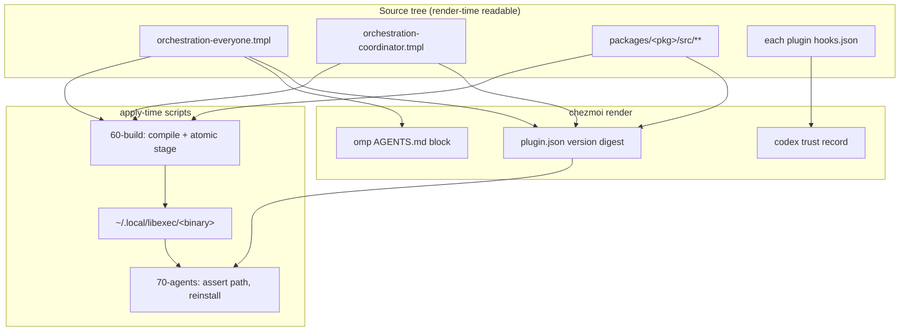
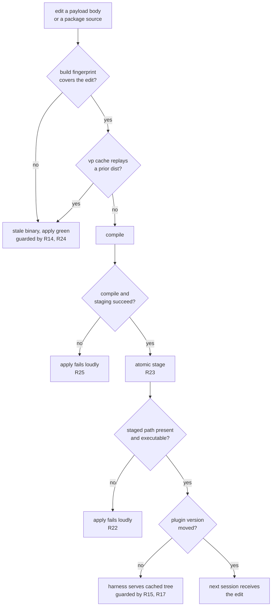

# Orchestration Hooks as a TypeScript Package - Plan

## Goal Capsule

- **Objective:** Every Orca-managed agent session starts under the orchestration rules its role can act on, and a change to those rules reaches every session started after one `chezmoi apply`, with no silent staleness on any host. Sessions already running when the apply lands keep the rules they started with.
- **Means:** Move the hook logic into one TypeScript package under `packages/` that compiles to a single binary staged at `~/.local/libexec/`, keep the plugin manifests as chezmoi target state, and keep one source file for each payload body (KTD1, KTD2, KTD4).
- **Authority:** This plan. No issue is linked. On product behavior the R-ID wins; on implementation mechanism the KTD that cites it wins within that R's constraints. Units override neither.
- **Stop conditions:** Stop and report if the deployed hook cannot be shown to fail open on every path, if role resolution cannot be reproduced exactly as R7 states it, if the payload parity R21 requires cannot be asserted mechanically, or if the plugin version signal cannot be made to move on a payload edit without moving on an unrelated one.
- **Execution profile:** Packaging, build wiring, and instruction-payload relocation. Verification is package-level tests plus deployed-artifact behavior produced in an isolated scratch tree. Never run `chezmoi apply` against the live `$HOME`; render single scripts with `chezmoi --source=<worktree> execute-template` instead, because `apply --source=` re-runs every onchange script that carries a `.chezmoi.sourceDir` literal.
- **Open blockers:** None.

**Product Contract preservation:** changed — R4, R11, R14 restated, and R21–R29 added. R4 claimed the payload bodies could be deleted; `dot_omp/private_agent/private_readonly_AGENTS.md.tmpl:13-15` renders `orchestration-everyone.tmpl` under a contract `AGENTS.md:74` declares and `.ci/test-agent-instructions.sh` checks, so the bodies survive as the single source. R11 gained omp's standing exception. R14 named only package sources and left the payload-edit path uncovered. No requirement was weakened or removed.

---

## Product Contract

### Summary

Replace the two bash SessionStart hooks with one TypeScript package that compiles to a single binary staged at `~/.local/libexec/`. The deployed hook runs with no shell, no `jq`, and no `bun` on `PATH`. Each payload body keeps one source file, read both by chezmoi at render time and by the package build.

### Problem Frame

The orchestration payload reaches a session through two bash scripts that must agree and cannot share code. `dot_local/share/dotfiles-claude-plugin/hooks/executable_orca-team-lead-orchestration.sh.tmpl` (125 lines) and `dot_local/share/dotfiles-codex-plugin/hooks/executable_orchestration.sh.tmpl` (64 lines) both obtain role resolution by splicing `.chezmoitemplates/orchestration-role-detect.sh.tmpl` in as literal text at render time. The shared rule has one source, but nothing links the two copies after rendering, and each script's own header records that losing the `.tmpl` extension would silently deploy the splice as inert text. `STRATEGY.md` counts this as a duplicate-knowledge defect.

Both scripts must never fail loudly, because a SessionStart hook that errors delays session start. That contract is held by hand across roughly a dozen early-exit paths per script, each written out separately, and checked only by end-to-end bash tests that re-render the templates.

The delivery path carries its own cost. Claude Code serves a copy of the plugin tree from its own cache and treats `plugin install` as a no-op at any version, so `dot_claude-plugin/plugin.json.tmpl` derives its version from a sha256 over every file in the source plugin tree plus three named payload bodies. Prior work records what happens when that signal stops tracking real content: a fresh host is correct, an existing host is permanently stale, and neither errors.

### Key Decisions

- **One package, one binary, both harnesses.** A single package under `packages/` owns role resolution, payload assembly, Orca guide retrieval, and envelope composition; the harness is a runtime argument. *(session-settled: user-directed — chosen over a hook-logic-only migration: the shared role resolution and everyone-payload are what the two bash scripts cannot share.)* Governs R1, R2, R5.
- **The hook body lives outside the plugin tree.** The compiled binary is staged to `~/.local/libexec/` and invoked by absolute path. *(session-settled: user-directed — chosen over bundled JS with a bash launcher: removing every session-start-time dependency was worth an 81 MB binary replaced on each apply.)* Governs R5, R12, R13.
- **The plugin manifests stay chezmoi target state.** Research found five render-time mechanisms that break if the tree becomes script-produced output, so the package does not emit manifests. This narrows the settled decision's manifest clause on evidence; its core — one package, both harnesses — is unchanged. Governs R3, R15, R17.
- **Each payload body keeps one source file.** The bodies stay under `.chezmoitemplates/`, read by chezmoi for omp's instruction file and by the package build for embedding. Governs R4, R21.
- **Verification splits by what each layer can see.** *(session-settled: user-directed — chosen over keeping either layer alone: this change touches the delivery path more than the logic, and package tests cannot observe staging, file mode, or command wiring.)* Governs R18, R19.

### Requirements

**Packaging and build**

- R1. One TypeScript package under `packages/` owns orchestration hook behavior for both harnesses: role resolution, payload assembly, Orca guide retrieval, and envelope composition.
- R2. The package produces exactly one compiled binary. The harness is selected at runtime, not by building a second target.
- R3. The package produces no plugin manifest. `hooks.json`, `plugin.json`, and `marketplace.json` stay chezmoi-managed source files.
- R4. Each payload body has one source file. `.chezmoitemplates/orchestration-everyone.tmpl` and `.chezmoitemplates/orchestration-coordinator.tmpl` survive, read both by chezmoi `includeTemplate` and by the package build, which embeds their bytes without rendering them. Each body therefore carries no template actions.
- R24. The package's build task declares its inputs and outputs explicitly and carries the locked bun version in its cache key, so a cache replay cannot install a stale artifact while reporting success.
- R25. Fail-open is the hook's contract alone. The build and staging phase fails loudly and aborts the apply; it never converges on a failed compile or a failed staging.

**Hook runtime behavior**

- R5. The deployed hook requires no shell interpreter, no `jq`, and no `bun` on `PATH` at session start.
- R6. The `hook` subcommand fails open on every path. Under Claude Code it prints `{}` and exits 0; under Codex it prints nothing and exits 0. This holds for unknown flags and unparsable arguments.
- R7. Role resolution keeps its current precedence exactly: an unset or empty `ORCA_TERMINAL_HANDLE` is `none`; a non-empty handle with `ORCA_AGENT_TEAMS_LEADER_PANE` and `TMUX_PANE` both non-empty and equal is `lead`; any other non-empty handle is `worker`. An empty string counts as unset at every step, and no pane variable alone produces `lead` or `worker`.
- R8. The lead path resolves the Orca executable under the existing safety rule: a configured value of `orca` or `/usr/bin/orca` is remapped to `orca-ide` unless the host is a confirmed Darwin, because on Linux that name reaches the GNOME screen reader.
- R9. One deadline bounds the whole `hook` run, so a slow stdin drain and a slow Orca retrieval cannot sum past it. The lead path delivers nothing rather than a partial envelope when any half is missing or the deadline passes.
- R10. The Codex hook consumes the event JSON its harness writes to stdin before exiting. The read stops at the event's own newline and is bounded in time as the backstop for a producer that sends none; it is never bounded by byte count, which would wait on an EOF the producer may not send.
- R11. Only Claude Code receives the lead envelope. Codex sessions receive the everyone-payload whatever their role resolves to. omp receives the everyone-payload unconditionally through its rendered instruction file and has no session-start injection point, so role resolution and the lead envelope apply to the hook-delivered harnesses only.
- R28. Output discipline is per subcommand. Under `hook`, stdout carries exactly the declared envelope and nothing else, stderr is unused, and the exit code is always 0. Every other subcommand uses ordinary CLI conventions: diagnostics on stderr and a non-zero exit on error.
- R29. Orca guide retrieval terminates the whole spawned process group at its deadline, not the direct child alone, so no descendant holds the hook's stdout open after the hook exits.

**Operator and test surface**

- R27. The binary's command surface is enumerated and bounded: `hook --harness <id>`, `print-payload`, `role`, and `--version`. It is an operator-and-test surface, not a public interface.

**Delivery and propagation**

- R12. Each harness's `hooks.json` invokes the binary by an absolute path resolved at render time, so no runtime variable expansion is required. Claude Code additionally uses exec form, because it runs a bare `command` through `sh -c`. Codex keeps its current declaration form unless exec form is shown to be supported there and the trust record is extended to cover it (R16).
- R13. The compiled binary is staged to `~/.local/libexec/` by a chezmoi phase that runs before the plugin reconcilers in `70-agents`.
- R14. An edit to any input the binary's behavior or text depends on — the package's sources, the surviving payload bodies, or the locked bun version — reaches a new session after one `chezmoi apply`.
- R15. Each plugin's version signal moves when, and only when, the tree that harness copies into its cache changes. Rule text and hook behavior reach a session through the staged binary, not through that tree.
- R16. The Codex hook declaration stays trusted. The trust record is computed from the same bytes Codex reads, covers every field of the declaration it attests, and is regenerated whenever that declaration changes, so the hook never silently stops running.
- R17. Each plugin reconciler's fingerprint input set names only paths that still exist and still affect the tree it installs, so no glob matches zero files and no edit outside that tree forces a reinstall.
- R21. Each payload body is identical to the text the staged binary emits from it. For the everyone body that comparison extends to a third reader, the delimited block in omp's rendered instruction file.
- R22. The declared hook command path is asserted present and executable on every apply, by a step that does not depend on the build script's onchange fingerprint. A failed assertion fails the apply loudly.
- R23. The binary is staged atomically, so the declared path always holds either the complete previous binary or the complete new one.
- R26. Retired targets are removed from deployed hosts, not merely unmanaged: both bash hook scripts and both plugin trees' `payloads/` wrapper files are declared for removal in the same commit that deletes their sources.

**Verification**

- R18. Package-level tests cover role resolution across the full environment matrix, envelope composition per harness, Orca retrieval failure, retrieval timeout, and every fail-open path.
- R19. `.ci/test-claude-team-hook.sh` and `.ci/test-codex-orchestration-hook.sh` exercise a real built binary and the deployed tree, and keep only what package tests cannot observe: the deployed artifact's fail-open behavior, its staging and mode, the declared command wiring, and payload parity.
- R20. No verification step runs `chezmoi apply` against the live `$HOME`.

### Key Flows

- F1. Lead session start
  - **Trigger:** Claude Code fires `SessionStart` in a pane whose `TMUX_PANE` equals `ORCA_AGENT_TEAMS_LEADER_PANE`.
  - **Steps:** The binary resolves the role as `lead`, resolves the Orca executable, retrieves the version-matched guide within its deadline, and composes preamble, orchestration skill text, guide, everyone-payload, and coordinator-payload into one envelope.
  - **Outcome:** One `SessionStart` envelope on stdout, or `{}` when any half is unavailable.
  - **Covered by:** R6, R7, R8, R9, R11, R29
- F2. Worker session start
  - **Trigger:** Either harness fires `SessionStart` with a non-empty `ORCA_TERMINAL_HANDLE` that does not resolve to `lead`, or a Codex session of any role.
  - **Steps:** The binary composes preamble plus everyone-payload. It performs no Orca call.
  - **Outcome:** The everyone envelope on stdout.
  - **Covered by:** R6, R7, R10, R11
- F3. Session outside Orca
  - **Trigger:** `ORCA_TERMINAL_HANDLE` is unset or empty, in a hook-delivered harness.
  - **Steps:** Codex drains stdin first; both harnesses then exit without composing anything.
  - **Outcome:** `{}` for Claude Code, no output for Codex; exit 0 in both cases. An omp session is unaffected — its payload rides in its instruction file per R11.
  - **Covered by:** R6, R7, R10, R11
- F4. Apply-time build and staging
  - **Trigger:** `chezmoi apply` with a changed package source, a changed payload body, or a moved bun version.
  - **Steps:** The render computes each plugin version and the Codex trust record from source content. The build phase resolves bun, compiles, and stages the binary atomically. The `70-agents` reconcilers assert the staged path and reinstall each plugin.
  - **Outcome:** The binary is present and executable before the reconcilers run, and each harness serves the new content.
  - **Covered by:** R12, R13, R14, R15, R16, R17, R22, R23, R25
  - **Sequencing note:** the trust record's key carries positional group and handler indices, so this change must not insert a handler ahead of the existing one.

### Acceptance Examples

- AE1. **Covers R7.** Given `ORCA_TERMINAL_HANDLE` is set and both `ORCA_AGENT_TEAMS_LEADER_PANE` and `TMUX_PANE` are empty strings, when the hook runs, then the role is `worker` — never `lead` from an empty-equals-empty comparison.
- AE2. **Covers R7.** Given `ORCA_AGENT_TEAMS_LEADER_PANE` and `TMUX_PANE` are set and equal but `ORCA_TERMINAL_HANDLE` is unset, when the hook runs, then the role is `none` and nothing is injected.
- AE3. **Covers R6, R9.** Given the role is `lead` and Orca guide retrieval exceeds its deadline, when the hook runs, then stdout is exactly `{}`, the exit code is 0, and no partial envelope is emitted.
- AE4. **Covers R6.** Given the role is `worker` and the binary encounters an internal error while composing the envelope, when the hook runs under Codex, then stdout is empty and the exit code is 0.
- AE5. **Covers R8.** Given the host is not a confirmed Darwin and the configured Orca command is `orca`, when the lead path resolves its executable, then it invokes `orca-ide` and never `/usr/bin/orca`.
- AE6. **Covers R10.** Given Codex writes one JSON line to the hook's stdin and keeps the descriptor open, when the hook runs, then it stops at the newline rather than waiting for EOF, and session start is not delayed.
- AE7. **Covers R21, R27.** Given either payload body is edited and an apply completes, when the staged binary's `print-payload` output for that body is compared to a standalone render of it, then the two are byte-identical — and for the everyone body the delimited block in the rendered omp instruction file matches as well.
- AE8. **Covers R14, R15.** Given only a payload body is edited, when apply runs once, then the build script re-runs and the staged binary emits the edited text, while neither plugin version moves — the tree each harness copies is unchanged.
- AE9. **Covers R22.** Given a converged host whose staged binary has been deleted, when apply runs with no source change, then the apply fails naming the missing path rather than converging silently.
- AE10. **Covers R23.** Given an apply is interrupted during the staging step, when a session starts afterwards, then the declared path holds the complete previous binary and the session receives a well-formed envelope.
- AE11. **Covers R12.** Given the deployed Claude Code `hooks.json`, when the declaration is inspected, then it carries `args`, so the binary is spawned directly and the process tree at session start contains no shell.
- AE15. **Covers R16.** Given the Codex `hooks.json` source is changed in any way the deployed file reflects, when the apply renders, then the trust record is computed from the deployed bytes and every field of the declaration is inside the hashed identity.
- AE12. **Covers R26.** Given a host converged on the previous design, when the retiring commit is applied once, then no session in any harness receives both the old and the new payload, and the previously deployed hook scripts and `payloads/*.md` files are gone.
- AE13. **Covers R29.** Given the Orca CLI spawns a child that outlives it and holds the pipe, when the retrieval deadline passes, then the hook exits and no descendant holds its stdout open.
- AE14. **Covers R25.** Given bun cannot be resolved on the host, when apply runs, then the apply fails with a diagnostic naming the missing toolchain, and the previously staged binary is left untouched.

### Scope Boundaries

- The shell scripts under `dot_local/share/chezmoi-command-sources/` stay as they are. They are command sources, not hooks.
- The fail-open contract is carried over unchanged, not renegotiated.
- The orchestration rule text is relocated, not rewritten. Wording changes are separate work.
- No new hook event, no new harness, and no change to which sessions are Orca-managed.
- No MCP tool, skill, or slash command wraps the binary. The agent-facing surface is the injected payload; the CLI is for operators and tests (R27).
- `print-payload` reads only. It does not edit, reload, or reformat.
- Other `packages/` members and their build wiring are untouched.

#### Deferred to Follow-Up Work

- `packages/settings-reconcile` lacks a README and has one test file where its siblings have several. Bringing it to the house convention is adjacent cleanup, not this change.

### Dependencies and Assumptions

- `packages/command-reconcile` is the convention to copy: `bun build --compile` to `dist/<name>`, staged to `~/.local/libexec/` by a `run_onchange_after_` script using `.chezmoitemplates/bun-resolve.sh.tmpl` and `.chezmoitemplates/fingerprint.tmpl`. Its bun-only fallback branch exists only because it runs in `00-tools` before mise is guaranteed; a later phase does not need it.
- `bun-resolve.sh.tmpl` prepends `PATH` rather than only exporting an absolute path, because `vp` spawns `bun` as a subprocess that resolves from `PATH`.
- `fingerprint.tmpl` fails the render on any glob matching zero files, so retiring a source path and editing the reconcilers' fingerprint input sets must land together.
- `.chezmoitemplates/codex-hook-trust.tmpl` attests the hook declaration only; the binary and payloads change with no re-trust. Its key carries positional group and handler indices and no version segment.
- `.ci/test-ci-wiring.sh` requires every executable `.ci/test-*.sh` to be invoked by a workflow or another `.ci` script, and every `ci.yml` job to appear in `delivery`'s `needs`. Per-job budget is about 90 seconds.
- No existing `.ci` gate compiles or executes a real binary; the build gates fabricate a fake `dist/` artifact. Black-box coverage of a real built binary is a new gate shape.
- Assumed: Codex executes its `hooks.json` command the same way it does today. R12's render-time absolute path removes the dependency on expansion, so this assumption does not gate the design.

### Outstanding Questions

**Resolve Before Planning**

None.

**Deferred to Implementation**

- OQ1. Whether the two payload bodies keep the `.tmpl` extension once they carry no template actions. Keeping it preserves every existing `includeTemplate` call site; renaming touches `dot_omp`, both `plugin.json.tmpl` files, both reconcilers, and `.ci/test-agent-instructions.sh`. Decide when the call sites are in front of you.
- OQ2. Whether Codex supports an exec-form hook declaration. R12 keeps its current form until that is shown; adopting exec form there also requires extending the trust record's normalization (R16).

### Sources and Research

- `dot_local/share/dotfiles-claude-plugin/hooks/executable_orca-team-lead-orchestration.sh.tmpl` — the lead/worker branch, the Orca watchdog and its process-group kill, and the jq envelope this change replaces.
- `dot_local/share/dotfiles-codex-plugin/hooks/executable_orchestration.sh.tmpl` — the stdin drain and the Codex stdout constraint.
- `.chezmoitemplates/orchestration-role-detect.sh.tmpl` — the role precedence R7 preserves, including its recorded empty-equals-empty hazard.
- `dot_omp/private_agent/private_readonly_AGENTS.md.tmpl:13-15` and `AGENTS.md:74` — omp's payload delivery and the checked contract behind R4 and R21.
- `.ci/test-agent-instructions.sh:82,109-117` — the extractor and comparison R21 must keep satisfied.
- `.chezmoiscripts/00-tools/run_onchange_after_10-build-command-reconcile.sh.tmpl`, `.chezmoitemplates/bun-resolve.sh.tmpl`, `.chezmoitemplates/fingerprint.tmpl` — the build-and-stage pattern to reuse.
- `packages/command-reconcile/vite.config.ts:10-30` — the explicit `input` / `output` / `env` build task shape R24 requires.
- `docs/plans/2026-07-23-002-fix-vp-task-cache-stale-builds-plan.md` — the cache-replay defect R24 exists to prevent.
- `docs/plans/2026-09-10-1019-feat-team-mode-orchestration-hook-plan.md` — why propagation needs both a fingerprint input and a content-derived version.
- `docs/plans/2026-09-10-1341-refactor-orchestration-hook-injection-plan.md` — the unrendered-wrapper hashing trap and the Codex trust key's positional shape.
- `docs/plans/2026-09-04-1750-refactor-bun-externals-release-lock-plan.md` — why bun resolution needs `PATH`, and the single-probe rule for skip declarations.
- `.ci/lib/render-scratch.sh:26-37`, `.ci/lib/render-gate-helpers.sh:19-25`, `.ci/test-claude-team-hook.sh:27-107` — the scratch-tree and closed-PATH idiom the rewritten gates reuse.
- Claude Code hooks reference (`code.claude.com/docs/en/hooks`) — shell form versus exec form, and the path placeholders both forms export.

---

## Planning Contract

### Key Technical Decisions

- KTD1. **One package emitting one binary, harness selected by argument.** Two 81 MB binaries would differ only in which payloads they assemble. *(session-settled: user-directed — chosen over a hook-logic-only migration: the shared role resolution and everyone-payload are what the two bash scripts cannot share.)* Governs R1, R2, R5.
- KTD2. **Stage the binary to `~/.local/libexec/` and invoke it by absolute path in exec form.** *(session-settled: user-directed — chosen over bundled JS with a bash launcher: removing every session-start-time dependency was worth an 81 MB binary replaced on each apply.)* Exec form is required rather than preferred: Claude Code runs `command` through `sh -c` when `args` is absent, which would leave R5 satisfied on paper and false in the process tree. Governs R5, R12, R13.
- KTD3. **Keep the plugin manifests as chezmoi target state.** `plugin.json.tmpl` and `codex-hook-trust.tmpl` are evaluated at source-state read, before any script runs, and read from `.chezmoi.sourceDir`. Script-produced output is invisible to them. Governs R3, R15, R16, R17.
- KTD4. **One source file per payload body, embedded at build time.** The bodies stay under `.chezmoitemplates/` so omp's `includeTemplate` keeps working, and the build reads the same bytes. A second copy would be the duplicate-knowledge defect this change exists to remove. The bodies lose their template actions: the comment header moves out of `orchestration-everyone.tmpl`, and `orchestration-coordinator.tmpl`'s harness branch moves into TypeScript, which is safe because omp never reads the coordinator body. Governs R4, R21.
- KTD5. **Keep each plugin version digesting its own tree, and nothing else.** Once the hook body lives outside the tree (KTD2), the tree a harness copies into its cache is just `hooks.json` plus the manifest, and the binary is read from its absolute path at every session start. Rule text therefore propagates entirely through the build-and-stage path, never through the plugin cache. Digesting the payload bodies or the package sources here would churn the version — and force a reinstall — on edits that change nothing the harness serves. The existing whole-tree glob already does the right thing and stays. Governs R15, R17.
- KTD6. **Put the build-and-stage script in `.chezmoiscripts/60-build/`.** It must precede `70-agents` and does not need `00-tools`' bun-only fallback, which exists only for the pre-mise window. Governs R13.
- KTD7. **Assert the staged path from a new `run_after_` script in `70-agents`, not from the build script or the plugin reconcilers.** Every candidate that tracks source content is disqualified: the build script and both `run_onchange_after_update-*-plugins.sh.tmpl` reconcilers re-run only when their fingerprint moves, so a binary deleted from a converged host re-triggers none of them and the apply converges green. Only a `run_after_` script runs on every apply; `.chezmoiscripts/70-agents/run_after_config-claude-settings.sh.tmpl` is the existing precedent for every-apply work in that phase. This assertion fails the apply rather than failing open, unlike its `run_after_` neighbours, because a missing hook binary is the silent-delivery failure this plan exists to remove; the cost — chezmoi stopping before `80-keys` and `90-src` — is the same cost KTD10 already accepts for a failed build. Governs R22.
- KTD8. **Spawn the Orca CLI detached and terminate its process group at the deadline.** The current watchdog does this for a recorded reason: the CLI is a launcher whose child holds the pipe, so signalling the direct child alone leaves stdout open and stalls a reader waiting for EOF. Governs R9, R29.
- KTD9. **Declare the build task's inputs and outputs explicitly.** `bun build --compile` is an external process, so automatic input tracking misses its reads and a cache replay installs a stale artifact while reporting success. The input list mirrors the chezmoi fingerprint globs and includes the payload bodies, which sit outside the workspace root; `env: ["DOTFILES_BUN_VERSION"]` puts the locked bun version in the cache key. Governs R24.
- KTD10. **Fail loudly in the build phase.** Fail-open is the hook's property, not the pipeline's. A build that converges on failure voids R14's propagation guarantee with no signal. Governs R25.

### High-Level Technical Design

The change moves one boundary: what chezmoi renders versus what the build produces. Everything the render needs stays in the source tree.

The propagation contract needs both halves. The version digest (KTD5) makes the harness re-install; the reconciler fingerprint makes the reconciler run at all. Either alone leaves a fresh host correct and an existing host permanently stale.

The edit-to-session lifecycle is where that staleness would hide. Each gate below has a requirement that makes its failure loud rather than silent.

### Assumptions

- The payload bodies can be made action-free without losing meaning. The everyone body carries only a comment header today; the coordinator body carries one harness conditional that omp never reads.
- A compiled binary reading embedded constants remains a dumb reconciler over declared data in the sense `STRATEGY.md` intends, as `command-reconcile` is. The payload text stays data; only its transport changes.
- A single whole-run deadline for `hook` (R9) is acceptable in place of today's two independent five-second bounds. Its numeric value is set during U3 against the `hooks.json` timeout each harness already declares, and must leave headroom under it. No environment override is added, because a variable on the session-start path is a new failure mode.

### Sequencing

U1 → U2 → U3 establish the package and its logic. U4 makes the payload bodies embeddable and must land before U5, whose build fingerprint includes them. U6 repoints delivery and depends on U3, so the binary's lead path is complete before any harness is pointed at it. U9 adds the every-apply assertion once there is a staged path to assert. U7 then retires the old sources, so no window exists where neither path delivers. U8 rewrites the gates last, when both the binary and the deployed shape are final. Unit bodies appear in that dependency order; U-IDs do not renumber to match.

---

## Implementation Units

### U1. Scaffold the package

- **Goal:** A conventional workspace member exists with build, typecheck, and test tasks that run green on an empty entry point.
- **Requirements:** R1, R2, R24
- **Dependencies:** none
- **Files:** `packages/orchestration-hook/package.json`, `packages/orchestration-hook/tsconfig.json`, `packages/orchestration-hook/vite.config.ts`, `packages/orchestration-hook/README.md`, `packages/orchestration-hook/src/cli.ts`
- **Approach:**
  1. Copy `packages/command-reconcile/tsconfig.json` verbatim.
  2. Write `package.json` as `@h82/orchestration-hook`, `version 0.0.0`, private, `type: module`, `license: UNLICENSED`, `engines.node: ">=24"`, with `vite-plus: "catalog:"` and exact-pinned `@types/node` and `typescript` matching the siblings.
  3. Write `vite.config.ts` with `test.include` and `server.deps.inline: ["vite-plus"]`, and tasks `build`, `typecheck`, `test`. The `build` task carries the explicit `input` list, `output: ["dist/**"]`, and `env: ["DOTFILES_BUN_VERSION"]` per KTD9. The input list extends the command-reconcile shape with the two payload body paths.
  4. `src/cli.ts` exports `main(argv)` and carries no shebang.
- **Patterns to follow:** `packages/command-reconcile/` throughout; not `settings-reconcile`, whose missing README and thin suite are accidents.
- **Test scenarios:** Test expectation: none — scaffolding with no behavior. `vp run -r typecheck` and `vp run -r build` must succeed.
- **Verification:** The build produces an executable `dist/orchestration-hook`, and a second build with no source change is a cache hit.

### U2. Port role resolution and envelope composition

- **Goal:** The binary resolves the session role and composes each harness's envelope, with the fail-open contract enforced in one place.
- **Requirements:** R1, R5, R6, R7, R10, R11, R18, R28
- **Dependencies:** U1
- **Files:** `packages/orchestration-hook/src/role.ts`, `packages/orchestration-hook/src/envelope.ts`, `packages/orchestration-hook/src/cli.ts`, `packages/orchestration-hook/test/role.test.ts`, `packages/orchestration-hook/test/envelope.test.ts`
- **Approach:**
  1. Implement role resolution to R7's precedence, treating an empty string as unset at every step.
  2. Implement envelope composition per harness, with Codex receiving the everyone-payload at any role (R11).
  3. Wrap the `hook` subcommand so every throw, unknown flag, and unparsable argument lands on R6's fail-open output; keep other subcommands on ordinary CLI conventions (R28).
- **Execution note:** Implement role resolution test-first — AE1 and AE2 are the exact hazards the bash predicate was written to avoid.
- **Patterns to follow:** Single-concern modules with one `test/<module>.test.ts` each, importing `{ describe, expect, it } from "vite-plus/test"` and `../src/<module>.js`.
- **Test scenarios:**
  - Covers AE1. Handle set, both pane variables empty strings, expect `worker`.
  - Covers AE2. Both pane variables set and equal, handle unset, expect `none`.
  - Handle set, leader pane set, `TMUX_PANE` unset, expect `worker`.
  - Handle set, both pane variables set and unequal, expect `worker`.
  - Handle set, both pane variables set and equal, expect `lead`.
  - Handle set to a whitespace-only string — record the expected classification and assert it, so the boundary is decided rather than incidental.
  - Claude Code at `lead` composes preamble, skill text, guide, everyone, coordinator, in that order.
  - Codex at `lead` composes preamble plus everyone only.
  - Covers AE4. An internal error during composition under Codex yields empty stdout and exit 0.
  - Covers AE6. One JSON line on stdin with the descriptor left open is consumed at its newline, without waiting for EOF.
  - stdin carrying no newline before the time bound returns rather than blocking.
  - `hook` with an unknown flag yields the harness's fail-open output and exit 0.
  - `role` prints the resolved word and the three environment inputs it read, with a zero exit.
  - `role` with an unknown flag yields a non-zero exit and a stderr diagnostic.
  - The binary links no shell, `jq`, or `bun` at run time — assert the compiled artifact runs with an empty `PATH` (R5).
- **Verification:** `vp run -r test` passes, and no `hook` test observes a non-zero exit or stderr output.

### U3. Port Orca guide retrieval

- **Goal:** The lead path retrieves the version-matched guide under one deadline and leaves no descendant holding stdout.
- **Requirements:** R8, R9, R18, R29
- **Dependencies:** U2
- **Files:** `packages/orchestration-hook/src/orca.ts`, `packages/orchestration-hook/test/orca.test.ts`
- **Approach:**
  1. Implement executable resolution to R8, remapping `orca` and `/usr/bin/orca` to `orca-ide` unless `uname -s` is a confirmed `Darwin`. An unreadable `uname` remaps, because starting a screen reader is the worse failure.
  2. Spawn detached and terminate the process group at the deadline (KTD8).
  3. Apply one whole-run deadline covering spawn and read, so a slow spawn plus a slow read cannot sum past it.
  4. Treat a non-zero exit or empty output as retrieval failure, which R9 turns into no envelope.
- **Patterns to follow:** The existing watchdog's comments in the bash hook record why the group kill and the Darwin remap exist; preserve both reasons in the TypeScript.
- **Test scenarios:**
  - Covers AE5. Non-Darwin host with configured command `orca` resolves to `orca-ide`.
  - `uname` unavailable resolves to `orca-ide`.
  - Confirmed Darwin with configured command `orca` keeps `orca`.
  - A CLI exiting non-zero yields retrieval failure.
  - A CLI exiting zero with empty output yields retrieval failure.
  - Covers AE3. A CLI exceeding the deadline yields retrieval failure within the bound.
  - Covers AE13. A CLI spawning a child that outlives it and holds the pipe does not keep the caller's stdout open past the deadline; assert on elapsed time and on the captured stream closing.
- **Verification:** Every retrieval-failure scenario reaches R6's fail-open output through U2's wrapper, and the deadline test's elapsed time stays within the bound.

### U4. Make the payload bodies embeddable

- **Goal:** Each payload body is action-free plain text with one source, embedded by the build and still rendered by chezmoi.
- **Requirements:** R4, R21, R27
- **Dependencies:** U2
- **Files:** `.chezmoitemplates/orchestration-everyone.tmpl`, `.chezmoitemplates/orchestration-coordinator.tmpl`, `packages/orchestration-hook/src/payload.ts`, `packages/orchestration-hook/test/payload.test.ts`
- **Approach:**
  1. Remove the comment header from `orchestration-everyone.tmpl`; move its content to the package README or drop it.
  2. Remove `orchestration-coordinator.tmpl`'s harness conditional, moving the branch into `payload.ts`. omp never reads the coordinator body, so nothing downstream loses a branch.
  3. Embed both bodies at build time and expose `print-payload` (R27) so parity is assertable.
  4. Confirm `.ci/test-agent-instructions.sh` still passes — its comparison is against a standalone render of the everyone body, which an action-free file satisfies unchanged.
- **Test scenarios:**
  - The embedded everyone text equals the source file's bytes.
  - The embedded coordinator text equals the source file's bytes.
  - `print-payload` emits the everyone text on stdout with a zero exit.
  - The composed Claude Code lead envelope contains the coordinator text; the Codex envelope does not.
- **Verification:** `.ci/test-agent-instructions.sh` passes unchanged, and the embedded-equals-source tests pass.

### U5. Add the build-and-stage script

- **Goal:** One apply compiles the binary and stages it atomically, or fails loudly.
- **Requirements:** R13, R14, R23, R24, R25
- **Dependencies:** U1, U4
- **Files:** `.chezmoiscripts/60-build/run_onchange_after_20-build-orchestration-hook.sh.tmpl`
- **Approach:**
  1. Mirror `.chezmoiscripts/00-tools/run_onchange_after_10-build-command-reconcile.sh.tmpl`, minus its bun-only fallback (KTD6).
  2. Declare the fingerprint globs: the workspace files, the package's four paths, and both payload bodies, plus `bun-version` as a narrow `values` entry — never a glob over `releases.json`.
  3. Resolve bun through `bun-resolve.sh.tmpl` so `PATH` is prepended, not just `BUN_BIN` exported.
  4. Verify `dist/orchestration-hook` is an executable regular file, then stage with `mktemp` in the target directory, `chmod`, and `mv -f` (R23).
  5. Fail with a diagnostic and a non-zero exit on a missing toolchain, a failed build, or a missing dist artifact (R25). Print nothing on a converged host.
- **Execution note:** This is packaging; prefer render-and-run smoke verification in a scratch tree over unit coverage. Render with `chezmoi --source=<worktree> execute-template`, never `apply --source=`.
- **Test scenarios:** Covered by U8's `.ci/test-build-orchestration-hook.sh`; no package-level test applies.
- **Verification:** A rendered run in a scratch tree stages an executable at the target path, a second run with no source change is silent, and a forced build failure exits non-zero leaving the previous artifact untouched.

### U6. Repoint delivery and rework the version digests

- **Goal:** Both harnesses invoke the staged binary by absolute path, and the Codex trust record still attests the declaration Codex actually reads.
- **Requirements:** R3, R12, R15, R16, R17
- **Dependencies:** U3, U5
- **Files:** `dot_local/share/dotfiles-claude-plugin/hooks/hooks.json.tmpl`, `dot_local/share/dotfiles-codex-plugin/hooks/hooks.json.tmpl`, `.chezmoitemplates/codex-hook-trust.tmpl`, `.chezmoiscripts/70-agents/run_onchange_after_update-claude-plugins.sh.tmpl`, `.chezmoiscripts/70-agents/run_onchange_after_update-codex-plugins.sh.tmpl`
- **Approach:**
  1. Convert each `hooks.json` to a template rendering the absolute staged path. Claude Code's declaration moves to exec form with `args`; Codex's declaration form is unchanged (R12). Do not insert a handler ahead of the existing one — the trust key's indices are positional.
  2. Repoint `.chezmoitemplates/codex-hook-trust.tmpl` at the new source name. Its `$hooksPath` is a hardcoded `hooks/hooks.json` under the source dir and it hard-`fail`s when `stat` misses, so leaving it unchanged aborts every apply at render. It must also read the **rendered** bytes rather than the raw template, or the hash covers unrendered template text while Codex reads the rendered file.
  3. Extend that template's handler normalization to cover every field the declaration carries. It currently normalizes `type`, `command`, `timeout`, `async`, `statusMessage`, and `additionalContextLimit` only — a field outside that set is silently outside the hash (R16).
  4. Leave both `plugin.json.tmpl` version digests as they are (KTD5). Update each reconciler's fingerprint input set only to drop paths this change deletes, so no glob matches zero files (R17).
- **Execution note:** Render the Codex trust template in a scratch tree before and after the `hooks.json` rename; a render abort here breaks every apply on every host, so prove it renders before moving on.
- **Test scenarios:** Covered by U8. No package-level test applies.
- **Verification:** A scratch-tree render emits each `hooks.json` with the absolute path, Claude Code's carrying `args`; the Codex trust record renders without failing and its hashed identity contains every field of the deployed declaration.

### U9. Assert the staged binary on every apply

- **Goal:** A missing or non-executable hook binary fails the apply instead of converging green.
- **Requirements:** R22
- **Dependencies:** U5, U6
- **Files:** `.chezmoiscripts/70-agents/run_after_assert-orchestration-hook.sh.tmpl`
- **Approach:**
  1. Add a `run_after_` script, because it is the only trigger that runs on every apply. The build script and both plugin reconcilers are `run_onchange_`, so a binary deleted from a converged host re-triggers none of them (KTD7).
  2. Assert the path each rendered `hooks.json` declares is present and executable, and fail the apply naming the missing path when it is not.
  3. Print nothing when the assertion holds, so a converged host stays silent.
- **Patterns to follow:** `.chezmoiscripts/70-agents/run_after_config-claude-settings.sh.tmpl` for the every-apply shape in this phase. Its fail-open posture does **not** carry over — this script fails the apply (KTD7).
- **Test scenarios:** Covered by U8.
- **Verification:** With the binary staged, a rendered run is silent and exits zero; with it deleted, the run exits non-zero and names the path.

### U7. Retire the bash hooks and wrappers

- **Goal:** The old delivery path is gone from sources and from already-converged hosts.
- **Requirements:** R26
- **Dependencies:** U6
- **Files:** `dot_local/share/dotfiles-claude-plugin/hooks/executable_orca-team-lead-orchestration.sh.tmpl`, `dot_local/share/dotfiles-codex-plugin/hooks/executable_orchestration.sh.tmpl`, `dot_local/share/dotfiles-claude-plugin/payloads/readonly_everyone.md.tmpl`, `dot_local/share/dotfiles-claude-plugin/payloads/readonly_coordinator.md.tmpl`, `dot_local/share/dotfiles-codex-plugin/payloads/readonly_everyone.md.tmpl`, `.chezmoitemplates/orchestration-role-detect.sh.tmpl`, `.chezmoiremove`
- **Approach:**
  1. Delete the two hook templates, the three payload wrappers, and the role-detect template.
  2. Add each corresponding deployed target path to `.chezmoiremove`, because deleting a source stops management without removing the deployed copy.
  3. Confirm no fingerprint glob still names a deleted path — a zero-match glob aborts every apply.
- **Test scenarios:** Covered by U8's transition assertions.
- **Verification:** A scratch-tree render produces no reference to the deleted paths, and the removal entries name every previously deployed target.

### U8. Rewrite and wire the CI gates

- **Goal:** The gates exercise a real built binary and the deployed shape, and they are wired.
- **Requirements:** R19, R20, R21, R22, R23, R25, R27
- **Dependencies:** U6, U7, U9
- **Files:** `.ci/test-claude-team-hook.sh`, `.ci/test-codex-orchestration-hook.sh`, `.ci/test-build-orchestration-hook.sh`, `.github/workflows/ci.yml`
- **Approach:**
  1. Rewrite the two hook gates to build the binary once and run it, replacing the rendered-template invocation. This is a new gate shape — no existing gate runs a real binary — so budget the build against the roughly 90-second per-job limit and build once for both gates if needed.
  2. Reuse the scratch-tree idiom: `setup_render_scratch`, the mandatory `render()` with scratch `HOME` and a closed `PATH`, per-case CLI stubs, `env -i` invocation, `$(...)` capture so a leaked background writer is caught, and elapsed-time assertions.
  3. Add `.ci/test-build-orchestration-hook.sh` in the style of `.ci/test-build-command-reconcile.sh` for staging, atomicity, and loud-failure behavior.
  4. Add the every-apply assertion cases from U9 to that same build gate.
  5. Wire every gate into a `ci.yml` job and confirm each job appears in `delivery`'s `needs`.
- **Test scenarios:**
  - Covers AE3. Lead role with a hanging Orca stub yields exactly `{}`, exit 0, within the deadline.
  - Covers AE4. Codex worker with a forced internal error yields empty stdout and exit 0.
  - Covers AE7. The binary's `print-payload`, a standalone render of the everyone body, and the rendered omp block are byte-identical.
  - Covers AE9. A deleted staged binary makes the reconciler preflight fail the apply.
  - Covers AE10. An interrupted staging leaves the previous binary complete and executable.
  - Covers AE8. Editing only a payload body re-runs the build and changes the binary's emitted text, while neither rendered plugin version changes.
  - Covers AE11. The rendered Claude Code `hooks.json` carries `args` and an absolute path.
  - Covers AE15. The rendered Codex trust record hashes an identity containing every field of the rendered declaration.
  - `--version` prints an identifier that changes when the package sources or a payload body change, so an operator can tell which build a host holds (R27).
  - Covers AE12. After the retiring render, no deployed reference to the old hook scripts or payload wrappers remains.
  - Covers AE14. A build with bun unresolvable exits non-zero and leaves the previously staged artifact untouched.
  - A closed `PATH` with no Orca CLI yields `{}` and exit 0 for the lead role.
- **Verification:** `.ci/test-ci-wiring.sh` passes, every rewritten gate passes, and no gate invokes `chezmoi apply`.

---

## Verification Contract

| Gate | Command | Applies to |
|---|---|---|
| Package tests | `vp run -r test` from `packages/` | U1–U4 |
| Typecheck | `vp run -r typecheck` from `packages/` | U1–U4 |
| Build | `vp run -r build` from `packages/` | U1, U4, U5 |
| Lint | `vp lint` from `packages/` | U1–U4 |
| Format | `vp fmt --check .` from `packages/` | U1–U4 |
| Claude hook behavior | `.ci/test-claude-team-hook.sh` | U2, U3, U6, U8 |
| Codex hook behavior | `.ci/test-codex-orchestration-hook.sh` | U2, U6, U8 |
| Build and staging | `.ci/test-build-orchestration-hook.sh` | U5, U8, U9 |
| Instruction parity | `.ci/test-agent-instructions.sh` | U4 |
| Gate wiring | `.ci/test-ci-wiring.sh` | U8 |
| Fingerprint narrowness | `.ci/test-build-bun-version-fingerprint.sh` | U5 |

Render verification uses `chezmoi --source=<worktree> execute-template` on the single script or template under test. No step runs `chezmoi apply` against the live `$HOME` (R20).

**Reading the apply-time acceptance examples.** AE7 through AE12, AE14 and AE15 are written as apply-time outcomes because that is the behavior they pin. A gate proves one by rendering the script or template under test and running the rendered output against a scratch `HOME` and destination — never by invoking a real apply. `.ci/lib/render-scratch.sh` and `.ci/lib/render-gate-helpers.sh` provide that harness.

---

## Definition of Done

Global:

- Every requirement R1–R29 is satisfied or explicitly traced to the unit that satisfies it.
- Every gate in the Verification Contract passes.
- The everyone-payload is byte-identical across the source body, the binary's output, and the rendered omp block (R21).
- Editing only a payload body and rendering once moves both plugin versions and changes the binary's embedded text (R14).
- No deployed target from the previous design remains declared or undeclared: the retired sources are deleted and their targets are in `.chezmoiremove` (R26).
- No abandoned-attempt code remains — experimental modules, dead branches, and scaffolding from approaches that did not land are removed before the change is declared done.
- No fingerprint glob matches zero files.

Per unit: the unit's own **Verification** line holds, and its cited requirements are demonstrably met by the tests it names.
