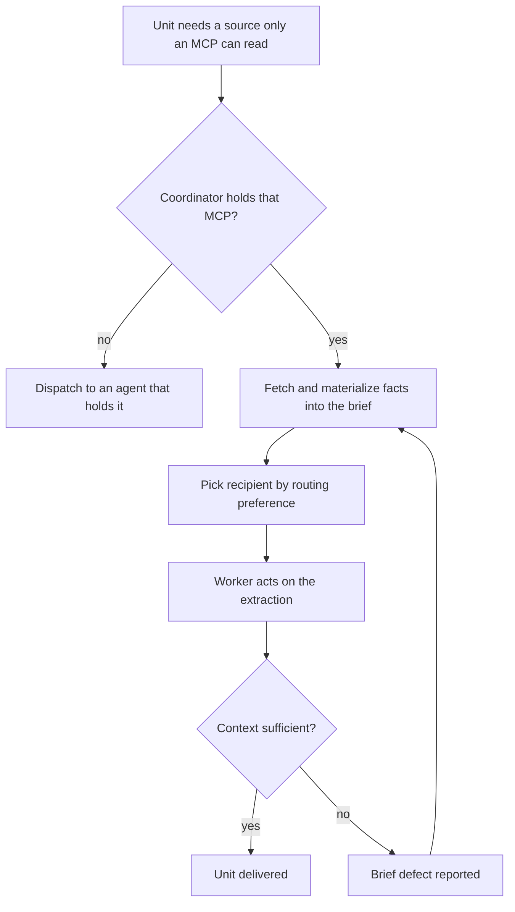
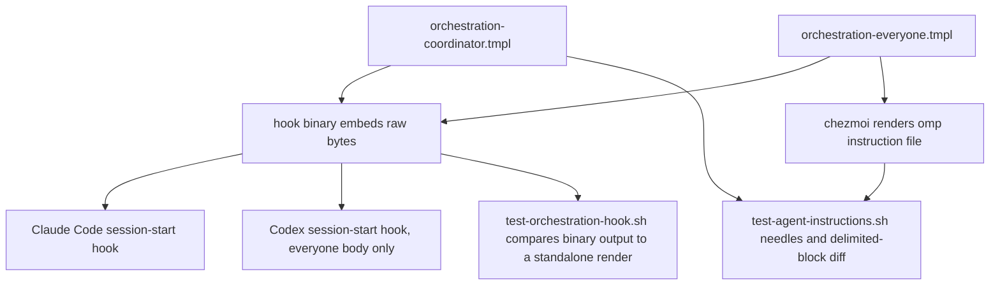

# Coordinator Dispatch Routing Rules - Plan

## Goal Capsule

- **Objective:** A dispatched worker receives every piece of context its task depends on, and the cheapest capable agent gets the work, so a design- or prose-heavy unit neither burns frontier budget nor loses its source of truth.
- **Means:** Edit the two orchestration payload bodies and assert the new text with substring needles in the existing agent-instructions gate (KTD1).
- **Product authority:** This plan owns the dispatch routing rules in the Coordinator payload and the worker-side reporting obligation in the Everyone payload. The team-mode CLI launch gate and the tokscale wrapper removal are not active scope.
- **Execution profile:** Text-only edits to two template bodies and one CI gate. No binary source changes, no schema, no runtime behavior.
- **Stop conditions:** Stop and report if a needle this plan adds cannot be made to match a rendered payload, or if a rendered payload body turns out to require a Go template action.
- **Tail ownership:** The calling pipeline owns commit, push, PR, and CI.
- **Open blockers:** None.

---

## Product Contract

### Summary

Rewrite the Coordinator payload's dispatch routing rules so that frontend design work and document authoring become `omp`-preferred, MCP-only context is resolved by the coordinator into the brief file before dispatch, and the brief-file obligation is stated on size grounds instead of on which kind of pass is running.

### Problem Frame

The Coordinator payload splits work between recipients on cost and context size alone. Frontend and visual design work, and document authoring, both read as "reasoning-heavy authoring" under that split, so they route to `claude` or `codex`. The Gemini model `omp` serves is strong at both, and it runs on a subscription quota rather than per-token frontier budget. The most design- and prose-heavy units therefore consume the most expensive seat for no quality gain.

Pushing that work to `omp` collides with a capability gap the payload never mentions. The self-contained-prompt rule asks for "the context the subagent cannot infer from the repository alone", which a coordinator satisfies by handing over a Figma URL and the instruction to read it. The worker then cannot: Figma authorization is per-harness OAuth, and only the lead holds it. The worker guesses spacing, colors, and copy, or it escalates — and the payload's own failure classification reads that escalation as evidence the unit was too hard. The diagnosis is wrong. The unit was never too hard; the brief was under-specified.

The natural carrier for the missing context has a hole in it. The brief-file obligation is written as a property of code review, document review, and peer passes. The Implementation Unit paragraph, which is where design and authoring units actually flow, requires no brief file at all. The reason the obligation exists is neither of those situations — it is that a dispatch spec travels as an argv string, and a brief-sized payload inlined there exceeds the kernel argument limit.

### Key Decisions

- KD1. **Ship the routing preference and the context-resolution rule together.** They pull the same paragraphs in opposite directions, so landing one alone would create the defect the other describes and then rewrite it. (session-settled: user-directed — chosen over splitting them across separate plans: the `omp` preference is only safe once extraction is mandatory.)
- KD2. **State the brief-file obligation on size grounds, not on which kind of pass is running.** Matching the rule to its actual cause closes the Implementation Unit hole without a special case. Governs R10. (session-settled: user-directed — chosen over requiring a brief only for MCP-carrying units, and over requiring one for every unit: those fix the symptom and leave the same shape of hole for the next rule to fall into.)
- KD3. **Treat insufficient extraction as a brief defect, not as a sizing signal.** The coordinator extracts what was missing and re-dispatches at the rung the sizing already gave. Governs R8. (session-settled: user-directed — chosen over promoting live-MCP dependency to a sizing signal, and over declaring such work undispatchable: it reuses the failure loop the payload already has, and leaves the sizing ladder untouched.)
- KD4. **An agent does not review prose it wrote.** Governs R12. (session-settled: user-directed — chosen over leaving the cross-model document review unchanged, and over adding a fourth reviewer: authorship and review by one model defeats the reason the third serving family is required, and a fourth reviewer spends back the budget the preference saves.)
- KD5. **Keep capability-conditional routing as a live branch even though no managed harness declares a Figma MCP today.** A project that configures one for `omp` or `codex` makes the branch reachable again. Governs R6.

### Requirements

**Routing preferences**

- R1. The Coordinator payload names frontend design work — component markup and styling, layout, design-system application, visual polish, screen mockups — and document authoring — prose documents, README and docs pages, plan and requirements text, merge-request bodies, explainers — as work that SHOULD be dispatched to `omp`, alongside the existing short, bounded, low-context preference.
- R2. The same rule names the authoring that stays on `claude` or `codex`: adjudication, a verdict, and a document whose deliverable is the judgment itself rather than the prose carrying it, such as a `ce-pov` output or a review verdict. A plan or requirements document is not one of those — it records judgments already made, so its authoring is prose work under R1.
- R3. The preference leaves the Implementation Unit sizing ladder intact. A frontend or authoring unit the four signals place at `opus` or above keeps that rung.
- R4. The preference leaves the existing `omp` dispatch constraints intact: name the agent and nothing else, and never request a model or a reasoning effort for `omp`.

**MCP-only context**

- R5. Before dispatching work that depends on a source only an MCP can read, the coordinator fetches that content itself and materializes the extracted facts into the brief file. For a design source that means frame or node identity, layout and spacing measurements, color and type tokens, component and variant names, copy strings, and repo-relative paths for exported assets and reference screenshots.
- R6. A unit that needs live MCP access its intended recipient does not hold is not dispatched to that recipient. Either the context is resolved per R5, or the unit goes to an agent that holds the MCP.
- R7. A dispatch prompt or brief does not hand a worker an MCP-only URL as the sole path to required context. The URL stays for provenance; the extraction is what the worker acts on.
- R8. A worker escalation or failure caused by missing or insufficient MCP-sourced context is classified as a brief defect. It does not raise the model rung. The coordinator extracts what was missing and re-dispatches at the same rung.
- R9. The Everyone payload obliges a dispatched worker whose brief points at an MCP it cannot reach to report that as a brief defect rather than guess at the missing content.

**Brief-file obligation**

- R10. The brief-file obligation is stated on size grounds: a dispatch whose required context would exceed the argv limit if inlined names a path to a brief file and does not inline that content. The rule covers code review, document review, peer passes, and Implementation Units alike, and its stated reason remains the kernel argument limit.

**Review composition**

- R11. The cross-model document review runs `codex`, `claude`, and `omp` over the same brief file, and weighs each reviewer's findings on their own evidence.
- R12. An agent that authored the document under review does not serve as a reviewer of it. That review runs with the reviewers that remain, rather than substituting another agent.

**Delivery**

- R13. Both payload bodies remain free of Go template actions, because the hook binary embeds their raw bytes without rendering.
- R14. `.ci/test-agent-instructions.sh` asserts each new rule as a substring needle — the coordinator rules against the Claude coordinator payload, the worker-side obligation against the Everyone payload — in the style of the existing assertions.
- R15. `.ci/test-agent-instructions.sh` and `.ci/test-orchestration-hook.sh` pass, and a single `chezmoi apply` carries the edited text through every delivery path, including the compiled hook binary and omp's instruction file.

### Actors

- A1. **Coordinator** — the Claude Code lead session that holds the Coordinator payload and picks each dispatch recipient. The only party that can reach an MCP the recipients lack.
- A2. **Dispatched worker** — an `omp`, `codex`, or `claude` agent executing one unit from a brief. Holds no conversation history and only the MCP access its own harness was authorized for.

### Key Flows

- F1. Resolve MCP-only context before dispatch
  - **Trigger:** A1 prepares a unit whose work depends on a source only an MCP can read.
  - **Actors:** A1, A2
  - **Steps:** A1 fetches the source itself; A1 writes the extracted facts into the brief file and keeps the URL as provenance; A1 picks the recipient by the routing preference, since the capability gap is now closed; A2 acts on the extraction.
  - **Covered by:** R1, R5, R6, R7, R10

- F2. Repair a brief defect
  - **Trigger:** A2 escalates or fails because required context is missing from the brief or the extraction does not answer its question.
  - **Actors:** A1, A2
  - **Steps:** A2 reports a brief defect rather than guessing; A1 classifies it as a brief defect and not as evidence about the unit; A1 extracts the missing facts into the brief; A1 re-dispatches the same unit at the rung the sizing already gave.
  - **Covered by:** R8, R9

### Acceptance Examples

- AE1. **Covers R1, R5.** Given a screen-mockup unit whose design lives in Figma and whose sizing places it at the default rung, when the coordinator prepares the dispatch, then it extracts the measurements, tokens, component names, and copy into the brief and dispatches the unit to `omp`.
- AE2. **Covers R7.** Given a brief for a UI unit, when that brief names a Figma URL and nothing else as the path to the design, then the brief is incomplete and the dispatch does not go out.
- AE3. **Covers R6.** Given a unit that must iterate against a live MCP the intended recipient does not hold, when the coordinator cannot resolve the context up front, then it dispatches the unit to an agent that holds that MCP rather than to the preferred recipient.
- AE4. **Covers R8, R9.** Given a dispatched worker that finds its brief's extraction does not answer a spacing question, when it reports a brief defect, then the coordinator extracts the missing measurement and re-dispatches the same unit at the same rung.
- AE5. **Covers R3.** Given a frontend unit the four signals place at `opus`, when the routing preference would send frontend work to `omp`, then the unit keeps its `opus` rung and the preference does not lower it.
- AE6. **Covers R11, R12.** Given a plan document `omp` authored, when the cross-model document review runs over it, then `codex` and `claude` review it and `omp` does not.

<!-- ce-section: work-relationships -->
### How This Work Fits Together

This plan owns the dispatch routing rules in the Coordinator payload and the worker-side reporting obligation in the Everyone payload. The breakdown below is how the surrounding work is currently understood, not a committed roadmap.

- Team-mode CLI launch gate — a `PreToolUse` hook that refuses a shell invocation of `codex`, `claude`, or `omp` while the session is Orca team-managed.
  - Can proceed independently of this plan. It enforces a boundary at the tool-call layer; this plan states obligations in payload text and adds no enforcement.
  - Shares the session-role resolution already exposed by the orchestration hook package.
- tokscale codex wrapper removal — retiring the wrapper, its source unit, its CI gate, and its documentation.
  - Depends on the launch gate for its rationale: metering direct `codex exec` calls loses its purpose once direct launches are refused.
  - Can proceed independently of this plan.
- Shell-loop prohibition when waiting on Orca workers.
  - Shares both payload bodies with this plan, so the two edits touch the same files and want sequencing.
  - Still to decide: whether it lands before or after this plan.

### Scope Boundaries

- The rules stay textual obligations. No hook, binary, or CI check enforces that a coordinator actually extracted MCP content before dispatching.
- The session-start hook path is out of scope. It resolves a role and assembles text; it has no view of a dispatch, a recipient, or an MCP, so nothing on it can help here.
- No harness conditional returns to the Coordinator payload. The binary already prevents Codex from receiving it.
- The team-mode CLI launch gate and the tokscale wrapper removal are separate work.

### Dependencies and Assumptions

- Only the lead `claude` session holds the Figma MCP. No managed harness in this repository declares a Figma MCP server, and Figma authorization is per-harness OAuth obtained on demand. This is what makes coordinator-side extraction the primary path rather than a fallback.
- MCP capability is a per-project, per-harness runtime fact, never a property a dispatch can assume.
- Editing a payload body takes effect only after the build recompiles and re-stages the hook binary. The build fingerprint already covers both bodies, so one `chezmoi apply` suffices.

### Outstanding Questions

**Deferred to Planning**

- Whether `AGENTS.md` needs an edit. It documents the instruction-target contract and plugin delivery; this change is body text within an existing contract, so it likely does not, but planning should confirm against the file.
- How to sequence against the pending shell-loop prohibition, which edits the same two bodies.
- Whether the restated brief-file obligation keeps its current position in the Coordinator payload or moves ahead of the Implementation Unit paragraph it now also governs.

### Sources

- `.chezmoitemplates/orchestration-coordinator.tmpl` — the dispatch-target rule, the Implementation Unit sizing ladder and failure classification, the brief-file obligation, the self-contained-prompt rule, and the cross-model review requirement.
- `.chezmoitemplates/orchestration-everyone.tmpl` — the rules binding every agent, where the worker-side brief-defect obligation belongs.
- `packages/orchestration-hook/src/payload.ts` — imports both bodies as raw text, which is why neither may carry a template action.
- `.ci/test-agent-instructions.sh` — renders both bodies and asserts cross-OS identity for the coordinator payload and cross-harness identity for the Everyone payload.
- `.ci/test-orchestration-hook.sh` — proves the built binary's payload output matches a standalone render of each body.
- `dot_omp/private_agent/private_readonly_AGENTS.md.tmpl` — omp has no session-start injection point, so the Everyone body rides in its instruction file.
- `README.md` — records that this repository declares no Figma MCP server and that projects needing Figma own their own MCP configuration.
- `AGENTS.md` — records that Figma authorization is on demand through each harness's own OAuth flow.
- `docs/plans/2026-09-11-1124-refactor-orchestration-hooks-typescript-package-plan.md` — the change that moved payload delivery into the compiled binary.

---

## Planning Contract

Product Contract unchanged.

### Key Technical Decisions

- KTD1. **Add sentences by default; rewrite only the two sentences a settled decision contradicts.** Every rule in `.chezmoitemplates/orchestration-coordinator.tmpl` is pinned by a literal substring needle in `.ci/test-agent-instructions.sh`, so rewording a sentence silently breaks a gate that names it, and additive sentences leave every existing needle matching. Two sentences cannot be left standing, because the payload would then state a rule and its contradiction at once: the brief-file sentence (KTD2) and the reasoning-heavy-authoring sentence (KTD8). Governs R1, R11.
- KTD2. **Replace the brief-file sentence, and update its needle in the same commit.** R10 restates the obligation on size grounds, which the existing sentence cannot express, so this is the one sanctioned rewrite. The needle `A dispatch spec MUST name a path to a brief file and MUST NOT inline the brief's content` must move with it. Governs R10. (session-settled: user-directed — chosen over requiring a brief only for MCP-carrying units, and over requiring one for every Unit: matching the rule to its actual cause closes the Implementation Unit hole without a special case.)
- KTD3. **Keep the paragraph opener `When a run dispatches Orca workers for a code review, document review, or peer pass, the following contract binds it.` verbatim.** The deadline, release, and receipt obligations that follow it are genuinely scoped to review and peer dispatch and must not widen to every Unit. The size-based brief rule is inserted ahead of that opener rather than absorbing it. Governs R10.
- KTD4. **Put the authorship exclusion in the dispatch-target paragraph, beside the `omp`-reviewer sentence.** The Implementation Unit paragraph opens by narrowing itself to Implementation Units, so a rule placed there reads as inapplicable to a `ce-doc-review` dispatch — the case R12 most needs to bind. The dispatch-target paragraph already carries the third-serving-family reviewer sentence and scopes to every review. Governs R12. (session-settled: user-directed — chosen over leaving `ce-doc-review` unchanged, and over adding a fourth reviewer.)
- KTD5. **Prove delivery with the repository's render gates, never a live `chezmoi apply`.** `AGENTS.md` forbids an agent render from reaching live `$HOME` or the real `op`; `.ci/lib/render-gate-helpers.sh` implements the mandatory scratch-destination contract that `.ci/test-agent-instructions.sh` already uses. The single-apply claim in R15 is a property of the build fingerprint, which `.ci/test-build-orchestration-hook.sh` covers; the operator performs the live apply. Governs R15.
- KTD6. **Treat insufficient extraction as a brief defect in the failure-classification sentence that already exists.** The Implementation Unit paragraph classifies mechanical versus substantive failures; the brief-defect class is a third branch added there rather than a new paragraph. Governs R8. (session-settled: user-directed — chosen over promoting live-MCP dependency to a sizing signal, and over declaring such work undispatchable: it reuses the failure loop already present and leaves the sizing ladder untouched.)

- KTD7. **Pick a needle's heredoc by which paragraph its sentence lives in.** Both `COORDINATOR_NEEDLES` and `CLAUDE_COORDINATOR_NEEDLES` assert against the same `$coordinator_claude_linux` render, so either would pass; matching the existing split keeps the file readable. Sentences in the dispatch-target paragraph and the review-and-peer contract paragraph belong in `COORDINATOR_NEEDLES`; sentences in the Implementation Unit paragraph belong in `CLAUDE_COORDINATOR_NEEDLES`. Governs R14.
- KTD8. **Amend the reasoning-heavy-authoring sentence rather than adding beside it.** The sentence beginning "Reasoning-heavy authoring, planning, and adjudication SHOULD stay on" contradicts R1 head-on: document authoring is reasoning-heavy authoring. Leaving it in place would make the rendered payload route the same work to both `omp` and the frontier agents, and the gate does not machine-check semantic contradiction, so nothing would catch it. Its needle moves with it. Governs R2.

- KTD9. **Replace the hook gate's `printf | grep -q` assertions with bash substring tests.** The gate runs under `set -o pipefail` and this host's pipe holds 8192 bytes, so once the lead envelope passed that size `grep -q` exited on its match, `printf` took SIGPIPE, and the pipeline returned 141 — reporting a miss on text that was present. The two negative assertions were worse: `&& fail` short-circuits on 141, so they passed silently whether or not a worker received the coordinator payload. Growing the payload made a latent race deterministic rather than causing it. Governs R15.

### High-Level Technical Design

One source file per payload body feeds three readers, which is why a body edit needs both a render gate and a build gate to prove it landed everywhere.

### Assumptions

- Only the lead `claude` session holds the Figma MCP. Verified indirectly: no `figma` string appears under `.chezmoidata/`, `.chezmoitemplates/`, `dot_config/`, `dot_omp/`, `dot_codex/`, or any `dot_claude*` path, and `README.md:278` states the repository declares no Figma MCP server.
- `AGENTS.md` needs no edit. Its instruction-target paragraph documents the fixture-backed paragraphs and the omp delimited block; this change touches neither, and adds no delivery path.
- The pending shell-loop prohibition (issue #467) edits the same two bodies. This plan does not sequence against it; whichever lands second rebases its text.

### Sequencing

U1 first, because it moves the sentence the later units cite. U2 and U3 both edit the Coordinator body and are ordered to keep their diffs from overlapping. U4 is independent and may land in any order.

---

## Implementation Units

### U1. Restate the brief-file obligation on size grounds

**Goal:** The brief-file requirement binds any dispatch whose context would overflow argv, including an Implementation Unit.

**Requirements:** R10, R13, R14.

**Dependencies:** none.

**Files:**
- `.chezmoitemplates/orchestration-coordinator.tmpl`
- `.ci/test-agent-instructions.sh`

**Approach:**
1. In the review-and-peer contract paragraph, delete the existing sentence `A dispatch spec MUST name a path to a brief file and MUST NOT inline the brief's content, because the spec is delivered as an argv string and a review-sized brief inlined there exceeds the kernel argument limit and fails the dispatch.`
2. Insert ahead of that paragraph's opener, as directional wording: `A dispatch spec is delivered as an argv string, so a dispatch whose required context would exceed the kernel argument limit if inlined MUST name a path to a brief file and MUST NOT inline that content. Size decides that, not the kind of pass: it binds a code review, a document review, a peer pass, and an Implementation Unit alike.`
3. Leave the opener `When a run dispatches Orca workers for a code review, document review, or peer pass, the following contract binds it.` untouched, per KTD3.
4. In `.ci/test-agent-instructions.sh`, replace the `COORDINATOR_NEEDLES` entry `A dispatch spec MUST name a path to a brief file and MUST NOT inline the brief's content` with the surviving substring, and add one needle there for the size sentence, per KTD7.

**Patterns to follow:** the existing `COORDINATOR_NEEDLES` heredoc (`.ci/test-agent-instructions.sh:470`) — one literal substring per line, matched with `grep -F` against `$coordinator_claude_linux`.

**Test scenarios:**
- `.ci/test-agent-instructions.sh` passes with the replaced and added needles.
- Reverting only the template edit while keeping the new needles makes the gate fail by name, proving the needle is load-bearing.
- The retained opener still matches its existing needle.

**Verification:** the agent-instructions gate passes, and the coordinator body contains exactly one brief-file obligation sentence.

### U2. Add the MCP-only context resolution rules

**Goal:** A coordinator resolves MCP-only context into the brief before dispatch, routes by recipient capability, and classifies a resulting worker failure as a brief defect.

**Requirements:** R5, R6, R7, R8, R13, R14. Covers AE1, AE2, AE3, AE4.

**Dependencies:** U1.

**Files:**
- `.chezmoitemplates/orchestration-coordinator.tmpl`
- `.ci/test-agent-instructions.sh`

**Approach:**
1. After the self-contained-prompt sentence, add the resolve-before-dispatch rule (R5) naming the extracted facts a design source must yield, and the no-bare-URL rule (R7).
2. In the Implementation Unit paragraph, add the capability-conditional routing rule (R6) narrowing the `omp`-by-default sentence.
3. In the same paragraph's failure classification, add the brief-defect branch (R8) stating that it does not raise the rung and that the coordinator repairs the brief and re-dispatches at the same rung, per KTD6.
4. Add one needle per new rule, choosing its heredoc by KTD7: the resolve-before-dispatch and no-bare-URL rules go in `COORDINATOR_NEEDLES`; the routing and failure-classification rules go in `CLAUDE_COORDINATOR_NEEDLES`.

**Patterns to follow:** the mechanical-versus-substantive failure sentence already in the Implementation Unit paragraph — extend its shape rather than introducing a new classification vocabulary.

**Test scenarios:**
- Covers AE1. The gate passes with needles for the resolve-before-dispatch and extraction-contents rules present.
- Covers AE2. A needle pins the no-bare-URL rule.
- Covers AE3. A needle pins the capability-conditional routing rule.
- Covers AE4. A needle pins the brief-defect classification and its same-rung re-dispatch.
- No added sentence contains `{{`, so the body still carries no template action.

**Verification:** the agent-instructions gate passes and `.ci/test-orchestration-hook.sh` still reports the binary's coordinator output byte-identical to a standalone render.

### U3. Add the routing preference and the authorship exclusion

**Goal:** Frontend design work and document authoring are `omp`-preferred without weakening the sizing ladder, and an agent does not review prose it wrote.

**Requirements:** R1, R2, R3, R4, R11, R12, R13, R14. Covers AE5, AE6.

**Dependencies:** U2.

**Files:**
- `.chezmoitemplates/orchestration-coordinator.tmpl`
- `.ci/test-agent-instructions.sh`

**Approach:**
1. In the dispatch-target paragraph, append the preference sentence (R1) after the existing short-bounded-low-context preference, then replace the sentence beginning "Reasoning-heavy authoring, planning, and adjudication SHOULD stay on" with the R2 sentence, per KTD8, and update that sentence's `COORDINATOR_NEEDLES` entry in the same edit.
2. In the same dispatch-target paragraph, add one sentence stating the preference does not lower a rung the four signals set (R3) and does not relax the `omp` model and effort constraint (R4).
3. Add the authorship-exclusion sentence (R12) to the dispatch-target paragraph, immediately after the third-serving-family `omp`-reviewer sentence, per KTD4. Leave the Implementation Unit paragraph's cross-model review mandate untouched so its needle keeps matching.
4. Add one `COORDINATOR_NEEDLES` needle per new rule — every sentence this unit adds lives in the dispatch-target paragraph, so KTD7 files them all there.

**Patterns to follow:** the existing dispatch-target sentence pair — a `SHOULD` preference followed by its cost rationale.

**Test scenarios:**
- Covers AE5. A needle pins the sentence that subordinates the preference to the sizing ladder.
- Covers AE6. A needle pins the authorship exclusion, and the existing needle for the three-family review mandate still matches.
- The short-bounded-low-context preference needle still matches unchanged; the reasoning-heavy-authoring needle moves with its replaced sentence, per KTD8.
- No added sentence matches any entry in the `BANNED` heredoc.

**Verification:** the agent-instructions gate passes with every pre-existing coordinator needle still matching.

### U4. Add the worker-side brief-defect obligation

**Goal:** A dispatched worker whose brief points at an unreachable MCP reports a brief defect instead of guessing.

**Requirements:** R9, R13, R14.

**Dependencies:** none.

**Files:**
- `.chezmoitemplates/orchestration-everyone.tmpl`
- `.ci/test-agent-instructions.sh`

**Approach:**
1. Add one paragraph to the Everyone body stating the obligation. It binds `codex` and `omp` as well as `claude`, which is why it belongs here rather than in the Coordinator body.
2. Add the matching `EVERYONE_NEEDLES` entry.

**Patterns to follow:** the Everyone body's existing paragraphs — a `MUST`/`MUST NOT` obligation followed by the reason it exists.

**Test scenarios:**
- The gate's `EVERYONE_NEEDLES` loop finds the new rule in all three everyone renders (claude, codex, omp).
- The omp delimited-block diff against a standalone everyone render still passes, proving the new paragraph reached omp's instruction file.
- The four instruction cores still match outside the harness paragraphs and the omp payload block.

**Verification:** the agent-instructions gate passes, including the omp block extraction and the cross-harness core diff.

---

## Verification Contract

Run from the repository root. These gates never touch live `$HOME`; they render to a scratch destination with a stub `op`, per KTD5.

| Gate | Command | Proves |
|---|---|---|
| Agent instructions | `.ci/test-agent-instructions.sh` | Every coordinator and everyone needle matches; cross-OS and cross-harness identity hold; the omp block equals a standalone everyone render. Covers U1–U4. |
| Orchestration hook | `.ci/test-orchestration-hook.sh` | The built binary's `print-payload` output is byte-identical to a standalone render of each body, for both harnesses. Covers U1–U4. |
| Hook build fingerprint | `.ci/test-build-orchestration-hook.sh` | The build fingerprint covers both payload bodies, so a body edit forces a rebuild. Covers R15. |
| Hook package tests | `bun test` in `packages/orchestration-hook` | The envelope still refuses to put the coordinator payload in a Codex envelope. Regression guard only. |

No live `chezmoi apply` is part of this contract. The operator performs it; the fingerprint gate is what proves one apply would carry the edit through.

---

## Definition of Done

- R1 through R15 are satisfied in the two payload bodies and the agent-instructions gate.
- Every gate in the Verification Contract passes, with the hook gate's envelope assertions no longer dependent on pipe capacity (KTD9).
- Neither payload body contains a `{{` sequence.
- Every pre-existing needle in `COORDINATOR_NEEDLES`, `CLAUDE_COORDINATOR_NEEDLES`, and `EVERYONE_NEEDLES` still matches, except the entries KTD2 and KTD8 replace.
- No added sentence matches an entry in the `BANNED` heredoc.
- `AGENTS.md` and `README.md` are unchanged, per the Assumptions.
- No exploratory or dead-end text remains in either body.
