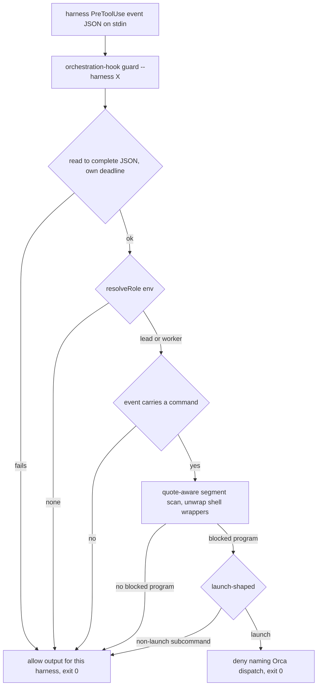

# Orca-Managed Session CLI Launch Gate - Plan

## Goal Capsule

- **Objective:** When an agent session on this host is managed by Orca, the peer work it starts is work Orca can see. An attempt to launch another agent CLI from the shell is refused, and the refusal says where that work belongs. A session outside Orca is unaffected.
- **Means:** A `PreToolUse` hook in `packages/orchestration-hook` denies shell *launches* of `codex`, `claude`, and `omp` while `resolveRole` reports anything but `none` (KTD1, KTD5). Non-launch invocations of the same programs keep working (KTD10).
- **Authority:** Issue #472 and its 2026-09-11 comment own product scope. The comment supersedes the issue body's two implementation pointers. `AGENTS.md` owns repository conventions.
- **Execution profile:** Evidence before code. U0 captures a real `PreToolUse` event from each harness and commits it as a fixture; every later unit derives its event shape from that fixture rather than from an assumption. The built-binary CI gate is the enforcement proof.
- **Stop conditions:** Stop and report if a captured Codex event shows the harness cannot express a deny the gate can emit. Stop if U0 cannot capture a real Codex event on the authoring host — the rest of the Codex half rests on it.
- **Tail ownership:** The caller ships the branch. This plan ends at a green `bun run test`, `bun run typecheck`, and the gates in the Verification Contract.

---

## Product Contract

### Summary

Add a `PreToolUse` hook that refuses `codex`, `claude`, and `omp` shell launches in any Orca-managed session and names the Orca dispatch path in the refusal. Ship it for both Claude Code and Codex, deriving each harness's event shape from a captured live event rather than from documentation or string archaeology.

The tokscale `codex` wrapper retirement that issue #472 pairs with this work is deferred. See Scope Boundaries.

### Problem Frame

Cross-model and cross-harness calling must go through Orca. Today that guarantee is text only: the injected orchestration payload and the user-scoped `CLAUDE.md` tell the lead to dispatch through Orca, and nothing stops an agent from running `codex` from a shell and starting a peer Orca never sees.

The shell tool is the first surface this closes, not the only one. An MCP server that spawns a CLI, or a skill that writes a launcher script, stays governed by text alone. The change is staged enforcement, and the gate should not be read as sealing the hole.

### Key Decisions

- **The gate blocks launches, not programs.** `codex plugin add`, `claude update`, and `command -v codex` are not peer launches, and denying them would break documented workflows this repository's own scripts depend on. Governs R1, R15.
- **Scope is every Orca-managed session, not team mode alone.** `resolveRole` returns `worker` for any non-empty `ORCA_TERMINAL_HANDLE`, so the enforceable boundary is Orca-managed versus not. The issue frames the problem as team mode because that is where the violation is most expensive; the mechanism is wider and the plan says so rather than describing a narrower gate than it builds. Governs R1, R3.
- **The wrapper retirement is split out.** It removes the only Tokscale ingestion path for Codex and no decision was made about whether that telemetry has a consumer. Issue #472's own Notes section pre-authorizes this split. Governs the Deferred entry below.

### Requirements

**Launch gate**

- R1. In a session whose resolved role is `lead` or `worker`, a shell invocation that would *launch* `codex`, `claude`, or `omp` is denied.
- R2. The denial message names the Orca dispatch path, and names the standing fallback for when Orca itself is unreachable: report the failed command and its error and continue with this agent's own reasoning, rather than routing around the gate.
- R3. In a session whose resolved role is `none`, every invocation runs unchanged.
- R4. Any internal error in the gate denies nothing and blocks nothing.
- R5. Role resolution reuses `resolveRole` from `packages/orchestration-hook/src/role.ts`. No second copy of the precedence rule exists.
- R6. The gate is registered for Claude Code through `.chezmoitemplates/claude-hook-declaration.tmpl` in exec form (`args`).
- R7. The gate is registered for Codex through `.chezmoitemplates/codex-hook-declaration.tmpl` as a command string with no `args` key.
- R8. Adding the Codex `PreToolUse` declaration leaves the existing `session_start` trust record's key and hash unchanged.
- R9. A command the gate cannot parse is allowed, not denied.

**Fidelity to the harnesses**

- R15. A non-launch invocation of a blocked program is allowed. The allowed set is each CLI's own non-launch surface — at minimum `--version`, `--help`, `update`, `plugin`, `mcp`, `login`, `logout`, `doctor`, `completion`, and a `command -v` / `command -V` lookup.
- R16. A shell wrapper does not hide the program. `bash -c`, `sh -c`, `zsh -c`, and the `timeout` / `stdbuf` / `setsid` / `nohup` family are stepped through to the command they run.
- R17. A shell operator inside single quotes, double quotes, or an escape does not split a segment. An unmatched quote is unparseable and allows under R9.
- R18. Each harness's `PreToolUse` event shape — the tool-name values and the type of the command field — is derived from a captured real event committed as a fixture, never assumed.
- R19. The allow output for each harness is the value that harness accepts as "no decision", established from the captured event's own round trip rather than reused from the SessionStart path.
- R20. The guard's stdin read is bounded by its own deadline, sized for a per-tool-call path rather than inherited from SessionStart.
- R21. Verification includes one end-to-end check per harness that the harness actually refuses a launch, not only that the hook printed a deny.
- R22. A fail-open gate that has silently stopped denying is observable: `orchestration-hook guard` reports its own verdict for a given command and environment when run directly.

### Scope Boundaries

**Deferred to Follow-Up Work**

- Retiring the tokscale `codex` wrapper (issue #472 part 2, originally R10-R14 in this plan; those IDs are retired here and not reused). `dot_local/share/chezmoi-command-sources/executable_codex` is the only path that feeds Codex usage to Tokscale — Claude Code's metering runs through transcript retention instead — so removing it permanently ends Codex headless metering for `role = none` sessions, which this gate does not block. Whether that telemetry has a consumer worth keeping is a product decision about the user's own account, and issue #472's Notes section pre-authorizes closing part 2 on its own merits. File it as its own issue carrying: the metering loss, the stale `~/.local/bin/codex-bin` and `codex-wrapper` store artifacts on provisioned hosts, and the ordering hazard that `.chezmoiremove` prunes before `command-reconcile` repoints `~/.local/bin/codex`.

**Deferred for later**

- Gating `agy`/`antigravity`. The issue names three programs; Antigravity neither leads nor serves an Orca workflow.
- Covering spawn surfaces other than the shell tool.

**Outside this change**

- Tokscale itself, and the `hooks` key in `~/.claude/settings.json`, which stays untouched.

### Acceptance Examples

- AE1. **Covers R1, R2.** Given a team-managed session, when the shell tool is asked to run `codex exec "do the thing"`, then the hook denies and the reason names the Orca dispatch workflow and the Orca-unreachable fallback.
- AE2. **Covers R3.** Given no `ORCA_TERMINAL_HANDLE`, when the same command is asked for, then it runs.
- AE3. **Covers R1.** Given an Orca-managed session, when the command is `FOO=bar env claude -p hi`, then it is denied.
- AE4. **Covers R9.** Given an Orca-managed session, when the command is `echo "ask claude about it"`, then it is allowed.
- AE5. **Covers R16.** Given an Orca-managed session, when the command is `bash -c 'codex exec x'`, then it is denied.
- AE6. **Covers R15.** Given an Orca-managed session, when the command is `codex plugin add foo`, `claude --version`, or `command -v codex`, then each is allowed.
- AE7. **Covers R17.** Given an Orca-managed session, when the command is `echo 'a && codex'`, then it is allowed — the operator is inside quotes and the program is `echo`.
- AE8. **Covers R4.** Given malformed stdin that is not JSON, then the hook emits its allow output and exits 0.
- AE9. **Covers R21.** Given a team-managed Codex session on the authoring host, when `codex --version` is requested through its shell tool, then Codex itself refuses it — establishing that the harness acts on the deny the hook sends.

### Sources

- `packages/orchestration-hook/src/role.ts` — the role precedence this gate reuses; `test/role.test.ts` pins the empty-equals-empty hazard.
- `packages/orchestration-hook/src/cli.ts:runHook` — the fail-open and stdin-drain shape the `guard` subcommand adapts.
- `.chezmoitemplates/codex-hook-trust.tmpl` — the positional trust key `<plugin>@<market>:<path>:<event>:<group>:<handler>`, indexed per event, and the normalization set that has no `args` member.
- The installed Codex binary at `~/.local/lib/commands/store/codex/rust-v0.154.0-d7e18b2597ae/codex` carries `hookSpecificOutput`, `hookEventName`, `permissionDecision`, and `permissionDecisionReason`, so the deny wire shape is shared with Claude Code. Its tool-name vocabulary is *not* settled by string counts — `unified_exec` (74), `exec_command` (53), `shell_command` (10), `Bash` (7), `local_shell` (3), and the literal `"shell"` (0) all appear — which is why R18 derives the set from a captured event instead.

---

## Planning Contract

### Key Technical Decisions

- KTD1. **Add the gate to `packages/orchestration-hook` and import `resolveRole` directly**, rather than shelling out to `orchestration-hook role`. The package already owns both harnesses' hook behavior, so a second hook there is a module, not a second delivery path. Governs R5.
- KTD2. **One `guard` subcommand serves both harnesses**, selected by `--harness`, keeping the fail-open `try`/`catch` in one place. Governs R4, R6, R7.
- KTD3. **Denial is `hookSpecificOutput.permissionDecision: "deny"` with `permissionDecisionReason`, exit 0.** Exit code 2 is not used: it makes a deny indistinguishable from a crash, which R4 must keep separable. Governs R1, R2.
- KTD4. **The scanner is quote-aware and wrapper-unwrapping, and allows on doubt.** Segments split on `;`, `&&`, `||`, `|`, `&`, newline, and `(` only outside quotes and escapes. Leading `NAME=VALUE` assignments are skipped, including after a wrapper token. A shell wrapper's `-c` argument is scanned recursively. An unresolvable construct (`$(`, a backtick, `${`) or an unmatched quote ends that segment with no verdict. Governs R9, R16, R17.
- KTD5. **Every non-`none` role is gated, not the lead alone.** A worker starting its own peer is the same bypass. Governs R1, R3.
- KTD6. **Codex parity ships here.** The trust hazard the issue comment flags does not apply: `codex-hook-trust.tmpl` indexes group and handler positionally *within one event*, and `PreToolUse` is a new event key, so the existing `…:session_start:0:0` record keeps its key and its hash. The template already maps `PreToolUse` to `pre_tool_use` and lists it in `$limitEvents`. Governs R7, R8.
- KTD10. **The verdict is launch-shaped, not program-shaped.** After the scanner names a program, the gate reads the first non-flag token after it: a known non-launch subcommand allows, and so does a bare `--version`/`--help`. Everything else — including a bare `codex` and `codex exec` — denies. This is what makes the gate safe to leave on: a program-name block would deny `codex plugin add`, which `run_onchange_after_update-codex-plugins.sh.tmpl` runs during `chezmoi apply`. Governs R1, R15.
- KTD11. **Event shapes come from captured fixtures, not from assumption.** U0 captures one real `PreToolUse` event per harness with a throwaway handler and commits the redacted JSON. The tool-name set, the `tool_input` command type, the allow-output value, and the Codex matcher are all read off those fixtures. This is the decision that removes the gate's largest failure mode: a wrong tool-name guess makes the Codex half always-allow while every CI gate stays green. Governs R18, R19.
- KTD12. **The gate reads a command wherever the event carries one, regardless of tool name.** The tool-name set from KTD11 selects *which* events to scan; but when an event carries a `tool_input.command` (string or argv array) and the tool name is unrecognized, the gate scans it anyway. A new or renamed shell tool then fails safe toward enforcement rather than toward silence. Governs R1, R18.
- KTD14. **The verdict is `deny`, not `ask`.** Both harnesses offer an `ask` decision that would let the operator approve a launch case by case. It is rejected: the run this gate most needs to bind is an unattended one, where `ask` either blocks forever or is answered by the same agent the gate exists to constrain. R15 is the pressure valve instead — the forms that should keep working are named, not negotiated per call. Governs R1, R15.
- KTD13. **`guard` reads stdin to a complete JSON document or EOF, under its own deadline.** SessionStart's newline-terminated drain and 3000 ms budget are wrong here: a `PreToolUse` body may be pretty-printed, and this path runs on every tool call. Governs R20.

### High-Level Technical Design



Every edge that is not a proven launch reaches `A`, and a `try`/`catch` around the whole body is one more edge into `A`.

```text
segment := split on ; && || | & newline (  -- only outside quotes and escapes
for each segment:
  skip leading NAME=VALUE tokens
  while the next token is a wrapper (env, command, exec, sudo, doas, nice, time, xargs, nohup, timeout, stdbuf, setsid):
      skip it and its own flags, then skip any NAME=VALUE tokens again
  if the token is bash/sh/zsh and a later token is -c: scan that -c argument recursively, then stop
  program := basename(next token)
  if program is blocked: read the following non-flag token to decide launch vs non-launch
  on $( ` ${ or an unmatched quote: yield nothing for this segment
```

### Assumptions

- A1. The Claude Code shell tool is `Bash` and its `tool_input.command` is a string. U0's Claude fixture confirms both before U2 pins them.
- A2. Codex's shell tool name and command field type are unknown until U0 captures them; the binary's strings do not settle it. Every Codex-specific value in U2 and U4 is written after U0, not before.
- A3. Both harnesses accept the same `hookSpecificOutput` deny shape. The wire strings are present in the installed Codex binary; AE9 is what proves Codex acts on it.

### Sequencing

U0 → U1 → U2 → U3 → U4 → U5. U0 gates the Codex half of U2, U4, and U5; nothing Codex-specific is written before its fixture exists.

---

## Implementation Units

### U0. Capture real PreToolUse fixtures

- **Goal:** Commit one real `PreToolUse` event per harness so every later unit reads the event shape instead of guessing it.
- **Requirements:** R18, R19 · KTD11
- **Files:** `packages/orchestration-hook/test/fixtures/pretooluse-claude.json` (new), `packages/orchestration-hook/test/fixtures/pretooluse-codex.json` (new)
- **Approach:** Register a throwaway `PreToolUse` handler in each harness that appends its stdin to a file, run one shell tool call in each, then redact host paths, session ids, and transcript paths from the captured JSON and commit it. Record in each fixture's sibling note: the `tool_name` value observed, the type of the command field, whether a matcher is available for that event, and what the harness does with an empty-stdout allow versus a `{}` allow.
- **Execution note:** This is a capture step, not a code step. If the Codex capture cannot be produced on the authoring host, stop per the Goal Capsule stop condition rather than proceeding on an assumed shape.
- **Test expectation: none** — this unit produces fixtures, and every assertion against them lives in U2, U3, and U5.
- **Verification:** Both fixtures exist, parse as JSON, and carry no host path, session id, or transcript path.

### U1. Shell command scanner

- **Goal:** Turn a command string or argv array into the program invocations it would execute, or report that it could not tell.
- **Requirements:** R9, R15, R16, R17 · KTD4, KTD10
- **Files:** `packages/orchestration-hook/src/command-scan.ts` (new), `packages/orchestration-hook/test/command-scan.test.ts` (new)
- **Approach:** Export `scanInvocations(command: string | readonly string[]): { program: string; next: string | undefined }[]`, returning the basename plus the first following non-flag token, which KTD10 needs. Implement the walk in the pseudo-code above. For an argv array, treat element 0 as the program unless it is a shell wrapper, in which case scan the `-c` argument — the captured Codex fixture decides which case applies.
- **Execution note:** Write the case table below as the test first; the parser is small enough that the table is the specification.
- **Test scenarios:**
  - `codex exec "x"` → program `codex`, next `exec`.
  - `FOO=bar BAZ=1 claude -p hi` → program `claude`, next `-p` skipped, next non-flag `hi`.
  - `env omp run` → program `omp`, next `run`.
  - `env FOO=1 codex exec` → program `codex`: assignments after a wrapper are skipped too.
  - `command -v codex` → program `codex`, next undefined.
  - `/usr/bin/codex` → program `codex`, next undefined.
  - `git status && omp` → two invocations, `git` and `omp`.
  - `echo "ask claude about it"` → program `echo` only.
  - `echo 'a && codex'` → program `echo` only: the operator is quoted.
  - `echo "a; codex"` → program `echo` only.
  - `bash -c 'codex exec x'` → program `codex`, next `exec`.
  - `sh -c "echo hi"` → program `echo`.
  - `timeout 5 codex exec` → program `codex`.
  - `$(which codex) exec` → nothing for that segment.
  - `` `codex` `` → nothing.
  - `${CMD} exec` → nothing.
  - `echo "unmatched` → nothing: an unmatched quote is unparseable.
  - The empty command string → nothing, as an empty input rather than an unresolvable construct.
  - `["codex", "exec", "x"]` → program `codex`, next `exec`.
  - `["bash", "-lc", "codex exec x"]` → program `codex`, next `exec`.
- **Verification:** `bun run test` in `packages/orchestration-hook`.

### U2. Gate decision module

- **Goal:** Decide allow or deny from a parsed event, a harness, and the environment, with the deny reason text.
- **Requirements:** R1, R2, R3, R5, R15 · KTD1, KTD5, KTD10, KTD12
- **Files:** `packages/orchestration-hook/src/gate.ts` (new), `packages/orchestration-hook/test/gate.test.ts` (new)
- **Approach:** Export `BLOCKED_PROGRAMS` (`codex`, `claude`, `omp`), a per-program non-launch subcommand set (R15), the per-harness shell-tool-name set read from U0's fixtures, and `decide(harness, event, env)`. Call `resolveRole` from `./role.js` directly (R5). Allow immediately for role `none`. Select events by tool name, and per KTD12 also scan an unrecognized tool whose `tool_input` carries a command. Compose the deny reason once, naming the blocked program, the Orca dispatch workflow, and the Orca-unreachable fallback (R2).
- **Test scenarios:**
  - role `none` with `codex exec` → allow.
  - role `worker` and role `lead` with `codex exec` → deny.
  - deny reason contains the program name, `Orca`, and the fallback sentence.
  - `codex plugin add foo`, `codex mcp list`, `claude update`, `claude --version`, `omp --help`, `command -v codex` → allow (R15).
  - bare `codex` and `codex exec` → deny.
  - tool `Read` carrying a `command`-looking field → allow (no command in `tool_input`).
  - an unrecognized tool name whose `tool_input.command` is `omp` → deny (KTD12).
  - role resolution with `ORCA_TERMINAL_HANDLE=""` → allow, pinning empty-counts-as-unset through this caller.
  - each harness's fixture from U0, replayed with a substituted command → the expected verdict.
- **Verification:** `bun run test`, `bun run typecheck`.

### U3. `guard` subcommand

- **Goal:** Wire the gate to a harness `PreToolUse` invocation, reading the event from stdin and failing open on every fault.
- **Requirements:** R4, R6, R7, R9, R19, R20, R22 · KTD2, KTD3, KTD13
- **Files:** `packages/orchestration-hook/src/cli.ts`, `packages/orchestration-hook/test/cli.test.ts`
- **Approach:** Add `guard` to the `main` switch with the same whole-run `try`/`catch` that emits the allow output and returns 0. Read stdin until the buffer parses as a complete JSON document or EOF arrives, bounded by a `GUARD_STDIN_DEADLINE_MS` constant sized for a per-tool-call path and distinct from `STDIN_DEADLINE_MS` (KTD13). Emit the allow value U0 established for that harness (R19) — do not reuse `emptyOutput` without the fixture note confirming the harness accepts it on this event. Add a `--explain` flag that prints the verdict, the resolved role, and the scanned invocations for a command given on the command line, so an operator can ask a live host whether the gate still denies (R22). Keep `hook`'s behavior byte-identical.
- **Test scenarios:**
  - Each U0 fixture, with `codex exec` substituted, in a lead environment → deny JSON, exit 0.
  - The same with no `ORCA_TERMINAL_HANDLE` → that harness's allow output, exit 0.
  - A pretty-printed multi-line event body → parsed correctly, not truncated at the first newline.
  - Malformed stdin (`not json`) → allow output, exit 0 (AE8).
  - Empty stdin, TTY stdin, and stdin that never closes → allow output, exit 0 within `GUARD_STDIN_DEADLINE_MS`.
  - `guard` with no `--harness` → allow output, exit 0.
  - A throw injected into the decide path → allow output, exit 0.
  - `guard --explain "codex exec x"` in a lead environment → prints a deny verdict and exits 0.
  - `hook --harness claude` still returns its SessionStart envelope unchanged.
- **Verification:** `bun run test`, `bun run typecheck`.

### U4. Hook declarations and trust

- **Goal:** Register the gate with both harnesses so the deployed hook runs, and prove the Codex `session_start` trust record is untouched.
- **Requirements:** R6, R7, R8 · KTD6, KTD11
- **Files:** `.chezmoitemplates/claude-hook-declaration.tmpl`, `.chezmoitemplates/codex-hook-declaration.tmpl`, `AGENTS.md`
- **Approach:** Add a `PreToolUse` entry to each declaration's `hooks` map using the same render-time absolute `$binary` path. Claude Code takes exec form: `"args": ["guard", "--harness", "claude"]` with a `"Bash"` matcher. Codex takes a command string and no `args` key. Set the Codex matcher to the tool-name alternation U0's fixture established — a matcher keeps the binary from spawning on every non-shell tool call, which is the per-tool-call cost this hook adds; omit it only if the fixture shows Codex does not honor a matcher on this event, and record that in the template comment. Both `plugin.json.tmpl` files already hash the rendered declaration, so the version moves on its own. Extend the `AGENTS.md` hook paragraph to say the plugin registers two events and that the Codex trust key is positional per event.
- **Test expectation:** covered by U5 — a declaration is a rendered artifact whose assertions are render-level.
- **Verification:** `.ci/test-orchestration-hook.sh`.

### U5. CI gate for the launch block

- **Goal:** Prove the deployed declarations and the built binary behave as the requirements need.
- **Requirements:** R1, R2, R3, R4, R6, R7, R8, R15, R16, R17 · KTD11
- **Files:** `.ci/test-orchestration-hook.sh`
- **Approach:** Extend the existing gate rather than adding a script — it already builds the binary once, and a second gate would double the ~90-second budget its header records. Add render assertions (each declaration carries a `PreToolUse` entry naming the staged binary; the Claude entry has `args` and the Codex entry does not; the Codex entry carries the matcher U4 chose). Add built-binary assertions that pipe each U0 fixture, with substituted commands, into `guard` under controlled environments. Assert the trust record: render `codex-hook-trust.tmpl` before and after, confirm the `…:session_start:0:0` key and hash are unchanged and a `…:pre_tool_use:0:0` key is added.
- **Test scenarios:** AE1 through AE8, plus the trust-record comparison, a `--harness` omitted case, and a no-newline stdin case returning within the guard deadline.
- **Verification:** `.ci/test-orchestration-hook.sh` passes locally and in the `agent reconciliation` job.

---

## Verification Contract

| Gate | Command | Applies to |
|---|---|---|
| Unit tests | `bun run test` (from `packages/`) | U1, U2, U3 |
| Types | `bun run typecheck` | U1, U2, U3 |
| Format | `bun run format:check` | U1, U2, U3 |
| Hook gate | `.ci/test-orchestration-hook.sh` | U4, U5 |
| Build gate | `.ci/test-build-orchestration-hook.sh` | U3, U4 |
| Repo meta | `.ci/` repo-meta gates | U4's `AGENTS.md` edit |
| End-to-end deny, Claude | In a team-managed Claude Code session on the authoring host, ask the Bash tool for `codex exec x` and record that the harness refuses it | R21, AE9 |
| End-to-end deny, Codex | In a team-managed Codex session on the authoring host, ask its shell tool for `codex --version` and record that the harness refuses it | R21, AE9 |

`.ci/test-orchestration-hook.sh` is the load-bearing gate: it is the only place that compiles and runs the real binary, and R4's fail-open contract is not visible in a diff. The two end-to-end rows are equally load-bearing and are not substitutable by it — the CI gate proves the hook *emits* a deny, and only a live session proves the harness *acts* on one.

---

## Definition of Done

**Global**

- Every requirement R1-R9 and R15-R22 is implemented and traced to a passing test or a named manual check.
- `bun run test`, `bun run typecheck`, and `bun run format:check` pass.
- Every CI gate in the Verification Contract passes, and both end-to-end deny rows are recorded as performed with their observed result.
- No Codex-specific tool name, command-field type, allow value, or matcher appears in the code that is not read off a committed U0 fixture.
- No abandoned experimental code from the parser work remains in the diff.

**Per unit**

| Unit | Done when |
|---|---|
| U0 | Both fixtures are committed and redacted, and each carries its note on tool name, command type, matcher availability, and allow-output behavior. |
| U1 | Every scenario in the case table passes, including the quoted-operator, wrapper-unwrapping, and unmatched-quote cases. |
| U2 | `decide` reads role only through `resolveRole`, role `none` returns allow before any scanning, and every R15 non-launch form allows. |
| U3 | Every fault path — bad JSON, no harness, no EOF, injected throw — emits the allow output and exits 0; a pretty-printed body parses; `hook` behavior is unchanged. |
| U4 | Both declarations render with two events; the Claude entry has `args`, the Codex entry has none and carries the fixture-derived matcher or a comment saying why it cannot. |
| U5 | The gate asserts AE1-AE8 against the built binary and proves the `session_start` trust record is unchanged. |
