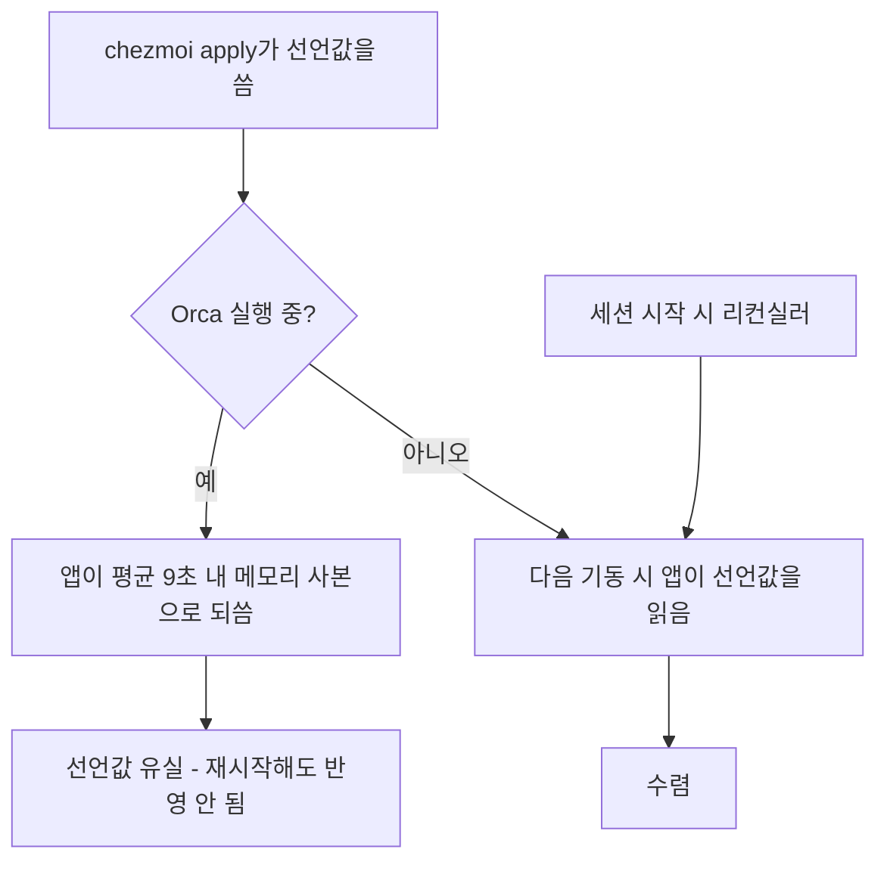
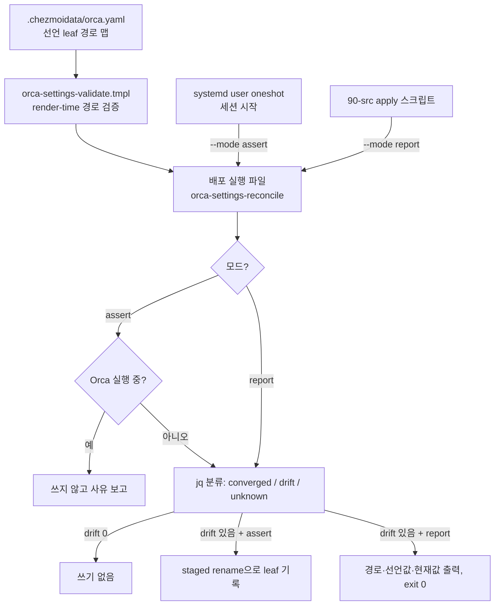

# Declarative Orca App Settings - Plan

## Goal Capsule

- **Objective:** 어느 호스트에서 Orca를 열든 폰트·기본 에이전트·워크스페이스 경로·받아쓰기·source control 액션 에이전트가 dotfiles가 선언한 값과 같고, 어긋나 있으면 operator가 `chezmoi apply` 출력에서 그 사실을 본다.
- **Means:** 그래픽 세션 시작 시점의 리컨실러가 선언된 JSON leaf만 수렴시키고, apply는 같은 분류기를 읽기 전용으로 돌려 드리프트만 보고한다 (KTD2).
- **Product authority:** 이 플랜의 Product Contract. Orca의 다른 상태 표면(automations, 계정, 원격 런타임, 프로젝트 등록 메타)은 active scope가 아니다.
- **Stop conditions:** Orca가 실행 중일 때 수렴 쓰기를 시도하지 않는다 (R4). `settings.` 밖의 JSON 경로를 쓰지 않는다 (R2).
- **Execution profile:** 기존 `claude-settings-reconcile` 4종 세트(선언 데이터 + render-time validate + jq leaf 수렴 + CI 게이트)를 이식한다. 새 아키텍처가 아니라 확립된 패턴의 적용이다.
- **Tail ownership:** `.ci/test-orca-settings-reconcile.sh`가 회귀를 소유한다.

**Product Contract preservation:** changed: R1, R2 — `settings.disabledTuiAgents`의 선언값이 `antigravity`를 포함이라는 술어였는데, 이식 대상 문법에 리스트 멤버십 경로가 없고 검증 템플릿이 그런 선언을 렌더 실패로 거부한다. 배열 전체 값 선언으로 바꾸고 R2에 배열 leaf 규칙을 명시했다. 결과로 operator가 UI에서 추가 비활성화한 에이전트가 수렴 때 되돌아가며, 이는 KD1의 귀결이므로 Scope Boundaries에 명시했다. 다른 R-ID와 Key Decisions는 그대로다.

---

## Product Contract

### Summary

Orca 앱 설정 중 R1이 지정한 항목을 dotfiles가 데이터로 선언하고, 그래픽 세션 시작 시점에 그 값으로 수렴시킨다. `chezmoi apply`는 이 표면에 쓰지 않고, 선언값과 라이브값이 어긋나 있으면 다음 그래픽 세션 시작 때 수렴된다는 사실과 함께 보고한다.

### Problem Frame

Orca는 이 워크스테이션의 작업 표면 전체를 소유한다 — 워크트리, 터미널, 에이전트, 소스 컨트롤. 그런데 그 동작을 결정하는 앱 설정은 `~/.config/orca/profiles/<profile>/orca-data.json` 안에만 존재하고, dotfiles는 그 파일을 전혀 모른다. `STRATEGY.md`가 핵심 지표로 세는 **Unowned live surface**가 정확히 이 모양이다: 머신이 의존하는데 레포가 선언하지 않는 설정.

이 표면에는 선언형으로 다룰 공식 경로가 없다. Orca CLI의 234개 명령 중 설정을 읽거나 쓰는 것은 하나도 없고, managed-policy 파일도 설정 import/export도 앱 코드에 존재하지 않는다. 런타임 변경 경로인 `settings:set`은 `ipcMain` 핸들러라 렌더러 안에서만 호출된다.

파일을 직접 다루는 것도 간단하지 않다. `orca-data.json`은 선언 가능한 설정과 워크트리 메타·세션 상태·텔레메트리를 한 문서에 섞어 놓았고, 앱은 그 문서를 기동 시 한 번 읽은 뒤 디스크를 다시 읽지 않는다. 그리고 실행 중에는 메모리 사본을 계속 되쓴다 — 측정 결과 UI를 만지지 않는 상태에서도 120초에 13회, 평균 9초 간격이었다. 그래서 앱이 떠 있는 동안 외부에서 쓴 값은 읽히지도 않고 곧 덮인다.

비용은 두 방향으로 난다. 새 호스트를 세우면 R1의 항목을 손으로 다시 넣어야 하고, 살아있는 머신에서는 UI에서 무심코 바꾼 값이 아무 흔적 없이 남는다.

### Key Decisions

- KD1. **레포가 항상 이긴다.** 선언한 키는 UI 편집을 덮어쓰고 선언값으로 되돌린다. (session-settled: user-directed — chosen over 시드 전용(키가 없을 때만 쓰기): 시드 전용은 호스트마다 설정이 갈라지는 걸 막지 못한다.) Governs R1, R5.
- KD2. **쓰기는 세션 시작 시점, apply는 보고 전담.** apply 시점 쓰기는 앱이 같은 파일을 평균 9초 간격으로 되쓰기 때문에 재시작 전에 거의 확실히 유실된다. (session-settled: user-directed — chosen over apply 시점에 쓰고 재시작 경고: 조용히 동작하지 않는 실패 모드를 피하려고.) Governs R4, R5, R8, R9.
- KD3. **source control 액션 에이전트는 현재 혼용 분배를 그대로 고정한다.** (session-settled: user-directed — chosen over 8개 액션 전부 `claude`: 단순 생성 작업과 멀티스텝 수정 작업의 기존 구분을 보존하려고.) Governs R1.
- KD4. **소유 단위는 파일이 아니라 JSON 경로다.** 같은 문서에 휘발성 상태가 섞여 있어 파일 통째 소유가 불가능하다. Governs R2.
- KD5. **앱 UI 자동화는 쓰지 않는다.** 런타임 주입 경로가 `ipcMain`뿐이라 외부에서 부를 수 없고, 접근성 API로 설정 화면을 조작하는 방식은 Orca UI 개정마다 깨지며 데이터 선언이 아니다.

쓰기 시점이 왜 결과를 가르는지:

### Requirements

**선언 범위**

- R1. 선언 대상은 아래 표의 키로 한정한다. 각 항목은 JSON 경로와 선언값 한 쌍으로 표현한다.

  | 항목 | JSON 경로 | 선언값 |
  |---|---|---|
  | 워크스페이스 경로 | `settings.workspaceDir` | operator 홈 아래 `.local/share/worktrees` |
  | UI 폰트 | `settings.appFontFamily` | `Pretendard` |
  | 코드 폰트 | `settings.editorFontFamily` | `JetBrainsMono NF` |
  | 터미널 폰트 | `settings.terminalFontFamily` | `JetBrainsMono NF` |
  | 기본 에이전트 | `settings.defaultTuiAgent` | `claude-agent-teams` |
  | codex 기본 플래그 | `settings.agentDefaultArgs.codex` | `--dangerously-bypass-approvals-and-sandbox --dangerously-bypass-hook-trust` |
  | antigravity 비활성 | `settings.disabledTuiAgents` | 배열 전체가 `["antigravity"]` |
  | 받아쓰기 활성 | `settings.voice.enabled` | `true` |
  | 받아쓰기 모델 | `settings.voice.sttModel` | `zipformer-streaming-korean` |
  | local base ref 최신 유지 | `settings.refreshLocalBaseRefOnWorktreeCreate` | `true` |
  | source control 액션 에이전트 | `settings.sourceControlAi.actions.<action>.agentId` | 생성 3종(`commitMessage`, `pullRequest`, `branchName`)은 `claude`, 수정·해결 5종(`fixCommitFailure`, `fixPushFailure`, `fixChecks`, `resolveConflicts`, `resolveComments`)은 `claude-agent-teams` |

- R2. 수렴은 선언된 JSON 경로만 바꾼다. 같은 객체의 비선언 형제 키와 문서의 다른 최상위 키는 값도 순서도 보존한다. 배열 leaf는 전체 값으로 비교하고 전체를 치환한다 — 원소 단위 소유는 이 문법에 없다.
- R3. 워크스페이스 경로는 operator의 홈 디렉터리에서 렌더한다. 절대 경로를 선언에 하드코딩하지 않는다.

**수렴 동작**

- R4. 리컨실러는 Orca가 실행되고 있지 않을 때만 쓴다. 실행 중이면 쓰지 않고 그 이유를 보고한다.
- R5. 그래픽 세션이 시작될 때마다 1회 수렴한다.
- R6. 수렴 실패는 Orca 기동을 막지 않는다.
- R7. 모든 선언 경로가 이미 선언값과 같으면 파일을 쓰지 않는다.

**관측과 보고**

- R8. `chezmoi apply`는 이 표면에 쓰지 않는다.
- R9. apply는 선언값과 다른 경로마다 그 경로·선언값·현재값을 보고하고, 다음 세션 시작 때 수렴된다는 사실을 함께 알린다.
- R10. 드리프트 보고는 apply를 실패시키지 않는다.

### Acceptance Examples

- AE1. 이미 수렴된 상태에서 재수렴
  - **Covers R7.**
  - **Given:** 선언된 모든 경로가 선언값과 같다.
  - **When:** 세션 시작 리컨실러가 실행된다.
  - **Then:** `orca-data.json`이 수정되지 않는다.
- AE2. 앱이 떠 있는 동안의 실행
  - **Covers R4.**
  - **Given:** Orca가 실행 중이다.
  - **When:** 리컨실러가 실행된다.
  - **Then:** 파일을 쓰지 않고, 앱이 실행 중이라 건너뛰었음을 보고한다.
- AE3. 비선언 형제 키 보존
  - **Covers R2.**
  - **Given:** `settings.voice.language`가 `en`이고 `settings.voice.sttModel`이 선언값과 다르다.
  - **When:** 수렴이 실행된다.
  - **Then:** `sttModel`만 선언값이 되고 `language`는 `en` 그대로 남는다.
- AE4. UI 편집 후의 apply
  - **Covers R9, R10.**
  - **Given:** operator가 UI에서 코드 폰트를 다른 값으로 바꿨다.
  - **When:** `chezmoi apply`가 실행된다.
  - **Then:** 해당 경로의 선언값과 현재값이 보고되고, 파일은 바뀌지 않으며, apply는 성공으로 끝난다.

### Success Criteria

- 변경 없는 소스에 대한 두 번째 apply가 이 표면의 대상을 0개 바꾼다 — `STRATEGY.md`의 idempotent-apply 지표를 깨지 않는다.
- 새 호스트를 세울 때 R1의 항목에 필요한 operator 조작이 0이다.
- 라이브 머신에서 R1 항목의 드리프트가 apply 출력에서 관측 가능하다.

### Scope Boundaries

- Orca의 다른 상태 표면 — automations, 관리 계정, 원격 런타임, 브라우저 프로필, 프로젝트/레포 메타데이터.
- `.chezmoiscripts/90-src/run_after_register-orca.sh.tmpl`의 additive-only 계약. 프로젝트 등록의 수렴 의미는 이 작업에서 바꾸지 않는다.
- 선언 목록 옆에서 관측됐지만 그대로 두기로 한 인접 키 — `settings.claudeAgentTeamsMode`, `settings.commitMessageAi.agentId`, `settings.voice.language`. 어느 쪽이 앱 내부의 권위인지 코드에서 확인되지 않아 선언 대상에서 제외한다.
- 실행 중인 앱에 대한 런타임 주입(UI 자동화, CDP).
- 비활성 에이전트 목록의 호스트 로컬 추가분. `settings.disabledTuiAgents`는 배열 전체를 소유하므로, operator가 UI에서 추가로 비활성화한 에이전트는 다음 수렴에서 선언값으로 되돌아간다. KD1의 의도된 결과다.
- 다중 Orca 프로필. 이 호스트는 `local-default` 하나만 가진다.

### Dependencies / Assumptions

- Orca는 `orca-data.json`을 기동 시 읽고 이후 디스크를 다시 읽지 않는다. 앱 번들에 이 파일에 대한 워처가 없음을 확인했다.
- 설정 키 이름은 Orca 버전에 종속된다. Orca는 모르는 키를 조용히 무시하므로, 키가 개명되면 수렴이 오류 없이 멈춘다. 이것이 이 설계의 주된 실패 모드이고, KTD5가 그에 대한 대응이다.
- 선언값의 폰트 이름은 Orca가 받는 표기를 그대로 쓴다 — 터미널 폰트가 현재 `JetBrainsMono NF`로 동작 중이므로 코드 폰트도 같은 표기를 쓴다.

---

## Planning Contract

### Key Technical Decisions

- KTD1. **선언은 점 구분 leaf 경로 맵으로 `.chezmoidata/orca.yaml`에 둔다.** `agents.claude.settings`가 이미 쓰는 문법이라 리컨실러의 jq 분류기를 그대로 이식할 수 있다. Governs R1, R2.
- KTD2. **수렴 코어는 배포된 실행 파일 하나이고, 모드 플래그가 assert와 report를 가른다.** 세션 시작 훅과 apply 리포터가 같은 분류기를 공유하므로 보고와 실제 쓰기가 갈라질 수 없다. Governs R4, R8, R9.
- KTD3. **앱 실행 감지는 `~/.config/orca/SingletonLock`의 심링크 대상에서 `hostname-pid`를 읽어 그 프로세스의 생존을 확인한다.** 존재만 보면 비정상 종료가 남긴 락이 수렴을 영구히 막고, 그것이 KD2가 피하려 한 조용한 실패로 되돌아온다. 락 부재·대상 파싱 실패·다른 호스트명·죽은 pid는 모두 실행 중이 아닌 것으로 본다. Governs R4.
- KTD4. **세션 시작 훅은 systemd user oneshot 유닛이다.** XDG autostart는 항목 간 순서 보장이 없는 반면 user 유닛은 `Before=graphical-session.target`으로 실제 순서를 갖고, `Type=oneshot` 실패가 세션을 막지 않는다. KD2가 정한 시점을 이 형태로 실현한다. Governs R5, R6.
- KTD5. **선언 경로가 라이브 문서에 없으면 `unknown`으로 분류해 이름을 찍고 쓰지 않는다.** Orca가 모르는 키를 조용히 무시하므로 쓰기는 무의미하고, 조용한 무시야말로 이 설계가 감춰서는 안 되는 실패다. Governs R9.
- KTD6. **render-time validate 템플릿이 `settings.` 밖의 경로 선언을 거부한다.** 규약이 아니라 렌더 실패로 막아야 `worktreeMeta`나 `automations` 같은 휘발성 키가 선언에 스며들지 않는다. Governs R2.
- KTD7. **프로필 디렉터리는 `orca-profile-index.json`의 `activeProfileId`로 해석한다.** 프로필 id를 선언에 박으면 호스트마다 달라지는 값을 레포가 들고 있게 된다. Governs R2.
- KTD8. **`jq` 부재는 경고 후 exit 0이다.** `claude-settings` 리컨실러와 같은 처리이며, R6의 "수렴 실패가 기동을 막지 않는다"와 일치한다. Governs R6.

### High-Level Technical Design

한 분류기, 두 호출자:

### Assumptions

- systemd user 매니저의 `default.target`이 로그인 시 도달하고, 그 시점이 operator가 Orca를 띄우는 시점보다 앞선다. U3의 검증 항목이 이 가정을 확인한다. 확인에 실패하면 대안은 `dot_config/autostart/` 항목이며, 이는 U3 안에서 해소할 수 있는 형태 선택이다.
- 이 호스트의 활성 프로필은 `local-default` 하나다. 다중 프로필은 범위 밖이지만 KTD7의 해석은 프로필이 하나라는 가정에 의존하지 않는다.
- Orca를 한 번도 실행하지 않은 호스트에는 프로필 디렉터리가 없다. 그때 리컨실러는 아무것도 하지 않고 exit 0이며, 첫 실행 후 다음 세션에서 수렴한다.

### Sequencing

U1 → U2 → (U3, U4 병렬) → U5. U2는 U1의 선언 데이터 없이는 렌더되지 않고, U3와 U4는 U2의 실행 파일을 호출한다.

---

## Implementation Units

### U1. 선언 데이터와 render-time 경로 검증

- **Goal:** R1의 항목을 점 구분 leaf 경로 맵으로 선언하고, `settings.` 밖 경로를 렌더 시점에 거부한다.
- **Requirements:** R1, R2, R3. KTD1, KTD6.
- **Dependencies:** 없음.
- **Files:**
  - `.chezmoidata/orca.yaml` (신규)
  - `.chezmoitemplates/orca-settings-validate.tmpl` (신규)
- **Approach:**
  1. `.chezmoidata/orca.yaml`에 `orca.settings` 맵을 만든다. 키는 `orca-data.json` 루트 기준 점 구분 경로이고 값은 선언값이다. 구조는 `.chezmoidata/agents.yaml`의 `agents.claude.settings`를 그대로 따른다.
  2. `settings.workspaceDir`의 선언값은 `@homeDir@/.local/share/worktrees` 플레이스홀더를 담는다. `.chezmoidata/`는 템플릿으로 실행되지 않는 정적 데이터이므로 여기서 `.chezmoi.homeDir`을 렌더할 수 없다. 치환은 U2의 리컨실러 템플릿이 렌더 시점에 수행하고, 미치환 `@…@`가 남으면 `fail`한다 (R3).
  3. `settings.sourceControlAi.actions.<action>.agentId` 8개는 각각 별도 leaf로 선언한다. 객체 통째 선언은 `commandInputTemplate` 같은 비선언 형제를 삼킨다.
  4. validate 템플릿은 네 가지를 검사하고 위반 시 `fail`한다 — 경로가 `settings.` 로 시작하는가, 경로 세그먼트가 비어 있지 않은가, 선언 값이 맵이 아닌가(배열은 R2가 허용하는 leaf 형태이므로 통과), 두 선언 경로 중 하나가 다른 하나의 조상이 아닌가.
- **Patterns to follow:** `.chezmoitemplates/claude-settings-validate.tmpl`의 거부 문법과 실패 메시지 형태. 플레이스홀더 치환과 미치환 검증은 `.chezmoidata/kde.yaml`의 `@homeDir@` 선언과 `.chezmoiscripts/50-linux-kde/run_onchange_after_config-kde-settings.sh.tmpl`의 치환·`fail` 처리를 따른다.
- **Test scenarios:**
  - Covers R2. `settings.` 로 시작하지 않는 경로(예: `worktreeMeta.x`)를 선언하면 렌더가 실패하고 그 경로 이름이 메시지에 나온다.
  - Covers R2. 맵 값을 선언하면 렌더가 실패하고, 배열 값(`["antigravity"]`)은 통과한다.
  - Covers R2. 한 선언 경로가 다른 선언 경로의 조상이면 렌더가 실패하고 두 경로 이름이 메시지에 나온다.
  - Covers R3. 렌더된 선언의 `settings.workspaceDir` 값이 렌더에 쓰인 홈 디렉터리를 따라간다 — 다른 홈으로 렌더하면 값도 따라 바뀐다.
  - Covers R3. 선언에 `@homeDir@` 이외의 `@…@` 플레이스홀더가 남아 있으면 렌더가 실패한다.
  - Covers R1. 렌더된 선언이 R1 표의 모든 경로를 담고, `sourceControlAi` 8개 액션이 각각 독립 leaf로 존재한다.
- **Verification:** 위반 경로·맵 값·조상 중첩·미치환 플레이스홀더가 각각 렌더를 실패시키고, 정상 선언의 렌더 결과가 R1 표와 일치한다.

### U2. 수렴 코어 실행 파일

- **Goal:** 선언과 라이브 문서를 키 단위로 대조해 assert 또는 report하는 실행 파일 하나를 배포한다.
- **Requirements:** R2, R4, R6, R7, R9, R10. KTD2, KTD3, KTD5, KTD7, KTD8.
- **Dependencies:** U1.
- **Files:**
  - `dot_local/share/chezmoi-command-sources/executable_orca-settings-reconcile.tmpl` (신규)
  - `.chezmoidata/commands.yaml` (수정)
- **Approach:**
  1. `commands.yaml`에 `producer: source`, `safetyProfile: interpreted`, `proofEligible: false`, `mode: "0755"`, `platforms: [linux]` 항목을 더한다. `orca-wrapper` 항목이 같은 형태다.
  2. 실행 파일은 `--mode assert|report`를 받는다. 기본은 `report` — 인자 없이 실행한 operator가 아무것도 쓰지 않도록 한다.
  3. `orca-profile-index.json`의 `activeProfileId`로 프로필 디렉터리를 해석한다 (KTD7). 인덱스나 `orca-data.json`이 없으면 사유를 찍고 exit 0.
  4. assert 모드는 KTD3의 판정으로 Orca가 실행 중이면 쓰지 않고 사유를 찍고 exit 0 (R4). report 모드는 이 판정을 거치지 않고 실행 중이어도 정상 보고한다.
  5. `jq` 부재는 경고 후 exit 0 (KTD8).
  6. jq 분류 패스가 각 선언 경로를 `converged` / `drift` / `unknown` / `blocked`로 가른다. `unknown`은 부모 객체는 있으나 키가 없는 경우이고, 쓰지 않고 이름을 보고한다 (KTD5). `blocked`는 조상이 스칼라나 배열이라 쓸 수 없는 경우다.
  7. 분류된 경로 수가 선언 경로 수와 다르면 실패로 끝낸다 — 스트림이 잘린 것을 성공으로 보고하지 않는다.
  8. assert 모드에서 `drift`가 0이면 아무것도 쓰지 않는다 (R7). `drift`가 있으면 대상 디렉터리 안에 staged 파일을 만들고, 쓰기 직전 라이브 스냅샷을 다시 읽어 내용이 바뀌었으면 staged를 버리고 exit 0.
  9. report 모드는 `drift`와 `unknown` 경로마다 경로·선언값·현재값을 찍고 항상 exit 0 (R9, R10).
- **Patterns to follow:** `.chezmoiscripts/70-agents/run_after_config-claude-settings.sh.tmpl` — 분류 스트림, blocked 처리, 잘린 스트림 검출, 내용 비교 재확인, staged rename까지 같은 구조다. POSIX sh 제약은 `.chezmoitemplates/orca-register.sh`를 따른다.
- **Test scenarios:**
  - Covers AE1. 모든 경로가 수렴된 상태에서 assert 모드를 돌리면 대상 파일의 내용과 mtime이 바뀌지 않는다.
  - Covers AE2. 살아있는 pid를 가리키는 `SingletonLock`이 있는 상태에서 assert 모드를 돌리면 파일이 바뀌지 않고 실행 중이라는 사유가 출력된다.
  - Covers R4. 죽은 pid를 가리키는 `SingletonLock`(비정상 종료 잔재)이 있으면 assert 모드가 정상 수렴한다. 다른 호스트명을 가리키는 락과 대상을 파싱할 수 없는 락도 같다.
  - Covers R2. 배열 leaf가 어긋난 fixture에서 assert 후 배열 전체가 선언값으로 치환되고, 같은 객체의 다른 키는 그대로 남는다.
  - Covers AE3. `voice.sttModel`만 어긋난 fixture에서 assert 후 `sttModel`은 선언값이 되고 `voice.language`와 다른 `voice` 형제 키는 그대로 남는다.
  - Covers R2. assert 후 `worktreeMeta`, `workspaceSession`, `automations` 등 비선언 최상위 키가 값 그대로 남는다.
  - Covers R9. 선언 경로 하나를 라이브 문서에서 지운 fixture에서 report 모드가 그 경로를 `unknown`으로 이름과 함께 찍고, assert 모드는 그 경로를 쓰지 않는다.
  - Covers R1. assert 후 불리언·숫자 선언값이 JSON 불리언·숫자로 기록된다. 문자열로 기록되면 Orca가 값을 거부한다.
  - Covers R6. `jq`가 PATH에 없을 때 경고를 찍고 exit 0으로 끝난다.
  - Covers R10. 드리프트가 있는 fixture에서 report 모드가 exit 0으로 끝난다.
  - 프로필 인덱스가 없는 fixture에서 두 모드 모두 사유를 찍고 exit 0으로 끝난다.
  - 조상이 스칼라인 fixture에서 해당 경로가 `blocked`로 이름과 함께 보고되고, 나머지 선언 경로는 정상 수렴한다.
- **Verification:** fixture 기반으로 assert가 선언 leaf만 바꾸고 나머지를 보존하며, 실행 중·부재·수렴 상태에서 각각 쓰지 않는다.

### U3. 세션 시작 수렴 유닛

- **Goal:** 로그인 시 1회, Orca가 뜨기 전에 assert 모드를 돌린다.
- **Requirements:** R5, R6. KTD4.
- **Dependencies:** U2.
- **Files:**
  - `dot_config/systemd/user/orca-settings-reconcile.service` (신규)
- **Approach:**
  1. `Type=oneshot` 유닛으로 U2의 실행 파일을 `--mode assert`로 호출한다.
  2. `WantedBy=default.target`으로 로그인 시 실행되게 하고, `Before=graphical-session.target`으로 데스크톱 세션보다 앞서게 한다.
  3. 실패가 세션을 막지 않도록 유닛이 다른 어떤 타깃의 필수 의존이 되지 않게 한다 (R6).
  4. `dot_config/systemd/user/minikube-autostart.service`의 배포·활성화 관례를 확인하고 같은 방식으로 wants 링크를 만든다.
- **Patterns to follow:** `dot_config/systemd/user/minikube-autostart.service`.
- **Execution note:** 이 유닛은 런타임 동작이 증거다. 배포 후 `systemctl --user status`로 로그인 시 실제로 한 번 돌았는지, Orca 기동보다 앞섰는지 확인한다. `default.target`이 기대대로 도달하지 않으면 Assumptions가 명시한 대로 `dot_config/autostart/` 항목으로 형태를 바꾼다.
- **Test scenarios:**
  - Covers R5. 유닛 파일이 `Type=oneshot`이고 `--mode assert`로 U2의 실행 파일을 호출한다.
  - Covers R6. 유닛이 어떤 타깃의 `Requires=` 대상도 아니어서 실패가 세션 기동을 막지 않는다.
- **Verification:** 로그인 후 유닛이 한 번 실행되어 성공으로 끝나고, 그 시점에 Orca가 실행 중이 아니었다.

### U4. apply 시점 드리프트 리포터

- **Goal:** `chezmoi apply`가 이 표면에 쓰지 않으면서 드리프트를 보고한다.
- **Requirements:** R8, R9, R10. KTD2.
- **Dependencies:** U2.
- **Files:**
  - `.chezmoiscripts/90-src/run_after_report-orca-settings.sh.tmpl` (신규)
- **Approach:**
  1. `run_after`로 둔다. 라이브 편집은 chezmoi 소스 지문을 바꾸지 않으므로 `run_onchange`는 드리프트를 영영 보고하지 못한다.
  2. U2의 실행 파일을 `--mode report`로 호출하고 그 종료 코드를 삼켜 항상 성공으로 끝낸다 (R10).
  3. 실행 파일이 없으면(명령 링크 미활성) 사유를 찍고 exit 0.
  4. 출력 말미에 "다음 세션 시작 때 수렴됨"을 덧붙인다 (R9).
- **Patterns to follow:** `.chezmoiscripts/90-src/run_after_register-orca.sh.tmpl`의 `run_after` 선택 근거와 게이팅 주석. `.chezmoiscripts/90-src/*.sh`는 `.chezmoiignore`의 컨테이너 게이트 블록에 이미 스킵 선언이 있으므로 새 선언을 만들지 않는다.
- **Test scenarios:**
  - Covers AE4. 드리프트가 있는 fixture에 대해 스크립트가 어긋난 경로를 보고하고 exit 0으로 끝나며 대상 파일을 바꾸지 않는다.
  - Covers R8. 스크립트 실행 후 `orca-data.json`의 내용이 바뀌지 않는다.
  - 실행 파일이 없을 때 사유를 찍고 exit 0으로 끝난다.
- **Verification:** apply가 이 표면의 대상을 0개 바꾸고, 드리프트가 있을 때만 출력이 나온다.

### U5. CI 게이트와 와이어링

- **Goal:** 회귀를 CI가 잡는다.
- **Requirements:** 전체. 특히 R2, R4, R7.
- **Dependencies:** U1, U2, U3, U4.
- **Files:**
  - `.ci/test-orca-settings-reconcile.sh` (신규)
  - `.ci/fixtures/orca-settings/` (신규)
  - `.github/workflows/ci.yml` (수정)
- **Approach:**
  1. 테스트는 렌더된 리컨실러 경로를 인자로 받는다. `.ci/test-claude-settings-reconcile.sh`가 같은 인자 규약을 쓴다.
  2. fixture로 `orca-data.json` 변형들을 만든다 — 수렴 상태, 드리프트, 비선언 형제 보존 확인용, 배열 leaf 치환, 선언 경로 누락(`unknown`), 조상 스칼라(`blocked`), 프로필 인덱스 부재.
  3. `SingletonLock` fixture 세 가지로 실행 감지를 검증한다 — 살아있는 pid, 죽은 pid, 파싱 불가 대상.
  4. U1의 validate 템플릿 거부를 렌더 실패로 검증한다.
  5. `agent-reconciliation` 잡에서 리컨실러를 `$RUNNER_TEMP`로 렌더한 뒤 테스트를 호출하도록 `ci.yml`을 고친다. `.ci/test-ci-wiring.sh`가 미연결 게이트를 잡으므로 와이어링 누락은 CI가 스스로 실패시킨다.
- **Patterns to follow:** `.ci/test-claude-settings-reconcile.sh`의 스크래치 HOME 격리와 "무엇이 살아남았는지"를 검사하는 단언 방식.
- **Test scenarios:** 이 유닛의 산출물이 테스트 자체다. U1~U4의 시나리오를 모두 담는다.
- **Verification:** `.ci/test-ci-wiring.sh`가 통과하고, 새 테스트가 `agent-reconciliation` 잡에서 실행되어 통과한다.

---

## Verification Contract

- `.ci/test-orca-settings-reconcile.sh <렌더된 리컨실러 경로>` — 이 플랜의 주 증거. U1~U4의 모든 시나리오를 담는다.
- `.ci/test-ci-wiring.sh` — 새 게이트가 워크플로에 연결됐는지 확인한다.
- `.ci/test-command-manifest.sh` — `commands.yaml`의 새 항목이 매니페스트 규약에 맞는지 확인한다.
- `.ci/test-chezmoiignore-script-paths.sh` — 새 90-src 스크립트가 기존 스킵 선언 범위 안에 있는지 확인한다.
- `chezmoi execute-template`으로 `.chezmoitemplates/orca-settings-validate.tmpl`을 위반 선언에 대해 돌려 렌더 실패를 확인한다.
- 런타임 증거: 변경 없는 소스에 대한 두 번째 `chezmoi apply`가 이 표면의 대상을 0개 바꾼다.
- 런타임 증거: 로그인 후 `systemctl --user status orca-settings-reconcile.service`가 1회 성공 실행을 보인다.

## Definition of Done

**전역**

- R1~R10이 구현되고 Verification Contract의 항목이 통과한다.
- `.ci/test-orca-settings-reconcile.sh`가 새로 작성되어 CI에서 실행된다.
- 두 번째 apply가 이 표면의 대상을 0개 바꾼다.
- 시도했다가 버린 접근의 잔재 — 미사용 템플릿, 죽은 fixture, 주석 처리된 분기 — 가 diff에 남아 있지 않다.
- 선언에 절대 경로가 없다.

**유닛별**

- U1: 위반 경로 선언이 렌더 실패를 일으키고, 정상 선언이 R1 표와 일치한다.
- U2: fixture 기반으로 선언 leaf만 바뀌고, 실행 중·수렴·프로필 부재 상태에서 쓰지 않는다.
- U3: 로그인 시 유닛이 1회 성공 실행되고, 실패해도 세션이 정상이다.
- U4: apply가 드리프트를 보고하고 대상을 바꾸지 않으며 성공으로 끝난다.
- U5: 새 게이트가 `agent-reconciliation` 잡에서 실행되고 `test-ci-wiring.sh`가 통과한다.

---

## Sources / Research

- `.chezmoiscripts/70-agents/run_after_config-claude-settings.sh.tmpl` — 이 플랜이 이식하는 리컨실러 원본. leaf 소유 경계, `run_after` 선택 근거, blocked 처리, 잘린 스트림 검출, 내용 비교 재확인이 모두 여기에 있다.
- `.chezmoidata/agents.yaml`의 `agents.claude.settings` — 점 구분 leaf 선언 문법.
- `.chezmoitemplates/claude-settings-validate.tmpl` — render-time 경로 거부 패턴. 맵·배열 값 거부와 조상-자손 중첩 거부가 여기에 있고, 리스트 멤버십을 위한 경로 문법이 이 grammar에 없다는 사실도 이 파일이 밝힌다.
- `.chezmoidata/kde.yaml`와 `.chezmoiscripts/50-linux-kde/run_onchange_after_config-kde-settings.sh.tmpl` — 정적 선언 파일의 `@homeDir@` 플레이스홀더와 소비 측 치환·미치환 `fail` 패턴.
- `.ci/test-claude-settings-reconcile.sh` — "무엇이 살아남았는지"를 검사하는 테스트 방식과 인자 규약.
- `.chezmoidata/commands.yaml`의 `orca-wrapper` — source-producer 명령 선언 형태.
- `.chezmoiscripts/90-src/run_after_register-orca.sh.tmpl` — 90-src 게이팅과 `run_after` 근거.
- `.chezmoiignore`의 컨테이너 게이트 블록 — `.chezmoiscripts/90-src/*.sh` 스킵이 이미 선언돼 있다.
- `.github/workflows/ci.yml`의 `agent-reconciliation` 잡 — 렌더 후 테스트 호출 형태.
- `STRATEGY.md` — "Declare it as data, never as a script" 접근과 Unowned live surface / idempotent-apply 지표.
- `~/.config/orca/profiles/local-default/orca-data.json` — 설정 192키, UI 96키, 그리고 같은 문서에 섞인 워크트리·세션·텔레메트리 상태.
- `/opt/Orca/resources/app.asar` — `settings:set`이 `ipcMain` 핸들러임, `managedSettings`/`policy.json`/설정 import·export 부재, `orca-data.json` 워처 부재.
- 쓰기 빈도 측정 — 유휴에 가까운 세션에서 120초간 13회 재기록.
