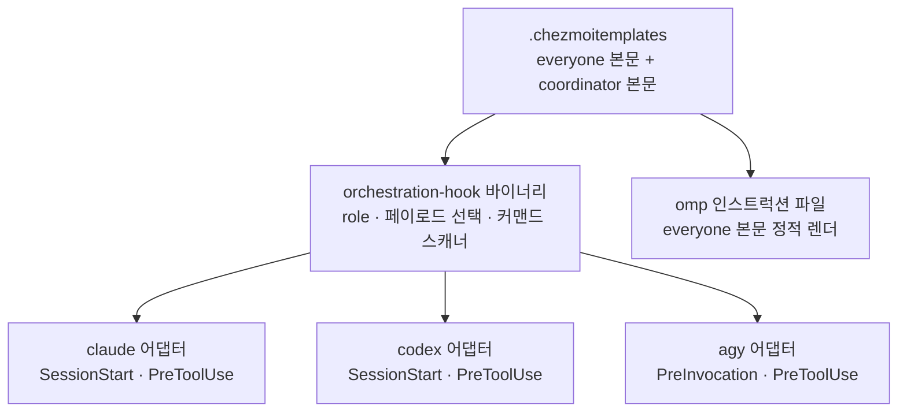
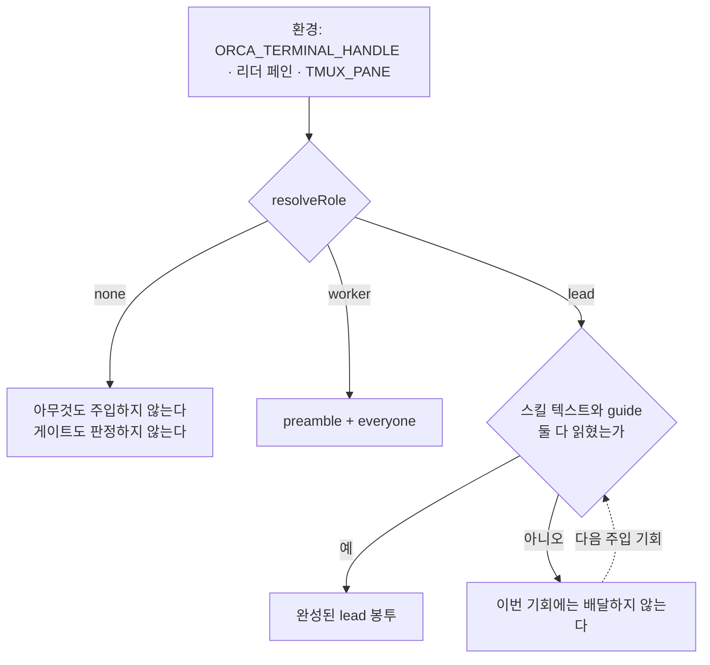
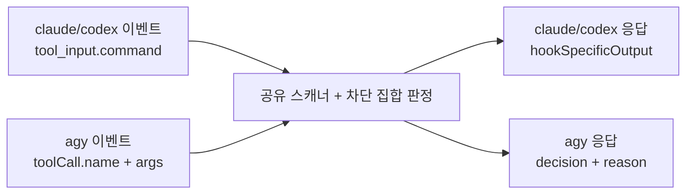

# Harness-Neutral Orchestration Delivery - Plan

## Goal Capsule

- **Objective:** 이 호스트에서 에이전트 팀을 이끄는 세션은 어느 harness에서 시작됐든 같은 오케스트레이션 규칙 아래에서 움직이고, Orca가 감독하지 못하는 피어를 셸에서 띄울 수 없다. 운영자는 Claude 사용량이 막혔을 때 lead를 다른 harness로 옮길 수 있다.
- **Means:** role·페이로드·스캐너 판정을 한 곳에 유지하고 harness마다 얇은 전달 어댑터를 둔다 (KTD5). 세 번째 harness 자리는 `agy`가 채운다 (KD2).
- **Product authority:** 아래 Key Decisions. 저장소 규약은 `AGENTS.md`, 제품 방향은 `STRATEGY.md`, 어휘는 `CONCEPTS.md`가 소유한다.
- **Execution profile:** 증거 우선. U1이 `agy`의 실제 `PreToolUse`·`PreInvocation` 이벤트와 Orca 훅과의 병합 결과를 픽스처로 포착하고, 이후 모든 유닛이 그 픽스처에서 이벤트 형태를 가져온다. 추측한 matcher는 업그레이드 뒤 조용히 발동을 멈추므로 정적 테스트가 전부 녹색인 채로 게이트가 죽는다.
- **Stop conditions:** U1이 `agy` 플러그인 훅의 등록을 관찰하지 못하거나, Orca의 `orca-status` 그룹과 병합했을 때 우리 어댑터의 allow가 최종 결정에 도달하지 못하면 멈추고 보고한다. U8의 금지 해제는 그 증명 없이는 진행하지 않는다.
- **Tail ownership:** 이 플랜은 저장소 게이트가 녹색인 지점에서 끝난다. 실제 호스트에서 `chezmoi apply` 후 세 harness 세션을 열어보는 확인은 운영자가 소유한다.

---

## Product Contract

**Product Contract preservation:** changed: R5, R9 — R5는 `agy`의 게시된 별칭 `antigravity`를 명시하지 않아 한 단어짜리 우회가 남았다. R9는 "파싱 실패는 허용"이 스캐너의 현재 동작(알려진 실행 파일 뒤의 불투명한 인자는 여전히 런치로 판정)과 충돌해, 원래 의도인 어댑터·이벤트 실패를 R9에 남기고 런치 판정 보존을 R13으로 분할했다. added: R14 — coordinator 본문을 중립화하면 `agy`를 dispatch 수신자로 지목하게 되는데, 그 이름이 Orca에서 실제로 받아들여지는지를 어떤 R-ID도 소유하지 않았다. moved: 요구사항-only 판에서 Product Contract에 있던 `Dependencies / Assumptions`는 Planning Contract의 `Assumptions`로 옮겼다 — 남은 항목이 전부 구현 가정이고, 그중 둘은 연구가 해소했다. 다른 R-ID와 Key Decisions는 그대로다.

### Summary

`claude`·`codex`·`agy` 세 harness가 모두 Orca 팀의 lead가 될 수 있게 하고, 오케스트레이션 규칙 주입과 에이전트 런치 게이트를 세 harness에서 같은 판정 로직으로 통일한다. `omp`는 관리 harness로 남되 오케스트레이션 대상에서 빠진다.

### Problem Frame

lead는 지금 Claude Code 하나다. `codex`는 같은 훅 바이너리를 실행하면서도 role과 무관하게 everyone 페이로드만 받고(`packages/orchestration-hook/src/envelope.ts:85-94`), `omp`는 role별로 달라지는 주입점이 없다는 전제 아래 정적 렌더에 의존한다. 게이트는 `claude`와 `codex`만 실행한다.

그래서 두 가지가 동시에 깨져 있다. Claude 사용량이 막히면 lead를 옮길 곳이 없다. 그리고 `omp` 세션은 셸에서 `claude`를 그대로 띄울 수 있다 — 자기 자신은 차단 대상 목록에 있으면서 게이트 주체가 아닌 비대칭이다(`packages/orchestration-hook/src/gate.ts:24-31`).

본문 쪽도 한 harness를 전제한다. coordinator 페이로드는 읽는 쪽이 Claude Code라고 단정하고, dispatch 선호를 `omp`가 worker라는 가정 위에 쓴다(`.chezmoitemplates/orchestration-coordinator.tmpl:9-13`). 어느 쪽 가정도 lead가 옮겨 다니는 세계에서는 성립하지 않는다.

### Key Decisions

- KD1. **세 harness 모두 lead 가능하게 한다.** 목적은 최소 변경이 아니라 훅 구조의 일체화다. (session-settled: user-directed — chosen over codex까지만 lead / 전달 경로만 동등화: 사용량 이전보다 구조 통일이 더 큰 동기다.) Governs R1, R2, R3
- KD2. **세 번째 자리는 `omp`가 아니라 `agy`가 채운다.** `agy`는 절대경로 셸 명령에 JSON stdio라 나머지 둘과 전송 형태가 같고, `omp`에서 문제였던 인프로세스 확장·세션 1회 주입점 부재·fail-closed 기본값이 함께 사라진다. (session-settled: user-directed — chosen over omp 유지.) Governs R1, R4, R5
- KD3. **`omp`는 오케스트레이션에서만 뺀다.** 폐기하지 않으므로 되돌리기 쉽다. (session-settled: user-directed — chosen over 완전 폐기 / 넷 다 유지.) Governs R6
- KD4. **coordinator 본문은 하나로 두고 harness 중립으로 다시 쓴다.** 페이로드가 원시 바이트를 그대로 임베드하는 현재 구조를 유지한다. (session-settled: user-directed — chosen over 공통 본문 + harness별 부록 / 렌더 시점 파라미터화.) Governs R7, R8
- KD5. **실패 정책은 fail-open으로 통일한다.** 잘못된 거부가 도구 호출을 망가뜨리는 비용이, 잘못된 허용이 규칙을 텍스트 상태로 되돌리는 비용보다 크다. (session-settled: user-approved — chosen over harness 기본값 존중 / fail-closed 통일.) Governs R9, R13
- KD6. **봉투는 완성되는 즉시 배달하고 늦은 배달을 허용한다.** 프롬프트 캐시 무효화를 감수한다. (session-settled: user-directed — chosen over 첫 기회에 실패하면 그 세션은 포기.) Governs R10
- KD7. **Antigravity 금지 해제는 세 곳을 한 변경으로 함께 옮긴다.** 셋 중 하나라도 남으면 `agy`는 lead로 서지 못하거나 Orca가 아예 띄우지 못한다. (session-settled: user-directed — chosen over 지시 코어는 사용자가 직접 / 선행 별도 작업.) Governs R11

### Requirements

**lead 자격과 주입**

- R1. 세션의 harness가 `claude`, `codex`, `agy` 중 무엇이든, 그 세션의 resolved role이 lead이면 lead 봉투를 받는다.
- R2. role 판정 규칙은 세 harness에 하나만 존재한다 — 같은 환경 입력이 어느 harness에서도 같은 role을 낸다.
- R3. 세 harness 모두 worker role에서 everyone 페이로드를 받는다.
- R4. `agy` 세션은 모델 호출 이전에 발동하는 주입점으로 봉투를 받는다.
- R10. 봉투는 반쪽으로 배달되지 않는다. 첫 기회에 완성하지 못하면 완성되는 이후 기회에 배달하며, 그 재주입이 프롬프트 캐시를 무효화하는 것은 허용된다.

**런치 게이트**

- R5. Orca가 관리하는 `agy` 세션에서 다른 에이전트 CLI의 셸 런치가 거부되고, 거부 사유가 Orca dispatch 경로를 지목한다. 차단 대상에는 `agy` 자신과 그 게시된 별칭 `antigravity`가 포함된다.
- R9. 세 harness 모두에서 어댑터의 내부 오류, 타임아웃, 형식이 깨진 이벤트, 대상 아닌 도구 이벤트는 아무것도 막지 않는다. harness가 자체 기본값으로 차단하거나 사용자 확인을 요구하는 경우 어댑터가 그것을 허용으로 번역한다.
- R13. 이미 증명된 런치 판정은 약화되지 않는다. 차단 대상 실행 파일이 확정된 뒤 남은 인자가 해석 불가하더라도 그 호출은 계속 거부된다.
- R15. 파일 내용을 셸 명령에 실어 나르는 도구 호출은, 그 내용이 차단 대상 이름을 담고 있다는 이유만으로 거부되지 않는다.

**본문 중립화**

- R7. coordinator 본문은 읽는 쪽을 특정 harness 이름으로 지목하지 않는다.
- R8. dispatch 선호는 작업 성격과 서빙 가족으로 서술되며, 어느 harness가 그 자리에 있는지와 분리된다.
- R14. coordinator 본문이 dispatch 수신자로 지목하는 이름은 Orca가 실제로 받아들이는 에이전트 식별자다.

**`omp` 후퇴**

- R6. `omp`는 lead도 dispatch 수신자도 아니다. everyone 페이로드 수신과 게이트 차단 대상 지위는 유지한다.

**금지 해제**

- R11. Antigravity가 Orca를 이끌지도 워커가 되지도 않는다는 규칙이 세 harness 집합과 모순되지 않도록 개정된다. 대상은 사용자 지시 코어 템플릿, everyone 본문, `.chezmoidata/orca.yaml`의 `disabledTuiAgents` 선언 세 곳이며, 셋은 한 변경으로 함께 움직인다.

**검증**

- R12. CI가 세 harness 각각에 대해 주입 결과와 게이트 판정을 실제 이벤트 형태로 증명한다.

### Key Flows

- F1. lead 봉투 배달
  - **Trigger:** Orca가 팀 lead 자리에 harness 세션을 연다.
  - **Steps:** 어댑터가 환경에서 role을 판정한다 → lead이면 오케스트레이션 스킬 텍스트와 설치된 Orca CLI의 version-matched guide를 읽는다 → 둘 다 확보되면 preamble·guide·everyone·coordinator를 한 봉투로 합쳐 그 harness의 주입점에 넘긴다 → 한쪽이라도 비면 이번 기회에는 아무것도 넘기지 않고 다음 기회에 다시 시도한다.
  - **Outcome:** lead 세션은 완성된 봉투를 받거나, 받을 때까지 아무것도 받지 않는다.
  - **Covered by:** R1, R2, R4, R10

### Acceptance Examples

- AE1. **Covers R1, R4.** **Given** Orca가 `agy` 터미널을 팀 lead 페인에 열었을 때, **When** 세션이 시작되면, **Then** 그 세션은 everyone 본문과 coordinator 본문을 모두 받는다.
- AE2. **Covers R5.** **Given** Orca가 관리하는 `agy` 세션에서, **When** 에이전트가 셸로 다른 에이전트 CLI를 띄우려 하면, **Then** 거부되고 사유가 Orca dispatch 경로를 지목한다.
- AE3. **Covers R9.** **Given** `agy` 훅 어댑터가 타임아웃하거나 예외를 던질 때, **When** 도구 호출이 판정을 기다리면, **Then** 그 호출은 허용된다.
- AE4. **Covers R10.** **Given** lead 세션의 첫 주입 시점에 Orca guide를 읽지 못했을 때, **When** 이후 기회에 guide를 읽을 수 있게 되면, **Then** 완성된 봉투가 그때 배달된다.
- AE5. **Covers R6.** **Given** Orca가 관리하는 `omp` 세션에서, **When** 세션이 시작되면, **Then** everyone 본문은 받지만 coordinator 본문은 받지 않는다.
- AE6. **Covers R3.** **Given** 세 harness 중 아무것이나 worker role로 열렸을 때, **When** 세션이 시작되면, **Then** everyone 본문만 받는다.
- AE7. **Covers R13.** **Given** Orca가 관리하는 세션에서, **When** 차단 대상 실행 파일 뒤에 셸이 해석하지 못하는 인자가 붙은 명령이 들어오면, **Then** 그 호출은 여전히 거부된다.
- AE8. **Covers R5, R9.** **Given** `agy` 세션에서 셸이 아닌 다른 도구의 `PreToolUse` 이벤트가 들어올 때, **When** 어댑터가 판정하면, **Then** 그 호출은 허용된다.

### Success Criteria

- 이 작업이 바꾸는 기존 동작은 정확히 하나다 — `codex` lead가 이제 lead 봉투를 받는 것(R1). `claude`의 세 role, `codex`의 worker와 none, 그리고 두 harness의 게이트 판정은 전부 그대로다.
- 변경 없는 소스에 대한 두 번째 `chezmoi apply`가 어떤 타깃도 바꾸지 않고 어떤 onchange 스크립트도 다시 돌리지 않는다.
- 페이로드 본문, 훅 선언, 플러그인 트리 중 어느 하나를 바꾸면 세 harness가 실제로 서빙하는 사본이 갱신되고, 무관한 소스를 바꾸면 갱신되지 않는다.

### Scope Boundaries

- `omp` 완전 폐기 — 바이너리, MCP, 플러그인, 모델 정책은 건드리지 않는다.
- Orca 앱 자체의 변경 — 전달은 전부 harness 측에서 끝낸다.
- 압축 이후 재배달 설계 — `claude`와 `codex`의 SessionStart matcher가 이미 `compact`를 포함해 해결돼 있다.
- lead를 실제로 어느 harness에 맡길지의 운영 판단 — 이 플랜은 자격만 연다.

#### Deferred to Follow-Up Work

- `omp`를 게이트 *주체*로 만드는 일. R6은 차단 대상 지위만 요구하고, `omp`의 인프로세스 확장 어댑터는 이 작업의 전송 형태 통일과 별개의 비용이다.
- `role.ts`에 세션 신원 검증을 추가하는 일. 상속된 handle·pane 튜플이 낡을 수 있다는 위험은 기존 플랜이 이미 받아들인 가정이며, 이 작업은 그 가정을 바꾸지 않는다.

### Outstanding Questions

**Resolve Before Planning**

없다.

**Deferred to Planning**

없다. 이전에 열려 있던 셋은 KTD1, KTD3, KTD10이 소유한다.

### Sources / Research

- `packages/orchestration-hook/src/envelope.ts:16,35-37,85-94` — harness 유니언과 lead 게이팅. 확장 지점.
- `packages/orchestration-hook/src/role.ts:25-34` — role 판정의 단일 소스. 그대로 공유한다.
- `packages/orchestration-hook/src/gate.ts:24-31,86-101,136-151` — 차단 대상 집합, 이벤트 추출기, fail-open 경로.
- `packages/orchestration-hook/src/command-scan.ts:300-309,346-353,461-463` — 런치 판정이 불투명한 인자를 다루는 방식. R13의 근거.
- `.chezmoitemplates/claude-hook-declaration.tmpl`, `.chezmoitemplates/codex-hook-declaration.tmpl` — 새 선언이 따를 두 형태. Claude는 exec-form `args`, Codex는 명령 문자열에 matcher 없음.
- `.chezmoitemplates/codex-hook-trust.tmpl:41-95` — 렌더된 선언을 해시하고 이벤트·그룹·핸들러 위치로 색인한다. 건드리면 조용히 untrust된다.
- `.chezmoiscripts/70-agents/run_onchange_after_update-claude-plugins.sh.tmpl:13-24` — 플러그인 트리·페이로드·선언을 모두 핑거프린트하는 패턴. `agy` 리콘실러가 따라야 할 형태.
- `.chezmoiscripts/70-agents/run_onchange_after_update-agy-plugins.sh.tmpl:1-5,81-116` — 현재 `agy` 리콘실러. 핑거프린트가 `agents.yaml`과 `releases.json`뿐이고 훅을 모른다.
- `dot_local/share/chezmoi-command-sources/executable_orca-settings-reconcile.tmpl:186-200` — 배열 leaf는 통째로 비교·교체된다.
- `.ci/test-orchestration-hook.sh:231-244,286-401` — 페이로드 바이트 패리티와 harness별 게이트 케이스.
- `.ci/test-agent-instructions.sh:214-257,403-407,442-480,483-569` — `omp` 페이로드 블록 추출, Antigravity 금지 니들, Claude 전용 coordinator 니들.
- `.ci/test-orca-settings-reconcile.sh:271-278` — 라이브 목록이 정확히 `["antigravity"]`로 되돌아오기를 기대한다.
- `~/.gemini/antigravity-cli/builtin/skills/agy-customizations/docs/hooks.md`, `.../docs/plugins.md` — `agy` 훅·플러그인 계약의 권위. 저장소 밖 설치본이며 이벤트 목록, stdin/stdout 스키마, 플러그인 번들 `hooks.json`의 자동 등록을 정한다.

---

## Planning Contract

### Key Technical Decisions

- KTD1. **`agy` 훅은 저장소 소유 로컬 플러그인으로 배달한다.** `~/.gemini/config/hooks.json`은 Orca가 소유하고 재수렴하므로 우리가 쓰면 그 그룹을 덮어쓴다. `agy`는 활성 플러그인의 `hooks.json`을 자동 등록하고 이름이 다른 훅을 같은 이벤트에서 병합해 순차 실행한다. Governs R4, R5
- KTD2. **`agy` 게이트 어댑터는 이벤트 형태로 셸 이벤트를 가려낸다.** `toolCall.args`가 명령을 실은 필드를 가질 때 그 값을 공유 스캐너에 넘기고, 그 밖의 도구와 형식이 깨진 이벤트는 허용한다. 포착한 도구 이름은 픽스처의 단정으로만 쓰고 판별 조건으로 쓰지 않는다 — 이름으로 거르면 CLI 업그레이드의 rename이 게이트를 조용히 없앤다. 응답은 `agy`의 `{decision, reason}` 스키마로 내보내며 Claude의 `hookSpecificOutput` 형태를 쓰지 않는다. Governs R5, R9
- KTD3. **`agy` 봉투는 매 주입 기회마다 완전한 형태로 다시 주입한다.** 훅 핸들러는 호출마다 새 프로세스라 프로세스 내 플래그로는 1회 배달을 보장할 수 없고, 검증된 세션 상태 저장소가 없다. (session-settled: user-directed — chosen over 첫 기회 1회 주입 후 침묵: 프롬프트 캐시 무효화를 감수하더라도 규칙이 도달하는 편이 낫다.) Governs R4, R10
- KTD4. **`claude`·`codex`의 늦은 배달 재시도는 기존 SessionStart matcher가 이미 제공한다.** `startup|resume|clear|compact|fork`가 세션 중 여러 번 발동하므로 새 이벤트를 추가하지 않는다. Governs R10
- KTD5. **harness 유니언과 CLI 디스패치만 `agy`로 확장하고 role·페이로드·스캐너는 공유한 채로 둔다.** 판정이 한 곳에 남아야 세 harness의 행동이 같다는 것을 테스트가 증명할 수 있다. (session-settled: user-directed — chosen over harness마다 독립 구현: 세 벌은 각자 표류한다.) Governs R1, R2, R3
- KTD6. **`agy` 리콘실러의 핑거프린트를 플러그인 트리·렌더된 선언·두 페이로드 본문으로 확장한다.** 지금은 `agents.yaml`과 `releases.json`만 보므로 훅을 바꿔도 설치된 사본이 낡은 채로 남는다. Governs R4, R12
- KTD7. **Codex 선언과 신뢰 템플릿은 이 작업에서 형태를 바꾸지 않는다.** 공유 리팩터가 선언 바이트나 필드 집합을 건드리면 같은 변경에서 정규화를 확장하고 렌더-해시 회귀 테스트를 추가한다. Governs R12
- KTD8. **`disabledTuiAgents`는 빈 배열로 선언한다.** 배열 leaf는 통째로 비교·교체되므로 운영자가 UI에서 따로 비활성화한 에이전트는 수렴 때 되돌아온다. 이는 기존 소유 패턴의 귀결이며 버그가 아니다. Governs R11
- KTD9. **차단 프로그램 집합에 `agy`와 `antigravity`를 함께 추가한다.** 커맨드 매니페스트가 두 이름을 모두 게시하므로 하나만 막으면 한 단어짜리 우회가 남는다. Governs R5
- KTD12. **플러그인 교체에 롤백 장치를 넣지 않고, 실패를 크게 남긴다.** 설치나 활성화가 실패하면 적용이 그 자리에서 죽으므로 운영자가 즉시 보게 되고, 남는 위험은 그 실패를 고치기 전까지 해당 호스트에 게이트가 없는 창뿐이다. 검증되지 않은 백업·복원 로직을 프로비저닝 스크립트에 넣는 쪽이 그 창보다 더 큰 위험이며, 세 리콘실러 중 하나만 다른 실패 모양을 갖게 된다. Governs R5
- KTD11. **패치 본문을 실은 셸 호출은 런치 판정에서 제외한다.** U2 실행 중 관찰됐다 — harness 유니언을 고치는 패치가 `codex`·`claude`·`omp` 리터럴을 담자 게이트가 그것을 런치로 읽고 도구 호출을 막았다. 게이트 자신의 근거가 "잘못된 거부가 도구 호출을 망가뜨린다"이므로 이는 결함이지 정책이 아니다. 파일 편집 도구의 명령 형태를 인식해 그 본문을 스캐너에 넘기지 않는다. Governs R15
- KTD10. **금지 해제는 `agy` 전달 경로가 관찰로 증명된 뒤에만 착수한다.** 플러그인 훅의 등록, Orca 그룹과의 병합 순서, 한쪽이 allow이고 다른 쪽이 ask일 때의 최종 결정이 U1의 픽스처로 확인되기 전에 금지를 풀면, 설 수 없는 lead를 허용하는 상태가 된다. Governs R11

### High-Level Technical Design

한 소스가 세 어댑터로 갈라지고, `omp`는 생성된 정적 투영으로만 남는다.

각 어댑터가 내리는 판정은 harness와 role의 조합 하나로 결정된다.

게이트의 harness별 차이는 입구와 출구뿐이고, 가운데 판정은 공유된다.

### Assumptions

- A1. **확인됨(U1).** 플러그인 번들 `hooks.json`은 설치·활성화로 자동 등록된다 — `agy plugin list`가 그 플러그인의 components를 `["hooks"]`로 보고한다.
- A2. **확인됨(U1).** 셸 도구 이름은 `run_command`이고 명령은 `toolCall.args.CommandLine`에 실린다. 비셸 도구(`list_dir`)의 `args`에는 명령 필드가 없어, KTD2의 형태 기준 판별이 실제 이벤트로 성립한다. 이름은 스텝 타입에서 파생되므로 업그레이드로 바뀔 수 있고, 픽스처가 그 이름을 단정으로만 고정한다.
- A3. `agy plugin install`은 플러그인을 `~/.gemini/config/plugins/<name>/`으로 복사한다. 버전 세그먼트가 있는 캐시 경로가 아니라 이름 하나짜리 사본이므로, 같은 이름으로 다시 설치할 때 덮어쓰는지를 U6이 확인한다.
- A4. `disabledTuiAgents`에서 `antigravity`를 빼면 Orca가 `agy`를 실행 가능한 에이전트로 받아들인다. 지금 `worker-start --agent agy`는 `agent_unconfigured`로 거부되며, 이는 알 수 없는 id가 아니라 비활성 선언의 결과로 읽힌다. R14가 이 가정을 검증 대상으로 소유한다.
- A5. role 판정이 상속된 handle·pane 튜플을 신뢰하므로 낡은 튜플이 세션을 잘못 분류할 수 있다. 기존 플랜이 받아들인 가정이며 이 작업은 그것을 바꾸지 않는다.
- A6. **해소됨(U1).** Orca의 `orca-status` 그룹은 `PreToolUse`에서 무조건 `{"decision":"ask"}`를 낸다. 그럼에도 우리 플러그인 훅이 `allow`를 내면 도구가 실행된다 — 이름이 다른 그룹은 병합돼 순차 실행되고, `ask`가 `allow`에 거부권을 갖지 않는다. 반대로 `deny`는 존중되며 우리가 넣은 `reason` 문자열이 에이전트에게 그대로 전달된다. R5와 R9가 이 경로에서 함께 성립한다.
- A7. `agy`의 비대화식 실행은 명령 도구에 대해 권한 프롬프트를 띄울 수 없어 자체적으로 auto-deny한다. 이는 훅과 무관한 `agy` 고유 동작이며 우리 어댑터가 만들거나 바꾸는 것이 아니다. R9의 fail-open은 우리 어댑터 자신의 응답에 대한 요구다.

### Sequencing

U1은 `agy`의 이벤트 형태를 소비하는 모든 유닛 — U3, U4, U5 — 의 전제다. U2는 유니언과 디스패치만 넓히므로 이벤트 형태에 의존하지 않고, 바이너리 확장의 토대로 U3·U4보다 먼저 간다. U5는 U3·U4가 만든 어댑터를 실제로 호출하는 선언이고, U6은 그 선언이 호스트에 도달하게 만든다. U7은 `agy`와 무관하게 착수할 수 있다. U8은 KTD10에 따라 U1의 증명과 U2–U7의 완성 뒤에만 착수한다. U9는 마지막에 전체를 게이트로 고정한다.

---

## Implementation Units

### U1. `agy` 런타임 이벤트와 훅 병합을 픽스처로 포착

- **Goal:** `agy`의 `PreToolUse`·`PreInvocation` 이벤트 실물과, 플러그인 훅이 Orca의 `orca-status` 그룹과 병합될 때의 등록·순서·최종 결정을 관찰해 저장소에 고정한다.
- **Requirements:** R12를 진전시키고, R4·R5·R9·R11의 전제를 확정한다. KTD10이 이 유닛의 결과를 금지 해제의 선행 조건으로 요구한다.
- **Dependencies:** 없음
- **Files:**
  - `packages/orchestration-hook/test/fixtures/pretooluse-agy.json` (생성)
  - `packages/orchestration-hook/test/fixtures/preinvocation-agy.json` (생성)
  - `docs/plans/2026-09-12-1402-feat-harness-neutral-orchestration-delivery-plan.md` (관찰 결과가 가정을 뒤집으면 A1·A2·A6을 그 자리에서 갱신)
- **Approach:**
  1. 임시 로컬 플러그인을 하나 만들어 `hooks.json`에 stdin을 파일로 덤프하는 핸들러를 `PreToolUse`와 `PreInvocation` 양쪽에 건다.
  2. `agy plugin install`과 `agy plugin enable`로 올린 뒤, 셸 명령을 실행시키는 세션을 한 번 돌려 두 이벤트의 실제 JSON을 얻는다.
  3. 셸 도구의 실제 `toolCall.name`과 명령이 실린 필드 이름을 확정한다(A2).
  4. 우리 핸들러가 `allow`를, Orca 그룹이 `ask`를 내보내는 상황을 만들어 최종 결정을 기록한다(A6). 우리 핸들러가 타임아웃할 때의 결과도 같은 방식으로 기록한다.
  5. 홈 경로에 공백이 있는 경우를 한 번 확인한다. 핸들러는 `sh -c`로 실행되므로 인용이 없으면 바이너리가 fail-open할 기회조차 없이 실패한다.
  6. Orca가 `agy`를 실행 가능한 에이전트로 받아들이는 식별자를 확정한다. `disabledTuiAgents`를 임시로 비운 상태에서 `worker-start`를 한 번 시도해 수락되는 이름을 관찰하고, 확인 뒤 선언을 원래대로 되돌린다. 이 이름이 U7이 소비하는 값이다(R14).
  7. 커밋하는 픽스처는 합성값을 기본으로 한다. 실제 세션에서만 얻을 수 있는 필드는 형태만 남기고 경로·식별자·셸 인자를 치환하며, 남은 식별자는 커밋 전에 가린다. 픽스처는 모든 CI 체크아웃에 영구히 남는다.
  8. 캡처 장치를 완전히 걷어낸다. 임시 플러그인을 비활성화하고 제거하며, 덤프 파일을 지우고, 등록이나 캡처 산출물이 남아 있지 않은지 확인한 뒤에 픽스처를 커밋한다. 저장소에 남는 것은 픽스처와, 가정을 뒤집었을 경우의 플랜 수정뿐이다.
- **Execution note:** 코드보다 관찰이 먼저다. 이 유닛이 끝나기 전에는 어떤 matcher나 필드 이름도 소스에 고정하지 않는다.
- **Patterns to follow:** `packages/orchestration-hook/test/fixtures/pretooluse-claude.json`이 포착된 이벤트를 저장하는 형태. `docs/plans/2026-09-11-1408-feat-team-mode-cli-gate-drop-codex-wrapper-plan.md`의 U0이 같은 증거-우선 순서를 세운다.
- **Test scenarios:** 이 유닛은 증거 수집이며 자체 테스트를 쓰지 않는다. `Test expectation: none -- 포착된 픽스처가 산출물이고, 이후 유닛의 테스트가 그것을 소비한다.`
- **Verification:** 두 픽스처 파일이 존재하고, 각각 실제 세션에서 관찰한 필드 구조를 담고 있으며, 그 안에 실세션 경로·식별자·셸 인자가 남아 있지 않다. 셸 도구 이름과 명령 필드 이름이 플랜의 A2와 일치하거나, 불일치가 A2에 반영돼 있다. 병합 결과와 타임아웃 결과가 A6에 기록돼 있다. Orca가 수락하는 에이전트 식별자가 확정돼 있다. 임시 플러그인과 덤프 파일이 호스트에 남아 있지 않다.

### U2. 바이너리를 세 번째 harness로 확장

- **Goal:** `Harness` 유니언, `isHarness` 가드, CLI 디스패치, 봉투 선택이 `agy`를 인정한다. role 판정과 페이로드 소스는 공유된 채로 남는다.
- **Requirements:** R1, R2, R3. KTD5가 이 유닛의 경계를 정한다.
- **Dependencies:** 없음
- **Files:**
  - `packages/orchestration-hook/src/envelope.ts` (수정)
  - `packages/orchestration-hook/src/cli.ts` (수정)
  - `packages/orchestration-hook/test/envelope.test.ts` (수정)
  - `packages/orchestration-hook/test/cli.test.ts` (수정)
- **Approach:**
  1. `Harness`에 `agy`를 더하고 `isHarness`를 함께 넓힌다.
  2. `composeContext`에서 lead 자격을 `claude` 전용에서 세 harness 공통으로 바꾼다. `omp`는 harness 값이 아니므로 이 변경의 영향을 받지 않는다(R6).
  3. lead 경로의 스킬 텍스트 읽기와 guide 조회를 harness와 무관한 단계로 만든다. 봉투가 반쪽이면 배달하지 않는 현재 규칙은 그대로 둔다(R10).
  4. `emptyOutput`에 `agy`의 무해한 no-op 출력을 더한다. `agy`는 stdout을 JSON 응답으로 읽으므로 Codex식 빈 문자열이 아니라 유효한 빈 문서여야 한다.
  5. `usage` 문자열과 `--harness` 수용값을 갱신한다.
- **Patterns to follow:** `packages/orchestration-hook/src/envelope.ts`의 기존 주석이 왜 Claude만 lead였는지를 기록하고 있다. 그 근거가 사라졌음을 같은 자리에서 다시 쓴다.
- **Test scenarios:**
  - `agy` + lead role에서 봉투가 preamble, 스킬 텍스트, guide, everyone, coordinator를 이 순서로 담는다.
  - `agy` + worker role에서 preamble과 everyone만 담고 coordinator를 담지 않는다.
  - `agy` + none role에서 아무것도 내보내지 않고, 그 출력이 `agy`가 파싱 가능한 no-op이다.
  - 스킬 텍스트가 비었을 때 `agy` lead가 반쪽 봉투 대신 no-op을 받는다.
  - guide 조회가 실패했을 때 `agy` lead가 반쪽 봉투 대신 no-op을 받는다.
  - `codex` lead가 이제 lead 봉투를 받는다 — 기존 worker 고정이 풀렸음을 고정한다.
  - `claude`의 세 role 결과가 이 변경 전후로 같다.
  - `isHarness`가 `omp`를 여전히 거부한다.
- **Verification:** `packages/`에서 타입 체크와 유닛 테스트가 통과하고, `claude` 관련 기존 단정이 하나도 바뀌지 않는다.

### U3. `agy` 게이트 어댑터와 차단 집합 확장

- **Goal:** `agy`의 `PreToolUse` 이벤트가 공유 스캐너에 도달하고, 판정이 `agy`의 응답 스키마로 나간다. 차단 집합이 `agy`와 `antigravity`를 포함한다.
- **Requirements:** R5, R9, R13. KTD2와 KTD9가 이 유닛의 규칙을 소유한다.
- **Dependencies:** U1, U2
- **Files:**
  - `packages/orchestration-hook/src/gate.ts` (수정)
  - `packages/orchestration-hook/src/cli.ts` (수정)
  - `packages/orchestration-hook/test/gate.test.ts` (수정)
  - `packages/orchestration-hook/test/cli.test.ts` (수정)
- **Approach:**
  1. 이벤트에서 명령을 꺼내는 단계를 harness별로 분기한다. `claude`·`codex`는 지금처럼 `tool_input.command`, `agy`는 U1이 확정한 명령 필드를 이벤트 형태로 찾는다(KTD2).
  2. 명령을 실은 필드가 없는 `agy` 이벤트는 스캐너에 가지 않고 허용으로 끝난다(R9).
  3. 판정 결과를 harness별 응답 문서로 내보낸다. `agy`의 허용과 거부 모두 그 CLI가 이해하는 문서여야 한다(KTD2).
  4. `BLOCKED_PROGRAMS`에 `agy`와 `antigravity`를 더한다. 관리용 서브커맨드 집합은 그대로 쓰며, `agy`의 자기 관리 명령이 그 집합으로 통과하는지 확인한다.
  5. 파일 편집 도구가 패치 본문을 명령 문자열에 실어 오는 형태를 인식해, 그 본문을 스캐너에 넘기지 않는다(R15, KTD11). 지금은 harness 유니언을 고치는 패치조차 자기 리터럴 때문에 막힌다.
  6. 스캐너 자체는 그 밖으로 손대지 않는다. R13이 요구하는 동작은 이미 그 안에 있다.
- **Patterns to follow:** `packages/orchestration-hook/src/gate.ts`의 "모든 경로가 허용으로 실패한다" 주석과 `guardAllowOutput`/`guardDenyOutput`의 harness 분기 형태.
- **Test scenarios:**
  - `agy` 관리 세션에서 셸 도구 이벤트로 들어온 `claude` 런치가 거부되고, 사유가 Orca dispatch 경로를 지목한다.
  - 같은 세션에서 `agy` 자신의 런치가 거부된다.
  - 같은 세션에서 `antigravity` 별칭 런치가 거부된다.
  - `agy` 관리 세션에서 셸이 아닌 도구의 이벤트가 허용된다.
  - 셸 도구의 이름이 U1이 포착한 값과 달라도, 명령을 실은 이벤트는 스캐너에 도달해 거부된다.
  - `agy` 이벤트에 명령 필드가 없거나 문자열이 아닐 때 허용된다.
  - `agy` 이벤트 JSON이 깨졌을 때 허용된다.
  - role이 `none`인 `agy` 세션에서 모든 런치가 허용된다.
  - 차단 대상 뒤에 해석 불가한 인자가 붙은 명령이 세 harness 모두에서 거부된다.
  - `agy`의 관리용 서브커맨드가 허용된다.
  - `claude`·`codex`의 기존 허용·거부 케이스가 전부 그대로다.
  - Covers R15. 차단 대상 이름을 본문에 담은 파일 편집 도구 호출이 세 harness 모두에서 허용된다.
- **Verification:** `agy`의 허용·거부 응답이 U1 픽스처가 보여준 스키마와 일치한다. 기존 두 harness의 게이트 단정이 하나도 바뀌지 않는다.

### U4. `agy` 주입 어댑터

- **Goal:** `agy`의 모델 호출 이전 이벤트가 완성된 봉투를 주입 스텝 하나로 돌려준다.
- **Requirements:** R4, R10. KTD3이 주입 주기를 소유한다.
- **Dependencies:** U1, U2
- **Files:**
  - `packages/orchestration-hook/src/envelope.ts` (수정)
  - `packages/orchestration-hook/src/cli.ts` (수정)
  - `packages/orchestration-hook/test/envelope.test.ts` (수정)
  - `packages/orchestration-hook/test/cli.test.ts` (수정)
- **Approach:**
  1. `hook --harness agy`의 출력이 `agy`의 주입 응답 문서가 되게 한다. 봉투 전체가 한 스텝에 들어간다.
  2. 주입 스텝의 종류는 일시적 시스템 메시지를 쓴다. 사용자 메시지로 넣으면 대화 기록에 사용자가 말하지 않은 내용이 남는다.
  3. 배달할 것이 없을 때(role none, 반쪽 봉투)는 주입 스텝이 없는 유효한 응답을 낸다.
  4. 매 기회 재주입이 기본이다(KTD3). 중복 억제 장치를 넣지 않는다.
  5. 전체 실행 예산은 기존 값을 공유하되, `agy` 선언이 주는 시간이 guide 조회 예산보다 큰지 U5에서 맞춘다.
- **Test scenarios:**
  - `agy` lead에서 주입 응답이 스텝 하나를 담고, 그 안에 스킬 텍스트·guide·everyone·coordinator가 모두 있다.
  - `agy` worker에서 주입 응답이 everyone만 담는다.
  - `agy` none에서 주입 스텝이 없는 유효한 응답이 나온다.
  - guide 조회가 첫 호출에 실패하고 두 번째 호출에 성공할 때, 두 번째 응답이 완성된 봉투를 담는다.
  - 내부 예외가 나도 종료 코드가 0이고 응답이 유효하다.
  - stdin이 닫히지 않아도 마감 안에 응답이 나온다.
- **Verification:** AE1과 AE4가 `agy` 경로에서 증명된다. 응답 문서가 U1 픽스처의 스키마와 일치한다.

### U5. `agy` 훅 선언과 플러그인 트리

- **Goal:** 저장소가 소유하는 `agy` 플러그인이 두 훅을 선언하고, 그 선언이 스테이징된 바이너리의 절대 경로를 가리킨다.
- **Requirements:** R4, R5. KTD1이 배달 형태를 소유한다.
- **Dependencies:** U1, U3, U4
- **Files:**
  - `.chezmoitemplates/agy-hook-declaration.tmpl` (생성)
  - `dot_local/share/dotfiles-agy-plugin/plugin.json.tmpl` (생성)
  - `dot_local/share/dotfiles-agy-plugin/hooks.json.tmpl` (생성)
  - `.chezmoidata/agents.yaml` (수정 — `agents.marketplaces`에 localDir 권위 추가, `agents.agy.plugins`에 그 마켓플레이스를 참조하는 행 추가)
- **Approach:**
  1. 선언 partial을 `.chezmoitemplates/`에 둔다. 렌더된 바이트가 플러그인 트리와 다이제스트 양쪽에서 같은 소스를 보게 하려는 것이며, 기존 두 harness가 같은 이유로 그렇게 한다.
  2. `agents.yaml`에 두 항목을 함께 넣는다 — `dotfiles-agy-plugin`의 localDir 마켓플레이스 권위(경로와 호스트 게이트 포함)와 그것을 참조하는 플러그인 행. 공유 행 partial이 모든 행을 마켓플레이스 레지스트리로 해석하므로, 소비자 행만 넣으면 렌더가 실패해 리콘실러까지 가지도 못한다.
  3. `PreToolUse`는 matcher 필드를 갖는 그룹 형태로, 모델 호출 이전 이벤트는 평평한 핸들러 목록으로 선언한다. `agy`가 두 이벤트에 서로 다른 구조를 요구한다. 그 matcher 필드에 무엇을 넣을지는 다음 단계가 정한다.
  4. `PreToolUse` matcher는 도구 이름을 고정하지 않고 전부 받는다. matcher는 어댑터보다 먼저 평가되므로, 고정한 이름이 업그레이드로 바뀌면 어댑터가 걸러낼 기회조차 없이 게이트가 조용히 사라진다 — 정적 테스트는 전부 녹색인 채로. 대상 도구 판별은 어댑터가 이벤트 형태로 수행하고(KTD2), U1이 포착한 이름은 픽스처의 단정으로만 남는다. Codex 선언이 같은 이유로 matcher를 비워 둔다.
  5. 명령 문자열의 절대 경로를 셸 인용한다. 핸들러는 `sh -c`로 돌고 홈 경로에 공백이 있을 수 있다.
  6. 타임아웃은 초 단위 정수로, 주입 쪽은 guide 조회 예산보다 크게, 게이트 쪽은 매 호출 비용을 감안해 작게 둔다.
  7. 플러그인 매니페스트는 이름만 선언한다. `agy`의 매니페스트에는 캐시 무효화에 쓸 버전 필드가 없으므로, 신선도는 U6의 핑거프린트가 전부 책임진다.
- **Patterns to follow:** `.chezmoitemplates/claude-hook-declaration.tmpl`의 헤더 주석이 왜 선언이 partial에 사는지를 기록한다. `dot_local/share/dotfiles-codex-plugin/hooks/hooks.json.tmpl`의 한 줄 래퍼 형태.
- **Test scenarios:**
  - 렌더된 선언이 두 이벤트를 모두 담고, 각 이벤트가 `agy`가 요구하는 구조(그룹 대 평평한 목록)를 쓴다.
  - `PreToolUse` 선언이 도구 이름을 고정하지 않는다.
  - 명령 문자열이 스테이징된 바이너리 경로를 가리키고, 공백이 있는 홈 경로에서도 인용이 유지된다.
  - `PreToolUse` 핸들러가 `guard --harness agy`를, 주입 핸들러가 `hook --harness agy`를 호출한다.
  - 플러그인 매니페스트의 이름이 `agents.yaml`의 선언 행과 일치한다.
  - 마켓플레이스 권위와 플러그인 행이 함께 렌더되고, 권위를 빼면 렌더가 실패한다.
- **Verification:** `chezmoi execute-template`으로 렌더한 선언이 유효한 JSON이고 위 단정을 만족한다.

### U6. `agy` 리콘실러 신선도

- **Goal:** 플러그인 트리, 렌더된 선언, 페이로드 본문 중 어느 하나가 바뀌면 호스트에 설치된 `agy` 플러그인 사본이 갱신된다.
- **Requirements:** R4, R12. KTD6이 핑거프린트 범위를 소유한다.
- **Dependencies:** U5
- **Files:**
  - `.chezmoiscripts/70-agents/run_onchange_after_update-agy-plugins.sh.tmpl` (수정)
  - `.chezmoidata/` 의 skip 선언 매트릭스 (수정 — `agy` 부재를 transient-tolerable로 등재)
  - `.ci/test-claude-agy-plugin-reconcile.sh` (수정)
- **Approach:**
  1. 핑거프린트 헤더에 `dot_local/share/dotfiles-agy-plugin` 트리 전체, `.chezmoitemplates/agy-hook-declaration.tmpl`, 두 페이로드 본문을 더한다. 선언 partial을 이름으로 넣는 것이 핵심이다 — 플러그인 트리의 훅 파일은 그 partial을 부르는 한 줄 래퍼라, partial이 바뀌어도 래퍼 자신의 바이트는 그대로다.
  2. 로컬 플러그인 행을 기존 직접 설치 경로로 처리한다. 소스 디렉터리에 루트 매니페스트가 있어야 한다는 현재 전제를 그대로 만족시킨다.
  3. 설치 실패는 지금처럼 크게 실패시킨다(KTD12). 같은 이름 재설치의 덮어쓰기 동작(A3)은 관찰로 확인하되, 롤백 장치는 넣지 않는다.
  4. `agy` 부재 시의 preflight 실패는 그대로 둔다. 세 에이전트 리콘실러가 모두 CLI 부재에 `die`하고, 이 harness들은 command manifest가 설치하므로 부재는 관용할 조건이 아니라 실제 프로비저닝 실패다. 한 리콘실러만 skip으로 갈라놓으면 같은 스크립트가 다루는 무관한 행의 동작까지 바꾼다.
- **Patterns to follow:** `.chezmoiscripts/70-agents/run_onchange_after_update-claude-plugins.sh.tmpl:13-24`의 핑거프린트 목록. 왜 트리 전체와 트리 밖 입력을 함께 넣는지가 그 자리에 적혀 있다.
- **Test scenarios:**
  - 페이로드 본문만 바꾸면 리콘실러가 다시 돌고 설치된 사본이 새 선언을 담는다.
  - 선언 partial만 바꾸면 같은 결과가 된다.
  - 플러그인 트리의 파일 하나만 바꾸면 같은 결과가 된다.
  - 무관한 저장소 파일을 바꾸면 리콘실러가 다시 돌지 않는다.
  - 같은 소스로 두 번 적용하면 두 번째는 아무것도 바꾸지 않는다.
  - `agy`가 없는 호스트에서 preflight가 이유를 지목하며 실패한다 — 두 형제 리콘실러와 같은 형태다.
  - 설치된 사본의 훅 파일이 렌더된 선언과 바이트 단위로 같다.
- **Verification:** 기존 리콘실러 게이트가 통과하고, 위 변경 시나리오가 각각 기대한 재설치 여부를 보인다. 실패한 교체 뒤에도 런치 게이트가 살아 있다.

### U7. coordinator 본문 중립화와 `omp` 후퇴

- **Goal:** coordinator 본문이 읽는 쪽을 harness 이름으로 지목하지 않고, dispatch 선호를 작업 성격과 서빙 가족으로 서술한다. `omp`는 lead도 dispatch 수신자도 아니다.
- **Requirements:** R6, R7, R8, R14. KD4가 단일 본문 형태를 소유한다.
- **Dependencies:** U1 (Orca가 수락하는 에이전트 식별자)
- **Files:**
  - `.chezmoitemplates/orchestration-coordinator.tmpl` (수정)
  - `.ci/test-agent-instructions.sh` (수정 — Claude 전용 coordinator 니들)
  - `.ci/test-orchestration-hook.sh` (수정 — 페이로드 바이트 패리티 범위)
- **Approach:**
  1. "This harness is Claude Code" 문단을 읽는 쪽 자신을 가리키는 서술로 바꾼다. lead가 Implementation Unit의 수신자를 고르는 주체라는 규칙 자체는 유지한다.
  2. dispatch 수신자 목록에서 `omp`를 빼고, 그 자리에 U1이 확정한 Antigravity 식별자를 넣는다(R14). U8은 그 이름을 되짚어 확인할 뿐 공급하지 않는다.
  3. 싼 서빙 가족으로 보내는 작업 종류의 서술은 유지한다. 어느 harness가 그 자리에 있는지와 분리해 쓴다(R8).
  4. 본문에 템플릿 액션을 넣지 않는다. 빌드가 원시 바이트를 그대로 임베드하며 렌더하지 않는다.
  5. `omp`가 coordinator 본문을 받지 않는다는 사실을 고정하는 단정을 인스트럭션 게이트에 더한다.
- **Patterns to follow:** `.chezmoitemplates/orchestration-everyone.tmpl`이 harness 이름 없이 규칙을 쓰는 방식.
- **Test scenarios:**
  - Covers AE5. `omp` 인스트럭션 렌더가 everyone 본문을 담고 coordinator 본문을 담지 않는다.
  - coordinator 본문에 `Claude Code`를 읽는 쪽으로 지목하는 문장이 없다.
  - coordinator 본문의 dispatch 수신자 목록에 `omp`가 없다.
  - 임베드된 coordinator 바이트가 렌더된 소스 본문과 같다.
  - 본문에 템플릿 액션 구분자가 없다.
- **Verification:** `.ci/test-orchestration-hook.sh`의 패리티 비교와 `.ci/test-agent-instructions.sh`의 니들 검사가 통과한다.

### U8. Antigravity 금지 해제

- **Goal:** 지시 코어 템플릿, everyone 본문, Orca 설정 선언 세 곳이 한 변경으로 `agy`의 lead·worker 자격을 허용한다.
- **Requirements:** R11, R14. KTD10이 순서 제약을, KTD8이 배열 leaf 처리를 소유한다.
- **Dependencies:** U1, U2, U3, U4, U5, U6, U7
- **Files:**
  - `.chezmoitemplates/agents-instructions.tmpl` (수정)
  - `.chezmoitemplates/orchestration-everyone.tmpl` (수정)
  - `.chezmoidata/orca.yaml` (수정)
  - `.ci/test-agent-instructions.sh` (수정 — 금지 니들을 허용 니들로)
  - `.ci/test-orca-settings-reconcile.sh` (수정 — 기대 배열)
- **Approach:**
  1. 지시 코어의 Antigravity 문단을 고친다. lead·worker 금지를 걷어내되, harness마다 도구와 능력이 다르다는 사실은 남긴다.
  2. everyone 본문의 같은 문단을 같은 방향으로 고친다. 두 문단은 서로 다른 전달 표면이므로 양쪽 다 고쳐야 한다.
  3. `disabledTuiAgents`를 빈 배열로 선언한다. 운영자가 UI에서 따로 비활성화한 에이전트가 수렴 때 되돌아온다는 귀결을 `.chezmoidata/orca.yaml`의 주석에 남긴다(KTD8).
  4. 금지가 풀린 상태에서 U1이 확정하고 U7이 쓴 식별자로 Orca dispatch가 실제로 수락되는지 되짚어 확인한다(R14, A4). 수락되지 않으면 멈춰 보고한다 — 이 시점에는 새 이름을 고르는 것이 아니라 앞선 관찰이 틀렸다는 뜻이다.
  5. 인스트럭션 게이트의 금지 니들과 설정 리콘실러 게이트의 기대 배열을 같은 변경에서 갱신한다.
- **Execution note:** KTD10에 따라 U1이 전달 경로를 증명한 뒤에만 착수한다. 증명 없이 금지를 풀면 설 수 없는 lead를 허용하는 상태가 된다.
- **Test scenarios:**
  - 네 harness의 인스트럭션 렌더에 Antigravity lead·worker 금지 문장이 없다.
  - everyone 본문에 같은 금지 문장이 없다.
  - 네 인스트럭션 렌더의 공유 코어가 여전히 서로 같다 — 금지 문단 수정이 harness별 문단으로 새지 않았다.
  - 라이브 목록에 값을 넣어도 수렴 후 빈 배열이 된다.
  - 선언이 검증 템플릿을 통과한다.
- **Verification:** 인스트럭션 게이트와 설정 리콘실러 게이트가 통과하고, 선언이 빈 배열로 수렴한다. `worker-start --agent agy`의 라이브 수락은 운영자의 `chezmoi apply` 이후에 확인된다 — Goal Capsule의 tail ownership이 그 확인을 운영자에게 배정하고, 실행 중인 앱이 메모리에서 다시 쓰는 설정 문서를 이 실행이 직접 고쳐 쓰는 것은 드리프트를 만든다. 이 시점의 근거는 거부 코드가 `agent_unconfigured`이지 미상 에이전트가 아니라는 것, 그리고 Orca 자신의 에이전트 어휘가 두 이름을 모두 담고 있다는 것이다.

### U9. CI 게이트를 세 harness로 확장

- **Goal:** 실제 바이너리 게이트가 세 harness 각각의 주입 결과와 게이트 판정을 이벤트 형태로 증명한다.
- **Requirements:** R12
- **Dependencies:** U2, U3, U4, U5, U6, U7, U8
- **Files:**
  - `.ci/test-orchestration-hook.sh` (수정)
  - `.ci/test-agent-instructions.sh` (수정)
  - `.github/workflows/ci.yml` (필요할 때만 수정)
- **Approach:**
  1. 훅 호출·봉투 role·선언 검사 루프에 `agy`를 더한다. 기존 두 harness의 케이스 중 손대는 것은 `codex` lead 단정 하나뿐이다 — worker 고정에서 lead 봉투 수신으로 바꾼다(R1). 나머지는 그대로 두어 무변경을 증명한다.
  2. 런치 게이트 루프에 `agy` 세션 케이스를 더하고, U1 픽스처를 입력으로 쓴다.
  3. 응답 문서 형태를 harness별로 단정한다 — `agy`가 Claude의 응답 문서를 받으면 조용히 무시한다.
  4. 새 잡을 만들지 않는다. 기존 `agent-reconciliation` 잡이 이미 두 게이트를 돌린다. 잡을 더하면 `delivery.needs` 항목도 함께 더해야 한다.
- **Patterns to follow:** `.ci/test-orchestration-hook.sh:286-374`의 harness 루프 구조.
- **Test scenarios:** 이 유닛의 산출물이 테스트다. 게이트 자신이 아래를 증명한다.
  - Covers AE1, AE6. 세 harness × 세 role의 주입 결과.
  - Covers AE2. 세 harness 관리 세션에서의 거부.
  - Covers AE3, AE8. 세 harness에서의 fail-open 경로.
  - Covers AE7. 해석 불가한 인자가 붙은 차단 대상 런치의 거부.
  - 세 harness의 선언이 모두 스테이징된 바이너리를 가리킨다.
  - 임베드된 두 페이로드가 렌더된 소스와 바이트 단위로 같다.
- **Verification:** `.ci/test-ci-wiring.sh`가 통과하고 고아 스크립트를 보고하지 않는다. 확장된 두 게이트가 통과한다.

---

## Verification Contract

| 게이트 | 명령 | 적용 대상 |
|---|---|---|
| 타입 체크 | `packages/`에서 `vp run -r typecheck` | U2, U3, U4 |
| 유닛 테스트 | `packages/`에서 `vp run -r test` | U2, U3, U4 |
| 린트·포맷 | `packages/`에서 `vp check` | U2, U3, U4 |
| 실제 바이너리 게이트 | `.ci/test-orchestration-hook.sh` | U2, U3, U4, U5, U7, U9 |
| 인스트럭션 게이트 | `.ci/test-agent-instructions.sh` | U7, U8, U9 |
| 플러그인 리콘실러 게이트 | `.ci/test-claude-agy-plugin-reconcile.sh` | U6 |
| Orca 설정 리콘실러 게이트 | `.ci/test-orca-settings-reconcile.sh` | U8 |
| 빌드·스테이징 게이트 | `.ci/test-build-orchestration-hook.sh` | U2 이후 회귀 확인 |
| CI 배선 게이트 | `.ci/test-ci-wiring.sh` | U9 |

실제 바이너리 게이트는 소스 테스트로 대체되지 않는다. 임베드된 페이로드 바이트와 런타임 응답 문서는 컴파일된 실행 파일로만 증명된다.

`chezmoi apply` 멱등성은 변경 없는 소스에 대한 두 번째 적용이 타깃을 바꾸지 않고 onchange 스크립트를 다시 돌리지 않는 것으로 확인한다.

---

## Definition of Done

**전역**

- R1–R14가 각각 하나 이상의 유닛과 테스트에 걸려 있다.
- Verification Contract의 모든 게이트가 통과한다.
- `claude`와 `codex`의 기존 단정 중 바뀐 것은 `codex` lead 하나뿐이고, 그 변경은 R1이 요구한 것이다.
- Codex 선언의 바이트와 신뢰 레코드 키·해시가 이 변경 전후로 같다. 바뀌었다면 정규화 확장과 회귀 테스트가 같은 변경에 들어 있다(KTD7).
- U1이 남긴 관찰이 A1·A2·A6에 반영돼 있고, 가정을 뒤집은 항목은 그 자리에서 수정됐다. A3의 설치 복사 동작은 U6이 소유한다.
- 실험용 플러그인, 임시 덤프 핸들러, 시도했다가 접은 코드가 diff에 남아 있지 않다.

**유닛별**

각 유닛의 `Verification` 항목이 그 유닛의 완료 조건이다. U8은 추가로 KTD10의 선행 조건 — U1의 전달 경로 증명 — 이 충족됐을 때만 완료로 본다.
