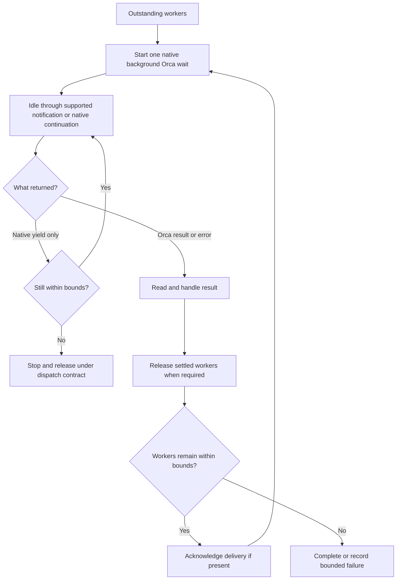

# Coordinator background waits across harnesses - Plan

## Goal Capsule

- Objective: The operator can leave Claude, Codex, or Antigravity supervising workers without unnecessary status requests or a lost continuation.
- Means: Share the coordinator waiting obligation and retain native execution adapters for each harness, per KTD1 and KTD2.
- Authority: Repository and user instructions govern execution; the confirmed Product Contract defines scope.
- Execution profile: Change instruction source and its existing regression gate on the checked-out branch.
- Stop conditions: Report an unsupported continuation mechanism or failed required validation instead of claiming parity.
- Tail ownership: The user-authorized joint `lfg` run owns implementation, review, PR, CI, and merge for this plan and the separate Antigravity version-pin plan. Deployment requires a separate user request.

## Product Contract

### Summary

Extend the existing Claude coordinator waiting policy to Codex and Antigravity coordinators.
Keep one shared behavioral contract and give each harness instructions that match its native tools.

### Problem Frame

The current template places the background execution and idle behavior requirements inside the Claude branch.
Other coordinators receive the common wait-command rules but lack the corresponding execution policy.
The user wants the same protection against blocked interaction, unnecessary polling, and filler calls across all three coordinators.

### Requirements

#### Coordinator waiting

- R1. Apply the background waiting obligation when Claude, Codex, or Antigravity supervises dispatched Orca workers; do not extend it to ordinary tasks or the worker's own execution.
- R2. Start the installed guide's blocking Orca wait through the harness's native asynchronous command mechanism, preserving its explicit timeout and any returned command handle. Handle an immediate result directly when no handle is returned.
- R3. While waiting, issue no timer-driven status queries, nonblocking output polls, filler commands, or duplicate watchers; useful independent work remains allowed. A required blocking continuation on the same command is not a status poll, but must minimize avoidable model requests.
- R4. Resume on the wait result or a relevant event and handle completion, question, escalation, timeout, or error before starting another wait.
- R5. Preserve a working continuation while workers remain outstanding. Each native adapter must explicitly permit or forbid ending the agent turn based on verified wake behavior; the coordinator must not infer permission from a desktop notification or the existence of a background process. An absent or mismatched adapter never grants permission to end the turn.

#### Compatibility

- R6. Preserve the common wait-command form, shell-loop prohibition, acknowledgement order, applicable worker deadlines, run bounds, and release obligations.
- R7. Preserve omp's exclusion from orchestration and the existing distinction between worker waits and unrelated condition watchers.
- R8. Express common behavior once and keep harness-specific tool names and arguments in their own template branches.

### Key Decisions

- Common coordinator policy with native adapters. Governs R1, R2, R8. (session-settled: user-approved — chosen over the Claude-only policy: apply the same waiting discipline to the other supported coordinators.)
- Verified continuation before ending a turn. Governs R3, R5. (session-settled: user-approved — chosen over copying Claude's unconditional turn-ending wording: prevent a coordinator from stopping without a wake path.)

### Actors

- A1. The operator who uses any of the three supported coordinators.
- A2. The coordinator that owns the Orca Run and consumes deliveries.
- A3. Dispatched workers whose messages and settlement remain Orca-owned.

### Acceptance Examples

- AE1. Covers R1–R4. With two outstanding workers, the coordinator starts one background Orca wait, makes no filler calls during silence, and handles the first relevant delivery.
- AE2. Covers R5. Without documented automatic wake after a final response, the coordinator keeps the same wait alive through native blocking continuation; it does not send a final response and assume a future wake.
- AE3. Covers R4, R6. A worker settles while another remains active; the coordinator handles the settlement and required release before acknowledging and starting the next wait.
- AE4. Covers R1, R7. An ordinary build or an omp session does not acquire a new coordinator execution obligation.
- AE5. Covers R3, R6. A native tool yields while its Orca wait still runs; the coordinator resumes that same handle instead of launching another Orca wait or polling worker state.

### Scope Boundaries

This change covers instruction source, regression fixtures, and behavioral verification of those instructions.
The user subsequently authorized Antigravity's Orca setup and an isolated verification environment, then expanded the work to investigate and fix Orca's isolated-launch agent recognition. Limit that work to enabling the required verification. Prefer an existing supported launch path when it works. This change does not add a scheduler, alter dispatch routing, or deploy candidate instructions to the live home directory.

## Planning Contract

### Key Technical Decisions

- KTD1. Extend `## Waiting on dispatched workers` in `.chezmoitemplates/agents-instructions.tmpl` as the shared owner of R1–R8. Move the portable idle policy out of the Claude paragraph and leave concrete tool usage in each harness branch. Keep the shared section identical across rendered harnesses; its explicit coordinator predicate leaves omp unaffected.
- KTD2. Use native background execution plus native continuation. Claude retains `Bash` with `run_in_background: true`. The candidate Codex adapter uses yielding execution and blocking continuation on the returned session handle. The candidate Antigravity adapter uses `run_command` with `WaitMsBeforeAsync: 500` and normal terminating-command semantics. U0 must verify these candidates before U1 fixes their wording. Keep the existing Codex `shell` term as the command-tool category; qualify `exec_command` and `write_stdin` as names from the inspected schema, not tools guaranteed in every session.
- KTD3. Do not equate an Orca command timeout, a native tool yield, and an agent turn ending. Native continuation that blocks on the existing command is permitted under R3; repeated instantaneous status checks are not. Use the largest blocking interval allowed by the active tool, higher-priority responsiveness limits, and the remaining deadline. A native yield never authorizes a duplicate Orca wait.
- The inspected Codex schema caps initial execution at 30,000 ms and empty-input continuation at 300,000 ms; this session also limits blocking calls to 60 seconds. These are distinct limits, not a zero-cost automatic wake guarantee. A short foreground Orca timeout would create repeated Orca commands and would not satisfy the confirmed background requirement. Retain native continuation, measure its unavoidable call count in U0, and report that limit rather than claim Claude-equivalent idle cost. Check deadlines on every native yield and use the installed stop/release path when a bound expires.
- KTD4. Keep Claude's known wake behavior local to Claude. Antigravity's bundled instructions describe completion notifications, but completion-triggered continuation must still pass the behavioral check. Codex's inspected tool contract establishes yielding and continuation, not automatic model invocation after a final response. Apply R5 without adding notification hooks or assuming that a desktop notification resumes the model.
- KTD5. Update the existing gate and fixtures together. `.ci/test-agent-instructions.sh` already checks both the whole shared wait section and harness-specific paragraphs, so a new parallel test framework is unnecessary.

### High-Level Technical Design

The native command handle and Orca Delivery are separate identities.
Only a completed Orca wait supplies the delivery to acknowledge.

### Evidence and Limits

The subsequent [preflight record](../verification/2026-09-13-coordinator-wait-preflight.md) confirms hook execution and model-reported normative injection with isolated Antigravity 1.1.28. Use the separate [version-pin plan](2026-09-13-1533-fix-antigravity-hook-version-pin-plan.md) to retain that candidate. This resolves a startup prerequisite only; U0's coordinator mechanism checks and U2's behavior checks remain required.

- `.chezmoitemplates/agents-instructions.tmpl:49` places the current background mandate in the Claude branch; the Codex and Antigravity branches follow it.
- `.chezmoitemplates/agents-instructions.tmpl:63` owns the common command-form rule and worked examples. Those examples currently say to end the turn and must be aligned with R5.
- `.ci/test-agent-instructions.sh:222` compares the whole shared section with its fixture. The harness-specific needles around line 377 must move with their owning text.
- `docs/plans/2026-09-11-1431-docs-forbid-shell-loops-orca-waits-plan.md` records why shared behavior and harness-specific tools were separated. This plan extends that separation rather than changing the command-form contract.
- `.chezmoidata/releases.json` records Codex `rust-v0.154.0`, Antigravity `1.2.2`, and Orca `v1.4.200`. The installed command targets matched the first two version segments; Orca status reported `1.4.200`.
- Codex's active tool schemas expose yielding `exec_command` and blocking `write_stdin` continuation. The installed binary contains matching tool descriptions. Neither inspection proves wake after a final response. The [official Codex CLI documentation](https://learn.chatgpt.com/docs/codex/cli) does not establish that guarantee either.
- Antigravity's installed binary describes `WaitMsBeforeAsync` as the delay before backgrounding and recommends 500 ms for background commands. It also contains a tool instruction to avoid status polling because completion sends a message. These embedded strings support the intended adapter, but do not prove which schema every session receives. [Official hooks documentation](https://antigravity.google/docs/hooks) illustrates `run_command` with `WaitMsBeforeAsync`; [CLI background-task documentation](https://antigravity.google/docs/cli/subagents) confirms shell tasks are tracked in the background.
- Planning did not execute a harness smoke test. U0 owns mechanism proof; U2 owns candidate-policy verification.
- The original planning dispatch used the wrong Orca agent ID, `agy`, and failed with `agent_unconfigured`. Runtime inspection later identified `antigravity`, and a supervised start with that ID returned `state: ready` and `input_accepted`. The original Antigravity research and independent review passes did not run, but that failure is not evidence that the harness is unconfigured. Turn-start observation was unsupported, so the start receipt alone does not prove the worker executed its task.
- The subsequent Antigravity preflight returned a valid `worker_done` and was released. It reported native asynchronous completion notifications and no documented user-instruction path override. This was schema inspection, not a coordinator wake test.
- A Bubblewrap read-only bind exposed a probe file at the user instruction path inside a child process while the host file's SHA-256 remained unchanged. An Antigravity session launched through that wrapper reached `tui-idle`, but Orca refused supervised attachment with `agent_unconfigured`: "is not running a recognized agent." No probe task was delivered. The isolated terminal was closed. Filesystem isolation works, but its integration with Orca's agent recognition remains unverified and blocks U0; do not remove the dispatch or injection requirement to bypass it.
- A subsequent launch used an interactive shell inside Bubblewrap, with `--dev-bind /dev /dev` to preserve device access, and sent `agy` through Orca's terminal input command. Supervised attachment then succeeded with `state: ready` and `input_accepted`, using the existing validation path. The loading report and coordinator behavior remain separate checks; this receipt alone proves neither.
- That probe returned `worker_done` but reported no startup marker and no normative Orca injection. Its report distinguished the dispatch preamble from standing rules. The running agy process's instruction file hash matched the isolated candidate, while the host file retained its original hash. Thus process-level file replacement succeeded, but model-context loading did not pass. The user also observed command-execution waiting; without an execution receipt, do not classify that delay as background completion waiting. Release returned `external_terminal` with no process action, so the run closed its own settled probe terminal explicitly and acknowledged the delivery.

### System-Wide Impact

All four instruction wrappers render the shared template, so the new role predicate must survive every target.
The coordinator and everyone payloads retain their current lifecycle and dispatch authority.
No new glossary term, capability registry, model preference, or plugin mechanism is needed.

### Risks and Dependencies

Tool schemas can vary by version and session.
An adapter must use fields present in that session and retain the returned handle; a missing required mechanism is an explicit unsupported result.
Text fixtures prove delivery of the policy but cannot prove model behavior, so U2 requires separate observation.
If automatic wake is unproven, native blocking continuation is the chosen path under KTD3, not an invitation to poll or abandon supervision.

## Implementation Units

### U0. Establish the supported evaluation path

- Goal: Verify native mechanisms before fixing adapter wording, without contaminating the evaluation with old instructions.
- Requirements: R2, R3, R5, R6; KTD2–KTD4.
- Dependencies: None.
- Files: Sanitized implementation evidence only; no deployed configuration changes.
- Approach: Inspect the installed Orca guide for a supported isolated coordinator launch and harness-specific instruction/configuration override. Verify that candidate user-scoped instructions replace the old source at the same precedence while retaining the repository supplement and Orca injection. A candidate added only to task context is not isolation. Never repurpose the shell's HOME variable, copy credentials, bypass Orca with a direct peer CLI, or assume a scratch configuration path works without documented support.
- Authority: Each evaluation must start as an Orca-owned coordinator, not as a dispatched review worker asked to re-dispatch. Record the supported launch command and isolation option before executing it. Evaluation lifecycle changes require the user's explicit session-lifecycle direction under the standing instructions; this plan does not waive that gate. Workers perform read-only tasks, but starting, messaging, stopping, and releasing them are lifecycle mutations.
- Checks: Confirm all three harnesses are configured. Observe native background execution, immediate completion, command-handle continuation, notification delivery, and whether completion actually resumes the coordinator after its turn ends. Record tool schemas, effective blocking limits, and model/tool-call counts over a measured silent interval. Set each adapter's turn-ending permission from that evidence, with no permission by default.
- Verification: A supported launch/isolation recipe and sanitized mechanism trace exist for each harness. If configuration, isolation, launch authority, or wake support is missing, stop before U1 and report the exact prerequisite and required user action. Do not substitute a task-context-only trace or claim verification passed.

### U1. Share the coordinator waiting policy

- Goal: Deliver R1–R8 consistently while preserving native tool instructions.
- Requirements: R1–R8; KTD1–KTD5.
- Dependencies: U0.
- Files: `.chezmoitemplates/agents-instructions.tmpl`, `.ci/test-agent-instructions.sh`, `.ci/fixtures/agent-instructions/waiting-on-dispatched-workers.txt`, `.ci/fixtures/agent-instructions/harness-is-claude.txt`, `.ci/fixtures/agent-instructions/harness-is-codex.txt`, `.ci/fixtures/agent-instructions/harness-is-agy.txt`.
- Approach: Move the portable clauses to their shared owner, revise the three native adapters using U0 evidence, and align the examples and fixtures in the same change. Append each native adapter to its existing single physical `This harness is` line; the gate strips that line when checking shared-body equality. Leave unrelated Claude delegation and condition-watcher clauses intact. Update both positive and negative gate assertions to prevent tool-name leakage or a contradictory exception.
- Patterns to follow: Existing whole-section fixtures, whole-harness paragraph fixtures, per-harness needles, and Linux/macOS render comparisons in the gate.
- Test scenarios:
  1. Render all four harnesses on Linux and macOS; the shared policy is identical and contains the coordinator predicate.
  2. Render each supported harness; its adapter uses only that harness's tool vocabulary and preserves R5.
  3. Covers AE4. Render omp; its non-dispatch rule remains and it receives no native coordinator adapter.
  4. Remove the background obligation, add unconditional turn-ending to the shared example, or leak a Claude-only tool into a peer adapter; the corresponding assertion rejects the regression.
  5. Covers AE3, AE5. Preserve command-form and lifecycle assertions while distinguishing native yield from an Orca result.
- Verification: The existing isolated render gate passes with reviewed fixture changes, and the source diff contains no unrelated policy edits.

### U2. Verify waiting behavior across coordinators

- Goal: Establish that the rendered instructions preserve supervision without busy polling.
- Requirements: R1–R7; AE1–AE5; KTD2–KTD4.
- Dependencies: U1.
- Files: This plan's Verification Contract and `.ci/test-agent-instructions.sh` supply the evaluation scenarios; no production harness code changes are planned.
- Approach: Use the supported coordinator launch and instruction isolation established in U0 with U1's rendered candidate files. Run bounded evaluations with read-only worker tasks; retain the explicit lifecycle authority and cleanup established in U0. Record the harness version, active tool names, native handle, instruction provenance, event sequence, model/tool-call counts, and outcome in sanitized implementation evidence.
- Execution note: Use the installed Orca guide and release every evaluation worker. No live instruction deployment or task-context replacement of higher-precedence instructions is allowed.
- Test scenarios:
  1. Covers AE1. During a silent interval, each coordinator starts one background wait and makes no filler or status-query calls.
  2. Covers AE2. A coordinator without verified automatic wake uses blocking continuation and still processes the eventual result.
  3. Covers AE3. A question and a completion from different workers are both handled, with required release before acknowledgement.
  4. Covers AE5. A native yield returns to the same command handle and does not create a second wait.
  5. An Orca timeout or command error is handled without acknowledging a nonexistent delivery; applicable deadlines remain enforced.
  6. Covers AE4. Worker briefs and ordinary commands retain their original execution obligations.
- Verification: Sanitized traces distinguish command backgrounding, model continuation, and Orca message handling for all three harnesses. An unavailable harness is reported as an unmet verification criterion, never a pass.

## Verification Contract

- Run `bash .ci/test-agent-instructions.sh` after U1 using its existing isolated render helper. Preserve the stub `op`, empty config, scratch destination, restricted PATH, and current-checkout source safeguards.
- Inspect the diff against `.ci/fixtures/agent-instructions/harness-is-omp.txt`; it should remain unchanged.
- Run `git diff --check`, inspect the scoped diff, and confirm the final worktree status.
- Complete U2's behavioral scenarios. Static fixture success alone does not establish automatic wake or absence of busy polling.
- Do not run `chezmoi apply` as verification. If a later authorized shipping run pushes, it must watch the repository's required CI workflows to terminal success.

## Definition of Done

- U0 establishes the authorized isolated coordinator evaluation and verifies native mechanisms before adapter wording is finalized.
- U1 delivers the common role-scoped policy and valid native adapters with passing isolated regression checks.
- U2 provides evidence for all supported coordinators, or the implementation run stops and reports the exact unmet criterion to the operator.
- Confirmed scope and lifecycle constraints remain intact; no unrelated source or deployed state is changed.
- Remove abandoned implementation attempts from the diff before handoff.
