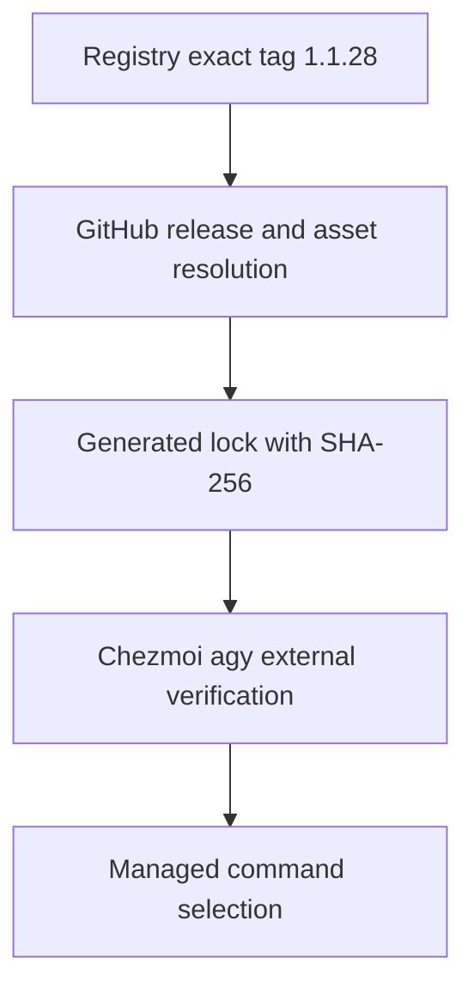

# Antigravity hook version pin - Plan

## Goal Capsule

- Objective: Operators can start Antigravity with working Orca hook delivery after routine tool refreshes.
- Means: Temporarily pin the verified official 1.1.28 release through KTD1.
- Authority: Repository and user instructions govern execution. Requirements own behavior; KTDs own implementation choices.
- Execution profile: Packaging and resolver work, with offline regression tests followed by an isolated runtime check.
- Stop conditions: Unverifiable release assets, a failed hook check, or a required change to credentials or permission policy blocks rollout.
- Tail ownership: The user-authorized joint `lfg` run owns implementation, review, PR, CI, and merge for this plan and the coordinator background-wait plan. Live deployment requires a separate user request.

## Product Contract

### Summary

Keep managed Antigravity on 1.1.28 until a newer release passes hook verification.
Track the upstream regression through an issue subscription.

### Problem Frame

Installed Antigravity 1.2.2 loads hook declarations but did not execute the tested hooks.
The official 1.1.28 Linux x64 binary executed both Orca's hook and the dotfiles hook in an isolated launch, and the model reported the injected normative instructions.
[Upstream issue #1008](https://github.com/google-antigravity/antigravity-cli/issues/1008) reports the same version regression on macOS.
The current release resolver follows moving vendor manifests, so editing the generated lock alone would not hold the working version.

### Requirements

#### Version retention

- R1. Normal release refreshes and managed installs must resolve Antigravity to exactly 1.1.28 while the pin is active.
- R2. Preserve the current Linux and macOS, amd64 and arm64 artifact matrix with verified official release URLs and checksums.
- R3. Other tools must retain their existing update behavior, and failed resolution must not silently substitute a newer Antigravity release.
- R4. Verification must demonstrate hook execution and model-context delivery in a fresh isolated Antigravity session without changing live instructions, credentials, or permission policy. Run this check on each available target and identify unavailable targets as artifact-verified only, never runtime-verified.

#### Tracking and removal

- R5. Subscribe the authenticated user to issue #1008 without watching the entire repository or posting upstream. The subscription was confirmed as `SUBSCRIBED` on 2026-09-13.
- R6. Remove or advance the pin only through a reviewed source change after a newer official release passes R4 and a supported supervised worker lifecycle check. Issue closure or a release announcement alone must not trigger removal.

### Scope Boundaries

This plan changes version selection and its checks, not orchestration instructions or approval defaults.
The separate [coordinator background-wait plan](2026-09-13-1424-refactor-coordinator-background-waits-plan.md) still owns coordinator wait behavior and all-harness verification.
The successful startup probe does not complete that plan's U0 gate.
Do not add a notification bot, repository-wide watcher, Windows support, or a general version-policy framework.

### Acceptance Examples

- AE1. Covers R1, R3. When upstream latest is newer than 1.1.28, a refresh still selects 1.1.28 for Antigravity while another unpinned tool advances.
- AE2. Covers R2, R3. When the exact release is missing, an asset is absent, or its digest is invalid, verification fails. No latest-release fallback can make the run green.
- AE3. Covers R6. When the upstream issue closes but the candidate does not execute hooks, the pin remains unchanged.

## Planning Contract

### Key technical decisions

- KTD1. Use the existing GitHub release resolver with an optional exact-tag selector for R1. Point only `agy` at `google-antigravity/antigravity-cli`, tag `1.1.28`. Fetch the tag-specific release endpoint, verify the returned tag, and reject conflicting exact-tag and tag-prefix declarations. This reuses asset selection and digest normalization instead of creating a second lock or a stale-entry hold.
- KTD2. Use the official GitHub asset SHA-256 values for R2. Change the agy external's checksum consumer from SHA-512 to SHA-256 in the same change as its lock entry. Keep vendor-manifest SHA-512 support and the existing digest gate for other consumers. Do not calculate replacement hashes from unverified downloads or leave the checksum empty.
- KTD3. Keep the vendor resolver available for a later return to normal updates under R6. Document the pin reason, issue link, and removal gate beside the registry declaration and in the release-lock README. The hourly refresh must obey the registry pin without changes to its schedule or success criteria.
- KTD4. Use the existing isolated Orca launch and native authentication for R4. Start with the same configuration and isolation shape for the candidate and control. Trace hook execution and verify injected context separately using a fresh marker added only to the isolated hook output, not to the user prompt or instruction file. Preserve the normative payload; a hook declaration read or plugin validation alone is insufficient.

For this rollout, the candidate is 1.1.28 and the control is 1.2.2 under the identical overlay.
For a later R6 check, the candidate is the proposed newer release and the control is the current pin.

### High-level technical design

### Evidence and risks

The [preflight record](../verification/2026-09-13-coordinator-wait-preflight.md) contains the Linux startup result and its limits.
Only Linux x64 received a local runtime test; upstream macOS evidence is corroboration, not local coverage of all four targets.
Version 1.1.28 was tested with a temporary configuration overlay, while earlier 1.2.2 probes did not all use that identical overlay. A matched control belongs in U2.
An older release can miss later fixes. Subscription notifications prompt review under R6; they do not authorize unattended upgrades.
Antigravity's own updater is a separate possible writer. U2 must establish whether it can replace or redirect the managed executable before rollout; do not guess an undocumented disable setting.

Implementation discovery: A normal full refresh also advances `compound-engineering`, `deslop`, and `unslop`. To preserve unrelated entries without hand-editing generated data, U1 adds `--only <registered-tool>` to the existing generator. Selected refreshes merge only that tool into the prior lock. Full refreshes keep their existing behavior. Unknown or conflicting arguments must fail before writes. This adds `packages/release-lock/src/cli.ts` to U1's files, with `src/resolve-all.ts` available if selection requires it.

The native updater accepts the documented `AGY_CLI_DISABLE_AUTO_UPDATE=true` setting in isolated 1.1.28. U2 owns its source declarations in `dot_config/environment.d/60-development.conf` for Linux desktop processes and `dot_config/zsh/dot_zshenv` for Linux and macOS shells. The existing digest regression script verifies the declarations and exported shell value. Its CI job installs zsh as well as the locked chezmoi. Live deployment remains excluded.

## Implementation Units

### U1. Make the release pin survive refresh

Goal: Implement R1-R3 and document the R5-R6 maintenance contract.

Dependencies: None.

Files: `packages/release-lock/src/types.ts`, `packages/release-lock/src/github.ts`, `packages/release-lock/src/registry.ts`, `packages/release-lock/test/github.test.ts`, `packages/release-lock/test/registry.test.ts`, `packages/release-lock/test/cli.test.ts`, `packages/release-lock/README.md`, `.chezmoidata/releases.json`, `.chezmoiexternals/ai-agents.toml`, `.ci/test-release-lock-digest-gate.sh`.

Approach:

1. Add the bounded selector and fail-closed validation from KTD1 using the existing HTTP retry and resolution-error paths.
2. Switch the agy registry entry, generated artifacts, and checksum consumer together under KTD2. Select the official Linux and macOS x64/arm64 archive names from release metadata.
3. Add KTD3 maintenance notes and tests. Preserve unrelated generated lock entries when preparing this change.

Test scenarios:

- Covers AE1. An exact tag remains selected when latest and release-list fixtures advertise a newer version; unpinned and prefix-filtered tools retain existing selection.
- Reject conflicting selectors, mismatched returned tags, draft/prerelease responses, missing expected assets, and invalid or absent digests at the applicable resolver or digest gate.
- Covers AE2. A failed pinned resolution preserves the prior whole entry and returns failure through the CLI. A stale prior 1.2.2 entry must not count as successful pin verification.
- Render each supported agy external from the new lock and verify its URL and nonempty SHA-256. Keep the existing SHA-512 acceptance and missing-digest rejection tests green.

Verification: The pinned entry is reproducible from fresh metadata, normal refresh retains it, and all four external renders consume the matching checksums.

### U2. Verify the managed runtime and record release criteria

Goal: Prove R4 and leave an actionable R6 removal procedure.

Dependencies: U1.

Files: `docs/verification/2026-09-13-coordinator-wait-preflight.md`, `packages/release-lock/README.md`; add a focused fixture under `.ci/` only if the existing rendering checks cannot cover U1's agy checksum transition.

Approach:

1. Exercise candidate rendering and command selection in isolated source and destination state. Both `agy` and `antigravity` must resolve to the selected artifact.
2. Repeat the candidate/control startup check under KTD4. Capture the version, hook process evidence, exact marker response, and unchanged host-state checks without recording credentials or full private prompts.
3. Check the documented self-update behavior and managed command ownership. If a supported updater control is required, name its exact owner and verification before implementing it; unsupported behavior blocks rollout.
4. Verify one supported Orca worker start, completion delivery, and release with the candidate. Retain the independent coordinator wait-plan gate.
5. Document how to test a future official release, make the reviewed pin change, and re-verify artifacts and hooks under R6. Returning to the vendor resolver must restore the agy external's SHA-512 consumer together with the new lock entry, then pass all four render checks. Advancing an exact GitHub tag retains KTD2's SHA-256 consumer.

Execution note: Runtime evidence is required. Unit tests of the hook binary do not prove that Antigravity calls it.

Test scenarios:

- A fresh candidate session executes both hooks and receives normative Orca instructions; the control result is recorded even if it contradicts earlier observations.
- Starting the managed command does not self-update or select another executable. If an update attempt exists, the supported control prevents version drift without bypassing permissions.
- A supervised candidate worker delivers its completion and is released; all diagnostic terminals receive a cleanup decision.
- Covers AE3. A hypothetical issue closure without passing candidate evidence leaves the documented pin-removal decision negative.

Verification: Evidence identifies the exact candidate and control, separates startup proof from coordinator-wait behavior, and records any platform coverage gap. Live deployment has not occurred.

## Verification Contract

- In `packages`, run the repository's `vp check`, `vp test`, and `vp run typecheck` gates after dependency setup required by `packages/AGENTS.md`.
- Run `.ci/check-release-lock-digests.sh` and `.ci/test-release-lock-digest-gate.sh` against the candidate lock and existing negative fixtures.
- Use the existing isolated Fedora, Ubuntu, and macOS render workflow for source checks, always with the checkout as explicit source. Do not apply to the live home directory.
- Require U2 runtime evidence in addition to static and unit checks. A missing supported updater control when one is needed to prevent version drift, or a failed hook invocation, is a rollout blocker, not a waived test.
- If a later implementation run pushes a PR, its shipping workflow must wait for terminal green CI. This plan-writing request does not start that workflow.

## Definition of Done

- U1 satisfies AE1-AE2, preserves unrelated update behavior, and changes the checksum producer and consumer together.
- U2 produces the runtime and managed-version evidence required by R4, with honest platform coverage.
- The issue subscription remains recorded, and the README names the R6 removal gate.
- No experimental production changes remain, all probe workers are settled and released, and no live credentials, instructions, or permission settings were changed.
- The original coordinator background-wait plan remains separate and is not marked complete by this workaround.
