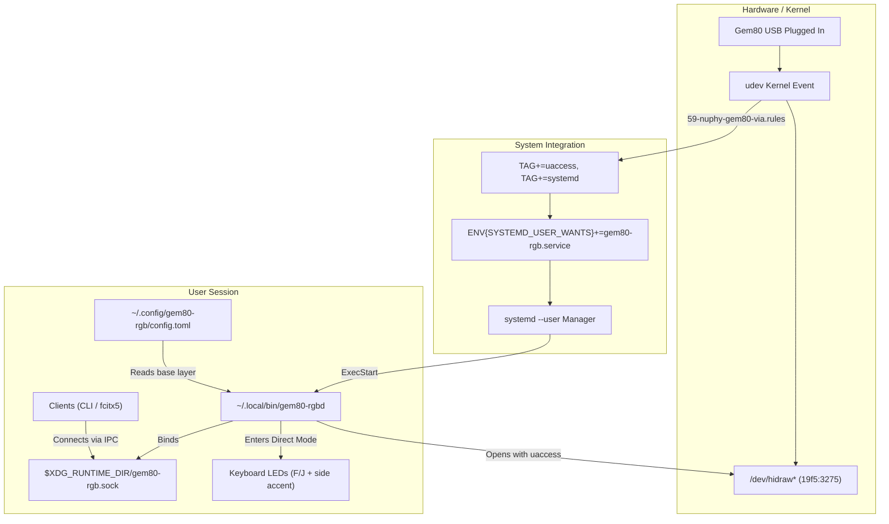

# Gem80 RGB Daemon Deployment - Plan

## Goal Capsule

- **Objective:** The Gem80 keyboard's custom host lighting daemon and CLI build and run automatically on managed Linux workstations without manual cargo invocations, activating the background service whenever the keyboard is connected over USB and restoring host lighting seamlessly across reconnections.
- **Means:** Build `gem80-rgbd` and `gem80-rgbctl` via `.chezmoiscripts/60-build/`, reconcile binaries into `~/.local/bin` through `command-reconcile`, trigger `gem80-rgb.service` via udev `SYSTEMD_USER_WANTS`, and deploy default base-layer configuration in `~/.config/gem80-rgb/config.toml`.
- **Product authority:** GitHub issue [hyperlapse122/dotfiles#459](https://github.com/hyperlapse122/dotfiles/issues/459) consensus, `crates/gem80-rgb` daemon contract ([PR #475](https://github.com/hyperlapse122/dotfiles/pull/475)), and `firmware/nuphy-gem80-hostrgb/dist/verification-log.md`. Active scope is daemon packaging, systemd service, udev integration, and default configuration. Surrounding areas (fcitx5 indicator client, firmware revision 3) are not active scope.
- **Open blockers:** None.

---

## Product Contract

**Product Contract preservation:** Product Contract unchanged.

### Summary

Deploy `gem80-rgbd` and `gem80-rgbctl` as managed system components on Linux workstations. The binaries build on apply, install to `~/.local/bin`, start automatically via systemd when the Gem80 connects over USB, and maintain active lighting state across reconnections.

### Problem Frame

The core Gem80 RGB daemon and client library merged in PR #475, but no provisioning mechanism installs or runs the daemon automatically. A user currently must navigate to `crates/gem80-rgb` and execute `cargo run --features daemon --bin gem80-rgbd` inside an interactive terminal.

When that terminal closes, the daemon dies, causing keyboard lighting to drop back to firmware effects. Furthermore, future client applications (such as input method status indicators) require a stable background daemon listening on `$XDG_RUNTIME_DIR/gem80-rgb.sock` whenever the keyboard is attached.

### Key Decisions

- **Device-triggered via udev** (session-settled: user-directed — chosen over always-on session autostart: starts only when the physical keyboard is connected). Governs R3, R4.
- **Daemon persists across disconnect** (session-settled: user-directed — chosen over stopping service with device: preserves socket and client layer state across replugs). Governs R5.
- **Base lighting: Dark keys with illuminated homing markers and side accent** (session-settled: user-directed — chosen over uniform backlight: illuminates only the shine-through finger markers on `F` and `J` keys in soft neutral white `#b4b4b4`, leaves other key LEDs dark `#000000`, and paints a subtle warm glow on the side strip and logo). Governs R6.
- **Cargo build in 60-build with command-reconcile activation** (session-settled: user-approved — chosen over manual cargo run: automates building without creating a root workspace). Governs R1, R2.

<!-- ce-section: work-relationships -->
### How This Work Fits Together

This plan delivers the deployment and automation layer for the Gem80 RGB daemon. The surrounding areas from issue #459 represent current understanding rather than active requirements:

- `fcitx5 input-language indicator client` — Depends on this deployment; consumes the installed daemon socket and `gem80_rgb` client library to reflect IME status.
- `Firmware revision 3` — Can proceed independently; patches QMK to suppress hardware under-key indicator overlays while Direct mode owns the key matrix.

### Requirements

#### Build and Command Reconciliation

- R1. `gem80-rgbd` (with `daemon` feature enabled) and `gem80-rgbctl` compile automatically via Cargo during chezmoi apply on Linux hosts outside containers.
- R2. Staged binaries reconcile into `~/.local/bin/` with `0755` permissions, tracking source file fingerprints in `.chezmoidata/commands.yaml` under `commands.units.gem80-rgb`.

#### Service and Device Activation

- R3. The udev rule for NuPhy Gem80 (`19f5:3275`) assigns `TAG+="systemd"` and `ENV{SYSTEMD_USER_WANTS}+="gem80-rgb.service"` alongside existing `uaccess` rights.
- R4. The `gem80-rgb.service` systemd user service runs `~/.local/bin/gem80-rgbd` in the user session, starting upon device attachment without blocking desktop login.
- R5. `gem80-rgbd` remains active across USB disconnection events, logging device absence while preserving socket listeners and re-enumerating the device upon reconnection.

#### Configuration and Runtime Environment

- R6. Chezmoi deploys `~/.config/gem80-rgb/config.toml` configuring base-layer key LEDs off (`#000000`), `F` and `J` homing keys illuminated in soft neutral white (`#b4b4b4`) for shine-through finger markers, and a subtle warm glow on the side strip and logo.
- R7. `gem80-rgbd` binds its UNIX domain socket and advisory lock file inside `$XDG_RUNTIME_DIR`.

### Key Flows

- F1. Initial device plug
  - **Trigger:** NuPhy Gem80 keyboard connects via USB.
  - **Steps:** Kernel enumerates USB device; udev tags node with `uaccess` and `systemd`; udev dispatches `SYSTEMD_USER_WANTS="gem80-rgb.service"`; systemd user manager starts `gem80-rgb.service`; daemon loads `~/.config/gem80-rgb/config.toml`, creates `$XDG_RUNTIME_DIR/gem80-rgb.sock`, acquires device HID node, enters Direct mode, and paints the base layer.
  - **Covered by:** R1, R2, R3, R4, R6, R7

- F2. Client interaction
  - **Trigger:** Client connects to `$XDG_RUNTIME_DIR/gem80-rgb.sock`.
  - **Steps:** Client registers layer; daemon tracks connection and layer z-index; client posts pixel updates; compositor blends active client pixels over base layer and transmits frames to keyboard.
  - **Covered by:** R4, R7

- F3. USB disconnect and reconnect
  - **Trigger:** Gem80 keyboard is unplugged and later replugged.
  - **Steps:** Daemon encounters I/O failure on raw HID node; device state transitions to `Absent`; daemon enters backoff retry loop while retaining UNIX socket and client registrations; keyboard connects again; daemon re-opens HID device, negotiates Direct mode, and repaints composite layer without restarting `gem80-rgb.service`.
  - **Covered by:** R5

### Acceptance Examples

- AE1. Compilation and activation
  - **Covers R1, R2.**
  - **Given** a Linux host outside containers running `chezmoi apply`,
  - **When** the apply script executes,
  - **Then** `gem80-rgbd` and `gem80-rgbctl` exist in `~/.local/bin/` with `0755` permissions and report version output.

- AE2. udev rule deployment
  - **Covers R3.**
  - **Given** `/etc/udev/rules.d/59-nuphy-gem80-via.rules`,
  - **When** the udev installer applies system rules,
  - **Then** the rule includes `TAG+="systemd"` and `ENV{SYSTEMD_USER_WANTS}+="gem80-rgb.service"`.

- AE3. Device-triggered startup
  - **Covers R4, R7.**
  - **Given** `gem80-rgb.service` is inactive and stopped,
  - **When** the Gem80 keyboard connects to a USB port,
  - **Then** systemd user manager starts `gem80-rgb.service`, and `$XDG_RUNTIME_DIR/gem80-rgb.sock` becomes reachable.

- AE4. Disconnect resilience
  - **Covers R5.**
  - **Given** `gem80-rgb.service` running with an active client connected to the socket,
  - **When** the USB cable is unplugged,
  - **Then** `gem80-rgb.service` remains in state `active (running)`, and
  - **When** the USB cable is plugged back in,
  - **Then** the daemon reclaims the HID interface and restores lighting without service restart.

- AE5. Managed configuration loading
  - **Covers R6.**
  - **Given** deployed `~/.config/gem80-rgb/config.toml`,
  - **When** `gem80-rgbd` starts,
  - **Then** the daemon applies the declared base configuration with dark key LEDs, illuminated `F` and `J` homing markers, and a subtle side strip glow.

### Scope Boundaries

#### Active Scope

- Build script in `.chezmoiscripts/60-build/` compiling `crates/gem80-rgb`.
- Command unit entry in `.chezmoidata/commands.yaml` managing `gem80-rgbd` and `gem80-rgbctl`.
- udev rule update in `system/linux/etc/udev/rules.d/59-nuphy-gem80-via.rules`.
- Systemd user service unit in `dot_config/systemd/user/gem80-rgb.service`.
- Managed configuration in `dot_config/gem80-rgb/config.toml`.

#### Deferred for Later

- `fcitx5` input method indicator daemon (consuming the client library).
- Firmware revision 3 (QMK patch suppressing under-key indicator overlays in direct mode).

#### Outside This Product's Identity

- Non-Linux platforms (macOS / Windows service definitions).
- Root-level or system-wide daemon execution (host lighting belongs to the active desktop user session).

### Dependencies / Assumptions

- Rust toolchain (Cargo) is available on managed Linux hosts via mise or distribution packages.
- Linux host kernel provides `hidraw` support and systemd user manager.
- The NuPhy Gem80 keyboard runs custom HostRGB firmware (`0x60`) supporting Direct mode and watchdog protocol.

---

## Planning Contract

### Key Technical Decisions

- KTD1. **Cargo release build in 60-build staged to incomplete directory** (session-settled: user-approved — chosen over cargo install: integrates with dotfiles atomic staging and command-reconcile lifecycle). Governs R1.
- KTD2. **Single unit `gem80-rgb` producing multiple binaries in `commands.yaml`** (session-settled: user-approved — chosen over separate units: `gem80-rgbd` and `gem80-rgbctl` share identical crate source, build dependencies, and release cycle). Governs R2.
- KTD3. **Combine uaccess and systemd tags on existing Gem80 udev rule** (session-settled: user-directed — chosen over separate rule file: preserves single source of truth for `19f5:3275` hidraw nodes). Governs R3.
- KTD4. **Systemd user service with on-failure restart and non-blocking session dependencies** (session-settled: user-directed — chosen over WantedBy=default.target: service is purely device-driven via udev, with restart backoff on transient errors). Governs R4, R5.
- KTD5. **Matrix indices 68 (`F`) and 71 (`J`) illuminated in `config.toml` base layer** (session-settled: user-directed — chosen over uniform backlight: matches physical shine-through homing keycaps on Gem80 ANSI layout). Governs R6.

### High-Level Technical Design



### Assumptions

- Cargo is installed and runnable on Linux hosts executing `chezmoi apply` (e.g. through mise or system package).
- The Linux user session runs a systemd user manager that responds to `ENV{SYSTEMD_USER_WANTS}` from active-seat udev events.

---

## Implementation Units

### U1. Build script for gem80-rgb in 60-build

- **Goal:** Compile `gem80-rgbd` (with `daemon` feature) and `gem80-rgbctl` and stage them atomically into the incomplete commands directory.
- **Requirements:** R1, Covers AE1
- **Dependencies:** None
- **Files:**
  - `.chezmoiscripts/60-build/run_onchange_after_60-build-gem80-rgb.sh.tmpl`
- **Approach:**
  - Create run-on-change script guarded by `{{ if eq .chezmoi.os "linux" }}` and `{{ if not $f.container }}`.
  - Fingerprint `Cargo.toml`, `Cargo.lock`, and `crates/gem80-rgb/src/**` using `includeTemplate "fingerprint.tmpl"`.
  - Check for `cargo` availability; if missing, emit `skip_here` with `transient-blocking` probe.
  - Execute `cargo build --release --manifest-path "$SRC/crates/gem80-rgb/Cargo.toml" --features daemon --bin gem80-rgbd --bin gem80-rgbctl`.
  - Create staging directory `$HOME/.local/share/chezmoi-commands/incomplete/gem80-rgb`.
  - Atomically copy release binaries to temporary files and rename to target names with `0755` mode.
- **Patterns to follow:** `.chezmoiscripts/60-build/run_onchange_after_build-settings-reconcile.sh.tmpl`
- **Test scenarios:**
  - Happy path: Given a clean Linux checkout with Cargo installed, When script executes, Then binaries exist at `$HOME/.local/share/chezmoi-commands/incomplete/gem80-rgb/{gem80-rgbd,gem80-rgbctl}`.
  - Skip path: Given cargo is absent, When script executes, Then it exits cleanly via `skip_here`.

### U2. Command reconciliation declaration in commands.yaml

- **Goal:** Declare `gem80-rgb` unit in `.chezmoidata/commands.yaml` so `command-reconcile` deploys both executables to `~/.local/bin/`.
- **Requirements:** R2, Covers AE1
- **Dependencies:** U1
- **Files:**
  - `.chezmoidata/commands.yaml`
- **Approach:**
  - Add unit `gem80-rgb` under `commands.units`:
    ```yaml
    gem80-rgb:
      producer: build
      safetyProfile: native-multi-file
      proofEligible: true
      mode: "0755"
      platforms: [linux]
      gate: "!container"
      fingerprintGlobs:
        - crates/gem80-rgb/Cargo.toml
        - crates/gem80-rgb/Cargo.lock
        - crates/gem80-rgb/src/**
      commands:
        - name: gem80-rgbd
        - name: gem80-rgbctl
    ```
- **Patterns to follow:** `settings-reconcile` unit in `.chezmoidata/commands.yaml:605-626`.
- **Test scenarios:**
  - Happy path: Verify `.chezmoidata/commands.yaml` parses valid YAML and passes schema validation.
  - Reconciliation smoke: When `command-reconcile` executes with staged binaries present, symlinks/copies appear in `~/.local/bin/gem80-rgbd` and `~/.local/bin/gem80-rgbctl`.

### U3. udev rule update for systemd user activation

- **Goal:** Update `59-nuphy-gem80-via.rules` to register device with systemd and request user service activation.
- **Requirements:** R3, Covers AE2
- **Dependencies:** None
- **Files:**
  - `system/linux/etc/udev/rules.d/59-nuphy-gem80-via.rules`
  - `system/README.md`
- **Approach:**
  - Modify `system/linux/etc/udev/rules.d/59-nuphy-gem80-via.rules` from:
    `KERNEL=="hidraw*", SUBSYSTEM=="hidraw", ATTRS{idVendor}=="19f5", ATTRS{idProduct}=="3275", TAG+="uaccess"`
    to:
    `KERNEL=="hidraw*", SUBSYSTEM=="hidraw", ATTRS{idVendor}=="19f5", ATTRS{idProduct}=="3275", TAG+="uaccess", TAG+="systemd", ENV{SYSTEMD_USER_WANTS}+="gem80-rgb.service"`
  - Update `system/README.md` inventory table entry describing the rule.
- **Patterns to follow:** Existing `system/linux/etc/udev/rules.d/` conventions.
- **Test scenarios:**
  - Rule syntax: Assert udev rule contains correct attribute matching and variable assignments.

### U4. Systemd user service definition

- **Goal:** Create `gem80-rgb.service` user unit running `gem80-rgbd`.
- **Requirements:** R4, R5, R7, Covers AE3, AE4
- **Dependencies:** U1, U2
- **Files:**
  - `dot_config/systemd/user/gem80-rgb.service`
- **Approach:**
  - Create `dot_config/systemd/user/gem80-rgb.service`:
    ```ini
    [Unit]
    Description=NuPhy Gem80 RGB Host Lighting Daemon
    Documentation=https://github.com/hyperlapse122/dotfiles
    After=graphical-session-pre.target

    [Service]
    Type=simple
    ExecStart=%h/.local/bin/gem80-rgbd
    Restart=on-failure
    RestartSec=2s
    Environment="RUST_LOG=info"
    ```
- **Patterns to follow:** `dot_config/systemd/user/orca-settings-reconcile.service`.
- **Test scenarios:**
  - Unit syntax: Run `systemd-analyze --user verify dot_config/systemd/user/gem80-rgb.service` (or parse test).

### U5. Default base layer configuration

- **Goal:** Deploy managed `config.toml` for `gem80-rgbd` configuring dark keys with illuminated homing markers and side glow.
- **Requirements:** R6, Covers AE5
- **Dependencies:** None
- **Files:**
  - `dot_config/gem80-rgb/config.toml`
- **Approach:**
  - Create `dot_config/gem80-rgb/config.toml`:
    ```toml
    [base]
    # Keys remain unlit by default
    keys_color = "#000000"

    # Subtle warm glow on upper strip and logo LEDs (indices 89..101)
    side_color = "#201810"

    # Soft neutral white on F and J shine-through homing keycaps (indices 68 and 71)
    [base.leds]
    "68" = "#b4b4b4"
    "71" = "#b4b4b4"
    ```
- **Patterns to follow:** `crates/gem80-rgb/src/config.rs` deserialization schema.
- **Test scenarios:**
  - Config parse test: Assert `crates/gem80-rgb` parses `dot_config/gem80-rgb/config.toml` without error and extracts the expected LED mappings.

---

## Verification Contract

| Test / Command | Scope | Units | Expected Result |
|---|---|---|---|
| `cargo test --manifest-path crates/gem80-rgb/Cargo.toml --all-targets --all-features` | Rust crate suite | U1, U5 | All unit and integration tests pass cleanly |
| `python3 -c "import toml; d = toml.load('dot_config/gem80-rgb/config.toml'); assert d['base']['leds']['68'] == '#b4b4b4'"` | Config validity | U5 | TOML parses with correct F/J LED indices |
| `chezmoi execute-template < .chezmoiscripts/60-build/run_onchange_after_60-build-gem80-rgb.sh.tmpl` | Script render | U1 | Script renders without template errors |
| `git diff --check` | Whitespace & syntax | U1-U5 | Clean diff with no syntax errors or trailing spaces |

---

## Definition of Done

1. `run_onchange_after_60-build-gem80-rgb.sh.tmpl` is present, renders cleanly, and builds release binaries when invoked.
2. `.chezmoidata/commands.yaml` contains `gem80-rgb` with both binaries declared under `commands:`.
3. `59-nuphy-gem80-via.rules` carries `TAG+="systemd"` and `ENV{SYSTEMD_USER_WANTS}+="gem80-rgb.service"`.
4. `dot_config/systemd/user/gem80-rgb.service` exists and defines `ExecStart=%h/.local/bin/gem80-rgbd`.
5. `dot_config/gem80-rgb/config.toml` exists with `keys_color = "#000000"`, `side_color = "#201810"`, and `F`/`J` LEDs (`68`, `71`) set to `#b4b4b4`.
6. Cargo test suite in `crates/gem80-rgb` passes with all features enabled.
