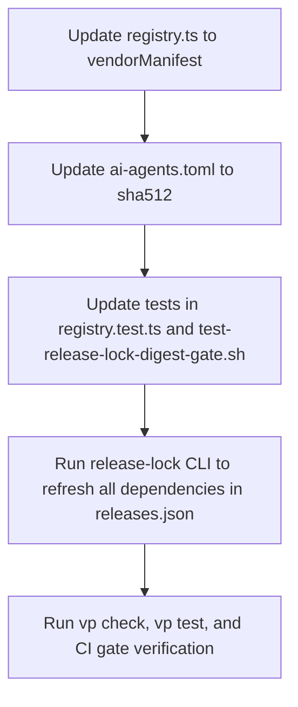

# Unpin Antigravity CLI and update dependencies - Plan

## Goal Capsule

- Objective: Unpin the Antigravity CLI (`agy`) from `1.1.28`, restore standard vendor manifest resolution, and update all external tool releases and package dependencies across the repository to their latest versions.
- Means: Revert the temporary GitHub exact-tag pin in `packages/release-lock/src/registry.ts`, restore vendor manifest resolution with SHA-512 in `.chezmoiexternals/ai-agents.toml`, update package test suites and CI gates, and regenerate `.chezmoidata/releases.json`.
- Authority: Repository instructions (`AGENTS.md`), user instructions, and explicit user request `/compound-engineering:lfg unpin antigravity cli and update all dependencies to latest`.
- Execution profile: Release-lock registry modification, external template update, test adjustments, lockfile regeneration via `packages/release-lock/src/cli.ts`, and full verification.
- Stop conditions: Network resolution failures that cannot be retried, checksum validation mismatches on generated artifacts, or lint/typecheck failures across `packages`.
- Tail ownership: LFG autonomous execution owns plan, implementation, simplification, code review, review fixes, commit, push, PR creation, and CI babysitting.

## Product Contract

### Summary

Restore the Antigravity CLI (`agy`) to upstream vendor manifest tracking and refresh all external tool dependencies in `.chezmoidata/releases.json` to their latest releases.

### Problem Frame

Antigravity CLI was temporarily pinned to version `1.1.28` via GitHub releases in PR #505 due to upstream issue #1008 and coordinator wait investigations. The user has directed unpinning the CLI and refreshing all dependencies to latest. The repository release-lock architecture supports resolving `agy` via `vendorManifest` from its auto-updater endpoint, producing SHA-512 checksums consumed by `.chezmoiexternals/ai-agents.toml`.

### Requirements

- R1. Antigravity CLI (`agy`) in `packages/release-lock/src/registry.ts` must be unpinned from `1.1.28` and restored to `vendorManifest` using vendor `antigravity` and source `https://antigravity-cli-auto-updater-974169037036.us-central1.run.app/manifests`.
- R2. `.chezmoiexternals/ai-agents.toml` must consume `sha512` for `agy.checksum`, matching the vendor manifest resolution output.
- R3. `.chezmoidata/releases.json` must be regenerated with all tools refreshed to their latest available upstream releases.
- R4. Unit tests in `packages/release-lock/test/registry.test.ts` and CI gates in `.ci/test-release-lock-digest-gate.sh` must be updated to verify the unpinned vendorManifest resolution and SHA-512 checksum rendering for `agy`.
- R5. Documentation in `AGENTS.md` and `packages/release-lock/README.md` must be updated to reflect that `agy` is unpinned and tracks vendor manifests.
- R6. Full test suite and lint/typecheck gates (`vp check`, `vp test`, `vp run typecheck`, `.ci/check-release-lock-digests.sh`, `.ci/test-release-lock-digest-gate.sh`) must pass cleanly.

### Scope Boundaries

- In scope: `packages/release-lock/src/registry.ts`, `.chezmoiexternals/ai-agents.toml`, `.chezmoidata/releases.json`, `packages/release-lock/test/registry.test.ts`, `.ci/test-release-lock-digest-gate.sh`, `packages/release-lock/README.md`, `AGENTS.md`.
- Out of scope: Modifying orchestration rules, altering authentication mechanisms, removing other tools from the lockfile, or manual edits to generated JSON.

### Acceptance Examples

- AE1. Covers R1, R2, R3. Running `bun run packages/release-lock/src/cli.ts` regenerates `.chezmoidata/releases.json` where `agy` has `kind: "vendorManifest"`, version `1.2.2` (or latest), and artifacts with valid `sha512` values and null `sha256`.
- AE2. Covers R2, R4. Rendering `.chezmoiexternals/ai-agents.toml` on Linux and macOS (amd64 and arm64) yields valid `url` and `sha512` entries for `agy`.
- AE3. Covers R4, R6. `vp test`, `vp check`, `vp run typecheck`, and `.ci/test-release-lock-digest-gate.sh` all exit 0 with all checks passing.

## Planning Contract

### Key technical decisions

- KTD1. (Session-settled) Unpin `agy` by restoring `vendorManifest` in `packages/release-lock/src/registry.ts`:
  ```typescript
  agy: {
    kind: "vendorManifest",
    vendor: "antigravity",
    source: "https://antigravity-cli-auto-updater-974169037036.us-central1.run.app/manifests",
  },
  ```
- KTD2. Restore `sha512` in `.chezmoiexternals/ai-agents.toml`:
  ```toml
  [agy.checksum]
  sha512 = '{{ includeTemplate "release-lock-ref.tmpl" (mergeOverwrite $agyLockArtifact (dict "field" "sha512")) }}'
  ```
- KTD3. Update `.ci/test-release-lock-digest-gate.sh` to assert vendorManifest resolution and SHA-512 consumer rendering instead of the former `1.1.28` exact tag check.
- KTD4. Regenerate `.chezmoidata/releases.json` using `bun run packages/release-lock/src/cli.ts --out .chezmoidata/releases.json` to update all tools to their latest upstream releases.

### High-level technical design



### Evidence and risks

- Vendor manifest endpoint `https://antigravity-cli-auto-updater-974169037036.us-central1.run.app/manifests/linux_amd64.json` is verified reachable and returns version `1.2.2` with SHA-512 hash `74342cf2a78b344392e573b638a648a6ad1f8e877f494b96e20f9c2b79158d5c423c40b2dcf788703362bb0a9150f09c707fde599d7557ce01c12208802a63cb`.
- The vendor resolver `resolveAntigravity` in `packages/release-lock/src/vendor-manifest.ts` is already fully implemented, tested, and ready.
- Refreshing all dependencies may advance multiple tools (e.g. `ast-grep`, `mise`, `gh`, etc.). The release lock generator ensures atomic updates and preserves required digests.

## Implementation Units

### U1. Restore Antigravity vendor manifest registry and externals configuration

Goal: Revert `agy` registry entry to `vendorManifest` and configure `.chezmoiexternals/ai-agents.toml` to consume SHA-512.

Dependencies: None.

Files: `packages/release-lock/src/registry.ts`, `.chezmoiexternals/ai-agents.toml`.

Approach:
1. Edit `packages/release-lock/src/registry.ts` to replace the `githubRelease` exactTag configuration for `agy` with the `vendorManifest` declaration.
2. Edit `.chezmoiexternals/ai-agents.toml` to change `sha256` back to `sha512`.

Test scenarios:
- `bun run packages/release-lock/src/cli.ts --stdout --only agy` emits a lock entry with `kind: "vendorManifest"` and SHA-512 artifacts.

### U2. Update unit tests and CI verification gates

Goal: Update test assertions in `packages/release-lock/test/registry.test.ts` and `.ci/test-release-lock-digest-gate.sh` to validate the unpinned vendorManifest `agy`.

Dependencies: U1.

Files: `packages/release-lock/test/registry.test.ts`, `.ci/test-release-lock-digest-gate.sh`, `packages/release-lock/README.md`, `AGENTS.md`.

Approach:
1. In `packages/release-lock/test/registry.test.ts`, update `agy` test to expect `vendorManifest` and `antigravity` vendor instead of `exactTag: "1.1.28"`.
2. In `.ci/test-release-lock-digest-gate.sh`, update the `agy` check and render tests to verify `vendorManifest` and `sha512`.
3. Update `packages/release-lock/README.md` and `AGENTS.md` to document the unpinned status.

Test scenarios:
- `bun test packages/release-lock/test/registry.test.ts` passes.
- `.ci/test-release-lock-digest-gate.sh` passes all cases.

### U3. Refresh release lock and verify all dependencies

Goal: Refresh `.chezmoidata/releases.json` for all tools to latest versions and verify repository integrity.

Dependencies: U1, U2.

Files: `.chezmoidata/releases.json`.

Approach:
1. Run `bun run packages/release-lock/src/cli.ts --out .chezmoidata/releases.json`.
2. Run `vp check`, `vp test`, and `vp run typecheck` in `packages/`.
3. Run `.ci/check-release-lock-digests.sh .chezmoidata/releases.json`.
4. Run `.ci/test-release-lock-digest-gate.sh`.

Test scenarios:
- Lock file is updated with latest versions for all tools.
- All verification commands succeed with exit code 0.

## Verification Contract

- Run `vp check` in `packages/` to ensure formatting, linting, and types pass.
- Run `vp test` in `packages/` to ensure all unit tests pass.
- Run `.ci/check-release-lock-digests.sh .chezmoidata/releases.json`.
- Run `.ci/test-release-lock-digest-gate.sh`.

## Definition of Done

- `agy` is unpinned and resolves via `vendorManifest`.
- All tools in `.chezmoidata/releases.json` are refreshed to latest upstream releases.
- All tests, typechecks, and CI gate scripts pass without error.
- Working tree changes are verified and clean.
