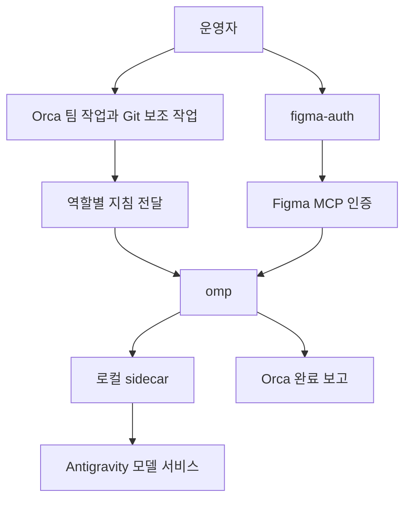
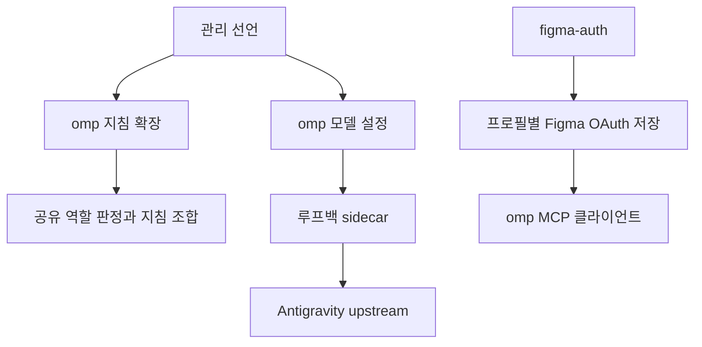
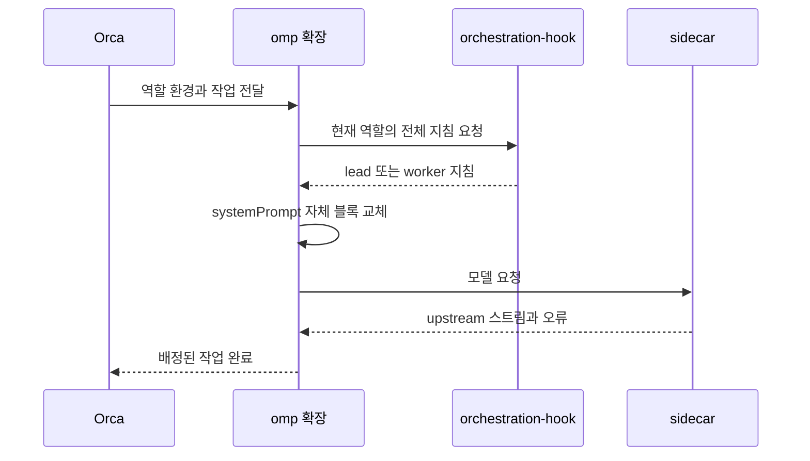
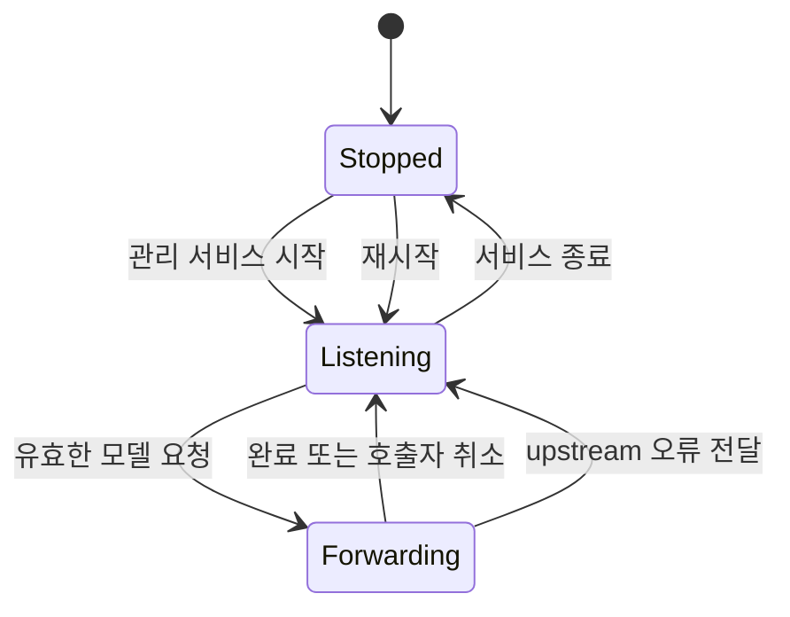
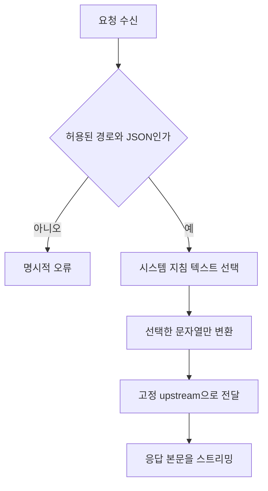

# Restore omp for Orca and Antigravity access - Plan

## Goal Capsule

- **Objective:** 운영자가 Antigravity CLI 없이 omp에서 Antigravity 모델과 Figma를 사용하고, Orca 팀 작업과 Git 보조 작업을 안정적으로 수행한다.
- **Means:** omp의 Orca 통합, 로컬 sidecar, figma-auth 복원을 하나의 전환으로 제공한다.
- **Product authority:** 2026-09-15 대화에서 사용자가 확인한 범위와 아래 Product Contract. 저장소 소유권과 배포 규칙은 `AGENTS.md`를 따른다.
- **Execution:** 현재 기능 브랜치에서 구현·검토·검증·PR·CI·병합을 수행한다. 실제 호스트 배포는 R15를 따른다.
- **Stop conditions:** 인증 접근 실패, 개인 상태 삭제가 필요한 전환, 현재 Orca에서 지원하지 않는 omp 배정은 증거와 함께 보고한다. 실제 세션 검증 없이 R7 완료를 주장하지 않는다.

---

## Product Contract

### Summary

Antigravity CLI를 제거하고 omp를 Orca의 lead·worker 및 Git 보조 작업에 사용한다.
Antigravity 모델 접근을 위한 로컬 sidecar와 Figma 인증 명령을 함께 제공한다.

### Problem Frame

운영자는 Antigravity CLI의 훅 문제로 Orca 오케스트레이션 지침이 전달되지 않는다고 보고했다.
현재 저장소는 omp를 관리하지만 Orca 사용을 제한하고 있으며, 과거 omp 제거 때 figma-auth도 함께 제거했다.
하네스 전환만으로는 모델 접근과 Figma 인증까지 필요한 작업 환경을 복원할 수 없다.

### Key Decisions

- **하나의 전환으로 제공한다.** 모델 접근은 운영자가 omp를 다시 쓰기 위한 전제다. (session-settled: user-directed — chosen over 오케스트레이션과 sidecar의 별도 계획: 둘 다 실제 사용에 필요하다.) Governs R1, R7, R8, R12.
- **Antigravity CLI를 제거한다.** (session-settled: user-directed — chosen over 예비 CLI로 유지: Orca에서는 omp로 대체한다.) Governs R2, R3.
- **시스템 프롬프트로 문자열 치환을 한정한다.** (session-settled: user-directed — chosen over 처음부터 전체 문자열 치환: 먼저 좁은 범위로 사용하고 문제가 생기면 확대를 판단한다.) Governs R8, R9.
- **기존 모델과 개인 기록을 유지한다.** (session-settled: user-approved — chosen over 모델 재선정과 개인 상태 삭제: 이번 전환의 범위를 실행 도구와 통합 복원에 한정한다.) Governs R3, R6.
- **figma-auth를 복원한다.** 사용자가 최종 범위에 추가한 인증 도구다. Governs R12, R13.

### Actors

- A1. 운영자는 Orca에서 작업하고 필요할 때 Figma 인증을 시작한다.
- A2. Orca는 팀 역할과 작업 배정·완료 상태를 관리한다.
- A3. omp는 지침을 받아 모델을 호출하고 도구를 실행한다.
- A4. sidecar는 Antigravity 요청을 중계한다.
- A5. figma-auth는 omp용 Figma 인증을 완료한다.

### Requirements

**Migration and ownership**

- R1. omp를 Orca의 lead와 worker로 사용할 수 있어야 한다.
- R2. Antigravity CLI의 관리 선언과 관리하던 설치·설정·플러그인을 제거하고, 이후 적용에서 다시 설치하지 않아야 한다.
- R3. 전환은 기존 로그인 정보와 대화 기록을 보존해야 한다.

**Orca instructions and Git operations**

- R4. omp는 첫 작업용 모델 호출 전에 역할에 맞는 Orca 지침을 받아야 하며, 재개·후속 턴에서도 지침이 누락되거나 중복 누적되지 않아야 한다.
- R5. omp 실행을 거부하는 훅 판정을 제거하고, 문서 내용에 실행 파일 이름이 있다는 이유로 편집을 차단하지 않아야 한다.
- R6. Orca의 커밋 메시지·PR·브랜치 이름 생성, 커밋·푸시·검사 실패 수정, 충돌·리뷰 의견 해결의 기본 실행 도구는 omp이며 기존 omp 모델 정책을 유지해야 한다.
- R7. Orca의 작업 배정부터 omp의 완료 보고까지 실제 세션에서 이어져야 한다.

**Antigravity sidecar**

- R8. omp의 Antigravity 모델 요청을 로컬 sidecar로 중계하고, 문자열 치환은 시스템 프롬프트에만 적용해야 한다.
- R9. 사용자 메시지·소스 코드·도구 인자·도구 결과의 문자열과 주입한 Orca 지침의 의미를 보존해야 한다.
- R10. sidecar 경로는 재시작과 모델 목록 갱신 뒤에도 유지되어야 하며, 중계 실패는 호출자에게 드러나야 한다.
- R11. 중계는 스트리밍 응답·도구 호출·취소·상위 서비스 오류를 정상 전달해야 한다.

**Figma authorization**

- R12. 인자 없는 figma-auth 실행으로 omp용 Figma MCP OAuth 인증을 완료할 수 있어야 한다.
- R13. 인증 도구의 빌드·배포·명령 등록·검증을 복원하고, 인증 실패나 취소 때 기존 유효한 인증을 손상하지 않아야 한다.

**Verification and deployment**

- R14. 현재 지원하는 호스트 범위에서 새 설치와 기존 설치의 전환을 지원하고, 반복 적용이 수동 수정이나 상태 초기화를 요구하지 않아야 한다.
- R15. 소스 변경의 자동 검증과 실제 세션 검증을 구분하고, 실제 호스트 배포는 별도 요청이 있을 때 수행해야 한다.

### Key Flows

- F1. **Covers R1, R4, R7.** Orca가 omp 세션을 연다. 세션이 역할별 지침을 받은 뒤 배정된 작업을 수행하고, Orca에 완료를 보고한다.
- F2. **Covers R6, R8–R11.** 운영자가 Git 보조 작업을 시작한다. omp의 Antigravity 요청이 sidecar를 거쳐 처리되고 결과가 Orca로 돌아온다.
- F3. **Covers R12, R13.** 운영자가 figma-auth를 실행해 브라우저 인증을 완료한다. 이후 omp에서 Figma MCP를 사용할 수 있다.
- F4. **Covers R2, R3, R14, R15.** 요청된 배포에서 기존 설치를 전환한다. 관리 대상만 정리하고 개인 기록을 보존한 뒤, 반복 적용 결과를 확인한다.

### Acceptance Examples

- AE1. **Covers R1, R4, R7.** 새 lead와 worker 세션 각각에서 필요한 지침을 확인하고, worker의 작업 완료가 Orca에 기록된다. 세션 재개 후에도 같은 검증이 통과한다.
- AE2. **Covers R5.** omp 실행과 그 이름이 포함된 문서 패치를 시도하면 기존 실행 차단 판정이 이를 거부하지 않는다.
- AE3. **Covers R6.** Git 보조 작업 8개 각각의 실행 도구가 omp로 선택되며 기존 모델 정책을 사용한다.
- AE4. **Covers R8, R9.** 시스템 프롬프트와 도구 결과에 같은 치환 대상 문자열을 넣으면, 중계 요청에서 시스템 프롬프트만 바뀐다. Orca 지침의 역할·명령·의무는 유지된다.
- AE5. **Covers R10, R11.** 모델 목록 갱신과 재시작 뒤에도 요청이 중계된다. sidecar 중단이나 실제 할당량 오류를 성공으로 보고하지 않으며, 스트리밍 도구 호출과 취소가 동작한다.
- AE6. **Covers R12, R13.** figma-auth 인증 완료 뒤 omp가 Figma MCP를 사용할 수 있다. 인증을 취소하면 기존 인증 상태가 보존된다.
- AE7. **Covers R2, R3, R14, R15.** 격리된 기존 설치에 변경을 적용하면 관리하던 Antigravity CLI가 제거되고 개인 상태는 남는다. 두 번째 적용은 같은 상태로 수렴한다.

### Scope Boundaries

- R1–R15는 하나의 사용 환경 전환 범위다. figma-auth 복원도 이 범위에 포함한다.
- 전체 문자열 치환은 문제 재현 뒤 후속으로 판단한다. 자동 확대는 포함하지 않는다.
- Antigravity 모델 서비스는 계속 사용한다. 제거 대상은 CLI 하네스다.
- Claude Code와 Codex의 교체, Orca의 일반 TUI 기본값 재선정, 다른 모델 제공자로의 이전은 포함하지 않는다.
- 다른 실행 파일을 막는 훅 전체를 폐기하는 작업은 포함하지 않는다. R5는 omp 차단과 문서 편집 오탐을 다룬다.
- 개인 기록 삭제와 실제 호스트 배포의 경계는 R3, R15를 따른다.

### Dependencies and Assumptions

- 현재 고정된 omp와 설치된 Orca가 필요한 역할·주입·완료 전달 경로를 제공하는지는 실제 동작으로 검증해야 한다. 최신 upstream의 API 선언만으로 완료를 주장하지 않는다.
- sidecar upstream의 429 원인 설명은 프로젝트의 주장이다. 시스템 프롬프트에 한정한 변환의 효과와 필요한 메타데이터 처리는 재현으로 확인해야 한다.
- 이전 figma-auth 코드는 복원 출발점이다. 과거 인증 저장 형식이 현재 omp에서도 유효하다고 가정하지 않는다.

### Sources and Research

- `.chezmoidata/orca.yaml`: omp 비활성화와 Git 보조 작업 기본 실행 도구 선언.
- `.chezmoidata/agents.yaml`: omp 모델 역할과 플러그인·설정 관리. 현재 default·worker는 `google-antigravity/gemini-3.8-flash:high`, commit은 `@worker`다.
- `packages/orchestration-hook/src/gate.ts`와 `dot_omp/private_agent/private_readonly_AGENTS.md.tmpl`: 기존 차단 판정과 정적 지침 전달의 근거.
- `docs/plans/2026-09-12-1402-feat-harness-neutral-orchestration-delivery-plan.md`: 이전 하네스 선택과 주입 요구사항. 이번 결정이 Antigravity 선택과 omp 제외를 대체한다.
- `docs/plans/2026-09-01-1214-refactor-figma-auth-cli-to-bare-command-plan.md`: 인자 없는 Figma 인증 흐름. 복원 근거는 커밋 `2922bc6`, 제거 이력은 `7344f61`이다.
- `docs/decommission/omp.md`: 관리 파일과 개인 인증·세션 상태의 경계.
- [Antigravity masking sidecar](https://github.com/bottlebrushes/antigravity-masking-sidecar): 프록시와 설치 방식의 참고 구현. 원본의 전체 문자열 치환은 R8, R9에 따라 축소한다.
- [omp extension types](https://github.com/can1357/oh-my-pi/blob/main/packages/coding-agent/src/extensibility/extensions/types.ts): 최신 소스의 모델 호출 전 확장 API. 고정 버전 호환성은 별도 검증 대상이다.

---

## Planning Contract

### Key Technical Decisions

- KTD1. 기존 `orchestration-hook`의 역할 판정과 원자적 lead 지침 조합을 재사용한다. `ORCA_TERMINAL_HANDLE`, `ORCA_AGENT_TEAMS_LEADER_PANE`, `TMUX_PANE`이 역할의 입력이며 확장은 현재 환경을 전달해 훅을 호출한다. omp 확장은 `before_agent_start`의 `systemPrompt` 배열에 한 개의 구분된 지침 블록을 넣는다. 매번 원본 배열에서 자체 블록을 교체하여 후속 턴과 재개에서 누적하지 않는다. Claude/Codex 전달 형식은 유지한다. Covers R1, R4, R5.
- KTD2. sidecar는 저장소의 Bun 패키지로 구현한다. JSON 파싱 후 `request.systemInstruction.parts[].text`만 치환한다. 임의 재귀 치환과 파싱 실패 시 원문 정규식 처리는 금지한다. 원본 프로젝트는 변환 규칙과 중계의 참고 자료이며 설치 스크립트는 실행하지 않는다. Covers R8, R9.
- KTD3. omp의 지원되는 `models.yml` provider `baseUrl`을 사용하고 `models.db`는 편집하지 않는다. `providers.antigravityEndpoint: auto`를 선언한다. 고정 버전의 모델 목록 조회와 생성 경로를 가짜 upstream에서 확인한다. 중계 실패 시 직접 upstream으로 재시도하지 않는다. Covers R10, R11.
- KTD4. `figma-auth`의 복원 출발점은 `2922bc6`이다. 현재 omp의 프로필별 MCP OAuth 키와 저장소 스키마를 확인한 뒤 저장 어댑터를 맞춘다. 성공한 토큰 교환 이후에만 해당 Figma 자격 증명을 트랜잭션으로 교체한다. Covers R12, R13.
- KTD5. Antigravity 제거는 명령 레지스트리의 소유권 증명과 정확한 chezmoi 제거 경로로 수행한다. 공유 marketplace와 개인 상태 디렉터리는 재귀 삭제하지 않는다. 릴리스 레지스트리를 수정하고 생성기로 잠금 파일을 갱신한다. Covers R2, R3, R14.

### High-Level Technical Design

다음 그림은 구현 경계와 검증 지점을 나타낸다. 내부 함수 구성은 구현 중 결정한다.

### Assumptions

다음은 사용자 선택이 아닌 구현 가정이다. 검증 결과가 틀리면 같은 Product Contract 안에서 수정한다.

- sidecar는 원본의 루프백 포트 `45123`을 사용한다. Linux는 systemd 사용자 서비스, macOS는 LaunchAgent로 수명을 관리한다. 충돌한 포트를 점유한 다른 프로세스는 종료하지 않는다.
- 원본의 요청 식별 메타데이터 제거와 User-Agent 변경은 초기 구현에 자동 포함하지 않는다. 시스템 프롬프트만 변경한다는 R8의 범위를 먼저 검증한다.
- 새 확장 패키지는 `packages/omp-orca`에서 번들하고 omp의 사용자 확장 경로에 배포한다. 타입 전용 최소 어댑터를 사용해 거대한 omp 런타임 의존성을 다시 설치하지 않는다.
- 현재 세션에 주입된 규칙은 omp 배정을 금지한다. 소스의 규칙을 수정해도 현재 세션 규칙은 바뀌지 않는다. R7은 업데이트된 규칙이 적용된 별도 세션에서 검증해야 하며, 배포 미승인 상태에서 통과로 표시하지 않는다.

### Evidence and Risks

고정 버전 `v18.1.22`의 [확장 타입](https://github.com/can1357/oh-my-pi/blob/v18.1.22/packages/coding-agent/src/extensibility/extensions/types.ts)은 `before_agent_start.systemPrompt`와 반환값을 문자열 배열로 정의한다.
[모델 레지스트리](https://github.com/can1357/oh-my-pi/blob/v18.1.22/packages/coding-agent/src/config/model-registry.ts)는 사용자 provider URL 재정의를 읽는다.
[Antigravity 제공자](https://github.com/can1357/oh-my-pi/blob/v18.1.22/packages/ai/src/providers/google-gemini-cli.ts)는 자동 endpoint mode에서 사용자 URL을 사용한다.
[MCP OAuth 코드](https://github.com/can1357/oh-my-pi/blob/v18.1.22/packages/coding-agent/src/mcp/oauth-credentials.ts)는 프로필별 키와 갱신 메타데이터를 조회한다.
이 소스 근거는 실제 모델 서비스의 변환 수용이나 Orca 배정 성공을 증명하지 않는다.

루프백 프록시는 인증 헤더와 작업 내용을 처리한다. 본문·토큰을 로그에 기록하지 않고, 고정 upstream 이외로 리다이렉트하지 않는다.
Figma 저장소의 호환성을 확인할 수 없으면 새 스키마를 추측해서 쓰지 않는다.

---

## Implementation Units

### U1. Restore omp instruction delivery

- **Goal:** R1, R4, R5와 AE1, AE2의 지침 전달·차단 판정을 구현한다.
- **Files:** `packages/orchestration-hook/`, 새 `packages/omp-orca/`, `.chezmoitemplates/agents-instructions.tmpl`, `.chezmoitemplates/orchestration-everyone.tmpl`, coordinator 지침, omp instruction target, 관련 build 스크립트와 테스트.
- **Approach:** KTD1을 따른다. omp용 텍스트 응답을 추가하고 확장에서 배열을 보존하며 자체 블록만 교체한다. lead 조합 실패는 부분 지침을 내보내지 않고 진단한다. gate에서 omp만 제외하고 파일 편집 이벤트를 셸 실행으로 분류하는 오탐을 수정한다.
- **Test scenarios:** Orca 밖, lead, worker, 빠진 guide, 시간 초과, 연속 턴, 재개, 역할 변경. omp 실행 허용, 문서 패치 허용, 기존 Claude/Codex 직접 실행 차단 유지.
- **Verification:** 패키지 테스트·타입 검사·빌드, `.ci/test-orchestration-hook.sh`, `.ci/test-build-orchestration-hook.sh`, `.ci/test-agent-instructions.sh`. 확장 어댑터가 실제 빌드된 훅을 호출하는 격리 테스트로 역할별 배열 출력을 확인한다.

### U2. Add selective Antigravity proxy

- **Goal:** R8–R11과 AE4, AE5를 구현한다.
- **Files:** 새 `packages/antigravity-sidecar/`, build 스크립트, 명령 선언, 사용자 서비스와 LaunchAgent, omp 모델 설정, `.chezmoiremove`, 새 격리 프록시 테스트.
- **Approach:** KTD2, KTD3을 따른다. 루프백만 수신하고 고정 upstream에 전달한다. 모델 목록 조회 등 필요한 제공자 경로도 보존한다. hop-by-hop 헤더와 변환 후 길이 헤더를 정리한다. 취소 시 upstream 요청과 스트림을 종료한다. 빌드·배포 후에만 서비스 시작을 선언한다.
- **Test scenarios:** 동일 문자열이 시스템·사용자·도구 필드에 있을 때 시스템만 변경. 잘못된 JSON, 시스템 필드 없음, 금지 경로, 분할 SSE, 도구 호출, 느린 소비자, 취소, 401·429·500, 연결 실패, 포트 충돌. 모델 캐시 갱신 후 URL 유지.
- **Verification:** 루프백 가짜 upstream을 사용하는 실제 HTTP 테스트, 패키지 검사, Linux/macOS 격리 render와 시작 순서 테스트. 고정 omp 제공자가 구성하는 경로·쿼리·헤더를 확인하고 생성·목록 갱신 요청 모두의 로컬 URL 사용을 검사한다. 호환되지 않으면 KTD3을 같은 계약 안에서 수정하고 직접 upstream 우회는 추가하지 않는다.

### U3. Restore Figma authorization

- **Goal:** R12, R13과 AE6을 구현한다.
- **Files:** 복원 `packages/figma-auth/`, `.ci/test-build-figma-auth.sh`, 관련 build 스크립트와 명령 선언, `packages/bun.lock`.
- **Approach:** KTD4를 따른다. 기존 PKCE·state 검증·브라우저 콜백 흐름을 복원하고 현재 저장 스키마와 대조한다. 기본 프로필과 명시적 프로필의 자격 증명을 혼합하지 않는다. 저장 파일의 소유권·권한·심볼릭 링크 경계를 검사한다.
- **Test scenarios:** 인자 없음, 잘못된 인자, 성공, state 불일치, 취소, 만료, 교환 실패, DB 잠금, 기존 다른 프로필·제공자 보존, 트랜잭션 실패 후 원본 보존.
- **Verification:** 전체 인증 패키지 테스트와 타입 검사, 빌드·명령 등록의 격리 테스트. 실제 계정 인증은 운영자가 시작한다.

### U4. Remove agy and switch Orca Git actions

- **Goal:** R2, R3, R6, R14와 AE3, AE7을 구현한다.
- **Files:** `.chezmoidata/agents.yaml`, `.chezmoidata/orca.yaml`, `.chezmoidata/commands.yaml`, `.chezmoiexternals/ai-agents.toml`, 릴리스 레지스트리, `dot_gemini/`, agy 플러그인과 reconcile/trust 스크립트, `.chezmoiremove`, 관련 CI와 문서.
- **Approach:** KTD5를 따른다. omp 비활성화를 해제하고 Git action 8개만 omp로 바꾼다. 일반 TUI 기본값과 기존 모델 역할은 유지한다. 공유 MCP 렌더러의 하네스 목록과 fixture를 정리한다. 제거 경로마다 소유권을 기록하고 auth/history는 제외한다.
- **Test scenarios:** 새 설치와 기존 agy 설치에서 두 번 적용, 관리되지 않은 실행 파일 보존, 공유 플러그인 보존, 개인 상태 sentinel 보존, 여덟 action의 값과 기본 모델 정책 불변.
- **Verification:** 명령 소유권·MCP·설정·플러그인·trust 관련 CI, 릴리스 잠금 검증, `.ci/test-orca-settings-reconcile.sh`.

### U5. Integrate and verify the migration

- **Dependencies:** U1–U4.
- **Goal:** R7, R14, R15를 포함한 전체 계약의 검증 결과를 정리한다.
- **Files:** `.github/workflows/ci.yml`, `.github/workflows/render-dotfiles.yml`, `.ci/`, `AGENTS.md`, `README.md`, `CONCEPTS.md`, `packages/README.md`, 운영 전환 문서.
- **Approach:** 통합 fixture에서 새 설치·전환·반복 적용을 검증한다. 제품 구현과 배포 후 실제 세션 점검을 구분한다. agy·omp 관련 문서의 이전 정책을 현재 결정으로 교체한다.
- **Test scenarios:** 지침 확장과 프록시가 함께 로드되는 경우, 프록시 부재, 재개, Figma 인증 실패, 호스트별 지원 범위. 실제 Orca 배정은 R15의 배포 경계를 충족한 세션에서만 수행한다.
- **Verification:** 아래 검증 계약, 코드 검토와 수정, PR의 필수 CI. 미실행 실세션 점검을 자동 검사 통과로 대체하지 않는다.

---

## Verification Contract

모든 chezmoi 검증은 `.ci/lib/render-gate-helpers.sh`의 격리된 HOME·빈 config·stub op·절대 source 경로를 사용한다.
실제 자격 증명 저장소를 읽지 않는다.

| Gate | Command or evidence | Pass condition |
|---|---|---|
| 패키지 | `mise -C packages exec -- vp run -r test` | 인증·훅·프록시 동작 테스트 전체 통과 |
| 타입과 빌드 | `mise -C packages exec -- vp run -r typecheck`, 영향 패키지 build | 실행·확장 산출물 생성 |
| 코드 형식 | `mise -C packages exec -- vp check` | 새 진단 없음 |
| 배포 | 영향 `.ci/test-*.sh`와 build fixture | 새 설치·전환·반복 적용 및 상태 보존 |
| 호스트 | `ci.yml`, `render-dotfiles.yml` | 모든 필수 job 성공 |
| 실제 세션 | AE1, AE3, AE5, AE6의 실행 기록 | 새 규칙이 적용된 Orca/omp에서 확인 |

실제 세션 검증에 배포나 계정 로그인이 필요하면 해당 증거를 미실행으로 표시한다. 이를 완료로 선언하지 않는다.

---

## Definition of Done

- U1–U5의 구현과 허용된 검증을 완료하고 모든 실행 가능한 검토 지적을 수정한다.
- R1–R15와 AE1–AE7에 대한 통과·미실행·차단 근거를 구분한다.
- 개인 인증·대화 기록을 삭제하지 않고 일반 TUI 기본값과 모델 정책을 보존한다.
- 실험용 코드와 사용하지 않는 agy 관리 코드를 제거한다.
- 필수 CI가 성공하고 병합 가능할 때 PR을 병합한다. 배포와 실제 계정 검증이 남으면 그 상태와 필요한 운영자 조치를 명시한다.

## Execution checkpoint — 2026-09-15

- U1–U5 소스를 구현했다. 직접 코드 검토와 수정까지 완료했으며 구현 커밋·PR·CI·병합을 진행한다. [검토 기록](../reviews/2026-09-15-omp-transition-review.md)에 위임 실패와 검증 범위를 남겼다.
- 패키지 테스트 544개, 전체 타입 검사·빌드·형식·lint 검사를 통과했다. 훅 통합 검사는 기존 타임아웃·프로세스 종료·선언·신뢰 기록 검사를 복원한 상태로 통과했다.
- 플러그인·Orca 설정·omp 설정·MCP·명령 manifest·외부 checksum·릴리스 잠금 검사를 통과했다. Linux·macOS 빌드 fixture와 서비스 활성화 fixture도 통과했다.
- 설치된 훅의 네이티브 apply_patch 오탐은 사용자의 명시적 승인으로 최소 수정 바이너리를 적용했다. 기존 바이너리는 `/tmp/dotfiles-hook-edit-fix-20260915/orchestration-hook.previous`에 보관했다. 이 조치는 전체 dotfiles 배포가 아니다.
- 지침 fixture 진단 작업자는 90초 안에 결과를 보내지 못해 종료·해제했다. 직접 비교로 확인한 줄바꿈 차이를 수정했고 지침 검사가 통과했다. 해당 진단을 독립 검토 통과로 계산하지 않는다.
- 실제 Orca/omp 배정·모델 호출·Figma 인증은 미실행이다. 현재 세션의 주입 규칙은 omp 배정을 금지하며, 배포와 실제 계정 검증은 R15에 따라 별도로 수행한다.
