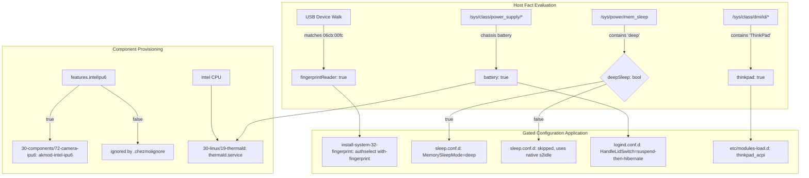

# ThinkPad X1 Carbon Gen 11 Host Fit - Plan

## Goal Capsule

- **Objective:** A Lenovo ThinkPad X1 Carbon Gen 11 laptop running Fedora reaches a fully working state with no hand-applied settings — its Synaptics Prometheus fingerprint sensor enables PAM authentication for sudo and polkit while keeping the login greeter password-only, its suspend-then-hibernate ladder operates cleanly on native `s2idle` without systemd invalid-argument warnings, its MIPI IPU6 camera stack can be provisioned via an opt-in feature flag, and its Raptor Lake thermals are managed via `thermald`.
- **Means:** Add the fingerprint reader identity to declared data, introduce a template-layer `deepSleep` fact to gate `MemorySleepMode=deep`, add an opt-in `intelIpu6` feature flag, and provision `thermald` on Intel battery hosts.
- **Product authority:** `STRATEGY.md` (declare it as data; fail-safe defaults) and root `AGENTS.md` (fact registry rules, `/etc` manifest model, password-only greeter boundary, no teardown scripts).
- **Execution profile:** Configuration and provisioning work. Proof is render-time and apply-time verification against the repository's own CI harnesses, never a live `$HOME`.
- **Stop conditions:** Stop and report if `deepSleep` cannot be probed in the template layer without subprocesses, or if the greeter guarantee fails closed.
- **Open blockers:** None.
- **Product Contract preservation:** Product Contract unchanged.

---

## Product Contract

### Summary

Provide complete host fit for the Lenovo ThinkPad X1 Carbon Gen 11 (Intel 13th Gen Raptor Lake, Intel Iris Xe graphics, Synaptics Prometheus fingerprint reader, optional Intel MIPI IPU6 camera) across authentication, power, camera, and thermals. The laptop gains fingerprint authentication through authselect, clean native modern standby sleep without invalid-argument warnings, conditional out-of-tree IPU6 camera module delivery, and Intel DPTF thermal daemon management.

### Problem Frame

The repository's laptop support was originally tailored to the ThinkPad P14s Gen 1 (a 10th Gen Intel / NVIDIA Quadro hybrid laptop with S3 sleep support). On the ThinkPad X1 Carbon Gen 11, four specific host-fit mismatches occur:

First, the Synaptics Prometheus fingerprint reader (`06cb:00fc`) is absent from `.chezmoidata/.fingerprint-readers.tsv`, so `fingerprintReader` resolves false and `authselect` with-fingerprint is never applied.

Second, `90-laptop-suspend-then-hibernate.conf` forces `MemorySleepMode=deep`. The Gen 11 UEFI firmware eliminates S3 (`deep`) sleep, supporting only `s2idle` (S0ix). When systemd attempts to write `deep` to `/sys/power/mem_sleep`, it fails with `EINVAL`, logging warnings on every sleep cycle.

Third, configurations with the optional MIPI "Computer Vision" camera require the Intel IPU6 driver stack (`akmod-intel-ipu6` and `ipu6-camera-bins-firmware`), while standard UVC models work out of the box. Without an opt-in feature flag, MIPI cameras remain non-functional or UVC models would build unnecessary out-of-tree kernel modules.

Fourth, Intel 13th Gen Raptor Lake CPUs in ultrabooks rely heavily on Intel Dynamic Platform and Thermal Framework (DPTF) tables to manage heat and fan curves; without `thermald`, the system depends solely on basic kernel ACPI defaults under sustained load.

### Key Decisions

- **Register the Synaptics Prometheus reader (`06cb:00fc`) in declared TSV data.** Hardware identity belongs in declared data rather than runtime guesswork. (session-settled: user-directed — chosen over manual authselect configuration: hardware identity belongs in declared data). Governs R1.
- **Probe `deep` sleep support via `/sys/power/mem_sleep` in the template layer and gate `MemorySleepMode=deep` on it.** Allows Gen 11 to use native `s2idle` cleanly without warnings while preventing `s2idle` battery drain on older laptops like the P14s. (session-settled: user-directed — chosen over unconditional deep sleep and over omitting MemorySleepMode globally: allows Gen 11 to use native s2idle cleanly without warnings while preventing s2idle battery drain on older laptops like P14s). Governs R2, R3.
- **Deliver Intel IPU6 camera packages through a modular opt-in feature flag.** Allows MIPI camera models to opt in while sparing UVC models unneeded out-of-tree akmods. (session-settled: user-directed — chosen over unconditional installation and UVC-only: allows MIPI camera models to opt in while sparing UVC models unneeded out-of-tree akmods). Governs R4, R5.
- **Provision and enable `thermald` on Intel battery-powered hosts.** Optimizes Raptor Lake fan curves and prevents thermal throttling via DPTF. (session-settled: user-directed — chosen over relying on stock distro defaults: optimizes Raptor Lake fan curves and prevents thermal throttling via DPTF). Governs R6, R7.
- **Pointing devices and ThinkPad ACPI require no configuration edits.** KWin touchpad property matching and `TPPS/2*` TrackPoint matching already cover the Gen 11 hardware, and `facts.tmpl` already matches "ThinkPad" in DMI. Governs R8, R9.
- **The login greeter remains password-only.** The password-only greeter guarantee is enforced by construction and verified before authselect enables the fingerprint factor. Governs R1.

### Requirements

**Authentication & Hardware Identity**

- R1. The fingerprint reader table (`.chezmoidata/.fingerprint-readers.tsv`) declares USB ID `06cb:00fc`. On hosts carrying this device, `fingerprintReader` resolves true and `install-system-32-fingerprint` enables `with-fingerprint` in `authselect`, while the greeter check preserves the password-only greeter guarantee.

**Power & Sleep Policy**

- R2. A template-layer boolean fact `deepSleep` reports whether `/sys/power/mem_sleep` contains the token `deep`. The probe uses stat-guarded file inclusion with zero subprocesses.
- R3. `MemorySleepMode=deep` in `sleep.conf.d` is gated on `deepSleep`. Hosts where `deepSleep` is false (such as the X1 Carbon Gen 11) do not write `MemorySleepMode=deep`, leaving systemd to use native `s2idle` without invalid-argument errors.

**Webcam & Media**

- R4. A feature flag `features.intelIpu6` in `.chezmoidata/features.yaml` (defaulting to false) controls provisioning of the Intel IPU6 MIPI camera stack.
- R5. When `features.intelIpu6` is enabled on Fedora, `akmod-intel-ipu6` and `ipu6-camera-bins-firmware` are installed from RPM Fusion nonfree, and the script skips cleanly when the feature flag is false.

**Thermal Management**

- R6. The `thermald` package is installed and `thermald.service` is enabled on bare-metal Fedora hosts where `battery` is true and the CPU is Intel.
- R7. Virtual machines, containers, and non-Intel hosts skip `thermald` provisioning.

**Pointing Devices & Platform Modules**

- R8. The KWin touchpad and TrackPoint reconcilers configure the X1 Carbon Gen 11's `SYNA8017:00 06CB:Touchpad` and `TPPS/2 Elan TrackPoint` under existing property matching and `TPPS/2*` globs with zero data changes to `kde.yaml`.
- R9. The `thinkpad` fact resolves true via existing DMI model matching, force-loading and configuring `thinkpad_acpi`.

### Key Flows

- F1. Apply on ThinkPad X1 Carbon Gen 11 with default features
  - **Trigger:** `chezmoi apply` on a Fedora ThinkPad X1 Carbon Gen 11 with standard UVC camera.
  - **Steps:** Hook probe reads USB `06cb:00fc` and writes `fingerprintReader: true`. Template probe reads `/sys/power/mem_sleep`, observes only `s2idle`, and sets `deepSleep: false`. DMI resolves `thinkpad: true` and battery resolves `battery: true`. `install-system-32-fingerprint` enables authselect with-fingerprint. `install-system-28-sleep` deploys lid suspend-then-hibernate drop-in without forcing deep sleep. `thermald` installs and enables. IPU6 packages skip cleanly.
  - **Outcome:** Clean convergence, native s2idle sleep, fingerprint at sudo/polkit, DPTF thermals active, no unneeded akmods.
  - **Covered by:** R1, R2, R3, R4, R5, R6, R8, R9
- F2. Apply on ThinkPad X1 Carbon Gen 11 with MIPI IPU6 camera opted in
  - **Trigger:** `chezmoi apply` with `features.intelIpu6: true`.
  - **Steps:** All steps of F1 occur; additionally, component package installer evaluates `features.intelIpu6`, provisions `akmod-intel-ipu6` and `ipu6-camera-bins-firmware` via RPM Fusion.
  - **Outcome:** IPU6 kernel modules and binary firmware are deployed for the MIPI camera sensor.
  - **Covered by:** R4, R5

### Acceptance Examples

- AE1. **Covers R1.** Given a host with USB device `06cb:00fc`, when the pre-hook runs, then `fact_fingerprint_reader` returns 0 and `fingerprintReader: true` is emitted in the fact cache.
- AE2. **Covers R2, R3.** Given a host whose `/sys/power/mem_sleep` contains `[s2idle]`, when facts resolve, then `deepSleep` is false and no `MemorySleepMode=deep` directive is written to systemd sleep configuration.
- AE3. **Covers R2, R3.** Given a host whose `/sys/power/mem_sleep` contains `s2idle [deep]`, when facts resolve, then `deepSleep` is true and `MemorySleepMode=deep` is deployed.
- AE4. **Covers R4, R5.** Given `features.intelIpu6: false`, when component installers run, then `akmod-intel-ipu6` is not installed and a clean skip is declared.
- AE5. **Covers R4, R5.** Given `features.intelIpu6: true` on Fedora, when component installers run, then `akmod-intel-ipu6` and `ipu6-camera-bins-firmware` are installed.
- AE6. **Covers R6, R7.** Given a bare-metal Fedora laptop with an Intel CPU, when system installers run, then `thermald` is installed and enabled.
- AE7. **Covers R7.** Given a VM or container, when system installers run, then `thermald` provisioning is skipped.
- AE8. **Covers R8.** Given the Gen 11's `TPPS/2 Elan TrackPoint`, when `config-kde-touchpad` runs, then natural scroll, middle button emulation, and scrollOnButtonDown are applied.

### Scope Boundaries

- Cellular WWAN modem (e.g. Fibocom L860-GL / FM350-GL) configuration is out of scope.
- NFC configuration is out of scope.
- Battery charge thresholds remain unmanaged operator preference.
- Touchscreen configuration is out of scope.
- MOK enrollment for `akmod-intel-ipu6` on Secure Boot systems remains an interactive operator step.

### Dependencies / Assumptions

- The Synaptics Prometheus reader (`06cb:00fc`) is natively supported by upstream `libfprint` on Fedora.
- `thermald` is available in standard Fedora repositories.
- `akmod-intel-ipu6` and `ipu6-camera-bins-firmware` are packaged in RPM Fusion nonfree for Fedora.
- The Gen 11 firmware exposes Intel DPTF ACPI objects matching standard `thermald` profiles.

### Sources / Research

- Linux Hardware probe `4c190d8f8d` (Lenovo ThinkPad X1 Carbon Gen 11 21HNSC9J01): CPU Intel i7-1370P, GPU Iris Xe `8086:a7a0`, IPU `8086:a75d`, Fingerprint `06cb:00fc`, TrackPoint `TPPS/2 Elan TrackPoint`, Touchpad `SYNA8017:00 06CB:Touchpad`.
- `.chezmoidata/.fingerprint-readers.tsv` — current fingerprint reader table (`06cb:00bd`).
- `.install-prerequisites.sh:333-350` — `fact_fingerprint_reader` implementation.
- `.chezmoitemplates/facts.tmpl:207-220` — existing DMI ThinkPad probe.
- `.chezmoidata/kde.yaml:344-373` — KWin pointing-device targeting rules and TrackPoint globs.
- `system/linux/etc/systemd/sleep.conf.d/90-laptop-suspend-then-hibernate.conf` — existing sleep policy.
- `.chezmoidata/features.yaml` — component feature flag registry.
- `docs/plans/2026-09-03-1630-feat-thinkpad-p14s-gen1-host-fit-plan.md` — prior laptop host fit pattern.

---

## Planning Contract

### Key Technical Decisions

- KTD1. **The fingerprint reader USB ID table expands to include `06cb:00fc`.** `fact_fingerprint_reader` reads the TSV table in a single bash loop in `.install-prerequisites.sh`. Adding a row requires no schema change and enables matching without code edits. Governs R1.
- KTD2. **`deepSleep` is an in-process template fact, not a hook probe.** `/sys/power/mem_sleep` is directly readable by unprivileged users; `stat` and `include` in `.chezmoitemplates/facts.tmpl` evaluate it without subprocesses. Declared in `.chezmoidata/facts.yaml` with `probe: template`. Governs R2.
- KTD3. **`MemorySleepMode=deep` is gated on `deepSleep` via `.chezmoidata/system.yaml`.** In `sleep.overrides`, the path `etc/systemd/sleep.conf.d/*` changes gate from `battery` to `deepSleep`. Hosts where `deepSleep` is true (P14s) continue to write `MemorySleepMode=deep`, while hosts where `deepSleep` is false (Gen 11) skip it, letting systemd suspend under native `s2idle`. `etc/systemd/logind.conf.d/*` remains gated on `battery` so lid-switch suspend-then-hibernate applies on both. Governs R3.
- KTD4. **Intel IPU6 camera delivery is gated by `.chezmoiignore` on `features.intelIpu6`.** Following the existing component pattern (`features.nvidia`, `features.podman`, etc.), a dedicated component script `.chezmoiscripts/30-components/run_onchange_before_72-camera-ipu6.sh.tmpl` is ignored unless `(default dict $features).intelIpu6` is true. Governs R4, R5.
- KTD5. **`thermald` is managed as a modular system installer script in `30-linux`.** Added as `.chezmoiscripts/30-linux/run_onchange_after_install-system-19-thermald.sh.tmpl`. Gated on `os == linux`, `distro == fedora`, `!virt`, `battery`, and Intel CPU detection via `/proc/cpuinfo`. Non-applicable hosts emit a registered skip declaration. Governs R6, R7.

### High-Level Technical Design

### Assumptions

- The Synaptics Prometheus reader (`06cb:00fc`) does not require proprietary userspace wrappers like `synaTudor` and is fully functional with Fedora's standard `fprintd` package.
- If Secure Boot is enabled, building `akmod-intel-ipu6` requires the user to enroll the local MOK key generated by akmods (`/etc/pki/akmods/certs/public_key.der`).
- Running `thermald` alongside `power-profiles-daemon` on modern Fedora causes no conflict; `thermald` enforces passive and active cooling thresholds while PPD manages EPP (Energy Performance Preference).

### System-Wide Impact

- **Fact block baselines:** Adding `deepSleep` to `.chezmoidata/facts.yaml` and `.chezmoitemplates/facts.tmpl` requires updating the static fact fixtures in `.ci/test-fedora-fact-block-baseline.sh` and `.ci/test-jetson-installer-render.sh`. Missing either will fail the CI render gates.
- **Skip declaration matrix:** Adding a new script with skip sites requires registering its owner, scope, template, and predicates in `.ci/skip-declaration-site-matrix.yaml` to maintain skip declaration auditing.
- **Existing laptop hosts:** The ThinkPad P14s has both `s2idle` and `deep` in `/sys/power/mem_sleep`. On P14s, `deepSleep` resolves `true`, and `MemorySleepMode=deep` remains deployed. Existing behavior is preserved.

### Risk Analysis and Mitigation

| Risk | Consequence if unmitigated | Mitigation |
|---|---|---|
| `deepSleep` fact probe fails when `/sys/power/mem_sleep` is unreadable | Fact evaluates false or causes render abort | Stat-guarded file reading in `facts.tmpl` with `absentDefault: false`; fail-safe behavior uses kernel default |
| User with MIPI camera does not know about the feature flag | Camera does not function out-of-the-box | Clear documentation in plan and release notes; opt-in prevents unwanted out-of-tree builds for UVC users |
| Skip declarations in new `thermald` script fail audit | CI fails on check-skip-declarations | Register all skip sites in `.ci/skip-declaration-site-matrix.yaml` matching exact continuation and digests |
| Fact baseline tests fail on CI due to fact addition | CI fails on test-fedora-fact-block-baseline | Update fact block fixtures in `.ci/test-fedora-fact-block-baseline.sh` and `.ci/test-jetson-installer-render.sh` in the same commit |

### Sequencing

- U1 (fingerprint data) can be executed independently.
- U2 (`deepSleep` fact & sleep gating) must update `facts.yaml`, `facts.tmpl`, `system.yaml`, and the CI test fact fixtures together to keep render tests green.
- U3 (IPU6 camera component) touches `features.yaml`, `.chezmoiignore`, and adds the component template.
- U4 (thermald installer) adds the script and registers its skip sites in the site matrix.
- U5 runs all repository verification suites.

---

## Implementation Units

### U1. Register Synaptics Prometheus Fingerprint Sensor

- **Goal:** Enable fingerprint reader detection and PAM authentication for the ThinkPad X1 Carbon Gen 11.
- **Requirements:** R1, AE1.
- **Dependencies:** None.
- **Files:**
  - `.chezmoidata/.fingerprint-readers.tsv`
- **Approach:**
  1. Add `06cb\t00fc` to `.chezmoidata/.fingerprint-readers.tsv`.
  2. Verify that `fact_fingerprint_reader` matches the device when present under `/sys/bus/usb/devices/`.
- **Patterns to follow:** Existing `06cb\t00bd` entry in `.chezmoidata/.fingerprint-readers.tsv`.
- **Test scenarios:**
  - AE1: `fact_fingerprint_reader` succeeds against synthetic sysfs with `idVendor=06cb`, `idProduct=00fc`.
  - An unmatched product (e.g. `06cb:ffff`) returns non-zero.
- **Verification:** `.ci/test-host-fact-probes.sh` passes.

### U2. Implement `deepSleep` Fact and Gate MemorySleepMode

- **Goal:** Allow S0ix-only laptops like Gen 11 to sleep cleanly under native `s2idle` while preserving forced `deep` sleep on S3-capable laptops.
- **Requirements:** R2, R3, AE2, AE3.
- **Dependencies:** None.
- **Files:**
  - `.chezmoidata/facts.yaml`
  - `.chezmoitemplates/facts.tmpl`
  - `.chezmoidata/system.yaml`
  - `.ci/test-fedora-fact-block-baseline.sh`
  - `.ci/test-jetson-installer-render.sh`
- **Approach:**
  1. In `.chezmoidata/facts.yaml`, declare boolean fact `deepSleep` with `probe: template`.
  2. In `.chezmoitemplates/facts.tmpl`, implement stat-guarded read of `/sys/power/mem_sleep`. Check if file contains `deep`.
  3. In `.chezmoidata/system.yaml`, update `sleep.overrides`: set `gate: deepSleep` for `etc/systemd/sleep.conf.d/*`.
  4. Update `.ci/test-fedora-fact-block-baseline.sh` and `.ci/test-jetson-installer-render.sh` fact fixtures to declare `deepSleep: false`.
- **Patterns to follow:** `thinkpad` and `jetson` template probes in `.chezmoitemplates/facts.tmpl`.
- **Test scenarios:**
  - AE2: Given `/sys/power/mem_sleep` with `[s2idle]`, `deepSleep` resolves false and `sleep.conf.d/*` is skipped.
  - AE3: Given `/sys/power/mem_sleep` with `s2idle [deep]`, `deepSleep` resolves true and `sleep.conf.d/*` is deployed.
  - Baseline fact fixtures in `.ci/test-fedora-fact-block-baseline.sh` and `.ci/test-jetson-installer-render.sh` render without error.
- **Verification:** Run `.ci/test-fedora-fact-block-baseline.sh` and `.ci/test-jetson-installer-render.sh`.

### U3. Add Intel IPU6 Camera Feature Flag and Component Installer

- **Goal:** Enable opt-in provisioning of `akmod-intel-ipu6` and `ipu6-camera-bins-firmware` for laptops with MIPI webcams.
- **Requirements:** R4, R5, AE4, AE5.
- **Dependencies:** None.
- **Files:**
  - `.chezmoidata/features.yaml`
  - `.chezmoiignore`
  - `.chezmoiscripts/30-components/run_onchange_before_72-camera-ipu6.sh.tmpl`
- **Approach:**
  1. Add `intelIpu6: false` to `.chezmoidata/features.yaml`.
  2. In `.chezmoiignore`, ignore `.chezmoiscripts/30-components/72-camera-ipu6.sh` when `(default dict $features).intelIpu6` is not true.
  3. Create `run_onchange_before_72-camera-ipu6.sh.tmpl`:
     - Uses `facts-sh.tmpl`, `shared-host-guard.sh.tmpl`, `sudo-elevation-guard.sh.tmpl`.
     - Inspects if `akmod-intel-ipu6` and `ipu6-camera-bins-firmware` are installed via `rpm -q`.
     - Installs missing packages via `dnf install -y`.
     - Declares clean skip if packages are already present.
- **Patterns to follow:** `.chezmoiscripts/30-components/10-nvidia.sh.tmpl` and `70-apps.sh.tmpl`.
- **Test scenarios:**
  - AE4: With `intelIpu6: false`, `.chezmoiignore` suppresses `72-camera-ipu6.sh`.
  - AE5: With `intelIpu6: true` on Fedora, `72-camera-ipu6.sh` renders package installation commands for `akmod-intel-ipu6` and `ipu6-camera-bins-firmware`.
- **Verification:** Render with and without `intelIpu6` flag in scratch environment.

### U4. Provision `thermald` on Intel Battery Hosts

- **Goal:** Install and enable Intel Thermal Daemon for DPTF thermal policy on Intel laptops.
- **Requirements:** R6, R7, AE6, AE7.
- **Dependencies:** None.
- **Files:**
  - `.chezmoiscripts/30-linux/run_onchange_after_install-system-19-thermald.sh.tmpl`
  - `.ci/skip-declaration-site-matrix.yaml`
- **Approach:**
  1. Create `.chezmoiscripts/30-linux/run_onchange_after_install-system-19-thermald.sh.tmpl`:
     - Gated at template head on `os == linux` and `distro == fedora`.
     - Includes `headless-guard.sh.tmpl`, `shared-host-guard.sh.tmpl`, `sudo-elevation-guard.sh.tmpl`.
     - Gates: if `FACT_VIRT == 1` or `FACT_BATTERY == 0` or CPU is not Intel (`grep -q GenuineIntel /proc/cpuinfo`), declare clean skip via `skip.sh.tmpl` (`not_applicable`, site `thermald-not-applicable`).
     - If missing, installs `thermald` via `dnf install -y thermald`.
     - Enables and starts `thermald.service` via `systemctl enable --now thermald`.
  2. Register `install-system-19-thermald/thermald-not-applicable` in `.ci/skip-declaration-site-matrix.yaml`.
- **Patterns to follow:** `.chezmoiscripts/30-linux/run_onchange_after_install-system-18-hardware.sh.tmpl`.
- **Test scenarios:**
  - AE6: On bare-metal Intel battery host, script provisions `thermald` and enables `thermald.service`.
  - AE7: In VM or non-battery host, script records clean `not_applicable` skip.
- **Verification:** `.ci/check-skip-declarations.sh` passes with the new site registered.

### U5. Full CI Verification and Gate Pass

- **Goal:** Verify that all repository CI test suites pass cleanly with the new facts, skip declarations, and configs.
- **Requirements:** R1-R9, AE1-AE8.
- **Dependencies:** U1, U2, U3, U4.
- **Files:**
  - Entire repository test suite
- **Approach:**
  1. Run `.ci/test-host-fact-probes.sh`.
  2. Run `.ci/test-fedora-fact-block-baseline.sh`.
  3. Run `.ci/test-jetson-installer-render.sh`.
  4. Run `.ci/check-skip-declarations.sh`.
  5. Run `.ci/test-ci-wiring.sh`.
- **Patterns to follow:** `.github/workflows/ci.yml`.
- **Test scenarios:**
  - All CI bash test scripts exit 0.
  - Render tests with dummy op secret pass without errors.
- **Verification:** All tests in `.ci/` exit 0.

---

## Verification Contract

| Command | Applicability | Units | Done signal |
|---|---|---|---|
| `bash .ci/test-host-fact-probes.sh` | Host fact probes | U1 | Exits 0, confirms `06cb:00fc` detection |
| `bash .ci/test-fedora-fact-block-baseline.sh` | Fedora baseline render | U2 | Exits 0, baseline hashes verified |
| `bash .ci/test-jetson-installer-render.sh` | Jetson baseline render | U2 | Exits 0, fact block matches |
| `bash .ci/check-skip-declarations.sh` | Skip declarations audit | U4 | Exits 0, all sites verified against matrix |
| `bash .ci/test-ci-wiring.sh` | CI workflow wiring | U1-U5 | Exits 0, no unwired tests |

---

## Definition of Done

- [ ] Synaptics Prometheus fingerprint sensor (`06cb:00fc`) declared in `.chezmoidata/.fingerprint-readers.tsv`.
- [ ] `deepSleep` fact declared in `.chezmoidata/facts.yaml` and implemented in `.chezmoitemplates/facts.tmpl`.
- [ ] `sleep.conf.d/*` gated on `deepSleep` in `.chezmoidata/system.yaml`.
- [ ] Fact baseline fixtures in `.ci/test-fedora-fact-block-baseline.sh` and `.ci/test-jetson-installer-render.sh` updated.
- [ ] Feature flag `features.intelIpu6` declared in `.chezmoidata/features.yaml` and gated in `.chezmoiignore`.
- [ ] Component installer `run_onchange_before_72-camera-ipu6.sh.tmpl` created for `akmod-intel-ipu6`.
- [ ] Thermal installer `run_onchange_after_install-system-19-thermald.sh.tmpl` created for `thermald`.
- [ ] Skip declaration site matrix updated and verified via `.ci/check-skip-declarations.sh`.
- [ ] All CI verification scripts pass locally in scratch environment.
