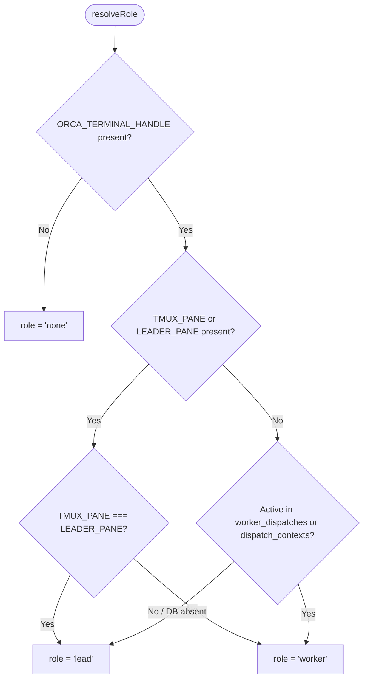

# Detect Orca coordinator role for omp orchestration - Plan

## Goal Capsule

- **Objective:** Enable `omp` running in interactive Orca sessions to receive the full orchestration skill and coordinator instructions, while continuing to classify actively dispatched workers as workers.
- **Means:** Update `packages/orchestration-hook` and `packages/omp-orca` to default standard Orca terminal sessions to the `lead` role, verifying against active worker registrations in Orca's orchestration database.
- **Product authority:** 2026-09-16 brainstorm dialogue and the Product Contract below.
- **Open blockers:** None.

---

## Product Contract

### Summary
Update the orchestration hook and `omp-orca` integration so interactive `omp` sessions running in an Orca terminal automatically resolve to the `lead` role. The hook delivers the complete orchestration context (the `orchestration` `SKILL.md`, the version-matched Orca guide from `skills get orchestration`, and coordinator rules) into `omp`'s system prompt on each turn, enabling `omp` to coordinate and supervise agent workers.

### Problem Frame
Currently, `packages/orchestration-hook/src/role.ts` requires `ORCA_AGENT_TEAMS_LEADER_PANE` and `TMUX_PANE` to be set and equal to classify a session as `lead`. That mechanism was designed for Claude Code's tmux agent teams. In standard Orca terminals running `omp`, `codex`, or standalone `claude`, neither variable is set, causing all interactive sessions to be falsely classified as `worker`. Consequently, `omp` never receives the `leadContext` containing the orchestration skill, version-matched Orca guide, or coordinator instructions.

### Key Decisions
- **Default standard Orca terminals to lead with worker registry verification** (session-settled: user-directed — chosen over database-only inspection and prompt preamble detection: default interactive Orca sessions to lead while identifying workers via active worker dispatch registration or tmux teammate pane). Governs R1, R2, R3.
- **Harness-neutral role resolution in orchestration-hook.** Governs R1, R2, R4.
- **Atomic and dynamic prompt injection per turn via omp-orca.** Governs R5, R6.

### Actors
- A1. Operator interacts with `omp` in an Orca terminal and directs multi-agent tasks.
- A2. `omp` receives the prompt, checks role context on each turn, and coordinates worker agents.
- A3. Dispatched workers receive task assignments and report progress or completion to the coordinator.
- A4. Orca CLI and orchestration database maintain runtime and worker dispatch states.

### Requirements

**Role resolution and detection**
- R1. An Orca session with `ORCA_TERMINAL_HANDLE` set MUST resolve to the `lead` role by default when not identified as a dispatched worker or a tmux teammate pane.
- R2. A session MUST resolve to `worker` if its `ORCA_TERMINAL_HANDLE` matches an active entry in `worker_dispatches` within Orca's orchestration database (`~/.config/orca/orchestration.db` or `$ORCA_USER_DATA_PATH/orchestration.db`).
- R3. Existing Claude Code tmux agent-teams detection MUST be preserved: when `ORCA_AGENT_TEAMS_LEADER_PANE` is present, equal `TMUX_PANE` indicates `lead` and unequal indicates `worker`.
- R4. Sessions without `ORCA_TERMINAL_HANDLE` MUST continue to resolve to `none`.

**Context delivery and extension integration**
- R5. When `role === "lead"`, `orchestration-hook` MUST produce `leadContext` containing the `orchestration` `SKILL.md`, the version-matched guide from `orca-ide skills get orchestration`, universal agent rules, and coordinator rules.
- R6. `packages/omp-orca` MUST dynamically replace the managed block in `systemPrompt` with the resolved context on each `before_agent_start` event.
- R7. Dispatched workers running under `omp` MUST receive only the universal worker context (`payload("everyone")`) and MUST NOT receive coordinator rules.

**Verification and test coverage**
- R8. Unit and integration tests in `packages/orchestration-hook` and `packages/omp-orca` MUST verify `lead` resolution for interactive Orca terminals, `worker` resolution for active worker dispatches and teammate panes, and `none` for unmanaged sessions.

### Key Flows
- F1. Interactive coordinator start: Operator opens `omp` in an Orca terminal. `omp-orca` invokes `orchestration-hook hook --harness omp`. Role resolves to `lead`. `leadContext` containing `/skill:orchestration` and coordinator rules is injected into `systemPrompt`. Covers R1, R5, R6.
- F2. Dispatched worker execution: Orca's `worker-start` creates a worker terminal and records it in `worker_dispatches`. On prompt start, role resolves to `worker`. Universal worker rules are injected without coordinator rules. Covers R2, R7.
- F3. Tmux agent-teams compatibility: Claude Code launches agent teams. Leader pane resolves to `lead`; teammate panes resolve to `worker`. Covers R3.

### Acceptance Examples
- AE1. In an Orca terminal with `ORCA_TERMINAL_HANDLE` set and no active worker dispatch, `orchestration-hook role` outputs `role=lead` and `hook --harness omp` outputs the full coordinator payload including `--- orchestration SKILL.md ---`. Covers R1, R5.
- AE2. In an Orca terminal whose handle exists in `worker_dispatches` with state `starting` or `ready`, `orchestration-hook role` outputs `role=worker` and `hook --harness omp` outputs only the universal worker payload. Covers R2, R7.
- AE3. In an environment without `ORCA_TERMINAL_HANDLE`, `orchestration-hook role` outputs `role=none` and `hook --harness omp` outputs empty text. Covers R4.

### Scope Boundaries
- In-scope: `packages/orchestration-hook`, `packages/omp-orca`, test suites, and relevant documentation.
- Out-of-scope: Modifying Orca binaries (`/opt/Orca`), altering Orca's internal database schema, or changing behavior for non-Orca terminals.

---

## Planning Contract

### Key Technical Decisions
- KTD1. **Fast read-only SQLite check with graceful fallback.** When `ORCA_TERMINAL_HANDLE` is set and tmux pane variables are absent, check `orchestration.db` (located at `$ORCA_USER_DATA_PATH/orchestration.db` or `$HOME/.config/orca/orchestration.db`) using `bun:sqlite` with `readonly: true`. Query `worker_dispatches` for active states (`starting`, `ready`) and `dispatch_contexts` for active statuses (`pending`, `dispatched`). If the database does not exist or the query errors, fall back to `false` (i.e. default to `lead`). Covers R1, R2.
- KTD2. **Dependency injection for role resolution testing.** `resolveRole(env, options?: { isWorker?: (handle: string) => boolean })` allows pure unit tests to simulate active worker dispatches without requiring a real SQLite database on disk. Covers R8.
- KTD3. **Preserve tmux agent-teams priority.** If `TMUX_PANE` or `ORCA_AGENT_TEAMS_LEADER_PANE` is present, the tmux pane comparison takes precedence before database lookup, preserving 100% compatibility with existing Claude Code agent-teams workflows and tests. Covers R3.

### High-Level Technical Design

### Assumptions
- `orchestration-hook` is compiled with Bun, which includes native `bun:sqlite` support with zero extra dependencies.
- Orca maintains `worker_dispatches` and `dispatch_contexts` in `orchestration.db` whenever workers are started via `worker-start`.
- Interactive sessions started directly by the operator are never registered in `worker_dispatches`.

### Dependencies and Risks
- *Database lock contention*: The check opens the SQLite database in `readonly: true` mode with a fast single-row `LIMIT 1` query (<1ms), preventing write-lock interference with Orca.
- *Missing database file*: Handled gracefully; if the database is absent (e.g. fresh installation), the check returns `false`, defaulting the session to `lead`.

---

## Implementation Units

### U1. Update role resolution and tests in orchestration-hook

- **Goal:** Implement the database-backed worker verification with default-to-lead resolution in `packages/orchestration-hook`.
- **Files:** `packages/orchestration-hook/src/role.ts`, `packages/orchestration-hook/test/role.test.ts`, `packages/orchestration-hook/src/cli.ts`, `packages/orchestration-hook/test/cli.test.ts`.
- **Approach:**
  - In `role.ts`, implement `isWorkerTerminal(handle: string, env: RoleEnv): boolean`.
  - Update `resolveRole(env: RoleEnv, options?: RoleOptions): Role` to follow KTD1 and KTD3.
  - Update `role.test.ts` to cover interactive Orca terminal defaulting to `lead`, active worker handle resolving to `worker`, missing handle resolving to `none`, and tmux agent teams preserving `lead`/`worker` behavior.
  - Update `cli.test.ts` for end-to-end hook invocations.
- **Verification:** `mise -C packages/orchestration-hook exec -- vp test`.

### U2. Verify and update omp-orca extension integration

- **Goal:** Ensure `omp-orca` properly passes environment to `orchestration-hook` and injects `leadContext` into `systemPrompt`.
- **Files:** `packages/omp-orca/src/index.ts`, `packages/omp-orca/test/extension.test.ts`.
- **Approach:**
  - Verify `packages/omp-orca/src/index.ts` hook invocation.
  - Add test scenarios in `extension.test.ts` validating that when the hook returns coordinator/lead context, `dotfilesOrca` replaces the managed block in `systemPrompt` with the full payload.
- **Verification:** `mise -C packages/omp-orca exec -- vp test`.

### U3. End-to-end build and repository CI verification

- **Goal:** Build the updated packages and verify with repository CI scripts.
- **Files:** `packages/orchestration-hook/`, `packages/omp-orca/`, `.ci/test-orchestration-hook.sh`.
- **Approach:**
  - Run package-wide tests: `mise -C packages exec -- vp run -r test`.
  - Run package-wide typecheck: `mise -C packages exec -- vp run -r typecheck`.
  - Run package-wide build: `mise -C packages exec -- vp run -r build`.
  - Run `.ci/test-orchestration-hook.sh`.
- **Verification:** All tests, typechecks, and CI scripts pass.

---

## Verification Contract

| Gate | Command | Expected Result |
|---|---|---|
| Package unit tests | `mise -C packages exec -- vp run -r test` | All package test suites pass |
| Package typecheck | `mise -C packages exec -- vp run -r typecheck` | Zero TypeScript errors across all packages |
| Package build | `mise -C packages exec -- vp run -r build` | Bundled artifacts built successfully |
| Orchestration hook CI gate | `.ci/test-orchestration-hook.sh` | All integration assertions pass |

---

## Definition of Done

- `packages/orchestration-hook` resolves interactive Orca terminals to `lead` while identifying active worker dispatches as `worker`.
- When `role === "lead"`, `omp` receives the full orchestration skill, guide, and coordinator rules.
- Existing Claude Code agent-teams tmux behavior remains intact.
- All package tests, typechecks, builds, and CI verification scripts pass cleanly.
