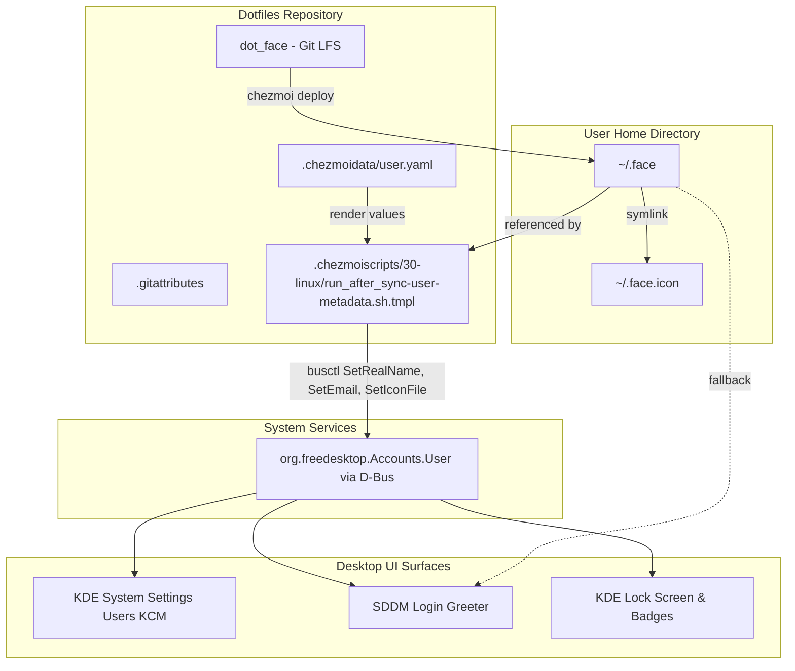

# Workstation User Metadata Management via Git LFS

## Goal Capsule

- **Objective:** Workstation user profile metadata (avatar picture, full name, and email address) is declaratively managed in dotfiles, deployed to the user home directory, and reconciled with AccountsService on `chezmoi apply` so that KDE System Settings, SDDM, and the Plasma lock screen display consistent personal profile information offline and across machines.
- **Means:** Track avatar image as a Git LFS static asset (`dot_face`), read user identity from `.chezmoidata/user.yaml`, and reconcile AccountsService via D-Bus in a `run_after_` chezmoi script.
- **Product authority:** Authoritative for user profile picture, real name, and email on managed Linux workstations; does not manage user account lifecycle, passwords, or authentication PAM stacks.
- **Open blockers:** None.

---

## Product Contract

### Summary

Declarative workstation user metadata management for dotfiles. The user's profile avatar is tracked in the repository as a versioned static asset via Git LFS, deployed to `~/.face` (with `~/.face.icon`), and reconciled with AccountsService on `chezmoi apply` so KDE System Settings, SDDM, and the lock screen display the user's profile picture, full name, and email.

### Problem Frame

On a freshly deployed or reinstalled Linux workstation, user accounts created by base OS installers lack personal profile metadata: the avatar defaults to initials ("JP"), the email address field in desktop settings is blank, and only the local username (`h82`) is configured. While dotfiles declaratively configures developer tools and Git identity (`user.name`, `user.email`), desktop user management surfaces (KDE System Settings `kcm_users`, SDDM login screen, Plasma lock screen) read from freedesktop AccountsService and `~/.face`.

Without automated management, setting profile pictures requires manual GUI intervention on every machine. Storing the avatar directly in the repository as a Git LFS asset enables hermetic, zero-network, reproducible provisioning on `chezmoi apply`, satisfying dotfiles' rebuild-grade standard without depending on live network APIs at apply time.

### Key Decisions

- **Static asset in Git LFS**: Track avatar image as a Git LFS binary (`dot_face`) in the dotfiles source instead of downloading it during `chezmoi apply`. (session-settled: user-directed — chosen over apply-time network fetch: keeps `chezmoi apply` 100% hermetic, reproducible, and operational offline). Governs R1, R2.
- **Dotfiles configuration as email authority**: Set system user email from `.chezmoidata/user.yaml` (`iam@h82.dev`) rather than the GitHub profile email (`iam@hyperlapse.dev`). (session-settled: user-directed — chosen over GitHub profile email: preserves workstation and git commit identity consistency). Governs R3.
- **Automated apply-time reconciliation**: Reconcile AccountsService properties on `chezmoi apply` via a lightweight `run_after_` script (`.chezmoiscripts/30-linux/run_after_sync-user-metadata.sh.tmpl`). (session-settled: user-directed — chosen over manual-only CLI: ensures workstation converges automatically, and `run_after_` lifecycle is excluded from the frozen R5 skip matrix per repository rules). Governs R4, R5.
- **AccountsService D-Bus + filesystem dual target**: Update both AccountsService properties (`SetRealName`, `SetEmail`, `SetIconFile`) via D-Bus and filesystem conventions (`~/.face` with `~/.face.icon` symlink) for broad desktop environment compatibility. Governs R2, R4, R5.

### Requirements

#### Asset and Repository Storage

- R1. `.gitattributes` MUST track avatar image assets (`dot_face`) using Git LFS (`filter=lfs diff=lfs merge=lfs -text`).
- R2. Chezmoi MUST deploy the tracked avatar asset to `~/.face` with standard permissions (0644), and provide a symlink or mirror at `~/.face.icon` for desktop environment compatibility.

#### Metadata Synchronization

- R3. User real name and email address deployed to system user accounts MUST be sourced from `.chezmoidata/user.yaml` (`user.fullname` and `user.email`).
- R4. A `run_after_` script in `.chezmoiscripts/30-linux/` MUST invoke AccountsService (`org.freedesktop.Accounts.User`) methods (`SetRealName`, `SetEmail`, and `SetIconFile`) via D-Bus (`busctl`) for the invoking user account.
- R5. The metadata reconciler script MUST be idempotent, querying current properties first and writing only when differences exist, running efficiently on every apply without modifying the frozen R5 skip matrix.

#### Asset Management & Initial Seed

- R6. The initial avatar asset MUST be seeded from the user's GitHub avatar (`avatar_url` from `gh api user` / GitHub user profile) and checked in via Git LFS.
- R7. Dotfiles MUST provide a documented or scripted procedure to re-fetch and update the avatar asset from GitHub on demand for repository maintainers.

### Scope Boundaries

#### Deferred for later

- Automated GitHub profile polling or scheduled background refresh of the LFS asset.
- Multi-user workstation support (applies to the active primary workstation user).

#### Outside this product's identity

- System user creation, deletion, or UID/GID assignment (managed by OS installer / authd).
- Password management, PAM stack alterations, or fingerprint authentication changes.
- Third-party SSO or cloud identity federation (Google/GitHub desktop login).

### Key Flows

- F1. Initial workstation apply
  - **Trigger:** Operator runs `chezmoi apply` on a new or existing host.
  - **Steps:**
    1. Chezmoi deploys `dot_face` to `~/.face` and creates `~/.face.icon`.
    2. The user-metadata `run_after_` script executes.
    3. The script executes `busctl` D-Bus calls to `org.freedesktop.Accounts.User` to set `RealName`, `Email`, and `IconFile` if any differ.
  - **Outcome:** KDE System Settings, SDDM, and Plasma lock screen display the user's avatar, full name, and email.
  - **Covered by:** R2, R3, R4, R5

- F2. Avatar refresh from GitHub
  - **Trigger:** User updates their avatar on GitHub and wants to update their dotfiles.
  - **Steps:**
    1. Maintainer runs the update command/procedure to fetch the new avatar from GitHub into `dot_face`.
    2. Git tracks the changed binary with Git LFS.
    3. On next `chezmoi apply`, the `run_after_` script detects that `IconFile` or `~/.face` content differs and updates AccountsService.
  - **Outcome:** New avatar is committed to git history via LFS and applied to the workstation.
  - **Covered by:** R1, R6, R7

### Acceptance Examples

- AE1. First-time apply populates user metadata
  - **Given:** A host with blank email and default placeholder avatar in AccountsService.
  - **When:** `chezmoi apply` completes.
  - **Then:** `busctl get-property org.freedesktop.Accounts /org/freedesktop/Accounts/User1000 org.freedesktop.Accounts.User Email` returns `"iam@h82.dev"`, `RealName` returns `"Joosung Park"`, and `IconFile` points to the user's icon.
  - **Covers:** R3, R4, R5

- AE2. Hermetic offline apply
  - **Given:** A host with no active internet connection.
  - **When:** `chezmoi apply` runs.
  - **Then:** Chezmoi deploys `~/.face` from the local Git LFS checkout and updates AccountsService without attempting any network calls.
  - **Covers:** R1, R2, R4

- AE3. Idempotent re-apply
  - **Given:** User metadata and avatar are already applied and unchanged.
  - **When:** `chezmoi apply` is executed a second time.
  - **Then:** The `run_after_` script queries AccountsService properties, detects they match, makes zero D-Bus mutation calls, and exits 0.
  - **Covers:** R5

### Visualizations

---

## Planning Contract

### Key Technical Decisions

- KTD1. **Git LFS tracking for avatar file**: Track `dot_face` via `.gitattributes` under Git LFS filter `filter=lfs diff=lfs merge=lfs -text` and mark `binary`. This mirrors the existing pattern used for firmware binaries in `.gitattributes` line 7 (`firmware/*/dist/*.bin`). (session-settled: user-directed — chosen over runtime download: keeps apply hermetic and offline-safe). Governs R1, R2.
- KTD2. **Lifecycle as `run_after_` script**: Implement the reconciler as `.chezmoiscripts/30-linux/run_after_sync-user-metadata.sh.tmpl`. Per repository conventions, the historical R5 skip matrix is frozen for `run_onchange_` scripts while post-freeze `run_after_` scripts are excluded from the matrix by lifecycle. (session-settled: user-directed — chosen over manual CLI: ensures automatic convergence on `chezmoi apply`). Governs R4, R5.
- KTD3. **AccountsService D-Bus property verification before mutation**: Probe `busctl` properties `RealName`, `Email`, and `IconFile` on `/org/freedesktop/Accounts/User1000` (or `User$(id -u)`), mutating only if the property differs, ensuring zero-write idempotent applies. Governs R4, R5.
- KTD4. **Skip sentinel and capability guard integration**: Guard execution on `busctl` command presence and Linux OS gate `{{ if eq .chezmoi.os "linux" -}}`, soft-skipping cleanly via `skip.sh.tmpl` if D-Bus / AccountsService is unavailable (e.g., container or headless mode). Governs R4, R5.

### High-Level Technical Design

The user metadata integration bridges static dotfiles data and live desktop session state:

1. **Static Deployment**:
   Chezmoi copies `dot_face` to `~/.face` (mode 0644) and creates `~/.face.icon` pointing to `.face`.
2. **Every-Apply Reconciliation**:
   During Phase 30 (`30-linux`), `run_after_sync-user-metadata.sh.tmpl` executes. It queries AccountsService D-Bus properties (`RealName`, `Email`, `IconFile`). If all match, it exits in milliseconds with zero writes.
3. **D-Bus AccountsService Invocation**:
   The script resolves the user's AccountsService D-Bus path `/org/freedesktop/Accounts/User$(id -u)` and inspects `RealName`, `Email`, and `IconFile`. If any value differs from the target state:
   - `SetRealName` is called with `.user.fullname`
   - `SetEmail` is called with `.user.email`
   - `SetIconFile` is called with `$HOME/.face`
4. **Desktop Reflection**:
   AccountsService updates `/var/lib/AccountsService/users/$USER` and `/var/lib/AccountsService/icons/$USER`, emitting D-Bus change signals immediately observed by KDE System Settings, SDDM, and the lock screen.

### Assumptions

- The primary desktop user UID is 1000 (`id -u`), which corresponds to local user `h82`.
- AccountsService daemon is enabled and running on Fedora desktop installations.
- Polkit configuration allows the local unprivileged desktop session user to invoke `SetRealName`, `SetEmail`, and `SetIconFile` on their own user object without root password elevation (verified on target host).

---

## Implementation Units

### U1. Git LFS asset configuration and avatar deployment

- **Goal:** Track avatar image via Git LFS in `.gitattributes`, deploy to `~/.face`, and create `~/.face.icon` symlink.
- **Requirements:** R1, R2, R6
- **Dependencies:** None
- **Files:**
  - `.gitattributes`
  - `dot_face`
  - `symlink_dot_face.icon`
- **Approach:**
  1. Add `dot_face filter=lfs diff=lfs merge=lfs -text` and `dot_face binary` to `.gitattributes`.
  2. Seed `dot_face` by fetching the current GitHub profile picture from `https://avatars.githubusercontent.com/u/12793256?v=4`.
  3. Create `symlink_dot_face.icon` with content `.face`.
- **Patterns to follow:** `.gitattributes` line 7 (Git LFS filter pattern for firmware binaries); `dot_claude/symlink_skills` (symlink format in chezmoi).
- **Test scenarios:**
  - *Happy path*: `git check-attr filter -- dot_face` reports `filter: lfs`.
  - *Symlink resolution*: `readlink ~/.face.icon` points to `.face`.
  - *Image format*: `file dot_face` recognizes JPEG or PNG image format.
- **Verification:** `git check-attr filter dot_face` reports `lfs`; `file dot_face` confirms image header.

### U2. AccountsService user metadata `run_after_` reconciler script

- **Goal:** Create `.chezmoiscripts/30-linux/run_after_sync-user-metadata.sh.tmpl` to reconcile user full name, email, and avatar with AccountsService via D-Bus.
- **Requirements:** R3, R4, R5
- **Dependencies:** U1
- **Files:**
  - `.chezmoiscripts/30-linux/run_after_sync-user-metadata.sh.tmpl`
- **Approach:**
  1. Scaffold script template with Linux OS gate `{{ if eq .chezmoi.os "linux" -}}`.
  2. Probe `busctl` command and user AccountsService D-Bus path `/org/freedesktop/Accounts/User$(id -u)`. Soft-skip cleanly via `skip.sh.tmpl` if AccountsService or D-Bus is unreachable.
  3. Query current properties using `busctl get-property`.
  4. Compare against target values (`.user.fullname`, `.user.email`, `$HOME/.face`).
  5. Call `SetRealName`, `SetEmail`, and `SetIconFile` only when differences exist.
- **Patterns to follow:** `.chezmoiscripts/30-linux/run_onchange_after_set-default-browser.sh.tmpl` (probe-before-write, idempotency) and `run_after_setup-podman-cluster.sh.tmpl` (post-freeze `run_after_` lifecycle).
- **Test scenarios:**
  - *Mutation*: When `Email` is empty, script executes `busctl call ... SetEmail s "iam@h82.dev"`, updating the property.
  - *Idempotency*: When all properties already match, script makes no D-Bus mutation calls and outputs convergence message.
  - *Missing service*: When `busctl` or AccountsService is absent (e.g. headless container), script logs soft-skip and exits 0.
- **Verification:** `chezmoi execute-template < .chezmoiscripts/30-linux/run_after_sync-user-metadata.sh.tmpl` renders valid shell; running script populates AccountsService properties.

### U3. CI validation and matrix verification

- **Goal:** Verify template rendering, skip declaration compliance, and repository CI consistency.
- **Requirements:** R5
- **Dependencies:** U1, U2
- **Files:**
  - `.chezmoiscripts/30-linux/run_after_sync-user-metadata.sh.tmpl`
- **Approach:**
  1. Verify rendered script with `chezmoi execute-template`.
  2. Run `.ci/check-skip-declarations.sh` to ensure all declared skip sites reconcile cleanly with the matrix.
  3. Run `git diff --check` to verify no whitespace or trailing line issues.
- **Patterns to follow:** `.ci/check-skip-declarations.sh`.
- **Test scenarios:**
  - *Declaration audit*: `.ci/check-skip-declarations.sh` succeeds with zero errors.
  - *Clean diff*: `git diff --check` passes cleanly.
- **Verification:** `.ci/check-skip-declarations.sh` exits 0.

---

## Verification Contract

### Verification Commands

- `git check-attr -a dot_face` → confirms Git LFS filter attributes.
- `file dot_face` → confirms valid image binary format.
- `chezmoi execute-template < .chezmoiscripts/30-linux/run_after_sync-user-metadata.sh.tmpl` → confirms template renders valid shell syntax.
- `./.ci/check-skip-declarations.sh` → confirms skip sentinels reconcile cleanly with zero matrix findings.
- `busctl get-property org.freedesktop.Accounts /org/freedesktop/Accounts/User1000 org.freedesktop.Accounts.User Email` → reflects `"iam@h82.dev"`.
- `busctl get-property org.freedesktop.Accounts /org/freedesktop/Accounts/User1000 org.freedesktop.Accounts.User IconFile` → reflects `/var/lib/AccountsService/icons/h82`.

---

## Definition of Done

- All implementation units U1 through U3 are implemented and verified.
- `.gitattributes` tracks `dot_face` under Git LFS.
- `dot_face` is seeded with valid image binary data and `symlink_dot_face.icon` targets `.face`.
- `.chezmoiscripts/30-linux/run_after_sync-user-metadata.sh.tmpl` is implemented, idempotent, and verified on the host.
- `.ci/check-skip-declarations.sh` passes with exit 0.
- `git diff --check` and `git status` report clean state.
