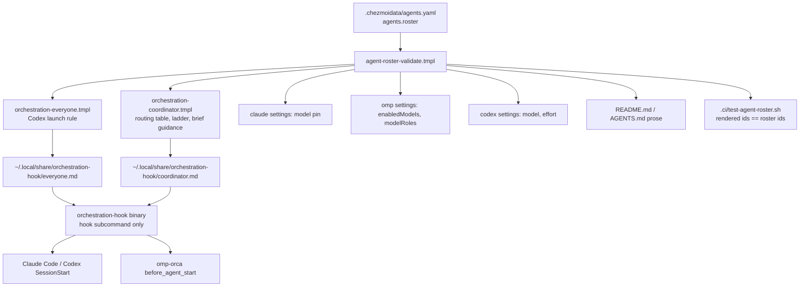
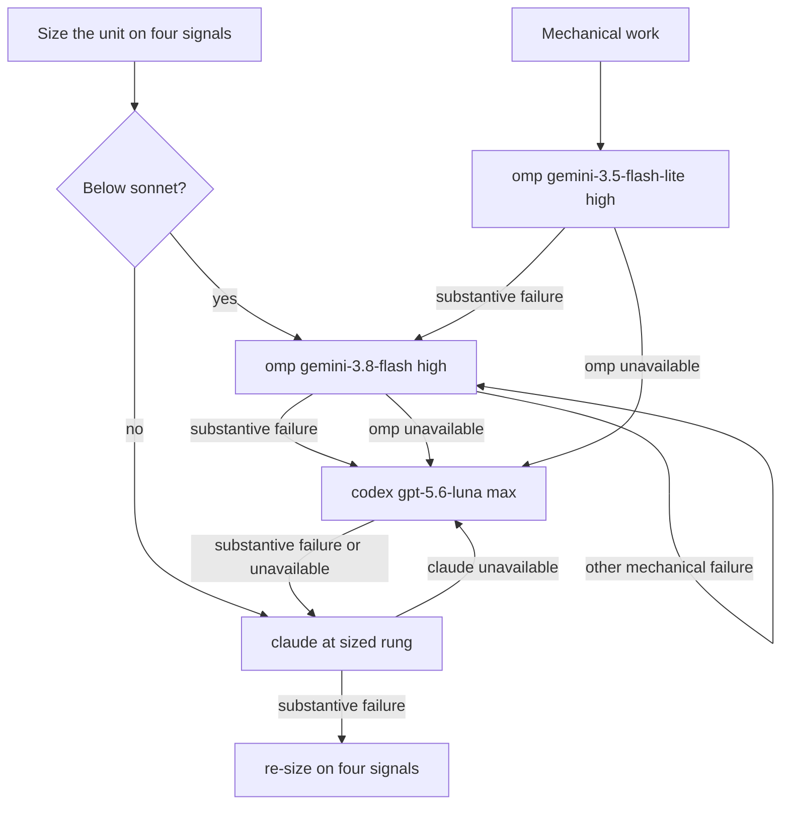

# Orca Lead Dispatch-Only Model Roster - Plan

## Goal Capsule

- **Objective:** An operator who opens any Orca lead session gets a lead that converses, writes briefs and plans, reads, and verifies, while every code edit and every other deliverable is produced by a worker chosen from one declared model roster, so a model change is one declaration and the lead's own quota goes to judgment and coordination.
- **Means:** Declare the roster once in `.chezmoidata/agents.yaml`, render it into chezmoi-managed payload files the hook binary reads at run time and into the settings pins and prose, remove the PreToolUse guard entirely, and revise the per-harness tuning paragraphs and per-model brief guidance against the vendors' current prompting guides (KTD1, KTD2, KTD4).
- **Product authority:** the user's decisions recorded in Key Decisions.
- **Execution profile:** implementation and verification by `ce-work` style units; each unit lands as one commit; CI is the acceptance gate.
- **Stop conditions:** a roster model the authoring host's catalog cannot resolve is a warning, never a stop; a rendered payload file missing after apply is a stop until the assert script passes.
- **Who finishes:** the implementing run ships every unit and the documentation unit; no follow-up run is planned.
- **Open blockers:** none.

---

## Product Contract

**Product Contract preservation:** changed: R1, R3, R5, R6, R7, R17 — the user removed the edit gate and the shell-launch guard (R3 now records the removal and the exit-0 `guard` shim a stale cached declaration needs), widened the lead's document exemption to every Markdown deliverable (R1), and added an agent-unavailable column to the routing table (R7); document review corrected the worker count to seven (R5), limited roster derivation to rendered targets and settings while `README.md` and `AGENTS.md` are CI-checked prose that chezmoi never renders (R6, R17), and aligned the R7 routing row with R1 by naming non-Markdown deliverables; F3 and AE5, AE6 were deleted with the gate; AE4 was rewritten to cover the removal and the shim; F1 gained the direct `claude` branch R7 already stated.

### Summary

The Orca lead stops editing code and delegating by habit: it dispatches every code edit and every non-Markdown deliverable to a worker, keeps Markdown documents, reading, and verification for itself, and is bound by prompt rules alone. A seven-model worker roster declared once in yaml drives Orca dispatch, the rendered payloads, the settings pins, and the tests, and CI checks the prose against it. The PreToolUse guard that denied shell launches of `codex` and `claude` is removed, so the hook binary only delivers payloads. Claude Code's default model becomes `fable[1m]`, and the prompt each harness and each worker receives is re-tuned from the vendors' guides.

### Problem Frame

The coordinator payload already prefers workers, yet the lead performs most edits itself, spends the Fable seat on mechanical work, and can even escalate a unit to a `fable` worker. The one mechanical gate the harness has, the shell-launch guard, cannot tell a legitimate document edit from a code edit and was never extended to edit tools, so it enforces a rule nobody wants enforced that way.

Model ids are hand-written in two payload templates, three settings pins, two prose files, and several tests. Twelve model-placement plans in the last seven weeks each touched that spread, and the payload text is bundled into the hook binary as raw text, so chezmoi data cannot reach it.

### Key Decisions

- **The lead reads, verifies, and writes Markdown documents itself; it never edits code or authors other deliverables.** Sending verification or document writing to a worker adds round trips without protecting quota. (session-settled: user-directed — chosen over reads-only-for-briefs and over dispatching plan authoring: verification and plan writing in a worker add a round trip per step) Governs R1.
- **The document exemption is every Markdown file, not a path.** Document paths vary across repositories, so a path rule misfires. (session-settled: user-directed — chosen over `docs/plans/` only and over `docs/**` plus `plans/`: paths differ per project) Governs R1.
- **The rule binds any Orca lead, regardless of harness or model.** (session-settled: user-approved — chosen over Claude-Code-only or Fable-only scope: the rendered file cannot know which model answers) Governs R1.
- **Outside Orca the session works directly, as today.** (session-settled: user-directed — chosen over refusing or auto-opening Orca: an uninjected session has no dispatch path) Governs R2.
- **No PreToolUse gate exists: the edit notice is not built and the shell-launch guard is removed.** The boundary is prompt-enforced. (session-settled: user-directed — chosen over an advisory edit notice and over keeping the launch guard: document paths vary, and a gate that cannot classify them is noise) Governs R3.
- **Judgment work goes to a `claude` worker on `fable` or a `codex` worker on `gpt-6-astra` medium; the lead never judges in place.** (session-settled: user-directed — chosen over the lead judging itself: the no-direct-work principle applies to verdicts too) Governs R7.
- **Codex splits by purpose: `gpt-6-astra` medium for judgment, `gpt-5.6-luna` max as the implementation fallback after Gemini.** (session-settled: user-directed — chosen over a unit-size split and over astra-then-luna escalation: luna's cost belongs to recovery, not to every review) Governs R7, R8.
- **Gemini splits by shape: `gemini-3.5-flash-lite` high for mechanical work, `gemini-3.8-flash` high for implementation and documents.** (session-settled: user-approved — chosen over lite for omp-internal roles only: the Orca dispatch, not omp's role table, should pick the cheaper seat) Governs R7, R9.
- **Default reviewers are `fable` and `astra`; Gemini Flash substitutes when astra errors; the author-exclusion rule is removed.** (session-settled: user-directed — chosen over a three- or four-reviewer set and over author exclusion: two frontier opinions per review keep quota, and the author's family stays available) Governs R7.
- **An unavailable agent hands its work to the next agent in the table; only when every agent is unavailable does the lead escalate to the user.** (session-settled: user-approved — chosen over the lead doing the work itself and over escalating on every outage: a vendor outage must not deadlock a run, and autonomous runs must not stop to ask) Governs R7.
- **The roster is declared in yaml and rendered into the payloads and prose.** (session-settled: user-directed — chosen over a yaml roster guarded only by a CI drift test: a rendered payload cannot drift) Governs R5, R6, R14, R17.
- **Claude Code's default model pin becomes `fable[1m]`.** (session-settled: user-directed — chosen over keeping `opus[1m]`: the lead is meant to be Fable) Governs R10.
- **A model availability check warns and never blocks apply.** (session-settled: user-directed — chosen over failing apply: an unauthenticated host must still converge) Governs R11.
- **Per-model prompt tuning lives in roster brief guidance; harness paragraphs keep naming families only.** One harness serves two models, so only the brief knows the model. Governs R12, R13.

### Actors

- A1. Orca lead: any harness session holding the coordinator payload.
- A2. `claude` worker on `sonnet`, `opus`, or `fable`.
- A3. `codex` worker on `gpt-6-astra` medium or `gpt-5.6-luna` max.
- A4. `omp` worker on `gemini-3.8-flash` high or `gemini-3.5-flash-lite` high.
- A5. Orchestration hook binary: session-start payload delivery only.
- A6. `chezmoi apply` and CI.

### Requirements

**Lead role boundary**

- R1. In an Orca-managed lead session the lead itself performs dialogue, dispatch brief authoring, Markdown document authoring (plans, requirements, learnings, glossary and prose files), repository reads, and verification commands (tests, builds, CI status, git reads), and dispatches every code edit and every non-Markdown deliverable to an Orca worker.
- R2. A session that received no orchestration injection keeps today's behavior and may edit and author directly.
- R3. No PreToolUse hook exists for Claude Code or Codex: the shell-launch guard is removed, no edit notice is built, and the lead boundary and the no-direct-CLI rule are prompt rules in the payloads only; the binary keeps a `guard` shim that answers a stale cached declaration with the harness's empty allow output and exit 0 until that session restarts.
- R4. `fable` is removed from the Implementation Unit sizing ladder, whose top rung becomes `opus`; `fable` appears only as the `claude` judgment model in R7.

**Model roster**

- R5. `.chezmoidata/agents.yaml` declares one roster: the lead pin and seven worker entries, each with agent, model id, effort or thinking level, the work shapes it takes, and its brief guidance (R12); no rendered target, settings map, or test names a worker model id by hand, including the omp, Codex, and Claude settings maps.
- R6. The coordinator payload, the everyone payload's Codex launch rule, the settings pins, and the CI assertions derive every model id from the roster; `README.md` and `AGENTS.md` are committed prose that chezmoi never renders, so CI checks every worker model id they name against the roster; CI fails when a rendered id set differs from the roster or when either prose file names an id absent from it.
- R7. Dispatch routing follows this table; a mechanical failure other than agent unavailability re-dispatches at the same rung with a sharpened brief and never advances a row, and the author of a document is not excluded from reviewing it.

| Work shape | First recipient | On substantive failure | On agent unavailable |
|---|---|---|---|
| Mechanical work: scout reads, symbol or file lookups, fixed-approach steps a command settles | `omp` `gemini-3.5-flash-lite` high | `omp` `gemini-3.8-flash` high | `codex` `gpt-5.6-luna` max, then `claude` `sonnet` |
| Frontend, non-Markdown deliverables, and Implementation Units the four signals place below `sonnet` | `omp` `gemini-3.8-flash` high | `codex` `gpt-5.6-luna` max, then `claude` at the rung the sizing gives | `codex` `gpt-5.6-luna` max, then `claude` at the rung the sizing gives |
| Implementation Units sized at `sonnet` or `opus` | `claude` at that rung, with the signals recorded | re-size on the four signals | `codex` `gpt-5.6-luna` max |
| Judgment work: code review, document review, `ce-pov`, brainstorm approach generation | `claude` `fable` and `codex` `gpt-6-astra` medium over the same brief | `omp` `gemini-3.8-flash` high replaces a `codex` reviewer that errors | `omp` `gemini-3.8-flash` high replaces whichever reviewer is unavailable |

- R8. A Codex worker launched through Orca selects model and effort from its roster role, the lead compares the launch receipt's requested and effective pair and treats a mismatch as a launch error under R7, and the Codex direct-session default stays `gpt-6-astra` medium.
- R9. omp's `enabledModels` are exactly `google-antigravity/gemini-3.8-flash` and `google-antigravity/gemini-3.5-flash-lite`, `gemini-3.1-flash-lite` is retired, the background and skim roles (`tiny`, `skim`, `smol`) run `gemini-3.5-flash-lite:high`, and every other role runs `gemini-3.8-flash:high`.
- R10. Claude Code's managed `model` pin is `fable[1m]`, and the effort declarations for fable, opus, and sonnet stay declared.
- R11. `chezmoi apply` and CI resolve every roster model against its provider catalog (`omp models --json` for Antigravity models, and the Codex and Claude catalogs where a command exists) and print a warning for any unresolved id; the check never fails apply or CI, and an absent or unauthenticated catalog command prints one informational skip line.

**Prompt tuning**

- R12. Each roster entry carries brief guidance that the lead applies when writing that worker's dispatch brief, with the content of this table as the floor.

| Model | Brief guidance |
|---|---|
| `claude` `fable` | Give one clear deliverable, the effort, action boundaries, and a definition of done. Tell it to finish the whole task and never end a turn on a plan or a question about authorized work. Ask for a one-line preamble and a standalone closing recap. Add no re-check or verification instructions. |
| `claude` `opus` | Supply the complete specification up front with no stubs or deferred discovery. State the intended scope and tell it not to fix or extend nearby code. Remove verification and double-check instructions. Cap subagent spawning. |
| `claude` `sonnet` | State scope literally and per item, because it does not generalize an instruction from one item to another. Fix the approach in the brief. For review briefs, ask for every finding with confidence and severity instead of filtering. |
| `codex` `gpt-6-astra` medium | Define the outcome, the constraints, the evidence, and the completion bar. Reserve ALWAYS and NEVER for true invariants. Tell it to bias toward action and to complete authorized work before asking. Keep the brief lean and free of repeated rules. |
| `codex` `gpt-5.6-luna` max | Keep the brief lean and state approval boundaries once. Name the validation to run (targeted tests, type or lint, build) and what to do when it cannot run. Use this entry only as the fallback R7 names. |
| `omp` `gemini-3.8-flash` high | Order the brief as rules, context, definitions, task, tool policy, output, verification, stop condition. Define ambiguous terms and thresholds. Place long context before the task. Name what must never be invented. |
| `omp` `gemini-3.5-flash-lite` high | Give short direct instructions for one bounded task. State an explicit tool-call budget, the output shape, and the stop condition. |

- R13. The three `This harness runs ` paragraphs of `.chezmoitemplates/agents-instructions.tmpl` are revised against the vendors' current guides and keep naming a model family only, never a model id: the Claude paragraph carries progress-update cadence, tool-call batching, finish-the-whole-task, compaction preservation, keep-changes-to-the-task, and lead-keeps-working-while-workers-run; the Codex paragraph carries lean-prompt, define-done, bias-to-action, and approval-boundaries-once; the omp paragraph carries rules-first structure, defined terms, an explicit tool policy, and a stop condition; the matching fixtures under `.ci/fixtures/agent-instructions/` change in the same commit.

**Payload rendering and consumers**

- R14. The coordinator and everyone payloads a session receives are rendered from the roster, and the hook binary no longer bundles the raw template text.
- R15. `.ci/test-agent-instructions.sh` keeps its needle and fixture assertions over the rendered payload, and the omp, Codex, and Claude settings reconcile tests assert the roster-derived pins.
- R16. `README.md` and `AGENTS.md` describe the roster, the lead boundary, and the removed guard in place of the one-model omp text and the launch-gate text.
- R17. A change to one roster entry followed by `chezmoi apply` changes the model a worker receives, with no hand edit of a template, rendered target, settings map, or test for the id itself; committed prose is hand-edited and CI-checked per R6.

### Key Flows

- F1. Implementation Unit dispatch
  - **Trigger:** a plan's unit is ready.
  - **Actors:** A1, A4, A3, A2.
  - **Steps:** the lead sizes the unit on the four signals; at `sonnet` or `opus` it dispatches to `claude` at that rung and records the signals; below `sonnet` it dispatches to `omp` `gemini-3.8-flash`; on substantive failure it re-sizes and dispatches to `codex` `gpt-5.6-luna` max; on a further substantive failure it dispatches to `claude` at the sized rung; an unavailable agent advances to the agent-unavailable column; any other mechanical failure re-dispatches at the same rung with a sharpened brief.
  - **Outcome:** one accepted `worker_done`.
  - **Covers R1, R4, R7, R8.**
- F2. Judgment review
  - **Trigger:** a review, verdict, or approach generation is required.
  - **Actors:** A1, A2, A3, A4.
  - **Steps:** the lead writes one brief file; dispatches `claude` `fable` and `codex` `gpt-6-astra` medium over it; replaces a reviewer whose launch or run errors, whose agent is unavailable, or whose Codex receipt mismatches with `omp` `gemini-3.8-flash`; weighs findings on their evidence.
  - **Outcome:** two opinions, or one plus the Gemini substitute.
  - **Covers R7, R8, R12.**
- F4. Roster change
  - **Trigger:** an operator edits a roster entry.
  - **Actors:** A6.
  - **Steps:** apply renders the payload files, instruction files, and pins; the availability check resolves each model and warns on a miss; CI compares rendered ids to the roster.
  - **Outcome:** every consumer carries the new id.
  - **Covers R5, R6, R11, R17.**

### Acceptance Examples

- AE1. **Covers R7.** Given a unit sized below `sonnet`, when the `omp` `gemini-3.8-flash` worker returns `--outcome failed` with a design escalation, then the lead records a substantive failure and re-dispatches to `codex` `gpt-5.6-luna` max.
- AE2. **Covers R7.** Given the same unit, when the `omp` worker's terminal is closed from outside the run, then the lead re-dispatches to `omp` `gemini-3.8-flash` with a sharpened brief and does not advance to luna.
- AE3. **Covers R7.** Given a judgment review, when the `codex` `gpt-6-astra` launch receipt reports an error, then the lead dispatches `omp` `gemini-3.8-flash` over the same brief and the review still has two reviewers.
- AE4. **Covers R3.** Given the deployed Claude and Codex plugin hook declarations after apply, when their `hooks.json` files are read, then neither declares a `PreToolUse` event, and the hook binary answers `guard` with the harness's empty allow output and exit 0 while `hook` still delivers payloads.
- AE7. **Covers R11.** Given a host where `omp models --json` does not list a roster model, when `chezmoi apply` runs, then it prints a warning naming the id and exits successfully.
- AE8. **Covers R4, R7.** Given a unit whose plan names the outcome but not the approach and whose change crosses a service boundary, when the lead sizes it at `opus`, then it dispatches `claude` `opus` directly, records the signals, and has no `fable` rung to escalate to.
- AE9. **Covers R6, R17.** Given the roster's mechanical entry is changed to a new Gemini id, when apply and CI run, then the rendered coordinator payload names the new id, no old id remains, and no template was hand-edited.
- AE10. **Covers R7.** Given a mechanical unit, when `omp` is not installed on the host, then the lead dispatches `codex` `gpt-5.6-luna` max and records the agent as unavailable rather than re-dispatching to `omp`.
- AE11. **Covers R11.** Given a host where the `omp` binary is absent, when `chezmoi apply` runs, then the availability step prints one skip line and exits successfully.

### Success Criteria

- A reader of the rendered `CLAUDE.md`, the Codex `AGENTS.md`, or the omp `AGENTS.md` can name the lead boundary and the seven roster models without opening another file.
- The three harness tuning paragraphs pass the existing whole-paragraph fixture comparison after revision.
- The availability check is repeatable on any host and its warning names the unresolved id.

### Scope Boundaries

- Changes to the `compound-engineering` plugin itself.
- Orca app settings in `.chezmoidata/orca.yaml`, including its source-control agent defaults.
- Rewriting existing plans under `docs/plans/`.
- Adding worker agents beyond `claude`, `codex`, and `omp`.
- Any mechanical enforcement of the lead boundary or the no-direct-CLI rule; both stay prompt rules.
- Deferred for later: rendering the roster into per-project `AGENTS.md` supplements.

### Dependencies / Assumptions

- Orca `worker-start` accepts a model and effort for `claude` and `codex` launches and reports requested versus effective values in the receipt, as the existing Codex launch rule already relies on.
- `gemini-3.5-flash-lite` and `gemini-3.8-flash` resolve on the authoring host with `high` thinking, checked with `omp models --json` on 2026-09-16; other hosts rely on R11's warning.
- Codex trust records are keyed per event and hashed over that event's own handler (`codex-hook-trust.tmpl`), so removing `PreToolUse` leaves the `session_start` key and hash unchanged and the orphaned `pre_tool_use` record inert; no re-seed is required, and `orca-ide agent hooks prepare-codex` stays an optional confirmation.
- Orca `worker-start --model` and `--effort` reach Claude, Codex, and Cursor launches only (`orca-ide orchestration worker-start --help`), so an `omp` seat is selected by launching the omp terminal with the roster model itself and attaching it with `worker-start --terminal <handle>` (KTD9).

### Sources / Research

- `.chezmoidata/agents.yaml`: Claude pin (lines 227-230), omp models and roles (323-346), Codex pin (381-382).
- `.chezmoitemplates/orchestration-coordinator.tmpl`, `.chezmoitemplates/orchestration-everyone.tmpl`, `.chezmoitemplates/agents-instructions.tmpl` (harness paragraphs at lines 87-91).
- `packages/orchestration-hook/src/payload.ts` (raw text import, lines 18-19), `packages/orchestration-hook/src/gate.ts`, `packages/orchestration-hook/src/cli.ts` (guard path, lines 210-292 and 338-344), `packages/orchestration-hook/src/role.ts`, `packages/orchestration-hook/src/envelope.ts`, `packages/omp-orca/src/index.ts` (spawns the hook binary, lines 34-39 and 77-81).
- `.chezmoitemplates/claude-hook-declaration.tmpl` (PreToolUse at lines 44-56), `.chezmoitemplates/codex-hook-declaration.tmpl` (PreToolUse at lines 50-61), `.chezmoitemplates/codex-hook-trust.tmpl` (event list at line 53).
- `dot_local/share/dotfiles-claude-plugin/dot_claude-plugin/plugin.json.tmpl` and `dot_local/share/dotfiles-codex-plugin/dot_codex-plugin/plugin.json.tmpl` (version digests over the declaration, the payload bodies, and the tree).
- `.chezmoiscripts/60-build/run_onchange_after_20-build-orchestration-hook.sh.tmpl` (build and staging to `~/.local/libexec/orchestration-hook`), `.chezmoiscripts/70-agents/run_after_config-omp-settings.sh.tmpl` (catalog probe, lines 100-136), `.chezmoiscripts/70-agents/run_after_config-claude-settings.sh.tmpl`, `.chezmoiscripts/70-agents/run_after_config-codex-settings.sh.tmpl`, `.chezmoiscripts/70-agents/run_onchange_after_update-claude-plugins.sh.tmpl` (fingerprint inputs, line 21).
- `.chezmoitemplates/omp-settings-validate.tmpl`, `codex-settings-validate.tmpl`, `claude-settings-validate.tmpl`.
- `.ci/test-agent-instructions.sh` (fixture compare at 197-205, needle blocks at 539-584 and 597-621), `.ci/lib/render-gate-helpers.sh` (`render` helper), `.ci/test-orchestration-hook.sh` (guard cases at 72-79, 305-400), `.ci/test-claude-codex-plugin-reconcile.sh`, `.ci/test-omp-settings-reconcile.sh`, `.ci/test-codex-settings-reconcile.sh`, `.ci/test-claude-settings-reconcile.sh`, `.github/workflows/ci.yml` (script jobs at 78-91, workspace job at 308-328).
- `AGENTS.md` sections on the Claude plugin hooks (line 62), model placement (line 73), and managed instruction targets (line 76); `README.md` omp model line (299); `docs/decommission/omp.md` model availability notes (113-124).
- `docs/solutions/integration-issues/unattended-agent-harness-workspace-trust-seeding.md`: unattended dispatch stalls on interactive trust prompts, which is why the plan verifies that the Codex `session_start` trust hash does not move (U5).
- Prior plans: `docs/plans/2026-09-13-1353-chore-codex-default-orca-worker-models-plan.md`, `docs/plans/2026-09-09-0904-docs-harness-model-tuned-agent-instructions-plan.md`, `docs/plans/2026-09-12-1402-feat-harness-neutral-orchestration-delivery-plan.md`, `docs/plans/2026-08-19-1401-refactor-omp-delegation-first-model-tiers-plan.md`.
- Prompting guides: [Claude Fable 5.1](https://platform.claude.com/docs/en/build-with-claude/prompt-engineering/prompting-claude-fable-5-1), [Claude Opus 5](https://platform.claude.com/docs/en/build-with-claude/prompt-engineering/prompting-claude-opus-5), [Claude Sonnet 5](https://platform.claude.com/docs/en/build-with-claude/prompt-engineering/prompting-claude-sonnet-5), [GPT-6 Astra skills and prompts](https://developers.openai.com/blog/rethinking-skills-and-prompts-for-gpt-6-astra), [OpenAI latest model guidance](https://developers.openai.com/api/docs/guides/latest-model), [GPT-5.6 prompt guidance](https://developers.openai.com/api/docs/guides/prompt-guidance-gpt-5p6) (substitute for the builder's guide on openai.com, which returns 403), [Gemini 3.8 Flash prompting guide](https://promptessor.com/blog/gemini-3-8-flash-prompting-guide), [What's new in Gemini 3.5](https://ai.google.dev/gemini-api/docs/generate-content/whats-new-gemini-3.5).

---

## Planning Contract

### Key Technical Decisions

- KTD1. **Rendered payloads ship as chezmoi-managed target files that the hook binary reads at run time.** Two targets, `~/.local/share/orchestration-hook/everyone.md` and `~/.local/share/orchestration-hook/coordinator.md`, are rendered from the two existing `.chezmoitemplates` bodies with the roster as data; the binary reads them when composing an envelope and treats a missing or empty file as "not delivered" under the existing Lead envelope atomicity rule. Chosen over rendering at build time inside the hook build script, because a run-time file follows STRATEGY's "data plus dumb reconciler" shape, keeps the binary host-independent, and lets the plugin digests hash the rendered bodies directly. Governs R14, R17.
- KTD2. **The roster is a single `agents.roster` map in `.chezmoidata/agents.yaml`, validated by a new `.chezmoitemplates/agent-roster-validate.tmpl`.** Shape: `lead.claude.model`, and `workers` as a list of seven entries `{id, agent, model, effort, shapes[], rung?, brief}`; `effort` is the vendor's own token (`medium`, `max`, `high`), and `rung` (`sonnet` or `opus`) is required on a `claude` implementation entry so the sizing ladder selects a destination by rung rather than by model name. The validator fails the render on a duplicate id, an unknown agent, an empty brief, a duplicate `(agent, rung)` pair, or an omp entry whose model lacks the `google-antigravity/` provider prefix. Governs R5.
- KTD3. **Settings pins are derived from the roster at render time; the settings maps stop naming models.** The Claude reconciler renders `model` from `roster.lead.claude.model`; the omp reconciler renders `enabledModels` from the two omp entries and `modelRoles` by mapping `tiny`, `skim`, `smol` to the mechanical entry and every other role to the implementation entry; the Codex reconciler renders `model` and `model_reasoning_effort` from the judgment entry. The `*-settings-validate.tmpl` templates receive the derived leaves, so their existing grammar checks still run. Governs R5, R9, R10, R15.
- KTD4. **The PreToolUse guard is deleted end to end, with a one-line `guard` shim left in the binary.** `gate.ts`, the gate logic, the guard fixtures and test cases, and the `PreToolUse` blocks in both hook declarations go; `codex-hook-trust.tmpl` drops the `PreToolUse` event from its hash list so the remaining `SessionStart` record keeps its key. `cli.ts` keeps a `guard` case that prints the harness's empty allow output and exits 0, because a live session whose cached declaration still calls `guard` would otherwise hit the unknown-command exit code 2, which Claude Code treats as a blocking PreToolUse error on every Bash call until restart. `command-scan.ts` is removed with it unless the payload path imports it. (session-settled: user-directed — chosen over keeping the launch guard and over adding an advisory edit notice: document paths vary and the gate cannot classify them) Governs R3.
- KTD5. **The payload templates become real chezmoi templates over `.ctx` data.** The coordinator body renders the R7 routing table, the R12 brief guidance table, the sizing ladder without `fable`, the lead boundary paragraph, and the agent-unavailable rule from roster entries selected by `shapes`; the everyone body renders the Codex launch rule from the two Codex entries; the coordinator body also renders the omp seat-selection line (KTD9) from the two omp entries beside the R7 table. Prose sentences stay hand-written; only ids, efforts, and table rows come from data. Every include of a payload body, in the target wrappers, the plugin digests, the instruction-core wrapper, and the tests, passes one signature, `dict "ctx" . "harness" <harness>`, so no caller renders with missing roster data. Governs R6, R7, R12, R14.
- KTD6. **Roster parity is asserted by rendering, not grepping literals.** A new `.ci/test-agent-roster.sh` renders the roster ids with `chezmoi execute-template`, renders both payload bodies through the existing `render` helper, and requires the model-id set in the rendered payloads to equal the roster set; `.ci/test-agent-instructions.sh` replaces its hard-coded model needles with ids read from the same roster render. The parity scan covers rendered targets, settings maps, and the two committed prose files (`README.md`, `AGENTS.md`); it never scans `docs/plans/`, `docs/decommission/`, or other historical prose. Governs R6, R15.
- KTD7. **The omp catalog probe warns instead of exiting.** The `exit 1` on an unserved selector becomes a warning line; a missing `omp` binary or `jq` keeps the existing informational skip. A roster-level probe step reuses that catalog for every `google-antigravity/` roster model, also compares each entry's declared `effort` with the catalog's `thinking` levels and warns on an unsupported pair, and prints one skip line for Codex and Claude, whose CLIs expose no catalog command. Governs R11.
- KTD8. **Harness tuning paragraphs are rewritten as three fixtures plus template text, in the same commit.** Each paragraph keeps its opening `This harness runs <family> models.` sentence, stays a single line, and names no model id; the fixture files are the source of the expected bytes. Governs R13.
- KTD9. **An omp seat is selected by launching the omp terminal with the roster model and attaching it to the dispatch.** Orca `worker-start --model` and `--effort` forward to Claude, Codex, and Cursor launches only, so for an `omp` entry the lead opens an Orca terminal running omp with that entry's model and thinking level, confirms the model from the terminal, and dispatches with `worker-start --terminal <handle>`; omp's own `modelRoles` then never decides which Gemini seat a dispatch uses. The exact terminal-launch command is taken from the installed Orca guide at implementation time. Governs R7, R9, R17.

### High-Level Technical Design

Roster fan-out: one declaration feeds every consumer.

Dispatch ladder as the coordinator payload states it (R7):

### Assumptions

- Claude Code and Codex read hook declarations from the plugin cache, so removing the `PreToolUse` block reaches a session only after the plugin version digest changes and the reconciler reinstalls; the existing digest already hashes the rendered declaration.
- `node:sqlite` role detection in `role.ts` stays; only the guard consumer of the role goes away.
- The `text-modules.d.ts` declaration and the vite `tmplText` test plugin exist only for the raw template import and are removed with it.

### System-Wide Impact

- **Plugin cache propagation.** The plugin cache carries only the hook declaration, so the `PreToolUse` removal reaches a session after the plugin version digest moves and the reconciler reinstalls. Payload text is read from the rendered targets at each SessionStart, so a roster edit reaches the next session immediately after apply, and a running session keeps its old payload until it restarts. Both `plugin.json.tmpl` files hash the rendered payload bodies through `includeTemplate` so the plugin version stays a rules-version signal (U3), not because delivery depends on it.
- **Run-time payload delivery adds a failure boundary.** A missing or empty `~/.local/share/orchestration-hook/*.md` makes the hook emit no context, and `omp-orca` inherits that because it reads the hook's stdout. The existing assert script checks only the binary, so it gains a payload-file assertion (U3), and the Lead envelope atomicity rule is what keeps the failure visible rather than partial.
- **Codex trust record.** Codex trust is keyed per event and hashed over that event's own handler, so dropping `PreToolUse` leaves the `session_start` record valid and the orphaned `pre_tool_use` record inert; U5 asserts the hash is unchanged and no re-seed is required.
- **Apply ordering downstream of the reconcilers.** The omp catalog probe runs in the `70-agents` phase before the key and garden phases; turning its `exit 1` into a warning (KTD7) is what stops an unauthenticated host from stranding the later phases.
- **Uniform prompt-only boundary.** With the guard gone, all three lead harnesses rely on the payload text alone; omp never had a tool-level hook, so the removal ends an asymmetry rather than creating one.

### Risks & Dependencies

| Risk | Mitigation |
|---|---|
| A live session keeps a stale plugin manifest that still declares `PreToolUse` and calls `guard`; an unknown-command exit 2 would block every Bash call in that session | The `guard` shim answers a stale cached declaration with the harness's empty allow output and exit 0 until the session restarts (KTD4, U8); CI asserts the plugin version changes with the declaration (U3, U5) |
| U3 lands before U4 and the bundled binary embeds template text with `{{` actions | U3 and U4 land as one commit; the parity test diffs the binary's output against the rendered target files (U4) |
| Payload files are unrendered or deleted and every lead silently loses the coordinator rules | Assert presence and non-zero size in `run_after_assert-orchestration-hook.sh.tmpl` (U3); hook tests cover the missing-file path (U4) |
| Offline or unauthenticated host prints false model-availability warnings | The probe distinguishes an absent CLI or empty catalog (one skip line) from a served provider missing the id (a warning) (U2) |
| A roster change retires a model while workers dispatched under the old roster still run | Operational note in `AGENTS.md`: apply a roster change with no active dispatches, or accept that running workers finish on the old model (U7) |
| `gemini-3.5-flash-lite` is absent from a host's Antigravity catalog | The warning names the id; `omp` falls back per its own provider behavior and the lead's R7 agent-unavailable column covers the dispatch |

### Sequencing

U1 first (roster and validator), then U2 (settings derivation) in parallel with U3 and U4 landed as one commit (payload templating, rendered targets, and the binary's run-time read, because a templated body with an embedding binary fails the payload-parity gate), then U8 (guard removal from the binary) which depends on U4's test rewrite, then U5 (hook declarations and trust) which depends on U8, then U6 (harness paragraphs) independently after U1, and U7 (prose and docs) last.

---

## Implementation Units

### U1. Declare the roster and its validator

- **Goal:** one `agents.roster` map that every later unit renders from.
- **Requirements:** R5, R12 (KTD2).
- **Dependencies:** none.
- **Files:** `.chezmoidata/agents.yaml` (new `roster` map under `agents`), `.chezmoitemplates/agent-roster-validate.tmpl` (new), `.ci/test-agent-roster.sh` (new, validator cases only in this unit), `.github/workflows/ci.yml` (add the script to the `agent-reconciliation` job).
- **Approach:**
  1. Add `agents.roster.lead.claude.model: fable[1m]` and seven `workers` entries with `id`, `agent`, `model`, `effort`, `shapes`, `brief`, and `rung` on the two `claude` implementation entries, copying the R12 table text into each `brief`.
  2. Write the validator to fail the render on duplicate ids, unknown agent, empty brief, missing `effort`, a duplicate `(agent, rung)` pair, a `claude` implementation entry without `rung`, and an omp model without the `google-antigravity/` prefix; follow the failure-message style of `omp-settings-validate.tmpl`.
  3. Give `shapes` a closed vocabulary (`mechanical`, `implementation`, `judgment`, `fallback`) and require exactly one entry per shape per agent where R7 needs one, except that `claude` carries two `implementation` entries distinguished by `rung` (`sonnet`, `opus`).
- **Patterns to follow:** `.chezmoitemplates/omp-settings-validate.tmpl` for validator shape and `fail` messages; `.ci/test-omp-settings-reconcile.sh` for rendering a validator under `chezmoi execute-template`.
- **Test scenarios:**
  - A roster with the seven declared entries renders without error and exposes the id list.
  - Two `claude` implementation entries with rungs `sonnet` and `opus` render; two with the same rung fail the render naming the rung.
  - A roster with two entries sharing an id fails the render naming the id.
  - An omp entry with model `gemini-3.8-flash` (no provider prefix) fails the render.
  - A worker entry with an empty `brief` fails the render.
  - A roster missing a `judgment` shape for `codex` fails the render.
- **Verification:** `bash .ci/test-agent-roster.sh` passes; `bash .ci/test-ci-wiring.sh` confirms the new script is registered in the workflow; `chezmoi execute-template` over the validator prints the id list for the committed roster.

### U2. Derive the settings pins from the roster

- **Goal:** Claude, omp, and Codex settings carry roster-derived model leaves and no hand-written model ids.
- **Requirements:** R5, R9, R10, R11 (KTD3, KTD7).
- **Dependencies:** U1.
- **Files:** `.chezmoidata/agents.yaml` (remove `model` from `agents.claude.settings`, `enabledModels` and `modelRoles` from `agents.omp.settings`, `model` and `model_reasoning_effort` from `agents.codex.settings`), `.chezmoiscripts/70-agents/run_after_config-claude-settings.sh.tmpl`, `.chezmoiscripts/70-agents/run_after_config-omp-settings.sh.tmpl`, `.chezmoiscripts/70-agents/run_after_config-codex-settings.sh.tmpl`, `.chezmoitemplates/claude-settings-validate.tmpl`, `.chezmoitemplates/omp-settings-validate.tmpl`, `.chezmoitemplates/codex-settings-validate.tmpl`, `.ci/test-claude-settings-reconcile.sh`, `.ci/test-omp-settings-reconcile.sh`, `.ci/test-codex-settings-reconcile.sh`, `docs/decommission/omp.md`.
- **Approach:**
  1. In each reconciler template, merge the roster-derived leaves into the declared settings dict before it reaches the validator, so the validator's existing grammar checks run over the derived values.
  2. omp: `enabledModels` is the two omp entries' models; `modelRoles` maps `tiny`, `skim`, `smol` to `<mechanical model>:<effort>` and every other declared role to `<implementation model>:<effort>`; keep `plan: "@fable"` and the `@worker` aliases as they are.
  3. Claude: `model` comes from `roster.lead.claude.model`; keep the three `modelSettings.*.effortLevel` leaves declared by hand because they are not worker models.
  4. Codex: `model` and `model_reasoning_effort` come from the `codex` entry whose shape is `judgment`.
  5. omp catalog probe: replace `exit 1` with a warning line and continue; add a roster loop over every `google-antigravity/` roster model against the same catalog, warning on a missing id and on a declared `effort` absent from that model's `thinking` list; print one skip line naming Codex and Claude as having no catalog command.
  6. Update `docs/decommission/omp.md` lines 113-124 to describe the warning.
- **Patterns to follow:** the bounded-read and fail-open comments already in `run_after_config-omp-settings.sh.tmpl`; the type-and-value assertions in `.ci/test-omp-settings-reconcile.sh` lines 39-40 and 237-250.
- **Test scenarios:**
  - Rendered omp settings list exactly `google-antigravity/gemini-3.8-flash` and `google-antigravity/gemini-3.5-flash-lite` in `enabledModels`.
  - Rendered omp `modelRoles.tiny` equals `google-antigravity/gemini-3.5-flash-lite:high` and `modelRoles.default` equals `google-antigravity/gemini-3.8-flash:high`.
  - Rendered Claude settings pin `model` to `fable[1m]` and keep the three effort leaves.
  - Rendered Codex settings pin `gpt-6-astra` and `medium`.
  - Covers AE7. A stub `omp models --json` lacking `gemini-3.5-flash-lite` makes the reconciler print a warning naming the id and exit 0.
  - Covers AE11. A PATH without `omp` makes the reconciler print one skip line and exit 0.
  - A roster whose omp implementation model changes re-renders `modelRoles.default` without any other edit.
- **Verification:** the three settings reconcile tests pass against the rendered scripts; `grep -n "gemini-3\|gpt-\|opus\[" .chezmoidata/agents.yaml` matches only inside the `roster` map.

### U3. Render the payloads from the roster and deploy them as targets

- **Goal:** both payload bodies are chezmoi templates over the roster, and apply writes their rendered form to two managed files.
- **Requirements:** R4, R6, R7, R12, R14, R17 (KTD1, KTD5, KTD6).
- **Dependencies:** U1.
- **Files:** `.chezmoitemplates/orchestration-coordinator.tmpl`, `.chezmoitemplates/orchestration-everyone.tmpl`, `dot_local/share/orchestration-hook/everyone.md.tmpl` (new), `dot_local/share/orchestration-hook/coordinator.md.tmpl` (new), `.ci/test-agent-roster.sh` (parity cases), `.ci/test-agent-instructions.sh`, `dot_local/share/dotfiles-claude-plugin/dot_claude-plugin/plugin.json.tmpl`, `dot_local/share/dotfiles-codex-plugin/dot_codex-plugin/plugin.json.tmpl`, `.chezmoiscripts/70-agents/run_onchange_after_update-claude-plugins.sh.tmpl`, `.chezmoiscripts/70-agents/run_onchange_after_update-codex-plugins.sh.tmpl`, `.chezmoiscripts/70-agents/run_after_assert-orchestration-hook.sh.tmpl`.
- **Approach:**
  1. Coordinator body: add the lead boundary paragraph (R1, R2, R3 as prose); replace the dispatch-target and Implementation Unit paragraphs with the R7 table rendered from roster entries selected by `shapes`, the agent-unavailable rule, the sizing ladder ending at `opus`, and the R12 brief guidance table; delete the author-exclusion sentence and every `fable` rung sentence; keep the brief-file, deadline, and release contract paragraphs unchanged.
  2. Everyone body: render the Codex launch rule from the two Codex entries (judgment entry for review or cross-model work, fallback entry for implementation fallback) and keep its receipt-comparison sentences.
  3. Add the two target templates as one-line `includeTemplate` wrappers that pass `dict "ctx" . "harness" <harness>` (KTD5), and update the plugin digests and the instruction-core and test wrappers to that same signature.
  4. Extend `plugin.json.tmpl` in both plugins to hash the rendered payload bodies (via `includeTemplate`) instead of the raw template files (`include`), so the plugin version records a roster edit as a rules change; confirm `.chezmoidata/agents.yaml` is already a fingerprint input of both plugin reconcilers (the Codex one lists it at line 13) and add it only where missing.
  5. Extend `run_after_assert-orchestration-hook.sh.tmpl` to assert that both rendered payload files exist and are non-empty next to its existing binary check.
  6. In `.ci/test-agent-instructions.sh`, replace the model-id needles in `CLAUDE_COORDINATOR_NEEDLES` with needles built from the roster render, and add the lead boundary sentences as new needles.
  7. In `.ci/test-agent-roster.sh`, render both bodies through `render` and assert the model-id set equals the roster set, that `fable` does not appear as a ladder rung, that the rendered coordinator names the omp seat-selection line (KTD9) with the flash-lite model, and that every worker model id named in `README.md` or `AGENTS.md` is in the roster set.
- **Patterns to follow:** `render` in `.ci/lib/render-gate-helpers.sh`; the wrapper-and-digest pattern in `plugin.json.tmpl` lines 24-46.
- **Test scenarios:**
  - Covers AE9. Changing the mechanical entry's model to a stub id re-renders the coordinator body with the stub and without the old id.
  - The rendered coordinator body contains the R7 table with four rows and the R12 table with seven rows.
  - The rendered coordinator body contains no sentence naming `fable` as a unit rung and no author-exclusion sentence.
  - The rendered everyone body names `gpt-6-astra` with `medium` for judgment launches and `gpt-5.6-luna` with `max` for fallback launches.
  - Every existing `COORDINATOR_NEEDLES` entry that is not a model id still matches.
  - Both plugin `plugin.json` versions change when a roster entry changes and stay fixed when nothing changes.
  - The assert script fails when a rendered payload file is missing or empty and passes when both are present.
  - A stub `README.md` naming a model id absent from the roster fails the prose parity case; the committed files pass it.
- **Verification:** `bash .ci/test-agent-instructions.sh` and `bash .ci/test-agent-roster.sh` pass; `chezmoi apply --dry-run` shows the two new targets and the plugin manifests. Lands in the same commit as U4.

### U4. Read rendered payloads at run time

- **Goal:** the hook binary composes envelopes from the two managed files instead of bundled template text.
- **Requirements:** R14 (KTD1).
- **Dependencies:** U3.
- **Files:** `packages/orchestration-hook/src/payload.ts`, `packages/orchestration-hook/src/envelope.ts`, `packages/orchestration-hook/src/text-modules.d.ts` (delete), `packages/orchestration-hook/vite.config.ts`, `packages/orchestration-hook/test/envelope.test.ts`, `packages/orchestration-hook/test/cli.test.ts`, `packages/orchestration-hook/test/fixtures/` (new payload fixtures), `.chezmoiscripts/60-build/run_onchange_after_20-build-orchestration-hook.sh.tmpl`, `.ci/test-orchestration-hook.sh`, `.ci/test-build-orchestration-hook.sh`.
- **Approach:**
  1. `payload.ts` resolves the two file paths under the home directory (env override for tests, same convention `omp-orca` uses for `DOTFILES_ORCHESTRATION_HOOK`) and reads them; a missing, unreadable, or empty file returns `null`.
  2. `envelope.ts` treats a `null` payload as a missing half of the lead envelope and returns no context, per the existing atomicity rule; the worker context likewise requires the everyone file.
  3. Remove the vite `tmplText` plugin and the `.d.ts` module declaration.
  4. In the build script, remove the `payload-digest` fingerprint value and the payload-body loop, and keep the `hook-build-id` value over `packages/orchestration-hook/src/**` because the fingerprint globs deliberately omit the src glob and a src-only edit must still rebuild; the plugin digests (U3) own payload tracking.
  5. `print-payload` reads the same managed file the `hook` path reads and prints it verbatim, so the parity gate stays meaningful.
  6. In `.ci/test-orchestration-hook.sh`, rewrite the payload-parity block to render each body through `render`, place the result at the env-overridden payload path, and diff `print-payload` against it; replace the current template-delimiter check with an assertion that the rendered body contains no `{{`; add cases for the rendered-file read path and keep the SessionStart delivery and fail-open cases; guard cases are removed in U8.
- **Patterns to follow:** `packages/omp-orca/src/index.ts` for env-overridable path resolution; the fail-open comments at the top of `cli.ts`.
- **Test scenarios:**
  - `hook --harness claude` with both files present emits the lead envelope containing both bodies.
  - `hook --harness claude` with the coordinator file missing emits no context and exits 0.
  - `hook --harness omp` reads the same files and emits the same bodies.
  - An unreadable payload file (permissions) is treated as missing, not as an error.
  - An empty payload file is treated as missing.
  - `envelope.test.ts` no longer imports template text and passes with fixture strings.
  - `print-payload --harness claude` output equals the rendered coordinator target byte for byte, and the rendered target contains no `{{`.
  - A src-only edit to the hook package changes the `hook-build-id` fingerprint value.
- **Verification:** `cd packages && vp run -r typecheck && vp run -r test` pass; `bash .ci/test-orchestration-hook.sh` and `bash .ci/test-build-orchestration-hook.sh` pass against the rebuilt binary. Lands in the same commit as U3.

### U8. Remove the guard from the binary

- **Goal:** the hook binary has no gate source and no guard tests, and `guard` is a one-line shim that allows and exits 0.
- **Requirements:** R3 (KTD4).
- **Dependencies:** U4.
- **Files:** `packages/orchestration-hook/src/cli.ts`, `packages/orchestration-hook/src/gate.ts` (delete), `packages/orchestration-hook/src/command-scan.ts` (delete), `packages/orchestration-hook/test/gate.test.ts` (delete), `packages/orchestration-hook/test/command-scan.test.ts` (delete), `packages/orchestration-hook/test/fixtures/pretooluse-claude.json` (delete), `packages/orchestration-hook/test/cli.test.ts`, `packages/orchestration-hook/README.md`, `.ci/test-orchestration-hook.sh`.
- **Approach:**
  1. `cli.ts` drops the gate logic, the guard stdin deadline, and the deny output, and replaces the `guard` branch with a shim that prints the harness's empty allow output (`{}` for claude, empty for codex) and exits 0 without reading stdin; the usage text names `guard` as a compatibility no-op.
  2. Delete the gate and command-scan sources and tests; keep `command-scan.ts` only if the payload path still imports it, which it does not today.
  3. Delete the guard cases in `.ci/test-orchestration-hook.sh` (the `run_guard` helper and the cases around lines 305-400) and the `PreToolUse` fixture.
  4. Update `packages/orchestration-hook/README.md` to describe the `hook` subcommand only.
- **Patterns to follow:** the unknown-command handling already in `cli.ts`.
- **Test scenarios:**
  - Covers AE4. `guard --harness claude` with a PreToolUse event on stdin prints `{}` and exits 0 with no stderr; `guard --harness codex` prints nothing and exits 0.
  - `guard` with no stdin and with malformed stdin still exits 0.
  - `hook --harness claude` still delivers the envelope after the removal.
  - `cli.test.ts` has no case that imports the gate module.
- **Verification:** `cd packages && vp run -r typecheck && vp run -r test` pass; `bash .ci/test-orchestration-hook.sh` passes; `grep -rln "gate\|command-scan" packages/orchestration-hook/src` is empty.

### U5. Remove the PreToolUse declarations and re-key Codex trust

- **Goal:** neither plugin declares `PreToolUse`, and the Codex trust record hashes only `SessionStart`.
- **Requirements:** R3 (KTD4).
- **Dependencies:** U8.
- **Files:** `.chezmoitemplates/claude-hook-declaration.tmpl` (delete the block at lines 44-56 and its header comment at 18-25), `.chezmoitemplates/codex-hook-declaration.tmpl` (delete the block at lines 50-61 and its header comment at 24-45), `.chezmoitemplates/codex-hook-trust.tmpl` (drop `PreToolUse` from the event list at line 53), `.ci/test-orchestration-hook.sh` (declaration assertions at 395-413), `.ci/test-claude-codex-plugin-reconcile.sh`, `.ci/test-agent-trust-reconcile.sh`, `packages/settings-reconcile/test/trust.test.ts`.
- **Approach:**
  1. Remove both `PreToolUse` blocks and their header comments, and keep `SessionStart` byte-identical so the Codex `session_start` trust key and hash do not move.
  2. Drop the `PreToolUse` event from the trust template's list; add a test that the rendered trust record has exactly one event.
  3. Replace the declaration assertions in the hook test with assertions that `hooks.PreToolUse` is absent in both rendered `hooks.json` files.
- **Patterns to follow:** the per-event keying described in `AGENTS.md` line 62 and implemented in `codex-hook-trust.tmpl`.
- **Test scenarios:**
  - Covers AE4. Rendered Claude `hooks.json` has no `PreToolUse` key and one `SessionStart` entry naming the binary.
  - Rendered Codex `hooks.json` has no `PreToolUse` key.
  - The rendered Codex trust record contains one `session_start` entry whose hash equals the hash before this change.
  - `trust.test.ts` cases that named `pre_tool_use` are removed or inverted.
- **Verification:** `bash .ci/test-claude-codex-plugin-reconcile.sh`, `bash .ci/test-agent-trust-reconcile.sh`, and `cd packages && vp run -r test` pass.
- **Execution note:** optional confirmation after apply on a live host: run `orca-ide agent hooks prepare-codex` once and confirm it is a no-op and a Codex dispatch does not return `codex-hooks-review-prompt`.

### U6. Revise the harness tuning paragraphs

- **Goal:** the three `This harness runs ` paragraphs carry the vendor guidance R13 names and match new fixtures.
- **Requirements:** R13 (KTD8).
- **Dependencies:** U1 (for vocabulary only).
- **Files:** `.chezmoitemplates/agents-instructions.tmpl` (lines 87-91), `.ci/fixtures/agent-instructions/harness-runs-claude.txt`, `.ci/fixtures/agent-instructions/harness-runs-codex.txt`, `.ci/fixtures/agent-instructions/harness-runs-omp.txt`.
- **Approach:**
  1. Claude: keep the existing sentences and add, in this order, the finish-the-whole-task rule, the lead-keeps-working-while-workers-run rule, the compaction preservation list, and the keep-changes-and-tests-to-the-task rule, each as one sentence.
  2. Codex: rewrite around lean prompts: remove repeated rules, reserve ALWAYS and NEVER for invariants, define done, bias toward action, state approval boundaries once.
  3. omp: add rules-first brief structure, defined terms and thresholds, an explicit tool policy, and a stop condition; keep the terse-answer sentence.
  4. Each paragraph stays one line, names a family and no model id, and its fixture is the paragraph verbatim.
- **Patterns to follow:** the existing three paragraphs and `.ci/fixtures/agent-instructions/harness-runs-*.txt`.
- **Test scenarios:**
  - `Test expectation: none -- prose change; the fixture comparison in .ci/test-agent-instructions.sh is the check.`
- **Verification:** `bash .ci/test-agent-instructions.sh` passes on the Linux and non-Linux branches.

### U7. Update the prose and glossary

- **Goal:** `README.md`, `AGENTS.md`, and `CONCEPTS.md` describe the roster, the lead boundary, and the removed guard.
- **Requirements:** R16.
- **Dependencies:** U2, U3, U5, U8.
- **Files:** `README.md` (line 299 region), `AGENTS.md` (lines 62, 73, 76 regions), `CONCEPTS.md` (refine `Model roster`; drop any guard wording if present).
- **Approach:**
  1. `AGENTS.md` line 62: describe the plugin as SessionStart-only, remove the launch-gate sentences, and note that the plugin digest hashes the rendered payload files.
  2. `AGENTS.md` line 73: replace the one-model omp paragraph with the roster description, the derived-pins rule (KTD3), and the operational note that a roster change is applied with no active dispatches or accepted to finish running workers on the old model.
  3. `AGENTS.md` line 76: add that the payload bodies are rendered templates and that `.ci/test-agent-roster.sh` guards parity.
  4. `README.md` line 299: replace the omp bullet with a roster bullet.
- **Patterns to follow:** the surrounding paragraphs' voice in `AGENTS.md`.
- **Test scenarios:**
  - `Test expectation: none -- documentation; reviewed by reading.`
- **Verification:** `grep -n "launch gate\|guard" AGENTS.md README.md` shows no orchestration-hook guard reference; `grep -n "gemini-3.1-flash-lite" README.md AGENTS.md` is empty.

---

## Verification Contract

| Check | Command | Applies to | Done signal |
|---|---|---|---|
| Roster validator and parity | `bash .ci/test-agent-roster.sh` | U1, U3 | exit 0; rendered id set equals roster set |
| Instruction files and payload needles | `bash .ci/test-agent-instructions.sh` | U3, U6 | exit 0 on both OS branches |
| Settings reconcilers | `bash .ci/test-claude-settings-reconcile.sh`, `bash .ci/test-omp-settings-reconcile.sh <rendered-script>`, `bash .ci/test-codex-settings-reconcile.sh` | U2 | exit 0; derived pins asserted |
| Hook binary behavior | `bash .ci/test-orchestration-hook.sh`, `bash .ci/test-build-orchestration-hook.sh` | U4, U8, U5 | exit 0; no `PreToolUse` in rendered declarations |
| CI wiring | `bash .ci/test-ci-wiring.sh` | U1 | exit 0; new script registered |
| Plugin and trust reconcile | `bash .ci/test-claude-codex-plugin-reconcile.sh`, `bash .ci/test-agent-trust-reconcile.sh` | U3, U5 | exit 0; one Codex trust event |
| Workspace packages | `cd packages && vp run -r typecheck && vp run -r test && vp check` | U4, U8, U5 | exit 0 |
| Apply convergence | `chezmoi apply --dry-run --verbose` then `chezmoi apply` twice | all | second apply changes zero targets |
| Model availability | `omp models --json` via the reconciler | U2 | warning or skip lines only; apply exits 0 |
| CI | GitHub Actions on the PR | all | green |

---

## Definition of Done

- Every R1–R17 is implemented and each AE listed above is exercised by a test scenario or a documented manual check (AE1–AE3, AE8, AE10 are prompt rules verified by rendered payload text).
- No rendered target, settings map, test, or committed prose file (`README.md`, `AGENTS.md`) names a worker model id absent from `agents.roster`; `.ci/test-agent-roster.sh` enforces it over those consumers and never scans plans or historical prose.
- The hook binary has no gate source, answers `guard` with an empty allow and exit 0, and reads payloads from the two managed files.
- Neither plugin declares `PreToolUse`; the Codex trust record has one event.
- The three harness fixtures match their paragraphs; CI is green; a second `chezmoi apply` is a no-op.
- Abandoned attempts, scratch fixtures, and dead test helpers from the guard are removed from the diff.
- Per unit: U1 validator and CI-wiring cases pass; U2 reconcile tests pass; U3 parity, needle, prose-parity, and assert-script tests pass; U4 workspace, hook, and print-payload parity tests pass; U8 gate-removal grep is empty and the shim cases pass; U5 trust tests pass; U6 fixture comparison passes; U7 grep checks are empty.
