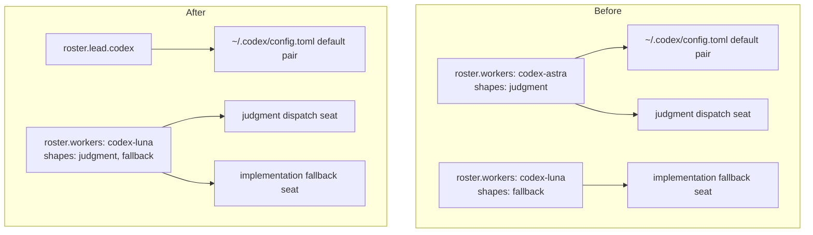

# Codex Lead Seat Split from the Dispatch Roster - Plan

## Goal Capsule

- **Objective:** Judgment dispatches stop drawing on the Codex model whose quota the operator watches fall, while a Codex session acting as the Orca lead still opens on the model chosen for that role.
- **Means:** Declare the Codex lead seat in `agents.roster.lead.codex` and leave `agents.roster.workers` holding only models the orchestrator dispatches to.
- **Product authority:** [hyperlapse122/dotfiles#528](https://github.com/hyperlapse122/dotfiles/issues/528) and this session's dialogue. This plan supersedes the entries numbered R7, R8, and AE3 inside `docs/plans/2026-09-16-2329-feat-orca-lead-dispatch-only-model-roster-plan.md`, which stays unmodified as the record of the decision it made. Those numbers belong to that document; the R-IDs below are this plan's own.
- **Open blockers:** None. The derivation conflict the issue raises is resolved by the lead-seat split below.
- **Applied with no active dispatches.** A roster change propagates to settings pins, rendered payloads, and target configs at apply time; running workers finish on the old model.

---

## Product Contract

**Product Contract preservation:** restructured, no scope change: the three Outstanding Questions deferred to planning are resolved in place by KTD1, KTD2, and KTD3; every R-ID, AE-ID, Key Decision, and annotation is unchanged.

### Summary

Split the Codex lead seat from the Codex dispatch seats inside the roster. `gpt-6-astra` moves from a worker entry to `agents.roster.lead.codex` at `medium` effort, `gpt-5.6-luna` at `max` takes the `judgment` shape alongside `fallback`, and every rendered target keeps deriving its model id from the roster rather than declaring one by hand.

### Problem Frame

`gpt-6-astra` sits on the only Codex `judgment` entry, so every judgment dispatch — code review, document review, `ce-pov`, brainstorm approach generation — pairs it with the Claude judgment worker. The operator sees Codex quota fall while that model is in use, and the same quota has to cover implementation and fallback work.

Removing the entry is not a one-line edit, because two things share one declaration. `.chezmoiscripts/70-agents/run_after_config-codex-settings.sh.tmpl:7` derives the Codex direct-session default from the roster entry carrying `judgment`, and `.ci/test-codex-settings-reconcile.sh:104-109` asserts that `agents.codex.settings` declares neither `model` nor `model_reasoning_effort`, so a literal cannot drift from the roster. `.chezmoitemplates/agent-roster-lookup.tmpl` resolves the last matching worker, so simply moving `judgment` to `gpt-5.6-luna` would re-pin the direct-session default to `gpt-5.6-luna` at `max`.

A Codex direct session is not an incidental manual session: it is Codex acting as the Orca orchestrator, the same role `agents.roster.lead.claude.model` already pins for Claude at `opus[1m]`, rendered into the Claude settings by `run_after_config-claude-settings.sh.tmpl:7`. The roster therefore already has a home for a lead seat; the Codex lead seat was the one living in the worker list.

### Key Decisions

- **The Codex lead seat lives in `agents.roster.lead.codex`, not in a worker entry.** A direct session is the orchestrator role the `lead` map already names, so the lead/worker split becomes symmetric across both harnesses and `workers` recovers its meaning as the dispatchable set. (session-settled: user-directed — chosen over a non-dispatch `direct` worker shape and over declaring the pair literally under `agents.codex.settings`: a new shape would rebuild the `lead` concept inside the worker list, and a literal reintroduces the drift the no-hand-declaration guard exists to prevent.) Governs R1, R2, R4, R5.
- **`gpt-5.6-luna` at `max` carries judgment and fallback together.** Its observed draw is small enough to sit on every review cycle, which corrects the earlier reasoning that its cost belonged to recovery alone. (session-settled: user-directed — chosen over keeping a separate frontier judgment model: the observed quota drain is the reason for the change.) Governs R3, R8.
- **The earlier roster plan is preserved, not amended.** Keeping it intact preserves the decision history and the rationale this change reverses, at the cost of a reader needing both documents. (session-settled: user-directed — chosen over editing R7/R8/AE3 in place and over a dual amend-plus-supersede marker.) Governs R10.
- **No measurement is added.** The quota claim rests on the operator's direct observation; building telemetry to confirm it is a larger piece of work with its own value. Governs the Scope Boundaries below.

### Requirements

**Roster declaration**

- R1. `agents.roster.lead` in `.chezmoidata/agents.yaml` declares a `codex` entry carrying model `gpt-6-astra` and effort `medium`.
- R2. The `codex-astra` entry is removed from `agents.roster.workers`, which then holds six entries, every one of them a dispatch target.
- R3. `codex-luna` declares `shapes: [judgment, fallback]` and keeps `gpt-5.6-luna` at `max` effort.
- R4. `.chezmoitemplates/agent-roster-validate.tmpl` validates the `lead` map, which it does not read today: a lead entry missing its required fields fails the render naming the entry.

**Rendered derivations and guards**

- R5. `.chezmoiscripts/70-agents/run_after_config-codex-settings.sh.tmpl` derives the Codex direct-session pair from the lead entry declared in R1 rather than from the worker carrying `judgment`.
- R6. `agents.codex.settings` still declares neither `model` nor `model_reasoning_effort`, and `.ci/test-codex-settings-reconcile.sh` keeps that assertion while taking its expected pair from the lead entry.
- R7. `.ci/test-agent-roster.sh` asserts the Codex judgment seat and the Codex fallback seat separately, so an assertion cannot be satisfied for both seats by one rendered match.
- R8. The rendered orchestration payload stops justifying the Codex fallback seat by contrasting its cost with the judgment seat, because one model now holds both.

**Documentation and record**

- R9. `AGENTS.md` and `README.md` describe a two-agent lead pin and six worker entries, and name `gpt-5.6-luna` at `max` effort as the Codex judgment seat.
- R10. `docs/plans/2026-09-16-2329-feat-orca-lead-dispatch-only-model-roster-plan.md` is not modified by this work.

The roster is the one authority the derived targets read; the change moves which node inside it feeds the Codex settings.

### Acceptance Examples

- AE1. **Covers R1, R2, R5.** Given a roster with no `codex-astra` worker, when the Codex settings script renders, then the declared object carries `model` `gpt-6-astra` and `model_reasoning_effort` `medium`, taken from the lead entry.
- AE2. **Covers R3.** Given a judgment dispatch, when the coordinator resolves the Codex judgment entry, then it gets `gpt-5.6-luna` at `max`, and the default reviewer pair is the Claude judgment model plus that model.
- AE3. **Covers R4.** Given a `lead.codex` entry that omits its effort, when the roster renders, then the render fails naming that entry instead of producing a settings object with no effort leaf.
- AE4. **Covers R6.** Given `agents.codex.settings` amended to declare `model` by hand, when `.ci/test-codex-settings-reconcile.sh` runs, then it fails on the hand declaration.
- AE5. **Covers R7.** Given the post-change roster, where one model holds both Codex seats, when the rendered orchestration payload is asserted, then each seat is checked for its own model-and-effort pair and a missing seat fails.

### Scope Boundaries

- The Claude lead pin, the Claude workers, and both omp workers are unchanged.
- The Codex headless posture keys — approval policy, sandbox mode, network access, the memories pin, and the hook trust record — are unchanged.
- No quota measurement, telemetry, or budget enforcement is added.
- The dispatch routing table's rows and the escalation rules are unchanged apart from which model occupies the Codex judgment seat.

### Dependencies / Assumptions

- The Claude lead keeps a model with no effort field, because the rendered Claude settings carries no effort leaf (`.chezmoiscripts/70-agents/run_after_config-claude-settings.sh.tmpl:7`). Lead validation is therefore shaped per agent rather than uniform.
- The model-serving catalog probe is omp-only (`.chezmoiscripts/70-agents/run_after_config-omp-settings.sh.tmpl:135-155`), so moving a Codex model out of `workers` loses no serving validation it had.
- The quota observation behind this change is the operator's direct report, not a measured series.

### Outstanding Questions

None launch-blocking. The three questions this contract deferred to planning are settled: the Codex settings script reads the lead node directly (KTD1), lead validation lives inside the validator (KTD2), and the replacement wording for the fallback-seat sentence is fixed (KTD3).

### Sources / Research

- `.chezmoidata/agents.yaml:49-66` — the `codex-astra` and `codex-luna` entries; `:446-452` — the comment stating the direct-session pair is derived, not declared.
- `.chezmoiscripts/70-agents/run_after_config-codex-settings.sh.tmpl:1-9` — the judgment-shape lookup that produces the direct-session pair.
- `.chezmoiscripts/70-agents/run_after_config-claude-settings.sh.tmpl:7` — the Claude lead pin rendered from `agents.roster.lead.claude.model`, the precedent for R1.
- `.chezmoitemplates/agent-roster-lookup.tmpl` — the last-matching-worker rule that makes a second `judgment` entry silently decide the lookup.
- `.chezmoitemplates/agent-roster-validate.tmpl` — validates `workers` only; it never reads `lead`.
- `.chezmoitemplates/orchestration-everyone.tmpl:38` — the rendered sentence R8 replaces.
- `.ci/test-codex-settings-reconcile.sh:98-109,177` — the roster-derived pair, the no-hand-declaration assertion, and the declared headless posture.
- `.ci/test-agent-roster.sh:103-114,207-209` — the roster fixtures and the two everyone-body greps R7 separates.
- `AGENTS.md:73`, `README.md:299` — the prose R9 corrects.
- `docs/plans/2026-09-07-0918-chore-codex-model-effort-declaration-plan.md` — the earlier posture, where the pair was declared by hand under `agents.codex.settings`.

---

## Planning Contract

### Key Technical Decisions

- KTD1. **The Codex settings script indexes `agents.roster.lead.codex` directly.** It mirrors `.chezmoiscripts/70-agents/run_after_config-claude-settings.sh.tmpl:7`, which already reads `.agents.roster.lead.claude.model`, and it does not go through `.chezmoitemplates/agent-roster-lookup.tmpl`. That partial's contract is a search over the `workers` list by agent, shape, or rung; the `lead` map is keyed by agent and needs no search, so extending the lookup would add a second shape to a partial whose one job is the list. Governs R5, R6.
- KTD2. **Lead validation lives inside `.chezmoitemplates/agent-roster-validate.tmpl`, shaped per agent.** Both payload templates and every settings script already call that partial as the single render-time gate, so a sibling partial would need a second call at every consumer. The gate requires `lead` to be a map whose keys are known agents, a `claude` entry with a non-empty `model`, and a `codex` entry with a non-empty `model` and a non-empty `effort`. Both entries are required because each has a settings script that indexes it. The printed output stays the worker model ids alone, so the parity checks keep meaning "the dispatchable set". Governs R4.
- KTD3. **The fallback-seat sentence in `.chezmoitemplates/orchestration-everyone.tmpl:38` loses its comparative clause.** The clause "because that model's cost belongs to recovery and not to every review" is false once one model holds both Codex seats. The replacement keeps the two launch sentences, each identifying its launch by purpose and, for the fallback, by its position after the Gemini row in the coordinator's routing table, and adds one sentence stating that each launch takes the pair its own purpose names. The exact prose is in U4. Governs R8.
- KTD4. **Seat assertions read each seat's pair from the roster and match a seat-specific sentence anchor.** Both Codex launch sentences render on one line, so a line-level grep for a model near an effort matches the whole paragraph and cannot tell the seats apart once both resolve to `gpt-5.6-luna` at `max`. The test renders each seat's pair through `agent-roster-lookup.tmpl`, then greps the everyone body for that pair inside the phrase unique to its sentence. A two-entry stub roster with distinct Codex ids proves the anchors are independent. Governs R7.
- KTD5. **The committed-prose scan admits lead model ids as well as worker model ids.** `.ci/test-agent-roster.sh` builds its allowed id set from the validator's printed worker ids, so `gpt-6-astra` named in `AGENTS.md` and `README.md` as the Codex lead seat would fail the scan after R2. The test reads `agents.roster.lead` through `execute-template`, the precedent `.ci/test-claude-settings-reconcile.sh:53-59` sets, and appends every lead model to the prose allowlist only. Payload parity stays worker-only, because no payload names a lead seat. Governs R2, R9.

### Planning Assumptions

- Chezmoi's `--override-data` merges map-typed data recursively and replaces list-typed data wholesale. The header of `.ci/test-agent-roster.sh:7-13` records the list half empirically; the map half is inferred from chezmoi's data merge and is the risk U2 settles before any lead fixture is trusted.
- A recursive merge cannot delete a key, so an override cannot produce a lead entry that omits `effort`. Lead negative fixtures therefore compose the roster inside a wrapper template from a literal lead map and the committed workers (U2).
- The committed roster keeps exactly one Codex worker after R2, so every lookup of the Codex judgment seat and the Codex fallback seat resolves to `codex-luna`, and the last-match rule in `agent-roster-lookup.tmpl` has one candidate.
- The `codex-luna` brief in `.chezmoidata/agents.yaml:64-67` ends with a sentence restricting the entry to the fallback role. That sentence is part of the entry R3 changes and is corrected in U1, because the brief-guidance table renders it for every judgment dispatch to Codex.

### Sequencing

U1 lands first because every other unit reads the new roster shape. U2, U3, and U4 each depend on U1 and can be authored in parallel, but they are one change set: `.ci/test-agent-roster.sh` and `.ci/test-codex-settings-reconcile.sh` are red between U1 and U4 and are green only once U1 through U4 are all in place. U5 lands last, because its prose names the lead seat and its own allowlist change sits on top of the fixture and anchor rewrites U4 makes in the same test file. U-IDs are never renumbered.

---

## Implementation Units

### U1. Move the Codex lead seat into the roster data

- **Goal:** `agents.roster` declares the Codex lead seat under `lead.codex` and the `workers` list holds six dispatch targets.
- **Requirements:** R1, R2, R3.
- **Dependencies:** none.
- **Files:** `.chezmoidata/agents.yaml`.
- **Approach:** Add `codex` under `agents.roster.lead` with `model: gpt-6-astra` and `effort: medium`, beside the existing `claude` entry. Delete the `codex-astra` worker entry. Change `codex-luna` to `shapes: [judgment, fallback]` and drop the last sentence of its brief, "Use this entry only as the fallback R7 names", because the entry now takes judgment dispatches too; keep the rest of the brief as written. Reword the roster header comment so it names the lead pins in the plural, and reword the comment above `agents.codex.settings` so it says the direct-session pair is derived from `agents.roster.lead.codex` rather than from the worker carrying `judgment`. No other key in the file changes.
- **Test scenarios:**
  - The committed data renders `agents.roster.lead.codex` as `gpt-6-astra` at `medium` and `agents.roster.lead.claude.model` as `opus[1m]`.
  - The committed `workers` list has six entries, none with id `codex-astra`, and the only `codex` entry carries both `judgment` and `fallback`.
  - `agents.codex.settings` declares neither `model` nor `model_reasoning_effort`.
- **Verification:** `.ci/test-claude-settings-reconcile.sh` stays green, which proves the Claude lead pin and its derivation are untouched. `.ci/test-agent-roster.sh` and `.ci/test-codex-settings-reconcile.sh` are expected red until U4 lands.

### U2. Validate the lead map at render time

- **Goal:** A lead entry missing a required field fails every consumer's render with a diagnostic that names the entry.
- **Requirements:** R4.
- **Dependencies:** U1.
- **Files:** `.chezmoitemplates/agent-roster-validate.tmpl`, `.ci/test-agent-roster.sh`.
- **Approach:** In the validator, after the `workers` type check and before the worker loop, require `hasKey $roster "lead"` and a map-typed `lead`. Range over its keys: a key outside the existing `$validAgents` list fails as `agents.roster.lead declares unknown agent "<key>"`; an entry with an empty or missing `model` fails as `lead.<agent> is missing model`; a `codex` entry with an empty or missing `effort` fails as `lead.codex is missing effort`. After the range, fail as `agents.roster.lead declares no claude entry` or `agents.roster.lead declares no codex entry` when either is absent, mirroring the existing "no codex entry declares the judgment shape" gate. Update the header comment to list the lead checks. Leave the printed output as the worker model ids only (KTD2). In the test, add a `lead_wrapper` helper that writes a wrapper template composing `dict "roster" (dict "lead" <literal lead map> "workers" .agents.roster.workers)` and renders it with no override, then add lead fixtures through it: a codex entry without `effort` (AE3), a codex entry without `model`, a claude entry without `model`, a lead map with no `codex` key, and a lead map carrying a `gemini` key. Each fixture asserts its own diagnostic with the same `grep -qF` pattern the worker fixtures use. Do not use `--override-data` for lead fixtures, because a recursive merge cannot remove a key.
- **Test scenarios:**
  - Each of the five lead fixtures above fails the render with its named diagnostic.
  - The committed roster renders and prints six worker ids with no lead id among them.
  - **Risk, settled here:** every existing worker fixture in `assert_render_fails` and `assert_render_ok` overrides `agents.roster.workers` alone. After lead validation is added, each must still fail or pass with its own worker diagnostic. If any instead reports a lead diagnostic, `lead` did not survive the workers-only override; the fallback is to extend both helpers to include the committed `lead` map in the override JSON, read once through `execute-template` at the top of the script, and to record the map-merge behavior in the file header beside the list-replacement note.
- **Verification:** `.ci/test-agent-roster.sh` lead section passes on its own; the worker fixtures report unchanged diagnostics. `.ci/test-omp-settings-reconcile.sh` and `.ci/test-orchestration-hook.sh` stay green, which proves the added gate does not reject the committed roster at any consumer.

### U3. Derive the Codex direct-session pair from the lead entry

- **Goal:** The rendered Codex settings pin `model` and `model_reasoning_effort` from `agents.roster.lead.codex`, and the reconcile test proves it from the same node.
- **Requirements:** R5, R6.
- **Dependencies:** U1, U2.
- **Files:** `.chezmoiscripts/70-agents/run_after_config-codex-settings.sh.tmpl`, `.ci/test-codex-settings-reconcile.sh`.
- **Approach:** Replace the lookup call at line 7 with a direct read of `.agents.roster.lead.codex`, and build the merge source as `dict "model" <lead>.model "model_reasoning_effort" <lead>.effort` exactly as the Claude script does at its line 7 (KTD1). Rewrite the header comment so it names the lead entry as the source and drops the sentence calling the judgment entry the direct-session seat. The merge still happens before `codex-settings-validate.tmpl` runs, so the derived leaves pass the validator. In the test, replace the inline `range .agents.roster.workers` derivation at line 98 with an `execute-template` read of `.agents.roster.lead.codex` rendered as the same `model` / `model_reasoning_effort` dict; keep the literal pin at lines 100-101 that the pair is `gpt-6-astra` at `medium`, reworded to name the lead entry; keep the no-hand-declaration loop at lines 104-109 and the headless-posture assertion at lines 175-179 unchanged, because their values do not move.
- **Test scenarios:**
  - Given the committed roster, the declared JSON object in the rendered script carries `model` `gpt-6-astra` and `model_reasoning_effort` `medium` (AE1).
  - Given `agents.codex.settings` with a hand-declared `model`, the test fails on the hand declaration (AE4).
  - Given a roster whose `codex-luna` worker is the only Codex entry, the declared pair is still `gpt-6-astra` at `medium`, which proves the derivation no longer follows the judgment worker.
- **Verification:** `.ci/test-codex-settings-reconcile.sh` passes. The rendered script carries no call to `agent-roster-lookup.tmpl`.

### U4. Separate the Codex seat assertions and reword the fallback launch sentence

- **Goal:** The rendered orchestration payloads carry the new roster with no cost comparison between the two Codex seats, and the tests assert each seat by its own pair.
- **Requirements:** R7, R8.
- **Dependencies:** U1, U2.
- **Files:** `.chezmoitemplates/orchestration-everyone.tmpl`, `.ci/test-agent-roster.sh`, `.ci/test-agent-instructions.sh`.
- **Approach:** In the everyone template, replace the two launch sentences at line 38 with this prose, template actions kept as they are: "A review, a judgment pass, or any other cross-model or cross-harness opinion launches `{{ $judgeCodex.model }}` with `{{ $judgeCodex.effort }}` reasoning effort. An implementation-fallback launch — the recipient the coordinator's routing table reaches after the Gemini row — launches `{{ $fallbackCodex.model }}` with `{{ $fallbackCodex.effort }}` reasoning effort. Each launch takes the pair its own purpose names, whether or not the two purposes resolve to one model." The rest of the paragraph is unchanged (KTD3). In `.ci/test-agent-roster.sh`: change the positive count at line 51 and the brief-guidance row count at line 204 from 7 to 6; rewrite the fixtures at lines 103, 108, and 114 so their Codex stand-in is `codex-luna` on `gpt-5.6-luna` at `max` with `["judgment","fallback"]`; rewrite the AE9 stub at lines 219-225 to six entries with `codex-luna` carrying `gpt-9.9-stub` and both shapes, so the everyone body still moves and the plugin-manifest assertion at lines 272-275 still sees a change; replace the two greps at lines 207-210 with seat assertions per KTD4: render each seat's pair through a wrapper calling `agent-roster-lookup.tmpl` with shape `judgment` and then `fallback`, and grep the everyone body for the judgment anchor ``opinion launches `<model>` with `<effort>` reasoning effort`` and for the fallback anchor ``after the Gemini row — launches `<model>` with `<effort>` reasoning effort``, each with that seat's rendered pair substituted. Add a two-entry Codex stub — `codex-judge` on `gpt-9.8-judge` with `["judgment"]` and `codex-fallback` on `gpt-9.9-fallback` with `["fallback"]`, plus the five non-Codex workers — render the everyone body against it, and assert the judgment anchor carries `gpt-9.8-judge` and not `gpt-9.9-fallback`, and the fallback anchor the reverse. Assert the rendered everyone body no longer contains "belongs to recovery". In `.ci/test-agent-instructions.sh`, trim the stub roster at lines 668-675 to six entries with `codex-luna` carrying both shapes, so no fixture in the repository keeps a `codex-astra` worker.
- **Test scenarios:**
  - Given the committed roster, the judgment anchor and the fallback anchor each carry `gpt-5.6-luna` at `max` (AE2, AE5).
  - Given the two-entry Codex stub, each anchor carries only its own seat's id, which proves one rendered match cannot satisfy both assertions (AE5).
  - Given a roster whose only Codex worker carries `["judgment"]`, the everyone body fails to render naming a missing fallback entry (AE5, the missing-seat arm).
  - The coordinator body renders four routing rows and six brief-guidance rows, and the brief row for `gpt-5.6-luna` no longer says the entry is fallback-only.
  - The rendered everyone body carries no "belongs to recovery" text.
- **Verification:** `.ci/test-agent-roster.sh` passes through its AE9 and plugin-manifest sections; `.ci/test-agent-instructions.sh` passes; `.ci/test-claude-codex-plugin-reconcile.sh` and `.ci/test-orchestration-hook.sh` stay green.

### U5. Correct the committed prose and admit lead ids in the prose scan

- **Goal:** `AGENTS.md` and `README.md` describe two lead pins and six workers, and the prose scan accepts the lead model id they name.
- **Requirements:** R9.
- **Dependencies:** U1, U4.
- **Files:** `AGENTS.md`, `README.md`, `.ci/test-agent-roster.sh`.
- **Approach:** In `AGENTS.md:73`, change the opening to name a Claude lead pinned to `opus[1m]`, a Codex lead pinned to `gpt-6-astra` at medium effort, and six worker entries by role, with the Codex worker line reading `codex` on `gpt-5.6-luna` (max effort) for judgment and fallback; the sentence stating the Codex default pair is rendered from the roster stays true and stays. In `README.md:299`, change "the lead pin and seven worker models" to the two lead pins and six worker models, add "Codex lead on `gpt-6-astra`", and merge the two Codex worker roles into "Codex judgment and fallback on `gpt-5.6-luna`". In the prose section of `.ci/test-agent-roster.sh` beginning at line 235, read every `agents.roster.lead.<agent>.model` through `execute-template`, append those ids to a prose-only allowlist derived from `roster_aliases`, and scan `README.md` and `AGENTS.md` against that list (KTD5). Leave the payload parity loops at lines 165-175 on the worker-only set. Keep the stub-README self-check at lines 246-253 so the scan can still fail. `CONCEPTS.md` is unchanged: its roster entry already describes the lead's model pin generically.
- **Test scenarios:**
  - The prose scan passes with `gpt-6-astra` present in both prose files.
  - A stub prose line naming a model that is neither a worker nor a lead id still fails the scan.
  - No prose file names `codex-astra` or "seven worker".
- **Verification:** `.ci/test-agent-roster.sh` passes end to end.

---

## Verification Contract

The plan is proven by the repository's own gates, run from the worktree after U1 through U5 are in place. Each script's expected outcome is listed with what it proves.

| Script | Expected outcome | Proves |
|---|---|---|
| `.ci/test-agent-roster.sh` | passes and prints `agent roster: ok` | R2, R4, R7, R8, R9: six worker ids, the lead fixtures, the seat anchors, the fallback prose, the prose allowlist, the AE9 stub, and the plugin manifests moving on a roster change |
| `.ci/test-codex-settings-reconcile.sh` | passes | R5, R6: the declared pair comes from `agents.roster.lead.codex`, `agents.codex.settings` declares neither leaf, and the headless posture still carries `gpt-6-astra` at `medium` |
| `.ci/test-claude-settings-reconcile.sh` | passes unchanged | The Claude lead pin and its derivation are untouched by the validator change |
| `.ci/test-agent-instructions.sh` | passes | The instruction core still renders against the six-entry stub, and the harness fixtures are untouched |
| `.ci/test-omp-settings-reconcile.sh` | passes unchanged | The omp settings script, which calls the validator, accepts the committed roster with the lead gate |
| `.ci/test-orchestration-hook.sh` | passes unchanged | Both payload bodies render and the apply-time assertion sees them |
| `.ci/test-claude-codex-plugin-reconcile.sh` | passes unchanged | The plugin manifests that hash the everyone payload still render |

Outcomes read directly from renders, without a test script: the committed roster renders `agents.roster.lead.codex` as `gpt-6-astra` at `medium`; a lead entry with no `effort` fails the render naming `lead.codex`; the rendered everyone body carries both launch sentences with `gpt-5.6-luna` at `max` and no cost comparison. The CI workflow already wires every script above through `.github/workflows/ci.yml`, so a green pipeline on the branch is the whole-plan signal.

---

## Definition of Done

### Global

- Every script in the Verification Contract passes, and the branch pipeline is green.
- `docs/plans/2026-09-16-2329-feat-orca-lead-dispatch-only-model-roster-plan.md` shows no diff (R10).
- No file outside `docs/plans/` contains the id `codex-astra`, and no committed prose says "seven worker".
- `agents.codex.settings` carries no `model` or `model_reasoning_effort` literal.
- Abandoned-attempt code is absent: `agent-roster-lookup.tmpl` has no lead branch, the validator's `$validShapes` list has no `direct` shape, no lead fixture is built through `--override-data`, and the everyone body is not asserted with a bare `gpt-6-astra` grep.
- Every comment touched by U1 through U3 describes the lead-derived path, not the judgment-worker path.
- The change is applied with no active dispatches, as the Goal Capsule states.

### Per unit

- U1: the roster renders the six-entry worker list, `lead.codex` at `gpt-6-astra` / `medium`, and a `codex-luna` brief with no fallback-only sentence.
- U2: the five lead fixtures fail with their named diagnostics, the worker fixtures keep their own diagnostics, and the override-survival risk is settled in the file, by observation or by the fallback.
- U3: the rendered Codex settings script reads `lead.codex`, calls no lookup, and the reconcile test derives its expected pair from the same node.
- U4: the everyone body carries the KTD3 prose, both seat anchors resolve independently under the two-entry Codex stub, and every fixture roster has six entries.
- U5: both prose files name two lead pins and six workers, and the prose scan admits lead ids while still failing on an unknown id.
