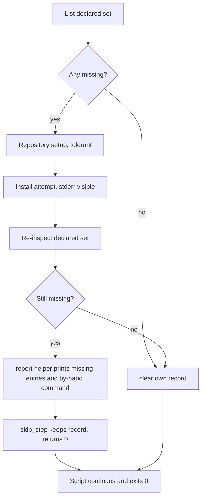
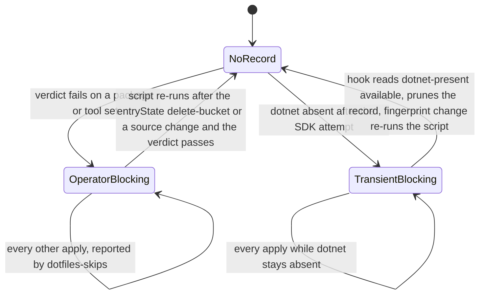

# Package Installer Failure Policy - Plan

## Goal Capsule

- **Objective:** After any `chezmoi apply` on a managed host, a package or tool that the devtools, apps or .NET installer attempted and could not install is visible to the operator through `dotfiles-skips` and the apply output, with an action that actually clears it, and every later apply phase still ran. None of these three installers records a host as converged while a package it attempted to install is missing.
- **Means:** One failure policy for the devtools, apps and .NET installers: after each install attempt the installer re-inspects its declared set, and a set that is still incomplete exits 0 through a declared `skip.sh.tmpl` site whose state record survives until the success path clears it (KTD1, KTD2, KTD3). The `operator-blocking` message names the state bucket that really re-runs an onchange script (KTD7).
- **Product authority:** the Key Decisions, then the Requirements, then `AGENTS.md`'s skip-direction rules.
- **Execution profile:** seven Implementation Units in one pull request; the CI gates in the Verification Contract are the acceptance gate, and the rendered-surface checker plus the frozen totals must move together.
- **Stop conditions:** a change that renames an installer to a `run_after_` lifecycle is a stop; a change that adds a capability registry row or a hook resolver kind is a stop, because this plan chose the direction that needs none; a change that removes a package or adds `--keep-going` is a stop; a render that reaches the real `op` is a stop.
- **Who finishes:** the implementing run ships all seven units; the conversion of the other package installers is tracked in a follow-up issue (Deferred to Follow-Up Work).
- **Open blockers:** none.

---

## Product Contract

### Summary

Every package installer named in issue #537 stops hiding an install failure behind `|| true`. After its install attempt, each installer re-inspects the packages or tools it declared. When any is still missing, the installer prints what is missing and the command that installs it by hand, then leaves through a declared `skip_step` that keeps a state record, so the script exits 0, later phases run, and `dotfiles-skips` reports the host as unconverged until the record is cleared. The direction is `operator-blocking` for package and tool sets, and `transient-blocking` on the existing `dotnet-present` probe where the verdict is exactly that probe's predicate. The success path clears the record. Repository setup steps stay tolerant, because the package verdict observes their effect. The `operator-blocking` message, `AGENTS.md` and one recovery hint stop naming a state bucket that does not re-run onchange scripts. `AGENTS.md` records the policy so the next installer follows it.

### Problem Frame

`run_onchange_before_80-devtools.sh.tmpl`, `run_onchange_before_70-apps.sh.tmpl` and `run_onchange_before_50-dotnet.sh.tmpl` run `dnf install`, `apt-get install` and `dotnet tool install` behind `|| true`. When the transaction fails, the script exits 0, chezmoi records the changed `run_onchange_` script as successful, and the package stays missing until the rendered content changes or an operator forces a re-run. Nothing reports the gap. Removing `|| true` in one installer would abort every later apply phase and the file targets of that apply whenever one development package fails, which is why PR #538 left the suppression in place and asked for the policy to be decided once for all package installers.

### Requirements

**Failure policy**

- R1. A covered installer never records a clean success while a package or tool it declared is missing. The one exception is the deferred macOS path where `dotnet` is absent and no install is attempted (Deferred to Follow-Up Work).
- R2. The verdict is a re-inspection of the declared set after the install attempt, using the same inspection the installer already uses to find missing entries (`rpm -q`, `dpkg-query -W`, `dotnet tool list -g`) and, for the Fedora devtools groups, the installed-group listing. The package manager's exit status is never the verdict, and its stderr stays visible. The .NET SDK packages are alternatives (10.0 with 8.0, or 8.0 alone), so their verdict is the `dotnet-present` predicate (KTD2).
- R3. A failed verdict exits 0 through a declared `skip_step` site that keeps its state record, so every later chezmoi phase and every file target of that apply still lands.
- R4. Before the declaration, the installer prints the missing entries and the by-hand install command to stderr, so the apply output and the record together name the operator action.
- R5. When the verdict passes, the installer removes its own state record, so a host that converged by hand or on a later run stops being reported.
- R6. The site direction is `transient-blocking` when a registry probe already observes the verdict's own predicate, and `operator-blocking` otherwise; no new capability probe is added.

**Installer coverage**

- R7. The Fedora devtools branch applies the policy to its `dnf install` of the declared packages and to its `dnf group install` of the declared groups. A group install runs only for the declared groups that the installed-group listing does not show.
- R8. The Ubuntu devtools branch applies the policy to its per-package `apt-get install`, which today aborts the apply on the first failure.
- R9. The Fedora apps branch applies the policy to its `dnf install` of the declared packages, and its `dnf makecache` no longer aborts the apply.
- R10. The .NET installer applies the policy to the SDK install on Fedora and Ubuntu, reported through a `dotnet-absent` site on the `dotnet-present` probe, and to the global tool install on Fedora, Ubuntu and macOS.

**Repository setup steps**

- R11. COPR enablement, the Terra bootstrap, GPG key import and metadata refresh stay tolerant of failure; the package verdict that follows them is what reports their effect. The repository file writes are unchanged and still abort on failure.

**Operator re-run command**

- R15. Every message and instruction that tells an operator how to re-run a `run_onchange_` script names `chezmoi state delete-bucket --bucket=entryState`, the bucket that holds onchange state (KTD7).

**CI and documentation**

- R12. Every new declaration site has an owner row in `.ci/skip-declaration-site-matrix.yaml`, and the frozen totals in that file, `.ci/check-skip-declarations.sh` and `.ci/test-capability-cache.sh` move together.
- R13. A CI test drives the rendered installers with stub package managers and proves the verdict, the record, the clearing and the continuation for each branch.
- R14. `AGENTS.md` states the policy in the package-installation paragraph, and names the devtools, apps and .NET installers as its current coverage, so a future installer follows it without rediscovering this plan.

### Key Decisions

- **Record and continue; never abort the apply on a package install failure.** A failing `before` script in phase `30-components` aborts every later phase and every file target of that apply, so a repository outage would block `.zshrc` and the agent instructions from landing. Governs R1, R3.
- **The policy covers every branch of the three named installers, including the Ubuntu devtools branch that aborts today and the macOS tool install.** Deciding once means the same file cannot abort on one OS and record on another. Governs R7, R8, R9, R10.

### Scope Boundaries

- **Outside this work:** the NVIDIA installer's unsuppressed `dnf install` and `dnf makecache`, the direct-RPM reconciler's `exit 1` paths, and every installer the issue does not name. Their failure behavior is a separate decision.
- **Outside this work:** removing packages, renaming any script to a `run_after_` lifecycle, adding `--keep-going`, or changing `prune_stale_skip_records` or `dotfiles-skips`. The only `skip.sh.tmpl` change is the re-run bucket in the `operator-blocking` message (R15); its forms, directions and sentinels stay as they are.
- **Outside this work:** a new capability probe. KTD2 records why none can observe an installable package set.

### Deferred to Follow-Up Work

- Declare the macOS `dotnet` absent path. The installer attempts no SDK install on macOS, so that path is a silent precondition skip rather than an install failure; declaring it needs the `dotnet-present` registry row widened from `linux` to `any`.
- Hoist the three identical `install_dotnet_tools` bodies into one template region. This plan edits the three copies in place to keep the diff to the policy.
- Refresh the historical prose numbers in the header of `.ci/skip-declaration-site-matrix.yaml` that this plan does not touch; only the frozen-totals sentences move here.
- The empty `dev_coprs` loop in the devtools installer stays as it is.
- Convert the other package installers to the recorded policy, tracked in one follow-up issue: the tailscale installer's Ubuntu `apt-get install -y tailscale || true` suppression, and the installers that still abort the apply on an install failure (tailscale on Fedora, flatpaks, podman, desktop IME, and the two `20-base` installers).

### Acceptance Examples

- AE1. Devtools install fails
  - **Covers:** R1, R3, R4, R7
  - **Given:** a Fedora host whose declared devtools packages include one the enabled repositories do not offer.
  - **When:** `chezmoi apply` runs the devtools installer.
  - **Then:** stderr names the missing package and the `dnf install` command, the record `install-devtools-fedora__dev-packages-not-installed` exists with direction `operator-blocking`, the script exits 0, the later phases run, and `dotfiles-skips` lists the record.
- AE2. Operator clears the cause
  - **Covers:** R5, R15
  - **Given:** the record from AE1, and the operator installed the package by hand.
  - **When:** the operator runs the `chezmoi state delete-bucket --bucket=entryState` re-run the record's message names and applies, or a later source change re-runs the installer.
  - **Then:** the re-inspection finds nothing missing, the record is removed, and `dotfiles-skips` prints nothing for that site.
- AE3. .NET SDK install fails on Fedora
  - **Covers:** R6, R10
  - **Given:** a Fedora host without `dotnet` whose `dnf install` of both SDK packages fails.
  - **When:** the .NET installer runs.
  - **Then:** stderr names the by-hand `dnf install dotnet-sdk-10.0` command, the record `install-dotnet-fedora__dotnet-absent` carries `transient-blocking:dotnet-present` and a reason that names the SDK install, and once the operator installs the SDK the next apply prunes the record and re-runs the script, which installs the tools.
- AE4. Metadata refresh fails in the apps installer
  - **Covers:** R9, R11
  - **Given:** a Fedora host missing one app package while a third-party repository is unreachable.
  - **When:** the apps installer runs `dnf makecache`.
  - **Then:** the installer continues to the install attempt, the verdict records `install-apps-fedora__app-packages-not-installed`, and the apply does not abort.
- AE5. Converged host
  - **Covers:** R2, R5
  - **Given:** a host where every declared package and tool is present and a stale record from an earlier failure exists.
  - **When:** any of the three installers re-runs.
  - **Then:** no install command runs for a package, the stale record is removed, and the script exits 0.
- AE6. Tool install fails on macOS
  - **Covers:** R10
  - **Given:** a macOS host with `dotnet` present where `dotnet tool install -g powershell` fails.
  - **When:** the .NET installer runs.
  - **Then:** the record `install-dotnet-darwin__dotnet-tools-not-installed` exists with direction `operator-blocking`, stderr names `powershell` and the by-hand command, and the script exits 0.

---

## Planning Contract

### Key Technical Decisions

- KTD1. **The verdict is a post-attempt re-inspection of the declared set.** The package manager's exit status is neither necessary nor sufficient: a package can fail inside an rpm scriptlet without failing the transaction (`docs/solutions/integration-issues/fedora-akmods-builder-missing-nvidia-mok-deadlock.md`), and dnf can leave part of a set installed. Re-running the `rpm -q`, `dpkg-query -W` or `dotnet tool list -g` loop the installer already owns gives one answer for every cause. Serves R2.
- KTD2. **Direction: `operator-blocking` for package and tool sets, `transient-blocking` on `dotnet-present` for the SDK sites.** `AGENTS.md` prefers `transient-blocking` wherever a probe exists and reserves `operator-blocking` for a condition whose definition lives in source data the hook cannot read. The declared package lists live in the script templates, and a probe that answers "the declared set is installable" would have to duplicate those lists into `.install-prerequisites.sh`, which `skip.sh.tmpl` forbids. A probe that observes only part of the precondition, such as network reachability, would read `available` while the install still fails, and on the next apply the pruner would delete the record without re-running the script, leaving a silent unconverged host. A probe on "the failure record exists" reproduces the stall measured in `capabilities.tmpl`. So no probe can exist for the package sets, and the direction is `operator-blocking`, the same direction the NVIDIA installer uses for a package set the sources do not offer. The .NET SDK differs: the installer treats its SDK packages as alternatives (both, else 8.0 alone), and what the tool install needs is a working `dotnet`, so its verdict predicate is `command -v dotnet`, which the registry already observes as `dotnet-present`, and the installer already hashes that probe into its fingerprint, so the existing `dotnet-absent` site is the record and self-heals once an operator installs the SDK. Rejected alternatives: exiting non-zero or `transient-tolerable` abort the apply, and the tolerable exception is reserved for the elevation guard; renaming the installers to `run_after_` changes their lifecycle, removes their matrix instances and reorders them against the file targets. Serves R3, R6.
- KTD3. **Report, then declare, then clear, in the shape the NVIDIA installer already uses.** The declaration sits first inside `if <verdict failed> && report_<what>; then`, where the report helper prints the missing entries and the by-hand command to stderr and always returns 0. The site is a `skip_step` inside the install function, so the function returns 0 and the script continues to its end. A `clear_<script>_skip_record` twin removes the record on the success path, including the converged path where nothing was missing. Serves R3, R4, R5.
- KTD4. **Repository setup steps stay tolerant, and the apps `dnf makecache` joins that class.** A failed key import, COPR enablement, Terra bootstrap or metadata refresh shows up as a package the install cannot provide, and the verdict reports that. An unsuppressed `dnf makecache` in the apps installer aborts the apply when any third-party repository is unreachable, which is the failure mode Key Decision 1 rejects. Serves R11, R9.
- KTD5. **One owner row per site with per-OS script identities.** Phase-local sites follow the existing `install-<name>-<distro>` identity (`install-dotnet-fedora`, `install-nvidia-fedora`), so the new identities are `install-devtools-fedora`, `install-devtools-ubuntu`, `install-apps-fedora`, `install-dotnet-ubuntu` and `install-dotnet-darwin`. Seven owner rows are added and no shared partial is introduced, because a shared partial would need its own owner semantics in the matrix for six lines of shell per script. Serves R12.
- KTD6. **Behavior is proved by a CI harness that drives the rendered installers with stub package managers.** `.ci/smoke-fedora-nvidia-repo-policy.sh` already extracts function regions from a rendered installer and drives them with a logging `dnf` stub and an `rpm -q` stub, under a redirected `HOME` and `XDG_STATE_HOME` so declared skips write scratch records. The new test renders the three installers itself through `.ci/lib/render-gate-helpers.sh` for the Fedora, Ubuntu and darwin variants and runs in `ci.yml`, so it needs no rendered artifact and `.ci/test-ci-wiring.sh` sees it wired. Serves R13.
- KTD7. **The re-run command names `entryState`.** chezmoi keeps `run_onchange_` state per target in the `entryState` bucket; `scriptState` gates `run_once_` scripts. Measured on chezmoi v2.72.1 against a scratch source: after `delete-bucket --bucket=scriptState` an onchange script did not re-run, and after `delete-bucket --bucket=entryState` it did. Every `operator-blocking` site is in a `run_onchange_` script, so the message `skip.sh.tmpl` prints today sends the operator to a command that changes nothing. The fix is one bucket name in that message, in the `AGENTS.md` skip-direction paragraph and in the recovery hint of `run_after_assert-orchestration-hook.sh.tmpl`, whose build scripts are also `run_onchange_`. Serves R15.

### High-Level Technical Design

The per-apply verdict flow is the same in every installer branch:

The state record lifecycle across applies, by direction:

### Assumptions

- A1. The dnf5 installed-group listing answered from the local cache (`dnf -C -q group list --installed`, group id in the first column) shows every installed declared group without contacting a repository. A converged host therefore runs no `dnf group install`. If the listing command itself fails, the installer treats every declared group as missing for the attempt, and the post-attempt listing decides the verdict.
- A2. The Ubuntu devtools branch is in scope although it aborts today rather than suppresses, because Key Decision 2 applies the policy to every branch of a named installer.
- A3. The macOS `dotnet tool install` is in scope; the macOS "dotnet absent" path is not, because no install is attempted there.
- A4. No self-retry is acceptable for the `operator-blocking` sites: the three installers re-run whenever their package lists change, and the record's own message names the `chezmoi state delete-bucket --bucket=entryState` re-run (KTD7).
- A5. Changing the reason text of the existing `install-dotnet-fedora/dotnet-absent` site moves no matrix field, because the reason is not in the sentinel, the normalized predicate or the continuation.
- A6. The darwin branch stays bash 3.2 safe by expanding a possibly empty array only behind its count test; no macOS runtime harness exists for the tool install, so review and the darwin shellcheck lint hold that property.
- A7. `render_profile: 'ubuntu'` and `render_profile: 'darwin'` are the vocabulary for the new Ubuntu-only and darwin-only rows; one existing row uses each.
- A8. The plan fully resolves issue #537, so the pull request carries `Closes #537`: the policy is decided once and recorded in `AGENTS.md`, every suppression the issue names is converted, and the failure is recorded, reported and clearable. The conversion of installers the issue does not name is new work, owned by the follow-up issue in Deferred to Follow-Up Work.

### Constraints

- Every new early exit goes through `skip.sh.tmpl` with a `reason` in its printable charset: no quotes, `$`, backticks or backslashes, so a by-hand command such as `sudo dnf install dotnet-sdk-10.0` fits but a `${...}` expansion does not; dynamic detail belongs in the report helper.
- A report helper must always return 0. Inside `if <test> && report; then`, a non-zero report silently skips the declaration, and no CI gate can see that.
- Every array expansion that can be empty sits behind its `${#array[@]}` count test, because bash 3.2 under `set -u` rejects an empty array expansion and the .NET installer renders on macOS.
- The matrix header's editor obligation applies: refresh `anchor_line` for every row the edit moved, which includes `install-dotnet-fedora/dotnet-absent`.
- No render may reach the real `op`; every local render uses the scratch contract from `AGENTS.md`.

### Sequencing

U1, U2 and U3 touch three different templates and share nothing. U4 depends on all three, because each owner row records the normalized predicate that the rendered branch carries. U5 depends on U1 through U3 for the shapes it drives. U6 and U7 are independent. The seven units land in one pull request, and CI is green only with U4 present.

---

## Implementation Units

### U1. Devtools installer verdict on Fedora and Ubuntu

- **Goal:** R7 and R8 hold: a declared devtools package or group that stays missing is recorded and reported, and the Ubuntu branch no longer aborts the apply.
- **Requirements:** R1, R2, R3, R4, R5, R7, R8, R11.
- **Dependencies:** none.
- **Files:** `.chezmoiscripts/30-components/run_onchange_before_80-devtools.sh.tmpl`; test coverage in `.ci/test-package-installer-verdict.sh` (U5).
- **Approach:**
  1. Fedora branch: keep the `rpm -q` missing loop, and add a missing-group loop over the installed-group listing (A1). Keep `setup_dev_repos` tolerant (KTD4). Run `dnf group install` only for the missing groups and `dnf install` only for the missing packages, each without a stderr redirect or `|| true`, discarding the status so `set -e` does not fire; the exit status is never read (R2).
  2. Re-inspect the declared packages with the same `rpm -q` loop and the declared groups with the same listing. When either finds an entry, call a report helper that prints the missing packages with their `dnf install` command and the missing groups with their `dnf group install` command to stderr, then declare `skip_step` `operator-blocking` for script `install-devtools-fedora`, site `dev-packages-not-installed` (KTD3). The reason states that dnf left declared packages or groups uninstalled and that the missing set and the by-hand commands were printed.
  3. On the passing path, remove the record through a `clear_devtools_skip_record` twin, including when nothing was missing.
  4. Ubuntu branch: move the loop into a function so the site can use `skip_step` and the harness can extract it. Make `install_apt` tolerant per package with a report helper naming the failed package, keep `apt-get update` tolerant, then re-inspect with `dpkg-query -W` and declare `skip_step` `operator-blocking` for script `install-devtools-ubuntu`, site `dev-packages-not-installed`, with the same clearing twin.
- **Patterns to follow:** `install_nvidia_packages`, `report_unavailable_packages` and `clear_nvidia_skip_record` in `.chezmoiscripts/30-components/run_onchange_before_10-nvidia.sh.tmpl`.
- **Test scenarios:**
  - Fedora: `dnf install` exits non-zero and the stub leaves a package uninstalled; the function returns 0, stderr names the package and the `dnf install` command, and the record file carries `operator-blocking`.
  - Fedora: `dnf install` exits 0 but one package is still absent from `rpm -q`; the record is written.
  - Fedora: every package is present and a declared group is still absent from the installed-group listing after the attempt; the record is written and stderr names the group and the `dnf group install` command.
  - Fedora: the group install exits non-zero but the listing shows every group afterwards, and every package is present; no record is written.
  - Fedora: every package and group present; no `dnf install` or `dnf group install` call is logged, and a pre-seeded record is removed.
  - Fedora: one package is missing, the stub install provides it, and a pre-seeded record exists; the re-inspection passes and the record is removed.
  - Fedora: the Terra bootstrap fails and the package that needed it stays missing; the verdict names that package.
  - Ubuntu: `apt-get install` fails for the second of three packages; the third is still attempted, and the record names the second.
  - Ubuntu: every package present; a pre-seeded record is removed and no install runs.
  - Ubuntu: one package is missing, the stub install provides it, and a pre-seeded record exists; the record is removed.
  - Rendered Fedora and Ubuntu variants contain no `|| true` on the declared-set `dnf install`, the `dnf group install` or the per-package `apt-get install`; the tolerant Terra bootstrap of KTD4 is the one `dnf install` line that keeps it.
- **Verification:** the Fedora and Ubuntu renders through the scratch contract parse, carry one new sentinel each, and the U5 harness scenarios above pass; `.ci/test-skip-declaration-gates.sh` passes once U4 lands.

### U2. Apps installer verdict on Fedora

- **Goal:** R9 holds: a declared app package that stays missing is recorded and reported, and an unreachable repository no longer aborts the apply.
- **Requirements:** R1, R2, R3, R4, R5, R9, R11.
- **Dependencies:** none.
- **Files:** `.chezmoiscripts/30-components/run_onchange_before_70-apps.sh.tmpl`; test coverage in `.ci/test-package-installer-verdict.sh` (U5).
- **Approach:**
  1. In `setup_app_repos`, keep the key imports tolerant and make `dnf makecache` tolerant with a stderr note (KTD4); the repository file writes stay as they are.
  2. In `install_app_packages`, run `dnf install` for the missing set with its status captured and stderr visible, re-inspect with the `rpm -q` loop, and declare `skip_step` `operator-blocking` for script `install-apps-fedora`, site `app-packages-not-installed`, behind a report helper that prints the missing packages and the `dnf install` command (KTD3).
  3. Clear the record on the passing path, including the converged path.
- **Patterns to follow:** U1's Fedora shape; `install_nvidia_packages` in the NVIDIA installer.
- **Test scenarios:**
  - `dnf install` fails and a package stays missing; the function returns 0, stderr names it, the record carries `operator-blocking`.
  - `dnf makecache` fails; the install attempt still runs and the verdict decides the outcome.
  - Every package present; no install runs and a pre-seeded record is removed.
  - One package is missing, the stub install provides it, and a pre-seeded record exists; the record is removed.
  - A host with `FACT_VIRT` set does not declare `steam` missing.
  - The rendered Fedora variant contains no `|| true` on the `dnf install` line and no unsuppressed `dnf makecache`.
- **Verification:** the Fedora render carries one new sentinel; the U5 scenarios pass; the gate test passes once U4 lands.

### U3. .NET installer verdict on Fedora, Ubuntu and macOS

- **Goal:** R10 holds: a failed SDK install is recorded through a `dotnet-absent` site on the `dotnet-present` probe, and a failed tool install is recorded through an `operator-blocking` site on every OS branch.
- **Requirements:** R1, R2, R3, R4, R5, R6, R10.
- **Dependencies:** none.
- **Files:** `.chezmoiscripts/30-components/run_onchange_before_50-dotnet.sh.tmpl`; test coverage in `.ci/test-package-installer-verdict.sh` (U5).
- **Approach:**
  1. Fedora SDK: keep the two-step attempt (both SDKs, then 8.0 alone), remove the `2>/dev/null` redirect from the first attempt so dnf's error stays visible (R2), and replace the trailing `|| true` with a report helper that prints both package names and the by-hand `dnf install dotnet-sdk-10.0` command. The existing `dotnet-absent` `skip_step` in `install_dotnet_tools` stays the record (KTD2); rewrite its reason so it names the SDK install failure and the by-hand action.
  2. Ubuntu SDK: resolve `dotnet-present` and render the `# fingerprint:` header for the Ubuntu branch as the Fedora branch does, drop the stderr redirect and `|| true` on `apt-get install` in favor of the same report helper, and give `install_dotnet_tools` the Fedora shape with a new `skip_step` `transient-blocking` site for script `install-dotnet-ubuntu`, site `dotnet-absent`, probe `dotnet-present`.
  3. Tools on all three branches: keep the `dotnet tool list -g` guard per tool, run each `dotnet tool install` with its status captured and stderr visible, then re-inspect with the same list, and declare `skip_step` `operator-blocking` for site `dotnet-tools-not-installed` under `install-dotnet-fedora`, `install-dotnet-ubuntu` and `install-dotnet-darwin`, behind a report helper naming the tools and the by-hand command (KTD3). Clear the record on the passing path.
  4. Keep the darwin branch bash 3.2 safe: every expansion of the still-missing array sits behind its count test.
- **Execution note:** the darwin branch has no runtime harness on macOS; drive its extracted region under `bash -u` in U5 and review the array guards by hand.
- **Patterns to follow:** the existing `dotnet-absent` site in the same file for the subshell-wrapped `skip_step` shape and the fingerprint header; `clear_nvidia_skip_record` for the clearing twin.
- **Test scenarios:**
  - Fedora: both SDK attempts fail and `dotnet` stays absent; stderr names the by-hand command, and the `dotnet-absent` record carries `transient-blocking:dotnet-present` with the new reason.
  - Fedora: `dotnet` present and one `dotnet tool install` fails; the tools record carries `operator-blocking` and stderr names the tool.
  - Fedora: every tool listed; no install runs and a pre-seeded tools record is removed.
  - Fedora: one tool is missing, the stub install provides it, and a pre-seeded tools record exists; the record is removed.
  - The rendered Fedora variant carries no `2>/dev/null` on an SDK `dnf install` line.
  - Ubuntu: the rendered variant carries a fingerprint block with `value:dotnet-present`, and `dotnet` absent after the apt attempt writes `install-dotnet-ubuntu__dotnet-absent` with `transient-blocking:dotnet-present`.
  - Ubuntu: a failed tool install writes `install-dotnet-ubuntu__dotnet-tools-not-installed`.
  - darwin: a failed tool install writes `install-dotnet-darwin__dotnet-tools-not-installed`, and the passing path with an empty missing set runs clean under `bash -u`.
  - No rendered variant contains `|| true` on a `dotnet tool install`, `dnf install` or `apt-get install` line.
- **Verification:** the Fedora, Ubuntu and darwin renders parse and carry the expected sentinels (one existing plus one new on Fedora, two new on Ubuntu, one new on darwin); the U5 scenarios pass; the gate test passes once U4 lands.

### U4. Matrix owner rows and frozen totals

- **Goal:** R12 holds: the rendered declaration surface reconciles with the matrix and every frozen total moves together.
- **Requirements:** R12.
- **Dependencies:** U1, U2, U3.
- **Files:** `.ci/skip-declaration-site-matrix.yaml`, `.ci/check-skip-declarations.sh`, `.ci/test-capability-cache.sh`.
- **Approach:**
  1. Add seven owner rows (KTD5). Each is phase-local with one instance, scope `30-components`, form `skip_step`, continuation `abandon-step-return-0`, the normalized predicate of its rendered `if` line with both digests recomputed, and the template line as `anchor_line`:
     - `install-devtools-fedora/dev-packages-not-installed`, profile `linux-fedora`, `operator-blocking`
     - `install-devtools-ubuntu/dev-packages-not-installed`, profile `ubuntu`, `operator-blocking`
     - `install-apps-fedora/app-packages-not-installed`, profile `linux-fedora`, `operator-blocking`
     - `install-dotnet-fedora/dotnet-tools-not-installed`, profile `linux-fedora`, `operator-blocking`
     - `install-dotnet-ubuntu/dotnet-absent`, profile `ubuntu`, `transient-blocking`, probe `dotnet-present`, placement `new-header-block`
     - `install-dotnet-ubuntu/dotnet-tools-not-installed`, profile `ubuntu`, `operator-blocking`
     - `install-dotnet-darwin/dotnet-tools-not-installed`, profile `darwin`, `operator-blocking`
  2. Refresh `anchor_line` on `install-dotnet-fedora/dotnet-absent`, which U3 moved.
  3. Move the totals: `classified_owners` 143 to 150, `rendered_instances` 218 to 225, `phase_local_instances` 138 to 145; `shared_guard_instances` stays 80 and `hard_error_owners` stays 8. Move `audited_forms.skip_step` 41 to 48, `audited_directions.operator-blocking` 5 to 11, `audited_directions.transient-blocking` 62 to 63, `audited_scopes.30-components` 21 to 28. Update the `transient_blocking` divergence entry to audited 63 and the `scope:20-linux-fedora` entry to audited 33, each with one added reason sentence naming this policy. Refresh the two header sentences that state the frozen totals.
  4. Move the `FROZEN` dict in `.ci/check-skip-declarations.sh` and its usage comment, and the `frozen` dict in `.ci/test-capability-cache.sh`, to the same numbers.
- **Patterns to follow:** the NVIDIA rows added by commit `49ef9c92`. The face-auth rows added by commit `4e1233b9` missed `.ci/test-capability-cache.sh` and needed the follow-up commit `364063b3`, so move all three files in one change.
- **Test expectation:** none -- the unit edits the CI oracle; `.ci/test-skip-declaration-gates.sh` and `.ci/test-capability-cache.sh` are the tests, and they fail on any number that does not reconcile.
- **Verification:** `.ci/test-skip-declaration-gates.sh` reports the rendered declaration surface matches the matrix in its production run, and `.ci/test-capability-cache.sh` passes its totals, counter and divergence checks.

### U5. Installer verdict harness and CI wiring

- **Goal:** R13 holds: CI drives every converted branch with stub package managers and proves the verdict, the record, the clearing and the continuation.
- **Requirements:** R13, and the scenarios of U1, U2, U3.
- **Dependencies:** U1, U2, U3.
- **Files:** `.ci/test-package-installer-verdict.sh` (new), `.github/workflows/ci.yml`.
- **Approach:**
  1. Render the three templates for the Fedora, Ubuntu (`arch` `arm64`, `osRelease.id` `ubuntu`) and darwin variants through `render` in `.ci/lib/render-gate-helpers.sh`, so the stub `op` and the sanitized `PATH` hold (KTD6).
  2. Extract each install function region from the rendered text, as the NVIDIA smoke harness does, and drive it under a redirected `HOME` and `XDG_STATE_HOME` with `DNF=(dnf)` and `SUDO=()` bound, and stubs on `PATH` for `dnf` (including `group list --installed`), `rpm`, `apt-get`, `dpkg-query` and `dotnet` whose behavior an environment variable selects per scenario and whose calls are logged. Because `SUDO=()` makes the apps repository setup call `tee` and `rpm --import` directly, the `tee` stub writes into the scratch tree, so no scenario touches the real `/etc/yum.repos.d`.
  3. Assert per scenario: the function's exit status, the presence or absence of the record file and its direction column, the stderr text naming the missing entries and the by-hand command, and the logged install calls.
  4. Add a structural gate that greps every rendered variant for `|| true` on a declared-set install call, allowing only the tolerant Terra bootstrap line of KTD4.
  5. Wire the script into the render and declaration gates step of `ci.yml`, so `.ci/test-ci-wiring.sh` sees it invoked.
- **Patterns to follow:** `.ci/smoke-fedora-nvidia-repo-policy.sh` for region extraction, stubs and the logged-call assertions; `.ci/test-skip-record-pruning.sh` for the record file shape.
- **Test scenarios:** the scenarios enumerated in U1, U2 and U3, plus:
  - A report helper that returns non-zero is caught: temporarily driving a region whose helper exits 1 must show no record written, so the harness proves it observes the declaration path and not only the return status.
  - Each declared skip writes exactly one line in the `v1` tab-separated record shape that `dotfiles-skips` and the pruner parse.
- **Verification:** the new test passes locally under the scratch contract and in the `ci.yml` job that runs the render and declaration gates; `.ci/test-ci-wiring.sh` passes.

### U6. Record the policy in AGENTS.md

- **Goal:** R14 holds: the next package installer follows the policy without rediscovering this plan.
- **Requirements:** R14.
- **Dependencies:** none.
- **Files:** `AGENTS.md`.
- **Approach:**
  1. Extend the package-installation paragraph in the apply-lifecycle section with the policy of R1 through R6 and R11, in two or three sentences of that section's voice, citing `skip.sh.tmpl` for the directions rather than restating them. State that the devtools, apps and .NET installers are its current coverage.
  2. In the same section's skip-direction paragraph, correct the `dotfiles-skips` sentence so it lists `operator-blocking` alongside the two transient directions, which the command already reports, and change the `operator-blocking` re-run command to the `entryState` bucket (R15).
- **Test expectation:** none -- documentation only; `.ci/test-agent-instructions.sh` and `.ci/test-agent-roster.sh` do not read these paragraphs.
- **Verification:** the paragraph reads as one rule in the section's voice, and `git diff --check` is clean.

### U7. Correct the onchange re-run command

- **Goal:** R15 holds: an operator who follows a printed re-run command gets the script re-run.
- **Requirements:** R15.
- **Dependencies:** none.
- **Files:** `.chezmoitemplates/skip.sh.tmpl`, `.chezmoiscripts/70-agents/run_after_assert-orchestration-hook.sh.tmpl`; test coverage in `.ci/test-package-installer-verdict.sh` (U5).
- **Approach:**
  1. In the `operator-blocking` branch of `skip.sh.tmpl`, change the bucket in the printed command from `scriptState` to `entryState` (KTD7). Change nothing else in the partial: forms, directions, sentinel and record shape stay as they are.
  2. In the recovery hint of `run_after_assert-orchestration-hook.sh.tmpl`, make the same bucket change.
- **Execution note:** this is a message change; the rendered content of every `operator-blocking` consumer changes, so those scripts re-run once after merge (Verification Contract).
- **Patterns to follow:** the existing `operator-blocking` message wording in the same partial.
- **Test scenarios:**
  - A U5 scenario that writes an `operator-blocking` record asserts that stderr names `--bucket=entryState` and does not name `scriptState`.
  - No file in the three installers, `skip.sh.tmpl`, `AGENTS.md` or the assert script still names `--bucket=scriptState`.
- **Verification:** `.ci/test-skip-declaration-gates.sh` still reports the rendered declaration surface matches the matrix, proving the message change moved no sentinel or digest, and the U5 assertion passes.

---

## Verification Contract

Every changed template renders through the scratch contract from `AGENTS.md`: a per-user scratch directory, a stub `op`, an empty config, a throwaway destination, `--source "$PWD"` and `PATH="$scratch/bin:/usr/bin:/bin"`, with `--override-data` selecting the variant (`{"chezmoi":{"os":"linux","osRelease":{"id":"fedora"}}}`, `{"chezmoi":{"os":"linux","arch":"arm64","osRelease":{"id":"ubuntu"}}}`, `{"chezmoi":{"os":"darwin","osRelease":{"id":"macos"}}}`). `.ci/lib/render-gate-helpers.sh` implements the same contract for CI and U5 uses it.

| Gate | Script or job | Applies to | Pass signal |
|---|---|---|---|
| Declaration surface | `.ci/test-skip-declaration-gates.sh` (fixture cases plus the production run of `.ci/check-skip-declarations.sh` on this tree) | U1, U2, U3, U4 | the production run reports that the rendered declaration surface matches the matrix, with 150 owners and 225 instances |
| Frozen totals and counters | `.ci/test-capability-cache.sh` | U4 | totals, `audited_*` counters and divergence entries reconcile |
| Installer behavior | `.ci/test-package-installer-verdict.sh` | U1, U2, U3, U5 | every scenario in U1 through U5 passes on all rendered variants |
| Record contract | `.ci/test-skip-record-pruning.sh`, `.ci/test-dotfiles-skips.sh` | all | unchanged tests still pass, proving the pruner keeps `operator-blocking` records, retires a `transient-blocking` record whose probe reads `available`, and `dotfiles-skips` reports both |
| CI wiring | `.ci/test-ci-wiring.sh` | U5 | the new test is invoked by `ci.yml` |
| Rendered lint | `.github/workflows/render-dotfiles.yml`, `shellcheck` job over the Fedora, ubuntu-arm64 and darwin renders | U1, U2, U3 | no new findings |
| Whitespace and scope | `git diff --check` and a diff limited to the three installer templates, `skip.sh.tmpl`, the assert-orchestration-hook script, the three CI oracle files, the new test, `ci.yml`, `AGENTS.md` and this plan | all | clean check; no other file changed |
| CI | `.github/workflows/ci.yml` and `.github/workflows/render-dotfiles.yml` | all | every job green on the pull request |
| Post-merge apply (operator) | one Fedora host after the next apply | U1, U2, U3 | the three installers re-run once because their rendered content changed, install nothing on a converged host, and `dotfiles-skips` prints nothing for the new sites |

Onchange side effects to disclose in the pull request: the three installers re-run once on every managed host after merge. On a converged host that re-run performs the `rpm -q`, `dpkg-query -W`, installed-group and `dotnet tool list -g` loops; it runs no install, installs nothing and restarts no service. The U7 message change also changes the rendered content of the existing `operator-blocking` consumers, so the NVIDIA installer and the face-auth installer re-run once on the hosts that render them; both are already idempotent on a converged host.

---

## Definition of Done

**Global**

- R1 through R15 hold as written.
- No `|| true` remains on a declared-set `dnf install`, `dnf group install`, `apt-get install` or `dotnet tool install` call in the three templates; the tolerant Terra bootstrap of KTD4 is the one exception.
- No new capability registry row, hook resolver kind, lifecycle rename or package removal exists in the diff.
- Every Verification Contract gate except the post-merge apply passed, including green CI on the pull request.
- The pull request description discloses the one-time re-run of the three installers and of the existing `operator-blocking` consumers, and carries `Closes #537`.
- The follow-up issue for the other package installers exists and the pull request links it.
- No experimental or abandoned edit remains in the diff.

**Per unit**

| Unit | Done when |
|---|---|
| U1 | Fedora and Ubuntu devtools renders each carry one new sentinel, and the U5 devtools scenarios pass |
| U2 | the Fedora apps render carries one new sentinel, `dnf makecache` is tolerant, and the U5 apps scenarios pass |
| U3 | the Fedora, Ubuntu and darwin .NET renders carry the expected sentinels, the Ubuntu render carries the `dotnet-present` fingerprint value, and the U5 .NET scenarios pass |
| U4 | `.ci/test-skip-declaration-gates.sh` and `.ci/test-capability-cache.sh` pass with the moved totals |
| U5 | `.ci/test-package-installer-verdict.sh` passes locally and in `ci.yml`, and `.ci/test-ci-wiring.sh` passes |
| U6 | `AGENTS.md` states the policy, its coverage, the corrected `dotfiles-skips` sentence and the `entryState` re-run command |
| U7 | `skip.sh.tmpl` and the assert-orchestration-hook recovery hint name `entryState`, and the gate test still passes |

**Post-apply acceptance (operator, after merge)**

- On one Fedora host, `chezmoi apply` re-runs the three installers once, installs nothing, and `dotfiles-skips` prints nothing for the new sites.
