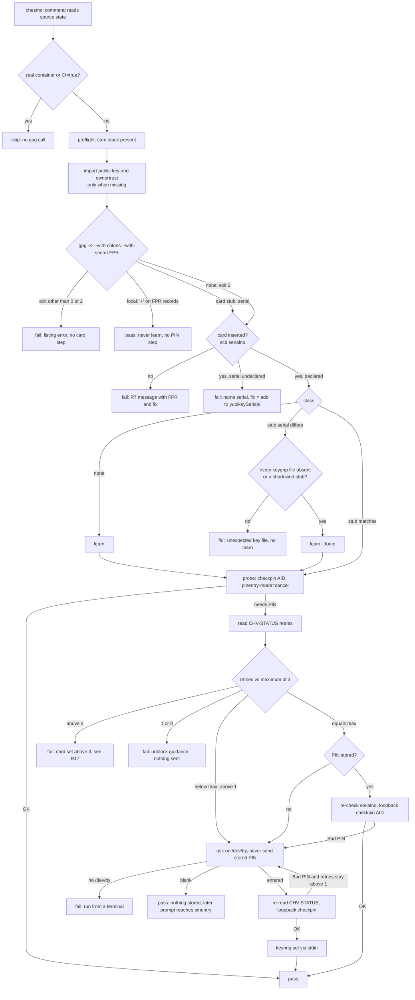
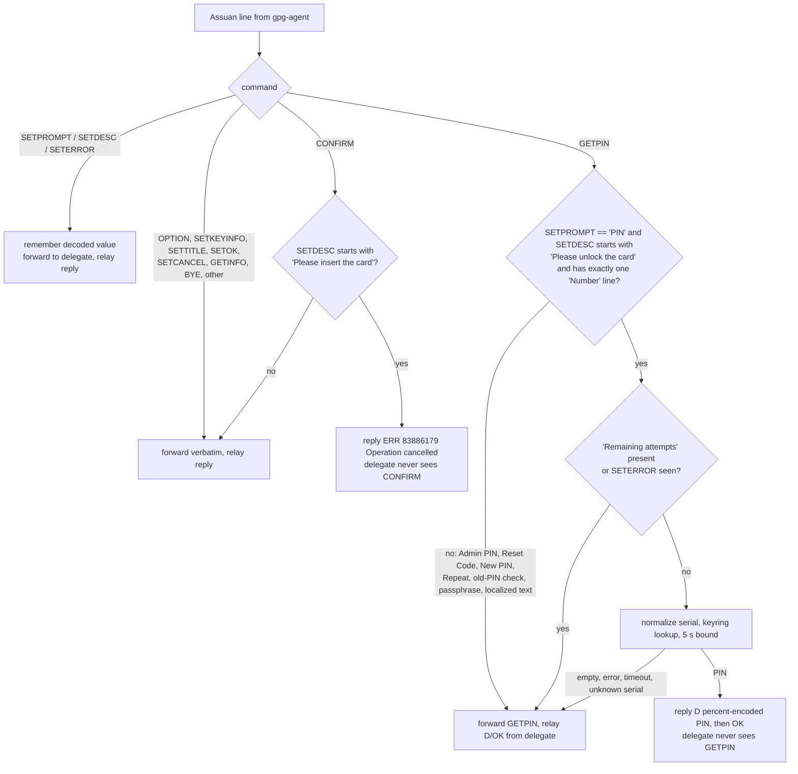
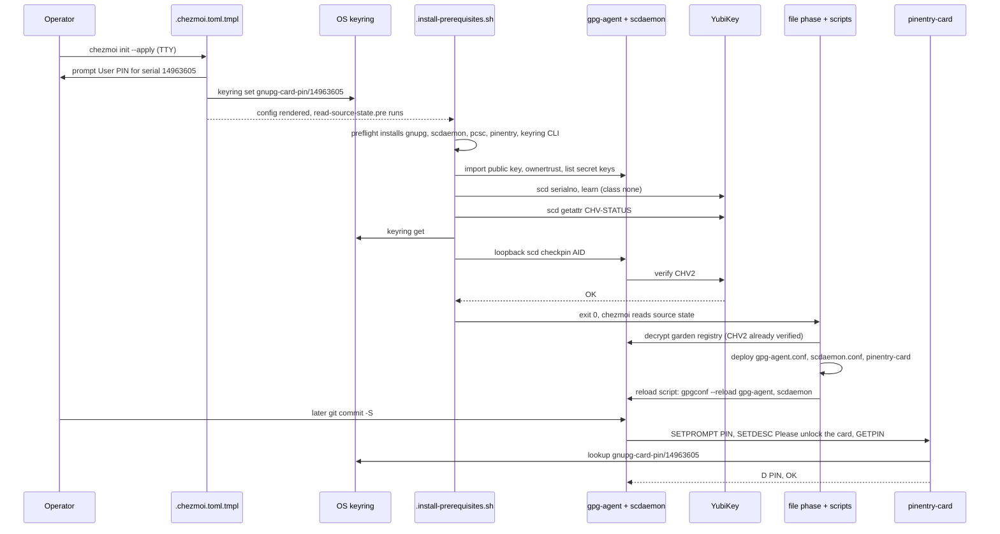
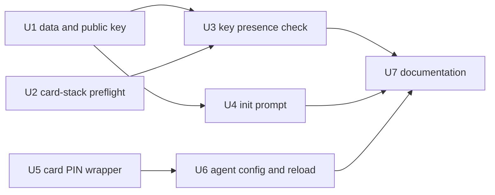

# YubiKey-Only GPG Private Key - Plan

## Goal Capsule

- **Objective:** On a newly provisioned host, the GPG private key exists only on the YubiKey and in 1Password. With the YubiKey inserted, signing and the garden registry decryption work without a PIN prompt. Without a usable key, the host grants no GPG authentication, and `chezmoi apply` stops.
- **Means:** The prerequisites hook provisions the card stack and runs the Key presence check with loopback PIN verification (KTD1, KTD2, KTD7, KTD9), `chezmoi init` captures the User PIN into one keyring record per card (KTD3, KTD5), the Card PIN wrapper releases that record to gpg-agent (KTD6, KTD10), and apply imports only the committed public key while the smartcard daemon shares the card (KTD8, KTD11).
- **Product authority:** the user's decisions recorded in Key Decisions, then the Requirements.
- **Execution profile:** seven dependency-ordered units on one branch. The hook and wrapper units are test-first through the CI seams named in their units. The card-dependent flow is a manual smoke on the operator's host with card serial 14963605, recorded in the pull request.
- **Stop conditions:**
  - a render or test that reaches the real `op` or the live `$HOME`;
  - any path that deletes, moves, or converts a local private key (R10);
  - any path that sends a stored PIN while the retry counter is below maximum (R14);
  - a design that needs the wrapper or `gpg-agent.conf` deployed before the check runs (rejected in KTD2);
  - a CI render that prompts or blocks on a keyring;
  - a new skip site in an onchange script without its matrix row.
- **Who finishes:** the implementing run ships all seven units in one pull request, including the documentation and the manual smoke record; no follow-up run is planned.
- **Open blockers:** none.

---

## Product Contract

### Summary

Today every host copies the GPG private key out of 1Password during apply. After this change, a new host imports only the public key and uses the YubiKey for signing and for decrypting the garden registry. The prerequisites step installs the GPG and smartcard tooling and the desktop pinentry on Fedora, Ubuntu, and macOS; apply deploys a card-PIN wrapper that returns the PIN `chezmoi init` stored in the OS keyring. apply refuses to start when neither a local private key nor the YubiKey is available.

### Problem Frame

The 80-keys script writes the full private key into the local keyring of every managed host, so each machine holds a long-lived copy of the signing and encryption key. The same key already lives on a YubiKey (serial 14963605, with signature, encryption, and authentication slots filled) and in 1Password. The local copies add exposure and add nothing that the card cannot do.

Removing the local copy creates two frictions. First, GnuPG asks for the card PIN, and the stock pinentry "save in keyring" option does not apply to card PINs. Second, apply decrypts the garden registry with the same key on every run. The user wants a host with the card inserted to behave as if unlocked, and a host without the card to behave as if the user is absent.

### Key Decisions

- KD1. **Decrypt the garden registry with the YubiKey; keep GPG encryption.** (session-settled: user-directed — chosen over switching to age with a 1Password identity, an ephemeral GNUPGHOME import during apply, and skipping garden without the card: the card is the only private-key holder on new hosts.) Governs R9.
- KD2. **Store the User PIN in the OS keyring and supply it through a card-PIN pinentry wrapper.** (session-settled: user-directed — chosen over reading the PIN from 1Password on each prompt, relying only on the card's own PIN cache, and a Touch ID gate on macOS: the user wants signing to work with no prompt while the card is inserted.) Stock pinentry cannot cache card PINs, because GnuPG 2.4 passes no key info for card prompts. Governs R3, R11, R12, R14, R15.
- KD3. **Verify the stored PIN once at the key check, while the card is idle.** (session-settled: user-approved — the prompt-reading wrapper plus key-check verification, chosen over a self-learning wrapper with after-the-fact counter audits and over automating card-side hardening: the retry protection does not depend on prompt text.) Governs R13, R14.
- KD4. **With no usable private key, apply fails as a whole before rendering.** (session-settled: user-directed — chosen over skipping only garden and failing only at the garden step: "no YubiKey means I am not present".) Governs R7, R8.
- KD5. **Existing hosts keep their local private key.** (session-settled: user-directed — chosen over apply deleting local keys, a documented manual removal, and requiring the card on all hosts: only new hosts change.) The R7 check passes on these hosts through the local key. Governs R10.
- KD6. **The prerequisites hook and the `chezmoi init` config template own GPG, pinentry, and PIN setup.** (session-settled: user-directed — the user named both places: the environment must be ready before apply renders anything, macOS included.) Governs R1, R2, R3.
- KD7. **The Jetson shared host stores the PIN too.** (session-settled: user-approved — shown as a call-out and confirmed.) The PIN-at-rest risk on a shared host is accepted for uniform behavior. Governs R16.

### Requirements

**Pre-apply provisioning**

- R1. On every Fedora, Ubuntu, and macOS host that is not a real container, the prerequisites hook installs GnuPG with its smartcard daemon, the desktop pinentry, and the card access stack before any other apply step runs; on macOS this includes `gnupg` and `pinentry-mac`.
- R2. The smartcard daemon shares the card with other card tools, so `ykman` and Yubico Authenticator keep working while GPG uses the card.
- R3. `chezmoi init` prompts for the YubiKey OpenPGP User PIN and stores a non-blank answer in the OS keyring (Secret Service on Linux, the login Keychain on macOS), keyed by card serial; a blank answer stores nothing.

**Key import**

- R4. apply never reads or imports private key material; it imports only the public key and sets its ownertrust to ultimate without an interactive tool.
- R5. The public key comes from a file committed to the repository.
- R6. On a host with no local private key, apply creates or refreshes the card stubs from the inserted YubiKey.

**Key check and presence**

- R7. `chezmoi apply`, `init`, and `update` fail before any file renders when the host has no local private key for the configured fingerprint and no inserted YubiKey that carries the expected keys; the message names the expected fingerprint and the fix.
- R8. Real containers and CI skip the R7 check.
- R9. When R7 passes, apply decrypts the garden registry without a PIN prompt.
- R10. apply never deletes, moves, or converts an existing local private key.

**PIN supply**

- R11. The wrapper answers only the OpenPGP User PIN prompt for the stored card serial; it passes every other prompt to the real desktop pinentry, including Admin PIN, Reset Code, new-PIN, and passphrase prompts.
- R12. When an operation needs the card and the card is absent, the wrapper refuses the insert-card request at once, so the operation (for example a signed `git commit`) fails with no dialog.
- R13. At the R7 check, with the card inserted and the User PIN retry counter at its maximum, the stored PIN is verified once; on rejection, the operator enters the PIN interactively and the new value replaces the stored one.
- R14. The wrapper never sends a stored PIN when the prompt shows fewer remaining attempts than the maximum; it passes the prompt to the real pinentry, and the next key presence check (R13) replaces the stored PIN.
- R15. When no PIN is stored or the keyring is unreachable (for example in an SSH session), the prompt goes to the real pinentry.

**Coverage and documentation**

- R16. The wrapper and PIN storage apply on KDE, GNOME, macOS, and the Jetson GUI session.
- R17. The README documents the PIN-at-rest trade-off and the manual card-side steps: retry counts, touch policy, and keeping signature PIN forcing off.

### Acceptance Examples

- AE1. **Covers R7, R4.** **Given** a new host with the public key only, **when** the operator runs `chezmoi apply` without the YubiKey, **then** apply stops before rendering and names fingerprint `A7F1956CD1A035A139BC7ABFCC740A29852C0E95`.
- AE2. **Covers R6, R9, R13.** **Given** a new host with the card inserted and a correct stored PIN, **when** apply runs, **then** the stubs exist, the PIN check passes, and the garden registry decrypts with no dialog.
- AE3. **Covers R10, R7.** **Given** an existing host with a local private key and no card, **when** apply runs, **then** apply completes, and signing uses the local key.
- AE4. **Covers R12.** **Given** a new host after setup, **when** the card is removed and the operator runs `git commit`, **then** signing fails at once with no insert-card dialog.
- AE5. **Covers R13, R14.** **Given** a stored PIN that no longer matches the card, **when** apply runs, **then** the card rejects it once, the operator enters the correct PIN, and later prompts use the new value; the stored PIN is never sent a second time.
- AE6. **Covers R11.** **Given** a stored PIN, **when** GnuPG asks for the Admin PIN, **then** the real pinentry dialog appears and nothing is auto-answered.
- AE7. **Covers R8.** **Given** a real container, **when** apply runs, **then** no key check runs and GPG and garden stay skipped as today.

### Scope Boundaries

- Automating card-side settings: retry counts, touch policy, and signature PIN forcing stay manual (R17).
- Using the YubiKey for SSH authentication through gpg-agent.
- A Touch ID or other biometric gate on the stored PIN.
- Migrating existing hosts off their local private key (KD5).
- Changing the garden encryption scheme (KD1).
- Replacing the key or its algorithm (rsa2048 stays).

### Deferred to Follow-Up Work

- `disable-application piv` in `scdaemon.conf`, which stops scdaemon probing the PIV applet before OpenPGP; KTD8 ships `disable-ccid` and `pcsc-shared` only.
- A terminal fallback for the wrapper on macOS over SSH; KTD6 defines the Linux fallback only.

### Dependencies / Assumptions

- The YubiKey holds the signature, encryption (`0x99F28D011988964B`), and authentication keys; signature PIN forcing is off; KDF is off (verified on serial 14963605, firmware 5.4.3).
- Managed hosts run GnuPG 2.4 or newer (Fedora 44 has 2.4.9, Ubuntu 24.04 has 2.4.4, and Homebrew is current).
- The first apply on a new host runs before the wrapper is deployed; the R13 check therefore verifies the PIN without any pinentry (KTD2) and asks the operator directly only when it has no accepted PIN to send.
- The card also publishes a public-key URL (`keys.openpgp.org`), which is available if the committed file is ever missing.

### Outstanding Questions

**Deferred to Implementation**

- The exact Python structure of the wrapper and the Assuan edge cases: percent-decoding of `SETDESC`, `D`-line escaping of the PIN, and `OPTION` passthrough (U5).
- Whether an apply inside a toolbox or distrobox reaches the host card through the host agent socket (U3 manual smoke).
- The exact names of the new CI tests; each name is the implementer's and each test is wired into `.github/workflows/ci.yml` (U1, U2, U5, U6).

### Product Contract preservation

- changed: R7 — extended to every source-reading command so a missing card shows the gate message; pipeline assumption (KTD9). R7's `init` means `init --apply`, because a bare `init` never reads the source state.
- changed: R14 — the wrapper passes a below-maximum prompt through and the next key presence check replaces the stored PIN, because the wrapper never writes to the keyring (KD2, KD3).
- clarified, no scope change: R17's card-side steps include keeping the User PIN retry maximum at three and running any chezmoi command with the card inserted after changing the PIN outside GnuPG (KTD2, KTD4).

### Sources / Research

- `.chezmoiscripts/80-keys/run_once_before_import-gpg-key.sh.tmpl` — current private-key import and `expect` trust step; removed by U3.
- `.chezmoi.toml.tmpl` — `encryption = "gpg"`, the recipient literal with its "update both" comment, the `read-source-state.pre` hook, and the `hasKey` prompt pattern for init secrets.
- `.install-prerequisites.sh` — per-OS bootstrap; the `is_container` predicate, `op_ready`, `ensure_config_secrets_key` (fail-soft keyring seed before the fast path), the `_INSTALL_PREREQUISITES_TEST_SOURCE` seam, and the `mise` plus `op_ready` fast path that every new step must precede.
- `.chezmoitemplates/config-secrets-key-ensure.tmpl`, `.chezmoitemplates/config-secrets-key.tmpl` — the `output "sh" "-c"` keyring pattern through `.chezmoi.executable` and why chezmoi's `keyring` function is rejected.
- `.chezmoiscripts/30-linux/run_onchange_after_config-wakatime-keyring.sh.tmpl` — `secret-tool` store and lookup with the secret on stdin, never in argv.
- `.chezmoiscripts/70-agents/run_after_config-omp-settings.sh.tmpl` — `bounded_read`, the read bound that works without GNU `timeout` on macOS.
- `.chezmoiscripts/30-components/run_onchange_before_80-devtools.sh.tmpl`, `.chezmoiscripts/20-base/fedora/run_onchange_before_base.sh.tmpl`, `.chezmoiscripts/20-darwin/run_onchange_before_homebrew.sh.tmpl` — current owners of `pcsc-lite`, `pcsc-lite-ccid`, `libsecret`, `expect`, `gnupg2`, `gnupg`, and `pinentry-mac`.
- `.chezmoiscripts/30-components/run_onchange_before_60-desktop-ime.sh.tmpl`, `.chezmoiscripts/20-linux-ubuntu/run_onchange_before_jetson.sh.tmpl` — current owners of `pinentry-qt` and `pinentry-gnome3`; the hook takes them over (KTD7), and the askpass helpers stay.
- `.chezmoitemplates/facts.tmpl` — the `desktop` fact's `lookPath` precedence (`plasmashell` wins over `gnome-shell`) that the hook's desktop probe mirrors.
- `private_dot_gnupg/.gpg-agent.linux.conf`, `private_dot_gnupg/.gpg-agent.darwin.conf` — current pinentry selection.
- `dot_config/git/config.tmpl` — commit and tag signing with the configured key.
- `.ci/test-capability-cache.sh`, `.ci/test-skip-record-pruning.sh` — how a CI test sources the hook through its seam and calls its functions against stubs.
- `.ci/test-ci-wiring.sh` — every new `.ci/test-*.sh` must be invoked by a workflow and every `ci.yml` job must be in `delivery`'s `needs`.
- `.ci/lib/render-gate-helpers.sh` — `render`, `write_fact_stub`, and `render_ignore` for deterministic template renders.
- `.github/workflows/render-dotfiles.yml` — the Fedora container and `macos-26` runner applies with `--no-tty --exclude=scripts,encrypted` and stub `op`/`mise`; the `shellcheck` job that lints the hook and every rendered script.
- `docs/solutions/integration-issues/fedora-mok-import-sudo-prompt-inside-expect-pty.md` — why `expect` was kept for the trust edit and why a pty is the wrong tool.
- `docs/solutions/integration-issues/chezmoi-localarchive-overlay-entrystate-drift.md` — never let a script rewrite a chezmoi-managed file.
- `docs/solutions/integration-issues/chezmoi-template-required-field-guard-accepts-null.md` — a guard must reject null, and a gate protects only its callers.
- `docs/plans/2026-09-17-2036-feat-yubikey-management-tools-plan.md` — adds `ykman` and Yubico Authenticator and excludes gpg-agent integration.
- GnuPG STABLE-BRANCH-2-4: `agent/divert-scd.c` (card prompts carry no key info; `prompt` is `PIN`, `Admin PIN`, or `Reset Code`), `agent/call-pinentry.c` (`SETKEYINFO --clear`, loopback `INQUIRE PASSPHRASE`), `agent/findkey.c` (insert-card `CONFIRM`), `scd/app-openpgp.c` (`Remaining attempts` only below three, `CHV-STATUS`, `checkpin` verifies CHV2).
- [drduh/YubiKey-Guide](https://github.com/drduh/YubiKey-Guide) — package set, `disable-ccid`, stub creation with `learn --force`, ownertrust import, PIN retry limits, and touch policy.
- [pinentry-mac-keychain](https://github.com/olebedev/pinentry-mac-keychain) — an existing proxy wrapper that stores card PINs in the Keychain, keyed by card serial; it has no retry protection and passes insert-card through.
- [pinentry-touchid](https://github.com/mikalv/pinentry-touchid) — a Keychain PIN release behind Touch ID; inert for cards because the agent clears key info.

---

## Planning Contract

### Key Technical Decisions

- KTD1. **The Key presence check lives in `.install-prerequisites.sh`, before the hook's fast path, and replaces the 80-keys import.** The step imports the committed public key only when `gpg --list-keys <FPR>` fails, and imports ownertrust (`<FPR>:6:` through `--import-ownertrust`) only when the exported ownertrust is not `6`, so a read-only command on a provisioned host does not rewrite the keybox or trustdb. Before classifying it runs `gpg-connect-agent 'GETINFO version' /bye` and treats a non-zero exit as a hard failure with no listing and no card step, because an unreachable agent makes `gpg -K` exit 2 exactly like a genuine absence. Only then does it classify from `gpg -K --with-colons --with-secret <FPR>`: exit 2 (`No secret key`) is none; exit 0 is classified from the records of that fingerprint alone, where `+` in field 15 is local and any other non-`#` value is the card's token AID (`D276…`, never a decimal serial), which normalizes per KTD3 before any comparison with the inserted card; a `#` (an unavailable stub), or records mixing `+` and card tokens, is a hard failure naming the key file under `private-keys-v1.d/`, with no `learn` and no card step; any other exit is a hard failure too. For the none class it runs plain `learn`, which never overwrites an existing key file. It runs `learn --force` only for a card stub whose serial differs from the inserted declared card (R6), and only after an agent-independent check that every keygrip of the committed key under `~/.gnupg/private-keys-v1.d/` is absent or a shadowed stub; any other key file aborts with a message. After any `learn`, it re-runs the classification and requires card records for the configured fingerprint's signing and encryption keys before the PIN step, so a declared card that does not carry this key fails R7 here instead of at the garden decrypt. It exits non-zero with the R7 message when no usable key exists, and on the none class it then clears any stored PIN record for the declared serials, so a host the gate rejects keeps no credential. `.chezmoiscripts/80-keys/run_once_before_import-gpg-key.sh.tmpl` and the `expect` dependency it justified are removed. The hook is the only place that runs before the source state is read on every OS, and a step placed after the fast path never runs on a provisioned host. Rejected: keeping the check in an apply script (it runs after the garden decrypt that needs the key); `expect` for the trust edit (`docs/solutions/integration-issues/fedora-mok-import-sudo-prompt-inside-expect-pty.md`). Governs R4, R6, R7, R8, R10.
- KTD2. **PIN verification at the check uses loopback pinentry, not the wrapper.** (session-settled: user-approved — the prompt-reading wrapper plus key-check verification, chosen over a self-learning wrapper with after-the-fact counter audits and over automating card-side hardening: the retry protection does not depend on prompt text.) The verification runs in one `gpg-connect-agent` session, serialized by a per-user lock file, in this order:
  1. A probe: `scd checkpin <AID>` under `OPTION pinentry-mode=cancel`. `OK` means scdaemon already holds a verification for this card session; the step passes with no keyring read and no ask. The probe consumes no retry.
  2. Otherwise read `CHV-STATUS`. When the User PIN counter equals the maximum of three (the threshold GnuPG itself uses for the `Remaining attempts` marker; R17 keeps the card there) and the keyring holds a PIN, switch to `pinentry-mode=loopback` and run `scd checkpin <AID>`, answering the agent's `PASSPHRASE` inquiry with that PIN. Re-read `scd serialno` in the same session first and abort when the card changed.
  3. When the check did not observe the `PASSPHRASE` inquiry, GnuPG answered from its own PIN cache. The card is usable, so the step passes, but it records nothing about the stored PIN. The wrapper's marker rule (KTD6) bounds any later cost of a stale stored PIN to one attempt.
  4. When no PIN is stored, when the card rejects it, or when the counter is below the maximum, the step asks the operator with a no-echo read on `/dev/tty`. It re-reads `CHV-STATUS` immediately before sending, verifies the answer the same way, and writes it to the keyring (KTD3) only after the card accepts it. A blank answer stores nothing and lets the later prompt reach pinentry (R15). Without a `/dev/tty` the step prints the run-from-a-terminal message and exits non-zero; it never drives a pinentry itself.
  5. The step never sends anything and asks nobody when one attempt or none remains; it stops with the unblock guidance (Reset Code or Admin PIN). A counter above three is a hard failure naming the card setting R17 requires.

  The block runs under a per-user `mkdir` lock directory in `${XDG_RUNTIME_DIR:-$HOME/.cache}/chezmoi/` with a stale-age check, because macOS has neither `flock(1)` nor `XDG_RUNTIME_DIR`. It runs with shell tracing off, never passes `-v` to `gpg-connect-agent`, passes the PIN to `/let` verbatim (that command stores its value literally, because the session never sends `/subst`; escaping would corrupt a PIN containing `$` and spend a retry), clears the variable after use, and keeps the PIN out of argv, stdout, and stderr. The AID is the exact `SERIALNO` value scdaemon returns; the decimal serial is only the keyring account and the `yubikeySerials` lookup. Loopback and cancel modes are on by default in GnuPG 2.4 (`allow-loopback-pinentry`). The status read and the check are not atomic: another client can consume an attempt in between. The lock, the re-reads, and the one-automated-attempt rule bound that race, but a status read never guarantees the next operation is free. Instantiates KD3. Rejected: wrapper-driven checkpin (needs the wrapper and the agent config deployed before the check); a second Assuan speaker in the hook for display-only sessions (untested path, and R15 already defers to the next real prompt). Governs R13, R14.
- KTD3. **One keyring record per card: service `gnupg-card-pin`, account = the card's decimal serial without leading zeros.** The record is written with the PIN on stdin to `chezmoi --no-tty secret keyring set` (no `--value`, stdout discarded; chezmoi reads one trimmed line, so a PIN with leading or trailing whitespace is unsupported) and read with `chezmoi secret keyring get`, both bounded and fail-soft (go-keyring: Secret Service on Linux, `/usr/bin/security` on macOS). The wrapper reads the same record with `secret-tool lookup service gnupg-card-pin username <serial>` on Linux and `security find-generic-password -s gnupg-card-pin -a <serial> -w` on macOS. On macOS go-keyring stores every value as `go-keyring-base64:<base64>` (older items `go-keyring-encoded:<hex>`), so the wrapper strips and decodes those prefixes before use. The item created by `security` trusts `security`, so the read needs no ACL prompt while the login keychain is unlocked; the plan never widens the ACL (`-A`), and a locked or denying keychain is a bounded lookup failure that passes through. Serial normalization, shared by the wrapper and the check: take the text after the first `Number` label up to the next line break and drop the `\x1e`/`\x1f` alignment bytes. Accept only the three documented forms — digit groups separated by single spaces, an unbroken digit run, or those preceded by a `0006` manufacturer group — and pass the prompt through on anything else rather than deleting characters until it matches. Then remove the spaces, drop a leading `0006` from a twelve-digit result, and strip leading zeros. A YubiKey 5 prompt shows `Number: 14 963 605`, older firmware shows `14963605`, and non-YubiKey cards show `0006 14963605`; all three normalize to `14963605`. `libsecret` (Fedora, provides `secret-tool`) joins the hook package set; Ubuntu already installs `libsecret-tools`. Governs R3, R11, R15.
- KTD4. **Card serials are data.** `.chezmoidata/user.yaml` gains `yubikeySerials: [14963605]` next to `gpgPubKey`. The User PIN retry maximum is not data: the check hardcodes three, the only value at which GnuPG's `Remaining attempts` marker and the wrapper's rule agree, and R17 keeps the card there. Because `.chezmoi.toml.tmpl` renders before `.chezmoidata` loads, the init template carries the serial list and the fingerprint as literals with an "update both" comment, and a CI test asserts the literals equal the data file, the same pattern as the existing recipient literal. The hook reads the two values from `.chezmoidata/user.yaml` with a fixed-shape reader that the same test pins. Governs R3, R5, R7.
- KTD5. **`chezmoi init` prompts once per declared serial, in an interactive init only, and stores nothing in the config but a per-serial marker.** The config keeps `yubikeyPinPrompted`, a list of serials already handled. In `.chezmoi.toml.tmpl` the template carries that list forward and, when `stdinIsATTY` is true, handles each declared serial not yet in it. A backup card added to `yubikeySerials` later is therefore prompted on the next init.
  - For each serial, an `output "sh" "-c"` snippet owns the whole exchange: it prints `YubiKey OpenPGP User PIN for serial <serial> (leave blank on a host that keeps its local key or will not use the card)` on `/dev/tty`, reads the answer with echo off, and pipes a non-blank answer to `chezmoi --no-tty secret keyring set` (KTD3). The Go template never holds the PIN, so no `%q` quoting touches it and nothing is echoed.
  - The snippet reports one of three outcomes: stored, blank, or failed. Stored and blank add the serial to the list, so a blank answer defers capture to the KTD2 step. Failed leaves the serial out so the next interactive init asks again, and prints a note on stderr.
  - Without a TTY the template prompts nothing and adds nothing, so a headless render never blocks on a prompt or a keyring.
  - The snippet is independent of GnuPG, the card, and every hook-installed package. It runs before the hook and is bounded on both OSes (Linux `timeout 10`; macOS the `bounded_read` shape).
  - A config from before this change has no `yubikeyPinPrompted` key and is treated as an empty list.

  Governs R3.
- KTD6. **The Card PIN wrapper is a Python 3 standard-library program at `private_dot_gnupg/executable_pinentry-card.tmpl`, named by `pinentry-program` in both gpg-agent OS fragments.** Python 3 is present on Fedora and Ubuntu, and on macOS through `/usr/bin/python3`, which is only a real interpreter once the Command Line Tools are installed; on macOS the preflight and the reload script therefore treat it as present only when `xcode-select -p` exits 0 and otherwise name `xcode-select --install`. The shebang is `/usr/bin/python3`. The template renders only the delegate pinentry path from the `desktop`, OS, and architecture facts: `pinentry-gnome3` for GNOME, `pinentry-qt` for KDE, `pinentry-curses` when the `desktop` fact is `none` on Linux (the terminal binary the preflight always installs), and `pinentry-mac` on macOS under the Homebrew prefix that host's architecture uses (`/opt/homebrew` on arm64, `/usr/local` on amd64, matching the hook's own Homebrew resolution). The reload script checks the same rendered path. On Linux the wrapper also falls back to `pinentry-curses` when neither `DISPLAY` nor `WAYLAND_DISPLAY` is set. Behavior per R11, R12, R14, R15: it proxies Assuan line by line to the delegate; it answers `GETPIN` itself only when `SETPROMPT` is exactly `PIN` (a literal GnuPG never translates), `SETDESC` starts with `Please unlock the card`, carries exactly one `Number` line (the first line after that header; a description with a second `Number` line passes through, because the holder name is raw card data), has no `Remaining attempts` marker, was not preceded by `SETERROR` (defence in depth; the marker is the live signal), and the keyring holds a PIN for the normalized serial (KTD3); it answers `CONFIRM` for `Please insert the card` with a cancel error; everything else passes through. Protocol hygiene: the stream is read and written as bytes and raw lines are forwarded unchanged; percent-decoding produces a separate, length-bounded copy used only for matching; malformed escapes, carriage returns, and overlong lines in a line the wrapper would answer make it pass through instead; the PIN is percent-encoded on the `D` line. The delegate is spawned from its rendered absolute path without a shell, with the inherited environment (the display variables and `PINENTRY_KDE_USE_WALLET` must reach it) and a fixed `PATH`. On stdin end-of-file, `BYE`, or `SIGINT`/`SIGTERM`, the wrapper closes the delegate's stdin, waits briefly, and terminates it. It never writes to the keyring. Any process running as the operator can invoke the wrapper or drive gpg-agent; that same-user boundary is accepted (System-Wide Impact). Rejected: a bash coprocess relay (macOS ships bash 3.2); a Rust binary through command-reconcile (not available before the first apply's file phase and not needed by the check). Governs R11, R12, R14, R15, R16.
- KTD7. **Packages move into the hook, before the fast path, as a card-stack preflight with one owner per package.** Fedora: `gnupg2 gnupg2-scdaemon pcsc-lite pcsc-lite-ccid pinentry libsecret`, plus `pinentry-qt` on KDE or `pinentry-gnome3` on GNOME, then `pcscd.socket` enabled. Ubuntu: `gnupg scdaemon pcscd pinentry-curses libsecret-tools`, plus `pinentry-qt` on KDE or `pinentry-gnome3` on GNOME (the same probe as Fedora, so KTD6's delegate always exists), then `pcscd.socket` enabled. macOS: Homebrew bootstrapped if absent, then `gnupg` and `pinentry-mac` when missing. The hook decides the desktop with a probe that mirrors the `lookPath` precedence of the `desktop` fact in `.chezmoitemplates/facts.tmpl`: `plasmashell` means KDE, else `gnome-shell` means GNOME, else none; the hook test pins both branches. The preflight only installs what the package query reports missing, and it skips real containers and CI (the KTD9 predicate). It also seeds `~/.gnupg/scdaemon.conf` with exactly the KTD8 content when that file is absent, never touching an existing one, because the first `scd` command of the check runs before the file phase deploys the managed copy, and a GnuPG built with the internal CCID driver would otherwise claim the card itself. The previous owners drop the moved packages:
  - the Fedora base set drops `expect` and `gnupg2`;
  - the Ubuntu base list in the hook drops `expect`, `gnupg`, and `libsecret-tools`, which the preflight now owns;
  - the Ubuntu base installer and the Jetson installer drop `gnupg`, and the Jetson installer drops `pinentry-qt`;
  - the desktop-IME installer drops `pinentry-qt` and `pinentry-gnome3` on both distributions and keeps the askpass helpers;
  - the devtools installer drops `pcsc-lite`, `pcsc-lite-ccid`, and `libsecret` on Fedora and `pcscd` on Ubuntu, and keeps `pcsc-tools`;
  - the Brewfile drops `gnupg` and `pinentry-mac`.

  Governs R1.
- KTD8. **`private_dot_gnupg/scdaemon.conf` is managed with `disable-ccid` and `pcsc-shared`.** `disable-ccid` makes scdaemon reach the card through pcscd on Linux and the PC/SC framework on macOS instead of claiming the USB interface. That alone is not enough for R2: scdaemon opens PC/SC in exclusive mode unless `pcsc-shared` is set, and it keeps the card open after first use (`card-timeout` has no effect in 2.4), so `ykman` and Yubico Authenticator would fail until scdaemon is killed. `pcsc-shared` has two recorded costs, both absorbed by this design: GnuPG's agent-side PIN cache is off, and a card reset by another tool drops the verification, so the next operation prompts again and the wrapper answers it with no dialog (KTD6). The manual smoke runs `ykman info` while scdaemon is alive to confirm the choice. Rejected: `disable-ccid` alone (fails R2); documenting that the tools cannot run while the agent owns the card (contradicts R2). Governs R2.
- KTD9. **The check and the preflight skip when the host is a real container (the existing lockstep predicate) or `CI` is `true`, and run for every chezmoi command that reads source state.** GitHub-hosted runners export `CI=true`, and the `macos-26` render runner is not a container, so the container predicate alone would fail that job. Running for `diff`, `status`, `verify`, `cat`, and `managed` as well as `apply`, `init`, and `update` is the pipeline assumption recorded under Product Contract preservation: a missing card then yields the R7 message instead of a raw decrypt error. The predicate is advisory: `CI=true` in an operator shell also skips the check, which is acceptable because the check guards against accidental applies, and the encrypted garden still cannot be read without a key. A bare `chezmoi init` never reads the source state, so the gate reaches init only as `init --apply`. Governs R7, R8.
- KTD10. **gpg-agent and scdaemon pick up a changed configuration through a `run_onchange_after` reload script** at `.chezmoiscripts/80-keys/run_onchange_after_reload-gpg-agent.sh.tmpl`, fingerprinted on every `private_dot_gnupg/` source file, running `gpgconf --reload gpg-agent` and `gpgconf --reload scdaemon` with no conditional early exit. Before reloading it verifies that the wrapper's interpreter and rendered delegate path exist and are executable — on macOS the interpreter counts as present only when `xcode-select -p` exits 0 — and fails the apply loudly when either is missing, so a host never runs with a dead `pinentry-program`. It resolves `gpgconf` from `PATH`, which the hook's Homebrew environment already covers on macOS. The container block of `.chezmoiignore` already ignores `.chezmoiscripts/80-keys/*.sh`, so the reload never runs where no agent exists. Governs R11 (wiring).
- KTD11. **The public key is committed as the dot-prefixed internal file `.keys/gpg-A7F1956CD1A035A139BC7ABFCC740A29852C0E95.asc`,** an armored public-key export only; the implementer exports it with `gpg --export --armor <FPR>`, and a CI test asserts it contains no secret-key packet and matches the fingerprint in `.chezmoidata/user.yaml`. A dot-prefixed source path is internal to chezmoi and never deploys. Governs R5.

### High-Level Technical Design

The hook, the keyring, the wrapper, gpg-agent, scdaemon, and the card form one chain with two entry points: the Key presence check at the start of every chezmoi command, and the Card PIN wrapper on every later prompt. The first diagram is the check's decision flow (KTD1, KTD2, KTD9); the second is the wrapper's prompt classification (KTD6); the third is the lifecycle of a new host's first `chezmoi init --apply`.

**Key presence check (hook, before the fast path)**



The loopback exchange is one `gpg-connect-agent` session fed on stdin, so the PIN never appears in argv. Directional sketch, not a recipe:

```text
OPTION pinentry-mode=cancel
scd serialno            -> S SERIALNO D27600012401xxxx0006149636050000
scd checkpin <that AID> -> OK (already verified)  |  ERR (needs a PIN)
OPTION pinentry-mode=loopback
/let pin <PIN read from the keyring or the operator, verbatim>
/definq PASSPHRASE pin
scd serialno            -> must equal the AID above
scd checkpin <that AID> -> INQUIRE PASSPHRASE observed, then OK  |  ERR 100663383 Bad PIN <SCD>
/bye
```

The AID's hex offsets 20 to 27 (zero-based) hold the card serial; the check normalizes it per KTD3 and matches the result against `yubikeySerials`. `scd getattr CHV-STATUS` returns seven counters as one status-encoded token (`S CHV-STATUS +1+127+127+127+3+3+3`), so the check decodes `+` back to a separator before splitting; the fifth value is the User PIN retry count, and reading it prompts nothing and consumes nothing.

**Card PIN wrapper prompt classification**



**New host: first `chezmoi init --apply`**



### Assumptions

- The R7 gate also covers the other source-reading commands (KTD9); recorded under Product Contract preservation as a pipeline assumption.
- A backup YubiKey is added by appending its serial to `yubikeySerials`; the wrapper keys lookups by the serial in the prompt, so each card has its own PIN record, and the check re-points the stubs with `learn --force` when the inserted declared card differs from the stub's serial (R6).
- Any init without a TTY skips the prompt and the keyring write; KTD2 captures the PIN on the first apply.
- The README update (R17) goes in `README.md`; the repository supplement `AGENTS.md` is updated where it names the 80-keys import.
- Removing the run_once 80-keys script leaves a stale chezmoi script-state entry on existing hosts, which is harmless.
- GitHub-hosted runners export `CI=true`, and `stdinIsATTY` is false in every CI render, so neither the preflight, the check, nor the init prompt runs there.
- The card is kept at a User PIN retry maximum of three, the threshold GnuPG itself uses to add the `Remaining attempts` marker. A card set higher would let the wrapper re-send a stale PIN until the counter reaches two, so the check fails on such a card and R17 tells the operator to keep it at three.
- scdaemon keeps a successful CHV2 verification for the card session, so the garden decrypt that follows the check needs no PIN, and the cancel-mode probe makes later commands send nothing. With `pcsc-shared` (KTD8) another tool can reset the card; the next operation then prompts once and the wrapper answers it. The manual smoke confirms the retry counter stays at three after several commands.
- A YubiKey 5 AID carries the serial at hex offsets 20 to 27, and its card prompt shows it grouped as `Number: 14 963 605`; the wrapper and the check share the KTD3 normalization.
- After the PIN is changed outside GnuPG, the stored PIN is stale. The next check spends at most one attempt, then asks the operator and replaces the record; R17 documents running any chezmoi command with the card inserted before signing.
- chezmoi exports `CHEZMOI_EXECUTABLE` to the hook; the hook falls back to `chezmoi` on `PATH` so a first-init bootstrap binary is still reached.
- `gpgconf --reload` exits zero when no agent is running; the reload unit's test holds this, and a failure there is resolved with a `gpgconf --kill` or a declared skip, never a bare conditional exit.

### System-Wide Impact

- **Authentication boundary.** Every managed host, the Jetson shared host included (KD7), keeps the card User PIN in its OS keyring, and the wrapper releases it to any process that can drive gpg-agent in that session. This is the same trust boundary as the session keyring itself and is accepted: the design does not protect against a process already running as the operator. Secret Service has no per-application ACL, and on macOS the item trusts `security`, which any process can run, so neither store isolates callers. The PIN exists in three places: the keyring record (user-scoped, never a system or root-owned store), gpg-agent's in-memory cache when `pcsc-shared` does not disable it, and 1Password. The card's touch policy (R17, manual) is the remaining per-operation gate. On the Jetson it is the control that makes KD7 acceptable, and a host with console auto-login must keep the wallet locked at login or accept console-wide use while the card is inserted.
- **Apply lifecycle.** The hook gains a preflight and the Key presence check that run on every chezmoi command before the fast path. A host with neither a local key nor the card now fails `diff` and `status` too, with the R7 message. Provisioned hosts pay one package query and one secret-key listing per command; the card verification is cached per card session.
- **Package ownership.** The hook becomes the owner of GnuPG, scdaemon, the PC/SC stack, the keyring CLI, every pinentry, and on macOS `pinentry-mac`; the base, Jetson, desktop-IME, devtools, and Brewfile installers lose those entries. Nothing is uninstalled, per the no-teardown rule in `AGENTS.md`.
- **Containers and CI.** Unchanged behavior: the hook skips both steps, `.chezmoiignore` keeps `80-keys` scripts and the garden out of containers, and the config template never prompts without a TTY. The new `~/.gnupg` files deploy in containers and are inert there.
- **Existing hosts.** The local key stays (KD5); the check classifies it as local and runs no card step. The wrapper takes over `pinentry-program`, and every non-card prompt, including local-key passphrases, passes through to the delegate. Their `chezmoi.toml` gains `yubikeyPinPrompted` on the next interactive init.
- **CI surface.** Four new gates in `ci.yml` (data and key content, hook preflight and check, wrapper protocol, GnuPG config and reload); `.ci/test-ci-wiring.sh` enforces their wiring; `render-dotfiles.yml` is untouched and must stay green on both runners.
- **Documentation.** `README.md` gains the PIN-at-rest and card-side section (R17) and loses the private-key import wording; `AGENTS.md` loses the 80-keys import sentence and re-labels the `80-keys` directory. `CONCEPTS.md` already carries "Key presence check" and "Card PIN wrapper".

### Risks

- **A wrong stored PIN could burn retries.** Mitigated by the check reading `CHV-STATUS` first, sending a stored PIN only at maximum, never asking when one attempt remains, and the wrapper refusing to answer below maximum or after a `SETERROR` (KTD2, KTD6, R14).
- **Prompt text is localized.** The wrapper matches English GnuPG texts; under another `LC_MESSAGES` it matches nothing and passes through, which is the safe direction. The host has no Korean GnuPG catalog today.
- **PIN exposure in the process table, traces, or logs.** Mitigated by writing the record on stdin (KTD3, never `--value`, which every user on the shared Jetson could read from `/proc`), answering the loopback inquiry from stdin with tracing off and no `-v` (KTD2), and reading on `/dev/tty` with echo off at init (KTD5). The hook and wrapper tests assert that the PIN appears in no argument, stdout, or stderr.
- **Assuan injection through prompt text.** The holder name is raw card data inside `SETDESC`. Mitigated by matching on a bounded decoded copy while forwarding raw bytes, accepting only a single `Number` line, and passing through on malformed input (KTD6). A crafted card gains at most the PIN of a declared serial, which is useless without that card.
- **Status-to-check race.** Another PC/SC client can consume an attempt between `CHV-STATUS` and `checkpin`. Mitigated by the lock file, the serial and status re-reads, and the rule that automation sends at most one attempt and never at one remaining (KTD2); a human remains able to block the card through the real pinentry, as today.
- **A dead `pinentry-program`.** A missing interpreter or delegate would break every GnuPG prompt. Mitigated by the reload script's executable check (KTD10) and the hook preflight that installs the delegate (KTD7).
- **A locked keyring in an SSH session** makes both the check's read and the wrapper's lookup fail; both treat that as "no PIN" and fall back to asking (R15). Over SSH without a display the Linux fallback is `pinentry-curses`.
- **`learn --force` on a host with a local key** would replace it with stubs. Mitigated three ways (KTD1): a listing that could not reach the agent is a hard failure rather than "none", the none class uses plain `learn`, and `--force` requires every keygrip file to be absent or a shadowed stub. The hook test pins each (R10).
- **macOS Keychain lock or denial** makes the wrapper's bounded lookup fail, and the prompt passes through to `pinentry-mac` (R15). The plan never widens the item's ACL.
- **Every chezmoi command now needs the card on a new host.** This is KD4 by design; the R7 message names the fix, and a blocked operator can still run other tools.
- **Reloading scdaemon drops the cached verification** after each GnuPG config change, so the next operation prompts once through the wrapper; harmless.
- **`pcsc-shared` behavior on the operator's card** is confirmed only by the manual smoke. If sharing proves unreliable, the fallback is to drop `pcsc-shared` and state R2's limitation, which is a product change that goes back to the user.
- **The frozen skip matrix.** The reload script is `run_onchange_` and must carry no conditional early exit, or it needs matrix rows; the unit's test holds the unconditional shape.

### Sequencing



U1 and U2 have no dependencies. U3 needs both. U4 needs U1. U5 is independent and U6 follows it. U7 lands last.

---

## Implementation Units

### U1. Declare the card serials and commit the public key

- **Goal:** The repository carries every value the check and the init prompt need, with one owner per value and a CI test that pins each copy.
- **Requirements:** R3, R5, R7; KTD4, KTD11.
- **Dependencies:** none.
- **Files:** `.chezmoidata/user.yaml`; `.keys/gpg-A7F1956CD1A035A139BC7ABFCC740A29852C0E95.asc` (new); `.chezmoi.toml.tmpl` (the serial literal beside the recipient literal); `.ci/test-gpg-key-data.sh` (new); `.github/workflows/ci.yml`.
- **Approach:**
  1. Add `yubikeySerials` (one decimal serial per entry, no leading zeros, per the KTD3 normalization) to `.chezmoidata/user.yaml` next to `gpgPubKey`.
  2. Export the public key with `gpg --export --armor` from the operator's keyring and commit it under `.keys/` (KTD11).
  3. Add the serial list as a template literal in `.chezmoi.toml.tmpl`, beside the recipient literal, under the same "update both" comment (KTD4). U4 consumes it.
  4. Write the test: parse the two literals out of `.chezmoi.toml.tmpl` and the two values out of `.chezmoidata/user.yaml` with fixed-shape scans and compare; import the key file into a scratch `GNUPGHOME` and compare the `fpr` record with `gpgPubKey`; reject any secret-key packet.
  5. Wire the test into the `repo-meta` job of `ci.yml`.
- **Patterns to follow:** `.ci/test-op-reference-form.sh` (fixed-shape scans of source files with a mutant check), `.ci/test-ci-wiring.sh` (fixture trees that prove the gate rejects what it should), scratch directories under `${XDG_RUNTIME_DIR:-$HOME/.cache}`.
- **Test scenarios:**
  - The recipient literal equals `gpgPubKey`, and the serial literal list equals `yubikeySerials` in order and count.
  - A fixture copy of the template with one serial changed fails the parity check with a message naming both values.
  - A fixture data file with `yubikeySerials: []` or a serial with a leading zero fails the check.
  - The `scdaemon.conf` seed text in the hook equals the managed `private_dot_gnupg/scdaemon.conf` content.
  - Importing the committed file into a scratch `GNUPGHOME` yields one primary key whose fingerprint equals `gpgPubKey`, and `--list-packets` shows public-key packets only.
  - A fixture armored file holding a secret key, generated in the test with a throwaway key, is rejected with a message naming the secret packet.
  - The file's armor header is a public key block and the file contains no private key block.
- **Verification:** the test passes locally and in `ci.yml`; `.ci/test-ci-wiring.sh` passes; a scratch `chezmoi managed` through the Verification Contract render lists no `.keys` target.

### U2. Move the card stack into the hook's preflight and settle package ownership

- **Goal:** Every non-container, non-CI host has GnuPG, scdaemon, the PC/SC stack, the desktop pinentry, and the keyring CLI before the source state is read, with one owner per package.
- **Requirements:** R1, R2 (pcscd), R8; KTD7, KTD9. R1 carries KD6.
- **Dependencies:** none.
- **Files:** `.install-prerequisites.sh`; `.chezmoiscripts/20-base/fedora/run_onchange_before_base.sh.tmpl`; `.chezmoiscripts/20-base/ubuntu/run_onchange_before_base.sh.tmpl`; `.chezmoiscripts/20-linux-ubuntu/run_onchange_before_jetson.sh.tmpl`; `.chezmoiscripts/30-components/run_onchange_before_60-desktop-ime.sh.tmpl`; `.chezmoiscripts/30-components/run_onchange_before_80-devtools.sh.tmpl`; `.chezmoiscripts/20-darwin/run_onchange_before_homebrew.sh.tmpl`; `.chezmoiscripts/30-linux/run_onchange_after_config-wakatime-keyring.sh.tmpl` (the comment naming `libsecret`'s owner); `.ci/test-key-custody-hook.sh` (new); `.github/workflows/ci.yml`.
- **Approach:**
  1. Above the `_INSTALL_PREREQUISITES_TEST_SOURCE` seam, define the KTD9 predicate (`is_container` false and `CI` not `true`), a sudo resolver shared with the existing installers, a Homebrew bootstrap factored out of `install_macos` so both callers use it, the desktop probe from KTD7, and the per-OS preflight with the KTD7 package lists. Hoist `apt_installed` out of `install_ubuntu` so the preflight can use it. Read the distro id and the desktop through small functions the test can override.
  2. The preflight queries each package the way the OS installer already does (`rpm -q`, the `apt_installed` status check, `brew list --formula`), installs only the missing set, then enables `pcscd.socket` on Linux only when it is not already enabled and active, so a provisioned host never touches `sudo`.
  3. On macOS, evaluate the Homebrew shell environment at the hook's top level so `gpg` resolves for U3.
  4. Call the preflight after `prune_stale_skip_records` and before the fast path, behind the predicate.
  5. Drop the moved packages from their previous owners as KTD7 lists them, including the `expect` comment in the Fedora base set. Removing a list entry uninstalls nothing.
- **Execution note:** Packaging work; prove it with the stubbed hook scenarios and the scratch renders rather than unit coverage of shell internals.
- **Patterns to follow:** `ensure_config_secrets_key` and `write_facts_cache` placement ("before the fast path, on every host"); `install_fedora` and `install_ubuntu` idempotency; the `is_container` fail-fast branch; `.ci/test-capability-cache.sh` for a fixture hook that sources the production file through the seam.
- **Test scenarios:**
  - Fedora with every listed package present: no `dnf`, no `sudo`, no `systemctl enable` call.
  - Fedora with `gnupg2-scdaemon` and `pcsc-lite-ccid` missing: exactly one `dnf install -y` naming those two, then `systemctl enable --now pcscd.socket`.
  - Fedora with `plasmashell` on `PATH`: `pinentry-qt` is in the queried set and `pinentry-gnome3` is not; with only `gnome-shell`: the reverse; with both: `pinentry-qt`; with neither: no desktop pinentry.
  - Ubuntu with `scdaemon` missing: one `apt-get install -y scdaemon`; `gnupg` present is not reinstalled; `pinentry-qt` is queried only with `plasmashell` on `PATH` and `pinentry-gnome3` only with `gnome-shell` alone.
  - The hook's own Ubuntu base list names none of `expect`, `gnupg`, `libsecret-tools`.
  - With no `~/.gnupg/scdaemon.conf`, the preflight writes the KTD8 content; with an existing file of different content, it leaves it untouched.
  - macOS with `xcode-select -p` failing: the preflight stops with the `xcode-select --install` message and installs no formula.
  - macOS with `pinentry-mac` missing and `gnupg` present: one `brew install pinentry-mac`; with `brew` absent, the bootstrap function runs first.
  - A real container marker: the preflight returns without any package-manager call.
  - `CI=true` on a non-container host: same.
  - Covers AE7. A container apply through the `render-dotfiles.yml` Fedora job still reaches the fast path with no preflight output.
  - Rendered Fedora base script contains neither `expect` nor `gnupg2`; rendered Fedora devtools contains none of `pcsc-lite`, `pcsc-lite-ccid`, `libsecret`; rendered Ubuntu devtools contains no `pcscd`; rendered desktop-IME on both distributions contains no `pinentry` entry and still lists `ksshaskpass` and `openssh-askpass` on Fedora; the Jetson render contains neither `gnupg` nor `pinentry-qt`; the Brewfile heredoc contains neither `gnupg` nor `pinentry-mac`.
- **Verification:** the hook test passes; `shellcheck` on `.install-prerequisites.sh` is clean; the scratch renders above match; `.ci/test-jetson-installer-render.sh` and `.ci/check-skip-declarations.sh` stay green because no skip site moved and no asserted needle is removed.

### U3. Key presence check in the hook, and retire the private-key import

- **Goal:** The Key presence check runs before the fast path on every non-container, non-CI command: it imports the public key, sets ultimate ownertrust, classifies the key, creates or refreshes the card stubs, verifies the stored PIN once, and stops with the R7 message when no usable key exists; the 80-keys import and its `expect` step are gone.
- **Requirements:** R4, R6, R7, R8, R10, R13, R14, R15; KTD1, KTD2, KTD3, KTD4, KTD9. KTD2 carries the KD3 label; R7 and R8 carry KD4; R10 carries KD5.
- **Dependencies:** U1, U2.
- **Files:** `.install-prerequisites.sh`; `.chezmoiscripts/80-keys/run_once_before_import-gpg-key.sh.tmpl` (deleted); `.chezmoiignore` (the comment that names the 80-keys import); `.ci/test-op-reference-form.sh` (drop the map entry for the deleted script); `.ci/test-key-custody-hook.sh`; `.ci/test-gpg-key-data.sh` (the reader-pinning case); `.github/workflows/ci.yml`.
- **Approach:**
  1. `read_user_data`: a fixed-shape reader over `<source root>/.chezmoidata/user.yaml` for `gpgPubKey` and the `yubikeySerials` flow list, using `sed` and `grep` only; the source root is `CHEZMOI_SOURCE_DIR` with the hook's own directory as fallback, as `write_capability_cache` resolves it. An empty or missing value fails the hook loudly (`docs/solutions/integration-issues/chezmoi-template-required-field-guard-accepts-null.md`).
  2. Import the committed public key and the ownertrust line only when missing (KTD1).
  3. Probe the agent, then classify per KTD1 from `gpg -K --with-colons --with-secret <FPR>`, reading the exit status first and only the records of the configured fingerprint.
  4. Card detection through `scd serialno`; the AID's serial, normalized per KTD3, must be in `yubikeySerials`, otherwise fail naming the serial and the fix.
  5. Decision flow as the first HTD diagram: local passes with no card step (R10); none plus a declared card runs plain `learn`; a card stub whose serial differs from the inserted declared card runs `learn --force` (R6) after the key-file check; every `learn` is followed by the re-classification that requires this key's card records (KTD1); a card stub or none without a card fails with the R7 message, and the none class also clears the declared serials' PIN records.
  6. PIN verification per KTD2 with the probe and loopback sketch in HTD, under a per-user lock file in the runtime directory. Keyring reads and writes go through `${CHEZMOI_EXECUTABLE:-chezmoi} secret keyring`, the write with the PIN on stdin and `--no-tty`, bounded with `timeout` on Linux and the `bounded_read` shape on macOS. The operator ask uses `read -rs` on `/dev/tty`; without a terminal the check fails with the run-from-a-terminal message.
  7. The R7 failure prints the expected fingerprint, what was found, and the fix, then exits non-zero; chezmoi stops before the source state is read.
  8. Define the functions above the seam; invoke after the preflight and before the fast path.
  9. Delete the 80-keys script, drop its `.ci/test-op-reference-form.sh` map entry, and rewrite the `.chezmoiignore` comment that describes the container skip of the import (the ignore line itself stays for U6).
- **Execution note:** Drive every branch of the first HTD diagram through the hook's seam with stubbed `gpg`, `gpg-connect-agent`, and `chezmoi` before wiring the call into the hook body.
- **Patterns to follow:** `ensure_op_authenticated` (`[[ -t 0 ]]` and fail-fast guidance without a TTY); `ensure_config_secrets_key` (fail-soft keyring, no hang); `docs/solutions/integration-issues/fedora-mok-import-sudo-prompt-inside-expect-pty.md` (secrets on stdin via `printf`, never argv); `.ci/test-skip-record-pruning.sh` (call hook functions against seeded state).
- **Test scenarios:**
  - Covers AE3. The listing stub returns `+` in field 15: class local, no `learn`, no `scd` command, no keyring read, exit 0 with no card.
  - The listing stub returns the inserted card's AID in field 15 (the real shape, `D2760001240100000006149636050000`): class card, the normalized stub serial equals the inserted serial, and no `learn` of either kind runs.
  - Covers AE2. Listing exit 2 (class none), `scd serialno` returns an AID for 14963605, plain `learn` (no `--force`) runs once, the cancel-mode probe returns an error, `CHV-STATUS` reports three retries, the keyring returns a PIN, `scd checkpin` receives the AID under loopback, the stub observes the `PASSPHRASE` inquiry and receives the PIN as inquiry data only, and answers OK; no keyring write; exit 0.
  - The cancel-mode probe returns OK: no `CHV-STATUS` read, no keyring read, no ask, exit 0.
  - The loopback checkpin returns OK without any `PASSPHRASE` inquiry (agent cache): exit 0 and no keyring write.
  - The listing exits with a status other than 0 or 2: exit non-zero, no `scd` command, no `learn`.
  - The listing shows `+` only on an unrelated fingerprint's records while the configured fingerprint has none: class none.
  - A card stub whose serial differs, next to a key file under `private-keys-v1.d` that is not a shadowed stub: exit non-zero naming the file, no `learn`.
  - `scd serialno` changes between the probe and the loopback checkpin: nothing sent, exit non-zero.
  - Across every scenario the stub `chezmoi` never receives `--value`, the stub `gpg-connect-agent` never receives `-v`, and the PIN appears in no argument, stdout, or stderr of the hook.
  - A PIN containing `$` reaches the inquiry unexpanded.
  - Public key and ownertrust already present: no `--import` and no `--import-ownertrust` call.
  - Covers AE1. Class none and `scd serialno` reports no card: exit non-zero, stderr names `A7F1956CD1A035A139BC7ABFCC740A29852C0E95` and the insert instruction, no `learn`.
  - Covers AE5. The stored PIN gets `Bad PIN` at three retries: the operator seam supplies a new PIN, the second checkpin succeeds, `keyring set` is called once with the new value, and the rejected PIN is never sent again (the stub counts one call per PIN).
  - Retry counter at two with a stored PIN: no checkpin with the stored PIN, the operator is asked, the message states the remaining attempts (R14 on the check side).
  - The counter reads four (a card set above three): exit non-zero naming the R17 card setting, nothing sent.
  - The counter reads zero: exit non-zero with the unblock guidance, and nobody is asked.
  - The agent probe fails: exit non-zero with no listing, no `scd` command, and no `learn`.
  - The listing shows `#` in field 15: exit non-zero naming the key file, no `learn`, no card step.
  - After `learn`, the re-classification shows no card record for the configured fingerprint: exit non-zero with the R7 message and no PIN step.
  - Class none with no card: any stored PIN record for the declared serials is cleared.
  - One automated burn: a stored PIN rejected at three leaves the counter at two, and the next check sends nothing automatically.
  - Retry counter at one: nothing sent, nobody asked, exit non-zero with the unblock guidance.
  - No stored PIN: the operator is asked; a blank answer sends nothing, stores nothing, exits 0 (R15).
  - An inserted card whose serial is not declared: exit non-zero naming the serial and `yubikeySerials`.
  - A card stub for 14963605 with a declared backup serial inserted and only shadowed key files present: `learn --force` runs once (R6 refresh).
  - Covers AE7. `is_container` true, or `CI=true`: no `gpg` process starts.
  - The keyring read exceeds its bound: treated as no stored PIN.
  - A malformed `CHV-STATUS` line: the check fails with a message and sends no PIN.
  - Ownertrust import, when it runs, receives `<FPR>:6:`; it runs only when the exported ownertrust is not 6.
  - `read_user_data` on the real `.chezmoidata/user.yaml` returns the fingerprint and `14963605`; on a fixture with an empty list it fails loudly (the case lives in `.ci/test-gpg-key-data.sh`).
  - No `/dev/tty` when an ask is needed: exit non-zero with the run-from-a-terminal message, and no pinentry process starts.
- **Verification:** both tests pass; `shellcheck` is clean; both `render-dotfiles.yml` apply jobs stay green with no check output; `.ci/test-op-reference-form.sh` passes; the manual smoke in the Definition of Done exercises the real card.

### U4. `chezmoi init` prompts for the card PIN and stores it in the keyring

- **Goal:** An interactive `chezmoi init` asks once per declared serial for the User PIN, stores a non-blank answer in the keyring record, and stores only a marker in the config.
- **Requirements:** R3; KTD3, KTD4, KTD5. R3 carries KD6.
- **Dependencies:** U1.
- **Files:** `.chezmoi.toml.tmpl`; `.ci/test-gpg-key-data.sh` (render cases).
- **Approach:**
  1. Inside `[data]`, add the block per KTD5: carry the existing `yubikeyPinPrompted` list forward (absent means empty), and when `stdinIsATTY` run the per-serial `sh -c` snippet for each declared serial not in it. The snippet reads the PIN from `/dev/tty` with echo off, pipes it to `.chezmoi.executable --no-tty secret keyring set` for service `gnupg-card-pin` and the serial as user, and prints `stored`, `blank`, or `failed` as its only stdout. The template appends the serial for `stored` and `blank`, and emits the list as `yubikeyPinPrompted`.
  2. The PIN never enters the template, the rendered config, or any argument list.
  3. Rewrite the GPG comment block at the top of the template: the public key file and the hook's check replace the 80-keys import sentence.
- **Patterns to follow:** the LUKS `hasKey` block in the same file; `.chezmoitemplates/config-secrets-key-ensure.tmpl` (fail-soft `sh -c`, `.chezmoi.executable`, `timeout 10`).
- **Test scenarios:**
  - A non-TTY `execute-template --init` render under the scratch contract emits an empty `yubikeyPinPrompted` list and runs no snippet.
  - The same render with `--override-data '{"yubikeyPinPrompted":["14963605"]}'` carries the list forward unchanged and runs no snippet.
  - A render with a fixture serial list `[14963605, 20000001]` and a prompted list of `["14963605"]` targets only `20000001` (the snippet is replaced by a stub on `PATH` that logs its serial argument).
  - The snippet in isolation, with a stub `chezmoi` that fails: prints `failed`, and the serial is not appended; with an empty answer: prints `blank`, and the stub is not called; with a PIN: the stub receives it on stdin and no `--value` argument.
  - The Fedora `render-dotfiles.yml` job, which pipes blank lines with `--no-tty`, and the macOS job, which pipes nothing, both stay green.
  - Manual: an interactive `chezmoi init` on the operator's host prompts once for serial 14963605 with no echo. After a non-blank answer, `chezmoi secret keyring get` for service `gnupg-card-pin` and user `14963605` returns it, and a second `chezmoi init` does not prompt.
- **Verification:** the two render cases pass in CI; both render workflows are green; the manual init behaves as above and is recorded in the pull request.

### U5. Card PIN wrapper

- **Goal:** The Card PIN wrapper answers exactly the User PIN prompt for a card whose PIN the keyring holds, refuses insert-card requests at once, and passes everything else to the desktop pinentry.
- **Requirements:** R11, R12, R14, R15, R16; KTD3, KTD6. R11, R12, R14, R15 carry KD2.
- **Dependencies:** none.
- **Files:** `private_dot_gnupg/executable_pinentry-card.tmpl` (new); `.ci/test-pinentry-card-wrapper.sh` (new); `.github/workflows/ci.yml`.
- **Approach:**
  1. The template head renders three constants from the OS and `desktop` facts: the delegate path, the Linux terminal fallback, and the keyring backend (`secret-tool` or `security`); the rest is static Python.
  2. Startup picks the delegate (the fallback when Linux has neither `DISPLAY` nor `WAYLAND_DISPLAY`), spawns it with the wrapper's own arguments so gpg-agent's `--display` and `--ttyname` options reach it, and relays its greeting.
  3. Per line: decode, forward, relay, and remember `SETPROMPT`, `SETDESC`, and `SETERROR`; on `GETPIN` classify per the second HTD diagram; on `CONFIRM` apply the insert-card rule.
  4. Keyring lookup through a subprocess with a five-second bound; empty output, a non-zero exit, or a timeout means pass-through. On macOS, decode the go-keyring prefixes (KTD3). The wrapper never writes.
  5. Protocol hygiene per KTD6: bytes in and out, raw forwarding, a bounded decoded copy for matching, the KTD3 serial normalization, and a percent-encoded `D` line.
  6. Termination per KTD6: on end-of-file, `BYE`, or a signal, close and reap the delegate, and propagate its exit status.
- **Execution note:** Implement test-first against the fake delegate; the Assuan transcripts in the test are the contract.
- **Patterns to follow:** `/usr/bin/python3` for system scripts (`AGENTS.md`); the embedded-Python-with-shell-harness shape in `.ci/test-ci-wiring.sh`; the proxy structure of pinentry-mac-keychain minus its two defects.
- **Test scenarios:** the harness runs the rendered wrapper with a fake delegate on `PATH` that logs every command and answers `OK` (or `D`/`OK` on `GETPIN`), plus stub `secret-tool` and `security` that return a PIN for `14963605` only.
  - `SETPROMPT PIN`, `SETDESC Please unlock the card%0A%0ANumber: 14 963 605%0AHolder: ...` (the YubiKey 5 form, alignment bytes included), `GETPIN`: stdout carries `D` with the PIN then `OK`; the delegate log holds the two SET lines and no `GETPIN`.
  - The same prompt with `Number: 14963605` and with `Number: 0006 14963605`: answered from the same record.
  - A description with an injected second `Number: 20 000 001` line after the holder: pass-through.
  - A holder name with an invalid UTF-8 byte: the wrapper keeps running and the prompt is still classified.
  - An encoded newline, a raw carriage return, a malformed `%` escape, and an overlong `SETDESC`: each forwarded raw and never answered by the wrapper.
  - On macOS rendering, the stub `security` returns `go-keyring-base64:MTIzNDU2`: the `D` line carries `123456`; a `go-keyring-encoded:` hex value decodes the same way; a stub that exits with a locked-keychain error: pass-through.
  - Stdin closes while the delegate is inside `GETPIN`: the delegate is terminated and the wrapper exits.
  - Covers AE6. `SETPROMPT Admin PIN` with `Please enter the Admin PIN`: the delegate receives `GETPIN` and its reply is relayed.
  - Reset Code, `New PIN`, `Repeat this PIN`, and the old-PIN check `Please enter the PIN` without a serial: all pass through.
  - `SETDESC` carrying `Remaining attempts: 2`: pass-through; the stored PIN never appears on stdout.
  - A `SETERROR Bad PIN` before the prompt: pass-through.
  - The keyring stub exits non-zero, prints nothing, or sleeps past the bound: pass-through in each case.
  - A prompt for serial `99 999 999` with no record: pass-through.
  - Covers AE4. `SETDESC Please insert the card with serial number:%0A%0A  14 963 605` then `CONFIRM`: stdout is `ERR 83886179 Operation cancelled <Pinentry>`, the delegate log has no `CONFIRM`, and a following `BYE` still reaches the delegate.
  - `OPTION ttyname=/dev/pts/1`, `SETKEYINFO --clear`, `SETTITLE`, `SETOK`, `SETCANCEL`, `GETINFO pid`, `SETQUALITYBAR`: forwarded verbatim, replies relayed verbatim.
  - A stored PIN containing `%` and a space: emitted percent-encoded.
  - A `SETDESC` with the alignment control bytes around `Number:` still matches.
  - A localized `SETDESC` (German `Bitte die Karte entsperren`): pass-through.
  - Linux render with `DISPLAY` and `WAYLAND_DISPLAY` unset: the fallback binary is spawned; with `DISPLAY` set: the desktop delegate.
  - Render variants gnome, kde, none, and darwin name `pinentry-gnome3`, `pinentry-qt`, `pinentry-curses`, and `pinentry-mac` with the matching backend; each compiles with `python3 -m py_compile`.
  - A `Number` value the documented forms do not cover (letters, punctuation, or an odd grouping that would only match after deleting characters): pass-through, and the stored PIN never appears on stdout.
- **Verification:** the test passes in `ci.yml`; the rendered target is executable and starts with the `/usr/bin/python3` shebang; the manual smoke confirms a signed commit with the card present and an immediate failure with the card removed.

### U6. Point gpg-agent at the wrapper, manage scdaemon.conf, and reload on change

- **Goal:** gpg-agent uses the wrapper on every OS, scdaemon shares the card, and both daemons pick up a changed configuration on the apply that changes it.
- **Requirements:** R2, R9, R11 (wiring); KTD6, KTD8, KTD10.
- **Dependencies:** U5.
- **Files:** `private_dot_gnupg/.gpg-agent.linux.conf`; `private_dot_gnupg/.gpg-agent.darwin.conf`; `private_dot_gnupg/scdaemon.conf` (new); `.chezmoiscripts/80-keys/run_onchange_after_reload-gpg-agent.sh.tmpl` (new); `.ci/test-gnupg-config-render.sh` (new); `.github/workflows/ci.yml`.
- **Approach:**
  1. Both fragments set `pinentry-program` to the wrapper under `.chezmoi.homeDir`; the desktop branch leaves the Linux fragment, and its comment now says the wrapper owns the delegate choice. `PINENTRY_KDE_USE_WALLET` still reaches `pinentry-qt` through the wrapper's environment.
  2. `scdaemon.conf` carries `disable-ccid` and `pcsc-shared` with a comment citing the sharing reason and its costs (KTD8).
  3. The reload script is `run_onchange_after_`, fingerprinted with `fingerprint.tmpl` over `private_dot_gnupg/**`. It checks the wrapper's interpreter and delegate path, failing loudly when either is missing, and then runs the two `gpgconf --reload` calls unconditionally on both OSes (KTD10).
- **Patterns to follow:** `private_dot_gnupg/gpg-agent.conf.tmpl` (per-OS `includeTemplate`); `.chezmoiscripts/30-linux/run_onchange_after_config-wakatime-keyring.sh.tmpl` (fingerprint block usage); `.ci/lib/render-gate-helpers.sh` (`render`, `render_ignore`).
- **Test scenarios:**
  - Renders for linux gnome, linux kde, linux none, and darwin: `pinentry-program` equals the wrapper path under the home directory, and no `pinentry-qt`, `pinentry-gnome3`, or `pinentry-mac` path remains in `gpg-agent.conf`.
  - The scratch target tree contains `.gnupg/scdaemon.conf` with `disable-ccid` and `pcsc-shared`.
  - The rendered reload script with the delegate path pointing at a missing file exits non-zero with a message naming it, before any `gpgconf` call.
  - The darwin variant with a stub `xcode-select` that exits non-zero: the script fails naming `xcode-select --install`, before any `gpgconf` call.
  - The rendered reload script lists a fingerprint line for every `private_dot_gnupg/` source file, passes `bash -n`, and with a fake `gpgconf` on `PATH` logs `--reload gpg-agent` and `--reload scdaemon`.
  - The rendered reload script under the real `gpgconf` with a scratch `GNUPGHOME` and no agent exits 0.
  - The container variant of `.chezmoiignore` ignores `.chezmoiscripts/80-keys/reload-gpg-agent.sh`.
- **Verification:** the test passes; the `render-dotfiles.yml` `shellcheck` job lints the rendered reload script clean; after apply on the operator's host, `gpgconf --list-options gpg-agent` shows the wrapper as `pinentry-program`.

### U7. Documentation and repository supplement

- **Goal:** `README.md` documents the PIN-at-rest trade-off and the manual card-side steps (R17), and both prose files describe the new bootstrap instead of the private-key import.
- **Requirements:** R17; every KTD as context.
- **Dependencies:** U1 through U6.
- **Files:** `README.md`; `AGENTS.md`.
- **Approach:**
  1. `README.md`: a new section after "Encrypted host prompt" covering what `chezmoi init` prompts, where the PIN rests (keyring, and the shared Jetson per KD7), what the Key presence check does and what its message means, how to add a backup card (append the serial, re-init), and the manual card-side steps: keep the User PIN retry maximum at three, set the touch policy for the signature and decryption slots (the control that makes the Jetson PIN-at-rest acceptable), and keep signature PIN forcing off. Write them as `ykman` and `gpg --card-edit` steps the implementer verifies against the installed tools. Also cover: after changing the PIN outside GnuPG, run any chezmoi command with the card inserted before signing; a host with console auto-login must keep the wallet locked at login; the same-user trust boundary and the three places the PIN lives.
  2. `README.md`: bootstrap step 3 names the card stack and the check; step 4's Fedora bullet says public key import and card stubs; Prerequisites names the YubiKey for a new host and the local key for existing hosts; the repository structure list keeps `80-keys/` with its new role.
  3. `AGENTS.md`: the `80-keys` table row becomes the GnuPG reload; the "Secrets and encrypted state" paragraph names the hook's check and the public key file instead of the import script.
- **Test expectation:** none -- prose only; `.ci/test-agent-roster.sh` compares the two files for roster model ids, which this unit does not touch.
- **Verification:** `.ci/test-agent-roster.sh` and `.ci/test-agent-instructions.sh` stay green; `git diff --check` is clean; the README section reads correctly in the rendered pull request.

---

## Verification Contract

Every changed template renders through the scratch contract from `AGENTS.md`: a per-user scratch directory, a stub `op`, an empty config, a throwaway destination, `--source "$PWD"`, and `PATH="$scratch/bin:/usr/bin:/bin"`. `.ci/lib/render-gate-helpers.sh` implements the same contract for CI. No render or test reaches the real `op`, the live `$HOME`, or the operator's `~/.gnupg`.

```sh
scratch="$HOME/.cache/agent-scratch/chezmoi-op-stub"
mkdir -p "$scratch/bin" "$scratch/target"
: > "$scratch/empty.toml"
printf '#!/usr/bin/env bash\ncase "${1-}" in whoami) printf dummy@example.invalid;; *) printf dummy-secret;; esac\n' > "$scratch/bin/op"
chmod 700 "$scratch/bin/op"
chezmoi_bin=$(command -v chezmoi)
env PATH="$scratch/bin:/usr/bin:/bin" "$chezmoi_bin" --config "$scratch/empty.toml" --source "$PWD" --destination "$scratch/target" execute-template < private_dot_gnupg/executable_pinentry-card.tmpl
```

Per-OS variants use `--override-data '{"chezmoi":{"os":"darwin"}}'` and the `write_fact_stub` desktop substitution from `.ci/lib/render-gate-helpers.sh`.

| Gate | Command or job | Applies to | Pass signal |
|---|---|---|---|
| Data and key content | `.ci/test-gpg-key-data.sh` (new, `repo-meta` job) | U1, U3, U4 | literals equal the data file; the committed key is public only and matches the fingerprint; the hook reader returns the same values; the init template render cases pass |
| Hook preflight and check | `.ci/test-key-custody-hook.sh` (new, `render-gates` job; sources the hook through `_INSTALL_PREREQUISITES_TEST_SOURCE` with stub `gpg`, `gpg-connect-agent`, `chezmoi`, package managers, and pinentry) | U2, U3 | every scenario in U2 and U3 passes, including AE1, AE2, AE3, AE5, AE7 and the R10 rule |
| Wrapper protocol | `.ci/test-pinentry-card-wrapper.sh` (new, `render-gates` job; fake delegate, stub keyring CLIs) | U5 | every scenario in U5 passes, including AE4 and AE6, R14, R15; every rendered variant compiles |
| GnuPG config and reload | `.ci/test-gnupg-config-render.sh` (new, `render-gates` job) | U6 | `pinentry-program` names the wrapper on every variant; `scdaemon.conf` carries `disable-ccid` and `pcsc-shared`; the reload script checks the wrapper's executables, then reloads unconditionally and exits 0 without an agent |
| CI wiring | `.ci/test-ci-wiring.sh` | U1, U2, U5, U6 | every new gate is invoked by `ci.yml` and every job is in `delivery`'s `needs` |
| Existing hook and render gates | `.ci/test-capability-cache.sh`, `.ci/test-skip-record-pruning.sh`, `.ci/test-host-fact-probes.sh`, `.ci/test-chezmoiignore-script-paths.sh`, `.ci/test-jetson-installer-render.sh`, `.ci/test-fedora-fact-block-baseline.sh`, `.ci/check-skip-declarations.sh`, `.ci/test-op-reference-form.sh` | all | green with no fixture or count change; the op-reference map drops only the deleted script |
| Render workflows | `.github/workflows/render-dotfiles.yml`, Fedora container `apply` and `apply-macos` jobs | U2, U3, U4, U6 | both applies exit as today; no preflight, check, or prompt output; the `shellcheck` job lints the hook and the rendered reload script clean |
| Whitespace and scope | `git diff --check` and a diff limited to the files the units name | all | clean; no file outside the unit file lists, this plan, and `CONCEPTS.md` changed |
| CI | `.github/workflows/ci.yml` and `.github/workflows/render-dotfiles.yml` | all | every job green on the pull request |
| Manual card smoke (operator host, serial 14963605) | the steps in the Definition of Done | U3, U4, U5, U6 | recorded in the pull request description with the observed outputs |
| Per-platform card evidence | the same smoke steps on each supported platform as it is next provisioned (Fedora at merge; Ubuntu or Jetson GUI and macOS on their first apply) | R2, R16 | the merge carries the Fedora run; each other platform's result is recorded on its first apply, and a failure there reopens KTD8's `pcsc-shared` choice as a product question |

---

## Definition of Done

**Global**

- R1 through R17 hold as written, and the Product Contract preservation note is the only meaning change.
- AE1, AE2, AE3, AE5, and AE7 are enforced by the hook test; AE4 and AE6 by the wrapper test; AE2 and AE4 are also observed in the manual smoke.
- Every Verification Contract gate passed, including green CI on the pull request and both render workflows.
- Each moved package has exactly one owner, `expect` is no longer declared for GPG anywhere, and the 80-keys import script and its `expect` trust edit are gone.
- No experimental, abandoned, or dead-end code remains in the diff: no unused hook function, no leftover stub path, no commented-out package entry, no scratch test fixture committed by accident.
- Only the files the units name changed, plus this plan document and `CONCEPTS.md`.

**Per unit**

| Unit | Done when |
|---|---|
| U1 | `yubikeySerials` and the public key file are committed, the literal parity and key-content checks pass, and the wiring gate passes |
| U2 | the stubbed preflight scenarios pass, the four package renders show the removals, and `shellcheck` is clean |
| U3 | every check scenario passes, the 80-keys script is deleted with its references updated, and both render workflows stay green |
| U4 | the non-TTY and re-init renders pass, both render workflows stay green, and the interactive init is recorded in the smoke |
| U5 | every wrapper transcript passes, every variant compiles, and the rendered target is executable |
| U6 | every variant names the wrapper, `scdaemon.conf` deploys, and the reload script exits 0 with and without an agent |
| U7 | the README section covers R17 and both prose files describe the new bootstrap; the two prose gates stay green |

**Manual card smoke (operator host, before merge)**

1. In a scratch `GNUPGHOME` with the card inserted, source the hook through its seam and run the check with `CHEZMOI_SOURCE_DIR` set to the checkout: the public key imports, ownertrust is ultimate, plain `learn` writes stubs (`gpg -K` shows the subkeys on the card), `CHV-STATUS` reports three retries, the loopback inquiry is observed and the stored PIN verifies, and `gpg --decrypt` of the garden ciphertext succeeds with no prompt (AE2). A pinentry debug log of one wrapper session shows the card prompt as `Number: 14 963 605`.
2. Remove the card and rerun the check: it exits non-zero naming the fingerprint (AE1); the retry counter is unchanged when the card is back.
3. With the rendered wrapper named as `pinentry-program` in that scratch agent configuration, a signed commit in a throwaway repository succeeds with no dialog while the card is inserted; with the card removed, the commit fails at once with no dialog (AE4).
4. `gpg --card-edit` followed by `admin` and a command that needs the Admin PIN shows the real desktop dialog, which is then cancelled (AE6).
5. An interactive `chezmoi init` prompts once per serial and does not prompt again on re-init (U4).
6. After several `chezmoi diff` runs, `CHV-STATUS` still reports three retries, and the toolbox or distrobox reach of the card is recorded either way (deferred question).
7. After one signing operation, with scdaemon still running, `ykman info` and `ykman openpgp info` succeed (R2, KTD8), and a following signature still needs no dialog.
8. `ps` output captured during the check and during an interactive init contains no PIN.
9. `gpg --card-status` records the touch policy for the signature and decryption slots as on or cached, so the per-operation gate the System-Wide Impact section relies on is observed rather than assumed. The R17 README section orders that card-side step before `chezmoi init` on a shared host.
10. A wrong stored PIN is corrected once and the counter returns to three, with the observed `ERR` line recorded.
