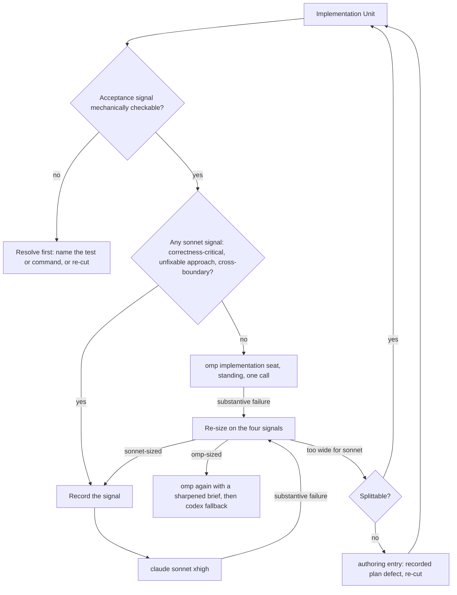
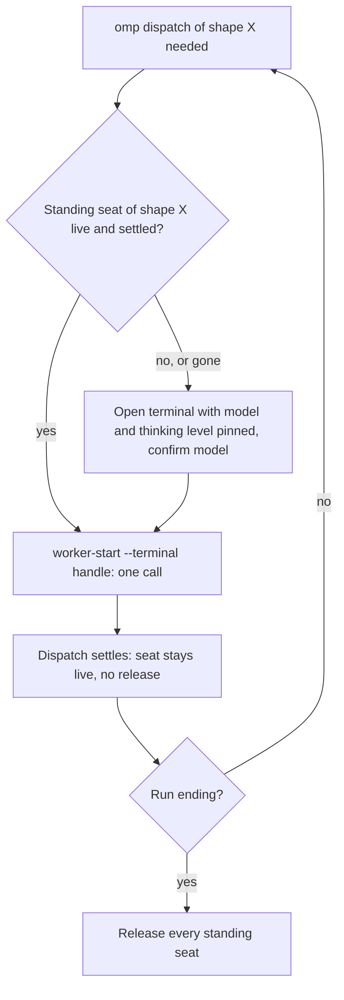

# Gemini-First Worker Roster - Plan

## Goal Capsule

- **Objective:** An Orca lead's implementation, prose, and mechanical work is carried out by the omp Gemini seat by default, and reaches a Claude worker only when the lead has recorded which signal sent it there, so the operator can read the dispatch policy off the worktree tree instead of discovering it from a screenshot.
- **Means:** Delete the `opus` worker rung, remove the two clauses that hand work back to the lead, define the implementation band that is currently empty, and make an omp dispatch cost the lead one call in the steady state (Key Decisions below; KTD1, KTD4, KTD5, KTD6).
- **Authority:** The operator's decisions in the originating session, recorded as Key Decisions below; the Product Contract is settled input and this plan supplies the how.
- **Execution profile:** five Implementation Units in one branch and one pull request, landed in the order U1 to U5 so that `chezmoi apply` renders at every unit boundary; units are dispatched under the coordinator rules in force when the run starts; CI on the pull request head is the acceptance gate.
- **Stop conditions:** a chezmoi render that fails at a unit boundary is a stop until the data and its consumers agree; a red CI on the pull request head is a stop until fixed; a Claude launch receipt that does not report the requested pair is recorded as degraded and is not a stop.
- **Tail ownership:** the implementation tail owns verification with the `.ci/test-*.sh` scripts against disposable fixtures, review fixes, commit, push, pull request, and the CI watch; no live `chezmoi apply` against the real home.
- **Open blockers:** None.

---

## Product Contract

### Summary

Rebuild the worker roster so the omp Gemini seat is the unmarked default recipient for implementation, prose, and mechanical work, remove the `opus` worker rung entirely, and split the two seats that serve two purposes at one effort — omp into a `low` scout seat and a `high` work seat, fable into a `max` authoring seat and a `medium` review seat. The Claude lead seat is untouched. The shared instruction core gains a rule that forbids agents from leaving their own deferred items unresolved.

### Problem Frame

The coordinator routing table already names the omp Gemini seat as the first recipient for mechanical work and for implementation Units below the `sonnet` rung. Across three active worktrees, not one omp worker seat exists. Three independent causes produce that result, and fixing any one alone leaves the others standing.

The first is an empty set. The sizing rule defines `sonnet` as a Unit whose approach the plan fixes, that stays inside one module and a few files, and whose acceptance a test or command settles — the smallest shape the rule describes. Nothing below it is defined, so the routing row that sends "Units the four signals place below `sonnet`" to omp has no members, and every sized Unit lands on the Claude row.

The second is that the payload assigns the lead the work itself. One sentence gives the lead dialogue, dispatch brief authoring, Markdown document authoring including prose files, repository reads, and verification, then requires it to dispatch only code edits and non-Markdown deliverables. A lead following that sentence correctly keeps every README and AGENTS prose Unit and every repository read for itself. That contradicts the dispatch-only objective this repository already adopted, under which every deliverable other than the lead's own coordination artifacts is produced by a worker. It also drives the cost shape below: each raw file the lead reads in place is re-read from cache on every later call of that session.

The third is launch ceremony. `worker-start --model` and `--effort` forward to Claude, Codex, and Cursor only, so an omp dispatch costs the lead a terminal create, a handle read, a model confirmation, and a `worker-start --terminal` — four calls against one. Over ten days `codex-luna`, a one-call launch sitting in the same fallback columns, took 496 sessions while the omp seat took zero. omp itself ran 632 sessions in that period, so the seat is reachable; it is not reachable cheaply enough to win a dispatch decision against a one-call neighbour.

The cost evidence points somewhere else, and this work should not be judged by the bill. Of $14,586 spent in ten days, $10,801 sits in 121 Claude sessions carrying more than 200K cached tokens per call — 74% of all spend and 88% of Opus spend, a shape only the `opus[1m]` lead seat can have. One session cost $4,124 at 540K tokens per call. The `opus` worker row this plan deletes accounts for at most $1,457, about 10% of spend. Opus token spend is 99.2% cache reads and 0.17% output, so its bill is driven by context re-read per call, not by dispatch count or effort.

Separately, this brainstorm produced three questions an agent would ordinarily park for planning to answer. Parking them is how an unresolved choice reaches an implementer who then guesses, so they are resolved here and the instruction core gains the rule that made resolving them mandatory.

### Key Decisions

- **The omp Gemini seat outranks `sonnet` for worker dispatches.** Gemini 3.8 Flash at high reasoning scores 74% on DeepSWE v1.1 and 89.4% on Terminal-Bench 2.1, so the default is justified on capability rather than only on price. (session-settled: user-directed — chosen over keeping Gemini below the `sonnet` rung: the row below `sonnet` has never had members) Governs R8, R9.
- **A deliverable's format never decides its recipient.** The Markdown carve-out was the mechanism by which prose Units returned to the lead. (session-settled: user-directed — chosen over keeping Markdown authoring as lead work: it contradicts the dispatch-only objective and grows the lead context that holds 74% of spend) Governs R16, R17, R18.
- **The `claude-opus` worker row is removed rather than narrowed.** (session-settled: user-directed — chosen over tightening its entry conditions and over swapping its model to fable: a bypass left in place is a bypass that gets taken) Governs R1, R10, R25.
- **The Claude lead seat stays on `opus[1m]`.** The largest cost lever is out of scope by the operator's choice, which is what bounds this plan's expected saving. (session-settled: user-directed — chosen over reopening the lead pin) Governs R27, and see Scope Boundaries.
- **One seat serving two purposes at one effort is split into two entries.** Applied to omp (scout versus work) and to fable (review versus authoring); both splits express a purpose difference the single-entry roster could not carry. (session-settled: user-directed) Governs R3, R4, R6, R7.
- **Fable review drops to `medium` while fable authoring stays at `max`.** The operator observes no quality difference at review and a real latency cost at `max`; fable is the one roster model whose cost is majority output tokens, so effort is its dominant lever. Authoring stays at `max` because its output is the input to every downstream worker. (session-settled: user-directed — chosen over a single fable effort for both purposes: review and authoring do not repay effort the same way) Governs R4, R23, R24.
- **A Unit too wide for the top rung is re-cut by the planner, never handed to a larger implementer.** (session-settled: user-approved — chosen over routing it to `gpt-5.6-luna` and over an Orca decision gate: a fallback promoted to a ceiling inverts the ladder, and a gate fires precisely in the unattended runs it must not stop) Governs R11, R12.
- **Ceremony, not policy alone, is treated as the thing to change.** A routing rule that leaves the omp launch at four calls against one will be re-litigated by the coordinator on every dispatch. (session-settled: user-approved) Governs R19, R20.
- **The standing seat rule is written to be correct whether or not Orca's terminal reuse tolerates a gap between Units.** A rule that depends on an undocumented reuse deadline would break on an Orca version bump with no failing test. (session-settled: user-approved — chosen over pinning the rule to an empirically measured reuse window) Governs R19.
- **An agent may not leave an item it deferred.** (session-settled: user-directed — chosen over allowing a Deferred to Planning class for agent-raised questions: a parked choice reaches an implementer who then guesses) Governs R29.

### Requirements

**Roster composition**

- R1. `.chezmoidata/agents.yaml` declares no `claude` worker on `opus`, and no worker carries `rung: opus`.
- R2. `claude-sonnet` is the only Claude implementation entry. It carries `rung: sonnet` at `effort: xhigh`.
- R3. The omp Gemini seat is declared as two entries on `google-antigravity/gemini-3.8-flash`: a `mechanical` entry at `low` and an `implementation` entry at `high`.
- R4. The Claude `fable` seat is declared as two entries: an `authoring` entry at `max` carrying the plan-authoring and approach-generation purpose, and a `judgment` entry at `medium` carrying code review, document review, `ce-pov`, and `ce-ideate`.
- R5. `codex-luna` is unchanged: `gpt-5.6-luna` at `max` effort with shapes `judgment` and `fallback`.
- R6. The shape vocabulary gains exactly one value, `authoring`, for the purpose in R4. Every other roster validation rule — unknown shape, duplicate id, empty brief, missing effort, rung uniqueness, the omp model prefix — is unchanged.
- R7. The roster carries six worker entries, each with its own brief.

**Dispatch routing and sizing**

- R8. The omp implementation entry is the first recipient for every Implementation Unit. A Claude worker receives one only when the lead records, before dispatch, which of the four signals sent it there; an unrecorded Claude implementation dispatch is a rule violation.
- R9. The sizing rule keeps its four signals and its existing sentences. Its lowest rung is the omp implementation seat, named inside the sizing paragraph rather than as a table-row exception, and `sonnet` is the only rung above it. The vacuous "below `sonnet`" clause is removed.
- R10. `sonnet` takes the band the `opus` rung held: a correctness-critical surface such as authentication, a schema or data migration, concurrency, money, or anything that can lose data; a plan that names an outcome but not an approach where the lead cannot fix the approach in the brief; or a change that crosses a module, process, or service boundary.
- R11. The top-rung sentence is preserved with `sonnet` as its subject: there is no higher rung to escalate to, so a Unit too wide for it is two Units and must be split rather than raised.
- R12. When the lead cannot split a Unit that R11 covers, it returns the Unit to the `authoring` entry as a recorded plan defect for a re-cut, and never to a larger implementer. The three-consecutive-failure rule bounds the loop; a re-cut that still yields an unsplittable Unit is a surfaced blocker, recorded in the pull request in an unattended run.
- R13. No Unit is dispatched to an omp seat without a mechanically checkable acceptance signal, so a Unit lacking one is resolved before it is dispatched.
- R14. A substantive failure on an omp seat re-sizes the Unit under the existing rule. A mechanical failure or a brief defect does not raise the rung.
- R15. A substantive failure on the omp mechanical seat is retried once on the omp implementation seat before the mechanical row leaves the agent, because the two seats are one model at two thinking levels and the cheaper explanation is insufficient thinking rather than the wrong agent. That retry changes effort within one agent, so it is not a rung raise and R14 stands.
- R16. The lead performs dialogue, dispatch brief authoring, verification commands, and its own coordination record. It authors no repository deliverable.
- R17. A deliverable's file format does not decide its recipient. A Markdown file in the repository — README, AGENTS, documentation prose, learnings, glossary — is a deliverable sized by the four signals and dispatched under R8, exactly like a code file.
- R18. A read whose content the lead needs to answer the user in conversation stays with the lead, because that content must be in the lead's own context to serve its purpose. Every other repository read is dispatched under F2.

**Dispatch mechanics**

- R19. An omp dispatch costs the lead one call in the steady state. The lead re-engages a standing omp seat of the needed shape when that seat is live and its previous Dispatch has settled, and opens a new one otherwise; the rule names no reuse deadline and stays correct whether or not Orca's reuse tolerates a gap.
- R20. An omp seat launch pins its roster entry's model and thinking level on the launch command itself, because `worker-start` cannot carry them for an omp row.
- R21. Every omp seat is released before the run ends, so no worker terminal outlives the run.

**Effort and settings**

- R22. `modelSettings.claude-sonnet-5.effortLevel` is `xhigh`, matching R2.
- R23. `modelSettings.claude-fable-5-1.effortLevel` follows the `authoring` entry's effort, because Compound Engineering's native elevation adapter outside Orca has no per-dispatch effort knob and that leaf is what it runs at.
- R24. The R4 review effort holds only while the judgment row carries a second cross-model reviewer. If that reviewer is removed, or a run records it as degraded, fable review effort returns to the `authoring` entry's effort for that run.

**Rendered output and parity**

- R25. No rendered payload names `opus` as a rung or as an implementation model, so the roster-to-payload parity check passes in both directions.
- R26. The derived omp `enabledModels` list contains each distinct omp model once, even though two roster entries now name the same model.
- R27. The committed prose describes six workers, states that this change's expected saving is bounded at roughly 10-15% of spend, and names the lead seat as the larger lever left out of scope.
- R28. Every consumer keeps its shape or rung lookup through the shared roster lookup. No settings map, payload, test, or prose file names a worker model by hand.

**Instruction core**

- R29. The shared instruction core states that an agent must not end a run leaving an item it deferred, and that a question, gap, or choice an agent raises during planning is resolved before that plan is executed. A blocker the user must decide remains the one acceptable incomplete state, unchanged from the existing rule.
- R30. Both omp roster briefs carry the prohibition on invoking the real `op` and on letting a render reach it, so every omp dispatch brief states it in the brief itself rather than relying on the worker reading the repository supplement.

- KTD13. **The real-`op` prohibition moves into the two omp briefs, because the repository supplement alone has not held.** `AGENTS.md` already states that an agent must not invoke the real `op` and must not let a render reach it, and omp reads that file; the observed failure is that the Gemini seat proceeds anyway. The roster `brief` field is the per-model guidance the coordinator renders into every dispatch brief, so stating it there puts the rule in the brief the worker is given rather than in a file it must choose to honor. Both omp entries carry it, because a mechanical read can trigger a render as easily as an implementation edit can. The wording names the stub and the scratch-PATH requirement as the only sanctioned route, and names a live secret in rendered output as the harm, since the brief guidance for this seat already asks for named thresholds and for what must never be invented. (session-settled: user-directed — chosen over relying on the existing `AGENTS.md` rule: Gemini models have ignored it) Governs R30.

### Key Flows

- F1. A deliverable Unit reaches a worker
  - **Trigger:** The lead has a sized Implementation Unit and an open run. The Unit may produce code or repository prose; the format does not change this flow (R17).
  - **Steps:** The lead sizes the Unit on the four signals (R9). Absent a recorded signal for `sonnet` (R8, R10), it checks the Unit has a mechanically checkable acceptance signal (R13) and re-engages the standing omp implementation seat (R19). A substantive failure re-sizes the Unit (R14); a Unit that re-sizes above `sonnet` is split, or returned to the planner (R11, R12).
  - **Outcome:** The Unit is carried out by the omp seat, or by `sonnet` with the signal recorded.
  - **Covered by:** R8, R9, R10, R11, R12, R13, R14, R17, R19

- F2. Mechanical work reaches a scout
  - **Trigger:** The lead needs a repository read, a symbol or file lookup, or a fixed-approach step a command settles, and the read is not one R18 leaves with the lead.
  - **Steps:** The lead re-engages the standing omp mechanical seat (R19, R20) rather than performing the read in its own context (R16). A substantive failure there is retried once on the implementation seat (R15).
  - **Outcome:** The read is carried out by a Gemini seat, and its raw content never enters the lead's context.
  - **Covered by:** R3, R15, R16, R18, R19, R20

- F3. Run ends
  - **Trigger:** Every Dispatch has settled.
  - **Steps:** The lead releases each standing omp seat (R21) alongside the workers it released at settlement.
  - **Outcome:** No worker terminal outlives the run.
  - **Covered by:** R21

### Acceptance Examples

- AE1. **Covers R8, R10.** Given a Unit whose plan fixes the approach and whose acceptance a test settles, when the lead sizes it, then it goes to the omp implementation seat and no signal record is written.
- AE2. **Covers R8, R10.** Given a Unit that changes an authentication path, when the lead sizes it, then it goes to `sonnet` and the run record names the correctness-critical signal before the dispatch.
- AE3. **Covers R16, R17.** Given a Unit whose deliverable is README and AGENTS prose, when the lead sizes it, then it is dispatched under R8 like any other Unit and the lead does not author it.
- AE4. **Covers R16, R18.** Given the lead needs the contents of three repository files to write a dispatch brief, when it obtains them, then it dispatches the reads to the mechanical seat; given instead the user asked a question those files answer, then the lead reads them itself.
- AE5. **Covers R11, R12.** Given a Unit the four signals place above `sonnet`, when the lead cannot cut it into two Units, then it returns to the `authoring` entry as a recorded plan defect and is not dispatched to `gpt-5.6-luna`.
- AE6. **Covers R13.** Given a Unit with no test or command that settles its acceptance, when the lead prepares to dispatch it, then the Unit is resolved before dispatch rather than sent to an omp seat.
- AE7. **Covers R14, R15.** Given a scout read that fails on the `low` seat because the seat did not finish it, when the lead classifies the failure as substantive, then it retries once on the `high` seat before reaching for `codex`, and the Unit's rung is unchanged.
- AE8. **Covers R19.** Given a run whose second Unit is also implementation-shaped and whose omp seat is live with its previous Dispatch settled, when the lead dispatches it, then it re-engages that terminal and does not create a second one; given the seat is gone, then it opens a new one without treating that as a failure.
- AE9. **Covers R24.** Given a judgment dispatch whose second cross-model reviewer is recorded as degraded, when the run reviews the same brief, then fable runs that review at the `authoring` entry's effort.
- AE10. **Covers R23.** Given a Compound Engineering plan-authoring elevation run outside Orca, when the native adapter dispatches fable, then it runs at the `authoring` entry's effort and not at the review effort.
- AE11. **Covers R29.** Given a planning run that raised a question the agent could decide, when that run ends, then the question is resolved in the artifact rather than recorded as deferred.

### Success Criteria

- The operator can see omp worker seats in the Orca worktree tree across active worktrees.
- Cached tokens per Unit in the lead session, read from the usage export, do not rise. This is the signal that matters: the failure mode this change can produce is a Gemini attempt whose retries, re-briefings, waits, and report reads are billed in the lead's own context at roughly 400K cached tokens per call, which can cost more than the `sonnet` attempt it replaced while the Opus session count falls.
- Total spend is explicitly not a success criterion. The lever that holds 74% of spend is out of scope by Key Decision.

### Scope Boundaries

- The Claude lead seat, its `[1m]` suffix, and lead session length are out of scope.
- `modelSettings.claude-opus-5.effortLevel` is out of scope; it serves direct sessions and fast mode, not a roster entry.
- `codex-luna` keeps its model, effort, and both shapes.
- The Codex lead seat is out of scope.
- The plan artifact itself stays with the `authoring` entry under R4; R17 governs repository deliverables, not the coordination artifacts R16 leaves with the lead.
- No upstream Orca change is in scope. The one-call omp dispatch in R19 is built from commands the installed Orca guide already sanctions.

### Dependencies / Assumptions

- Verified in session: Claude Code 2.1.274 accepts `xhigh` for `claude-sonnet-5` and applies it without silent downgrade; Orca `worker-start --effort xhigh` for a Claude launch reports `xhigh` in its launch receipt; `omp` accepts `--model` and `--thinking` with `low` and `high` on the launch command.
- An invalid effort value in a Claude settings leaf is dropped silently rather than rejected, so a typo produces a successful apply, green CI, and a different effective effort. A Claude Code version bump must re-check that `xhigh` is still in the effort enum, the same duty the `max` pin already carries.
- Gemini 3.8 Flash caps output at 64K tokens, below the other two worker models. A Unit whose deliverable exceeds that cap is a Claude-side Unit on capability grounds.
- An omp worker dispatched into this repository cannot read the committed project skills trees, so a brief must inline what a skill would otherwise supply.
- Gemini 3.8 Flash has no track record as a dispatched worker in this repository. The band it inherits under R8 and R17 has only ever run on Claude or on the lead.

### Outstanding Questions

None. Every question this brainstorm raised is resolved in the Requirements above; nothing is left for planning to decide.

### Sources / Research

- `.chezmoidata/agents.yaml` — the roster and the Claude and omp settings declarations.
- `.chezmoitemplates/orchestration-coordinator.tmpl` — the routing table, the four-signal sizing paragraph, the omp seat-selection sentence, and the lead-work sentence that R16, R17, and R18 rewrite.
- `.chezmoitemplates/agents-instructions.tmpl` — the shared instruction core R29 extends.
- `.chezmoitemplates/agent-roster-lookup.tmpl`, `.chezmoitemplates/agent-roster-validate.tmpl` — the shared lookup and the shape vocabulary R6 extends.
- `.chezmoiscripts/70-agents/run_after_config-omp-settings.sh.tmpl` — derives omp `enabledModels` and `modelRoles` from the roster; its background and skim roles already take the mechanical entry's model and effort, which is what makes R3 land without a template change, and its `enabledModels` append is what R26 must dedupe.
- `.ci/test-agent-roster.sh` — the bidirectional roster-to-payload model parity check behind R25 and R28, and the stale worker-count guard behind R27.
- `.ci/test-agent-instructions.sh` — the rule that bans naming `fable` as a sizing rung, which closes raising the ceiling to fable, and the ban on reintroducing climb-on-failure escalation, which closes making `sonnet` a failure-only destination.
- `.ci/test-claude-settings-reconcile.sh` — the parity assertion that R23 re-points from the judgment entry to the `authoring` entry.
- `docs/plans/2026-09-16-2329-feat-orca-lead-dispatch-only-model-roster-plan.md` — the dispatch-only lead objective that the current lead-work sentence contradicts.
- `docs/plans/2026-09-17-1930-feat-fable-max-effort-drop-flash-lite-plan.md` — the fable `max` decision R4 splits, and the flash-lite retirement that informs R15.
- Usage export `tokscale-export-20260917-144349.json`, ten days to 2026-09-17 — the cost figures in Problem Frame and Success Criteria.

---

## Planning Contract

- **Product Contract preservation:** Product Contract unchanged.

### Key Technical Decisions

- KTD1. **The split seats are four entries whose ids carry their shape, and the unchanged ids keep their original purpose.** The roster declares, in order, `claude-fable-authoring` (`fable`, `max`, `[authoring]`), `claude-fable` (`fable`, `medium`, `[judgment]`), `claude-sonnet` (`sonnet`, `xhigh`, `[implementation]`, `rung: sonnet`), `codex-luna` (unchanged), `omp-flash-mechanical` (`google-antigravity/gemini-3.8-flash`, `low`, `[mechanical]`), and `omp-flash` (the same model, `high`, `[implementation]`). The two existing ids keep the purpose they had (review, implementation) so the diff reads as two additions and attribute moves rather than four renames, and no consumer reads an id: every lookup is by agent plus shape or rung (`.chezmoitemplates/agent-roster-lookup.tmpl`), so either naming renders the same payloads. Each new entry carries its own brief per R7: the authoring brief names the single permitted write, the evidence-as-data and conventions-as-constraints split, and the no-deferred-item obligation of R29; the mechanical brief asks for one read or lookup per dispatch, verbatim excerpts with repo-relative paths and line numbers rather than summary, no edits, and the returned excerpt as the stop condition. `authoring` enters `$validShapes` in `.chezmoitemplates/agent-roster-validate.tmpl` line 34 and nothing else in the validator changes; the presence of an authoring entry is enforced by the shared lookup, which fails the render when no entry matches, exactly as it does for the judgment and fallback entries today. (session-settled: user-directed — chosen over one entry per seat at one effort: scout reads and implementation, and review and authoring, do not need the same thinking level) Governs R1, R2, R3, R4, R5, R6, R7.
- KTD2. **Four consumers move from the `judgment` lookup to the `authoring` lookup, the coordinator keeps its `judgment` lookup for the review row, and the `opus` lookup is deleted with the row.** The brief for this plan names three re-pointed call sites; the repository has four. The `claude`/`judgment` lookup resolves fable's effort in `.chezmoitemplates/orchestration-coordinator.tmpl` line 23 (the elevation paragraph at line 49 and the launch sentence at line 51), `.chezmoitemplates/agents-instructions.tmpl` line 31 (the elevation-default paragraph at line 33), `.ci/test-claude-settings-reconcile.sh` line 103 (the leaf parity wrapper), and `.ci/test-compound-engineering-overlays.sh` line 243, where the overlay's `EFFORT="max"` in `dot_local/share/compound-engineering-overlays/skills/ce-plan/scripts/executable_elevation-dispatch.sh` line 34 is held equal to the roster judgment effort. After the split the judgment effort is `medium` while both leaves stay `max`, so all four move to an `authoring` lookup; the overlay script itself does not change. The coordinator gains a `$authoring` lookup beside `$judgeClaude`: the judgment row (line 45) keeps rendering `$judgeClaude`, the elevation paragraph and the launch sentence render `$authoring`. The `$opus` lookup at line 27 fails the render the moment the roster has no `opus` rung, so its deletion and the rewrite of every `{{ $opus.rung }}` reference (routing row 3 at line 44, the sizing paragraph at line 55) land in the same unit as the roster row deletion. Governs R23, R25, R28.
- KTD3. **The routing table keeps four rows and re-cuts three of them.** Row 1 (mechanical) keeps its first recipient (`$mechanical`, now `low`); its substantive-failure cell becomes `omp` `$ompImpl` once, then `codex` `$fallback`, then `claude` `$sonnet.rung`, because R15 reinstates the retry the previous plan removed when the two omp shapes shared one seat; its agent-unavailable cell is unchanged. Row 2 becomes "Implementation Units of every deliverable format — code, frontend, and repository Markdown alike — that no recorded signal places at `$sonnet.rung`", first recipient `$ompImpl`; its substantive-failure cell reads "re-size on the four signals; at the same size, `omp` `$ompImpl` with a sharpened brief, then `codex` `$fallback`"; its agent-unavailable cell keeps `codex` `$fallback`, then `claude` at the rung the sizing gives, and the record names the unavailability in place of a signal so the R8 record still explains every Claude dispatch. Row 3 becomes "Implementation Units the lead has placed at `$sonnet.rung`, with the signal recorded before dispatch", first recipient `claude` at that rung; its substantive-failure cell reads "re-size on the four signals; a Unit too wide for `$sonnet.rung` is split, or returned to the `authoring` entry for a re-cut"; its agent-unavailable cell stays `codex` `$fallback`. Row 4 (judgment) keeps its text apart from moving brainstorm approach generation out of its work list, because R4 gives that purpose to the authoring entry, and keeps the literal pointer "the single-worker exception below" on the row line so the fold-back check at `.ci/test-agent-instructions.sh` lines 664-671 stays satisfied. `.ci/test-agent-roster.sh` line 320 keeps asserting four routing rows; line 322 moves to six brief rows. The everyone payload is untouched: its fallback anchor "after the Gemini row" (`.chezmoitemplates/orchestration-everyone.tmpl` line 38) still describes row 2. Governs R8, R10, R14, R15, R17.
- KTD4. **The sizing paragraph keeps every pinned fragment byte-identical except the one clause R10 contradicts, and names the omp implementation seat as its lowest rung.** The fragments `.ci/test-agent-instructions.sh` lines 626-635 pin stay as they are, each with a new subject: the omp implementation seat (`omp` `$ompImpl.model` `$ompImpl.effort`) "takes a Unit whose approach the plan fixes, that stays inside one module and a few files, and whose acceptance a test or a command settles" and takes every Unit the `sonnet` signals do not claim; `$sonnet.rung` "takes a Unit that keeps real design judgment inside its own bounds — ..." and "is the top rung: there is no higher one to escalate to, so a Unit too wide for it is two Units and MUST be split rather than raised". Four sentences are added: R10's qualifier that an outcome-only plan sends a Unit to `sonnet` only when the lead cannot fix the approach in the brief; R12's return to the `authoring` entry as a recorded plan defect, bounded by the three-consecutive-failure rule, with the surfaced-blocker outcome recorded in the pull request in an unattended run; R13's rule that a Unit without a mechanically checkable acceptance signal is resolved before dispatch and never sent to an omp seat; and R14 with R15's once-only retry on the omp implementation seat, stated as the one same-brief re-dispatch the paragraph permits because the seat changes while the rung does not, so it does not collide with "MUST NOT re-dispatch the same Unit at the same rung with the same brief". One pinned clause changes: "a Unit whose approach the plan fixes MUST NOT take that bypass" forbade opening a fixed-approach Unit on the top rung, which contradicts R10 now that `sonnet` is the top rung and takes a fixed-approach authentication Unit (AE2); it becomes "a Unit that trips none of the `sonnet` signals MUST NOT take that bypass", followed by R8's sentence that an unrecorded `claude` implementation dispatch is a rule violation, and the needle at line 630 moves with it. The rendered paragraph is one line that carries the word "rung" many times, so it never names `fable` in backticks; R12 refers to the `authoring` entry by shape, which keeps the `fable`-on-a-rung-line guards at `.ci/test-agent-roster.sh` lines 269-270 and `.ci/test-agent-instructions.sh` lines 660-662 green. (session-settled: user-directed — chosen over keeping Gemini below the `sonnet` rung: the row below `sonnet` has never had members; and user-approved — chosen over routing an unsplittable Unit to `gpt-5.6-luna` or an Orca decision gate: a fallback promoted to a ceiling inverts the ladder, and a gate fires in the unattended runs it must not stop) Governs R8, R9, R10, R11, R12, R13, R14, R15.
- KTD5. **The lead-work paragraph lists what the lead keeps and names format as irrelevant, and the plan-file sentence survives with its premise corrected.** Line 36 of the coordinator states that the lead performs dialogue, dispatch brief authoring, verification commands such as tests, builds, CI status, and git reads, and its own coordination record; that it authors no repository deliverable and MUST dispatch every repository deliverable to an Orca worker and MUST NOT make that edit itself; that a deliverable's file format does not decide its recipient, with README, AGENTS, documentation prose, learnings, and glossary named as deliverables sized by the four signals and dispatched under the implementation row exactly like a code file; and that a read whose content the lead needs to answer the user in conversation stays with the lead while every other repository read goes to the mechanical row rather than into the lead's context. The sentences "This boundary binds any Orca lead, whatever harness or model answers as it.", "A session that received no orchestration injection is not a lead: it keeps its existing behavior and edits and authors directly.", "No PreToolUse hook enforces any of this." and the shell-launch-guard sentence stay byte-identical. The sentence "The one Markdown file the lead does not write is the plan file a dispatched model-elevation worker authors" rested on the Markdown carve-out; it becomes a statement that the plan file a dispatched model-elevation worker authors is that worker's single permitted write, which the lead reads and validates instead of writing, so the Scope Boundaries' placement of the plan artifact with the authoring entry stays in the payload. The four needles at `.ci/test-agent-instructions.sh` lines 558-560 and 575 move to the new sentences. (session-settled: user-directed — chosen over keeping Markdown authoring as lead work: it contradicts the dispatch-only objective and grows the lead context that holds 74% of spend) Governs R16, R17, R18.
- KTD6. **An omp seat is launched once per shape per run with its model and thinking level pinned on the launch command, re-engaged with one call while it stands, kept outside the same-turn release rule, and released before the run ends.** The seat-selection sentence at coordinator line 53 keeps its two-branch template conditional and its pinned fragments (`.ci/test-agent-instructions.sh` lines 622-625), and the committed roster now renders the two-seat branch ("`gemini-3.8-flash` at `low` for mechanical work, `gemini-3.8-flash` at `high` otherwise"). The first launch of a seat is the ceremony the Problem Frame counts, paid once: the lead opens the Orca terminal with the roster entry's model and thinking level as arguments of the omp command it runs (`terminal create` with `--command` and `--json` returns the handle in the same call, so the handle read is not a separate call), confirms the model from the terminal, and dispatches with `worker-start --terminal <handle>`. Every later dispatch of the same shape re-engages that terminal with `worker-start --terminal <handle>` alone when the seat is live and its previous Dispatch has settled; a seat that is gone is replaced by a fresh launch that counts as no failure, advances no row, and adds nothing to the three-consecutive-failure count, which is what keeps the rule correct whether or not Orca's reuse tolerates a gap. A standing seat is therefore not released at its Dispatch's settlement: the mechanical and implementation rows sit outside the review-and-peer contract at coordinator line 66, whose same-turn release rule keeps binding a judgment dispatch an omp seat takes as a replacement reviewer. The accepted cost is that the Orca app shows a standing seat as running between Units. Before the run ends every standing omp seat is released, and the end-of-run residency check at line 66 already proves it. The exact terminal-launch spelling stays with the version-matched Orca guide, as the pinned sentence says. (session-settled: user-approved — chosen over a routing rule alone: a launch that stays at four calls against one is re-litigated on every dispatch; and user-approved — chosen over pinning the rule to a measured reuse window: an undocumented deadline breaks on an Orca bump with no failing test) Governs R19, R20, R21.
- KTD7. **Reviewers select the judgment pair, the elevation worker selects the authoring pair, and the review effort falls back to the authoring effort when the second reviewer is missing.** The elevation paragraph at coordinator line 49 sends the single worker to the `claude` `authoring` entry whose model matches the resolved alias, "launched with `--model {{ $authoring.model }} --effort {{ $authoring.effort }}`", and states that a Unit the sizing cannot split returns to this same entry as a recorded plan defect for a re-cut (R12). The launch sentence at line 51 says that every `claude` launch from the judgment row selects `--model {{ $judgeClaude.model }} --effort {{ $judgeClaude.effort }}` and the elevation worker selects the authoring pair, then keeps the receipt clause verbatim: the lead compares `launch.requested` with `launch.effective`, claims the pair only when the effective fields report it, and otherwise records the pass as degraded with the effective values or their absence. One sentence after it carries R24: the `claude` reviewer's judgment effort holds while the `codex` reviewer stands beside it, and when that reviewer is removed or a run records it as degraded, the `claude` reviewer runs at `{{ $authoring.effort }}` for that run. Neither line carries the word "rung", because both render `fable`. `.ci/test-agent-roster.sh` builds the two launch anchors from two seat renders (`claude judgment`, `claude authoring`) and proves on a stub with distinct efforts that the elevation line follows the authoring seat and the launch sentence follows the judgment seat. (session-settled: user-directed — chosen over a single fable effort for both purposes: review and authoring do not repay effort the same way) Governs R4, R12, R23, R24.
- KTD8. **The omp reconciler dedupes `enabledModels` with sprig's `uniq` after the append loop, and the mechanical selector now differs from the implementation selector.** In `.chezmoiscripts/70-agents/run_after_config-omp-settings.sh.tmpl` lines 11-17, the loop appends every omp model and `uniq` collapses the list, so the first occurrence keeps roster order and two entries on one model render one element. `uniq` is the idiom this repository already uses for the same job at `.chezmoiscripts/30-components/run_onchange_before_10-nvidia.sh.tmpl` line 89, and it replaces a hand-rolled membership guard with no change in behavior. The two selectors at lines 17-20 already read the mechanical and implementation entries by shape, so `tiny`, `skim`, and `smol` render `google-antigravity/gemini-3.8-flash:low` and every other model-valued role `google-antigravity/gemini-3.8-flash:high` with no further template change; `advisor`, `commit`, and `plan` keep their `@` aliases. `.chezmoitemplates/omp-settings-validate.tmpl` does not reject a duplicate, so the guard is a test-level fix, not a render fix: the exact-list assertion at `.ci/test-omp-settings-reconcile.sh` line 129 is what a duplicate would fail. The catalog probe at lines 177-194 now checks both entries' thinking levels, and the full catalog fixture at line 278 already lists `low`. Governs R3, R26, R28.
- KTD9. **The Claude settings leaves move with the roster, and the fable leaf's parity target becomes the authoring entry.** `modelSettings.claude-sonnet-5.effortLevel` becomes `xhigh` and `modelSettings.claude-fable-5-1.effortLevel` stays `max`, now because it mirrors the `authoring` entry's effort; the comment at `.chezmoidata/agents.yaml` lines 287-294 says so, and `.ci/test-claude-settings-reconcile.sh` lines 84-125 assert the new leaf values and render the parity through the `authoring` lookup, with the negative fixture overriding an `authoring` entry to `high` so the guard still proves it can fail. The sonnet leaf also governs direct `sonnet` sessions outside Orca, which the change accepts. The `claude-opus-5` leaf is out of scope and keeps `medium`. (session-settled: user-directed — chosen over leaving `claude-sonnet` at `high`: sonnet becomes a rare exception path, so fewer and harder dispatches justify the documented coding sweet spot) Governs R2, R22, R23.
- KTD10. **The instruction core's elevation default follows the authoring entry, and R29 lands at the end of the blocker paragraph as a needle-bound sentence.** `.chezmoitemplates/agents-instructions.tmpl` line 31 looks up `claude`/`authoring`; the paragraph at line 33 renders that entry's model as the default alias and "launches the elevation entry at its roster effort `{{ $authoring.effort }}`", which keeps the existing needle for `max` at `.ci/test-agent-instructions.sh` line 430 true. The R29 sentence closes the paragraph at line 126, after "A user-acknowledged blocker is the only acceptable incomplete state; never silently defer to TODO/FIXME, "known limitation," or follow-up.": an agent MUST NOT end a run leaving an item it deferred, and a question, gap, or choice an agent raises during planning MUST be resolved in the plan before that plan is executed; a blocker the user must decide remains the one acceptable incomplete state. That paragraph is needle-bound, not fixture-bound, so no file under `.ci/fixtures/agent-instructions/` changes; the new sentence gets a positive needle beside the ones at lines 433-440. The rule is stated once, in the instruction core; this plan's own conventions already apply it. (session-settled: user-directed — chosen over a Deferred to Planning class for agent-raised questions: a parked choice reaches an implementer who then guesses) Governs R23, R29.
- KTD11. **Test stubs mirror the six-entry shape, `opus` survives only as the lead model, and every committed value is asserted from a render.** Every stub roster that renders the coordinator or the instruction core (`.ci/test-agent-roster.sh` lines 355-360, 385-389, 404-409; `.ci/test-agent-instructions.sh` lines 676-680) drops `claude-opus`, gains a `claude` `authoring` entry, and splits omp into a mechanical and an implementation entry, because the coordinator and the instruction core now fail the render without an authoring entry. The two validator fixtures that prove rung uniqueness (`.ci/test-agent-roster.sh` lines 126-142) keep proving it with a visibly fake second rung and model instead of `opus`, following the fake-id convention the previous plan set. The one-seat branch of the seat-selection sentence stays proven by a new stub whose single omp entry carries both shapes, while the committed roster asserts the two-seat branch; the counts at lines 60 and 322 become six. The stale-count guard at lines 457-465 rejects "five worker" and "seven worker" and stops rejecting "six worker", and that flip lands in the prose unit so the guard and the prose it reads move together. Governs R6, R7, R25, R28.
- KTD12. **The committed prose names six workers, carries the saving bound in AGENTS.md, and never writes the lead model as a bare `opus`.** `README.md` line 299 and `AGENTS.md` line 74 describe the roster as KTD1 declares it and the elevation dispatch as KTD7 routes it; AGENTS.md also states that the expected saving is bounded at roughly 10-15% of spend and that the `opus[1m]` lead seat is the larger lever left out of scope (R27). The prose scan at `.ci/test-agent-roster.sh` lines 233-243 and 434-443 admits roster aliases and lead models only, and `opus[1m]` is the lead model while a backticked bare `opus` is no longer any roster model, so both files stop naming `opus` in backticks. `CONCEPTS.md` is prose too and three of its entries turn false: "Model roster" (lines 65-66) names `opus` as a rung, "Judgment work" (lines 68-69) routes the elevation step to the judgment entry, and "Mechanical work" (lines 71-72) says the mechanical seat can be the same seat as cheap implementation; they are corrected, an "Authoring work" entry is added for the new shape, and the "Launch ceremony" entry already in the working tree (lines 74-75) is finished so that its omp clause describes the once-per-seat launch of KTD6. Governs R27.

### High-Level Technical Design

The dispatch decision after this change, as the coordinator payload states it:

The omp seat lifecycle inside one run:

### Assumptions

- `orca terminal create --json` returns the terminal handle in the create call, and `worker-start --terminal <handle>` can re-engage a terminal whose previous Dispatch settled; the worker preamble Orca injects states that a coordinator "will re-engage this terminal with a fresh preamble", and AE8 covers the case where it cannot.
- The Orca app's rendering of a standing seat as running between Units is cosmetic and accepted.
- Compound Engineering's native adapter, a Claude Code subagent with `model: fable`, runs at `modelSettings.claude-fable-5-1.effortLevel`; this is read from the adapter reference, not observed in a run, and no receipt reports the effort on that route.
- `.ci/test-orchestration-hook.sh` renders the payload wrappers fresh and diffs them against the hook binary's `print-payload` output read from the same path (lines 275-284), so a payload text change needs no binary rebuild and no digest update.
- The Claude and Codex plugin manifests re-version from the changed payload digest without an edit, as `.ci/test-agent-roster.sh` lines 467-488 already prove for a roster change.

### Risks and Dependencies

- The band R8 and R17 give to Gemini has only ever run on Claude or on the lead; the Success Criteria's cached-tokens-per-Unit reading is the signal that a Gemini attempt is being paid for in the lead's own context, and it is read after merge, not in CI.
- A needle-pinned sentence in the sizing paragraph contradicted R10 and is rewritten (KTD4); a reviewer comparing the rendered paragraph against the old test will see one moved needle and should read it as intended.
- The brief for this plan named three `judgment` lookups to re-point; the fourth, in the overlay test, would have failed CI at the pull request head if missed (KTD2).
- A standing seat's `worker-start --terminal` on a terminal Orca has since closed returns a launch failure; KTD6 classifies it as a fresh launch, not a mechanical failure, and the coordinator payload must say so or the three-consecutive-failure count absorbs it.
- The `xhigh` sonnet leaf and the `max` fable leaf both depend on the Claude Code effort enum; an invalid value is dropped silently (Dependencies / Assumptions), so a Claude Code bump re-checks both.
- Between U2 and U4 the roster, instructions, Claude reconcile, omp reconcile, and overlay tests are red on the assertions U4 rewrites; the render stays green at every boundary, and CI is judged at the pull request head.

### System-Wide Impact

- Every managed harness instruction file (`~/.claude/CLAUDE.md`, `~/.codex/AGENTS.md`, `~/.omp/agent/AGENTS.md`) gains the R29 sentence and the authoring-entry elevation default on the next apply.
- The coordinator payload every Orca lead receives changes its routing table, sizing rule, lead-work rule, seat rule, and launch rules; a lead session must restart to receive it, and a roster change is applied with no active dispatches, as `AGENTS.md` line 74 already says.
- omp's live `~/.omp/agent/config.yml` moves `tiny`, `skim`, and `smol` to `gemini-3.8-flash:low`; the Claude `settings.json` moves `claude-sonnet-5` to `xhigh` for every sonnet session, Orca-dispatched or direct.
- Both dotfiles plugin manifests re-version from the payload digest; the orchestration hook binary reads the rendered payload files at runtime and is not rebuilt.

### Sequencing

U1 lands first: it is render-safe on the single-entry roster and keeps the omp reconcile test's exact-list assertion green when U2 splits the seat. U2 lands as one unit because its three files are render-coupled: an `authoring`-shaped entry fails the validator until the vocabulary carries it, a deleted `opus` row fails the coordinator's lookup until that lookup is deleted, and the coordinator's `$authoring` lookup fails until the entry exists. U3 follows U2 for the same reason: its `authoring` lookup needs the entry, and before U3 the instruction core renders the judgment pair, which is wrong but renders. U4 follows U2 and U3 because its needles, anchors, and stubs describe their rendered text. U5 is last because the stale-count guard and the prose it reads must move together, and the prose describes the contract U2 and U3 render.

---

## Implementation Units

### U1. Dedupe the derived omp `enabledModels` and prove it with two entries on one model

- **Goal:** the omp reconciler lists each distinct omp model once, in roster order, and its test proves that two entries on one model at two thinking levels render one `enabledModels` element and two role selectors.
- **Requirements:** R26, R28 (KTD8).
- **Dependencies:** none. Sits first because the guard is a no-op on the current single-entry roster, so the unit is render-safe and test-green alone, and because U2's split would otherwise render a duplicate element that the exact-list assertion at `.ci/test-omp-settings-reconcile.sh` line 129 rejects.
- **Files:** `.chezmoiscripts/70-agents/run_after_config-omp-settings.sh.tmpl` (lines 1-16), `.ci/test-omp-settings-reconcile.sh` (lines 605-640 and a new stub beside the swapped roster).
- **Approach:**
  1. Guard the append at lines 11-16 with a membership test on `$ompModels`, so a model already listed is skipped and the first occurrence keeps roster order.
  2. Extend the header comment (lines 1-10) with the two-entries-one-model case: one `enabledModels` element, two selectors.
  3. Add a stub roster with a mechanical entry at `low` and an implementation entry at `high` on one visibly fake model, render the reconciler against it the way the swapped roster at lines 620-631 is rendered, and assert `enabledModels` equals exactly that one model, `tiny` carries the `:low` selector, and `default` carries the `:high` selector.
  4. Tighten the swapped-roster assertion at lines 635-640 from membership to the exact two-element list in roster order.
- **Patterns to follow:** the swapped-roster render and `declared_of` extraction at lines 605-640; the `has` guard shape in `.chezmoitemplates/agent-roster-validate.tmpl` lines 72-75.
- **Test scenarios:**
  - The committed roster still renders `enabledModels` as exactly `["google-antigravity/gemini-3.8-flash"]` and every role expectation at lines 133-154 unchanged.
  - The two-entries-one-model stub renders one `enabledModels` element, `tiny` at `:low`, and `default` at `:high`.
  - The swapped roster with two distinct models renders both, in roster order.
- **Verification:** `.ci/test-omp-settings-reconcile.sh` passes against a reconciler rendered from the unchanged roster.

### U2. Declare the six-entry roster and carry it through the validator and the coordinator payload

- **Goal:** the roster declares six entries and no `opus` rung, the validator admits `authoring`, the Claude settings leaves match the roster, and the coordinator payload renders the new routing table, sizing rule, lead-work rule, standing-seat rule, elevation and launch rules, and review-effort fallback with no `opus` and no failed lookup.
- **Requirements:** R1, R2, R3, R4, R5, R6, R7, R8, R9, R10, R11, R12, R13, R14, R15, R16, R17, R18, R19, R20, R21, R22, R24, R25, R28 (KTD1, KTD2, KTD3, KTD4, KTD5, KTD6, KTD7, KTD9).
- **Dependencies:** U1. Its three files land together: the roster row deletion, the `authoring` vocabulary, and the coordinator's lookup changes are each a render failure without the others (Sequencing).
- **Files:** `.chezmoidata/agents.yaml` (lines 18-70, 287-294, 304-306, 372-378), `.chezmoitemplates/agent-roster-validate.tmpl` (line 34), `.chezmoitemplates/orchestration-coordinator.tmpl` (lines 21-27, 36, 40-45, 47-53, 55).
- **Approach:**
  1. Roster: declare the six entries of KTD1 in that order with their briefs; delete `claude-opus` and its brief; set `claude-sonnet` to `xhigh`; set `modelSettings.claude-sonnet-5.effortLevel: xhigh`; reword the comment above the leaves so the fable leaf mirrors the `authoring` entry; reword the omp derivation comment (lines 372-378) for two entries on one model and a deduped `enabledModels`.
  2. Validator: add `authoring` to `$validShapes`; change nothing else.
  3. Coordinator lookups: delete `$opus`; add `$authoring` (`claude`, shape `authoring`, name "a claude authoring entry"); keep the other six.
  4. Lead-work paragraph (line 36): rewrite per KTD5, keeping the five sentences KTD5 lists byte-identical.
  5. Routing table (lines 40-45): rewrite rows 1 to 3 and the judgment row's work list per KTD3; keep four rows and the pointer phrase on the judgment row.
  6. Elevation paragraph, launch sentence, and the R24 sentence (lines 49-51): per KTD7; keep "goes to that entry, launched with `--model" and the receipt clause verbatim; keep "rung" off both lines.
  7. Seat-selection sentence (line 53): per KTD6; keep the template conditional and the four pinned fragments; add the once-per-seat launch, the one-call re-engagement, the gone-seat rule, the release-timing carve-out, and the end-of-run release.
  8. Sizing paragraph (line 55): per KTD4; keep every fragment at `.ci/test-agent-instructions.sh` lines 626-635 byte-identical apart from the bypass clause, add the four sentences KTD4 lists, and keep `fable` off the line.
  9. Comments in the data file: correct every comment the change makes false, keep the ones that record a constraint, add none that restates the data.
- **Patterns to follow:** the lookup call shape at coordinator lines 21-26; the Codex launch rule at `.chezmoitemplates/orchestration-everyone.tmpl` line 38 for the pair-selection wording; the brief-guidance wording of the existing entries at `.chezmoidata/agents.yaml` lines 24-29 and 66-70.
- **Test scenarios:**
  - A validator render of the committed roster prints six model ids: `fable` twice, `sonnet`, `gpt-5.6-luna`, and `google-antigravity/gemini-3.8-flash` twice.
  - The rendered coordinator carries no template action, no backticked `opus`, four routing rows, six brief rows, `--model fable --effort max` on the elevation line, `--model fable --effort medium` on the launch line, `google-antigravity/gemini-3.8-flash` `low` as the mechanical row's first recipient and `high` as the implementation row's, and the two-seat branch of the seat-selection sentence.
  - No line of the rendered coordinator contains both "rung" and a backticked `fable`.
  - The everyone payload renders unchanged.
- **Verification:** `chezmoi execute-template` renders, against a scratch config and the stub `op` the CI scripts use, of the validator wrapper, the coordinator wrapper, the everyone wrapper, `dot_claude/readonly_CLAUDE.md.tmpl`, and both settings reconcilers succeed; `.ci/test-agent-roster.sh` and `.ci/test-agent-instructions.sh` fail only on the assertions U4 rewrites.

### U3. Re-point the instruction core's elevation default at the authoring entry and add the no-deferred-item rule

- **Goal:** the elevation default and the outside-Orca effort statement follow the `authoring` entry, and every managed harness instruction file carries R29.
- **Requirements:** R23, R28, R29 (KTD2, KTD10).
- **Dependencies:** U2, because the `authoring` lookup fails the render until the entry exists; render-safe after U2, and before it the paragraph renders the judgment pair, which is wrong but renders.
- **Files:** `.chezmoitemplates/agents-instructions.tmpl` (lines 31, 33, 126).
- **Approach:**
  1. Replace the `judgment` lookup at line 31 with an `authoring` lookup.
  2. In the paragraph at line 33, render the authoring entry's model as the default alias and its effort in the Orca-managed sentence; keep the sentence about the native adapter and the CLI adapter, both held at the same value.
  3. Append the R29 sentence to the end of the paragraph at line 126, after the user-acknowledged-blocker sentence, in the wording KTD10 gives.
  4. Touch no fixture-bound section: the `lfg`, workflow-required, waiting, harness-runs, and harness-is texts stay byte-identical.
- **Patterns to follow:** the RFC 2119 sentence rhythm of the paragraph at line 126; the existing lookup call at line 31.
- **Test scenarios:**
  - Each of the three harness renders carries "launches the elevation entry at its roster effort `max`" and the R29 sentence.
  - Each render's fixture-bound sections still equal their fixtures under `.ci/fixtures/agent-instructions/`.
- **Verification:** `chezmoi execute-template` renders of `dot_claude/readonly_CLAUDE.md.tmpl` and the Codex and omp instruction wrappers succeed; `.ci/test-agent-instructions.sh` fails only on its stub roster, which U4 rewrites.

### U4. Re-point the CI gates at the six-entry roster

- **Goal:** the four roster-reading tests and the overlay test assert the new roster from renders, their stubs mirror its shape, and they prove that the split seats resolve independently.
- **Requirements:** R6, R7, R22, R23, R25, R26, R28 (KTD2, KTD7, KTD8, KTD9, KTD11).
- **Dependencies:** U2 and U3, whose rendered text the needles, anchors, and stubs describe.
- **Files:** `.ci/test-agent-roster.sh` (lines 54-60, 126-142, 292-307, 322, 338-346, 355-360, 380-417), `.ci/test-agent-instructions.sh` (lines 433-440, 558-560, 575, 630, 639, 673-688), `.ci/test-claude-settings-reconcile.sh` (lines 80-125), `.ci/test-omp-settings-reconcile.sh` (lines 133-154, 275-303, 378-388), `.ci/test-compound-engineering-overlays.sh` (lines 238-256).
- **Approach:**
  1. Roster test: set the id count to six and the brief-row count to six; replace `opus` in the two rung-uniqueness fixtures with a visibly fake rung and model; assert the committed roster renders the two-seat branch and not the one-seat phrase, and add a single-omp-entry stub that renders the one-seat phrase; add a `claude authoring` seat-pair render and assert the elevation line carries its pair while the launch line carries the judgment pair; in the two-seat Codex stub, the AE9 stub, and the two-entry omp stub, drop `claude-opus`, add an authoring entry, and split omp; in the AE9 stub give the authoring entry `low` and the judgment entry `high` and assert `--effort low` on the elevation line, `--effort high` on the launch line, and no `--effort max`.
  2. Instructions test: move the lead-work needles at lines 558-560 and 575 to KTD5's sentences and add one for the R18 read rule; move the bypass needle at line 630 to KTD4's clause and add one for the R8 violation sentence; move the needle at line 639 to the receipt clause alone and add needles for the judgment-pair and authoring-pair fragments and the R24 sentence; add a needle for the R29 sentence beside lines 433-440; give the stub roster an authoring entry on a fake model at a distinct effort and a judgment entry on a different fake model, drop `claude-opus`, split omp, and assert the paragraph resolves the authoring model and effort and does not resolve the judgment model.
  3. Claude reconcile test: expect `xhigh` for the sonnet leaf; render the parity through the `authoring` lookup; make the negative fixture an `authoring` entry at `high`; reword the comments at lines 80-94.
  4. omp reconcile test: expect `google-antigravity/gemini-3.8-flash:low` for `skim`, `smol`, and `tiny`; in the thinking-gap case assert the warning names `high` and not `low`, so the probe is shown to read each entry's own effort.
  5. Overlay test: render the `authoring` entry's effort instead of the judgment entry's, rename the variables, and keep the upstream reconstruction and digest check as they are.
- **Patterns to follow:** the seat-pair helper at `.ci/test-agent-roster.sh` lines 278-286 and the two-seat Codex anchors at lines 324-378; the roster-built needles at `.ci/test-agent-instructions.sh` lines 642-655; the parity offender helper at `.ci/test-claude-settings-reconcile.sh` lines 95-125.
- **Test scenarios:**
  - `.ci/test-agent-roster.sh`: the id set the payloads render equals the roster id set in both directions; four routing rows and six brief rows; the committed two-seat phrase and the stub one-seat phrase both render; the AE9 stub renders the fake omp model, drops `gemini-3.8-flash`, and renders `--effort low` and `--effort high` on their own lines; the two-entry omp stub renders the fake mechanical model in the mechanical row and the two-seat branch.
  - `.ci/test-agent-instructions.sh`: every needle matches on both OS branches; the stub-roster render resolves the authoring model and effort; every BANNED phrase is absent from every render.
  - `.ci/test-claude-settings-reconcile.sh`: the declared fable leaf equals the rendered `authoring` effort and the sonnet leaf is `xhigh`; the `authoring`-at-`high` override makes the parity guard fail.
  - `.ci/test-omp-settings-reconcile.sh`: the three background roles carry `:low`, the others `:high`; the thinking-gap warning names `high` only.
  - `.ci/test-compound-engineering-overlays.sh`: the overlay's `EFFORT` equals the rendered `authoring` effort and the reconstructed upstream digest still matches.
- **Verification:** the five tests pass; `.ci/test-orchestration-hook.sh` and `.ci/test-claude-codex-plugin-reconcile.sh` pass because the coordinator body is a digest input; `.ci/test-agent-roster.sh` fails only on the stale-count guard until U5.

### U5. Describe the six-entry roster in the committed prose and flip the stale-count guard

- **Goal:** `README.md`, `AGENTS.md`, and `CONCEPTS.md` describe the roster and the dispatch contract as they now render, and the roster test's stale-count guard rejects the retired count.
- **Requirements:** R27 (KTD11, KTD12).
- **Dependencies:** U4. Last, because the guard flip at `.ci/test-agent-roster.sh` lines 457-465 edits a file U4 edits, and because "six worker" in prose before the flip and the flip before the prose each fail the roster test, so both move here.
- **Files:** `README.md` (line 299), `AGENTS.md` (line 74), `CONCEPTS.md` (lines 65-75), `.ci/test-agent-roster.sh` (lines 457-465).
- **Approach:**
  1. README: "five worker models" becomes "six worker models"; list Claude authoring on `fable` at max effort, Claude judgment on `fable` at medium effort, Claude implementation on `sonnet` at xhigh effort, Codex judgment and fallback on `gpt-5.6-luna`, and omp mechanical work at low and implementation at high on `google-antigravity/gemini-3.8-flash`; say elevation defaults to the authoring entry's model; drop the `opus` implementation clause.
  2. AGENTS: "five worker entries" becomes "six worker entries" with the six entries and efforts; the fable leaf mirrors the authoring entry; `tiny`, `skim`, and `smol` map to the mechanical entry at `low` and every other model role to the implementation entry at `high`, two entries on one model that `enabledModels` lists once; the omp seat is launched once per shape per run with the entry's model and thinking level pinned on the launch command, re-engaged with `worker-start --terminal` while it stands, and released before the run ends; the elevation worker goes to the `authoring` entry; the omp implementation seat is the first recipient of implementation, prose, and mechanical work and a Claude worker takes a Unit only with a recorded signal; add that the expected saving is bounded at roughly 10-15% of spend and that the `opus[1m]` lead seat is the larger lever left out of scope.
  3. CONCEPTS: in "Model roster", the rung parenthetical names `sonnet` for the one Claude implementation entry; in "Judgment work", remove brainstorm approach generation and the elevation step and their routing clause; add "Authoring work" for plan authoring and approach generation, dispatched as one worker to the `authoring` entry, with the inline fallback and the re-cut return; in "Mechanical work", say the mechanical seat is the implementation model at a lower thinking level; in "Launch ceremony", describe the omp launch as paid once per seat per run.
  4. Guard: reject "five worker" and "seven worker"; stop rejecting "six worker".
  5. Write the lead model only as `opus[1m]` and never as a backticked bare `opus`, because the prose scan admits lead models and roster aliases only.
- **Patterns to follow:** the sentence rhythm of the two existing paragraphs; the glossary entry shape in `CONCEPTS.md` lines 62-75.
- **Test scenarios:**
  - Test expectation: none beyond the roster test — prose only; its prose scan and stale-count guard cover it.
- **Verification:** `.ci/test-agent-roster.sh` passes, so every backticked model id the two scanned files name is a roster alias or a lead model and neither says "five worker" or "seven worker".

### U6. State the real-`op` prohibition in both omp briefs

- **Goal:** every omp dispatch brief the coordinator renders tells the seat not to invoke the real `op` and not to let a render reach it, with the stub-and-scratch-PATH route named as the only sanctioned one.
- **Requirements:** R30 (KTD13).
- **Dependencies:** U2, which declares the two omp entries. Order-independent against U4 and U5, because the roster test counts brief rows and does not read their text.
- **Files:** `.chezmoidata/agents.yaml` (the `brief` blocks of `omp-flash-mechanical` and `omp-flash`).
- **Approach:**
  1. Add the prohibition to the `omp-flash-mechanical` brief, beside its existing forbid-edits clause: never run the real `op`, never let a render reach it, and use the stub `op` on a PATH naming only the stub and the system directories.
  2. Add the same prohibition to the `omp-flash` brief under its tool-policy clause, naming a live secret in rendered output as the harm.
  3. Keep both briefs in the imperative, brief-guidance voice the other entries use, and keep each one a short block rather than a paragraph.
- **Patterns to follow:** the existing brief wording of the two omp entries; the rule's own statement at `AGENTS.md` line 83 for the facts, quoted as guidance rather than copied whole.
- **Test scenarios:**
  - Test expectation: none beyond the roster test — the brief text is data the coordinator renders, and `.ci/test-agent-roster.sh` already asserts six brief rows and that the payload carries every roster entry.
- **Verification:** the coordinator payload renders six brief rows and both omp rows carry the prohibition; `.ci/test-agent-roster.sh` passes.

---

## Verification Contract

Every check renders with the pinned chezmoi binary against a scratch config and the stub `op` the CI scripts create; none touches the real home. The reconcilers are rendered the way `.github/workflows/ci.yml` lines 55-70 do, with `chezmoi execute-template` into a scratch file, before their tests run.

| Check | Command | Applies to | Done signal |
|---|---|---|---|
| Roster validator render | `chezmoi execute-template` of a wrapper that includes `agent-roster-validate.tmpl` on the committed data | U2 | six model ids, none `opus` |
| omp settings derivation and catalog probe | `.ci/test-omp-settings-reconcile.sh <rendered omp-settings.sh>` | U1, U2, U4 | exit 0; one enabled model; background roles at `:low` |
| Claude settings leaves and authoring parity | `.ci/test-claude-settings-reconcile.sh <rendered claude-settings.sh>` | U2, U4 | exit 0; sonnet `xhigh`; fable leaf equals the `authoring` effort |
| CLI elevation overlay parity | `.ci/test-compound-engineering-overlays.sh <repo-root>` | U4 | exit 0 |
| Roster parity, seat anchors, table counts, prose scan | `.ci/test-agent-roster.sh` | U2, U4, U5 | exit 0 |
| Instruction files and payload needles | `.ci/test-agent-instructions.sh` | U3, U4 | exit 0 on both OS branches |
| Hook and plugin digests | `.ci/test-orchestration-hook.sh`; `.ci/test-claude-codex-plugin-reconcile.sh <rendered claude-plugins.sh> <rendered codex-plugins.sh>` | U2, U3 | exit 0 |
| Retired-literal sweep | search the repository outside `docs/` for `rung: opus`, `"rung" "opus"`, and a backticked bare `opus` | U2, U4, U5 | no match outside the `modelSettings.claude-opus-5` leaf and its comments |
| CI | GitHub Actions on the pull request head | all | green |
| Post-merge observation | the first Orca run after apply, read from the worktree tree and the usage export | Success Criteria | omp worker seats visible; cached tokens per Unit in the lead session not above the export's baseline |

---

## Definition of Done

- R1 through R30 are implemented, and each test scenario above is exercised by the named script.
- `chezmoi apply` renders at every unit boundary in the order U1 to U5, and every listed test passes on the pull request head.
- The rendered coordinator names no `opus`, carries four routing rows and six brief rows, and every `claude` launch line carries its own roster pair.
- The rendered instruction core carries the R29 sentence on all three harnesses, and no fixture under `.ci/fixtures/agent-instructions/` changed.
- The committed prose says six workers, carries the saving bound, and names the lead seat only as `opus[1m]`.
- The plan artifact leaves no deferred item: Outstanding Questions stays empty, and every choice this plan made is recorded on its KTD.
- The diff carries no abandoned-attempt code: no leftover `opus` fixture, commented-out row, duplicate needle, or stub kept only for a retired assertion.
