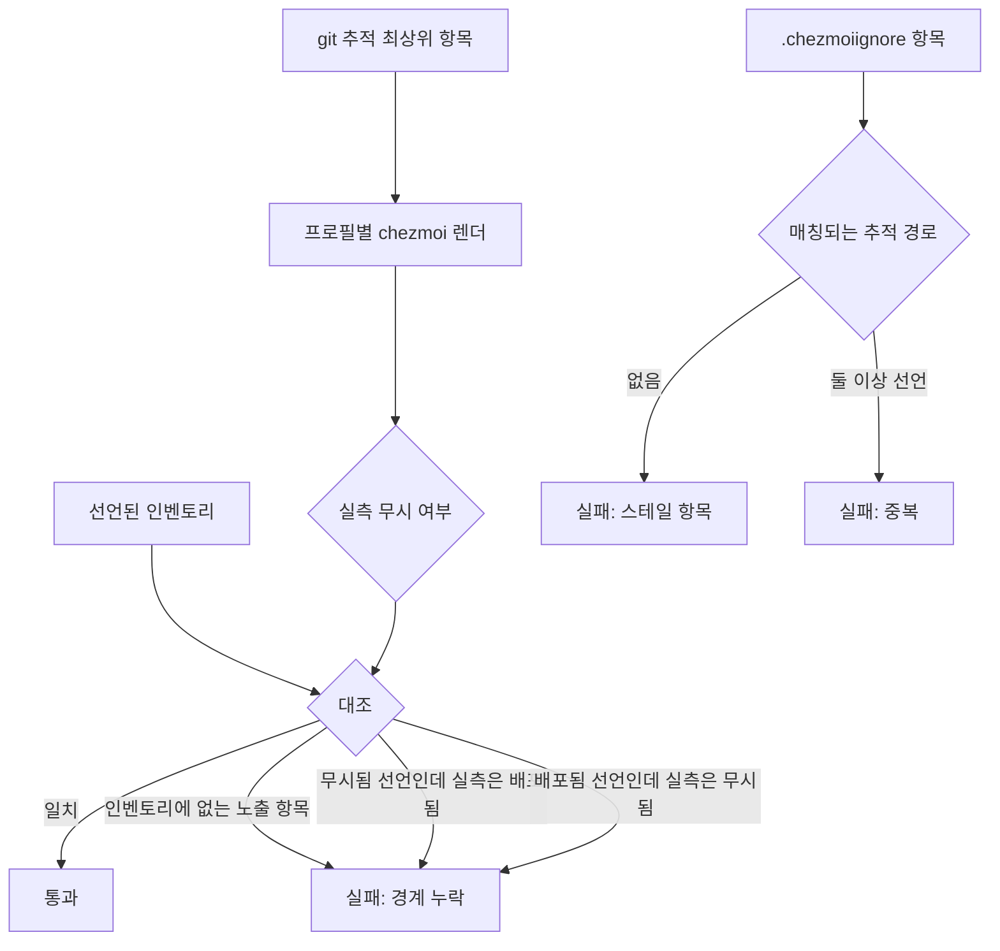
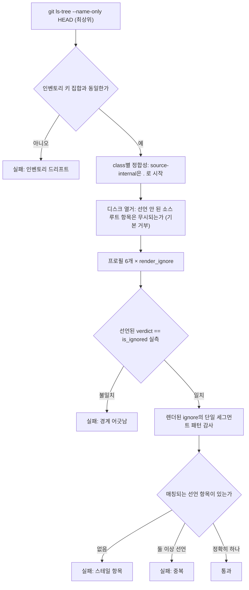

# Top-Level Deployment Boundary Gate - Plan

## Goal Capsule

- **Objective:** 저장소 최상위의 배포 경계가 사람의 기억이 아니라 검증된 사실이 된다. 새 항목이 들어오거나 기존 부인 항목이 실물을 잃으면 CI가 그 사실을 말한다.
- **Means:** 선언된 최상위 인벤토리와 chezmoi가 실제로 렌더한 무시 집합을 양방향으로 대조하는 CI 게이트.
- **Product authority:** 이 문서. 요구사항과 범위 경계는 여기서 확정되었고, 구현 방식은 planning이 정한다.
- **Open blockers:** 없음.

---

## Product Contract

### Summary

최상위 항목이 `$HOME`으로 배포되는지 여부를 CI가 실측해 선언된 인벤토리와 대조하는 게이트를 추가한다. 어긋난 방향이 어느 쪽이든 실패하므로, 새 항목을 부인 목록에 넣는 것을 잊어도, 반대로 부인 항목이 실물 없이 남아도 빌드가 알려준다. 같은 변경에서 현재의 스테일 항목을 정리해 첫 통과 상태를 만든다.

### Problem Frame

`.chezmoiignore`의 첫 블록은 저장소 메타를 한 항목씩 손으로 배제한다. 그 목록의 실패 양식은 언제나 "아무도 목록에 넣을 생각을 못 한 항목"이고, 실패 방향은 되돌리기 어려운 쪽이다 — 저장소 내부 파일이 실제 `$HOME`으로 배포된다.

위험 표면은 보이는 것보다 좁다. chezmoi는 소스 디렉터리에서 `.`으로 시작하는 항목을 (`.chezmoi*` 제외) 자동으로 무시하므로 `.ci`, `.github`, `.vscode` 같은 저장소 메타는 목록에 한 줄도 없이 이미 안전하다. 손 유지가 실제로 필요한 것은 접두사가 없는 최상위 항목뿐이다.

좁지만 실재한다. 그리고 이미 드리프트했다. `.chezmoiignore`는 존재하지 않는 `./agents`와 `./plans`를 부인하고 있고, `./docs`를 두 번 적고 있다. 어느 쪽도 아무것도 깨뜨리지 않았기 때문에 아무도 알아채지 못했다. 목록이 조용히 진실과 어긋나는 것이 이 표면의 기본 거동이며, 최상위 인벤토리를 검사하는 게이트는 `.ci` 어디에도 없다.

### Key Decisions

- **게이트를 먼저 만들고 `.chezmoiroot` 이전은 재평가로 남긴다** — 같은 안전 속성을 저장소 전면 이동 없이 얻는다. (session-settled: user-directed — chosen over `.chezmoiroot` 소스 루트 전체 이전: 빌드 스크립트가 `$sourceDir` 기준으로 `packages/**`, `crates/**`, `system/**`를 핑거프린트하는 호출 지점이 62곳이고, 소스 루트가 `home/`으로 내려가면 이 glob들이 전부 zero-match가 되어 `.chezmoitemplates/fingerprint.tmpl`이 하드 실패한다.) Governs R1.
- **판정은 양방향 인벤토리 대조다** — 새로 노출된 항목과 스테일해진 부인 항목을 한 규칙이 모두 잡는다. (session-settled: user-directed — chosen over 접두사 없는 최상위는 기본 거부 정책: 기본 거부는 새 노출만 막고 부인 목록의 드리프트는 그대로 둔다.) Governs R1, R2, R3.
- **인벤토리는 git이 추적하는 최상위 항목에서 도출한다** — `.gitignore`가 검사 경계가 되므로 과도기 경로를 위한 면제 목록 자체가 필요 없어진다. (session-settled: user-directed — chosen over 인벤토리에 과도기 경로를 선언하고 면제: 면제 목록은 이 작업이 없애려는 손 유지 목록과 같은 실패 양식이다.) Governs R5, R9.
- **커버리지는 기존 렌더 게이트의 프로필 집합을 따른다** — `Library` 같은 OS 조건부 항목이 추측이 아니라 실제 렌더로 검증된다. (session-settled: user-directed — chosen over linux 비컨테이너 단일 프로필: 단일 프로필은 darwin 전용 항목의 드리프트를 놓친다.) Governs R6, R7.

### Requirements

**게이트 판정**

- R1. 게이트는 선언된 최상위 인벤토리와 chezmoi가 실제로 렌더한 무시 집합을 대조하고, 어느 방향으로든 불일치하면 실패한다.
- R2. `.chezmoiignore`의 항목이 검사 대상 최상위 경로 중 무엇과도 매칭되지 않으면 실패한다.
- R3. 같은 최상위 경로를 `.chezmoiignore`가 두 번 이상 부인하면 실패한다.
- R4. 실패 메시지는 어긋난 경로, 어긋난 방향(노출됨/미매칭/중복), 그리고 해소하려면 인벤토리와 `.chezmoiignore` 중 무엇을 고쳐야 하는지를 말한다.

**인벤토리 선언**

- R5. **인벤토리**는 git이 추적하는 최상위 항목에서 도출한다. 추적되지 않는 경로는 인벤토리에 들어가지 않는다.
- R10. 소스 루트에 실제로 존재하는 비닷 항목 중 인벤토리가 `배포됨`으로 선언하지 않은 것은 모두 무시되어야 한다. 추적 여부는 이 판정에 영향을 주지 않는다.
- R6. 인벤토리의 각 항목은 `배포됨` 또는 `무시됨`으로 분류되고, 분류가 프로필에 따라 달라지는 항목은 그 조건을 함께 선언한다.

**커버리지**

- R7. 게이트는 기존 렌더 게이트가 도는 프로필 집합에서 판정한다.

**현재 상태 정리**

- R8. 실물이 없는 `./agents`와 `./plans`, 그리고 중복된 `./docs`를 `.chezmoiignore`에서 제거한다.
- R9. `_artifacts`를 `.gitignore`가 소유하게 하고, `.chezmoiignore`의 부인도 유지한다. 부인이 필요한 이유는 R10이며, 부인이 스테일로 보고되지 않는 이유는 그것이 과도기 부인으로 선언되어 있기 때문이다.

### Gate decision boundary

### Acceptance Examples

- AE1. 새 최상위 항목이 인벤토리 없이 들어온다
  - **Covers R1, R4.**
  - **Given:** 접두사 없는 새 파일이 최상위에 추가되고 인벤토리에는 등록되지 않았다.
  - **When:** 게이트가 실행된다.
  - **Then:** 실패하고, 그 경로가 배포 대상으로 노출되어 있으며 인벤토리 등록 또는 `.chezmoiignore` 추가가 필요하다고 말한다.
- AE2. 부인 항목이 실물을 잃는다
  - **Covers R2, R4.**
  - **Given:** `.chezmoiignore`가 추적 경로 중 무엇과도 매칭되지 않는 항목을 담고 있다.
  - **When:** 게이트가 실행된다.
  - **Then:** 실패하고 그 항목을 스테일로 지목한다.
- AE3. OS 조건부 항목이 정상 동작한다
  - **Covers R6, R7.**
  - **Given:** `Library`가 darwin에서만 배포되는 항목으로 선언되어 있다.
  - **When:** 게이트가 linux와 darwin 프로필에서 실행된다.
  - **Then:** linux에서는 무시됨, darwin에서는 배포됨으로 실측되고 양쪽 다 통과한다.
- AE4. 선언되지 않은 추적 외 경로는 검사 대상이 아니다
  - **Covers R5.**
  - **Given:** 추적되지 않고 어느 선언에도 없는 최상위 경로가 워크스페이스에 존재한다.
  - **When:** 게이트가 실행된다.
  - **Then:** 인벤토리에 없어도 통과한다.
- AE5. 과도기 부인은 스테일로 보고되지 않는다
  - **Covers R9.**
  - **Given:** `_artifacts`가 깨끗한 체크아웃에 없지만 `preemptive_denials`에 선언되어 있다.
  - **When:** 게이트가 실행된다.
  - **Then:** 그 부인은 스테일로 보고되지 않고 통과한다. 선언에서 빼면 스테일로 실패한다.
- AE6. 아무도 선언하지 않은 새 경로도 잡힌다
  - **Covers R10.**
  - **Given:** 어떤 도구가 소스 루트에 비닷 디렉터리를 만들었고, 인벤토리에도 과도기 목록에도 없으며 `.chezmoiignore`도 덮지 않는다.
  - **When:** 게이트가 실행된다.
  - **Then:** 실패하고, 그 경로가 `$HOME`으로 배포된다는 것과 부인 또는 선언 중 무엇을 하면 되는지를 말한다.

### Scope Boundaries

- `.chezmoiroot`를 두고 chezmoi 소스 상태를 하위 디렉터리로 옮기는 작업.
- 새 스크립트를 올바른 디렉터리·접두사·핑거프린트 블록과 함께 만드는 스캐폴더.
- `dot_*` 트리 **내부** 경로의 배포 여부 검사. 이 게이트는 최상위 경계만 본다.
- `.chezmoiremove` 항목의 정합성 검증.

### Dependencies / Assumptions

- `.ci/lib/render-gate-helpers.sh`의 렌더 헬퍼와 `.ci/lib/render-scratch.sh`의 스크래치 설정을 재사용할 수 있다고 가정한다. 게이트가 렌더 인프라를 새로 만들 필요는 없다.
- chezmoi가 소스 디렉터리에서 `.` 접두 항목을 (`.chezmoi*` 제외) 무시한다는 동작에 의존한다. 이 동작이 바뀌면 검사 대상 집합이 달라진다.
- `_artifacts`가 소스 트리 안에 들어간 적이 없다는 전제는 **CI에서만 성립한다.** 교차 모델 리뷰가 이 전제를 반증했다: `.github/workflows/render-dotfiles.yml`은 chezmoi 소스 사본을 먼저 뜨지만, 그 스텝을 로컬에서 돌린 체크아웃은 `_artifacts/`를 소스 디렉터리 안에 남기고, chezmoi는 `.gitignore`를 읽지 않으므로 그것을 그대로 본다. R9는 그 반증을 반영해 두 의무를 모두 요구한다.

<!-- ce-section: work-relationships -->
### How This Work Fits Together

이 플랜은 `docs/ideation/2026-09-08-repo-structure-ideation.html`의 1순위 아이디어 세 조각 중 **경계 검증** 하나만 다룬다. 아래 분해는 현재의 이해이지 확정된 로드맵이 아니다.

- 최상위 배포 경계 게이트 — 이 플랜이 다루는 영역.
  - `.chezmoiroot` 소스 루트 이전 — `Shares` 목표(경계를 구조적 기본값으로). `Still to decide`: 재평가 조건. 현재 이해로는 빌드 스크립트의 크로스-루트 핑거프린트 결합이 줄어들거나, 이 게이트가 실제 드리프트를 반복해서 잡아 손 유지 목록의 비용이 드러날 때가 그 시점이다.
  - 배치용 스캐폴더 (`scripts/new`) — `Can proceed independently of` 이 플랜. 새 스크립트의 접두사·핑거프린트 블록 누락을 다루며, 최상위 경계와는 다른 표면이다.

### Sources / Research

- `docs/ideation/2026-09-08-repo-structure-ideation.html` — 이 작업이 나온 아이디에이션. 1순위 아이디어와 그 근거·단점.
- `.chezmoitemplates/fingerprint.tmpl:48` (`glob (joinPath $sourceDir $pattern)`), `:55` (zero-match 하드 실패) — `.chezmoiroot` 이전을 이번 범위에서 제외한 근거.
- `.chezmoiignore` 1-19행 — 손 유지 부인 블록과 현재의 스테일·중복 항목.
- `.ci/lib/render-gate-helpers.sh` (`render`, `write_fact_stub`, `render_ignore`, `is_ignored`), `.ci/lib/render-scratch.sh` (`setup_render_scratch`) — 재사용 가능한 렌더 판정 인프라.
- `.ci/test-chezmoiignore-script-paths.sh:121-128` — 이 저장소가 `.chezmoiignore`를 검증할 때 도는 6개 프로필의 정본.
- `.ci/test-ci-wiring.sh` — mutant fixture 규율의 본보기이자, 새 게이트의 배선 누락을 잡는 게이트.
- `.ci/skip-declaration-site-matrix.yaml` 1-5행 — CI 전용 감사 오라클을 데이터로 선언하는 선례.
- `AGENTS.md` "Source layout and attributes" — "비닷 메타데이터는 루트 `.chezmoiignore`에 반드시 올라가야 한다"는 규칙. 이 게이트가 강제하는 대상.
- `AGENTS.md` "Verification (never deploy live `$HOME`)" — CI 게이트가 `render-gate-helpers.sh`의 `render()`를 써야 한다는 MUST.
- `.github/workflows/render-dotfiles.yml:120-135`, `:278` — `_artifacts` 생성 시점이 chezmoi 소스 사본 생성 이후임을 보이는 근거.
- `docs/solutions/integration-issues/chezmoi-worktree-root-etc-file-deployment.md` — 소스 경로 전환이 렌더 본문 해시를 바꾸는 기제와 PISR 수정.

---

## Planning Contract

**Product Contract preservation:** Product Contract unchanged. R1–R9, AE1–AE4, Key Decisions와 그 `session-settled:` 주석, Scope Boundaries, Dependencies / Assumptions, work-relationships 섹션 모두 그대로입니다.

### Key Technical Decisions

- KTD1. **새 게이트 파일 `.ci/test-top-level-deployment-boundary.sh`를 추가하고 `.ci/test-chezmoiignore-script-paths.sh`는 확장하지 않는다.** 형제 게이트는 자체 node 기반 팩트 스텁으로 렌더를 hand-roll하는데, `AGENTS.md`는 CI 게이트가 `.ci/lib/render-gate-helpers.sh`의 `render()`를 쓰도록 MUST로 규정합니다. 새 로직을 그 안에 넣으면 금지된 경로 위에 얹게 됩니다. Governs R1.
- KTD2. **렌더와 무시 판정은 `.ci/lib/render-gate-helpers.sh`의 `render_ignore`/`is_ignored`로 하고, 인벤토리 대조와 보고는 별도 파이썬 체커가 맡는다.** `AGENTS.md`의 검증 계약이 요구하는 스크래치·`op` 스텁·빈 config·throwaway destination·`--source` 규약을 `render()`가 이미 구현합니다. 매처를 하나로 유지하기 위해 bash가 `(프로필, 항목)`마다 `is_ignored`로 실측 verdict를 구해 체커에 넘기고, 체커는 패턴 매칭을 다시 구현하지 않습니다. Governs R1.
- KTD3. **판정 오라클은 렌더된 `.chezmoiignore`이며 `chezmoi managed`가 아니다.** `chezmoi managed --exclude=externals,encrypted`를 스크래치 계약 아래에서 돌렸을 때 120초 안에 아무 출력도 내지 못했습니다. `execute-template` 경로는 기존 게이트들이 CI에서 이미 빠르게 돌리고 있는 검증된 경로입니다.
- KTD4. **`render_ignore`에 desktop 인자를 통과시키고, 게이트는 `.ci/test-chezmoiignore-script-paths.sh`와 같은 6개 프로필을 돈다.** `write_fact_stub`은 이미 desktop을 다섯 번째 인자로 받지만 `render_ignore`가 그것을 넘기지 않아 `gnome`에 고정됩니다. 인자를 통과시키면 최상위 판정이 desktop 축에 대해 불변이라는 것을 가정하지 않고 증명합니다. Governs R7.
- KTD5. **인벤토리는 `.ci/top-level-boundary-inventory.yaml`에 데이터로 선언한다.** `.ci/skip-declaration-site-matrix.yaml`이 세운 CI 전용 감사 오라클 선례를 따릅니다. 이 파일은 chezmoi 런타임 입력이 아닙니다. Governs R5, R6.
- KTD6. **인벤토리는 세 가지 class로 분류한다: `source-internal`, `repo-only`, `deployed`.** `deployed`는 프로필을 좁히는 `only_on`을 함께 선언합니다. 세 class 모두 R5가 정한 대로 git이 추적하는 항목만 담습니다. Governs R6.
- KTD9. **노출 판정은 git이 아니라 디스크를 열거하고 기본 거부한다.** 소스 루트의 비닷 항목 중 인벤토리가 `배포됨`으로 선언하지 않은 것은 모두 무시되어야 합니다. chezmoi가 인덱스가 아니라 디렉터리를 읽으므로, 이것이 chezmoi가 실제로 보는 집합입니다. 이 검사는 목록을 필요로 하지 않으며, 아무도 선언하지 않은 새 생성 경로를 "거기 있다"는 이유만으로 잡습니다. Governs R10.
- KTD10. **`preemptive_denials`는 스테일 보고만 억제하고 안전 의무를 지지 않는다.** 깨끗한 체크아웃에 없는 경로를 부인하면 스테일로 보이므로, 그 부인이 의도된 것임을 선언합니다. 면제가 아닙니다 — 그 경로가 실제로 존재할 때는 KTD9가 덮습니다. 목록에 넣는 걸 잊으면 부인이 스테일로 보고되어 시끄럽게 실패합니다. Governs R9.
  - **해소된 충돌 — settled decision 3 / R5:** R5의 원래 둘째 절은 추적되지 않는 경로를 판정에서도 뺐고, 그것이 구멍이었습니다. `agents.lock`과 `_artifacts`는 각각 dotagents와 CI 렌더 워크플로가 저장소 루트에 생성하므로 소스 디렉터리 안에 존재할 수 있고, 판정 밖에 두면 배포됩니다. R10(KTD9)이 디스크를 열거해 기본 거부하므로 이제 판정이 그 경로들을 덮고, R5는 인벤토리로 좁혀졌습니다.
- KTD7. **게이트는 `.github/workflows/ci.yml`의 `repo-meta` 잡에 배선한다.** 그 잡은 이미 고정된 chezmoi와 `python3-yaml`을 설치하고, `.ci/test-ci-wiring.sh`·`.ci/test-garden-path-mirror-check.sh`와 관심사가 같습니다. `delivery`의 `needs`에 `repo-meta`가 이미 있으므로 집계 변경은 없습니다.
- KTD8. **mutant fixture로 게이트의 검출력을 증명한다.** `.ci/test-ci-wiring.sh`와 `.ci/test-chezmoiignore-script-paths.sh`가 세운 규율입니다. 실제 트리가 깨끗하다는 것만으로는 게이트가 무언가를 잡는다는 증거가 되지 않습니다. Governs R1, R2, R3.

### High-Level Technical Design

게이트는 세 개의 독립적인 검사를 순서대로 돌립니다.

이 게이트와 `.ci/test-chezmoiignore-script-paths.sh`의 경계는 "렌더된 패턴이 루트 레벨 타깃에 닿을 수 있는가"입니다. 이름만 있는 패턴(`docs`, `system`, `Library`)은 물론이고, 디렉터리 전용 표기(`name/`)와 재귀 표기(`**/name`)도 루트에 닿으므로 셋 다 이 게이트가 봅니다. 최상위 항목 *아래*의 경로를 가리키는 패턴(`.chezmoiscripts/30-linux/*.sh`, `.config/fontconfig`)은 형제 게이트와 기존 렌더 게이트들의 소관이며 이 게이트는 건드리지 않습니다. 같은 이름의 서로 다른 표기는 하나로 정규화되므로 중복으로 잡힙니다.

### Assumptions

- `.ci/lib/render-gate-helpers.sh`에 desktop 인자를 통과시키는 변경은 기존 호출자를 깨뜨리지 않습니다. `render_ignore`의 현재 호출자는 `.ci/test-gnupg-config-render.sh:215,219` 둘뿐이고 둘 다 위치 인자를 desktop 앞까지만 넘기므로, 새 인자는 기본값 `gnome`으로 현재 동작을 보존합니다.
- `repo-meta` 잡의 10분 타임아웃 안에 6개 프로필 렌더가 들어갑니다. 형제 게이트가 같은 6개 프로필을 `render-gates` 잡에서 이미 돌리고 있습니다.

### Sequencing

U1·U2·U3은 서로 독립입니다. U4는 U1과 U2에 의존하고, U3가 함께 들어가야 통과합니다. U5는 U4에 의존합니다.

### Open Questions

없음. 두 항목 모두 R10으로 해소되었고, 그 경위는 아래와 같습니다.

**해소 — 면제 목록이 확정 결정 3의 실패 양식을 갖는가.** 가졌습니다. 그 지적이 옳았습니다. 초기 설계의 `generated_in_source`는 새 생성 경로를 아무도 선언하지 않으면 게이트가 통과하고 `$HOME`으로 배포되는, 정확히 "누군가 목록에 넣는 걸 잊으면 조용히 실패하는 목록"이었습니다. 해법은 목록을 정당화하는 것이 아니라 **안전을 목록에서 떼어내는 것**이었습니다. R10은 git이 아니라 디스크를 열거해 기본 거부하므로 선언이 없어도 노출을 잡습니다. 남은 목록은 스테일 보고만 억제하며, 거기에 넣는 걸 잊으면 결과가 조용한 통과가 아니라 시끄러운 실패입니다 — 실패 양식이 뒤집혔습니다.

**해소 — R5와 R9의 문언.** R5의 첫 문장(인벤토리는 추적 항목에서 도출한다)은 옳았고 그대로입니다. 틀린 것은 그것을 **판정**까지 확장한 둘째 절이었습니다. 추적되지 않는 경로를 판정에서 빼는 것이 바로 구멍을 만들었습니다. R5는 인벤토리로 좁혔고, 판정은 R10이 맡습니다. R9는 더 이상 특례가 아니라 R10의 한 사례이며, `.chezmoiignore` 부인이 필요한 이유는 "소스 루트에 있을 수 있으니까"라는 일반 규칙입니다.

---

## Implementation Units

### U1. 최상위 경계 인벤토리를 선언한다

- **Goal:** 추적되는 모든 최상위 항목의 배포 여부와 그 프로필 조건이 한 파일에 선언된다.
- **Requirements:** R5, R6.
- **Files:** `.ci/top-level-boundary-inventory.yaml` (신규).
- **Approach:** `.ci/skip-declaration-site-matrix.yaml`의 헤더 주석 관례를 따라 이 파일이 CI 전용 감사 오라클이며 chezmoi가 읽지 않는다는 것을 첫 줄에 적습니다. `profiles` 목록은 `.ci/test-chezmoiignore-script-paths.sh:121-128`의 6개 변형을 그대로 옮기고(`linux-gnome`, `linux-kde`, `linux-headless`, `linux-jetson`, `linux-container`, `macos`), 각 항목은 `os`·`desktop`·`container`·`jetson`을 담습니다. `entries` 맵은 `git ls-tree --name-only HEAD`의 최상위 55개 항목을 키로 하고 각각 `class`를 선언합니다. 닷 접두 18개는 `source-internal`, 비닷 37개 중 `dot_*`·`private_dot_gnupg`·`private_readonly_dot_mcp.json.tmpl`·`remove_dot_gitconfig`·`symlink_dot_face.icon`은 `deployed`, `Library`는 `deployed`에 `only_on: [macos]`, 나머지는 `repo-only`입니다. 인벤토리와 나란히 `preemptive_denials` 목록을 두고 깨끗한 체크아웃에 없는 부인 대상 — `agents.lock`, `_artifacts` — 을 담습니다 (KTD10). 이 목록은 스테일 보고만 억제하며 안전 의무를 지지 않습니다.
- **Test Scenarios:** 이 유닛 자체는 데이터이며 U4의 게이트가 검증합니다. 선언이 실제와 맞는지는 U4의 첫 실행이 증명합니다.
- **Verification:** `python3 -c 'import yaml,sys; yaml.safe_load(open(".ci/top-level-boundary-inventory.yaml"))'`가 성공한다.

### U2. `render_ignore`에 desktop 축을 통과시킨다

- **Goal:** 공유 렌더 헬퍼가 desktop 팩트를 호출자로부터 받는다.
- **Requirements:** R7.
- **Files:** `.ci/lib/render-gate-helpers.sh`.
- **Approach:** `render_ignore`의 시그니처에 `desktop=${8:-gnome}`를 더하고 `write_fact_stub`에 다섯 번째 인자로 넘깁니다. variant 파일 이름에 desktop을 포함시켜 한 스크래치 안에서 여섯 변형이 서로를 덮어쓰지 않게 합니다. 파일은 sourced 전용이므로 0644를 유지합니다 — `.ci/test-ci-wiring.sh`의 check 3이 이를 강제합니다.
- **Test Scenarios:** `.ci/test-gnupg-config-render.sh`가 desktop 인자를 넘기지 않고도 이전과 같은 결과를 낸다. U4의 게이트가 `linux-gnome`과 `linux-kde`에서 서로 다른 렌더를 받는다.
- **Verification:** `.ci/test-gnupg-config-render.sh`와 `shellcheck .ci/lib/render-gate-helpers.sh`가 통과한다.

### U3. 드리프트한 부인 상태를 정리한다

- **Goal:** `.chezmoiignore`의 모든 단일 세그먼트 항목이 실재하는 최상위 항목을 정확히 한 번 가리킨다.
- **Requirements:** R8, R9.
- **Files:** `.chezmoiignore`, `.gitignore`.
- **Approach:** `.chezmoiignore`에서 `./agents`(dotagents가 `.agents/`로 옮겨간 뒤의 잔재)와 `./plans`(`docs/plans`로 이동)를 제거하고, 두 번 선언된 `./docs`와 `./agents.lock`을 각각 한 번만 남깁니다. `.gitignore`에 `_artifacts/`를 추가하되 `./_artifacts`의 부인은 유지합니다 — 두 경로 모두 소스 디렉터리 안에 존재할 수 있고, `.gitignore`는 git에만 가릴 뿐 chezmoi에는 가리지 못합니다 (R10). `./agents.lock`도 같은 이유로 남깁니다.
- **Test Scenarios:** `.github/workflows/render-dotfiles.yml`의 아티팩트 업로드 스텝이 `_artifacts/`를 계속 쓴다 — `.gitignore` 추가는 업로드 경로에 영향이 없다. `.chezmoiignore`에 남은 단일 세그먼트 항목이 모두 실재하는 최상위 항목과 매칭된다.
- **Verification:** `.ci/test-chezmoiignore-script-paths.sh`가 통과한다. `git status --short`가 `_artifacts/`를 더는 추적 후보로 보고하지 않는다.

### U4. 경계 게이트와 mutant fixture를 추가한다

- **Goal:** 선언과 실측이 어긋나면 CI가 실패한다.
- **Requirements:** R1, R2, R3, R4.
- **Files:** `.ci/test-top-level-deployment-boundary.sh` (신규, 0755).
- **Approach:** 저장소 관례를 따릅니다 — `set -euo pipefail`, `repo_root=$(cd -- "$(dirname -- "${BASH_SOURCE[0]}")/.." && pwd)`, `.ci/lib/render-scratch.sh`의 `setup_render_scratch`로 스크래치와 `op` 스텁을 세우고, `chezmoi_bin=$(command -v chezmoi)`로 해석하고, `test-top-level-boundary: ` 접두사를 붙이는 스크립트 로컬 `fail`/`pass`를 둡니다. `.ci/lib/render-gate-helpers.sh`를 source합니다. bash가 프로필마다 `render_ignore`로 렌더한 뒤 항목마다 `is_ignored`를 불러 실측 verdict를 `<profile>\t<entry>\t<ignored|eligible>` 줄로 모읍니다 (KTD2). 대조와 보고는 PyYAML을 쓰는 파이썬 체커가 맡고, 스크래치에 heredoc으로 쓰며 `/usr/bin/python3`를 먼저 프로브합니다(mise·pyenv 인터프리터에 배포판 모듈이 없는 저장소 관례). 체커는 인벤토리·추적 최상위 목록·verdict 표·렌더된 ignore 파일·디스크에 존재하는 비닷 최상위 목록을 인자로 받아 High-Level Technical Design의 검사를 돌리고, 실패마다 경로·어긋난 방향·고칠 파일을 한 줄로 출력합니다(R4). mutant fixture는 최소 인벤토리와 최소 ignore 파일을 만들어 실패 모드마다 돌연변이를 하나씩 넣고, 각각이 거부되며 **올바른 이유로** 거부되는지를 `.ci/test-ci-wiring.sh`의 `expect_reject` 모양으로 확인합니다.
- **Test Scenarios:**
  - 인벤토리에 없는 추적 최상위 항목 → 실패, 메시지가 그 경로와 인벤토리 등록을 지목한다 (AE1).
  - `repo-only`로 선언됐는데 렌더에서 무시되지 않는 항목 → 실패, 경계 누락으로 보고한다 (AE1).
  - `deployed`로 선언됐는데 렌더에서 무시되는 항목 → 실패.
  - 실재하는 최상위 항목과 매칭되지 않는 단일 세그먼트 ignore 패턴 → 실패, 스테일로 지목한다 (AE2).
  - 같은 최상위 경로를 두 번 선언 → 실패, 중복으로 지목한다.
  - `Library`가 `macos` 프로필에서 배포되고 나머지 다섯 프로필에서 무시된다 → 통과 (AE3).
  - `_artifacts`가 추적되지 않고 어느 선언에도 없으므로 통과한다 (AE4).
  - 소스 루트에 있지만 인벤토리에도 과도기 목록에도 없고 부인되지도 않은 경로 → 실패, 배포된다는 것과 해소 방법을 말한다 (AE6).
  - `agents.lock`이 `preemptive_denials`에 있으므로 부인이 스테일로 보고되지 않는다 (AE5).
- **Verification:** `.ci/test-top-level-deployment-boundary.sh`가 통과하고, 모든 mutant가 기대한 문구로 거부된다. `shellcheck .ci/test-top-level-deployment-boundary.sh`가 통과한다.

### U5. 게이트를 CI에 배선한다

- **Goal:** 게이트가 필수 체크의 일부로 돈다.
- **Requirements:** R1, R2, R3, R4 — 배선되지 않은 게이트는 이 요구사항들을 강제하지 못한다.
- **Files:** `.github/workflows/ci.yml`.
- **Approach:** `repo-meta` 잡의 "Run repository meta gates" 스텝에 `.ci/test-top-level-deployment-boundary.sh` 한 줄을 더합니다. `delivery`의 `needs`는 이미 `repo-meta`를 담고 있으므로 집계 변경은 없습니다.
- **Test Scenarios:** `.ci/test-ci-wiring.sh`가 새 게이트를 배선된 것으로 인식한다. 배선 줄을 빼면 같은 게이트가 orphan으로 실패한다.
- **Verification:** `.ci/test-ci-wiring.sh`가 통과한다.

---

## Verification Contract

| 명령 | 증명하는 것 | 적용 유닛 |
|---|---|---|
| `.ci/test-top-level-deployment-boundary.sh` | 선언과 실측이 6개 프로필에서 일치하고, mutant가 모두 거부된다 | U1, U2, U4 |
| `.ci/test-ci-wiring.sh` | 새 게이트가 배선되어 있고 `.ci/lib` 모드 규칙이 지켜진다 | U2, U4, U5 |
| `.ci/test-chezmoiignore-script-paths.sh` | `.chezmoiignore` 편집이 스크립트 경로 감사를 깨뜨리지 않았다 | U3 |
| `.ci/test-gnupg-config-render.sh` | `render_ignore` 시그니처 변경이 기존 호출자를 보존한다 | U2 |
| `shellcheck .ci/test-top-level-deployment-boundary.sh .ci/lib/render-gate-helpers.sh` | 셸 품질 게이트 (`.shellcheckrc` 설정) | U2, U4 |
| `python3 -c 'import yaml; yaml.safe_load(open(".ci/top-level-boundary-inventory.yaml"))'` | 인벤토리가 유효한 YAML이다 | U1 |
| `git diff --check` | 공백 오류가 없다 | 전체 |

`.ci/lib/render-gate-helpers.sh`는 21개 이상의 게이트가 source하므로, U2 변경 후에는 `repo-meta`와 `render-gates` 두 잡의 게이트 집합이 모두 통과해야 합니다. 로컬에서는 `.github/workflows/ci.yml`의 해당 스텝에 나열된 순서대로 돌립니다.

렌더를 도는 모든 검증은 `AGENTS.md`의 "Verification (never deploy live `$HOME`)" 계약을 지킵니다: 스크래치 디렉터리, `op` 스텁, 빈 config, throwaway destination, `--source "$PWD"`. 실제 `op`를 호출하지 않으며 `$HOME`에 아무것도 쓰지 않습니다.

---

## Definition of Done

**전역**

- R1–R9가 각각 하나 이상의 유닛으로 구현되었고, AE1–AE4가 U4의 테스트 시나리오로 커버된다.
- Verification Contract의 모든 명령이 통과한다.
- `.chezmoiignore`에 남은 단일 세그먼트 항목이 전부 실재하는 최상위 항목을 정확히 한 번 가리킨다.
- 시도했다 버린 접근의 코드가 디프에 남아 있지 않다 — 대체된 체커 초안, 쓰이지 않는 헬퍼 함수, 주석 처리된 프로필 목록 모두 제거한다.
- 새 파일에 불필요한 주석이 없다. 코드가 말하지 못하는 외부 사실이나 비자명한 제약만 주석으로 남긴다.

**유닛별**

- U1: 인벤토리 키 집합이 `git ls-tree --name-only HEAD`의 최상위 출력과 정확히 일치한다.
- U2: `.ci/lib/render-gate-helpers.sh`가 0644로 커밋되어 있고, `render_ignore`의 기존 두 호출자가 수정 없이 통과한다.
- U3: `./agents`, `./plans`, 중복된 `./docs`와 `./agents.lock`이 `.chezmoiignore`에서 사라졌고, `./_artifacts`와 `./agents.lock`은 각각 한 번씩 남아 있으며, `.gitignore`가 `_artifacts/`를 덮는다.
- U4: 검사 실패 모드마다 mutant가 하나씩 있고, 각각 기대한 실패 문구로 거부된다.
- U5: 배선 줄을 제거하면 `.ci/test-ci-wiring.sh`가 새 게이트를 orphan으로 보고한다.
