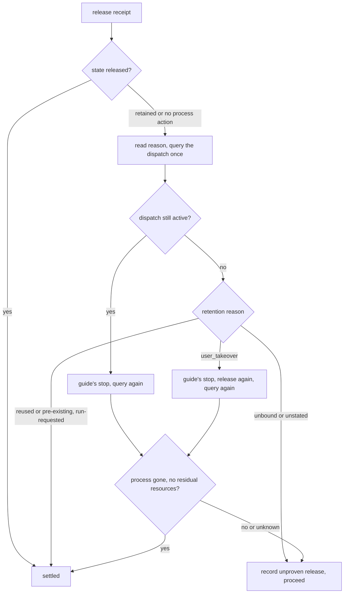

# Narrow Coordinator Release Retention Takeover - Plan

## Goal Capsule

- **Objective:** After a coordinator run ends, a worker terminal whose only recorded "takeover" was a keystroke while someone looked at it is either closed through Orca's supervised stop and release path or named in the run's record as still resident, so an operator never finds an unrecorded finished worker still running in the Orca app.
- **Means:** Drop `a recorded user takeover` from the proven-identity list in the release contract of `.chezmoitemplates/orchestration-coordinator.tmpl`, add three sentences that settle a `user_takeover` retention only on process-gone evidence after one stop, one release request, and one query, and pin the new sentences with `.ci` needles (KTD1, KTD3, KTD4).
- **Authority:** The Product Contract requirements govern behavior. KTD1 and KTD2 are session-settled and are not reopened. GitHub issue #548 is the source of both.
- **Execution profile:** Two Implementation Units that land in one `fix` commit, verified by the repository's `.ci` gates.
- **Stop conditions:** Stop if `bash .ci/test-agent-instructions.sh` reports a lost rule outside the release contract, or if `bash .ci/test-orchestration-hook.sh` fails payload parity for a reason other than the reworded sentences.
- **Who finishes:** The implementing run lands U1 and U2. The pipeline caller owns push, PR, CI watch, and merge.
- **Open blockers:** none.

---

## Product Contract

### Summary

The end-of-run release contract stops crediting a `user_takeover` retention as a proven identity. Such a retention is settled only when Orca reports the worker's process gone. Before recording it, the run issues the guide's stop for the dispatch, requests release once more, and queries once more. When the process is still live or unknown, the run records the dispatch as an unproven release that names the terminal as still resident, and proceeds. The two other proven-identity members, the process-gone settle path, the unbound-retention record path, and the record's content rules keep their current wording. `.ci/test-agent-instructions.sh` pins the rewritten and added sentences and rejects the retired phrase.

### Problem Frame

The last paragraph of `.chezmoitemplates/orchestration-coordinator.tmpl` (line 66) settles a retention "bound to a proven identity — a recorded user takeover, a reused or pre-existing terminal, a retention the run itself requested" once the query reports the dispatch no longer active. After `worker_done` settles a dispatch, `worker-release` on a terminal Orca marked `user_owned` answers `state: retained`, `reason: user_takeover`, `processAction: none`. The query then reports the dispatch inactive, the run settles the retention, and the agent process and its terminal stay resident with nothing recorded. The Orca app keeps showing a finished worker as running.

The issue's premise says opening a worker's terminal records a takeover. On the installed Orca 1.4.205 that is not what happens: viewing, focusing, or scrolling never sets `user_owned`. The only writer of `user_takeover` is the `orchestration.workerTerminalUserInput` RPC, reached from a submitted structured chat send and from an xterm `onUserInput` subscription that fires on keystrokes and pastes. A single arrow key, `Esc`, or `Ctrl-C` typed while inspecting a finished worker sets `ownership_state = 'user_owned'` durably, and the receipt does not say which path set it. The leak the issue reports is real. Its trigger is a keystroke, not a view.

Two further facts shape the fix. `worker-list --terminal-state reclaimable` never lists a `user_owned` terminal (its terminal state is `retained` and its `nextAction` is `none`), so the end-of-run enumeration cannot catch this case; only the receipt path can. And on Orca 1.4.205 neither `worker-stop` nor `worker-release` closes a `user_owned` terminal (KTD3), so the contract must record what it cannot reclaim instead of promising a reclamation.

### Key Decisions

- **Mere terminal viewing, attach, or focus is not a takeover; a retention counts as a legitimate handover only when the user put input into that session, and otherwise the run proceeds to stop, release, and reclamation.** (session-settled: user-directed — chosen over keep crediting every takeover Orca records as proven identity and settle the retention as-is: if observation alone settles a retention, the process and terminal of a worker nobody took over are never reclaimed after the run ends) Governs R1, R2, R3, R4.
- **Rewrite the wording on the basis of Orca's distinguishing signal when that signal is observable; when it is not, narrow the wording to "observation alone does not settle" and take the stop and release path.** The research found the signal is not observable: Orca records `user_takeover` for a keystroke and for a submitted prompt alike, so the second arm applies. (session-settled: user-directed — chosen over narrowing the wording without checking Orca's actual signal first: if the signal really does distinguish the two, the contract should not be made needlessly conservative) Governs R1, R2.

### Requirements

**Release contract wording**

- R1. The proven-identity sentence names only a reused or pre-existing terminal and a retention the run itself requested, and those two members keep settling once the query reports the dispatch no longer active.
- R2. A `user_takeover` retention is settled only under the existing process-gone sentence: the query reports `stage: process_exited` or a terminal state of released and names no residual resources.
- R3. When the query reports the dispatch no longer active, the run still issues the guide's stop for that dispatch, requests its release once more, and queries once more before it records anything; a stop or release receipt that reports no process action is evidence for the record and never a settlement.
- R4. When the query after the stop does not report the process gone with no residual resources — the process is live, its state is unknown, or a residual resource is named — the run records the dispatch as an unproven release with its other gaps, states that the terminal stayed resident for the user to close, and proceeds; the clause stays non-blocking.
- R5. Every other sentence of the release contract keeps its current wording: the released-receipt sentence, the retained-receipt query sentence, the still-active stop sentence, the process-gone sentence, the unbound and unstated-reason sentence, the after-stop sentence, the record content sentence and its exclusions, the query-failed sentence, the never-blocks sentence, the process-sweep sentence, and the OUTRANK sentence.
- R6. The rewritten paragraph stays one line of plain prose with no template action, so the rendered coordinator payload contains no `{{` and the hook binary serves it unchanged.

**Repository assertions**

- R7. `.ci/test-agent-instructions.sh` replaces the needle that quoted the tail of the old proven-identity sentence with the whole rewritten sentence, adds one needle per new sentence, and fails when the rendered coordinator body contains `a recorded user takeover`.
- R8. `bash .ci/test-agent-instructions.sh`, `bash .ci/test-orchestration-hook.sh`, `bash .ci/test-agent-roster.sh`, and `bash .ci/test-claude-codex-plugin-reconcile.sh` pass, and the `ci.yml` and `render-dotfiles.yml` workflows are green on the PR.

### Acceptance Examples

- AE1. **Covers R2, R3, R4.** Given a dispatch settled by `worker_done` whose release receipt reports `state: retained`, `reason: user_takeover`, `processAction: none`, when the run's query reports the dispatch no longer active, then the run issues the stop (Orca 1.4.205 answers `alreadySettled: true`, `processAction: none`), requests release again (the same retained receipt), queries again, finds the process live, records the dispatch as an unproven release naming its terminal as still resident, and proceeds.
- AE2. **Covers R3, R4.** Given a still-active dispatch whose terminal Orca marked `user_owned`, when the run's first query reports it active and the run issues the stop, then Orca 1.4.205 answers `processAction: none` with the error `The worker terminal is user_owned; no terminal was closed.`, the second query still reports the process live, and the run records the dispatch as an unproven release and proceeds.
- AE3. **Covers R2.** Given the same retention on an Orca version whose stop does close a `user_owned` terminal, when the query after the stop reports `stage: process_exited` or a terminal state of released with no residual resources, then the retention is settled under the process-gone sentence and nothing is recorded.
- AE4. **Covers R1.** Given a receipt retained for a reused or pre-existing terminal (such as `reason: external_terminal`) or with `reason: user_requested` after the run's own `worker-retain`, when the query reports the dispatch no longer active, then the retention is settled as it is today.
- AE5. **Covers R5.** Given a receipt retained with `reason: identity_unproven` or with no reason, when the query reports the dispatch active or leaves its process state unknown, then the run records it as an unproven release exactly as it does today.
- AE6. **Covers R1.** Given a user who only opened, focused, and scrolled a finished worker's terminal, when the run releases that dispatch, then Orca reports `state: released` because the terminal's ownership stayed `owned`, and the receipt settles the dispatch on its own.
- AE7. **Covers R7.** Given the old proven-identity sentence restored in the template, when `bash .ci/test-agent-instructions.sh` runs, then it fails on the replaced needle and on the retired-phrase check.

### Scope Boundaries

- Orca itself is not changed. The `user_owned` refusal in `worker-stop` and `worker-release` is Orca's behavior, and the contract records it rather than working around it.
- No by-hand terminal close is added. The installed guide says "Never substitute `terminal close`", the run cannot prove from its side that a `user_owned` terminal is not a real takeover, and closing one would destroy the case the user wants preserved.
- The reused or pre-existing member, the run-requested member, the process-gone settle path, and the record-the-gap path keep their wording; the wider dispatch contract is not redesigned.
- Historical plans that quote the old sentence and `docs/residual-review-findings/2026-09-08-orca-dispatch-upstream-reports.md` are not edited. The operator directed upstream Orca defects to be tracked locally without filing, and this issue's scope names the template and its assertions only; the Orca-side refusal is recorded in KTD3 and Sources of this plan.
- No new fixture file. The release contract is asserted by needles today, and the rewrite keeps that mechanism.

### Sources

- `.chezmoitemplates/orchestration-coordinator.tmpl` line 66: the release contract, quoted sentence by sentence in U1 and the Appendix. Commit `133630a3` tightened this clause; commit `b2e47d77` moved it into the coordinator payload.
- `docs/plans/2026-09-08-2232-fix-orca-wrapper-argv-and-residency-plan.md` R15 authored the proven-identity sentence; its evidence run saw a second `worker-release` answer `retained` with `reason: user_takeover` right after a succeeded `worker_done`.
- `docs/residual-review-findings/2026-09-08-orca-dispatch-upstream-reports.md` Defect 3: the retained-receipt ambiguity and the operator's direction to track upstream defects locally.
- `.ci/test-agent-instructions.sh`: the `COORDINATOR_NEEDLES` heredoc (lines 552-610, release needles at 594-608, the tail needle at line 600) and the coordinator-only negative checks at lines 665-679 that U2 follows; the harness cores never render the coordinator body, so the `BANNED` list at lines 707-767 cannot see it.
- `.ci/lib/render-gate-helpers.sh` lines 19-27: `render()` runs chezmoi with `HOME` and `PATH` pointed at the scratch directory, the stub `op`, an empty config, and a throwaway destination.
- `.ci/test-orchestration-hook.sh` lines 44-54 and 278-295: the hook binary reads the rendered payload files at run time, and the gate diffs `print-payload` against the rendered coordinator body and rejects `{{`. `packages/orchestration-hook/src/payload.ts` documents the run-time read, so a template edit needs no rebuild.
- `.ci/test-claude-codex-plugin-reconcile.sh` lines 95-99: the template is a plugin fingerprint input, so the reworded rule re-renders on apply.
- Installed Orca 1.4.205 (`orca-ide --version`), read from its application bundle: the release decision is a switch on the terminal resource's `ownership_state` (`user_owned` maps to `retained` with `reason: user_takeover`); the only writer of `user_takeover` is `markWorkerTerminalUserOwned`, reached from the `orchestration.workerTerminalUserInput` RPC, which a structured chat send and an xterm `onUserInput` subscription call; the local `worker-stop` handler returns `alreadySettled: true` with `processAction: none` for a settled dispatch and marks the stop unknown with `The worker terminal is user_owned; no terminal was closed.` when the resource's `ownership_state` is not `owned`; `worker-list` reports a non-owned resource as terminal state `retained` with `nextAction` `none`; `worker-show` returns `terminalResource.ownershipState` and `terminalResource.retainedReason`.
- Installed guide (`orca-ide skills get orchestration --full`), "Retain and release": "Reused, pre-existing, setup, coordinator, active, user-taken-over, and unproven terminals are retained." and "Never substitute `terminal close`."; "Retry, stop, and abandon": "`worker-stop` closes only the exact proven supervised agent terminal."
- `orca-ide orchestration worker-release --help`: "Never closes setup terminals, configured tabs, reused or pre-existing terminals, user-taken-over terminals, or unproven identities."; `worker-retain --help`: "Records a durable user-requested exception; a later explicit worker-release clears it and releases the terminal."
- GitHub issue #548 (split out of #543): the request and its 작업 범위.

---

## Planning Contract

### Key Technical Decisions

- KTD1. **Narrow the proven-identity sentence by deleting its first member and add three `user_takeover` sentences between the process-gone sentence and the unbound-retention sentence.** The rewritten sentence keeps its tail, so the two remaining members settle exactly as before, and the new sentences bind `user_takeover` to the process-gone rule without touching the sentences that own the other paths. (session-settled: user-directed — chosen over keep crediting every takeover Orca records as proven identity and settle the retention as-is: if observation alone settles a retention, the process and terminal of a worker nobody took over are never reclaimed after the run ends) Governs R1, R2, R5.
- KTD2. **Name the reason string `user_takeover` and state that the receipt cannot separate a keystroke from a submitted prompt; name no Orca signal for "the user submitted a prompt".** The research answered the issue's first work item: Orca sets the flag for any keystroke or paste and for a structured send alike, and exposes no field that separates them, so the contract cannot cite a distinguishing signal and instead says observation never settles. (session-settled: user-directed — chosen over narrowing the wording without checking Orca's actual signal first: if the signal really does distinguish the two, the contract should not be made needlessly conservative) Governs R1, R2.
- KTD3. **Direct one stop, one release request, and one query before the record, and let the record be the terminal move when the process stays live.** On Orca 1.4.205 the stop cannot reclaim the terminal: on a settled dispatch it answers `alreadySettled: true` with `processAction: none`, and on an active dispatch whose resource is `user_owned` it marks the stop unknown with `The worker terminal is user_owned; no terminal was closed.`; `worker-release` answers `retained` with `reason: user_takeover` again. The sequence still costs three cheap commands, matches the user's stop-then-release direction, and on a later Orca whose stop closes the terminal it reaches the process-gone settle path. A by-hand `terminal close` was rejected: the guide forbids substituting it, and the run cannot tell a keystroke from a real takeover. The lead confirms the live behavior on the next real run by reading the stop receipt: `processAction: none` with `alreadySettled: true` or that error text means the record path; `processAction: closed_agent_terminal` followed by a query that reports the process gone means the settle path. Both outcomes are already covered by the wording. The record trigger is the complement of the settle predicate: a query that reports the process gone but names a residual resource must still be recorded, or the retention would be neither settled nor recorded. Governs R3, R4.
- KTD4. **Assert the change with needles and one negative check, keeping every unchanged sentence byte-identical.** The needle `is settled once the query reports the dispatch no longer active.` keeps matching after the rewrite because the sentence keeps its tail, but it no longer pins the member list, so U2 replaces it with the whole rewritten sentence. One needle per new sentence proves presence. A dedicated `grep -F 'a recorded user takeover'` against the rendered coordinator body proves the retired member does not return; the `BANNED` list is not the place because the harness cores never render the coordinator body. Governs R7.

### High-Level Technical Design

The narrowed settle path for a retained receipt:



### Assumptions

- The stop and release refusals read from the Orca 1.4.205 bundle are its live behavior; the wording is written so that either refusal or a later successful close leads to a defined outcome (KTD3).
- The hook binary reads the rendered coordinator payload from its managed file at run time, so U1 needs no rebuild of `packages/orchestration-hook`.
- The plugin fingerprint covers `.chezmoitemplates/orchestration-coordinator.tmpl`, so the reworded rule reaches the plugin cache on the next apply without a manual version bump.

### Risks & Dependencies

| Risk | Mitigation |
|---|---|
| A real takeover in progress is stopped by the run | On Orca 1.4.205 stop and release refuse a `user_owned` terminal, so nothing is closed; on a later Orca that honors the stop, the user directed this tradeoff (KTD1), and the record names the dispatch so the operator can see what was stopped |
| The contract names a reason string a later Orca renames | The record path for an unstated reason stays as it is (R5), and the guide owns command spellings; the contract already names `stage: process_exited` the same way |
| A needle spans a rendered line boundary | The paragraph stays one line (R6) and each needle is a substring of one sentence |
| The end-of-run reclaimable enumeration never lists the leaked terminal | The receipt path (R3, R4) is the catch; the plan changes nothing about the enumeration |
| The narrowed contract records but does not reclaim on Orca 1.4.205 | Stated in KTD3 and the record wording (R4) so the operator knows to close the terminal in the app |

### Sequencing

U1 first, then U2 in the same commit, because U2 quotes U1's exact text and the repository lands a reworded rule and its assertion together. Both units fix the approach, touch one file each, and are settled by one command.

---

## Implementation Units

### U1. Rewrite the release-retention sentences in the coordinator template

- **Goal:** the release contract no longer credits `user_takeover` as a proven identity and states how such a retention is settled or recorded.
- **Requirements:** R1, R2, R3, R4, R5, R6 (KTD1, KTD2, KTD3).
- **Dependencies:** none.
- **Files:** `.chezmoitemplates/orchestration-coordinator.tmpl` (line 66).
- **Approach:**
  1. Replace this sentence:

     ```text
     A retention Orca bound to a proven identity — a recorded user takeover, a reused or pre-existing terminal, a retention the run itself requested — is settled once the query reports the dispatch no longer active.
     ```

     with this sentence:

     ```text
     A retention Orca bound to a proven identity — a reused or pre-existing terminal, or a retention the run itself requested — is settled once the query reports the dispatch no longer active.
     ```

  2. Insert these three sentences, in this order, directly after the sentence that ends `because nothing stayed resident to record.` and before the sentence that starts `A retention Orca could not bind to a process`:

     ```text
     A retention whose reason is `user_takeover` is not a proven identity: Orca records that reason for any keystroke or paste into the worker's pane, so the receipt cannot show that the user submitted a prompt rather than pressed a key while inspecting a finished worker.
     ```

     ```text
     Viewing, focusing, or scrolling a worker's terminal is never a takeover, so the run MUST NOT settle a `user_takeover` retention on the dispatch being no longer active: when the query reports it no longer active but does not yet report its process gone, the run MUST still issue the guide's stop for that dispatch, request its release once more, and query once more, and in every case that retention is settled only under the process-gone sentence above.
     ```

     ```text
     For a `user_takeover` retention, when the query after the stop does not report the dispatch's own process gone with no residual resources — it reports the process live, leaves its process state unknown, or names a residual resource — the run MUST record that dispatch as an unproven release with its other gaps, stating that its terminal stayed resident for the user to close, and proceed; a stop or release receipt whose `processAction` reports no process action is part of that record, never a settlement.
     ```

  3. Separate the sentences with one space, keep the paragraph on line 66 as one line, and change no other character of the file. The Appendix carries the resulting contiguous span for comparison.
- **Patterns to follow:** the paragraph's own style: each rule names the receipt or query field it reads, in backticks, and ends with the reason it exists.
- **Test scenarios:**
  - The rendered coordinator body contains the rewritten proven-identity sentence and each of the three new sentences.
  - The rendered coordinator body does not contain `a recorded user takeover`.
  - Every `COORDINATOR_NEEDLES` entry other than the replaced one still matches.
  - The rendered coordinator body contains no `{{` and equals the hook binary's `print-payload` output.
  - Covers AE1 to AE6 as prompt rules: read by reviewing the rendered paragraph against each example.
- **Verification:** `bash .ci/test-agent-instructions.sh` (after U2), `bash .ci/test-orchestration-hook.sh`, `bash .ci/test-agent-roster.sh`, and `bash .ci/test-claude-codex-plugin-reconcile.sh` exit 0.

### U2. Pin the rewritten and added sentences in the instruction gate

- **Goal:** the gate proves the narrowed rule is present and the retired member is absent.
- **Requirements:** R7, R8 (KTD4).
- **Dependencies:** U1.
- **Files:** `.ci/test-agent-instructions.sh` (the `COORDINATOR_NEEDLES` heredoc at lines 552-610 and the coordinator-only negative checks at lines 665-679).
- **Approach:**
  1. Replace the needle line `is settled once the query reports the dispatch no longer active.` (line 600) with the whole rewritten sentence from U1 step 1.
  2. After the needle that ends `because nothing stayed resident to record.` (line 601), add these three needles, one complete sentence each, in this order (full sentences are used because fragments pin neither the trigger clauses nor the sentence order):

     ```text
     A retention whose reason is `user_takeover` is not a proven identity: Orca records that reason for any keystroke or paste into the worker's pane, so the receipt cannot show that the user submitted a prompt rather than pressed a key while inspecting a finished worker.
     Viewing, focusing, or scrolling a worker's terminal is never a takeover, so the run MUST NOT settle a `user_takeover` retention on the dispatch being no longer active: when the query reports it no longer active but does not yet report its process gone, the run MUST still issue the guide's stop for that dispatch, request its release once more, and query once more, and in every case that retention is settled only under the process-gone sentence above.
     For a `user_takeover` retention, when the query after the stop does not report the dispatch's own process gone with no residual resources — it reports the process live, leaves its process state unknown, or names a residual resource — the run MUST record that dispatch as an unproven release with its other gaps, stating that its terminal stayed resident for the user to close, and proceed; a stop or release receipt whose `processAction` reports no process action is part of that record, never a settlement.
     ```

  3. Next to the `fable` rung check (lines 665-670), add a negative check in the same shape:

     ```bash
     # #548: a `user_takeover` retention is no longer a proven identity, because
     # Orca sets it for any keystroke into the pane. The retired member must not
     # return to the proven-identity list under its retired wording; the
     # whole-sentence needle above is what pins the member list itself.
     if grep -F 'a recorded user takeover' "$coordinator_claude_linux" >/dev/null; then
       fail 'the coordinator payload credits a recorded user takeover as proven identity again'
     fi
     ```

  4. Leave the `BANNED` heredoc unchanged; it scans the harness cores, which never render the coordinator body.
- **Patterns to follow:** the existing `COORDINATOR_NEEDLES` entries (quoted heredoc, `grep -F`, backticks and em dashes kept literal) and the `fable` rung check for the negative assertion.
- **Test scenarios:**
  - Covers AE7. With U1's old sentence restored in the working tree, the gate fails on the replaced needle and on the retired-phrase check; restore U1's wording afterwards.
  - With U1 applied, the gate exits 0 and prints `agent instruction gates passed`.
  - `shellcheck .ci/test-agent-instructions.sh` reports nothing new.
- **Verification:** `bash .ci/test-agent-instructions.sh` exits 0; `git status --porcelain` shows only the template and the gate script.

---

## Verification Contract

| Check | Command | Applies to | Done signal |
|---|---|---|---|
| Rendered instruction gates | `bash .ci/test-agent-instructions.sh` | U1, U2 | exit 0 and `agent instruction gates passed`; renders through `render()` with the stub `op` |
| Hook payload parity | `bash .ci/test-orchestration-hook.sh` | U1 | exit 0; the rendered coordinator payload equals `print-payload` and carries no `{{` |
| Roster parity | `bash .ci/test-agent-roster.sh` | U1 | exit 0 |
| Plugin fingerprint | `bash .ci/test-claude-codex-plugin-reconcile.sh` | U1 | exit 0 |
| Gate script lint | `shellcheck .ci/test-agent-instructions.sh` | U2 | no findings; the `render-dotfiles.yml` `shellcheck` job repeats it in CI |
| Negative proof of the gate | old sentence restored, then `bash .ci/test-agent-instructions.sh` | U2 | fails naming the replaced needle and the retired phrase; wording restored afterwards |
| Working tree | `git status --porcelain` | U1, U2 | only `.chezmoitemplates/orchestration-coordinator.tmpl` and `.ci/test-agent-instructions.sh` |
| CI | `ci.yml` and `render-dotfiles.yml` on the PR | all | both green |

Every render above goes through `render()` in `.ci/lib/render-gate-helpers.sh`: scratch `HOME`, `PATH` limited to the stub `op` directory and the system directories, an empty config, a throwaway destination, and `--source` pointed at the repository root. No verification step invokes the real `op` or deploys to the live `$HOME`.

---

## Definition of Done

- R1 to R8 are implemented; AE1 to AE6 hold by reading the rendered paragraph, and AE7 was exercised once against the gate.
- The rendered coordinator body contains the rewritten proven-identity sentence and the three new sentences, and does not contain `a recorded user takeover`.
- Every sentence R5 lists is byte-identical to its current text.
- The four `.ci` gates in the Verification Contract exit 0 locally and both workflows are green on the PR.
- The change is one `fix` commit touching exactly the two files named in U1 and U2; no scratch render, fixture, or experimental wording is left in the diff.
- Per unit: U1 passes the hook parity, roster, and plugin fingerprint gates; U2 passes the instruction gate and shellcheck, and the negative proof was run once.

---

## Appendix

The contiguous span of line 66 after U1, from the rewritten proven-identity sentence through the unchanged after-stop sentence, with one space between sentences:

```text
A retention Orca bound to a proven identity — a reused or pre-existing terminal, or a retention the run itself requested — is settled once the query reports the dispatch no longer active. A retention of any reason is settled the same way when that query reports the dispatch's own process already gone — `stage: process_exited`, or a terminal state of released — and names no residual resources, because nothing stayed resident to record. A retention whose reason is `user_takeover` is not a proven identity: Orca records that reason for any keystroke or paste into the worker's pane, so the receipt cannot show that the user submitted a prompt rather than pressed a key while inspecting a finished worker. Viewing, focusing, or scrolling a worker's terminal is never a takeover, so the run MUST NOT settle a `user_takeover` retention on the dispatch being no longer active: when the query reports it no longer active but does not yet report its process gone, the run MUST still issue the guide's stop for that dispatch, request its release once more, and query once more, and in every case that retention is settled only under the process-gone sentence above. For a `user_takeover` retention, when the query after the stop does not report the dispatch's own process gone with no residual resources — it reports the process live, leaves its process state unknown, or names a residual resource — the run MUST record that dispatch as an unproven release with its other gaps, stating that its terminal stayed resident for the user to close, and proceed; a stop or release receipt whose `processAction` reports no process action is part of that record, never a settlement. A retention Orca could not bind to a process, and a retention whose reason the receipt does not state, are never settled by that query while it still reports the dispatch active or leaves its process state unknown: the run MUST record that dispatch as an unproven release with its other gaps, and proceed. When the query after a stop still reports the dispatch active, the run MUST record it the same way and proceed.
```

The retention reasons a release receipt can carry on Orca 1.4.205, for the reader of the record: `user_takeover` (terminal marked `user_owned` by input into its pane), `external_terminal` (a reused or pre-existing terminal), `ownership_transferred`, `user_requested` (after `worker-retain`), `identity_unproven`, and `no_owned_resource` (a context-only dispatch). Only `user_takeover` changes class under this plan.
