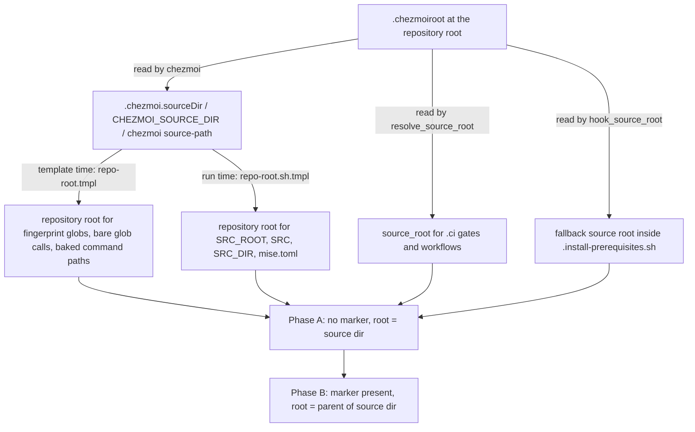

# Move the chezmoi Source State Under home/ - Plan

## Goal Capsule

- **Objective:** A contributor can add a file, directory, or tool output at the repository root without any of it reaching `$HOME`, and without remembering to deny it anywhere. The repository root becomes an ordinary repo root and only `home/` is chezmoi's business.
- **Means:** Move the source state under `home/` behind a one-line `.chezmoiroot`, after first separating "repository root" from "source root" everywhere the two are conflated (settled in `### Key Decisions`; mechanism in KTD1, KTD2, KTD3).
- **Product authority:** Issue #559 fixes scope and the settled decisions in `### Key Decisions`. This plan fixes the mechanism. Where the two disagree, the conflict call-out on the affected decision records the resolution.
- **Open blockers:** none.
- **Stop conditions:** Stop and report if a template-time reference cannot be classified as source-relative or repo-rooted; if chezmoi's rooted `CHEZMOI_SOURCE_DIR` does not reach the pre-hook on CI (R10 fails); or if the Phase B render-equivalence check (R9) shows any byte difference that is not explained by this plan.
- **Execution profile:** Two phases on one branch, each pushed and watched to green before the next starts. Phase A is a behaviour-preserving indirection; Phase B is the move. Never run `chezmoi apply`, `chezmoi init`, or anything that writes to the real `$HOME`.
- **Who finishes and ships:** The implementer lands both phases on `refactor/move-source-state`, opens the pull request against `main`, watches `ci.yml` and `render-dotfiles.yml` after every push, and merges once both are green (KTD6).

---

## Product Contract

### Summary

Introduce one root indirection at each of the three layers that reach outside the deployed tree: templates and rendered scripts derive the repository root from chezmoi's source directory, and `.ci/` and workflows derive the source root from the repository root, both by the `.chezmoiroot` marker rule, so the values are unchanged today and flip when `.chezmoiroot` exists. Then move the 29 source-state entries into `home/` in one rename-only commit, add `.chezmoiroot`, delete the `.chezmoiignore` lines that only existed to disown repository files, and re-scope the boundary gate to the new source root. The pre-hook `.install-prerequisites.sh` stays at the repository root and its hook path does not change.

### Problem Frame

Today the chezmoi source root and the git repository root are the same directory. Every non-dot entry that is not meant for `$HOME` must be denied by hand in `.chezmoiignore`, and `.ci/test-top-level-deployment-boundary.sh` exists because that list drifted twice. The gate holds the safety property, but the ergonomics remain: `packages/`, `crates/`, `system/`, `docs/`, `orca.yaml`, and every future root entry each need a denial line. chezmoi's documented remedy is `.chezmoiroot`, which this repository deferred in `docs/plans/2026-09-18-0854-feat-top-level-deployment-boundary-gate-plan.md` because 19 fingerprint call sites glob outside the source root and `.chezmoitemplates/fingerprint.tmpl` hard-fails on a zero-match glob. Issue #559 measured that coupling and asks for the move in two phases.

### Key Decisions

- **The work lands in two phases: separate the two roots without moving anything, then move.** The move itself stays reviewable as a pure rename. (session-settled: user-directed — chosen over a single move-and-fix change: a mixed commit hides the 19 template edits and the 43 `.ci` edits inside a 292-file rename.) Governs R1, R2, R3, R6.
- **`.chezmoiroot` contains `home`.** (session-settled: user-directed — chosen over keeping the source state at the repository root behind the hand-maintained denial list that #554 and #555 made checkable: the gate makes the boundary checkable, the move makes it structural, and the ideation ranked it first.) Governs R6, R8, R11.
- **The move is one commit that contains nothing but renames.** (session-settled: user-directed — chosen over a commit that renames and edits together: rename detection at full similarity is what keeps `git log --follow` intact across the move.) Governs R7.
- **Out of scope: the scaffolder (`scripts/new`) and any change to what deploys.** (session-settled: user-directed — chosen over bundling the ideation's third piece: this change moves where the source lives, not what lands in `$HOME`.) Governs R4, R9.

### Requirements

**Root separation (Phase A)**

- R1. Every template-time expression that reaches a repository-rooted tree (`system/`, `packages/`, `crates/`, `firmware/`, `mise.toml`) resolves its base directory through one shared repository-root value, and every source-relative expression keeps resolving through `.chezmoi.sourceDir`.
- R2. Every rendered-script body that reaches a repository-rooted tree at run time resolves the repository root at run time from chezmoi's exported source directory, and the rendered text carries no checkout-specific literal.
- R3. `.ci/` gates and the four workflows that name source-state paths resolve them through one `source_root` definition, and keep resolving repository-infrastructure paths through the repository root.
- R4. Phase A changes no target byte: the rendered target tree equals `main`'s, and rendered scripts differ from `main`'s only in the runtime resolver lines R2 introduces.
- R5. `.install-prerequisites.sh` keeps its `$HOME`-relative hook path, and when `CHEZMOI_SOURCE_DIR` is absent it resolves the source root the way chezmoi does, from its own directory and `.chezmoiroot`.

**The move (Phase B)**

- R6. The chezmoi source state lives under `home/`, `.chezmoiroot` names it, and the repository root holds only repository infrastructure plus `.chezmoiroot` and `.install-prerequisites.sh`.
- R7. The rename lands as one commit containing nothing but renames of the 29 source-state entries listed in the Appendix.
- R8. `.chezmoiignore` no longer denies repository entries that now sit outside the source root; host-gating lines and sub-path patterns stay.
- R9. Phase B changes no rendered byte relative to the Phase A head: the rendered target tree and every rendered script are byte-identical, with one named exception. `home/.chezmoiscripts/90-src/run_after_trust-agent-worktrees.sh.tmpl:23` bakes its source-relative path at render time, so its one rendered line gains `/home`; the script runs on every apply regardless, so the difference has no effect.
- R10. A fresh-machine bootstrap through the documented `init --apply` command and an already-provisioned host's next `apply` both work without a re-run of `chezmoi init`.

**Boundary safety**

- R11. Every non-dot name present at the source root on disk is either declared deployed or denied by the rendered ignore file, in every profile, whether or not git tracks it.
- R12. The boundary gate also proves the root indirection: `.chezmoiroot` names `home` after whitespace trimming, chezmoi and `.ci/lib` agree on the source root, no chezmoi input or source-attribute-prefixed entry sits at the repository root, and the hook script sits at the repository root and nowhere under `home/`.

**Conventions**

- R13. `AGENTS.md`, `README.md`, `CONCEPTS.md`, `system/README.md`, and `packages/README.md` describe the two roots and the new layout, and `CONCEPTS.md` defines *Source root* and *Repository root*.

### Success Criteria

- Both `ci.yml` and `render-dotfiles.yml` are green at the Phase A head and again at the Phase B head.
- The `rendered-files-<os>` artifacts of the Phase A run equal those of the `render-dotfiles.yml` run for `git merge-base main HEAD`; the `rendered-files-<os>` and `rendered-internals-<os>` artifacts of the Phase B run equal those of the Phase A run, apart from the one line R9 names.
- No managed host needs `chezmoi init` after pulling the move, and no `run_onchange_` script re-runs because of Phase B.
- The Phase A re-run set on a provisioned host is exactly the 17 runtime cross-root script templates named in U5, once.

### Scope Boundaries

- **In scope:** the three indirection layers, the 29-entry rename, `.chezmoiroot`, the denial-line deletions, the boundary gate re-scope, the hook fallback, the static path edits no indirection can carry, and the documentation in R13.
- **Outside this product's identity:** the scaffolder, any change to what deploys, migrating the 31 `.ci` gates that hand-roll their own `--source` invocation onto `.ci/lib/render-gate-helpers.sh` (their `--source "$repo_root"` keeps working and is not this change's business).
- **Deferred to follow-up work:** rendering the remaining host-gating `.chezmoiignore` lines from profile data (the ideation's second piece); renaming `.ci/test-top-level-deployment-boundary.sh` and its inventory, whose names still fit the source root's top level; resolving the baked source-relative path in `run_after_trust-agent-worktrees.sh.tmpl` at run time, which would make R9 exception-free but is not needed for correctness.

### Acceptance Examples

- AE1. Fresh bootstrap
  - **Covers:** R6, R10
  - **Given:** a clone at `~/src/github.com/hyperlapse122/dotfiles` after Phase B and no config file
  - **When:** the documented `init --apply --source ~/src/github.com/hyperlapse122/dotfiles` command runs
  - **Then:** chezmoi reads `.chezmoiroot`, renders `home/.chezmoi.toml.tmpl`, runs the hook from `~/src/github.com/hyperlapse122/dotfiles/.install-prerequisites.sh` with `CHEZMOI_SOURCE_DIR` set to `.../dotfiles/home`, and applies the same targets as before the move.
- AE2. Provisioned host pulls the move
  - **Covers:** R9, R10
  - **Given:** a host whose rendered config predates the move
  - **When:** the host pulls the merge and runs `apply`
  - **Then:** no "config file template has changed" warning appears, because the template's content is unchanged; no `run_onchange_` script re-runs, because no `run_onchange_` script's rendered bytes changed (the one changed line R9 names is in a `run_after_` script that runs on every apply); the hook path still resolves.
- AE3. Provisioned host pulls Phase A
  - **Covers:** R2, R4
  - **Given:** the same host at the Phase A head
  - **When:** it runs `apply`
  - **Then:** the 17 runtime cross-root scripts re-run once because their resolver lines changed; the install-system scripts install identical files and reload nothing; every other script is untouched.
- AE4. A generated file lands inside the source root
  - **Covers:** R11
  - **Given:** a non-dot file at `home/` that no inventory entry declares
  - **When:** the boundary gate runs
  - **Then:** it fails naming the file, the profile, and the two ways to resolve it.
- AE5. A chezmoi input is left at the repository root
  - **Covers:** R12
  - **Given:** a `.chezmoidata` directory or a `dot_example` file at the repository root
  - **When:** the boundary gate runs
  - **Then:** it fails, because chezmoi would silently ignore that entry.
- AE6. The repository-root indirection is load-bearing
  - **Covers:** R1
  - **Given:** a rooted fixture tree and a cross-root fingerprint call whose base is the source root instead of the repository root
  - **When:** the template renders
  - **Then:** `fingerprint.tmpl` fails with its zero-match message, proving the shared value is what makes the glob resolve.
- AE7. Either source pointer resolves the same roots
  - **Covers:** R1, R3
  - **Given:** the post-move tree
  - **When:** a render points `--source` at the repository root, and another points it at `home/`
  - **Then:** both report `.chezmoi.sourceDir` as `<repo>/home` and the repository root as `<repo>`.

### Sources / Research

- `.chezmoitemplates/fingerprint.tmpl:48` (`glob (joinPath $sourceDir $pattern)`), `:50` (emitted path is trimmed against the base), `:55` (zero-match hard fail). Because the emitted line is base-relative, a cross-root site whose base is the repository root emits the same `system/...` line before and after the move.
- `.chezmoitemplates/facts.tmpl:57-66` — the nested-worktree guard globs under `.chezmoi.sourceDir`; after the move it scans `home/` only, which is narrower and still correct.
- `.chezmoi.toml.tmpl:10` (`sourceDir` is the garden checkout root) and `:157-160` (the `$HOME`-relative hook path).
- `.install-prerequisites.sh:374`, `:378`, `:862-869`, `:1260-1262`, `:1323`, `:1809`, `:1916`, `:1930` — every source-root read goes through `CHEZMOI_SOURCE_DIR` with a `BASH_SOURCE` fallback that assumes the hook sits at the source root; the key file is read from `$source_root/.keys/`.
- chezmoi v2.72.2 `internal/cmd/config.go`. `getSourceDirAbsPath` joins `.chezmoiroot` onto the configured source directory. `runHook` runs a hook with the home directory as its working directory, so a relative `script` path is `$HOME`-relative. `CHEZMOI_SOURCE_DIR` is exported from the rooted value before the read-source-state hook runs. The working-tree walk stops at the first `.git` entry above the configured source directory. `internal/chezmoi/sourcestate.go:816-855` keys `run_onchange_` state by the target's absolute path, so a source move does not re-run scripts. Config-template drift is a content hash (`config.go:678-698`).
- Local probe with the installed chezmoi against a scratch tree whose `.chezmoiroot` holds `home`. `.chezmoi.sourceDir`, `CHEZMOI_SOURCE_DIR` inside the hook, and `chezmoi source-path` all report `<repo>/home`. A file at the repository root is absent from `managed --include=all`. `stat` on a missing path is false. `.chezmoi.workingTree` reports the `--source` value's git root, including a linked worktree whose `.git` is a file.
- `.ci/lib/render-gate-helpers.sh` (`require_file`, `render`, `render_ignore`, `render_reconciler`) and `.ci/lib/render-scratch.sh` — the render contract every gate must use; `--source` is always the repository root.
- `.ci/test-fingerprint-gates.sh:90-127` — the existing position-independence assertions that pin the exact `${CHEZMOI_SOURCE_DIR:-…}` spelling in 17 templates.
- `.ci/test-top-level-deployment-boundary.sh` and `.ci/top-level-boundary-inventory.yaml` — the five checks and the inventory this plan re-scopes.
- `.github/workflows/render-dotfiles.yml:121-135` (the fake `$HOME` reproduces the garden layout, so the real hook runs in CI), `:410-435` (render-internals walks `.chezmoiscripts` and `.chezmoiexternals` relative to the checkout), `:932` (the hook is shellchecked from the repository root).
- `.github/workflows/ci.yml:32-33`, `:56-69`, `:110-111`, `:179-196`, `:201-206`, `:264-268`, `:292-295` — every source-state path the CI workflow names.
- `packages/release-lock/src/cli.ts:7` and `packages/release-lock/test/cli.test.ts:426` — a build tree's hardcoded relative path into `.chezmoidata/`, which no indirection carries.
- `docs/solutions/integration-issues/chezmoi-worktree-root-etc-file-deployment.md` — the onchange cascade that compile-time `.chezmoi.sourceDir` in a script body caused, and the runtime-expansion fix this plan must keep.
- `docs/solutions/integration-issues/gitignored-paths-remain-visible-to-chezmoi.md` — why the source root is enumerated from disk; the hazard moves with the source root.
- `docs/ideation/2026-09-08-repo-structure-ideation.html` — the rank-1 idea and its stated downside (the 19 cross-root fingerprint sites).

### Count reconciliation

| Coupling | Issue #559 | Research scout | Verified here | Reading |
|---|---|---|---|---|
| `fingerprint.tmpl` call sites | 60 | 62 | 62 sites in 59 files: 60 in `.chezmoiscripts/`, 2 in `.chezmoitemplates/command-manifest.tmpl` | the issue counted `.chezmoiscripts/` only |
| cross-root fingerprint sites | 20 | 19 | 19 sites in 18 files | the issue's 20 is a file count: those 18 plus `dot_local/share/chezmoi-command-sources/executable_host-facts.tmpl:192` and `executable_gem80-firmware.tmpl:22`, two deployed command sources that bake the source directory into a repository-rooted path |
| other template-time cross-root expressions | — | — | 2, both in files already counted (`run_onchange_after_20-build-orchestration-hook.sh.tmpl:10`, `run_onchange_after_install-system-34-face-auth.sh.tmpl:23`) | not fingerprints, same base-directory fix |
| runtime cross-root script bodies | — | — | 17 templates (see U5) | neither source counted rendered-body references |
| `.ci/` joins to source-state paths | 112 joins in 43 files | 111 lines, 120 occurrences, 43 files | 105 lines in 43 files by a name-anchored regex; 253 `$repo_root` join lines in 61 files overall, of which 79 are repository-infrastructure joins that stay | file count agrees everywhere; line counts differ by counting method and are not load-bearing, because U1's lint proves completeness with zero remaining joins |
| workflows naming source paths | 4 | 4 | 4 | agree |
| build-tree references into the source state | — | — | 1 (`packages/release-lock/src/cli.ts:7`) plus `.taplo.toml:2-3` | static edits in U8 |

---

## Planning Contract

### Key Technical Decisions

- KTD1. **Template-time repository root is a marker-mirrored partial, `.chezmoitemplates/repo-root.tmpl`.** Given a source directory, it returns that directory's parent when the parent holds `.chezmoiroot`, else the directory itself. That is exactly chezmoi's own rule, read from the same file, so it is the source directory today and `dir .chezmoi.sourceDir` after the move with no edit in between; the issue's "flip the template definition" step is realized by adding `.chezmoiroot`, not by editing the partial. Every cross-root fingerprint call passes this value as its base, so the emitted fingerprint lines stay `system/...`, `packages/...`, `crates/...`, `mise.toml` and never change. It targets template-time evaluation only: fingerprint globs, the two bare `glob` calls, and the two deployed command sources that bake a path at render time. Governs R1. Rejected alternatives:
  - `.chezmoi.workingTree`: a git-working-tree concept that falls back to the `--source` value in a copy without `.git`, and no runtime command mirrors it.
  - An explicit two-step flip, `.` then `dir .`: edits 23 sites twice and re-runs the runtime scripts twice.
  - A `[data]` value in `.chezmoi.toml.tmpl`: baked into each host's rendered config, and wrong under `--source <worktree>`.
  - An inline `dir` at every site: no single owner.
- KTD2. **Runtime repository root is a shared shell partial, `.chezmoitemplates/repo-root.sh.tmpl`, and the rendered text is position-independent.** The partial renders a fixed snippet: resolve the source directory as today (`CHEZMOI_SOURCE_DIR`, else `chezmoi source-path`, else the working directory), then take its parent when that parent holds `.chezmoiroot`. It targets rendered script bodies only, so `docs/solutions/integration-issues/chezmoi-worktree-root-etc-file-deployment.md` is not regressed: no checkout path enters the text and the same text renders from every worktree. Cost, disclosed: the 17 templates that include it change their rendered text once at Phase A, so each re-runs once on every host at the next apply (AE3); Phase B then changes no rendered byte. Governs R2, R4, R9.
- KTD3. **`.ci/` and workflows resolve the source root with one function, `resolve_source_root`, in a new sourced library `.ci/lib/source-root.sh`, and `--source` stays the repository root.** The function reads `<root>/.chezmoiroot` when present and joins its trimmed content, else returns the root; chezmoi does the same, and the gate proves the two agree (R12). `render()` keeps `--source "$repo_root"` because chezmoi descends on its own; `require_file`, `render_ignore`, and `render_reconciler` resolve the source root internally, so their callers do not change. `require_file` classifies its path argument with the Appendix join-classification rule: a first segment in the source-state set joins onto the resolved source root; any other path, including `.ci/fixtures/...`, stays on `$repo_root`. Joins to `.ci/`, `packages/`, `crates/`, `system/`, `firmware/`, `mise.toml`, `docs/`, `.install-prerequisites.sh`, and `.chezmoiroot` stay on `$repo_root`. A test copying the whole checkout into a fixture resolves the fixture the same way; a test building a synthetic source directory by hand keeps pointing at it directly, because the synthetic tree has no `.chezmoiroot`. Rejected: a fixed `$repo_root/home` string in Phase B, which would need the flip edit the marker makes unnecessary and would leave Phase A and Phase B definitions disagreeing during the move. Governs R3.
- KTD4. **`.install-prerequisites.sh` stays at the repository root, the hook path is unchanged, and `.keys/` moves with the source state.** Three facts settle it. chezmoi runs a hook with the home directory as its working directory, so `script = "src/github.com/hyperlapse122/dotfiles/.install-prerequisites.sh"` names the garden checkout's repository root, independent of where the source root sits. Every provisioned host holds that literal in an already-rendered config, so moving the script would break each host's next `apply` until `chezmoi init` is re-run, while leaving it fixed keeps every deployed config valid and the config template's content unchanged (no drift warning). Inside a real hook run the script reads `.chezmoidata/`, `.chezmoitemplates/capability-cache-identity.sh`, and `.keys/gpg-<fpr>.asc` through `CHEZMOI_SOURCE_DIR`, which chezmoi exports from the rooted value before the hook runs, so those reads land under `home/` provided `.keys/` moves too. What must change is the fallback the hook uses when `CHEZMOI_SOURCE_DIR` is absent: "this file always sits at the source root" stops being true, so one helper resolves the hook's own directory through `.chezmoiroot`, the same rule as KTD1 and KTD3. Governs R5, R10. Verification is threefold:
  - The re-scoped gate asserts the literal's basename, its garden-path directory, the executable file at the repository root, and no copy under `home/` (R12).
  - `render-dotfiles.yml`'s `apply --init` job already reproduces the garden layout in a fake `$HOME` and runs the real hook, so the Phase B run is the fresh-bootstrap proof (AE1).
  - The hook's own tests cover the fallback (U6).
- KTD5. **The boundary gate is re-scoped to the source root, not retired.** The property it holds — a non-dot name at the source root is deployed only when declared, tracked or not — is exactly the generated-in-source hazard, and that hazard moves with the source root: a tool writing into `home/` would deploy. Checks 1 to 5 keep their logic with the tracked set read from `HEAD:home`, the disk enumeration over `home/`, and the ignore file rendered from `home/.chezmoiignore`. The inventory shrinks to the source root's entries; `repo-only` stays a valid class with no members, and `preemptive_denials` empties because `agents.lock` and `_artifacts` are generated at the repository root, outside the source root. Three checks are added for R12: `.chezmoiroot` exists and holds `home` after whitespace trimming, and `chezmoi source-path` under the render contract equals `resolve_source_root`; the repository root holds no `.chezmoi*` entry other than `.chezmoiroot` and no entry carrying a source-attribute prefix; the hook literal resolves as KTD4 states. Rejected: retiring the gate, which would leave a file dropped into `home/` deploying silently; a separate new gate, which would duplicate the render and inventory machinery. Governs R11, R12.
- KTD6. **Both phases land on `refactor/move-source-state` in one pull request, pushed as two groups, each watched to green.** Phase A commits land first and are pushed; both workflows must reach terminal green, which is the issue's Phase A acceptance. Phase B then lands as exactly two commits: the rename-only commit the third settled decision requires, and one commit carrying `.chezmoiroot`, the `.chezmoiignore` deletions, the gate re-scope, the static path edits, and the documentation. The rename-only commit is not a working tree on its own, and it does not need to be: the repository lands changes as merge commits and CI gates the branch head. `git log --follow` survives because the rename commit has full-similarity renames and nothing else. Conflict call-out on the first settled decision's two-pull-request wording: the issue asks for two pull requests; this run ships one branch, so the plan keeps the reviewability the split exists for through commit grouping and the per-phase CI checkpoint. Suboptimal but workable; recorded here rather than silently changed. Governs R7, R9.
- KTD7. **Verification keeps the render contract and adds a render-equivalence check.** `--source "$PWD"` from the repository root stays the only documented form in both phases; what changes is the template path on stdin, which gains the `home/` prefix after the move. Equivalence is measured twice. Locally, under the render contract: render every `.chezmoiscripts/**` and `.chezmoiexternals/**` template with `execute-template` into a scratch tree at the baseline and at the head, and diff the trees; render the target tree with `chezmoi archive --exclude=encrypted,externals,scripts` against a config rendered from the config template with its hooks block removed, extract, and diff. The archive omits scripts and is not byte-comparable, which is why scripts are rendered separately and why the CI artifacts are authoritative. In CI: download `rendered-files-<os>` and `rendered-internals-<os>` from the baseline run and the head run and diff them. The issue's "`chezmoi apply --init` render artifact identical" is exactly the CI artifact diff; it cannot run locally because a real `apply --init` is forbidden here, and the local archive check is its no-apply stand-in. Expected differences are enumerated, never waved through: the 17 resolver-line changes at Phase A, and the one baked line R9 names at Phase B. Governs R4, R9.

### High-Level Technical Design

Three layers name the same two directories. Each derives one root from the other with the marker rule, so adding `.chezmoiroot` is the only flip.



Directional sketch of the marker rule as each layer states it. This is guidance, not a specification.

```text
template:  parent := dir sourceDir; if stat (parent/.chezmoiroot) then parent else sourceDir
shell:     source_dir := ${CHEZMOI_SOURCE_DIR:-$(chezmoi source-path or pwd)}
           repo_root  := parent(source_dir) if [ -f parent/.chezmoiroot ] else source_dir
.ci:       resolve_source_root root := root/$(trimmed .chezmoiroot) if the file exists else root
```

### Assumptions

- `.keys/` is source state and moves into `home/`, because the hook reads the public key through `CHEZMOI_SOURCE_DIR` (KTD4).
- `--source` stays the repository root in the config (`sourceDir` at `.chezmoi.toml.tmpl:10`), in `AGENTS.md`, and in CI. Pointing `--source` at `home/` also works and is tolerated, not documented.
- The coordinator's one-branch constraint governs the pull-request shape (KTD6).
- The one-time re-run of the 17 runtime cross-root scripts at Phase A is acceptable and is disclosed in the pull request; no shape of the indirection avoids one text change to those bodies.
- `.chezmoiroot` holds exactly `home` with a trailing newline; chezmoi trims surrounding whitespace, and the gate pins the content.
- `fingerprintGlobs` entries in `.chezmoidata/commands.yaml` are repository-root-relative by convention, and `sourcePath` entries are source-root-relative; every current entry already follows this, and the file's comment will say so.
- The render-internals artifact keeps its layout (`.chezmoiscripts/...` at the artifact root) by changing into the source root before the walk, so artifact diffs across phases compare like with like.
- `.gitattributes` needs no edit: its `dot_face` pattern has no slash, so it matches at any depth, and `git check-attr` proves it after the move.
- The deployed command sources `executable_host-facts.tmpl` and `executable_gem80-firmware.tmpl` keep baking the repository root at render time through `repo-root.tmpl`; they are re-rendered targets, not onchange scripts, so a baked path is correct for them.
- `CONCEPTS.md` gains two glossary entries and revises two; direct edits are allowed there.
- Provisioned hosts need no `chezmoi init`: the config template content, its `sourceDir`, and the hook path are all unchanged by the move; `run_onchange_` state is keyed by target path, so nothing re-runs at Phase B.

### Sequencing

1. Phase A: U1 → U2 → U3 in order; U4 then U5 after U1; U6 last in the phase. Push, watch both workflows to green, record the artifact diff against the `render-dotfiles.yml` run for `git merge-base main HEAD` (if that run's artifacts are unavailable, merge `main` into the branch before the Phase A push and use the run of the resulting merge-base), and record the baseline run id in the pull request alongside the diff result (R4).
2. Phase B: U7 (rename-only commit), then U8 and U9 in one commit. Push, watch both workflows to green, record the artifact diff against the Phase A run (R9).
3. Open the pull request after the Phase A push if it is not open yet; merge only after the Phase B run is green.

### System-Wide Impact

- **Provisioned hosts:** one re-run of the 17 runtime cross-root scripts at Phase A (`sudo` prompts for the install-system and SELinux installers, rebuilds in `60-build`); nothing at Phase B. The install-system reload rule reloads only changed services, so the re-run reloads nothing.
- **Development worktrees:** unchanged. A worktree render still uses `--source <worktree root>`; chezmoi descends into its `home/`.
- **CI:** artifact layouts unchanged; two extra render-equivalence comparisons recorded in the pull request.
- **Agent instructions:** `AGENTS.md` verification and layout paragraphs change; `.chezmoitemplates/agents-instructions.tmpl` does not, because the shared core never names source-state paths.

### Risks & Dependencies

- **Missed cross-root reference.** Mitigated by AE6-style fixtures, by the zero-match `fail` in `fingerprint.tmpl` (loud at Phase B render), and by the `.ci` lint in U1. A runtime miss shows as path-not-found in the affected script's own test or in the render-internals shellcheck job.
- **Hook environment on a real host differs from the probe.** The probe used the installed chezmoi and the pinned source; the CI `apply --init` job runs the real hook at Phase B. If `CHEZMOI_SOURCE_DIR` were unrooted there, `read_user_data` fails loudly on the missing `.chezmoidata/user.yaml` at the repository root, where the unrooted value would point it, which is the stop condition.
- **A test's synthetic fixture copied only parts of the tree.** Those tests copy `.chezmoidata`, `.chezmoitemplates`, and single scripts into a flat scratch source; they keep working because the copies come from `$source_root` and the scratch tree has no marker (KTD3).
- **Dependency:** the pinned chezmoi (`.chezmoidata/releases.json`, v2.72.2) and the installed one (v2.72.1) share the `.chezmoiroot` and hook code paths verified here.

---

## Implementation Units

**Phase A — separate the two roots (no behaviour change)**

### U1. Source-root resolver library and its gate

- **Goal:** One `.ci/lib` definition of the source root, proven equal to chezmoi's, plus a lint that keeps `.ci/` from joining source-state names onto the repository root.
- **Requirements:** R3, R12
- **Dependencies:** none
- **Files:** `.ci/lib/source-root.sh` (new, sourced, non-executable), `.ci/lib/render-gate-helpers.sh`, `.ci/test-source-root.sh` (new, executable), `.github/workflows/ci.yml` (`repo-meta` job list), `.ci/test-ci-wiring.sh` (only if its library check needs the new file declared)
- **Approach:**
  1. Add `resolve_source_root <root>`: return `<root>` when `<root>/.chezmoiroot` is absent; otherwise join the file's whitespace-trimmed content, refusing an empty, absolute, or parent-escaping value and a value naming a missing directory.
  2. Make `require_file`, `render_ignore`, and `render_reconciler` resolve `$repo_root` through it before joining a source-state path; leave `render()` on `--source "$repo_root"`. `require_file` classifies its path argument with the Appendix join-classification rule: a first segment in the source-state set joins onto the resolved source root; any other path, including `.ci/fixtures/...`, stays on `$repo_root`.
  3. Write the gate: resolver unit cases on scratch trees, a parity case rendering `{{ .chezmoi.sourceDir }}` under the render contract and comparing it with the resolver, and a lint over `.ci/**/*.sh` (excluding itself) that fails on any `$repo_root`-style join to `.chezmoi.toml.tmpl`, `.chezmoidata`, `.chezmoiexternals`, `.chezmoiignore`, `.chezmoiremove`, `.chezmoiscripts`, `.chezmoitemplates`, `.keys`, `Library`, or a name starting with `dot_`, `private_`, `symlink_`, or `remove_`.
  4. Wire the gate into the `repo-meta` job.
- **Patterns to follow:** `.ci/lib/render-scratch.sh` header and sourcing convention; the mutant-fixture discipline of `.ci/test-ci-wiring.sh`.
- **Test scenarios:**
  - A root without `.chezmoiroot` resolves to itself.
  - A root whose `.chezmoiroot` holds `home` plus a trailing newline resolves to `<root>/home`.
  - A `.chezmoiroot` with surrounding spaces resolves like the trimmed value.
  - An empty `.chezmoiroot`, an absolute value, and a value containing `..` each fail with a message naming the file.
  - A value naming a directory that does not exist fails.
  - Parity: for this checkout, the resolver's answer equals the `.chezmoi.sourceDir` a render reports under the render contract.
  - Parity holds for a rooted scratch tree as well.
  - `require_file` accepts a source-state path in a rooted scratch tree and `render_ignore` renders that tree's ignore file.
  - `require_file` accepts a `.ci/fixtures/agent-instructions/` path in a rooted scratch tree whose `home/` contains no `.ci`.
  - Lint: the clean checkout passes.
  - Lint mutant: a fixture script joining `$repo_root/.chezmoidata/facts.yaml` is rejected with the offending line named.
  - Lint negative control: a join to `$repo_root/packages/x`, to `$repo_root/.ci/lib/bun.sh`, and to `$repo_root/.chezmoiroot` is accepted.
  - `.ci/test-ci-wiring.sh` passes with the new gate and library present.
- **Verification:** the new gate passes locally and in the `repo-meta` job; every gate that sources `render-gate-helpers.sh` still passes, including `.ci/test-agent-instructions.sh`.

### U2. Re-point the `.ci` joins

- **Goal:** Every `.ci` read of a source-state path goes through `source_root`; every repository-infrastructure read stays on `repo_root`.
- **Requirements:** R3
- **Dependencies:** U1
- **Files:** the 43 `.ci/*.sh` files U1's lint names; the heaviest are `.ci/test-gpg-key-data.sh`, `.ci/test-host-fact-probes.sh`, `.ci/test-capability-cache.sh`, `.ci/test-omp-transition.sh`, `.ci/test-fact-cache-parsing.sh`, and `.ci/test-orchestration-hook.sh`; also `.ci/lib/gem80-firmware-data.sh`
- **Approach:**
  1. After the `repo_root` line in each file, source `.ci/lib/source-root.sh` and set `source_root`.
  2. Replace each join to a source-state name; keep joins to `.ci/`, `packages/`, `crates/`, `system/`, `firmware/`, `mise.toml`, `docs/`, `.install-prerequisites.sh`.
  3. Where a test copies `.chezmoidata`, `.chezmoitemplates`, or scripts into a scratch source, copy from `$source_root`; the scratch tree itself keeps its flat layout and its own `--source`.
  4. `test-host-fact-probes.sh` exports `CHEZMOI_SOURCE_DIR="$source_root"` to the hook, not `$repo_root`.
- **Patterns to follow:** KTD3's classification rule; `.ci/check-skip-declarations.sh` and `.ci/test-compound-engineering-overlays.sh` take the root as `$1` and resolve inside.
- **Test expectation:** none new — this unit is proven by U1's lint reporting zero joins and by every existing gate passing unchanged, which is the no-behaviour-change acceptance.
- **Verification:** U1's lint is clean; the `agent-reconciliation`, `render-gates`, `fatal-boundary`, `commands`, `repo-meta`, and `compound-engineering` jobs pass.

### U3. Re-point the four workflows

- **Goal:** The workflows name source-state paths through the resolver and keep their artifact layouts.
- **Requirements:** R3
- **Dependencies:** U1
- **Files:** `.github/workflows/ci.yml`, `.github/workflows/render-dotfiles.yml`, `.github/workflows/refresh-release-lock.yml`, `.github/workflows/gem80-firmware-rebuild-weekly.yml`
- **Approach:**
  1. In every step that reads `.chezmoidata/releases.json` or renders a template from stdin, source `.ci/lib/source-root.sh` and prefix the path with the resolved root; the `for item in ".chezmoiscripts/...:name"` lists keep their relative spellings.
  2. In `render-dotfiles.yml`, resolve the source root inside the `SRC` copy for the `.chezmoiexternals` removal and the `dot_omp` comparison; change into the source root before the render-internals `find`, so `rendered-internals` keeps `.chezmoiscripts/...` at its root; resolve the copies used by the undeclared-fact and missing-probe steps.
  3. In `refresh-release-lock.yml`, pass the resolved lock path to `--out`, the diff, and the commit path.
- **Patterns to follow:** `ci.yml:44-69`, which already resolves `chezmoi_bin` before narrowing `PATH`.
- **Test expectation:** none new — the workflow runs are the test. `.ci/test-ci-wiring.sh` parses the edited YAML.
- **Verification:** both workflows green at the Phase A head; the `rendered-internals-<os>` artifact tree lists `.chezmoiscripts/` at its root; `.ci/test-ci-wiring.sh` passes.

### U4. Template-time repository root

- **Goal:** The 19 cross-root fingerprint calls, the 2 bare cross-root `glob` calls, and the 2 baked command paths take their base from `.chezmoitemplates/repo-root.tmpl`.
- **Requirements:** R1, R4
- **Dependencies:** U1 (test harness)
- **Files:** `.chezmoitemplates/repo-root.tmpl` (new), `.chezmoitemplates/fingerprint.tmpl` (usage comment), `.chezmoitemplates/command-manifest.tmpl`, `.chezmoidata/commands.yaml` (comment on `fingerprintGlobs`), the 17 script templates in the `### Count reconciliation` table's cross-root set (`00-tools/run_onchange_after_10-build-command-reconcile.sh.tmpl`, `00-tools/run_onchange_before_00-selinux-policies.sh.tmpl`, the nine `30-linux/run_onchange_after_install-system-{10,12,14,16,18,20,24,26,28}` templates, `30-linux/run_onchange_after_install-system-34-face-auth.sh.tmpl`, the five `60-build` templates), `dot_local/share/chezmoi-command-sources/executable_host-facts.tmpl`, `dot_local/share/chezmoi-command-sources/executable_gem80-firmware.tmpl`, `.ci/test-fingerprint-gates.sh`, `AGENTS.md` (the fingerprint contract snippet gains the cross-root form)
- **Approach:**
  1. Write the partial as KTD1 states; it takes the source directory string as its argument and returns the repository root string.
  2. At each cross-root site, bind `$repoRoot` from the partial and pass it as the fingerprint base; keep `$sourceDir` for source-relative globs in the same file (`command-manifest.tmpl:66` stays on `$sourceDir`, `:75` and `:77` move to `$repoRoot`).
  3. Point the two bare `glob` calls and the two baked command paths at `$repoRoot`.
- **Patterns to follow:** `.chezmoitemplates/release-lock-ref.tmpl` as a small pure partial; the existing `$sourceDir := .chezmoi.sourceDir` binding at line 2 of each script.
- **Test scenarios (in `.ci/test-fingerprint-gates.sh`):**
  - The partial returns the source directory for a flat scratch source.
  - The partial returns the parent for a rooted scratch source whose parent holds `.chezmoiroot`.
  - A cross-root site rendered from this checkout emits fingerprint lines identical to the `main` baseline (same relative paths, same hashes).
  - Covers AE6. In a rooted scratch tree, a fingerprint call with the source directory as base and a `system/...` glob fails with the zero-match message; the same call with the partial's value succeeds.
  - `command-manifest.tmpl` produces the same build-unit identities as before (`.ci/test-command-manifest.sh` unchanged and green).
  - The rendered `host-facts` and `gem80-firmware` commands carry the same absolute path as before Phase A.
- **Verification:** the render-gates and commands jobs pass; the Phase A artifact diff shows no change in `rendered-files-<os>`.

### U5. Runtime repository root

- **Goal:** The 17 rendered script bodies that reach a repository-rooted tree resolve the repository root at run time through `.chezmoitemplates/repo-root.sh.tmpl`.
- **Requirements:** R2, R4
- **Dependencies:** U1, U4
- **Files:** `.chezmoitemplates/repo-root.sh.tmpl` (new), `.chezmoiscripts/00-tools/run_once_before_mise-trust.sh.tmpl`, `.chezmoiscripts/00-tools/run_onchange_before_00-selinux-policies.sh.tmpl`, `.chezmoiscripts/00-tools/run_onchange_after_10-build-command-reconcile.sh.tmpl`, the nine `30-linux/run_onchange_after_install-system-{10,12,14,16,18,20,26,28,34}` templates, the five `60-build` templates, `.ci/test-fingerprint-gates.sh` (position-independence assertions at lines 90-127), `CONCEPTS.md` (*Position-independent script rendering* gains one sentence on the repository root)
- **Approach:**
  1. Render the snippet KTD2 describes; the partial's rendered text contains no path literal.
  2. In each template, include the partial once before the first use and assign `SRC_ROOT`, `SRC`, `SRC_DIR`, or `config` from `$repo_root`.
  3. Rewrite the four assertion loops in `.ci/test-fingerprint-gates.sh` to require the partial's include and a `$repo_root`-based assignment instead of the old inline spelling; keep the leaked-literal check.
- **Execution note:** disclose the one-time re-run set in the pull request description (AE3) and confirm from the rendered-internals diff that exactly these 17 files changed.
- **Patterns to follow:** `.chezmoitemplates/bun-resolve.sh.tmpl` and `skip.sh.tmpl`, shell partials included with `| trim`.
- **Test scenarios (in `.ci/test-fingerprint-gates.sh`):**
  - The rendered partial contains no absolute path and no checkout-specific literal.
  - Executed with `CHEZMOI_SOURCE_DIR` set to a flat scratch source, the snippet yields that directory.
  - Executed with `CHEZMOI_SOURCE_DIR` set to a rooted scratch source's `home/`, the snippet yields the scratch root.
  - Executed with `CHEZMOI_SOURCE_DIR` unset and a stub `chezmoi` on `PATH` whose `source-path` prints a rooted `home/`, the snippet yields the root.
  - Executed with neither, the snippet yields the working directory.
  - Every one of the 17 templates includes the partial and assigns its path variable from `$repo_root`; a fixture template with the old inline spelling is rejected.
  - Rendering an install-system template from this checkout leaks no repository path into the body.
- **Verification:** render-gates and fatal-boundary jobs pass; the Phase A rendered-internals diff against `main` touches only these 17 files and only the resolver lines.

### U6. Hook source-root fallback

- **Goal:** `.install-prerequisites.sh` resolves the source root like chezmoi when `CHEZMOI_SOURCE_DIR` is absent, from its own directory and `.chezmoiroot`.
- **Requirements:** R5
- **Dependencies:** U2 (both edit `.ci/test-host-fact-probes.sh`)
- **Files:** `.install-prerequisites.sh`, `.ci/test-capability-cache.sh` (`resolve_root_case` block near line 743), `.ci/test-key-custody-hook.sh`, `.ci/test-host-fact-probes.sh`
- **Approach:**
  1. Add `hook_source_root`: `CHEZMOI_SOURCE_DIR` when set; else the hook's own directory joined with a trimmed `.chezmoiroot` when that file exists beside the hook; else the hook's own directory.
  2. Replace the four `BASH_SOURCE` fallbacks (`usb_device_listed` at lines 374 and 378, `write_capability_cache`, `read_user_data`) with it; `run_key_presence_check` keeps taking the root as an argument.
  3. Correct the comment at line 862-865 that says the file always sits at the source root.
- **Patterns to follow:** the existing `${1:-${CHEZMOI_SOURCE_DIR:-}}` argument convention in the same file; the seam-only sourcing (`_INSTALL_PREREQUISITES_TEST_SOURCE=1`) the tests use.
- **Test scenarios:**
  - `write_capability_cache` with `CHEZMOI_SOURCE_DIR` unset, run from a scratch copy of the hook beside a `.chezmoiroot` naming `home`, reads the registry from `home/.chezmoidata/`.
  - The same call from a flat scratch copy reads from the hook's own directory (the existing `resolve_root_case` behaviour).
  - `read_user_data` with no argument and no environment resolves `home/.chezmoidata/user.yaml` through the marker.
  - `fact_fingerprint_reader` and `fact_ir_camera` with `CHEZMOI_SOURCE_DIR` unset read their tables through the marker.
  - A `.chezmoiroot` naming a missing directory makes the key presence check fail loudly rather than fall back.
  - Sourcing the hook in seam-only mode still defines every function `.ci/test-key-custody-hook.sh` lists.
- **Verification:** `.ci/test-capability-cache.sh`, `.ci/test-key-custody-hook.sh`, and `.ci/test-host-fact-probes.sh` pass; the hook is unchanged in a real run because `CHEZMOI_SOURCE_DIR` is always set there.

**Phase B — the move**

### U7. The rename-only commit

- **Goal:** The 29 source-state entries move into `home/` in one commit that contains nothing but renames.
- **Requirements:** R6, R7
- **Dependencies:** U1 through U6 pushed and green
- **Files:** the 29 entries listed in the Appendix, 292 tracked files, moved to `home/<entry>`
- **Approach:**
  1. Move every entry with git's rename operation into `home/`; touch nothing else, including `.chezmoiroot`, which belongs to U8.
  2. Confirm the commit's stat with rename detection shows 292 renames at full similarity and no additions, deletions, or modifications.
  3. Confirm the LFS filter still applies to `home/dot_face` and that `git log --follow` on one script template and one `dot_config` file crosses the commit.
- **Execution note:** this commit is not a working tree on its own (no `.chezmoiroot` yet); do not run any gate against it, and do not push it before U8 is committed.
- **Test expectation:** none — a pure rename; the proof is the commit's rename-only stat and the follow check above.
- **Verification:** the three confirmations in Approach hold.

### U8. Read from `home/`, drop the denials, re-scope the gate

- **Goal:** chezmoi reads `home/`, the denial lines that only disowned repository entries are gone, the boundary gate holds R11 and R12 at the new source root, and the static references no indirection carries point at `home/`.
- **Requirements:** R6, R8, R9, R10, R11, R12
- **Dependencies:** U7
- **Files:** `.chezmoiroot` (new), `home/.chezmoiignore`, `.ci/test-top-level-deployment-boundary.sh`, `.ci/top-level-boundary-inventory.yaml`, `packages/release-lock/src/cli.ts`, `packages/release-lock/test/cli.test.ts`, `.taplo.toml`, `.github/workflows/render-dotfiles.yml`
- **Approach:**
  1. Add `.chezmoiroot` holding `home`.
  2. In `home/.chezmoiignore`, delete the repository-files block (the `./AGENTS.md` through `./system` lines and their comments), the `./crates`, `./packages`, `./firmware` lines, and the `./agents.toml`, `./agents.lock`, `./orca.yaml`, `./orca.schema.json` lines; keep `./Library` and every sub-path pattern.
  3. Re-scope the gate. Resolve `source_root` with U1's library, read the tracked set from `HEAD:<source root relative to the repository>` (`HEAD:home`), enumerate `home/` on disk, and render `home/.chezmoiignore`.
  4. Add the three R12 checks with their fixtures, and update the gate's header comment.
  5. Rewrite the inventory to the source root's entries. Keep the class vocabulary and the profile list, and leave `preemptive_denials` empty with a comment saying why.
  6. Point `DEFAULT_LOCK_PATH` at `../../../home/.chezmoidata/releases.json` and strengthen its test to assert the file exists. Prefix the two `.taplo.toml` include globs with `home/`.
  7. Add an `apply` job (no `--init`) to `render-dotfiles.yml`: run `chezmoi init --apply` at the Phase A head in the fake `$HOME` the existing `apply --init` job already reproduces, then re-check out the Phase B head in place and run `chezmoi apply` without `init`; assert the log carries no "config file template has changed" warning and executes no `run_onchange_` script.
- **Execution note:** write the gate's new mutant fixtures before touching the inventory, so the first green run proves detection rather than coincidence.
- **Patterns to follow:** the existing `fixture`/`expect_reject` discipline in the gate; `.ci/test-chezmoiignore-script-paths.sh:121-128` for the profile list.
- **Test scenarios (in `.ci/test-top-level-deployment-boundary.sh`):**
  - The real tree passes with the source root at `home/` in all six profiles.
  - Covers AE4. A non-dot file placed in `home/` that no entry declares fails with the default-deny message.
  - Covers AE5. A `.chezmoidata` directory at the repository root fails the stray-input check; a `dot_example` file at the repository root fails it too.
  - A missing `.chezmoiroot` fails; a `.chezmoiroot` holding `src` fails naming the expected value.
  - Parity: `chezmoi source-path` under the render contract equals the resolver's answer for this checkout.
  - The hook literal's basename is `.install-prerequisites.sh`, its directory is `src/github.com/hyperlapse122/dotfiles`, the file at the repository root is executable, and no `home/.install-prerequisites.sh` exists; a fixture with the hook copied under `home/` fails.
  - A stale `./AGENTS.md` denial left in the ignore file fails check 4 as a denial matching no declared entry.
  - Every existing mutant (undeclared tracked entry, exposed repo-only, withheld deployed, stale, duplicate, thinned profiles, unknown `only_on`, orphan preemptive) still rejects.
  - `packages/release-lock/test/cli.test.ts`: the default lock path resolves to an existing file.
- **Verification:** the `repo-meta` job and `.ci/test-chezmoiignore-script-paths.sh` pass. `render-dotfiles.yml`'s `apply --init` job succeeds, which is AE1 executed for real, and its `apply` (no `init`) job succeeds, which is AE2 executed for real and proves R10's already-provisioned-host half. The Phase B artifact diff against the Phase A run is empty for both artifact kinds apart from the one line R9 names.

### U9. Documentation and vocabulary

- **Goal:** The repository's own instructions describe the two roots and the `home/` layout.
- **Requirements:** R13
- **Dependencies:** U8 (same commit)
- **Files:** `AGENTS.md` (lines 3, 7, 9, 13-19, 81-97, 151), `README.md` (the bootstrap steps and the layout section starting at line 346), `CONCEPTS.md` (*Top-level deployment boundary*, *Generated-in-source path*, new *Source root*, new *Repository root*), `system/README.md` (lines 5-21), `packages/README.md` (line 18), `packages/release-lock/README.md` (lines 3, 19-22, 52, 68, 147-148), `firmware/nuphy-gem80-hostrgb/README.md` (lines 48, 95), `home/.chezmoitemplates/fingerprint.tmpl` (usage comment), `.ci/top-level-boundary-inventory.yaml` (header)
- **Approach:**
  1. `AGENTS.md`: state that the source state lives under `home/` behind `.chezmoiroot`. Replace "non-dot metadata MUST be listed in the root `.chezmoiignore`" with the rule that repository infrastructure lives outside `home/` and the gate enforces the source root. Keep `--source "$PWD"`, add that the template path on stdin starts with `home/`, and show both fingerprint forms.
  2. `README.md`: the clone still lands at the garden path; the source state is `home/`; the layout list moves the deployed entries under `home/` and keeps `system/`, `crates/`, `packages/` as repository trees.
  3. `CONCEPTS.md`: define *Source root* (the directory chezmoi reads, named by `.chezmoiroot`) and *Repository root*; revise the two boundary entries to say "source root".
  4. `system/README.md` and `packages/README.md`: replace the `.chezmoiignore` explanation with the structural one; describe `SRC_ROOT` as resolved from the repository root at run time.
  5. `packages/release-lock/README.md` and `firmware/nuphy-gem80-hostrgb/README.md`: prefix every `.chezmoidata/`, `.chezmoiexternals`, `.chezmoitemplates`, and `dot_config/` reference with `home/`.
- **Test expectation:** none — prose; `git diff --check` and `.ci/test-agent-roster.sh` (which reads `README.md` and `AGENTS.md` for roster parity) must stay green; a repository-wide search of Markdown outside `docs/` for `.chezmoidata/`, `.chezmoiscripts/`, `.chezmoitemplates/`, `.chezmoiexternals/`, `.chezmoiignore`, `.chezmoiremove`, and `dot_`/`private_`/`symlink_`-prefixed paths finds none left unmoved.
- **Verification:** the paragraphs cited in Files no longer describe the flat layout; the `AGENTS.md` verification snippet renders a template from `home/` under the render contract; the repository-wide documentation search in Test expectation is clean.

---

## Verification Contract

Every render check runs under the contract in `AGENTS.md` "Verification (never deploy live `$HOME`)": per-user scratch, stub `op`, empty config, throwaway destination, `--source "$PWD"` from the repository root. `--source` does not change after `.chezmoiroot` exists; the template path on stdin gains `home/`.

| Gate or check | Proves | When |
|---|---|---|
| `.ci/test-source-root.sh` | resolver semantics, parity with chezmoi, zero raw `.ci` joins | U1, U2, every push |
| `.ci/test-fingerprint-gates.sh` | template partial, runtime partial, position independence, AE6 | U4, U5, every push |
| `.ci/test-capability-cache.sh`, `.ci/test-key-custody-hook.sh`, `.ci/test-host-fact-probes.sh` | hook fallback through the marker | U6, every push |
| `.ci/test-top-level-deployment-boundary.sh` | R11 at `home/`, R12, AE4, AE5, hook path | U8, every push |
| `.ci/test-chezmoiignore-script-paths.sh`, `.ci/test-command-manifest.sh`, `.ci/test-ci-wiring.sh` | ignore rendering, build-unit identities, wiring of the new gate and library | every push |
| `packages/release-lock` tests (`ts-workspace` job) | default lock path | U8 |
| `render-dotfiles.yml` `apply --init` (Linux and macOS) | AE1: real hook, rooted `CHEZMOI_SOURCE_DIR`, full apply | Phase B push |
| `render-dotfiles.yml` `apply` (no `init`, Linux and macOS) | AE2, R10: an already-provisioned host survives the move without a `chezmoi init` re-run | Phase B push |
| Render-equivalence, local | rendered scripts and archived targets at head equal the baseline, with the archive blind spot stated | before each push |
| Render-equivalence, CI artifacts | `rendered-files-<os>` equal the `render-dotfiles.yml` run for `git merge-base main HEAD` at Phase A; both artifact kinds equal Phase A at Phase B | after each green run |
| `git diff --check`, `git status`, scope-limited diff | hygiene | before each commit |

Both `ci.yml` and `render-dotfiles.yml` are watched to terminal success after every push, with one blocking watcher per workflow.

---

## Definition of Done

**Global**

- Phase A pushed, both workflows green, and the `rendered-files-<os>` artifacts equal the `render-dotfiles.yml` run for `git merge-base main HEAD`; the rendered-internals diff names exactly the 17 U5 templates and only their resolver lines.
- Phase B pushed as the rename-only commit plus one commit, both workflows green, and both artifact kinds equal the Phase A run apart from the one line R9 names.
- The pull request description carries the two artifact-diff results, the Phase A one-time re-run set, and `Closes #559`.
- No `Unapplied review findings` section remains; every review finding is applied or filed.
- No abandoned or experimental code remains in the diff; scratch trees stay under the scratch directory.
- No `chezmoi apply` or `chezmoi init` ran against a real `$HOME` at any point.

**Per unit**

| Unit | Done when |
|---|---|
| U1 | new gate and library wired; parity and lint scenarios green; helpers resolve internally |
| U2 | lint reports zero raw joins; every existing gate green |
| U3 | both workflows green; artifact layouts unchanged |
| U4 | 23 template-time sites use the partial; AE6 scenario green; `rendered-files` unchanged |
| U5 | 17 runtime sites use the partial; position-independence assertions rewritten and green; rendered-internals diff limited to those files |
| U6 | four fallbacks replaced; hook tests cover marker and flat cases |
| U7 | one commit, 292 renames at full similarity, nothing else; LFS attribute and follow checks hold |
| U8 | `.chezmoiroot` present; denial lines removed; gate green with new mutants; `apply --init` and `apply` (no `init`) jobs green; artifact diff against Phase A empty apart from the one line R9 names |
| U9 | every cited paragraph describes the new layout; `.ci/test-agent-roster.sh` green |

---

## Appendix

### The 29 entries that move (292 tracked files)

`.chezmoi.toml.tmpl`, `.chezmoidata`, `.chezmoiexternals`, `.chezmoiignore`, `.chezmoiremove`, `.chezmoiscripts`, `.chezmoitemplates`, `.keys`, `Library`, `dot_agents`, `dot_androidrc.tmpl`, `dot_bunfig.toml`, `dot_claude`, `dot_codex`, `dot_config`, `dot_default-gems.tmpl`, `dot_default-python-packages.tmpl`, `dot_face`, `dot_local`, `dot_npmrc`, `dot_omp`, `dot_ssh`, `dot_wakatime.cfg.tmpl`, `dot_yarnrc.yml`, `dot_zshenv`, `private_dot_gnupg`, `private_readonly_dot_mcp.json.tmpl`, `remove_dot_gitconfig`, `symlink_dot_face.icon`.

Stays at the repository root: `.install-prerequisites.sh` (KTD4), `.ci`, `.compound-engineering`, `.gitattributes`, `.github`, `.gitignore`, `.mise`, `.shellcheckrc`, `.taplo.toml`, `.vscode`, `AGENTS.md`, `CONCEPTS.md`, `LICENSE`, `README.md`, `STRATEGY.md`, `agents.toml`, `crates`, `docs`, `firmware`, `mise.lock`, `mise.toml`, `orca.schema.json`, `orca.yaml`, `package.json`, `packages`, `system`, plus the untracked `.agents`, `.claude`, `.codegraph`, `agents.lock`, `_artifacts`.

### `.chezmoiignore` lines U8 deletes

Lines 1-19 (`# Repository files` through `./system`, including the `_artifacts` comment and line), lines 123-127 (`./crates`, `./packages`, `./firmware` and their comment), lines 181-187 (`./agents.toml`, `./agents.lock`, `./orca.yaml`, `./orca.schema.json` and their comments). Line numbers refer to the file before the rename.

### Join classification rule for U2 and U3

- Source state (resolve through `source_root`): any path whose first segment is `.chezmoi.toml.tmpl`, `.chezmoidata`, `.chezmoiexternals`, `.chezmoiignore`, `.chezmoiremove`, `.chezmoiscripts`, `.chezmoitemplates`, `.keys`, `Library`, or starts with `dot_`, `private_`, `symlink_`, `remove_`.
- Repository infrastructure (keep `repo_root`): `.ci`, `.github`, `docs`, `packages`, `crates`, `system`, `firmware`, `mise.toml`, `mise.lock`, `package.json`, `.install-prerequisites.sh`, `.chezmoiroot`.
- A variable naming a whole-checkout copy (`$SRC` in `render-dotfiles.yml`, the `unknown` and `missing` copies) is a root: resolve it. A variable naming a hand-built scratch source is already a source root: join directly.
