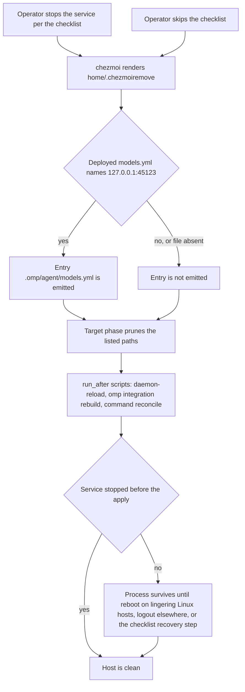

# Antigravity Sidecar Retirement - Plan

## Goal Capsule

- **Objective:** after a host applies this change, omp sends `google-antigravity/*` requests straight to the provider, and nothing on the host starts the local proxy on `127.0.0.1:45123` again. The repository no longer builds, deploys, or documents that proxy as a live component.
- **Means:** delete the sidecar sources, prune every deployed target through one `home/.chezmoiremove` block, and give the stop of the live service to an operator checklist (KTD1, KTD2, KTD3).
- **Authority:** the `AGENTS.md` rule "Never add teardown/revert scripts" outranks any recommendation to stop the service inside apply. Issue #563 sets the scope. No CI gate is weakened or skipped to pass. Existing files under `docs/plans/` and `docs/ideation/` stay unchanged.
- **Execution profile:** source deletions, template and data edits, two rewritten shell gates, workflow assertions, and operator docs. The change adds no runtime code. The proof is the repository's gate scripts, a frozen workspace install, and the two CI workflows.
- **Stop conditions:** stop and report when one of these holds.
  - The lockfile cannot reach a state where `vp install --frozen-lockfile` passes with only the two sidecar hunks removed (KTD4).
  - A gate passes only after it is weakened.
  - A step would need the real `op`, a live `chezmoi apply`, or omp.
- **Who finishes and ships:** this run implements, verifies, opens the pull request, and merges it when both workflows are green. The operator runs `docs/decommission/antigravity-sidecar.md` on each deployed host. The run does not.

---

## Product Contract

### Summary

This change retires the `antigravity-sidecar` proxy. It deletes the package, the systemd unit, the LaunchAgent, the activation script, and the `models.yml` override that routed omp through the proxy. One `home/.chezmoiremove` block prunes what deployed hosts already hold, and CI proves each prune entry with a canary. An operator checklist owns the stop of the live service.

### Problem Frame

Upstream bug can1357/oh-my-pi#11689 made omp report false 429 quota errors on Google Antigravity. The sidecar worked around it by rewriting system-prompt text on a loopback proxy. Upstream closed the bug as completed on 2026-09-13. The proxy now only costs: a build on every source change, an always-on user service, and a `models.yml` override that makes every `google-antigravity/*` request fail when the proxy is down.

Deleting sources does not clean a host. chezmoi stops managing a target when its source goes away, and it leaves the deployed copy in place. A host that keeps the 0444 `~/.omp/agent/models.yml` keeps the dead `baseUrl`, and omp then fails with connection refused as soon as the proxy stops. omp also caches the provider endpoint in `~/.omp/agent/models.db`, so a host can keep calling the dead endpoint after `models.yml` is gone. The unit has `Restart=on-failure` and the LaunchAgent has `KeepAlive=true`, so a supervisor can try to start a binary that the prune already removed.

### Requirements

**Source removal**

- R1. The repository holds no sidecar package, systemd unit, wants symlink, LaunchAgent template, or activation script.
- R2. The omp integration build no longer fingerprints, builds, or stages the sidecar. It still builds and stages the `omp-orca` extension, and it still preserves the last staged file when a build fails.
- R3. `home/.chezmoidata/commands.yaml` declares no `antigravity-sidecar` unit, and `packages/bun.lock` matches the remaining workspace set, so `vp install --frozen-lockfile` passes.

**omp routing**

- R4. No managed `models.yml` exists. The apply that removes the sidecar targets also removes a deployed `~/.omp/agent/models.yml` that still names the sidecar endpoint.
- R5. A `~/.omp/agent/models.yml` that does not name the sidecar endpoint survives every apply unchanged.
- R6. `home/.chezmoidata/agents.yaml` keeps `providers.antigravityEndpoint: auto`.

**Deployed-host cleanup**

- R7. One apply removes every sidecar path a host received, on Linux, on macOS, and in a container. KTD2 lists the paths.
- R8. Apply never stops, disables, or boots out the live service. `docs/decommission/antigravity-sidecar.md` gives the operator the stop commands, their order relative to the apply, the recovery path for a host that applied first, the steps that clear the cached `google-antigravity` model list and restart running omp sessions, and the checks that prove a clean host.

**Proof and documentation**

- R9. Both apply jobs of `.github/workflows/render-dotfiles.yml` prove each prune entry with a seeded canary. `.ci/test-omp-transition.sh` proves the prune block and the `models.yml` gate locally, and it keeps its Antigravity CLI cases.
- R10. No live reference to `antigravity-sidecar` or `45123` remains in the repository. Retirement records may name them, and the Key Decision below lists those files.
- R11. `AGENTS.md`, `README.md`, `packages/README.md`, and `docs/operations/omp-transition.md` describe direct routing and name no running sidecar.

### Key Decisions

- **Retirement records may name the retired paths.** The issue asks for a `.chezmoiremove` cleanup and also for zero references outside historical docs. Both cannot hold, because a prune entry must spell the path it removes. The allowed residual set is `home/.chezmoiremove`, `.github/workflows/render-dotfiles.yml`, `.ci/test-omp-transition.sh`, `docs/decommission/antigravity-sidecar.md`, the one checklist link in `docs/operations/omp-transition.md`, and everything under `docs/plans/` and `docs/ideation/`. A sha256 digest in `home/.chezmoidata/releases.json` contains `45123` by chance and also stays. Governs R10.

### Acceptance Examples

- AE1. **Covers R4.** Given a host whose `~/.omp/agent/models.yml` holds `baseUrl: http://127.0.0.1:45123`, when it applies, then the file is gone.
- AE2. **Covers R5.** Given a host whose `~/.omp/agent/models.yml` defines other providers and never names that endpoint, when it applies twice, then the file is byte-identical.
- AE3. **Covers R7.** Given a container that built the sidecar and received the unit, the wants symlink, and the state directory, when it applies, then every KTD2 path is gone.
- AE4. **Covers R7.** Given a host that never deployed the sidecar, when it applies, then every prune entry is a no-op and apply exits 0.
- AE5. **Covers R7, R8.** Given a Linux host with the unit running whose operator skipped the checklist, when it applies, then the files are gone and no script in the apply named the unit. The next login starts no sidecar, because the unit and the wants symlink no longer exist.

### Scope Boundaries

- The `google-antigravity/*` model roster, the omp settings reconciler, and the Antigravity CLI retirement logic stay as they are. That covers the first block of `home/.chezmoiremove` and the Antigravity CLI cases of `.ci/test-omp-transition.sh`.
- The change adds no stop, teardown, or revert script (KTD1).
- No implementation or verification step runs omp, a live `chezmoi apply`, or the real `op`. Live omp checks belong to the operator checklist.
- `packages/README.md` states `bun@1.4.0` while `packages/package.json` pins `bun@1.4.2`. That drift predates this work and stays out of it.

---

## Planning Contract

### Key Technical Decisions

- KTD1. **The operator checklist owns the stop of the live service. Apply gains no stop script.** `AGENTS.md` says "Never add teardown/revert scripts" and names "document a one-time manual reversal" as the allowed path. Five checklists under `docs/decommission/` already follow it. `docs/decommission/cli-proxy-api.md` retired a user unit plus a LaunchAgent this way, and `docs/decommission/ydotool.md` handled a pruned `ExecStart` target this way. A plain `run_before_` stop script in `home/.chezmoiscripts/70-agents/` was the alternative. It is a teardown script, so the rule rejects it. The cost of a skipped checklist is bounded. The prune removes the wants symlink and the plist, so no supervisor starts the sidecar at the next login. The surviving process serves nothing, because R4 removes the override in the same apply. This repository enables lingering on its Linux hosts (`loginctl enable-linger` in `home/.chezmoiscripts/30-linux/run_onchange_after_install-system-22-host.sh.tmpl`), so there the process survives logout and ends only at reboot or at the checklist's recovery stop. On macOS and on Linux hosts without lingering, it ends at logout. No stop script exists, so no removal condition needs tracking, no skip-declaration site is added, and the frozen totals in `.ci/check-skip-declarations.sh` do not move.
- KTD2. **One ungated `home/.chezmoiremove` block removes all nine deployed paths without a provenance check.** chezmoi never deletes a target because its source was deleted, so every path a host received needs an entry. No OS or container gate applies. The container block of `home/.chezmoiignore` excludes none of `60-build`, `70-agents`, `.config/systemd/user`, or `.local/bin`, so containers received every target. macOS received the inert systemd files for the same reason. The names are specific to this repository, so removal is unconditional, as in the codex-wrapper block. That block also shows that `command-reconcile` leaves the artifacts of a dropped unit behind, so its four paths are listed. The codex-wrapper block missed the quarantine directory, which `packages/command-reconcile/src/paths.ts` also defines per unit. Each entry is the path below without the `~/` prefix.

| Deployed path | What created it |
|---|---|
| `~/.config/systemd/user/antigravity-sidecar.service` | chezmoi file target |
| `~/.config/systemd/user/default.target.wants/antigravity-sidecar.service` | chezmoi symlink target |
| `~/Library/LaunchAgents/app.dotfiles.antigravity-sidecar.plist` | chezmoi file target, macOS only |
| `~/.local/bin/antigravity-sidecar` | `command-reconcile` public link |
| `~/.local/lib/commands/current/antigravity-sidecar` | `command-reconcile` current generation |
| `~/.local/lib/commands/store/antigravity-sidecar` | `command-reconcile` store |
| `~/.local/lib/commands/quarantine/antigravity-sidecar` | `command-reconcile` quarantine |
| `~/.local/share/chezmoi-commands/incomplete/antigravity-sidecar` | build staging directory |
| `~/.local/state/dotfiles-antigravity-sidecar` | activation script state |

- KTD3. **The `models.yml` source is deleted, and its prune entry fires only while the deployed file names the sidecar endpoint.** An absent `models.yml` is omp's stock state. The file entered the repository with the sidecar in commit cca0cfed, and its whole content is the `baseUrl` override. An empty `providers:` map would rest on omp parsing that nobody verified. The path is also omp's own user-configuration file, so a permanent unconditional entry would delete any `models.yml` an operator writes later. The block therefore follows the render-time check of the Antigravity CLI block. It calls `stat` on the deployed file, reads it with `include`, and emits `.omp/agent/models.yml` only when the content contains `127.0.0.1:45123`. The entry renders to nothing after the first apply.
- KTD4. **`packages/bun.lock` is regenerated by the pinned toolchain, and the accepted diff is bounded.** Run `vp install` in `packages/` after the package directory is gone. The sidecar's three devDependencies equal those of `omp-orca`. The only valid diff therefore removes the `antigravity-sidecar` block under `workspaces` and the `@h82/antigravity-sidecar` line under `packages`. Any other hunk means the resolver moved a version, which the exact-pin and cooldown rules forbid, so that result is discarded. The fallback is to delete exactly those two hunks by hand. In both cases `vp install --frozen-lockfile` passes before U1 is done.
- KTD5. **The package deletion, the build-script edit, the manifest unit removal, and the lockfile update land in one commit.** `home/.chezmoitemplates/fingerprint.tmpl` fails the render when a glob matches zero files. The build script and `home/.chezmoitemplates/command-manifest.tmpl` both pass sidecar globs to it, so deleting the package alone breaks every render on every host and in CI. A lockfile that still lists the workspace fails the frozen install in phase 60 and aborts the apply.
- KTD6. **`providers.antigravityEndpoint: auto` stays declared.** `auto` is omp's own default, and with no `baseUrl` override it selects omp's built-in endpoint. The settings reconciler asserts declared leaves only. Removing the declaration would not reset a host, and it would stop the correction of a drifted one. Only the sidecar rationale leaves the docs.
- KTD7. **Prune canaries are regular files or directories, the plist canary is seeded on macOS only, and the `models.yml` canary carries the sidecar endpoint.** `test ! -e` follows symlinks, so a dangling-symlink canary passes without any prune. `home/.chezmoiignore` ignores `./Library` off macOS, so a plist canary in the Linux job proves nothing. An empty `models.yml` canary never satisfies the KTD3 check, so it would survive and fail the assertion. In `.github/workflows/render-dotfiles.yml`, job `apply` is the Fedora container job and job `apply-macos` is the macOS job.

### High-Level Technical Design

The diagram shows the first apply on a host that holds the sidecar. chezmoi fixes the order: it renders `home/.chezmoiremove` when it reads the source state, prunes in the target phase, and only then runs `run_after_` scripts. Nothing in the apply touches the live service (KTD1).



### Sequencing

U1 and U2 touch disjoint files and can run in parallel. U3 and U4 depend on U2, because they repeat the KTD2 path list and the KTD3 check. All four units ship in one pull request, and no intermediate state is deployable. Between U2 and U3 the `cmp` assertions in `.github/workflows/render-dotfiles.yml` name a deleted source file. Without U2, a fresh host fails in the activation script, because nothing builds its binary.

### Risks and Operational Notes

- **A skipped checklist leaves an orphan process.** On macOS, launchd also logs a spawn failure every three seconds if that process exits before logout. On lingering Linux hosts the orphan survives logout and holds the port until reboot or the recovery stop. KTD1 bounds the damage, and the checklist carries the recovery commands.
- **The upstream fix may be absent from the omp release a host runs.** False 429 errors would return. The checklist's live request detects it. The rollback is a revert of the pull request. The sources return, and the next apply rebuilds and restarts the sidecar.
- **The first apply reruns the omp integration build once per host.** The rendered script changes, so chezmoi runs it again. It runs `vp install --frozen-lockfile` and rebuilds the `omp-orca` extension. The pull request description discloses this side effect.
- **A running omp session keeps the sidecar endpoint.** It holds the endpoint in memory, and `~/.omp/agent/models.db` holds it in the cached `google-antigravity` model list. A new session reads the cache, so it fails too. The checklist clears the cache row and restarts each session with `omp --resume <session-id>`.
- **`vp install` may re-resolve versions.** KTD4 bounds the accepted diff and names the fallback.

### Sources

- `AGENTS.md`, section "Apply lifecycle and script tree": the "Never add teardown/revert scripts" paragraph, and the phase table that places `60-build` before `65-commands` and `70-agents`.
- `home/.chezmoiremove`: the Antigravity CLI block for a render-time check on a deployed path, the ydotool block for the pruned-`ExecStart` hazard, the codex-wrapper block for `command-reconcile` artifacts, and the `chezmoi-secrets-sync` block for the note that containers receive `.local/bin`.
- `home/.chezmoiignore`: the `./Library` gate and the container block.
- `home/.chezmoitemplates/fingerprint.tmpl` and `home/.chezmoitemplates/command-manifest.tmpl`: the zero-match failure and its two callers.
- `docs/decommission/cli-proxy-api.md` and `docs/decommission/ydotool.md`: the shape and the wording of a service retirement checklist.
- `.github/workflows/render-dotfiles.yml`: jobs `apply` and `apply-macos` seed canaries in their apply step and assert in "Assert .chezmoiremove prunes target files". Both pass `--exclude=scripts,encrypted`.
- `.github/workflows/ci.yml`: it runs `bash .ci/test-omp-transition.sh`, renders the build script for `.ci/test-build-omp-integration.sh`, and runs the frozen install in job `ts-workspace`.
- `docs/solutions/integration-issues/identity-indirection-hides-migration-gaps-until-flip.md`: why a `.ci` gate reaches source state through `resolve_source_root` or `join_source_state`.
- Commit be7b3cd2 "chore(commands): retire tokscale codex wrapper": a manifest unit removed together with its sources, tests, and docs.

---

## Assumptions

- `auto` is omp's built-in default for `providers.antigravityEndpoint`. The installed omp v18.2.5 binary contains `antigravityEndpointMode ?? "auto"`, and `omp config list --json` describes the key as an enum routing strategy. If this is wrong, nothing changes on hosts, because the declared value stays `auto` as it is today (KTD6).
- With `auto` and no `baseUrl` override, omp reaches `google-antigravity/*` through its built-in endpoint, as it did before commit cca0cfed added the override. The operator checklist confirms this with one live request. The run cannot.
- The omp release that hosts run carries the upstream fix for #11689. The issue states only that upstream closed the bug. The same live request is the check.
- chezmoi skips a `.chezmoiremove` match that `.chezmoiignore` ignores, so the plist entry is inert off macOS. If this is wrong, the entry is still harmless there, because the path never exists on Linux.
- Every KTD2 name is unique to this repository, so no operator owns a same-named file at one of those paths.

---

## Implementation Units

### U1. Remove the sidecar build surface

- **Goal:** the repository stops building, staging, declaring, and describing the sidecar, in one commit that keeps every render and the frozen install working.
- **Requirements:** R1, R2, R3, R11. Governed by KTD4 and KTD5.
- **Dependencies:** none.
- **Files:**
  - delete `packages/antigravity-sidecar/`
  - modify `home/.chezmoiscripts/60-build/run_onchange_after_30-build-omp-integration.sh.tmpl`
  - modify `home/.chezmoidata/commands.yaml`
  - modify `packages/bun.lock`
  - modify `home/.chezmoiscripts/00-tools/run_after_90-activate-command-links.sh.tmpl`
  - modify `.ci/test-build-omp-integration.sh`
  - modify `AGENTS.md`, `README.md`, `packages/README.md`
- **Approach:**
  1. Delete the package directory.
  2. In the build script, remove the four `packages/antigravity-sidecar/*` fingerprint globs, the sidecar `vp run build` line, and the sidecar `stage_file` call. Keep the `omp-orca` build, its staging call, and the `stage_file` function.
  3. Remove the `antigravity-sidecar` unit from `home/.chezmoidata/commands.yaml`.
  4. Update the lockfile per KTD4.
  5. In the command-links script, drop `antigravity-sidecar` from the comment that names what `70-agents` reads first.
  6. Rewrite `.ci/test-build-omp-integration.sh` around the extension artifact, per the scenarios below.
  7. In `AGENTS.md`, delete the sidecar paragraph under `## omp runtime integration`.
  8. In `README.md`, remove the sidecar clause from the `packages/` structure bullet. In the paragraph that starts "The local sidecar listens", replace the two sidecar sentences with one sentence that says omp sends `google-antigravity/*` requests directly to the provider. Keep the sentence about Antigravity CLI's managed files.
  9. In `packages/README.md`, remove the member row. That file calls the same-commit update of these three documents the repository's documentation-sync rule.
- **Execution note:** this unit is mostly deletion and packaging. Prove it with renders and the frozen install rather than with new unit tests.
- **Patterns to follow:** commit be7b3cd2 for the shape of a unit retirement. `.ci/test-build-figma-auth.sh` for a build gate that runs a rendered script against a fake source tree.
- **Test scenarios** (`.ci/test-build-omp-integration.sh`, run against the rendered build script):
  - Happy path: the fake source holds only `packages/omp-orca/dist/dotfiles-orca.js`. The run exits 0, and the staged `~/.local/share/dotfiles-omp/dotfiles-orca.js` is byte-identical to it.
  - Happy path: the `mise` stub records its arguments. One run records the frozen install and exactly one `vp run build`, in `packages/omp-orca`.
  - Edge: a second run exits 0 and leaves the staged extension unchanged.
  - Error: with `BUILD_FAILURE=1` the run exits non-zero, and the staged extension still equals its copy from before the failure.
  - Error: with the staged extension replaced by a symlink, the run exits non-zero. The symlink is still a symlink, and the file it points to is unchanged.
  - Error: with `dotfiles-orca.js` removed from the fake source, the run exits non-zero, and a previously staged extension is unchanged.
  - Integration: the build script template renders for `linux` and for `darwin` with `packages/antigravity-sidecar/` absent, and `bash -n` accepts both outputs.
  - Integration: `.ci/test-command-manifest.sh` passes, which proves that the command manifest renders without the unit's globs.
- **Verification:** the rendered build script and the rendered command manifest contain no sidecar path. `vp install --frozen-lockfile` passes in `packages/`. The lockfile diff is exactly the two hunks that KTD4 names. The workspace build, typecheck, test, and check tasks pass for the remaining members.

### U2. Delete the deployed-target sources and add the prune block

- **Goal:** the sources of every chezmoi-deployed sidecar target and of `models.yml` are gone, and one `home/.chezmoiremove` block removes what hosts already hold.
- **Requirements:** R1, R4, R5, R7, R8, R9. Governed by KTD1, KTD2, and KTD3. Covers AE1, AE2, AE3, AE4, and the file half of AE5.
- **Dependencies:** none. U1 touches different files.
- **Files:**
  - delete `home/dot_config/systemd/user/antigravity-sidecar.service`
  - delete `home/dot_config/systemd/user/default.target.wants/symlink_antigravity-sidecar.service`
  - delete `home/Library/LaunchAgents/app.dotfiles.antigravity-sidecar.plist.tmpl`
  - delete `home/.chezmoiscripts/70-agents/run_after_activate-antigravity-sidecar.sh.tmpl`
  - delete `home/dot_omp/private_agent/private_readonly_models.yml`
  - modify `home/.chezmoiremove`
  - modify `.ci/test-omp-transition.sh`
- **Approach:**
  1. Delete the five sources. `home/Library/LaunchAgents/` then holds nothing and leaves git. `home/Library/Application Support/` keeps `home/Library/` in place.
  2. Append one commented block to `home/.chezmoiremove`. It holds the nine KTD2 entries and the checked `models.yml` entry from KTD3.
  3. Write the block comment in short plain sentences. It records why the block has no OS or container gate, why removal is unconditional, and why the `models.yml` entry is checked. It names `docs/decommission/antigravity-sidecar.md` as the owner of the stop, to be run before the first apply. It states that the `models.yml` entry must go if `models.yml` becomes a managed target again.
  4. In `.ci/test-omp-transition.sh`, keep the Antigravity CLI cases, which end before the line that seeds `.local/bin/antigravity-sidecar`. Replace everything after them, except the final pass line, with the prune cases below. The `systemctl` and `launchctl` stubs go, because nothing calls them. Reach every source-state path through `$source_root`.
- **Execution note:** write the prune cases first and watch them fail against the current `home/.chezmoiremove`. A prune test that never failed proves nothing.
- **Patterns to follow:** the Antigravity CLI block at the top of `home/.chezmoiremove`. The existing cases of `.ci/test-omp-transition.sh`, which render the remove list against a scratch home, copy it into a scratch source, and apply it twice.
- **Test scenarios** (`.ci/test-omp-transition.sh`):
  - Happy path. Covers AE1 and AE3. The scratch home holds all nine KTD2 paths in their deployed shape and a `models.yml` that contains `baseUrl: http://127.0.0.1:45123`. The `linux` render of `home/.chezmoiremove` contains each of the ten entries as an exact line. After the first apply and after the repeat apply, no path exists, and neither symlink remains as a dangling link.
  - Deployed shape for that case: the wants entry is a symlink to `../antigravity-sidecar.service`, `.local/bin/antigravity-sidecar` is a symlink into `current/`, and the state directory holds a `service-revision` file.
  - Covers AE2. `models.yml` holds an operator-written provider and never names the endpoint. The render omits `.omp/agent/models.yml`, and the file is byte-identical after both applies.
  - Edge: `models.yml` is absent. The render succeeds and omits the entry.
  - Edge. Covers AE4. The scratch home holds none of the paths. Both applies exit 0.
  - Edge: the `darwin` render contains the same ten entries, which proves that the block has no OS gate.
  - Integration: sibling state survives both applies. The siblings are a `default.target.wants/orca-settings-reconcile.service` symlink, a second file in `.local/bin`, and `.omp/agent/agent.db`.
  - Regression: the Antigravity CLI cases pass unchanged.
- **Verification:** `bash .ci/test-omp-transition.sh` prints its pass line. `.ci/test-source-root.sh` passes. `.ci/check-skip-declarations.sh` passes with the frozen totals unchanged, because the deleted script was a plain `run_after_` and the change adds no script.

### U3. Prove the prune in both render-dotfiles apply jobs

- **Goal:** CI fails when any entry of the new block stops matching its deployed path.
- **Requirements:** R9. Governed by KTD2, KTD3, and KTD7.
- **Dependencies:** U2.
- **Files:** modify `.github/workflows/render-dotfiles.yml`.
- **Approach:**
  1. In the canary seeding of job `apply`, add the eight KTD2 paths other than the plist. In job `apply-macos`, add all nine.
  2. In both jobs, change the `models.yml` seed from an empty file to content that names `127.0.0.1:45123`.
  3. In both "Assert .chezmoiremove prunes target files" steps, replace the `cmp` against `private_readonly_models.yml` with `test ! -e`. Add `test ! -e` for each seeded path under "Ungated prunes must be removed".
  4. Keep `canary-sibling` in `.local/bin` as the scope control. Add nothing to the list that drops surviving canaries in job `apply`, because every new canary is pruned.
- **Execution note:** this workflow cannot run locally. `bash .ci/test-omp-transition.sh` is the local proof of the same block, and the pushed run is the proof of these assertions. Both jobs pass `--exclude=scripts`, so they prove the target-phase prune only. Under KTD1 that is the whole mechanism.
- **Patterns to follow:** the `chezmoi-secrets-sync` and `unmanaged-repo-guard` canaries in the same two steps.
- **Test scenarios:**
  - Happy path, job `apply`: the eight canaries and the endpoint-bearing `models.yml` are absent after `chezmoi apply --init`, in a container where the `container` fact is true.
  - Happy path, job `apply-macos`: the nine canaries, the plist included, and the endpoint-bearing `models.yml` are absent after the apply.
  - Edge: `.local/bin/canary-sibling` and `.omp/agent/agent.db` still exist in both jobs.
  - Error: a misspelled entry in `home/.chezmoiremove` leaves its canary in place, and the step fails at that `test ! -e` line.
- **Verification:** both workflows reach terminal success on the pushed branch. The workflow holds no remaining reference to `private_readonly_models.yml`.

### U4. Write the operator docs

- **Goal:** an operator can stop the live service, apply, and confirm a clean host from one checklist, and the transition guide describes direct routing.
- **Requirements:** R8, R11. Governed by KTD1, KTD2, and KTD6. Covers the operator half of AE5.
- **Dependencies:** U2.
- **Files:** create `docs/decommission/antigravity-sidecar.md`. Modify `docs/operations/omp-transition.md`.
- **Approach:**
  1. Create the checklist in the shape of `docs/decommission/cli-proxy-api.md`. It opens with the "operator-run, not automated" label and the statement that chezmoi executes none of it and that no teardown script exists or may be added.
  2. Order the sections: stop before the first apply, apply, clear the omp model cache, verify, recover a host that applied first, confirm direct routing.
  3. Stop commands. Linux: `systemctl --user disable --now antigravity-sidecar.service`. macOS: `launchctl bootout "gui/$(id -u)/app.dotfiles.antigravity-sidecar"`, with a note to ignore "No such process".
  4. Say why the order matters in two sentences, and cite `docs/decommission/ydotool.md` for the full analysis. The apply prunes the unit's `ExecStart` target and the LaunchAgent's program while `Restart=on-failure` and `KeepAlive=true` are live.
  5. Cache section: exit running omp sessions, back up `~/.omp/agent/models.db`, and run `sqlite3 ~/.omp/agent/models.db "delete from model_cache where provider_id='google-antigravity'"`. Then restart each session with `omp --resume <session-id>`. omp refetches the model list on the next start.
  6. Verify section: nothing listens on `127.0.0.1:45123`, every KTD2 path is missing, and `~/.omp/agent/models.yml` is missing or operator-owned. `sqlite3 ~/.omp/agent/models.db "select count(*) from model_cache where instr(models,'45123')>0"` prints `0`. Name `ss -ltnp` for Linux and `lsof -nP -iTCP:45123 -sTCP:LISTEN` for macOS.
  7. Recovery section: the same stop commands still work after the files are gone, and Linux adds `systemctl --user reset-failed antigravity-sidecar.service`. On a lingering Linux host the recovery stop is required, because the process survives logout. On macOS and on Linux hosts without lingering, the process ends at the next logout, because nothing starts the sidecar again.
  8. Direct-routing section: one `google-antigravity/*` request from omp succeeds with the sidecar stopped. An upstream quota error must surface as a failure.
  9. In `docs/operations/omp-transition.md`, rewrite the opening sentence so that the provider is used directly. In `## Deployment`, remove "sidecar" from the build-phase sentence, remove the mention of phase-70 service activation, and delete the two sidecar paragraphs. State in one sentence that `providers.antigravityEndpoint` stays `auto`, omp's default routing (KTD6). Replace check 1 with a link to the checklist. Rewrite check 5 to cover streaming, a tool call, and cancellation on the direct route.
- **Test expectation:** none -- prose only, and no gate parses these files. The reference check in the Verification Contract bounds what they may name.
- **Verification:** the checklist contains every KTD2 path, both stop commands, and the cache commands. `docs/operations/omp-transition.md` names the sidecar only in the checklist link.

---

## Verification Contract

Rows 1 to 5 need `chezmoi` on `PATH` and no network. Each gate builds its own scratch directory and stub `op`. Rows 6 and 7 need the pinned toolchain: `vp`, and the Bun version that `packages/package.json` pins in `packageManager`. A worker without that toolchain states the gap, and job `ts-workspace` in `.github/workflows/ci.yml` is then the proof.

| # | Command | Proves | Units |
|---|---|---|---|
| 1 | `bash .ci/test-omp-transition.sh` | The prune block, the `models.yml` check, and the Antigravity CLI cases | U2 |
| 2 | Render `home/.chezmoiscripts/60-build/run_onchange_after_30-build-omp-integration.sh.tmpl` with the scratch recipe in `AGENTS.md`, then `bash .ci/test-build-omp-integration.sh <rendered script>` | The build stages the extension only and preserves it on failure | U1 |
| 3 | `.ci/test-command-manifest.sh` | The command manifest renders without the unit | U1 |
| 4 | `.ci/check-skip-declarations.sh` | The frozen totals stay at 150 owners and 225 rendered instances | U1, U2 |
| 5 | `.ci/test-source-root.sh` | No gate joins `$repo_root` to a source-state name | U2 |
| 6 | `vp install --frozen-lockfile` in `packages/` | The lockfile matches the workspace set | U1 |
| 7 | `vp run -r build`, `vp run -r typecheck`, `vp run -r test`, and `vp check` in `packages/` | The remaining members build and pass | U1 |
| 8 | The reference check below | R10 | U1 to U4 |
| 9 | `git diff --check` and `git status` | No whitespace error, and no file outside the unit file lists | U1 to U4 |
| 10 | One blocking watcher per workflow after the push | `render-dotfiles.yml` and `ci.yml` reach terminal success, including the `shellcheck` job | U1 to U4 |

The render in row 2 follows the mandatory recipe in `AGENTS.md`: a per-user scratch directory, a stub `op`, an empty config, `--source "$PWD"`, a throwaway destination, and `PATH="$scratch/bin:/usr/bin:/bin"`.

The reference check prints exactly one line, the checklist link in `docs/operations/omp-transition.md`:

```bash
git grep -n -e antigravity-sidecar -e 45123 -- \
  ':!docs/plans' ':!docs/ideation' \
  ':!home/.chezmoiremove' \
  ':!.github/workflows/render-dotfiles.yml' \
  ':!.ci/test-omp-transition.sh' \
  ':!docs/decommission/antigravity-sidecar.md' \
  ':!home/.chezmoidata/releases.json'
```

---

## Definition of Done

**Global**

- Every requirement R1 to R11 is true, and every acceptance example holds.
- Rows 1 to 9 of the Verification Contract pass locally, and row 10 is green on the pushed branch. The only allowance is the one the Verification Contract gives for rows 6 and 7.
- The reference check prints only the checklist link.
- The diff holds no file outside the unit file lists, no commented-out sidecar code, and no leftover from an abandoned attempt.
- No existing file under `docs/plans/` or `docs/ideation/` changed.

**Per unit**

- U1. Rows 2, 3, 6, and 7 pass, the lockfile diff is the two KTD4 hunks, and the three documents name no sidecar.
- U2. Rows 1, 4, and 5 pass, and the five sources are gone.
- U3. Both apply jobs assert every seeded canary with `test ! -e`, and no `cmp` on `models.yml` remains.
- U4. The checklist exists with its six sections, and the transition guide names the sidecar only in the checklist link.
