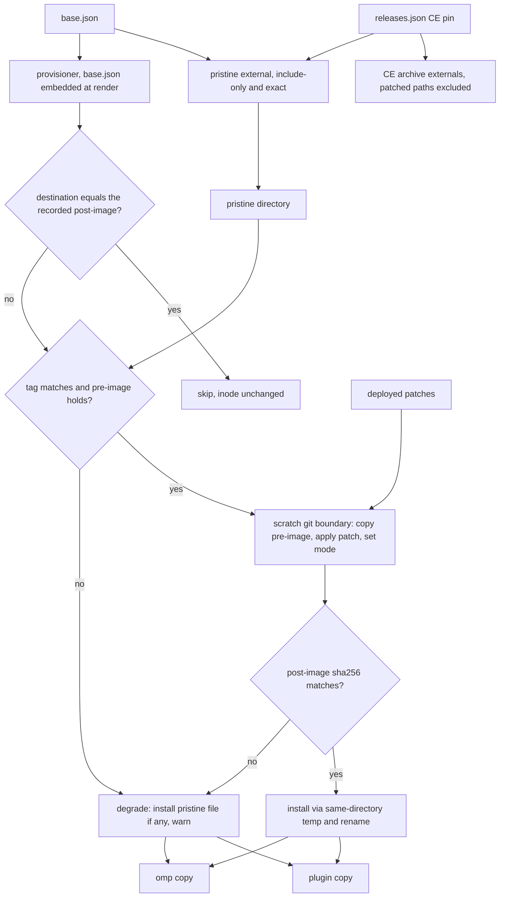
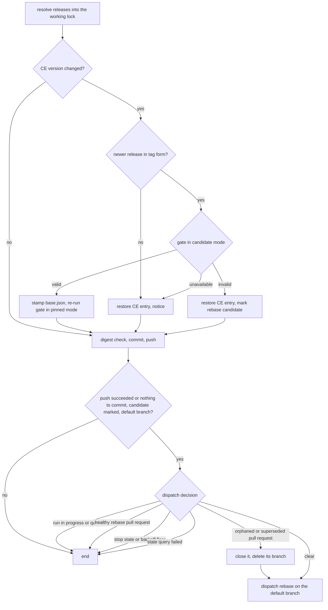
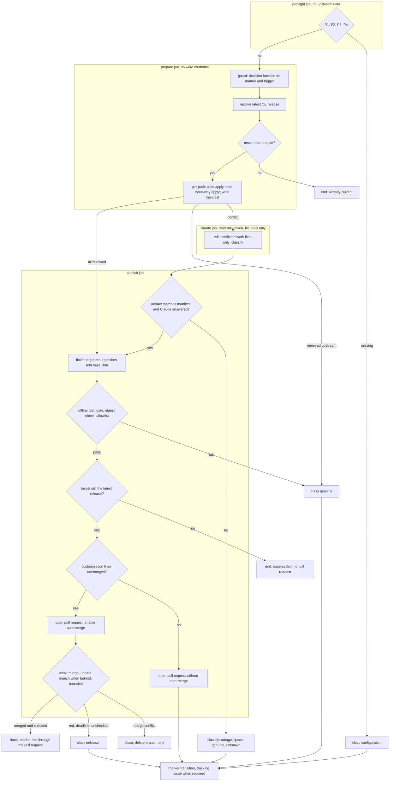
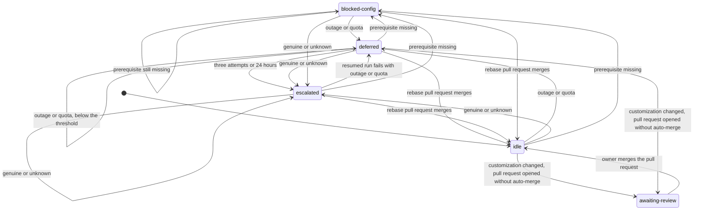

# CE Overlays as Validated Patches - Plan

## Goal Capsule

- **Objective:** A Compound Engineering (CE) release never silently changes or breaks this repository's CE customizations. Each release either lands with the customizations verified against the upstream files they modify, or stays held back at the last known-good release with the reason visible. No dotfiles apply installs a stale or half-applied customization.
- **Means:** Store every overlay as a patch against a recorded upstream base, validate the patches with one version-parameterised gate, hold the CE pin back in the lock job, and rebase the patches in a separate workflow (KTD1, KTD4, KTD6, KTD7).
- **Authority hierarchy:** `AGENTS.md` and the user instruction core > this plan > the text of issue #526 where this plan records a deviation (D1-D4) > upstream CE files.
- **Stop conditions:**
  - The two-apply test in U2 shows the second apply aborting while the excludes are in place. The ownership model in KTD2 is then wrong. Stop and report.
  - A step would create a secret, change a repository setting, or create a ruleset. Those are owner prerequisites P1-P4.
  - A step would hand-edit `home/.chezmoidata/releases.json`.
  - A gate would have to be weakened to pass.
- **Execution profile:** nine units in three phases, shipped as one pull request. Apply-time code is bash 3.2 and macOS safe. All network access sits in one gate and one driver.
- **Who finishes and ships:** the implementing agent, through `ce-work`, the pull request, the CI watch, and the merge. The pull request description reports D1-D4 and P1-P4. The owner completes P1-P4 afterwards.

---

## Product Contract

### Summary

The repository customizes four files inside the CE plugin archive. Today it stores them as whole-file copies, and the provisioner copies them over the extracted archive. This plan stores each customization as a patch against the pinned upstream file, records the expected upstream pre-image in `base.json`, and makes CI fail when the patches and the pin disagree. The hourly lock refresh validates the patches against a newly resolved CE release before it commits. A release that breaks the patches stays held back, and a separate workflow rebases the patches, mechanically first and with Claude only on a real conflict. The rebase lands through a pull request that CI gates.

### Problem Frame

A CE version bump breaks the overlays in two silent ways. The fork of `interview.md` replaces the new upstream file, so upstream edits are lost and nothing reports it. The added `sources/gitlab-issues.md` would overwrite an upstream file of the same name with no signal. No pristine copy of an upstream file is kept, so the divergence cannot be measured afterwards. The hourly lock refresh pushes CE bumps to `main` with no review.

The issue lists two overlays. The repository has a third: `elevation-dispatch.sh`, one source installed at the `ce-plan` and `ce-brainstorm` paths through a digest-guarded branch of the provisioner. That guard has already failed once on this host. The installed adapter still holds `EFFORT="max"` from an earlier overlay, while the committed overlay holds `EFFORT="medium"`. The guard sees a digest that matches neither the upstream nor the current overlay, so it leaves the stale file in place on every apply.

### Requirements

**Patch storage**

- R1. Every CE overlay is stored as one patch per destination path under `home/dot_local/share/compound-engineering-overlays/patches/`. The overlay directory holds those patches and `base.json`, and nothing else.
- R2. `base.json` records the CE release tag the patches were generated against. For each patched path it records a pre-image assertion (`sha256`, or `absent` for a path the patch creates), the post-image sha256, and the file mode. Tooling generates it. Nobody edits it by hand.
- R3. Every patched path stays excluded from both CE archive externals. A separate include-only external extracts the pristine upstream pre-images into a directory that nothing else writes. This replaces the issue's "remove the `exclude:` entries" (D1).

**Apply-time provisioning**

- R4. The provisioner installs the patched result into every `localArchive` CE copy on every apply. It is idempotent. It keeps the current leaf reclaim, foreign-symlink reclaim, and non-plain-directory refusal behavior.
- R5. When a version, pre-image, `git`, patch, or post-image check fails at apply time for any path, the provisioner degrades every path together: it installs each unmodified upstream file whose sha256 and mode match the recorded pre-image, leaves every other target unchanged, warns with each path and the reason, and exits 0. It never installs unverified content or a mix of patched and unpatched paths. Without a sha256 tool it cannot verify anything, so it warns once, leaves every target unchanged, and exits 0. It performs no network I/O and stays bash 3.2 and macOS safe.
- R6. A second non-interactive `chezmoi apply` succeeds after the provisioner wrote its targets.

**CI validation**

- R7. CI fails when `base.json`'s release tag differs from the pin, when a pre-image assertion fails at the pinned release, when a patch does not apply cleanly, when a post-image or mode differs from its record, or when the overlay directory holds anything other than the declared patches and `base.json`.
- R8. The persona, interview, and elevation-effort content contracts are asserted on the patched result.
- R9. One gate validates the patch set against any named CE release tag and reports `valid`, `invalid`, and `upstream unavailable` as distinct exit statuses. CI, the lock job, and the rebase workflow all call it.

**Lock job**

- R10. When the hourly refresh resolves a new CE release, the lock job validates the patches against that release before it commits. On `valid` it commits the bump together with `base.json` stamped to the new tag. Otherwise it restores only the CE entry to its committed value and commits the rest of the refresh.
- R11. A deliberate hold-back leaves the lock job green and names the held release in the job summary. The existing unresolved-source failure is unchanged. An unavailable upstream, a downgrade, or a tag outside the `compound-engineering-v<semver>` form holds back without a dispatch.
- R12. The lock job runs the dispatch decision after its push succeeded or when the refresh had nothing to commit, and never after a failed commit or push. It dispatches only when no rebase run is in progress or queued, no healthy rebase pull request is open, the marker's backoff floor has passed, and no stop state holds. A failed state query means no dispatch.

**Rebase workflow**

- R13. `.github/workflows/rebase-ce-overlays.yml` has `workflow_dispatch` as its only trigger. It holds the `rebase-ce-overlays` concurrency group without cancellation. Every job has a timeout.
- R14. For each patched path the workflow tries a plain apply, then a three-way apply, then Claude. Claude runs only for a path that both mechanical steps failed. A patched path that upstream removed goes straight to escalation. The workflow never copies an overlay over the new upstream file.
- R15. Whatever produced the result, the workflow regenerates the patches and `base.json`, runs the offline overlay test, the upstream gate, and the lock digest check, and asserts that only allowlisted paths changed. A failure at any of these means no pull request.
- R16. The pull request carries the CE lock entry, the regenerated patches, `base.json`, and the marker reset in one change. It is created with `CE_REBASE_TOKEN` and merged with `gh pr merge --merge --auto`. It gets `--auto` only when every regenerated patch keeps the same added and removed lines as the patch it replaces, so only context lines moved. Any other result, which covers every `collision` and every Claude edit to a customization line, opens without `--auto` and waits for the owner's review (KTD8).
- R17. Before any rebase work, the workflow verifies the owner prerequisites P1-P4. A missing one fails the run at once with a message that names it, and opens or updates the tracking issue, which is the authoritative stop signal. Recording `blocked-config` in the marker is best-effort. The workflow never creates the pull request with `GITHUB_TOKEN`, never merges with a credential that can bypass the ruleset, never merges without `--auto`, and never waits without a deadline.
- R18. Only one rebase is in flight. The concurrency group serializes runs, the lock job skips instead of queueing, a superseded or orphaned rebase pull request is closed and its branch deleted before a fresh dispatch, and a run that finds a newer release than its target stops without publishing.
- R19. A failed run is classified as `outage`, `quota`, `genuine`, `unknown`, or `configuration`. `outage` defers for 2 hours and `quota` for 6 hours while the pin stays held back. `genuine` and `unknown` escalate at once. Anything the classifier does not positively recognize is `unknown`.
- R20. After three Claude attempts for one target, or 24 hours since the first attempt, whichever comes first, the workflow opens or updates one tracking issue with the bounded conflict output. Automatic retries then stop until the issue is closed or someone runs `workflow_dispatch`.
- R21. `home/.chezmoidata/ce-overlay-rebase.json` records the hold-back state: target, status, attempts, timestamps, failure class, missing prerequisites, and issue number. CI validates its schema.
- R22. `.github/workflows/claude-code-review.yml` skips rebase pull requests and reviews every other pull request.

**Documentation**

- R23. `AGENTS.md` documents the patch layout, the update procedure, the conflict procedure, the held-back-pin state, and the owner prerequisites.

### Acceptance Examples

- AE1. **Covers R10.** Given the pin is release V and upstream publishes V' that touches no patched path, when the hourly refresh runs, then one commit carries the V' lock entry and `base.json` stamped V', and no dispatch happens.
- AE2. **Covers R10, R12, R14, R15, R16.** Given V' edits `interview.md` outside the lines our patch touches, when the refresh runs, then the CE entry stays at V and the other tools commit. The rebase workflow regenerates the patch by plain apply, and a pull request with the lock entry, the patches, and `base.json` merges after `Final delivery` passes.
- AE3. **Covers R14, R19, R20.** Given V' rewrites the lines our patch touches and the Claude step fails with an overloaded response, when the run ends, then no pull request exists, the marker is `deferred` with a `notBefore` two hours later, and the pin stays at V. After the third failed Claude attempt one tracking issue exists and the lock job stops dispatching.
- AE4. **Covers R17.** Given `CE_REBASE_TOKEN` is not set, when the rebase workflow starts, then it fails within its first job with a message naming the secret, calls neither Claude nor `gh pr create`, opens the tracking issue, and attempts to record `blocked-config`. The open issue stops later dispatches even when the marker write fails.
- AE5. **Covers R5.** Given a host without `git` and a fresh CE version directory, when `chezmoi apply` runs, then the upstream `interview.md` and both upstream adapters are installed unmodified, a warning names each path, and the apply exits 0. On the next apply with `git` present, the patched results replace them.
- AE6. **Covers R7, R10, R14.** Given V' ships its own `skills/ce-sweep/references/sources/gitlab-issues.md`, when the refresh runs, then the `absent` assertion fails, the pin stays at V, and the rebase workflow routes that path to Claude as a collision. The resulting pull request opens without `--auto`, and the marker status is `awaiting-review`.

### Deviations from the Issue

- D1. **"`exclude:` entries for the forked path are removed" is intentionally not met.** `docs/solutions/integration-issues/chezmoi-localarchive-overlay-entrystate-drift.md` records that a `run_after` write to a tracked archive path makes every later non-interactive apply abort, and that only `exclude` prevents it. R3 and KTD2 keep the goal, a pristine and asserted upstream pre-image, through a separate include-only external.
- D2. **"A PAT or GitHub App token is configured" is an owner-only step.** An agent cannot create a token or a GitHub App. This plan names the credentials and their permissions (P1, P4) and makes the workflow fail loudly without them (R17).
- D3. **Auto-merge cannot work under today's repository settings.** `allow_auto_merge` is false and `main` has no required status checks, so `--auto` fails today and would not wait for CI if it were enabled. The plan keeps `gh pr merge --merge --auto` and adds P2, P3, and the preflight in R17. Until the owner completes P1-P4, a CE release that touches a patched file stays held back. Releases that touch no patched file keep landing.
- D4. **"Clean: commit and push exactly as today" gains one file.** R7 requires `base.json`'s tag to equal the pin, so a clean bump also stamps `base.json` in the same lock commit (KTD6).

### Acceptance Criteria Trace

| Issue acceptance criterion | Requirement | Unit |
|---|---|---|
| Every overlay stored as a patch, no whole-file copies | R1 | U3, U4 |
| `base.json` records version and per-path pre-image | R2 | U1, U3 |
| `exclude:` entries removed from both marketplaces | Not met, see D1; replaced by R3 | U2, U3 |
| Provisioner applies patches idempotently across every copy, keeping ownership rules | R4, R5, R6 | U2, U4 |
| CI fails on base version, pre-image, or patch-apply failure | R7, R9 | U1, U3 |
| Persona content contract asserted on the patched result | R8 | U1, U3, U4 |
| Lock job validates against the new release and holds the CE entry back | R10, R11 | U6 |
| `rebase-ce-overlays.yml` exists, dispatch-only, apply then three-way then Claude | R13, R14 | U1, U8 |
| One pull request with bump and patches, `--merge --auto`, token whose PRs trigger CI | R16; settings gap in D3 | U7, U8 |
| A result failing the overlay test never becomes a pull request | R15 | U1, U8 |
| PAT or App token configured | Owner-only, see D2; P1, P4, and R17 | U6, U7, U8, U9 |
| `claude-code-review.yml` excludes rebase pull requests | R22 | U8 |
| One rebase in flight: group, skip-don't-queue, close-and-redispatch | R12, R13, R18 | U5, U6, U7, U8 |
| Outage and quota classified apart from genuine failure, defer with backoff, no copy fallback | R14, R19, R21 | U5, U8 |
| Tracking issue after the threshold, retries stop | R20 | U5, U8 |
| `AGENTS.md` documents layout, procedure, held-back state | R23 | U9 |

### Scope Boundaries

- **In scope:** the four overlay destinations, the provisioner, the pristine external, the gates and tests, the lock job hold-back, the rebase workflow, the review exclusion, and the documentation.
- **Not building:** any fallback that copies a whole overlay file. Changes to `.github/workflows/claude.yml`. Patch management for any other external. A pull-request or merge-queue landing for the hourly lock commit, which stays a direct push as today. Creation of the secrets, the GitHub App, the auto-merge setting, or the ruleset.

### Sources

- Issue #526 and its owner comment on the `home/` source-root move: https://github.com/hyperlapse122/dotfiles/issues/526
- `docs/solutions/integration-issues/chezmoi-localarchive-overlay-entrystate-drift.md` (the drift-abort evidence behind D1)
- `docs/solutions/integration-issues/identity-indirection-hides-migration-gaps-until-flip.md` (source-root rules for `.ci` fixtures)
- `docs/solutions/integration-issues/github-actions-ubuntu-runner-apt-mirrorlist-hang.md` (job timeouts and concurrency groups)
- `docs/solutions/integration-issues/shellcheck-sc2100-false-positive-on-hyphenated-label-assignments.md` (direct shellcheck of `.ci/*.sh`)
- `home/.chezmoiscripts/00-tools/run_after_compound-engineering-overlays.sh.tmpl` (`ensure_directory_chain`, `reclaim_destination`, `install_via_temp`, the `GUARDED_*` branch)
- `home/.chezmoiexternals/ai-agents.toml` (the `localArchive` block, and the `include` precedent on `.agents/skills/i-have-adhd`)
- `home/.chezmoiscripts/70-agents/run_onchange_after_zz-prune-agent-marketplace-archives.sh.tmpl`, `home/.chezmoitemplates/local-archive-ref.tmpl`
- `packages/release-lock/src/cli.ts` (`--only <tool>` already overlays one tool onto the existing lock) and `packages/release-lock/src/lock.ts` (`mergeLocks`, `serializeLock`)
- `home/dot_local/share/chezmoi-command-sources/executable_gem80-firmware.tmpl` (the repository's `git apply` precedent)
- chezmoi v2.72.1 `internal/chezmoi/sourcestate.go`: `readExternalArchive` matches patterns before stripping components, preserves the executable bit, and ends in `populateImplicitParentDirs`. `getExternalDataRaw` reads `file://` URLs from disk.
- GitHub documentation, "Creating rulesets for a repository": eligible bypass actors are repository admins, the maintain or write roles, teams, GitHub Apps, and Dependabot.
- `anthropics/claude-code-action@v1` `action.yml`: outputs `conclusion`, `execution_file`, `structured_output`, `session_id`.
- Repository facts verified on 2026-09-18: `allow_auto_merge: false`, no branch protection or rulesets on `main`, the only secret is `CLAUDE_CODE_OAUTH_TOKEN`, and `delete_branch_on_merge: true`.

---

## Planning Contract

### Key Technical Decisions

- KTD1. **Overlays are patches under `patches/` plus one generated `base.json`.** (session-settled: user-directed — chosen over whole-file copies installed by `cp`: a CE bump silently loses upstream edits or collides with an upstream addition.)
  - There are four patches, one per destination path. The `ce-plan` and `ce-brainstorm` adapters each get their own patch, because upstream may let the two files diverge and a shared patch would hide that.
  - A patch lives at `patches/<path>.patch`. The patch path is derived from the `base.json` key, so `base.json` does not store it.
  - `base.json` stores the full release tag, the form the lock uses. The directory segment is derived with the rule in `home/.chezmoitemplates/local-archive-ref.tmpl`.
  - Each entry stores a post-image sha256 and a mode besides the pre-image, and the pre-image records its mode as well as its sha256, because equal bytes do not prove an equal execute bit. The gate, `stamp`, and the provisioner compare both. The issue offers the post-image hash as the idempotency method. It also lets the gate and the provisioner prove they produce the same bytes.
  - Patches are generated in a scratch repository that commits the pristine file first, with full blob ids, no renames, and neutralized git configuration. Regenerating twice gives byte-identical files, and a later three-way apply can find the pre-image blob.
- KTD2. **Every patched path stays excluded, and a separate include-only external supplies the pre-images.** The issue directed dropping the `interview.md` excludes so the extracted upstream file becomes the patch pre-image. The drift risk was not examined when that was written. The entryState learning shows that a `run_after` write to a non-excluded archive path makes every later non-interactive apply abort, and that no write guard removes the conflict. The chosen alternative keeps the goal and avoids the abort:
  - The `compound-engineering-plugin` authority row gains a `pristinePath` field, `.local/share/compound-engineering-pristine`. One pristine copy serves both CE copies, because both share one version and one upstream.
  - `home/.chezmoiexternals/ai-agents.toml` emits one more archive external for that row: the same URL and ref, `stripComponents = 1`, `exact = true`, and `include` set to `*/<path>` for every `base.json` key. It has no `exclude`. chezmoi owns that tree, and nothing else writes it.
  - The pristine external is not an `agents.marketplaces` row, so `TARGET_DIRS` and plugin registration never see it. The pruner gains one row for `pristinePath`.
  - The exclude set of both authorities equals the `base.json` key set, including the `absent` path. If upstream later ships `sources/gitlab-issues.md`, chezmoi never owns that path, the pristine tree receives the upstream file, and the collision fails the gate and the apply-time check.
  - `home/.chezmoidata/agents.yaml` keeps the excludes as explicit data. The offline test asserts that the three sets are equal: the `base.json` keys, the pristine `include` list, and each authority's excludes without omp's `*/plugin.json`.
- KTD3. **The provisioner computes each post-image in a private scratch directory and installs it with the existing helpers.** It never patches a file in place.
  - The template reads `base.json` at render time with chezmoi's `include` and `fromJson`, and emits parallel bash arrays. The apply needs no `jq` and no `declare -A`.
  - Tools: a sha256 tool is required for any work. Without one, the script warns once, leaves every target unchanged, and exits 0, as it does today. `git` is needed only to compute a post-image.
  - Fast path: a destination that is a regular file whose sha256 equals the recorded post-image is skipped. When only its mode differs, the script sets the recorded mode. The inode does not change. This path needs no `git`.
  - Compute path: the script copies the verified pre-image into a scratch directory that is its own git boundary, with user and system git configuration neutralized and whitespace warnings off. It applies the patch, sets the recorded mode, and verifies the post-image sha256. It computes each post-image once and installs it into every CE copy.
  - Re-assert: a destination holding any other content is replaced. The header of the current script states that the leaves are ours. The stale `EFFORT="max"` adapter on this host shows what a leave-untouched rule does. This rejects the "preserve an unexpected regular file" proposal.
  - The script computes every post-image before it installs any. The ce-sweep persona and its added source depend on each other, so a mixed set would break `ce-sweep`.
  - Degrade: on a tag mismatch between `base.json` and the target directory, a failed pre-image check, a missing `git`, a failed patch, or a post-image mismatch for any path, every path in every CE copy degrades together (R5). The script installs each pristine file whose sha256 and mode match the recorded pre-image, and leaves every other target unchanged, including the `absent` path. It never installs a pristine file that fails its check, because a moved or altered upstream tag must not reach an unmanaged target unverified. It warns with each path and the reason.
  - `exit 1` stays reserved for the non-plain-directory chain refusal. A version directory that is itself a symlink is skipped with a warning, because writing through it carries the same risk the leaf reclaim guards against.
  - The scratch directory is removed by a trap. The script stays `run_after_`, because the targets are unmanaged and live drift needs re-assertion on every apply.
- KTD4. **One gate, `.ci/check-ce-overlay-patches.sh`, owns upstream validation.**
  - Exit statuses: 0 `valid`, 1 `invalid`, 2 `upstream unavailable`. It prints one stable `class=<value>` line that names the reason: `version-mismatch`, `schema`, `coverage`, `preimage-mismatch`, `removed-upstream`, `collision`, `patch-conflict`, `postimage-mismatch`, `contract`, or `unavailable`.
  - Pinned mode, the default, also requires `base.json`'s tag to equal the pin. Candidate mode takes a release tag and skips only that equality check.
  - It builds the download URL from a fixed host (`https://github.com/<owner>/<repo>/archive/refs/tags/<tag>.tar.gz`) and one allowlisted `owner/repo`, `everyinc/compound-engineering-plugin`, compared case-insensitively. A lock `source` outside the allowlist is `class=schema`. A fork pull request controls `releases.json`, so the lock never chooses the host. It sends `GITHUB_TOKEN`, when present, only to that host. It makes three bounded attempts. It needs no secret, so it runs on fork pull requests. A download or extraction failure is status 2, never status 1.
  - Extraction takes only the members named by `base.json` keys, only as regular files, and only under the scratch directory. A symlink member, a hardlink member, or a `..` member for a `base.json` key is `class=schema`. The same rule protects the lock job and the rebase workflow, which run this code with write credentials.
  - The tag archive is not byte-stable, but file contents at a tag are. The per-file sha256 in `base.json` is the integrity anchor. A moved upstream tag surfaces as `preimage-mismatch`.
  - It applies patches in the same scratch-git environment the provisioner uses, so CI and apply cannot disagree.
  - The content contracts run here, on the patched result. The offline test keeps the static checks that need no upstream: the schema, the set equalities, that each patch touches only its own path, and that each adapter patch changes exactly the effort line to the roster's Claude authoring effort.
  - A `--pristine-dir` option replaces the download with a local tree, so fixtures test every class offline. `.ci/lib/ce-overlay.sh` holds the shared functions, and the download is the only network call in it.
  - In `ci.yml` any non-zero status fails the job. An upstream outage fails closed there.
- KTD5. **The rebase runs in `rebase-ce-overlays.yml`, never inside the lock job.** (session-settled: user-directed — chosen over rebasing inline in `refresh-release-lock.yml`: it would stall the hourly refresh of every tool and pull Claude credentials into that job.)
  - The lock job is the only scheduler. The rebase workflow has no cron.
  - Five jobs split the privileges. `preflight` checks P1-P4 and touches no upstream data. `prepare` runs the guard and the mechanical steps with no write credential. `claude` edits conflicted files. `publish` regenerates, validates, and publishes. `record` runs with `if: always()` and handles every failure, including a failed `preflight`. Every checkout sets `persist-credentials: false`. A write credential is injected only into the environment of the single step that needs it.
  - Threat model: upstream CE already runs on every host, so the trust boundaries are narrower. Upstream text must not change our customizations without the owner's review (R16), and it must not reach a CI secret or write access to `main`.
  - The `claude` job has `contents: read`, no `id-token` permission, and no repository checkout. It downloads only the work directory, and `prepare` copies the repository prompt file `.github/prompts/ce-overlay-rebase.md` into it. The action receives the job's read-only `GITHUB_TOKEN` through its `github_token` input, so it never exchanges an OIDC token for the Claude GitHub App's broader token. It uses `CLAUDE_CODE_OAUTH_TOKEN`, the model `claude-sonnet-5`, and a 15-minute step timeout. The allowed tools are `Read`, `Edit`, and `Write`, each path-scoped to the work directory, with every other path denied. `Bash`, `WebFetch`, `WebSearch`, and every MCP tool are denied by name. The prompt delimits upstream text as data and bounds the input size.
  - `prepare` uploads a manifest with the conflicted paths, the base tag, and each file's sha256, size, and mode. `publish` extracts the `claude` artifact outside the checkout and verifies it against the manifest before it reads anything. It copies only regular files at the exact conflicted paths, within a size bound. A symlink, hardlink, `..` path, extra file, oversized file, or a string shaped like a token is a `genuine` failure. Modes come from `base.json`, never from the artifact. Nothing in the artifact is executed.
  - The `claude` job runs the U5 classifier itself, with no secret in its environment, and passes on only a class from the closed set. `publish` maps any other value to `unknown`. The job never uploads the execution file. It scans the edited work files for token-shaped strings before its upload; a hit uploads nothing and reports `genuine`. The repository is public, so any uploaded artifact is readable by anyone.
  - Each new action is pinned to a full commit SHA of a release at least one week old, with the release tag in a trailing comment. `anthropics/claude-code-action` is included.
  - A manual `workflow_dispatch` run whose actor is not the repository owner stops in its first job, before any Claude call.
- KTD6. **The lock job holds back only the CE entry.** (session-settled: user-directed — chosen over pushing the breaking bump: `main` would go red and every apply in between would install a broken overlay tree.)
  - `packages/release-lock` gains a restore option that copies one tool's entry from a second lock file into the output lock and writes it with `serializeLock`. The lock job feeds it the committed lock. This is resolver tooling, so nobody hand-edits the lock. Restoring the whole file would drop the other tools' updates.
  - The CE step runs only when the CE version changed. A resolver failure for CE carries the old entry forward, so the versions are equal and nothing happens.
  - On `valid`, the driver stamps `base.json`. Every pre-image is unchanged in that case, so only the tag moves. The pinned-mode gate then runs once more before the commit.
  - Step order: resolve, CE step, digest check, commit, push, dispatch decision, unresolved-source failure. The digest check runs after the restore. The dispatch decision runs after a successful push, or when the restore left nothing to commit, and never after a failed commit or push. A CE-only hold-back usually leaves nothing to commit, and the hourly tick must still reach the decision. It runs only on the default branch and names the default branch as its ref.
  - The job installs chezmoi before its first gate call, as the `compound-engineering-overlays` CI job does, because the gate renders the roster's authoring effort.
  - The job gains `timeout-minutes`, `actions: write`, `pull-requests: write`, and `issues: read`. The `pull-requests: write` permission of `GITHUB_TOKEN` closes orphaned rebase pull requests and never creates one.
- KTD7. **Mechanical first, Claude only on a real conflict, and no copy fallback.** (session-settled: user-directed — chosen over always invoking Claude or a copy fallback: most releases never touch a patched file, and a copy fallback would bring back the silent loss.)
  - The driver builds a scratch repository that commits the old pristine files, then the new ones. The old blobs make the three-way apply possible. Each strategy starts from a clean copy of the path.
  - Routing is per path: `unchanged`, `apply`, `3way`, or `conflict`. Only conflicted paths reach Claude. An `absent` path that upstream now ships is a `collision` and goes to Claude, which merges the two documents. A patched path that upstream removed is `removed-upstream` and escalates at once, because it needs a design decision.
  - The driver has `prepare`, `finish`, and `stamp` steps, and only `finish` and `stamp` write the overlay directory. `finish` refuses unresolved conflict markers and regenerates the patches and `base.json` from the work files. `stamp` changes only the tag, and only when every pre-image at the new tag equals the recorded one. Running `prepare` at the pinned tag gives a person the same editing loop.
  - `finish` reports whether each regenerated patch keeps the added and removed lines of the patch it replaces. KTD8 uses that report to decide on `--auto`.
  - `prepare` exits 0 when every path resolved, 3 when Claude is needed, 4 for a genuine failure, and 2 when upstream is unavailable.
  - The pull request's lock entry comes from the resolver's existing `--only compound-engineering` mode.
- KTD8. **The pull request is created with `CE_REBASE_TOKEN` and lands with `gh pr merge --merge --auto`.** (session-settled: user-directed — chosen over squash or rebase landing, or a `GITHUB_TOKEN`-created pull request: `merge-commit-only.yml` rejects non-merge landings, and a `GITHUB_TOKEN` pull request starts no checks.)
  - **Conflict call-out:** the decision is workable but not under today's settings (D3). A merge credential that can bypass the ruleset would let `--auto` merge without `Final delivery`, so the pull request identity must never be a bypass actor (P1, P3). `.ci/ce-overlay-pr.sh` therefore owns the GitHub side of the flow in six steps: `preflight`, `open`, and `await` below, plus `decide`, `marker`, and `issue` from KTD9. Every `gh` call goes through one function, so all six are testable offline.
  - `preflight` checks P1, P2, P3, and P4 in order and exits with a message that names the first missing one. It reads the pull request token only from `CE_REBASE_TOKEN` and has no fallback. It fails when the ruleset reports that the `CE_REBASE_TOKEN` identity can bypass it, when the required check is missing or not bound to GitHub Actions as its source, or when the up-to-date rule is off.
  - `open` pushes the branch `chore/rebase-ce-overlays-<segment>` and creates the pull request. It enables auto-merge only when `finish` reported unchanged customization lines (R16). Otherwise it leaves the pull request for the owner and the run records `awaiting-review`. It never passes `--admin`, `--squash`, or `--rebase`. Generated titles and bodies never contain `@claude`.
  - `await` waits for the required check to appear and then for the merge, with a 55-minute deadline inside a 60-minute job. When `main` moves ahead of the pull request, it updates the branch with a merge from `main` and waits for the new check run. After the merge it verifies that `Final delivery` succeeded on the pull request's final head SHA, as a backstop. It does not read the push run on `main`, which a later push can cancel through `ci.yml`'s concurrency group. A red check, a deadline, or an unchecked merge is `unknown`. A merge conflict with `main` closes the pull request, deletes the branch, and ends the run without a marker change, so the next hourly tick dispatches again. An `awaiting-review` pull request ends the run at once with no wait.
- KTD9. **The marker is an always-present committed file, and the dispatch decision is a pure function.**
  - The file is `home/.chezmoidata/ce-overlay-rebase.json`, the path the owner named. Its content sits under one top-level key, `ceOverlayRebase`, so it cannot collide with other template data. A repository variable was rejected, because `GITHUB_TOKEN` cannot write variables.
  - Statuses: `idle`, `deferred`, `escalated`, `blocked-config`, `awaiting-review`. Fields: `target`, `status`, `attempts`, `firstAttempt`, `lastAttempt`, `notBefore`, `failureClass`, `missing`, `issue`. `target` accepts only the `compound-engineering-v<semver>` form, and `missing` accepts only `P1`-`P4`.
  - Writers: the rebase workflow commits the marker to `main` on failure paths and for `awaiting-review` only, and the rebase pull request resets it to `idle`. The lock job never writes it. A successful mechanical rebase therefore causes no marker commit. The CLI refuses to write a marker that fails its own schema.
  - A marker commit is built from a fresh checkout of the `main` tip, never from the `publish` work tree. Before the push, the script asserts that the commit changes exactly `home/.chezmoidata/ce-overlay-rebase.json` and runs the marker check. The commit survives the lock job's push race by re-creating the transition on the refreshed tip, at most three times.
  - "A newer target resets the marker" is a rule of the decision function: a stored marker whose `target` is older than the resolved tag counts as `idle`. The file changes only when the rebase workflow next writes it or a rebase pull request merges.
  - An `awaiting-review` marker makes the decision treat the open pull request as healthy for as long as it targets the resolved tag, whatever its age.
  - Values: the `outage` floor is 2 hours, which skips one hourly tick. The `quota` floor is 6 hours, so a retry lands after a five-hour usage window has rolled over. Only runs that reached Claude count as attempts. A newer target resets the marker. A manual dispatch bypasses the floor and the stop state and restarts the count.
  - The dispatch decision takes the resolved tag, the pin, the gate class, the marker, the rebase runs, the open rebase pull requests, the tracking issue, and the current time. It returns skip, dispatch, or close-then-dispatch, with a reason.
  - An open rebase pull request is healthy when a run is in progress, when the marker is `awaiting-review` and the pull request targets the resolved tag at any age, or when it targets the resolved tag, is younger than 2 hours, and has auto-merge enabled. Any other open rebase pull request is orphaned or superseded.
  - `awaiting-review` publication order: the `marker` step commits `awaiting-review` to the `main` tip first. The pull request branch is then created from that tip, and its commit resets the marker to `idle`. The hourly decision therefore sees the stop state before the pull request exists, and the reset cannot conflict with the stop commit.
  - Owner: `.ci/ce-overlay-pr.sh` holds the `decide`, `marker`, and `issue` steps. `decide` collects the runs, the open rebase pull requests, the marker, and the tracking issue, calls the U5 decision, and performs close-then-dispatch; the lock job and the rebase workflow both call it. `marker` builds and pushes the marker commit. `issue` opens or updates the tracking issue.
  - An open tracking issue stops automatic dispatch even when the marker could not be written. The issue is found by the marker's `issue` number, then by its fixed title. The rebase workflow runs the same decision at its start, so a queued or manual run re-checks the state.
  - The tracking issue carries the target, the failure class, the per-path result, the mechanical conflict output cut to a fixed length, the run link, and the recovery steps. It never carries the Claude execution file.
- KTD10. **Pure decision logic lives in a TypeScript package, and shell scripts do the git, archive, and `gh` work.** `packages/ce-overlay-rebase` holds the marker transitions, the dispatch decision, and the failure classifier as pure functions behind a JSON CLI. Typed closed sets and table-driven tests fit this logic better than `jq` state machines. The package adds no npm dependency, and `bun` already runs in both workflows. The classifier reads the step outcome, the action's `conclusion`, and the execution file.
- KTD11. **The review exclusion is a job-level `if:` on the head branch prefix and a same-repository head.** A `paths` filter cannot tell a rebase pull request from a human overlay edit. A workflow skipped by `paths` reports nothing, which would hang a required check, while a job skipped by `if:` reports `skipped`. With a PAT the author is the owner, so an author filter would skip every owner pull request. A fork cannot match the same-repository condition. A same-repository branch with that prefix needs write access, which is an accepted residual risk. The job also gains `timeout-minutes`.
- KTD12. **Direct pushes to `main` use a dedicated GitHub App, which is the ruleset's only bypass actor. The pull request identity has no bypass.** A ruleset with a required check would reject the lock job's push unless its identity is on the bypass list, and `github-actions[bot]` is not a documented bypass actor. GitHub Apps are.
  - The lock commit and the marker commit push with an installation token minted per run by `actions/create-github-app-token` from P4. The token is limited to this repository and `Contents: write`, and it expires after one hour. Until P4 exists, these pushes use `GITHUB_TOKEN`, which works because no ruleset exists before P3.
  - One credential must not both bypass the ruleset and enable auto-merge, because a bypassing merge would skip `Final delivery`. The admin-owned PAT in P1 therefore creates and merges pull requests only, and the admin role stays off the bypass list.
  - An App token does not expire between runs the way a PAT does, so a lapsed PAT stops only the rebase flow and never the hourly refresh of the other tools.
  - Each direct push asserts its changed-path allowlist first: the lock commit changes only `home/.chezmoidata/releases.json` and `home/dot_local/share/compound-engineering-overlays/base.json`, and the marker commit changes only the marker. A rejected push fails the job with an error that names P3's bypass entry and states that the refresh of every tool stopped.
  - The hourly lock commit stays a direct push, as today. Landing it through a pull request or a merge queue would add an hourly pull request and CI run, and would let a network-gate outage stop every tool's refresh.

### Owner Prerequisites

- P1. **Secret `CE_REBASE_TOKEN`:** a fine-grained personal access token, limited to this repository, with `Contents: read and write` and `Pull requests: read and write`. It creates and merges rebase pull requests only. It needs no `Workflows` permission, because a rebase pull request never touches `.github/workflows/`. When it is missing or expired, the preflight fails and the tracking issue opens.
- P2. **Repository setting "Allow auto-merge": on.** When it is off, the preflight fails. The workflow never merges directly instead.
- P3. **A branch ruleset on `main`:** "Require status checks to pass" with the check `Final delivery` bound to the GitHub Actions source, "Require branches to be up to date before merging" on, and a bypass list that holds only the P4 App in `Always` mode.
  - When the required check is missing or unbound, the preflight fails, because auto-merge would merge without waiting for CI.
  - When the up-to-date rule is off, the preflight fails, because a check that passed on an older base would let an untested combination land. `await` keeps the branch current instead.
  - When the `CE_REBASE_TOKEN` identity can bypass the ruleset, including through the admin role, the preflight fails.
  - When the App's bypass entry is missing, the lock job's push is rejected and that job fails with an error that names it.
- P4. **A GitHub App for direct pushes:** installed on this repository only, with `Contents: read and write` and no other permission. Its id is the repository variable or secret `CE_LOCK_APP_ID`, and its private key is the secret `CE_LOCK_APP_PRIVATE_KEY`. When it is missing, direct pushes fall back to `GITHUB_TOKEN`, and the preflight fails once P3 exists.

### High-Level Technical Design

Apply-time data flow:



Lock-job decision flow:



Rebase workflow run flow:



Marker state machine:

A stored marker whose `target` is older than the resolved tag counts as `idle` in the decision function without a write (KTD9).



`base.json` shape, as directional guidance and not an implementation specification:

```json
{
  "version": "compound-engineering-v3.26.3",
  "paths": {
    "skills/ce-sweep/references/interview.md": {
      "preimage": { "sha256": "<64 hex>", "mode": "0644" },
      "postimage": { "sha256": "<64 hex>" },
      "mode": "0644"
    },
    "skills/ce-sweep/references/sources/gitlab-issues.md": {
      "preimage": "absent",
      "postimage": { "sha256": "<64 hex>" },
      "mode": "0644"
    }
  }
}
```

The two `elevation-dispatch.sh` entries follow the first form with mode `0755`.

### Output Structure

```text
home/dot_local/share/compound-engineering-overlays/
  base.json
  patches/skills/ce-sweep/references/interview.md.patch
  patches/skills/ce-sweep/references/sources/gitlab-issues.md.patch
  patches/skills/ce-plan/scripts/elevation-dispatch.sh.patch
  patches/skills/ce-brainstorm/scripts/elevation-dispatch.sh.patch
home/.chezmoidata/ce-overlay-rebase.json
.ci/lib/ce-overlay.sh
.ci/ce-overlay-rebase.sh
.ci/ce-overlay-lock-hold.sh
.ci/ce-overlay-pr.sh
.ci/check-ce-overlay-patches.sh
.ci/check-ce-overlay-rebase-marker.sh
.ci/check-ce-overlay-wiring.sh
.ci/test-ce-overlay-tooling.sh
.ci/test-ce-overlay-entrystate.sh
.ci/test-ce-overlay-lock-hold.sh
.ci/test-ce-overlay-pr.sh
.ci/fixtures/ce-overlays/
.ci/fixtures/ce-overlay-entrystate/
.ci/fixtures/ce-overlay-rebase/
packages/ce-overlay-rebase/
.github/workflows/rebase-ce-overlays.yml
.github/prompts/ce-overlay-rebase.md
```

### Resolved Planning Questions

| Question raised by the flow analyses | Answer and reason | Owner |
|---|---|---|
| Keep the excludes, or patch an extracted file in place? | Keep them; a write guard cannot remove entryState drift. | KTD2, D1 |
| Where does the apply-time pre-image come from? | A separate include-only, exact archive external; chezmoi owns it and nothing else writes it. | KTD2 |
| Does an include-only single-file pattern extract with its parent directories? | Yes; `readExternalArchive` ends in `populateImplicitParentDirs`, and U2 proves it on the CI chezmoi. | U2 |
| What is the overlay inventory? | Four destinations, including both adapter paths, because "every overlay" covers the guarded adapter. | KTD1 |
| One adapter patch or two? | Two; a shared patch hides upstream divergence between the two files. | KTD1 |
| Do the plugin and omp copies share one patch set? | Yes; both share one version and one upstream, so each post-image is computed once. | KTD3 |
| How does `git apply` run outside a repository? | In a scratch directory that is its own git boundary; an enclosing repository could otherwise skip paths silently. | KTD3 |
| How is an already-patched file detected? | By the recorded post-image sha256; a reverse-apply probe cannot repair a drifted file. | KTD3 |
| Is the pre-image verified at apply time? | Yes, against `base.json`; a stale pristine tree would patch the wrong base. | KTD3 |
| What is installed when a check fails on a host? | Every path degrades together to its verified pristine file, and an unverifiable path keeps its current content; an absent adapter would break `ce-plan` and `ce-brainstorm`, and a mixed set would break `ce-sweep`. | R5, KTD3 |
| What happens to an unexpected regular file at a target? | It is replaced; the leaves are ours, and leave-untouched stranded `EFFORT="max"` on this host. | KTD3 |
| Is a partial failure across copies atomic per tree? | The decision is all-or-nothing: every post-image is computed before any install, and any failure degrades every path; per-file temp-and-rename keeps each write atomic. | R5, KTD3 |
| What if `git` or a sha256 tool is missing? | No sha tool: warn and leave everything unchanged. No `git`: fast path still works, otherwise degrade. | KTD3 |
| How does the executable bit survive? | `base.json` records the mode and the provisioner sets it; chezmoi also preserves it in the pristine tree. | KTD1, KTD3 |
| Is the version directory trusted when it is a symlink? | No; it is skipped with a warning, for the same reason the leaf reclaim exists. | KTD3 |
| Does the lifecycle stay `run_after_`? | Yes; the targets are unmanaged, and an onchange run would record a clean skip and never repair drift. | KTD3 |
| How is the pristine tree pruned? | The pruner gains a `pristinePath` row; the pristine external is not a marketplace row. | KTD2 |
| How does CI obtain pristine upstream? | It downloads the tag archive; a committed fixture would only agree with itself. | KTD4 |
| How is a fetch failure told apart from a broken patch? | Exit status 2 against 1, plus a `class=` line. | KTD4 |
| What anchors integrity when the lock has no CE digest? | The per-file sha256 in `base.json`; a moved tag surfaces as `preimage-mismatch`. | KTD4 |
| Which version form does `base.json` store? | The full release tag; the segment is derived with the `local-archive-ref.tmpl` rule, and both are asserted. | KTD1 |
| Is the entryState regression tested? | Yes; U2 runs two applies against a `file://` archive, with a negative control. | U2 |
| Where do the content contracts run? | In the gate, on the patched result; static patch checks stay offline. | KTD4 |
| What replaces `GUARDED_UPSTREAM_VERSION`? | The `base.json` tag check; the `GUARDED_*` constants are deleted. | U4 |
| How is "revert only the CE entry" done? | A restore option in `packages/release-lock`; a whole-file restore would drop other tools' updates. | KTD6 |
| Does the gate run every hour? | No; only when the CE version changed, so a fetch flake never holds anything back. | KTD6 |
| Is a hold-back a red lock job? | No; it is green with a notice, and only an unresolved source or a broken step is red. | R11 |
| How does a clean bump keep `base.json` equal to the pin? | The lock job stamps `base.json` in the same commit. | KTD6, D4 |
| What about a downgrade, a yanked release, or an odd tag? | Hold back without dispatch; rebasing onto an older release has no value. | R11 |
| How are a resolver failure and a new tag told apart? | A failed source carries the old entry forward, so the versions are equal and nothing happens. | KTD6 |
| Is the dispatch check-then-act race closed? | Yes; the rebase workflow runs the same decision at its start, inside its concurrency group. | KTD9 |
| What if the dispatch call fails after the push? | Warn; the stateless hourly decision retries, so no pending marker is needed. | KTD9 |
| Which ref does the dispatch use? | The default branch, and only a lock run on the default branch dispatches. | KTD6 |
| Can a stale in-flight run publish an old pin? | No; it re-resolves the latest release before publishing and stops when superseded. | R18 |
| How does auto-merge work with today's settings? | It does not; P2, P3, and the preflight make the gap loud. | KTD8, D3 |
| PAT or App, and which secret? | Both, split by role: a fine-grained PAT `CE_REBASE_TOKEN` without bypass for pull requests, and a GitHub App that is the only bypass actor for direct pushes; one identity that both bypasses and auto-merges could skip `Final delivery`. | P1, P4, KTD12 |
| Is "require branches to be up to date" on or off? | On; `await` merges `main` into the branch when it falls behind, so an untested combination never lands. | P3, KTD8 |
| Does a Claude result auto-merge? | Only when the customization lines are unchanged; any other result waits for the owner as `awaiting-review`. | R16, KTD8 |
| Where does the failure class come from? | The step outcome, the action's `conclusion`, and the execution file, with an explicit `unknown` bucket. | KTD10 |
| How is Claude's write scope bounded? | A read-only job, file tools only, a scope check in `publish`, then the full gate set. | KTD5 |
| What runs before a pull request opens? | The offline test, the gate, the digest check, and a changed-path allowlist. | R15 |
| What if the pull request conflicts with the hourly lock push? | Close it and let the next tick redispatch; the CE lock entry sits four unchanged lines from each neighbour, so this is rare. | KTD8 |
| Marker file or repository variable, and where? | The committed file at the owner's path, under one key, with a schema gate. | KTD9 |
| What is the retry threshold and the resume rule? | Three Claude attempts or 24 hours; resume on issue close or a manual dispatch. | R20, KTD9 |
| What goes into the public tracking issue? | The mechanical conflict output, cut to a fixed length; never the Claude execution file. | KTD9 |
| What identifies a rebase pull request? | The head branch `chore/rebase-ce-overlays-<segment>` on a same-repository head. | KTD8, KTD11 |
| Is a label used for the review exclusion? | No; a label arrives after the `opened` event, so the branch prefix decides. | KTD11 |
| Does a stale branch get reused? | No; the branch is deleted on close, and merge deletes it through `delete_branch_on_merge`. | KTD8 |
| Is `merge-commit-only.yml` satisfied? | Yes; `--merge` produces a two-parent commit, and that workflow stays a backstop. | KTD8 |

### Assumptions

- The owner accepts D1. The excludes stay, and the pristine external supplies the pre-images.
- The owner completes P1-P4 after this change merges. Until then a CE release that touches a patched file stays held back behind one tracking issue.
- A fine-grained PAT for pull requests and a GitHub App for direct pushes are acceptable to the owner. The PAT's expiry surfaces as `blocked-config` and a tracking issue, and stops only the rebase flow.
- `claude-sonnet-5` on the subscription OAuth token is acceptable for a bounded merge of at most four small files.
- The CE tag train keeps the `compound-engineering-v<semver>` form.
- Once P4 exists, lock-refresh commits pushed with the App token start `ci.yml` on `main`, and that cost is acceptable.

### System-Wide Impact

- **Hosts:** the first apply after this change replaces the stale `EFFORT="max"` adapter with the patched `medium` result. Each host gains `~/.local/share/compound-engineering-pristine/<segment>/`, which the pruner cleans per version.
- **Template data:** `home/.chezmoidata/ce-overlay-rebase.json` becomes part of every template's data. A malformed marker would break every apply, so the CLI validates before it writes and CI validates on every pull request.
- **CI:** `ci.yml` gains one job that needs network access to GitHub archives. An upstream outage can turn a pull request red until a re-run.
- **Lock job:** it gains permissions, a timeout, a changed-path allowlist on its push, and once P4 exists an App-token push.
- **Claude usage:** rebase pull requests no longer start `claude-code-review.yml`.
- **Every pull request, once P3 exists:** the up-to-date rule applies repository-wide, because a ruleset cannot be scoped to one branch prefix. Each lock or marker push to `main` makes every open pull request merge `main` again and re-run CI before it can merge. The lock job pushed 1 to 6 times a day in recent history. The owner accepts this cost when completing P3.

### Risks & Dependencies

- **A bypassing merge.** A merge by a ruleset bypass actor could skip `Final delivery`. Mitigation: the pull request identity is never a bypass actor, and the preflight proves it (P3, KTD12). `await` still verifies `Final delivery` on the pull request's final head as a backstop.
- **Credential exposure in jobs that process upstream data.** Mitigation: `persist-credentials: false` on every checkout, write credentials only in the environment of the one step that needs them, the preflight in its own job, a short-lived App token for direct pushes, and changed-path allowlists before every push (KTD5, KTD12).
- **Prompt injection through upstream text.** Mitigation: the `claude` job has no write credential and no shell or network tools, `publish` verifies the artifact against the manifest, and any change to a customization line waits for the owner (R16, KTD5).
- **An attacker-controlled lock on a fork pull request.** Mitigation: the gate's host and repository are fixed, and extraction takes only regular files at declared paths (KTD4).
- **The existing direct lock push is not gated by `Final delivery`.** This is today's behavior, and the issue keeps it. The allowlist and the pre-push gate limit what that push can carry.
- **The execution-file format of `claude-code-action` is not a stable API.** Mitigation: fixture-tested patterns and an explicit `unknown` bucket that escalates.
- **chezmoi behavior may differ between the CI release and the hosts' release.** Mitigation: U2 runs on the CI chezmoi, and the external uses only documented `include`, `exact`, and `stripComponents` fields.
- **`include` resolves relative to the source root under `.chezmoiroot`.** Mitigation: U3 and U4 render both templates through `render()` and assert the embedded values.
- **Depends on** the GitHub archive endpoint, `anthropics/claude-code-action@v1`, and the artifact actions.

---

## Implementation Units

**Phase A. Patch storage and safe apply (U1-U4)**

### U1. Overlay patch tooling: library, rebase driver, and upstream gate

- **Goal:** One shared implementation of fetch, pre-image verification, patch application, regeneration, and validation that every later unit calls.
- **Requirements:** R2, R7, R8, R9, R14, R15 (KTD1, KTD4, KTD7)
- **Dependencies:** none
- **Files:** `.ci/lib/ce-overlay.sh` (new, sourced only), `.ci/ce-overlay-rebase.sh` (new driver), `.ci/check-ce-overlay-patches.sh` (new gate), `.ci/test-ce-overlay-tooling.sh` (new test), `.ci/fixtures/ce-overlays/` (new upstream and post-image trees), `.github/workflows/ci.yml`
- **Approach:**
  1. Put the archive download, extraction, sha256, scratch-repository, and `base.json` read and write functions in the library. The download is its only network call.
  2. Build the gate on the library with the statuses, classes, modes, and `--pristine-dir` option KTD4 owns.
  3. Build the driver's `prepare`, `finish`, and `stamp` steps with the routing and exit statuses KTD7 owns.
  4. Give the gate and the driver an overlay-directory option, so fixtures never touch the real source state. The default resolves through `resolve_source_root`.
  5. Fixture trees use the real relative paths and satisfy the content contracts.
  6. Run the new test in the `compound-engineering-overlays` job. The gate is reached transitively through the test, which satisfies `.ci/test-ci-wiring.sh`.
- **Patterns to follow:** `.ci/check-release-lock-digests.sh` for source-root resolution, `render()` in `.ci/lib/render-gate-helpers.sh` for the roster effort render, and explicit quoting on every assignment per the SC2100 learning.
- **Test scenarios:**
  - A fixture overlay generated from `upstream-old` validates against `upstream-old`: status 0, `class=valid`.
  - The same overlay against a tree where a patched file changed: status 1, `class=preimage-mismatch`.
  - A tree that ships the `absent` path: status 1, `class=collision`.
  - A tree without a patched file: status 1, `class=removed-upstream`.
  - An unreachable archive URL: status 2, `class=unavailable`, and never status 1.
  - Pinned mode with a `base.json` tag that differs from the pin: status 1, `class=version-mismatch`. Candidate mode with the same input does not fail on the tag.
  - A patch whose header names a second path, a rename, or a `..` segment: status 1, `class=coverage`.
  - A patched persona without `glab`: status 1, `class=contract`. A patched adapter whose effort differs from the roster's Claude authoring effort: status 1, `class=contract`.
  - A recorded post-image sha256 or mode that differs from the computed one: status 1, `class=postimage-mismatch`.
  - An upstream file whose bytes match but whose mode differs from the recorded pre-image mode: status 1, `class=preimage-mismatch`, and `stamp` refuses it.
  - Driver `prepare` on unchanged pre-images: every path reports `unchanged`, and `finish` changes only the tag.
  - An upstream edit away from our hunks reports `apply`. An edit that needs the old blob reports `3way`. An edit inside our hunk reports `conflict`, exits 3, and leaves the overlay directory untouched.
  - `finish` with unresolved conflict markers refuses and writes nothing.
  - Running `finish` twice on the same work files gives byte-identical patches and `base.json`.
  - A release tag outside the `compound-engineering-v<semver>` form is refused before any URL is built.
  - A lock `source` naming another owner, repository, or host: status 1, `class=schema`, and no request is made.
  - An archive whose member at a `base.json` key is a symlink, a hardlink, or a `..` path: status 1, `class=schema`, and nothing is written outside the scratch directory.
  - `stamp` on unchanged pre-images changes only the tag. `stamp` with one changed pre-image refuses and writes nothing.
  - `finish` reports "customization unchanged" for a context-only move, and "customization changed" when an added or removed line differs.
- **Verification:** the new test passes offline, shellcheck is clean on every new script, and `.ci/test-ci-wiring.sh` still passes.

### U2. Ownership-model regression test with two applies

- **Goal:** Prove that an excluded target written by a `run_after_` script, fed from an include-only pristine external, survives a second non-interactive apply.
- **Requirements:** R3, R6 (KTD2)
- **Dependencies:** none
- **Files:** `.ci/test-ce-overlay-entrystate.sh` (new), `.ci/fixtures/ce-overlay-entrystate/` (a minimal source state and an upstream tree), `.github/workflows/ci.yml`
- **Approach:**
  1. Build a tarball from the fixture upstream tree at test time and reference it through a `file://` URL.
  2. The fixture source state declares a target external with an `exclude`, a pristine external with `include` and `exact`, and one `run_after_` script that writes the excluded path from the pristine file.
  3. Run `chezmoi apply` twice with the source, destination, config, persistent state, cache, and `HOME` under scratch, the stub `op` first on `PATH`, and no TTY.
  4. Keep the fixture free of repository templates, so the test never applies the real dotfiles.
- **Execution note:** Land this before U3. If the second apply aborts with the exclude in place, stop per the Goal Capsule.
- **Patterns to follow:** the scratch layout and stub `op` of `.ci/test-compound-engineering-overlays.sh`, and `.ci/lib/render-scratch.sh`.
- **Test scenarios:**
  - With the exclude, the second apply exits 0 and the written file keeps the script's content.
  - The pristine file is byte-identical to the archive member after both applies, its parent directories exist, and its executable bit matches the archive.
  - An include pattern that matches no archive member still applies cleanly.
  - Negative control: without the exclude, the second apply exits non-zero and reports "has changed since chezmoi last wrote it". This proves the test can see the drift.
- **Verification:** the new test passes and is wired into the `compound-engineering-overlays` job.

### U3. Real patch set, `base.json`, and the pristine external

- **Goal:** Commit the four patches and `base.json`, and make the pristine pre-images available on every host, while the current provisioner keeps working.
- **Requirements:** R1, R2, R3, R7, R8, R9 (KTD1, KTD2, KTD4)
- **Dependencies:** U1, U2
- **Files:** the four files under `home/dot_local/share/compound-engineering-overlays/patches/` named in Output Structure, `home/dot_local/share/compound-engineering-overlays/base.json`, `home/.chezmoidata/agents.yaml`, `home/.chezmoiexternals/ai-agents.toml`, `home/.chezmoitemplates/local-archive-ref.tmpl`, `home/.chezmoiscripts/70-agents/run_onchange_after_zz-prune-agent-marketplace-archives.sh.tmpl`, `.ci/test-compound-engineering-overlays.sh`, `.github/workflows/ci.yml`
- **Approach:**
  1. Generate the patches and `base.json` with the U1 driver, using the pinned upstream and the three current whole-file copies as post-images. The copies stay in place until U4.
  2. Add `pristinePath` to the `compound-engineering-plugin` row, and add the `gitlab-issues.md` path to both authorities' excludes (KTD2).
  3. Emit the pristine external from the externals template, and validate `pristinePath` with the rule `externalPath` already uses.
  4. Add the `pristinePath` row to the pruner.
  5. Add the static assertions KTD4 assigns to the offline test, and update the two exact `exclude` string assertions.
  6. Run the gate in pinned mode locally with the gate's coverage check limited to the patch set, since the three whole-file copies remain until U4. U4 adds the CI job.
- **Patterns to follow:** the `include` external on `.agents/skills/i-have-adhd`, and the rendered-table awk blocks already in the offline test.
- **Test scenarios:**
  - The gate in pinned mode passes against the real upstream archive.
  - Each `base.json` post-image sha256 equals the sha256 of the whole-file copy it replaces.
  - The rendered pristine external has `type = "archive"`, `exact = true`, `stripComponents = 1`, an `include` list equal to the `base.json` keys, and no `exclude`.
  - Both rendered CE externals exclude every `base.json` key, and the omp external also excludes `*/plugin.json`.
  - The rendered provisioner's `TARGET_DIRS` do not contain the pristine path.
  - The pruner removes a stale pristine version directory and leaves the current one and a symlink.
  - Each adapter patch changes exactly one line, and its new effort equals the roster's Claude authoring effort.
  - An unsafe `pristinePath` value fails the render.
- **Verification:** the offline test passes, and the local pinned-mode gate run passes apart from the overlay-directory coverage check that U4 enables.

### U4. Provisioner cut-over to patch application

- **Goal:** The provisioner installs computed post-images, and no whole-file overlay copy remains.
- **Requirements:** R1, R4, R5, R8 (KTD3)
- **Dependencies:** U1, U3
- **Files:** `home/.chezmoiscripts/00-tools/run_after_compound-engineering-overlays.sh.tmpl`, `.ci/test-compound-engineering-overlays.sh`, and the deletions of `home/dot_local/share/compound-engineering-overlays/skills/ce-sweep/references/interview.md`, `home/dot_local/share/compound-engineering-overlays/skills/ce-sweep/references/sources/gitlab-issues.md`, and `home/dot_local/share/compound-engineering-overlays/skills/ce-plan/scripts/executable_elevation-dispatch.sh`
- **Approach:**
  1. Replace `OVERLAY_FILES` and the `GUARDED_*` branch with the single state table KTD3 owns. Keep `ensure_directory_chain`, `reclaim_destination`, and `install_via_temp` unchanged.
  2. Rewrite the script header so it describes the patch model, and remove comments that restate the code.
  3. Rebuild the offline test on a fixture source root from `populate_fixture_source_root`. Its overlay directory is a fixture patch set that the U1 driver generates and stamps with the real pin, so the rendered script embeds fixture digests.
  4. Remove the source-content persona, interview, and reconstruction checks. The gate now owns those contracts.
  5. Add the assertion that the overlay directory holds only `patches/**` and `base.json`, and enable the gate's overlay-directory coverage check.
  6. Add the job `compound-engineering-overlay-upstream`, which installs chezmoi and runs the gate in pinned mode, and add it to `delivery.needs`. It lands here, in the same commit that deletes the whole-file copies, so its first run already sees only the patch set.
- **Execution note:** Keep the existing reclaim, chain-refusal, and sha-tool test groups green while the install path changes underneath them.
- **Patterns to follow:** the current helpers and the inode-based idempotency check in the same test.
- **Test scenarios:**
  - A fresh version directory receives all four post-images in both CE copies, byte-identical to the fixture post-images. The adapters are executable, and the markdown files are not.
  - A second run changes no inode.
  - A destination holding an older post-image is replaced. This is the stale-effort case.
  - A destination with the recorded bytes and the wrong mode gets the recorded mode, and its inode does not change.
  - A destination that is a foreign symlink, or a symlink to the correct content, is reclaimed and replaced by a regular file.
  - A directory at the added path is reclaimed and replaced.
  - A non-plain directory in the chain makes the script exit non-zero with "is not a plain directory".
  - Covers AE5. Without `git` on `PATH`, fresh targets receive the pristine files, the added path receives nothing, warnings name each path, and the exit status is 0. A converged tree is left unchanged.
  - With only `shasum` on `PATH`, the install succeeds. With no sha256 tool, the script warns, changes nothing, and exits 0.
  - A `base.json` tag that differs from the directory segment degrades every path in that copy with a warning.
  - One pristine file whose sha256 differs degrades every path in both copies: the other paths receive their verified pristine files, the mismatched path keeps its current content, and no patched result is installed.
  - A pristine tree that holds a file for the `absent` path installs that upstream file and warns.
  - A patch that does not apply degrades every path with a warning, and the script exits 0.
  - A version directory that is a symlink is skipped with a warning.
  - A missing overlay directory or a missing version directory exits 0 with no changes.
  - The scratch directory is gone after both a successful and a failing run.
  - The rendered script contains no `GUARDED_` identifier and no associative array.
- **Verification:** the offline test passes, the upstream gate still passes, and the render-dotfiles shellcheck job stays clean on the rendered script.

**Phase B. Hold-back and automatic rebase (U5-U8)**

### U5. Rebase state package and marker

- **Goal:** The marker transitions, the dispatch decision, and the failure classifier exist as tested pure functions, and the committed marker starts at `idle`.
- **Requirements:** R12, R18, R19, R20, R21 (KTD9, KTD10)
- **Dependencies:** none
- **Files:** `packages/ce-overlay-rebase/` (new: `package.json`, `tsconfig.json`, `vite.config.ts`, `src/marker.ts`, `src/decide.ts`, `src/classify.ts`, `src/cli.ts`, `test/marker.test.ts`, `test/decide.test.ts`, `test/classify.test.ts`, `test/cli.test.ts`), `packages/ce-overlay-rebase/README.md` (new), `packages/bun.lock`, `home/.chezmoidata/ce-overlay-rebase.json` (new), `.ci/check-ce-overlay-rebase-marker.sh` (new), `.ci/fixtures/ce-overlay-rebase/` (execution-file samples), `.github/workflows/ci.yml`
- **Approach:**
  1. Model the statuses, failure classes, and decisions as closed sets per KTD9 and R19.
  2. The CLI reads JSON and prints JSON. Its marker write refuses a marker that fails the schema.
  3. The classifier matches rate-limit and usage-limit signals as `quota`, overload, 5xx, timeout, and connection signals as `outage`, and authentication failures as `configuration`. Everything else is `unknown`. A Claude answer that later fails the scope check or the gates is `genuine`, and the caller supplies that fact.
  4. The marker check runs the CLI's validation through `.ci/lib/bun.sh` and is wired into the `repo-meta` job.
- **Patterns to follow:** the layout of `packages/release-lock/`, and the `bun.sh` usage in `.ci/test-release-lock-digest-gate.sh`.
- **Test scenarios:**
  - Covers AE3. `outage` from `idle` gives `deferred`, attempts 1, and `notBefore` two hours later. `quota` gives six hours.
  - The third Claude attempt, or a failure 24 hours after `firstAttempt`, gives `escalated`.
  - `genuine` and `unknown` give `escalated` from any status. `configuration` gives `blocked-config` with the missing names and no attempt increment.
  - A failure for a newer target resets attempts and timestamps. A manual trigger restarts the count.
  - The decision skips for a run in progress, a queued run, a healthy pull request, a future `notBefore`, an `escalated` marker with an open issue, an open tracking issue with an `idle` marker, and a failed state query.
  - The decision dispatches when clear, and when an `escalated` marker's issue is closed.
  - The decision closes then dispatches for a pull request that targets an older tag, and for one that is two hours old with no run in progress.
  - Each execution-file sample classifies as expected. A missing file, malformed JSON, and an unrecognized error are `unknown`.
  - The committed marker passes the check. A marker with an unknown status, a missing key, a `target` outside the tag form, or a `missing` value outside `P1`-`P4` fails it.
  - An `awaiting-review` marker with an open pull request for the resolved tag skips dispatch at any pull request age. A stored marker whose `target` is older than the resolved tag is treated as `idle`.
  - The classifier's CLI output is one value of the closed set, and a caller value outside the set maps to `unknown`.
- **Verification:** the workspace test, typecheck, and check tasks pass, and the marker check passes in `repo-meta`.

### U6. Lock job hold-back

- **Goal:** The hourly refresh never pushes a CE release that the patches do not survive, and the rest of the refresh still commits.
- **Requirements:** R10, R11, R12 (KTD6, KTD12)
- **Dependencies:** U1, U3, U5, U7
- **Files:** `packages/release-lock/src/cli.ts`, `packages/release-lock/test/cli.test.ts`, `packages/release-lock/README.md`, `.ci/ce-overlay-lock-hold.sh` (new), `.ci/test-ce-overlay-lock-hold.sh` (new), `.github/workflows/refresh-release-lock.yml`, `.ci/check-ce-overlay-wiring.sh` (new), `.github/workflows/ci.yml`
- **Approach:**
  1. Add the restore option to the release-lock CLI (KTD6). It rejects combination with `--only` and `--prune-retired`, and it fails when the named tool is missing from the second lock.
  2. `.ci/ce-overlay-lock-hold.sh` compares the committed and working CE entries, runs the gate in candidate mode, stamps or restores, and prints whether a rebase candidate exists. It accepts the gate's `--pristine-dir` for tests.
  3. Reorder the workflow per KTD6 and add the permissions and the timeout. The checkout and the push use the credential KTD12 names.
  4. The dispatch step calls the U7 `decide` step and acts on its result. It emits a warning, not a failure, when the dispatch call fails.
  5. Create `.ci/check-ce-overlay-wiring.sh` with the lock-workflow assertions, and wire it into `repo-meta`.
- **Patterns to follow:** the existing `--only` argument handling and its tests, and the PyYAML parsing in `.ci/test-ci-wiring.sh`.
- **Test scenarios:**
  - Restore with a CE-only change returns the committed entry, and the file is byte-identical to the committed lock.
  - Restore with CE plus another changed tool keeps the other tool's new entry.
  - Restore with a tool missing from the second lock exits non-zero and leaves the output untouched. Restore combined with `--only` is a usage error.
  - Covers AE1. Hold script, `valid` candidate: the CE entry stays new, `base.json` carries the new tag, the pinned-mode gate passes, and no candidate is reported.
  - Covers AE2 and AE6. Hold script, `invalid` candidate: the CE entry is restored, a candidate is reported, and the overlay directory is unchanged.
  - Hold script, `unavailable` candidate: restored, no candidate, a notice.
  - Hold script with an older resolved version, or a tag outside the accepted form: restored, no candidate.
  - Hold script with an unchanged CE version never calls the gate.
  - A CE-only `invalid` candidate whose restore leaves the lock equal to the committed one makes no commit, and the dispatch decision still runs. A failed push skips the decision.
  - Wiring check: every job that calls the hold script, the gate, or the offline overlay test installs chezmoi first.
  - The held-back lock passes `.ci/check-release-lock-digests.sh`.
  - Wiring check: the lock workflow has a timeout on every job, the four permissions, the restore before the digest check, the dispatch after the push, and an explicit default-branch ref on the dispatch.
  - Wiring check: the lock workflow's checkout sets `persist-credentials: false`, the App token is minted only in the push step's job and used only by that step, and the workflow never passes `GITHUB_TOKEN` to a pull request creation.
  - The push step refuses a commit that changes any path besides `releases.json` and `base.json`.
- **Verification:** the release-lock tests, the hold test, and the wiring check pass.

### U7. Rebase pull request publication script

- **Goal:** The `preflight`, `open`, `await`, `decide`, `marker`, and `issue` steps exist as one tested script that fails loudly on every missing prerequisite.
- **Requirements:** R12, R16, R17, R18, R20, R21 (KTD8, KTD9, KTD12)
- **Dependencies:** U5
- **Files:** `.ci/ce-overlay-pr.sh` (new), `.ci/test-ce-overlay-pr.sh` (new), `.github/workflows/ci.yml`
- **Approach:**
  1. Implement `preflight`, `open`, and `await` per KTD8, and `decide`, `marker`, and `issue` per KTD9. Every `gh` call goes through one function, so the test can replace `gh` with a stub on `PATH` that records its arguments.
  2. `preflight` reads the repository's auto-merge setting and the active branch rules for the default branch, and checks them against P2 and P3.
  3. `await` takes its deadline and its polling interval as parameters, so the test runs in seconds.
  4. The script prints a machine-readable result line that the workflow passes to the U5 classifier.
- **Patterns to follow:** the stub-binary-on-`PATH` technique the repository already uses for `op`.
- **Test scenarios:**
  - Covers AE4. With an empty `CE_REBASE_TOKEN`, `preflight` exits non-zero, names the secret, and the stub records no `gh pr create` call. A populated `GITHUB_TOKEN` in the environment does not change this.
  - With auto-merge disabled, `preflight` exits non-zero and names P2.
  - With no required `Final delivery` check on the default branch, or one not bound to the GitHub Actions source, `preflight` exits non-zero and names P3. With the up-to-date rule off, it names that rule.
  - When the ruleset reports that the `CE_REBASE_TOKEN` identity can bypass it, `preflight` exits non-zero and names the bypass.
  - With the App credentials missing and a ruleset present, `preflight` exits non-zero and names P4.
  - A 401 from the API makes `preflight` report `configuration`.
  - `open` with "customization unchanged" creates the pull request from `chore/rebase-ce-overlays-<segment>` and calls the merge with `--merge` and `--auto`, and never with `--admin`, `--squash`, or `--rebase`.
  - `open` with "customization changed" creates the pull request, makes no merge call, and reports `awaiting-review`.
  - `await` with a pull request that falls behind `main` updates the branch with a merge and waits for the new check run.
  - A marker commit built from a dirty work tree still changes exactly the marker path, and the push step refuses any other change.
  - The generated title and body never contain `@claude`.
  - `await` with a stub that reports pending forever ends at its deadline, closes the pull request, deletes the branch, and reports `unknown`.
  - `await` with a failed required check closes the pull request, deletes the branch, and reports `unknown`.
  - `await` with a merged pull request whose `Final delivery` check on the pull request's final head SHA did not succeed reports `unknown` with "merged unchecked". A cancelled push run on `main` does not affect the result.
  - `decide` with a failing state query makes no dispatch. `decide` with an orphaned pull request closes it, deletes its branch, then dispatches.
  - `issue` with no tracking issue opens one; with an open one found by number or by its fixed title, it comments instead of opening a second.
  - `marker` for `awaiting-review` pushes the stop commit to `main` before the branch is created, and the branch commit resets the marker to `idle`. A push race re-creates the commit on the new tip at most three times.
  - `await` with a conflicting pull request closes it, deletes the branch, and reports no failure class.
  - `await` with a merged and checked pull request reports success.
- **Verification:** the new test passes offline, and shellcheck is clean.

### U8. Rebase workflow and review exclusion

- **Goal:** `rebase-ce-overlays.yml` runs the full flow, and `claude-code-review.yml` skips its pull requests.
- **Requirements:** R13, R14, R15, R16, R17, R18, R19, R20, R22 (KTD5, KTD7, KTD8, KTD9, KTD11, KTD12)
- **Dependencies:** U1, U3, U5, U6, U7
- **Files:** `.github/workflows/rebase-ce-overlays.yml` (new), `.github/prompts/ce-overlay-rebase.md` (new), `.github/workflows/claude-code-review.yml`, `.ci/check-ce-overlay-wiring.sh`
- **Approach:**
  1. `prepare`: run the U7 `decide` step as the guard, resolve the latest CE release with the resolver, stop when the pin is current, run the U1 driver `prepare`, copy the prompt file into the work directory, write the manifest, and upload the work directory.
  2. `claude`: download the work directory, run the action per KTD5, and upload the edited work files and the execution file. It runs only when `prepare` reported a conflict.
  3. `publish`: install chezmoi, verify the artifact against the manifest, run the driver `finish`, update the CE lock entry per KTD7, run the three validations and the allowlist, re-resolve the latest release, then run the U7 `marker` step when the result needs review, and `open` and `await`.
  4. A final `record` job runs with `if: always()` after `preflight`, `prepare`, `claude`, and `publish`. It reads each job's result, classifies the run, and calls the U7 `marker` and `issue` steps. It has `issues: write` on `GITHUB_TOKEN` and the KTD12 push credential, so a `preflight` failure still opens the tracking issue (AE4).
  5. Declare no `workflow_dispatch` input. The run always targets the resolver's latest release, and no `run:` block interpolates an `inputs.*`, `github.event.*`, or upstream-derived expression; such values reach scripts only through environment variables.
  6. `preflight` runs as its own job before `prepare`, and rejects a manual run whose actor is not the repository owner. `CE_REBASE_TOKEN` appears only in the `preflight` job and in the `open` and `await` steps.
  7. Add the `if:` and the timeout to `claude-code-review.yml` (KTD11).
  8. Extend the wiring check with the assertions listed in the test scenarios.
- **Patterns to follow:** `refresh-release-lock.yml` for the bot commit identity, and `merge-commit-only.yml` for the concurrency and permission blocks.
- **Test scenarios:**
  - The rebase workflow's only trigger is `workflow_dispatch`.
  - Its concurrency group is `rebase-ce-overlays` with `cancel-in-progress: false`, and every job in it and in `claude-code-review.yml` has `timeout-minutes`.
  - The `claude` job has `contents: read`, no `id-token` permission, no checkout step, and no reference to `CE_REBASE_TOKEN` or `CE_LOCK_APP_PRIVATE_KEY`. The action's `github_token` input is the job's `GITHUB_TOKEN`, and its tool configuration allows only `Read`, `Edit`, and `Write` and denies `Bash`, `WebFetch`, and `WebSearch`.
  - Every checkout in the rebase and lock workflows sets `persist-credentials: false`. `CE_REBASE_TOKEN` appears only in the `preflight` job and in the `open` and `await` steps.
  - The workflow declares no `workflow_dispatch` input, and no `run:` block contains an `inputs.` or `github.event.` expression.
  - The `claude` job uploads no execution file, runs the token-shape scan before its only upload, and each allowed file tool carries the work-directory path scope.
  - The `record` job runs with `if: always()`, depends on every other job, and holds `issues: write`.
  - A manual run by an actor other than the repository owner stops in `preflight`, before the `claude` job.
  - `publish` verifies the `claude` artifact against the `prepare` manifest before any other step reads it. Fixture cases for a symlink, a hardlink, a `..` path, an extra file, an oversized file, and a token-shaped string each end as `genuine` with no pull request.
  - No pull request step takes its token from `GITHUB_TOKEN` or `github.token`.
  - The `claude` job depends on `prepare`, and no step invokes the Claude action before the driver's `prepare` step.
  - The branch prefix is identical in the rebase workflow, `.ci/ce-overlay-pr.sh`, the U5 decision, and the `if:` in `claude-code-review.yml`.
  - The `if:` in `claude-code-review.yml` requires both the prefix and a same-repository head for the skip.
  - Neither the rebase workflow nor the prompt file contains `@claude`.
  - Each new action reference is pinned to a full commit SHA, and the check rejects a tag or branch ref on a new action.
- **Verification:** the wiring check passes, `.ci/test-ci-wiring.sh` passes, and a workflow lint of the three workflow files is clean.

**Phase C. Documentation (U9)**

### U9. Documentation

- **Goal:** `AGENTS.md` describes the patch model, the procedures, and the owner prerequisites.
- **Requirements:** R23
- **Dependencies:** U1-U8
- **Files:** `AGENTS.md`, `CONCEPTS.md`, `packages/README.md`, `README.md`, `.ci/check-ce-overlay-wiring.sh`
- **Approach:**
  1. Rewrite the overlay paragraph in "Agent surfaces and ownership": four patches, `base.json` as generated data, the pristine external, the kept excludes with the reason from D1, and the degrade rule.
  2. Add the update procedure, which is driver `prepare`, edit, then `finish`. Add the conflict procedure, which is the tracking issue, a manual fix, then an issue close or a manual dispatch.
  3. Describe how to recognize a held-back pin: the lock job notice, the marker status, an open rebase pull request, and the tracking issue.
  4. Add the hold-back and the restore option to the release-lock section, and list P1-P4 with their failure signals.
  5. Add `CONCEPTS.md` entries for the held-back pin and the pristine pre-image in the file's existing format. Add the new package to `packages/README.md`, to the packages bullet in `AGENTS.md`, and to the repository-structure list in `README.md`, following the repository's package onboarding rule.
  6. State P3's repository-wide cost in the P3 documentation: with the up-to-date rule on, every pull request must merge `main` again and re-run CI each time the lock job pushes.
  7. Extend the wiring check with a documentation assertion.
- **Test scenarios:**
  - `AGENTS.md` names `CE_REBASE_TOKEN`, `base.json`, `home/.chezmoidata/ce-overlay-rebase.json`, `Final delivery`, and the auto-merge setting.
  - `AGENTS.md` no longer names `GUARDED_UPSTREAM_VERSION`.
- **Verification:** the wiring check passes, and the text matches the shipped behavior of U1-U8.

---

## Verification Contract

| Command | Applicability | Notes |
|---|---|---|
| `.ci/test-compound-engineering-overlays.sh` | U3, U4 | Offline. Needs `chezmoi` on `PATH`. |
| `.ci/check-ce-overlay-patches.sh` | U3 (local run), U4 | Needs network access. Status 0 is required in CI from U4 on. |
| `.ci/test-ce-overlay-tooling.sh` | U1 | Offline, fixture trees. |
| `.ci/test-ce-overlay-entrystate.sh` | U2 | Offline, `file://` archive, scratch state. |
| `.ci/test-ce-overlay-lock-hold.sh` | U6 | Offline, through `--pristine-dir`. |
| `.ci/test-ce-overlay-pr.sh` | U7 | Offline, stub `gh`. |
| `.ci/check-ce-overlay-rebase-marker.sh` | U5 | Runs the package CLI through `.ci/lib/bun.sh`. |
| `.ci/check-ce-overlay-wiring.sh` | U6, U8, U9 | Static. Needs `python3` with PyYAML. |
| `.ci/test-ci-wiring.sh` and `.ci/test-source-root.sh` | every unit that adds a `.ci` script or a `ci.yml` job | Wiring, and source-root joins. |
| `.ci/check-release-lock-digests.sh` and `.ci/test-release-lock-digest-gate.sh` | U6 | The held-back lock must pass. |
| `vp run -r test`, `vp run -r typecheck`, and `vp check` in `packages/` | U5, U6 | The `ts-workspace` job. |
| `shellcheck --format=tty --external-sources` on each new `.ci/*.sh` | U1, U2, U5, U6, U7 | Zero findings. |

The live behavior of the lock job's dispatch, the Claude step, and the auto-merge cannot run before P1-P4 exist. The stub-`gh` test, the classifier fixtures, and the wiring check verify those paths. This is a verification-method note and not an open item.

---

## Definition of Done

- Every requirement R1-R23 is implemented, and every command in the Verification Contract passes locally and in CI.
- Each unit landed as one commit whose own acceptance signal was green at that commit.
- The overlay directory holds only `patches/**` and `base.json`, and the provisioner holds no `GUARDED_` identifier.
- `home/.chezmoidata/releases.json` was changed only by `packages/release-lock`.
- No secret, repository setting, or ruleset was created or changed.
- Abandoned-attempt code, unused fixtures, and temporary files are removed from the diff.
- The pull request description reports D1-D4 with their evidence, lists P1-P4 with the exact settings, and states that a CE release touching a patched file stays held back until the owner completes them.
- The pull request carries `Refs #526` and not `Closes #526`, because D1 and D2 leave two acceptance criteria unmet as written. The owner closes the issue after P1-P4.
- CI is green, the pull request is merged as a merge commit, and no `Unapplied review findings` section remains.
