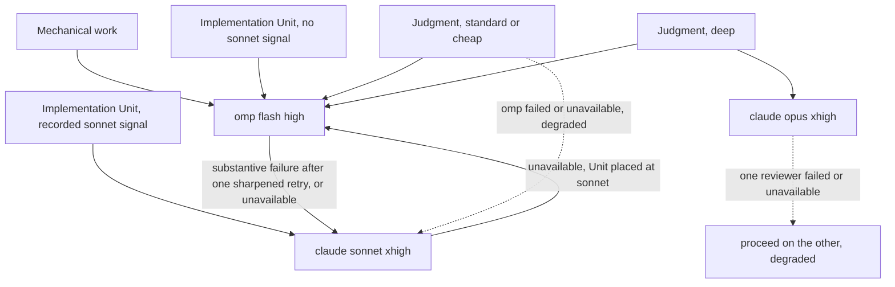

# OMP Primary Delegation - Plan

## Goal Capsule

- **Objective:** An Orca lead delegates by default to one omp seat that starts in a single step, and no dispatch reaches a Codex worker, so delegated work avoids the Codex quality and reliability problems and the omp launch ceremony.
- **Means:** Remove the `codex` worker row, merge the two omp rows into one Gemini flash `high` seat, reroute every recipient that named `codex`, and pin the omp model into Orca's native omp launch (KTD1, KTD3).
- **Product authority:** The repository owner, in the brainstorm dialogue of 2026-09-19 and the plan-time scoping confirmation that followed (see Key Decisions and the Planning Contract).
- **Open blockers:** None.
- **Execution profile:** Four Implementation Units, each one commit; the Verification Contract suites are the local gate, and CI on the pull request head is the final gate.
- **Stop conditions:** A render failure or a red suite at a unit boundary stops the run until fixed. In U3, a live one-step omp launch that does not run the roster model stops the run as a surfaced blocker (see Outstanding Questions).
- **Who finishes and ships:** The implementing agent (`ce-work`) owns implementation, verification, review-fix application, commit, push, pull request, and the CI watch through to merge.

---

## Product Contract

### Summary

The worker roster drops `codex` and becomes omp-first: one omp seat (Gemini flash `high`) takes mechanical, implementation, and standard and cheap judgment work, and it starts through a one-step Orca launch. The `judgment-deep` rung keeps a two-vendor pair, `claude` `opus` plus that omp seat. When omp fails or is unavailable, `claude` `sonnet` takes over. Codex stays a supported lead harness.

### Problem Frame

The `codex-luna` worker (`gpt-5.6-luna`, `max`) holds two roles in `home/.chezmoidata/agents.yaml`: the cross-model companion on every judgment rung, and the fallback after omp on the mechanical and implementation rows. The owner reports two problems with it. Its review and implementation output falls short of expectations or fails, and it is operationally heavy: it needs the `prepare-codex` hook-trust repair, launch model verification, and degraded-pass bookkeeping on every dispatch.

The omp side carries its own cost. Orca's `worker-start --model` and `--effort` do not forward to omp, so every omp dispatch goes through a ceremony: the lead opens a terminal with omp's `--model` and `--thinking` flags, confirms the model on screen, attaches the dispatch with `--terminal`, and closes the terminal itself after release. Two omp rows (flash `low` for mechanical work, flash `high` otherwise) keep this ceremony necessary, because no single launch default can serve both.

### Key Decisions

- **Remove `codex` from the worker roster because of quality, reliability, and operational friction, not cost.** Governs R1, R12. (session-settled: user-directed — chosen over cost reduction and structural simplification as the driver: Codex reviews and implementations fell short or failed, and its dispatch procedure is heavy.)
- **Keep a cross-model pair only on `judgment-deep`; standard and cheap judgment run on omp alone.** Governs R7, R8. (session-settled: user-directed — chosen over adding a `claude` second reviewer to every rung and over dropping the pair everywhere: the smallest fan-out that keeps a two-vendor opinion where CE declares the highest stakes.)
- **Merge the two omp seats into one Gemini flash `high` seat.** Governs R2, R4, R5, R10. (session-settled: user-directed — chosen over keeping flash `low` with the old ceremony and over finding a per-seat one-step launch: one seat makes every omp dispatch a one-step launch, at a small thinking cost on scout reads.)
- **Keep the direct `sonnet` route for Implementation Units with recorded risk signals.** Governs R6. (session-settled: user-directed — chosen over narrowing or removing that route: this change stays focused on removing `codex` and simplifying the omp launch.)
- **`claude` `sonnet` replaces `codex` as the recipient after omp.** Governs R6, R8. (session-settled: user-approved — proposed with the trade-off shown that one fallback step leaves the chain and each retry costs a `claude` dispatch.)
- **Remove the Codex worker rules along with the row.** Governs R12. (session-settled: user-approved — proposed with the note that a Codex lead does not need them, because Codex no longer receives dispatches.)

### Requirements

**Roster**

- R1. The worker roster declares no `codex` row, and `agents.roster.lead.codex` and the Codex lead settings it drives stay unchanged.
- R2. The roster declares exactly one omp worker row, Gemini flash at `high`, carrying the `mechanical`, `implementation`, and `judgment` shapes; the `judgment-standard` and `judgment-cheap` rungs both resolve to it.
- R3. Render-time validation no longer requires a `codex` judgment row, and still fails the render when no omp row carries the `mechanical`, `implementation`, or `judgment` shape.
- R4. omp's derived model roles, the background roles (`tiny`, `skim`, `smol`) included, all resolve to the single omp row, so a launch with no model flag runs that row's model and thinking level.
- R5. The brief guidance for the merged omp row keeps both prior rows' obligations: one lookup per dispatch with verbatim `file:line` excerpts for mechanical work, the ordered brief for implementation work, and the stub-`op` tool policy for both.

**Routing**

- R6. On the mechanical and implementation rows, the recipient after omp is `claude` `sonnet`, for substantive failure and for agent unavailability; the risk-signal route that opens directly on `sonnet`, and its four sizing signals, are unchanged.
- R7. `judgment-deep` dispatches `claude` `opus` `xhigh` and the omp seat over the same brief. When either reviewer is unavailable or fails, the review proceeds on the other, recorded as degraded, and the `claude` reviewer keeps its `judgment-deep` effort.
- R8. `judgment-standard` and `judgment-cheap` dispatch the omp seat alone. When it is unavailable or fails, `claude` `sonnet` replaces it, recorded as degraded.
- R9. `judgment-escalation` (`claude` `fable`) and the model-elevation `authoring` entry keep their current rules.

**omp launch**

- R10. An omp dispatch starts in one Orca start command: the lead opens no terminal itself, types no model flag, and closes no terminal after release.
- R11. The lead checks the effective omp model against the roster row from the launch evidence Orca or the worker exposes; a mismatch or absent evidence records the pass as degraded. Each dispatch still gets a fresh seat, and release follows the ordinary worker-release path.

**Codex worker text**

- R12. No instruction text tells a lead to dispatch, launch, or prepare a Codex worker: the Everyone payload's Codex launch rule, the pre-dispatch `prepare-codex` rule, and the lists that name `codex` as a dispatch target or worker are removed or narrowed. Codex remains named wherever it acts as a lead.

**Tests and prose**

- R13. The CI suites assert the new shape: no `codex` worker row, one omp row across all three shapes, `sonnet` after omp on every row that named `codex`, the `judgment-deep` pair, and single-reviewer standard and cheap rows; the tests for the removed codex guard are removed.
- R14. `CONCEPTS.md`, `README.md`, and `AGENTS.md` describe the roster, worker count, routing, and omp launch as R1-R12 leave them.

### Acceptance Examples

- AE1. **Covers R7.** **Given** a `judgment-deep` review, **when** the omp seat misses its launch twice, **then** the review proceeds on `claude` `opus` at `xhigh` alone and records the omp pass as degraded.
- AE2. **Covers R8.** **Given** a `judgment-standard` persona, **when** the omp seat is unavailable, **then** `claude` `sonnet` reviews it and the pass is recorded as degraded.
- AE3. **Covers R6.** **Given** an implementation Unit sized for omp, **when** omp fails substantively again after the re-size and a sharpened brief, **then** the next dispatch goes to `claude` `sonnet`, never to `codex`.
- AE4. **Covers R10, R11.** **Given** any omp dispatch, **when** the lead starts it, **then** one Orca start command launches the worker, and the dispatch record shows the effective model or a degraded mark.

### Success Criteria

- The rendered coordinator and Everyone payloads name no `codex` recipient, fallback, or companion.
- An omp dispatch costs the lead one start command and the release, down from open, confirm, attach, release, and close.

### Scope Boundaries

- Codex as a lead harness, its settings reconciler, its plugin, and `agents.roster.lead.codex` stay unchanged (per R1).
- The persona-to-rung mapping stays owned by Compound Engineering; this work only changes which agent each rung reaches.
- Installing or removing the `codex` CLI itself is out of scope; only its worker role changes.

### Outstanding Questions

**Deferred to Implementation**

- Whether `worker-start --agent omp` runs the roster model in one step. Planning fixed the mechanism: Orca defines `omp` as a known agent with argv prompt injection, and Orca's per-agent default arguments already carry the `codex` launch flags in `home/.chezmoidata/orca.yaml`. Neither pin has run end to end with a dispatch. U3 proves it with one live launch before it rewrites the launch rule. If the launch does not run the roster model, that is a surfaced blocker with the evidence, and the ceremony is not kept silently.

### Sources

- `home/.chezmoidata/agents.yaml:17-102` — roster rows, including `codex-luna` (`shapes: [judgment, fallback]`) and the two omp rows.
- `home/.chezmoitemplates/orchestration-coordinator.tmpl:40-57` — routing table, `judgment-deep` effort rule, and the omp launch ceremony paragraph.
- `home/.chezmoitemplates/orchestration-everyone.tmpl:20-21` and its Codex launch rule.
- `home/.chezmoitemplates/agent-roster-validate.tmpl:122-124` — the codex-judgment guard.
- `home/.chezmoiscripts/70-agents/run_after_config-omp-settings.sh.tmpl:31-40` — model-role derivation from the mechanical and implementation rows.
- `home/.chezmoitemplates/agents-instructions.tmpl:45` — the `prepare-codex` pre-dispatch rule.
- `.ci/test-agent-roster.sh:133-135` — the codex-judgment guard test.
- `orca-ide orchestration worker-start --help` (Orca 1.4.205) — `--model` covers Claude, Codex, and Cursor only and cannot combine with `--terminal`.
- `docs/plans/2026-09-18-2202-refactor-judgment-roster-tiers-plan.md` — the judgment rung design this plan reroutes.
- Closed issue [hyperlapse122/dotfiles#550](https://github.com/hyperlapse122/dotfiles/issues/550) — the earlier request to simplify omp launch and prompt delivery.
- `home/.chezmoidata/orca.yaml` (`settings.agentDefaultArgs.codex`) and `home/dot_local/share/chezmoi-command-sources/executable_orca-settings-reconcile.tmpl` — the Orca per-agent default-argument leaf and the reconciler that asserts it.

---

## Planning Contract

Product Contract preservation: Product Contract unchanged; the Outstanding Question is narrowed in place by planning research, and the Goal Capsule gains execution fields.

### Key Technical Decisions

- KTD1. **One omp row, `omp-flash`, carries `mechanical`, `implementation`, and `judgment` with no `rung`; the coordinator resolves standard and cheap judgment by shape and renders them as one routing row.** A scalar `rung` cannot name two rungs, and `agent-roster-validate.tmpl` rejects a duplicate rung per agent. A shape lookup needs no schema change to `agent-roster-lookup.tmpl`. The `judgment-deep` and `judgment-escalation` rungs stay on their `claude` rows. Governs R2, R8.
- KTD2. **Validation drops the codex-judgment guard, requires omp rows for `mechanical`, `implementation`, and `judgment`, and removes `fallback` from the valid shapes.** No row carries `fallback` after `codex-luna` leaves, and a shape with no carrier is dead vocabulary. The `lead.codex` requirement stays. Governs R1, R3.
- KTD3. **The Orca settings reconciler derives `settings.agentDefaultArgs.omp` from the omp roster row as `--model <model> --thinking <effort>`, merged over the static `orca.yaml` leaves at render time; omp's `modelRoles` (R4) stay the second pin.** A static literal in `orca.yaml` would drift from the roster, and `orca.yaml` is not rendered. The same default arguments apply to omp tabs a person opens in Orca, which is the model the roster names anyway. Governs R10. (session-settled: user-approved — proposed at the plan-time scoping confirmation over relying on omp's default role alone: two pins, one of them on the launch command Orca builds.)
- KTD4. **The lead's launch evidence for omp is the model name on the worker's own status line, read through Orca's worker read; the thinking level is trusted from the KTD3 arguments.** The `worker-start` receipt carries `launch.requested` and `launch.effective` only for Claude, Codex, and Cursor, so requiring them would mark every omp pass degraded. Governs R11. (session-settled: user-approved — proposed at the plan-time scoping confirmation over treating a missing receipt field as degraded.)
- KTD5. **Edge routing keeps the existing escalation rule and names the omp-era recipients.** A mechanical substantive failure retries once on the same omp seat with a sharpened brief, then goes to `sonnet`. A Unit placed at `sonnet` whose `sonnet` launch is unavailable goes to omp with a sharpened brief, recorded as degraded. When every agent a row names is unavailable, including both `judgment-deep` reviewers, the existing row-exhausted escalation applies. Governs R6, R7. (session-settled: user-approved — proposed at the plan-time scoping confirmation over sending a first mechanical failure straight to `sonnet`, and over escalating at once when `sonnet` is down.)
- KTD6. **The Codex launch rule leaves the Everyone payload whole, and the "lead, dispatch, and serve as workers on the same terms" sentences narrow Codex to the lead role.** The rule only governed launching Codex as a worker or reviewer, so no part of it survives. Governs R12.

### High-Level Technical Design

Dispatch routing after the change. Every edge that named `codex` now names `sonnet` or omp.

### Assumptions

- Orca reads `settings.agentDefaultArgs` only at startup, and the reconciler writes only while Orca is down, so KTD3 takes effect after the next Orca restart. Until then, omp's `modelRoles` default carries the model, the rendered-reconciler tests are the only proof of the KTD3 leaf, and its first live proof is the KTD4 check after that restart.
- The claim-verification and research dispatches of this planning session ran under the pre-change routing; the `codex` spec-flow reviewer was stopped on the owner's instruction and is recorded as a degraded pass, and the omp reviewer's analysis stands alone.

---

## Implementation Units

### U1. Remove the codex worker

**Goal:** No roster row, lookup, routing cell, or instruction names `codex` as a worker; every former `codex` cell names `sonnet` or omp.

**Requirements:** R1, R3, R6, R7, R8, R12, R13; KTD2, KTD5, KTD6.

**Dependencies:** None.

**Files:**
- Modify: `home/.chezmoidata/agents.yaml`
- Modify: `home/.chezmoitemplates/agent-roster-validate.tmpl`
- Modify: `home/.chezmoitemplates/orchestration-coordinator.tmpl`
- Modify: `home/.chezmoitemplates/orchestration-everyone.tmpl`
- Modify: `home/.chezmoitemplates/agents-instructions.tmpl`
- Test: `.ci/test-agent-roster.sh`, `.ci/test-agent-instructions.sh`

**Approach:**
1. Delete the `codex-luna` row; keep `lead.codex`.
2. In validation, drop the `$codexJudgment` guard and the `fallback` shape (KTD2).
3. In the coordinator, drop the `$judgeCodex` and `$fallback` lookups, name `claude` and `omp` as the dispatch targets, and rewrite each routing cell per R6-R8 and KTD5. Replace the `judgment-deep` effort bump with the R7 rule. In the `lfg` and Compound Engineering vocabulary paragraph, replace "Choose the Orca recipient from the agents the environment actually has" with a rule that a Compound Engineering cross-model peer or work-engine preference, its default `codex` peer included, resolves to the routing table's recipients and never to a Codex worker.
4. In the Everyone payload, drop both codex lookups and the Codex launch rule, and narrow the "serve as workers" sentence (KTD6).
5. In `agents-instructions.tmpl`, drop the `prepare-codex` paragraph and narrow the omp sentence that names Codex as a worker peer.

**Patterns to follow:** The judgment-rung rewrite in `docs/plans/2026-09-18-2202-refactor-judgment-roster-tiers-plan.md`; roster values reach prose only through `agent-roster-lookup.tmpl`.

**Test scenarios:**
- Happy path: the rendered coordinator body contains no `codex` recipient, and its routing table row count matches the new table.
- Happy path: the rendered Everyone body contains no Codex launch rule; the rendered user instruction file contains no `prepare-codex` sentence.
- Covers AE3. The implementation row's failure column names `sonnet` after omp.
- Covers AE1. The `judgment-deep` row names `claude` `opus` and omp over the same brief, and a degraded reviewer leaves `claude` at `xhigh`.
- Happy path: the rendered coordinator says a Compound Engineering cross-model peer, `codex` included, resolves to the routing table's recipients.
- Error path: a fixture roster with a `codex` worker declaring `fallback` fails the render with an unknown-shape error.
- Error path: a fixture roster with no `lead.codex` still fails the render.
- Edge case: the `codex-missing-judgment` fixture and its assertion are removed, not inverted.

**Verification:** `.ci/test-agent-roster.sh` and `.ci/test-agent-instructions.sh` pass, and the rendered payloads name no Codex worker.

---

### U2. Merge the omp seats

**Goal:** One omp row serves mechanical, implementation, and standard and cheap judgment work, and omp's derived model roles all point at it.

**Requirements:** R2, R4, R5, R6, R8, R13; KTD1, KTD5.

**Dependencies:** U1.

**Files:**
- Modify: `home/.chezmoidata/agents.yaml`
- Modify: `home/.chezmoitemplates/agent-roster-validate.tmpl`
- Modify: `home/.chezmoitemplates/orchestration-coordinator.tmpl`
- Modify: `home/.chezmoiscripts/70-agents/run_after_config-omp-settings.sh.tmpl`
- Test: `.ci/test-agent-roster.sh`, `.ci/test-omp-settings-reconcile.sh`

**Approach:**
1. Replace `omp-flash-mechanical` and `omp-flash` with one `omp-flash` row: Gemini flash, `high`, three shapes, no `rung`, and a folded `brief` that keeps both prior obligations (R5).
2. Add the omp `mechanical` and `implementation` presence guards next to the existing omp `judgment` guard (KTD2).
3. In the coordinator, resolve the standard and cheap judgment row by shape (KTD1), collapse them into one routing row, and write the mechanical retry per KTD5. The seat sentence renders its single-seat branch.
4. In the omp settings script, resolve one omp selector and give every model-valued role, `tiny`, `skim`, and `smol` included, that selector.

**Patterns to follow:** The existing `$mechanical`/`$ompImpl` equality branch in the coordinator's seat sentence; the settings script's role map.

**Test scenarios:**
- Happy path: the roster renders exactly one omp worker, carrying all three shapes.
- Covers AE2. The standard-and-cheap judgment row names omp alone, and its failure and unavailable cells name `sonnet`, recorded as degraded.
- Happy path: the rendered omp settings map every model role, `tiny`, `skim`, and `smol` included, to `google-antigravity/gemini-3.8-flash:high`, and `enabledModels` holds one element.
- Error path: a fixture roster whose omp row lacks `mechanical`, or lacks `implementation`, fails the render with a guard message naming the missing shape.
- Edge case: a fixture with two omp rows still renders, so the guard enforces presence and not a count.
- Edge case: the brief table renders one omp row, and no cell breaks the Markdown table.

**Verification:** `.ci/test-agent-roster.sh` and `.ci/test-omp-settings-reconcile.sh`, the latter against a freshly rendered settings script, pass.

---

### U3. Launch omp in one step

**Goal:** An omp dispatch is one `worker-start --agent omp` call with the roster model pinned, and the coordinator text describes that launch and its evidence check.

**Requirements:** R9, R10, R11; KTD3, KTD4.

**Dependencies:** U2.

**Files:**
- Modify: `home/dot_local/share/chezmoi-command-sources/executable_orca-settings-reconcile.tmpl`
- Modify: `home/.chezmoidata/orca.yaml` (comment only, naming the derived `omp` leaf beside the declared `codex` one)
- Modify: `home/.chezmoitemplates/orchestration-coordinator.tmpl`
- Test: `.ci/test-orca-settings-reconcile.sh`, `.ci/test-agent-roster.sh`, `.ci/test-agent-instructions.sh`

**Approach:**
1. Before any edit, run one live `worker-start --agent omp` dispatch with a trivial read-only task, read its output, and confirm the status line names the roster model. This proves the one-step argv launch and the deployed `modelRoles` pin; it cannot exercise the KTD3 leaf, which Orca reads only at startup. A mismatch is the blocker the Outstanding Questions entry names.
2. In the reconciler template, look up the omp row and merge `settings.agentDefaultArgs.omp` into the declared settings before validation (KTD3). In `.ci/test-orca-settings-reconcile.sh`, compose the roster-derived leaf into the expected path set before its path-count equality check, the way `.ci/test-codex-settings-reconcile.sh` composes the roster-derived Codex pair.
3. Rewrite the coordinator's omp launch paragraph: one start command, the KTD4 evidence check, the fresh-seat rule, and the ordinary release. The terminal-open, confirm-on-screen, `--terminal` attach, and terminal-close steps go. Remove the sentence that calls a prompt argument a one-prompt-and-exit form and says Orca issues a prompt only to an existing terminal; keep the `--print`, piped-stdin, and `dispatch --inject` exclusions. Keep the launch-miss rule: a launch that yields no live seat is relaunched once, and a second miss is agent unavailability, which on `judgment-deep` records that reviewer as degraded.

**Execution note:** Start with the live launch in step 1; do not edit the launch prose until it passes.

**Patterns to follow:** `run_after_config-codex-settings.sh.tmpl`, which merges a roster-derived value over static settings; the declared `settings.agentDefaultArgs.codex` leaf.

**Test scenarios:**
- Happy path: the rendered reconciler declares `settings.agentDefaultArgs.omp` as `--model google-antigravity/gemini-3.8-flash --thinking high`.
- Happy path: a roster fixture with a different omp model and effort renders those values into the leaf.
- Integration: the declared `codex` default-args leaf is unchanged beside the new `omp` leaf.
- Covers AE4. The rendered coordinator describes the omp launch as one start command followed by the status-line model check, and no longer carries `worker-start --task <task_id> --terminal <handle>`.
- Error path: the coordinator text still forbids re-engaging a settled omp seat and records a missing or mismatched model as degraded.
- Covers AE1. The rendered coordinator keeps the relaunch-once rule, and a second launch miss is agent unavailability.
- Edge case: the Orca settings suite's path-count check passes with the derived `omp` leaf present.

**Verification:** The three suites pass, and the step-1 live launch record shows the roster model.

---

### U4. Update the roster prose

**Goal:** The glossary and the repository docs describe the five-worker, omp-first roster and the one-step launch.

**Requirements:** R13, R14.

**Dependencies:** U1, U2, U3.

**Files:**
- Modify: `CONCEPTS.md`, `README.md`, `AGENTS.md`
- Test: `.ci/test-agent-roster.sh`

**Approach:**
1. Rewrite the model-roster paragraphs in `README.md` and `AGENTS.md`: five workers, no `codex` worker, one omp seat, the judgment rows, and the one-step launch.
2. Update the `CONCEPTS.md` entries for mechanical work, judgment work, and the model roster so they no longer describe a lower-thinking mechanical seat or a `codex` companion.
3. In the stale-count guard, remove the existing `five worker` guard, because five is the current count again, and add guards so committed prose that says "seven worker" or names a `codex` worker fails the suite. Update the neighbouring comment to match.

**Test scenarios:**
- Happy path: `README.md` and `AGENTS.md` state five worker entries, and the suite passes.
- Error path: the stale-count guard fails on prose that says "seven worker".

**Verification:** `.ci/test-agent-roster.sh` passes, and a search of the three files finds no `codex` worker, fallback, or companion.

---

## Verification Contract

| Gate | Command | Proves |
|---|---|---|
| Roster and payload renders | `.ci/test-agent-roster.sh` | R1-R3, R5-R9, R12-R14 |
| Instruction files | `.ci/test-agent-instructions.sh` | R11, R12 |
| omp settings | render the script as the `ci.yml` render step does, with the op stub on `PATH`, then `.ci/test-omp-settings-reconcile.sh <rendered script>` | R4 |
| Orca settings | render the reconciler the same way, then `.ci/test-orca-settings-reconcile.sh <rendered script>` | R10 |
| Hook payload | `.ci/test-orchestration-hook.sh` | the Everyone and coordinator bodies still stage |
| Live launch | the U3 step-1 dispatch record: the one-step argv launch on the deployed `modelRoles` pin | R10 |
| Pin after restart | the KTD4 status-line check on the first omp dispatch after the next Orca restart | R10, R11 (the KTD3 leaf) |
| CI | the pull request head's workflow run, watched to terminal green | all |

No render in any gate may reach the real `op`.

---

## Definition of Done

- U1-U4 are committed, and every Verification Contract gate passes.
- The rendered coordinator, Everyone payload, and user instruction file name no `codex` worker, fallback, companion, or `prepare-codex` step.
- The U3 live launch shows the roster model on a one-step omp dispatch.
- No abandoned-attempt code, fixture, or prose remains in the diff.
