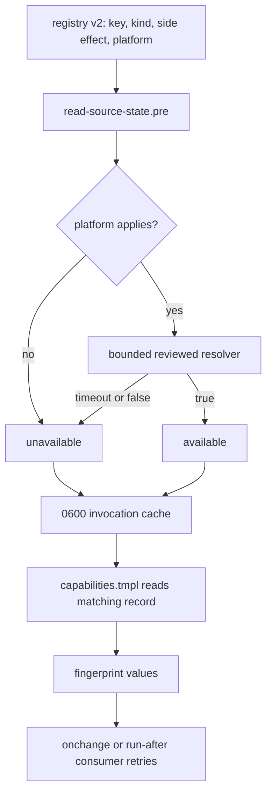
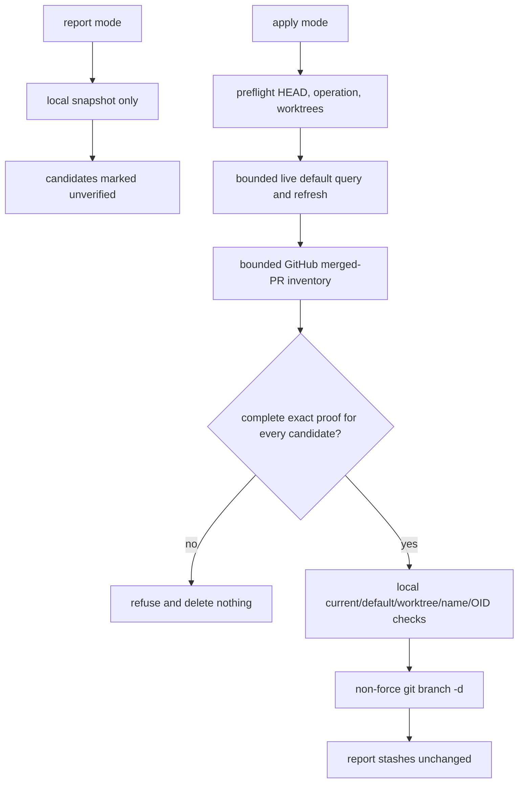

## Goal Capsule

- **Objective:** Resolve the fifteen acknowledged feedback items by preserving the already-landed safety contracts, correcting the remaining capability and retry mismatches, and replacing ancestry-only branch pruning with bounded GitHub-confirmed proof.
- **Authority:** The Product Contract below is authoritative. The settled GitHub-proof and fail-closed pruning decision governs R6 and R15.
- **Execution profile:** This is a shell, chezmoi template, registry, CI, and managed-test change. Use disposable source, home, cache, session, and Git fixtures. Never test with a live `chezmoi apply` against a real home.
- **Stop conditions:** Stop for a blocker if a capability cannot be probed with the declared side-effect class, if the GitHub proof shape cannot be validated, or if evidence contradicts the settled fail-closed pruning rule. A failed or unavailable remote proof must produce a report-only outcome.
- **Conflict rule:** Report source or test evidence that conflicts with the Product Contract. Do not silently weaken a safety boundary to make a fixture pass.
- **Tail ownership:** The implementation executor owns source changes, focused verification, review fixes, commit, push, pull request, and CI watch. This plan does not authorize deployment to the user's home.
- **Existing-satisfied baseline:** R1, R2, R3, R4, R5, R7, and the merge-gate behavior in R11 already have production changes or regression coverage in the current tree. Preserve those contracts and add only the missing proof or assertions.

---

## Product Contract

### Summary

Fifteen acknowledged feedback items remain in the sweep record. The current tree already contains the earlier prune-canary, fingerprint, haptic-boundary, extension-retry, capability-cache, managed-instruction, and merge-gate work. This run closes the remaining residuals and verifies every item without creating a second policy system.

### Problem Frame

The source has several truthful mechanisms whose surrounding fixtures or declarations drifted. Darwin capability snapshots publish `unavailable` for tools consumed by active Darwin scripts. The Podman script claims an every-apply retry while its filename records an onchange run and its probe names only the executable. The KDE touchpad retry hashes session-bus existence instead of KWin availability. A GNOME comment still describes a manual force path that the capability fingerprint now replaces. The skip parser misses a one-line case arm. The user-manager probe and the local branch pruner can wait indefinitely.

The branch pruner also uses local ancestry as its eligibility proof. That cannot prove squash-merged branches. Apply mode must use the forge's merged pull-request state, keep report mode offline, and fail closed when authentication, network, parsing, or timeout evidence is incomplete.

### Requirements

**Chezmoi correctness and cleanup**

- R1. Isolated Linux and macOS apply jobs must seed and assert every `.chezmoiremove` target while preserving valid siblings and fact-gated paths.
- R2. A `fingerprint.tmpl` glob that matches zero non-directory source files must fail rendering with the pattern and source directory.
- R3. A real container must ignore the complete `.local/share/omp-plugins` haptic tree, prune only the stranded container marketplace catalog from the former narrowed state, and keep the phase-70 migration reconciler eligible.

**Retry and declared early-exit behavior**

- R4. Retry-intended extension gallery, API, response, and download failures must not stop later chezmoi phases and must retry on a later unchanged apply without reapplying a converged user-disabled extension.
- R5. Capability probes must resolve once per chezmoi command through a fail-closed per-command cache, and classified early exits must use the shared declaration contract without converting capabilities into facts or eligibility gates.

**Contributor and local-Git safety**

- R6. Apply-mode local branch pruning must use GitHub-confirmed merged pull requests to identify squash-merged branches and must retain every branch when proof, authentication, or network access is unavailable. It must never delete current, default, worktree-attached, unmerged, ambiguous, unsafe-name, or otherwise unproven branches.
- R7. Managed instructions must require default-branch merges for feature refreshes, explain merge and approved-rebase conflict sides, and guard the required merge result in CI.

**Capability and retry residuals**

- R8. Capability snapshots must model platform applicability so active Darwin consumers receive truthful `available` and `unavailable` tokens and retry when their tools appear.
- R9. Podman unit-availability reconciliation must use an every-apply lifecycle and a probe that names the user-unit precondition.
- R10. The KDE touchpad KWin-unreachable path must fingerprint a capability that tracks the running Plasma/KWin session rather than session-bus existence alone.
- R11. Merge-gate tests must assert that the resolver selects GitHub's `merge_commit_sha` REST field as the result SHA.
- R12. GNOME font guidance must describe automatic session-bus recovery and must remove its obsolete manual `--force` direction.
- R13. The skip declaration guard must detect one-line case-arm terminators and reject undeclared conditional success exits.
- R14. User-manager D-Bus capability probes must be bounded and fail closed when the manager does not respond.
- R15. Apply-mode branch-pruner remote authentication, Git queries, and GitHub queries must be bounded so failure reports and retains unproven branches instead of hanging.

### Key Decisions

- The GitHub merged pull-request result is the authority for squash-merge eligibility. Local ancestry is not a fallback. This is settled product direction for R6 and R15.
- The eleven R5 hard-error paths remain hard errors. The capability and lifecycle changes in this plan must not turn them back into skip declarations.

### Acceptance Examples

- AE1. **Covers R1.** Given each prune target is seeded in an isolated Linux or macOS home, when the apply job runs, then every target is removed and each sibling or gated path has its expected survival state.
- AE2. **Covers R2.** Given a fingerprint glob matches only a directory or no path, when the template renders, then it fails and names the glob and source directory.
- AE3. **Covers R3.** Given the container fact is true, when ignore and removal templates render, then the whole haptic plugin tree is ignored, only the stranded catalog is listed for removal, and the phase-70 reconciler remains eligible.
- AE4. **Covers R4.** Given an extension's retry-intended remote operation fails on unchanged source, when apply completes, then later phases run and a later unchanged apply retries the operation.
- AE5. **Covers R5 and R8.** Given several consumers read the same capability during one command, they receive one matching cache snapshot; on Darwin, an active tool's appearance changes the token and the dependent fingerprint.
- AE6. **Covers R6 and R15.** Given a squash-merged branch has an exact GitHub merged-PR proof, apply mode may delete it after local safety checks; given missing, malformed, unauthenticated, unreachable, or timed-out proof, apply mode deletes nothing.
- AE7. **Covers R9, R10, and R14.** Given a Podman unit, KWin session, or user manager is absent, its matching capability is unavailable; when that precondition appears on a later unchanged apply, the affected script retries without hanging.
- AE8. **Covers R7 and R11.** Given a merged pull request event, the resolver reads the REST result's `merge_commit_sha`, and the managed policy plus CI guard continue to require a two-parent merge commit.

### Scope Boundaries

**In scope**

- The source, registry, test, and CI changes needed for R8-R15.
- Verification of the already-satisfied R1-R7 and R11 contracts.
- Native `gh` use only inside explicit branch-pruner apply mode.

**Outside this change**

- Live-home deployment, remote branch deletion, worktree deletion or unlocking, stash deletion, and automatic repair of unproven branches.
- Changes to GitHub merge settings, branch protection, or the managed instruction policy already satisfying R7.
- A capability in `.chezmoidata/facts.yaml`, a capability used as an eligibility gate, or a second skip-declaration mechanism.
- Broad conversion of unrelated `run_onchange_` scripts to `run_after_`.

### Sources / Research

- `.chezmoiremove`, `.chezmoiignore`, `.github/workflows/render-dotfiles.yml`, and `.ci/test-mxm4-haptic-gates.sh` define the existing prune and container boundaries for R1-R3.
- `.chezmoitemplates/fingerprint.tmpl` and `.ci/test-fingerprint-gates.sh` already implement and exercise the R2 zero-match diagnostic.
- `.chezmoiscripts/30-linux/run_after_install-vscodium-extensions.sh.tmpl`, the two GNOME extension scripts, and `.ci/test-extension-retry.sh` define the R4 every-apply signature pattern.
- `.chezmoitemplates/capabilities.tmpl`, `.install-prerequisites.sh`, `.chezmoidata/.capability-registry.tsv`, `.ci/test-capability-cache.sh`, and `.ci/check-skip-declarations.sh` define the R5 cache and declaration contracts.
- `.chezmoitemplates/agents-instructions.tmpl`, `.ci/test-agent-instructions.sh`, `.github/workflows/merge-commit-only.yml`, `.ci/check-merge-commit-only.sh`, and `.ci/test-merge-commit-only-gates.sh` already satisfy the R7 policy and most of R11.
- Issue #220 establishes the Darwin applicability gap. Issue #221 establishes the Podman lifecycle and probe mismatch. Issue #222 identifies the KWin/session-bus mismatch. Issues #223-#227 establish the merge-selector, documentation, parser, D-Bus timeout, and branch-pruner timeout residuals.
- `.install-prerequisites.sh` already bounds the non-refreshing sudo probe and `.chezmoiscripts/70-agents/run_after_config-omp-settings.sh.tmpl` contains a portable child-process deadline pattern.
- `dot_local/bin/executable_git-prune-local-branches` and `.ci/test-git-prune-local-branches.sh` provide the existing report-first interface, non-force deletion backstop, worktree protections, stash reporting, race fixtures, and CI invocation to extend.
- `gh` is already provisioned by `.chezmoi` and authenticated through its native store. Branch-pruner apply mode must use that native CLI and must not make normal source rendering depend on it.

---

## Planning Contract

### Key Technical Decisions

- KTD1. **Make capability applicability explicit in the registry.** Upgrade the capability registry shape to carry a reviewed `any` or `linux` platform field, and make both the hook and template reader validate the same versioned shape. This replaces the blanket non-Linux `unavailable` shortcut without probing Linux-only tools on Darwin.
- KTD2. **Use the Podman every-apply lifecycle and retain a unit-specific capability.** Rename the reconciler to `run_after_`, update its comments and matrix paths, and add a reviewed user-unit probe for `podman.socket`. The lifecycle provides retry even when source content is unchanged; the matching token keeps the declaration honest and bounds the probe through the same resolver boundary.
- KTD3. **Reuse the reviewed Plasma process capability for KWin recovery.** Pair `kwin-unreachable` with `plasmashell-running`, which is already in the registry and is the repository's existing runtime-session proxy, instead of treating a session-bus socket as proof that KWin owns the bus.
- KTD4. **Use a complete, fail-closed GitHub proof phase.** In apply mode, resolve a GitHub `origin`, resolve and refresh the live default branch, obtain a complete merged-PR inventory, and validate each candidate against the exact local branch tip, PR state, head identity, and default base. Any missing, malformed, partial, unauthenticated, or timed-out proof stops before mutation. Report mode remains offline and labels its results unverified.
- KTD5. **Bound child processes without passing credentials through the shell.** Set `GIT_TERMINAL_PROMPT=0` and `GH_PROMPT_DISABLED=1` for the helper. Use the repository's portable child-process deadline pattern for `git ls-remote`, `git fetch`, `gh`, and user-manager capability probes. Let native `gh` resolve its own credentials.
- KTD6. **Extend focused disposable fixtures instead of adding parallel harnesses.** Update the existing capability, declaration, merge-gate, render, haptic, and branch-pruner fixtures. Keep CI wiring in the existing `omp-agent-integration` and isolated render jobs.

### High-Level Technical Design

#### Capability snapshot and retry flow

The registry remains data, not executable shell. A registry shape error remains a hard hook failure. A probe result of false or timeout writes `unavailable` and does not abort a command; only cache integrity and registry faults abort before rendering.

#### Branch-pruning proof flow

The proof phase runs before the first deletion. Each deletion rechecks the local branch OID and protected-state predicates, then uses `git branch -d` as the final Git-level race backstop. No force deletion or remote mutation is permitted.

### Assumptions

- The current branch-pruner `origin` points to a GitHub repository when apply mode is used. Non-GitHub or unparseable origins fail closed.
- The existing `gh` external is available on supported hosts, but it may be absent or unauthenticated in fixtures and on real hosts. That is a safe refusal, not a render failure.
- The capability registry can version its tab-separated shape without compatibility readers. The template and hook will change together.
- The `run_after_` Podman rename moves its four matrix instances into the existing lifecycle-excluded accounting. Static registry totals remain the source contract unless rendered reconciliation proves a count drift.
- The current 121-owner R5 inventory and eleven hard-error boundary remain frozen. R8-R14 must not change those counts except for the explicit lifecycle accounting of the renamed Podman script.

### Sequencing

1. Implement the versioned platform-aware capability registry and bounded resolver paths. This supplies the tokens used by the Podman and Darwin fixtures.
2. Rename and re-declare the Podman script, then switch the KWin declaration and update the frozen matrix.
3. Fix the skip parser and documentation, and add the merge-selector assertion.
4. Extend the branch-pruner proof and timeout implementation, then extend its disposable fixture.
5. Run the full focused verification contract, render all changed templates and scripts, and resolve any review findings before shipping.

### Risks and Dependencies

- GitHub pull-request pagination and JSON shape can change. Treat missing fields, extra ambiguous proof, and parse errors as no proof rather than guessing.
- A remote or GitHub timeout after an apply mutation could leave earlier safe deletions complete. The implementation must perform complete proof before the first mutation, report the exact deletion count, and never continue after a failed recheck.
- A broad Darwin resolver could probe Linux-only commands with incompatible flags. The registry platform field prevents that class of false result.
- `systemctl --user` can block independently of the session-bus environment. Every user-manager and user-unit resolver must use the same bounded process path.
- Renaming a chezmoi script changes its identity and can trigger one migration run. The source and matrix update must be atomic in the diff.

---

## Implementation Units

### U1. Preserve existing cleanup and retry contracts

- **Goal:** Verify R1-R5 and R7-R11 remain satisfied while making only the residual changes below.
- **Requirements:** R1, R2, R3, R4, R5, R7, R11.
- **Files:** `.github/workflows/render-dotfiles.yml`, `.chezmoiignore`, `.chezmoiremove`, `.chezmoitemplates/fingerprint.tmpl`, `.ci/test-fingerprint-gates.sh`, `.ci/test-mxm4-haptic-gates.sh`, `.ci/test-extension-retry.sh`, `.ci/test-capability-cache.sh`, `.ci/test-agent-instructions.sh`, `.github/workflows/merge-commit-only.yml`, `.ci/test-merge-commit-only-gates.sh`.
- **Approach:** Treat the current canaries, zero-match failure, full-tree container ignore, extension signatures, capability cache, managed instructions, and merge workflow as existing mechanisms. Do not duplicate them. If the R11 selector assertion is missing, add it in U5's focused merge-gate change. If an R1-R4 regression appears while updating shared fixtures, repair the existing surface rather than creating a new harness.
- **Test scenarios:** The existing focused fixtures remain green. The render jobs continue to remove every seeded prune target and preserve siblings and gated files. The capability and extension fixtures continue to prove unchanged convergence and recovery.
- **Verification:** Run the named existing tests in the Verification Contract before and after the residual changes. Record any existing-satisfied item as verified, not reimplemented.
- **Dependencies:** None.

### U2. Version capability applicability and bounded probes

- **Goal:** Make capability results truthful on Darwin and bound user-manager and user-unit probes.
- **Requirements:** R8, R9, R14.
- **Files:** `.chezmoidata/.capability-registry.tsv`, `.install-prerequisites.sh`, `.chezmoitemplates/capabilities.tmpl`, `.ci/test-capability-cache.sh`.
- **Approach:** Add a platform column and version the registry shape. Mark the four active Darwin tool probes (`mise-present`, `gh-present`, `glab-present`, and `tokscale-present`) as applicable on any supported POSIX host; keep Linux-only probes unavailable on Darwin. Store the platform in the hook's parsed arrays and apply the platform check before the reviewed resolver. Add a reviewed user-unit resolver for `systemctl --user cat podman.socket`. Bound `show-environment` and user-unit checks with the existing timeout convention. Preserve the exact cache identity, key-set, mode, and fail-closed integrity rules.
- **Test scenarios:** A Darwin fixture with stubs for the four active tools publishes `available` tokens and no Linux-only probe runs. Removing one stub changes its token to `unavailable` and changes the rendered fingerprint; restoring it returns to `available`. A fast user-manager stub publishes `available`. A delayed stub exceeds the deadline, returns `unavailable`, and lets the command finish with a diagnostic-free safe token. A malformed v1 or six-column record is rejected as unavailable or as a hook schema error according to the existing cache boundary.
- **Verification:** Run `.ci/test-capability-cache.sh` and `.ci/test-skip-declaration-gates.sh`. Inspect the rendered capability reader to confirm it performs no host probe and the hook resolves each registry key once.
- **Dependencies:** None.

### U3. Reconcile Podman units on every apply

- **Goal:** Make deferred Podman unit work retry without source changes and name the actual unit precondition.
- **Requirements:** R9, R14.
- **Files:** `.chezmoiscripts/30-linux/run_after_setup-podman-cluster.sh.tmpl`, `.chezmoi*` source path references if generated by the rename, `.ci/skip-declaration-site-matrix.yaml`, `.ci/test-skip-declaration-gates.sh`, `.chezmoidata/.capability-registry.tsv`, `.install-prerequisites.sh`, `.ci/test-capability-cache.sh`.
- **Approach:** Rename the current `run_onchange_after_setup-podman-cluster.sh.tmpl` source to `run_after_setup-podman-cluster.sh.tmpl`. Update lifecycle comments and all four matrix template and instance paths. Replace the `podman-present` declaration for `podman-socket-unit-absent` with the new bounded user-unit capability. Keep the existing user-manager and minikube declarations, step-local idempotency, and container ignore. Make the lifecycle checker report the four instances as lifecycle-excluded.
- **Test scenarios:** Render with the Podman CLI present but the user socket unit absent; the first apply skips only the unit step. Keep source content unchanged, make the stub unit appear, and prove a second apply enables it. Make the user manager probe hang and prove the command returns within the deadline. Accidental restoration of `run_onchange_` or a `podman-present` probe for the unit row must fail the focused gate.
- **Verification:** Run `.ci/test-skip-declaration-gates.sh` and `.ci/test-capability-cache.sh`; compare the rendered script before and after the unchanged-availability transition.
- **Dependencies:** U2.

### U4. Track KWin session availability

- **Goal:** Make the KDE touchpad retry fingerprint change when the Plasma/KWin session appears.
- **Requirements:** R10.
- **Files:** `.chezmoiscripts/50-linux-kde/run_onchange_after_config-kde-touchpad.sh.tmpl`, `.ci/skip-declaration-site-matrix.yaml`, `.ci/test-capability-cache.sh`, `.ci/test-skip-declaration-gates.sh`.
- **Approach:** Read `plasmashell-running` beside `busctl-present` and `session-bus-present` in the fingerprint block. Change only the `kwin-unreachable` declaration to use `plasmashell-running`; keep `busctl-absent` on `busctl-present` and keep the runtime D-Bus query as the final truth for the actual step.
- **Test scenarios:** With a session bus socket but no `plasmashell`, the capability is unavailable and the rendered touchpad script carries the unavailable fingerprint. When the process stub appears without a source edit, the token and fingerprint change. The busctl absence declaration remains paired with `busctl-present`.
- **Verification:** Run `.ci/test-capability-cache.sh` and `.ci/test-skip-declaration-gates.sh`, then render the touchpad template with the Linux fixture.
- **Dependencies:** U2.

### U5. Clarify GNOME recovery and assert REST selector

- **Goal:** Remove stale manual-force guidance and prove the merge gate reads the intended REST field.
- **Requirements:** R11, R12.
- **Files:** `.chezmoiscripts/50-linux-gnome/run_onchange_after_config-gnome-fonts.sh.tmpl`, `.ci/test-fingerprint-gates.sh`, `.ci/test-merge-commit-only-gates.sh`.
- **Approach:** Rewrite only the GNOME font comment that describes session-bus recovery. State that the transient-blocking `session-bus-present` fingerprint causes a later unchanged apply to retry automatically. Do not change unrelated intentional `--force` commands or the generic server-force guidance. Extend the parsed workflow audit or extracted resolver fixture with a positive assertion for `.merge_commit_sha // ""`, while retaining the negative guard against reading the event payload field.
- **Test scenarios:** Render the GNOME font template and assert the recovery wording and session-bus fingerprint remain present without the obsolete manual force claim. Run the resolver against a stubbed REST response and prove the output equals its `merge_commit_sha` value even when the event payload field is null. Empty, multi-line, and failed REST responses remain errors.
- **Verification:** Run `.ci/test-fingerprint-gates.sh` and `.ci/test-merge-commit-only-gates.sh`.
- **Dependencies:** None.

### U6. Detect one-line case-arm exits

- **Goal:** Make the rendered skip guard reject an undeclared `exit 0` on the same line as a case arm.
- **Requirements:** R13.
- **Files:** `.ci/check-skip-declarations.sh`, `.ci/test-skip-declaration-gates.sh`.
- **Approach:** Extend `TERM_ANY` to treat `)` as a terminator delimiter. Preserve the current case-arm stack, same-line `;;` close, status classification, and declared-sentinel accounting. Add a fixture mutant with `broken) exit 0;;` and keep the clean multiline hard-error arm.
- **Test scenarios:** The clean fixture passes. The one-line case arm fails with `undeclared conditional success exit (exit 0)`. A declared one-line terminator remains accepted when its sentinel and matrix row are present. A literal nonzero one-line exit remains a hard-error shape, not a skip finding.
- **Verification:** Run `.ci/test-skip-declaration-gates.sh` in clean and mutant modes and run `.ci/check-skip-declarations.sh` against the repository source.
- **Dependencies:** None.

### U7. Prove GitHub-confirmed branch pruning

- **Goal:** Replace local-ancestry eligibility with complete GitHub merged-PR proof while preserving report-first and local Git safety.
- **Requirements:** R6, R15.
- **Files:** `dot_local/bin/executable_git-prune-local-branches`, `.ci/test-git-prune-local-branches.sh`, `.github/workflows/ci.yml` comments if numbering drift is exposed.
- **Approach:** Keep the existing CLI, report output, lock, current/default/worktree/active-operation/ambiguous/unsafe-name protections, stash reporting, and non-force `git branch -d` backstop. In apply mode, parse a GitHub `origin`, resolve the live default with bounded `git ls-remote` and fetch, and obtain a complete read-only merged-PR inventory through native `gh`. Accept a candidate only when a merged PR has a valid merged state/time, matching base repository and resolved default, matching head ref identity, and a head OID equal to the local branch OID. Do not fall back to `merge-base`, branch-name-only proof, empty-pointer counts, or `-D`. Complete all remote proof before the first deletion. Recheck each local candidate OID and protection predicate before invoking `git branch -d`; stop and report if a candidate changes or a final Git check refuses it.
- **Test scenarios:** Report mode performs no remote or `gh` query. Apply deletes an exact-tip squash-merged branch. It retains unmerged, closed-without-merge, no-PR, branch-reused, advanced-head, fork-mismatch, malformed, duplicate/ambiguous, current, default, worktree-attached, unsafe-name, and active-operation branches. Missing `gh`, failed authentication, malformed or partial API output, network failure, `ls-remote` timeout, fetch timeout, and API timeout produce bounded refusal with zero deletions. Stashes and unrelated refs remain unchanged. A candidate OID race is reclassified and not deleted.
- **Verification:** Extend the existing disposable Git fixture with fake GitHub URLs, native-CLI response stubs, bounded-process stubs, and assertions for every refusal boundary. Run `.ci/test-git-prune-local-branches.sh` through the existing required CI job.
- **Dependencies:** None.

---

## Verification Contract

### Focused regression commands

| Command | Contract |
| --- | --- |
| `bash .ci/test-fingerprint-gates.sh` | R2 zero-match and fingerprint value behavior |
| `bash .ci/test-extension-retry.sh` | R4 unchanged-apply retry and signature convergence |
| `bash .ci/test-capability-cache.sh` | R5 cache integrity, R8 Darwin applicability, R14 bounded probes |
| `bash .ci/test-skip-declaration-gates.sh` | R5 inventory, R9 lifecycle/probe accounting, R10 probe pairing, R13 parser mutant |
| `bash .ci/test-mxm4-haptic-gates.sh` | R3 container ignore and phase-70 eligibility |
| `bash .ci/test-agent-instructions.sh` | R7 managed merge/rebase policy |
| `bash .ci/test-merge-commit-only-gates.sh` | R7 merge topology and R11 REST selector |
| `bash .ci/test-git-prune-local-branches.sh` | R6/R15 GitHub proof, timeout, race, worktree, and stash safety |

### Render and source checks

- Render every changed `.tmpl` and `.sh.tmpl` through `chezmoi execute-template` with the repository's disposable `op` stub and `--source "$PWD"`. Compare rendered scripts as text and do not test only source snippets.
- Run the skip declaration checker against the repository source and its synthetic one-line-case mutant.
- Confirm the capability registry, hook, and reader agree on schema, sorted keys, platform fields, resolver kinds, exact cache keys, and fixed token values.
- Confirm report mode never invokes `gh`, never queries `origin`, and never mutates refs, worktrees, or stashes.
- Confirm apply mode never passes a credential value through a non-native tool and never uses force deletion or remote mutation.
- Run `git diff --check`, `git status --short`, and a diff limited to the requested source, test, and plan paths.

### CI delivery

- The existing `omp-agent-integration` job remains the required focused CI surface for capability, declaration, merge-gate, and branch-pruner tests.
- The Linux and macOS isolated render jobs remain the required prune-canary surface.
- After shipping, watch both `render-dotfiles.yml` and `ci.yml` to terminal success. Do not skip, weaken, or rerun a failing check to hide the failure.

---

## Definition of Done

- Every R1-R15 requirement is either preserved and verified from the existing implementation or represented by a source and test change in this run.
- Darwin capability snapshots distinguish applicable active tools from Linux-only probes and recover on unchanged source when a tool appears.
- Podman uses `run_after_`, names its user-unit precondition, and retries after unchanged availability changes.
- KDE touchpad, GNOME font guidance, the skip parser, user-manager resolver, and merge-selector fixture match their actual contracts.
- Branch-pruner apply mode proves every deletion through bounded, exact GitHub merged-PR evidence and reports without mutation when any proof boundary fails.
- All focused fixtures pass in disposable environments. Rendered scripts and changed templates have been inspected with the source-root rule.
- No real home, secret, remote branch, worktree, or stash was modified by verification.
- CI is terminal green for the rendered-dotfiles and main CI workflows.
- The final diff contains no abandoned experiments, stale path aliases, compatibility shims, TODO implementations, or duplicate policy systems.
