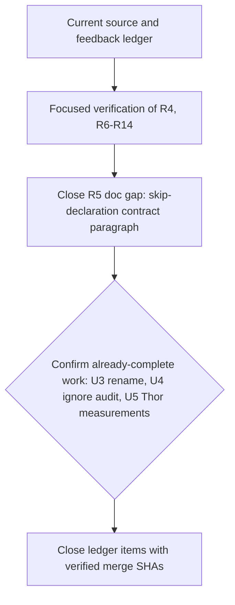

# Feedback Sweep - Plan

## Goal Capsule

- **Objective:** Close out the fourteen feedback items (now marked `closed` with verified merge SHAs) by verifying the fixes already present, closing the one remaining skip-declaration documentation gap, and confirming (via focused fixture runs, not new implementation) that the aoe settings-reconciler rename, the rendered-script-path audit, and the physical Thor measurements — all already complete in the current tree — hold.
- **Authority:** The Product Contract below preserves each issue's requested behavior. Existing implementation evidence can close an item only when the focused fixture proves the same behavior.
- **Execution profile:** Source-state changes only. Use disposable chezmoi source, home, cache, session, and Git fixtures. Never run a live `chezmoi apply` against a real home.
- **Stop conditions:** R16 is satisfied: all six Thor checks are recorded with measured values and dates in the Jetson plan (2026-08-16), and issue #231 is closed with a verified merge SHA. The remaining shipping blocker is the R5 documentation gap in U2. Stop if a verification result conflicts with the fail-closed skip, GitHub-proof, or shared-host contracts, or if a fixture run in U1, U3, or U4 surfaces a real regression rather than confirming existing behavior. The ledger is already closed, so no post-merge update is needed.
- **Tail ownership:** The implementation tail owns focused verification, review fixes, commit, push, pull request, and CI watch. The plan does not authorize deployment to the user's home.

---

## Product Contract

### Summary

Fourteen acknowledged items are tracked in the sweep record. Most R4-R14 behavior already landed in the current tree and is now marked `closed` in the ledger. This plan verifies those contracts instead of reimplementing them, confirms that the already-delivered R17 target-neutral helper rename, R18 rendered-path audit, and R16 Thor measurements still hold, and closes the one remaining gap: the R5 managed-agent documentation paragraph.

**Product Contract preservation:** Product Contract unchanged.

### Problem Frame

The feedback ledger is behind the source tree. The extension retry fix, capability cache, Podman lifecycle, KWin probe, merge selector, GNOME guidance, skip parser, bounded user-manager probe, and GitHub-confirmed branch pruner are present in current source or recent merged commits. Treating those items as new work would create duplicate policy and widen the diff without improving the contract.

The skip-declaration migration has the operator summary command (`dotfiles-skips`) and its fixture, but the managed common instruction template still lacks the concise agent-facing contract paragraph, and `.ci/test-agent-instructions.sh` does not assert it. The aoe settings reconciler has already been renamed from its retired Kimi identity to `settings-reconcile` across its package, executable, build script, fixtures, and diagnostics. `.chezmoiignore` already has a normalized-script-path audit and its CI gate. The Jetson plan's six load-bearing assumptions have already been replaced with physical-board measurements, dated 2026-08-16.

### Requirements

**Retry and skip declarations**

- **R4.** The seven extension retry paths must let later chezmoi phases run after a transient gallery, API, response, download, or extension-operation failure, and must retry on an unchanged later apply without reapplying a converged user-disabled extension.
- **R5.** The skip-declaration contract must have one cached capability snapshot per chezmoi command, complete classification and guard coverage for the historical 130-site inventory, parity with the current frozen CI oracle of 127 owners and 151 rendered instances, a command that reports outstanding transient skips, and concise managed-agent documentation. Capabilities remain runtime inputs, not facts or eligibility gates.

**Contributor and local-Git safety**

- **R6.** Apply-mode local branch pruning must use exact, bounded GitHub merged-pull-request proof for squash merges and retain every branch when proof, authentication, or network access is incomplete. Report mode remains offline and read-only.
- **R7.** Managed agent instructions must require default-branch merges for feature refreshes, state merge commits as the landing method, and explain merge and approved-rebase conflict sides.

**Capability and verification residuals**

- **R8.** Capability snapshots must model platform applicability so active Darwin consumers receive truthful `available` and `unavailable` values and retry when tools appear.
- **R9.** Podman unit reconciliation must use an every-apply lifecycle and a capability that names the user-unit precondition.
- **R10.** The KDE KWin-unreachable path must fingerprint a running Plasma/KWin capability, not session-bus presence alone.
- **R11.** The merge gate must assert that the resolver selects GitHub's REST `merge_commit_sha` field.
- **R12.** GNOME font guidance must describe automatic session-bus recovery and must not direct the operator to use `--force`.
- **R13.** The skip guard must detect one-line case-arm terminators and reject undeclared conditional success exits.
- **R14.** User-manager and user-unit capability probes must be bounded and fail closed when the manager does not respond.

**Thor and cleanup**

- **R16.** Record the six board measurements required by Jetson plan U1: the PCI NVIDIA-vendor probe, `/etc/nv_tegra_release`, the NVIDIA apt source, simulated `nvidia-jetpack` closure size, the live authd SQLite schema, and the installed authd version plus `authctl user set-shell` availability.
- **R17.** Rename the target-neutral aoe TOML settings reconciler from its retired Kimi identity to `settings-reconcile`. Preserve selective TOML overlay, undeclared-key preservation, symlink/path safety, atomic writes, idempotence, and fail-closed contract checking.
- **R18.** Audit every `.chezmoiignore` `.chezmoiscripts/**` rule against chezmoi's normalized rendered script paths. Remove source-only `run_*` and `.tmpl` forms, correct stale paths, and preserve host, desktop, Jetson, macOS, and container gating.

### Actors and flows

- **Chezmoi apply:** R4 and R5 keep later phases running and provide stable retry state.
- **Agent operator:** `dotfiles-skips` reports transient work without requiring apply-scrollback inspection.
- **aoe:** The phase-70 reconciler invokes `settings-reconcile` before mutating declared TOML leaves.
- **CI:** Render gates and disposable fixtures enforce normalized paths, skip declarations, helper renames, and safety boundaries.
- **Thor operator:** A local GUI session runs the six read-only U1 checks and records their outputs in the Jetson plan.

### Acceptance Examples

- **AE1, R4:** A failed extension gallery request leaves no success stamp, later phases still run, and the next unchanged apply retries. A matching success stamp prevents re-enabling a user-disabled extension.
- **AE2, R5:** A transient skip record appears in `dotfiles-skips`, a harmless or completed site does not, and a successful later run removes the record.
- **AE3, R6:** An exact-tip squash-merged branch is eligible only after complete GitHub proof. Missing, malformed, duplicate, unauthenticated, unreachable, or timed-out proof deletes nothing. Report mode does not invoke GitHub, query remotes, or mutate refs, worktrees, or stashes.
- **AE4, R8-R10 and R14:** Darwin tool availability, the Podman unit, Plasma/KWin, and the user manager each produce stable unavailable values before their precondition exists, change when it appears, and never hang past the declared deadline.
- **AE5, R11-R13:** The merge fixture selects `.merge_commit_sha // ""`; GNOME guidance contains automatic recovery and is asserted in the rendered guidance fixture; a one-line `broken) exit 0;;` fixture fails the skip guard.
- **AE6, R16:** The Jetson plan names a measured value and date for all six checks. A plan that contains only vendor or workstation evidence is not complete.
- **AE7, R17:** aoe preserves an unmanaged `[session]` key, overlays declared leaves, converges twice without a second semantic write, and rejects an incompatible contract before writing.
- **AE8, R18:** Every live ignore rule matches at least one normalized script path or an intentional normalized wildcard in each Linux GNOME, Linux KDE, Linux headless, Jetson, container, and macOS variant. A mutant with `run_after_` or `.tmpl` in a live pattern fails the fixture.

### Scope Boundaries

**In scope**

- Verification of R4-R14 against current source and focused disposable fixtures.
- The skip-contract paragraph in `.chezmoitemplates/agents-instructions.tmpl`, the managed common instruction source (the `dotfiles-skips` command and its fixture already exist and are CI-wired).
- Confirming the clean cutover from `kimi-reconcile` to `settings-reconcile`, already complete across the package, build, aoe consumer, lockfile, tests, matrix, CI, and package documentation.
- Confirming the already-complete `.chezmoiignore` normalized-script-path audit and its CI gate.
- Confirming the read-only Thor measurements already recorded in the existing Jetson plan.
- Feedback-ledger closeout after the resulting changes have a verified merge SHA.

**Outside this change**

- Live-home deployment, remote branch deletion, worktree deletion or unlocking, stash deletion, service teardown, and secret rotation.
- Removal of `kimi-code` or `google-antigravity` omp provider IDs. Provider names are data-plane names, not harness names.
- Pruning an already-installed `~/.local/bin/kimi-reconcile`. The rename stops source management of the old binary; no destructive teardown script is added without a separate operator decision.
- General Ubuntu support, new Jetson behavior, or changes to the Jetson implementation plan beyond recording U1 measurements.
- A second skip-declaration or capability policy system.

### Outstanding Questions

- **Resolved, R16:** All six Thor measurements were recorded on the physical board on 2026-08-16 (see Sources) and issue #231 is closed with a verified merge SHA. No further physical-board access is required for this plan; U5 only needs to confirm the recorded values still hold.

### Sources / Research

- `docs/feedback-sweep/state.yml` is the authoritative item-to-requirement and merge-evidence ledger.
- Issues [#214](https://github.com/hyperlapse122/dotfiles/issues/214), [#215](https://github.com/hyperlapse122/dotfiles/issues/215), [#217](https://github.com/hyperlapse122/dotfiles/issues/217), [#218](https://github.com/hyperlapse122/dotfiles/issues/218), [#220](https://github.com/hyperlapse122/dotfiles/issues/220), [#221](https://github.com/hyperlapse122/dotfiles/issues/221), [#222](https://github.com/hyperlapse122/dotfiles/issues/222), [#223](https://github.com/hyperlapse122/dotfiles/issues/223), [#224](https://github.com/hyperlapse122/dotfiles/issues/224), [#225](https://github.com/hyperlapse122/dotfiles/issues/225), [#226](https://github.com/hyperlapse122/dotfiles/issues/226), [#231](https://github.com/hyperlapse122/dotfiles/issues/231), [#233](https://github.com/hyperlapse122/dotfiles/issues/233), and [#235](https://github.com/hyperlapse122/dotfiles/issues/235) define the remaining behavior and acceptance boundaries.
- Commit `1daf303d2f549618a4c66ecf0c822f4a51846d1f` contains the landed extension retry contract for R4.
- `.chezmoitemplates/skip.sh.tmpl`, `.chezmoitemplates/capabilities.tmpl`, `.install-prerequisites.sh`, and `.ci/skip-declaration-site-matrix.yaml` define the existing R5 mechanism. The historical classification has 130 sites; the current frozen CI oracle has 127 owners and 151 rendered instances, while the cached capability registry remains the runtime source.
- `docs/plans/2026-08-13-001-feat-skip-declaration-contract-plan.md` is the source design for the skip directions, cached probes, and summary command.
- `docs/plans/2026-08-14-001-feat-jetson-agx-thor-support-plan.md:375-390` defines the six R16 checks.
- `packages/settings-reconcile/`, `.chezmoiscripts/60-build/run_onchange_after_build-settings-reconcile.sh.tmpl`, and `.chezmoiscripts/70-agents/run_after_config-aoe.sh.tmpl` show the renamed live R17 dependency.
- The official chezmoi `.chezmoiignore` contract matches target paths, and `.chezmoiscripts` removes the `run_*` attribute and `.tmpl` suffix from its rendered script path. R18 tests that normalized surface.

---

## Planning Contract

### Key Technical Decisions

- **KTD1. Verify landed contracts before editing shared policy.** R4 and R8-R14 have current implementation evidence. Run their focused tests first. Repair only a concrete failing behavior; do not create parallel mechanisms or rewrite a converged fix.
- **KTD2. Reuse the existing skip records for the summary.** `skip.sh.tmpl` already writes one private `v1` record per `<script>__<site>` and clears it on completion. `dotfiles-skips` reads those records, omits harmless entries, reports malformed records while continuing through later valid records, and never probes the host or changes state. A nonzero result is reserved for an unreadable state directory or other state-read failure.
- **KTD3. Confirmed the rename (not deletion) of the aoe reconciler.** `settings-reconcile` preserves a live aoe behavior while removing the retired harness identity. The package, executable, build script, CI fixture, matrix owners, diagnostics, package name, and settings contract were renamed together, leaving no compatibility aliases or duplicate binary paths.
- **KTD4. Treat normalized script paths as the R18 oracle.** Derive each source script's pseudo-target by removing its `run_once_`, `run_onchange_`, `run_after_`, or `run_before_` prefix and its `.tmpl` suffix. Compare rendered ignore entries to that set under Linux GNOME, KDE, headless, Jetson, container, and macOS fact variants. Comments may cite source names; live ignore patterns may not.
- **KTD5. R16 is resolved; keep the rest of state-transition evidence-based.** U5's six Thor measurements are already recorded in the Jetson plan from the physical board (2026-08-16); no further board access is required for this plan. Do not edit facts, package gates, or assumptions to contradict that recorded evidence.
- **KTD6. Keep state transitions evidence-based.** Do not mark an issue closed before its source change has a verified merge SHA. The post-merge ledger update is part of the shipping tail, not a pre-merge claim.

### High-Level Technical Design

The existing capability cache remains the only probe-resolution layer. The new summary command is read-only. The helper rename changes names and paths, not TOML semantics. The ignore audit changes only rules that fail normalized-path evidence.

### Existing-satisfied baseline

| Requirement | Current evidence | Planned treatment |
| --- | --- | --- |
| R4 | `1daf303` converts the three extension reconcilers to `run_after_` jobs with safe success signatures and an exit-0 retry path. | Run the extension fixture and inspect all seven retry-intended branches. |
| R5 | The capability cache, `skip.sh.tmpl`, guard, and historical 130-site classification exist; the live frozen CI oracle is 127 owners and 151 rendered instances. `dotfiles-skips` and its fixture already exist and are wired into CI. | Add the missing contract paragraph to `.chezmoitemplates/agents-instructions.tmpl`, assert it in `.ci/test-agent-instructions.sh`, and run the existing `dotfiles-skips` and skip-declaration fixtures to confirm. |
| R6 | `git-prune-local-branches` uses bounded GitHub merged-PR proof and non-force deletion. | Run the disposable Git/GitHub refusal matrix. |
| R7 | The composed instruction source states merge delivery and conflict sides. | Run the managed-instruction test; edit only if the test proves a missing target. |
| R8 | The registry is versioned and carries `any`/`linux` applicability. | Run Darwin cache and token-flip fixtures. |
| R9 | Podman uses `run_after_` and `podman-socket-unit-present`. | Run lifecycle and unchanged-availability fixtures. |
| R10 | KDE pairs `kwin-unreachable` with `plasmashell-running`. | Run capability and skip-pairing fixtures. |
| R11 | The merge resolver reads REST `.merge_commit_sha // ""`. | Run positive and negative selector assertions. |
| R12 | GNOME font guidance names automatic session-bus recovery. | Render and assert the comment contract. |
| R13 | `TERM_ANY` recognizes `)` as a case-arm terminator. | Run clean and one-line mutant fixtures. |
| R14 | User-manager and user-unit probes use bounded child processes. | Run deadline and fail-closed fixtures. |
| R16 | All six measurements are recorded with dates in the Jetson plan (2026-08-16); issue #231 is closed with a verified merge SHA. | Confirm the recorded values still hold; no further measurement work is needed. |
| R17 | `settings-reconcile` is the live package, executable, and build script; no live `kimi-reconcile` source, CI, or package-documentation reference remains (only historical ledger text). | Run the renamed build/package/capability fixtures to confirm the rename holds; no further rename work is needed. |
| R18 | `.chezmoiignore` already uses normalized `.chezmoiscripts/**` rules against rendered paths, and `.ci/test-chezmoiignore-script-paths.sh` exists and is CI-wired. | Run the audit fixture to confirm; no further rule changes are anticipated. |

### Assumptions

- The current branch includes the commits and source surfaces cited above.
- The repository's existing CI environment provides `chezmoi`, Node, `mise`, and the disposable `op` stub used by render fixtures.
- The settings reconciler's existing TOML tests define the semantic contract. The rename must not change their expected bytes or modes.
- A stale old binary may remain on an existing host because source-only management cannot safely prove its provenance. The new binary is the only managed target after the rename.
- R18's normalized pseudo-target list is an audit oracle only. It must not make `.chezmoiignore` depend on source metadata at render time.
- U3's rename, U4's ignore audit, and U5's Thor measurements are already merged in the current tree; their implementation units below are verification-only unless a fixture run finds a live regression.

### Sequencing

1. Run U1's focused baseline and record whether each R4 and R6-R14 item is already satisfied, including the R6 report-mode refusal boundary and the rendered R12 guidance assertion.
2. Close U2's remaining documentation gap: add the skip-declaration contract paragraph to `.chezmoitemplates/agents-instructions.tmpl` and assert it in `.ci/test-agent-instructions.sh`. The summary command and its fixture already exist and only need a confirming run.
3. Confirm U3's rename holds by running its fixtures. U2 and U3 are independent after U1; their listed order is sequencing only.
4. Confirm U4's normalized-path audit holds by running its fixture.
5. Confirm U5's Thor measurements, already recorded on 2026-08-16, remain accurate.
6. Render every changed template, run the complete verification contract, review the diff, and ship.

### Risks and Dependencies

- A fake success stamp can re-enable a disabled extension if U1 does not inspect safe-record and stamp tests; keep the existing atomic, symlink-safe fixture.
- The old `kimi-reconcile` binary may remain unmanaged after U3. This is intentional and must not be silently pruned; aoe must never fall back to that path or its old contract when the new binary is absent or incompatible.
- R18 can pass a text-only test while chezmoi's normalized path differs. Build the normalized list from the same source naming rules, use the live KDE source `run_onchange_after_config-kde-settings.sh.tmpl`, and cover GNOME, KDE, headless, Jetson, container, and macOS render variants.
- R16's six measurements are already recorded from the physical board (2026-08-16); re-verify them against the Jetson plan's Dependencies and Assumptions section rather than re-deriving them from vendor documentation or host inference.
- A feedback ledger update before merge would claim evidence that does not exist. Update it only after the merge and CI watch.

---

## Implementation Units

### U1. Verify existing feedback fixes

- **Goal:** Prove R4 and R6-R14 from the current source without duplicating their implementation.
- **Requirements:** R4, R6, R7, R8, R9, R10, R11, R12, R13, R14.
- **Files:** Existing focused fixtures and their cited source surfaces; `.ci/test-fingerprint-gates.sh` for the rendered R12 guidance assertion; no planned source change unless a fixture exposes a real regression.
- **Approach:** Run the extension, capability, skip-declaration, merge-gate, branch-pruner, instruction, and rendered-guidance fixtures. Inspect the rendered extension jobs to confirm all seven retry-intended paths complete the apply and leave no success stamp. Check the capability registry, cached snapshot, Podman lifecycle, KWin pairing, REST selector, GNOME guidance wording and automatic session-bus recovery, parser terminator, and bounded user-manager path against the product contract. Exercise report-mode pruning with no GitHub CLI, no remote lookup, and no local mutation. If a check fails, fix the existing owner in place and extend its existing fixture; do not add a second policy surface.
- **Test scenarios:**
  - The current clean fixtures pass without errors.
  - Every declared refusal boundary remains fail-closed.
  - A missing capability or remote proof never hangs or mutates protected state.
  - Report mode stays offline and read-only.
  - The rendered GNOME guidance names automatic session-bus recovery and does not direct `--force`.
  - A successful extension signature suppresses a converged user-disabled extension.
- **Verification:** `bash .ci/test-extension-retry.sh`; `bash .ci/test-capability-cache.sh`; `bash .ci/test-skip-declaration-gates.sh`; `bash .ci/test-merge-commit-only-gates.sh`; `bash .ci/test-git-prune-local-branches.sh`; `bash .ci/test-agent-instructions.sh`; `bash .ci/test-fingerprint-gates.sh`.
- **Dependencies:** None.

### U2. Close the skip-declaration documentation gap

- **Goal:** Give operators one read-only command for outstanding transient skips and document the enforced declaration contract. The command and its fixture already exist and are CI-wired; only the managed-agent documentation is missing.
- **Requirements:** R5.
- **Files:** `.chezmoitemplates/agents-instructions.tmpl` (add the contract paragraph); `.ci/test-agent-instructions.sh` (add an assertion for it); `dot_local/bin/executable_dotfiles-skips` (existing, verify only); `.ci/test-dotfiles-skips.sh` (existing, verify only); `.github/workflows/ci.yml` (existing, already wired — verify only).
- **Approach:** `dotfiles-skips` already reads `${XDG_STATE_HOME:-$HOME/.local/state}/chezmoi/skips/` without probing capabilities or modifying records, accepts the existing `v1` tab-separated shape, enumerates regular non-symlink files in stable order, prints script, site, direction/probe, and reason for `transient-tolerable` and `transient-blocking` records, omits harmless and completed records, and reports malformed records without failing except on an unreadable state directory. Run its existing fixture unchanged to confirm those six behaviors still hold. The only remaining work is documentation: add the concise contract paragraph to `.chezmoitemplates/agents-instructions.tmpl`, naming the three directions (`harmless`, `transient-tolerable`, `transient-blocking`) and `dotfiles-skips`; then add an assertion for that paragraph to `.ci/test-agent-instructions.sh` so a future regression is caught.
- **Test scenarios:**
  - An absent directory produces a clean exit-0 empty report.
  - A fixture with harmless, tolerable, and blocking records reports only the two transient records.
  - A later completion removes the record from the report.
  - A malformed record is diagnosed on stderr, does not make the command fail, and does not hide later valid records.
  - Symlinked state entries are safely ignored.
  - The rendered common instruction template contains the skip-declaration contract paragraph, and `test-agent-instructions.sh` fails if it is removed.
- **Verification:** Run `bash .ci/test-dotfiles-skips.sh`; run `bash .ci/test-skip-declaration-gates.sh`; run `bash .ci/test-agent-instructions.sh`; inspect the command with `bash -n`.
- **Dependencies:** U1.

### U3. Confirm the aoe settings-reconciler rename holds

- **Goal:** Confirm the retired Kimi identity has been fully removed from the live target-neutral helper while aoe TOML reconciliation still works. The rename is already complete in the current tree; this unit is verification-only unless a fixture finds a live regression.
- **Requirements:** R17.
- **Files (verification targets, not planned edits):** `packages/settings-reconcile/`; `packages/package.json`; `packages/bun.lock`; `packages/README.md`; `.chezmoiscripts/60-build/run_onchange_after_build-settings-reconcile.sh.tmpl`; `.chezmoiscripts/70-agents/run_after_config-aoe.sh.tmpl`; `.ci/test-build-settings-reconcile.sh`; `.ci/skip-declaration-site-matrix.yaml`; `.ci/test-capability-cache.sh`; `.github/workflows/ci.yml`.
- **Approach:** The package is already `@h82/settings-reconcile`, emits `dist/settings-reconcile`, installs to `~/.local/bin/settings-reconcile`, and the settings contract is already `settings-reconcile/v1` with aoe's preflight assertion updated to match. `settings <home> <config.toml|tui.toml> <declared-json>`, selective TOML-leaf overlay, atomic replacement, regular-file and symlink checks, idempotence, and undeclared-key preservation are already preserved. No live source, build, CI, or package-documentation path retains the old helper identity (only historical ledger/plan text references it). Run the fixtures below to confirm; only fix a concrete regression a fixture exposes — do not reintroduce a compatibility alias or duplicate policy.
- **Test scenarios:**
  - The renamed package builds cleanly from the workspace lockfile.
  - `contracts` subcommand returns only `settings-reconcile/v1`.
  - A seeded aoe config preserves unmanaged keys and receives declared leaves.
  - A second identical run makes no semantic change.
  - A foreign symlink and an incompatible contract fail before writing.
  - With only the old binary present, aoe does not invoke it; with the new binary absent or incompatible, it refuses safely.
  - No live source, build, CI, or package documentation path retains the old helper identity.
- **Verification:** Run `bash .ci/test-build-settings-reconcile.sh`; run package tests; run `bash .ci/test-capability-cache.sh` and `bash .ci/test-skip-declaration-gates.sh`; search live source and rendered changed scripts for stale helper names, excluding historical plan text, the explicitly unmanaged old deployed binary, and provider IDs.
- **Dependencies:** U1.

### U4. Confirm the normalized `.chezmoiignore` script-path audit holds

- **Goal:** Confirm `.chezmoiignore` already matches chezmoi's normalized rendered script paths instead of source-only prefixes or template suffixes. The audit and its fixture are already implemented; this unit is verification-only unless a fixture finds a live regression.
- **Requirements:** R18.
- **Files (verification targets, not planned edits):** `.chezmoiignore`; `.ci/test-chezmoiignore-script-paths.sh`; `.github/workflows/ci.yml`; `.ci/lib/render-gate-helpers.sh` only if a fixture run exposes a shared-assertion gap.
- **Approach:** `.ci/test-chezmoiignore-script-paths.sh` already enumerates every `.chezmoiscripts/**/run_*` source file, derives its normalized path by removing the run attribute and `.tmpl`, preserves `.ps1` extensions, and renders `.chezmoiignore` for Linux GNOME, KDE, headless, Jetson, container, and macOS variants with expected eligible/ignored target sets, including the negative mutant based on the live KDE source. Run the fixture to confirm all of that still holds; only correct a concrete stale rule a fixture run exposes.
- **Test scenarios:**
  - Clean rendered variants pass with their expected target sets across all supported platforms.
  - A mutant that replaces the live KDE rule with a source-style `run_onchange_after_config-kde-settings.sh.tmpl` token fails, while the normalized `50-linux-kde/config-kde-settings.sh` form passes.
  - A mutant with a no-match directory or `.tmpl` suffix fails.
  - Linux GNOME, KDE, headless, Jetson, container, and macOS expected target gates remain unchanged.
- **Verification:** Run `bash .ci/test-chezmoiignore-script-paths.sh`; run `bash .ci/test-mxm4-haptic-gates.sh`; render `.chezmoiignore` through the existing disposable `op` recipe for every listed variant and inspect the resulting script paths.
- **Dependencies:** U1.

### U5. Confirm the recorded physical Thor measurements

- **Goal:** Confirm the six physical Thor measurements already recorded in the Jetson plan remain accurate. All six were measured on the board and recorded on 2026-08-16; no further hardware access is required for this plan.
- **Requirements:** R16.
- **Files:** `docs/plans/2026-08-14-001-feat-jetson-agx-thor-support-plan.md` (read-only confirmation; edit only if a discrepancy surfaces).
- **Approach:** `docs/plans/2026-08-14-001-feat-jetson-agx-thor-support-plan.md:227-236` already records, with a 2026-08-16 board date: the discrete-NVIDIA PCI-vendor probe result, the `/etc/nv_tegra_release` L4T release string, the NVIDIA apt source presence, the `nvidia-jetpack` closure package count and installed size, the authd SQLite schema version and `users.shell` column, and the installed authd version plus `authctl user set-shell` availability. Confirm this text is unchanged and internally consistent with the plan's Dependencies and Assumptions section; do not re-derive these values from vendor documentation or host inference.
- **Execution note:** Read-only confirmation; makes no configuration change on the board and requires no new board access.
- **Test scenarios:**
  - `Test expectation: none -- read-only confirmation unit with no repository change expected.`
- **Verification:** The Jetson plan's Dependencies and Assumptions section already contains a measured result, with date, for all six checks (confirmed 2026-08-16); issue #231 is closed with fix_ref PR #244 and a verified merge SHA in `docs/feedback-sweep/state.yml`.
- **Dependencies:** None.

---

## Verification Contract

### Focused regression commands

| Command | Contract |
| --- | --- |
| `bash .ci/test-extension-retry.sh` | R4 unchanged-apply retry, later-phase continuation, and safe signature convergence |
| `bash .ci/test-capability-cache.sh` | R5 cache integrity, 127-owner/151-instance frozen-oracle parity, R8 Darwin applicability, R9 unit probe, and R14 bounded probes |
| `bash .ci/test-skip-declaration-gates.sh` | R5 historical inventory classification, 127/151 guard accounting, R9 lifecycle accounting, R10 probe pairing, and R13 one-line parser mutant |
| `bash .ci/test-merge-commit-only-gates.sh` | R7 merge topology and R11 REST selector |
| `bash .ci/test-git-prune-local-branches.sh` | R6 exact GitHub proof, timeout, race, worktree, stash safety, and report-mode no-mutation behavior |
| `bash .ci/test-agent-instructions.sh` | R7 managed merge and approved-rebase policy |
| `bash .ci/test-fingerprint-gates.sh` | R12 rendered GNOME font guidance, automatic session-bus recovery wording, and no-`--force` instruction |
| `bash .ci/test-dotfiles-skips.sh` | R5 summary output, clearing, malformed input, and symlink safety |
| `bash .ci/test-chezmoiignore-script-paths.sh` | R18 normalized script-path audit across Linux GNOME/KDE/headless/Jetson/container and macOS variants |
| renamed settings-reconcile build and package tests | R17 workspace, contract, TOML overlay, and install-boundary behavior |

### Render and source checks

- Render every changed `.tmpl` and `.sh.tmpl` through `chezmoi execute-template` with `--source "$PWD"`, a disposable destination, an empty config, and the newline-free `op` stub required by the repository instructions.
- Compare rendered scripts as text. Do not validate only source snippets.
- Run `bash -n` on every new or renamed shell helper and use the existing shellcheck/CI surface where the repository already invokes it.
- Confirm the capability registry, hook, and reader still agree on schema, sorted keys, platform fields, exact cache keys, and fail-closed tokens.
- Confirm `dotfiles-skips` never probes, writes, follows symlinks, or emits credentials; malformed records are reported without hiding later valid records, and state-read failures are the only nonzero error class.
- Confirm the helper rename has no live stale `kimi-reconcile` path, alias, contract, package name, fixture, matrix owner, or diagnostic. The old deployed binary may remain unmanaged but is never invoked as a fallback. Historical plans and the `kimi-code` provider remain explicit exceptions.
- Confirm report-mode pruning never invokes `gh`, queries `origin`, or mutates refs, worktrees, or stashes.
- Confirm `.chezmoiignore` script patterns are normalized rendered paths, not source metadata, and match the expected target sets in every listed host/desktop/container variant.
- Run `git diff --check`, `git status --short`, and a diff limited to the requested source, test, plan, and ledger paths.

### R16 measurement status

- R16 is resolved: all six measurements are recorded with dates in `docs/plans/2026-08-14-001-feat-jetson-agx-thor-support-plan.md:227-236` (board date 2026-08-16), and issue #231 is closed in `docs/feedback-sweep/state.yml` with `fix_ref` PR #244 and a verified merge SHA. No external measurement gate remains; U5 only reconfirms this evidence.

### CI delivery

- Keep the new focused fixtures in the existing `omp-agent-integration` aggregate.
- Keep Linux/macOS isolated render jobs as the prune and ignore-gate surface.
- After shipping, watch both `render-dotfiles.yml` and `ci.yml` to terminal success. Do not skip, weaken, or rerun a failing check to hide the failure.
- Only after CI and merge proof exist may the feedback ledger mark the affected items `closed` with `fix_ref`, `verified_merge_sha`, and `verified_at`.

---

## Definition of Done

- R4 and R6-R14 are proven by their existing focused fixtures or by a narrowly scoped repair to the existing owner. R6 report mode is explicitly proven offline and read-only.
- R5 has the cached probe contract, historical 130-site classification, 127-owner/151-instance frozen-oracle parity, a read-only `dotfiles-skips` command, its fixture, and concise managed-agent documentation.
- R17 has one target-neutral `settings-reconcile` package and binary path. aoe still converges declared TOML leaves, refuses safely when the new binary is absent or incompatible, never falls back to the unmanaged old binary, and fails closed on unsafe state. No compatibility alias or duplicate policy remains.
- R18 has no invalid live script-path pattern. Every `.chezmoiignore` script rule matches a normalized rendered path or an intentional wildcard in Linux GNOME, KDE, headless, Jetson, container, and macOS variants. Existing gating behavior is unchanged.
- R16 measurements are recorded in the Jetson plan (confirmed 2026-08-16, board date); this item is already satisfied.
- All focused fixtures pass in disposable environments. Every changed template and script is rendered and inspected with the source-root rule.
- No real home, secret, remote branch, worktree, or stash was modified by verification.
- CI is terminal green for the rendered-dotfiles and main CI workflows.
- The final diff contains no abandoned experiments, stale path aliases, compatibility shims, TODO implementations, or duplicate policy systems.

---

## Appendix: Feedback evidence and closeout map

| Item | Issue | Evidence or deliverable |
| --- | --- | --- |
| R4 | #214 | `1daf303` plus `test-extension-retry.sh`; close after merge proof |
| R5 | #215 | Existing cache/guard/matrix plus U2 summary and docs |
| R6 | #217 | `git-prune-local-branches` and disposable proof fixture |
| R7 | #218 | Composed agent instructions and managed-instruction fixture |
| R8 | #220 | Platform-aware registry and capability-cache fixture |
| R9 | #221 | `run_after_` Podman script and unit capability fixture |
| R10 | #222 | `plasmashell-running` pairing and skip-declaration fixture |
| R11 | #223 | REST `.merge_commit_sha` selector and merge-gate fixture |
| R12 | #224 | GNOME automatic session-bus recovery comment |
| R13 | #225 | `TERM_ANY` case-arm delimiter and parser mutant |
| R14 | #226 | Bounded user-manager resolver and deadline fixture |
| R16 | #231 | U5 reconfirms the six physical Thor measurements already recorded 2026-08-16; issue closed with fix_ref PR #244 and a verified merge SHA |
| R17 | #233 | U3's target-neutral package and aoe migration |
| R18 | #235 | U4's normalized `.chezmoiignore` audit and fixture |
