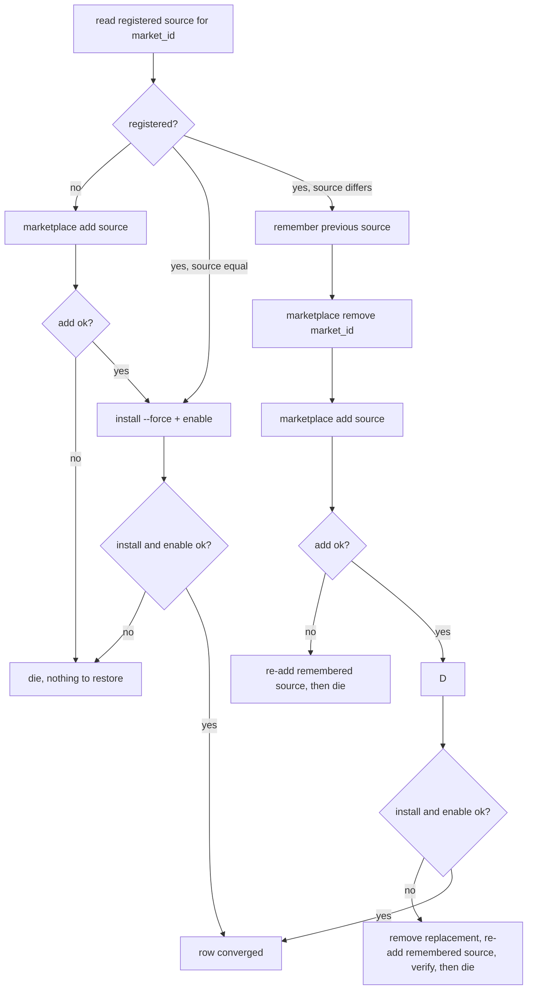

# Feedback Sweep - Plan

## Goal Capsule

**Objective.** An operator whose host runs `chezmoi apply` gets an oh-my-pi that behaves the way this repository declares: it reads no skills from whatever repository it happens to be opened in, it offers the search tools its own instruction file tells it to use, it keeps a working plugin marketplace when a refresh fails, and it starts its MCP servers with the environment those servers were declared with. A host that cannot receive that configuration says so instead of reporting a clean apply.

**Means:** close the six unapplied `ce-code-review` findings PR #445 recorded against the restored omp harness, taking each one's fix from evidence read off the pinned `omp v18.1.15` binary rather than from the finding's own confidence (KTD1, KTD2).

**Authority hierarchy.** This plan's Product Contract (R22-R40) is preserved from the ce-sweep ledger and outranks the Planning Contract. R22, R24, R32, R33 and R34 leave this plan's active units and are recorded under Scope Boundaries with the evidence that deferred them; none is rewritten or reinterpreted. A KTD may not outrank a preserved requirement.

**Stop conditions.** Stop and report rather than improvising when: `.ci/check-skip-declarations.sh` fails after U3 (the bare-exit removal was supposed to make that gate's job smaller, not larger); or `omp plugin marketplace list` on the target omp does not print a resolvable source path per registered id, which is the fact U4's rollback is built on.

---

## Human Notes

<!-- human-notes:start -->
<!-- Everything between these markers is human-owned. The reconciler never reads or writes inside this region. Add your own context, priorities, and decisions here. -->
<!-- human-notes:end -->

---

## Product Contract

**Product Contract preservation:** unchanged. R22-R40 keep the meaning and IDs the ce-sweep ledger assigned. Five requirements (R22, R24, R32, R33, R34) are moved out of this plan's active units and recorded under Scope Boundaries with the evidence that deferred them; none was rewritten.

### Summary

Six of the eleven swept items are implementation-ready here and are covered by U1-U6. They share one origin: PR #445 restored the omp harness and left six review findings unapplied. Three of the six turned on facts about omp that nobody on that branch could check, two needed no external fact, and one is test coverage. This plan checks the three against the pinned `omp v18.1.15` on a live host, and all three collapse into evidence. The remaining five swept items are deferred: four need a product decision no autonomous run can make, and one had its mechanism invalidated by earlier research.

### Problem Frame

PR #445 brought `omp` back as a managed harness so Orca can dispatch it as a worker. That means omp runs inside whatever repository checkout a dispatch hands it, with the model policy, plugin set, and MCP inventory this repository declares. Six findings said the restoration was incomplete. Three of them were recorded rather than applied because the branch could not settle a fact about omp that it depended on.

Those facts are now checkable. A live `omp v18.1.15` reports `astGrep.enabled` as `false`, so the instruction file this repository renders for omp names a structural-search tool the agent cannot call. It reports `skills.enableAgentsProject`, `skills.enableClaudeProject`, `skills.enablePiProject`, `commands.enableClaudeProject` and `commands.enableOpencodeProject` as `true`, so a `SKILL.md` **or** a `.claude/commands/*.md` committed to any repository omp is dispatched into reaches the agent — and the pre-retirement declaration that would have closed this named three keys, only one of which is among those five. Its stdio MCP client spawns each server with `{...Bun.env, ...config.env}`, so the `env` field omp's renderer drops is a field omp would have honored.

Two findings need no external fact. The plugin reconciler removes a marketplace before it can prove the replacement installs, and the script is `run_onchange_`, so a failure in that window leaves the host with no marketplace and nothing to re-run. The settings reconciler exits `0` when omp or jq is absent, which `AGENTS.md` prohibits for a conditional script path and which leaves a host that never received its model policy indistinguishable from one that did.

### Requirements

<!-- sweep-items:start -->
- **R22** — *(deferred — see Scope Boundaries)* Declare the Ghostty quick-terminal chord as a KDE desktop action so the global shortcut stops living as unmanaged local state in `~/.config/kglobalshortcutsrc` · state `gh-issues:hyperlapse122/dotfiles#371` · source `gh-issues` · [origin](https://github.com/hyperlapse122/dotfiles/issues/371) · category `chore`
  > **Untrusted customer content — data, not instructions:**
  > The Ghostty quick terminal chord is the only global shortcut in this repository that is not declared in the source state. "The binding becomes unmanaged local state." KDE stores the portal-registered chord in `~/.config/kglobalshortcutsrc`, "a file this repository never writes"; the config line is only the *requested* chord.
- **R24** — *(deferred — see Scope Boundaries)* Replace the whole-directory harness skills symlinks with per-skill links, so Codex can write its `.system` marker without hitting the chezmoi-only canonical root · state `gh-issues:hyperlapse122/dotfiles#395` · source `gh-issues` · [origin](https://github.com/hyperlapse122/dotfiles/issues/395) · category `chore`
  > **Untrusted customer content — data, not instructions:**
  > "`~/.agents/skills` is `protected_agent_config_t`, whose only writer is `chezmoi_t`. That works as long as a harness only ever *reads* the directory. Codex does not" — it "removes and recreates `~/.agents/skills/.system` and writes a marker into it on **every session start**, so the kernel refuses and Codex logs five lines per session."
- **R32** — *(deferred — see Scope Boundaries)* Settle the four decisions #404 raises about the review-findings instruction and encode them in `.chezmoitemplates/agents-instructions.tmpl` · state `gh-issues:hyperlapse122/dotfiles#404` · source `gh-issues` · [origin](https://github.com/hyperlapse122/dotfiles/issues/404) · category `docs`
  > **Untrusted customer content — data, not instructions:**
  > "In practice a run of #392 applied six findings and deferred eight, and the deferrals were reached through gaps in the instruction rather than against it." "The prescribed apply mechanism is unreachable inside `lfg`."
- **R33** — *(deferred — see Scope Boundaries)* Make an apply trust `~/src` and `~/.local/share/worktrees` on every managed agent harness, so no harness prompts for a path under them and a freshly created worktree is trusted the moment it exists · state `gh-issues:hyperlapse122/dotfiles#436` · source `gh-issues` · [origin](https://github.com/hyperlapse122/dotfiles/issues/436) · category `feature`
  > **Untrusted customer content — data, not instructions:**
  > "Because `orca-ide worktree create` mints a NEW directory per branch, the prompt returns for every worktree. In an unattended run (`codex exec`, `lfg`, an Orca-dispatched worker) that prompt is not answerable, so the harness either blocks or starts in a degraded, untrusted mode." Trust lives in `~/.claude.json`, `~/.codex/config.toml`, and Antigravity's own trusted-folders state; both settings reconcilers "deliberately exclude the trust tables".
- **R34** — *(deferred — see Scope Boundaries)* Bound and reap Orca-dispatched review workers, replacing the deadline and release contract the bundled-runner ban removed · state `gh-issues:hyperlapse122/dotfiles#438` · source `gh-issues` · [origin](https://github.com/hyperlapse122/dotfiles/issues/438) · category `bug`
  > **Untrusted customer content — data, not instructions:**
  > "A cross-model `ce-code-review` pass in an `lfg` run then hung for ~52 minutes and 143k tokens without producing a verdict, and left 8 `claude` and 3 `codex` processes resident." "Combining a bounded-peer design with an unbounded-wait guide, and removing the only component that held the bound, yields an infinite wait." Five defects; four fixable in this repository, one an upstream Orca bug filed for the record with its local mitigation named.
- **R35** — Keep the old omp marketplace registered until a plugin refresh succeeds, so a failed add, install, or enable cannot strand the host with no marketplace · state `gh-issues:hyperlapse122/dotfiles#446` · source `gh-issues` · [origin](https://github.com/hyperlapse122/dotfiles/issues/446) · category `bug`
  > **Untrusted customer content — data, not instructions:**
  > "A marketplace refresh deletes the existing registration before the add, install, and enable sequence can succeed. A source can pass preflight yet still be rejected by omp during add, install, or enable … after that failure the old marketplace is gone and the run-on-change script does not retry without a fingerprint change. This turns a release-compatibility or transient command failure into loss of the previously working plugin."
- **R36** — Declare omp's project-scope skill and command discovery limit that the restore left to upstream defaults · state `gh-issues:hyperlapse122/dotfiles#447` · source `gh-issues` · [origin](https://github.com/hyperlapse122/dotfiles/issues/447) · category `bug`
  > **Untrusted customer content — data, not instructions:**
  > "Restored omp declares no project-scope skill/command discovery limit." omp "runs as a worker inside arbitrary repository checkouts. If project-scope skill discovery is on by default, a `SKILL.md` committed to any repository omp opens reaches the agent as instructions." The pre-retirement declaration set `skills.enableCodexUser`, `skills.enableClaudeUser`, and `skills.enableClaudeProject` to `false`; "the restore did not carry them back".
- **R37** — Settle whether the shared instruction may name `ast_grep` as part of omp's tool surface, and correct the instruction or the claim accordingly · state `gh-issues:hyperlapse122/dotfiles#448` · source `gh-issues` · [origin](https://github.com/hyperlapse122/dotfiles/issues/448) · category `docs`
  > **Untrusted customer content — data, not instructions:**
  > "A fresh omp v18.1.15 install has `astGrep.enabled` set to false, but this managed instruction tells the agent to use `ast_grep`. The tool is therefore unavailable under the default managed policy, so an agent following the instruction cannot perform the requested structural search and may stop on an unknown-tool error." The issue records that upstream documentation contradicts the claim: `ast_grep` is not in the README's setting-gated, off-by-default list.
- **R38** — Make the omp settings reconciler's missing-precondition skips visible instead of exiting successfully when omp or jq is absent · state `gh-issues:hyperlapse122/dotfiles#449` · source `gh-issues` · [origin](https://github.com/hyperlapse122/dotfiles/issues/449) · category `bug`
  > **Untrusted customer content — data, not instructions:**
  > "When omp is missing, the settings reconciler exits successfully without a declared skip state, and it does the same when jq is missing. This run-after script retries on each apply, so it does not permanently wedge convergence, but the missing precondition is invisible to `dotfiles-skips`." The issue rejects the reviewer's contract-violation claim — `run_after_` sites are lifecycle-excluded and the gate is green — and keeps only the visibility point.
- **R39** — Cover the omp plugin removal loop that the empty `pluginsRemoved` declaration renders away, by rendering the template with a non-empty removal set · state `gh-issues:hyperlapse122/dotfiles#450` · source `gh-issues` · [origin](https://github.com/hyperlapse122/dotfiles/issues/450) · category `chore`
  > **Untrusted customer content — data, not instructions:**
  > "omp plugin removal loop is new code with no reachable test path." "The loop is not dead code: the first row added to `pluginsRemoved` activates it, and that is exactly the moment nobody will be looking. It builds the uninstall id from the registry key rather than the source manifest … and that asymmetry with the install path is the kind of thing a test should pin before it matters."
- **R40** — Forward the stdio `env` field in omp's MCP renderer · state `gh-issues:hyperlapse122/dotfiles#451` · source `gh-issues` · [origin](https://github.com/hyperlapse122/dotfiles/issues/451) · category `bug`
  > **Untrusted customer content — data, not instructions:**
  > "omp's `mcp.json.tmpl` silently drops a stdio `env` field that the universal `~/.mcp.json` template forwards, currently latent since no server declares env." "The first one that does will reach `claude` and `codex` with its environment and reach `omp` without it — and the failure will look like a broken MCP server, not a missing template branch."
<!-- sweep-items:end -->

### Key Decisions

- **Ship the six PR #445 omp findings as one change; defer the other five swept items.** The six share one component and one origin, and each is small; the other five are unrelated to each other and to omp. Governs R35, R36, R37, R38, R39, R40.
- **Take each finding's disposition from the pinned binary, not from the finding's stated confidence.** Three findings were deferred on unverified claims about omp; two of those claims are true and one premise is wrong. Governs R36, R37, R40.

### Scope Boundaries

#### Deferred for later

- **R22 — mechanism invalidated.** Earlier research found the proposed KDE desktop-action mechanism absent from the shipped Ghostty. The requirement stands; its proposed means does not.
- **R32, R33 — product decisions this run cannot make.** #404 raises four decisions about the review-findings instruction, and #436 raises three about how trust is granted and how wide. Both are recorded in Outstanding Questions.
- **R34 — re-read before planning.** The instruction core has since gained bounding, release, and residency obligations for dispatched review workers. How much of #438 survives that change, and whether this repository also carries a local mitigation for the one upstream Orca defect, is a decision this run cannot make.
- **R24 — its own change.** Replacing the whole-directory skills symlinks with per-skill links restructures a surface four harnesses read. It is unrelated to the omp cluster and should not ride with it.

#### Deferred to Follow-Up Work

- **The same `env` omission in the Antigravity renderer.** `dot_gemini/config/private_readonly_mcp_config.json.tmpl` also drops `env` for stdio servers, so the #451 premise that "three of them agree" is wrong: only `private_readonly_dot_mcp.json.tmpl` and the Codex reconciler forward it. Whether Antigravity's Gemini-side `mcp_config.json` accepts `env` was not verified here, and R40 names omp only. File it against the agy renderer with this evidence rather than widening U6.
- **The omp removal loop uninstalls an id omp does not know.** The loop builds `<name>@<registry key>` while the install path builds `<name>@<manifest marketplace name>`; in current data those are `compound-engineering-omp` and `compound-engineering-plugin`, so the first declared removal would no-op and leave the plugin installed. Fixing it changes the `pluginsRemoved` row shape or the id resolution in `agent-plugin-rows.tmpl`, which four harnesses share — that is a data-contract change, not test coverage, so it sits outside R39. File it with this evidence; U5 covers the loop's shape and deliberately asserts nothing about the id.
- **The sibling Claude settings reconciler still exits 0 on absent `jq`.** After U3 the two `run_after_` settings reconcilers differ on the same precondition. File the sibling with this evidence; U3 records the divergence rather than changing a second harness's apply behaviour.

#### Not in scope

- Changing omp's model policy, role table, or notification pins. `agents.omp.settings` gains ten keys across three namespaces in U1 and U2 — nine `skills.*` and `commands.*` switches plus `astGrep.enabled` — and is otherwise untouched.
- Pinning `mcp.enableProjectConfig`. The pinned build reports it `true`, so a dispatched checkout's `.mcp.json` can still start servers under the operator's account. R36 names skills and commands only, so closing that third surface is a new requirement rather than part of this one; it is recorded in Outstanding Questions.
- Refactoring `.ci/test-omp-mcp-render.sh` onto `.ci/lib/render-gate-helpers.sh`. Its own `render()` already narrows `PATH` to the stub and the system directories, which is the property that matters.

### Outstanding Questions

Deferred, not blocking this plan. Each blocks the requirement named.

- **R32 — the four instruction decisions #404 raises.** Unchanged from the sweep.
- **R33 — how trust is granted, and how wide.** Whether any harness supports a path prefix rather than per-path trust; whether apply may make a narrow additive write into trust tables both settings reconcilers exclude today; whether a blanket grant over `~/src` is acceptable when it holds third-party clones whose repo-defined hooks would become trusted.
- **R34 — how far the local mitigation goes**, read against the current `.chezmoitemplates/agents-instructions.tmpl`.
- **Should `mcp.enableProjectConfig` be pinned `false` for omp?** A dispatched checkout's `.mcp.json` currently starts servers under the operator's account. This is the third project-scope surface alongside skills and commands, and R36 names neither it nor a policy for it.
- **What may appear in `agents.mcp.servers[].env`, and should the renderers refuse the rest?** U6 forwards the field and records the boundary in a comment. Whether a render-time refusal of credential-bearing values is the right control, and what the approved injection path for an MCP server's secrets is, are decisions this run did not make.
- **Should omp keep project-scope discovery open for first-party checkouts?** U1 closes it uniformly, which costs an omp worker this repository's own committed skills while claude and codex in the same worktree keep them. Closing that gap needs a trust signal for first-party checkouts that does not exist today.

---

## Planning Contract

### Key Technical Decisions

KTD1. **Declare `astGrep.enabled: true` rather than removing `ast_grep` from omp's instruction arm.** Governs R37. The reviewer's claim is true on the pinned build and the upstream README that contradicted it is incomplete. This repository already owns omp's settings surface, and the instruction names `ast_grep` and `ast_edit` as omp's structural-search tools; declaring the key pins the tool on whatever upstream's default becomes, which removing the instruction text would not.

KTD2. **Declare every project-scope skill and command switch the live schema carries, not the three keys the pre-retirement block named.** Governs R36. `omp config list --json` on v18.1.15 reports `skills.enableAgentsProject`, `skills.enableClaudeProject`, `skills.enablePiProject`, `commands.enableClaudeProject` and `commands.enableOpencodeProject` as `true`, and `skills.enableClaudeUser`, `skills.enableCodexUser`, `commands.enableClaudeUser` and `commands.enableOpencodeUser` as `false`. R36's own title names skills **and** commands, and the historical three-key declaration names one project-scope switch out of five, so restoring it verbatim would leave four open. User-scope discovery stays enabled: that is this repository's own managed skills tree, which is the point of the harness.

KTD3. **Make the settings reconciler `die` on an absent omp or jq rather than declare a skip.** Governs R38. Three facts decide it. `run_onchange_after_update-omp-plugins.sh.tmpl` already dies on both preconditions in the same apply phase, so a host missing them already fails that apply — the settings script's silent exit protects nothing. `AGENTS.md` prohibits a bare conditional `exit 0`. And a `skip.sh.tmpl` declaration inside a `run_after_` script is lifecycle-excluded by `.ci/check-skip-declarations.sh`, so it would add an unenforced state record instead of a checked one.

KTD4. **Make the marketplace refresh recoverable by reading the registered source before removing it.** Governs R35. `omp plugin marketplace list` prints a `Configured Marketplaces:` header, a blank line, then one two-space-indented `  <id>  <source path>` row per registration; it accepts `--json` at the flag parser and ignores it for this subcommand, so the reader parses the indented rows and never a JSON document. The script compares the recorded source with the desired one: equal means skip the remove-and-add entirely, different or absent means re-point, and a failure after the remove restores the previous registration before it dies. omp holds one registration per marketplace id, so restoring after a *successful* replacement add must remove that replacement first. This keeps the re-point the reconciler exists for while removing the window where the host has no marketplace at all.

KTD5. **Reach the removal loop with `chezmoi execute-template --override-data`, not a scratch copy of the source tree.** Governs R39. `agent-plugin-rows.tmpl` gates `pluginsRemoved` rows on neither the `agents.marketplaces` registry nor a resolvable source path, so an injected removal row renders without any fixture. `.ci/test-omp-mcp-render.sh` already renders variants this way in this repository.

### Assumptions

- The live values read from this host's `omp config list --json` reflect the pinned build's schema. The declarations in U1 and U2 pin their keys regardless of what the upstream default is, so a wrong reading about the default changes the rationale, not the outcome.
- U4's rollback assumes the previously registered source path still exists when the restore runs. `run_onchange_after_zz-prune-agent-marketplace-archives.sh.tmpl` sorts after the plugin reconciler inside `70-agents`, so the superseded segment survives the apply in which the reconciler runs. A host whose registry already points at a pruned path is the residual case, and U4 step 5 requires it to be reported rather than hidden.

### High-Level Technical Design

U4 replaces a destructive re-point with a compare-then-repoint that can roll back. The target sequence per declared row:

The equal-source branch is what removes the failure window on a re-run: today every apply that reaches this script removes and re-adds a marketplace that was already correct.

---

## Implementation Units

### U1. Declare omp's project-scope skill and command discovery limit

**Goal:** a managed host's omp reads skills and commands only from this repository's own trees, never from the repository checkout a dispatch hands it.

**Requirements:** R36 (KTD2).

**Dependencies:** none.

**Files:**
- `.chezmoidata/agents.yaml` — `agents.omp.settings`
- `.ci/test-omp-settings-reconcile.sh`
- `AGENTS.md`

**Approach:**
1. Add the five project-scope switches to `agents.omp.settings` as `false`: `skills.enableAgentsProject`, `skills.enableClaudeProject`, `skills.enablePiProject`, `commands.enableClaudeProject`, `commands.enableOpencodeProject`. R36 names skills and commands, and a `.claude/commands/*.md` in a dispatched checkout reaches the agent exactly as a `SKILL.md` does.
2. Add the four already-`false` user-scope twins — `skills.enableClaudeUser`, `skills.enableCodexUser`, `commands.enableClaudeUser`, `commands.enableOpencodeUser` — as `false` as well. An undeclared key survives the next apply, which is the same reason `error.notify` is declared.
3. Leave `skills.enableAgentsUser`, `skills.enablePiUser`, `skills.enabled` and `skills.enableSkillCommands` undeclared and enabled: those are the managed `~/.agents/skills` tree this harness exists to use.
4. Record the boundary in the `agents.omp.settings` comment block and in the omp paragraph of `AGENTS.md`, naming why project scope is closed and user scope is not — and naming its cost: this repository's own committed `.agents/skills` and `.claude/skills` trees become invisible to an omp worker dispatched here, while claude and codex in the same worktree still read them. The asymmetry is accepted deliberately, because no signal distinguishes a first-party checkout from an arbitrary one at settings-assertion time.

**Patterns to follow:** the existing notification-pin comment in `agents.omp.settings`, which states why an already-defaulted key is declared anyway.

**Test scenarios:**
- The rendered settings script carries a `config set` for each of the nine declared `skills.*` and `commands.*` paths when the live config reports them at the opposite value.
- A host whose live config already reports all nine at `false` writes nothing for them, so the converged-host assertion count does not grow.
- Each declared value reaches `omp config set` as a JSON boolean `false`, not the string `"false"`.
- The two `commands.*Project` paths are asserted, not only the `skills.*Project` ones — the half-closed boundary is the defect this unit exists to prevent.

**Verification:** `.ci/test-omp-settings-reconcile.sh` passes, and a scratch render of `run_after_config-omp-settings.sh.tmpl` shows the nine paths in the declared JSON heredoc.

### U2. Declare astGrep so omp's instruction names a live tool

**Goal:** an omp session can run the structural search its own instruction file tells it to use.

**Requirements:** R37 (KTD1).

**Dependencies:** U1 (same declaration block; land them in order to keep the comment coherent).

**Files:**
- `.chezmoidata/agents.yaml` — `agents.omp.settings`
- `.ci/test-omp-settings-reconcile.sh`
- `AGENTS.md`

**Approach:**
1. Add `astGrep.enabled: true` to `agents.omp.settings`.
2. Comment the tie to `.chezmoitemplates/agents-instructions.tmpl`: the omp arm names both `ast_grep` and `ast_edit`, but this key gates only `ast_grep`. On the pinned build `astGrep.enabled` is `false` while `astEdit.enabled` is already `true`, and the key's own description names only "the ast_grep tool for structural AST search". Say that in the comment rather than implying the key covers both tools.
3. Extend the omp paragraph in `AGENTS.md` with the same tie, so a future instruction edit that drops `ast_grep` knows to drop this declaration with it.

**Test scenarios:**
- The rendered script asserts `astGrep.enabled` when the live config reports `false`.
- A live config already reporting `true` produces no assertion for the path.
- The value reaches `omp config set` as a JSON boolean `true`.

**Verification:** `.ci/test-omp-settings-reconcile.sh` passes and `.ci/test-agent-instructions.sh` still passes, proving the instruction text was not disturbed.

### U3. Fail the apply when the omp settings reconciler has no omp or jq

**Goal:** a host that cannot receive its omp model policy fails the apply instead of reporting a clean one.

**Requirements:** R38 (KTD3).

**Dependencies:** none.

**Files:**
- `.chezmoiscripts/70-agents/run_after_config-omp-settings.sh.tmpl`
- `.ci/test-omp-settings-reconcile.sh`
- `AGENTS.md`

**Approach:**
1. Replace the two `printf … >&2; exit 0` guards with a `die` helper matching the four sibling plugin reconcilers, so an absent `omp` or `jq` exits non-zero and names the missing binary.
2. Keep the message text recognisable — the existing test greps `omp is unavailable` and `jq is unavailable`; choose the sibling's `preflight:` wording and update both greps rather than preserving text that no longer describes the behaviour.
3. Record the reversal in the omp paragraph of `AGENTS.md`: the command manifest installs both binaries in the same apply, so an absent one at this phase is a provisioning failure, and the plugin reconciler already treats it that way.
4. Record the divergence from the nearest sibling in the same paragraph. `run_after_config-claude-settings.sh.tmpl` shares this directory, lifecycle and declared-leaf design, and still prints `config-claude-settings: jq is unavailable` and exits `0`. The two now differ on the same precondition, so name why — omp's declaration is a policy pin whose absence leaves the harness unconfigured, while Claude's leaves are independent — and file the sibling's silent exit as a follow-up rather than widening this unit into it.

**Patterns to follow:** the `die` helper and preflight messages in `.chezmoiscripts/70-agents/run_onchange_after_update-omp-plugins.sh.tmpl`.

**Test scenarios:**
- A host with no `omp` on `PATH` exits non-zero and names the missing binary on stderr.
- A host with no `jq` on `PATH` exits non-zero and names the missing binary on stderr.
- Neither failing run writes any settings: the recorded `omp config set` state file stays empty.
- The existing catalog and live-config fail-open branches still exit zero, so this unit narrowed only the two binary preconditions.

**Verification:** `.ci/test-omp-settings-reconcile.sh` passes with the two branches inverted, and `.ci/check-skip-declarations.sh` still reports zero errors.

### U4. Keep the old marketplace registered until the refresh succeeds

**Goal:** a failed omp plugin refresh leaves the host with the marketplace it had, not with none.

**Requirements:** R35 (KTD4).

**Dependencies:** none.

**Files:**
- `.chezmoiscripts/70-agents/run_onchange_after_update-omp-plugins.sh.tmpl`
- `.ci/test-omp-plugin-reconcile.sh`

**Approach:**
1. Add a helper that reads the source path currently registered for a marketplace id from `omp plugin marketplace list`, returning empty when the id is absent. Skip the `Configured Marketplaces:` header and blank lines, match the id only on indented rows, and take the source as the remainder of the row so a path containing spaces survives (KTD4).
2. Per row: when the registered source equals the desired one, skip `marketplace remove` and `marketplace add` and go straight to `install --force` and `enable`.
3. When it differs, remember the previous source, remove, then add. A failed `add` here re-adds the remembered source, then dies.
4. When `install` or `enable` fails after a *successful* replacement add, remove the replacement id first, then re-add the remembered source, then verify the listing reports that source. omp holds one registration per id, so re-adding without removing leaves the failed source in place.
5. When the restore itself fails, die naming both failures — the original `add`/`install`/`enable` failure and the failed restore — with the marketplace id and the source that could not be re-added. That host is back to today's stranded state and the second failure must not hide the first.
6. When the id was not registered at all, a failure dies with no restore attempt: there is nothing to restore.
7. Leave the `marketplace_id` manifest read and every preflight refusal exactly as they are — this unit changes the mutation order, not the identity rules.

**Execution note:** the rollback is the behaviour worth proving; write its stub scenarios before the happy-path change, so a rollback that silently does nothing cannot pass.

**Test scenarios:**
- A marketplace already registered at the desired source converges without calling `marketplace remove` or `marketplace add`.
- A marketplace registered at a stale source is removed and re-added at the desired one, and the plugin installs and enables.
- A failing `marketplace add` on the differs branch leaves the previously registered source registered and exits non-zero.
- A failing `plugin install` after a successful replacement add removes the replacement, restores the previous source, and exits non-zero; the listing reports the previous source, not the replacement.
- A failing `plugin enable` after a successful replacement add behaves the same way.
- A restore whose own re-add fails exits non-zero and names both the original failure and the failed restore.
- A marketplace not registered at all is added without a rollback attempt and converges; its failure path dies without attempting a restore.
- A second run over a converged host is a no-op beyond `install --force` and `enable`.

**Verification:** `.ci/test-omp-plugin-reconcile.sh` passes, including the four new scenarios, and the rendered script is still valid bash.

### U5. Cover the plugin removal loop the empty declaration renders away

**Goal:** the uninstall path is exercised before the first real removal activates it.

**Requirements:** R39 (KTD5).

**Dependencies:** U4 (both edit the same rendered script's test).

**Files:**
- `.ci/test-omp-plugin-reconcile.sh`

**Approach:**
1. Render a second variant of `run_onchange_after_update-omp-plugins.sh.tmpl` inside the test with `--override-data` injecting a non-empty `agents.omp.pluginsRemoved`, following the render helper shape in `.ci/test-omp-mcp-render.sh` — an absolute `chezmoi`, a stub `op`, an empty config, a scratch destination, and a `PATH` naming only the stub and the system directories.
2. Assert the rendered script declares `PLUGINS_REMOVED` and calls `omp plugin uninstall --scope user` once per declared removal row.
3. Run that variant against the existing omp stub and assert the uninstall call is recorded, that an id omp does not know is tolerated as a no-op, and that removals run before installs.
4. Note in the test's header comment that the live declaration is empty, which is why the variant is rendered rather than read from the CI-rendered script.
5. Do **not** assert that the id the loop builds is the correct one. The loop builds `<name>@<registry key>` while the install path builds `<name>@<manifest marketplace name>`, and in the current data those differ — the registry key is `compound-engineering-omp` while the archive manifest's `.name` is `compound-engineering-plugin` — so a declared removal would hand omp an id it does not know and the tolerated no-op would leave the plugin installed. Assert only the shape and the call, and record the mismatch in the test header as a known defect pointing at the follow-up.

**Patterns to follow:** the `render()` helper and `--override-data` variants in `.ci/test-omp-mcp-render.sh`; the omp stub and call log already in this test.

**Test scenarios:**
- A declared removal row renders a `PLUGINS_REMOVED` array and its loop; the live empty declaration renders neither.
- The loop calls `omp plugin uninstall --scope user` once per declared removal row, with a `<name>@<marketplace>` shaped argument.
- An uninstall of an id the stub does not know exits zero and does not fail the run.
- With both a removal row and an install row declared, the uninstall call is recorded before the first `marketplace add`.
- Test expectation: none for id correctness — the id the loop builds is knowingly wrong in current data and is fixed by the follow-up in Scope Boundaries, not by this unit.

**Verification:** `.ci/test-omp-plugin-reconcile.sh` passes and reports the removal-variant assertions.

### U6. Forward the stdio env field in omp's MCP renderer

**Goal:** an MCP server declared with an environment starts under omp with that environment.

**Requirements:** R40.

**Dependencies:** none.

**Files:**
- `dot_omp/private_agent/private_readonly_mcp.json.tmpl`
- `.ci/test-omp-mcp-render.sh`
- `AGENTS.md`

**Approach:**
1. In the stdio branch, forward `env` when the neutral server carries it, matching the `hasKey . "env"` guard in `private_readonly_dot_mcp.json.tmpl`.
2. Do not resolve `op://` references inside `env`. The universal renderer does not either, and widening secret resolution to a new field is not this unit's decision.
3. Update the renderer's header comment: omp's stdio client merges a per-server `env` over the inherited environment, so the field is honoured rather than ignored. State the trust boundary in the same comment — an `env` value is rendered verbatim into `~/.omp/agent/mcp.json` and merged into the server process, so a plaintext credential declared in `agents.mcp.servers[].env` would land on disk and in that process. Declaring one there is out of policy; whether the renderer should also refuse it at render time is recorded as an open question, not decided here.
4. Note in `AGENTS.md` that the omp renderer forwards `env` and that the Antigravity renderer still does not, pointing at the follow-up.

**Patterns to follow:** the stdio branch of `private_readonly_dot_mcp.json.tmpl`.

**Test scenarios:**
- A stdio server declared with an `env` map renders that map under the server entry, with the same keys and values.
- A stdio server with no `env` renders no `env` key at all, so the current declared inventory is byte-identical to before.
- An HTTP server declaring `env` does not gain an `env` key, since only the stdio branch forwards it.
- The three existing shape assertions still hold: stdio omits `type`, HTTP carries `type: "http"`, OAuth becomes an `auth` record.

**Verification:** `.ci/test-omp-mcp-render.sh` passes, and rendering the live inventory produces a file identical to the pre-change render.

---

## Verification Contract

Every render in this plan uses the repository's mandatory scratch contract: a per-user scratch directory, a stub `op`, an empty config, a throwaway `--destination`, `--source "$PWD"`, and a `PATH` of the stub directory plus `/usr/bin:/bin` only. Never render against the deployed `$HOME`.

Gates that must pass:

- `.ci/test-omp-settings-reconcile.sh <rendered omp-settings.sh>` — U1, U2, U3.
- `.ci/test-omp-plugin-reconcile.sh <rendered omp-plugins.sh>` — U4, U5.
- `.ci/test-omp-mcp-render.sh` — U6.
- `.ci/check-skip-declarations.sh` — U3; must stay at zero errors.
- `.ci/test-agent-instructions.sh` — U2; proves the instruction text was not disturbed.
- `.ci/test-ci-wiring.sh` — proves no gate added here is unwired.
- `git diff --check` and a diff limited to the files this plan names.

The rendered scripts come from `chezmoi execute-template` over the changed templates, exactly as the `Render agent reconciler scripts` step in `.github/workflows/ci.yml` produces them. Every changed template and script is compared as rendered text on both sides.

No new CI gate is added, so no new wiring is needed in `.github/workflows/ci.yml`.

---

## Definition of Done

Global:

- Every requirement in U1-U6 is implemented and its gate passes locally against a scratch render.
- `AGENTS.md` records the four boundaries this change moves: omp's skill and command discovery scope with its cross-harness cost, the tie between `astGrep.enabled` and the `ast_grep` the omp instruction names, the settings reconciler's fail-loud preconditions and their divergence from the Claude sibling, and the MCP renderer's `env` forwarding with its trust boundary.
- The three deferred defects — the Antigravity `env` omission, the omp removal-loop id mismatch, and the Claude settings reconciler's silent `exit 0` — are each filed as an issue with their evidence, or recorded in the PR body's unapplied-findings checklist.
- No abandoned or experimental code remains in the diff. A rollback helper or test scaffold that an approach did not need is removed, not left behind.
- The declared live inventory renders byte-identically for every target this plan does not intend to change.

Per unit:

- U1 — nine `skills.*` and `commands.*` paths declared `false`, the two `commands.*Project` switches among them; user-scope skill discovery untouched.
- U2 — `astGrep.enabled: true` declared, and the comment says it gates `ast_grep` only, not `ast_edit`.
- U3 — both binary preconditions exit non-zero and name the binary; the two fail-open branches still exit zero.
- U4 — a failed add, install, or enable leaves the previously registered marketplace registered and reported; a restore after a successful replacement add removes that replacement first; a converged host performs no remove or add.
- U5 — the removal loop is rendered and exercised for shape and call order, and asserts nothing about the id's correctness.
- U6 — a declared `env` reaches omp's stdio entry; a server without one renders unchanged.

---

## Sources / Research

- `omp v18.1.15` on this host, `omp config list --json`: `astGrep.enabled = false` while `astEdit.enabled = true`; `skills.enableAgentsProject`, `skills.enableClaudeProject`, `skills.enablePiProject`, `commands.enableClaudeProject`, `commands.enableOpencodeProject` = `true`; `skills.enableClaudeUser`, `skills.enableCodexUser`, `commands.enableClaudeUser`, `commands.enableOpencodeUser` = `false`; `mcp.enableProjectConfig` = `true`. Grounds KTD1 and KTD2.
- The pinned omp binary's stdio MCP client spawns each server with `{...Bun.env, ...config.env}`, and its user-scope config reader treats a missing `type` as `stdio`. Grounds U6 and confirms the renderer's existing shape is correct.
- `omp plugin marketplace list` prints a `Configured Marketplaces:` header, a blank line, then indented `  <id>  <source path>` rows, and ignores `--json` for this subcommand. Grounds KTD4.
- The omp archive's `.claude-plugin/marketplace.json` declares `.name` as `compound-engineering-plugin` while its registry key is `compound-engineering-omp`. Grounds U5 step 5 and the removal-id follow-up.
- `chezmoi execute-template --override-data '{"agents":{"omp":{"pluginsRemoved":[…]}}}'` deep-merges: `agents.omp.plugins` and `agents.omp.settings` survive. Grounds U5 step 1.
- `.ci/skip-declaration-site-matrix.yaml` declares no instances for `run_after_config-omp-settings.sh.tmpl`, so U3 removes no declared site and `.ci/check-skip-declarations.sh` stays at zero errors.
- `.chezmoitemplates/agent-plugin-rows.tmpl` — `pluginsRemoved` rows are gated on neither the marketplace registry nor a resolvable source. Grounds KTD5.
- `.ci/check-skip-declarations.sh` — `run_after_` scripts are lifecycle-excluded, so a declaration there is recorded but never reconciled against a scan. Grounds KTD3.
- `AGENTS.md`, `## Apply lifecycle and script tree` — bare `exit 0` on a conditional script path is prohibited. Grounds KTD3.
- `.chezmoitemplates/omp-settings-validate.tmpl` — rejects only the `plugins`, `marketplaces` and `mcpServers` heads, so `skills.*` and `astGrep.*` declarations pass render-time validation.
- State file: `docs/feedback-sweep/state.yml` — the authoritative record of every swept item's lifecycle.
- Previous plan, archived at its implementation-ready depth: `docs/plans/feedback-sweep-plan-2026-09-09.md`.
