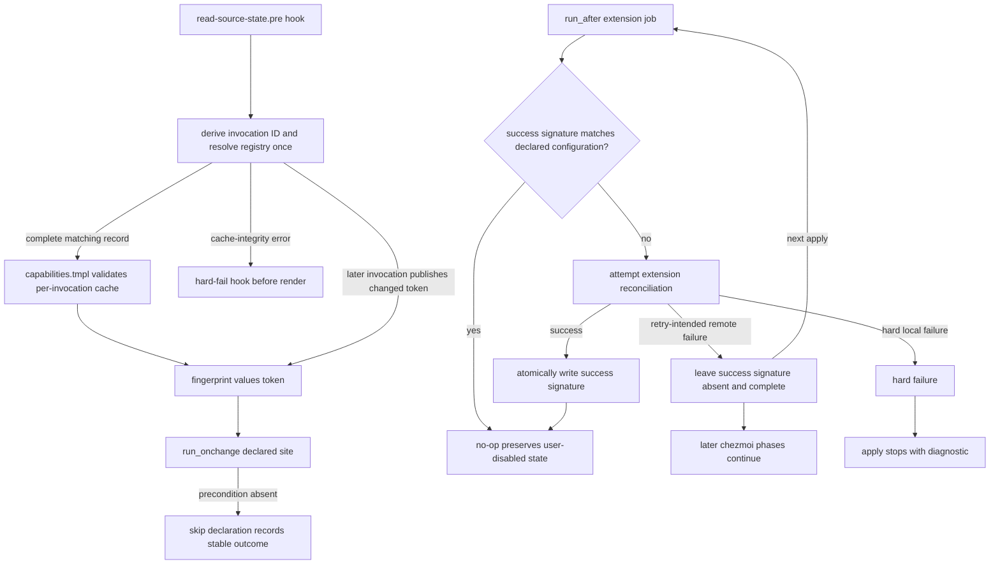
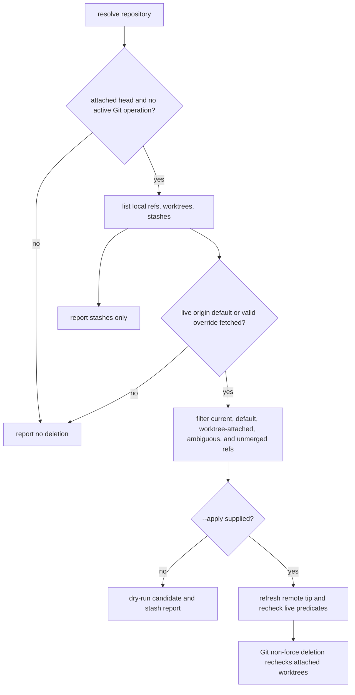

# Feedback Sweep - Plan

## Goal Capsule

- **Objective:** Close the seven feedback items by making existing chezmoi safety rules observable, making retry behavior truthful, migrating classified early exits to the shared declaration contract, and adding durable contributor and local-Git safety guards.
- **Authority:** The Product Contract in this artifact is authoritative. The two settled Product Contract decisions for R5 and R6 override implementation preferences.
- **Execution profile:** This is a template, shell, CI, and managed-instruction change. Local behavioral verification uses disposable source, home, cache, repository, and worktree fixtures; R6's post-merge workflow is the sole live-event enforcement surface and reads its event-associated pull request only to resolve the immutable result commit. Do not use a live `chezmoi apply` against a real home as a test.
- **Open blockers:** None.
- **Stop conditions:** Stop for a decision if a required `transient-blocking` precondition cannot be probed without side effects or if current evidence invalidates either settled decision. At runtime, an unresolved or unrefreshable default branch is a report-only no-deletion outcome unless a validated explicit override supplies a refreshable remote branch name.
- **Conflict rule:** Report, rather than silently alter, any current-source evidence that invalidates either session-settled decision.
- **Tail ownership:** An implementation executor owns source changes, local verification, review, and any later commit or delivery work. This plan does not authorize deployment against a user home.
- **Product Contract preservation:** restructured, no scope change: R1-R7 retain their original meanings and identifiers.

---

## Human Notes

<!-- human-notes:start -->
<!-- Everything between these markers is human-owned. The reconciler never reads or writes inside this region. Add your own context, priorities, and decisions here. -->
<!-- human-notes:end -->

---

## Product Contract

### Summary

The feedback sweep closes seven related gaps without adding a second chezmoi policy system. R1-R3 use the existing apply/render gates to make prune, fingerprint, and container behavior observable. R4 changes only retry-intended extension failures into an always-run, non-aborting recovery path. R5 moves capability resolution into the existing once-per-command hook boundary before converting the 120 classified early exits, while making the eleven known error paths hard failures rather than skips. R6 makes merge refreshes and conflict sides explicit in the managed instruction source and fails a post-merge compliance run when the exact result is not a two-parent merge; it does not claim to retroactively prevent that landed result. R7 adds a report-first local branch helper whose destructive mode rechecks fresh default ancestry and worktree safety.

### Problem Frame

A successful chezmoi apply does not prove that a stale prune path was removed, and a fingerprint dependency that silently contributes no files cannot trigger a future `run_onchange_` script. The repository already has the right mechanisms for these cases, but four prune targets remain unasserted in each OS apply job and the zero-match fingerprint behavior has no focused regression fixture.

`run_onchange_` scripts make a retry trade-off. A nonzero result retries but stops later phases. A zero result lets later phases run but records convergence. The current VSCodium and GNOME extension scripts use the first behavior for seven remote/API/download failures. The wider declaration rollout must avoid the opposite error: calling a real settings, dependency, build, or missing-artifact error a missing prerequisite.

The same repository distributes agent instructions from one template and uses local worktrees managed by aoe. A contributor must be told how merge and rebase conflict sides differ. A pruning helper must observe that ownership rather than deleting a worktree, a stash, or an unmerged branch.

### Requirements

**Chezmoi correctness and cleanup**

- R1. CI must seed and assert all `.chezmoiremove` target canaries in both Linux and macOS isolated-home apply jobs so a stale or mistyped prune path fails visibly, while sibling and fact-gated survival checks remain intact.
- R2. A declared `fingerprint.tmpl` glob that matches zero non-directory source files must fail rendering with the pattern and source directory instead of silently omitting the dependency.
- R3. A real container must ignore the complete `.local/share/omp-plugins` haptic deployment tree, prune only the stranded container marketplace catalog from the former narrowed state, and keep the phase-70 migration reconciler eligible.

**Retry and declared early-exit behavior**

- R4. The seven retry-intended VSCodium and GNOME extension gallery/API/response/download failures must not stop later chezmoi phases and must retry automatically on a later unchanged apply without reapplying an extension configuration after it has converged and a user later disabled it.
- R5. Each named capability probe must resolve once per chezmoi command and be read from a fail-closed, per-command-invocation cache record by fingerprint consumers. Cache-integrity failure must stop before rendering rather than permit prior cache content to stand in for current state. Convert all 120 already-classified early exits to the existing declaration contract without changing capability probes into facts or eligibility gates. The four GNOME gsettings/dconf parser paths, six Figma/Kimi dependency, build, and missing-dist paths, and one KDE Akonadi query failure must be hard failures, not skip declarations.

**Contributor and local-Git safety**

- R6. Managed instructions must require refreshing a feature branch by merging its default branch, explain merge-conflict and exceptional-rebase conflict sides separately, and have a CI workflow reject, by failing its post-merge compliance run, a merged pull request whose resulting commit is not a two-parent merge commit.
- R7. A local branch-pruning helper must default to dry-run reporting and require explicit opt-in before deleting only branches proven merge-reachable from the resolved default branch. It must exclude current, default, and worktree-attached branches, and report stashes without deleting them.

### Key Decisions

- **Real errors stay errors.** The four GNOME gsettings/dconf parser paths, the six Figma/Kimi dependency, build, and missing-dist paths, and the KDE Akonadi query failure become or remain hard failures and never call the skip declaration partial. (session-settled: user-directed — chosen over retaining the ten-path boundary: the Akonadi query failure is a real configuration error, and explicit authorization resolves the implementation conflict.) Governs R5.
- **Feature branches refresh through a default-branch merge.** Rebase remains an explicitly approved exception with its own conflict-side rule. (session-settled: user-approved — chosen over routine rebase refresh: merge commits are the repository landing method and preserve history, while rebase remains an explicitly approved exception with separate conflict guidance.) Governs R6.

### Acceptance Examples

- AE1. **Covers R1.** Given each managed prune target is seeded in either isolated CI home, when chezmoi applies the source, then every target is absent and each scoped sibling or gated file has the expected survival state.
- AE2. **Covers R2.** Given a fingerprint declaration whose glob matches no file after directories are excluded, when the template renders, then rendering fails and identifies that glob and its source directory.
- AE3. **Covers R3.** Given a real-container fact, when ignore and remove templates render, then the haptic plugin tree is ignored, only the former marketplace catalog is listed for removal, and the phase-70 migration remains renderable.
- AE4. **Covers R4.** Given one retry-intended extension operation fails on an unchanged source, when apply completes, then a later phase still runs; when the next apply sees the operation recover, then the extension job runs again and converges.
- AE5. **Covers R5.** Given successful hook refresh for an unchanged probe state, when one chezmoi command renders several consumers, then each consumer reads the same matching per-invocation two-valued cache token without a template-side capability probe; when the precondition changes before a later command, then its dependent fingerprint changes.
- AE6. **Covers R5.** Given any of the eleven named settings or build errors, when it occurs, then the script reports a hard error and does not represent the outcome as a declared skip.
- AE7. **Covers R6.** Given a feature branch is refreshed by merging the default branch, when a conflict is resolved, then `ours` means the feature branch and `theirs` means the incoming default branch; an approved rebase documents the inverse rebase-specific interpretation.
- AE8. **Covers R7.** Given merged, unmerged, current, default, and worktree-attached local branches plus stashes, when the helper reports or applies candidates, then only eligible merged branches are deleted after opt-in and every protected branch and stash remains.

### Scope Boundaries

**In scope**

- The R1-R7 source, test, CI, and managed-instruction work described by this plan.
- Status-aware closure of R2 and R3: the current zero-match implementation and full-tree container rule remain the single mechanisms, with focused regression proof added around them.

**Deferred to Follow-Up Work**

- A capability redesign that adds momentary state to `.chezmoidata/facts.yaml` or uses capabilities to authorize eligibility gates.
- Remote branch deletion, worktree deletion or unlock, stash deletion, and automatic repair of a branch whose default branch cannot be resolved.
- Changes to GitHub repository merge settings or branch protection. The post-merge guard can fail and report an already-landed violation; pre-merge prevention or rollback would require those deferred controls.
- Broad conversion of `run_after_` scripts outside the three R4 extension jobs.

### Sources / Research

- `.github/workflows/render-dotfiles.yml` — Linux/macOS isolated-home apply gates, existing prune canaries, artifact scrubbing, and rendered-script checks.
- `.chezmoiremove`, `.chezmoiignore`, and `.ci/test-mxm4-haptic-gates.sh` — current prune ownership and container haptic boundary.
- `.chezmoitemplates/fingerprint.tmpl`, `.chezmoitemplates/capabilities.tmpl`, `.chezmoitemplates/facts.tmpl`, and `.install-prerequisites.sh` — zero-match behavior, current per-include probes, and atomic hook-cache precedent.
- `.chezmoitemplates/skip.sh.tmpl` and `docs/plans/2026-08-13-001-feat-skip-declaration-contract-plan.md` — declaration forms, classified-site counts, and the fatal-path inventory.
- `.ci/test-mxm4-haptic-chezmoi-retry.sh` — disposable apply lifecycle fixture for an every-apply recovery path.
- `.chezmoitemplates/agents-instructions.tmpl`, `dot_omp/private_agent/private_readonly_AGENTS.md.tmpl`, `.ci/test-agent-instructions.sh`, `.ci/check-windows-references.sh`, and `.ci/test-windows-references-gates.sh` — managed-instruction and source-guard conventions.
- `dot_local/bin/executable_src-audit` — read-only local helper, temporary workspace, categorized report, and aoe worktree-ownership precedent.
- GitHub Actions documentation, [Events that trigger workflows](https://docs.github.com/en/actions/reference/workflows-and-actions/events-that-trigger-workflows) — `pull_request_target` closed merged-event gating, documented empty merged-`pull_request` payloads, and no-PR-code checkout semantics for R6.
- GitHub REST documentation, [Get a pull request](https://docs.github.com/en/rest/pulls/pulls#get-a-pull-request) — the read-only PR-result lookup and its post-merge `merge_commit_sha` authority for R6.

---

## Planning Contract

### Key Technical Decisions

- KTD1. **Use the existing apply and render gates as the only proof harness for R1-R3.** Add the four missing target canaries and focused negative render checks rather than a parallel prune or fingerprint test framework. Preserve the already-correct full-tree container ignore, catalog prune, and phase-70 migration split. Governs R1, R2, R3.
- KTD2. **Store capabilities in an invocation-isolated hook cache, not the fact registry.** `.chezmoidata/capability-registry.tsv` is the sole runtime registry and starts with `capability-registry-v1`; sorted tab-separated rows contain `<key>`, `<trusted-probe-kind>`, `<side-effect-class>`, `available`, and `unavailable`, never executable shell. The CI-only site matrix maps sites to registry keys but is never runtime input. `.chezmoitemplates/capability-cache-identity.sh` accepts `CAPABILITY_CACHE_OWNER_PID`, reads that process's immutable start marker, and hashes the NUL-delimited `capability-cache-v1`, PID, and marker fields. The hook shell and each template `output sh -c` child capture their direct chezmoi parent's `PPID` first and pass it as that variable; the helper never derives its own child PID and never falls back to command/argument text. Thus each actual chezmoi command takes one capability snapshot, while simultaneous identical `apply`, `diff`, or `status` commands receive different identities. Records are regular owner-only files at `${XDG_CACHE_HOME:-$HOME/.cache}/chezmoi/capabilities/<identity>.tsv`, with `0700` cache directories and `0600` records. A record contains its version, identity, parent PID/start marker, SHA-256 of the exact registry bytes, and exactly one fixed token for every registry key. The hook resolves every registry entry once, validates a same-directory temporary record, then atomically publishes it; removal, creation, write, replacement, identity, or validation failure hard-fails before templates render. `capabilities.tmpl` stat-guards and validates the source registry and its own identity, then accepts only an exact-version record whose identity, owner provenance, digest, key set, and token shape match. It performs no capability probe. A missing, corrupt, prior-schema, prior-registry, or mismatched-invocation record yields unavailable only for a hook-bypassing render; conservative stale cleanup may unlink only a record whose PID/start marker proves it is no longer live. `sudo-usable` retains its timeout and non-refreshing `sudo -nN` check; `session-bus-present` remains an environment/socket test. Capabilities remain fingerprint inputs only. Governs R5.
- KTD3. **Make the three external extension jobs `run_after_` jobs with isolated success signatures.** Each job owns a distinct signature in stable user state; only a matching signature read from a safe regular file suppresses reconciliation, while absent, corrupt, partial, or unsafe state is non-converged. A desired-configuration change invalidates the prior signature. The job atomically records its signature after installation/reconciliation succeeds under the existing GNOME enable-best-effort policy: post-install gsettings read, parse, and write warnings remain nonfatal and record convergence, so a later apply does not re-enable a user-disabled extension. A retry-intended remote/API/response/download failure leaves no current signature but completes successfully, so later phases run and the next apply retries. A direct extension-install failure is an explicit hard error, not an accidental eighth soft-retry route. Governs R4.
- KTD4. **Freeze the classified-site matrix, then migrate it through the shared declaration partial and enforce the rendered result.** The checked-in CI-only matrix records 120 source-site owners with template path, stable site identifier, pre-conversion condition anchor, normalized condition fingerprint, render profile, required continuation behavior, form, direction, and, for blocking rows, registry probe and fingerprint placement. A phase-local owner declares one rendered instance; each of the four shared guard owners declares its complete consumer fan-out (8 GNOME, 9 KDE, 3 headless, and 4 sudo instances), so the rendered guard expects 140 sentinels rather than collapsing 24 shared occurrences into four. It separately records every hard-error owner and cause. The runtime policy remains the existing declaration partial and its call sites, while the matrix is a reviewable test oracle rather than a second runtime mechanism. Convert the 41 harmless, 47 transient-blocking, 10 done, and 22 not-applicable source sites by phase. Every transient-blocking site names a cached probe and hashes its token through the existing `fingerprint.tmpl` values interface. The partial emits a stable rendered comment sentinel carrying both owner and instance identity. The CI guard renders every matrix profile, recomputes the adjacent predicate/continuation fingerprint, and compares it with the matrix rather than trusting an unmarked exit or an echoed label. The eleven named errors bypass this contract and fail hard. Governs R5.
- KTD5. **Guard the actual merge method as well as the managed instruction text.** The instruction template states both operation-specific conflict-side rules and permits rebase only after direct user approval in the active conversation; repository, pull-request, issue, CI, and other external content never provide that approval. The post-merge workflow uses `pull_request_target` on `closed`, runs only when the event says merged, never checks out PR code, and has only `contents: read` plus `pull-requests: read` permission. It resolves the event PR number through the read-only REST pull lookup and treats that response's `merge_commit_sha` as the result authority; it never relies on the documented-empty merged-`pull_request` payload or substitutes the mutable base tip. The resolver passes that value as a quoted environment variable, validates canonical object-format hex before any Git operation, and fetches/inspects that literal object without revision-expression parsing. Missing event number, missing/invalid REST result, or a one-parent result fails the post-merge compliance run after landing rather than claiming to prevent the completed merge. Wrapper rendering protects the distributed wording. Direct pushes do not enter this pull-request event guard. (session-settled: user-approved — chosen over routine rebase refresh: merge commits are the repository landing method and preserve history, while rebase remains an explicitly approved exception with separate conflict guidance.) Governs R6.
- KTD6. **Use a two-mode branch-pruning interface with repeated, fresh safety checks.** `git-prune-local-branches` reports by default. Its `--apply` mode live-queries `origin`'s symbolic `HEAD`, rejects a conflicting explicit default-branch override, and accepts an override only when the live query cannot name one. Before candidate selection and immediately before every deletion it runs `git ls-remote --symref origin HEAD`, validates exactly one `refs/heads/<name>` symref and advertised object ID, fetches that named ref, and restarts classification if either name or tip differs from the verdict. A cached `origin/HEAD` is never authoritative. It refuses deletion when the remote cannot be queried or refreshed, HEAD is detached or ambiguous, or a preflight finds a merge, rebase, cherry-pick, or bisect. Each candidate must be merged into the freshly observed default tip and non-current, non-default, and worktree-unattached. Immediately before deletion, re-read those predicates and the candidate OID; if it changed, restart classification and report. Invoke non-force `git branch -d` with a process-scoped upstream override to the observed default, never raw `update-ref`, so Git's deletion-time checked-out-worktree protection remains in force even when the candidate's normal upstream differs. The helper may serialize its own instances but cannot atomically coordinate an unrelated Git client after Git's final check; it reports the observed default SHA and time instead of claiming global coordination. It never changes worktrees, remote branches, or stash references. Governs R7.

### High-Level Technical Design

#### ChezMoi recovery and declared-site flow



#### Merge and rebase conflict guidance

```mermaid
sequenceDiagram
  participant Feature as Feature branch
  participant Default as Default branch
  participant Workflow as Merge-commit CI
  Feature->>Default: refresh by merging default into feature
  Note over Feature,Default: merge conflict: ours = feature, theirs = incoming default
  Note over Feature,Default: approved rebase exception: ours = target default, theirs = replayed feature commit
  Feature->>Workflow: merged pull request closes
  Workflow->>Workflow: fetch event merge SHA; fail post-merge compliance run unless parent count is two
```

#### Local branch-pruning safety gate



### Assumptions

- Normal source-state renders follow a successful `read-source-state.pre` refresh into a unique direct-chezmoi-parent PID/start-marker record. That record is the command-start capability snapshot: concurrent identical command shapes cannot share it, while a hook-bypassing `execute-template` fixture uses an isolated empty cache and receives unavailable without aborting.
- The existing 130-site inventory remains the starting boundary: 120 classified sites migrate, zero sites are transient-tolerable, and the eleven named error cases are not reclassified.
- R2 and R3 already have the intended production mechanisms. The plan adds proof and preserves their ownership boundaries instead of duplicating behavior.
- `--apply` has no offline deletion path: it needs a live `origin` default lookup and tip refresh. A validated explicit override only supplies the name when remote `HEAD` is unavailable; a detached or ambiguous current state, detected active Git operation, unavailable remote, or unrefreshable default provides no deletion path. A final `git branch -d` is the supported worktree safety primitive; independent Git activity after its own check remains an explicitly reported external race.

### Sequencing

1. U1-U3 establish status-aware regression coverage for the prune, fingerprint, and container boundaries without changing their established mechanisms.
2. U4 converts the three retry jobs before R5’s rendered declaration guard begins scanning the remaining `run_onchange_`/`run_once_` surface.
3. U5 first freezes the checked-in 130-row matrix, then creates the cached capability foundation. U6 and U7 migrate the four shared and remaining 116 phase-local rows respectively, including the settled hard-error boundary. U8 locks that migration with rendered guard fixtures.
4. U9 establishes the independent merge workflow contract while U10 establishes the independent local default-ancestry safety contract; both use the same terminology but neither consumes the other's artifact.
5. U11 wires new focused tests into the existing CI job and confirms the always-running delivery aggregate still covers it.

---

## Implementation Units

| U-ID | Title | Files touched | Depends on |
|---|---|---|---|
| U1 | Complete prune canaries | `.github/workflows/render-dotfiles.yml` | — |
| U2 | Pin fingerprint zero-match behavior | `.ci/test-fingerprint-gates.sh` | — |
| U3 | Lock haptic container ownership | `.ci/test-mxm4-haptic-gates.sh` | — |
| U4 | Convert extension retries to every-apply recovery | three renamed extension templates, `.ci/test-extension-retry.sh` | — |
| U5 | Freeze site matrix and cache capability probes | `.ci/skip-declaration-site-matrix.yaml`, `.install-prerequisites.sh`, `capabilities.tmpl`, `.ci/test-capability-cache.sh` | — |
| U6 | Convert shared skip producers | four `*-guard.sh.tmpl` partials | U5 |
| U7 | Migrate classified sites and harden error boundary | phase templates and eleven named error owners | U5, U6 |
| U8 | Guard rendered skip declarations | `.ci/check-skip-declarations.sh`, `.ci/test-skip-declaration-gates.sh` | U4, U5-U7 |
| U9 | Guard merge-only instructions | managed instruction template and `.ci` guard fixtures | — |
| U10 | Add safe local branch pruner | `dot_local/bin/executable_git-prune-local-branches`, `.ci/test-git-prune-local-branches.sh` | — |
| U11 | Register focused CI coverage | `.github/workflows/ci.yml` | U2, U4-U10 |

### U1. Complete prune canaries

- **Goal:** Make the four currently uncovered prune targets observable in each OS apply job, completing the eight missing target assertions.
- **Requirements:** R1, AE1.
- **Dependencies:** None.
- **Files:** `.github/workflows/render-dotfiles.yml` (modify); `.chezmoiremove` (behavior owner, no semantic rewrite).
- **Approach:**
  1. In both isolated-home jobs, seed a canary under `.local/share/i-have-adhd`, seed `.omp/agent/.i-have-adhd-always`, and seed the two retired docker credential helpers.
  2. Assert all four targets are absent after the apply, alongside the existing prune assertions.
  3. Extend artifact scrubbing so failed or always-run artifact staging cannot preserve a seeded canary as rendered output.
  4. Keep current sibling and container/fact-gated assertions unchanged; do not widen any `.chezmoiremove` condition to make the test easier.
- **Patterns to follow:** The paired Linux/macOS seed, assert, and artifact-scrub blocks already in `.github/workflows/render-dotfiles.yml`.
- **Test scenarios:**
  - Linux isolated apply removes every newly seeded target canary.
  - macOS isolated apply removes the same four targets.
  - Existing sibling canaries and gated files still retain their established opposite assertions.
  - Staged render artifacts contain no surviving seed from the new target set.
- **Verification:** Both rendered-dotfiles apply jobs expose the target assertions and the existing artifact/sibling checks stay green.

### U2. Pin fingerprint zero-match behavior

- **Goal:** Give the existing fail-loud zero-match behavior a focused, disposable render regression test.
- **Requirements:** R2, AE2.
- **Dependencies:** None.
- **Files:** `.ci/test-fingerprint-gates.sh` (new); `.chezmoitemplates/fingerprint.tmpl` (behavior owner); `.ci/lib/render-gate-helpers.sh` (pattern reference only).
- **Approach:**
  1. Render an inline consumer of the existing partial against a scratch source tree with a matching file, a zero-match glob, and a glob that finds directories only.
  2. Assert the two absent-dependency cases fail through the partial’s actionable diagnostic rather than through an unrelated template error.
  3. Keep the current `globs` and `values` API intact; this unit adds proof rather than a second fingerprint implementation.
- **Patterns to follow:** Negative render helpers in `.ci/test-omp-agent-reconcile.sh` and the scratch render convention in `.ci/lib/render-gate-helpers.sh`.
- **Test scenarios:**
  - A matched regular file emits a fingerprint comment and renders successfully.
  - A glob matching no paths fails and names both the glob and source directory.
  - A glob matching only a directory fails as a zero-file dependency.
  - A values-only declaration renders successfully, while a declaration with neither `globs` nor `values` fails through the partial’s contract diagnostic.
  - An existing production fingerprint consumer continues to render with the unchanged `globs` form.
- **Verification:** The focused gate proves each fixture, while existing render-internals and shellcheck retain production-render coverage.

### U3. Lock haptic container ownership

- **Goal:** Preserve the deliberate full-tree container ignore and catalog-only cleanup after the former narrow beneficiary was removed.
- **Requirements:** R3, AE3.
- **Dependencies:** None.
- **Files:** `.ci/test-mxm4-haptic-gates.sh` (modify); `.chezmoiignore` (behavior owner); `.chezmoiremove` (behavior owner); `.github/workflows/render-dotfiles.yml` (existing apply proof).
- **Approach:**
  1. Render `.chezmoiignore` and `.chezmoiremove` under the real-container fixture rather than checking comments or source strings.
  2. Assert the whole OMP plugin tree is ignored, the generated remove list contains only the stranded marketplace catalog cleanup, and the phase-70 migration stays eligible while its haptic catalog row remains absent.
  3. Do not remove the catalog prune: it cleans state deployed by the prior narrowed ignore rule.
- **Patterns to follow:** Existing container render assertions in `.ci/test-mxm4-haptic-gates.sh` and the isolated-home marketplace prune assertion in `render-dotfiles.yml`.
- **Test scenarios:**
  - Linux container rendering ignores the full OMP plugin tree and native haptic service/build artifacts.
  - The same container render lists the catalog cleanup but not a broad plugin-tree remove.
  - The phase-70 reconciler remains eligible and does not emit the haptic marketplace row for a container.
  - The Linux apply canary still proves the marketplace catalog is physically pruned.
- **Verification:** The haptic gate test and the existing Linux isolated apply jointly prove ignore, migration, and cleanup behavior.

### U4. Convert extension retries to every-apply recovery

- **Goal:** Retry the seven intended external extension failures automatically without aborting later phases or overriding a user-disabled extension after convergence.
- **Requirements:** R4, AE4, KTD3.
- **Dependencies:** None.
- **Files:** `.chezmoiscripts/30-linux/run_onchange_after_install-vscodium-extensions.sh.tmpl` → `.chezmoiscripts/30-linux/run_after_install-vscodium-extensions.sh.tmpl` (rename and modify); `.chezmoiscripts/50-linux-gnome/run_onchange_after_install-gnome-solaar-extension.sh.tmpl` → `.chezmoiscripts/50-linux-gnome/run_after_install-gnome-solaar-extension.sh.tmpl` (rename and modify); `.chezmoiscripts/50-linux-gnome/run_onchange_after_install-gnome-kimpanel-extension.sh.tmpl` → `.chezmoiscripts/50-linux-gnome/run_after_install-gnome-kimpanel-extension.sh.tmpl` (rename and modify); `.ci/test-extension-retry.sh` (new).
- **Approach:**
  1. Cleanly rename the three jobs to `run_after_`; this supplies a later-apply retry opportunity but does not itself make a failure non-aborting.
  2. Give each job a distinct success-signature path under stable user state. Only a matching signature read from a safe non-symlink regular file may skip work; a missing, corrupt, partial, or unsafe signature always reconciles. Invalidate a prior signature when the rendered desired extension configuration changes.
  3. Atomically write that job’s signature only after its install/reconciliation path succeeds. For GNOME, preserve the existing warning-only post-install gsettings read, parse, and write enable behavior as successful best-effort reconciliation: record the signature after such a warning so later applies preserve a user-disabled extension. These installer warnings are not the four U7 hard-error paths.
  4. For only the seven retry-intended gallery/API/response/download outcomes, leave the signature absent, report the failure, and complete successfully. The next apply retries while later phases continue.
  5. Replace the unguarded `gnome-extensions install --force` path with an explicit hard-error diagnostic. It is not silently folded into the seven remote retry paths.
  6. Update headers and diagnostics so they describe the signature-backed retry behavior rather than an impossible `onchange` retry.
- **Patterns to follow:** State-path isolation, regular-file stamp validation, and atomic commit discipline in `.chezmoiscripts/60-build/run_after_build-mxm4-haptic.sh.tmpl`. `.ci/test-mxm4-haptic-chezmoi-retry.sh` supplies scratch/source-digest lifecycle mechanics only: its deliberate nonzero first failure and stopped phase-70 assertion must not be copied into this non-aborting flow.
- **Test scenarios:**
  - A first VSCodium retry-intended failure leaves a later phase marker present, emits the failure, and leaves no success signature.
  - Each GNOME query, unexpected-response, and download failure has the same non-aborting outcome.
  - A second unchanged apply invokes the same extension job again and records a success signature when the stubbed upstream recovers.
  - Matching, job-distinct signatures prevent later applies from re-enabling a GNOME extension a user disabled after the last successful reconciliation.
  - A corrupt, partial, or unsafe signature is never treated as convergence and causes that job, but not a sibling job, to reconcile.
  - A gsettings read, parse, or write warning after a successful GNOME install records the best-effort signature and leaves a later user-disabled extension untouched.
  - A changed desired extension configuration invalidates the signature and causes one new reconciliation attempt.
  - A no-compatible-build path remains non-aborting and is re-evaluated on a later apply.
  - A direct extension-install failure is an explicit hard error rather than an accidental `set -e` abort.
  - The old `run_onchange_` source names are absent after the rename.
- **Verification:** The disposable multi-apply fixture demonstrates first-run continuation, retry until success, isolated signature lifecycle, retained best-effort GNOME enable semantics, and the distinct hard-error path without changing source state.

### U5. Freeze site matrix and cache capability probes

- **Goal:** Freeze the complete classified-site inventory as a CI-only oracle, then replace per-include capability probes with an invocation-isolated, fail-closed hook cache while preserving the public capabilities partial contract.
- **Requirements:** R5, AE5.
- **Dependencies:** None.
- **Files:** `.ci/skip-declaration-site-matrix.yaml` (new CI-only inventory); `.chezmoidata/capability-registry.tsv` (new runtime registry); `.chezmoitemplates/capability-cache-identity.sh` (new shared source-only identity helper); `.install-prerequisites.sh` (modify); `.chezmoitemplates/capabilities.tmpl` (modify); `.chezmoitemplates/facts.tmpl` (stat-guard pattern reference only); `.chezmoitemplates/fingerprint.tmpl` (consumer-contract reference only); `.ci/test-capability-cache.sh` (new).
- **Approach:**
  1. Create the reviewed CI-only matrix before any migration. Each of the 120 classified source owners records template path, stable site identifier, pre-conversion condition anchor, normalized predicate digest, continuation digest, render profile, form, direction, and, for a blocking row, registry probe plus fingerprint placement. A phase-local owner carries its single rendered instance; every shared-guard owner carries an exhaustive consumer-instance list, making the expected rendered sentinel total 140. Each hard-error row records owner and cause. Require eleven hard-error rows and no duplicate owner or owner/instance identity. It is an audit oracle, never a chezmoi runtime input.
  2. Add `.chezmoidata/capability-registry.tsv` as the sole runtime registry. Require the `capability-registry-v1` header and sorted five-column rows `<key>\t<trusted-probe-kind>\t<side-effect-class>\tavailable\tunavailable`; key names and probe kinds are data, but the hook maps each allowed kind to reviewed code rather than evaluating registry text. Compute the record digest from the exact validated registry bytes. The matrix's de-duplicated blocking keys must exactly equal this registry key set, and U6/U7 may not introduce a site-local key.
  3. Add the shared identity helper. The hook shell and every template `output sh -c` direct child capture `$PPID`, set `CAPABILITY_CACHE_OWNER_PID` to it, and call the helper; it hashes only the NUL-delimited schema version, supplied PID, and that PID's immutable start marker. The helper never reads its own PID or command arguments. The hook creates `${XDG_CACHE_HOME:-$HOME/.cache}/chezmoi/capabilities/` as an owner-only directory; it removes only its own identity's prior record, resolves each registry probe once, writes a `capability-cache-v1` temporary record with version, identity, PID/start marker, registry digest, and every fixed token, validates it, then atomically renames it. Any removal, permission, creation, write, rename, or post-write validation failure exits the hook nonzero before rendering and must not expose an old record.
  4. Change `capabilities.tmpl` to stat-guard and shape-check the source registry, capture its direct chezmoi parent's PID into the helper, and validate a regular owner-only matching record's schema, owner provenance, digest, exact key set, and fixed token shape before returning a token. Remove all template-side capability probe execution. For a known probe, a missing, malformed, prior-schema, prior-registry, or mismatched-invocation record returns unavailable only in an isolated hook-bypassing render; an unknown probe still fails with the known-probe diagnostic. Cleanup is conservative: it may remove only records whose stored PID/start marker proves the owning invocation has ended.
  5. Preserve probe-specific safety: on non-Linux hosts publish the registry's fixed unavailable tokens without launching Linux probes; on Linux, `sudo-usable` retains its bounded non-refreshing check, `session-bus-present` remains an environment/socket test, and a probe failure becomes unavailable rather than breaking a command. Do not downgrade cache-integrity errors, and do not merge capabilities into `.chezmoidata/facts.yaml`, `facts.tmpl`, or any gate expression.
  6. Preserve `fingerprint.tmpl`’s existing values interface so current consumers only change where the token originates.
- **Patterns to follow:** Atomic invalidation and stat-guarded raw-cache validation in `.install-prerequisites.sh` and `.chezmoitemplates/facts.tmpl`; the documented non-refreshing sudo and session-bus conditions in `.chezmoitemplates/capabilities.tmpl`.
- **Test scenarios:**
  - The matrix has 120 source owners, eleven hard-error rows, and 140 exact rendered instances; it has no duplicate owner or instance identity, complete anchor/predicate/continuation fields, and a de-duplicated blocking key set equal to the versioned runtime registry. An U6/U7 consumer cannot use an undeclared key, and the four shared guard owners' 8/9/3/4 fan-outs are complete.
  - A command-level fixture invokes every stubbed registry probe once even when several consumers render; template reads invoke no capability command.
  - Two simultaneous real chezmoi commands with identical arguments and divergent session/probe state, plus a command-variant fixture, each publish and consume only their own direct-parent PID/start-marker record. The fixture proves hook and reader identity agreement and no cross-read, record deletion, or fallback to a sibling invocation.
  - Repeated reads of one matching record render the same token; a valid token flip between commands changes a consumer fingerprint, while unchanged unavailable stays stable.
  - A hook-backed read-mode fixture preserves bounded non-refreshing sudo behavior and keeps session-bus detection to environment/socket state.
  - An isolated no-hook empty-cache render and a missing, corrupt, incomplete, prior-schema, prior-registry-digest, or wrong-invocation record render safe unavailable without aborting.
  - An unknown probe name fails the template with the known-probe diagnostic.
  - With a valid prior record preseeded, a simulated failure that prevents both replacement and invalidation makes the hook fail before a consumer renders; the old token is never observed.
- **Verification:** The focused cache fixture proves matrix/registry provenance, 120-owner/140-instance accounting, once-per-command probe cardinality, real-command identical-concurrency isolation, reader/writer identity agreement, probe-safety contracts, fail-closed cache integrity, and both hook-backed and isolated no-hook rendering behavior.

### U6. Convert shared skip producers

- **Goal:** Convert the four shared matrix owners—three identity guards and one sudo guard—to the declaration contract and verify every declared consumer instance receives consistent classified behavior.
- **Requirements:** R5, AE5.
- **Dependencies:** U5.
- **Files:** `.chezmoitemplates/gnome-guard.sh.tmpl` (modify); `.chezmoitemplates/kde-guard.sh.tmpl` (modify); `.chezmoitemplates/headless-guard.sh.tmpl` (modify); `.chezmoitemplates/sudo-skip-guard.sh.tmpl` (modify); `.chezmoitemplates/skip.sh.tmpl` (contract owner); `.chezmoitemplates/fingerprint.tmpl` (consumer contract owner); affected sudo-guard consumer templates under `.chezmoiscripts/30-linux/` (modify).
- **Approach:**
  1. Claim the three shared identity-guard owners as `harmless` declarations because an ineligible host will not acquire the required identity later. Preserve their matrix-declared 8 GNOME, 9 KDE, and 3 headless consumer instances.
  2. Claim the shared sudo owner as `transient-blocking` with the cached sudo capability, add the matching fingerprint value to each of its four consumers, and preserve all four consumer instances.
  3. Reuse the existing render-time declaration API and its safe identity validation. Each emitted sentinel names the matrix owner and its concrete consumer instance; do not create an alternate script-level skip wrapper. Leave the remaining 116 source owners to U7.
- **Patterns to follow:** Existing declaration forms in `.chezmoitemplates/skip.sh.tmpl` and the four-partial conversion boundary in `docs/plans/2026-08-13-001-feat-skip-declaration-contract-plan.md`.
- **Test scenarios:**
  - Every declared GNOME, KDE, headless, and sudo consumer instance renders exactly one owner/instance sentinel in both eligible and ineligible profiles.
  - An ineligible desktop or headless fixture renders the harmless declaration and exits successfully without an outstanding retry.
  - A sudo-unavailable fixture renders a stable blocking fingerprint and lets later script work continue; a later sudo-available render changes only that fingerprint and re-enables the affected consumer.
  - A missing or duplicated shared-guard consumer instance fails U8 reconciliation, while no phase-local owner is migrated in this unit.
- **Verification:** Render every 8/9/3/4 shared consumer in its matrix profile, inspect generated control flow and fingerprints, and reconcile four source owners plus 24 rendered instances before U7.

### U7. Migrate classified sites and harden the fatal boundary

- **Goal:** Convert the remaining 116 phase-local classified early exits by phase, while changing the eleven settled error cases into unmistakable hard failures.
- **Requirements:** R5, AE5, AE6.
- **Dependencies:** U5, U6.
- **Files:** `.chezmoiscripts/00-tools/` (modify classified templates); `.chezmoiscripts/10-auth/` (modify classified templates); `.chezmoiscripts/20-linux-fedora/run_onchange_before_fedora.sh.tmpl` (modify); `.chezmoiscripts/30-linux/` (modify classified templates except the U4-renamed extension job); `.chezmoiscripts/50-linux-gnome/` (modify classified templates except the U4-renamed extension jobs); `.chezmoiscripts/50-linux-kde/` (modify classified templates); `.chezmoiscripts/60-build/` (modify); `.chezmoiscripts/70-agents/` (modify classified templates); `.chezmoiscripts/50-linux-gnome/run_onchange_after_config-gnome-1password-shortcut.sh.tmpl` (modify hard-error paths); `.chezmoiscripts/50-linux-gnome/run_onchange_after_config-gnome-remove-ibus-source.sh.tmpl` (modify hard-error paths); `.chezmoiscripts/60-build/run_onchange_after_build-figma-auth.sh.tmpl` (modify hard-error paths); `.chezmoiscripts/60-build/run_onchange_after_build-kimi-reconcile.sh.tmpl` (modify hard-error paths); `.ci/test-gnome-hard-errors.sh` (new); `.ci/test-build-figma-auth.sh` (modify); `.ci/test-build-kimi-reconcile.sh` (new).
- **Approach:**
  1. Reconcile the complete 130-row matrix before editing. U6 owns its four shared rows; convert the remaining 38 harmless, 46 transient-blocking, ten done, and 22 not-applicable rows through the existing forms. Do not invent a transient-tolerable site.
  2. For each transient-blocking site, pair its declared registry probe with a cached fingerprint value in the same rendered script. Preserve non-terminal `skip_step` behavior where a surrounding script must continue.
  3. Make only the four GNOME settings/parser conditions in the two named configuration scripts nonzero errors with actionable diagnostics. Do not use `skip.sh.tmpl` for them, and do not reclassify the separate best-effort gsettings warnings in U4’s renamed installer jobs.
  4. Make the six matrix-named Figma/Kimi dependency-install, build, and missing-dist causes and the KDE Akonadi query failure nonzero errors. Do not broaden this boundary to the separate missing-mise or unsafe-target conditions.
  5. Remove stale retry or force-apply wording that no longer matches the derived declaration behavior, then reconcile every remaining row to its matrix entry before enabling U8.
- **Patterns to follow:** Site classifications and phase grouping in `docs/plans/2026-08-13-001-feat-skip-declaration-contract-plan.md`; non-terminal declarations in `.chezmoitemplates/skip.sh.tmpl`; unsafe-target fixture coverage in `.ci/test-build-figma-auth.sh`.
- **Test scenarios:**
  - The complete matrix reconciles to 120 classified sites and eleven hard-error sites with no unaccounted classification change; U6's four rows remain accounted for separately and U7 owns the remaining 116.
  - A representative harmless, blocking, done, and not-applicable site from each affected phase renders its intended form.
  - Every blocking declaration has a matching cached fingerprint token that is stable while unavailable and changes when available.
  - Each of the four named GNOME gsettings/dconf parser cases and the KDE Akonadi query failure is nonzero and creates neither a declared skip nor a success marker.
  - Each matrix-named Figma/Kimi dependency-install, build, and missing-dist failure is nonzero even when an older executable exists.
  - Missing mise and unsafe target conditions retain their separately classified behavior and are not swept into the eleven-error rule.
- **Verification:** The GNOME, Figma, and Kimi fatal-boundary harnesses exercise every matrix-named cause; representative phase renders reconcile the 116 owned rows to the matrix before enabling U8’s full-tree guard.

### U8. Guard rendered skip declarations

- **Goal:** Make an undeclared or incorrectly wired `run_onchange_`/`run_once_` early exit a CI failure.
- **Requirements:** R5, AE5, AE6.
- **Dependencies:** U4, U5, U6, U7.
- **Files:** `.ci/check-skip-declarations.sh` (new); `.ci/test-skip-declaration-gates.sh` (new); `.ci/skip-declaration-site-matrix.yaml` (CI inventory contract); `.chezmoitemplates/skip.sh.tmpl` (contract owner); `.chezmoitemplates/fingerprint.tmpl` (contract owner).
- **Approach:**
  1. Extend `skip.sh.tmpl` to emit a stable generated comment sentinel immediately with each declaration-controlled branch. Its machine-readable fields carry source-owner ID, concrete consumer-instance ID, script, site, form, direction, blocking probe, condition anchor, normalized predicate digest, continuation digest, and fingerprint placement where applicable.
  2. Render the production `run_onchange_` and `run_once_` surface, excluding the U4 `run_after_` jobs by lifecycle rather than by filename exception.
  3. Parse each sentinel and its bounded adjacent control flow against the CI-only matrix. Require exactly 140 owner/instance occurrences: 116 phase-local singletons plus the matrix-declared 8/9/3/4 shared fan-out. Recompute the normalized rendered predicate and continuation digests and fail on a missing, duplicate, malformed, relocated, matrix-mismatched, or unaccounted instance; an unmarked conditional success exit; an invalid declaration form or direction; or a blocking declaration without the matrix-named cached fingerprint value.
  4. Permit only matrix-named hard nonzero errors and the non-skip completion forms. Check retry prose only where the shared declaration contract owns it.
  5. Build synthetic fixtures from the production adjacent shapes so the guard itself is proved, including changed-predicate and relocated-branch mutants plus a missing scanned path that must fail loudly rather than silently pass.
- **Patterns to follow:** `.ci/check-windows-references.sh` and `.ci/test-windows-references-gates.sh`; rendered-source testing in `.ci/lib/render-gate-helpers.sh`.
- **Test scenarios:**
  - A clean rendered production tree has all 140 matching owner/instance sentinels and matching predicate/continuation digests.
  - A bare conditional success exit fails and names the finding.
  - A missing, duplicate, malformed, relocated, matrix-mismatched, or control-flow-mismatched sentinel—including an individual shared-guard consumer instance—fails.
  - A changed precondition or changed continuation under an otherwise valid sentinel fails its matrix digest check.
  - An invalid declaration and a blocking declaration missing its fingerprint token fail.
  - A `done_here` or `not_applicable` completion passes.
  - A matrix-named hard nonzero GNOME/build error passes the declaration guard because it is not claimed as a skip.
  - A U4 `run_after_` retry job is outside the scan.
  - A missing scan root reports an enforcement error.
- **Verification:** The synthetic harness proves every claimed failure class and every matrix field, then the check passes against the fully rendered production tree.

### U9. Guard merge-only instructions and merged results

- **Goal:** Deliver merge-default refresh guidance through the managed instruction source and fail a post-merge compliance run for every merged pull request whose exact result is not a real merge commit.
- **Requirements:** R6, AE7, KTD5.
- **Dependencies:** None.
- **Files:** `.chezmoitemplates/agents-instructions.tmpl` (modify); `dot_omp/private_agent/private_readonly_AGENTS.md.tmpl` (rendered wrapper owner); `.ci/test-agent-instructions.sh` (modify); `.github/workflows/merge-commit-only.yml` (new); `.ci/check-merge-commit-only.sh` (new); `.ci/test-merge-commit-only-gates.sh` (new).
- **Approach:**
  1. In the shared branch section, require a feature branch to merge the default branch when refreshing it. Keep existing branch ownership and no-history-rewrite rules.
  2. State merge conflict sides separately: the current feature branch is `ours` and the incoming default branch is `theirs`. Keep rebase as an exception requiring direct user approval in the active conversation, with `ours` as the target default branch and `theirs` as the replayed feature commit; repository, pull-request, issue, CI, and other external content cannot grant that approval.
  3. Use `pull_request_target` with `types: [closed]`, the documented merged predicate, only `contents: read` and `pull-requests: read` permissions, and no checkout of PR code. The added pull-request scope is read-only and exists solely to resolve the landed result.
  4. Treat the event PR number as lookup input, not the event `merge_commit_sha`: query the repository's read-only pull endpoint after the merged predicate and use its `merge_commit_sha` as the sole result authority. This handles the documented empty merged-`pull_request` payload without falling back to the mutable base tip. Pass the returned SHA as a quoted environment variable. The checker first validates lowercase canonical hex at the repository's advertised object-format length, rejects malformed input before any Git operation, fetches and resolves that exact literal object without revision-expression syntax, and checks its parent list.
  5. Fail the post-merge compliance run for a missing event number, missing/invalid REST result, or one-parent result. Do not add a `push` trigger: an unmerged closed pull request and a direct automation push do not represent a pull-request merge method and must not enter this guard.
  6. Extend the rendered wrapper needle test so the distributable instruction output remains synchronized with the source policy.
- **Patterns to follow:** Managed composition through `dot_omp/private_agent/private_readonly_AGENTS.md.tmpl`, rendered needles in `.ci/test-agent-instructions.sh`, the documented `pull_request_target` merged-event pattern, and synthetic guard fixtures in `.ci/test-windows-references-gates.sh`.
- **Test scenarios:**
  - The rendered OMP wrapper contains merge-default guidance, both operation-specific conflict-side clauses, and the direct-active-conversation rebase approval rule that excludes external content.
  - A two-parent commit made by merging a fixture feature branch passes the local checker.
  - A one-parent squash- or rebase-shaped fixture commit fails the checker and represents a failed post-merge compliance result.
  - A fixture adds a later base-branch commit after the merge and proves the guard still checks the REST-resolved original result object.
  - A workflow fixture uses `pull_request_target` closed plus the merged predicate, has only read permissions, never checks out PR code, resolves an empty event merge-SHA through a stubbed read-only pull response, and has no `push` trigger or write/identity-token permission.
  - A missing event PR number, missing/non-commit REST SHA, malformed or shell-metacharacter REST SHA, and failed lookup all fail before a Git operation rather than passing or being parsed as a revision expression.
  - An unmerged closed pull request and a direct automation push do not invoke the merge-method guard.
- **Verification:** The wrapper render test, resolver fixture, and local Git topology harness pass; the post-merge workflow succeeds only when the REST-resolved exact merged-pull-request result has two parents and otherwise records a failed compliance run after landing.

### U10. Add safe local branch pruner

- **Goal:** Provide a local, report-first cleanup helper that can delete only branches proven safe against a freshly observed default tip at the point of deletion.
- **Requirements:** R7, AE8, KTD6.
- **Dependencies:** None.
- **Files:** `dot_local/bin/executable_git-prune-local-branches` (new); `.ci/test-git-prune-local-branches.sh` (new); `dot_local/bin/executable_src-audit` (pattern reference only).
- **Approach:**
  1. Expose a read-only default report, an explicit `--apply` deletion mode, an optional repository path that defaults to the current directory, and an optional default-branch override. The default report neither fetches nor mutates refs and labels candidates as unverified until `--apply`; it reports stashes without changing them.
  2. Before selecting candidates in `--apply`, run `git ls-remote --symref origin HEAD`, parse exactly one `ref: refs/heads/<name>\tHEAD` and one advertised object ID, and fetch that named ref to the same tip. Reject an override when a healthy query names a different branch; validate and use an override only if the live query cannot name one. Refuse all deletion when lookup or refresh fails, HEAD is detached or ambiguous, a merge, rebase, cherry-pick, or bisect is active, or the result is otherwise unsafe. Never infer `main` or `master`, and never treat cached `origin/HEAD` as authority.
  3. Report candidate branches, protected branches with their reason, the observed default branch/SHA/time in `--apply`, and all stashes. A candidate must be a non-ambiguous local ref that is non-current, non-default, unattached to every worktree, and merge-reachable from the freshly fetched default tip.
  4. Immediately before each apply deletion, rerun the complete `ls-remote --symref origin HEAD` query, validate/fetch the resulting name and advertised tip, and compare both with the candidate verdict. A renamed default or moved/re-written advertised tip restarts classification; then re-read worktree, operation, protected-ref, reachability, and candidate-OID state. If the OID changed, report and restart classification. For an unchanged candidate, invoke non-force `git branch -d -- <candidate>` with a process-scoped, config-safe upstream override to `refs/heads/<resolved-default>` so Git validates mergedness and checked-out-worktree protection at deletion time even if the branch's configured upstream differs. Never substitute `update-ref` or force deletion. A helper-level lock may serialize helper instances, but an unrelated Git client can still race after Git's final internal check; report that external limitation rather than claiming an atomic global worktree/operation lock.
- **Patterns to follow:** Read-only reporting, scratch cleanup, and aoe ownership in `dot_local/bin/executable_src-audit`; disposable Git fixture style in `.ci/test-windows-references-gates.sh`.
- **Test scenarios:**
  - Default mode lists a merged candidate but leaves its ref unchanged and performs no remote refresh.
  - `--apply` deletes a branch merge-reachable from the freshly fetched default tip, including when the current feature checkout or the candidate’s configured upstream would make ordinary branch deletion use a different predicate.
  - Unmerged, squash-merged, current, and default branches remain protected.
  - A merged branch checked out in a secondary worktree remains protected in both modes.
  - A PATH-wrapped Git fixture attaches the candidate to a secondary worktree immediately before the final `git branch -d`; Git refuses deletion and the worktree remains intact.
  - Stashes appear in the report and remain unchanged after both modes.
  - Unusual but valid local branch names are reported and handled without shell-word splitting or unsafe config interpolation.
  - A detached, ambiguous, in-progress, no-live-default, or unreachable-origin repository performs no deletion; a validated explicit override enables only the same protected predicate when remote `HEAD` is absent, while a conflicting override is rejected when live `HEAD` resolves.
  - A stale local `origin/HEAD` or default tracking ref cannot authorize deletion after the live remote default moves, rewrites, or has its symbolic `HEAD` repointed from `main` to an existing `trunk`; the branch is reclassified or protected from the freshly queried name and tip.
  - A candidate ref changed before the final equality recheck remains intact and reports reclassification; this fixture does not claim to control an unrelated client after Git's own final deletion-time check.
- **Verification:** The fixture constructs a bare `origin`, a local default and feature branches, a stale default-tracking state, a symbolic-HEAD repoint, a squash-shaped branch, a secondary worktree, an active-operation state, and a stash, then compares refs and stash entries before and after both modes, including remote-default move, pre-deletion ref-change, conflicting-override, and deletion-time worktree-attach cases.

### U11. Register focused CI coverage

- **Goal:** Ensure each new focused regression harness runs in the existing required CI path.
- **Requirements:** R2, R4, R5, R6, R7.
- **Dependencies:** U2, U4, U5, U6, U7, U8, U9, U10.
- **Files:** `.github/workflows/ci.yml` (modify); `.ci/test-fingerprint-gates.sh` (new invocation); `.ci/test-extension-retry.sh` (new invocation); `.ci/test-capability-cache.sh` (new invocation); `.ci/test-gnome-hard-errors.sh` (new invocation); `.ci/test-build-figma-auth.sh` (modified invocation); `.ci/test-build-kimi-reconcile.sh` (new invocation); `.ci/test-skip-declaration-gates.sh` (new invocation); `.ci/test-merge-commit-only-gates.sh` (new invocation); `.ci/test-git-prune-local-branches.sh` (new invocation).
- **Approach:**
  1. Add the focused local fixtures, including the site-matrix/cache and every R5 fatal-boundary harness, to the existing `omp-agent-integration` job, where locked chezmoi, Git, and the repository’s rendered-script tools are already available.
  2. Keep that job in `delivery`’s always-running dependency list; do not create a green-looking local-test side job that the final aggregate can skip.
  3. Keep the R6 merged-result workflow separate because it runs only after a merged pull request and can only report a post-merge compliance failure; its event-SHA behavior is proved before merge by the local topology fixture.
  4. Keep U1 in its existing rendered-dotfiles workflow and U3 in its existing haptic gate invocation.
- **Test expectation:** none — this unit changes workflow wiring only. The invoked focused fixtures in U2 and U4-U10 provide behavioral coverage.
- **Verification:** CI runs every named local harness, a failed focused harness reaches the `delivery` aggregate, and the merge-result workflow runs only for merged pull-request close events.

---

## Verification Contract

| Gate | Applies to | Done signal |
|---|---|---|
| Isolated prune apply in `.github/workflows/render-dotfiles.yml` | U1, U3 | Linux and macOS U1 target/sibling/gated assertions pass and staged artifacts contain no seed canaries; the existing Linux marketplace catalog canary remains U3's physical prune proof. |
| `.ci/test-mxm4-haptic-gates.sh` | U3 | Real-container rendering proves full OMP plugin-tree ignore, catalog-only cleanup, and phase-70 eligibility. |
| `.ci/test-fingerprint-gates.sh` | U2 | Matching, zero-match/only-directory, and existing input-shape cases produce the expected render result and diagnostic. |
| `.ci/test-extension-retry.sh` | U4 | First retry-intended failure permits a later phase; a later unchanged apply retries; isolated safe signatures preserve a converged user-disabled GNOME extension and its best-effort enable warnings. |
| `.ci/test-capability-cache.sh` | U5 | The CI-only matrix and versioned runtime registry agree on 120 owners and 140 instances; every probe resolves once per invocation, real identical concurrent commands isolate records, readers are cache-only and provenance-valid, and a cache-integrity failure aborts before stale content can render. |
| Rendered guard consumers, phase fixtures, `.ci/test-gnome-hard-errors.sh`, `.ci/test-build-figma-auth.sh`, and `.ci/test-build-kimi-reconcile.sh` | U6, U7 | The four U6 source owners/24 rendered instances and remaining 116 U7 owners, token stability/flip, and every matrix-named fatal path match the Appendix boundary. |
| `.ci/test-skip-declaration-gates.sh` and `.ci/check-skip-declarations.sh` | U8 | Synthetic sentinel/matrix regressions fail; all 140 owner/instance sentinels match the rendered production tree. |
| `.ci/test-agent-instructions.sh` and `.ci/test-merge-commit-only-gates.sh` | U9 | Managed output retains merge/rebase rules and direct-user approval boundary; resolver/topology tests verify the REST-resolved exact result rather than a later base tip. |
| `.github/workflows/merge-commit-only.yml` | U9 | Only a merged `pull_request_target` close event with read-only contents/pull-request access resolves and checks the REST-named result commit; a missing result or one-parent result fails the post-merge compliance run. |
| `.ci/test-git-prune-local-branches.sh` | U10 | Disposable Git fixture proves dry-run, opt-in, fresh-remote default ancestry, live-HEAD override precedence, worktree and operation-state protection, stash reporting, stale tracking, pre-deletion ref-change, and Git deletion-time attachment safety. |
| `.github/workflows/ci.yml` `omp-agent-integration` plus `delivery` | U2, U4-U11 | Every new focused local test runs and a failure reaches the always-running aggregate. |
| Rendered-script syntax and shellcheck jobs | U1-U8 | Changed rendered shell remains syntactically valid and lint-clean. |

Never substitute a live user-home apply, real worktree deletion, or real stash mutation for the disposable fixtures above. R6's event-associated post-merge workflow is the sole non-fixture enforcement surface; it reads the PR result and does not make a user-home or local destructive action.

---

## Definition of Done

- R1 is complete when both OS apply jobs seed, assert, and artifact-scrub the four formerly uncovered targets without weakening existing survivor or gate checks.
- R2 is complete when the focused render gate proves the existing zero-file failure behavior, including an only-directory glob.
- R3 is complete when one rendered container contract proves full-tree ignore, catalog-only cleanup, and retained phase-70 migration, with the existing isolated apply proving the catalog prune.
- R4 is complete when the three old `run_onchange_` extension sources are gone, all seven retry-intended paths allow later phases, and an unchanged next apply retries them without colliding signatures or re-enabling a user-disabled GNOME extension.
- R5 is complete when the checked-in CI-only matrix accounts for 120 classified source owners, eleven hard-error sites, and 140 declared rendered instances; its versioned runtime registry supplies a per-invocation hook cache with each safety contract, all classified sites use the declaration contract with correct fingerprint wiring, cache-integrity failures cannot expose a prior record, and the four GNOME, six Figma/Kimi, and one KDE Akonadi cases fail hard without becoming skips.
- R6 is complete when managed instructions select merge-default refresh, distinguish both conflict operations, require direct active-conversation approval for the exceptional rebase, and the read-only post-merge CI guard uses the event-associated REST PR result through a safe literal-SHA path before failing its compliance run for any missing or one-parent result without claiming pre-merge prevention.
- R7 is complete when the new helper is report-first, requires `--apply`, validates and refreshes a live remote symbolic default before deletion, rejects conflicting overrides, never touches worktrees, remote branches, or stashes, and its disposable fixture proves every protection predicate, stale-tracking/symref-repoint case, pre-deletion ref-change check, and Git deletion-time worktree-attachment check.
- Every new or changed focused test is invoked by required CI, the `delivery` aggregate remains wired to that job, and no verification depends on an unrecorded local environment state.
- No abandoned fixture, obsolete renamed extension template, stale retry wording, duplicate policy mechanism, or unrelated cleanup remains in the implementation diff.

---

## Appendix

### Requirements Traceability

| Requirement | Implementation units | Primary proof |
|---|---|---|
| R1 | U1 | Rendered-dotfiles Linux/macOS isolated apply canaries |
| R2 | U2, U11 | Focused fingerprint render gate |
| R3 | U3 | Haptic container render gate plus existing prune apply |
| R4 | U4, U11 | Two-apply extension lifecycle fixture |
| R5 | U5, U6, U7, U8, U11 | CI-only matrix/registry, declaration, phase, and named hard-error fixtures |
| R6 | U9, U11 | Rendered wrapper, REST-result resolver/topology guard, and post-merge compliance check |
| R7 | U10, U11 | Disposable local Git fixture covering fresh symbolic-default ancestry, worktree/stash protection, stale tracking, and deletion-time worktree safety |

### R5 Classified-Site Boundary

The migration starts from the current 130-site inventory in `docs/plans/2026-08-13-001-feat-skip-declaration-contract-plan.md`. U5 freezes that boundary as `.ci/skip-declaration-site-matrix.yaml`, a checked-in CI-only test oracle rather than a new runtime registry.

The matrix has 120 classified source-owner rows with pre-conversion condition anchor, normalized predicate and continuation digests, render profile, form, direction, and, where blocking, runtime-registry probe and fingerprint placement. Phase-local owners declare one rendered instance each; the four shared guard owners declare their 8/9/3/4 consumer fan-outs, for 140 rendered instances. Its eleven hard-error rows record the owning template and exact cause. `.chezmoidata/capability-registry.tsv` is the separate versioned runtime source for probe keys; the cache record carries its exact digest. The matrix is the source of CI reconciliation: the runtime behavior remains the existing declaration partial and script call sites.

| Scope | Classified sites to migrate | Hard-error sites | Notes |
|---|---:|---:|---|
| Shared guard partials | 4 | 0 | U6 owns three harmless identity guards and one sudo blocking guard; their 8/9/3/4 consumer fan-out contributes 24 rendered instances. |
| `30-linux` | 19 | 0 | Excludes the U4-renamed VSCodium extension job after its lifecycle conversion. |
| `20-linux-fedora` | 14 | 0 | Includes non-terminal completion/skip behavior. |
| `50-linux-gnome` | 40 | 4 | The four gsettings/dconf parser paths are hard errors. |
| `50-linux-kde` | 28 | 1 | Classified declarations plus the KDE Akonadi query failure hard error. |
| `00-tools` and `10-auth` | 8 | 0 | Classified declarations only. |
| `60-build` | 4 | 6 | Six settled Figma/Kimi dependency, build, and missing-dist causes are hard errors. |
| `70-agents` | 3 | 0 | Classified declarations only. |
| `80-keys` and `90-src` | 0 | 0 | No current sites. |
| **Total** | **120** | **11** | The matrix declares 140 rendered instances: 116 phase-local singletons plus 24 shared-guard consumer instances. The source-owner distribution is 41 harmless, 47 transient-blocking, 10 done, and 22 not-applicable. U6 owns four source rows (three harmless and one blocking); U7 owns the remaining 116 (38 harmless, 46 transient-blocking, 10 done, 22 not-applicable), with no transient-tolerable sites. |

The fatal subset names the four GNOME gsettings/dconf parser cases, six semantic Figma/Kimi dependency-install, build, and missing-dist causes, and the KDE Akonadi query failure. Missing mise/tool presence and unsafe install-target conditions remain separately classified and must not be silently swept into this decision.

The warning-only post-install gsettings enable branches in U4’s renamed GNOME installer jobs are not among the four named GNOME fatal paths. They retain their current best-effort semantics and commit the U4 signature after installation succeeds.
